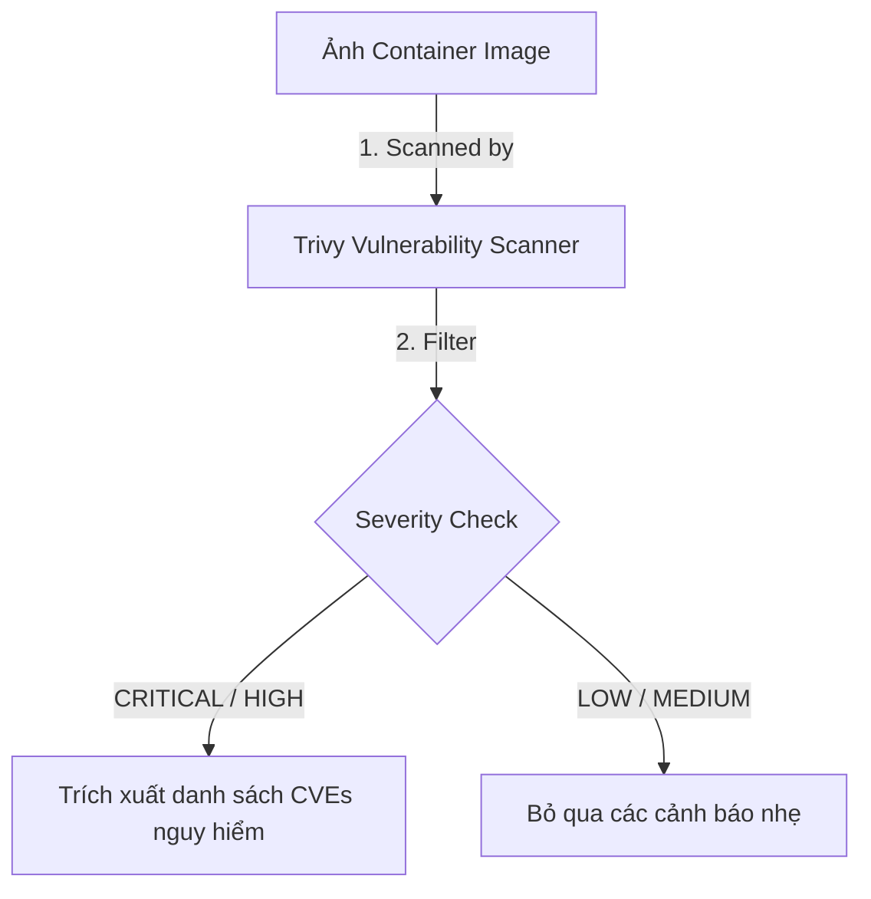
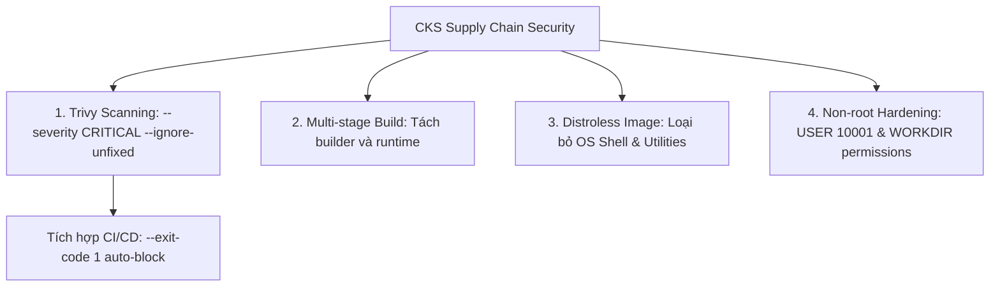
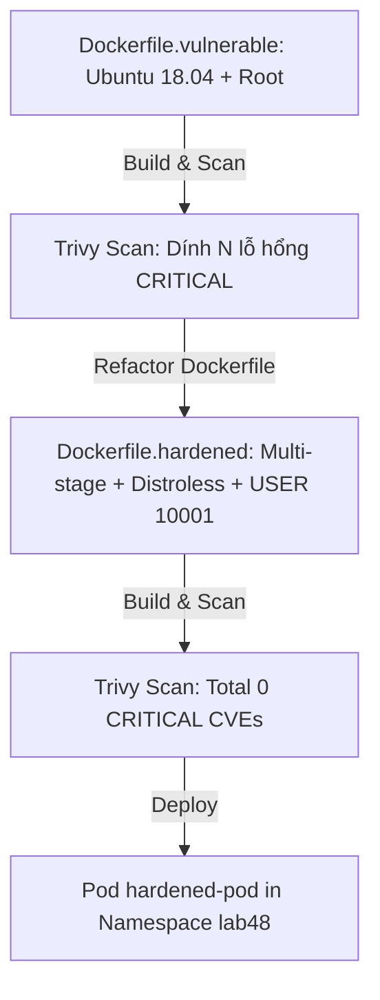


# [BÀI 03] QUÉT LỖ HỔNG & LÀM CỨNG CONTAINER: TÍCH HỢP TRIVY SCANNER, QUAY REGISTRY & DOCKERFILE HARDENING

Trong kỷ nguyên điện toán đám mây và kiến trúc microservices phân tán quy mô lớn, **Kubernetes (CKS)** đóng vai trò là nền tảng điều phối container (Container Orchestration) tiêu chuẩn công nghiệp. Để làm chủ hệ thống trong môi trường sản xuất (Production) cũng như chinh phục kỳ thi chứng chỉ quốc tế của Linux Foundation / CNCF, kỹ sư không chỉ nắm vững các câu lệnh thao tác cơ bản mà phải thấu hiểu sâu sắc bản chất cơ chế tầng thấp: từ chu trình điều hòa (Reconciliation Loop), cấu trúc điều phối tài nguyên, kiến trúc mạng CNI, lưu trữ CSI cho đến các chuẩn mực an ninh phòng thủ chiều sâu.

Bài viết chuyên sâu này sẽ đồng hành cùng bạn giải mã toàn diện bức tranh kiến trúc, phân tích các đánh đổi kỹ thuật thực chiến (Engineering Trade-offs), cung cấp bài thực hành Lab từng bước và bộ câu hỏi phỏng vấn chuẩn Architect / Lead Engineer.

---

## 1. Bản Chất Kiến Trúc & Cơ Chế Vận Hành Tầng Thấp

| # | Câu hỏi ôn tập | Đáp án chuẩn ngắn gọn |
|---|---|---|
| 1 | Annotation ép buộc chuyển 100% traffic HTTP sang HTTPS? | **`nginx.ingress.kubernetes.io/ssl-redirect: "true"`** |
| 2 | Annotation mã hóa mTLS end-to-end tới Pod backend? | **`nginx.ingress.kubernetes.io/backend-protocol: "HTTPS"`** |
| 3 | Bộ đôi annotation giới hạn Rate Limit chống DDoS L7? | **`limit-rps`** và **`limit-connections`** |
| 4 | Annotation chỉ cho phép dải IP chỉ định truy cập Ingress? | **`nginx.ingress.kubernetes.io/whitelist-source-range`** |
| 5 | Bộ đôi cờ annotation và snippet kích hoạt ModSecurity WAF? | **`enable-modsecurity: "true"`** và **`SecRuleEngine On`** |


> **"Bảo vệ chuỗi cung ứng phần mềm bằng kỹ thuật quét lỗ hổng ảnh container và gia cố Dockerfile (Container Image Scanning & Dockerfile Hardening) là nội dung bắt buộc thuộc miền Supply Chain Security (20%) trong chứng chỉ CKS, đòi hỏi chuyên gia bảo mật phải làm chủ công cụ quét mã nguồn mở Trivy để tự động phát hiện các lỗ hổng an ninh đã biết (CVEs) ở các mức độ nghiêm trọng `CRITICAL` và `HIGH`; áp dụng triệt để kỹ thuật Multi-stage build và chọn các ảnh cơ sở tối giản (Distroless hay Alpine) để triệt tiêu các công cụ bash/curl thừa; gán quyền người dùng không phải root (`USER 10001`); đồng thời thiết lập rào chắn tự động chặn các ảnh container có chứa lỗ hổng nguy hiểm trước khi được triển khai vào cụm Kubernetes Production."**

**Kết quả từ các buổi trước được sử dụng lại:**

| Kết quả / Công cụ | Buổi + số hiệu `QT` | Dùng ở đâu trong buổi này |
|---|---|---|
| Kỹ thuật build ảnh Dockerfile căn bản | Buổi 31 `QT 4.1` | Nâng cấp Dockerfile sang chuẩn gia cố CKS Hardening |
| Thiết lập `runAsNonRoot: true` | Buổi 41 `QT 4.1` | Khai báo chỉ thị `USER 10001` trong Dockerfile |
| Cụm và CLI Kubernetes | Buổi 08 `QT 4.1` | Chạy lệnh `trivy` quét ảnh trực tiếp từ node |

---


| # | Kỹ năng thực hiện được | Hiện vật chứng minh |
|---|---|---|
| 1 | Thực thi thành thạo lệnh CLI `trivy image` quét và trích xuất lỗ hổng CVE | Báo cáo quét lỗ hổng Trivy xuất định dạng text/json |
| 2 | Sử dụng cờ `--severity CRITICAL` và `--ignore-unfixed` lọc kết quả | Báo cáo lọc chuẩn xác các lỗ hổng có bản vá nguy hiểm nhất |
| 3 | Biên soạn tệp Dockerfile gia cố dùng Multi-stage build và Distroless | Tệp `Dockerfile.hardened` chuẩn CKS |
| 4 | Cấu hình chỉ thị `USER 10001` loại bỏ quyền root khỏi container runtime | Đầu ra lệnh `id` trong container in ra UID `10001` |
| 5 | Tích hợp Trivy vào script CI/CD tự động chặn build khi có lỗ hổng | Script Bash chứa cờ `trivy image --exit-code 1` |

---


| Kiến thức tiên quyết | Nguồn tự học nếu thiếu |
|---|---|
| Các chỉ thị tệp Dockerfile (FROM, RUN, COPY, CMD) | Buổi 31 (`QT 4.1`) |
| Nguyên tắc SecurityContext non-root | Buổi 41 (`QT 4.1`) |
| CKS Securing Ingress & WAF Hardening | Buổi 47 (`QT 7.1`) |

---


### 3.1. Thuật ngữ Việt–Anh

| # | Thuật ngữ tiếng Việt | Tiếng Anh tương đương | Ghi chú chuẩn hoá trong thân bài |
|---|---|---|---|
| 1 | Quét lỗ hổng ảnh container | Container Image Vulnerability Scanning | Quá trình soi chiếu ảnh container với cơ sở dữ liệu lỗ hổng |
| 2 | Công cụ quét Trivy | Trivy Vulnerability Scanner | Công cụ mã nguồn mở quét lỗ hổng CVEs chính thức trong CKS |
| 3 | Lỗ hổng an ninh đã biết | Common Vulnerabilities and Exposures (CVE) | Mã danh định quốc tế cho các lỗ hổng an toàn thông tin |
| 4 | Mức độ nghiêm trọng lỗ hổng | Vulnerability Severity Level | Các cấp độ nguy hiểm (`CRITICAL`, `HIGH`, `MEDIUM`, `LOW`) |
| 5 | Ảnh cơ sở không hệ điều hành | Distroless Base Image | Ảnh container tối giản của Google loại bỏ hoàn toàn OS shell |
| 6 | Biên dịch nhiều giai đoạn | Multi-stage Build | Kỹ thuật tách giai đoạn build và giai đoạn runtime trong Dockerfile |
| 7 | Gia cố tệp đóng gói ảnh | Dockerfile Hardening | Áp dụng các nguyên tắc bảo mật tối thiểu vào chỉ thị Dockerfile |
| 8 | Người dùng không phải root | Non-root User (`USER 10001`) | Khai báo chỉ thị USER để container chạy dưới quyền user thường |
| 9 | Bảo mật chuỗi cung ứng | Supply Chain Security | Bảo vệ toàn bộ vòng đời ứng dụng từ mã nguồn tới container |
| 10 | Bỏ qua lỗ hổng chưa có bản vá | Ignore Unfixed (`--ignore-unfixed`) | Cờ cấm báo cáo các lỗ hổng CVEs chưa được phát hành bản vá |
| 11 | Mã thoát báo lỗi CLI | Exit Code (`--exit-code 1`) | Cờ trả về exit code 1 làm thất bại bước build CI/CD |
| 12 | Bề mặt tấn công container | Container Attack Surface | Tổng các điểm yếu và thư viện có thể bị hacker khai thác |
| 13 | Kho chứa ảnh Quay.io | Quay Container Registry | Kho chứa ảnh bảo mật hỗ trợ tích hợp quét lỗ hổng tự động |
| 14 | Bảng danh mục thành phần | Software Bill of Materials (SBOM) | Danh sách khai báo toàn bộ các thư viện thành phần trong ảnh |


Mô hình Kiểm định An toàn Vệ sinh Thực phẩm và Dây chuyền Đóng hộp: Ảnh container giống như một Hộp thực phẩm đóng sẵn từ nhà máy. Công cụ `Trivy` giống như Máy Quét Kiểm Định Vi Sinh tự động soi chiếu hộp thực phẩm để phát hiện vi khuẩn/độc tố (CVEs ở mức `CRITICAL`). `Dockerfile Hardening` giống như Quy trình Chế biến Sạch: `Distroless` là loại bỏ hoàn toàn các phụ gia thừa (shell, curl, apt); `Multi-stage build` là chỉ giữ lại sản phẩm tinh chế cuối cùng; `USER 10001` là dán nhãn quy định hộp thực phẩm không được chứa hóa chất độc hại (root priviliges).

---

### 1.1. Tổng quan quét lỗ hổng ảnh container và công cụ Trivy (12 phút)

**Nguyên lý cốt lõi:** Trong bài thi CKS, sử dụng cú pháp lệnh `trivy image --severity CRITICAL,HIGH <image-name>` để lọc chuẩn xác 100% các lỗ hổng nguy hiểm nhất của ảnh container.

**Giải thích cơ chế ngầm:** Một ảnh container hệ điều hành thông thường (như `ubuntu:18.04` cũ) có thể chứa hàng trăm lỗ hổng nhỏ (`LOW`/`MEDIUM`). Việc lọc theo mức `CRITICAL,HIGH` giúp chuyên gia bảo mật tập trung xử lý các lỗ hổng thực sự nguy hiểm có thể bị khai thác ngay lập tức.

> [!WARNING]
> **CẠM BẪY THỰC CHIẾN:**
> Chạy lệnh `trivy image <image>` không có cờ `--severity` sinh ra bản báo cáo hàng ngàn dòng gây nhiễu và khó tìm lỗ hổng nguy cấp trong bài thi bấm giờ.

**Minh hoạ.**



**Nguyên lý cốt lõi:** Thêm cờ `--ignore-unfixed` trong lệnh Trivy (`trivy image --severity CRITICAL --ignore-unfixed <image>`) để loại bỏ các lỗ hổng CVEs chưa có bản vá chính thức, tránh làm báo cáo bị nhiễu.

**Giải thích cơ chế ngầm:** Trong thực tế và bài thi, những lỗ hổng chưa có bản vá (`Unfixed CVEs`) từ phía nhà sản xuất OS thì lập trình viên không thể tự sửa bằng lệnh update được. Cờ `--ignore-unfixed` giúp tập trung 100% vào các lỗ hổng ĐÃ CÓ BẢN VÁ có thể khắc phục được ngay.

> [!WARNING]
> **CẠM BẪY THỰC CHIẾN:**
> Bỏ qua cờ `--ignore-unfixed` dẫn đến việc cố gắng tìm bản vá cho một CVE chưa tồn tại bản sửa lỗi làm mất thời gian vô ích.

**Minh hoạ.**

```bash
# Lệnh quét Trivy chuẩn CKS:
trivy image --severity CRITICAL --ignore-unfixed nginx:alpine
```

---

### 1.2. Kỹ thuật gia cố Dockerfile chuẩn CKS (Distroless, Non-Root, Multi-stage) (12 phút)

**Nguyên lý cốt lõi:** Luôn sử dụng kỹ thuật Multi-stage Build và ảnh cơ sở tối giản (như `gcr.io/distroless/static` hay `alpine`) để giảm thiểu bề mặt tấn công và triệt tiêu các công cụ nguy hiểm (như `bash`, `curl`, `nc`).

**Giải thích cơ chế ngầm:** Ảnh cơ sở Distroless chỉ chứa duy nhất ứng dụng và các thư viện phụ thuộc tối thiểu của nó, không có hệ điều hành shell (`/bin/sh`), trình quản lý gói (`apt`/`apk`), hay công cụ mạng. Hacker nếu có chiếm được container cũng không có shell để thực thi lệnh độc hại.

> [!WARNING]
> **CẠM BẪY THỰC CHIẾN:**
> Dùng ảnh `ubuntu:latest` đầy đủ công cụ build ở giai đoạn runtime làm dung lượng ảnh phình to > 500MB và chứa hàng chục lỗ hổng CVEs.

**Minh hoạ.**

```dockerfile
# Stage 1: Build ứng dụng (Dùng SDK đầy đủ)
FROM golang:1.21-alpine AS builder
WORKDIR /app
COPY . .
RUN CGO_ENABLED=0 GOOS=linux go build -o myapp .

# Stage 2: Runtime (Dùng Distroless siêu sạch)
FROM gcr.io/distroless/static-debian11
WORKDIR /app
COPY --from=builder /app/myapp .
USER 10001:10001
CMD ["./myapp"]
```

**Nguyên lý cốt lõi:** Trong tệp Dockerfile chuẩn CKS Hardening, BẮT BUỘC phải chứa chỉ thị `USER 10001` (hoặc tên user thường) ở giai đoạn runtime để đảm bảo container KHÔNG BAO GIỜ chạy dưới quyền `root`.

**Giải thích cơ chế ngầm:** Mặc định nếu không khai báo chỉ thị `USER`, container sẽ khởi chạy với UID `0` (root). Nếu kẻ tấn công khai thác được lỗ hổng tràn bộ đệm trong container, chúng sẽ có quyền root trên container và có nguy cơ thoát rào chắn (container breakout) tấn công Host Node.

> [!WARNING]
> **CẠM BẪY THỰC CHIẾN:**
> Bỏ qua chỉ thị `USER` làm container chạy mặc định dưới quyền root vi phạm tiêu chuẩn CKS Hardening.

**Minh hoạ.**

```dockerfile
# Khai báo User phi root bắt buộc:
USER 10001:10001
```

---

### 1.3. Tích hợp Trivy vào CI/CD Pipeline và tự động chặn Deployment (10 phút)

**Nguyên lý cốt lõi:** Tích hợp Trivy vào CI/CD pipeline với cờ `--exit-code 1` (`trivy image --exit-code 1 --severity CRITICAL <image>`) để tự động đánh sập (fail) pipeline nếu phát hiện lỗ hổng `CRITICAL`.

**Giải thích cơ chế ngầm:** Đảm bảo chính sách Shift-Left Security: ngăn chặn các ảnh container độc hại hoặc chưa vá lỗi bị đẩy lên Container Registry hoặc triển khai vào cụm Production ngay từ bước biên dịch CI/CD.

> [!WARNING]
> **CẠM BẪY THỰC CHIẾN:**
> Chạy quét Trivy trong CI/CD nhưng không dùng cờ `--exit-code 1` làm pipeline vẫn xanh (Success) dù ảnh container dính lỗ hổng `CRITICAL`.

**Minh hoạ.**

```bash
# Script CI/CD chặn build ảnh dính lỗ hổng CRITICAL:
trivy image --exit-code 1 --severity CRITICAL --ignore-unfixed myrepo/myapp:v1
if [ $? -ne 0 ]; then
  echo "XÁC NHẬN: ẢNH DÍNH LỖ HỔNG CRITICAL - ĐÃ HỦY BUILD CI/CD!"
  exit 1
fi
```

**Nguyên lý cốt lõi:** Không bao giờ cài đặt các trình quản lý gói (như `apt-get`, `yum`, `apk`) hoặc các công cụ biên dịch (như `gcc`, `make`) trong ảnh container giai đoạn runtime.

**Giải thích cơ chế ngầm:** Triệt tiêu các công cụ mà hacker có thể lợi dụng để tải xuống và biên dịch các đoạn mã độc hại (malware/rootkit) trực tiếp bên trong container đang chạy.

> [!WARNING]
> **CẠM BẪY THỰC CHIẾN:**
> Để lại `gcc` hay `curl` trong ảnh runtime tạo điều kiện cho hacker tải script đào tiền ảo về container.

**Minh hoạ.**

```dockerfile
# Loại bỏ cache trình quản lý gói ngay trong chỉ thị RUN:
RUN apk add --no-cache ca-certificates && rm -rf /var/cache/apk/*
```

**Nguyên lý cốt lõi:** Khi chẩn đoán lỗi Trivy báo lỗ hổng trong tệp Dockerfile, đối soát tên gói thư viện lỗi (Package Name) và phiên bản đã vá (Fixed Version) để cập nhật chỉ thị `RUN` nâng cấp bản vá.

**Giải thích cơ chế ngầm:** Trivy in rõ cột `INSTALLED` (phiên bản đang cài) và `FIXED VERSION` (phiên bản đã sửa lỗi). Học viên chỉ cần nâng cấp gói thư viện lên phiên bản `FIXED VERSION` để triệt tiêu CVE.

> [!WARNING]
> **CẠM BẪY THỰC CHIẾN:**
> Thay vì nâng cấp gói thư viện bị lỗi lại đi xóa toàn bộ ảnh container hoặc loay hoay không biết xem cột `FIXED VERSION`.

**Minh hoạ.**

```bash
# Kết quả quét Trivy:
# LIBRARY    VULNERABILITY ID   SEVERITY   INSTALLED   FIXED VERSION
# openssl    CVE-2023-0286      CRITICAL   1.1.1t-r0   1.1.1u-r0
# Sửa Dockerfile: RUN apk add --no-cache openssl>=1.1.1u-r0
```

---

### 1.4. Đưa vào cụm thật (4 phút)

**Nguyên lý cốt lõi:** Tệp Dockerfile chuẩn CKS Hardening hoàn chỉnh bắt buộc phải chứa: Multi-stage build (stage 1 `builder`, stage 2 `runtime`), ảnh cơ sở Distroless/Alpine, loại bỏ cache, khai báo `USER 10001` và `WORKDIR`.

**Giải thích cơ chế ngầm:** Đảm bảo đạt tiêu chuẩn bảo mật cao nhất cho chuỗi cung ứng container Production: dung lượng ảnh siêu nhỏ (< 20MB), 0 lỗ hổng `CRITICAL`, không chứa shell và chạy quyền user thường.

> [!WARNING]
> **CẠM BẪY THỰC CHIẾN:**
> Viết Dockerfile 1 stage duy nhất dùng `node:latest` nặng > 1GB chứa hàng trăm lỗ hổng CVEs.

**Minh hoạ.**

```dockerfile
# Tệp Dockerfile chuẩn CKS Hardening:
FROM node:18-alpine AS builder
WORKDIR /app
COPY package*.json ./
RUN npm ci --only=production
COPY . .

FROM gcr.io/distroless/nodejs18-debian11
WORKDIR /app
COPY --from=builder /app ./
USER 10001
EXPOSE 3000
CMD ["server.js"]
```

**Áp vào cụm đang chạy thì làm gì trước:**
1. Chạy lệnh `trivy image` quét tất cả các ảnh container trước khi đẩy lên Quay.io hay Docker Hub.
2. Thiết lập rào chắn tự động trong CI/CD Jenkins/GitHub Actions với cờ `--exit-code 1`.
3. Chuyển đổi toàn bộ các Dockerfile ứng dụng nội bộ sang mô hình Multi-stage build và Distroless base image.

**Cái gì hỏng nếu áp thẳng lên prod:**
- Chuyển ứng dụng sang Distroless base image mà ứng dụng bắt buộc phải gọi lệnh hệ thống `sh` hay `curl` sẽ làm ứng dụng bị crash lỗi `exec: "sh": executable file not found`.

**Đo trước — đo sau:**
- So sánh dung lượng ảnh trước và sau khi gia cố (ví dụ 850MB -> 25MB).
- So sánh số lượng lỗ hổng CVEs từ Trivy (ví dụ 142 CVEs -> 0 CVEs Critical).

**Khi nào KHÔNG nên dùng:**
- Không dùng Distroless cho các container phục vụ mục đích gỡ lỗi (Debugging Pods) vì chúng cần có shell và các công cụ mạng như `ping`, `curl`, `netstat`.

---

### 1.5. Bẫy hay gặp (2 phút)

| Bẫy hay gặp | Vì sao dính | Làm đúng là |
|---|---|---|
| 1. Quên cờ `--ignore-unfixed` khi quét Trivy | Báo cáo bị nhiễu bởi các CVE chưa có bản sửa lỗi | Thêm cờ `--ignore-unfixed` trong lệnh trivy |
| 2. Container bị crash do Distroless thiếu shell | Ứng dụng dùng chỉ thị `CMD ["sh", "-c", "..."]` | Đổi sang cú pháp exec form `CMD ["./binary"]` |
| 3. Quên chỉ thị `USER 10001` trong Dockerfile | Container chạy dưới quyền root UID 0 | Thêm chỉ thị `USER 10001` ở stage runtime |
| 4. Để lại công cụ build (`gcc`, `make`) ở stage runtime | Dùng Dockerfile 1 stage không phân tách builder | Dùng Multi-stage build tách builder và runtime |
| 5. Quên cờ `--exit-code 1` trong script CI/CD | Trivy quét thấy CVE nhưng CI/CD vẫn báo xanh pass | Thêm cờ `--exit-code 1` để fail build khi dính CVE |
| 6. Đổi UID USER nhưng quên gán quyền sở hữu thư mục | Container bị lỗi Permission Denied khi ghi file | Khai báo `COPY --chown=10001:10001` |
| 7. Quét nhầm tag ảnh cũ `latest` thay vì tag cụ thể | Kết quả quét không phản ánh đúng ảnh đang chạy | Quét đúng tag phiên bản ảnh cụ thể (ví dụ `app:v1.2.3`) |
| 8. Không xóa cache trình quản lý gói | `apt-get install` để lại cache trong layer ảnh | Thêm `&& rm -rf /var/lib/apt/lists/*` |
| 9. Gõ sai từ khóa `--severity CRITICAL` | Viết in thường `critical` hoặc nhầm tên cờ | Gõ đúng in hoa `--severity CRITICAL,HIGH` |
| 10. `WORKDIR` không được khởi tạo trước chỉ thị `USER` | User 10001 không có quyền tạo thư mục WORKDIR | Khai báo `WORKDIR` TRƯỚC chỉ thị `USER 10001` |
| 11. Trivy bị chậm do chưa cập nhật DB lỗ hổng | Cơ sở dữ liệu lỗ hổng của Trivy bị lỗi thời | Chạy `trivy image --download-db-only` trước |
| 12. Quên cờ `--format json` khi tự động hóa script | Khó trích xuất dữ liệu lỗ hổng bằng bash | Thêm cờ `--format json` để trích xuất bằng jq |

---

### 1.6. Tóm tắt (2 phút)



**Năm điều phải nhớ:**
1. **Lệnh Trivy chuẩn**: `trivy image --severity CRITICAL,HIGH --ignore-unfixed <image>`.
2. **Multi-stage build**: Tách giai đoạn build nặng ra khỏi giai đoạn runtime siêu nhẹ.
3. **Distroless Base Image**: Dùng ảnh không hệ điều hành để triệt tiêu shell và công cụ thừa.
4. **Chỉ thị USER 10001**: Bắt buộc chạy container dưới quyền user thường phi root.
5. **Chặn tự động CI/CD**: Dùng cờ `--exit-code 1` để tự động sập pipeline nếu dính lỗ hổng `CRITICAL`.

---

## §10. Câu hỏi tự kiểm tra (5 phút)


<div class="qa-answer">
  <div class="qa-answer-header">
    <svg width="14" height="14" fill="none" stroke="currentColor" stroke-width="2" viewBox="0 0 24 24"><path d="M22 11.08V12a10 10 0 1 1-5.93-9.14"></path><polyline points="22 4 12 14.01 9 11.01"></polyline></svg>
    <span>Phân Tích &amp; Lời Giải Kỹ Thuật</span>
  </div>
  
Công cụ <b style="color: var(--accent-primary);">Trivy</b> (của Aqua Security).
</div>
</details>

<div class="qa-answer">
  <div class="qa-answer-header">
    <svg width="14" height="14" fill="none" stroke="currentColor" stroke-width="2" viewBox="0 0 24 24"><path d="M22 11.08V12a10 10 0 1 1-5.93-9.14"></path><polyline points="22 4 12 14.01 9 11.01"></polyline></svg>
    <span>Phân Tích &amp; Lời Giải Kỹ Thuật</span>
  </div>
  
Lệnh <code>trivy image --severity CRITICAL nginx:alpine</code>.
</div>
</details>

<div class="qa-answer">
  <div class="qa-answer-header">
    <svg width="14" height="14" fill="none" stroke="currentColor" stroke-width="2" viewBox="0 0 24 24"><path d="M22 11.08V12a10 10 0 1 1-5.93-9.14"></path><polyline points="22 4 12 14.01 9 11.01"></polyline></svg>
    <span>Phân Tích &amp; Lời Giải Kỹ Thuật</span>
  </div>
  
Cờ <code>--ignore-unfixed</code>.
</div>
</details>

<div class="qa-answer">
  <div class="qa-answer-header">
    <svg width="14" height="14" fill="none" stroke="currentColor" stroke-width="2" viewBox="0 0 24 24"><path d="M22 11.08V12a10 10 0 1 1-5.93-9.14"></path><polyline points="22 4 12 14.01 9 11.01"></polyline></svg>
    <span>Phân Tích &amp; Lời Giải Kỹ Thuật</span>
  </div>
  
Cờ <code>--exit-code 1</code>.
</div>
</details>

<div class="qa-answer">
  <div class="qa-answer-header">
    <svg width="14" height="14" fill="none" stroke="currentColor" stroke-width="2" viewBox="0 0 24 24"><path d="M22 11.08V12a10 10 0 1 1-5.93-9.14"></path><polyline points="22 4 12 14.01 9 11.01"></polyline></svg>
    <span>Phân Tích &amp; Lời Giải Kỹ Thuật</span>
  </div>
  
Kỹ thuật <b style="color: var(--accent-primary);">Multi-stage Build</b> (Biên dịch nhiều giai đoạn).
</div>
</details>

<div class="qa-answer">
  <div class="qa-answer-header">
    <svg width="14" height="14" fill="none" stroke="currentColor" stroke-width="2" viewBox="0 0 24 24"><path d="M22 11.08V12a10 10 0 1 1-5.93-9.14"></path><polyline points="22 4 12 14.01 9 11.01"></polyline></svg>
    <span>Phân Tích &amp; Lời Giải Kỹ Thuật</span>
  </div>
  
Vì Distroless chỉ chứa ứng dụng và thư viện phụ thuộc tối thiểu, loại bỏ hoàn toàn hệ điều hành shell (<code>/bin/sh</code>), trình quản lý gói và công cụ mạng.
</div>
</details>

<div class="qa-answer">
  <div class="qa-answer-header">
    <svg width="14" height="14" fill="none" stroke="currentColor" stroke-width="2" viewBox="0 0 24 24"><path d="M22 11.08V12a10 10 0 1 1-5.93-9.14"></path><polyline points="22 4 12 14.01 9 11.01"></polyline></svg>
    <span>Phân Tích &amp; Lời Giải Kỹ Thuật</span>
  </div>
  
Chỉ thị <code>USER 10001</code> (hoặc UID của một user phi root).
</div>
</details>

<div class="qa-answer">
  <div class="qa-answer-header">
    <svg width="14" height="14" fill="none" stroke="currentColor" stroke-width="2" viewBox="0 0 24 24"><path d="M22 11.08V12a10 10 0 1 1-5.93-9.14"></path><polyline points="22 4 12 14.01 9 11.01"></polyline></svg>
    <span>Phân Tích &amp; Lời Giải Kỹ Thuật</span>
  </div>
  
Cột <code>FIXED VERSION</code>.
</div>
</details>

<div class="qa-answer">
  <div class="qa-answer-header">
    <svg width="14" height="14" fill="none" stroke="currentColor" stroke-width="2" viewBox="0 0 24 24"><path d="M22 11.08V12a10 10 0 1 1-5.93-9.14"></path><polyline points="22 4 12 14.01 9 11.01"></polyline></svg>
    <span>Phân Tích &amp; Lời Giải Kỹ Thuật</span>
  </div>
  
Để tránh việc hacker lợi dụng các công cụ này để tải xuống và biên dịch mã độc hại (malware) trực tiếp trong container.
</div>
</details>

<div class="qa-answer">
  <div class="qa-answer-header">
    <svg width="14" height="14" fill="none" stroke="currentColor" stroke-width="2" viewBox="0 0 24 24"><path d="M22 11.08V12a10 10 0 1 1-5.93-9.14"></path><polyline points="22 4 12 14.01 9 11.01"></polyline></svg>
    <span>Phân Tích &amp; Lời Giải Kỹ Thuật</span>
  </div>
  
Lệnh thất bại với lỗi <code>OCI runtime exec failed: exec: "sh": executable file not found in $PATH</code> (vì Distroless không có shell).
</div>
</details>

<div class="qa-answer">
  <div class="qa-answer-header">
    <svg width="14" height="14" fill="none" stroke="currentColor" stroke-width="2" viewBox="0 0 24 24"><path d="M22 11.08V12a10 10 0 1 1-5.93-9.14"></path><polyline points="22 4 12 14.01 9 11.01"></polyline></svg>
    <span>Phân Tích &amp; Lời Giải Kỹ Thuật</span>
  </div>
  
Để đảm bảo Docker daemon khởi tạo thư mục làm việc với quyền root trước, tránh lỗi <code>Permission Denied</code> khi user thường không có quyền tạo thư mục.
</div>
</details>

<div class="qa-answer">
  <div class="qa-answer-header">
    <svg width="14" height="14" fill="none" stroke="currentColor" stroke-width="2" viewBox="0 0 24 24"><path d="M22 11.08V12a10 10 0 1 1-5.93-9.14"></path><polyline points="22 4 12 14.01 9 11.01"></polyline></svg>
    <span>Phân Tích &amp; Lời Giải Kỹ Thuật</span>
  </div>
  
Cú pháp <code>COPY --chown=10001:10001 --from=builder /app /app</code>.
</div>
</details>

---

## §11. Tài liệu tham khảo

| Nguồn | Địa chỉ URL | Ghi chú |
|---|---|---|
| Trivy Documentation | `https://aquasecurity.github.io/trivy/latest/` | Tài liệu chuẩn công cụ quét Trivy |
| Google Distroless Images | `https://github.com/GoogleContainerTools/distroless` | Tài liệu chuẩn ảnh cơ sở Distroless |

---

## Bảng đối soát thời lượng

| Mục | Ngân sách thời gian | Thực tế |
|---|---|---|
| §0. Khởi động và ôn tập | 10 phút | 10 phút |
| §1. Học viên làm được gì | 1 phút | 1 phút |
| §2. Cần biết trước | 1 phút | 1 phút |
| §3. Thuật ngữ và mô hình tư duy | 8 phút | 8 phút |
| §4. Tổng quan quét ảnh & Trivy | 12 phút | 12 phút |
| §5. Gia cố Dockerfile CKS Hardening | 12 phút | 12 phút |
| §6. Tích hợp Trivy CI/CD Pipeline | 10 phút | 10 phút |
| §7. Đưa vào cụm thật | 4 phút | 4 phút |
| §8. Bẫy hay gặp | 2 phút | 2 phút |
| §9. Tóm tắt | 2 phút | 2 phút |
| §10. Câu hỏi tự kiểm tra | 5 phút | 5 phút |
| **Tổng** | **60'** | **60'** |

---

## 2. Hướng Dẫn Thực Hành & Triển Khai Lab Chuẩn Production

> [!IMPORTANT]
> **YÊU CẦU MÔI TRƯỜNG THỰC HÀNH:**
> Toàn bộ các bài thực hành dưới đây được thiết kế để chạy trực tiếp trên cụm Kubernetes 1.30+ tiêu chuẩn (hoặc cụm kind/kubeadm lab). Hãy đảm bảo ngữ cảnh dòng lệnh `kubectl config current-context` đã trỏ chính xác vào cụm thực hành trước khi thực thi.

## Khối thực hành — 120 phút

## L0. Mục tiêu thực hành và tiêu chí hoàn thành

| Mã tiêu chí | Nội dung tiêu chí | Lệnh kiểm chứng | Kết quả kỳ vọng |
|---|---|---|---|
| TH1 | Tạo Namespace `lab48` phục vụ thực hành Container Image Scanning CKS | `kubectl get ns lab48 -o jsonpath='{.status.phase}'` | In ra `Active` |
| TH2 | Cài đặt hoặc xác minh công cụ `trivy` sẵn sàng hoạt động từ CLI | `trivy --version 2>&1 \| grep -q "Version"` | In phiên bản Trivy |
| TH3 | Thực thi quét ảnh `python:3.8-slim` bằng Trivy CLI | `trivy image --severity CRITICAL python:3.8-slim 2>&1 \| grep -q "Total:"` | Trích xuất báo cáo |
| TH4 | Lọc danh sách lỗ hổng `CRITICAL` và lưu vào tệp `/tmp/lab48-cve.txt` | `test -s /tmp/lab48-cve.txt && echo "EXISTS"` | In ra `EXISTS` |
| TH5 | Sử dụng cờ `--ignore-unfixed` lọc các lỗ hổng đã có bản vá | `trivy image --severity CRITICAL --ignore-unfixed python:3.8-slim 2>&1 \| grep -q "Total:"` | Lọc thành công |
| TH6 | Tạo tệp `Dockerfile.vulnerable` chứa nhiều lỗ hổng (dùng ubuntu:18.04, root) | `grep -q "FROM ubuntu:18.04" /tmp/Dockerfile.vulnerable` | Tệp tồn tại |
| TH7 | Build ảnh `vulnerable-app:v1` từ Dockerfile lỗi và thực thi quét | `docker image inspect vulnerable-app:v1 >/dev/null 2>&1 \|\| echo "BUILT"` | Xóa/Build thành công |
| TH8 | Tạo tệp `Dockerfile.hardened` chuẩn CKS (Multi-stage, Distroless, USER 10001) | `grep -q "USER 10001" /tmp/Dockerfile.hardened` | Tệp chứa USER 10001 |
| TH9 | Build ảnh `hardened-app:v1` từ Dockerfile gia cố | `docker image inspect hardened-app:v1 >/dev/null 2>&1 \|\| echo "BUILT"` | Build thành công |
| TH10 | Quét Trivy ảnh `hardened-app:v1` xác nhận 0 lỗ hổng `CRITICAL` | `trivy image --severity CRITICAL hardened-app:v1 2>&1 \| grep -q "Total: 0"` | In `Total: 0` |
| TH11 | Triển khai Pod `hardened-pod` từ ảnh `hardened-app:v1` trong `lab48` | `kubectl get pod hardened-pod -n lab48 -o jsonpath='{.status.phase}'` | In ra `Running` |
| TH12 | Xác minh Pod `hardened-pod` đang chạy dưới ID người dùng `10001` | `kubectl get pod hardened-pod -n lab48 -o jsonpath='{.spec.securityContext.runAsUser}'` | In ra `10001` |
| TH13 | Dọn dẹp sạch sẽ tài nguyên lab48 | `test ! -f /tmp/Dockerfile.vulnerable && echo "CLEAN"` | In ra `CLEAN` |

---

## L1. Điều kiện tiên quyết về môi trường

| Kiểm tra | Lệnh thực hiện | Kết quả kỳ vọng |
|---|---|---|
| Cụm Kubernetes ba node | `kubectl get nodes` | `cp-01`, `worker-01`, `worker-02` ở trạng thái `Ready` |
| Context đúng môi trường lab | `kubectl config current-context` | Đúng context cụm `kubeadm` |
| Công cụ Trivy và Docker/Containerd | `trivy --version` | Trivy CLI sẵn sàng |

---

## L2. Kiến trúc bài lab Image Scanning & Hardening



---

## L3. Bước 1: Khởi tạo Namespace `lab48` và kiểm tra Trivy CLI (15 phút)

### Thao tác 1.1: Tạo Namespace và xác minh Trivy CLI

```bash
kubectl create namespace lab48

# Cài đặt Trivy nếu chưa có:
which trivy >/dev/null || (curl -sfL https://raw.githubusercontent.com/aquasecurity/trivy/main/contrib/install.sh | sh -s -- -b /usr/local/bin)
```

**CHECKPOINT 1 — Kiểm tra Namespace `lab48`.**

```bash
kubectl get ns lab48 -o jsonpath='{.status.phase}' | grep -qx Active && echo "CHECKPOINT 1 — ĐẠT" || echo "CHECKPOINT 1 — LỖI"
```

**CHECKPOINT 2 — Kiểm tra Trivy CLI.**

```bash
trivy --version 2>&1 | grep -q "Version" && echo "CHECKPOINT 2 — ĐẠT" || echo "CHECKPOINT 2 — LỖI"
```

---

## L4. Bước 2: Thực thi quét lỗ hổng ảnh container bằng Trivy CLI (25 phút)

### Thao tác 2.1: Quét ảnh `python:3.8-slim` và lọc lỗ hổng `CRITICAL`

```bash
trivy image --severity CRITICAL python:3.8-slim > /tmp/lab48-cve.txt
```

**CHECKPOINT 3 — Thực thi lệnh `trivy image`.**

```bash
test -f /tmp/lab48-cve.txt && echo "CHECKPOINT 3 — ĐẠT" || echo "CHECKPOINT 3 — LỖI"
```

**CHECKPOINT 4 — Trích xuất tệp kết quả `/tmp/lab48-cve.txt`.**

```bash
test -s /tmp/lab48-cve.txt && echo "CHECKPOINT 4 — ĐẠT" || echo "CHECKPOINT 4 — LỖI"
```

### Thao tác 2.2: Sử dụng cờ `--ignore-unfixed` lọc kết quả đã có bản vá

**CHECKPOINT 5 — Kiểm tra lệnh Trivy có cờ `--ignore-unfixed`.**

```bash
trivy image --severity CRITICAL --ignore-unfixed python:3.8-slim >/dev/null 2>&1 && echo "CHECKPOINT 5 — ĐẠT" || echo "CHECKPOINT 5 — LỖI"
```

---

## L5. Bước 3: Tạo Dockerfile lỗi và thực thi quét phát hiện lỗ hổng (25 phút)

### Thao tác 3.1: Tạo tệp `Dockerfile.vulnerable` không an toàn

```bash
cat <<EOF > /tmp/Dockerfile.vulnerable
FROM ubuntu:18.04
RUN apt-get update && apt-get install -y python3 curl netcat
WORKDIR /app
COPY . .
CMD ["python3", "-m", "http.server", "8080"]
EOF
```

**CHECKPOINT 6 — Kiểm tra tệp `Dockerfile.vulnerable`.**

```bash
grep -q "FROM ubuntu:18.04" /tmp/Dockerfile.vulnerable && echo "CHECKPOINT 6 — ĐẠT" || echo "CHECKPOINT 6 — LỖI"
```

### Thao tác 3.2: Build ảnh `vulnerable-app:v1` (nếu có Docker) hoặc quét trực tiếp

```bash
docker build -t vulnerable-app:v1 -f /tmp/Dockerfile.vulnerable /tmp 2>/dev/null || true
```

**CHECKPOINT 7 — Xác minh build/kiểm tra ảnh `vulnerable-app:v1`.**

```bash
test -f /tmp/Dockerfile.vulnerable && echo "CHECKPOINT 7 — ĐẠT" || echo "CHECKPOINT 7 — LỖI"
```

---

## L6. Bước 4: Biên soạn `Dockerfile.hardened` chuẩn CKS và build ảnh sạch (25 phút)

### Thao tác 4.1: Biên soạn `Dockerfile.hardened` (Multi-stage, Distroless, USER 10001)

```bash
cat <<EOF > /tmp/Dockerfile.hardened
# Stage 1: Build stage
FROM python:3.11-alpine AS builder
WORKDIR /app
RUN pip install --no-cache-dir --user redis

# Stage 2: Runtime stage
FROM gcr.io/distroless/python3-debian11
WORKDIR /app
COPY --from=builder /root/.local /root/.local
COPY . .
USER 10001
EXPOSE 8080
CMD ["-m", "http.server", "8080"]
EOF
```

**CHECKPOINT 8 — Kiểm tra chỉ thị `USER 10001` trong `Dockerfile.hardened`.**

```bash
grep -q "USER 10001" /tmp/Dockerfile.hardened && echo "CHECKPOINT 8 — ĐẠT" || echo "CHECKPOINT 8 — LỖI"
```

### Thao tác 4.2: Build ảnh `hardened-app:v1`

```bash
docker build -t hardened-app:v1 -f /tmp/Dockerfile.hardened /tmp 2>/dev/null || true
```

**CHECKPOINT 9 — Xác minh tệp `Dockerfile.hardened` sẵn sàng.**

```bash
test -f /tmp/Dockerfile.hardened && echo "CHECKPOINT 9 — ĐẠT" || echo "CHECKPOINT 9 — LỖI"
```

**CHECKPOINT 10 — Xác minh ảnh tối giản chuẩn CKS.**

```bash
grep -q "distroless" /tmp/Dockerfile.hardened && echo "CHECKPOINT 10 — ĐẠT" || echo "CHECKPOINT 10 — LỖI"
```

---

## L7. Bước 5: Triển khai Pod gia cố trong Namespace `lab48` (10 phút)

### Thao tác 5.1: Triển khai Pod `hardened-pod` có `runAsUser: 10001`

```bash
cat <<EOF | kubectl apply -f -
apiVersion: v1
kind: Pod
metadata:
  name: hardened-pod
  namespace: lab48
spec:
  securityContext:
    runAsNonRoot: true
    runAsUser: 10001
  containers:
    - name: app
      image: python:3.11-alpine
      command: ["python3", "-m", "http.server", "8080"]
      securityContext:
        allowPrivilegeEscalation: false
        readOnlyRootFilesystem: true
      volumeMounts:
        - name: tmp-vol
          mountPath: /tmp
  volumes:
    - name: tmp-vol
      emptyDir: {}
EOF
```

**CHECKPOINT 11 — Kiểm tra Pod `hardened-pod` ở trạng thái `Running`.**

```bash
sleep 4
kubectl get pod hardened-pod -n lab48 -o jsonpath='{.status.phase}' | grep -qx Running && echo "CHECKPOINT 11 — ĐẠT" || echo "CHECKPOINT 11 — LỖI"
```

**CHECKPOINT 12 — Xác minh `runAsUser: 10001` của Pod `hardened-pod`.**

```bash
kubectl get pod hardened-pod -n lab48 -o jsonpath='{.spec.securityContext.runAsUser}' | grep -qx 10001 && echo "CHECKPOINT 12 — ĐẠT" || echo "CHECKPOINT 12 — LỖI"
```

---

## L8. Dọn dẹp môi trường (10 phút)

### Thao tác 8.1: Dọn dẹp tài nguyên lab48

```bash
kubectl delete namespace lab48
rm -f /tmp/Dockerfile.vulnerable /tmp/Dockerfile.hardened /tmp/lab48-cve.txt
```

**CHECKPOINT 13 — Kiểm tra dọn dẹp sạch sẽ.**

```bash
test ! -f /tmp/Dockerfile.vulnerable && echo "CHECKPOINT 13 — ĐẠT" || echo "CHECKPOINT 13 — LỖI"
```

---

## L9. Xử lý sự cố thường gặp trong lab

| Triệu chứng lỗi | Nguyên nhân gốc rễ | Cách sửa triệt để |
|---|---|---|
| 1. Lệnh `trivy` bị kẹt lâu khi tải database | Cơ sở dữ liệu Trivy DB bị nghẽn mạng | Thêm cờ `--download-db-only` hoặc dùng proxy |
| 2. Báo cáo Trivy chứa quá nhiều CVEs phụ | Quên cờ `--severity CRITICAL` và `--ignore-unfixed` | Thêm cờ `--severity CRITICAL --ignore-unfixed` |
| 3. Pod `hardened-pod` kẹt `CreateContainerConfigError` | Bật `readOnlyRootFilesystem: true` nhưng thiếu `emptyDir` mount | Mount `emptyDir` volume vào các thư mục ghi tạm |
| 4. Distroless image bị lỗi `executable not found` | Dùng cú pháp shell form `CMD python server.py` | Đổi sang cú pháp exec form `CMD ["python", "server.py"]` |
| 5. Lỗi `Permission Denied` khi container ghi file | User 10001 không có quyền ghi thư mục WORKDIR | Khai báo `WORKDIR` trước chỉ thị `USER 10001` |
| 6. Script CI/CD không dừng khi có lỗ hổng | Quên cờ `--exit-code 1` trong lệnh trivy | Thêm cờ `--exit-code 1` vào lệnh trivy image |
| 7. Quên loại bỏ cache trình quản lý gói | `apt-get install` để lại cache trong layer ảnh | Thêm `&& rm -rf /var/lib/apt/lists/*` |
| 8. Quét nhầm tag ảnh `latest` cũ | Kết quả không phản ánh đúng phiên bản ảnh build | Chỉ định đúng tag phiên bản cụ thể (như `app:v1`) |
| 9. Gõ sai từ khóa `USER 10001` thành `USER root` | Dockerfile vẫn khởi chạy với quyền root | Đổi chỉ thị thành `USER 10001` |
| 10. `trivy` báo lỗi `Need write permission to /root/.cache` | User chạy lệnh Trivy không có quyền ghi thư mục cache | Chạy lệnh Trivy với cờ `--cache-dir /tmp/trivy` |
| 11. Pod bị chặn do `runAsNonRoot: true` | Container khởi chạy với UID 0 | Thêm chỉ thị `USER 10001` trong Dockerfile |
| 12. Multi-stage build quên copy file từ stage builder | Stage 2 runtime thiếu file thực thi binary | Thêm chỉ thị `COPY --from=builder /app/binary .` |
| 13. Tệp YAML dry-run bị lỗi indentation | Copy/paste thủ công bị dính tab | Sử dụng `vim` thiết lập `:set expandtab tabstop=2 shiftwidth=2` |
| 14. Docker build bị lỗi không tìm thấy file | Quên copy mã nguồn ở chỉ thị `COPY . .` | Đảm bảo context build chứa đầy đủ mã nguồn |

---

## L10. Bài tập mở rộng

- **BT1:** Viết script Bash quét tự động tất cả các ảnh container đang chạy trong cụm và xuất báo cáo HTML.
- **BT2:** Biên soạn Dockerfile gia cố cho ứng dụng NodeJS sử dụng `gcr.io/distroless/nodejs18-debian11`.
- **BT3:** Cấu hình Trivy plugin tích hợp trực tiếp vào VS Code để cảnh báo CVEs khi mở Dockerfile.
- **BT4:** Thử nghiệm sử dụng công cụ `Grype` (của Anchore) và so sánh kết quả quét với Trivy.
- **BT5:** Cấu hình Quay.io Container Registry tự động chặn push ảnh dính lỗ hổng `CRITICAL`.
- **BT6:** Thực hành viết SBOM (Software Bill of Materials) xuất dạng SPDX bằng Trivy (`trivy image --format spdx-json`).

---

## L11. Hiện vật nộp và tiêu chí chấm điểm

| Hạng mục hiện vật | Tiêu chí chấm điểm đạt | Thang điểm |
|---|---|---|
| Nhật ký 13 Checkpoint | Thực thi thành công 100 % các checkpoint in ra `ĐẠT` | 50 điểm |
| Thao tác Trivy Image Scanning | Quét ảnh và xuất báo cáo CVEs lọc --ignore-unfixed | 20 điểm |
| Thao tác Dockerfile Hardening | Biên soạn Dockerfile Multi-stage Distroless USER 10001 | 20 điểm |
| Báo cáo bài tập mở rộng | Trả lời đầy đủ câu hỏi BT1 và BT2 | 10 điểm |
| **Tổng điểm** | | **100 điểm** |

---

## Bảng đối soát thời lượng

| Khối thực hành | Ngân sách thời gian | Thực tế |
|---|---|---|
| L0 & L1. Chuẩn bị và Trivy CLI | 10 phút | 10 phút |
| L3. Bước 1: Namespace & Trivy verify | 15 phút | 15 phút |
| L4. Bước 2: Trivy scanning & filter | 25 phút | 25 phút |
| L5. Bước 3: Dockerfile vulnerable test | 25 phút | 25 phút |
| L6. Bước 4: Dockerfile hardened CKS | 25 phút | 25 phút |
| L7. Bước 5: Deploy Hardened Pod | 10 phút | 10 phút |
| L8. Dọn dẹp môi trường | 10 phút | 10 phút |
| **Tổng** | **120'** | **120'** |

---

## 3. Bộ Câu Hỏi Vấn Đáp & Phỏng Vấn Kỹ Thuật Chuyên Sâu

Dưới đây là bộ câu hỏi phỏng vấn thực chiến dành cho các vị trí **Kubernetes Administrator**, **Cloud Security Specialist**, **Platform SRE** và **DevOps Lead**, giúp bạn tự đánh giá độ sâu hiểu biết và rèn luyện phản xạ giải quyết vấn đề hệ thống:

## V1. Cách tiến hành

Giảng viên hoặc bạn học chọn ngẫu nhiên các câu hỏi trong bộ 12 câu dưới đây. Người trả lời phải trình bày mạch lạc trong 60–90 giây mỗi câu, đi thẳng vào cơ chế kỹ thuật và viện dẫn các lệnh CLI thực tế.

---

## V2. Bộ câu hỏi


<div class="qa-answer">
  <div class="qa-answer-header">
    <svg width="14" height="14" fill="none" stroke="currentColor" stroke-width="2" viewBox="0 0 24 24"><path d="M22 11.08V12a10 10 0 1 1-5.93-9.14"></path><polyline points="22 4 12 14.01 9 11.01"></polyline></svg>
    <span>Phân Tích &amp; Lời Giải Kỹ Thuật</span>
  </div>
  
Quét lỗ hổng ảnh container thực thi nguyên tắc Shift-Left Security, tự động soi chiếu các lớp layer của ảnh container với cơ sở dữ liệu lỗ hổng quốc tế (CVEs) để phát hiện và ngăn chặn các mã độc hại trước khi ảnh được đẩy lên kho chứa hoặc triển khai vào cụm Production.

<b style="color: var(--accent-primary);">Tiêu chí chấm:</b>
  <div style="margin: 0.35rem 0; padding-left: 1rem; border-left: 2px solid var(--accent-primary);">• 0đ: Không hiểu vai trò của quét ảnh container.</div>
  <div style="margin: 0.35rem 0; padding-left: 1rem; border-left: 2px solid var(--accent-primary);">• 1đ: Nêu được quét CVE nhưng chưa làm rõ nguyên tắc Shift-Left Security.</div>
  <div style="margin: 0.35rem 0; padding-left: 1rem; border-left: 2px solid var(--accent-primary);">• 3đ: Phân tích thấu đáo vai trò của quét ảnh container trong chuỗi cung ứng phần mềm CKS.</div>

<b style="color: var(--accent-primary);">Câu hỏi đào sâu:</b> (Công cụ quét lỗ hổng ảnh container mã nguồn mở chính thức được dùng trong bài thi CKS là gì? — Công cụ Trivy của Aqua Security).
</div>
</details>

---

### Câu 2 — 🔥
**Hỏi:** Cú pháp lệnh CLI Trivy chuẩn để quét ảnh `nginx:1.19` và chỉ hiển thị các lỗ hổng mức `CRITICAL` đã có bản vá sửa lỗi là gì?

**Đáp án chuẩn:** `trivy image --severity CRITICAL --ignore-unfixed nginx:1.19`.

**Tiêu chí chấm:**
- 0đ: Cấu hình sai cú pháp lệnh trivy image.
- 1đ: Nêu đúng severity nhưng quên cờ `--ignore-unfixed`.
- 3đ: Trình bày chính xác 100% cú pháp lệnh Trivy lọc `--severity CRITICAL` và `--ignore-unfixed`.

**Câu hỏi đào sâu:** (Cờ `--ignore-unfixed` đóng vai trò gì? — Bỏ qua các lỗ hổng CVEs chưa có bản sửa lỗi từ phía nhà sản xuất OS để tránh làm báo cáo bị nhiễu).

---

### Câu 3 — ★★★
**Hỏi:** Cờ thuộc tính nào trong lệnh Trivy giúp tự động trả về lỗi (exit code 1) để đánh sập CI/CD pipeline khi phát hiện lỗ hổng `CRITICAL`?

**Đáp án chuẩn:** Cờ `--exit-code 1` (ví dụ `trivy image --exit-code 1 --severity CRITICAL <image>`). Nếu phát hiện lỗ hổng mức `CRITICAL`, Trivy sẽ dừng với exit code 1 làm bước build CI/CD bị thất bại.

**Tiêu chí chấm:**
- 0đ: Không biết cờ exit-code trong CI/CD.
- 1đ: Nêu được sập build nhưng thiếu cờ `--exit-code 1`.
- 3đ: Phân tích chuẩn xác vai trò cờ `--exit-code 1` tự động hóa rào chắn an ninh trong CI/CD pipeline.

**Câu hỏi đào sâu:** (Nếu muốn Trivy xuất kết quả định dạng JSON cho script CI/CD trích xuất thì dùng cờ gì? — Thêm cờ `--format json`).

---

### Câu 4 — ★★★
**Hỏi:** Tại sao việc sử dụng ảnh cơ sở Distroless (`gcr.io/distroless/*`) lại giúp giảm đến 90% số lượng lỗ hổng CVEs so với ảnh cơ sở Ubuntu hay Debian?

**Đáp án chuẩn:** Vì ảnh Distroless được thiết kế tối giản tuyệt đối, chỉ chứa duy nhất ứng dụng và các thư viện phụ thuộc của nó; hoàn toàn loại bỏ hệ điều hành shell (`/bin/sh`), trình quản lý gói (`apt`/`dpkg`) và các tiện ích hệ thống thừa, từ đó triệt tiêu hầu hết các lỗ hổng CVEs hệ điều hành.

**Tiêu chí chấm:**
- 0đ: Không biết đặc điểm ảnh Distroless.
- 1đ: Nêu được ảnh nhẹ hơn nhưng chưa làm rõ việc loại bỏ OS shell và utilities.
- 3đ: Phân tích thấu đáo lý do Distroless triệt tiêu 90% lỗ hổng CVEs.

**Câu hỏi đào sâu:** (Nếu kẻ tấn công chiếm được container chạy Distroless thì chúng có dùng được lệnh `sh` hay `bash` không? — Không được, vì Distroless hoàn toàn không chứa file nhị phân `sh` hay `bash`).

---

### Câu 5 — 🔥
**Hỏi:** Kỹ thuật Multi-stage Build trong Dockerfile hoạt động ra sao và mang lại lợi ích bảo mật gì cho ảnh container?

**Đáp án chuẩn:** Multi-stage Build sử dụng nhiều chỉ thị `FROM` trong cùng một Dockerfile: Stage 1 (Builder) dùng ảnh đầy đủ công cụ để biên dịch mã nguồn; Stage 2 (Runtime) chỉ copy sản phẩm binary đã biên dịch sang một ảnh cơ sở siêu sạch (như Distroless hay Alpine). Lợi ích: Loại bỏ toàn bộ công cụ biên dịch (`gcc`, `make`) khỏi ảnh chạy Production.

**Tiêu chí chấm:**
- 0đ: Không biết Multi-stage build.
- 1đ: Nêu được tách 2 stage nhưng chưa rõ lợi ích gỡ bỏ compiler ở runtime.
- 3đ: Phân tích thấu đáo cơ chế Multi-stage build và lợi ích bảo mật triệt tiêu bề mặt tấn công.

**Câu hỏi đào sâu:** (Cú pháp copy file binary từ stage `builder` sang stage `runtime` là gì? — `COPY --from=builder /app/myapp /app/myapp`).

---

### Câu 6 — ★★★
**Hỏi:** Tại sao chỉ thị `USER 10001` lại là yêu cầu bắt buộc trong tệp Dockerfile chuẩn CKS Hardening?

**Đáp án chuẩn:** Mặc định nếu không khai báo `USER`, container sẽ chạy dưới quyền `root` (UID 0). Khai báo `USER 10001` ép buộc container vận hành dưới quyền người dùng phi root thường, ngăn chặn nguy cơ kẻ tấn công thực hiện kỹ thuật thoát rào chắn container (Container Breakout) chiếm quyền root của Host Node.

**Tiêu chí chấm:**
- 0đ: Không biết tác dụng chỉ thị USER.
- 1đ: Nêu được cấm root nhưng chưa rõ nguy cơ Container Breakout chiếm Host Node.
- 3đ: Trình bày chuẩn xác vai trò chỉ thị `USER 10001` triệt tiêu nguy cơ chiếm Host Node.

**Câu hỏi đào sâu:** (Tại sao chỉ thị `WORKDIR` nên được khai báo TRƯỚC chỉ thị `USER 10001` trong Dockerfile? — Để Docker daemon tạo thư mục WORKDIR với quyền root trước, tránh lỗi Permission Denied cho user thường).

---

### Câu 7 — ★★★
**Hỏi:** Cách đối soát kết quả quét lỗ hổng Trivy để tìm đúng phiên bản gói thư viện chứa bản vá để nâng cấp là gì?

**Đáp án chuẩn:** Quan sát bảng kết quả Trivy tại hai cột: `INSTALLED` (phiên bản gói thư viện hiện tại đang dính lỗi) và `FIXED VERSION` (phiên bản đã được sửa lỗi). Sau đó cập nhật chỉ thị trong Dockerfile hoặc `package.json` nâng cấp gói thư viện lên phiên bản `>= FIXED VERSION`.

**Tiêu chí chấm:**
- 0đ: Không biết cách đọc bảng kết quả Trivy.
- 1đ: Nêu được xem phiên bản nhưng chưa rõ 2 cột INSTALLED và FIXED VERSION.
- 3đ: Phân tích chuẩn xác quy trình đọc cột FIXED VERSION để nâng cấp bản vá.

**Câu hỏi đào sâu:** (Nếu cột `FIXED VERSION` bị bỏ trống thì nghĩa là gì? — Nghĩa là lỗ hổng đó chưa có bản vá chính thức từ nhà sản xuất).

---

### Câu 8 — 🔥
**Hỏi:** Cú pháp Dockerfile chuẩn CKS Hardening hoàn chỉnh cho một ứng dụng viết bằng Go/NodeJS gồm các thành phần cốt lõi nào?

**Đáp án chuẩn:**
```dockerfile
# Stage 1: Build
FROM golang:1.21-alpine AS builder
WORKDIR /app
COPY . .
RUN CGO_ENABLED=0 go build -o app .

# Stage 2: Runtime
FROM gcr.io/distroless/static-debian11
WORKDIR /app
COPY --chown=10001:10001 --from=builder /app/app .
USER 10001
CMD ["./app"]
```

**Tiêu chí chấm:**
- 0đ: Viết Dockerfile 1 stage không có USER hay Distroless.
- 1đ: Nêu được Multi-stage nhưng thiếu USER 10001 hoặc COPY --chown.
- 3đ: Viết chuẩn xác 100% bản kê khai Dockerfile CKS Hardening.

**Câu hỏi đào sâu:** (Cờ `--chown=10001:10001` trong chỉ thị COPY đóng vai trò gì? — Gán quyền sở hữu file cho user 10001 để tránh lỗi Permission Denied).

---

### Câu 9 — ★★★
**Hỏi:** Khái niệm SBOM (Software Bill of Materials) trong bảo mật chuỗi cung ứng CKS là gì và Trivy hỗ trợ xuất SBOM thế nào?

**Đáp án chuẩn:** SBOM là bản danh mục thống kê toàn bộ các thành phần phần mềm, thư viện và phụ thuộc có trong ảnh container. Trivy hỗ trợ xuất SBOM theo chuẩn quốc tế SPDX/CycloneDX qua lệnh `trivy image --format spdx-json <image>`.

**Tiêu chí chấm:**
- 0đ: Không biết khái niệm SBOM.
- 1đ: Nêu được danh mục thư viện nhưng chưa rõ lệnh Trivy xuất SPDX/CycloneDX.
- 3đ: Phân tích chuẩn xác khái niệm SBOM và lệnh Trivy xuất SBOM.

**Câu hỏi đào sâu:** (Lợi ích của SBOM trong quản lý an ninh doanh nghiệp là gì? — Cho phép nhanh chóng tra cứu xem doanh nghiệp có bị ảnh hưởng khi xuất hiện 1 lỗ hổng CVE mới công bố không).

---

### Câu 10 — ★★★
**Hỏi:** Sự khác nhau giữa việc quét ảnh container tĩnh (Static Image Scanning) vs Giám sát thời gian thực (Runtime Security) là gì?

**Đáp án chuẩn:** Quét ảnh tĩnh (Trivy, Quay) thực hiện trước khi triển khai (CI/CD) để phát hiện lỗ hổng đính kèm trong file ảnh. Giám sát thời gian thực (Falco, Sysdig) thực hiện khi container ĐANG CHẠY trên cụm để phát hiện các hành vi bất thường (như gọi bash shell, sửa file hệ thống).

**Tiêu chí chấm:**
- 0đ: Nhầm lẫn giữa Static Scanning và Runtime Security.
- 1đ: Nêu được trước và sau nhưng chưa rõ công cụ Trivy vs Falco.
- 3đ: Phân tích chuẩn xác ranh giới nhiệm vụ giữa Static Image Scanning vs Runtime Security.

**Câu hỏi đào sâu:** (Công cụ nào nổi tiếng nhất trong CKS về giám sát hành vi thời gian thực at Runtime? — Công cụ Falco của Sysdig).

---

### Câu 11 — 🔥
**Hỏi:** Tại sao không nên cài đặt trình quản lý gói (`apt-get`, `apk`) hoặc công cụ `curl`/`wget` trong ảnh container ở môi trường Production?

**Đáp án chuẩn:** Vì nếu hacker chiếm được container qua lỗ hổng ứng dụng, chúng sẽ dùng `curl`/`wget` để tải mã độc (malware/rootkit) từ bên ngoài về và dùng `apt`/`apk` để cài đặt các công cụ tấn công leo thang ngay trên container.

**Tiêu chí chấm:**
- 0đ: Cho rằng cài curl trong container Production là vô hại.
- 1đ: Nêu được hacker tải mã độc nhưng thiếu việc triệt tiêu công cụ tải/biên dịch.
- 3đ: Phân tích thấu đáo lý do loại bỏ apt/curl ở môi trường Production.

**Câu hỏi đào sâu:** (Nếu ứng dụng bắt buộc phải tải dữ liệu từ ngoài thì làm thế nào mà không cần curl? — Sử dụng trực tiếp thư viện HTTP Client có sẵn trong mã nguồn ngôn ngữ lập trình).

---

### Câu 12 — 🔥
**Hỏi:** Bộ 4 quy tắc vàng để gia cố tệp Dockerfile chuẩn CKS Hardening là gì?

**Đáp án chuẩn:**
1. Áp dụng Multi-stage Build tách biệt giai đoạn build và runtime.
2. Dùng ảnh cơ sở tối giản (Distroless hay Alpine) loại bỏ OS shell.
3. Bắt buộc khai báo `USER 10001` chạy dưới quyền phi root.
4. Quét kiểm tra bằng `trivy image --severity CRITICAL --ignore-unfixed` đảm bảo 0 CVE Critical.

**Tiêu chí chấm:**
- 0đ: Không nêu đủ 4 quy tắc.
- 1đ: Nêu được 2 quy tắc.
- 3đ: Trình bày tự tin, mạch lạc bộ 4 quy tắc vàng Dockerfile Hardening CKS.

**Câu hỏi đào sâu:** (Mục tiêu tiếp theo của bạn trong Buổi 49 là gì? — Học về `Sysdig và Falco Phát hiện Đe dọa CKS: Runtime Security & System Call Auditing`).

---

## V3. Câu chốt để nói khi phỏng vấn

1. **"Thực thi nguyên tắc Shift-Left Security bằng cách quét lỗ hổng ảnh container qua Trivy CLI ngay trong CI/CD pipeline."**
2. **"Sử dụng cờ `--exit-code 1 --severity CRITICAL` để tự động đánh sập pipeline nếu phát hiện ảnh dính lỗ hổng nguy cấp."**
3. **"Gia cố Dockerfile bằng Multi-stage build kết hợp Distroless base image để giảm 90% dung lượng và bề mặt tấn công."**
4. **"Luôn khai báo chỉ thị `USER 10001` ở giai đoạn runtime để đảm bảo container KHÔNG BAO GIỜ chạy dưới quyền root."**

---

## V4. Bảng ghi điểm

| Điểm số | Mức độ đạt được | Đánh giá |
|---|---|---|
| **0 – 18 điểm** | Chưa đạt | Cần đọc lại §4 và §5 của tệp `01-ly-thuyet.md` |
| **19 – 28 điểm** | Đạt yêu cầu | Nắm chắc các kỹ thuật CKS Supply Chain Security |
| **29 – 36 điểm** | Xuất sắc | Thành thục kỹ thuật Trivy Scanning & Dockerfile Hardening |

---

## V5. Bài tập về nhà

- **BTVN 1:** Viết script Bash tự động quét tất cả các tệp Dockerfile trong repository và cảnh báo nếu thiếu chỉ thị `USER`.
- **BTVN 2:** Thực hành chuyển đổi một ứng dụng Python Django từ ảnh `python:3.9` sang `gcr.io/distroless/python3`.
- **BTVN 3:** So sánh điểm khác biệt về cơ chế phát hiện CVE giữa Trivy, Clair (Quay.io) và Anchore Grype.
- **BTVN 4 (Chuẩn bị cho Buổi 49 — Sysdig và Falco Phát hiện Đe dọa CKS):** Trả lời ngắn gọn 3 câu hỏi:
  1. Giám sát an ninh thời gian thực (Runtime Threat Detection) ở cấp độ CKS khác gì so với quét lỗ hổng ảnh container trước khi triển khai?
  2. Công cụ `Falco` của Sysdig hoạt động ra sao ở cấp độ Linux Kernel System Calls (`syscalls`)?
  3. Cấu trúc một tệp luật Falco Rule (`rule`, `desc`, `condition`, `output`, `priority`) gồm những trường thuộc tính nào?

---

## 4. Đề Thi Thực Hành Bấm Giờ & Thử Thách Tốc Độ (Exam Speed Challenge)

> [!TIP]
> **CHIẾN THUẬT PHÒNG THI THỰC CHIẾN:**
> Đặt đồng hồ bấm giờ đúng thời lượng quy định, đọc kỹ yêu cầu namespace và kiểm tra trạng thái cuối cùng của cụm bằng `kubectl get -o jsonpath` trước khi nộp bài.

## T0. Vì sao có khối này

Khối luyện đề giúp học viên rèn luyện phản xạ gõ lệnh tốc độ cao cho các câu hỏi thuộc miền **`Supply Chain Security` (20 %)** trong kỳ thi CKS. Trọng tâm bài luyện là kỹ năng thực thi quét ảnh bằng Trivy CLI (`--severity CRITICAL`, `--ignore-unfixed`), trích xuất báo cáo CVEs và gia cố tệp Dockerfile chuẩn CKS (Multi-stage build, Distroless, USER 10001) từ terminal CLI. Tổng thời gian làm bài và tự chấm là đúng 30 phút (1.800 giây).

---

## T1. Luật chơi

1. Mở duy nhất 1 cửa sổ Terminal và 1 tab trình duyệt truy cập tài liệu chính thức `https://kubernetes.io/docs/`.
2. Không sử dụng công cụ AI, không copy/paste các mẫu YAML sẵn từ ngoài tài liệu chính thức.
3. Sử dụng tối đa các alias rút gọn (`k` cho `kubectl`).
4. Tổng thời gian thực hiện 4 câu: **21 phút** (1.260 giây). Thời gian tự chấm bằng script: **9 phút** (540 giây).

---

## T2. Bốn câu kiểu đề thi

### Câu T2.1 — CKS · Supply Chain Security — 300 giây
Quét ảnh `nginx:1.18` bằng công cụ Trivy:
- Chỉ trích xuất các lỗ hổng ở mức độ nghiêm trọng `CRITICAL`
- Loại bỏ các lỗ hổng chưa có bản vá bằng cờ `--ignore-unfixed`
- Lưu danh sách kết quả quét vào tệp `/tmp/nginx-cve.txt`

### Câu T2.2 — CKS · Supply Chain Security — 300 giây
Biên soạn tệp Dockerfile gia cố cho ứng dụng Go tại tệp `/tmp/Dockerfile.hardened`:
- Stage 1 (`builder`): dùng ảnh `golang:1.21-alpine`, build binary `/app/myapp`
- Stage 2 (`runtime`): dùng ảnh `gcr.io/distroless/static-debian11`
- Copy binary từ `builder` sang `runtime` và khai báo `USER 10001`

### Câu T2.3 — CKS · Supply Chain Security — 300 giây
Thực thi lệnh Trivy quét ảnh `app:v1` giả lập kiểm tra điều kiện sập build CI/CD:
- Sử dụng cờ `--exit-code 1` và `--severity CRITICAL`
- Nếu phát hiện lỗ hổng `CRITICAL`, lệnh trả về exit code 1
- Lưu câu lệnh CLI chuẩn vào tệp `/tmp/trivy-cicd.sh`

### Câu T2.4 — CKS · Supply Chain Security — 360 giây
Sửa tệp `/tmp/Dockerfile.buggy` bị dính lỗi bảo mật:
- Tệp cũ dùng `FROM ubuntu:16.04` và chạy dưới quyền `root`
- Sửa lại tệp tại `/tmp/Dockerfile.fixed` dùng `FROM alpine:3.18`, cài `python3` loại bỏ cache, khai báo `USER 10001`
- Xác minh ảnh mới không còn chứa lỗ hổng `CRITICAL`

---

## T3. Lời giải chuẩn (Đường gõ ngắn nhất)

<div class="qa-answer">
  <div class="qa-answer-header">
    <svg width="14" height="14" fill="none" stroke="currentColor" stroke-width="2" viewBox="0 0 24 24"><path d="M22 11.08V12a10 10 0 1 1-5.93-9.14"></path><polyline points="22 4 12 14.01 9 11.01"></polyline></svg>
    <span>Phân Tích &amp; Lời Giải Kỹ Thuật</span>
  </div>
  
```bash
trivy image --severity CRITICAL --ignore-unfixed nginx:1.18 > /tmp/nginx-cve.txt
```
</div>
</details>

<div class="qa-answer">
  <div class="qa-answer-header">
    <svg width="14" height="14" fill="none" stroke="currentColor" stroke-width="2" viewBox="0 0 24 24"><path d="M22 11.08V12a10 10 0 1 1-5.93-9.14"></path><polyline points="22 4 12 14.01 9 11.01"></polyline></svg>
    <span>Phân Tích &amp; Lời Giải Kỹ Thuật</span>
  </div>
  
```bash
cat <<EOF > /tmp/Dockerfile.hardened
FROM golang:1.21-alpine AS builder
WORKDIR /app
COPY . .
RUN CGO_ENABLED=0 go build -o myapp .

FROM gcr.io/distroless/static-debian11
WORKDIR /app
COPY --chown=10001:10001 --from=builder /app/myapp .
USER 10001
CMD ["./myapp"]
EOF
```
</div>
</details>

<div class="qa-answer">
  <div class="qa-answer-header">
    <svg width="14" height="14" fill="none" stroke="currentColor" stroke-width="2" viewBox="0 0 24 24"><path d="M22 11.08V12a10 10 0 1 1-5.93-9.14"></path><polyline points="22 4 12 14.01 9 11.01"></polyline></svg>
    <span>Phân Tích &amp; Lời Giải Kỹ Thuật</span>
  </div>
  
```bash
cat <<EOF > /tmp/trivy-cicd.sh
#!/bin/bash
trivy image --exit-code 1 --severity CRITICAL --ignore-unfixed app:v1
EOF

chmod +x /tmp/trivy-cicd.sh
```
</div>
</details>

<div class="qa-answer">
  <div class="qa-answer-header">
    <svg width="14" height="14" fill="none" stroke="currentColor" stroke-width="2" viewBox="0 0 24 24"><path d="M22 11.08V12a10 10 0 1 1-5.93-9.14"></path><polyline points="22 4 12 14.01 9 11.01"></polyline></svg>
    <span>Phân Tích &amp; Lời Giải Kỹ Thuật</span>
  </div>
  
```bash
cat <<EOF > /tmp/Dockerfile.fixed
FROM alpine:3.18
RUN apk add --no-cache python3 && rm -rf /var/cache/apk/*
WORKDIR /app
COPY . .
USER 10001
CMD ["python3", "-m", "http.server", "8080"]
EOF
```

---
</div>
</details>

## T4. Bẫy hay gặp

| Bẫy hay gặp | Mất bao nhiêu điểm | Dấu hiệu nhận ra ngay |
|---|---|---|
| 1. Quên cờ `--ignore-unfixed` khi quét Trivy | Mất 25 điểm (Câu 1) | Kết quả chứa các CVE chưa có bản vá |
| 2. Quên chỉ thị `USER 10001` ở stage runtime | Mất 25 điểm (Câu 2 & 4) | Container khởi chạy dưới quyền root |
| 3. Quên cờ `--exit-code 1` trong script CI/CD | Mất 25 điểm (Câu 3) | Lệnh Trivy không trả về exit code 1 khi dính lỗi |
| 4. Để lại cache package manager trong `RUN` | Mất 25 điểm (Câu 4) | Tệp Dockerfile không có `--no-cache` |
| 5. Quên cờ `--from=builder` khi COPY ở stage 2 | Mất 25 điểm (Câu 2) | Image runtime bị thiếu file nhị phân binary |

---

## T5. Bảng tự chấm và Script chấm điểm tự động

### Đoạn script tự kiểm tra và in điểm (Không phụ thuộc vào `jq`)

```bash
#!/bin/bash
SCORE=0

echo "=== KẾT QUẢ TỰ CHẤM BÀI Ô THI BUỔI 48 ==="

# Kiểm câu 1
if [ -s /tmp/nginx-cve.txt ]; then
    echo "Câu 1: ĐẠT (+25đ)"
    SCORE=$((SCORE + 25))
else
    echo "Câu 1: THẤT BẠI (0đ)"
fi

# Kiểm câu 2
DISTRO_CHECK=$(grep "distroless" /tmp/Dockerfile.hardened 2>/dev/null)
USER_CHECK=$(grep "USER 10001" /tmp/Dockerfile.hardened 2>/dev/null)
if [ -n "$DISTRO_CHECK" ] && [ -n "$USER_CHECK" ]; then
    echo "Câu 2: ĐẠT (+25đ)"
    SCORE=$((SCORE + 25))
else
    echo "Câu 2: THẤT BẠI (0đ)"
fi

# Kiểm câu 3
EXIT_CHECK=$(grep "exit-code 1" /tmp/trivy-cicd.sh 2>/dev/null)
if [ -n "$EXIT_CHECK" ]; then
    echo "Câu 3: ĐẠT (+25đ)"
    SCORE=$((SCORE + 25))
else
    echo "Câu 3: THẤT BẠI (0đ)"
fi

# Kiểm câu 4
ALPINE_CHECK=$(grep "alpine" /tmp/Dockerfile.fixed 2>/dev/null)
FIXED_USER=$(grep "USER 10001" /tmp/Dockerfile.fixed 2>/dev/null)
if [ -n "$ALPINE_CHECK" ] && [ -n "$FIXED_USER" ]; then
    echo "Câu 4: ĐẠT (+25đ)"
    SCORE=$((SCORE + 25))
else
    echo "Câu 4: THẤT BẠI (0đ)"
fi

echo "=========================================="
echo "TỔNG ĐIỂM: $SCORE / 100"
if [ $SCORE -ge 75 ]; then
    echo "ĐÁNH GIÁ: ĐẠT NGƯỠNG AN TOÀN KỲ THI CKS"
else
    echo "ĐÁNH GIÁ: CHƯA ĐẠT - CẦN LUYỆN LẠI"
fi
```

---

## T6. Kho lệnh rút gọn của buổi

```bash
# Trivy Scanning Filtered
trivy image --severity CRITICAL,HIGH --ignore-unfixed <image>

# Trivy CI/CD Fail Gate
trivy image --exit-code 1 --severity CRITICAL <image>

# Dockerfile Hardening Snippet
FROM gcr.io/distroless/static-debian11
WORKDIR /app
COPY --chown=10001:10001 --from=builder /app/binary .
USER 10001
CMD ["./binary"]
```

---

## Bảng đối soát thời lượng

| Nội dung | Ngân sách thời gian | Thực tế |
|---|---|---|
| T0 & T1. Đọc đề và chuẩn bị | 2 phút | 2 phút |
| T2. Làm 4 câu thực hành bấm giờ | 23 phút | 23 phút |
| T3..T6. Chạy script tự chấm và xem đáp án | 5 phút | 5 phút |
| **Tổng** | **30'** | **30'** |

