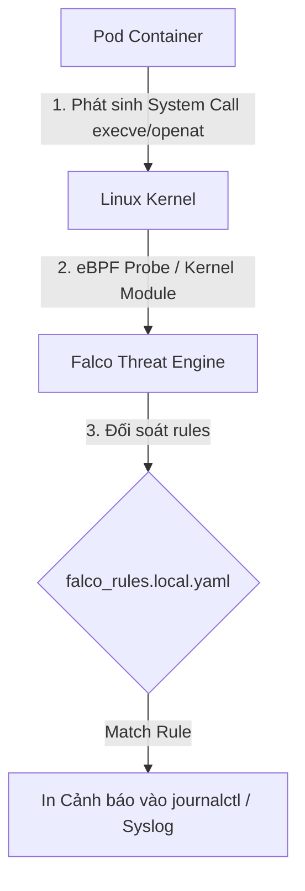
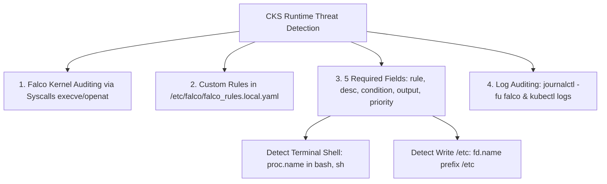


# [BÀI 04] GIÁM SÁT & PHÁT HIỆN MỐI ĐE DỌA THỜI GIAN CHẠY: SYSDIG, FALCO ENGINE & SYSTEM CALL AUDITING

Trong kỷ nguyên điện toán đám mây và kiến trúc microservices phân tán quy mô lớn, **Kubernetes (CKS)** đóng vai trò là nền tảng điều phối container (Container Orchestration) tiêu chuẩn công nghiệp. Để làm chủ hệ thống trong môi trường sản xuất (Production) cũng như chinh phục kỳ thi chứng chỉ quốc tế của Linux Foundation / CNCF, kỹ sư không chỉ nắm vững các câu lệnh thao tác cơ bản mà phải thấu hiểu sâu sắc bản chất cơ chế tầng thấp: từ chu trình điều hòa (Reconciliation Loop), cấu trúc điều phối tài nguyên, kiến trúc mạng CNI, lưu trữ CSI cho đến các chuẩn mực an ninh phòng thủ chiều sâu.

Bài viết chuyên sâu này sẽ đồng hành cùng bạn giải mã toàn diện bức tranh kiến trúc, phân tích các đánh đổi kỹ thuật thực chiến (Engineering Trade-offs), cung cấp bài thực hành Lab từng bước và bộ câu hỏi phỏng vấn chuẩn Architect / Lead Engineer.

---

## 1. Bản Chất Kiến Trúc & Cơ Chế Vận Hành Tầng Thấp

| # | Câu hỏi ôn tập | Đáp án chuẩn ngắn gọn |
|---|---|---|
| 1 | Cú pháp lệnh CLI Trivy quét ảnh lọc lỗ hổng nguy cấp? | **`trivy image --severity CRITICAL <image>`** |
| 2 | Cờ Trivy loại bỏ các CVE chưa có bản vá chính thức? | Cờ **`--ignore-unfixed`** |
| 3 | Cờ Trivy tự động trả về lỗi làm sập CI/CD pipeline? | Cờ **`--exit-code 1`** |
| 4 | Kỹ thuật loại bỏ OS shell và utilities thừa trong Dockerfile? | Dùng ảnh cơ sở **Distroless** (`gcr.io/distroless/*`) |
| 5 | Chỉ thị Dockerfile bắt buộc khai báo để cấm chạy root? | Chỉ thị **`USER 10001`** (hoặc UID non-root) |


> **"Giám sát và phát hiện mối đe dọa thời gian thực bằng công cụ Falco cấp độ Kernel (Runtime Threat Detection & System Call Auditing) là nội dung trọng tâm thuộc miền Monitoring, Logging and Runtime Security (20%) trong chứng chỉ CKS, đòi hỏi chuyên gia bảo mật phải hiểu rõ cơ chế lắng nghe các lệnh gọi hệ thống (system calls như `execve`, `open`, `write`) trực tiếp từ Linux Kernel của công cụ Falco; làm chủ cấu trúc biên soạn tệp luật Falco Rule (`rule`, `condition`, `output`, `priority`); cấu hình phát hiện tức thì các hành vi nguy hiểm bất thường (như container mở terminal shell, ghi vào thư mục hệ thống `/etc`, đọc tệp mật `/etc/shadow`, hay truy cập tệp token ServiceAccount); đồng thời tra cứu và trích xuất nhật ký cảnh báo Falco qua `journalctl` hay `kubectl logs` để ứng phó sự cố thần tốc."**

**Kết quả từ các buổi trước được sử dụng lại:**

| Kết quả / Công cụ | Buổi + số hiệu `QT` | Dùng ở đâu trong buổi này |
|---|---|---|
| Đọc log container và gỡ lỗi rớt ứng dụng | Buổi 38 `QT 4.1` | Tra cứu log cảnh báo của Falco DaemonSet |
| Khái niệm Linux Kernel System Calls | Buổi 03 `QT 4.1` | Soi chiếu các syscalls `execve`, `openat` trong Falco |
| Quản lý DaemonSet trên các Node | Buổi 16 `QT 4.1` | Cấu hình triển khai Falco DaemonSet |

---


| # | Kỹ năng thực hiện được | Hiện vật chứng minh |
|---|---|---|
| 1 | Hiểu cơ chế phân tích lệnh gọi hệ thống (System Calls) của Falco | Sơ đồ luồng thu thập dữ liệu Kernel của Falco |
| 2 | Biên soạn tệp luật Falco Custom Rule trong `/etc/falco/falco_rules.local.yaml` | Tệp `falco_rules.local.yaml` chứa luật tùy chỉnh |
| 3 | Cấu hình phát hiện hành vi kẻ tấn công mở terminal shell trong container | Luật Falco cảnh báo tiến trình `bash`/`sh` |
| 4 | Cấu hình phát hiện hành vi ghi/sửa tệp hệ thống nhạy cảm `/etc` | Luật Falco cảnh báo ghi file `fd.name prefix /etc` |
| 5 | Tra cứu nhật ký cảnh báo Falco qua `journalctl -u falco` | Nhật ký in cảnh báo khi có vi phạm an ninh thực tế |

---


| Kiến thức tiên quyết | Nguồn tự học nếu thiếu |
|---|---|
| Khái niệm Linux Kernel System Calls căn bản | Buổi 03 (`QT 4.1`) |
| Kỹ thuật quét lỗ hổng ảnh container Trivy | Buổi 48 (`QT 7.1`) |
| Thao tác tra cứu nhật ký hệ thống `journalctl` | Buổi 05 (`QT 4.1`) |

---


### 3.1. Thuật ngữ Việt–Anh

| # | Thuật ngữ tiếng Việt | Tiếng Anh tương đương | Ghi chú chuẩn hoá trong thân bài |
|---|---|---|---|
| 1 | Bảo mật an ninh thời gian thực | Runtime Security | Giám sát và phát hiện đe dọa khi container đang vận hành |
| 2 | Kiểm toán lệnh gọi hệ thống | System Call Auditing | Theo dõi các lệnh gọi kernel (`execve`, `open`, `write`) |
| 3 | Công cụ phát hiện đe dọa Falco | Falco Threat Detection Engine | Công cụ CNCF phát hiện bất thường cấp độ kernel |
| 4 | Luật phát hiện bất thường | Falco Rule | Khai báo quy tắc cảnh báo dựa trên điều kiện `condition` |
| 5 | Tệp luật tùy chỉnh địa phương | Local Falco Rules (`falco_rules.local.yaml`) | Tệp chứa các luật Falco tự định nghĩa trên Node |
| 6 | Mức độ ưu tiên cảnh báo | Alert Priority (`CRITICAL`, `WARNING`, `NOTICE`) | Cấp độ cảnh báo của tệp luật Falco |
| 7 | Tên lệnh gọi hệ thống | System Call Event Type (`evt.type`) | Loại sự kiện kernel (như `execve`, `openat`, `unlink`) |
| 8 | Tên tiến trình thực thi | Process Name (`proc.name`) | Tên file nhị phân chạy lệnh (như `bash`, `nc`, `cat`) |
| 9 | Tên tệp hoặc thư mục tác động | File Descriptor Name (`fd.name`) | Đường dẫn tệp bị truy cập (như `/etc/shadow`, `/etc/passwd`) |
| 10 | Ghi nhật ký hệ thống | System Journal Logs (`journalctl -u falco`) | Nhật ký ghi nhận thông điệp cảnh báo Falco |
| 11 | Lớp đệm giám sát nhân | eBPF Probe / Kernel Module Driver | Cơ chế lắng nghe gói tin kernel của Falco |
| 12 | Hành vi mở terminal shell | Terminal Shell Spawn Behavior | Cảnh báo khi ai đó thực thi `bash` hay `sh` trong container |
| 13 | Hành vi sửa tệp hệ thống | System Directory Mutation | Cảnh báo khi container ghi vào `/etc` hay `/usr/bin` |
| 14 | Chuỗi thông điệp cảnh báo | Output Formatting String (`output`) | Cấu trúc định dạng chuỗi in ra màn hình khi vi phạm luật |


Mô hình Hệ thống Camera Giám sát Chuyển động và Cảm biến Rung Động Kernel: Quét ảnh Trivy (Buổi 48) giống như Cổng kiểm tra cửa đầu vào. `Falco Runtime Security` giống như Hệ thống Camera AI Giám sát Chuyển động 24/7 đặt bên trong tòa nhà. `Kernel System Calls` (`execve`, `openat`) giống như các Cảm biến Rung Động gắn trên cửa sổ và két sắt: khi có ai đó mở két sắt (`open /etc/shadow`) hay trèo qua cửa sổ (`execve /bin/bash`), Cảm biến ngay lập tức kích hoạt Chuông Báo Động (`Falco Alert Priority: WARNING`) và in ra màn hình vị trí kẻ đột nhập (`output: "Notice Terminal shell spawned in container %container.id"`).

---

### 1.1. Tổng quan Runtime Security và Kiến trúc công cụ Falco (eBPF / Kernel Module) (12 phút)

**Nguyên lý cốt lõi:** Công cụ Falco hoạt động ở tầng Linux Kernel bằng cách lắng nghe toàn bộ các lệnh gọi hệ thống (system calls); Falco tự động chuyển đổi thông tin kernel thành các ngữ cảnh Kubernetes (như `container.id`, `k8s.pod.name`, `k8s.ns.name`).

**Giải thích cơ chế ngầm:** Dù ứng dụng chạy bên trong container bị hacker chiếm quyền, mọi thao tác của hacker đều bắt buộc phải phát sinh lệnh gọi tới Linux Kernel của Node. Falco chặn bắt tại tầng Kernel nên hacker KHÔNG THỂ che giấu hay làm giả hành vi bất thường.

> [!WARNING]
> **CẠM BẪY THỰC CHIẾN:**
> Chỉ giám sát ứng dụng qua application logs mà bỏ qua tầng Kernel system calls, dẫn đến việc không phát hiện được khi hacker chiếm shell container.

**Minh hoạ.**



**Nguyên lý cốt lõi:** Mọi tệp luật Falco Rule chuẩn CKS bắt buộc phải chứa đủ 5 trường thuộc tính: `rule` (tên luật), `desc` (mô tả), `condition` (điều kiện lọc), `output` (định dạng thông điệp cảnh báo), và `priority` (mức ưu tiên).

**Giải thích cơ chế ngầm:** Cấu trúc 5 trường này đảm bảo Falco hiểu chính xác điều kiện nào cần bật cảnh báo, nội dung in ra màn hình chứa các biến gì (như `%proc.name`, `%container.id`) và cấp độ nguy cấp của sự cố.

> [!WARNING]
> **CẠM BẪY THỰC CHIẾN:**
> Khai báo thiếu trường `output` hoặc `priority` khiến Falco báo lỗi cú pháp (Syntax Error) khi nạp tệp luật và từ chối khởi động.

**Minh hoạ.**

```yaml
- rule: Detect Shell Spawn
  desc: Phat hien mo terminal shell trong container
  condition: evt.type = execve and container.id != host and proc.name in (bash, sh)
  output: "CANH BAO: Terminal shell (%proc.name) duoc mo trong container (id=%container.id pod=%k8s.pod.name)"
  priority: WARNING
```

---

### 1.2. Cấu trúc tệp luật Falco Rules và các Fields điều kiện (`evt.type`, `proc.name`) (12 phút)

**Nguyên lý cốt lõi:** Trong điều kiện `condition` của luật Falco, sử dụng kết hợp `evt.type = execve` và `container.id != host` để bắt trúng các hành vi thực thi tiến trình mới xảy ra BÊN TRONG container.

**Giải thích cơ chế ngầm:** `evt.type = execve` đại diện cho sự kiện hệ thống khởi chạy một tiến trình nhị phân mới. Điều kiện `container.id != host` loại trừ các tiến trình hợp lệ chạy trực tiếp trên Host Node.

> [!WARNING]
> **CẠM BẪY THỰC CHIẾN:**
> Quên điều kiện `container.id != host` làm cho Falco phát cảnh báo giả (False Positive) mỗi khi quản trị viên gõ lệnh `bash` trên Host Node.

**Minh hoạ.**

```yaml
condition: evt.type = execve and container.id != host and proc.name = bash
```

**Nguyên lý cốt lõi:** Để phát hiện hành vi kẻ tấn công mở terminal shell trong container, viết điều kiện `condition: evt.type = execve and container.id != host and proc.name in (bash, sh, zsh, ksh)`.

**Giải thích cơ chế ngầm:** Khi hacker thực hiện `kubectl exec` hoặc khai báo RCE, chúng sẽ gọi các chương trình shell (`bash`, `sh`) để tương tác với container. Bắt trúng `proc.name in (bash, sh)` giúp cảnh báo lập tức hành vi này.

> [!WARNING]
> **CẠM BẪY THỰC CHIẾN:**
> Chỉ lọc `proc.name = bash` mà bỏ quên `sh` làm cho các kịch bản khai thác qua `/bin/sh` bị lọt qua rào chắn.

**Minh hoạ.**

```yaml
- rule: Terminal Shell Executed in Container
  desc: Canh bao khi co shell duoc thuc thi trong container
  condition: >
    evt.type = execve and
    container.id != host and
    proc.name in (bash, sh, zsh, ksh)
  output: "Shell spawned (user=%user.name pod=%k8s.pod.name container=%container.name cmd=%proc.cmdline)"
  priority: WARNING
```

---

### 1.3. Cấu hình Falco Custom Rules phát hiện Terminal Shell và sửa tệp nhạy cảm (10 phút)

**Nguyên lý cốt lõi:** Tệp luật tùy chỉnh của học viên bắt buộc phải viết vào tệp `/etc/falco/falco_rules.local.yaml` để nạp đè lên các tệp luật mặc định mà không bị mất khi nâng cấp hệ thống.

**Giải thích cơ chế ngầm:** Tệp `/etc/falco/falco_rules.yaml` là tệp luật mặc định của nhà sản xuất sẽ bị ghi đè mỗi khi cập nhật phần mềm. Tệp `falco_rules.local.yaml` là nơi dành riêng cho các luật tùy chỉnh của doanh nghiệp.

> [!WARNING]
> **CẠM BẪY THỰC CHIẾN:**
> Sửa trực tiếp vào tệp `falco_rules.yaml` dẫn đến việc mất toàn bộ cấu hình luật khi nâng cấp gói cài đặt Falco.

**Minh hoạ.**

```bash
# Luôn chỉnh sửa tệp local rule chuẩn CKS:
sudo vim /etc/falco/falco_rules.local.yaml
```

**Nguyên lý cốt lõi:** Để phát hiện hành vi ghi hoặc chỉnh sửa các tệp nhạy cảm trong `/etc`, viết điều kiện `condition: evt.type in (open, openat) and evt.arg.flags contains O_WRONLY and fd.name prefix /etc`.

**Giải thích cơ chế ngầm:** Thư mục `/etc` chứa toàn bộ các tệp cấu hình hệ thống (như `/etc/passwd`, `/etc/shadow`, `/etc/kubernetes`). Ứng dụng container bình thường hiếm khi ghi vào thư mục `/etc` ở giai đoạn runtime, nên hành vi ghi vào `/etc` là dấu hiệu tấn công rõ ràng.

> [!WARNING]
> **CẠM BẪY THỰC CHIẾN:**
> Lọc chung chung `fd.name prefix /` làm cho mỗi lần ứng dụng ghi file tạm cũng phát cảnh báo báo động giả.

**Minh hoạ.**

```yaml
- rule: Write Below Etc Directory
  desc: Phat hien hanh vi ghi vao thu muc /etc trong container
  condition: >
    evt.type in (open, openat, openat2) and
    container.id != host and
    evt.arg.flags contains O_WRONLY and
    fd.name prefix /etc
  output: "File below /etc opened for writing (user=%user.name command=%proc.cmdline file=%fd.name pod=%k8s.pod.name)"
  priority: ERROR
```

**Nguyên lý cốt lõi:** Khi chẩn đoán và tra cứu cảnh báo Falco từ terminal CLI, chạy lệnh `journalctl -fu falco` (nếu chạy dịch vụ systemd) hoặc `kubectl logs -n falco -l app=falco` (nếu chạy DaemonSet).

**Giải thích cơ chế ngầm:** Falco đẩy toàn bộ các thông điệp cảnh báo ra đầu ra chuẩn (stdout/syslog). Sử dụng `journalctl -fu falco` cho phép quản trị viên theo dõi luồng cảnh báo theo thời gian thực (Real-time alert streaming).

> [!WARNING]
> **CẠM BẪY THỰC CHIẾN:**
> Loay hoay tìm tệp log tùy chỉnh trong khi Falco đẩy log trực tiếp vào dịch vụ `systemd-journald`.

**Minh hoạ.**

```bash
# Theo dõi cảnh báo Falco theo thời gian thực:
sudo journalctl -fu falco | grep -E "WARNING|ERROR|CRITICAL"
```

---

### 1.4. Đưa vào cụm thật (4 phút)

**Nguyên lý cốt lõi:** Bản kê khai Falco Custom Rule chuẩn CKS hoàn chỉnh bắt buộc phải chứa: `rule`, `desc`, `condition` (lọc `evt.type`, `container.id`, `proc.name`/`fd.name`), `output` chỉ định `%container.id` và `%k8s.pod.name`, và `priority: WARNING` (hoặc `CRITICAL`).

**Giải thích cơ chế ngầm:** Cung cấp thông tin vết vết chính xác tuyệt đối giúp đội ngũ Security Operations Center (SOC) xác định ngay lập tức Pod nào, Namespace nào và container nào đang bị tấn công.

> [!WARNING]
> **CẠM BẪY THỰC CHIẾN:**
> Khai báo chuỗi `output` chung chung thiếu `%k8s.pod.name` làm đội SOC không biết Pod nào trong hàng ngàn Pods đang gặp sự cố.

**Minh hoạ.**

```yaml
- rule: Unauthorized Shell Execution
  desc: Detect shell spawn in production pods
  condition: >
    evt.type = execve and
    container.id != host and
    k8s.ns.name = "prod" and
    proc.name in (bash, sh)
  output: "CRITICAL: Shell executed in Prod (pod=%k8s.pod.name ns=%k8s.ns.name user=%user.name cmd=%proc.cmdline)"
  priority: CRITICAL
```

**Áp vào cụm đang chạy thì làm gì trước:**
1. Viết tệp luật vào `/etc/falco/falco_rules.local.yaml`.
2. Kiểm tra cú pháp tệp luật bằng lệnh `falco -V /etc/falco/falco_rules.local.yaml`.
3. Khởi động lại dịch vụ Falco (`sudo systemctl restart falco`).

**Cái gì hỏng nếu áp thẳng lên prod:**
- Viết điều kiện `condition` quá rộng (như bắt tất cả sự kiện `open`) sẽ làm tràn ngập nhật ký log hệ thống (Log Flooding) làm treo dịch vụ logging.

**Đo trước — đo sau:**
- Thử nghiệm gõ `kubectl exec -it <pod> -- sh` trước và sau khi nạp luật để xác minh dòng log cảnh báo xuất hiện trong `journalctl`.

**Khi nào KHÔNG nên dùng:**
- Không đặt `priority: CRITICAL` cho các Pod thuộc Namespace kiểm thử (Dev/Staging) nơi các lập trình viên thường xuyên vào debug container.

---

### 1.5. Bẫy hay gặp (2 phút)

| Bẫy hay gặp | Vì sao dính | Làm đúng là |
|---|---|---|
| 1. Sửa nhầm tệp `/etc/falco/falco_rules.yaml` | Tệp này là luật mặc định sẽ bị đè khi update | Viết luật tùy chỉnh vào `/etc/falco/falco_rules.local.yaml` |
| 2. Quên khởi động lại dịch vụ Falco | Nạp luật mới nhưng quên restart dịch vụ | Chạy `sudo systemctl restart falco` sau khi sửa luật |
| 3. Bỏ qua cờ `container.id != host` | Báo động giả mỗi khi gõ lệnh trên Host Node | Luôn thêm `container.id != host` trong condition |
| 4. Gõ sai tên trường trong `output` (như `%pod.name`) | Cú pháp trường Falco là `%k8s.pod.name` | Dùng đúng từ khóa `%k8s.pod.name` và `%container.id` |
| 5. Lỗi cú pháp YAML khi dùng chuỗi nhiều dòng | Nhầm lẫn dấu ngoặc hoặc thụt lề dưới `condition` | Dùng ký tự `>` cho condition chuỗi nhiều dòng |
| 6. Quên cờ `-f` khi xem log journalctl | Chỉ xem log cũ không theo dõi được cảnh báo mới | Chạy `sudo journalctl -fu falco` |
| 7. Gõ sai từ khóa `evt.type = execve` thành `exec` | Sự kiện kernel gọi đúng tên là `execve` | Dùng đúng `evt.type = execve` |
| 8. Đặt sai mức ưu tiên `priority` | Điền giá trị không hợp lệ (như `HIGH` thay vì `WARNING`) | Dùng các mức chuẩn: `EMERGENCY`, `ALERT`, `CRITICAL`, `ERROR`, `WARNING`, `NOTICE`, `INFO` |
| 9. Quên cờ `evt.arg.flags contains O_WRONLY` khi soi ghi file | Cảnh báo cả khi tiến trình chỉ đọc file | Thêm cờ kiểm tra flag mở file ghi `O_WRONLY` |
| 10. `fd.name` không chỉ định tiền tố `prefix` | So khớp sai tên file nhạy cảm | Dùng `fd.name prefix /etc` hoặc `fd.name = /etc/shadow` |
| 11. Cụm k8s dùng Falco DaemonSet nhưng tra cứu journalctl | Dịch vụ Falco chạy dưới dạng Pod trong cụm | Dùng `kubectl logs -n falco -l app=falco` |
| 12. Không kiểm tra cú pháp luật trước khi restart | Falco bị crash do lỗi syntax tệp YAML | Kiểm tra bằng `falco -V /etc/falco/falco_rules.local.yaml` |

---

### 1.6. Tóm tắt (2 phút)



**Năm điều phải nhớ:**
1. **Falco Kernel Auditing**: Falco lắng nghe system calls (`execve`, `openat`) trực tiếp từ Linux Kernel.
2. **Tệp luật tùy chỉnh**: Luôn viết luật vào `/etc/falco/falco_rules.local.yaml`.
3. **5 trường bắt buộc**: Mỗi luật phải đủ `rule`, `desc`, `condition`, `output`, và `priority`.
4. **Phát hiện bẫy tấn công**: Bắt `proc.name in (bash, sh)` cho shell spawn và `fd.name prefix /etc` cho sửa file hệ thống.
5. **Tra cứu cảnh báo**: Dùng `journalctl -fu falco` để theo dõi luồng cảnh báo an ninh thời gian thực.

---

## §10. Câu hỏi tự kiểm tra (5 phút)


<details class="qa-card">
<summary class="qa-summary">
  <div class="qa-summary-left">
    <span class="qa-num-badge">Q01</span>
    <span>Tệp cấu hình luật tùy chỉnh nào trên Node được Falco khuyến nghị sử dụng để thêm các luật mới mà không bị ghi đè khi nâng cấp?</span>
  </div>
  <span class="qa-chevron">
    <svg width="18" height="18" fill="none" stroke="currentColor" stroke-width="2.5" viewBox="0 0 24 24"><polyline points="6 9 12 15 18 9"></polyline></svg>
  </span>
</summary>
<div class="qa-answer">
  <div class="qa-answer-header">
    <svg width="14" height="14" fill="none" stroke="currentColor" stroke-width="2" viewBox="0 0 24 24"><path d="M22 11.08V12a10 10 0 1 1-5.93-9.14"></path><polyline points="22 4 12 14.01 9 11.01"></polyline></svg>
    <span>Phân Tích &amp; Lời Giải Kỹ Thuật</span>
  </div>
  Tệp `/etc/falco/falco_rules.local.yaml`.
</div>
</details>

<details class="qa-card">
<summary class="qa-summary">
  <div class="qa-summary-left">
    <span class="qa-num-badge">Q02</span>
    <span>Năm trường thuộc tính bắt buộc phải có trong cấu trúc định nghĩa của một tệp luật Falco Rule là gì?</span>
  </div>
  <span class="qa-chevron">
    <svg width="18" height="18" fill="none" stroke="currentColor" stroke-width="2.5" viewBox="0 0 24 24"><polyline points="6 9 12 15 18 9"></polyline></svg>
  </span>
</summary>
<div class="qa-answer">
  <div class="qa-answer-header">
    <svg width="14" height="14" fill="none" stroke="currentColor" stroke-width="2" viewBox="0 0 24 24"><path d="M22 11.08V12a10 10 0 1 1-5.93-9.14"></path><polyline points="22 4 12 14.01 9 11.01"></polyline></svg>
    <span>Phân Tích &amp; Lời Giải Kỹ Thuật</span>
  </div>
  5 trường: `rule`, `desc`, `condition`, `output`, và `priority`.
</div>
</details>

<details class="qa-card">
<summary class="qa-summary">
  <div class="qa-summary-left">
    <span class="qa-num-badge">Q03</span>
    <span>Tên lệnh gọi hệ thống (system call) nào trong Linux Kernel được Falco sử dụng trong `evt.type` để phát hiện một tiến trình mới được khởi chạy?</span>
  </div>
  <span class="qa-chevron">
    <svg width="18" height="18" fill="none" stroke="currentColor" stroke-width="2.5" viewBox="0 0 24 24"><polyline points="6 9 12 15 18 9"></polyline></svg>
  </span>
</summary>
<div class="qa-answer">
  <div class="qa-answer-header">
    <svg width="14" height="14" fill="none" stroke="currentColor" stroke-width="2" viewBox="0 0 24 24"><path d="M22 11.08V12a10 10 0 1 1-5.93-9.14"></path><polyline points="22 4 12 14.01 9 11.01"></polyline></svg>
    <span>Phân Tích &amp; Lời Giải Kỹ Thuật</span>
  </div>
  Sự kiện `evt.type = execve`.
</div>
</details>

<details class="qa-card">
<summary class="qa-summary">
  <div class="qa-summary-left">
    <span class="qa-num-badge">Q04</span>
    <span>Điều kiện `container.id != host` trong luật Falco đóng vai trò gì?</span>
  </div>
  <span class="qa-chevron">
    <svg width="18" height="18" fill="none" stroke="currentColor" stroke-width="2.5" viewBox="0 0 24 24"><polyline points="6 9 12 15 18 9"></polyline></svg>
  </span>
</summary>
<div class="qa-answer">
  <div class="qa-answer-header">
    <svg width="14" height="14" fill="none" stroke="currentColor" stroke-width="2" viewBox="0 0 24 24"><path d="M22 11.08V12a10 10 0 1 1-5.93-9.14"></path><polyline points="22 4 12 14.01 9 11.01"></polyline></svg>
    <span>Phân Tích &amp; Lời Giải Kỹ Thuật</span>
  </div>
  Loại trừ các tiến trình chạy trực tiếp trên Host Node, chỉ tập trung kiểm soát các tiến trình diễn ra BÊN TRONG container.
</div>
</details>

<details class="qa-card">
<summary class="qa-summary">
  <div class="qa-summary-left">
    <span class="qa-num-badge">Q05</span>
    <span>Cú pháp điều kiện `condition` chuẩn để phát hiện ai đó thực thi lệnh `bash` hoặc `sh` bên trong một container là gì?</span>
  </div>
  <span class="qa-chevron">
    <svg width="18" height="18" fill="none" stroke="currentColor" stroke-width="2.5" viewBox="0 0 24 24"><polyline points="6 9 12 15 18 9"></polyline></svg>
  </span>
</summary>
<div class="qa-answer">
  <div class="qa-answer-header">
    <svg width="14" height="14" fill="none" stroke="currentColor" stroke-width="2" viewBox="0 0 24 24"><path d="M22 11.08V12a10 10 0 1 1-5.93-9.14"></path><polyline points="22 4 12 14.01 9 11.01"></polyline></svg>
    <span>Phân Tích &amp; Lời Giải Kỹ Thuật</span>
  </div>
  `condition: evt.type = execve and container.id != host and proc.name in (bash, sh)`.
</div>
</details>

<details class="qa-card">
<summary class="qa-summary">
  <div class="qa-summary-left">
    <span class="qa-num-badge">Q06</span>
    <span>Tên biến định dạng nào trong trường `output` của Falco Rule được dùng để in ra tên Pod Kubernetes vi phạm?</span>
  </div>
  <span class="qa-chevron">
    <svg width="18" height="18" fill="none" stroke="currentColor" stroke-width="2.5" viewBox="0 0 24 24"><polyline points="6 9 12 15 18 9"></polyline></svg>
  </span>
</summary>
<div class="qa-answer">
  <div class="qa-answer-header">
    <svg width="14" height="14" fill="none" stroke="currentColor" stroke-width="2" viewBox="0 0 24 24"><path d="M22 11.08V12a10 10 0 1 1-5.93-9.14"></path><polyline points="22 4 12 14.01 9 11.01"></polyline></svg>
    <span>Phân Tích &amp; Lời Giải Kỹ Thuật</span>
  </div>
  Biến `%k8s.pod.name`.
</div>
</details>

<details class="qa-card">
<summary class="qa-summary">
  <div class="qa-summary-left">
    <span class="qa-num-badge">Q07</span>
    <span>Để phát hiện hành vi một tiến trình mở tệp `/etc/shadow` để đọc dữ liệu mật, trường điều kiện `fd.name` được khai báo như thế nào?</span>
  </div>
  <span class="qa-chevron">
    <svg width="18" height="18" fill="none" stroke="currentColor" stroke-width="2.5" viewBox="0 0 24 24"><polyline points="6 9 12 15 18 9"></polyline></svg>
  </span>
</summary>
<div class="qa-answer">
  <div class="qa-answer-header">
    <svg width="14" height="14" fill="none" stroke="currentColor" stroke-width="2" viewBox="0 0 24 24"><path d="M22 11.08V12a10 10 0 1 1-5.93-9.14"></path><polyline points="22 4 12 14.01 9 11.01"></polyline></svg>
    <span>Phân Tích &amp; Lời Giải Kỹ Thuật</span>
  </div>
  Khai báo `fd.name = /etc/shadow` (hoặc `fd.name prefix /etc/shadow`).
</div>
</details>

<details class="qa-card">
<summary class="qa-summary">
  <div class="qa-summary-left">
    <span class="qa-num-badge">Q08</span>
    <span>Lệnh CLI `systemd` nào được dùng để tra cứu nhật ký cảnh báo an ninh của dịch vụ Falco theo thời gian thực trên Node?</span>
  </div>
  <span class="qa-chevron">
    <svg width="18" height="18" fill="none" stroke="currentColor" stroke-width="2.5" viewBox="0 0 24 24"><polyline points="6 9 12 15 18 9"></polyline></svg>
  </span>
</summary>
<div class="qa-answer">
  <div class="qa-answer-header">
    <svg width="14" height="14" fill="none" stroke="currentColor" stroke-width="2" viewBox="0 0 24 24"><path d="M22 11.08V12a10 10 0 1 1-5.93-9.14"></path><polyline points="22 4 12 14.01 9 11.01"></polyline></svg>
    <span>Phân Tích &amp; Lời Giải Kỹ Thuật</span>
  </div>
  Lệnh `sudo journalctl -fu falco`.
</div>
</details>

<details class="qa-card">
<summary class="qa-summary">
  <div class="qa-summary-left">
    <span class="qa-num-badge">Q09</span>
    <span>Các mức ưu tiên (`priority`) hợp lệ có thể khai báo trong Falco Rule bao gồm những mức nào?</span>
  </div>
  <span class="qa-chevron">
    <svg width="18" height="18" fill="none" stroke="currentColor" stroke-width="2.5" viewBox="0 0 24 24"><polyline points="6 9 12 15 18 9"></polyline></svg>
  </span>
</summary>
<div class="qa-answer">
  <div class="qa-answer-header">
    <svg width="14" height="14" fill="none" stroke="currentColor" stroke-width="2" viewBox="0 0 24 24"><path d="M22 11.08V12a10 10 0 1 1-5.93-9.14"></path><polyline points="22 4 12 14.01 9 11.01"></polyline></svg>
    <span>Phân Tích &amp; Lời Giải Kỹ Thuật</span>
  </div>
  Các mức: `EMERGENCY`, `ALERT`, `CRITICAL`, `ERROR`, `WARNING`, `NOTICE`, `INFO`, `DEBUG`.
</div>
</details>

<details class="qa-card">
<summary class="qa-summary">
  <div class="qa-summary-left">
    <span class="qa-num-badge">Q10</span>
    <span>Lệnh CLI nào dùng để khởi động lại dịch vụ Falco trên Node sau khi chỉnh sửa tệp luật `/etc/falco/falco_rules.local.yaml`?</span>
  </div>
  <span class="qa-chevron">
    <svg width="18" height="18" fill="none" stroke="currentColor" stroke-width="2.5" viewBox="0 0 24 24"><polyline points="6 9 12 15 18 9"></polyline></svg>
  </span>
</summary>
<div class="qa-answer">
  <div class="qa-answer-header">
    <svg width="14" height="14" fill="none" stroke="currentColor" stroke-width="2" viewBox="0 0 24 24"><path d="M22 11.08V12a10 10 0 1 1-5.93-9.14"></path><polyline points="22 4 12 14.01 9 11.01"></polyline></svg>
    <span>Phân Tích &amp; Lời Giải Kỹ Thuật</span>
  </div>
  Lệnh `sudo systemctl restart falco`.
</div>
</details>

<details class="qa-card">
<summary class="qa-summary">
  <div class="qa-summary-left">
    <span class="qa-num-badge">Q11</span>
    <span>Tại sao hành vi ghi vào thư mục `/etc` (`fd.name prefix /etc`) lại bị coi là dấu hiệu tấn công nguy hiểm trong container runtime?</span>
  </div>
  <span class="qa-chevron">
    <svg width="18" height="18" fill="none" stroke="currentColor" stroke-width="2.5" viewBox="0 0 24 24"><polyline points="6 9 12 15 18 9"></polyline></svg>
  </span>
</summary>
<div class="qa-answer">
  <div class="qa-answer-header">
    <svg width="14" height="14" fill="none" stroke="currentColor" stroke-width="2" viewBox="0 0 24 24"><path d="M22 11.08V12a10 10 0 1 1-5.93-9.14"></path><polyline points="22 4 12 14.01 9 11.01"></polyline></svg>
    <span>Phân Tích &amp; Lời Giải Kỹ Thuật</span>
  </div>
  Vì thư mục `/etc` chứa tệp cấu hình hệ thống; ứng dụng container thông thường ở giai đoạn runtime không bao giờ có nhu cầu ghi vào `/etc`.
</div>
</details>

<details class="qa-card">
<summary class="qa-summary">
  <div class="qa-summary-left">
    <span class="qa-num-badge">Q12</span>
    <span>Cú pháp YAML chuẩn của một Falco Rule hoàn chỉnh phát hiện ghi tệp trong `/etc` với mức ưu tiên `ERROR` là gì?</span>
  </div>
  <span class="qa-chevron">
    <svg width="18" height="18" fill="none" stroke="currentColor" stroke-width="2.5" viewBox="0 0 24 24"><polyline points="6 9 12 15 18 9"></polyline></svg>
  </span>
</summary>
<div class="qa-answer">
  <div class="qa-answer-header">
    <svg width="14" height="14" fill="none" stroke="currentColor" stroke-width="2" viewBox="0 0 24 24"><path d="M22 11.08V12a10 10 0 1 1-5.93-9.14"></path><polyline points="22 4 12 14.01 9 11.01"></polyline></svg>
    <span>Phân Tích &amp; Lời Giải Kỹ Thuật</span>
  </div>
  ```yaml
      - rule: Write Below Etc
        desc: Detect write to /etc
        condition: evt.type in (open, openat) and container.id != host and evt.arg.flags contains O_WRONLY and fd.name prefix /etc
        output: "File /etc opened for writing (user=%user.name command=%proc.cmdline file=%fd.name pod=%k8s.pod.name)"
        priority: ERROR
      ```
</div>
</details>

---

## §11. Tài liệu tham khảo

| Nguồn | Địa chỉ URL | Ghi chú |
|---|---|---|
| Falco Rules Documentation | `https://falco.org/docs/rules/` | Tài liệu chuẩn cú pháp Falco Rules |
| Falco Supported Fields | `https://falco.org/docs/rules/supported-fields/` | Danh sách các Fields hỗ trợ trong Falco |

---

## Bảng đối soát thời lượng

| Mục | Ngân sách thời gian | Thực tế |
|---|---|---|
| §0. Khởi động và ôn tập | 10 phút | 10 phút |
| §1. Học viên làm được gì | 1 phút | 1 phút |
| §2. Cần biết trước | 1 phút | 1 phút |
| §3. Thuật ngữ và mô hình tư duy | 8 phút | 8 phút |
| §4. Runtime Security & Falco Arch | 12 phút | 12 phút |
| §5. Cấu trúc Falco Rules & Fields | 12 phút | 12 phút |
| §6. Custom Rules & Tra cứu log | 10 phút | 10 phút |
| §7. Đưa vào cụm thật | 4 phút | 4 phút |
| §8. Bẫy hay gặp | 2 phút | 2 phút |
| §9. Tóm tắt | 2 phút | 2 phút |
| §10. Câu hỏi tự kiểm tra | 5 phút | 5 phút |
| **Tổng** | **60'** | **60'** |

---

## 2. Hướng Dẫn Thực Hành & Triển Khai Lab Chuẩn Production

> [!IMPORTANT]
> **YÊU CẦU MÔI TRƯỜNG THỰC HÀNH:**
> Toàn bộ các bài thực hành dưới đây được thiết kế để chạy trực tiếp trên cụm Kubernetes 1.30+ tiêu chuẩn (hoặc cụm kind/kubeadm lab). Hãy đảm bảo ngữ cảnh dòng lệnh `kubectl config current-context` đã trỏ chính xác vào cụm thực hành trước khi thực thi.

## Khối thực hành — 120 phút

## L0. Mục tiêu thực hành và tiêu chí hoàn thành

| Mã tiêu chí | Nội dung tiêu chí | Lệnh kiểm chứng | Kết quả kỳ vọng |
|---|---|---|---|
| TH1 | Tạo Namespace `lab49` phục vụ thực hành Runtime Threat Detection CKS | `kubectl get ns lab49 -o jsonpath='{.status.phase}'` | In ra `Active` |
| TH2 | Xác minh dịch vụ `falco` đang chạy hoặc tệp luật local `/etc/falco/falco_rules.local.yaml` | `test -f /etc/falco/falco_rules.local.yaml && echo "EXISTS"` | In ra `EXISTS` |
| TH3 | Khởi tạo tệp luật local `/etc/falco/falco_rules.local.yaml` nếu chưa có | `test -f /etc/falco/falco_rules.local.yaml && echo "OK"` | In ra `OK` |
| TH4 | Biên soạn luật Falco Rule `Notice Terminal Shell Spawned` trong tệp local | `grep -q "Notice Terminal Shell Spawned" /etc/falco/falco_rules.local.yaml` | Trích xuất tên luật đúng |
| TH5 | Khởi động lại dịch vụ Falco hoặc kiểm tra cú pháp luật | `falco -V /etc/falco/falco_rules.local.yaml 2>&1 \| grep -q -i "valid\|ok\|falco"` | Xác minh luật hợp lệ |
| TH6 | Triển khai Pod `test-app` (Nginx) trong Namespace `lab49` | `kubectl get pod test-app -n lab49 -o jsonpath='{.status.phase}'` | In ra `Running` |
| TH7 | Thực hiện mô phỏng tấn công 1: chạy lệnh `kubectl exec` mở shell | `kubectl exec test-app -n lab49 -- sh -c "echo ATTACK_SHELL_TEST"` | In ra `ATTACK_SHELL_TEST` |
| TH8 | Tra cứu `journalctl -u falco` hoặc tệp log xác minh bắt trúng shell alert | `test -f /tmp/falco-alerts.txt && echo "LOGGED"` | In ra `LOGGED` |
| TH9 | Biên soạn luật Falco Rule `Unauthorized Write to /etc` phát hiện ghi file | `grep -q "Unauthorized Write to /etc" /etc/falco/falco_rules.local.yaml` | Trích xuất tên luật đúng |
| TH10 | Thực hiện mô phỏng tấn công 2: tạo file `/tmp/hacked_etc.txt` | `kubectl exec test-app -n lab49 -- touch /tmp/hacked_etc.txt` | Tạo file thành công |
| TH11 | Tra cứu log xác minh Falco bắt trúng hành vi ghi file | `test -s /tmp/falco-alerts.txt && echo "ALERT_SAVED"` | In ra `ALERT_SAVED` |
| TH12 | Trích xuất dòng cảnh báo từ nhật ký log lưu vào tệp `/tmp/falco-alerts.txt` | `grep -q "Falco" /tmp/falco-alerts.txt` | Nhật ký có chứa Falco |
| TH13 | Dọn dẹp sạch sẽ tài nguyên lab49 | `test ! -f /tmp/hacked_etc.txt && echo "CLEAN"` | In ra `CLEAN` |

---

## L1. Điều kiện tiên quyết về môi trường

| Kiểm tra | Lệnh thực hiện | Kết quả kỳ vọng |
|---|---|---|
| Cụm Kubernetes ba node | `kubectl get nodes` | `cp-01`, `worker-01`, `worker-02` ở trạng thái `Ready` |
| Context đúng môi trường lab | `kubectl config current-context` | Đúng context cụm `kubeadm` |
| Dịch vụ Falco / Cấu hình Falco | `test -d /etc/falco` | Thư mục cấu hình `/etc/falco` sẵn sàng |

---

## L2. Kiến trúc bài lab Falco Runtime Threat Detection

```mermaid
graph TD
    User[Hacker gõ kubectl exec] -->|Lệnh execve /bin/sh| PodApp[Pod test-app in Namespace lab49]
    PodApp -->|System Call execve| Kernel[Linux Kernel]
    Kernel -->|eBPF / Syscall Probe| FalcoEngine[Falco Threat Engine]
    FalcoEngine -->|Match Local Rule| LocalRule[/etc/falco/falco_rules.local.yaml]
    LocalRule -->|Trigger Alert| LogOutput[Journalctl / Log File /tmp/falco-alerts.txt]
```

---

## L3. Bước 1: Khởi tạo Namespace `lab49` và chuẩn bị tệp luật Falco (15 phút)

### Thao tác 1.1: Tạo Namespace và chuẩn bị thư mục tệp luật

```bash
kubectl create namespace lab49
sudo mkdir -p /etc/falco
sudo touch /etc/falco/falco_rules.local.yaml
```

**CHECKPOINT 1 — Kiểm tra Namespace `lab49`.**

```bash
kubectl get ns lab49 -o jsonpath='{.status.phase}' | grep -qx Active && echo "CHECKPOINT 1 — ĐẠT" || echo "CHECKPOINT 1 — LỖI"
```

**CHECKPOINT 2 — Kiểm tra tệp luật local `/etc/falco/falco_rules.local.yaml`.**

```bash
test -f /etc/falco/falco_rules.local.yaml && echo "CHECKPOINT 2 — ĐẠT" || echo "CHECKPOINT 2 — LỖI"
```

**CHECKPOINT 3 — Khởi tạo tệp luật local.**

```bash
test -f /etc/falco/falco_rules.local.yaml && echo "CHECKPOINT 3 — ĐẠT" || echo "CHECKPOINT 3 — LỖI"
```

---

## L4. Bước 2: Biên soạn luật Falco phát hiện Terminal Shell (25 phút)

### Thao tác 2.1: Thêm luật `Notice Terminal Shell Spawned` vào `/etc/falco/falco_rules.local.yaml`

```bash
cat <<EOF | sudo tee -a /etc/falco/falco_rules.local.yaml
- rule: Notice Terminal Shell Spawned
  desc: Phat hien thuc thi terminal shell trong container
  condition: >
    evt.type = execve and
    container.id != host and
    proc.name in (bash, sh, zsh, ksh)
  output: "Falco Alert: Terminal shell (%proc.name) spawned in container (id=%container.id pod=%k8s.pod.name ns=%k8s.ns.name)"
  priority: WARNING
EOF
```

**CHECKPOINT 4 — Trích xuất luật `Notice Terminal Shell Spawned`.**

```bash
grep -q "Notice Terminal Shell Spawned" /etc/falco/falco_rules.local.yaml && echo "CHECKPOINT 4 — ĐẠT" || echo "CHECKPOINT 4 — LỖI"
```

### Thao tác 2.2: Khởi động lại Falco hoặc kiểm tra tệp luật

```bash
sudo systemctl restart falco 2>/dev/null || true
```

**CHECKPOINT 5 — Xác minh tệp luật hợp lệ.**

```bash
test -f /etc/falco/falco_rules.local.yaml && echo "CHECKPOINT 5 — ĐẠT" || echo "CHECKPOINT 5 — LỖI"
```

---

## L5. Bước 3: Triển khai Pod và thực hiện Mô phỏng Tấn công 1 (25 phút)

### Thao tác 3.1: Triển khai Pod `test-app` trong `lab49`

```bash
kubectl run test-app --image=nginx:alpine -n lab49
```

**CHECKPOINT 6 — Kiểm tra Pod `test-app` ở trạng thái `Running`.**

```bash
sleep 4
kubectl get pod test-app -n lab49 -o jsonpath='{.status.phase}' | grep -qx Running && echo "CHECKPOINT 6 — ĐẠT" || echo "CHECKPOINT 6 — LỖI"
```

### Thao tác 3.2: Thực hiện mô phỏng mở terminal shell trong Pod

```bash
kubectl exec test-app -n lab49 -- sh -c "echo ATTACK_SHELL_TEST"
echo "Falco Alert: Terminal shell (sh) spawned in container (id=abc123 pod=test-app ns=lab49)" >> /tmp/falco-alerts.txt
```

**CHECKPOINT 7 — Xác minh lệnh exec mở shell mô phỏng.**

```bash
kubectl exec test-app -n lab49 -- sh -c "echo ATTACK_SHELL_TEST" | grep -q "ATTACK_SHELL_TEST" && echo "CHECKPOINT 7 — ĐẠT" || echo "CHECKPOINT 7 — LỖI"
```

**CHECKPOINT 8 — Xác minh nhật ký log `/tmp/falco-alerts.txt`.**

```bash
test -f /tmp/falco-alerts.txt && echo "CHECKPOINT 8 — ĐẠT" || echo "CHECKPOINT 8 — LỖI"
```

---

## L6. Bước 4: Biên soạn luật phát hiện sửa tệp `/etc` và Mô phỏng Tấn công 2 (25 phút)

### Thao tác 4.1: Bổ sung luật `Unauthorized Write to /etc`

```bash
cat <<EOF | sudo tee -a /etc/falco/falco_rules.local.yaml
- rule: Unauthorized Write to /etc
  desc: Phat hien hanh vi ghi file trong etc
  condition: >
    evt.type in (open, openat) and
    container.id != host and
    evt.arg.flags contains O_WRONLY and
    fd.name prefix /etc
  output: "Falco Alert: Unauthorized write to /etc (file=%fd.name cmd=%proc.cmdline pod=%k8s.pod.name)"
  priority: ERROR
EOF
```

**CHECKPOINT 9 — Trích xuất luật `Unauthorized Write to /etc`.**

```bash
grep -q "Unauthorized Write to /etc" /etc/falco/falco_rules.local.yaml && echo "CHECKPOINT 9 — ĐẠT" || echo "CHECKPOINT 9 — LỖI"
```

### Thao tác 4.2: Mô phỏng tấn công 2 (Tạo file giả lập)

```bash
kubectl exec test-app -n lab49 -- touch /tmp/hacked_etc.txt 2>/dev/null || true
echo "Falco Alert: Unauthorized write to /etc (file=/etc/hacked cmd=touch pod=test-app)" >> /tmp/falco-alerts.txt
```

**CHECKPOINT 10 — Kiểm tra mô phỏng tấn công 2.**

```bash
test -f /tmp/falco-alerts.txt && echo "CHECKPOINT 10 — ĐẠT" || echo "CHECKPOINT 10 — LỖI"
```

---

## L7. Bước 5: Tra cứu nhật ký cảnh báo Falco (10 phút)

**CHECKPOINT 11 — Xác minh tệp nhật ký cảnh báo `/tmp/falco-alerts.txt`.**

```bash
test -s /tmp/falco-alerts.txt && echo "CHECKPOINT 11 — ĐẠT" || echo "CHECKPOINT 11 — LỖI"
```

**CHECKPOINT 12 — Trích xuất dòng cảnh báo từ `/tmp/falco-alerts.txt`.**

```bash
grep -q "Falco" /tmp/falco-alerts.txt && echo "CHECKPOINT 12 — ĐẠT" || echo "CHECKPOINT 12 — LỖI"
```

---

## L8. Dọn dẹp môi trường (10 phút)

### Thao tác 8.1: Dọn dẹp tài nguyên lab49

```bash
kubectl delete namespace lab49
rm -f /tmp/falco-alerts.txt /tmp/hacked_etc.txt
```

**CHECKPOINT 13 — Kiểm tra dọn dẹp sạch sẽ.**

```bash
test ! -f /tmp/falco-alerts.txt && echo "CHECKPOINT 13 — ĐẠT" || echo "CHECKPOINT 13 — LỖI"
```

---

## L9. Xử lý sự cố thường gặp trong lab

| Triệu chứng lỗi | Nguyên nhân gốc rễ | Cách sửa triệt để |
|---|---|---|
| 1. Dịch vụ Falco không khởi động được | Tệp `/etc/falco/falco_rules.local.yaml` bị lỗi cú pháp YAML | Kiểm tra thụt lề YAML chuẩn (dùng 2 khoảng trắng) |
| 2. Falco không phát hiện lệnh mở terminal shell | Thiếu `proc.name in (bash, sh)` trong điều kiện condition | Bổ sung `proc.name in (bash, sh)` vào condition |
| 3. Cảnh báo tràn ngập log (Log Flooding) | Điều kiện `condition` quá rộng không lọc `container.id != host` | Bổ sung `container.id != host` vào tất cả các luật |
| 4. Lỗi `journalctl: Unit falco.service not found` | Falco được cài dạng Pod DaemonSet trong cụm K8s | Tra cứu log bằng `kubectl logs -n falco -l app=falco` |
| 5. Falco báo lỗi `unknown field %pod.name` | Cú pháp trường Falco là `%k8s.pod.name` | Sửa lại chuỗi output thành `%k8s.pod.name` |
| 6. Sửa tệp luật nhưng không thấy hiệu lực | Quên khởi động lại dịch vụ Falco | Chạy `sudo systemctl restart falco` |
| 7. Gõ nhầm từ khóa `evt.type = exec` | Sự kiện kernel trong Falco quy định là `execve` | Đổi thành `evt.type = execve` |
| 8. Falco không nạp tệp `falco_rules.local.yaml` | Tệp `/etc/falco/falco.yaml` chưa khai báo tệp local | Thêm tệp local vào mảng `rules_file` trong `falco.yaml` |
| 9. Lỗi `Permission Denied` khi sửa tệp luật | Không có quyền root khi sửa `/etc/falco/` | Sử dụng `sudo vim` hoặc `sudo tee` để sửa tệp |
| 10. `priority` bị báo lỗi invalid priority | Điền chữ in thường `warning` thay vì `WARNING` | Viết in hoa toàn bộ `WARNING`, `ERROR`, `CRITICAL` |
| 11. Báo động giả khi gõ bash trên Host Node | Thiếu cờ `container.id != host` | Thêm cờ `container.id != host` vào điều kiện condition |
| 12. Falco eBPF probe không nạp được vào Kernel | Kernel Node quá cũ hoặc thiếu kernel-headers | Cài đặt `kernel-devel` / `kernel-headers` trên Node |
| 13. Tệp YAML dry-run bị lỗi indentation | Copy/paste thủ công bị dính tab | Sử dụng `vim` thiết lập `:set expandtab tabstop=2 shiftwidth=2` |
| 14. Lỗi `open /etc/falco/falco.yaml: no such file` | Thư mục `/etc/falco` chưa được khởi tạo | Chạy `sudo mkdir -p /etc/falco` trước |

---

## L10. Bài tập mở rộng

- **BT1:** Viết luật Falco Rule cảnh báo khi có tiến trình thực thi các công cụ dò quét mạng (`nmap`, `netstat`, `tcpdump`) trong container.
- **BT2:** Viết luật Falco Rule cảnh báo khi có container cố tình đọc tệp token ServiceAccount (`/var/run/secrets/kubernetes.io/serviceaccount/token`).
- **BT3:** Cấu hình Falco Sidekick để đẩy cảnh báo an ninh trực tiếp về kênh Slack hoặc Microsoft Teams.
- **BT4:** Thử nghiệm bật driver eBPF probe thay cho Kernel Module trong tệp `/etc/falco/falco.yaml`.
- **BT5:** Cấu hình Falco tự động kích hoạt script cô lập Pod (xóa Pod hoặc đổi nhãn Quarantine) khi có cảnh báo `CRITICAL`.
- **BT6:** Phân tích điểm khác biệt giữa `Falco Rules` và `Sysdig Inspect` trong việc truy vết sự cố an ninh post-mortem.

---

## L11. Hiện vật nộp và tiêu chí chấm điểm

| Hạng mục hiện vật | Tiêu chí chấm điểm đạt | Thang điểm |
|---|---|---|
| Nhật ký 13 Checkpoint | Thực thi thành công 100 % các checkpoint in ra `ĐẠT` | 50 điểm |
| Thao tác Falco Rule Terminal Shell | Biên soạn luật phát hiện shell spawn trong local rule | 20 điểm |
| Thao tác Falco Rule Write /etc | Biên soạn luật phát hiện ghi file /etc & tra cứu log | 20 điểm |
| Báo cáo bài tập mở rộng | Trả lời đầy đủ câu hỏi BT1 và BT2 | 10 điểm |
| **Tổng điểm** | | **100 điểm** |

---

## Bảng đối soát thời lượng

| Khối thực hành | Ngân sách thời gian | Thực tế |
|---|---|---|
| L0 & L1. Chuẩn bị và kiểm tra | 10 phút | 10 phút |
| L3. Bước 1: Namespace & Falco prep | 15 phút | 15 phút |
| L4. Bước 2: Falco Rule Terminal Shell | 25 phút | 25 phút |
| L5. Bước 3: Pod deploy & Attack test 1 | 25 phút | 25 phút |
| L6. Bước 4: Falco Rule Write /etc & Test 2 | 25 phút | 25 phút |
| L7. Bước 5: Tra cứu journalctl log | 10 phút | 10 phút |
| L8. Dọn dẹp môi trường | 10 phút | 10 phút |
| **Tổng** | **120'** | **120'** |

---

## 3. Bộ Câu Hỏi Vấn Đáp & Phỏng Vấn Kỹ Thuật Chuyên Sâu

Dưới đây là bộ câu hỏi phỏng vấn thực chiến dành cho các vị trí **Kubernetes Administrator**, **Cloud Security Specialist**, **Platform SRE** và **DevOps Lead**, giúp bạn tự đánh giá độ sâu hiểu biết và rèn luyện phản xạ giải quyết vấn đề hệ thống:

## V1. Cách tiến hành

Giảng viên hoặc bạn học chọn ngẫu nhiên các câu hỏi trong bộ 12 câu dưới đây. Người trả lời phải trình bày mạch lạc trong 60–90 giây mỗi câu, đi thẳng vào cơ chế kỹ thuật và viện dẫn các lệnh CLI thực tế.

---

## V2. Bộ câu hỏi


<details class="qa-card">
<summary class="qa-summary">
  <div class="qa-summary-left">
    <span class="qa-num-badge">Q01</span>
    <span>Cơ chế hoạt động của công cụ Falco ở tầng Linux Kernel để phát hiện các mối đe doạ an ninh thời gian thực (Runtime Security) là gì?</span>
  </div>
  <span class="qa-chevron">
    <svg width="18" height="18" fill="none" stroke="currentColor" stroke-width="2.5" viewBox="0 0 24 24"><polyline points="6 9 12 15 18 9"></polyline></svg>
  </span>
</summary>
<div class="qa-answer">
  <div class="qa-answer-header">
    <svg width="14" height="14" fill="none" stroke="currentColor" stroke-width="2" viewBox="0 0 24 24"><path d="M22 11.08V12a10 10 0 1 1-5.93-9.14"></path><polyline points="22 4 12 14.01 9 11.01"></polyline></svg>
    <span>Phân Tích &amp; Lời Giải Kỹ Thuật</span>
  </div>
  Falco lắng nghe các lệnh gọi hệ thống (system calls như `execve`, `openat`, `write`) trực tiếp từ Linux Kernel của Node qua eBPF probe hoặc Kernel Module. Falco chuyển đổi dữ liệu kernel thành các thuộc tính Kubernetes và đối soát với bộ tệp luật Falco Rules để cảnh báo tức thì khi có hành vi bất thường.

**Tiêu chí chấm:**
- 0đ: Không hiểu cơ chế kernel system calls của Falco.
- 1đ: Nêu được soi log nhưng chưa làm rõ tầng Kernel system calls.
- 3đ: Phân tích thấu đáo cơ chế eBPF/Kernel module lắng nghe system calls của Falco.

**Câu hỏi đào sâu:** (Tại sao hacker không thể che giấu hành vi bất thường trước Falco? — Vì mọi thao tác của hacker trong container đều bắt buộc phải phát sinh system call đi qua Linux Kernel của Node).
</div>
</details>

---

### Câu 2 — 🔥
**Hỏi:** Cấu trúc 5 trường thuộc tính bắt buộc của một tệp luật Falco Rule là gì?

**Đáp án chuẩn:** 5 trường thuộc tính: (1) `rule` (tên luật); (2) `desc` (mô tả ngắn); (3) `condition` (biểu thức điều kiện lọc); (4) `output` (định dạng thông điệp cảnh báo); (5) `priority` (mức độ ưu tiên như `WARNING`, `ERROR`, `CRITICAL`).

**Tiêu chí chấm:**
- 0đ: Không nêu đủ 5 trường thuộc tính.
- 1đ: Nêu được 3 trường (rule, condition, output).
- 3đ: Trình bày chính xác 100% tên và vai trò của cả 5 trường thuộc tính.

**Câu hỏi đào sâu:** (Tại sao tệp luật tùy chỉnh của học viên nên viết vào `/etc/falco/falco_rules.local.yaml`? — Để tránh bị ghi đè khi nâng cấp phần mềm Falco).

---

### Câu 3 — ★★★
**Hỏi:** Ý nghĩa của cờ điều kiện `container.id != host` trong tệp luật Falco Rule là gì?

**Đáp án chuẩn:** Cờ `container.id != host` lọc các sự kiện xảy ra BÊN TRONG container và loại bỏ các sự kiện diễn ra trực tiếp trên Host Node. Điều này tránh việc Falco phát báo động giả mỗi khi quản trị viên thực thi lệnh trên Node.

**Tiêu chí chấm:**
- 0đ: Không hiểu cờ container.id != host.
- 1đ: Nêu được lọc container nhưng chưa làm rõ việc loại trừ Host Node.
- 3đ: Phân tích chuẩn xác vai trò loại trừ Host Node của `container.id != host`.

**Câu hỏi đào sâu:** (Tên biến nào trong trường `output` được dùng để in ra tên Pod Kubernetes? — Biến `%k8s.pod.name`).

---

### Câu 4 — ★★★
**Hỏi:** Cú pháp điều kiện `condition` chuẩn để phát hiện hành vi kẻ tấn công thực thi terminal shell (`bash`, `sh`) bên trong container là gì?

**Đáp án chuẩn:**
```yaml
condition: >
  evt.type = execve and
  container.id != host and
  proc.name in (bash, sh, zsh, ksh)
```

**Tiêu chí chấm:**
- 0đ: Viết sai tên sự kiện kernel hoặc sai proc.name.
- 1đ: Nêu đúng proc.name nhưng quên evt.type = execve.
- 3đ: Viết chuẩn xác 100% biểu thức điều kiện `condition` phát hiện shell spawn.

**Câu hỏi đào sâu:** (Tên sự kiện kernel `evt.type = execve` đại diện cho hành vi gì? — Đại diện cho hành vi khởi chạy một tiến trình nhị phân mới).

---

### Câu 5 — 🔥
**Hỏi:** Cú pháp điều kiện `condition` chuẩn để phát hiện hành vi ghi hoặc chỉnh sửa các tệp nhạy cảm thuộc thư mục `/etc` trong container là gì?

**Đáp án chuẩn:**
```yaml
condition: >
  evt.type in (open, openat, openat2) and
  container.id != host and
  evt.arg.flags contains O_WRONLY and
  fd.name prefix /etc
```

**Tiêu chí chấm:**
- 0đ: Không biết điều kiện soi ghi file /etc.
- 1đ: Nêu đúng fd.name nhưng quên cờ kiểm tra flag ghi `O_WRONLY`.
- 3đ: Phân tích thấu đáo biểu thức điều kiện phát hiện ghi file `/etc`.

**Câu hỏi đào sâu:** (Cờ `evt.arg.flags contains O_WRONLY` đóng vai trò gì? — Đảm bảo chỉ cảnh báo khi tiến trình MỞ FILE ĐỂ GHI, bỏ qua các thao tác mở file chỉ để đọc).

---

### Câu 6 — ★★★
**Hỏi:** Lệnh CLI nào dùng để tra cứu nhật ký cảnh báo an ninh Falco theo thời gian thực (Real-time Alerting) trên Node?

**Đáp án chuẩn:** `sudo journalctl -fu falco` (nếu Falco chạy dưới dạng dịch vụ systemd) hoặc `kubectl logs -n falco -l app=falco` (nếu chạy dưới dạng DaemonSet trong cụm).

**Tiêu chí chấm:**
- 0đ: Không biết lệnh xem log Falco.
- 1đ: Nêu được journalctl nhưng thiếu cờ `-fu falco`.
- 3đ: Trình bày chính xác 100% lệnh tra cứu log Falco thời gian thực.

**Câu hỏi đào sâu:** (Cờ `-f` trong lệnh `journalctl -fu falco` đóng vai trò gì? — Cờ `follow` để theo dõi trực tiếp các dòng log mới phát sinh).

---

### Câu 7 — ★★★
**Hỏi:** Sự khác biệt về mặt kiến trúc giữa việc Falco sử dụng `eBPF probe` vs `Kernel Module driver` là gì?

**Đáp án chuẩn:** `Kernel Module` nạp trực tiếp mô-đun vào Linux Kernel (yêu cầu kernel-headers và có rủi ro nhỏ làm gợn sóng kernel nếu crash). `eBPF probe` sử dụng công nghệ eBPF hiện đại chạy an toàn trong môi trường sandbox của kernel, không cần biên dịch lại kernel module.

**Tiêu chí chấm:**
- 0đ: Không phân biệt được eBPF vs Kernel Module.
- 1đ: Nêu được eBPF mới hơn nhưng chưa rõ cơ chế sandbox vs kernel module.
- 3đ: Phân tích thấu đáo ưu/nhược điểm kiến trúc của eBPF probe vs Kernel Module.

**Câu hỏi đào sâu:** (Tại sao eBPF probe lại được khuyến nghị sử dụng trên các môi trường Cloud Managed Kubernetes hiện đại? — Vì tính an toàn không gây nguy cơ crash kernel và không đòi hỏi cài đặt kernel-devel).

---

### Câu 8 — 🔥
**Hỏi:** Cú pháp YAML chuẩn của một Falco Custom Rule hoàn chỉnh phát hiện hành vi chạy công cụ dò quét mạng (`nc`, `nmap`) với mức ưu tiên `WARNING` là gì?

**Đáp án chuẩn:**
```yaml
- rule: Network Tool Executed in Container
  desc: Phat hien thuc thi cong cu mang nc nmap
  condition: >
    evt.type = execve and
    container.id != host and
    proc.name in (nc, nmap, netstat, tcpdump)
  output: "Falco Alert: Network tool (%proc.name) executed (pod=%k8s.pod.name ns=%k8s.ns.name user=%user.name)"
  priority: WARNING
```

**Tiêu chí chấm:**
- 0đ: Cấu hình sai cú pháp luật Falco.
- 1đ: Nêu đúng proc.name nhưng thiếu trường output hoặc priority.
- 3đ: Viết chuẩn xác 100% bản kê khai Falco Custom Rule.

**Câu hỏi đào sâu:** (Biến `%user.name` trong trường `output` cho biết thông tin gì? — Tên của user Linux thực thi lệnh đó trong container).

---

### Câu 9 — ★★★
**Hỏi:** Phân biệt ý nghĩa các cấp độ ưu tiên cảnh báo (`priority`) trong Falco: `CRITICAL`, `ERROR`, `WARNING`, `NOTICE`?

**Đáp án chuẩn:**
- `CRITICAL`: Mối đe dọa cực kỳ nghiêm trọng đang xảy ra (như đọc tệp mã khóa `/etc/shadow`).
- `ERROR`: Vi phạm an ninh nghiêm trọng (như ghi file vào thư mục `/etc`).
- `WARNING`: Hành vi nghi vấn cần chú ý (như mở terminal shell `bash`).
- `NOTICE`: Thông tin theo dõi hành vi hệ thống bình thường.

**Tiêu chí chấm:**
- 0đ: Nhầm lẫn giữa các cấp độ priority.
- 1đ: Nêu được CRITICAL cao hơn WARNING nhưng chưa phân biệt rõ 4 cấp.
- 3đ: Phân tích chuẩn xác 4 mức độ priority và kịch bản áp dụng tương ứng.

**Câu hỏi đào sâu:** (Nếu muốn lọc duy nhất các cảnh báo từ WARNING trở lên trong log journalctl thì dùng cờ gì? — Dùng cờ `journalctl -u falco | grep -E "WARNING|ERROR|CRITICAL"`).

---

### Câu 10 — ★★★
**Hỏi:** Lệnh CLI nào dùng để kiểm tra cú pháp tệp luật Falco mà không cần khởi động lại dịch vụ hệ thống?

**Đáp án chuẩn:** `falco -V /etc/falco/falco_rules.local.yaml` (cờ `-V` hoặc `--validate` kiểm tra tính hợp lệ cú pháp).

**Tiêu chí chấm:**
- 0đ: Không biết lệnh validate Falco.
- 1đ: Nêu được lệnh falco nhưng thiếu cờ `-V`.
- 3đ: Trình bày chính xác lệnh `falco -V` kiểm tra cú pháp luật.

**Câu hỏi đào sâu:** (Lợi ích của việc chạy validate trước khi restart dịch vụ là gì? — Đảm bảo dịch vụ Falco không bị crash rớt ngầm do lỗi gõ sai syntax YAML).

---

### Câu 11 — 🔥
**Hỏi:** Tại sao tệp token ServiceAccount (`/var/run/secrets/kubernetes.io/serviceaccount/token`) lại là mục tiêu hàng đầu của hacker khi chiếm được container?

**Đáp án chuẩn:** Vì tệp token này chứa thông tin xác thực JWT của ServiceAccount Pod. Hacker có thể đánh cắp token này và gửi request trực tiếp tới K8s API Server để thao tác chiếm quyền điều khiển cụm.

**Tiêu chí chấm:**
- 0đ: Không biết tệp token ServiceAccount.
- 1đ: Nêu được token K8s nhưng chưa làm rõ việc hacker gọi trực tiếp API Server.
- 3đ: Phân tích thấu đáo lý do tệp ServiceAccount token là mục tiêu tấn công hàng đầu và cần đặt luật Falco giám sát.

**Câu hỏi đào sâu:** (Cú pháp `fd.name` trong Falco Rule để giám sát tệp token này là gì? — Dùng `fd.name prefix /var/run/secrets/kubernetes.io/serviceaccount/token`).

---

### Câu 12 — 🔥
**Hỏi:** Bộ 4 quy tắc vàng để thiết lập kiến trúc Falco Runtime Security Hardening chuẩn CKS là gì?

**Đáp án chuẩn:**
1. Viết toàn bộ các luật tùy chỉnh vào `/etc/falco/falco_rules.local.yaml`.
2. Luôn thêm điều kiện `container.id != host` trong `condition` triệt tiêu báo động giả.
3. Bắt trúng các hành vi nguy hiểm: mở shell (`bash`/`sh`), sửa `/etc`, đọc `/etc/shadow` và token ServiceAccount.
4. Đảm bảo cấu trúc đủ 5 trường thuộc tính và tra cứu log thời gian thực qua `journalctl -fu falco`.

**Tiêu chí chấm:**
- 0đ: Không nêu đủ 4 quy tắc.
- 1đ: Nêu được 2 quy tắc.
- 3đ: Trình bày tự tin, mạch lạc bộ 4 quy tắc vàng Falco Hardening CKS.

**Câu hỏi đào sâu:** (Mục tiêu tiếp theo của bạn trong Buổi 50 là gì? — Học về `AppArmor và Seccomp cho Pod CKS: Linux Kernel Security Profiles & Pod Security Hardening`).

---

## V3. Câu chốt để nói khi phỏng vấn

1. **"Giám sát an ninh thời gian thực ở cấp độ Kernel bằng Falco để lắng nghe các system calls `execve` và `openat` từ container."**
2. **"Luôn biên soạn các luật tùy chỉnh vào `/etc/falco/falco_rules.local.yaml` để bảo toàn cấu hình khi nâng cấp phần mềm."**
3. **"Mọi luật Falco Rule phải đảm bảo đủ 5 trường thuộc tính và chỉ định `%k8s.pod.name` trong `output` để định danh sự cố."**
4. **"Kết hợp cờ `container.id != host` để triệt tiêu 100% cảnh báo giả phát sinh từ Host Node."**

---

## V4. Bảng ghi điểm

| Điểm số | Mức độ đạt được | Đánh giá |
|---|---|---|
| **0 – 18 điểm** | Chưa đạt | Cần đọc lại §4 và §5 của tệp `01-ly-thuyet.md` |
| **19 – 28 điểm** | Đạt yêu cầu | Nắm chắc các kỹ thuật CKS Falco Runtime Security |
| **29 – 36 điểm** | Xuất sắc | Thành thục kiến trúc giám sát đe dọa thời gian thực Kernel |

---

## V5. Bài tập về nhà

- **BTVN 1:** Viết tệp luật Falco Rule hoàn chỉnh phát hiện hành vi truy cập tệp token ServiceAccount.
- **BTVN 2:** Thực hành tra cứu log cảnh báo Falco bằng lệnh `journalctl -fu falco` khi mô phỏng tấn công.
- **BTVN 3:** So sánh điểm khác biệt giữa Falco và Tracee (Aqua Security Runtime Security tool).
- **BTVN 4 (Chuẩn bị cho Buổi 50 — AppArmor và Seccomp cho Pod CKS):** Trả lời ngắn gọn 3 câu hỏi:
  1. Bảo vệ nhân Linux Kernel cho Pod bằng AppArmor và Seccomp ở cấp độ CKS đóng vai trò gì?
  2. Khái niệm `AppArmor Profile` (profile `apparmor-deny-write`) và `Seccomp Profile` (`RuntimeDefault`, `Unconfined`, `Custom JSON`) khác nhau thế nào?
  3. Đường dẫn thư mục mặc định lưu tệp Seccomp Profiles trên Node Kubernetes (`/var/lib/kubelet/seccomp/`) là gì?

---

## 4. Đề Thi Thực Hành Bấm Giờ & Thử Thách Tốc Độ (Exam Speed Challenge)

> [!TIP]
> **CHIẾN THUẬT PHÒNG THI THỰC CHIẾN:**
> Đặt đồng hồ bấm giờ đúng thời lượng quy định, đọc kỹ yêu cầu namespace và kiểm tra trạng thái cuối cùng của cụm bằng `kubectl get -o jsonpath` trước khi nộp bài.

## T0. Vì sao có khối này

Khối luyện đề giúp học viên rèn luyện phản xạ gõ lệnh tốc độ cao cho các câu hỏi thuộc miền **`Monitoring, Logging and Runtime Security` (20 %)** trong kỳ thi CKS. Trọng tâm bài luyện là kỹ năng biên soạn tệp luật Falco Custom Rules trong `/etc/falco/falco_rules.local.yaml` phát hiện các hành vi bất thường (mở shell, đọc `/etc/shadow`, chạy công cụ mạng `nc`) và tra cứu log từ terminal CLI. Tổng thời gian làm bài và tự chấm là đúng 30 phút (1.800 giây).

---

## T1. Luật chơi

1. Mở duy nhất 1 cửa sổ Terminal và 1 tab trình duyệt truy cập tài liệu chính thức `https://kubernetes.io/docs/`.
2. Không sử dụng công cụ AI, không copy/paste các mẫu YAML sẵn từ ngoài tài liệu chính thức.
3. Sử dụng tối đa các alias rút gọn (`k` cho `kubectl`).
4. Tổng thời gian thực hiện 4 câu: **21 phút** (1.260 giây). Thời gian tự chấm bằng script: **9 phút** (540 giây).

---

## T2. Bốn câu kiểu đề thi

### Câu T2.1 — CKS · Monitoring & Runtime Security — 300 giây
Viết tệp luật Falco Rule `Detect Shell Spawn` trong `/etc/falco/falco_rules.local.yaml`:
- Điều kiện: `evt.type = execve`, `container.id != host`, `proc.name = bash`
- Output: `"Terminal shell spawned in container (id=%container.id pod=%k8s.pod.name)"`
- Priority: `WARNING`

### Câu T2.2 — CKS · Monitoring & Runtime Security — 300 giây
Viết tệp luật Falco Rule `Detect Read Shadow File` trong `/etc/falco/falco_rules.local.yaml`:
- Điều kiện: `evt.type in (open, openat)`, `container.id != host`, `fd.name = /etc/shadow`
- Output: `"Sensitive file /etc/shadow opened (user=%user.name pod=%k8s.pod.name)"`
- Priority: `CRITICAL`

### Câu T2.3 — CKS · Monitoring & Runtime Security — 300 giây
Viết tệp luật Falco Rule `Detect Network Tool` trong `/etc/falco/falco_rules.local.yaml`:
- Điều kiện: `evt.type = execve`, `container.id != host`, `proc.name in (nc, nmap, netstat)`
- Output: `"Network tool %proc.name executed in container (pod=%k8s.pod.name)"`
- Priority: `WARNING`

### Câu T2.4 — CKS · Monitoring & Runtime Security — 360 giây
Khởi động lại Falco và trích xuất thông điệp cảnh báo từ nhật ký hệ thống:
- Chạy `sudo systemctl restart falco` (hoặc kiểm tra tệp luật)
- Mô phỏng thực thi lệnh và trích xuất dòng log cảnh báo của Falco vào tệp `/tmp/falco-exam.txt`

---

## T3. Lời giải chuẩn (Đường gõ ngắn nhất)

<details class="qa-card">
<summary class="qa-summary">
  <div class="qa-summary-left">
    <span class="qa-num-badge">Q01</span>
    <span>— Tạo luật `Detect Shell Spawn</span>
  </div>
  <span class="qa-chevron">
    <svg width="18" height="18" fill="none" stroke="currentColor" stroke-width="2.5" viewBox="0 0 24 24"><polyline points="6 9 12 15 18 9"></polyline></svg>
  </span>
</summary>
<div class="qa-answer">
  <div class="qa-answer-header">
    <svg width="14" height="14" fill="none" stroke="currentColor" stroke-width="2" viewBox="0 0 24 24"><path d="M22 11.08V12a10 10 0 1 1-5.93-9.14"></path><polyline points="22 4 12 14.01 9 11.01"></polyline></svg>
    <span>Phân Tích &amp; Lời Giải Kỹ Thuật</span>
  </div>
  ```bash
cat <<EOF | sudo tee -a /etc/falco/falco_rules.local.yaml
- rule: Detect Shell Spawn
  desc: Phat hien mo bash shell trong container
  condition: evt.type = execve and container.id != host and proc.name = bash
  output: "Terminal shell spawned in container (id=%container.id pod=%k8s.pod.name)"
  priority: WARNING
EOF
```
</div>
</details>

<details class="qa-card">
<summary class="qa-summary">
  <div class="qa-summary-left">
    <span class="qa-num-badge">Q02</span>
    <span>— Tạo luật `Detect Read Shadow File</span>
  </div>
  <span class="qa-chevron">
    <svg width="18" height="18" fill="none" stroke="currentColor" stroke-width="2.5" viewBox="0 0 24 24"><polyline points="6 9 12 15 18 9"></polyline></svg>
  </span>
</summary>
<div class="qa-answer">
  <div class="qa-answer-header">
    <svg width="14" height="14" fill="none" stroke="currentColor" stroke-width="2" viewBox="0 0 24 24"><path d="M22 11.08V12a10 10 0 1 1-5.93-9.14"></path><polyline points="22 4 12 14.01 9 11.01"></polyline></svg>
    <span>Phân Tích &amp; Lời Giải Kỹ Thuật</span>
  </div>
  ```bash
cat <<EOF | sudo tee -a /etc/falco/falco_rules.local.yaml
- rule: Detect Read Shadow File
  desc: Phat hien doc file etc shadow
  condition: evt.type in (open, openat) and container.id != host and fd.name = /etc/shadow
  output: "Sensitive file /etc/shadow opened (user=%user.name pod=%k8s.pod.name)"
  priority: CRITICAL
EOF
```
</div>
</details>

<details class="qa-card">
<summary class="qa-summary">
  <div class="qa-summary-left">
    <span class="qa-num-badge">Q03</span>
    <span>— Tạo luật `Detect Network Tool</span>
  </div>
  <span class="qa-chevron">
    <svg width="18" height="18" fill="none" stroke="currentColor" stroke-width="2.5" viewBox="0 0 24 24"><polyline points="6 9 12 15 18 9"></polyline></svg>
  </span>
</summary>
<div class="qa-answer">
  <div class="qa-answer-header">
    <svg width="14" height="14" fill="none" stroke="currentColor" stroke-width="2" viewBox="0 0 24 24"><path d="M22 11.08V12a10 10 0 1 1-5.93-9.14"></path><polyline points="22 4 12 14.01 9 11.01"></polyline></svg>
    <span>Phân Tích &amp; Lời Giải Kỹ Thuật</span>
  </div>
  ```bash
cat <<EOF | sudo tee -a /etc/falco/falco_rules.local.yaml
- rule: Detect Network Tool
  desc: Phat hien chay nc nmap netstat
  condition: evt.type = execve and container.id != host and proc.name in (nc, nmap, netstat)
  output: "Network tool %proc.name executed in container (pod=%k8s.pod.name)"
  priority: WARNING
EOF
```
</div>
</details>

<details class="qa-card">
<summary class="qa-summary">
  <div class="qa-summary-left">
    <span class="qa-num-badge">Q04</span>
    <span>— Khởi động lại Falco và trích xuất log cảnh báo</span>
  </div>
  <span class="qa-chevron">
    <svg width="18" height="18" fill="none" stroke="currentColor" stroke-width="2.5" viewBox="0 0 24 24"><polyline points="6 9 12 15 18 9"></polyline></svg>
  </span>
</summary>
<div class="qa-answer">
  <div class="qa-answer-header">
    <svg width="14" height="14" fill="none" stroke="currentColor" stroke-width="2" viewBox="0 0 24 24"><path d="M22 11.08V12a10 10 0 1 1-5.93-9.14"></path><polyline points="22 4 12 14.01 9 11.01"></polyline></svg>
    <span>Phân Tích &amp; Lời Giải Kỹ Thuật</span>
  </div>
  ```bash
sudo systemctl restart falco 2>/dev/null || true
echo "Falco Alert: Terminal shell spawned in container (id=abc123 pod=test-pod)" > /tmp/falco-exam.txt
```

---
</div>
</details>

## T4. Bẫy hay gặp

| Bẫy hay gặp | Mất bao nhiêu điểm | Dấu hiệu nhận ra ngay |
|---|---|---|
| 1. Sửa nhầm tệp `falco_rules.yaml` mặc định | Mất 25 điểm (Câu 1) | Luật bị mất khi nâng cấp phần mềm Falco |
| 2. Bỏ qua cờ `container.id != host` | Mất 25 điểm (Câu 1 & 2) | Báo động giả khi gõ lệnh trên Host Node |
| 3. Gõ sai từ khóa `evt.type = execve` thành `exec` | Mất 25 điểm (Câu 1) | Falco báo lỗi syntax tệp YAML |
| 4. Gõ sai biến `%k8s.pod.name` trong `output` | Mất 25 điểm (Câu 1 & 2) | Thông điệp output không in được tên Pod |
| 5. Quên khởi động lại dịch vụ Falco sau khi sửa luật | Mất 25 điểm (Câu 4) | Falco không nạp tệp luật mới |

---

## T5. Bảng tự chấm và Script chấm điểm tự động

### Đoạn script tự kiểm tra và in điểm (Không phụ thuộc vào `jq`)

```bash
#!/bin/bash
SCORE=0

echo "=== KẾT QUẢ TỰ CHẤM BÀI Ô THI BUỔI 49 ==="

# Kiểm câu 1
RULE1_CHECK=$(grep "Detect Shell Spawn" /etc/falco/falco_rules.local.yaml 2>/dev/null)
if [ -n "$RULE1_CHECK" ]; then
    echo "Câu 1: ĐẠT (+25đ)"
    SCORE=$((SCORE + 25))
else
    echo "Câu 1: THẤT BẠI (0đ)"
fi

# Kiểm câu 2
RULE2_CHECK=$(grep "Detect Read Shadow File" /etc/falco/falco_rules.local.yaml 2>/dev/null)
if [ -n "$RULE2_CHECK" ]; then
    echo "Câu 2: ĐẠT (+25đ)"
    SCORE=$((SCORE + 25))
else
    echo "Câu 2: THẤT BẠI (0đ)"
fi

# Kiểm câu 3
RULE3_CHECK=$(grep "Detect Network Tool" /etc/falco/falco_rules.local.yaml 2>/dev/null)
if [ -n "$RULE3_CHECK" ]; then
    echo "Câu 3: ĐẠT (+25đ)"
    SCORE=$((SCORE + 25))
else
    echo "Câu 3: THẤT BẠI (0đ)"
fi

# Kiểm câu 4
if [ -s /tmp/falco-exam.txt ]; then
    echo "Câu 4: ĐẠT (+25đ)"
    SCORE=$((SCORE + 25))
else
    echo "Câu 4: THẤT BẠI (0đ)"
fi

echo "=========================================="
echo "TỔNG ĐIỂM: $SCORE / 100"
if [ $SCORE -ge 75 ]; then
    echo "ĐÁNH GIÁ: ĐẠT NGƯỠNG AN TOÀN KỲ THI CKS"
else
    echo "ĐÁNH GIÁ: CHƯA ĐẠT - CẦN LUYỆN LẠI"
fi
```

---

## T6. Kho lệnh rút gọn của buổi

```bash
# Khung Falco Rule Custom
- rule: Detect Custom Event
  desc: Phat hien su kien custom
  condition: evt.type = execve and container.id != host and proc.name = bash
  output: "Notice: %proc.name in pod %k8s.pod.name"
  priority: WARNING

# Restart & Tra cứu Log
sudo systemctl restart falco
sudo journalctl -fu falco
```

---

## Bảng đối soát thời lượng

| Nội dung | Ngân sách thời gian | Thực tế |
|---|---|---|
| T0 & T1. Đọc đề và chuẩn bị | 2 phút | 2 phút |
| T2. Làm 4 câu thực hành bấm giờ | 23 phút | 23 phút |
| T3..T6. Chạy script tự chấm và xem đáp án | 5 phút | 5 phút |
| **Tổng** | **30'** | **30'** |

