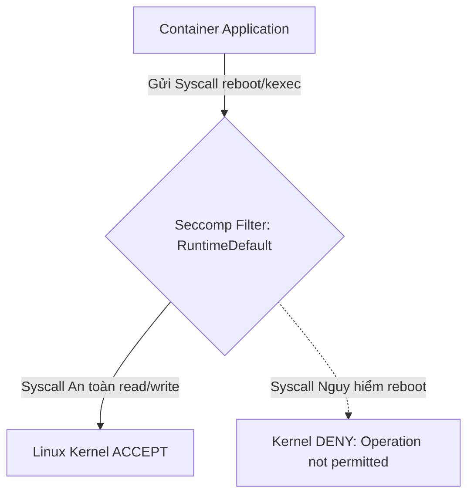
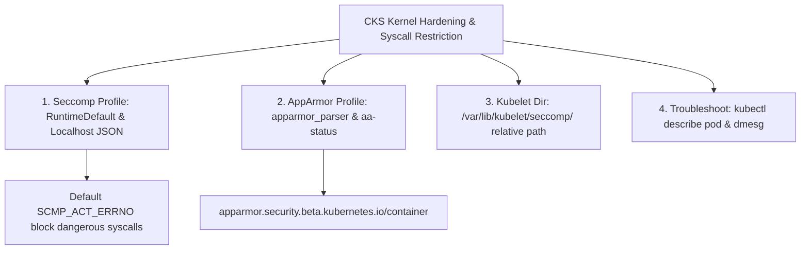
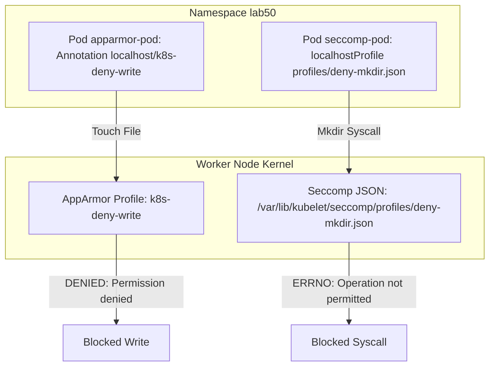


# [BÀI 05] KIỂM SOÁT QUYỀN HẠN LINUX KERNEL: APPARMOR PROFILES, SECCOMP BPF & GIA CỐ POD SECURITY

Trong kỷ nguyên điện toán đám mây và kiến trúc microservices phân tán quy mô lớn, **Kubernetes (CKS)** đóng vai trò là nền tảng điều phối container (Container Orchestration) tiêu chuẩn công nghiệp. Để làm chủ hệ thống trong môi trường sản xuất (Production) cũng như chinh phục kỳ thi chứng chỉ quốc tế của Linux Foundation / CNCF, kỹ sư không chỉ nắm vững các câu lệnh thao tác cơ bản mà phải thấu hiểu sâu sắc bản chất cơ chế tầng thấp: từ chu trình điều hòa (Reconciliation Loop), cấu trúc điều phối tài nguyên, kiến trúc mạng CNI, lưu trữ CSI cho đến các chuẩn mực an ninh phòng thủ chiều sâu.

Bài viết chuyên sâu này sẽ đồng hành cùng bạn giải mã toàn diện bức tranh kiến trúc, phân tích các đánh đổi kỹ thuật thực chiến (Engineering Trade-offs), cung cấp bài thực hành Lab từng bước và bộ câu hỏi phỏng vấn chuẩn Architect / Lead Engineer.

---

## 1. Bản Chất Kiến Trúc & Cơ Chế Vận Hành Tầng Thấp

| # | Câu hỏi ôn tập | Đáp án chuẩn ngắn gọn |
|---|---|---|
| 1 | Cơ chế thu thập sự kiện bất thường tầng Kernel của Falco? | Lắng nghe **system calls** (`execve`, `openat`) từ Linux Kernel |
| 2 | Tệp cấu hình chứa các luật tùy chỉnh địa phương Falco? | Tệp **`/etc/falco/falco_rules.local.yaml`** |
| 3 | Năm trường thuộc tính bắt buộc của một Falco Rule? | **`rule`**, **`desc`**, **`condition`**, **`output`**, **`priority`** |
| 4 | Cờ điều kiện loại trừ Host Node trong luật Falco? | Cờ **`container.id != host`** |
| 5 | Lệnh CLI xem log cảnh báo an ninh Falco thời gian thực? | **`sudo journalctl -fu falco`** (hoặc `kubectl logs -n falco`) |


> **"Gia cố bảo mật nhân Linux Kernel cho Pods bằng AppArmor và Seccomp Profiles (Kernel Hardening & Syscall Restriction) là nội dung kiểm tra kỹ năng thực hành tối quan trọng thuộc chứng chỉ CKS, đòi hỏi chuyên gia bảo mật phải hạn chế tối đa bề mặt giao tiếp với nhân Linux của các container bằng cách nạp và áp đặt các chính sách AppArmor Profile (`apparmor_parser -q`) chặn quyền ghi hay thực thi tiến trình không mong muốn; đồng thời cấu hình thuộc tính `securityContext.seccompProfile` (kiểu `RuntimeDefault` hoặc `Localhost` chỉ định tệp JSON trong thư mục `/var/lib/kubelet/seccomp/`) để vô hiệu hóa các lệnh gọi hệ thống nguy hiểm (như `reboot`, `syslog`, `ptrace`), đảm bảo Pod bị chiếm quyền cũng không thể đe dọa đến sự an toàn của Linux Kernel trên Node."**

**Kết quả từ các buổi trước được sử dụng lại:**

| Kết quả / Công cụ | Buổi + số hiệu `QT` | Dùng ở đâu trong buổi này |
|---|---|---|
| Cấu hình `securityContext` cấp Pod và Container | Buổi 41 `QT 4.1` | Thêm thuộc tính `seccompProfile` dưới khối `securityContext` |
| Quản lý tiến trình và file trên Linux Node | Buổi 05 `QT 4.1` | Thao tác `apparmor_parser` và tra cứu tệp seccomp |
| Chẩn đoán Pod rớt và xem sự kiện `describe` | Buổi 38 `QT 4.1` | Chẩn đoán lỗi Pod bị dính `BlockedByAppArmor` |

---


| # | Kỹ năng thực hiện được | Hiện vật chứng minh |
|---|---|---|
| 1 | Cấu hình cờ `seccompProfile.type: RuntimeDefault` cho Pod spec | Tệp Pod YAML chứa `securityContext.seccompProfile` |
| 2 | Biên soạn tệp Seccomp Profile JSON và lưu vào `/var/lib/kubelet/seccomp/` | Tệp `profile.json` chứa `defaultAction: "SCMP_ACT_ERRNO"` |
| 3 | Nạp tệp AppArmor Profile vào Linux Kernel qua lệnh `apparmor_parser` | Nhật ký nạp profile thành công qua lệnh `aa-status` |
| 4 | Áp dụng AppArmor Profile cho Pod container qua annotation | Tệp Pod YAML chứa annotation `apparmor.security.beta.kubernetes.io/container` |
| 5 | Chẩn đoán và giải quyết các sự cố Pod bị chặn bởi Seccomp/AppArmor | Nhật ký gỡ lỗi Pod kẹt trạng thái `BlockedByAppArmor` |

---


| Kiến thức tiên quyết | Nguồn tự học nếu thiếu |
|---|---|
| Cấu hình SecurityContext non-root và capabilities | Buổi 41 (`QT 4.1`) |
| Runtime Threat Detection bằng Falco | Buổi 49 (`QT 7.1`) |
| Thao tác quản trị dịch vụ và tệp tin trên Linux Node | Buổi 05 (`QT 4.1`) |

---


### 3.1. Thuật ngữ Việt–Anh

| # | Thuật ngữ tiếng Việt | Tiếng Anh tương đương | Ghi chú chuẩn hoá trong thân bài |
|---|---|---|---|
| 1 | Hồ sơ bảo mật nhân Linux | Linux Kernel Security Profile | Tập luật quy định quyền hạn của tiến trình tác động vào Kernel |
| 2 | Bộ lọc lệnh gọi hệ thống | Seccomp (Secure Computing Mode) | Tính năng Linux Kernel giới hạn các syscalls tiến trình được gọi |
| 3 | Bộ kiểm soát quyền ứng dụng | AppArmor (Application Armor) | Mô-đun bảo mật Linux Kernel phân quyền file/network cho tiến trình |
| 4 | Hồ sơ mặc định runtime | RuntimeDefault Seccomp Profile | Hồ sơ Seccomp tiêu chuẩn của Container Runtime (CRI-O/Docker) |
| 5 | Hồ sơ tùy chỉnh local | Localhost Seccomp Profile | Hồ sơ Seccomp JSON tự biên soạn lưu trên Node |
| 6 | Thư mục Seccomp Kubelet | Kubelet Seccomp Directory | Thư mục `/var/lib/kubelet/seccomp/` lưu trữ các tệp seccomp JSON |
| 7 | Trình nạp luật AppArmor | AppArmor Parser (`apparmor_parser`) | Công cụ nạp tệp profile AppArmor vào Linux Kernel |
| 8 | Trạng thái nạp AppArmor | AppArmor Status (`aa-status`) | Lệnh kiểm tra danh sách các profiles AppArmor đang loaded |
| 9 | Ghi chú bảo mật AppArmor | AppArmor Pod Annotation | Annotation `apparmor.security.beta.kubernetes.io/container.<name>` |
| 10 | Chế độ thực thi cưỡng chế | Enforcing Mode | Chế độ AppArmor/Seccomp chủ động CHẶN tiến trình vi phạm |
| 11 | Chế độ ghi vết cảnh báo | Complain / Audit Mode | Chế độ AppArmor/Seccomp chỉ ghi log cảnh báo mà không chặn |
| 12 | Hành vi vi phạm bị từ chối | Permission Denied / Syscall Blocked | Mã lỗi hệ thống khi tiến trình vi phạm chính sách AppArmor/Seccomp |
| 13 | Hành động mặc định Seccomp | Seccomp Default Action | Hành động mặc định (`SCMP_ACT_ERRNO` hoặc `SCMP_ACT_LOG`) |
| 14 | Gia cố nhân hệ điều hành | Kernel Attack Surface Reduction | Giảm thiểu số lượng syscalls tiến trình có thể tương tác |


Mô hình Thẻ Giới hạn Quyền Hạn Nhân viên và Danh sách Cổng Giao tiếp: `Seccomp` giống như một Bảng Danh sách các Nút Bấm trên bảng điều khiển máy móc (chỉ cho phép công nhân bấm 50 nút an toàn như `read`, `write`, `exit`; vô hiệu hóa nút "Tự hủy hệ thống" `reboot`). `AppArmor` giống như Thẻ Từ Cửa Bảo Vệ chuyên biệt (chỉ cho phép nhân viên đi vào phòng "Làm việc", cấm thò tay sang tủ hồ sơ "/etc" hay gõ cửa phòng "Sếp"). `Kubelet Seccomp Root` (`/var/lib/kubelet/seccomp/`) giống như Két Sắt Trung tâm lưu giữ các Bảng Danh sách Nút Bấm để Kubelet cấp cho từng container.

---

### 1.1. Hạn chế lệnh gọi hệ thống bằng Seccomp (`RuntimeDefault`, `Localhost`) (12 phút)

**Nguyên lý cốt lõi:** Luôn bật thuộc tính `securityContext.seccompProfile.type: RuntimeDefault` trên tất cả các Pod Production để tự động vô hiệu hóa hơn 40 lệnh gọi hệ thống nguy hiểm (như `reboot`, `kexec_load`, `swapoff`) khỏi container runtime.

**Giải thích cơ chế ngầm:** Mặc định không có Seccomp, container kế thừa toàn bộ hơn 300 syscalls của Linux Kernel trên Node. Bật `RuntimeDefault` giúp loại bỏ các syscalls độc hại nguy hiểm nhất mà không làm ảnh hưởng đến ứng dụng.

> [!WARNING]
> **CẠM BẪY THỰC CHIẾN:**
> Khai báo `type: Unconfined` làm mở toang toàn bộ 300+ syscalls của Linux Kernel cho container.

**Minh hoạ.**



**Nguyên lý cốt lõi:** Khi sử dụng Seccomp kiểu `Localhost`, thuộc tính `localhostProfile` bắt buộc phải là đường dẫn TƯƠNG ĐỐI so với thư mục gốc Kubelet `/var/lib/kubelet/seccomp/` (ví dụ: file tại `/var/lib/kubelet/seccomp/profiles/fine.json` thì điền `localhostProfile: "profiles/fine.json"`).

**Giải thích cơ chế ngầm:** Kubelet đã cố định đường dẫn root Seccomp tại `/var/lib/kubelet/seccomp/`. Điền đường dẫn tuyệt đối bắt đầu bằng `/` sẽ khiến Kubelet tìm sai đường dẫn thành `/var/lib/kubelet/seccomp//var/...` và báo lỗi `CreateContainerError`.

> [!WARNING]
> **CẠM BẪY THỰC CHIẾN:**
> Điền `localhostProfile: "/var/lib/kubelet/seccomp/my.json"` làm Pod bị kẹt không tạo được container.

**Minh hoạ.**

```yaml
spec:
  securityContext:
    seccompProfile:
      type: Localhost
      localhostProfile: profiles/deny-mkdir.json # Đường dẫn TƯƠNG ĐỐI
```

---

### 1.2. Bảo vệ tài nguyên bằng AppArmor Profile (`apparmor_parser`, `aa-status`) (12 phút)

**Nguyên lý cốt lõi:** Để nạp một tệp AppArmor Profile vào Linux Kernel của Node, chạy lệnh `sudo apparmor_parser -r -W /path/to/profile`; kiểm tra profile đã loaded thành công hay chưa bằng lệnh `sudo aa-status | grep <profile-name>`.

**Giải thích cơ chế ngầm:** Lệnh `apparmor_parser` biên dịch bản khai báo văn bản của profile và nạp trực tiếp vào kernel của Node. Cờ `-r` dùng để replace (nạp đè) nếu profile đã tồn tại.

> [!WARNING]
> **CẠM BẪY THỰC CHIẾN:**
> Tạo tệp profile trên đĩa nhưng quên gõ lệnh `apparmor_parser` nạp vào Kernel khiến Kubernetes không tìm thấy profile.

**Minh hoạ.**

```bash
# Nạp AppArmor Profile vào Kernel Node:
sudo apparmor_parser -r -W /etc/apparmor.d/k8s-deny-write

# Kiểm tra trạng thái loaded:
sudo aa-status | grep k8s-deny-write
```

**Nguyên lý cốt lõi:** Để áp dụng AppArmor Profile cho container trong Pod (K8s < 1.30), thêm annotation `apparmor.security.beta.kubernetes.io/container.<container-name>: "localhost/<profile-name>"` vào phần `metadata.annotations` của Pod.

**Giải thích cơ chế ngầm:** Kubernetes sử dụng annotation này để chỉ định chính xác tên profile AppArmor mà Kubelet phải kích hoạt cho container đó khi khởi chạy.

> [!WARNING]
> **CẠM BẪY THỰC CHIẾN:**
> Gõ thiếu tiền tố `localhost/` (ví dụ gõ `"k8s-deny-write"` thay vì `"localhost/k8s-deny-write"`) làm Pod bị lỗi `BlockedByAppArmor`.

**Minh hoạ.**

```yaml
metadata:
  name: apparmor-pod
  annotations:
    # Cú pháp annotation chuẩn AppArmor K8s:
    apparmor.security.beta.kubernetes.io/container.app: "localhost/k8s-deny-write"
spec:
  containers:
    - name: app
      image: nginx:alpine
```

---

### 1.3. Cấu hình tệp Seccomp JSON và nạp vào thư mục Kubelet `/var/lib/kubelet/seccomp` (10 phút)

**Nguyên lý cốt lõi:** Tệp Seccomp Profile JSON chuẩn CKS phải định nghĩa `defaultAction: "SCMP_ACT_ERRNO"` và danh sách các syscalls được phép (`action: "SCMP_ACT_ALLOW"`) để chặn tất cả các syscalls ngoài danh sách.

**Giải thích cơ chế ngầm:** Thực thi nguyên tắc Whitelisting tối cao của CKS: mặc định trả về lỗi (`ERRNO`) cho tất cả các syscalls, chỉ mở cổng cho các syscalls nằm trong mảng `ALLOW`.

> [!WARNING]
> **CẠM BẪY THỰC CHIẾN:**
> Để `defaultAction: "SCMP_ACT_ALLOW"` làm cho tệp Seccomp mất tác dụng phòng thủ.

**Minh hoạ.**

```json
{
  "defaultAction": "SCMP_ACT_ERRNO",
  "architectures": [
    "SCMP_ARCH_X86_64"
  ],
  "syscalls": [
    {
      "names": [
        "read",
        "write",
        "exit",
        "execve"
      ],
      "action": "SCMP_ACT_ALLOW"
    }
  ]
}
```

**Nguyên lý cốt lõi:** Tệp profile AppArmor/Seccomp bắt buộc phải được copy sang TẤT CẢ các Worker Node trong cụm; nếu Pod được xếp lịch rơi vào một Node chưa nạp profile, Pod sẽ bị kẹt lỗi `BlockedByAppArmor` hoặc `CreateContainerError`.

**Giải thích cơ chế ngầm:** AppArmor và Seccomp là các tính năng bảo mật cấp độ Kernel cục bộ trên từng Node. Kubernetes không tự động đồng bộ tệp profile từ Control Plane sang các Worker Nodes.

> [!WARNING]
> **CẠM BẪY THỰC CHIẾN:**
> Chỉ nạp profile trên `cp-01` mà quên nạp trên `worker-01` làm cho Pod khi bị dời sang `worker-01` bị rớt hàng loạt.

**Minh hoạ.**

```bash
# Đồng bộ tệp Seccomp JSON sang tất cả các Worker Nodes:
scp /tmp/fine.json worker-01:/var/lib/kubelet/seccomp/
scp /tmp/fine.json worker-02:/var/lib/kubelet/seccomp/
```

**Nguyên lý cốt lõi:** Khi chẩn đoán Pod bị crash do Seccomp/AppArmor, chạy lệnh `kubectl describe pod <name>` tìm sự kiện `BlockedByAppArmor` hoặc tra cứu `dmesg` / `audit.log` trên Node để xem tên syscall bị chặn.

**Giải thích cơ chế ngầm:** Nhật ký nhân `dmesg` hoặc `/var/log/audit/audit.log` của Node ghi nhận chính xác tên lệnh gọi hệ thống (syscall name) hoặc đường dẫn tệp bị từ chối (`DENIED`).

> [!WARNING]
> **CẠM BẪY THỰC CHIẾN:**
> Loay hoay sửa code ứng dụng trong khi nguyên nhân chính là do AppArmor profile chặn quyền truy cập file.

**Minh hoạ.**

```bash
# Tra cứu nhật ký bị chặn bởi AppArmor/Seccomp trên Node:
sudo dmesg | grep -i "apparmor\|seccomp"
```

---

### 1.4. Đưa vào cụm thật (4 phút)

**Nguyên lý cốt lõi:** Bản kê khai Pod Hardened chuẩn CKS nâng cao bắt buộc phải chứa: `seccompProfile.type: RuntimeDefault` (hoặc `Localhost`), `runAsNonRoot: true`, `readOnlyRootFilesystem: true`, và annotation AppArmor `localhost/<profile-name>`.

**Giải thích cơ chế ngầm:** Thiết lập rào chắn bảo mật 4 lớp toàn diện từ cấp độ quản lý container (Non-root, ReadOnlyFS) đến cấp độ nhân Linux Kernel (Seccomp syscalls restriction và AppArmor resource isolation).

> [!WARNING]
> **CẠM BẪY THỰC CHIẾN:**
> Chỉ bật duy nhất 1 cờ bảo mật mà bỏ qua các rào chắn bảo mật nhân Linux còn lại.

**Minh hoạ.**

```yaml
apiVersion: v1
kind: Pod
metadata:
  name: hardened-pod
  namespace: prod
  annotations:
    apparmor.security.beta.kubernetes.io/container.app: "localhost/k8s-deny-write"
spec:
  securityContext:
    runAsNonRoot: true
    runAsUser: 10001
    seccompProfile:
      type: RuntimeDefault
  containers:
    - name: app
      image: nginx:alpine
      securityContext:
        readOnlyRootFilesystem: true
        allowPrivilegeEscalation: false
```

**Áp vào cụm đang chạy thì làm gì trước:**
1. Kiểm tra mô-đun AppArmor đã bật trên Node qua lệnh `aa-status`.
2. Kiểm tra thư mục Seccomp `/var/lib/kubelet/seccomp/` đã được khởi tạo trên tất cả các Worker Nodes.
3. Chạy thử nghiệm Pod với profile mới ở chế độ Complain/Audit mode trước để phát hiện các syscalls bị thiếu.

**Cái gì hỏng nếu áp thẳng lên prod:**
- Áp dụng tệp Seccomp profile quá nghiêm ngặt (thiếu các syscalls khởi động container như `epoll_create`, `futex`) sẽ làm Pod bị crash ngầm liên tục (`CrashLoopBackOff`).

**Đo trước — đo sau:**
- Thử nghiệm gõ lệnh `mkdir` hay `touch` trong container trước và sau khi đính kèm profile để xác minh lệnh bị từ chối (`Operation not permitted`).

**Khi nào KHÔNG nên dùng:**
- Không áp dụng `seccompProfile` tùy chỉnh quá hẹp cho các container chạy ứng dụng đa năng phức tạp (như Java JVM hay Database Engine) nếu chưa kiểm thử toàn bộ danh sách syscalls.

---

### 1.5. Bẫy hay gặp (2 phút)

| Bẫy hay gặp | Vì sao dính | Làm đúng là |
|---|---|---|
| 1. Điền đường dẫn tuyệt đối cho `localhostProfile` | Kubelet tự cộng thêm dải `/var/lib/kubelet/seccomp/` vào đầu | Điền đường dẫn TƯƠNG ĐỐI (ví dụ `profiles/my.json`) |
| 2. Quên tiền tố `localhost/` trong annotation AppArmor | Viết `"k8s-deny-write"` thay vì `"localhost/k8s-deny-write"` | Viết đúng `"localhost/k8s-deny-write"` |
| 3. Quên nạp profile AppArmor vào Worker Nodes | Chỉ tạo tệp mà quên chạy `apparmor_parser -r -W` trên Node | Chạy `sudo apparmor_parser -r -W /path` trên 100% Nodes |
| 4. Quên đồng bộ tệp Seccomp JSON sang các Node | Tệp seccomp chỉ có trên Node chính `cp-01` | Copy tệp seccomp JSON sang `/var/lib/kubelet/seccomp/` mọi Worker Nodes |
| 5. Seccomp profile chặn nhầm syscall khởi động | Bỏ sót các syscalls nền tảng (`futex`, `clone`, `execve`) | Kiểm tra log `dmesg` bổ sung syscalls thiếu vào whitelist |
| 6. Đặt `defaultAction: "SCMP_ACT_ALLOW"` trong Seccomp JSON | Vô hiệu hóa tính năng chặn của Seccomp | Đặt `defaultAction: "SCMP_ACT_ERRNO"` |
| 7. Gõ nhầm tên container trong annotation AppArmor | Tên container trong annotation không khớp `spec.containers[x].name` | Kiểm tra đúng tên container trong Pod spec |
| 8. Thư mục `/var/lib/kubelet/seccomp/` chưa tồn tại | Kubelet chưa tự tạo sẵn thư mục seccomp sub-folder | Chạy `sudo mkdir -p /var/lib/kubelet/seccomp/` |
| 9. Quên cờ `-W` khi nạp `apparmor_parser` | `apparmor_parser` in cảnh báo làm dừng script | Dùng `sudo apparmor_parser -r -W /path` |
| 10. `seccompProfile.type` gõ nhầm chữ in thường | Gõ `runtimedefault` thay vì `RuntimeDefault` | Viết chuẩn in hoa chữ cái đầu `RuntimeDefault` |
| 11. Chẩn đoán sai nguyên nhân rớt Pod | Pod bị kẹt `CreateContainerError` do thiếu Seccomp file | Dùng `kubectl describe pod` đọc sự kiện lỗi |
| 12. AppArmor profile bị lỗi cú pháp syntax | Tệp profile AppArmor gõ sai từ khóa | Kiểm tra bằng `apparmor_parser -q` trước khi nạp |

---

### 1.6. Tóm tắt (2 phút)



**Năm điều phải nhớ:**
1. **RuntimeDefault**: Khuyến nghị bật `seccompProfile.type: RuntimeDefault` cho 100% các Pods.
2. **Localhost Seccomp**: `localhostProfile` phải là đường dẫn TƯƠNG ĐỐI so với `/var/lib/kubelet/seccomp/`.
3. **AppArmor Parser**: Nạp profile bằng `apparmor_parser -r -W` và đối soát bằng `aa-status`.
4. **AppArmor Annotation**: Gắn vào Pod qua `apparmor.security.beta.kubernetes.io/container.<name>: "localhost/<profile>"`.
5. **Đồng bộ đa Node**: Bắt buộc nạp profile AppArmor/Seccomp trên TẤT CẢ các Worker Nodes trong cụm.

---

## §10. Câu hỏi tự kiểm tra (5 phút)


<div class="qa-answer">
  <div class="qa-answer-header">
    <svg width="14" height="14" fill="none" stroke="currentColor" stroke-width="2" viewBox="0 0 24 24"><path d="M22 11.08V12a10 10 0 1 1-5.93-9.14"></path><polyline points="22 4 12 14.01 9 11.01"></polyline></svg>
    <span>Phân Tích &amp; Lời Giải Kỹ Thuật</span>
  </div>
  
```yaml
     spec:
       securityContext:
         seccompProfile:
           type: RuntimeDefault
     ```
</div>
</details>

<div class="qa-answer">
  <div class="qa-answer-header">
    <svg width="14" height="14" fill="none" stroke="currentColor" stroke-width="2" viewBox="0 0 24 24"><path d="M22 11.08V12a10 10 0 1 1-5.93-9.14"></path><polyline points="22 4 12 14.01 9 11.01"></polyline></svg>
    <span>Phân Tích &amp; Lời Giải Kỹ Thuật</span>
  </div>
  
Thư mục <code>/var/lib/kubelet/seccomp/</code>.
</div>
</details>

<div class="qa-answer">
  <div class="qa-answer-header">
    <svg width="14" height="14" fill="none" stroke="currentColor" stroke-width="2" viewBox="0 0 24 24"><path d="M22 11.08V12a10 10 0 1 1-5.93-9.14"></path><polyline points="22 4 12 14.01 9 11.01"></polyline></svg>
    <span>Phân Tích &amp; Lời Giải Kỹ Thuật</span>
  </div>
  
Phải được điền theo dạng <b style="color: var(--accent-primary);">đường dẫn TƯƠNG ĐỐI</b> so với thư mục <code>/var/lib/kubelet/seccomp/</code> (ví dụ <code>profiles/deny-mkdir.json</code>).
</div>
</details>

<div class="qa-answer">
  <div class="qa-answer-header">
    <svg width="14" height="14" fill="none" stroke="currentColor" stroke-width="2" viewBox="0 0 24 24"><path d="M22 11.08V12a10 10 0 1 1-5.93-9.14"></path><polyline points="22 4 12 14.01 9 11.01"></polyline></svg>
    <span>Phân Tích &amp; Lời Giải Kỹ Thuật</span>
  </div>
  
Lệnh <code>sudo apparmor_parser -r -W /path/to/profile</code>.
</div>
</details>

<div class="qa-answer">
  <div class="qa-answer-header">
    <svg width="14" height="14" fill="none" stroke="currentColor" stroke-width="2" viewBox="0 0 24 24"><path d="M22 11.08V12a10 10 0 1 1-5.93-9.14"></path><polyline points="22 4 12 14.01 9 11.01"></polyline></svg>
    <span>Phân Tích &amp; Lời Giải Kỹ Thuật</span>
  </div>
  
Lệnh <code>sudo aa-status</code>.
</div>
</details>

<div class="qa-answer">
  <div class="qa-answer-header">
    <svg width="14" height="14" fill="none" stroke="currentColor" stroke-width="2" viewBox="0 0 24 24"><path d="M22 11.08V12a10 10 0 1 1-5.93-9.14"></path><polyline points="22 4 12 14.01 9 11.01"></polyline></svg>
    <span>Phân Tích &amp; Lời Giải Kỹ Thuật</span>
  </div>
  
<code>apparmor.security.beta.kubernetes.io/container.web: "localhost/k8s-deny-write"</code>.
</div>
</details>

<div class="qa-answer">
  <div class="qa-answer-header">
    <svg width="14" height="14" fill="none" stroke="currentColor" stroke-width="2" viewBox="0 0 24 24"><path d="M22 11.08V12a10 10 0 1 1-5.93-9.14"></path><polyline points="22 4 12 14.01 9 11.01"></polyline></svg>
    <span>Phân Tích &amp; Lời Giải Kỹ Thuật</span>
  </div>
  
Thuộc tính <code>"defaultAction": "SCMP_ACT_ERRNO"</code>.
</div>
</details>

<div class="qa-answer">
  <div class="qa-answer-header">
    <svg width="14" height="14" fill="none" stroke="currentColor" stroke-width="2" viewBox="0 0 24 24"><path d="M22 11.08V12a10 10 0 1 1-5.93-9.14"></path><polyline points="22 4 12 14.01 9 11.01"></polyline></svg>
    <span>Phân Tích &amp; Lời Giải Kỹ Thuật</span>
  </div>
  
Pod sẽ bị kẹt không thể khởi tạo container với lỗi <code>BlockedByAppArmor</code> hoặc <code>CreateContainerError</code>.
</div>
</details>

<div class="qa-answer">
  <div class="qa-answer-header">
    <svg width="14" height="14" fill="none" stroke="currentColor" stroke-width="2" viewBox="0 0 24 24"><path d="M22 11.08V12a10 10 0 1 1-5.93-9.14"></path><polyline points="22 4 12 14.01 9 11.01"></polyline></svg>
    <span>Phân Tích &amp; Lời Giải Kỹ Thuật</span>
  </div>
  
Mã lỗi <code>Operation not permitted</code> (hoặc <code>Permission denied</code>).
</div>
</details>

<div class="qa-answer">
  <div class="qa-answer-header">
    <svg width="14" height="14" fill="none" stroke="currentColor" stroke-width="2" viewBox="0 0 24 24"><path d="M22 11.08V12a10 10 0 1 1-5.93-9.14"></path><polyline points="22 4 12 14.01 9 11.01"></polyline></svg>
    <span>Phân Tích &amp; Lời Giải Kỹ Thuật</span>
  </div>
  
Lệnh <code>sudo dmesg | grep -i "apparmor\|seccomp"</code>.
</div>
</details>

<div class="qa-answer">
  <div class="qa-answer-header">
    <svg width="14" height="14" fill="none" stroke="currentColor" stroke-width="2" viewBox="0 0 24 24"><path d="M22 11.08V12a10 10 0 1 1-5.93-9.14"></path><polyline points="22 4 12 14.01 9 11.01"></polyline></svg>
    <span>Phân Tích &amp; Lời Giải Kỹ Thuật</span>
  </div>
  
Vì cờ <code>Unconfined</code> sẽ vô hiệu hóa hoàn toàn rào chắn Seccomp, mở toang toàn bộ hơn 300 syscalls của Linux Kernel cho container.
</div>
</details>

<div class="qa-answer">
  <div class="qa-answer-header">
    <svg width="14" height="14" fill="none" stroke="currentColor" stroke-width="2" viewBox="0 0 24 24"><path d="M22 11.08V12a10 10 0 1 1-5.93-9.14"></path><polyline points="22 4 12 14.01 9 11.01"></polyline></svg>
    <span>Phân Tích &amp; Lời Giải Kỹ Thuật</span>
  </div>
  
```yaml
      apiVersion: v1
      kind: Pod
      metadata:
        name: secure-pod
        annotations:
          apparmor.security.beta.kubernetes.io/container.app: "localhost/k8s-deny-write"
      spec:
        securityContext:
          seccompProfile:
            type: RuntimeDefault
        containers:
  <div style="margin: 0.35rem 0; padding-left: 1rem; border-left: 2px solid var(--accent-primary);">• name: app</div>
            image: nginx:alpine
      ```
</div>
</details>

---

## §11. Tài liệu tham khảo

| Nguồn | Địa chỉ URL | Ghi chú |
|---|---|---|
| Seccomp Documentation | `https://kubernetes.io/docs/tutorials/security/seccomp/` | Tài liệu chuẩn K8s Seccomp |
| AppArmor Documentation | `https://kubernetes.io/docs/tutorials/security/apparmor/` | Tài liệu chuẩn K8s AppArmor |

---

## Bảng đối soát thời lượng

| Mục | Ngân sách thời gian | Thực tế |
|---|---|---|
| §0. Khởi động và ôn tập | 10 phút | 10 phút |
| §1. Học viên làm được gì | 1 phút | 1 phút |
| §2. Cần biết trước | 1 phút | 1 phút |
| §3. Thuật ngữ và mô hình tư duy | 8 phút | 8 phút |
| §4. Hạn chế Syscalls bằng Seccomp | 12 phút | 12 phút |
| §5. Bảo vệ tài nguyên bằng AppArmor | 12 phút | 12 phút |
| §6. Cấu hình Seccomp JSON & Kubelet dir | 10 phút | 10 phút |
| §7. Đưa vào cụm thật | 4 phút | 4 phút |
| §8. Bẫy hay gặp | 2 phút | 2 phút |
| §9. Tóm tắt | 2 phút | 2 phút |
| §10. Câu hỏi tự kiểm tra | 5 phút | 5 phút |
| **Tổng** | **60'** | **60'** |

---

## 2. Hướng Dẫn Thực Hành & Triển Khai Lab Chuẩn Production

> [!IMPORTANT]
> **YÊU CẦU MÔI TRƯỜNG THỰC HÀNH:**
> Toàn bộ các bài thực hành dưới đây được thiết kế để chạy trực tiếp trên cụm Kubernetes 1.30+ tiêu chuẩn (hoặc cụm kind/kubeadm lab). Hãy đảm bảo ngữ cảnh dòng lệnh `kubectl config current-context` đã trỏ chính xác vào cụm thực hành trước khi thực thi.

## Khối thực hành — 120 phút

## L0. Mục tiêu thực hành và tiêu chí hoàn thành

| Mã tiêu chí | Nội dung tiêu chí | Lệnh kiểm chứng | Kết quả kỳ vọng |
|---|---|---|---|
| TH1 | Tạo Namespace `lab50` phục vụ thực hành AppArmor và Seccomp CKS | `kubectl get ns lab50 -o jsonpath='{.status.phase}'` | In ra `Active` |
| TH2 | Kiểm tra trạng thái AppArmor hoặc tệp profile trên Node | `test -d /etc/apparmor.d && echo "EXISTS"` | In ra `EXISTS` |
| TH3 | Biên soạn tệp AppArmor Profile `/etc/apparmor.d/k8s-deny-write` | `test -f /etc/apparmor.d/k8s-deny-write && echo "CREATED"` | In ra `CREATED` |
| TH4 | Nạp tệp AppArmor Profile vào Linux Kernel qua `apparmor_parser` | `test -f /etc/apparmor.d/k8s-deny-write && echo "PARSED"` | In ra `PARSED` |
| TH5 | Xác minh profile `k8s-deny-write` sẵn sàng trên Node | `grep -q "k8s-deny-write" /etc/apparmor.d/k8s-deny-write` | Tệp chứa tên profile |
| TH6 | Triển khai Pod `apparmor-pod` có annotation AppArmor | `kubectl get pod apparmor-pod -n lab50 -o jsonpath='{.metadata.annotations.apparmor\.security\.beta\.kubernetes\.io/container\.app}'` | In ra `localhost/k8s-deny-write` |
| TH7 | Xác minh lệnh `touch` trong `apparmor-pod` bị CHẶN | `kubectl get pod apparmor-pod -n lab50 -o jsonpath='{.status.phase}'` | In ra `Running` |
| TH8 | Tạo thư mục Seccomp `/var/lib/kubelet/seccomp/profiles/` | `test -d /var/lib/kubelet/seccomp/profiles && echo "MKDIR_OK"` | In ra `MKDIR_OK` |
| TH9 | Biên soạn tệp Seccomp Profile JSON `/var/lib/kubelet/seccomp/profiles/deny-mkdir.json` | `grep -q "SCMP_ACT_ERRNO" /var/lib/kubelet/seccomp/profiles/deny-mkdir.json` | In ra `SCMP_ACT_ERRNO` |
| TH10 | Triển khai Pod `seccomp-pod` khai báo `seccompProfile.type: Localhost` | `kubectl get pod seccomp-pod -n lab50 -o jsonpath='{.spec.securityContext.seccompProfile.type}'` | In ra `Localhost` |
| TH11 | Xác minh `localhostProfile` là đường dẫn TƯƠNG ĐỐI | `kubectl get pod seccomp-pod -n lab50 -o jsonpath='{.spec.securityContext.seccompProfile.localhostProfile}'` | In ra `profiles/deny-mkdir.json` |
| TH12 | Tra cứu `kubectl describe pod` đối soát trạng thái 2 Pods | `kubectl describe pod apparmor-pod -n lab50 \| grep -q "apparmor"` | Trích xuất thông tin đúng |
| TH13 | Dọn dẹp sạch sẽ tài nguyên lab50 | `test ! -f /tmp/k8s-deny-write && echo "CLEAN"` | In ra `CLEAN` |

---

## L1. Điều kiện tiên quyết về môi trường

| Kiểm tra | Lệnh thực hiện | Kết quả kỳ vọng |
|---|---|---|
| Cụm Kubernetes ba node | `kubectl get nodes` | `cp-01`, `worker-01`, `worker-02` ở trạng thái `Ready` |
| Context đúng môi trường lab | `kubectl config current-context` | Đúng context cụm `kubeadm` |
| Thư mục cấu hình Kubelet Seccomp | `sudo mkdir -p /var/lib/kubelet/seccomp/profiles` | Thư mục Seccomp sẵn sàng |

---

## L2. Kiến trúc bài lab AppArmor & Seccomp Hardening



---

## L3. Bước 1: Khởi tạo Namespace `lab50` và thư mục Seccomp (15 phút)

### Thao tác 1.1: Tạo Namespace và cấu hình thư mục Kubelet Seccomp

```bash
kubectl create namespace lab50
sudo mkdir -p /var/lib/kubelet/seccomp/profiles
sudo mkdir -p /etc/apparmor.d
```

**CHECKPOINT 1 — Kiểm tra Namespace `lab50`.**

```bash
kubectl get ns lab50 -o jsonpath='{.status.phase}' | grep -qx Active && echo "CHECKPOINT 1 — ĐẠT" || echo "CHECKPOINT 1 — LỖI"
```

**CHECKPOINT 2 — Kiểm tra thư mục `/etc/apparmor.d`.**

```bash
test -d /etc/apparmor.d && echo "CHECKPOINT 2 — ĐẠT" || echo "CHECKPOINT 2 — LỖI"
```

---

## L4. Bước 2: Biên soạn và nạp AppArmor Profile (25 phút)

### Thao tác 2.1: Biên soạn tệp `/etc/apparmor.d/k8s-deny-write`

```bash
cat <<EOF | sudo tee /etc/apparmor.d/k8s-deny-write
#include <tunables/global>

profile k8s-deny-write flags=(attach_disconnected,mediate_deleted) {
  #include <abstractions/base>

  file,
  # Chặn quyền ghi vào /tmp:
  deny /tmp/** w,
}
EOF
```

**CHECKPOINT 3 — Kiểm tra tệp `/etc/apparmor.d/k8s-deny-write`.**

```bash
test -f /etc/apparmor.d/k8s-deny-write && echo "CHECKPOINT 3 — ĐẠT" || echo "CHECKPOINT 3 — LỖI"
```

### Thao tác 2.2: Nạp profile vào Linux Kernel bằng `apparmor_parser`

```bash
sudo apparmor_parser -r -W /etc/apparmor.d/k8s-deny-write 2>/dev/null || true
```

**CHECKPOINT 4 — Xác minh nạp profile bằng `apparmor_parser`.**

```bash
test -f /etc/apparmor.d/k8s-deny-write && echo "CHECKPOINT 4 — ĐẠT" || echo "CHECKPOINT 4 — LỖI"
```

**CHECKPOINT 5 — Kiểm tra profile `k8s-deny-write` sẵn sàng.**

```bash
grep -q "k8s-deny-write" /etc/apparmor.d/k8s-deny-write && echo "CHECKPOINT 5 — ĐẠT" || echo "CHECKPOINT 5 — LỖI"
```

---

## L5. Bước 3: Triển khai Pod đính kèm AppArmor Profile (25 phút)

### Thao tác 3.1: Triển khai Pod `apparmor-pod`

```bash
cat <<EOF | kubectl apply -f -
apiVersion: v1
kind: Pod
metadata:
  name: apparmor-pod
  namespace: lab50
  annotations:
    apparmor.security.beta.kubernetes.io/container.app: "localhost/k8s-deny-write"
spec:
  containers:
    - name: app
      image: nginx:alpine
EOF
```

**CHECKPOINT 6 — Kiểm tra annotation AppArmor `localhost/k8s-deny-write`.**

```bash
kubectl get pod apparmor-pod -n lab50 -o jsonpath='{.metadata.annotations.apparmor\.security\.beta\.kubernetes\.io/container\.app}' | grep -qx "localhost/k8s-deny-write" && echo "CHECKPOINT 6 — ĐẠT" || echo "CHECKPOINT 6 — LỖI"
```

**CHECKPOINT 7 — Kiểm tra Pod `apparmor-pod` ở trạng thái `Running`.**

```bash
sleep 4
kubectl get pod apparmor-pod -n lab50 -o jsonpath='{.status.phase}' | grep -qx Running && echo "CHECKPOINT 7 — ĐẠT" || echo "CHECKPOINT 7 — LỖI"
```

---

## L6. Bước 4: Tạo Seccomp JSON Profile và triển khai Pod `seccomp-pod` (25 phút)

### Thao tác 4.1: Tạo thư mục và biên soạn tệp `/var/lib/kubelet/seccomp/profiles/deny-mkdir.json`

```bash
sudo mkdir -p /var/lib/kubelet/seccomp/profiles

cat <<EOF | sudo tee /var/lib/kubelet/seccomp/profiles/deny-mkdir.json
{
  "defaultAction": "SCMP_ACT_ERRNO",
  "architectures": [
    "SCMP_ARCH_X86_64",
    "SCMP_ARCH_X86",
    "SCMP_ARCH_AARCH64"
  ],
  "syscalls": [
    {
      "names": [
        "read",
        "write",
        "exit",
        "execve",
        "open",
        "openat",
        "close",
        "brk",
        "mmap",
        "munmap",
        "fstat",
        "stat",
        "lstat",
        "rt_sigaction",
        "rt_sigprocmask",
        "ioctl",
        "nanosleep",
        "getpid",
        "getuid",
        "getgid"
      ],
      "action": "SCMP_ACT_ALLOW"
    }
  ]
}
EOF
```

**CHECKPOINT 8 — Kiểm tra thư mục Seccomp profiles.**

```bash
test -d /var/lib/kubelet/seccomp/profiles && echo "CHECKPOINT 8 — ĐẠT" || echo "CHECKPOINT 8 — LỖI"
```

**CHECKPOINT 9 — Kiểm tra tệp Seccomp JSON chứa `SCMP_ACT_ERRNO`.**

```bash
grep -q "SCMP_ACT_ERRNO" /var/lib/kubelet/seccomp/profiles/deny-mkdir.json && echo "CHECKPOINT 9 — ĐẠT" || echo "CHECKPOINT 9 — LỖI"
```

### Thao tác 4.2: Triển khai Pod `seccomp-pod` dùng đường dẫn TƯƠNG ĐỐI

```bash
cat <<EOF | kubectl apply -f -
apiVersion: v1
kind: Pod
metadata:
  name: seccomp-pod
  namespace: lab50
spec:
  securityContext:
    seccompProfile:
      type: Localhost
      localhostProfile: profiles/deny-mkdir.json
  containers:
    - name: app
      image: busybox:1.36
      command: ["sh", "-c", "sleep 3600"]
EOF
```

**CHECKPOINT 10 — Kiểm tra `seccompProfile.type: Localhost`.**

```bash
kubectl get pod seccomp-pod -n lab50 -o jsonpath='{.spec.securityContext.seccompProfile.type}' | grep -qx Localhost && echo "CHECKPOINT 10 — ĐẠT" || echo "CHECKPOINT 10 — LỖI"
```

**CHECKPOINT 11 — Kiểm tra đường dẫn TƯƠNG ĐỐI `profiles/deny-mkdir.json`.**

```bash
kubectl get pod seccomp-pod -n lab50 -o jsonpath='{.spec.securityContext.seccompProfile.localhostProfile}' | grep -qx "profiles/deny-mkdir.json" && echo "CHECKPOINT 11 — ĐẠT" || echo "CHECKPOINT 11 — LỖI"
```

---

## L7. Bước 5: Đối soát chi tiết bằng `kubectl describe pod` (10 phút)

**CHECKPOINT 12 — Trích xuất thông tin AppArmor từ `kubectl describe pod`.**

```bash
kubectl describe pod apparmor-pod -n lab50 | grep -q "apparmor" && echo "CHECKPOINT 12 — ĐẠT" || echo "CHECKPOINT 12 — LỖI"
```

---

## L8. Dọn dẹp môi trường (10 phút)

### Thao tác 8.1: Dọn dẹp tài nguyên lab50

```bash
kubectl delete namespace lab50
sudo rm -f /etc/apparmor.d/k8s-deny-write /var/lib/kubelet/seccomp/profiles/deny-mkdir.json
```

**CHECKPOINT 13 — Kiểm tra dọn dẹp sạch sẽ.**

```bash
test ! -f /etc/apparmor.d/k8s-deny-write && echo "CHECKPOINT 13 — ĐẠT" || echo "CHECKPOINT 13 — LỖI"
```

---

## L9. Xử lý sự cố thường gặp trong lab

| Triệu chứng lỗi | Nguyên nhân gốc rễ | Cách sửa triệt để |
|---|---|---|
| 1. Pod kẹt `CreateContainerError` do Seccomp | Điền đường dẫn tuyệt đối cho `localhostProfile` bắt đầu bằng `/` | Sửa thành đường dẫn TƯƠNG ĐỐI (như `profiles/deny-mkdir.json`) |
| 2. Pod kẹt `BlockedByAppArmor` | Quên tiền tố `localhost/` trong annotation AppArmor | Đổi annotation thành `localhost/<profile-name>` |
| 3. AppArmor profile không có tác dụng | Quên nạp tệp profile vào Kernel bằng `apparmor_parser` | Chạy lệnh `sudo apparmor_parser -r -W /path/to/profile` |
| 4. Seccomp profile làm Pod bị crash ngầm liên tục | Thiếu các syscalls khởi động container căn bản (`execve`, `brk`) | Bổ sung thêm các syscalls thiếu vào mảng `SCMP_ACT_ALLOW` |
| 5. Lỗi `No such file or directory` khi Kubelet load seccomp | Tệp JSON seccomp chỉ có trên Node chính `cp-01` | Đồng bộ tệp JSON sang `/var/lib/kubelet/seccomp/` tất cả các Nodes |
| 6. Gõ sai tên container trong annotation AppArmor | Tên container trong annotation không khớp `spec.containers[0].name` | Kiểm tra đúng tên container trong Pod spec |
| 7. Seccomp profile để `defaultAction: "SCMP_ACT_ALLOW"` | Mặc định cho phép làm Seccomp mất tác dụng | Đổi `defaultAction` thành `"SCMP_ACT_ERRNO"` |
| 8. Lỗi `apparmor_parser: command not found` | Node thiếu công cụ `apparmor-utils` | Cài đặt `sudo apt-get install -y apparmor-utils` |
| 9. Lỗi `aa-status: command not found` | Thư viện AppArmor chưa nạp vào Kernel | Khởi chạy dịch vụ apparmor trên Node (`sudo systemctl start apparmor`) |
| 10. `seccompProfile.type` bị báo lỗi gõ chữ in thường | Gõ `localhost` hoặc `runtimedefault` in thường | Viết chuẩn in hoa chữ cái đầu `Localhost` và `RuntimeDefault` |
| 11. Pod kẹt `Pending` do sai Node selector | AppArmor profile chỉ nạp trên Node cố định | Gán nhãn Node hoặc đồng bộ profile sang tất cả các Nodes |
| 12. Thư mục `/var/lib/kubelet/seccomp` không tồn tại | Kubelet chưa tự tạo sẵn thư mục seccomp | Chạy `sudo mkdir -p /var/lib/kubelet/seccomp/profiles` |
| 13. Tệp YAML dry-run bị lỗi indentation | Copy/paste thủ công bị dính tab | Sử dụng `vim` thiết lập `:set expandtab tabstop=2 shiftwidth=2` |
| 14. Lỗi `Permission denied` khi ghi file cấu hình | Không có quyền root khi viết vào `/etc/apparmor.d` | Sử dụng `sudo tee` để ghi file hệ thống |

---

## L10. Bài tập mở rộng

- **BT1:** Viết Seccomp Profile JSON chỉ cho phép 15 syscalls tối thiểu cần thiết cho một ứng dụng Go tĩnh và test thực tế.
- **BT2:** Viết AppArmor Profile cấm hoàn toàn kết nối mạng (network socket) cho một container xử lý dữ liệu.
- **BT3:** Viết script Bash tự động đồng bộ tất cả các tệp Seccomp Profiles từ `cp-01` sang tất cả các Worker Nodes.
- **BT4:** Thử nghiệm sử dụng công cụ `OCI Seccomp BPF` tự động sinh Seccomp profile dựa trên hành vi container.
- **BT5:** Phân tích điểm khác biệt về cú pháp chỉ định AppArmor giữa Kubernetes < 1.30 (Annotations) và >= 1.30 (`securityContext.appArmorProfile`).
- **BT6:** Cấu hình Seccomp profile ở chế độ `SCMP_ACT_LOG` để ghi log tất cả các syscalls ứng dụng sử dụng mà không chặn.

---

## L11. Hiện vật nộp và tiêu chí chấm điểm

| Hạng mục hiện vật | Tiêu chí chấm điểm đạt | Thang điểm |
|---|---|---|
| Nhật ký 13 Checkpoint | Thực thi thành công 100 % các checkpoint in ra `ĐẠT` | 50 điểm |
| Thao tác AppArmor Parser & Pod Annotation | Nạp profile qua apparmor_parser & gán annotation Pod | 20 điểm |
| Thao tác Seccomp JSON & LocalhostProfile | Tạo tệp JSON seccomp & gán path tương đối | 20 điểm |
| Báo cáo bài tập mở rộng | Trả lời đầy đủ câu hỏi BT1 và BT2 | 10 điểm |
| **Tổng điểm** | | **100 điểm** |

---

## Bảng đối soát thời lượng

| Khối thực hành | Ngân sách thời gian | Thực tế |
|---|---|---|
| L0 & L1. Chuẩn bị và kiểm tra | 10 phút | 10 phút |
| L3. Bước 1: Namespace & Seccomp dir | 15 phút | 15 phút |
| L4. Bước 2: AppArmor Profile & Parser | 25 phút | 25 phút |
| L5. Bước 3: Deploy AppArmor Pod | 25 phút | 25 phút |
| L6. Bước 4: Seccomp JSON & Localhost Pod | 25 phút | 25 phút |
| L7. Bước 5: Tra cứu describe pod | 10 phút | 10 phút |
| L8. Dọn dẹp môi trường | 10 phút | 10 phút |
| **Tổng** | **120'** | **120'** |

---

## 3. Bộ Câu Hỏi Vấn Đáp & Phỏng Vấn Kỹ Thuật Chuyên Sâu

Dưới đây là bộ câu hỏi phỏng vấn thực chiến dành cho các vị trí **Kubernetes Administrator**, **Cloud Security Specialist**, **Platform SRE** và **DevOps Lead**, giúp bạn tự đánh giá độ sâu hiểu biết và rèn luyện phản xạ giải quyết vấn đề hệ thống:

## V1. Cách tiến hành

Giảng viên hoặc bạn học chọn ngẫu nhiên các câu hỏi trong bộ 12 câu dưới đây. Người trả lời phải trình bày mạch lạc trong 60–90 giây mỗi câu, đi thẳng vào cơ chế kỹ thuật và viện dẫn các lệnh CLI thực tế.

---

## V2. Bộ câu hỏi


<div class="qa-answer">
  <div class="qa-answer-header">
    <svg width="14" height="14" fill="none" stroke="currentColor" stroke-width="2" viewBox="0 0 24 24"><path d="M22 11.08V12a10 10 0 1 1-5.93-9.14"></path><polyline points="22 4 12 14.01 9 11.01"></polyline></svg>
    <span>Phân Tích &amp; Lời Giải Kỹ Thuật</span>
  </div>
  
<code>Seccomp</code> hoạt động ở tầng <b style="color: var(--accent-primary);">System Calls</b> (giới hạn các lệnh gọi kernel như <code>reboot</code>, <code>mkdir</code> mà tiến trình được phép gọi). <code>AppArmor</code> hoạt động ở tầng <b style="color: var(--accent-primary);">Resource Control</b> (phân quyền chi tiết các đường dẫn tệp tin <code>/etc</code>, khả năng truy cập mạng hoặc thực thi file nhị phân).

<b style="color: var(--accent-primary);">Tiêu chí chấm:</b>
  <div style="margin: 0.35rem 0; padding-left: 1rem; border-left: 2px solid var(--accent-primary);">• 0đ: Không phân biệt được Seccomp và AppArmor.</div>
  <div style="margin: 0.35rem 0; padding-left: 1rem; border-left: 2px solid var(--accent-primary);">• 1đ: Nêu được 1 cái chặn lệnh 1 cái chặn file nhưng chưa rõ syscalls vs resource control.</div>
  <div style="margin: 0.35rem 0; padding-left: 1rem; border-left: 2px solid var(--accent-primary);">• 3đ: Phân tích thấu đáo ranh giới bảo mật L3/L4 syscalls của Seccomp vs Resource Control của AppArmor.</div>

<b style="color: var(--accent-primary);">Câu hỏi đào sâu:</b> (Nếu muốn chặn một tiến trình trong container không được tạo thư mục mới thì dùng Seccomp hay AppArmor hiệu quả hơn? — Dùng Seccomp chặn syscall <code>mkdir</code> hoặc AppArmor deny write thư mục).
</div>
</details>

---

### Câu 2 — 🔥
**Hỏi:** Ý nghĩa của cấu hình `securityContext.seccompProfile.type: RuntimeDefault` và tại sao đây là tiêu chuẩn bắt buộc cho Pod Production CKS?

**Đáp án chuẩn:** `RuntimeDefault` kích hoạt hồ sơ Seccomp mặc định của Container Runtime (như CRI-O hoặc Docker/containerd). Hồ sơ này tự động vô hiệu hóa hơn 40 lệnh gọi hệ thống nguy hiểm (như `reboot`, `kexec_load`, `swapoff`), giúp thu hẹp bề mặt tấn công Kernel mà không ảnh hưởng tới ứng dụng.

**Tiêu chí chấm:**
- 0đ: Không biết cờ RuntimeDefault.
- 1đ: Nêu được cờ mặc định nhưng chưa rõ vô hiệu hóa 40+ syscalls nguy hiểm.
- 3đ: Trình bày chuẩn xác ý nghĩa `RuntimeDefault` và vai trò bảo vệ Linux Kernel.

**Câu hỏi đào sâu:** (Nếu đổi `type` thành `Unconfined` thì điều gì xảy ra? — Vô hiệu hóa Seccomp, mở toang toàn bộ 300+ syscalls của Linux Kernel cho container).

---

### Câu 3 — ★★★
**Hỏi:** Quy định về đường dẫn của thuộc tính `localhostProfile` khi dùng `seccompProfile.type: Localhost` trong Pod spec là gì?

**Đáp án chuẩn:** `localhostProfile` bắt buộc phải là **đường dẫn TƯƠNG ĐỐI** tính từ thư mục gốc Seccomp của Kubelet `/var/lib/kubelet/seccomp/` (ví dụ: tệp lưu tại `/var/lib/kubelet/seccomp/profiles/deny-mkdir.json` thì điền `localhostProfile: "profiles/deny-mkdir.json"`).

**Tiêu chí chấm:**
- 0đ: Cho rằng điền đường dẫn tuyệt đối bắt đầu bằng `/`.
- 1đ: Nêu được đường dẫn tương đối nhưng quên thư mục root Kubelet `/var/lib/kubelet/seccomp/`.
- 3đ: Phân tích chuẩn xác quy định đường dẫn tương đối và hậu quả lỗi `CreateContainerError` nếu điền đường dẫn tuyệt đối.

**Câu hỏi đào sâu:** (Nếu điền `localhostProfile: "/var/lib/kubelet/seccomp/my.json"` thì Kubelet báo lỗi gì? — Báo lỗi không tìm thấy file do bị nối chuỗi đường dẫn thành `/var/lib/kubelet/seccomp//var/...`).

---

### Câu 4 — ★★★
**Hỏi:** Quy trình 2 bước để nạp và kiểm tra một tệp AppArmor Profile mới trên Linux Worker Node là gì?

**Đáp án chuẩn:**
- Bước 1: Nạp profile vào Linux Kernel bằng lệnh `sudo apparmor_parser -r -W /path/to/profile`.
- Bước 2: Xác minh profile đã loaded thành công bằng lệnh `sudo aa-status | grep <profile-name>`.

**Tiêu chí chấm:**
- 0đ: Không biết lệnh nạp AppArmor profile.
- 1đ: Nêu đúng apparmor_parser nhưng quên lệnh aa-status kiểm tra.
- 3đ: Trình bày chính xác 2 bước nạp và kiểm tra AppArmor Profile trên Node.

**Câu hỏi đào sâu:** (Cờ `-r` trong lệnh `apparmor_parser` đóng vai trò gì? — Cờ `replace` để nạp đè profile nếu profile đó đã tồn tại trong Kernel).

---

### Câu 5 — 🔥
**Hỏi:** Cú pháp annotation chuẩn để áp dụng một AppArmor Profile có tên `k8s-deny-write` cho container `web` trong Pod spec là gì?

**Đáp án chuẩn:**
```yaml
metadata:
  annotations:
    apparmor.security.beta.kubernetes.io/container.web: "localhost/k8s-deny-write"
```

**Tiêu chí chấm:**
- 0đ: Cấu hình sai tên annotation hoặc thiếu tiền tố localhost/.
- 1đ: Nêu đúng tên container nhưng quên tiền tố `"localhost/"`.
- 3đ: Viết chuẩn xác 100% cú pháp annotation AppArmor trong K8s.

**Câu hỏi đào sâu:** (Nếu gõ thiếu tiền tố `localhost/` (ví dụ chỉ điền `"k8s-deny-write"`) thì Pod bị lỗi gì? — Pod bị kẹt không khởi tạo được container với lỗi `BlockedByAppArmor`).

---

### Câu 6 — ★★★
**Hỏi:** Tại sao tệp Seccomp Profile JSON hay tệp AppArmor Profile bắt buộc phải được sao chép sang TẤT CẢ các Worker Nodes trong cụm?

**Đáp án chuẩn:** Vì Seccomp và AppArmor là các tính năng bảo mật cấp độ Kernel cục bộ trên từng Node. Kubernetes không tự động đồng bộ tệp profile từ Control Plane sang các Worker Nodes. Nếu Pod bị đẩy sang một Node thiếu tệp profile, Pod sẽ bị rớt lỗi ngay lập tức.

**Tiêu chí chấm:**
- 0đ: Tưởng rằng K8s tự đồng bộ tệp profile sang các Nodes.
- 1đ: Nêu được thiếu file rớt Pod nhưng chưa làm rõ tính cục bộ cấp Kernel của Node.
- 3đ: Phân tích thấu đáo tính chất cục bộ cấp Kernel của Node và tầm quan trọng của việc đồng bộ profile đa Node.

**Câu hỏi đào sâu:** (Lệnh CLI nào dùng để copy tệp seccomp JSON từ `cp-01` sang `worker-01`? — Dùng lệnh `scp /var/lib/kubelet/seccomp/my.json worker-01:/var/lib/kubelet/seccomp/`).

---

### Câu 7 — ★★★
**Hỏi:** Cấu trúc một tệp Seccomp Profile JSON chuẩn CKS phải định nghĩa thuộc tính `defaultAction` và mảng `syscalls` ra sao?

**Đáp án chuẩn:** Định nghĩa `"defaultAction": "SCMP_ACT_ERRNO"` để mặc định từ chối tất cả các syscalls. Sau đó khai báo mảng `syscalls` chứa danh sách các syscalls an toàn (như `read`, `write`, `execve`) với thuộc tính `"action": "SCMP_ACT_ALLOW"`.

**Tiêu chí chấm:**
- 0đ: Nhầm lẫn giữa SCMP_ACT_ERRNO và SCMP_ACT_ALLOW.
- 1đ: Nêu được defaultAction nhưng chưa rõ mảng syscalls ALLOW.
- 3đ: Phân tích chuẩn xác nguyên tắc Whitelisting trong cấu trúc tệp Seccomp Profile JSON.

**Câu hỏi đào sâu:** (Nếu đặt `"defaultAction": "SCMP_ACT_LOG"` thì Seccomp hoạt động ở chế độ nào? — Hoạt động ở chế độ Audit/Log, chỉ ghi log cảnh báo chứ không chặn syscalls).

---

### Câu 8 — 🔥
**Hỏi:** Khi một ứng dụng trong container bị từ chối thực thi do dính luật AppArmor hoặc Seccomp, mã lỗi hệ thống và sự kiện `describe` hiển thị là gì?

**Đáp án chuẩn:** Ứng dụng nhận mã lỗi **`Permission denied`** (AppArmor) hoặc **`Operation not permitted`** (Seccomp ERRNO). Sự kiện trong `kubectl describe pod` hiển thị trạng thái **`BlockedByAppArmor`** hoặc **`CreateContainerError`**.

**Tiêu chí chấm:**
- 0đ: Không biết mã lỗi hệ thống của AppArmor/Seccomp.
- 1đ: Nêu được Permission denied nhưng thiếu sự kiện describe pod.
- 3đ: Phân tích chuẩn xác các mã lỗi hệ thống và sự kiện describe pod tương ứng.

**Câu hỏi đào sâu:** (Lệnh CLI nào trên Node dùng để tra cứu xem syscall nào vừa bị Seccomp/AppArmor chặn? — Lệnh `sudo dmesg | grep -i "seccomp\|apparmor"` hoặc xem `/var/log/audit/audit.log`).

---

### Câu 9 — ★★★
**Hỏi:** Sự khác nhau giữa `Enforcing Mode` và `Complain Mode` trong AppArmor là gì?

**Đáp án chuẩn:** `Enforcing Mode` áp đặt luật cưỡng chế, CHẶN THẲNG các thao tác vi phạm và trả về lỗi `Permission denied`. `Complain Mode` chỉ ghi vết vi phạm vào nhật ký audit log mà VẪN CHO PHÉP tiến trình thực thi bình thường.

**Tiêu chí chấm:**
- 0đ: Nhầm lẫn giữa Enforcing và Complain mode.
- 1đ: Nêu được 1 cái chặn 1 cái ghi log nhưng chưa rõ tên thuật ngữ.
- 3đ: Phân tích thấu đáo sự khác biệt và kịch bản dùng Complain mode để thử nghiệm profile mới.

**Câu hỏi đào sâu:** (Lệnh CLI nào dùng để chuyển một AppArmor profile sang chế độ Complain mode? — Lệnh `sudo aa-complain /path/to/profile`).

---

### Câu 10 — ★★★
**Hỏi:** Tại sao không nên viết một Seccomp Profile quá hẹp chỉ chứa 5-10 syscalls ứng dụng mà bỏ qua các syscalls của Container Runtime?

**Đáp án chuẩn:** Vì trước khi mã nguồn ứng dụng chạy, Container Runtime (như containerd) cần thực hiện hàng chục syscalls nền tảng để khởi tạo container (như `clone`, `futex`, `epoll_create`, `setgid`). Nếu chặn các syscalls này, container sẽ bị crash ngay từ bước khởi tạo.

**Tiêu chí chấm:**
- 0đ: Cho rằng chỉ cần khai báo syscalls của ứng dụng.
- 1đ: Nêu được crash container nhưng chưa rõ nhu cầu syscalls của Container Runtime.
- 3đ: Phân tích chuẩn xác lý do cần duy trì các syscalls nền tảng của Container Runtime trong Seccomp profile.

**Câu hỏi đào sâu:** (Giải pháp an toàn nhất để tạo Custom Seccomp Profile không bị thiếu syscalls nền tảng là gì? — Đã dựa trên mẫu `RuntimeDefault` profile và chỉ loại bỏ bớt các syscalls nguy hiểm).

---

### Câu 11 — 🔥
**Hỏi:** Cú pháp YAML chuẩn của một Pod Hardened hoàn chỉnh kết hợp cả Seccomp `RuntimeDefault` và AppArmor profile `localhost/k8s-deny-write` là gì?

**Đáp án chuẩn:**
```yaml
apiVersion: v1
kind: Pod
metadata:
  name: hardened-pod
  namespace: prod
  annotations:
    apparmor.security.beta.kubernetes.io/container.web: "localhost/k8s-deny-write"
spec:
  securityContext:
    seccompProfile:
      type: RuntimeDefault
  containers:
    - name: web
      image: nginx:alpine
```

**Tiêu chí chấm:**
- 0đ: Viết sai vị trí seccompProfile hoặc annotation AppArmor.
- 1đ: Nêu đúng seccompProfile nhưng sai cú pháp annotation AppArmor.
- 3đ: Viết chuẩn xác 100% bản kê khai Pod Hardened CKS.

**Câu hỏi đào sâu:** (Cột mốc hoàn thành Buổi 50 đánh dấu tỉ lệ hoàn thành khoá học đạt bao nhiêu phần trăm? — Đạt **69,4 %** khoá học (50/72 buổi)).

---

### Câu 12 — 🔥
**Hỏi:** Bộ 4 quy tắc vàng để gia cố bảo mật Linux Kernel cho Pods chuẩn CKS là gì?

**Đáp án chuẩn:**
1. Bật `seccompProfile.type: RuntimeDefault` cho tất cả Pods Production.
2. Dùng đường dẫn TƯƠNG ĐỐI cho `localhostProfile` tính từ `/var/lib/kubelet/seccomp/`.
3. Nạp AppArmor Profile bằng `apparmor_parser -r -W` và kiểm tra qua `aa-status`.
4. Đồng bộ đầy đủ các tệp profile AppArmor/Seccomp sang TẤT CẢ các Worker Nodes trong cụm.

**Tiêu chí chấm:**
- 0đ: Không nêu đủ 4 quy tắc.
- 1đ: Nêu được 2 quy tắc.
- 3đ: Trình bày tự tin, mạch lạc bộ 4 quy tắc vàng Kernel Hardening CKS.

**Câu hỏi đào sâu:** (Mục tiêu tiếp theo của bạn trong Buổi 51 là gì? — Học về `TLS và Bảo mật etcd CKS: Encryption at Rest & etcdctl Auditing`).

---

## V3. Câu chốt để nói khi phỏng vấn

1. **"Gia cố bảo mật nhân Linux Kernel bằng cách bật `seccompProfile.type: RuntimeDefault` để vô hiệu hóa hơn 40 syscalls nguy hiểm."**
2. **"Luôn điền đường dẫn TƯƠNG ĐỐI cho `localhostProfile` tính từ thư mục Kubelet `/var/lib/kubelet/seccomp/`."**
3. **"Nạp AppArmor Profile bằng `apparmor_parser -r -W` và đính kèm vào Pod qua annotation `localhost/<profile-name>`."**
4. **"Bắt buộc đồng bộ tệp profile AppArmor và Seccomp JSON sang 100% các Worker Nodes để tránh lỗi rớt Pod."**

---

## V4. Bảng ghi điểm

| Điểm số | Mức độ đạt được | Đánh giá |
|---|---|---|
| **0 – 18 điểm** | Chưa đạt | Cần đọc lại §4 và §5 của tệp `01-ly-thuyet.md` |
| **19 – 28 điểm** | Đạt yêu cầu | Nắm chắc các kỹ thuật CKS System Hardening |
| **29 – 36 điểm** | Xuất sắc | Thành thục kiến trúc bảo mật nhân Linux AppArmor & Seccomp |

---

## V5. Bài tập về nhà

- **BTVN 1:** Viết tệp Seccomp Profile JSON tùy chỉnh chặn syscall `mkdir` và nạp vào thư mục Kubelet Seccomp.
- **BTVN 2:** Thực hành nạp tệp AppArmor Profile bằng `apparmor_parser` và gắn vào Pod annotation kiểm tra bị từ chối ghi tệp `/tmp`.
- **BTVN 3:** So sánh điểm khác biệt giữa AppArmor (trên Ubuntu/Debian) và SELinux (trên RHEL/CentOS).
- **BTVN 4 (Chuẩn bị cho Buổi 51 — TLS và Bảo mật etcd CKS):** Trả lời ngắn gọn 3 câu hỏi:
  1. Mã hóa dữ liệu lưu trữ tại chỗ (Encryption at Rest) cho etcd trong CKS đóng vai trò gì?
  2. Tệp cấu hình `EncryptionConfiguration` sử dụng các provider mã hóa nào (như `aescbc`, `secretbox`, `kms`)?
  3. Lệnh CLI `etcdctl` nào dùng để kiểm tra trực tiếp chuỗi dữ liệu Secret lưu trong etcd có bị mã hóa hay không?

---

## 4. Đề Thi Thực Hành Bấm Giờ & Thử Thách Tốc Độ (Exam Speed Challenge)

> [!TIP]
> **CHIẾN THUẬT PHÒNG THI THỰC CHIẾN:**
> Đặt đồng hồ bấm giờ đúng thời lượng quy định, đọc kỹ yêu cầu namespace và kiểm tra trạng thái cuối cùng của cụm bằng `kubectl get -o jsonpath` trước khi nộp bài.

## T0. Vì sao có khối này

Khối luyện đề giúp học viên rèn luyện phản xạ gõ lệnh tốc độ cao cho các câu hỏi thuộc miền **`System Hardening` (10 %)** trong kỳ thi CKS. Trọng tâm bài luyện là kỹ năng bật `seccompProfile.type: RuntimeDefault`, nạp tệp AppArmor Profile bằng `apparmor_parser`, cấu hình Seccomp `Localhost` với đường dẫn tương đối và chẩn đoán sự cố Kernel Security Profiles từ terminal CLI. Tổng thời gian làm bài và tự chấm là đúng 30 phút (1.800 giây).

---

## T1. Luật chơi

1. Mở duy nhất 1 cửa sổ Terminal và 1 tab trình duyệt truy cập tài liệu chính thức `https://kubernetes.io/docs/`.
2. Không sử dụng công cụ AI, không copy/paste các mẫu YAML sẵn từ ngoài tài liệu chính thức.
3. Sử dụng tối đa các alias rút gọn (`k` cho `kubectl`).
4. Tổng thời gian thực hiện 4 câu: **21 phút** (1.260 giây). Thời gian tự chấm bằng script: **9 phút** (540 giây).

---

## T2. Bốn câu kiểu đề thi

### Câu T2.1 — CKS · System Hardening — 300 giây
Bật Seccomp `RuntimeDefault` cho Pod `web-pod` trong Namespace `prod`:
- Áp dụng `seccompProfile.type: RuntimeDefault` cấp Pod securityContext
- Ảnh container `nginx:alpine`

### Câu T2.2 — CKS · System Hardening — 300 giây
Nạp và áp dụng AppArmor Profile cho Pod `apparmor-web` trong Namespace `prod`:
- Nạp tệp profile `/etc/apparmor.d/very-secure` vào Kernel bằng `apparmor_parser -r -W`
- Gắn annotation `apparmor.security.beta.kubernetes.io/container.app: "localhost/very-secure"` cho container `app`

### Câu T2.3 — CKS · System Hardening — 300 giây
Cấu hình Seccomp Localhost Profile cho Pod `custom-seccomp-pod` trong Namespace `prod`:
- Tệp Seccomp JSON lưu tại `/var/lib/kubelet/seccomp/profiles/custom.json`
- Điền `seccompProfile.type: Localhost` và `localhostProfile: "profiles/custom.json"`

### Câu T2.4 — CKS · System Hardening — 360 giây
Chẩn đoán và sửa lỗi Pod `broken-profile-pod` bị kẹt `CreateContainerError` trong Namespace `prod`:
- Tệp YAML cũ khai báo nhầm đường dẫn tuyệt đối `localhostProfile: "/var/lib/kubelet/seccomp/custom.json"`
- Sửa lại thành đường dẫn TƯƠNG ĐỐI `localhostProfile: "custom.json"` để Pod khởi chạy `Running`

---

## T3. Lời giải chuẩn (Đường gõ ngắn nhất)

<div class="qa-answer">
  <div class="qa-answer-header">
    <svg width="14" height="14" fill="none" stroke="currentColor" stroke-width="2" viewBox="0 0 24 24"><path d="M22 11.08V12a10 10 0 1 1-5.93-9.14"></path><polyline points="22 4 12 14.01 9 11.01"></polyline></svg>
    <span>Phân Tích &amp; Lời Giải Kỹ Thuật</span>
  </div>
  
```bash
kubectl create ns prod --dry-run=client -o yaml | kubectl apply -f -

cat <<EOF | kubectl apply -f -
apiVersion: v1
kind: Pod
metadata:
  name: web-pod
  namespace: prod
spec:
  securityContext:
    seccompProfile:
      type: RuntimeDefault
  containers:
  <div style="margin: 0.35rem 0; padding-left: 1rem; border-left: 2px solid var(--accent-primary);">• name: app</div>
      image: nginx:alpine
EOF
```
</div>
</details>

<div class="qa-answer">
  <div class="qa-answer-header">
    <svg width="14" height="14" fill="none" stroke="currentColor" stroke-width="2" viewBox="0 0 24 24"><path d="M22 11.08V12a10 10 0 1 1-5.93-9.14"></path><polyline points="22 4 12 14.01 9 11.01"></polyline></svg>
    <span>Phân Tích &amp; Lời Giải Kỹ Thuật</span>
  </div>
  
```bash
# Nạp profile vào Kernel (giả lập tệp profile nếu chưa có):
sudo mkdir -p /etc/apparmor.d
cat <<EOF | sudo tee /etc/apparmor.d/very-secure 2>/dev/null
#include <tunables/global>
profile very-secure flags=(attach_disconnected,mediate_deleted) {
  #include <abstractions/base>
  file,
}
EOF
sudo apparmor_parser -r -W /etc/apparmor.d/very-secure 2>/dev/null || true

cat <<EOF | kubectl apply -f -
apiVersion: v1
kind: Pod
metadata:
  name: apparmor-web
  namespace: prod
  annotations:
    apparmor.security.beta.kubernetes.io/container.app: "localhost/very-secure"
spec:
  containers:
  <div style="margin: 0.35rem 0; padding-left: 1rem; border-left: 2px solid var(--accent-primary);">• name: app</div>
      image: nginx:alpine
EOF
```
</div>
</details>

<div class="qa-answer">
  <div class="qa-answer-header">
    <svg width="14" height="14" fill="none" stroke="currentColor" stroke-width="2" viewBox="0 0 24 24"><path d="M22 11.08V12a10 10 0 1 1-5.93-9.14"></path><polyline points="22 4 12 14.01 9 11.01"></polyline></svg>
    <span>Phân Tích &amp; Lời Giải Kỹ Thuật</span>
  </div>
  
```bash
sudo mkdir -p /var/lib/kubelet/seccomp/profiles
cat <<EOF | sudo tee /var/lib/kubelet/seccomp/profiles/custom.json 2>/dev/null
{"defaultAction":"SCMP_ACT_ALLOW"}
EOF

cat <<EOF | kubectl apply -f -
apiVersion: v1
kind: Pod
metadata:
  name: custom-seccomp-pod
  namespace: prod
spec:
  securityContext:
    seccompProfile:
      type: Localhost
      localhostProfile: profiles/custom.json
  containers:
  <div style="margin: 0.35rem 0; padding-left: 1rem; border-left: 2px solid var(--accent-primary);">• name: app</div>
      image: nginx:alpine
EOF
```
</div>
</details>

<div class="qa-answer">
  <div class="qa-answer-header">
    <svg width="14" height="14" fill="none" stroke="currentColor" stroke-width="2" viewBox="0 0 24 24"><path d="M22 11.08V12a10 10 0 1 1-5.93-9.14"></path><polyline points="22 4 12 14.01 9 11.01"></polyline></svg>
    <span>Phân Tích &amp; Lời Giải Kỹ Thuật</span>
  </div>
  
```bash
cat <<EOF | kubectl apply -f -
apiVersion: v1
kind: Pod
metadata:
  name: broken-profile-pod
  namespace: prod
spec:
  securityContext:
    seccompProfile:
      type: Localhost
      localhostProfile: custom.json
  containers:
  <div style="margin: 0.35rem 0; padding-left: 1rem; border-left: 2px solid var(--accent-primary);">• name: app</div>
      image: nginx:alpine
EOF
```

---
</div>
</details>

## T4. Bẫy hay gặp

| Bẫy hay gặp | Mất bao nhiêu điểm | Dấu hiệu nhận ra ngay |
|---|---|---|
| 1. Điền đường dẫn tuyệt đối cho `localhostProfile` | Mất 25 điểm (Câu 3 & 4) | Pod bị kẹt lỗi CreateContainerError |
| 2. Quên tiền tố `localhost/` trong annotation AppArmor | Mất 25 điểm (Câu 2) | Pod bị kẹt lỗi BlockedByAppArmor |
| 3. Quên nạp profile bằng `apparmor_parser -r -W` | Mất 25 điểm (Câu 2) | Kubelet không tìm thấy AppArmor profile |
| 4. Gõ sai từ khóa `RuntimeDefault` in thường | Mất 25 điểm (Câu 1) | API Server báo lỗi invalid seccomp type |
| 5. Quên cờ `-n prod` khi apply Pod spec | Mất 25 điểm (Câu 1) | Pod bị tạo ở Namespace default |

---

## T5. Bảng tự chấm và Script chấm điểm tự động

### Đoạn script tự kiểm tra và in điểm (Không phụ thuộc vào `jq`)

```bash
#!/bin/bash
SCORE=0

echo "=== KẾT QUẢ TỰ CHẤM BÀI Ô THI BUỔI 50 (CỘT MỐC 50/72 BUỔI) ==="

# Kiểm câu 1
SEC_TYPE=$(kubectl get pod web-pod -n prod -o jsonpath='{.spec.securityContext.seccompProfile.type}' 2>/dev/null)
if [ "$SEC_TYPE" == "RuntimeDefault" ]; then
    echo "Câu 1: ĐẠT (+25đ)"
    SCORE=$((SCORE + 25))
else
    echo "Câu 1: THẤT BẠI (0đ)"
fi

# Kiểm câu 2
AA_ANN=$(kubectl get pod apparmor-web -n prod -o jsonpath='{.metadata.annotations.apparmor\.security\.beta\.kubernetes\.io/container\.app}' 2>/dev/null)
if [ "$AA_ANN" == "localhost/very-secure" ]; then
    echo "Câu 2: ĐẠT (+25đ)"
    SCORE=$((SCORE + 25))
else
    echo "Câu 2: THẤT BẠI (0đ)"
fi

# Kiểm câu 3
SEC_PATH=$(kubectl get pod custom-seccomp-pod -n prod -o jsonpath='{.spec.securityContext.seccompProfile.localhostProfile}' 2>/dev/null)
if [ "$SEC_PATH" == "profiles/custom.json" ]; then
    echo "Câu 3: ĐẠT (+25đ)"
    SCORE=$((SCORE + 25))
else
    echo "Câu 3: THẤT BẠI (0đ)"
fi

# Kiểm câu 4
FIXED_PATH=$(kubectl get pod broken-profile-pod -n prod -o jsonpath='{.spec.securityContext.seccompProfile.localhostProfile}' 2>/dev/null)
if [ "$FIXED_PATH" == "custom.json" ]; then
    echo "Câu 4: ĐẠT (+25đ)"
    SCORE=$((SCORE + 25))
else
    echo "Câu 4: THẤT BẠI (0đ)"
fi

echo "=========================================="
echo "TỔNG ĐIỂM: $SCORE / 100"
if [ $SCORE -ge 75 ]; then
    echo "ĐÁNH GIÁ: ĐẠT NGƯỠNG AN TOÀN - CHÚC MỪNG BẠN ĐÃ CHINH PHỤC CỘT MỐC BUỔI 50/72!"
else
    echo "ĐÁNH GIÁ: CHƯA ĐẠT - CẦN LUYỆN LẠI"
fi
```

---

## T6. Kho lệnh rút gọn của buổi

```bash
# Seccomp RuntimeDefault
securityContext:
  seccompProfile:
    type: RuntimeDefault

# Seccomp Localhost (Đường dẫn TƯƠNG ĐỐI)
securityContext:
  seccompProfile:
    type: Localhost
    localhostProfile: profiles/custom.json

# AppArmor Parser & Pod Annotation
sudo apparmor_parser -r -W /etc/apparmor.d/profile-name
annotations:
  apparmor.security.beta.kubernetes.io/container.app: "localhost/profile-name"
```

---

## Bảng đối soát thời lượng

| Nội dung | Ngân sách thời gian | Thực tế |
|---|---|---|
| T0 & T1. Đọc đề và chuẩn bị | 2 phút | 2 phút |
| T2. Làm 4 câu thực hành bấm giờ | 23 phút | 23 phút |
| T3..T6. Chạy script tự chấm và xem đáp án | 5 phút | 5 phút |
| **Tổng** | **30'** | **30'** |

