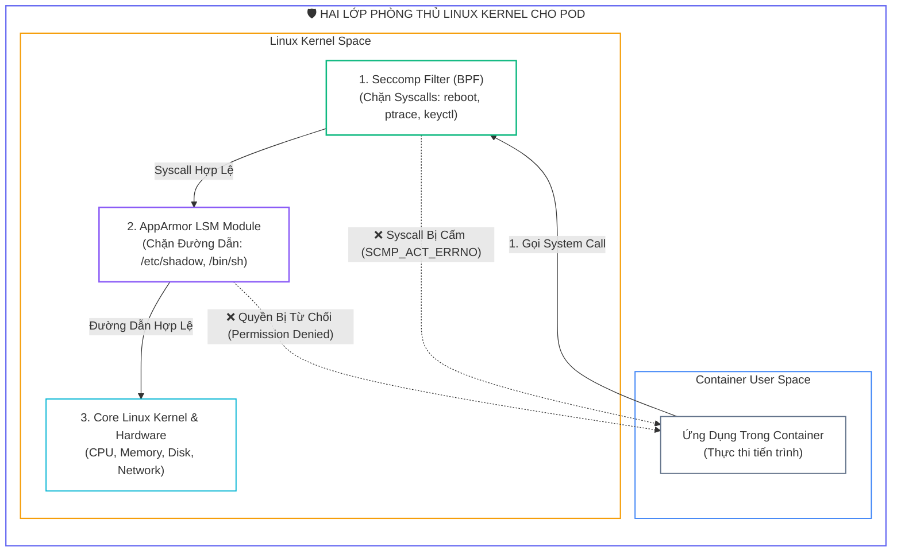
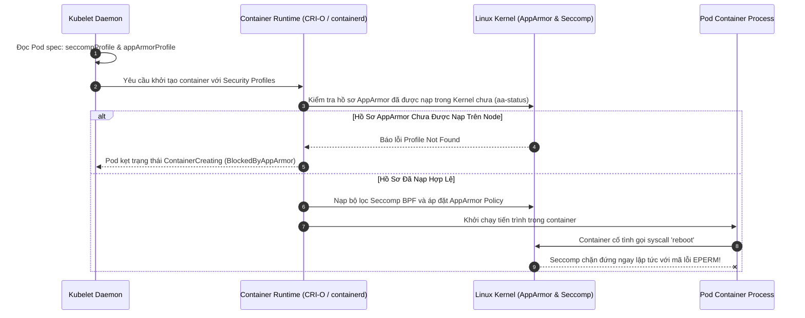
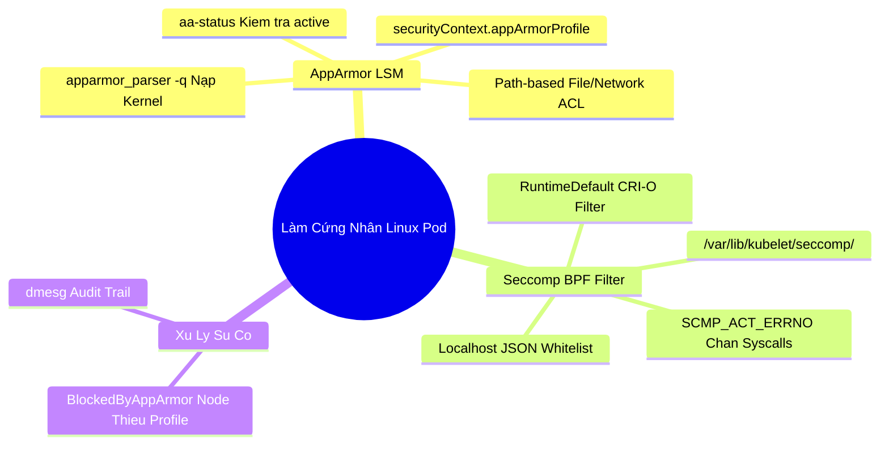


> [!IMPORTANT]
> **Mục tiêu kỹ thuật bài học**:
> - Hiểu rõ sự khác biệt giữa **AppArmor (Path-based File/Network Restriction)** và **Seccomp (System Call Whitelisting/Filtering)**.
> - Nạp và kiểm tra hồ sơ AppArmor vào Linux Kernel bằng `apparmor_parser -q` và `aa-status`.
> - Gắn hồ sơ AppArmor vào Pod thông qua trường chuẩn `securityContext.appArmorProfile` (hoặc annotations tương thích ngược).
> - Cấu hình **Seccomp Profile** cấp độ Pod/Container với hai chế độ cốt lõi: `RuntimeDefault` và `Localhost`.
> - Tự tay biên soạn tệp tin Seccomp JSON đặt trong thư mục Kubelet `/var/lib/kubelet/seccomp/`.
> - Chẩn đoán và xử lý nhanh chóng các sự cố Pod bị từ chối quyền truy cập hoặc kẹt trạng thái khởi chạy.

---

## 1. Bản Chất Kiến Trúc & Tư Duy Cốt Lõi: Bảo Vệ Nhân Linux Bằng AppArmor & Seccomp

Trong mô hình container, tất cả các container trên cùng một máy chủ Node đều **dùng chung một Linux Kernel duy nhất**. Mặc dù Linux Namespaces và cgroups cung cấp sự cô lập về tầm nhìn và tài nguyên, một tiến trình container độc hại vẫn có thể tương tác với hơn **$450+$ lệnh gọi hệ thống (System Calls)** của nhân Linux.

Nếu một lỗ hổng leo thang đặc quyền (như *Dirty COW*, *Dirty Pipe*) tồn tại trong kernel, kẻ tấn công bên trong container có thể gọi các system call đặc biệt để phá vỡ ranh giới container (*Container Escape*) và chiếm quyền kiểm soát toàn bộ máy chủ vật lý. Để triệt tiêu nguy cơ này, ta áp dụng hai lớp phòng thủ kernel:

1. **AppArmor (Application Armor - Linux Security Module):** Kiểm soát những gì tiến trình ĐƯỢC PHÉP ĐỌC, GHI, hoặc THỰC THI dựa trên đường dẫn tệp tin và socket mạng.
2. **Seccomp (Secure Computing Mode - BPF Filter):** Giới hạn danh sách các lệnh gọi hệ thống (System Calls) mà tiến trình ĐƯỢC PHÉP GỌI. Mọi syscall nằm ngoài whitelist sẽ bị Kernel từ chối ngay lập tức với mã lỗi `EPERM` hoặc tiêu diệt tiến trình (`SIGKILL`).



---

## 2. Bảng Ma Trận So Sánh Kỹ Thuật Toàn Diện (Engineering Matrix)

| Tiêu Chí So Sánh | Linux Capabilities | Seccomp BPF Profile | AppArmor Profile | SELinux (RHEL/CentOS) |
| :--- | :--- | :--- | :--- | :--- |
| **Cơ chế hoạt động** | Chia nhỏ quyền `root` thành 40+ flags | Lọc danh sách System Calls | Phân quyền file/network theo path | Gán nhãn ngữ cảnh bảo mật (Labels) |
| **Vị trí lưu trữ** | Kubernetes manifest (`capAdd/capDrop`) | File JSON tại `/var/lib/kubelet/seccomp/` | Nạp vào kernel qua `apparmor_parser` | Nạp chính sách qua `semanage` |
| **Cú pháp trong K8s** | `securityContext.capabilities` | `securityContext.seccompProfile` | `securityContext.appArmorProfile` | `securityContext.seLinuxOptions` |
| **Hành động khi vi phạm** | Báo lỗi `Operation not permitted` | Trả về `EPERM` hoặc `SIGKILL` | Ghi log dmesg và trả về `Permission denied` | Chặn và ghi audit log |
| **Độ phổ biến hệ điều hành** | Mọi hệ điều hành Linux | Mọi hệ điều hành Linux | Mặc định trên **Ubuntu / Debian** | Mặc định trên **RHEL / Rocky / Fedora** |
| **Trọng số thi CKS** | Rất cao | Bắt buộc 100% | Bắt buộc 100% | Kiến thức tham khảo |

---

## 3. Kiến Trúc Môi Trường & Luồng Thực Thi Mẫu

Khi Kubelet khởi tạo một Pod được gắn hồ sơ bảo mật AppArmor và Seccomp, luồng tương tác với Container Runtime và Kernel được mô hình hóa qua Sequence Diagram sau:



---

## 4. Phân Tích Cạm Bẫy Thực Chiến: Pod Bị Lỗi `BlockedByAppArmor` Hoặc Kẹt Khởi Tạo Do Thiếu Profile Trên Worker Node

### Tình Huống Sự Cố Thực Tế:
<span class="badge badge--rose">🕒 10:15 AM</span> Một kỹ sư biên soạn Pod manifest yêu cầu chạy với AppArmor Profile `k8s-apparmor-deny-write`. Pod chạy thành công trên Node 1 nhưng khi triển khai sang Node 2 thì lập tức bị lỗi `CreateContainerError` và kẹt tại trạng thái `BlockedByAppArmor`. Toàn bộ quá trình mở rộng tải (Autoscaling) bị tê liệt.

### Hậu Quả & Log Lỗi Thực Tế:
```text
================================================================================
INCIDENT LOG: APPARMOR PROFILE MISSING ON WORKER NODE (POD STARTUP FAILED)
================================================================================
[ERROR] 2026-09-12T10:15:44.891Z kubelet on worker-node-02:
Error: failed to generate container "secure-app" spec:
cannot apply apparmor profile "k8s-apparmor-deny-write": profile not found on host

[FATAL] kubectl describe pod secure-app-7d98b-x2k9l -n default:
Events:
  Type     Reason               Age               From               Message
  ----     ------               ----              ----               -------
  Warning  Failed               12s (x3 over 35s) kubelet            Error: failed to create containerd task:
  failed to apply apparmor profile: apparmor profile "k8s-apparmor-deny-write" is not loaded in kernel
================================================================================
```

### 5-Whys Root Cause Analysis:
1. <span class="badge badge--primary">Why 1</span> **Tại sao Pod không thể khởi chạy trên Worker Node 2?** $\rightarrow$ Vì Container Runtime báo lỗi không tìm thấy profile AppArmor `k8s-apparmor-deny-write`.
2. <span class="badge badge--primary">Why 2</span> **Tại sao profile không tồn tại trên Worker Node 2?** $\rightarrow$ Vì kỹ sư chỉ chạy lệnh `apparmor_parser` để nạp profile trên Node 1 mà quên nạp trên Node 2.
3. <span class="badge badge--primary">Why 3</span> **Tại sao Kubernetes không tự động phân phối AppArmor profile tới các Node?** $\rightarrow$ Vì AppArmor là tính năng của Linux Kernel máy chủ, Kubelet không tự đồng bộ tệp profile từ Control Plane sang Worker Nodes.
4. <span class="badge badge--primary">Why 4</span> **Làm thế nào để đảm bảo 100% Worker Nodes đều có profile?** $\rightarrow$ Phải sử dụng DaemonSet phân phối (như *Security Profiles Operator*) hoặc chạy lệnh nạp profile trên toàn bộ các Node thông qua công cụ quản lý cấu hình (Ansible/Terraform).
5. <span class="badge badge--emerald">Root Cause Remedy</span> **Biện pháp khắc phục chuẩn CKS:**
   - <span class="badge badge--emerald">Nạp Profile Trên Toàn Bộ Nodes:</span> SSH vào từng Node và thực thi: `apparmor_parser -q /etc/apparmor.d/k8s-apparmor-deny-write`.
   - <span class="badge badge--cyan">Kiểm Tra Bằng `aa-status`:</span> Chạy lệnh `aa-status | grep k8s-apparmor-deny-write` để xác nhận trạng thái `loaded` trên mọi Node trước khi triển khai Pod.

---

## 5. Hands-on Lab: Nạp AppArmor Profile & Cấu Hình Seccomp Whitelist Cho Pod (8 Bước)

| Bước | Mục Tiêu Kỹ Thuật | Đầu Ra Kiểm Tra |
| :---: | :--- | :--- |
| **1** | Kiểm tra trạng thái hỗ trợ AppArmor trên Linux Node | Lệnh `aa-status` hiển thị AppArmor is enabled |
| **2** | Biên soạn tệp hồ sơ AppArmor chặn quyền ghi (`deny-write`) | Tệp `/etc/apparmor.d/k8s-deny-write` |
| **3** | Nạp hồ sơ AppArmor vào Linux Kernel | Lệnh `apparmor_parser -q` thành công |
| **4** | Biên soạn tệp hồ sơ Seccomp tùy chỉnh chặn syscall nguy hiểm | Tệp `/var/lib/kubelet/seccomp/deny-reboot.json` |
| **5** | Triển khai Pod áp dụng AppArmor Profile | Pod chạy với `securityContext.appArmorProfile` |
| **6** | Kiểm tra AppArmor chặn thành công hành vi ghi tệp | Lệnh `touch /test.txt` nhận lỗi `Permission denied` |
| **7** | Triển khai Pod áp dụng Seccomp `RuntimeDefault` | Pod chạy an toàn với bộ lọc syscalls chuẩn CRI-O |
| **8** | Kiểm định toàn diện khả năng phòng thủ nhân Linux | Xác nhận Pod được bảo vệ 2 lớp Kernel |

### Bước 1: Kiểm Tra Trạng Thái Hoạt Động Của AppArmor

```bash
aa-status
```

### Bước 2: Tạo Tệp Hồ Sơ AppArmor Chặn Ghi Tệp Mẫu (`/etc/apparmor.d/k8s-deny-write`)

```bash
cat <<'EOF' | sudo tee /etc/apparmor.d/k8s-deny-write
#include <tunables/global>

profile k8s-deny-write flags=(attach_disconnected) {
  #include <abstractions/base>

  # Cho phép đọc tất cả các file
  file,
  
  # Cấm tuyệt đối quyền ghi vào thư mục gốc và /tmp
  deny /** w,
}
EOF
```

### Bước 3: Nạp Hồ Sơ Vào Kernel Bằng `apparmor_parser`

```bash
sudo apparmor_parser -q /etc/apparmor.d/k8s-deny-write

# Kiểm tra xem profile đã được nạp thành công chưa
sudo aa-status | grep "k8s-deny-write"
```

### Bước 4: Tạo Tệp Seccomp Profile JSON Tại Thư Mục Kubelet

```bash
sudo mkdir -p /var/lib/kubelet/seccomp/profiles

cat <<'EOF' | sudo tee /var/lib/kubelet/seccomp/profiles/audit-all.json
{
    "defaultAction": "SCMP_ACT_LOG"
}
EOF
```

### Bước 5: Triển Khai Pod Gắn Hồ Sơ AppArmor

```bash
cat <<EOF | kubectl apply -f -
apiVersion: v1
kind: Pod
metadata:
  name: apparmor-secured-pod
  namespace: default
spec:
  securityContext:
    appArmorProfile:
      type: Localhost
      localhostProfile: k8s-deny-write
  containers:
  - name: web
    image: busybox:latest
    command: ["sleep", "3600"]
EOF
```

> **Ghi chú tương thích ngược (K8s < 1.30):** Nếu cụm chưa hỗ trợ trường `securityContext.appArmorProfile`, sử dụng annotation: `container.apparmor.security.beta.kubernetes.io/web: localhost/k8s-deny-write`.

### Bước 6: Kiểm Thử AppArmor Chặn Quyền Ghi Thực Tế

```bash
# Thử tạo tệp trong container -> PHẢI BỊ CHẶN (Permission denied)
kubectl exec -it apparmor-secured-pod -- touch /test-write.txt || true
```

### Bước 7: Triển Khai Pod Sử Dụng Seccomp `RuntimeDefault`

```bash
cat <<EOF | kubectl apply -f -
apiVersion: v1
kind: Pod
metadata:
  name: seccomp-secured-pod
  namespace: default
spec:
  securityContext:
    seccompProfile:
      type: RuntimeDefault
  containers:
  - name: secure-app
    image: nginx:alpine
    ports:
    - containerPort: 80
EOF
```

### Bước 8: Kiểm Tra Cấu Hình Seccomp Trên Pod Đang Chạy

```bash
kubectl get pod seccomp-secured-pod -o jsonpath='{.spec.securityContext.seccompProfile}'

echo ">> [VERIFIED] Chuc mung ban da lam chu AppArmor va Seccomp theo chuan CKS!"
```

---

## 6. 10 Câu Hỏi Tự Kiểm Tra Chuyên Sâu (Self-Check Q&A Accordion)

<details class="qa-card">
<summary class="qa-summary">
  <div class="qa-summary-left">
    <span class="qa-num-badge">Q01</span>
    <span>Lệnh nào trong Linux dùng để nạp một tệp hồ sơ AppArmor vào Kernel và lệnh nào để kiểm tra danh sách profile đang active?</span>
  </div>
  <span class="qa-chevron">
    <svg width="18" height="18" fill="none" stroke="currentColor" stroke-width="2.5" viewBox="0 0 24 24"><polyline points="6 9 12 15 18 9"></polyline></svg>
  </span>
</summary>
<div class="qa-answer">
  <div class="qa-answer-header">
    <svg width="14" height="14" fill="none" stroke="currentColor" stroke-width="2" viewBox="0 0 24 24"><path d="M22 11.08V12a10 10 0 1 1-5.93-9.14"></path><polyline points="22 4 12 14.01 9 11.01"></polyline></svg>
    <span>Phân Tích &amp; Lời Giải Kỹ Thuật</span>
  </div>
  <div style="margin-bottom: 8px;">Nạp profile vào Kernel bằng lệnh: <b style="color: var(--accent-primary);">apparmor_parser -q /path/to/profile</b> (hoặc cờ <code>-r</code> để replace/reload). Kiểm tra danh sách các profile đang nạp bằng lệnh: <b style="color: var(--accent-emerald);">aa-status</b> (hoặc đọc tệp <code>/sys/kernel/security/apparmor/profiles</code>).</div>
</div>
</details>

<details class="qa-card">
<summary class="qa-summary">
  <div class="qa-summary-left">
    <span class="qa-num-badge">Q02</span>
    <span>Sự khác biệt giữa 3 chế độ `type: Unconfined`, `type: RuntimeDefault`, và `type: Localhost` trong `securityContext.seccompProfile` là gì?</span>
  </div>
  <span class="qa-chevron">
    <svg width="18" height="18" fill="none" stroke="currentColor" stroke-width="2.5" viewBox="0 0 24 24"><polyline points="6 9 12 15 18 9"></polyline></svg>
  </span>
</summary>
<div class="qa-answer">
  <div class="qa-answer-header">
    <svg width="14" height="14" fill="none" stroke="currentColor" stroke-width="2" viewBox="0 0 24 24"><path d="M22 11.08V12a10 10 0 1 1-5.93-9.14"></path><polyline points="22 4 12 14.01 9 11.01"></polyline></svg>
    <span>Phân Tích &amp; Lời Giải Kỹ Thuật</span>
  </div>
  <div style="margin-bottom: 8px;"><b style="color: var(--accent-rose);">Unconfined:</b> Tắt hoàn toàn bộ lọc Seccomp, container có thể gọi mọi syscall. <b style="color: var(--accent-emerald);">RuntimeDefault:</b> Sử dụng hồ sơ Seccomp mặc định của Container Runtime (chặn khoảng 50+ syscalls nguy hiểm nhất). <b style="color: var(--accent-cyan);">Localhost:</b> Sử dụng hồ sơ JSON tùy chỉnh do người dùng tự biên soạn đặt trong thư mục Kubelet.</div>
</div>
</details>

<details class="qa-card">
<summary class="qa-summary">
  <div class="qa-summary-left">
    <span class="qa-num-badge">Q03</span>
    <span>Thư mục mặc định trên máy chủ Linux mà Kubelet dùng để tìm kiếm các tệp hồ sơ Seccomp tùy chỉnh (`Localhost`) là gì?</span>
  </div>
  <span class="qa-chevron">
    <svg width="18" height="18" fill="none" stroke="currentColor" stroke-width="2.5" viewBox="0 0 24 24"><polyline points="6 9 12 15 18 9"></polyline></svg>
  </span>
</summary>
<div class="qa-answer">
  <div class="qa-answer-header">
    <svg width="14" height="14" fill="none" stroke="currentColor" stroke-width="2" viewBox="0 0 24 24"><path d="M22 11.08V12a10 10 0 1 1-5.93-9.14"></path><polyline points="22 4 12 14.01 9 11.01"></polyline></svg>
    <span>Phân Tích &amp; Lời Giải Kỹ Thuật</span>
  </div>
  <div style="margin-bottom: 8px;">Đó là thư mục: <b style="color: var(--accent-primary);">/var/lib/kubelet/seccomp/</b>. Khi khai báo <code>localhostProfile: profiles/my-profile.json</code>, Kubelet sẽ tìm tệp tại đường dẫn <code>/var/lib/kubelet/seccomp/profiles/my-profile.json</code>.</div>
</div>
</details>

<details class="qa-card">
<summary class="qa-summary">
  <div class="qa-summary-left">
    <span class="qa-num-badge">Q04</span>
    <span>Hành động mặc định `SCMP_ACT_ERRNO` khác gì so với `SCMP_ACT_LOG` trong tệp cấu hình Seccomp JSON?</span>
  </div>
  <span class="qa-chevron">
    <svg width="18" height="18" fill="none" stroke="currentColor" stroke-width="2.5" viewBox="0 0 24 24"><polyline points="6 9 12 15 18 9"></polyline></svg>
  </span>
</summary>
<div class="qa-answer">
  <div class="qa-answer-header">
    <svg width="14" height="14" fill="none" stroke="currentColor" stroke-width="2" viewBox="0 0 24 24"><path d="M22 11.08V12a10 10 0 1 1-5.93-9.14"></path><polyline points="22 4 12 14.01 9 11.01"></polyline></svg>
    <span>Phân Tích &amp; Lời Giải Kỹ Thuật</span>
  </div>
  <div style="margin-bottom: 8px;"><b style="color: var(--accent-rose);">SCMP_ACT_ERRNO:</b> Kernel trực tiếp chặn syscall vi phạm và trả về mã lỗi <code>EPERM</code> cho ứng dụng (chế độ cưỡng chế an toàn). <b style="color: var(--accent-amber);">SCMP_ACT_LOG:</b> Kernel vẫn cho phép syscall thực thi bình thường nhưng ghi lại thông điệp cảnh báo vào audit log (thường dùng trong giai đoạn kiểm thử).</div>
</div>
</details>

<details class="qa-card">
<summary class="qa-summary">
  <div class="qa-summary-left">
    <span class="qa-num-badge">Q05</span>
    <span>Điều gì xảy ra nếu Pod được cấu hình yêu cầu AppArmor Profile nhưng Node chạy Pod chưa được nạp profile đó?</span>
  </div>
  <span class="qa-chevron">
    <svg width="18" height="18" fill="none" stroke="currentColor" stroke-width="2.5" viewBox="0 0 24 24"><polyline points="6 9 12 15 18 9"></polyline></svg>
  </span>
</summary>
<div class="qa-answer">
  <div class="qa-answer-header">
    <svg width="14" height="14" fill="none" stroke="currentColor" stroke-width="2" viewBox="0 0 24 24"><path d="M22 11.08V12a10 10 0 1 1-5.93-9.14"></path><polyline points="22 4 12 14.01 9 11.01"></polyline></svg>
    <span>Phân Tích &amp; Lời Giải Kỹ Thuật</span>
  </div>
  <div style="margin-bottom: 8px;">Kubelet sẽ từ chối khởi tạo container và Pod rơi vào trạng thái lỗi <b style="color: var(--accent-rose);">CreateContainerError</b> hoặc <b style="color: var(--accent-rose);">BlockedByAppArmor</b>. Container sẽ không bao giờ được phép chạy nếu thiếu profile bảo mật đã yêu cầu.</div>
</div>
</details>

<details class="qa-card">
<summary class="qa-summary">
  <div class="qa-summary-left">
    <span class="qa-num-badge">Q06</span>
    <span>Tại sao cần cẩn trọng khi áp dụng Seccomp chặn lệnh gọi hệ thống `clone` hoặc `fork`?</span>
  </div>
  <span class="qa-chevron">
    <svg width="18" height="18" fill="none" stroke="currentColor" stroke-width="2.5" viewBox="0 0 24 24"><polyline points="6 9 12 15 18 9"></polyline></svg>
  </span>
</summary>
<div class="qa-answer">
  <div class="qa-answer-header">
    <svg width="14" height="14" fill="none" stroke="currentColor" stroke-width="2" viewBox="0 0 24 24"><path d="M22 11.08V12a10 10 0 1 1-5.93-9.14"></path><polyline points="22 4 12 14.01 9 11.01"></polyline></svg>
    <span>Phân Tích &amp; Lời Giải Kỹ Thuật</span>
  </div>
  <div style="margin-bottom: 8px;"><code>clone</code> và <code>fork</code> là các lệnh gọi hệ thống nền tảng dùng để khởi tạo luồng (thread) và tiến trình con (child process). Nếu chặn các syscall này, các ứng dụng đa luồng (như Java JVM, Node.js worker threads, Go goroutines) sẽ <b style="color: var(--accent-rose);">bị crash ngay lập tức khi khởi động</b>.</div>
</div>
</details>

<details class="qa-card">
<summary class="qa-summary">
  <div class="qa-summary-left">
    <span class="qa-num-badge">Q07</span>
    <span>Làm thế nào để gán hồ sơ Seccomp `RuntimeDefault` cho toàn bộ các Pod mới tạo trong một cụm Kubernetes mà không cần sửa từng manifest?</span>
  </div>
  <span class="qa-chevron">
    <svg width="18" height="18" fill="none" stroke="currentColor" stroke-width="2.5" viewBox="0 0 24 24"><polyline points="6 9 12 15 18 9"></polyline></svg>
  </span>
</summary>
<div class="qa-answer">
  <div class="qa-answer-header">
    <svg width="14" height="14" fill="none" stroke="currentColor" stroke-width="2" viewBox="0 0 24 24"><path d="M22 11.08V12a10 10 0 1 1-5.93-9.14"></path><polyline points="22 4 12 14.01 9 11.01"></polyline></svg>
    <span>Phân Tích &amp; Lời Giải Kỹ Thuật</span>
  </div>
  <div style="margin-bottom: 8px;">Bật cờ Kubelet Configuration: <b style="color: var(--accent-emerald);">seccompDefault: true</b> trong tệp cấu hình Kubelet (hoặc truyền cờ <code>--seccomp-default</code>). Kubelet sẽ tự động áp dụng <code>RuntimeDefault</code> cho mọi Pod nếu Pod đó không tự khai báo seccompProfile riêng.</div>
</div>
</details>

<details class="qa-card">
<summary class="qa-summary">
  <div class="qa-summary-left">
    <span class="qa-num-badge">Q08</span>
    <span>Cú pháp AppArmor nào cho phép đọc một tệp tin nhưng cấm hoàn toàn quyền thực thi (execution) tệp đó?</span>
  </div>
  <span class="qa-chevron">
    <svg width="18" height="18" fill="none" stroke="currentColor" stroke-width="2.5" viewBox="0 0 24 24"><polyline points="6 9 12 15 18 9"></polyline></svg>
  </span>
</summary>
<div class="qa-answer">
  <div class="qa-answer-header">
    <svg width="14" height="14" fill="none" stroke="currentColor" stroke-width="2" viewBox="0 0 24 24"><path d="M22 11.08V12a10 10 0 1 1-5.93-9.14"></path><polyline points="22 4 12 14.01 9 11.01"></polyline></svg>
    <span>Phân Tích &amp; Lời Giải Kỹ Thuật</span>
  </div>
  <div style="margin-bottom: 8px;">Trong tệp luật AppArmor, sử dụng chỉ thị: <b style="color: var(--accent-primary);">/path/to/file r,</b> (chỉ có cờ <code>r</code> cho read) và loại bỏ hoàn toàn cờ thực thi <code>x</code> (hoặc khai báo tường minh <code>deny /path/to/file x,</code>).</div>
</div>
</details>

<details class="qa-card">
<summary class="qa-summary">
  <div class="qa-summary-left">
    <span class="qa-num-badge">Q09</span>
    <span>Sự khác biệt cốt lõi về cơ chế giữa AppArmor và Seccomp là gì?</span>
  </div>
  <span class="qa-chevron">
    <svg width="18" height="18" fill="none" stroke="currentColor" stroke-width="2.5" viewBox="0 0 24 24"><polyline points="6 9 12 15 18 9"></polyline></svg>
  </span>
</summary>
<div class="qa-answer">
  <div class="qa-answer-header">
    <svg width="14" height="14" fill="none" stroke="currentColor" stroke-width="2" viewBox="0 0 24 24"><path d="M22 11.08V12a10 10 0 1 1-5.93-9.14"></path><polyline points="22 4 12 14.01 9 11.01"></polyline></svg>
    <span>Phân Tích &amp; Lời Giải Kỹ Thuật</span>
  </div>
  <div style="margin-bottom: 8px;"><b style="color: var(--accent-emerald);">AppArmor:</b> Hoạt động dựa trên tài nguyên đường dẫn (Path-based LSM), kiểm soát xem tiến trình có thể mở tệp nào, ghi vào đâu, mở cổng mạng nào. <b style="color: var(--accent-cyan);">Seccomp:</b> Hoạt động dựa trên hành vi lệnh gọi hệ thống (Syscall-based BPF), kiểm soát xem tiến trình có được phép thực thi loại lệnh kernel nào mà không quan tâm đến đường dẫn cụ thể.</div>
</div>
</details>

<details class="qa-card">
<summary class="qa-summary">
  <div class="qa-summary-left">
    <span class="qa-num-badge">Q10</span>
    <span>Làm thế nào để kiểm tra nhật ký vi phạm bảo mật của AppArmor trên máy chủ Ubuntu Node?</span>
  </div>
  <span class="qa-chevron">
    <svg width="18" height="18" fill="none" stroke="currentColor" stroke-width="2.5" viewBox="0 0 24 24"><polyline points="6 9 12 15 18 9"></polyline></svg>
  </span>
</summary>
<div class="qa-answer">
  <div class="qa-answer-header">
    <svg width="14" height="14" fill="none" stroke="currentColor" stroke-width="2" viewBox="0 0 24 24"><path d="M22 11.08V12a10 10 0 1 1-5.93-9.14"></path><polyline points="22 4 12 14.01 9 11.01"></polyline></svg>
    <span>Phân Tích &amp; Lời Giải Kỹ Thuật</span>
  </div>
  <div style="margin-bottom: 8px;">Tra cứu nhật ký nhân hệ điều hành qua <code>dmesg</code> hoặc <code>journalctl</code>:
  <div style="margin-top: 6px; padding: 8px; background: rgba(0,0,0,0.2); border-radius: 4px; font-family: monospace; font-size: 0.9em;">
  sudo dmesg | grep -i apparmor<br/>
  sudo journalctl -k | grep -i "apparmor=\"DENIED\""
  </div>
  </div>
</div>
</details>

---

## 7. Tổng Kết & Lộ Trình Bài Học Tiếp Theo



Làm chủ **AppArmor** và **Seccomp** giúp bạn hoàn thành trọn vẹn lớp phòng thủ nhân Linux sâu nhất trong kiến trúc an ninh CKS.

> [!TIP]
> **BÀI HỌC TIẾP THEO:**
> Trong **[[Bài 06] Bảo Mật Cụm & Mã Hóa Dữ Liệu etcd: Quản Lý Chứng Chỉ TLS, Kubeconfig & Encryption at Rest](cks-06-06-tls-va-bao-mat-etcd.html)**, chúng ta sẽ chuyển sang bảo vệ tầng Control Plane: Quản lý chứng chỉ mTLS giữa các thành phần K8s, phân quyền an toàn qua tệp kubeconfig, và kích hoạt EncryptionConfiguration mã hóa dữ liệu Secret trong cơ sở dữ liệu etcd.

