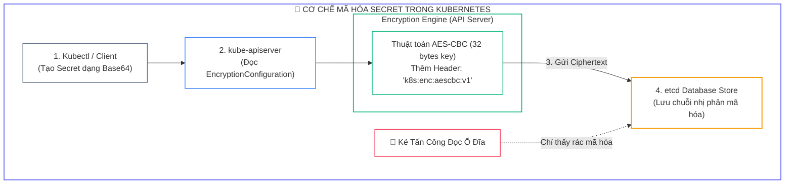
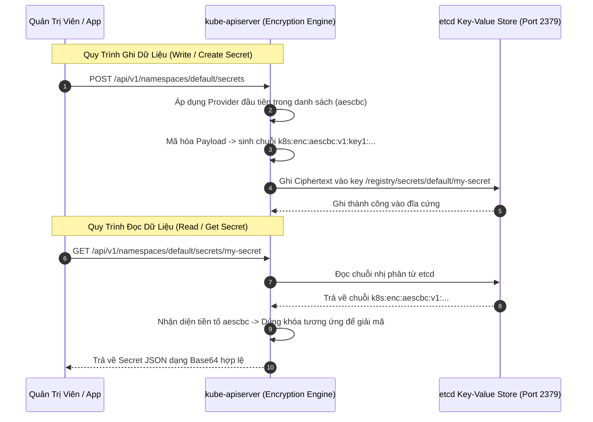


> [!IMPORTANT]
> **Mục tiêu kỹ thuật bài học**:
> - Thấu hiểu cơ chế lưu trữ dữ liệu của **etcd** và sự nguy hiểm khi Secret chỉ được mã hóa Base64 thuần túy.
> - Nắm vững cấu trúc tệp **`EncryptionConfiguration`** và thứ tự ưu tiên của các **Encryption Providers** (`aescbc`, `secretbox`, `kms`, `identity`).
> - Sinh khóa mã hóa an toàn **32-byte Base64** từ `/dev/urandom`.
> - Cấu hình cờ `--encryption-provider-config` trên Static Pod manifest `/etc/kubernetes/manifests/kube-apiserver.yaml` kết hợp `hostPath` Volume Mount.
> - Thực thi quy trình **Re-encryption** toàn bộ Secret hiện có trong cụm mà không làm gián đoạn ứng dụng.
> - Sử dụng công cụ dòng lệnh **`etcdctl`** kết hợp chứng chỉ mTLS để kiểm tra trực tiếp chuỗi nhị phân mang tiền tố `k8s:enc:aescbc:v1`.

---

## 1. Bản Chất Kiến Trúc & Tư Duy Cốt Lõi: Mã Hóa Dữ Liệu Tại Chỗ (Encryption at Rest)

Cơ sở dữ liệu **etcd** là "trái tim" và là kho lưu trữ trạng thái duy nhất (*Single Source of Truth*) của toàn bộ cụm Kubernetes. Mọi thông tin nhạy cảm nhất—từ mật khẩu Database, khóa TLS, API tokens cho đến thông tin người dùng—đều được lưu trữ dưới dạng các tài nguyên `Secret`.

Tuy nhiên, một hiểu lầm tai hại phổ biến là ngộ nhận rằng Kubernetes Secret đã được "bảo mật". Trên thực tế:
- Kubernetes Secret mặc định chỉ được mã hóa dạng **Base64** (chỉ là định dạng truyền tải chuỗi nhị phân, bất kỳ ai cũng có thể giải mã ngược lại dạng plaintext bằng lệnh `echo ... | base64 -d`).
- Khi `kube-apiserver` ghi dữ liệu xuống etcd, dữ liệu được ghi dạng văn bản rõ (*Plaintext*).
- Nếu kẻ tấn công chiếm quyền truy cập máy chủ Control Plane, đọc tệp sao lưu (*etcd snapshot*), hoặc lấy trộm ổ cứng lưu trữ, chúng có thể trích xuất 100% mật khẩu của toàn bộ hệ thống.

Để bảo vệ etcd theo chuẩn an ninh **CKS**, `kube-apiserver` cung cấp cơ chế **Encryption at Rest**: Mã hóa dữ liệu bằng thuật toán mã hóa đối xứng (như AES-CBC, Secretbox) **trước khi** gửi gói tin ghi sang etcd, và giải mã dữ liệu **sau khi** đọc từ etcd về API Server.



---

## 2. Bảng Ma Trận So Sánh Kỹ Thuật Toàn Diện (Engineering Matrix)

| Encryption Provider | Thuật Toán Mã Hóa | Độ Dài Khóa | Quản Lý Khóa | Hiệu Năng | Đánh Giá An Ninh CKS |
| :--- | :--- | :--- | :--- | :--- | :--- |
| **`identity`** | Không mã hóa (Plaintext) | Không có | Không | Cực nhanh | <span class="badge badge--rose">Không an toàn (Mặc định)</span> |
| **`aescbc`** | AES-CBC với PKCS#7 padding | 32 Bytes (AES-256) | Lưu trong file cấu hình | Rất nhanh | <span class="badge badge--emerald">Chuẩn trọng tâm bài thi CKS</span> |
| **`secretbox`** | XSalsa20 và Poly1305 | 32 Bytes | Lưu trong file cấu hình | Nhanh hơn AES | Tối ưu cho CPU không có AES-NI |
| **`kms` (v1/v2)** | Phong bì số (Envelope Encryption) | Dynamic DEK/KEK | Quản lý bởi Vault / AWS KMS / GCP | Phụ thuộc mạng KMS | Chuẩn cao cấp cho Enterprise |

---

## 3. Kiến Trúc Môi Trường & Luồng Thực Thi Mẫu

Khi người dùng thực thi lệnh tạo mới hoặc đọc một Secret, luồng tương tác giữa API Server và etcd diễn ra theo quy trình sau:



---

## 4. Phân Tích Cạm Bẫy Thực Chiến: Sập API Server Do Sai Volume Mount / Lỗi Cú Pháp EncryptionConfiguration

### Tình Huống Sự Cố Thực Tế:
<span class="badge badge--rose">🕒 01:15 AM</span> Trong kỳ thi CKS, thí sinh tạo tệp `/etc/kubernetes/enc/enc.yaml` và thêm cờ `--encryption-provider-config=/etc/kubernetes/enc/enc.yaml` vào manifest `kube-apiserver.yaml`. Ngay sau khi lưu tệp, `kube-apiserver` lập tức bị sập (*CrashLoop*), lệnh `kubectl` mất hoàn toàn kết nối với cụm (`The connection to the server was refused`), làm thí sinh hoảng loạn và mất trắng điểm.

### Hậu Quả & Log Lỗi Thực Tế:
```text
================================================================================
CRITICAL CONTROL PLANE OUTAGE: KUBE-APISERVER CONTAINER STARTUP FAILURE
================================================================================
[FATAL] 2026-09-12T01:15:30.104Z crictl logs on controlplane (container kube-apiserver):
Error: open /etc/kubernetes/enc/enc.yaml: no such file or directory
stat /etc/kubernetes/enc/enc.yaml: no such file or directory
failed to read encryption provider configuration: open /etc/kubernetes/enc/enc.yaml: no such file or directory

>> KUBECTL CLIENT ERROR:
$ kubectl get nodes
The connection to the server 192.168.1.10:6443 was refused - did you specify the right host or port?
================================================================================
```

### 5-Whys Root Cause Analysis:
1. <span class="badge badge--primary">Why 1</span> **Tại sao toàn bộ cụm không thể kết nối qua lệnh kubectl?** $\rightarrow$ Vì tiến trình `kube-apiserver` bị dừng hoạt động.
2. <span class="badge badge--primary">Why 2</span> **Tại sao container kube-apiserver bị crash ngay khi khởi động?** $\rightarrow$ Vì nó không thể tìm thấy tệp `/etc/kubernetes/enc/enc.yaml`.
3. <span class="badge badge--primary">Why 3</span> **Tại sao tệp rõ ràng đã được tạo trên Host nhưng container lại báo không tìm thấy?** $\rightarrow$ Vì `kube-apiserver` chạy dưới dạng một **Static Pod** bên trong container; thư mục mới tạo trên Host chưa được mount vào trong container qua khối `volumeMounts` và `volumes`.
4. <span class="badge badge--primary">Why 4</span> **Tại sao thư mục `/etc/kubernetes/pki` thì lại truy cập được?** $\rightarrow$ Vì thư mục `/etc/kubernetes/pki` đã có sẵn khai báo `hostPath` trong manifest mặc định.
5. <span class="badge badge--emerald">Root Cause Remedy</span> **Biện pháp khắc phục chuẩn CKS (2 cách):**
   - <span class="badge badge--emerald">Cách 1 (Khuyến nghị thần tốc trong phòng thi):</span> Lưu tệp `enc.yaml` trực tiếp vào thư mục `/etc/kubernetes/enc/` và mount thư mục này vào manifest, HOẶC lưu vào `/etc/kubernetes/pki/enc.yaml` (thư mục `/etc/kubernetes/pki` đã được mount sẵn vào container).
   - <span class="badge badge--cyan">Cách 2 (Cấu hình Mount chuẩn chỉ):</span> Bổ sung đầy đủ cả 2 khối sau vào `/etc/kubernetes/manifests/kube-apiserver.yaml`:
     ```yaml
     # Trong khối spec.containers[0].volumeMounts:
     - mountPath: /etc/kubernetes/enc
       name: enc-volume
       readOnly: true

     # Trong khối spec.volumes:
     - name: enc-volume
       hostPath:
         path: /etc/kubernetes/enc
         type: DirectoryOrCreate
     ```

---

## 5. Hands-on Lab: Cấu Hình Encryption at Rest Cho etcd & Đối Soát Bằng etcdctl (8 Bước)

| Bước | Mục Tiêu Kỹ Thuật | Đầu Ra Kiểm Tra |
| :---: | :--- | :--- |
| **1** | Tạo một Secret thử nghiệm khi chưa bật mã hóa | Secret tồn tại trên cụm |
| **2** | Kiểm tra chuỗi Plaintext trong etcd bằng `etcdctl` | Nhìn thấy rõ mật khẩu chưa mã hóa |
| **3** | Sinh khóa mã hóa 32-byte Base64 ngẫu nhiên | Khóa bí mật 44 ký tự |
| **4** | Biên soạn tệp cấu hình `EncryptionConfiguration` | Tệp `/etc/kubernetes/enc/enc.yaml` |
| **5** | Cấu hình `kube-apiserver.yaml` với Volume Mount | API Server tự động reload thành công |
| **6** | Tạo một Secret mới sau khi bật mã hóa | Secret mới được mã hóa tự động |
| **7** | Dùng `etcdctl` kiểm tra tiền tố `k8s:enc:aescbc:v1` | Xác nhận dữ liệu trong etcd đã bị mã hóa |
| **8** | Thực thi Re-encryption toàn bộ Secret cũ trong cụm | 100% Secret trong cụm đều mang tiền tố an toàn |

### Bước 1: Tạo Secret Thử Nghiệm Khi Chưa Có Mã Hóa

```bash
kubectl create secret generic unencrypted-secret --from-literal=password=SuperSecretP@ss123
```

### Bước 2: Kiểm Tra Trực Tiếp Trong etcd Bằng `etcdctl` (Nhìn Thấy Plaintext!)

```bash
ETCDCTL_API=3 etcdctl \
  --cacert=/etc/kubernetes/pki/etcd/ca.crt \
  --cert=/etc/kubernetes/pki/etcd/server.crt \
  --key=/etc/kubernetes/pki/etcd/server.key \
  get /registry/secrets/default/unencrypted-secret

# Đầu ra: Vẫn đọc được chuỗi "SuperSecretP@ss123" (Chưa an toàn!)
```

### Bước 3: Sinh Khóa Ngẫu Nhiên 32-Byte Base64

```bash
ENCRYPTION_KEY=$(head -c 32 /dev/urandom | base64)
echo "Generated Key: $ENCRYPTION_KEY"
```

### Bước 4: Tạo Thư Mục & Biên Soạn Tệp `EncryptionConfiguration`

```bash
sudo mkdir -p /etc/kubernetes/enc

cat <<EOF | sudo tee /etc/kubernetes/enc/enc.yaml
apiVersion: apiserver.config.k8s.io/v1
kind: EncryptionConfiguration
resources:
  - resources:
      - secrets
    providers:
      - aescbc:
          keys:
            - name: key1
              secret: ${ENCRYPTION_KEY}
      - identity: {}
EOF
```

### Bước 5: Cập Nhật Manifest `kube-apiserver.yaml`

Chỉnh sửa tệp `/etc/kubernetes/manifests/kube-apiserver.yaml` để thêm cờ và volume:

```yaml
# 1. Thêm cờ vào spec.containers[0].command:
- --encryption-provider-config=/etc/kubernetes/enc/enc.yaml

# 2. Thêm vào spec.containers[0].volumeMounts:
- mountPath: /etc/kubernetes/enc
  name: enc-dir
  readOnly: true

# 3. Thêm vào spec.volumes:
- name: enc-dir
  hostPath:
    path: /etc/kubernetes/enc
    type: DirectoryOrCreate
```

> **Chờ đợi kiểm tra:** Chờ khoảng 30–60 giây để `kube-apiserver` tự động khởi động lại. Kiểm tra bằng: `kubectl get pods -n kube-system`.

### Bước 6: Tạo Secret Mới Sau Khi Bật Mã Hóa

```bash
kubectl create secret generic encrypted-secret --from-literal=password=NewSuperSecureP@ss456
```

### Bước 7: Dùng `etcdctl` Xác Nhận Tiền Tố `k8s:enc:aescbc:v1`

```bash
ETCDCTL_API=3 etcdctl \
  --cacert=/etc/kubernetes/pki/etcd/ca.crt \
  --cert=/etc/kubernetes/pki/etcd/server.crt \
  --key=/etc/kubernetes/pki/etcd/server.key \
  get /registry/secrets/default/encrypted-secret

# Đầu ra: Bắt đầu bằng chuỗi "k8s:enc:aescbc:v1:key1:..." và toàn bộ phần sau là mã hóa nhị phân!
```

### Bước 8: Mã Hóa Lại Toàn Bộ Secret Cũ (Re-encryption)

```bash
kubectl get secrets --all-namespaces -o json | kubectl replace -f -

# Kiểm tra lại secret cũ ban đầu -> Bây giờ cũng đã được mã hóa an toàn!
ETCDCTL_API=3 etcdctl \
  --cacert=/etc/kubernetes/pki/etcd/ca.crt \
  --cert=/etc/kubernetes/pki/etcd/server.crt \
  --key=/etc/kubernetes/pki/etcd/server.key \
  get /registry/secrets/default/unencrypted-secret

echo ">> [VERIFIED] Chuc mung ban da hoan tat ma hoa toan bo Secret trong etcd theo chuan CKS!"
```

---

## 6. 10 Câu Hỏi Tự Kiểm Tra Chuyên Sâu (Self-Check Q&A Accordion)

<details class="qa-card">
<summary class="qa-summary">
  <div class="qa-summary-left">
    <span class="qa-num-badge">Q01</span>
    <span>Tại sao cần đặt provider `identity: {}` ở vị trí cuối cùng trong danh sách providers của `EncryptionConfiguration`?</span>
  </div>
  <span class="qa-chevron">
    <svg width="18" height="18" fill="none" stroke="currentColor" stroke-width="2.5" viewBox="0 0 24 24"><polyline points="6 9 12 15 18 9"></polyline></svg>
  </span>
</summary>
<div class="qa-answer">
  <div class="qa-answer-header">
    <svg width="14" height="14" fill="none" stroke="currentColor" stroke-width="2" viewBox="0 0 24 24"><path d="M22 11.08V12a10 10 0 1 1-5.93-9.14"></path><polyline points="22 4 12 14.01 9 11.01"></polyline></svg>
    <span>Phân Tích &amp; Lời Giải Kỹ Thuật</span>
  </div>
  <div style="margin-bottom: 8px;">Provider đầu tiên trong danh sách (như <code>aescbc</code>) được dùng để <b style="color: var(--accent-emerald);">mã hóa khi ghi</b> dữ liệu mới. Các provider tiếp theo được dùng để <b style="color: var(--accent-cyan);">giải mã khi đọc</b> dữ liệu cũ. Đặt <code>identity: {}</code> ở cuối cho phép API Server vẫn có thể đọc được các Secret cũ chưa được mã hóa trước khi quy trình re-encryption hoàn tất.</div>
</div>
</details>

<details class="qa-card">
<summary class="qa-summary">
  <div class="qa-summary-left">
    <span class="qa-num-badge">Q02</span>
    <span>Làm thế nào để xoay vòng khóa mã hóa (Key Rotation) an toàn khi nghi ngờ khóa cũ bị lộ?</span>
  </div>
  <span class="qa-chevron">
    <svg width="18" height="18" fill="none" stroke="currentColor" stroke-width="2.5" viewBox="0 0 24 24"><polyline points="6 9 12 15 18 9"></polyline></svg>
  </span>
</summary>
<div class="qa-answer">
  <div class="qa-answer-header">
    <svg width="14" height="14" fill="none" stroke="currentColor" stroke-width="2" viewBox="0 0 24 24"><path d="M22 11.08V12a10 10 0 1 1-5.93-9.14"></path><polyline points="22 4 12 14.01 9 11.01"></polyline></svg>
    <span>Phân Tích &amp; Lời Giải Kỹ Thuật</span>
  </div>
  <div style="margin-bottom: 8px;">Quy trình 3 bước chuẩn: (1) Thêm khóa mới <code>key2</code> lên ĐẦU danh sách keys của provider <code>aescbc</code> và giữ <code>key1</code> ở vị trí thứ hai; (2) Khởi động lại API Server để mọi dữ liệu ghi mới dùng <code>key2</code>; (3) Chạy lệnh <code>kubectl replace</code> để mã hóa lại toàn bộ Secret bằng <code>key2</code>, sau đó xóa bỏ <code>key1</code> khỏi tệp cấu hình.</div>
</div>
</details>

<details class="qa-card">
<summary class="qa-summary">
  <div class="qa-summary-left">
    <span class="qa-num-badge">Q03</span>
    <span>Lệnh nào dùng để mã hóa lại (re-encrypt) toàn bộ Secret trong toàn bộ cụm sau khi kích hoạt EncryptionConfiguration?</span>
  </div>
  <span class="qa-chevron">
    <svg width="18" height="18" fill="none" stroke="currentColor" stroke-width="2.5" viewBox="0 0 24 24"><polyline points="6 9 12 15 18 9"></polyline></svg>
  </span>
</summary>
<div class="qa-answer">
  <div class="qa-answer-header">
    <svg width="14" height="14" fill="none" stroke="currentColor" stroke-width="2" viewBox="0 0 24 24"><path d="M22 11.08V12a10 10 0 1 1-5.93-9.14"></path><polyline points="22 4 12 14.01 9 11.01"></polyline></svg>
    <span>Phân Tích &amp; Lời Giải Kỹ Thuật</span>
  </div>
  <div style="margin-bottom: 8px;">Sử dụng lệnh: <b style="color: var(--accent-primary);">kubectl get secrets --all-namespaces -o json | kubectl replace -f -</b>. Lệnh này đọc tất cả Secret và ghi đè lại chính nó vào API Server, kích hoạt cơ chế mã hóa bằng provider hiện tại.</div>
</div>
</details>

<details class="qa-card">
<summary class="qa-summary">
  <div class="qa-summary-left">
    <span class="qa-num-badge">Q04</span>
    <span>Chuỗi tiền tố nào xuất hiện ở đầu giá trị Secret trong etcd chứng minh dữ liệu đã được mã hóa bằng thuật toán AES-CBC?</span>
  </div>
  <span class="qa-chevron">
    <svg width="18" height="18" fill="none" stroke="currentColor" stroke-width="2.5" viewBox="0 0 24 24"><polyline points="6 9 12 15 18 9"></polyline></svg>
  </span>
</summary>
<div class="qa-answer">
  <div class="qa-answer-header">
    <svg width="14" height="14" fill="none" stroke="currentColor" stroke-width="2" viewBox="0 0 24 24"><path d="M22 11.08V12a10 10 0 1 1-5.93-9.14"></path><polyline points="22 4 12 14.01 9 11.01"></polyline></svg>
    <span>Phân Tích &amp; Lời Giải Kỹ Thuật</span>
  </div>
  <div style="margin-bottom: 8px;">Đó là tiền tố: <b style="color: var(--accent-emerald);">k8s:enc:aescbc:v1:&lt;key-name&gt;:</b>. Khi tra cứu bằng <code>etcdctl get</code>, nếu thấy tiền tố này nghĩa là dữ liệu đã được bảo vệ an toàn.</div>
</div>
</details>

<details class="qa-card">
<summary class="qa-summary">
  <div class="qa-summary-left">
    <span class="qa-num-badge">Q05</span>
    <span>Ba cờ tham số chứng chỉ TLS bắt buộc phải truyền khi chạy lệnh `etcdctl` truy vấn etcd cục bộ là gì?</span>
  </div>
  <span class="qa-chevron">
    <svg width="18" height="18" fill="none" stroke="currentColor" stroke-width="2.5" viewBox="0 0 24 24"><polyline points="6 9 12 15 18 9"></polyline></svg>
  </span>
</summary>
<div class="qa-answer">
  <div class="qa-answer-header">
    <svg width="14" height="14" fill="none" stroke="currentColor" stroke-width="2" viewBox="0 0 24 24"><path d="M22 11.08V12a10 10 0 1 1-5.93-9.14"></path><polyline points="22 4 12 14.01 9 11.01"></polyline></svg>
    <span>Phân Tích &amp; Lời Giải Kỹ Thuật</span>
  </div>
  <div style="margin-bottom: 8px;">3 cờ xác thực mTLS gồm: <b style="color: var(--accent-primary);">--cacert=/etc/kubernetes/pki/etcd/ca.crt</b>, <b style="color: var(--accent-emerald);">--cert=/etc/kubernetes/pki/etcd/server.crt</b>, và <b style="color: var(--accent-rose);">--key=/etc/kubernetes/pki/etcd/server.key</b> (hoặc dùng chứng chỉ client <code>healthcheck-client.crt</code>).</div>
</div>
</details>

<details class="qa-card">
<summary class="qa-summary">
  <div class="qa-summary-left">
    <span class="qa-num-badge">Q06</span>
    <span>Nếu muốn vô hiệu hóa hoàn toàn mã hóa etcd và quay trở lại lưu trữ dạng văn bản thuần, quy trình cần thực hiện như thế nào?</span>
  </div>
  <span class="qa-chevron">
    <svg width="18" height="18" fill="none" stroke="currentColor" stroke-width="2.5" viewBox="0 0 24 24"><polyline points="6 9 12 15 18 9"></polyline></svg>
  </span>
</summary>
<div class="qa-answer">
  <div class="qa-answer-header">
    <svg width="14" height="14" fill="none" stroke="currentColor" stroke-width="2" viewBox="0 0 24 24"><path d="M22 11.08V12a10 10 0 1 1-5.93-9.14"></path><polyline points="22 4 12 14.01 9 11.01"></polyline></svg>
    <span>Phân Tích &amp; Lời Giải Kỹ Thuật</span>
  </div>
  <div style="margin-bottom: 8px;">Chuyển <code>identity: {}</code> lên vị trí ĐẦU TIÊN trong danh sách providers của tệp <code>EncryptionConfiguration</code>, giữ <code>aescbc</code> ở vị trí thứ hai. Khởi động lại API Server, chạy lệnh <code>kubectl replace</code> để giải mã toàn bộ Secret về plaintext, sau đó mới được xóa bỏ cờ <code>--encryption-provider-config</code>.</div>
</div>
</details>

<details class="qa-card">
<summary class="qa-summary">
  <div class="qa-summary-left">
    <span class="qa-num-badge">Q07</span>
    <span>Tại sao khóa mã hóa AES-CBC trong `EncryptionConfiguration` bắt buộc phải được mã hóa Base64 từ đúng 32 bytes ngẫu nhiên?</span>
  </div>
  <span class="qa-chevron">
    <svg width="18" height="18" fill="none" stroke="currentColor" stroke-width="2.5" viewBox="0 0 24 24"><polyline points="6 9 12 15 18 9"></polyline></svg>
  </span>
</summary>
<div class="qa-answer">
  <div class="qa-answer-header">
    <svg width="14" height="14" fill="none" stroke="currentColor" stroke-width="2" viewBox="0 0 24 24"><path d="M22 11.08V12a10 10 0 1 1-5.93-9.14"></path><polyline points="22 4 12 14.01 9 11.01"></polyline></svg>
    <span>Phân Tích &amp; Lời Giải Kỹ Thuật</span>
  </div>
  <div style="margin-bottom: 8px;">Thuật toán AES-256 yêu cầu độ dài khóa chính xác là 256 bits (tương đương 32 bytes). Nếu giải mã Base64 mà độ dài chuỗi byte không đúng 32 (ví dụ 16 hoặc 64 bytes), <code>kube-apiserver</code> sẽ <b style="color: var(--accent-rose);">báo lỗi và từ chối khởi động</b>.</div>
</div>
</details>

<details class="qa-card">
<summary class="qa-summary">
  <div class="qa-summary-left">
    <span class="qa-num-badge">Q08</span>
    <span>Ngoài `secrets`, những tài nguyên Kubernetes nào khác có thể được cấu hình mã hóa trong `EncryptionConfiguration`?</span>
  </div>
  <span class="qa-chevron">
    <svg width="18" height="18" fill="none" stroke="currentColor" stroke-width="2.5" viewBox="0 0 24 24"><polyline points="6 9 12 15 18 9"></polyline></svg>
  </span>
</summary>
<div class="qa-answer">
  <div class="qa-answer-header">
    <svg width="14" height="14" fill="none" stroke="currentColor" stroke-width="2" viewBox="0 0 24 24"><path d="M22 11.08V12a10 10 0 1 1-5.93-9.14"></path><polyline points="22 4 12 14.01 9 11.01"></polyline></svg>
    <span>Phân Tích &amp; Lời Giải Kỹ Thuật</span>
  </div>
  <div style="margin-bottom: 8px;">Tất cả các tài nguyên lưu trữ trong etcd đều có thể cấu hình mã hóa, ví dụ: <b style="color: var(--accent-primary);">configmaps</b>, <b style="color: var(--accent-cyan);">serviceaccounts</b>, hoặc các tài nguyên tùy biến <b style="color: var(--accent-emerald);">customresourcedefinitions (CRDs)</b> chứa dữ liệu nhạy cảm.</div>
</div>
</details>

<details class="qa-card">
<summary class="qa-summary">
  <div class="qa-summary-left">
    <span class="qa-num-badge">Q09</span>
    <span>Lệnh nào giúp kiểm tra nhanh log của container `kube-apiserver` khi tiến trình Static Pod bị crash không khởi động được?</span>
  </div>
  <span class="qa-chevron">
    <svg width="18" height="18" fill="none" stroke="currentColor" stroke-width="2.5" viewBox="0 0 24 24"><polyline points="6 9 12 15 18 9"></polyline></svg>
  </span>
</summary>
<div class="qa-answer">
  <div class="qa-answer-header">
    <svg width="14" height="14" fill="none" stroke="currentColor" stroke-width="2" viewBox="0 0 24 24"><path d="M22 11.08V12a10 10 0 1 1-5.93-9.14"></path><polyline points="22 4 12 14.01 9 11.01"></polyline></svg>
    <span>Phân Tích &amp; Lời Giải Kỹ Thuật</span>
  </div>
  <div style="margin-bottom: 8px;">Khi API Server sập, lệnh <code>kubectl logs</code> không hoạt động. Bắt buộc phải sử dụng công cụ Container Runtime CLI trên máy chủ Node: <b style="color: var(--accent-primary);">sudo crictl logs $(sudo crictl ps -a --name kube-apiserver -q | head -n 1)</b> (hoặc tra cứu nhật ký tại <code>/var/log/pods/kube-system_kube-apiserver-.../</code>).</div>
</div>
</details>

<details class="qa-card">
<summary class="qa-summary">
  <div class="qa-summary-left">
    <span class="qa-num-badge">Q10</span>
    <span>Sự khác biệt giữa KMS v1 và KMS v2 Provider trong Kubernetes là gì?</span>
  </div>
  <span class="qa-chevron">
    <svg width="18" height="18" fill="none" stroke="currentColor" stroke-width="2.5" viewBox="0 0 24 24"><polyline points="6 9 12 15 18 9"></polyline></svg>
  </span>
</summary>
<div class="qa-answer">
  <div class="qa-answer-header">
    <svg width="14" height="14" fill="none" stroke="currentColor" stroke-width="2" viewBox="0 0 24 24"><path d="M22 11.08V12a10 10 0 1 1-5.93-9.14"></path><polyline points="22 4 12 14.01 9 11.01"></polyline></svg>
    <span>Phân Tích &amp; Lời Giải Kỹ Thuật</span>
  </div>
  <div style="margin-bottom: 8px;"><b style="color: var(--accent-cyan);">KMS v1:</b> Gọi gRPC sang máy chủ KMS ngoài cho mỗi Secret riêng lẻ, gây nghẽn cổ chai khi khởi động lại cụm lớn. <b style="color: var(--accent-emerald);">KMS v2 (từ K8s 1.29+ GA):</b> Sử dụng cơ chế mã hóa phong bì phân cấp với khóa DEK (Data Encryption Key) được đệm bộ nhớ và tự động xoay vòng khóa KEK mà không cần khởi động lại API Server.</div>
</div>
</details>

---

## 7. Tổng Kết & Lộ Trình Bài Học Tiếp Theo

```mermaid
mindmap
  root((Bảo Mật etcd & Mã Hóa Lưu Trữ))
    Nguy Cơ Mac Dinh
      Secret Base64 plaintext
      etcd snapshot lo mat khau
    EncryptionConfiguration
      aescbc 32-byte Base64 Key
      Thứ tự Provider: Ghi đầu - Đọc sau
      identity {} fallback
    Kube-apiserver Hardening
      --encryption-provider-config
      hostPath Volume Mount
    Kiem Tra & Re-encrypt
      etcdctl k8s:enc:aescbc:v1
      kubectl replace re-encrypt
```

Nắm vững **Encryption at Rest** là chìa khóa then chốt để bảo vệ dữ liệu bí mật và ghi trọn điểm trong kỳ thi CKS.

> [!TIP]
> **BÀI HỌC TIẾP THEO:**
> Trong **[[Bài 07] Pod Security Standards & Admission: Thực Thi Chuẩn Privileged, Baseline & Restricted](cks-07-07-pod-security-admission.html)**, chúng ta sẽ tìm hiểu cơ chế quản trị chính sách bảo mật Pod hiện đại tích hợp sẵn trong Kubernetes (PSA/PSS) thay thế cho cơ chế PodSecurityPolicy (PSP) đã lỗi thời.

