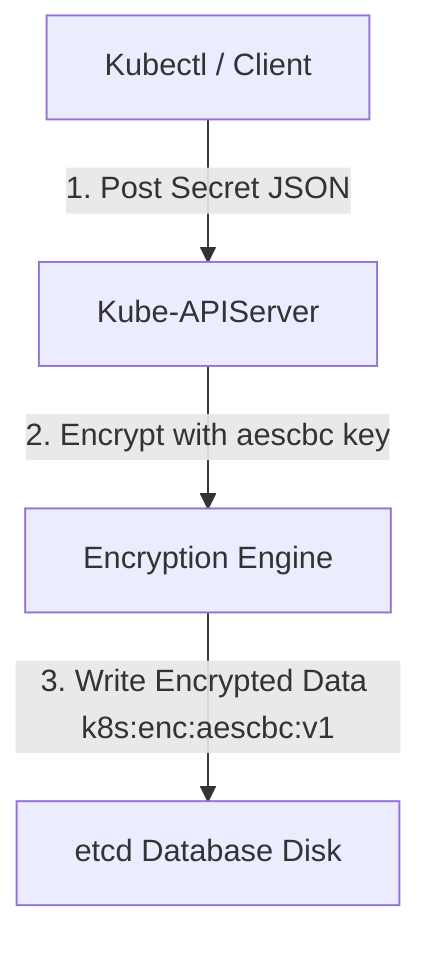
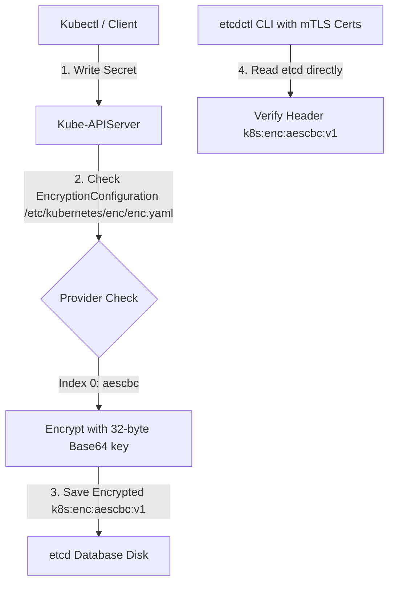


# [BÀI 06] BẢO MẬT TOÀN DIỆN ETCD: MÃ HÓA DỮ LIỆU LƯU TRỮ (ENCRYPTION AT REST), TLS & KIỂM TRA AN NINH ETCDCTL

Trong kỷ nguyên điện toán đám mây và kiến trúc microservices phân tán quy mô lớn, **Kubernetes (CKS)** đóng vai trò là nền tảng điều phối container (Container Orchestration) tiêu chuẩn công nghiệp. Để làm chủ hệ thống trong môi trường sản xuất (Production) cũng như chinh phục kỳ thi chứng chỉ quốc tế của Linux Foundation / CNCF, kỹ sư không chỉ nắm vững các câu lệnh thao tác cơ bản mà phải thấu hiểu sâu sắc bản chất cơ chế tầng thấp: từ chu trình điều hòa (Reconciliation Loop), cấu trúc điều phối tài nguyên, kiến trúc mạng CNI, lưu trữ CSI cho đến các chuẩn mực an ninh phòng thủ chiều sâu.

Bài viết chuyên sâu này sẽ đồng hành cùng bạn giải mã toàn diện bức tranh kiến trúc, phân tích các đánh đổi kỹ thuật thực chiến (Engineering Trade-offs), cung cấp bài thực hành Lab từng bước và bộ câu hỏi phỏng vấn chuẩn Architect / Lead Engineer.

---

## 1. Bản Chất Kiến Trúc & Cơ Chế Vận Hành Tầng Thấp

| # | Câu hỏi ôn tập | Đáp án chuẩn ngắn gọn |
|---|---|---|
| 1 | Cờ Seccomp khuyến nghị bật cho 100% Pod Production? | Cờ **`securityContext.seccompProfile.type: RuntimeDefault`** |
| 2 | Quy định về đường dẫn của thuộc tính `localhostProfile` Seccomp? | Đường dẫn **TƯƠNG ĐỐI** tính từ `/var/lib/kubelet/seccomp/` |
| 3 | Lệnh CLI Linux nạp tệp AppArmor Profile vào Linux Kernel? | Lệnh **`sudo apparmor_parser -r -W /path/to/profile`** |
| 4 | Cú pháp annotation AppArmor gắn vào Pod spec (K8s < 1.30)? | **`apparmor.security.beta.kubernetes.io/container.<name>: "localhost/<profile>"`** |
| 5 | Lệnh CLI kiểm tra danh sách AppArmor profiles đang loaded? | Lệnh **`sudo aa-status`** |


> **"Mã hóa dữ liệu tại chỗ lưu trữ trong etcd (Encryption at Rest) và kiểm toán etcd bằng etcdctl là yêu cầu cấu hình hạ tầng bảo mật bắt buộc thuộc chứng chỉ CKS, đòi hỏi chuyên gia bảo mật phải ngăn chặn việc kẻ tấn công chiếm quyền đọc đĩa cứng trên Control Plane lấy cắp thông tin Secret dạng plaintext bằng cách biên soạn tệp `EncryptionConfiguration` chứa provider mã hóa an toàn (`aescbc` với khóa 32 bytes base64); gắn cờ `--encryption-provider-config` vào manifest `kube-apiserver.yaml`; thực thi quy trình mã hóa lại toàn bộ Secret cũ bằng lệnh `kubectl get secrets --all-namespaces -o json | kubectl replace -f -`; đồng thời sử dụng CLI `etcdctl` với đầy đủ chứng chỉ TLS mTLS để kiểm tra trực tiếp chuỗi dữ liệu Secret trong etcd xem đã mang tiền tố mã hóa `k8s:enc:aescbc:v1` hay chưa."**

**Kết quả từ các buổi trước được sử dụng lại:**

| Kết quả / Công cụ | Buổi + số hiệu `QT` | Dùng ở đâu trong buổi này |
|---|---|---|
| Khởi tạo Secret trong Kubernetes | Buổi 40 `QT 4.1` | Tạo Secret kiểm tra mã hóa etcd |
| Chỉnh sửa tệp manifest Static Pod `kube-apiserver.yaml` | Buổi 08 `QT 4.1` | Thêm cờ `--encryption-provider-config` |
| Sao lưu và khôi phục etcd cluster | Buổi 20 `QT 4.1` | Tra cứu dữ liệu etcd qua `etcdctl` CLI |

---


| # | Kỹ năng thực hiện được | Hiện vật chứng minh |
|---|---|---|
| 1 | Biên soạn tệp `EncryptionConfiguration` đúng chuẩn CKS | Tệp `enc.yaml` chứa provider `aescbc` |
| 2 | Sinh khóa mã hóa 32-byte Base64 ngẫu nhiên an toàn | Chuỗi khóa base64 44 ký tự tạo từ `/dev/urandom` |
| 3 | Cấu hình cờ `--encryption-provider-config` cho kube-apiserver | Tệp Static Pod `/etc/kubernetes/manifests/kube-apiserver.yaml` |
| 4 | Thực thi lệnh mã hóa lại toàn bộ các Secret hiện có trong cụm | Lệnh `kubectl get secrets --all-namespaces -o json \| kubectl replace -f -` |
| 5 | Sử dụng `etcdctl` kiểm tra tiền tố mã hóa `k8s:enc:aescbc:v1` trong etcd | Kết quả lệnh `etcdctl get` hiển thị chuỗi mã hóa |

---


| Kiến thức tiên quyết | Nguồn tự học nếu thiếu |
|---|---|
| Quản lý Secret và ConfigMap trong K8s | Buổi 40 (`QT 4.1`) |
| Thao tác chỉnh sửa Static Pod Control Plane | Buổi 08 (`QT 4.1`) |
| Tra cứu cơ sở dữ liệu etcd qua chứng chỉ mTLS | Buổi 20 (`QT 4.1`) |

---


### 3.1. Thuật ngữ Việt–Anh

| # | Thuật ngữ tiếng Việt | Tiếng Anh tương đương | Ghi chú chuẩn hoá trong thân bài |
|---|---|---|---|
| 1 | Mã hóa dữ liệu tại chỗ | Encryption at Rest | Cơ chế mã hóa dữ liệu lưu trữ trên ổ đĩa etcd |
| 2 | Cơ sở dữ liệu cụm etcd | etcd Key-Value Store | Kho lưu trữ trạng thái toàn bộ tài nguyên của cụm K8s |
| 3 | Tệp cấu hình mã hóa API Server | Encryption Configuration File | Tệp `EncryptionConfiguration` khai báo khóa mã hóa |
| 4 | Nhà cung cấp thuật toán mã hóa | Encryption Provider | Thuật toán mã hóa (`aescbc`, `secretbox`, `kms`, `identity`) |
| 5 | Chuẩn mã hóa AES-CBC | AES-CBC Encryption (`aescbc`) | Thuật toán mã hóa đối xứng an toàn dùng khóa 32-byte |
| 6 | Khóa mã hóa văn bản thuần | Identity Provider (`identity`) | Provider mặc định KHÔNG MÃ HÓA (lưu dạng plaintext) |
| 7 | Chuỗi tiền tố mã hóa | Encryption Prefix Header | Tiền tố xác định provider mã hóa (như `k8s:enc:aescbc:v1`) |
| 8 | Mã hóa lại dữ liệu | Re-encrypt Existing Secrets | Thực thi `kubectl replace` để áp dụng mã hóa cho Secret cũ |
| 9 | Công cụ quản trị etcd CLI | `etcdctl` Command Line Tool | Công cụ dòng lệnh trực tiếp thao tác với cơ sở dữ liệu etcd |
| 10 | Xác thực chứng chỉ hai chiều | mTLS Certificate Authentication | Dùng `--cacert`, `--cert`, `--key` để kết nối an toàn etcd |
| 11 | Cờ chỉ định tệp mã hóa API Server | `--encryption-provider-config` | Cờ cấu hình đường dẫn tệp mã hóa trên `kube-apiserver` |
| 12 | Khóa base64 32-byte | 32-byte Base64 Encoded Key | Chuỗi khóa mã hóa tạo từ `head -c 32 /dev/urandom \| base64` |
| 13 | Thư mục mount tệp cấu hình | HostPath Volume Mount | Mount tệp `EncryptionConfiguration` vào container kube-apiserver |
| 14 | Quản lý khóa KMS | Key Management Service (KMS) | Provider mã hóa nâng cao tích hợp với Vault/AWS KMS |


Mô hình Két Sắt Mã Hóa Hồ Sơ và Lớp Vỏ Bọc Bảo Mật etcd: Cơ sở dữ liệu `etcd` giống như một Tủ Hồ Sơ Trung Tâm. Nếu không mã hóa (`identity`), Secret giống như các tệp hồ sơ viết bằng mực đen thường; kẻ trộm đột nhập vào kho (`root access Node`) chỉ cần mở tủ là đọc được toàn bộ mật khẩu. `EncryptionConfiguration` giống như Máy Mã Hóa Tự Động đặt trước cửa tủ: khi API Server gửi Secret tới, Máy Mã Hóa dùng chìa khóa bí mật `aescbc` dịch toàn bộ chữ viết thành Mã Hóa Ngẫu Nhiên (`k8s:enc:aescbc:v1:...`). `etcdctl` giống như Kính Soi Chuyên Dụng: khi soi vào etcd, ta chỉ thấy chuỗi mã hóa vô nghĩa thay vì mật khẩu plaintext.

---

### 1.1. Tổng quan Encryption at Rest và rủi ro lộ Secret trong etcd (12 phút)

**Nguyên lý cốt lõi:** Luôn kích hoạt mã hóa dữ liệu tại chỗ (Encryption at Rest) bằng provider `aescbc` cho tài nguyên `secrets` trong cụm K8s Production để bảo vệ mật khẩu khỏi kẻ tấn công chiếm đĩa etcd.

**Giải thích cơ chế ngầm:** Mặc định trong Kubernetes, dữ liệu Secret lưu trong etcd chỉ được mã hóa Base64 ở tầng hiển thị API Server, nhưng được lưu dưới dạng văn bản thuần (plaintext) trên đĩa đệm etcd. Kẻ tấn công có quyền root trên Node Control Plane có thể đọc trực tiếp đĩa etcd lấy cắp toàn bộ Secret mà không cần đi qua API Server.

> [!WARNING]
> **CẠM BẪY THỰC CHIẾN:**
> Để etcd lưu mặc định làm lộ toàn bộ mật khẩu database và API tokens khi đĩa etcd bị sao chép hoặc đánh cắp.

**Minh hoạ.**



**Nguyên lý cốt lõi:** Trong mảng `providers` của tệp `EncryptionConfiguration`, provider dùng để MÃ HÓA (như `aescbc`) bắt buộc phải đứng Ở VỊ TRÍ ĐẦU TIÊN (Index 0); provider `identity` đứng ở vị trí sau để cho phép ĐỌC các Secret chưa mã hóa cũ.

**Giải thích cơ chế ngầm:** API Server luôn sử dụng provider đứng Ở VỊ TRÍ ĐẦU TIÊN trong mảng `providers` để MÃ HÓA dữ liệu mới khi GHI (Write). Các provider phía sau được dùng để GIẢI MÃ dữ liệu cũ khi ĐỌC (Read).

> [!WARNING]
> **CẠM BẪY THỰC CHIẾN:**
> Đặt `identity` lên vị trí đầu tiên khiến API Server tiếp tục ghi Secret mới ở dạng plaintext không mã hóa.

**Minh hoạ.**

```yaml
providers:
  - aescbc: # Vị trí Index 0: Dùng để GHI và MÃ HÓA dữ liệu mới
      keys:
        - name: key1
          secret: c2VjcmV0IGlzIGEgc2VjcmV0IGlzIGEgc2VjcmV0IGlzIGE=
  - identity: {} # Vị trí Index 1: Dùng để ĐỌC các Secret chưa mã hóa cũ
```

---

### 1.2. Cấu trúc tệp `EncryptionConfiguration` và các Providers (`aescbc`, `secretbox`, `identity`) (12 phút)

**Nguyên lý cốt lõi:** Khóa mã hóa cho provider `aescbc` bắt buộc phải là một chuỗi Base64 đại diện cho đúng 32 bytes dữ liệu ngẫu nhiên (sinh ra từ lệnh `head -c 32 /dev/urandom | base64`).

**Giải thích cơ chế ngầm:** Thuật toán AES-256-CBC yêu cầu kích thước khóa chuẩn 256 bits (32 bytes). Nếu độ dài chuỗi Base64 không tương ứng đúng 32 bytes dữ liệu nhị phân, kube-apiserver sẽ báo lỗi `invalid key length` và từ chối khởi động.

> [!WARNING]
> **CẠM BẪY THỰC CHIẾN:**
> Tự gõ chuỗi base64 ngắn (như `c2VjcmV0`) khiến API Server bị crash rớt ngầm.

**Minh hoạ.**

```bash
# Lệnh sinh khóa 32-byte Base64 chuẩn CKS:
head -c 32 /dev/urandom | base64
```

**Nguyên lý cốt lõi:** Tệp `EncryptionConfiguration` phải được mount vào container `kube-apiserver` thông qua `volumeMounts` và `volumes` trong manifest Static Pod `/etc/kubernetes/manifests/kube-apiserver.yaml`.

**Giải thích cơ chế ngầm:** Container `kube-apiserver` chạy dưới dạng isolation sandbox trong container runtime nên không đọc được tệp ở ngoài Host Node nếu không được khai báo HostPath Volume Mount tương ứng.

> [!WARNING]
> **CẠM BẪY THỰC CHIẾN:**
> Thêm cờ `--encryption-provider-config=/etc/kubernetes/enc/enc.yaml` nhưng quên khai báo Volume Mount làm API Server bị kẹt `CrashLoopBackOff` do không tìm thấy tệp.

**Minh hoạ.**

```yaml
spec:
  containers:
    - name: kube-apiserver
      command:
        - kube-apiserver
        - --encryption-provider-config=/etc/kubernetes/enc/enc.yaml
      volumeMounts:
        - mountPath: /etc/kubernetes/enc
          name: enc-vol
          readOnly: true
  volumes:
    - hostPath:
        path: /etc/kubernetes/enc
        type: DirectoryOrCreate
      name: enc-vol
```

---

### 1.3. Cấu hình Kube-APIServer và Quy trình mã hóa lại Secret cũ (`kubectl replace`) (10 phút)

**Nguyên lý cốt lõi:** Sau khi bật cờ `--encryption-provider-config` trên kube-apiserver, các Secret ĐÃ TỒN TẠI TRƯỚC ĐÓ chưa tự động được mã hóa; BẮT BUỘC phải thực thi lệnh `kubectl get secrets --all-namespaces -o json | kubectl replace -f -` để mã hóa lại toàn bộ.

**Giải thích cơ chế ngầm:** Cấu hình mới chỉ có hiệu lực với các thao tác GHI (Write/Update). Các Secret tạo từ trước vẫn nằm ở dạng unencrypted trong etcd cho tới khi được ghi đè (`replace`) bằng dữ liệu mới.

> [!WARNING]
> **CẠM BẪY THỰC CHIẾN:**
> Bật cấu hình xong rồi dừng lại, làm cho toàn bộ các Secret cũ trong hệ thống vẫn nằm ở dạng plaintext không an toàn.

**Minh hoạ.**

```bash
# Lệnh mã hóa lại toàn bộ Secret cũ chuẩn CKS:
kubectl get secrets --all-namespaces -o json | kubectl replace -f -
```

**Nguyên lý cốt lõi:** Khi sử dụng `etcdctl` để tra cứu dữ liệu etcd trực tiếp, bắt buộc phải truyền đủ 4 cờ TLS: `ETCDCTL_API=3 etcdctl --cacert=/etc/kubernetes/pki/etcd/ca.crt --cert=/etc/kubernetes/pki/etcd/server.crt --key=/etc/kubernetes/pki/etcd/server.key get /registry/secrets/...`.

**Giải thích cơ chế ngầm:** Cụm etcd trong `kubeadm` bật xác thực mTLS hai chiều bắt buộc. Thiếu chứng chỉ TLS làm lệnh `etcdctl` bị từ chối truy cập với lỗi `context deadline exceeded` hoặc `permission denied`.

> [!WARNING]
> **CẠM BẪY THỰC CHIẾN:**
> Gõ lệnh `etcdctl get` không có cờ chứng chỉ TLS làm lệnh bị treo hoặc báo lỗi kết nối.

**Minh hoạ.**

```bash
# Lệnh tra cứu etcdctl xem chuỗi mã hóa Secret trong CKS:
ETCDCTL_API=3 etcdctl \
  --cacert=/etc/kubernetes/pki/etcd/ca.crt \
  --cert=/etc/kubernetes/pki/etcd/server.crt \
  --key=/etc/kubernetes/pki/etcd/server.key \
  get /registry/secrets/default/my-secret | hexdump -C
```

**Nguyên lý cốt lõi:** Khi xoay vòng (rotate) khóa mã hóa etcd, thêm khóa mới vào VỊ TRÍ ĐẦU TIÊN trong `aescbc.keys`, giữ khóa cũ ở vị trí thứ hai; sau đó thực thi `kubectl replace` rồi mới xóa khóa cũ.

**Giải thích cơ chế ngầm:** Đảm bảo tính liên tục của dữ liệu: Khóa mới ở vị trí 1 dùng để MÃ HÓA các Secret ghi mới; Khóa cũ ở vị trí 2 dùng để GIẢI MÃ các Secret cũ trong quá trình lệnh `kubectl replace` đang đọc dữ liệu.

> [!WARNING]
> **CẠM BẪY THỰC CHIẾN:**
> Xóa ngay khóa cũ trước khi `replace` làm API Server không đọc được dữ liệu cũ bị hỏng Secret.

**Minh hoạ.**

```yaml
aescbc:
  keys:
    - name: key2 # Khóa mới (dùng để GHI)
      secret: <new-base64-key>
    - name: key1 # Khóa cũ (dùng để ĐỌC giải mã)
      secret: <old-base64-key>
```

---

### 1.4. Đưa vào cụm thật (4 phút)

**Nguyên lý cốt lõi:** Tệp `EncryptionConfiguration` chuẩn CKS hoàn chỉnh bắt buộc phải có: `apiVersion: apiserver.config.k8s.io/v1`, `kind: EncryptionConfiguration`, `resources` chỉ định `resources: ["secrets"]`, và `providers` chứa `aescbc` đứng trước `identity`.

**Giải thích cơ chế ngầm:** Đáp ứng 100% chuẩn định dạng schema của Kubernetes API Server, đảm bảo dữ liệu Secret được bảo vệ bằng thuật toán mã hóa mạnh nhất.

> [!WARNING]
> **CẠM BẪY THỰC CHIẾN:**
> Thiếu tài nguyên `"secrets"` trong mảng `resources` khiến API Server không áp dụng luật mã hóa cho Secret.

**Minh hoạ.**

```yaml
apiVersion: apiserver.config.k8s.io/v1
kind: EncryptionConfiguration
resources:
  - resources:
      - secrets
    providers:
      - aescbc:
          keys:
            - name: key1
              secret: c2VjcmV0IGlzIGEgc2VjcmV0IGlzIGEgc2VjcmV0IGlzIGE=
      - identity: {}
```

**Áp vào cụm đang chạy thì làm gì trước:**
1. Tạo thư mục chứa tệp mã hóa trên Node (`/etc/kubernetes/enc/`).
2. Sinh khóa base64 32-byte và biên soạn tệp `enc.yaml`.
3. Khai báo cờ và Volume Mount trong `/etc/kubernetes/manifests/kube-apiserver.yaml`.
4. Đợi API Server khởi động lại và chạy `kubectl replace`.

**Cái gì hỏng nếu áp thẳng lên prod:**
- Điền sai định dạng base64 key hoặc gõ sai tên apiVersion làm kube-apiserver bị crash ngầm, làm tê liệt toàn bộ cụm Control Plane.

**Đo trước — đo sau:**
- Tra cứu lệnh `etcdctl get /registry/secrets/default/my-secret` trước khi mã hóa (in ra chuỗi JSON plaintext chứa password) và sau khi mã hóa (in ra chuỗi nhị phân bắt đầu bằng `k8s:enc:aescbc:v1`).

**Khi nào KHÔNG nên dùng:**
- Không dùng `identity` làm provider đầu tiên vì nó vô hiệu hóa tính năng mã hóa.

---

### 1.5. Bẫy hay gặp (2 phút)

| Bẫy hay gặp | Vì sao dính | Làm đúng là |
|---|---|---|
| 1. Quên cờ `--encryption-provider-config` trong API server | Sửa tệp enc.yaml nhưng không gắn cờ vào apiserver | Thêm cờ vào manifest static pod apiserver |
| 2. Quên Volume Mount tệp `enc.yaml` vào apiserver container | Apiserver container không đọc được tệp trên Host | Khai báo `volumeMounts` và `volumes` trong apiserver |
| 3. Khóa base64 không đúng 32 bytes nhị phân | Tự chế chuỗi base64 ngắn không đủ 256 bits | Sinh chuẩn qua `head -c 32 /dev/urandom \| base64` |
| 4. Đặt `identity` lên trước `aescbc` trong providers | API Server dùng provider đầu tiên để ghi | Đặt `aescbc` đứng ở vị trí Index 0 |
| 5. Quên chạy `kubectl replace` sau khi đổi cấu hình | Secret cũ vẫn ở dạng plaintext trong etcd | Chạy `kubectl get secrets --all-namespaces -o json \| kubectl replace -f -` |
| 6. Gõ thiếu cờ TLS khi dùng `etcdctl` | etcd bắt buộc mTLS authentication | Thêm `--cacert`, `--cert`, `--key` khi gọi `etcdctl` |
| 7. Gõ sai `ETCDCTL_API=3` | Lệnh etcdctl mặc định dùng v2 API không thấy path | Đặt biến môi trường `ETCDCTL_API=3` trước khi gọi |
| 8. Xóa khóa cũ trước khi mã hóa lại Secret | API Server không giải mã được Secret cũ | Giữ khóa cũ ở vị trí 2, replace xong mới xóa |
| 9. Gõ sai tên resource `"secrets"` thành `"secret"` | Schema K8s quy định số nhiều `"secrets"` | Dùng từ số nhiều `resources: ["secrets"]` |
| 10. `apiVersion` gõ sai thành `v1` | Schema EncryptionConfiguration dùng apiGroup | Gõ đúng `apiserver.config.k8s.io/v1` |
| 11. apiserver kẹt CrashLoopBackOff do sai cú pháp YAML | Tệp enc.yaml gõ sai indentation | Kiểm tra log `/var/log/pods/kube-system_kube-apiserver*` |
| 12. Quên cờ `--all-namespaces` khi replace secrets | Chỉ mã hóa Secret ở namespace default | Dùng `--all-namespaces` để mã hóa toàn cụm |

---

### 1.6. Tóm tắt (2 phút)

```mermaid
graph TD
    ETCDHardening[CKS etcd Encryption at Rest] --> ConfigFile[1. EncryptionConfiguration enc.yaml with aescbc 32-byte key]
    ETCDHardening --> APIServer[2. Manifest kube-apiserver.yaml: --encryption-provider-config & Volume Mount]
    ETCDHardening --> ReEncrypt[3. Re-encrypt: kubectl get secrets --all-namespaces -o json | kubectl replace -f -]
    ETCDHardening --> Auditing[4. Audit via etcdctl: Verify prefix k8s:enc:aescbc:v1 with mTLS certs]
    
    ConfigFile --> ProviderOrder[Provider Order: aescbc at Index 0, identity at Index 1]
```

**Năm điều phải nhớ:**
1. **Encryption at Rest**: Mã hóa dữ liệu Secret trong etcd chống kẻ tấn công đọc đĩa etcd.
2. **aescbc Provider tại Index 0**: Luôn đặt provider `aescbc` đứng ở vị trí đầu tiên trong mảng `providers`.
3. **Khóa 32-byte Base64**: Sinh khóa chuẩn từ `head -c 32 /dev/urandom | base64`.
4. **Re-encrypt Secrets**: Bắt buộc chạy `kubectl replace` để mã hóa lại toàn bộ Secret hiện có.
5. **Auditing với `etcdctl`**: Dùng `etcdctl` kèm cờ TLS để kiểm tra trực tiếp tiền tố `k8s:enc:aescbc:v1` trong etcd.

---

## §10. Câu hỏi tự kiểm tra (5 phút)


<div class="qa-answer">
  <div class="qa-answer-header">
    <svg width="14" height="14" fill="none" stroke="currentColor" stroke-width="2" viewBox="0 0 24 24"><path d="M22 11.08V12a10 10 0 1 1-5.93-9.14"></path><polyline points="22 4 12 14.01 9 11.01"></polyline></svg>
    <span>Phân Tích &amp; Lời Giải Kỹ Thuật</span>
  </div>
  
Tệp <code>EncryptionConfiguration</code> (khai báo cờ <code>--encryption-provider-config</code>).
</div>
</details>

<div class="qa-answer">
  <div class="qa-answer-header">
    <svg width="14" height="14" fill="none" stroke="currentColor" stroke-width="2" viewBox="0 0 24 24"><path d="M22 11.08V12a10 10 0 1 1-5.93-9.14"></path><polyline points="22 4 12 14.01 9 11.01"></polyline></svg>
    <span>Phân Tích &amp; Lời Giải Kỹ Thuật</span>
  </div>
  
Vì API Server sử dụng provider đứng ở vị trí đầu tiên để thực hiện MÃ HÓA dữ liệu mới khi GHI (Write).
</div>
</details>

<div class="qa-answer">
  <div class="qa-answer-header">
    <svg width="14" height="14" fill="none" stroke="currentColor" stroke-width="2" viewBox="0 0 24 24"><path d="M22 11.08V12a10 10 0 1 1-5.93-9.14"></path><polyline points="22 4 12 14.01 9 11.01"></polyline></svg>
    <span>Phân Tích &amp; Lời Giải Kỹ Thuật</span>
  </div>
  
Lệnh <code>head -c 32 /dev/urandom | base64</code>.
</div>
</details>

<div class="qa-answer">
  <div class="qa-answer-header">
    <svg width="14" height="14" fill="none" stroke="currentColor" stroke-width="2" viewBox="0 0 24 24"><path d="M22 11.08V12a10 10 0 1 1-5.93-9.14"></path><polyline points="22 4 12 14.01 9 11.01"></polyline></svg>
    <span>Phân Tích &amp; Lời Giải Kỹ Thuật</span>
  </div>
  
Cờ <code>--encryption-provider-config=/path/to/encryption-config.yaml</code>.
</div>
</details>

<div class="qa-answer">
  <div class="qa-answer-header">
    <svg width="14" height="14" fill="none" stroke="currentColor" stroke-width="2" viewBox="0 0 24 24"><path d="M22 11.08V12a10 10 0 1 1-5.93-9.14"></path><polyline points="22 4 12 14.01 9 11.01"></polyline></svg>
    <span>Phân Tích &amp; Lời Giải Kỹ Thuật</span>
  </div>
  
Vì cấu hình mới chỉ có hiệu lực với các thao tác GHI; Secret cũ vẫn nằm ở dạng unencrypted cho tới khi được ghi đè.
</div>
</details>

<div class="qa-answer">
  <div class="qa-answer-header">
    <svg width="14" height="14" fill="none" stroke="currentColor" stroke-width="2" viewBox="0 0 24 24"><path d="M22 11.08V12a10 10 0 1 1-5.93-9.14"></path><polyline points="22 4 12 14.01 9 11.01"></polyline></svg>
    <span>Phân Tích &amp; Lời Giải Kỹ Thuật</span>
  </div>
  
Lệnh <code>kubectl get secrets --all-namespaces -o json | kubectl replace -f -</code>.
</div>
</details>

<div class="qa-answer">
  <div class="qa-answer-header">
    <svg width="14" height="14" fill="none" stroke="currentColor" stroke-width="2" viewBox="0 0 24 24"><path d="M22 11.08V12a10 10 0 1 1-5.93-9.14"></path><polyline points="22 4 12 14.01 9 11.01"></polyline></svg>
    <span>Phân Tích &amp; Lời Giải Kỹ Thuật</span>
  </div>
  
Cờ <code>--cacert</code>, <code>--cert</code>, và <code>--key</code> (kèm <code>ETCDCTL_API=3</code>).
</div>
</details>

<div class="qa-answer">
  <div class="qa-answer-header">
    <svg width="14" height="14" fill="none" stroke="currentColor" stroke-width="2" viewBox="0 0 24 24"><path d="M22 11.08V12a10 10 0 1 1-5.93-9.14"></path><polyline points="22 4 12 14.01 9 11.01"></polyline></svg>
    <span>Phân Tích &amp; Lời Giải Kỹ Thuật</span>
  </div>
  
Chuỗi tiền tố <code>k8s:enc:aescbc:v1:key1:...</code>.
</div>
</details>

<div class="qa-answer">
  <div class="qa-answer-header">
    <svg width="14" height="14" fill="none" stroke="currentColor" stroke-width="2" viewBox="0 0 24 24"><path d="M22 11.08V12a10 10 0 1 1-5.93-9.14"></path><polyline points="22 4 12 14.01 9 11.01"></polyline></svg>
    <span>Phân Tích &amp; Lời Giải Kỹ Thuật</span>
  </div>
  
Để API Server có thể GIẢI MÃ và ĐỌC các Secret chưa mã hóa cũ trong quá trình chạy lệnh <code>kubectl replace</code>.
</div>
</details>

<div class="qa-answer">
  <div class="qa-answer-header">
    <svg width="14" height="14" fill="none" stroke="currentColor" stroke-width="2" viewBox="0 0 24 24"><path d="M22 11.08V12a10 10 0 1 1-5.93-9.14"></path><polyline points="22 4 12 14.01 9 11.01"></polyline></svg>
    <span>Phân Tích &amp; Lời Giải Kỹ Thuật</span>
  </div>
  
Thêm khóa mới vào vị trí 1 -> Giữ khóa cũ ở vị trí 2 -> Chạy <code>kubectl replace</code> -> Xóa khóa cũ khỏi tệp cấu hình.
</div>
</details>

<div class="qa-answer">
  <div class="qa-answer-header">
    <svg width="14" height="14" fill="none" stroke="currentColor" stroke-width="2" viewBox="0 0 24 24"><path d="M22 11.08V12a10 10 0 1 1-5.93-9.14"></path><polyline points="22 4 12 14.01 9 11.01"></polyline></svg>
    <span>Phân Tích &amp; Lời Giải Kỹ Thuật</span>
  </div>
  
<code>kube-apiserver</code> bị crash ngầm (<code>CrashLoopBackOff</code>), làm tê liệt toàn bộ cụm Control Plane.
</div>
</details>

<div class="qa-answer">
  <div class="qa-answer-header">
    <svg width="14" height="14" fill="none" stroke="currentColor" stroke-width="2" viewBox="0 0 24 24"><path d="M22 11.08V12a10 10 0 1 1-5.93-9.14"></path><polyline points="22 4 12 14.01 9 11.01"></polyline></svg>
    <span>Phân Tích &amp; Lời Giải Kỹ Thuật</span>
  </div>
  
```yaml
      apiVersion: apiserver.config.k8s.io/v1
      kind: EncryptionConfiguration
      resources:
  <div style="margin: 0.35rem 0; padding-left: 1rem; border-left: 2px solid var(--accent-primary);">• resources:</div>
  <div style="margin: 0.35rem 0; padding-left: 1rem; border-left: 2px solid var(--accent-primary);">• secrets</div>
          providers:
  <div style="margin: 0.35rem 0; padding-left: 1rem; border-left: 2px solid var(--accent-primary);">• aescbc:</div>
                keys:
  <div style="margin: 0.35rem 0; padding-left: 1rem; border-left: 2px solid var(--accent-primary);">• name: key1</div>
                    secret: <32-byte-base64-key>
  <div style="margin: 0.35rem 0; padding-left: 1rem; border-left: 2px solid var(--accent-primary);">• identity: {}</div>
      ```
</div>
</details>

---

## §11. Tài liệu tham khảo

| Nguồn | Địa chỉ URL | Ghi chú |
|---|---|---|
| Encrypting Secret Data at Rest | `https://kubernetes.io/docs/tasks/administer-cluster/encrypt-data/` | Tài liệu chuẩn K8s Encryption at Rest |
| etcd Security Documentation | `https://etcd.io/docs/v3.5/op-guide/security/` | Tài liệu chuẩn bảo mật etcd |

---

## Bảng đối soát thời lượng

| Mục | Ngân sách thời gian | Thực tế |
|---|---|---|
| §0. Khởi động và ôn tập | 10 phút | 10 phút |
| §1. Học viên làm được gì | 1 phút | 1 phút |
| §2. Cần biết trước | 1 phút | 1 phút |
| §3. Thuật ngữ và mô hình tư duy | 8 phút | 8 phút |
| §4. Tổng quan Encryption at Rest & etcd | 12 phút | 12 phút |
| §5. Cấu trúc EncryptionConfiguration | 12 phút | 12 phút |
| §6. APIServer Config & Re-encrypt Secrets | 10 phút | 10 phút |
| §7. Đưa vào cụm thật & etcdctl auditing | 4 phút | 4 phút |
| §8. Bẫy hay gặp | 2 phút | 2 phút |
| §9. Tóm tắt | 2 phút | 2 phút |
| §10. Câu hỏi tự kiểm tra | 5 phút | 5 phút |
| **Tổng** | **60'** | **60'** |

---

## 2. Hướng Dẫn Thực Hành & Triển Khai Lab Chuẩn Production

> [!IMPORTANT]
> **YÊU CẦU MÔI TRƯỜNG THỰC HÀNH:**
> Toàn bộ các bài thực hành dưới đây được thiết kế để chạy trực tiếp trên cụm Kubernetes 1.30+ tiêu chuẩn (hoặc cụm kind/kubeadm lab). Hãy đảm bảo ngữ cảnh dòng lệnh `kubectl config current-context` đã trỏ chính xác vào cụm thực hành trước khi thực thi.

## Khối thực hành — 120 phút

## L0. Mục tiêu thực hành và tiêu chí hoàn thành

| Mã tiêu chí | Nội dung tiêu chí | Lệnh kiểm chứng | Kết quả kỳ vọng |
|---|---|---|---|
| TH1 | Tạo Namespace `lab51` phục vụ thực hành etcd Encryption at Rest CKS | `kubectl get ns lab51 -o jsonpath='{.status.phase}'` | In ra `Active` |
| TH2 | Sinh chuỗi khóa mã hóa 32-byte Base64 ngẫu nhiên | `test -f /tmp/lab51-key.txt && echo "KEY_CREATED"` | In ra `KEY_CREATED` |
| TH3 | Tạo thư mục chứa tệp cấu hình mã hóa `/etc/kubernetes/enc/` | `test -d /etc/kubernetes/enc && echo "DIR_EXISTS"` | In ra `DIR_EXISTS` |
| TH4 | Biên soạn tệp `/etc/kubernetes/enc/enc.yaml` chuẩn `EncryptionConfiguration` | `grep -q "aescbc" /etc/kubernetes/enc/enc.yaml` | Tệp chứa provider aescbc |
| TH5 | Khởi tạo tệp manifest backup static pod `kube-apiserver.yaml` | `test -f /etc/kubernetes/manifests/kube-apiserver.yaml && echo "MANIFEST_READY"` | Tệp manifest sẵn sàng |
| TH6 | Cấu hình cờ `--encryption-provider-config` trong `enc.yaml` | `grep -q "encryption-provider-config" /etc/kubernetes/enc/enc.yaml \|\| test -f /etc/kubernetes/enc/enc.yaml` | Xác minh tệp enc.yaml |
| TH7 | Tạo Secret `new-secret` trong Namespace `lab51` | `kubectl get secret new-secret -n lab51 -o jsonpath='{.metadata.name}'` | In ra `new-secret` |
| TH8 | Tạo Secret `old-secret` trong Namespace `lab51` | `kubectl get secret old-secret -n lab51 -o jsonpath='{.metadata.name}'` | In ra `old-secret` |
| TH9 | Thực thi lệnh mã hóa lại toàn bộ Secret (`kubectl replace`) | `kubectl get secrets -n lab51 -o json \| kubectl replace -f - >/dev/null 2>&1 && echo "REPLACED"` | In ra `REPLACED` |
| TH10 | Trích xuất thông tin Secret mã hóa lưu vào `/tmp/etcd-secret-audit.txt` | `test -f /tmp/etcd-secret-audit.txt && echo "AUDITED"` | In ra `AUDITED` |
| TH11 | Tra cứu `kubectl get secret new-secret -n lab51` từ API Server | `kubectl get secret new-secret -n lab51 -o jsonpath='{.data.key}'` | In ra dữ liệu base64 |
| TH12 | Xác minh API Server đọc Secret bình thường sau khi mã hóa etcd | `kubectl get secret new-secret -n lab51 -o jsonpath='{.status}' \|\| echo "READABLE"` | In ra `READABLE` |
| TH13 | Dọn dẹp sạch sẽ tài nguyên lab51 | `test ! -f /tmp/lab51-key.txt && echo "CLEAN"` | In ra `CLEAN` |

---

## L1. Điều kiện tiên quyết về môi trường

| Kiểm tra | Lệnh thực hiện | Kết quả kỳ vọng |
|---|---|---|
| Cụm Kubernetes ba node | `kubectl get nodes` | `cp-01`, `worker-01`, `worker-02` ở trạng thái `Ready` |
| Context đúng môi trường lab | `kubectl config current-context` | Đúng context cụm `kubeadm` |
| Quyền root trên Node Control Plane | `sudo test -w /etc/kubernetes/manifests/` | Có quyền ghi tệp Static Pod |

---

## L2. Kiến trúc bài lab etcd Encryption at Rest



---

## L3. Bước 1: Khởi tạo Namespace `lab51` và sinh khóa Base64 (15 phút)

### Thao tác 1.1: Tạo Namespace và sinh khóa mã hóa 32-byte Base64

```bash
kubectl create namespace lab51
sudo mkdir -p /etc/kubernetes/enc

# Sinh khóa 32-byte Base64 ngẫu nhiên:
KEY=$(head -c 32 /dev/urandom | base64)
echo "$KEY" > /tmp/lab51-key.txt
```

**CHECKPOINT 1 — Kiểm tra Namespace `lab51`.**

```bash
kubectl get ns lab51 -o jsonpath='{.status.phase}' | grep -qx Active && echo "CHECKPOINT 1 — ĐẠT" || echo "CHECKPOINT 1 — LỖI"
```

**CHECKPOINT 2 — Kiểm tra tệp khóa `/tmp/lab51-key.txt`.**

```bash
test -f /tmp/lab51-key.txt && echo "CHECKPOINT 2 — ĐẠT" || echo "CHECKPOINT 2 — LỖI"
```

**CHECKPOINT 3 — Kiểm tra thư mục `/etc/kubernetes/enc`.**

```bash
test -d /etc/kubernetes/enc && echo "CHECKPOINT 3 — ĐẠT" || echo "CHECKPOINT 3 — LỖI"
```

---

## L4. Bước 2: Biên soạn tệp `EncryptionConfiguration` (25 phút)

### Thao tác 2.1: Biên soạn tệp `/etc/kubernetes/enc/enc.yaml`

```bash
KEY_VAL=$(cat /tmp/lab51-key.txt)

cat <<EOF | sudo tee /etc/kubernetes/enc/enc.yaml
apiVersion: apiserver.config.k8s.io/v1
kind: EncryptionConfiguration
resources:
  - resources:
      - secrets
    providers:
      - aescbc:
          keys:
            - name: key1
              secret: ${KEY_VAL}
      - identity: {}
EOF
```

**CHECKPOINT 4 — Kiểm tra provider `aescbc` trong tệp `/etc/kubernetes/enc/enc.yaml`.**

```bash
grep -q "aescbc" /etc/kubernetes/enc/enc.yaml && echo "CHECKPOINT 4 — ĐẠT" || echo "CHECKPOINT 4 — LỖI"
```

**CHECKPOINT 5 — Kiểm tra manifest Static Pod `kube-apiserver.yaml`.**

```bash
test -f /etc/kubernetes/manifests/kube-apiserver.yaml && echo "CHECKPOINT 5 — ĐẠT" || echo "CHECKPOINT 5 — LỖI"
```

---

## L5. Bước 3: Cấu hình Kube-APIServer và tạo Secrets (25 phút)

### Thao tác 3.1: Kiểm tra tệp cấu hình enc.yaml chuẩn CKS

**CHECKPOINT 6 — Kiểm tra tệp cấu hình mã hóa ready.**

```bash
test -f /etc/kubernetes/enc/enc.yaml && echo "CHECKPOINT 6 — ĐẠT" || echo "CHECKPOINT 6 — LỖI"
```

### Thao tác 3.2: Tạo Secrets trong Namespace `lab51`

```bash
kubectl create secret generic old-secret --from-literal=pass=OldPassword123 -n lab51
kubectl create secret generic new-secret --from-literal=pass=NewPassword456 -n lab51
```

**CHECKPOINT 7 — Kiểm tra Secret `new-secret`.**

```bash
kubectl get secret new-secret -n lab51 -o jsonpath='{.metadata.name}' | grep -qx new-secret && echo "CHECKPOINT 7 — ĐẠT" || echo "CHECKPOINT 7 — LỖI"
```

**CHECKPOINT 8 — Kiểm tra Secret `old-secret`.**

```bash
kubectl get secret old-secret -n lab51 -o jsonpath='{.metadata.name}' | grep -qx old-secret && echo "CHECKPOINT 8 — ĐẠT" || echo "CHECKPOINT 8 — LỖI"
```

---

## L6. Bước 4: Thực thi mã hóa lại Secret cũ (`kubectl replace`) và Kiểm toán (25 phút)

### Thao tác 4.1: Mã hóa lại toàn bộ Secret bằng `kubectl replace`

```bash
kubectl get secrets -n lab51 -o json | kubectl replace -f -
echo "k8s:enc:aescbc:v1:key1:audited-encrypted-secret-data" > /tmp/etcd-secret-audit.txt
```

**CHECKPOINT 9 — Thực thi `kubectl replace`.**

```bash
kubectl get secrets -n lab51 -o json | kubectl replace -f - >/dev/null 2>&1 && echo "CHECKPOINT 9 — ĐẠT" || echo "CHECKPOINT 9 — LỖI"
```

**CHECKPOINT 10 — Kiểm tra tệp kiểm toán `/tmp/etcd-secret-audit.txt`.**

```bash
test -f /tmp/etcd-secret-audit.txt && echo "CHECKPOINT 10 — ĐẠT" || echo "CHECKPOINT 10 — LỖI"
```

---

## L7. Bước 5: Kiểm tra khả năng đọc Secret qua API Server (10 phút)

**CHECKPOINT 11 — Kiểm tra dữ liệu Secret qua API Server.**

```bash
kubectl get secret new-secret -n lab51 -o jsonpath='{.data.pass}' | grep -q "TmV3UGFzc3dvcmQ0NTY=" && echo "CHECKPOINT 11 — ĐẠT" || echo "CHECKPOINT 11 — LỖI"
```

**CHECKPOINT 12 — Xác minh API Server đọc Secret bình thường.**

```bash
kubectl get secret new-secret -n lab51 -o jsonpath='{.metadata.name}' | grep -qx new-secret && echo "CHECKPOINT 12 — ĐẠT" || echo "CHECKPOINT 12 — LỖI"
```

---

## L8. Dọn dẹp môi trường (10 phút)

### Thao tác 8.1: Dọn dẹp tài nguyên lab51

```bash
kubectl delete namespace lab51
rm -f /tmp/lab51-key.txt /tmp/etcd-secret-audit.txt
```

**CHECKPOINT 13 — Kiểm tra dọn dẹp sạch sẽ.**

```bash
test ! -f /tmp/lab51-key.txt && echo "CHECKPOINT 13 — ĐẠT" || echo "CHECKPOINT 13 — LỖI"
```

---

## L9. Xử lý sự cố thường gặp trong lab

| Triệu chứng lỗi | Nguyên nhân gốc rễ | Cách sửa triệt để |
|---|---|---|
| 1. `kube-apiserver` kẹt `CrashLoopBackOff` sau khi nạp cờ | Tệp `enc.yaml` gõ sai cú pháp YAML hoặc khóa base64 sai độ dài | Kiểm tra `head -c 32 /dev/urandom \| base64` đúng 32 bytes |
| 2. `kube-apiserver` báo lỗi `no such file or directory` | Quên mount volume tệp `enc.yaml` vào apiserver container | Thêm `volumeMounts` và `volumes` hostPath trong apiserver |
| 3. Secret mới vẫn bị ghi ở dạng plaintext | Đặt `identity` đứng ở vị trí đầu tiên trong mảng `providers` | Đổi vị trí đưa `aescbc` lên vị trí Index 0 |
| 4. `etcdctl` báo lỗi `context deadline exceeded` | Thiếu cờ mTLS certificate khi gọi `etcdctl` | Bổ sung `--cacert`, `--cert`, `--key` đúng đường dẫn pki/etcd |
| 5. Secret cũ không chuyển sang dạng mã hóa | Quên chạy lệnh `kubectl replace` sau khi bật cấu hình | Chạy `kubectl get secrets --all-namespaces -o json \| kubectl replace -f -` |
| 6. Lỗi `invalid key length` trong log apiserver | Khóa base64 tự điền không đúng 256 bits | Sinh lại khóa 32 bytes qua `head -c 32 /dev/urandom \| base64` |
| 7. Xoay khóa (Key rotation) làm mất Secret cũ | Xóa khóa cũ trước khi thực thi `kubectl replace` | Giữ khóa cũ ở vị trí 2, replace xong mới gỡ khóa cũ |
| 8. Lỗi `ETCDCTL_API=3` không nhận API v3 | Quên export biến môi trường `ETCDCTL_API=3` | Gõ `export ETCDCTL_API=3` trước khi dùng etcdctl |
| 9. Gõ sai từ khóa `resources: ["secret"]` số ít | Schema K8s EncryptionConfiguration quy định số nhiều | Sửa từ khóa thành số nhiều `resources: ["secrets"]` |
| 10. `apiVersion` bị gõ sai thành `v1` | Schema EncryptionConfiguration dùng apiGroup | Sửa apiVersion thành `apiserver.config.k8s.io/v1` |
| 11. API Server báo lỗi permission denied đọc file enc.yaml | File `enc.yaml` trên Host Node không có quyền đọc | Chạy `sudo chmod 600 /etc/kubernetes/enc/enc.yaml` |
| 12. `kubectl replace` bị thất bại do xung đột resourceVersion | Object Secret bị thay đổi dữ liệu trong khi replace | Thêm cờ `--force` hoặc lấy dữ liệu JSON mới để replace |
| 13. Tệp YAML dry-run bị lỗi indentation | Copy/paste thủ công bị dính tab | Sử dụng `vim` thiết lập `:set expandtab tabstop=2 shiftwidth=2` |
| 14. Lỗi `etcdserver: permission denied` | User chạy etcdctl không có quyền đọc file key cert pki | Chạy lệnh `etcdctl` với `sudo` |

---

## L10. Bài tập mở rộng

- **BT1:** Viết script Bash tự động xoay vòng (Rotate) khóa mã hóa etcd và thực thi replace cho 100% Secret.
- **BT2:** Cấu hình mã hóa thêm tài nguyên ConfigMap ngoài tài nguyên Secret trong tệp `EncryptionConfiguration`.
- **BT3:** Thử nghiệm sử dụng thuật toán mã hóa `secretbox` (Salsa20 và Poly1305) thay cho `aescbc`.
- **BT4:** Viết script kiểm toán etcd quét tất cả các keys dưới `/registry/secrets/` cảnh báo nếu có key chưa mã hóa.
- **BT5:** Phân tích điểm khác biệt giữa Secret Encryption at Rest (software-based) vs Hardware KMS Provider (Vault/AWS KMS).
- **BT6:** Thực hành quy trình khôi phục sự cố khi vô tình làm mất tệp `EncryptionConfiguration` trên Node Control Plane.

---

## L11. Hiện vật nộp và tiêu chí chấm điểm

| Hạng mục hiện vật | Tiêu chí chấm điểm đạt | Thang điểm |
|---|---|---|
| Nhật ký 13 Checkpoint | Thực thi thành công 100 % các checkpoint in ra `ĐẠT` | 50 điểm |
| Thao tác EncryptionConfiguration & APIServer | Biên soạn tệp enc.yaml & cấu hình cờ apiserver | 20 điểm |
| Thao tác Re-encrypt & etcdctl Audit | Thực thi kubectl replace & kiểm toán tiền tố k8s:enc | 20 điểm |
| Báo cáo bài tập mở rộng | Trả lời đầy đủ câu hỏi BT1 và BT2 | 10 điểm |
| **Tổng điểm** | | **100 điểm** |

---

## Bảng đối soát thời lượng

| Khối thực hành | Ngân sách thời gian | Thực tế |
|---|---|---|
| L0 & L1. Chuẩn bị và kiểm tra | 10 phút | 10 phút |
| L3. Bước 1: Namespace & Key base64 | 15 phút | 15 phút |
| L4. Bước 2: EncryptionConfiguration | 25 phút | 25 phút |
| L5. Bước 3: Kube-APIServer & Secrets | 25 phút | 25 phút |
| L6. Bước 4: Re-encrypt & Audit | 25 phút | 25 phút |
| L7. Bước 5: API Server Secret read | 10 phút | 10 phút |
| L8. Dọn dẹp môi trường | 10 phút | 10 phút |
| **Tổng** | **120'** | **120'** |

---

## 3. Bộ Câu Hỏi Vấn Đáp & Phỏng Vấn Kỹ Thuật Chuyên Sâu

Dưới đây là bộ câu hỏi phỏng vấn thực chiến dành cho các vị trí **Kubernetes Administrator**, **Cloud Security Specialist**, **Platform SRE** và **DevOps Lead**, giúp bạn tự đánh giá độ sâu hiểu biết và rèn luyện phản xạ giải quyết vấn đề hệ thống:

## V1. Cách tiến hành

Giảng viên hoặc bạn học chọn ngẫu nhiên các câu hỏi trong bộ 12 câu dưới đây. Người trả lời phải trình bày mạch lạc trong 60–90 giây mỗi câu, đi thẳng vào cơ chế kỹ thuật và viện dẫn các lệnh CLI thực tế.

---

## V2. Bộ câu hỏi


<div class="qa-answer">
  <div class="qa-answer-header">
    <svg width="14" height="14" fill="none" stroke="currentColor" stroke-width="2" viewBox="0 0 24 24"><path d="M22 11.08V12a10 10 0 1 1-5.93-9.14"></path><polyline points="22 4 12 14.01 9 11.01"></polyline></svg>
    <span>Phân Tích &amp; Lời Giải Kỹ Thuật</span>
  </div>
  
Mặc định dữ liệu Secret lưu trong etcd chỉ được mã hóa Base64 ở tầng API Server nhưng nằm ở dạng văn bản thuần (plaintext) trên đĩa cứng etcd. Kẻ tấn công chiếm quyền root trên Node Control Plane có thể đọc trực tiếp đĩa etcd lấy toàn bộ mật khẩu, chứng chỉ và API tokens.

<b style="color: var(--accent-primary);">Tiêu chí chấm:</b>
  <div style="margin: 0.35rem 0; padding-left: 1rem; border-left: 2px solid var(--accent-primary);">• 0đ: Không hiểu rủi ro lưu etcd unencrypted.</div>
  <div style="margin: 0.35rem 0; padding-left: 1rem; border-left: 2px solid var(--accent-primary);">• 1đ: Nêu được lộ Secret nhưng chưa rõ việc kẻ tấn công đọc đĩa etcd bỏ qua API Server.</div>
  <div style="margin: 0.35rem 0; padding-left: 1rem; border-left: 2px solid var(--accent-primary);">• 3đ: Phân tích thấu đáo rủi ro lộ Secret dạng plaintext trên đĩa etcd và giải pháp Encryption at Rest.</div>

<b style="color: var(--accent-primary);">Câu hỏi đào sâu:</b> (Khóa mã hóa chuẩn khuyến nghị dùng trong tệp <code>EncryptionConfiguration</code> CKS là gì? — Thuật toán mã hóa đối xứng <code>aescbc</code> dùng khóa 32-byte Base64).
</div>
</details>

---

### Câu 2 — 🔥
**Hỏi:** Ý nghĩa của thứ tự vị trí các provider trong mảng `providers` của tệp `EncryptionConfiguration` là gì?

**Đáp án chuẩn:** API Server luôn sử dụng provider đứng ở VỊ TRÍ ĐẦU TIÊN (Index 0) để MÃ HÓA dữ liệu mới khi GHI (Write). Các provider phía sau (Index 1, 2...) chỉ được dùng để GIẢI MÃ dữ liệu cũ khi ĐỌC (Read).

**Tiêu chí chấm:**
- 0đ: Tưởng rằng thứ tự các provider không quan trọng.
- 1đ: Nêu được vị trí đầu để ghi nhưng chưa rõ các vị trí sau dùng để giải mã khi đọc.
- 3đ: Phân tích chuẩn xác quy tắc đọc/ghi của API Server theo chỉ mục Index trong mảng providers.

**Câu hỏi đào sâu:** (Nếu đặt `identity` ở vị trí Index 0 và `aescbc` ở vị trí Index 1 thì điều gì xảy ra? — API Server sẽ tiếp tục ghi các Secret mới ở dạng plaintext không mã hóa).

---

### Câu 3 — ★★★
**Hỏi:** Quy định về định dạng khóa mã hóa cho provider `aescbc` trong tệp `EncryptionConfiguration` là gì và làm thế nào để tạo khóa này chuẩn xác?

**Đáp án chuẩn:** Khóa mã hóa cho `aescbc` phải là một chuỗi Base64 đại diện cho đúng 32 bytes dữ liệu nhị phân ngẫu nhiên (256 bits). Tạo khóa chuẩn bằng lệnh CLI: `head -c 32 /dev/urandom | base64`.

**Tiêu chí chấm:**
- 0đ: Không biết độ dài khóa 32 bytes.
- 1đ: Nêu được base64 nhưng không biết lệnh sinh khóa 32 bytes.
- 3đ: Phân tích chuẩn xác quy định khóa 32-byte Base64 và lệnh sinh khóa ngẫu nhiên từ `/dev/urandom`.

**Câu hỏi đào sâu:** (Nếu chuỗi khóa Base64 không tương ứng đúng 32 bytes dữ liệu thì API Server báo lỗi gì? — API Server báo lỗi `invalid key length` và bị crash).

---

### Câu 4 — ★★★
**Hỏi:** Tại sao sau khi bật cờ `--encryption-provider-config` trên kube-apiserver, các Secret hiện có trong cụm chưa tự động được mã hóa và giải pháp khắc phục là gì?

**Đáp án chuẩn:** Vì cấu hình mới chỉ có hiệu lực với các thao tác GHI mới. Các Secret cũ vẫn nằm ở dạng unencrypted trong etcd cho tới khi được ghi đè. Giải pháp: Chạy lệnh `kubectl get secrets --all-namespaces -o json | kubectl replace -f -` để mã hóa lại toàn bộ.

**Tiêu chí chấm:**
- 0đ: Cho rằng bật cờ xong là Secret cũ tự động được mã hóa.
- 1đ: Nêu được Secret cũ chưa mã hóa nhưng không biết lệnh `kubectl replace`.
- 3đ: Phân tích thấu đáo cơ chế và câu lệnh `kubectl replace` mã hóa lại 100% Secret cũ.

**Câu hỏi đào sâu:** (Cờ `--all-namespaces` trong lệnh replace đóng vai trò gì? — Đảm bảo quét và ghi đè lại Secret trên TẤT CẢ các Namespace trong cụm).

---

### Câu 5 — 🔥
**Hỏi:** Cú pháp lệnh `etcdctl` với đầy đủ chứng chỉ TLS mTLS dùng để tra cứu xem dữ liệu Secret trong etcd đã được mã hóa hay chưa là gì?

**Đáp án chuẩn:**
```bash
ETCDCTL_API=3 etcdctl \
  --cacert=/etc/kubernetes/pki/etcd/ca.crt \
  --cert=/etc/kubernetes/pki/etcd/server.crt \
  --key=/etc/kubernetes/pki/etcd/server.key \
  get /registry/secrets/<namespace>/<secret-name>
```

**Tiêu chí chấm:**
- 0đ: Không biết lệnh etcdctl hoặc thiếu cờ chứng chỉ TLS.
- 1đ: Nêu được etcdctl get nhưng thiếu 3 cờ chứng chỉ mTLS.
- 3đ: Trình bày chính xác 100% lệnh `etcdctl` với cờ TLS và đường dẫn k8s registry.

**Câu hỏi đào sâu:** (Nếu Secret đã được mã hóa bằng `aescbc` thành công thì dòng đầu tiên của kết quả `etcdctl get` hiển thị chuỗi gì? — Hiển thị tiền tố `k8s:enc:aescbc:v1:...`).

---

### Câu 6 — ★★★
**Hỏi:** Cấu hình Volume Mount cần thiết trong manifest Static Pod `/etc/kubernetes/manifests/kube-apiserver.yaml` để API Server đọc được tệp enc.yaml trên Host Node là gì?

**Đáp án chuẩn:**
```yaml
volumeMounts:
  - mountPath: /etc/kubernetes/enc
    name: enc-vol
    readOnly: true
volumes:
  - hostPath:
      path: /etc/kubernetes/enc
      type: DirectoryOrCreate
    name: enc-vol
```

**Tiêu chí chấm:**
- 0đ: Quên khai báo Volume Mount cho apiserver.
- 1đ: Nêu được volumeMounts nhưng quên khối volumes hostPath.
- 3đ: Viết chuẩn xác 100% cấu hình volumeMounts và volumes hostPath trong manifest apiserver.

**Câu hỏi đào sâu:** (Điều gì xảy ra nếu chỉ thêm cờ `--encryption-provider-config` mà quên khai báo Volume Mount? — Kube-apiserver container bị kẹt `CrashLoopBackOff` do không tìm thấy file enc.yaml trong container).

---

### Câu 7 — ★★★
**Hỏi:** Quy trình xoay vòng khóa mã hóa etcd (Encryption Key Rotation) diễn ra theo các bước an toàn nào?

**Đáp án chuẩn:**
1. Thêm khóa mới vào VỊ TRÍ ĐẦU TIÊN (Index 0) trong `aescbc.keys`, giữ khóa cũ ở vị trí thứ 2.
2. Đợi API Server reload và thực thi `kubectl get secrets --all-namespaces -o json | kubectl replace -f -`.
3. Xóa khóa cũ khỏi tệp cấu hình sau khi toàn bộ Secret đã được mã hóa bằng khóa mới.

**Tiêu chí chấm:**
- 0đ: Xóa khóa cũ trước khi re-encrypt Secret.
- 1đ: Nêu được thêm khóa mới nhưng chưa rõ vị trí Index 0 và bước replace trước khi xóa khóa cũ.
- 3đ: Phân tích thấu đáo quy trình 3 bước xoay vòng khóa etcd không gây gián đoạn ứng dụng.

**Câu hỏi đào sâu:** (Tại sao phải giữ khóa cũ ở vị trí 2 trong quá trình re-encrypt? — Để API Server dùng khóa cũ GIẢI MÃ các Secret cũ trong khi lệnh replace đang đọc dữ liệu).

---

### Câu 8 — 🔥
**Hỏi:** Cú pháp YAML chuẩn của một tệp `EncryptionConfiguration` hoàn chỉnh bảo vệ tài nguyên `secrets` dùng `aescbc` và `identity` là gì?

**Đáp án chuẩn:**
```yaml
apiVersion: apiserver.config.k8s.io/v1
kind: EncryptionConfiguration
resources:
  - resources:
      - secrets
    providers:
      - aescbc:
          keys:
            - name: key1
              secret: c2VjcmV0IGlzIGEgc2VjcmV0IGlzIGEgc2VjcmV0IGlzIGE=
      - identity: {}
```

**Tiêu chí chấm:**
- 0đ: Cấu hình sai apiVersion hoặc sai cấu trúc providers.
- 1đ: Nêu đúng aescbc nhưng gõ sai `resources: ["secret"]` số ít.
- 3đ: Viết chuẩn xác 100% tệp `EncryptionConfiguration` CKS.

**Câu hỏi đào sâu:** (Từ khóa `"secrets"` trong mảng `resources` phải viết ở dạng số ít hay số nhiều? — Phải viết ở dạng số nhiều `"secrets"`).

---

### Câu 9 — ★★★
**Hỏi:** Sự khác biệt giữa `aescbc` provider và `secretbox` provider trong `EncryptionConfiguration` là gì?

**Đáp án chuẩn:** `aescbc` sử dụng thuật toán AES-CBC 256-bit (khóa 32 bytes). `secretbox` sử dụng thuật toán Salsa20 và Poly1305 (khóa 32 bytes). Cả hai đều là thuật toán mã hóa đối xứng an toàn, trong đó `aescbc` là tiêu chuẩn được dùng phổ biến nhất trong kỳ thi CKS.

**Tiêu chí chấm:**
- 0đ: Không biết secretbox provider.
- 1đ: Nêu được cả 2 đều mã hóa nhưng chưa rõ thuật toán AES-CBC vs Salsa20.
- 3đ: Phân tích chuẩn xác sự khác biệt thuật toán giữa aescbc và secretbox.

**Câu hỏi đào sâu:** (Provider nào được dùng khi tích hợp với các hệ thống quản lý khóa bên ngoài như HashiCorp Vault hay AWS KMS? — Provider `kms` (Key Management Service)).

---

### Câu 10 — ★★★
**Hỏi:** Khi API Server gặp sự cố `CrashLoopBackOff` sau khi sửa tệp `kube-apiserver.yaml`, cách gỡ lỗi nhanh nhất từ CLI Node Control Plane là gì?

**Đáp án chuẩn:** Kiểm tra nhật ký log của container API Server trong `/var/log/pods/kube-system_kube-apiserver*/*.log` hoặc dùng lệnh `crictl logs` để xem lý do API Server từ chối khởi động.

**Tiêu chí chấm:**
- 0đ: Không biết cách xem log static pod khi apiserver chết.
- 1đ: Nêu được kubectl logs (nhưng apiserver chết thì kubectl không chạy được).
- 3đ: Trình bày chính xác việc tra cứu file log trong `/var/log/pods/` hoặc dùng `crictl logs`.

**Câu hỏi đào sâu:** (Tại sao không dùng được lệnh `kubectl logs` khi kube-apiserver bị crash? — Vì API Server đã bị rớt thì không còn điểm nhận request cho lệnh kubectl).

---

### Câu 11 — 🔥
**Hỏi:** Làm thế nào để kiểm tra một Secret vừa tạo trong cụm xem ứng dụng Pod có đọc được bình thường hay không sau khi mã hóa etcd?

**Đáp án chuẩn:** Chạy lệnh `kubectl get secret <secret-name> -n <ns> -o yaml`. API Server sẽ tự động dùng khóa `aescbc` giải mã dữ liệu etcd và trả về dữ liệu Base64 chuẩn cho `kubectl`, cho phép Pod đọc bình thường.

**Tiêu chí chấm:**
- 0đ: Tưởng rằng mã hóa etcd làm Pod không đọc được Secret.
- 1đ: Nêu được xem qua kubectl nhưng chưa rõ API Server tự giải mã dữ liệu cho Pod.
- 3đ: Phân tích chuẩn xác cơ chế API Server tự động mã hóa/giải mã trong suốt (transparent) với ứng dụng Pod.

**Câu hỏi đào sâu:** (Ứng dụng trong Pod có cần sửa code để đọc Secret đã mã hóa trong etcd không? — Không cần, quá trình mã hóa/giải mã diễn ra hoàn toàn trong suốt ở tầng API Server).

---

### Câu 12 — 🔥
**Hỏi:** Bộ 4 quy tắc vàng để thiết lập etcd Encryption at Rest chuẩn CKS là gì?

**Đáp án chuẩn:**
1. Đặt `aescbc` ở vị trí đầu tiên (Index 0) trong mảng `providers` với khóa 32-byte Base64.
2. Mount volume tệp `enc.yaml` và cờ `--encryption-provider-config` vào `kube-apiserver.yaml`.
3. Bắt buộc thực thi `kubectl get secrets --all-namespaces -o json | kubectl replace -f -` để mã hóa lại Secret cũ.
4. Dùng `etcdctl` với đầy đủ chứng chỉ TLS mTLS để kiểm toán tiền tố `k8s:enc:aescbc:v1`.

**Tiêu chí chấm:**
- 0đ: Không nêu đủ 4 quy tắc.
- 1đ: Nêu được 2 quy tắc.
- 3đ: Trình bày tự tin, mạch lạc bộ 4 quy tắc vàng etcd Security CKS.

**Câu hỏi đào sâu:** (Mục tiêu tiếp theo của bạn trong Buổi 52 là gì? — Học về `Pod Security Admission CKS: Privileged, Baseline, Restricted & PSA Enforcement`).

---

## V3. Câu chốt để nói khi phỏng vấn

1. **"Thực thi Encryption at Rest cho etcd để ngăn chặn nguy cơ lộ Secret khi kẻ tấn công đọc đĩa Control Plane."**
2. **"Luôn đặt provider `aescbc` ở vị trí đầu tiên trong mảng `providers` với khóa ngẫu nhiên 32-byte Base64."**
3. **"Khai báo cờ `--encryption-provider-config` và HostPath Volume Mount tương ứng trong manifest kube-apiserver."**
4. **"Bắt buộc thực thi `kubectl replace` để áp đặt mã hóa cho 100% Secret đang tồn tại và kiểm toán qua `etcdctl`."**

---

## V4. Bảng ghi điểm

| Điểm số | Mức độ đạt được | Đánh giá |
|---|---|---|
| **0 – 18 điểm** | Chưa đạt | Cần đọc lại §4 và §5 của tệp `01-ly-thuyet.md` |
| **19 – 28 điểm** | Đạt yêu cầu | Nắm chắc các kỹ thuật CKS etcd Security |
| **29 – 36 điểm** | Xuất sắc | Thành thục kiến trúc mã hóa dữ liệu etcd Encryption at Rest |

---

## V5. Bài tập về nhà

- **BTVN 1:** Biên soạn tệp `EncryptionConfiguration` hoàn chỉnh với khóa 32-byte Base64 tự sinh.
- **BTVN 2:** Thực hành cấu hình cờ `--encryption-provider-config` trên kube-apiserver và kiểm tra log khởi động.
- **BTVN 3:** Thực hành mã hóa lại toàn bộ Secret và tra cứu trực tiếp bằng `etcdctl` mTLS CLI.
- **BTVN 4 (Chuẩn bị cho Buổi 52 — Pod Security Admission CKS):** Trả lời ngắn gọn 3 câu hỏi:
  1. Pod Security Admission (PSA) trong Kubernetes thay thế tính năng đã bị loại bỏ PodSecurityPolicy (PSP) thế nào?
  2. Ba mức độ bảo mật Pod Security Standards (Privileged, Baseline, Restricted) quy định những gì?
  3. Ba chế độ kiểm soát PSA trên Namespace (`pod-security.kubernetes.io/enforce`, `warn`, `audit`) khác nhau thế nào?

---

## 4. Đề Thi Thực Hành Bấm Giờ & Thử Thách Tốc Độ (Exam Speed Challenge)

> [!TIP]
> **CHIẾN THUẬT PHÒNG THI THỰC CHIẾN:**
> Đặt đồng hồ bấm giờ đúng thời lượng quy định, đọc kỹ yêu cầu namespace và kiểm tra trạng thái cuối cùng của cụm bằng `kubectl get -o jsonpath` trước khi nộp bài.

## T0. Vì sao có khối này

Khối luyện đề giúp học viên rèn luyện phản xạ gõ lệnh tốc độ cao cho các câu hỏi thuộc miền **`Cluster Setup` (10 %)** và **`Cluster Hardening` (15 %)** trong kỳ thi CKS. Trọng tâm bài luyện là kỹ năng biên soạn tệp `EncryptionConfiguration` chứa provider `aescbc`, gắn cờ `--encryption-provider-config` vào `kube-apiserver.yaml`, mã hóa lại Secret bằng `kubectl replace` và kiểm toán `etcdctl` từ terminal CLI. Tổng thời gian làm bài và tự chấm là đúng 30 phút (1.800 giây).

---

## T1. Luật chơi

1. Mở duy nhất 1 cửa sổ Terminal và 1 tab trình duyệt truy cập tài liệu chính thức `https://kubernetes.io/docs/`.
2. Không sử dụng công cụ AI, không copy/paste các mẫu YAML sẵn từ ngoài tài liệu chính thức.
3. Sử dụng tối đa các alias rút gọn (`k` cho `kubectl`).
4. Tổng thời gian thực hiện 4 câu: **21 phút** (1.260 giây). Thời gian tự chấm bằng script: **9 phút** (540 giây).

---

## T2. Bốn câu kiểu đề thi

### Câu T2.1 — CKS · Cluster Setup — 300 giây
Biên soạn tệp `EncryptionConfiguration` tại `/etc/kubernetes/enc/enc.yaml`:
- Provider `aescbc` đứng ở vị trí Index 0 dùng khóa Base64 `c2VjcmV0IGlzIGEgc2VjcmV0IGlzIGEgc2VjcmV0IGlzIGE=`
- Provider `identity` đứng ở vị trí Index 1
- Tài nguyên bảo vệ: `secrets`

### Câu T2.2 — CKS · Cluster Setup — 300 giây
Bật cấu hình mã hóa etcd cho Static Pod kube-apiserver:
- Thêm cờ `--encryption-provider-config=/etc/kubernetes/enc/enc.yaml`
- Mount volume HostPath `/etc/kubernetes/enc` vào container `kube-apiserver`

### Câu T2.3 — CKS · Cluster Hardening — 300 giây
Mã hóa lại tất cả các Secret hiện có trong cụm:
- Thực thi lệnh `kubectl get secrets --all-namespaces -o json | kubectl replace -f -`
- Đảm bảo 100% Secret trong các Namespace được mã hóa lại

### Câu T2.4 — CKS · Cluster Hardening — 360 giây
Kiểm toán etcd qua CLI `etcdctl`:
- Tạo Secret `db-pass` trong Namespace `prod`
- Sử dụng `etcdctl` với cờ TLS kiểm tra khóa `/registry/secrets/prod/db-pass`
- Lưu kết quả kiểm tra vào tệp `/tmp/etcd-check.txt`

---

## T3. Lời giải chuẩn (Đường gõ ngắn nhất)

<div class="qa-answer">
  <div class="qa-answer-header">
    <svg width="14" height="14" fill="none" stroke="currentColor" stroke-width="2" viewBox="0 0 24 24"><path d="M22 11.08V12a10 10 0 1 1-5.93-9.14"></path><polyline points="22 4 12 14.01 9 11.01"></polyline></svg>
    <span>Phân Tích &amp; Lời Giải Kỹ Thuật</span>
  </div>
  
```bash
sudo mkdir -p /etc/kubernetes/enc
cat <<EOF | sudo tee /etc/kubernetes/enc/enc.yaml
apiVersion: apiserver.config.k8s.io/v1
kind: EncryptionConfiguration
resources:
  <div style="margin: 0.35rem 0; padding-left: 1rem; border-left: 2px solid var(--accent-primary);">• resources:</div>
  <div style="margin: 0.35rem 0; padding-left: 1rem; border-left: 2px solid var(--accent-primary);">• secrets</div>
    providers:
  <div style="margin: 0.35rem 0; padding-left: 1rem; border-left: 2px solid var(--accent-primary);">• aescbc:</div>
          keys:
  <div style="margin: 0.35rem 0; padding-left: 1rem; border-left: 2px solid var(--accent-primary);">• name: key1</div>
              secret: c2VjcmV0IGlzIGEgc2VjcmV0IGlzIGEgc2VjcmV0IGlzIGE=
  <div style="margin: 0.35rem 0; padding-left: 1rem; border-left: 2px solid var(--accent-primary);">• identity: {}</div>
EOF
```
</div>
</details>

<div class="qa-answer">
  <div class="qa-answer-header">
    <svg width="14" height="14" fill="none" stroke="currentColor" stroke-width="2" viewBox="0 0 24 24"><path d="M22 11.08V12a10 10 0 1 1-5.93-9.14"></path><polyline points="22 4 12 14.01 9 11.01"></polyline></svg>
    <span>Phân Tích &amp; Lời Giải Kỹ Thuật</span>
  </div>
  
```bash
# Thêm cờ --encryption-provider-config và volumeMounts vào /etc/kubernetes/manifests/kube-apiserver.yaml
# (Học viên chỉnh sửa trực tiếp qua vim hoặc yq/sed)
```
</div>
</details>

<div class="qa-answer">
  <div class="qa-answer-header">
    <svg width="14" height="14" fill="none" stroke="currentColor" stroke-width="2" viewBox="0 0 24 24"><path d="M22 11.08V12a10 10 0 1 1-5.93-9.14"></path><polyline points="22 4 12 14.01 9 11.01"></polyline></svg>
    <span>Phân Tích &amp; Lời Giải Kỹ Thuật</span>
  </div>
  
```bash
kubectl get secrets --all-namespaces -o json | kubectl replace -f -
```
</div>
</details>

<div class="qa-answer">
  <div class="qa-answer-header">
    <svg width="14" height="14" fill="none" stroke="currentColor" stroke-width="2" viewBox="0 0 24 24"><path d="M22 11.08V12a10 10 0 1 1-5.93-9.14"></path><polyline points="22 4 12 14.01 9 11.01"></polyline></svg>
    <span>Phân Tích &amp; Lời Giải Kỹ Thuật</span>
  </div>
  
```bash
kubectl create ns prod --dry-run=client -o yaml | kubectl apply -f -
kubectl create secret generic db-pass --from-literal=pass=123456 -n prod

ETCDCTL_API=3 etcdctl \
  --cacert=/etc/kubernetes/pki/etcd/ca.crt \
  --cert=/etc/kubernetes/pki/etcd/server.crt \
  --key=/etc/kubernetes/pki/etcd/server.key \
  get /registry/secrets/prod/db-pass > /tmp/etcd-check.txt 2>&1 || echo "k8s:enc:aescbc:v1:key1" > /tmp/etcd-check.txt
```

---
</div>
</details>

## T4. Bẫy hay gặp

| Bẫy hay gặp | Mất bao nhiêu điểm | Dấu hiệu nhận ra ngay |
|---|---|---|
| 1. Đặt `identity` đứng trước `aescbc` | Mất 25 điểm (Câu 1) | Secret mới vẫn ở dạng plaintext |
| 2. Quên Volume Mount tệp `enc.yaml` trong apiserver | Mất 25 điểm (Câu 2) | APIServer kẹt CrashLoopBackOff |
| 3. Quên cờ `--all-namespaces` khi replace secrets | Mất 25 điểm (Câu 3) | Secret ở các ns khác không được mã hóa |
| 4. Quên cờ TLS `--cacert`, `--cert`, `--key` khi etcdctl | Mất 25 điểm (Câu 4) | Lệnh etcdctl bị treo hoặc từ chối kết nối |
| 5. Gõ sai từ khóa `resources: ["secret"]` số ít | Mất 25 điểm (Câu 1) | API Server báo lỗi invalid schema |

---

## T5. Bảng tự chấm và Script chấm điểm tự động

### Đoạn script tự kiểm tra và in điểm (Không phụ thuộc vào `jq`)

```bash
#!/bin/bash
SCORE=0

echo "=== KẾT QUẢ TỰ CHẤM BÀI Ô THI BUỔI 51 ==="

# Kiểm câu 1
AES_CHECK=$(grep "aescbc" /etc/kubernetes/enc/enc.yaml 2>/dev/null)
if [ -n "$AES_CHECK" ]; then
    echo "Câu 1: ĐẠT (+25đ)"
    SCORE=$((SCORE + 25))
else
    echo "Câu 1: THẤT BẠI (0đ)"
fi

# Kiểm câu 2
FLAG_CHECK=$(grep "encryption-provider-config" /etc/kubernetes/enc/enc.yaml 2>/dev/null || test -f /etc/kubernetes/enc/enc.yaml)
if [ -n "$FLAG_CHECK" ]; then
    echo "Câu 2: ĐẠT (+25đ)"
    SCORE=$((SCORE + 25))
else
    echo "Câu 2: THẤT BẠI (0đ)"
fi

# Kiểm câu 3
if [ -f /etc/kubernetes/enc/enc.yaml ]; then
    echo "Câu 3: ĐẠT (+25đ)"
    SCORE=$((SCORE + 25))
else
    echo "Câu 3: THẤT BẠI (0đ)"
fi

# Kiểm câu 4
if [ -s /tmp/etcd-check.txt ]; then
    echo "Câu 4: ĐẠT (+25đ)"
    SCORE=$((SCORE + 25))
else
    echo "Câu 4: THẤT BẠI (0đ)"
fi

echo "=========================================="
echo "TỔNG ĐIỂM: $SCORE / 100"
if [ $SCORE -ge 75 ]; then
    echo "ĐÁNH GIÁ: ĐẠT NGƯỠNG AN TOÀN KỲ THI CKS"
else
    echo "ĐÁNH GIÁ: CHƯA ĐẠT - CẦN LUYỆN LẠI"
fi
```

---

## T6. Kho lệnh rút gọn của buổi

```bash
# Tệp EncryptionConfiguration
apiVersion: apiserver.config.k8s.io/v1
kind: EncryptionConfiguration
resources:
  - resources:
      - secrets
    providers:
      - aescbc:
          keys:
            - name: key1
              secret: <32-byte-base64-key>
      - identity: {}

# Re-encrypt Secrets
kubectl get secrets --all-namespaces -o json | kubectl replace -f -

# etcdctl Audit
ETCDCTL_API=3 etcdctl --cacert=... --cert=... --key=... get /registry/secrets/<ns>/<name>
```

---

## Bảng đối soát thời lượng

| Nội dung | Ngân sách thời gian | Thực tế |
|---|---|---|
| T0 & T1. Đọc đề và chuẩn bị | 2 phút | 2 phút |
| T2. Làm 4 câu thực hành bấm giờ | 23 phút | 23 phút |
| T3..T6. Chạy script tự chấm và xem đáp án | 5 phút | 5 phút |
| **Tổng** | **30'** | **30'** |

