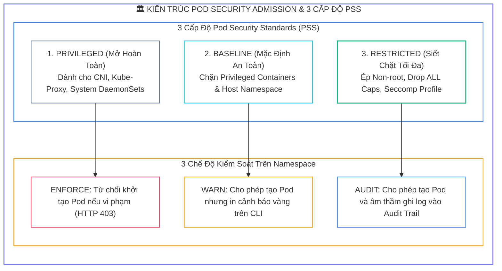
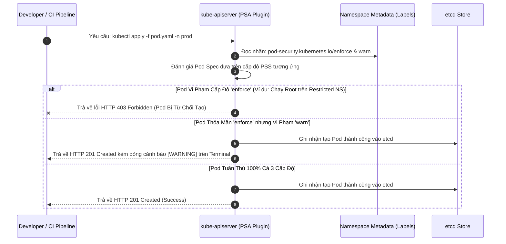
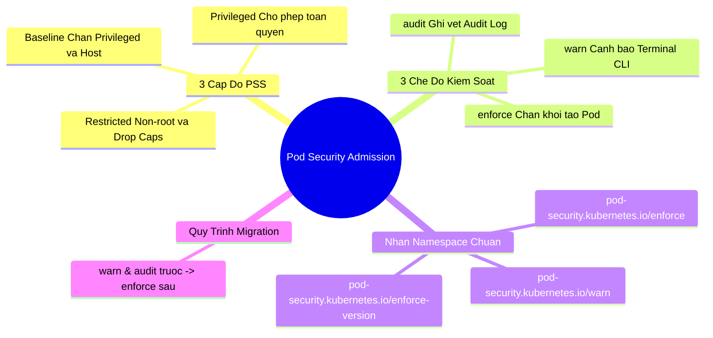


> [!IMPORTANT]
> **Mục tiêu kỹ thuật bài học**:
> - Thấu hiểu sự ra đời của **Pod Security Standards (PSS)** và **Pod Security Admission (PSA)** để thay thế cho PodSecurityPolicy (PSP) đã bị loại bỏ.
> - Phân biệt bản chất và phạm vi kiểm soát của **3 cấp độ PSS**: `privileged`, `baseline`, và `restricted`.
> - Nắm vững cơ chế vận hành của **3 chế độ kiểm soát**: `enforce` (chặn cứng), `warn` (cảnh báo mềm), và `audit` (ghi vết).
> - Áp dụng các nhãn Namespace PSA (`pod-security.kubernetes.io/*`) thông qua lệnh `kubectl label`.
> - Biên soạn đặc tả Pod manifest tuân thủ đầy đủ $100\%$ các yêu cầu khắt khe của cấp độ `restricted` (`runAsNonRoot`, `allowPrivilegeEscalation: false`, `capabilities.drop: ["ALL"]`, `seccompProfile`).
> - Thực thi quy trình **Zero-Downtime Migration** từ môi trường chưa bảo vệ lên chuẩn `restricted`.

---

## 1. Bản Chất Kiến Trúc & Tư Duy Cốt Lõi: Quản Trị Chính Sách Bảo Mật Pod Tích Hợp (PSA)

Trong các phiên bản Kubernetes trước 1.25, việc kiểm soát quyền hạn của Pod được thực hiện qua **PodSecurityPolicy (PSP)**. Tuy nhiên, PSP bị đánh giá là quá phức tạp, khó gán quyền (phụ thuộc chặt chẽ vào RBAC), và thường xuyên gây ra lỗi sập dịch vụ bất ngờ. Kể từ bản $1.25$ (GA), Kubernetes chính thức giới thiệu **Pod Security Admission (PSA)**—một Admission Controller tích hợp sẵn, gọn nhẹ, và dễ vận hành trực tiếp thông qua các nhãn (**Labels**) trên Namespace.

PSA phân loại tính an toàn của Pod thành **3 cấp độ tiêu chuẩn (Pod Security Standards - PSS)**:
1. **`privileged` (Không giới hạn):** Cho phép Pod chạy với mọi quyền hạn (root, hostNetwork, hostPID, privileged mode). Thường chỉ dành cho các thành phần hạ tầng (CNI, CSI, Logging agents).
2. **`baseline` (Tiêu chuẩn tối thiểu):** Ngăn chặn các hành vi leo thang đặc quyền nghiêm trọng nhất (chặn `privileged: true`, chặn mount `/proc` hoặc `/sys` của host). Phù hợp cho phần lớn ứng dụng thông thường chưa được làm cứng.
3. **`restricted` (Gia cố tối đa):** Tiêu chuẩn an ninh nghiêm ngặt nhất của CNCF. Ép buộc container phải chạy dưới quyền **non-root**, tước bỏ toàn bộ **Linux Capabilities** (`drop: ["ALL"]`), bật **Seccomp** (`RuntimeDefault`), và cấm `allowPrivilegeEscalation`.



---

## 2. Bảng Ma Trận So Sánh Kỹ Thuật Toàn Diện (Engineering Matrix)

| Tiêu Chí Kỹ Thuật | Cấp Độ Privileged | Cấp Độ Baseline | Cấp Độ Restricted |
| :--- | :--- | :--- | :--- |
| **`privileged: true`** | <span class="badge badge--rose">Cho phép</span> | <span class="badge badge--emerald">Cấm tuyệt đối</span> | <span class="badge badge--emerald">Cấm tuyệt đối</span> |
| **`hostNetwork / hostPID / hostIPC`** | Cho phép | <span class="badge badge--emerald">Cấm</span> | <span class="badge badge--emerald">Cấm</span> |
| **`hostPath Volumes`** | Cho phép | <span class="badge badge--emerald">Cấm</span> | <span class="badge badge--emerald">Cấm</span> |
| **`runAsNonRoot: true`** | Không bắt buộc | Không bắt buộc | <span class="badge badge--emerald">Bắt buộc 100%</span> |
| **`allowPrivilegeEscalation`** | Cho phép | Cho phép | <span class="badge badge--emerald">Bắt buộc gán `false`</span> |
| **`capabilities.drop`** | Không bắt buộc | Không bắt buộc | <span class="badge badge--emerald">Bắt buộc drop `["ALL"]`</span> |
| **`seccompProfile`** | Bất kỳ | Bất kỳ | <span class="badge badge--emerald">Bắt buộc `RuntimeDefault` / `Localhost`</span> |
| **Trường hợp sử dụng** | CNI, CSI, Logging DaemonSets | Pod ứng dụng cơ bản | Ứng dụng thanh toán, Web, Microservices CKS |

---

## 3. Kiến Trúc Môi Trường & Luồng Thực Thi Mẫu

Khi người dùng gửi yêu cầu triển khai một Pod, Pod Security Admission Plugin trong `kube-apiserver` sẽ đối soát theo quy trình sau:



---

## 4. Phân Tích Cạm Bẫy Thực Chiến: Đột Ngột Bật `enforce: restricted` Làm Sập Deployment / StatefulSet Production

### Tình Huống Sự Cố Thực Tế:
<span class="badge badge--rose">🕒 03:20 AM</span> Để chuẩn bị cho đợt kiểm toán an ninh, một kỹ sư chạy ngay lệnh `kubectl label ns production pod-security.kubernetes.io/enforce=restricted`. Ngay sau đó, khi Deployment thực hiện rolling update tự động, toàn bộ các Pod mới tạo đều bị API Server từ chối. ReplicaSet không thể sinh ra Pod mới, dẫn đến tình trạng mất sạch lưu lượng ứng dụng.

### Hậu Quả & Log Lỗi Thực Tế:
```text
================================================================================
INCIDENT LOG: POD CREATION FORBIDDEN BY POD SECURITY ADMISSION (RESTRICTED)
================================================================================
[ERROR] 2026-09-12T03:20:15.192Z replicaset-controller:
FailedCreate: Error creating: pods "payment-api-687bf-9xkz2" is forbidden:
violates PodSecurity "restricted:latest":
- allowPrivilegeEscalation != false (container "payment-app" must set securityContext.allowPrivilegeEscalation=false)
- unrestricted capabilities (container "payment-app" must set securityContext.capabilities.drop=["ALL"])
- runAsNonRoot != true (pod or container "payment-app" must set securityContext.runAsNonRoot=true)
- seccompProfile (pod or container "payment-app" must set securityContext.seccompProfile.type to "RuntimeDefault" or "Localhost")

[FATAL] Deployment 'payment-api' available replicas dropped to 0/3!
================================================================================
```

### 5-Whys Root Cause Analysis:
1. <span class="badge badge--primary">Why 1</span> **Tại sao hệ thống thanh toán bị gián đoạn?** $\rightarrow$ Vì ReplicaSet không thể khởi tạo bất kỳ Pod mới nào để thay thế các Pod cũ.
2. <span class="badge badge--primary">Why 2</span> **Tại sao Pod mới bị API Server từ chối khởi tạo?** $\rightarrow$ Vì Pod vi phạm 4 điều kiện an ninh bắt buộc của cấp độ `restricted`.
3. <span class="badge badge--primary">Why 3</span> **Tại sao kỹ sư lại bật nhãn enforce khi Pod chưa đạt chuẩn?** $\rightarrow$ Do không thực hiện quy trình kiểm thử trước qua chế độ `warn` và `audit`.
4. <span class="badge badge--primary">Why 4</span> **Tại sao các Pod cũ đang chạy lại không bị chết ngay khi gán nhãn?** $\rightarrow$ Vì PSA chỉ kiểm tra tại thời điểm **Admission** (khi tạo mới hoặc sửa đổi Pod), các Pod đang chạy không bị ảnh hưởng cho đến khi có đợt cập nhật (Rolling Update).
5. <span class="badge badge--emerald">Root Cause Remedy</span> **Quy trình dịch chuyển chính sách an toàn (Zero-Downtime Migration):**
   - <span class="badge badge--emerald">Bước 1: Bật chế độ Cảnh báo (Warn & Audit):</span>
     ```bash
     kubectl label ns production pod-security.kubernetes.io/warn=restricted pod-security.kubernetes.io/audit=restricted --overwrite
     ```
   - <span class="badge badge--cyan">Bước 2: Nâng cấp Manifest:</span> Bổ sung đầy đủ khối `securityContext` đạt chuẩn `restricted` cho toàn bộ Deployments.
   - <span class="badge badge--primary">Bước 3: Bật chế độ Thực thi (Enforce):</span> Khi không còn bất kỳ cảnh báo nào xuất hiện, kích hoạt:
     ```bash
     kubectl label ns production pod-security.kubernetes.io/enforce=restricted --overwrite
     ```

---

## 5. Hands-on Lab: Triển Khai Pod Security Admission & Biên Soạn Restricted Pod (8 Bước)

| Bước | Mục Tiêu Kỹ Thuật | Đầu Ra Kiểm Tra |
| :---: | :--- | :--- |
| **1** | Tạo Namespace thử nghiệm `psa-lab` | Namespace sẵn sàng để thử nghiệm |
| **2** | Gán nhãn `enforce=baseline` và `warn=restricted` | Namespace mang nhãn PSS chuẩn |
| **3** | Thử triển khai Pod vi phạm cấp độ Baseline (`privileged: true`) | API Server từ chối tạo Pod với lỗi 403 |
| **4** | Triển khai Pod thỏa mãn Baseline nhưng vi phạm Restricted | Pod được tạo thành công nhưng Terminal in dòng Cảnh báo |
| **5** | Nâng cấp nhãn Namespace lên `enforce=restricted` | Kích hoạt chế độ kiểm soát cao nhất |
| **6** | Thử tạo lại Pod vi phạm | Xác nhận Pod bị chặn cứng bởi Restricted level |
| **7** | Biên soạn Pod manifest tuân thủ 100% Restricted | Pod chứa đầy đủ `runAsNonRoot`, `drop ALL`, `seccomp` |
| **8** | Triển khai Pod Restricted thành công | Xác nhận Pod Running an toàn tuyệt đối |

### Bước 1: Tạo Namespace Thử Nghiệm

```bash
kubectl create namespace psa-lab
```

### Bước 2: Cấu Hình Nhãn PSA Baseline & Restricted Warning

```bash
kubectl label namespace psa-lab \
  pod-security.kubernetes.io/enforce=baseline \
  pod-security.kubernetes.io/warn=restricted \
  pod-security.kubernetes.io/audit=restricted --overwrite
```

### Bước 3: Kiểm Thử Chặn Pod Vi Phạm Baseline (`privileged: true`)

```bash
# Thử chạy Pod Privileged -> PHẢI BỊ CHẶN CỨNG BỞI BASELINE ENFORCE
cat <<EOF | kubectl apply -f - || true
apiVersion: v1
kind: Pod
metadata:
  name: privileged-pod
  namespace: psa-lab
spec:
  containers:
  - name: attack
    image: busybox:latest
    command: ["sleep", "3600"]
    securityContext:
      privileged: true
EOF
```

### Bước 4: Kiểm Thử Pod Thỏa Mãn Baseline Nhưng Vi Phạm Restricted Warning

```bash
# Chạy Pod thông thường (không có privileged, nhưng chạy root)
# Kết quả: POD ĐƯỢC TẠO nhưng Terminal in dòng WARNING vàng
cat <<EOF | kubectl apply -f -
apiVersion: v1
kind: Pod
metadata:
  name: baseline-pod
  namespace: psa-lab
spec:
  containers:
  - name: web
    image: nginx:alpine
EOF
```

### Bước 5: Nâng Cấp Cấp Độ Namespace Lên `enforce=restricted`

```bash
kubectl label namespace psa-lab \
  pod-security.kubernetes.io/enforce=restricted --overwrite
```

### Bước 6: Xác Nhận Pod Thông Thường Bị Chặn Cứng

```bash
# Thử tạo lại baseline-pod -> BÂY GIỜ PHẢI BỊ CHẶN BỞI RESTRICTED ENFORCE
cat <<EOF | kubectl apply -f - || true
apiVersion: v1
kind: Pod
metadata:
  name: baseline-pod-2
  namespace: psa-lab
spec:
  containers:
  - name: web
    image: nginx:alpine
EOF
```

### Bước 7: Biên Soạn Pod Manifest Đạt Chuẩn 100% Restricted PSS

```bash
cat <<EOF | kubectl apply -f -
apiVersion: v1
kind: Pod
metadata:
  name: fully-restricted-pod
  namespace: psa-lab
spec:
  securityContext:
    runAsNonRoot: true
    runAsUser: 10001
    runAsGroup: 10001
    fsGroup: 10001
    seccompProfile:
      type: RuntimeDefault
  containers:
  - name: secure-app
    image: busybox:latest
    command: ["sleep", "3600"]
    securityContext:
      allowPrivilegeEscalation: false
      readOnlyRootFilesystem: true
      capabilities:
        drop:
        - ALL
EOF
```

### Bước 8: Kiểm Tra Pod Restricted Khởi Chạy Thành Công

```bash
kubectl get pod fully-restricted-pod -n psa-lab

echo ">> [VERIFIED] Chuc mung ban da lam chu Pod Security Admission theo chuan CKS!"
```

---

## 6. 10 Câu Hỏi Tự Kiểm Tra Chuyên Sâu (Self-Check Q&A Accordion)

<details class="qa-card">
<summary class="qa-summary">
  <div class="qa-summary-left">
    <span class="qa-num-badge">Q01</span>
    <span>Sự khác biệt cốt lõi giữa 3 chế độ `enforce`, `warn`, và `audit` trong Pod Security Admission là gì?</span>
  </div>
  <span class="qa-chevron">
    <svg width="18" height="18" fill="none" stroke="currentColor" stroke-width="2.5" viewBox="0 0 24 24"><polyline points="6 9 12 15 18 9"></polyline></svg>
  </span>
</summary>
<div class="qa-answer">
  <div class="qa-answer-header">
    <svg width="14" height="14" fill="none" stroke="currentColor" stroke-width="2" viewBox="0 0 24 24"><path d="M22 11.08V12a10 10 0 1 1-5.93-9.14"></path><polyline points="22 4 12 14.01 9 11.01"></polyline></svg>
    <span>Phân Tích &amp; Lời Giải Kỹ Thuật</span>
  </div>
  <div style="margin-bottom: 8px;"><b style="color: var(--accent-rose);">enforce:</b> Từ chối trực tiếp và chặn không cho tạo Pod nếu vi phạm tiêu chuẩn PSS. <b style="color: var(--accent-amber);">warn:</b> Cho phép tạo Pod thành công nhưng in cảnh báo vi phạm trực tiếp trên giao diện dòng lệnh CLI của người gửi request. <b style="color: var(--accent-cyan);">audit:</b> Cho phép tạo Pod và âm thầm ghi nhận sự kiện vi phạm vào Kubernetes Audit Logs.</div>
</div>
</details>

<details class="qa-card">
<summary class="qa-summary">
  <div class="qa-summary-left">
    <span class="qa-num-badge">Q02</span>
    <span>Những thiết lập `securityContext` bắt buộc phải có để một Pod vượt qua được cấp độ `restricted` là gì?</span>
  </div>
  <span class="qa-chevron">
    <svg width="18" height="18" fill="none" stroke="currentColor" stroke-width="2.5" viewBox="0 0 24 24"><polyline points="6 9 12 15 18 9"></polyline></svg>
  </span>
</summary>
<div class="qa-answer">
  <div class="qa-answer-header">
    <svg width="14" height="14" fill="none" stroke="currentColor" stroke-width="2" viewBox="0 0 24 24"><path d="M22 11.08V12a10 10 0 1 1-5.93-9.14"></path><polyline points="22 4 12 14.01 9 11.01"></polyline></svg>
    <span>Phân Tích &amp; Lời Giải Kỹ Thuật</span>
  </div>
  <div style="margin-bottom: 8px;">Gồm 4 yếu tố bắt buộc: (1) <b style="color: var(--accent-emerald);">runAsNonRoot: true</b> (và chỉ định UID non-root); (2) <b style="color: var(--accent-primary);">allowPrivilegeEscalation: false</b>; (3) <b style="color: var(--accent-cyan);">capabilities.drop: ["ALL"]</b> (chỉ được phép add thêm <code>NET_BIND_SERVICE</code> nếu cần); và (4) <b style="color: var(--accent-amber);">seccompProfile.type: RuntimeDefault</b> hoặc <code>Localhost</code>.</div>
</div>
</details>

<details class="qa-card">
<summary class="qa-summary">
  <div class="qa-summary-left">
    <span class="qa-num-badge">Q03</span>
    <span>Lệnh kubectl nào dùng để gắn nhãn chế độ `enforce` cấp độ `restricted` cho một Namespace có sẵn?</span>
  </div>
  <span class="qa-chevron">
    <svg width="18" height="18" fill="none" stroke="currentColor" stroke-width="2.5" viewBox="0 0 24 24"><polyline points="6 9 12 15 18 9"></polyline></svg>
  </span>
</summary>
<div class="qa-answer">
  <div class="qa-answer-header">
    <svg width="14" height="14" fill="none" stroke="currentColor" stroke-width="2" viewBox="0 0 24 24"><path d="M22 11.08V12a10 10 0 1 1-5.93-9.14"></path><polyline points="22 4 12 14.01 9 11.01"></polyline></svg>
    <span>Phân Tích &amp; Lời Giải Kỹ Thuật</span>
  </div>
  <div style="margin-bottom: 8px;">Thực thi lệnh: <b style="color: var(--accent-primary);">kubectl label ns &lt;namespace-name&gt; pod-security.kubernetes.io/enforce=restricted --overwrite</b>.</div>
</div>
</details>

<details class="qa-card">
<summary class="qa-summary">
  <div class="qa-summary-left">
    <span class="qa-num-badge">Q04</span>
    <span>Tại sao cần khai báo nhãn phiên bản `pod-security.kubernetes.io/enforce-version: "v1.30"` trên Namespace?</span>
  </div>
  <span class="qa-chevron">
    <svg width="18" height="18" fill="none" stroke="currentColor" stroke-width="2.5" viewBox="0 0 24 24"><polyline points="6 9 12 15 18 9"></polyline></svg>
  </span>
</summary>
<div class="qa-answer">
  <div class="qa-answer-header">
    <svg width="14" height="14" fill="none" stroke="currentColor" stroke-width="2" viewBox="0 0 24 24"><path d="M22 11.08V12a10 10 0 1 1-5.93-9.14"></path><polyline points="22 4 12 14.01 9 11.01"></polyline></svg>
    <span>Phân Tích &amp; Lời Giải Kỹ Thuật</span>
  </div>
  <div style="margin-bottom: 8px;">Tiêu chuẩn Pod Security Standards có thể thay đổi và bổ sung thêm các ràng buộc mới giữa các phiên bản Kubernetes (ví dụ từ 1.28 lên 1.30). Cố định phiên bản <code>v1.30</code> (hoặc dùng <code>latest</code>) đảm bảo tính nhất quán của chính sách và <b style="color: var(--accent-emerald);">tránh việc nâng cấp cụm làm hỏng đột ngột các Pod đang vận hành ổn định</b>.</div>
</div>
</details>

<details class="qa-card">
<summary class="qa-summary">
  <div class="qa-summary-left">
    <span class="qa-num-badge">Q05</span>
    <span>Điều gì xảy ra với các Pod ĐANG CHẠY khi ta thay đổi nhãn Namespace từ `privileged` sang `enforce=restricted`?</span>
  </div>
  <span class="qa-chevron">
    <svg width="18" height="18" fill="none" stroke="currentColor" stroke-width="2.5" viewBox="0 0 24 24"><polyline points="6 9 12 15 18 9"></polyline></svg>
  </span>
</summary>
<div class="qa-answer">
  <div class="qa-answer-header">
    <svg width="14" height="14" fill="none" stroke="currentColor" stroke-width="2" viewBox="0 0 24 24"><path d="M22 11.08V12a10 10 0 1 1-5.93-9.14"></path><polyline points="22 4 12 14.01 9 11.01"></polyline></svg>
    <span>Phân Tích &amp; Lời Giải Kỹ Thuật</span>
  </div>
  <div style="margin-bottom: 8px;">Các Pod đang chạy <b style="color: var(--accent-emerald);">vẫn tiếp tục hoạt động bình thường</b> mà không bị tiêu diệt ngay lập tức. PSA là Admission Controller chỉ can thiệp khi có request tạo mới hoặc cập nhật Pod spec. Tuy nhiên, nếu Pod bị restart hoặc Deployment tạo replica mới, các Pod mới sẽ bị chặn nếu không đạt chuẩn.</div>
</div>
</details>

<details class="qa-card">
<summary class="qa-summary">
  <div class="qa-summary-left">
    <span class="qa-num-badge">Q06</span>
    <span>Làm thế nào để cấu hình chính sách Pod Security mặc định cho TOÀN BỘ CỤM mà không cần gắn nhãn từng Namespace?</span>
  </div>
  <span class="qa-chevron">
    <svg width="18" height="18" fill="none" stroke="currentColor" stroke-width="2.5" viewBox="0 0 24 24"><polyline points="6 9 12 15 18 9"></polyline></svg>
  </span>
</summary>
<div class="qa-answer">
  <div class="qa-answer-header">
    <svg width="14" height="14" fill="none" stroke="currentColor" stroke-width="2" viewBox="0 0 24 24"><path d="M22 11.08V12a10 10 0 1 1-5.93-9.14"></path><polyline points="22 4 12 14.01 9 11.01"></polyline></svg>
    <span>Phân Tích &amp; Lời Giải Kỹ Thuật</span>
  </div>
  <div style="margin-bottom: 8px;">Tạo tệp cấu hình Admission Configuration (loại <code>AdmissionConfiguration</code> với plugin <code>PodSecurity</code>) trên Control Plane và truyền cờ <b style="color: var(--accent-primary);">--admission-control-config-file=/path/to/admission-config.yaml</b> vào manifest <code>kube-apiserver.yaml</code>.</div>
</div>
</details>

<details class="qa-card">
<summary class="qa-summary">
  <div class="qa-summary-left">
    <span class="qa-num-badge">Q07</span>
    <span>Cấp độ `baseline` cho phép những quyền hạn nào mà cấp độ `restricted` lại cấm tuyệt đối?</span>
  </div>
  <span class="qa-chevron">
    <svg width="18" height="18" fill="none" stroke="currentColor" stroke-width="2.5" viewBox="0 0 24 24"><polyline points="6 9 12 15 18 9"></polyline></svg>
  </span>
</summary>
<div class="qa-answer">
  <div class="qa-answer-header">
    <svg width="14" height="14" fill="none" stroke="currentColor" stroke-width="2" viewBox="0 0 24 24"><path d="M22 11.08V12a10 10 0 1 1-5.93-9.14"></path><polyline points="22 4 12 14.01 9 11.01"></polyline></svg>
    <span>Phân Tích &amp; Lời Giải Kỹ Thuật</span>
  </div>
  <div style="margin-bottom: 8px;">Cấp độ <code>baseline</code> <b style="color: var(--accent-amber);">cho phép container chạy dưới quyền root (UID 0)</b>, cho phép <code>allowPrivilegeEscalation: true</code>, không bắt buộc drop capabilities, và không bắt buộc khai báo <code>seccompProfile</code>. Cấp độ <code>restricted</code> cấm toàn bộ các quyền này.</div>
</div>
</details>

<details class="qa-card">
<summary class="qa-summary">
  <div class="qa-summary-left">
    <span class="qa-num-badge">Q08</span>
    <span>Namespace `kube-system` thường được gán cấp độ PSS nào và tại sao?</span>
  </div>
  <span class="qa-chevron">
    <svg width="18" height="18" fill="none" stroke="currentColor" stroke-width="2.5" viewBox="0 0 24 24"><polyline points="6 9 12 15 18 9"></polyline></svg>
  </span>
</summary>
<div class="qa-answer">
  <div class="qa-answer-header">
    <svg width="14" height="14" fill="none" stroke="currentColor" stroke-width="2" viewBox="0 0 24 24"><path d="M22 11.08V12a10 10 0 1 1-5.93-9.14"></path><polyline points="22 4 12 14.01 9 11.01"></polyline></svg>
    <span>Phân Tích &amp; Lời Giải Kỹ Thuật</span>
  </div>
  <div style="margin-bottom: 8px;">Namespace <code>kube-system</code> bắt buộc phải gán cấp độ <b style="color: var(--accent-rose);">privileged</b>. Các tiến trình hệ thống như CNI Plugin (Calico/Cilium), Kube-Proxy, và Storage Driver cần quyền tương tác trực tiếp với mạng Host (<code>hostNetwork: true</code>), socket kernel và gắn ổ đĩa vật lý của máy chủ.</div>
</div>
</details>

<details class="qa-card">
<summary class="qa-summary">
  <div class="qa-summary-left">
    <span class="qa-num-badge">Q09</span>
    <span>Lệnh nào giúp kiểm tra nhanh danh sách tất cả các nhãn PSA đang được áp dụng trên toàn bộ các Namespace trong cụm?</span>
  </div>
  <span class="qa-chevron">
    <svg width="18" height="18" fill="none" stroke="currentColor" stroke-width="2.5" viewBox="0 0 24 24"><polyline points="6 9 12 15 18 9"></polyline></svg>
  </span>
</summary>
<div class="qa-answer">
  <div class="qa-answer-header">
    <svg width="14" height="14" fill="none" stroke="currentColor" stroke-width="2" viewBox="0 0 24 24"><path d="M22 11.08V12a10 10 0 1 1-5.93-9.14"></path><polyline points="22 4 12 14.01 9 11.01"></polyline></svg>
    <span>Phân Tích &amp; Lời Giải Kỹ Thuật</span>
  </div>
  <div style="margin-bottom: 8px;">Sử dụng lệnh: <b style="color: var(--accent-primary);">kubectl get ns --show-labels</b> (hoặc lọc trường nhãn với <code>-L pod-security.kubernetes.io/enforce -L pod-security.kubernetes.io/warn</code>).</div>
</div>
</details>

<details class="qa-card">
<summary class="qa-summary">
  <div class="qa-summary-left">
    <span class="qa-num-badge">Q10</span>
    <span>Capability duy nhất nào được phép thêm vào (`capabilities.add`) trong cấp độ `restricted`?</span>
  </div>
  <span class="qa-chevron">
    <svg width="18" height="18" fill="none" stroke="currentColor" stroke-width="2.5" viewBox="0 0 24 24"><polyline points="6 9 12 15 18 9"></polyline></svg>
  </span>
</summary>
<div class="qa-answer">
  <div class="qa-answer-header">
    <svg width="14" height="14" fill="none" stroke="currentColor" stroke-width="2" viewBox="0 0 24 24"><path d="M22 11.08V12a10 10 0 1 1-5.93-9.14"></path><polyline points="22 4 12 14.01 9 11.01"></polyline></svg>
    <span>Phân Tích &amp; Lời Giải Kỹ Thuật</span>
  </div>
  <div style="margin-bottom: 8px;">Đó là capability: <b style="color: var(--accent-emerald);">NET_BIND_SERVICE</b>. Quyền này cho phép tiến trình non-root có thể lắng nghe trên các cổng mạng đặc quyền thấp hơn 1024 (như cổng 80 hoặc 443) mà không cần cấp quyền root đầy đủ.</div>
</div>
</details>

---

## 7. Tổng Kết & Lộ Trình Bài Học Tiếp Theo



Làm chủ **Pod Security Admission (PSA)** giúp bạn quản trị ranh giới an ninh Pod hiệu quả và tự tin giải quyết các bài toán PSS trong kỳ thi CKS.

> [!TIP]
> **BÀI HỌC TIẾP THEO:**
> Trong **[[Bài 08] Quản Trị Động Bằng Admission Controllers: Mutating/Validating Webhooks & OPA Gatekeeper](cks-08-08-admission-controller-va-opa.html)**, chúng ta sẽ mở rộng khả năng kiểm soát chính sách linh hoạt: Tự xây dựng Dynamic Admission Webhooks, viết luật Rego với OPA Gatekeeper và ép buộc các quy chuẩn doanh nghiệp tùy biến.

