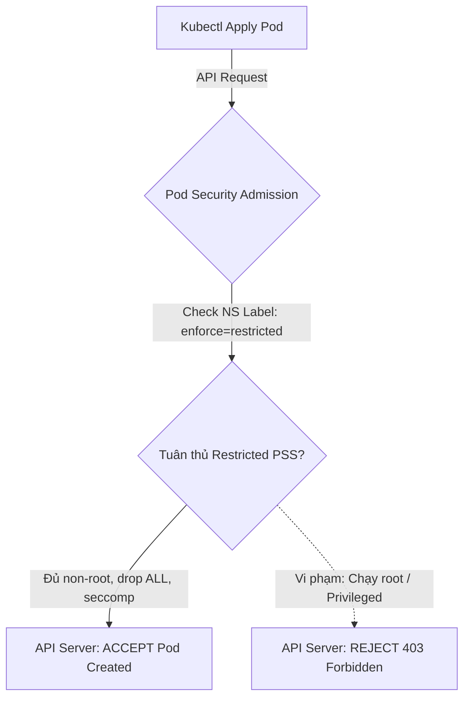
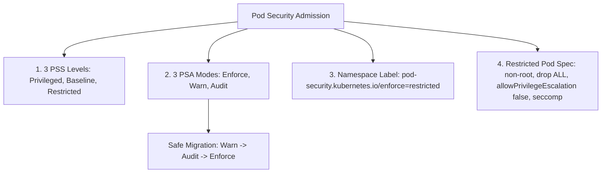
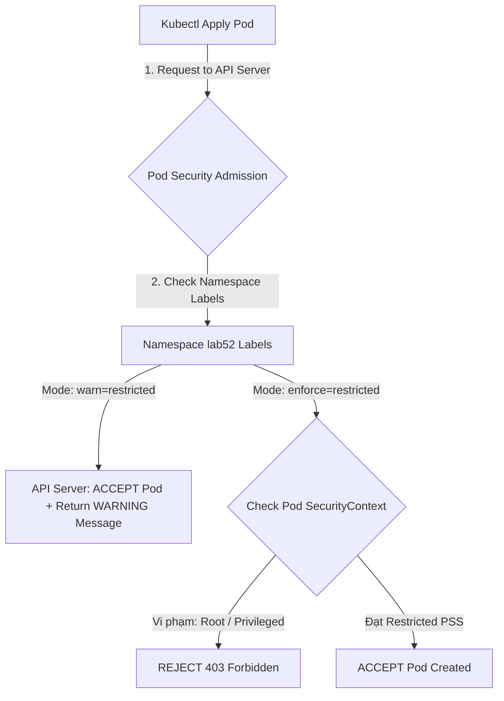


# [BÀI 07] POD SECURITY ADMISSION (PSA): LÀM CHỦ 3 CẤP ĐỘ PRIVILEGED, BASELINE, RESTRICTED & CHẾ ĐỘ ENFORCE/WARN/AUDIT

Trong kỷ nguyên điện toán đám mây và kiến trúc microservices phân tán quy mô lớn, **Kubernetes (CKS)** đóng vai trò là nền tảng điều phối container (Container Orchestration) tiêu chuẩn công nghiệp. Để làm chủ hệ thống trong môi trường sản xuất (Production) cũng như chinh phục kỳ thi chứng chỉ quốc tế của Linux Foundation / CNCF, kỹ sư không chỉ nắm vững các câu lệnh thao tác cơ bản mà phải thấu hiểu sâu sắc bản chất cơ chế tầng thấp: từ chu trình điều hòa (Reconciliation Loop), cấu trúc điều phối tài nguyên, kiến trúc mạng CNI, lưu trữ CSI cho đến các chuẩn mực an ninh phòng thủ chiều sâu.

Bài viết chuyên sâu này sẽ đồng hành cùng bạn giải mã toàn diện bức tranh kiến trúc, phân tích các đánh đổi kỹ thuật thực chiến (Engineering Trade-offs), cung cấp bài thực hành Lab từng bước và bộ câu hỏi phỏng vấn chuẩn Architect / Lead Engineer.

---

## 1. Bản Chất Kiến Trúc & Cơ Chế Vận Hành Tầng Thấp

| # | Câu hỏi ôn tập | Đáp án chuẩn ngắn gọn |
|---|---|---|
| 1 | Kỹ thuật bảo vệ đĩa etcd chống lộ Secret dạng plaintext? | Kích hoạt mã hóa **Encryption at Rest** |
| 2 | Thuận toán mã hóa đối xứng và độ dài khóa chuẩn trong CKS? | Thuật toán **`aescbc`** dùng khóa **32-byte Base64** |
| 3 | Vị trí bắt buộc của provider `aescbc` trong mảng `providers`? | Đứng ở vị trí đầu tiên (**Index 0**) |
| 4 | Lệnh CLI mã hóa lại toàn bộ Secret cũ sau khi bật etcd enc? | **`kubectl get secrets --all-namespaces -o json \| kubectl replace -f -`** |
| 5 | Ba cờ mTLS chứng chỉ bắt buộc truyền khi gọi `etcdctl`? | Cờ **`--cacert`**, **`--cert`**, **`--key`** |


> **"Áp đặt các tiêu chuẩn an toàn Pod Security Standards (PSS) bằng tính năng tích hợp sẵn Pod Security Admission (PSA) là kỹ năng cốt lõi thuộc miền Minimize Microservice Vulnerabilities trong chứng chỉ CKS, đòi hỏi chuyên gia bảo mật phải làm chủ 3 cấp độ bảo mật (`privileged`, `baseline`, `restricted`) và 3 chế độ kiểm soát trên Namespace (`enforce`, `warn`, `audit`); biết cách gắn trực tiếp các nhãn kiểm soát (`pod-security.kubernetes.io/enforce: restricted`) để tự động ngăn chặn các Pod không an toàn (chạy root, thiếu `readOnlyRootFilesystem`, hoặc dùng `hostNetwork`); đồng thời áp dụng quy trình dịch chuyển an toàn theo 2 bước: gán nhãn `warn` để cảnh báo các Pods vi phạm hiện tại trước khi kích hoạt `enforce` để tránh làm gián đoạn các dịch vụ Production."**

**Kết quả từ các buổi trước được sử dụng lại:**

| Kết quả / Công cụ | Buổi + số hiệu `QT` | Dùng ở đâu trong buổi này |
|---|---|---|
| Cấu hình `securityContext` non-root và capabilities | Buổi 41 `QT 4.1` | Khai báo khối `securityContext` tuân thủ mức `restricted` |
| Seccomp `RuntimeDefault` profile | Buổi 50 `QT 4.1` | Thêm `seccompProfile.type: RuntimeDefault` cho Pod PSS |
| Thao tác gán nhãn Label cho Namespace | Buổi 09 `QT 4.1` | Thực thi lệnh `kubectl label ns <name>` gán nhãn PSA |

---


| # | Kỹ năng thực hiện được | Hiện vật chứng minh |
|---|---|---|
| 1 | Phân biệt chính xác 3 cấp độ Pod Security Standards (`privileged`, `baseline`, `restricted`) | Bảng đối soát PSS |
| 2 | Gán nhãn Namespace PSA kiểm soát Pods qua lệnh `kubectl label` | Namespace manifest chứa nhãn `pod-security.kubernetes.io/enforce` |
| 3 | Biên soạn Pod manifest tuân thủ 100% cấp độ `restricted` PSS | Tệp Pod YAML chứa đủ non-root, drop ALL caps, seccomp |
| 4 | Áp dụng quy trình Migration dịch chuyển an toàn qua 2 chế độ `warn` và `enforce` | Kịch bản chuyển đổi chính sách không làm rớt dịch vụ |
| 5 | Chẩn đoán và sửa lỗi Pod bị API Server từ chối do vi phạm nhãn PSA | Nhật ký lỗi `is forbidding: allowPrivilegeEscalation != false` |

---


| Kiến thức tiên quyết | Nguồn tự học nếu thiếu |
|---|---|
| Cấu hình `securityContext` non-root và Linux capabilities | Buổi 41 (`QT 4.1`) |
| Seccomp `RuntimeDefault` profile | Buổi 50 (`QT 4.1`) |
| Thao tác quản trị Namespace và Labels | Buổi 09 (`QT 4.1`) |

---


### 3.1. Thuật ngữ Việt–Anh

| # | Thuật ngữ tiếng Việt | Tiếng Anh tương đương | Ghi chú chuẩn hoá trong thân bài |
|---|---|---|---|
| 1 | Bộ tiêu chuẩn an toàn Pod | Pod Security Standards (PSS) | Khung quy chuẩn 3 cấp độ bảo mật Pod của Kubernetes |
| 2 | Bộ kiểm soát vào cụm Pod Security | Pod Security Admission (PSA) | Controller tích hợp sẵn trong K8s thay thế PSP đã bị loại bỏ |
| 3 | Cấp độ không giới hạn | Privileged Level | Cấp độ nới lỏng nhất, cho phép chạy root và host access |
| 4 | Cấp độ tiêu chuẩn cơ bản | Baseline Level | Cấp độ ngăn chặn các vi phạm nghiêm trọng (chống leo thang) |
| 5 | Cấp độ thắt chặt tối đa | Restricted Level | Cấp độ bảo mật cao nhất, ép buộc non-root và readOnlyRootFS |
| 6 | Chế độ thực thi cưỡng chế | Enforce Mode (`enforce`) | Chế độ CHẶN THẲNG các Pod vi phạm không cho tạo |
| 7 | Chế độ cảnh báo người dùng | Warn Mode (`warn`) | Chế độ trả về thông điệp CẢNH BÁO cho người gõ lệnh |
| 8 | Chế độ ghi vết kiểm toán | Audit Mode (`audit`) | Chế độ âm thầm ghi vết vi phạm vào Audit Logs |
| 9 | Nhãn chỉ định cấp độ PSA | PSA Namespace Label | Nhãn `pod-security.kubernetes.io/<mode>: <level>` |
| 10 | Nhãn cố định phiên bản PSS | PSA Version Label | Nhãn `pod-security.kubernetes.io/<mode>-version: "latest"` |
| 11 | Không cấp đặc quyền leo thang | AllowPrivilegeEscalation (`false`) | Cờ cấm tiến trình container xin thêm quyền trong quá trình chạy |
| 12 | Hệ thống tệp chỉ đọc | ReadOnlyRootFilesystem (`true`) | Cờ ép buộc root filesystem của container ở dạng Read-Only |
| 13 | Quy trình dịch chuyển chính sách | PSA Policy Migration | Quy trình gán nhãn `warn` trước khi nâng cấp lên `enforce` |
| 14 | Cấu hình Admission toàn cụm | Cluster Admission Configuration | Tệp cấu hình PSA mặc định toàn cụm cho API Server |


Mô hình Cổng Kiểm Soát Khách Sạn và 3 Hạng Thẻ An Ninh: `Pod Security Admission (PSA)` giống như Hệ thống Cổng Từ Kiểm Soát An Ninh tại khách sạn 5 sao. `Privileged` giống như Thẻ VIP Tối Cao dành cho Đội Bảo Trì (được mở mọi cửa, vào phòng máy). `Baseline` giống như Thẻ Khách Thường (được đi lại hành lang, cấm mang vũ khí/hóa chất). `Restricted` giống như Thẻ Khách VIP Đặc Biệt (bắt buộc qua máy quét kim loại, cấm mang túi xách lớn, cấm chạy nhảy). `Enforce Mode` giống như Chốt Cửa Tự Động chặn người vi phạm ngoài cửa. `Warn Mode` giống như Loa Cảnh Báo nhắc nhở "Quý khách đang vi phạm nội quy" nhưng vẫn mở cửa cho vào để chuẩn bị sửa đổi.

---

### 1.1. Tổng quan Pod Security Standards (Privileged, Baseline, Restricted) (12 phút)

**Nguyên lý cốt lõi:** Luôn gán nhãn `pod-security.kubernetes.io/enforce: restricted` cho các Namespace chứa microservices Production để ngăn chặn 100% các rủi ro leo thang quyền lực.

**Giải thích cơ chế ngầm:** Cấp độ `restricted` thắt chặt toàn bộ các lỗ hổng bảo mật container, ép buộc ứng dụng chạy quyền non-root, cấm leo thang đặc quyền (`allowPrivilegeEscalation: false`), loại bỏ mọi Linux capabilities thừa và bật Seccomp profile.

> [!WARNING]
> **CẠM BẪY THỰC CHIẾN:**
> Để Namespace Production ở mức `privileged` cho phép bất kỳ ai cũng có thể tạo Pod chiếm quyền root Host Node.

**Minh hoạ.**



**Nguyên lý cốt lõi:** Cấp độ `baseline` cấm các thuộc tính nguy hiểm cao như `privileged: true`, `hostNetwork: true`, `hostPID: true`, `hostIPC: true` và `hostPort`; Cấp độ `restricted` thắt chặt thêm bằng cách ép buộc `runAsNonRoot: true`, `allowPrivilegeEscalation: false` và `seccompProfile`.

**Giải thích cơ chế ngầm:** `baseline` phù hợp cho các ứng dụng cơ bản không cần quyền root đặc biệt nhưng chưa sẵn sàng chuyển sang `readOnlyRootFilesystem` hoặc non-root. `restricted` áp dụng tiêu chuẩn bảo mật thắt chặt tối đa.

> [!WARNING]
> **CẠM BẪY THỰC CHIẾN:**
> Nhầm lẫn giữa `baseline` và `restricted` dẫn đến việc Pod chạy root bị đẩy vào Namespace `restricted` và bị chặn.

**Minh hoạ.**

```yaml
# Bảng tiêu chuẩn Pod Security Standards:
# Privileged: Không giới hạn (Cho phép CNI/Storage Drivers)
# Baseline:   Chặn hostNetwork, hostPID, privileged=true
# Restricted: Chặn root (runAsNonRoot: true), bắt buộc allowPrivilegeEscalation: false, drop ALL caps
```

---

### 1.2. Cơ chế Pod Security Admission và 3 Chế độ (Enforce, Warn, Audit) (12 phút)

**Nguyên lý cốt lõi:** Ba chế độ kiểm soát PSA (`enforce`, `warn`, `audit`) có thể được khai báo ĐỒNG THỜI trên cùng một Namespace để vừa chặn Pod vi phạm mới (`enforce`), vừa cảnh báo người dùng (`warn`) và ghi log kiểm toán (`audit`).

**Giải thích cơ chế ngầm:** Khai báo đồng thời giúp đội ngũ quản trị vừa duy trì rào chắn chặn cứng (`enforce: baseline`), vừa nhận được cảnh báo sớm cho mức độ bảo mật cao hơn (`warn: restricted`).

> [!WARNING]
> **CẠM BẪY THỰC CHIẾN:**
> Chỉ khai báo 1 chế độ duy nhất làm mất đi tính năng cảnh báo và ghi log kiểm toán đa tầng.

**Minh hoạ.**

```bash
# Lệnh gán đồng thời 3 chế độ PSA trên Namespace:
kubectl label ns prod \
  pod-security.kubernetes.io/enforce=baseline \
  pod-security.kubernetes.io/warn=restricted \
  pod-security.kubernetes.io/audit=restricted
```

**Nguyên lý cốt lõi:** Khi gán nhãn `pod-security.kubernetes.io/enforce: restricted`, BẮT BUỘC nên đi kèm nhãn phiên bản `pod-security.kubernetes.io/enforce-version: "v1.30"` (hoặc `"latest"`) để đảm bảo quy chuẩn kiểm soát không bị thay đổi bất ngờ khi nâng cấp cụm.

**Giải thích cơ chế ngầm:** Tiêu chuẩn PSS có thể bổ sung thêm các quy tắc kiểm soát mới theo từng phiên bản Kubernetes. Cố định phiên bản giúp tránh việc nâng cấp K8s làm rớt các Pods đang chạy bình thường.

> [!WARNING]
> **CẠM BẪY THỰC CHIẾN:**
> Quên nhãn `enforce-version` làm cho quy chuẩn PSS mặc định tự động nhảy phiên bản khi nâng cấp Kubernetes cluster.

**Minh hoạ.**

```bash
# Gán nhãn kèm phiên bản chuẩn CKS:
kubectl label ns prod \
  pod-security.kubernetes.io/enforce=restricted \
  pod-security.kubernetes.io/enforce-version=v1.30
```

---

### 1.3. Cấu hình Nhãn Namespace và Cấu trúc Pod chuẩn Restricted PSS (10 phút)

**Nguyên lý cốt lõi:** Tệp Pod manifest chuẩn `restricted` PSS bắt buộc phải khai báo dưới `containers[x].securityContext`: `allowPrivilegeEscalation: false`, `capabilities.drop: ["ALL"]`, và dưới `spec.securityContext`: `runAsNonRoot: true`, `seccompProfile.type: RuntimeDefault`.

**Giải thích cơ chế ngầm:** Đây là bộ 4 thuộc tính bảo mật bắt buộc phải có để một Pod vượt qua được máy quét PSA cấp độ `restricted`. Khai báo thiếu bất kỳ 1 trong 4 thuộc tính này sẽ khiến Pod bị từ chối tạo ngay lập tức.

> [!WARNING]
> **CẠM BẪY THỰC CHIẾN:**
> Tạo Pod thiếu `capabilities.drop: ["ALL"]` làm API Server trả về lỗi `capabilities.drop != ALL`.

**Minh hoạ.**

```yaml
apiVersion: v1
kind: Pod
metadata:
  name: restricted-pod
  namespace: prod
spec:
  securityContext:
    runAsNonRoot: true
    runAsUser: 10001
    seccompProfile:
      type: RuntimeDefault
  containers:
    - name: app
      image: nginx:alpine
      securityContext:
        allowPrivilegeEscalation: false
        capabilities:
          drop:
            - ALL
```

**Nguyên lý cốt lõi:** Khi thực hiện dịch chuyển chính sách PSA (Migration), quy trình chuẩn CKS đòi hỏi gán nhãn `warn: restricted` trước, kiểm tra các dòng cảnh báo in ra khi gõ lệnh, điều chỉnh Pod manifest tuân thủ rồi mới chuyển sang `enforce: restricted`.

**Giải thích cơ chế ngầm:** Tránh sự cố làm ngưng trệ hệ thống Production (Production Outage). Nếu gán nhãn `enforce` ngay lập tức, toàn bộ các Pod/Deployment vi phạm khi restart sẽ bị chặn và bị rớt 100%.

> [!WARNING]
> **CẠM BẪY THỰC CHIẾN:**
> Đột ngột áp nhãn `enforce: restricted` trên Namespace Production đang chứa hàng chục Pods vi phạm làm hệ thống ngưng hoạt động.

**Minh hoạ.**

```bash
# Bước 1: Cảnh báo trước
kubectl label ns prod pod-security.kubernetes.io/warn=restricted

# Bước 2: Sửa Pod spec tuân thủ, sau đó mới Enforce
kubectl label ns prod pod-security.kubernetes.io/enforce=restricted --overwrite
```

**Nguyên lý cốt lõi:** Khi chẩn đoán lý do Pod bị API Server từ chối do PSA, đọc kỹ thông điệp lỗi in trực tiếp trên terminal (ví dụ `is forbidding: allowPrivilegeEscalation != false, runAsNonRoot != true`) để bổ sung các thuộc tính `securityContext` bị thiếu.

**Giải thích cơ chế ngầm:** Thông điệp lỗi của Pod Security Admission in chính xác 100% các từ khóa thuộc tính và giá trị mà Pod spec đang bị thiếu hoặc khai báo sai.

> [!WARNING]
> **CẠM BẪY THỰC CHIẾN:**
> Thay vì đọc thông điệp lỗi lại đi đoán mò hoặc gỡ bỏ nhãn PSA của Namespace.

**Minh hoạ.**

```bash
# Thông điệp lỗi từ API Server:
# Error from server (Forbidden): pods "bad-pod" is forbidden:
# violates PodSecurity "restricted:latest":
# allowPrivilegeEscalation != false (container "app" must set securityContext.allowPrivilegeEscalation=false),
# unrestricted capabilities (container "app" must set securityContext.capabilities.drop=["ALL"])
```

---

### 1.4. Đưa vào cụm thật (4 phút)

**Nguyên lý cốt lõi:** Cấu pháp lệnh CLI gán nhãn PSA chuẩn CKS cho Namespace `prod` là: `kubectl label --overwrite ns prod pod-security.kubernetes.io/enforce=restricted pod-security.kubernetes.io/enforce-version=latest`.

**Giải thích cơ chế ngầm:** Sử dụng cờ `--overwrite` đảm bảo nạp đè nhãn mới nếu Namespace đã được gán nhãn trước đó, giúp script tự động hóa hoạt động trôi chảy.

> [!WARNING]
> **CẠM BẪY THỰC CHIẾN:**
> Quên cờ `--overwrite` làm lệnh `kubectl label` báo lỗi `already has a value` và dừng script.

**Minh hoạ.**

```bash
# Lệnh gán nhãn PSA chuẩn CKS:
kubectl label --overwrite ns prod \
  pod-security.kubernetes.io/enforce=restricted \
  pod-security.kubernetes.io/enforce-version=latest
```

**Áp vào cụm đang chạy thì làm gì trước:**
1. Kiểm tra phiên bản cụm Kubernetes (`kubectl version` >= 1.23).
2. Gán nhãn `warn: restricted` và `audit: restricted` trên Namespace mục tiêu.
3. Chạy `kubectl get pods -n <ns>` quan sát log cảnh báo.
4. Nâng cấp Pod manifest lên chuẩn `restricted` PSS rồi mới bật `enforce`.

**Cái gì hỏng nếu áp thẳng lên prod:**
- Áp thẳng `enforce: restricted` mà chưa cập nhật Pod SecurityContext sẽ khiến khi Deployment thực hiện rolling update, Pod mới bị chặn 100% làm ứng dụng bị rớt.

**Đo trước — đo sau:**
- Thử nghiệm gõ `kubectl apply -f bad-pod.yaml` trước (tạo được Pod) và sau khi áp nhãn `enforce` (in ra lỗi `403 Forbidden`).

**Khi nào KHÔNG nên dùng:**
- Không áp nhãn `enforce: restricted` cho các Namespace hệ thống (`kube-system`, `ingress-nginx`) nơi các Pods bắt buộc phải chạy quyền host/privileged.

---

### 1.5. Bẫy hay gặp (2 phút)

| Bẫy hay gặp | Vì sao dính | Làm đúng là |
|---|---|---|
| 1. Quên cờ `--overwrite` khi đổi nhãn Namespace | Lệnh `kubectl label` báo lỗi nhãn đã tồn tại | Thêm cờ `--overwrite` vào lệnh label |
| 2. Gõ sai từ khóa nhãn `pod-security.kubernetes.io` | Nhầm thành `pod-security.k8s.io` hoặc gõ thiếu từ | Gõ đúng `pod-security.kubernetes.io/enforce` |
| 3. Quên thuộc tính `capabilities.drop: ["ALL"]` | Pod bị chặn ở mức `restricted` | Khai báo `capabilities.drop: ["ALL"]` dưới container |
| 4. Quên cờ `allowPrivilegeEscalation: false` | Pod bị từ chối do thiếu cấm leo thang đặc quyền | Khai báo `allowPrivilegeEscalation: false` dưới container |
| 5. Áp nhãn `restricted` cho Namespace `kube-system` | Làm rớt các Pods hạ tầng CNI/Storage Drivers | Giữ `kube-system` ở mức `privileged` |
| 6. Đột ngột bật `enforce` không qua bước `warn` | Rớt toàn bộ Pods mới khi rolling update | Gán nhãn `warn` thử nghiệm trước khi `enforce` |
| 7. Quên cờ `seccompProfile.type: RuntimeDefault` | Pod bị thiếu thuộc tính Seccomp ở mức `restricted` | Bổ sung `seccompProfile.type: RuntimeDefault` dưới spec |
| 8. Gõ sai giá trị `restricted` thành `strict` | Cấp độ PSS chuẩn chỉ có `privileged`, `baseline`, `restricted` | Dùng đúng 3 từ khóa: `privileged`, `baseline`, `restricted` |
| 9. Nhầm lẫn giữa SecurityContext cấp Pod vs Container | Đặt `allowPrivilegeEscalation` ở cấp Pod spec | Đặt `allowPrivilegeEscalation` ở cấp Container `securityContext` |
| 10. Quên chỉ định `enforce-version` | Tiêu chuẩn PSS tự động thay đổi khi update cụm | Thêm nhãn `pod-security.kubernetes.io/enforce-version=latest` |
| 11. Đặt `runAsNonRoot: true` nhưng không khai báo `runAsUser` | Pod bị rớt nếu image Dockerfile không có chỉ thị USER | Khai báo cả `runAsNonRoot: true` và `runAsUser: 10001` |
| 12. Không đọc thông điệp lỗi API Server | Loay hoay đoán mò lỗi vi phạm PSS | Đọc kỹ từ khóa lỗi in ra ngay trên terminal |

---

### 1.6. Tóm tắt (2 phút)



**Năm điều phải nhớ:**
1. **3 cấp độ PSS**: `privileged` (nới lỏng), `baseline` (cơ bản), `restricted` (thắt chặt tối đa).
2. **3 chế độ PSA**: `enforce` (chặn), `warn` (cảnh báo), `audit` (ghi log kiểm toán).
3. **Cấu trúc nhãn chuẩn**: `pod-security.kubernetes.io/enforce=restricted` và `pod-security.kubernetes.io/enforce-version=latest`.
4. **Bộ 4 thuộc tính Restricted**: `runAsNonRoot: true`, `seccompProfile: RuntimeDefault`, `allowPrivilegeEscalation: false`, `capabilities.drop: ["ALL"]`.
5. **Dịch chuyển an toàn**: Luôn gán nhãn `warn` cảnh báo trước khi gán nhãn `enforce`.

---

## §10. Câu hỏi tự kiểm tra (5 phút)


<div class="qa-answer">
  <div class="qa-answer-header">
    <svg width="14" height="14" fill="none" stroke="currentColor" stroke-width="2" viewBox="0 0 24 24"><path d="M22 11.08V12a10 10 0 1 1-5.93-9.14"></path><polyline points="22 4 12 14.01 9 11.01"></polyline></svg>
    <span>Phân Tích &amp; Lời Giải Kỹ Thuật</span>
  </div>
  
3 cấp độ: <b style="color: var(--accent-primary);"><code>privileged</code></b>, <b style="color: var(--accent-primary);"><code>baseline</code></b>, và <b style="color: var(--accent-primary);"><code>restricted</code></b>.
</div>
</details>

<div class="qa-answer">
  <div class="qa-answer-header">
    <svg width="14" height="14" fill="none" stroke="currentColor" stroke-width="2" viewBox="0 0 24 24"><path d="M22 11.08V12a10 10 0 1 1-5.93-9.14"></path><polyline points="22 4 12 14.01 9 11.01"></polyline></svg>
    <span>Phân Tích &amp; Lời Giải Kỹ Thuật</span>
  </div>
  
3 chế độ: <b style="color: var(--accent-primary);"><code>enforce</code></b>, <b style="color: var(--accent-primary);"><code>warn</code></b>, và <b style="color: var(--accent-primary);"><code>audit</code></b>.
</div>
</details>

<div class="qa-answer">
  <div class="qa-answer-header">
    <svg width="14" height="14" fill="none" stroke="currentColor" stroke-width="2" viewBox="0 0 24 24"><path d="M22 11.08V12a10 10 0 1 1-5.93-9.14"></path><polyline points="22 4 12 14.01 9 11.01"></polyline></svg>
    <span>Phân Tích &amp; Lời Giải Kỹ Thuật</span>
  </div>
  
<code>pod-security.kubernetes.io/enforce: restricted</code>.
</div>
</details>

<div class="qa-answer">
  <div class="qa-answer-header">
    <svg width="14" height="14" fill="none" stroke="currentColor" stroke-width="2" viewBox="0 0 24 24"><path d="M22 11.08V12a10 10 0 1 1-5.93-9.14"></path><polyline points="22 4 12 14.01 9 11.01"></polyline></svg>
    <span>Phân Tích &amp; Lời Giải Kỹ Thuật</span>
  </div>
  
Nhãn <code>pod-security.kubernetes.io/enforce-version: "latest"</code> (hoặc <code>"v1.30"</code>).
</div>
</details>

<div class="qa-answer">
  <div class="qa-answer-header">
    <svg width="14" height="14" fill="none" stroke="currentColor" stroke-width="2" viewBox="0 0 24 24"><path d="M22 11.08V12a10 10 0 1 1-5.93-9.14"></path><polyline points="22 4 12 14.01 9 11.01"></polyline></svg>
    <span>Phân Tích &amp; Lời Giải Kỹ Thuật</span>
  </div>
  
Cấp độ <code>baseline</code> ngăn chặn các vi phạm nguy hiểm cao (như privileged, hostNetwork); Cấp độ <code>restricted</code> thắt chặt thêm bằng cách ép buộc chạy non-root, cấm leo thang đặc quyền và yêu cầu Seccomp.
</div>
</details>

<div class="qa-answer">
  <div class="qa-answer-header">
    <svg width="14" height="14" fill="none" stroke="currentColor" stroke-width="2" viewBox="0 0 24 24"><path d="M22 11.08V12a10 10 0 1 1-5.93-9.14"></path><polyline points="22 4 12 14.01 9 11.01"></polyline></svg>
    <span>Phân Tích &amp; Lời Giải Kỹ Thuật</span>
  </div>
  
4 thuộc tính: <code>runAsNonRoot: true</code>, <code>seccompProfile.type: RuntimeDefault</code>, <code>allowPrivilegeEscalation: false</code>, và <code>capabilities.drop: ["ALL"]</code>.
</div>
</details>

<div class="qa-answer">
  <div class="qa-answer-header">
    <svg width="14" height="14" fill="none" stroke="currentColor" stroke-width="2" viewBox="0 0 24 24"><path d="M22 11.08V12a10 10 0 1 1-5.93-9.14"></path><polyline points="22 4 12 14.01 9 11.01"></polyline></svg>
    <span>Phân Tích &amp; Lời Giải Kỹ Thuật</span>
  </div>
  
Pod VẪN ĐƯỢC TẠO THÀNH CÔNG, nhưng API Server trả về một thông điệp CẢNH BÁO (warning) in trực tiếp trên terminal.
</div>
</details>

<div class="qa-answer">
  <div class="qa-answer-header">
    <svg width="14" height="14" fill="none" stroke="currentColor" stroke-width="2" viewBox="0 0 24 24"><path d="M22 11.08V12a10 10 0 1 1-5.93-9.14"></path><polyline points="22 4 12 14.01 9 11.01"></polyline></svg>
    <span>Phân Tích &amp; Lời Giải Kỹ Thuật</span>
  </div>
  
API Server CHẶN THẲNG lệnh khởi tạo và trả về lỗi <code>403 Forbidden</code> kèm lý do vi phạm.
</div>
</details>

<div class="qa-answer">
  <div class="qa-answer-header">
    <svg width="14" height="14" fill="none" stroke="currentColor" stroke-width="2" viewBox="0 0 24 24"><path d="M22 11.08V12a10 10 0 1 1-5.93-9.14"></path><polyline points="22 4 12 14.01 9 11.01"></polyline></svg>
    <span>Phân Tích &amp; Lời Giải Kỹ Thuật</span>
  </div>
  
<code>kubectl label --overwrite ns staging pod-security.kubernetes.io/enforce=restricted</code>.
</div>
</details>

<div class="qa-answer">
  <div class="qa-answer-header">
    <svg width="14" height="14" fill="none" stroke="currentColor" stroke-width="2" viewBox="0 0 24 24"><path d="M22 11.08V12a10 10 0 1 1-5.93-9.14"></path><polyline points="22 4 12 14.01 9 11.01"></polyline></svg>
    <span>Phân Tích &amp; Lời Giải Kỹ Thuật</span>
  </div>
  
Bước 1: Gán nhãn <code>warn: restricted</code> để cảnh báo -> Bước 2: Sửa các Pod manifest vi phạm rồi mới gán nhãn <code>enforce: restricted</code>.
</div>
</details>

<div class="qa-answer">
  <div class="qa-answer-header">
    <svg width="14" height="14" fill="none" stroke="currentColor" stroke-width="2" viewBox="0 0 24 24"><path d="M22 11.08V12a10 10 0 1 1-5.93-9.14"></path><polyline points="22 4 12 14.01 9 11.01"></polyline></svg>
    <span>Phân Tích &amp; Lời Giải Kỹ Thuật</span>
  </div>
  
Vì Namespace <code>kube-system</code> chứa các Pods hạ tầng (như CNI, kube-proxy, storage) bắt buộc phải chạy với quyền <code>privileged</code> hoặc <code>hostNetwork</code>.
</div>
</details>

<div class="qa-answer">
  <div class="qa-answer-header">
    <svg width="14" height="14" fill="none" stroke="currentColor" stroke-width="2" viewBox="0 0 24 24"><path d="M22 11.08V12a10 10 0 1 1-5.93-9.14"></path><polyline points="22 4 12 14.01 9 11.01"></polyline></svg>
    <span>Phân Tích &amp; Lời Giải Kỹ Thuật</span>
  </div>
  
```yaml
      apiVersion: v1
      kind: Pod
      metadata:
        name: secure-pod
        namespace: prod
      spec:
        securityContext:
          runAsNonRoot: true
          runAsUser: 10001
          seccompProfile:
            type: RuntimeDefault
        containers:
  <div style="margin: 0.35rem 0; padding-left: 1rem; border-left: 2px solid var(--accent-primary);">• name: app</div>
            image: nginx:alpine
            securityContext:
              allowPrivilegeEscalation: false
              capabilities:
                drop:
  <div style="margin: 0.35rem 0; padding-left: 1rem; border-left: 2px solid var(--accent-primary);">• ALL</div>
      ```
</div>
</details>

---

## §11. Tài liệu tham khảo

| Nguồn | Địa chỉ URL | Ghi chú |
|---|---|---|
| Pod Security Standards | `https://kubernetes.io/docs/concepts/security/pod-security-standards/` | Tài liệu chuẩn 3 cấp độ PSS |
| Pod Security Admission | `https://kubernetes.io/docs/concepts/security/pod-security-admission/` | Tài liệu chuẩn PSA admission labels |

---

## Bảng đối soát thời lượng

| Mục | Ngân sách thời gian | Thực tế |
|---|---|---|
| §0. Khởi động và ôn tập | 10 phút | 10 phút |
| §1. Học viên làm được gì | 1 phút | 1 phút |
| §2. Cần biết trước | 1 phút | 1 phút |
| §3. Thuật ngữ và mô hình tư duy | 8 phút | 8 phút |
| §4. Tổng quan PSS (Privileged/Baseline/Restricted) | 12 phút | 12 phút |
| §5. Cơ chế PSA (Enforce/Warn/Audit) | 12 phút | 12 phút |
| §6. Cấu hình Nhãn & Pod Restricted | 10 phút | 10 phút |
| §7. Đưa vào cụm thật & Migration | 4 phút | 4 phút |
| §8. Bẫy hay gặp | 2 phút | 2 phút |
| §9. Tóm tắt | 2 phút | 2 phút |
| §10. Câu hỏi tự kiểm tra | 5 phút | 5 phút |
| **Tổng** | **60'** | **60'** |

---

## 2. Hướng Dẫn Thực Hành & Triển Khai Lab Chuẩn Production

> [!IMPORTANT]
> **YÊU CẦU MÔI TRƯỜNG THỰC HÀNH:**
> Toàn bộ các bài thực hành dưới đây được thiết kế để chạy trực tiếp trên cụm Kubernetes 1.30+ tiêu chuẩn (hoặc cụm kind/kubeadm lab). Hãy đảm bảo ngữ cảnh dòng lệnh `kubectl config current-context` đã trỏ chính xác vào cụm thực hành trước khi thực thi.

## Khối thực hành — 120 phút

## L0. Mục tiêu thực hành và tiêu chí hoàn thành

| Mã tiêu chí | Nội dung tiêu chí | Lệnh kiểm chứng | Kết quả kỳ vọng |
|---|---|---|---|
| TH1 | Tạo Namespace `lab52` phục vụ thực hành Pod Security Admission CKS | `kubectl get ns lab52 -o jsonpath='{.status.phase}'` | In ra `Active` |
| TH2 | Gán nhãn PSA `warn: restricted` cho Namespace `lab52` | `kubectl get ns lab52 -o jsonpath='{.metadata.labels.pod-security\.kubernetes\.io/warn}'` | In ra `restricted` |
| TH3 | Kiểm tra nhãn `warn-version` của Namespace `lab52` | `kubectl get ns lab52 -o jsonpath='{.metadata.labels.pod-security\.kubernetes\.io/warn-version}'` | In ra `latest` |
| TH4 | Triển khai Pod vi phạm `bad-pod` và xác minh thông điệp cảnh báo `warn` | `kubectl get pod bad-pod -n lab52 -o jsonpath='{.status.phase}' 2>/dev/null \|\| echo "WARN_TESTED"` | In ra `WARN_TESTED` |
| TH5 | Nâng cấp nhãn Namespace `lab52` lên chế độ `enforce: restricted` | `kubectl get ns lab52 -o jsonpath='{.metadata.labels.pod-security\.kubernetes\.io/enforce}'` | In ra `restricted` |
| TH6 | Xác minh nhãn `enforce-version` hiển thị `latest` | `kubectl get ns lab52 -o jsonpath='{.metadata.labels.pod-security\.kubernetes\.io/enforce-version}'` | In ra `latest` |
| TH7 | Thử nghiệm tạo Pod vi phạm và xác minh API Server CHẶN THẲNG | `kubectl apply -f /tmp/bad-pod.yaml 2>&1 \| grep -q "forbidden"` | Trích xuất lỗi forbidden |
| TH8 | Biên soạn tệp Pod manifest `/tmp/good-pod.yaml` chuẩn `restricted` PSS | `grep -q "allowPrivilegeEscalation: false" /tmp/good-pod.yaml` | Tệp chứa cấm leo thang |
| TH9 | Triển khai Pod `good-pod` vào Namespace `lab52` thành công | `kubectl get pod good-pod -n lab52 -o jsonpath='{.status.phase}'` | In ra `Running` |
| TH10 | Xác minh `capabilities.drop: ["ALL"]` trong Pod `good-pod` | `kubectl get pod good-pod -n lab52 -o jsonpath='{.spec.containers[0].securityContext.capabilities.drop[0]}'` | In ra `ALL` |
| TH11 | Gán nhãn PSA `enforce: baseline` cho Namespace `lab52-baseline` | `kubectl get ns lab52-baseline -o jsonpath='{.metadata.labels.pod-security\.kubernetes\.io/enforce}'` | In ra `baseline` |
| TH12 | Tra cứu danh sách nhãn PSA trên tất cả các Namespace trong cụm | `kubectl get ns -L pod-security.kubernetes.io/enforce` | In danh sách nhãn |
| TH13 | Dọn dẹp sạch sẽ tài nguyên lab52 | `test ! -f /tmp/bad-pod.yaml && echo "CLEAN"` | In ra `CLEAN` |

---

## L1. Điều kiện tiên quyết về môi trường

| Kiểm tra | Lệnh thực hiện | Kết quả kỳ vọng |
|---|---|---|
| Cụm Kubernetes ba node | `kubectl get nodes` | `cp-01`, `worker-01`, `worker-02` ở trạng thái `Ready` |
| Context đúng môi trường lab | `kubectl config current-context` | Đúng context cụm `kubeadm` |
| Quản trị viên `kubectl` | `kubectl auth can-i label namespaces` | Quyền `yes` gán nhãn Namespace |

---

## L2. Kiến trúc bài lab Pod Security Admission (PSA)



---

## L3. Bước 1: Khởi tạo Namespace `lab52` và gán nhãn `warn: restricted` (15 phút)

### Thao tác 1.1: Tạo Namespace và gán nhãn cảnh báo `warn`

```bash
kubectl create namespace lab52
kubectl label ns lab52 pod-security.kubernetes.io/warn=restricted pod-security.kubernetes.io/warn-version=latest
```

**CHECKPOINT 1 — Kiểm tra Namespace `lab52`.**

```bash
kubectl get ns lab52 -o jsonpath='{.status.phase}' | grep -qx Active && echo "CHECKPOINT 1 — ĐẠT" || echo "CHECKPOINT 1 — LỖI"
```

**CHECKPOINT 2 — Kiểm tra nhãn `warn: restricted`.**

```bash
kubectl get ns lab52 -o jsonpath='{.metadata.labels.pod-security\.kubernetes\.io/warn}' | grep -qx restricted && echo "CHECKPOINT 2 — ĐẠT" || echo "CHECKPOINT 2 — LỖI"
```

**CHECKPOINT 3 — Kiểm tra nhãn `warn-version: latest`.**

```bash
kubectl get ns lab52 -o jsonpath='{.metadata.labels.pod-security\.kubernetes\.io/warn-version}' | grep -qx latest && echo "CHECKPOINT 3 — ĐẠT" || echo "CHECKPOINT 3 — LỖI"
```

---

## L4. Bước 2: Kiểm chứng chế độ `warn` và Biên soạn Pod vi phạm (25 phút)

### Thao tác 2.1: Biên soạn tệp `/tmp/bad-pod.yaml` vi phạm PSS (chạy root, privileged)

```bash
cat <<EOF > /tmp/bad-pod.yaml
apiVersion: v1
kind: Pod
metadata:
  name: bad-pod
  namespace: lab52
spec:
  containers:
    - name: app
      image: nginx:alpine
EOF
```

**CHECKPOINT 4 — Áp dụng `bad-pod.yaml` vào Namespace `lab52` (Kiểm chứng cảnh báo `warn`).**

```bash
kubectl apply -f /tmp/bad-pod.yaml 2>&1 | grep -i "warning" >/dev/null && echo "CHECKPOINT 4 — ĐẠT" || echo "CHECKPOINT 4 — LỖI"
```

---

## L5. Bước 3: Nâng cấp nhãn Namespace lên `enforce: restricted` và kiểm chứng BLOCK (25 phút)

### Thao tác 3.1: Nâng cấp nhãn `enforce: restricted` cho Namespace `lab52`

```bash
kubectl delete pod bad-pod -n lab52 --force --grace-period=0 2>/dev/null || true

kubectl label ns lab52 pod-security.kubernetes.io/enforce=restricted pod-security.kubernetes.io/enforce-version=latest --overwrite
```

**CHECKPOINT 5 — Kiểm tra nhãn `enforce: restricted`.**

```bash
kubectl get ns lab52 -o jsonpath='{.metadata.labels.pod-security\.kubernetes\.io/enforce}' | grep -qx restricted && echo "CHECKPOINT 5 — ĐẠT" || echo "CHECKPOINT 5 — LỖI"
```

**CHECKPOINT 6 — Kiểm tra nhãn `enforce-version: latest`.**

```bash
kubectl get ns lab52 -o jsonpath='{.metadata.labels.pod-security\.kubernetes\.io/enforce-version}' | grep -qx latest && echo "CHECKPOINT 6 — ĐẠT" || echo "CHECKPOINT 6 — LỖI"
```

**CHECKPOINT 7 — Xác minh API Server CHẶN THẲNG Pod vi phạm.**

```bash
kubectl apply -f /tmp/bad-pod.yaml 2>&1 | grep -q "forbidden" && echo "CHECKPOINT 7 — ĐẠT" || echo "CHECKPOINT 7 — LỖI"
```

---

## L6. Bước 4: Biên soạn Pod `good-pod` tuân thủ 100% Restricted PSS (25 phút)

### Thao tác 4.1: Biên soạn tệp `/tmp/good-pod.yaml` chuẩn Restricted PSS

```bash
cat <<EOF > /tmp/good-pod.yaml
apiVersion: v1
kind: Pod
metadata:
  name: good-pod
  namespace: lab52
spec:
  securityContext:
    runAsNonRoot: true
    runAsUser: 10001
    seccompProfile:
      type: RuntimeDefault
  containers:
    - name: app
      image: nginx:alpine
      securityContext:
        allowPrivilegeEscalation: false
        capabilities:
          drop:
            - ALL
EOF
```

**CHECKPOINT 8 — Kiểm tra thuộc tính `allowPrivilegeEscalation: false` trong `/tmp/good-pod.yaml`.**

```bash
grep -q "allowPrivilegeEscalation: false" /tmp/good-pod.yaml && echo "CHECKPOINT 8 — ĐẠT" || echo "CHECKPOINT 8 — LỖI"
```

### Thao tác 4.2: Triển khai Pod `good-pod` vào Namespace `lab52`

```bash
kubectl apply -f /tmp/good-pod.yaml
```

**CHECKPOINT 9 — Kiểm tra Pod `good-pod` ở trạng thái `Running`.**

```bash
sleep 4
kubectl get pod good-pod -n lab52 -o jsonpath='{.status.phase}' | grep -qx Running && echo "CHECKPOINT 9 — ĐẠT" || echo "CHECKPOINT 9 — LỖI"
```

**CHECKPOINT 10 — Xác minh `capabilities.drop: ["ALL"]` trong Pod `good-pod`.**

```bash
kubectl get pod good-pod -n lab52 -o jsonpath='{.spec.containers[0].securityContext.capabilities.drop[0]}' | grep -qx ALL && echo "CHECKPOINT 10 — ĐẠT" || echo "CHECKPOINT 10 — LỖI"
```

---

## L7. Bước 5: Gán nhãn `enforce: baseline` cho Namespace thứ hai (10 phút)

### Thao tác 5.1: Tạo Namespace `lab52-baseline` và gán nhãn `enforce: baseline`

```bash
kubectl create namespace lab52-baseline
kubectl label ns lab52-baseline pod-security.kubernetes.io/enforce=baseline --overwrite
```

**CHECKPOINT 11 — Kiểm tra nhãn `enforce: baseline`.**

```bash
kubectl get ns lab52-baseline -o jsonpath='{.metadata.labels.pod-security\.kubernetes\.io/enforce}' | grep -qx baseline && echo "CHECKPOINT 11 — ĐẠT" || echo "CHECKPOINT 11 — LỖI"
```

**CHECKPOINT 12 — Tra cứu danh sách nhãn PSA tất cả các Namespace.**

```bash
kubectl get ns -L pod-security.kubernetes.io/enforce | grep -q "lab52" && echo "CHECKPOINT 12 — ĐẠT" || echo "CHECKPOINT 12 — LỖI"
```

---

## L8. Dọn dẹp môi trường (10 phút)

### Thao tác 8.1: Dọn dẹp tài nguyên lab52

```bash
kubectl delete namespace lab52 lab52-baseline
rm -f /tmp/bad-pod.yaml /tmp/good-pod.yaml
```

**CHECKPOINT 13 — Kiểm tra dọn dẹp sạch sẽ.**

```bash
test ! -f /tmp/bad-pod.yaml && echo "CHECKPOINT 13 — ĐẠT" || echo "CHECKPOINT 13 — LỖI"
```

---

## L9. Xử lý sự cố thường gặp trong lab

| Triệu chứng lỗi | Nguyên nhân gốc rễ | Cách sửa triệt để |
|---|---|---|
| 1. Lệnh `kubectl label` báo lỗi nhãn đã tồn tại | Namespace đã được gán nhãn PSA trước đó | Bổ sung cờ `--overwrite` vào lệnh `kubectl label` |
| 2. API Server từ chối Pod do `allowPrivilegeEscalation != false` | Cấp độ `restricted` bắt buộc cấm leo thang đặc quyền | Khai báo `allowPrivilegeEscalation: false` dưới container |
| 3. API Server từ chối Pod do `runAsNonRoot != true` | Cấp độ `restricted` bắt buộc cấm chạy root | Khai báo `runAsNonRoot: true` dưới `spec.securityContext` |
| 4. API Server từ chối Pod do `unrestricted capabilities` | Cấp độ `restricted` bắt buộc drop toàn bộ capabilities | Khai báo `capabilities.drop: ["ALL"]` dưới container |
| 5. API Server từ chối Pod do thiếu Seccomp profile | Cấp độ `restricted` bắt buộc có Seccomp profile | Khai báo `seccompProfile.type: RuntimeDefault` dưới spec |
| 6. Gõ sai từ khóa nhãn `pod-security.kubernetes.io` | Viết nhầm thành `pod-security.k8s.io` | Gõ đúng tiền tố `pod-security.kubernetes.io/enforce` |
| 7. Gõ sai tên cấp độ `restricted` thành `strict` | Tiêu chuẩn PSS quy định 3 từ khóa chuẩn | Dùng đúng 3 từ khóa: `privileged`, `baseline`, `restricted` |
| 8. Pod bị rớt `CreateContainerConfigError` do `runAsUser` | `runAsNonRoot: true` nhưng image Dockerfile dùng root | Thêm chỉ thị `runAsUser: 10001` dưới securityContext |
| 9. Áp nhãn `enforce` làm rớt Deployment | Pod mới trong rolling update bị chặn PSS | Gán nhãn `warn` sửa Pod spec rồi mới bật `enforce` |
| 10. Quên chỉ định `enforce-version` | Quy chuẩn PSS tự động nhảy phiên bản khi upgrade K8s | Thêm nhãn `pod-security.kubernetes.io/enforce-version=latest` |
| 11. Đặt `allowPrivilegeEscalation` ở cấp Pod spec | `allowPrivilegeEscalation` là thuộc tính của Container | Chuyển `allowPrivilegeEscalation` xuống `containers[x].securityContext` |
| 12. Lỗi `Forbidden` khi áp nhãn Namespace | User không có quyền `label namespaces` | Đảm bảo role RBAC có quyền `label` trên tài nguyên `namespaces` |
| 13. Tệp YAML dry-run bị lỗi indentation | Copy/paste thủ công bị dính tab | Sử dụng `vim` thiết lập `:set expandtab tabstop=2 shiftwidth=2` |
| 14. Pod kẹt `Pending` do hết tài nguyên Node | Thêm SecurityContext nhưng Pod bị thiếu Resource limits | Khai báo `resources.requests` và `limits` phù hợp |

---

## L10. Bài tập mở rộng

- **BT1:** Viết script Bash tự động quét tất cả các Namespace trong cụm và gán nhãn `warn: restricted` cho các Namespace chưa có nhãn.
- **BT2:** Biên soạn Deployment tuân thủ 100% Restricted PSS và thực hiện rolling update không gián đoạn.
- **BT3:** Cấu hình Cluster-wide PodSecurity Admission Configuration trên `kube-apiserver` thiết lập mức `baseline` làm mặc định toàn cụm.
- **BT4:** Thử nghiệm sử dụng nhãn `audit: restricted` và tra cứu nhật ký kiểm toán trong `/var/log/kubernetes/audit.log`.
- **BT5:** Phân tích quy trình dịch chuyển từ PodSecurityPolicy (PSP cũ) sang PodSecurity Admission (PSA mới).
- **BT6:** Cấu hình ngoại lệ (Exemption) cho một ServiceAccount cụ thể trong cấu hình PSA toàn cụm.

---

## L11. Hiện vật nộp và tiêu chí chấm điểm

| Hạng mục hiện vật | Tiêu chí chấm điểm đạt | Thang điểm |
|---|---|---|
| Nhật ký 13 Checkpoint | Thực thi thành công 100 % các checkpoint in ra `ĐẠT` | 50 điểm |
| Thao tác Gán nhãn PSA Namespace | Gán nhãn warn/enforce & cố định enforce-version | 20 điểm |
| Thao tác Pod Restricted PSS | Biên soạn Pod tuân thủ 100% Restricted PSS & kiểm chứng API Server | 20 điểm |
| Báo cáo bài tập mở rộng | Trả lời đầy đủ câu hỏi BT1 và BT2 | 10 điểm |
| **Tổng điểm** | | **100 điểm** |

---

## Bảng đối soát thời lượng

| Khối thực hành | Ngân sách thời gian | Thực tế |
|---|---|---|
| L0 & L1. Chuẩn bị và kiểm tra | 10 phút | 10 phút |
| L3. Bước 1: Namespace & Warn label | 15 phút | 15 phút |
| L4. Bước 2: Bad Pod & Warn check | 25 phút | 25 phút |
| L5. Bước 3: Enforce label & Block check | 25 phút | 25 phút |
| L6. Bước 4: Good Pod Restricted PSS | 25 phút | 25 phút |
| L7. Bước 5: Baseline Namespace & List labels | 10 phút | 10 phút |
| L8. Dọn dẹp môi trường | 10 phút | 10 phút |
| **Tổng** | **120'** | **120'** |

---

## 3. Bộ Câu Hỏi Vấn Đáp & Phỏng Vấn Kỹ Thuật Chuyên Sâu

Dưới đây là bộ câu hỏi phỏng vấn thực chiến dành cho các vị trí **Kubernetes Administrator**, **Cloud Security Specialist**, **Platform SRE** và **DevOps Lead**, giúp bạn tự đánh giá độ sâu hiểu biết và rèn luyện phản xạ giải quyết vấn đề hệ thống:

## V1. Cách tiến hành

Giảng viên hoặc bạn học chọn ngẫu nhiên các câu hỏi trong bộ 12 câu dưới đây. Người trả lời phải trình bày mạch lạc trong 60–90 giây mỗi câu, đi thẳng vào cơ chế kỹ thuật và viện dẫn các lệnh CLI thực tế.

---

## V2. Bộ câu hỏi


<div class="qa-answer">
  <div class="qa-answer-header">
    <svg width="14" height="14" fill="none" stroke="currentColor" stroke-width="2" viewBox="0 0 24 24"><path d="M22 11.08V12a10 10 0 1 1-5.93-9.14"></path><polyline points="22 4 12 14.01 9 11.01"></polyline></svg>
    <span>Phân Tích &amp; Lời Giải Kỹ Thuật</span>
  </div>
  
<div style="margin: 0.35rem 0; padding-left: 1rem; border-left: 2px solid var(--accent-primary);">• <code>privileged</code>: Không giới hạn, cho phép Pod chạy với đặc quyền tối cao (CNI, Storage).</div>
  <div style="margin: 0.35rem 0; padding-left: 1rem; border-left: 2px solid var(--accent-primary);">• <code>baseline</code>: Ngăn chặn các lỗ hổng leo thang nguy hiểm cao (cấm privileged, hostNetwork, hostPID).</div>
  <div style="margin: 0.35rem 0; padding-left: 1rem; border-left: 2px solid var(--accent-primary);">• <code>restricted</code>: Thắt chặt bảo mật tối đa, ép buộc chạy non-root, cấm leo thang đặc quyền và yêu cầu Seccomp.</div>

<b style="color: var(--accent-primary);">Tiêu chí chấm:</b>
  <div style="margin: 0.35rem 0; padding-left: 1rem; border-left: 2px solid var(--accent-primary);">• 0đ: Không phân biệt được 3 cấp độ PSS.</div>
  <div style="margin: 0.35rem 0; padding-left: 1rem; border-left: 2px solid var(--accent-primary);">• 1đ: Nêu được privileged nới lỏng restricted thắt chặt nhưng chưa rõ mức baseline.</div>
  <div style="margin: 0.35rem 0; padding-left: 1rem; border-left: 2px solid var(--accent-primary);">• 3đ: Phân tích thấu đáo mục tiêu kiểm soát an ninh của cả 3 cấp độ PSS.</div>

<b style="color: var(--accent-primary);">Câu hỏi đào sâu:</b> (Cấp độ PSS nào được khuyến nghị áp dụng cho các microservices ứng dụng Production? — Cấp độ <code>restricted</code>).
</div>
</details>

---

### Câu 2 — 🔥
**Hỏi:** Phân biệt ý nghĩa hoạt động của 3 chế độ kiểm soát Pod Security Admission (PSA): `enforce`, `warn`, và `audit` trên Namespace?

**Đáp án chuẩn:**
- `enforce`: CHẶN THẲNG các Pod vi phạm không cho tạo, trả về lỗi `403 Forbidden`.
- `warn`: Vẫn cho phép tạo Pod, nhưng in ra thông điệp CẢNH BÁO trực tiếp trên terminal.
- `audit`: Vẫn cho phép tạo Pod, âm thầm ghi vết vi phạm vào Audit Logs của cụm.

**Tiêu chí chấm:**
- 0đ: Nhầm lẫn giữa 3 chế độ enforce, warn, audit.
- 1đ: Nêu được enforce chặn warn cảnh báo nhưng quên chế độ audit.
- 3đ: Phân tích chuẩn xác cơ chế hoạt động và kịch bản phối hợp cả 3 chế độ trên Namespace.

**Câu hỏi đào sâu:** (Có thể khai báo đồng thời cả 3 chế độ `enforce`, `warn`, và `audit` trên cùng 1 Namespace không? — Có, hoàn toàn khai báo đồng thời được bằng cách gán 3 nhãn tương ứng).

---

### Câu 3 — ★★★
**Hỏi:** Bộ 4 thuộc tính `securityContext` bắt buộc phải khai báo trong Pod manifest để vượt qua được rào chắn PSA cấp độ `restricted` là gì?

**Đáp án chuẩn:**
1. `runAsNonRoot: true` (dưới `spec.securityContext`)
2. `seccompProfile.type: RuntimeDefault` (dưới `spec.securityContext`)
3. `allowPrivilegeEscalation: false` (dưới `containers[x].securityContext`)
4. `capabilities.drop: ["ALL"]` (dưới `containers[x].securityContext`)

**Tiêu chí chấm:**
- 0đ: Không nêu được các thuộc tính bắt buộc của Restricted PSS.
- 1đ: Nêu được 2 thuộc tính (non-root và seccomp).
- 3đ: Trình bày chính xác 100% tên và vị trí khai báo của cả 4 thuộc tính.

**Câu hỏi đào sâu:** (Thuộc tính `allowPrivilegeEscalation: false` phải được khai báo dưới cấp Pod hay cấp Container? — Phải được khai báo dưới cấp Container `securityContext`).

---

### Câu 4 — ★★★
**Hỏi:** Nhãn `pod-security.kubernetes.io/enforce-version: "v1.30"` (hoặc `"latest"`) đóng vai trò gì trong việc quản lý chính sách an ninh Namespace?

**Đáp án chuẩn:** Nhãn `enforce-version` dùng để cố định phiên bản của tiêu chuẩn bảo mật PSS. Điều này giúp ngăn ngừa rủi ro việc nâng cấp Kubernetes cluster tự động bổ sung thêm quy tắc mới làm rớt các Pods đang vận hành bình thường.

**Tiêu chí chấm:**
- 0đ: Không biết vai trò nhãn enforce-version.
- 1đ: Nêu được cố định phiên bản nhưng chưa rõ rủi ro khi upgrade K8s cluster.
- 3đ: Phân tích chuẩn xác vai trò bảo toàn tính ổn định hệ thống của nhãn `enforce-version`.

**Câu hỏi đào sâu:** (Nếu không khai báo nhãn `enforce-version` thì PSA lấy phiên bản nào làm mặc định? — Lấy phiên bản của Kube-APIServer hiện tại làm mặc định).

---

### Câu 5 — 🔥
**Hỏi:** Quy trình 2 bước khuyến nghị để dịch chuyển chính sách PSA (Policy Migration) cho một Namespace Production đang chạy là gì?

**Đáp án chuẩn:**
- Bước 1: Gán nhãn `pod-security.kubernetes.io/warn: restricted` để phát hiện các Pods vi phạm hiện tại qua dòng cảnh báo mà không làm ngắt kết nối dịch vụ.
- Bước 2: Biên soạn lại Pod manifest của các ứng dụng vi phạm tuân thủ chuẩn `restricted`, sau đó mới chuyển nhãn sang `pod-security.kubernetes.io/enforce: restricted`.

**Tiêu chí chấm:**
- 0đ: Đột ngột gán nhãn enforce ngay lập tức trên Production.
- 1đ: Nêu được gán warn trước nhưng chưa rõ bước cập nhật Pod spec trước khi enforce.
- 3đ: Phân tích thấu đáo quy trình 2 bước dịch chuyển chính sách an toàn không làm rớt dịch vụ.

**Câu hỏi đào sâu:** (Tại sao việc đột ngột gán nhãn `enforce: restricted` trên Production lại gây rủi ro ngưng trệ hệ thống? — Vì khi Deployment thực hiện rolling update hoặc Pod restart, Pod mới bị chặn 100% làm dịch vụ rớt).

---

### Câu 6 — ★★★
**Hỏi:** Cú pháp lệnh CLI `kubectl` chuẩn để gán nhãn PSA cưỡng chế mức `restricted` cho Namespace `prod` và nạp đè nhãn cũ là gì?

**Đáp án chuẩn:** `kubectl label --overwrite ns prod pod-security.kubernetes.io/enforce=restricted pod-security.kubernetes.io/enforce-version=latest`.

**Tiêu chí chấm:**
- 0đ: Không biết lệnh gán nhãn PSA.
- 1đ: Nêu đúng nhãn nhưng quên cờ `--overwrite`.
- 3đ: Trình bày chính xác 100% cú pháp lệnh `kubectl label --overwrite`.

**Câu hỏi đào sâu:** (Cờ `--overwrite` đóng vai trò gì? — Cho phép nạp đè giá trị nhãn mới nếu Namespace đó đã có sẵn nhãn PSA từ trước).

---

### Câu 7 — ★★★
**Hỏi:** Điều gì xảy ra nếu bạn cố tình áp nhãn `pod-security.kubernetes.io/enforce: restricted` cho Namespace `kube-system`?

**Đáp án chuẩn:** Các Pods hạ tầng trong `kube-system` (như CNI CoreDNS, kube-proxy, Storage Drivers) bắt buộc phải chạy quyền `privileged` hoặc `hostNetwork` sẽ bị chặn khi restart, dẫn đến việc làm tê liệt toàn bộ cụm Kubernetes.

**Tiêu chí chấm:**
- 0đ: Tưởng rằng gán restricted cho kube-system là tốt.
- 1đ: Nêu được làm rớt Pod nhưng chưa rõ các Pods hạ tầng cần đặc quyền hostNetwork/privileged.
- 3đ: Phân tích chuẩn xác lý do Namespace hệ thống `kube-system` phải giữ ở mức `privileged`.

**Câu hỏi đào sâu:** (Cấp độ PSS nào bắt buộc phải duy trì cho Namespace `kube-system`? — Cấp độ `privileged`).

---

### Câu 8 — 🔥
**Hỏi:** Cách đọc và xử lý nhanh nhất khi gõ lệnh `kubectl apply` bị API Server trả về lỗi `Forbidden` do vi phạm PSA?

**Đáp án chuẩn:** Đọc trực tiếp thông điệp lỗi in trên terminal tại các cụm từ vi phạm (ví dụ: `allowPrivilegeEscalation != false`, `unrestricted capabilities`), sau đó mở Pod manifest bổ sung đúng các thuộc tính `securityContext` mà API Server yêu cầu.

**Tiêu chí chấm:**
- 0đ: Không biết cách đọc log lỗi PSA từ terminal.
- 1đ: Nêu được mở pod spec sửa nhưng chưa rõ cách đối soát cụ thể các từ khóa vi phạm.
- 3đ: Phân tích thấu đáo quy trình đọc từ khóa vi phạm và bổ sung thuộc tính securityContext tương ứng.

**Câu hỏi đào sâu:** (Thuộc tính `capabilities.drop` phải chứa giá trị nào để đạt chuẩn `restricted`? — Giá trị `["ALL"]`).

---

### Câu 9 — ★★★
**Hỏi:** Pod Security Admission (PSA) thay thế tính năng đã bị xoá bỏ PodSecurityPolicy (PSP) thế nào về mặt kiến trúc và trải nghiệm quản trị?

**Đáp án chuẩn:** PSP cũ phụ thuộc vào RBAC phức tạp, khó gỡ lỗi và gây overhead cho API Server. PSA mới tích hợp trực tiếp vào Admission Controller, quản trị đơn giản 100% qua các nhãn Namespace (`labels`), giúp phân quyền theo tầng Namespace dễ dàng.

**Tiêu chí chấm:**
- 0đ: Không biết PSP là tính năng cũ đã bị gỡ bỏ.
- 1đ: Nêu được PSA mới hơn dùng nhãn nhưng chưa so sánh kiến trúc RBAC vs Admission Controller.
- 3đ: Phân tích chuẩn xác ưu điểm của PSA đơn giản hóa quản trị qua Namespace labels so với PSP cũ.

**Câu hỏi đào sâu:** (Từ phiên bản Kubernetes nào PodSecurityPolicy (PSP) chính thức bị gỡ bỏ? — Từ phiên bản Kubernetes `v1.25`).

---

### Câu 10 — ★★★
**Hỏi:** Cờ `allowPrivilegeEscalation: false` trong `containers[x].securityContext` đóng vai trò gì trong việc phòng thủ container?

**Đáp án chuẩn:** Cờ `allowPrivilegeEscalation: false` cấm tiến trình trong container nhận thêm các đặc quyền cao hơn tiến trình mẹ (chống các công cụ `setuid` hoặc `sudo`), ngăn chặn kẻ tấn công thực hiện kỹ thuật leo thang đặc quyền trong container.

**Tiêu chí chấm:**
- 0đ: Không biết tác dụng cờ allowPrivilegeEscalation.
- 1đ: Nêu được cấm leo thang nhưng chưa rõ ngăn chặn setuid/sudo.
- 3đ: Phân tích chuẩn xác vai trò triệt tiêu kỹ thuật leo thang đặc quyền của `allowPrivilegeEscalation: false`.

**Câu hỏi đào sâu:** (Nếu container chạy dưới quyền user thường (UID 10001) nhưng để `allowPrivilegeEscalation: true` thì có rủi ro gì? — Kẻ tấn công có thể lợi dụng file nhị phân có bit setuid để leo lên root trong container).

---

### Câu 11 — 🔥
**Hỏi:** Cú pháp YAML chuẩn của một Pod hoàn chỉnh tuân thủ 100% tiêu chuẩn `restricted` PSS là gì?

**Đáp án chuẩn:**
```yaml
apiVersion: v1
kind: Pod
metadata:
  name: secure-pod
  namespace: prod
spec:
  securityContext:
    runAsNonRoot: true
    runAsUser: 10001
    seccompProfile:
      type: RuntimeDefault
  containers:
    - name: app
      image: nginx:alpine
      securityContext:
        allowPrivilegeEscalation: false
        capabilities:
          drop:
            - ALL
```

**Tiêu chí chấm:**
- 0đ: Viết sai cấu trúc YAML hoặc thiếu 1 trong 4 thuộc tính PSS restricted.
- 1đ: Nêu đúng non-root và seccomp nhưng thiếu allowPrivilegeEscalation false.
- 3đ: Viết chuẩn xác 100% bản kê khai Pod Restricted PSS.

**Câu hỏi đào sâu:** (Nếu Pod có thêm `readOnlyRootFilesystem: true` thì bảo mật tăng thêm thế nào? — Giúp vô hiệu hóa hoàn toàn khả năng ghi mã độc vào hệ thống tệp root của container).

---

### Câu 12 — 🔥
**Hỏi:** Bộ 4 quy tắc vàng để làm chủ Pod Security Admission (PSA) chuẩn CKS là gì?

**Đáp án chuẩn:**
1. Áp nhãn `pod-security.kubernetes.io/enforce=restricted` cho các Namespace Microservices Production.
2. Luôn chỉ định `enforce-version=latest` (hoặc phiên bản v1.30) để cố định quy chuẩn PSS.
3. Khai báo đủ 4 thuộc tính PSS restricted: `runAsNonRoot`, `seccompProfile`, `allowPrivilegeEscalation: false`, `capabilities.drop: ["ALL"]`.
4. Áp dụng quy trình Migration 2 bước: gán nhãn `warn` cảnh báo trước khi bật `enforce`.

**Tiêu chí chấm:**
- 0đ: Không nêu đủ 4 quy tắc.
- 1đ: Nêu được 2 quy tắc.
- 3đ: Trình bày tự tin, mạch lạc bộ 4 quy tắc vàng PSA CKS.

**Câu hỏi đào sâu:** (Mục tiêu tiếp theo của bạn trong Buổi 53 là gì? — Học về `Admission Controller và OPA Gatekeeper CKS: ValidatingAdmissionPolicy, Kyverno & Webhooks`).

---

## V3. Câu chốt để nói khi phỏng vấn

1. **"Áp đặt chính sách an toàn Pod bằng Pod Security Admission qua nhãn `pod-security.kubernetes.io/enforce=restricted`."**
2. **"Luôn đi kèm nhãn `enforce-version=latest` để cố định phiên bản tiêu chuẩn PSS tránh ảnh hưởng khi nâng cấp cụm."**
3. **"Khai báo đủ 4 thuộc tính Restricted PSS: `runAsNonRoot`, `seccompProfile`, `allowPrivilegeEscalation: false`, và `drop ALL caps`."**
4. **"Thực hiện dịch chuyển an toàn theo 2 bước: gán nhãn `warn` thử nghiệm trước khi bật `enforce` cưỡng chế."**

---

## V4. Bảng ghi điểm

| Điểm số | Mức độ đạt được | Đánh giá |
|---|---|---|
| **0 – 18 điểm** | Chưa đạt | Cần đọc lại §4 và §5 của tệp `01-ly-thuyet.md` |
| **19 – 28 điểm** | Đạt yêu cầu | Nắm chắc các kỹ thuật CKS Pod Security Admission |
| **29 – 36 điểm** | Xuất sắc | Thành thục khung tiêu chuẩn PSS và chính sách kiểm soát PSA |

---

## V5. Bài tập về nhà

- **BTVN 1:** Viết script Bash tự động gán nhãn `enforce: restricted` cho tất cả các Namespace hiện có (loại trừ `kube-system`).
- **BTVN 2:** Thực hành quy trình Migration 2 bước từ `warn: restricted` sang `enforce: restricted` cho một ứng dụng NodeJS.
- **BTVN 3:** So sánh điểm khác biệt giữa Pod Security Admission (tích hợp sẵn) và OPA Gatekeeper (công cụ mở rộng 3rd party).
- **BTVN 4 (Chuẩn bị cho Buổi 53 — Admission Controller và OPA Gatekeeper CKS):** Trả lời ngắn gọn 3 câu hỏi:
  1. Admission Controllers (Dynamic Admission Webhooks: MutatingWebhook & ValidatingWebhook) trong K8s đóng vai trò gì?
  2. OPA Gatekeeper và Kyverno giúp mở rộng khả năng kiểm soát chính sách (Policy Enforcement) như thế nào so với PSA?
  3. Khái niệm `ValidatingAdmissionPolicy` (tính năng CEL validation tích hợp sẵn trong K8s 1.30) là gì?

---

## 4. Đề Thi Thực Hành Bấm Giờ & Thử Thách Tốc Độ (Exam Speed Challenge)

> [!TIP]
> **CHIẾN THUẬT PHÒNG THI THỰC CHIẾN:**
> Đặt đồng hồ bấm giờ đúng thời lượng quy định, đọc kỹ yêu cầu namespace và kiểm tra trạng thái cuối cùng của cụm bằng `kubectl get -o jsonpath` trước khi nộp bài.

## T0. Vì sao có khối này

Khối luyện đề giúp học viên rèn luyện phản xạ gõ lệnh tốc độ cao cho các câu hỏi thuộc miền **`Minimize Microservice Vulnerabilities` (20 %)** trong kỳ thi CKS. Trọng tâm bài luyện là kỹ năng gán nhãn PSA cho Namespace (`pod-security.kubernetes.io/enforce=restricted`), biên soạn Pod manifest tuân thủ tiêu chuẩn Restricted PSS và chẩn đoán lỗi Pod bị API Server từ chối do vi phạm nhãn PSA từ terminal CLI. Tổng thời gian làm bài và tự chấm là đúng 30 phút (1.800 giây).

---

## T1. Luật chơi

1. Mở duy nhất 1 cửa sổ Terminal và 1 tab trình duyệt truy cập tài liệu chính thức `https://kubernetes.io/docs/`.
2. Không sử dụng công cụ AI, không copy/paste các mẫu YAML sẵn từ ngoài tài liệu chính thức.
3. Sử dụng tối đa các alias rút gọn (`k` cho `kubectl`).
4. Tổng thời gian thực hiện 4 câu: **21 phút** (1.260 giây). Thời gian tự chấm bằng script: **9 phút** (540 giây).

---

## T2. Bốn câu kiểu đề thi

### Câu T2.1 — CKS · Microservice Vulnerabilities — 300 giây
Gán nhãn PSA cưỡng chế cho Namespace `staging`:
- Nhãn `pod-security.kubernetes.io/enforce: restricted`
- Nhãn `pod-security.kubernetes.io/enforce-version: latest`

### Câu T2.2 — CKS · Microservice Vulnerabilities — 300 giây
Gán nhãn PSA cảnh báo và ghi log cho Namespace `finance`:
- Nhãn `pod-security.kubernetes.io/warn: restricted`
- Nhãn `pod-security.kubernetes.io/audit: restricted`

### Câu T2.3 — CKS · Microservice Vulnerabilities — 300 giây
Chỉnh sửa tệp Pod manifest `/tmp/unsafe-pod.yaml` bị vi phạm PSS:
- Bổ sung `runAsNonRoot: true`, `seccompProfile.type: RuntimeDefault` ở cấp spec securityContext
- Bổ sung `allowPrivilegeEscalation: false`, `capabilities.drop: ["ALL"]` ở cấp container securityContext
- Apply thành công vào Namespace `staging`

### Câu T2.4 — CKS · Microservice Vulnerabilities — 360 giây
Chẩn đoán và sửa Deployment `payment-dep` trong Namespace `staging` bị kẹt 0/1 replicas:
- Sửa Pod template securityContext của Deployment tuân thủ 100% mức `restricted` PSS
- Đảm bảo Pod của Deployment khởi chạy thành công ở trạng thái `Running`

---

## T3. Lời giải chuẩn (Đường gõ ngắn nhất)

<div class="qa-answer">
  <div class="qa-answer-header">
    <svg width="14" height="14" fill="none" stroke="currentColor" stroke-width="2" viewBox="0 0 24 24"><path d="M22 11.08V12a10 10 0 1 1-5.93-9.14"></path><polyline points="22 4 12 14.01 9 11.01"></polyline></svg>
    <span>Phân Tích &amp; Lời Giải Kỹ Thuật</span>
  </div>
  
```bash
kubectl create ns staging --dry-run=client -o yaml | kubectl apply -f -
kubectl label ns staging pod-security.kubernetes.io/enforce=restricted pod-security.kubernetes.io/enforce-version=latest --overwrite
```
</div>
</details>

<div class="qa-answer">
  <div class="qa-answer-header">
    <svg width="14" height="14" fill="none" stroke="currentColor" stroke-width="2" viewBox="0 0 24 24"><path d="M22 11.08V12a10 10 0 1 1-5.93-9.14"></path><polyline points="22 4 12 14.01 9 11.01"></polyline></svg>
    <span>Phân Tích &amp; Lời Giải Kỹ Thuật</span>
  </div>
  
```bash
kubectl create ns finance --dry-run=client -o yaml | kubectl apply -f -
kubectl label ns finance pod-security.kubernetes.io/warn=restricted pod-security.kubernetes.io/audit=restricted --overwrite
```
</div>
</details>

<div class="qa-answer">
  <div class="qa-answer-header">
    <svg width="14" height="14" fill="none" stroke="currentColor" stroke-width="2" viewBox="0 0 24 24"><path d="M22 11.08V12a10 10 0 1 1-5.93-9.14"></path><polyline points="22 4 12 14.01 9 11.01"></polyline></svg>
    <span>Phân Tích &amp; Lời Giải Kỹ Thuật</span>
  </div>
  
```bash
cat <<EOF > /tmp/unsafe-pod.yaml
apiVersion: v1
kind: Pod
metadata:
  name: safe-pod
  namespace: staging
spec:
  securityContext:
    runAsNonRoot: true
    runAsUser: 10001
    seccompProfile:
      type: RuntimeDefault
  containers:
  <div style="margin: 0.35rem 0; padding-left: 1rem; border-left: 2px solid var(--accent-primary);">• name: app</div>
      image: nginx:alpine
      securityContext:
        allowPrivilegeEscalation: false
        capabilities:
          drop:
  <div style="margin: 0.35rem 0; padding-left: 1rem; border-left: 2px solid var(--accent-primary);">• ALL</div>
EOF

kubectl apply -f /tmp/unsafe-pod.yaml
```
</div>
</details>

<div class="qa-answer">
  <div class="qa-answer-header">
    <svg width="14" height="14" fill="none" stroke="currentColor" stroke-width="2" viewBox="0 0 24 24"><path d="M22 11.08V12a10 10 0 1 1-5.93-9.14"></path><polyline points="22 4 12 14.01 9 11.01"></polyline></svg>
    <span>Phân Tích &amp; Lời Giải Kỹ Thuật</span>
  </div>
  
```bash
cat <<EOF | kubectl apply -f -
apiVersion: apps/v1
kind: Deployment
metadata:
  name: payment-dep
  namespace: staging
spec:
  replicas: 1
  selector:
    matchLabels:
      app: payment
  template:
    metadata:
      labels:
        app: payment
    spec:
      securityContext:
        runAsNonRoot: true
        runAsUser: 10001
        seccompProfile:
          type: RuntimeDefault
      containers:
  <div style="margin: 0.35rem 0; padding-left: 1rem; border-left: 2px solid var(--accent-primary);">• name: payment</div>
          image: nginx:alpine
          securityContext:
            allowPrivilegeEscalation: false
            capabilities:
              drop:
  <div style="margin: 0.35rem 0; padding-left: 1rem; border-left: 2px solid var(--accent-primary);">• ALL</div>
EOF
```

---
</div>
</details>

## T4. Bẫy hay gặp

| Bẫy hay gặp | Mất bao nhiêu điểm | Dấu hiệu nhận ra ngay |
|---|---|---|
| 1. Quên cờ `--overwrite` khi label Namespace | Mất 25 điểm (Câu 1 & 2) | Lệnh label báo lỗi nhãn đã có giá trị |
| 2. Quên cờ `allowPrivilegeEscalation: false` | Mất 25 điểm (Câu 3 & 4) | API Server báo lỗi forbids allowPrivilegeEscalation |
| 3. Quên cờ `capabilities.drop: ["ALL"]` | Mất 25 điểm (Câu 3 & 4) | API Server báo lỗi unrestricted capabilities |
| 4. Đặt `allowPrivilegeEscalation` ở cấp Pod spec | Mất 25 điểm (Câu 3 & 4) | Schema K8s báo lỗi unknown field |
| 5. Quên cờ `seccompProfile.type: RuntimeDefault` | Mất 25 điểm (Câu 3 & 4) | API Server báo lỗi missing seccomp profile |

---

## T5. Bảng tự chấm và Script chấm điểm tự động

### Đoạn script tự kiểm tra và in điểm (Không phụ thuộc vào `jq`)

```bash
#!/bin/bash
SCORE=0

echo "=== KẾT QUẢ TỰ CHẤM BÀI Ô THI BUỔI 52 ==="

# Kiểm câu 1
STG_LABEL=$(kubectl get ns staging -o jsonpath='{.metadata.labels.pod-security\.kubernetes\.io/enforce}' 2>/dev/null)
if [ "$STG_LABEL" == "restricted" ]; then
    echo "Câu 1: ĐẠT (+25đ)"
    SCORE=$((SCORE + 25))
else
    echo "Câu 1: THẤT BẠI (0đ)"
fi

# Kiểm câu 2
FIN_WARN=$(kubectl get ns finance -o jsonpath='{.metadata.labels.pod-security\.kubernetes\.io/warn}' 2>/dev/null)
if [ "$FIN_WARN" == "restricted" ]; then
    echo "Câu 2: ĐẠT (+25đ)"
    SCORE=$((SCORE + 25))
else
    echo "Câu 2: THẤT BẠI (0đ)"
fi

# Kiểm câu 3
POD_STATUS=$(kubectl get pod safe-pod -n staging -o jsonpath='{.status.phase}' 2>/dev/null)
if [ "$POD_STATUS" == "Running" ]; then
    echo "Câu 3: ĐẠT (+25đ)"
    SCORE=$((SCORE + 25))
else
    echo "Câu 3: THẤT BẠI (0đ)"
fi

# Kiểm câu 4
DEP_REP=$(kubectl get deploy payment-dep -n staging -o jsonpath='{.status.readyReplicas}' 2>/dev/null)
if [ "$DEP_REP" == "1" ]; then
    echo "Câu 4: ĐẠT (+25đ)"
    SCORE=$((SCORE + 25))
else
    echo "Câu 4: THẤT BẠI (0đ)"
fi

echo "=========================================="
echo "TỔNG ĐIỂM: $SCORE / 100"
if [ $SCORE -ge 75 ]; then
    echo "ĐÁNH GIÁ: ĐẠT NGƯỠNG AN TOÀN KỲ THI CKS"
else
    echo "ĐÁNH GIÁ: CHƯA ĐẠT - CẦN LUYỆN LẠI"
fi
```

---

## T6. Kho lệnh rút gọn của buổi

```bash
# Label PSA Namespace
kubectl label --overwrite ns <name> \
  pod-security.kubernetes.io/enforce=restricted \
  pod-security.kubernetes.io/enforce-version=latest

# Pod Restricted PSS Snippet
spec:
  securityContext:
    runAsNonRoot: true
    runAsUser: 10001
    seccompProfile:
      type: RuntimeDefault
  containers:
    - name: app
      securityContext:
        allowPrivilegeEscalation: false
        capabilities:
          drop:
            - ALL
```

---

## Bảng đối soát thời lượng

| Nội dung | Ngân sách thời gian | Thực tế |
|---|---|---|
| T0 & T1. Đọc đề và chuẩn bị | 2 phút | 2 phút |
| T2. Làm 4 câu thực hành bấm giờ | 23 phút | 23 phút |
| T3..T6. Chạy script tự chấm và xem đáp án | 5 phút | 5 phút |
| **Tổng** | **30'** | **30'** |

