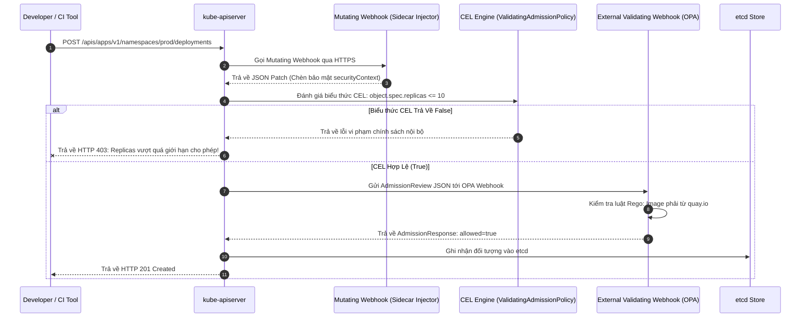
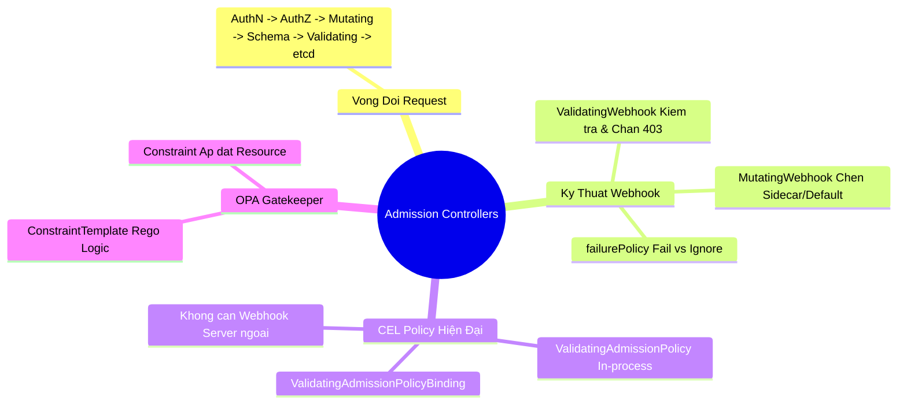


> [!IMPORTANT]
> **Mục tiêu kỹ thuật bài học**:
> - Hiểu sâu sắc **vòng đời xử lý Request của kube-apiserver** từ xác thực (AuthN), phân quyền (AuthZ) tới giai đoạn **Admission Phase**.
> - Phân biệt bản chất và sự khác nhau giữa **Mutating Admission Webhooks** (sửa đổi/chèn thuộc tính) và **Validating Admission Webhooks** (kiểm duyệt/chặn đứng).
> - Làm chủ tính năng hiện đại **`ValidatingAdmissionPolicy`** sử dụng ngôn ngữ **CEL (Common Expression Language)** tích hợp sẵn trong Kubernetes mà không cần triển khai Webhook Pod ngoài.
> - Cấu hình ràng buộc chính sách qua **`ValidatingAdmissionPolicyBinding`** áp dụng cho từng Namespace hoặc Resource cụ thể.
> - Hiểu kiến trúc **OPA Gatekeeper** với cặp bài trùng **`ConstraintTemplate`** (định nghĩa logic Rego) và **`Constraint`** (áp đặt thực thi).
> - Phân tích đánh đổi giữa hai chế độ xử lý lỗi: `failurePolicy: Fail` (bảo mật nghiêm ngặt) vs `failurePolicy: Ignore` (ưu tiên tính sẵn sàng).

---

## 1. Bản Chất Kiến Trúc & Tư Duy Cốt Lõi: Cổng Kiểm Soát Nhập Cụm (Admission Phase)

Trong kiến trúc Kubernetes API Server, sau khi một yêu cầu gửi đến đã vượt qua bước **Xác thực danh tính (Authentication - AuthN)** và bước **Kiểm tra quyền hạn RBAC (Authorization - AuthZ)**, yêu cầu vẫn chưa được ghi ngay vào `etcd`. Nó bắt buộc phải đi qua giai đoạn kiểm duyệt cuối cùng gọi là **Admission Phase**.

Admission Phase bao gồm hai giai đoạn thực thi tuần tự:
1. **Mutating Admission Phase (Giai đoạn Biến đổi):** Có thể tự động chỉnh sửa hoặc bổ sung các trường mặc định vào đối tượng (ví dụ: tự động chèn Sidecar container như Istio/Vault, gán nhãn mặc định, chèn SecurityContext).
2. **Object Schema Validation:** API Server kiểm tra tính hợp lệ của lược đồ dữ liệu OpenAPI.
3. **Validating Admission Phase (Giai đoạn Kiểm duyệt):** Kiểm tra xem đối tượng có thỏa mãn các quy chuẩn nghiệp vụ và an ninh hay không. Nếu vi phạm bất kỳ quy tắc nào, yêu cầu sẽ bị **từ chối ngay lập tức (HTTP 403 Forbidden)** và bị hủy bỏ, hoàn toàn không được ghi vào etcd.

```mermaid
flowchart TD
    subgraph ADMISSION_LIFECYCLE["🚪 VÒNG ĐỜI XỬ LÝ REQUEST CỦA KUBE-APISERVER"]
        direction LR
        REQ["1. HTTP Request<br/>(kubectl / Client)"] --> AUTHN["2. Authentication<br/>(Cert / Token / OIDC)"]
        AUTHN --> AUTHZ["3. Authorization<br/>(RBAC / Node / ABAC)"]
        AUTHZ --> MUTATING["4. Mutating Phase<br/>(Chèn Sidecar, Inject Defaults)"]
        MUTATING --> SCHEMA["5. Schema Validation<br/>(Kiểm tra cú pháp OpenAPI)"]
        SCHEMA --> VALIDATING["6. Validating Phase<br/>(CEL Policy / OPA / Webhooks)"]
        VALIDATING -->|"Thỏa Mãn Hợp Lệ"| ETCD["7. etcd Store<br/>(Ghi Dữ Liệu Thành Công)"]
        VALIDATING -.->|"❌ Vi Phạm Chính Sách"| REJECT["🚫 403 Forbidden"]
    end

    style ADMISSION_LIFECYCLE fill:none,stroke:#6366f1,stroke-width:1.75px
    style REQ fill:none,stroke:#64748b,stroke-width:1.5px
    style AUTHN fill:none,stroke:#3b82f6,stroke-width:1.5px
    style AUTHZ fill:none,stroke:#3b82f6,stroke-width:1.5px
    style MUTATING fill:none,stroke:#f59e0b,stroke-width:1.5px
    style SCHEMA fill:none,stroke:#64748b,stroke-width:1.5px
    style VALIDATING fill:none,stroke:#10b981,stroke-width:2px
    style ETCD fill:none,stroke:#06b6d4,stroke-width:1.5px
    style REJECT fill:none,stroke:#f43f5e,stroke-width:1.5px
```



---

## 2. Bảng Ma Trận So Sánh Kỹ Thuật Toàn Diện (Engineering Matrix)

| Tiêu Chí Kỹ Thuật | In-tree Admission (PSA/LimitRanger) | ValidatingAdmissionWebhook | CEL ValidatingAdmissionPolicy | OPA Gatekeeper | Kyverno |
| :--- | :--- | :--- | :--- | :--- | :--- |
| **Cơ chế triển khai** | Tích hợp sẵn trong binary API Server | Yêu cầu Webhook Pod ngoài + TLS Certs | Tích hợp sẵn trong K8s API (In-process CEL) | Cài đặt Controller CRD + Webhook | Cài đặt Controller CRD + Webhook |
| **Ngôn ngữ viết luật** | Không tùy biến (Cố định mã nguồn Go) | Bất kỳ ngôn ngữ nào (HTTP JSON API) | **Common Expression Language (CEL)** | **Rego** | **YAML thuần túy** |
| **Độ trễ xử lý (Latency)** | Cực nhanh ($< 0.1\text{ ms}$) | Chậm ($+ 10\text{ ms} - 50\text{ ms}$ qua mạng) | Siêu nhanh ($< 0.5\text{ ms}$ in-memory) | Trung bình ($+ 5\text{ ms} - 15\text{ ms}$) | Trung bình ($+ 5\text{ ms} - 15\text{ ms}$) |
| **Rủi ro sập cụm** | Không có | <span class="badge badge--rose">Rất cao nếu Webhook timeout</span> | <span class="badge badge--emerald">Không có (In-process execution)</span> | Có nếu Pod controller chết | Có nếu Pod controller chết |
| **Khả năng Mutating** | Có | Có (MutatingWebhook) | Chỉ Validating | Có (Mutating Webhook) | Có (Generate/Mutate) |
| **Trọng tâm thi CKS** | Rất cao | Bắt buộc 100% | Xu hướng thi mới (K8s 1.30+) | Bắt buộc 100% | Tham khảo doanh nghiệp |

---

## 3. Kiến Trúc Môi Trường & Luồng Thực Thi Mẫu

Khi người dùng gửi lệnh tạo Deployment, luồng tương tác giữa API Server và Dynamic Webhooks / CEL Engine được mô hình hóa qua Sequence Diagram sau:



---

## 4. Phân Tích Cạm Bẫy Thực Chiến: Webhook Server Chết Khiến Toàn Bộ Lệnh `kubectl` Bị Treo Hoặc Từ Chối

### Tình Huống Sự Cố Thực Tế:
<span class="badge badge--rose">🕒 11:45 AM</span> Nhóm DevOps cấu hình một `ValidatingWebhookConfiguration` với thiết lập `failurePolicy: Fail` để kiểm tra nhãn an ninh của toàn bộ Pods trong cụm. Do một sự cố OOM, Pod chạy Webhook Service bị sập. Ngay lập tức, toàn bộ các lệnh `kubectl apply`, `kubectl delete`, và các quy trình tự động mở rộng Pod của cụm bị đóng băng và từ chối 100%.

### Hậu Quả & Log Lỗi Thực Tế:
```text
================================================================================
CRITICAL CLUSTER ADMISSION FAILURE: VALIDATING WEBHOOK ENDPOINT UNREACHABLE
================================================================================
[ERROR] 2026-09-12T11:45:10.892Z kube-apiserver:
Internal error occurred: failed calling webhook "validate.security.company.com":
Post "https://security-webhook-svc.default.svc:443/validate?timeout=10s":
dial tcp 10.96.14.88:443: connect: connection refused

>> KUBECTL CLIENT RESPONSE:
$ kubectl run test-pod --image=nginx:alpine
Error from server (InternalError): Internal error occurred: failed calling webhook "validate.security.company.com":
Post "https://security-webhook-svc.default.svc:443/validate?timeout=10s": connect: connection refused
================================================================================
```

### 5-Whys Root Cause Analysis:
1. <span class="badge badge--primary">Why 1</span> **Tại sao toàn bộ cụm không thể tạo hay sửa bất kỳ tài nguyên nào?** $\rightarrow$ Vì `kube-apiserver` từ chối mọi yêu cầu với lỗi `InternalError`.
2. <span class="badge badge--primary">Why 2</span> **Tại sao API Server lại trả về lỗi InternalError?** $\rightarrow$ Vì nó không thể gửi gói tin HTTPS tới máy chủ Webhook tại địa chỉ `security-webhook-svc.default.svc:443`.
3. <span class="badge badge--primary">Why 3</span> **Tại sao khi Webhook chết thì API Server lại chặn toàn bộ cụm?** $\rightarrow$ Vì cấu hình `ValidatingWebhookConfiguration` đang thiết lập cờ `failurePolicy: Fail`.
4. <span class="badge badge--primary">Why 4</span> **Sự khác biệt giữa `failurePolicy: Fail` và `failurePolicy: Ignore` là gì?** $\rightarrow$ `Fail` đặt tính an toàn lên trên (chặn mọi request nếu không thể kiểm tra), còn `Ignore` ưu tiên tính sẵn sàng (bỏ qua kiểm tra và cho phép request đi qua nếu Webhook gặp sự cố).
5. <span class="badge badge--emerald">Root Cause Remedy</span> **Biện pháp khắc phục chuẩn CKS:**
   - <span class="badge badge--emerald">Khắc phục sự cố khẩn cấp (Emergency Bypass):</span> Xóa nhanh tệp cấu hình webhook đang bị lỗi để mở khóa cụm:
     ```bash
     kubectl delete validatingwebhookconfiguration <webhook-name>
     ```
   - <span class="badge badge--cyan">Loại trừ Namespace Hệ Thống:</span> Luôn luôn khai báo `namespaceSelector` để loại trừ `kube-system` và chính Namespace chứa Webhook Server khỏi phạm vi kiểm duyệt, tránh việc Webhook tự chặn chính nó khi khởi động lại:
     ```yaml
     namespaceSelector:
       matchExpressions:
       - key: kubernetes.io/metadata.name
         operator: NotIn
         values: ["kube-system", "security-system"]
     ```
   - <span class="badge badge--primary">Chuyển Dịch Sang CEL ValidatingAdmissionPolicy:</span> Sử dụng chính sách CEL in-process để không bao giờ bị phụ thuộc vào Webhook Server mạng ngoài.

---

## 5. Hands-on Lab: Triển Khai CEL ValidatingAdmissionPolicy & OPA Gatekeeper Constraint (8 Bước)

| Bước | Mục Tiêu Kỹ Thuật | Đầu Ra Kiểm Tra |
| :---: | :--- | :--- |
| **1** | Kiểm tra cụm Kubernetes hỗ trợ `ValidatingAdmissionPolicy` | API Resource `validatingadmissionpolicies` sẵn sàng |
| **2** | Biên soạn chính sách CEL cấm sử dụng ảnh container mang tag `:latest` | Tệp `deny-latest-tag.yaml` |
| **3** | Biên soạn PolicyBinding liên kết chính sách với Namespace `prod` | Tệp `deny-latest-binding.yaml` |
| **4** | Áp dụng chính sách và tạo Namespace thử nghiệm `prod` | Chính sách được kích hoạt trên cụm |
| **5** | Thử tạo Pod sử dụng image `nginx:latest` | API Server chặn đứng và in thông điệp lỗi CEL |
| **6** | Thử tạo Pod sử dụng image có tag cố định `nginx:1.25.4-alpine` | Pod được tạo thành công |
| **7** | Khám phá cấu trúc OPA Gatekeeper `ConstraintTemplate` | Hiểu cách đóng gói logic Rego |
| **8** | Kiểm định toàn diện luồng Admission Policy | Xác nhận cụm được bảo vệ an toàn bằng Policy-as-Code |

### Bước 1: Kiểm Tra Hỗ Trợ `ValidatingAdmissionPolicy` Trên Cụm

```bash
kubectl api-resources | grep -i validatingadmissionpolicy
```

### Bước 2: Biên Soạn Chính Sách CEL Cấm Dùng Tag `:latest` Hoặc Thiếu Tag

```bash
cat <<EOF | kubectl apply -f -
apiVersion: admissionregistration.k8s.io/v1
kind: ValidatingAdmissionPolicy
metadata:
  name: "deny-latest-tag-policy"
spec:
  failurePolicy: Fail
  matchConstraints:
    resourceRules:
    - apiGroups:   [""]
      apiVersions: ["v1"]
      operations:  ["CREATE", "UPDATE"]
      resources:   ["pods"]
  validations:
    - expression: "object.spec.containers.all(c, !c.image.endsWith(':latest') && c.image.contains(':'))"
      message: "VI PHAM AN NINH: Cam tuyet doi su dung anh container mang tag :latest hoac khong co tag tren Production!"
EOF
```

### Bước 3: Tạo Namespace & Ràng Buộc Chính Sách Bằng `PolicyBinding`

```bash
kubectl create namespace prod-secure

cat <<EOF | kubectl apply -f -
apiVersion: admissionregistration.k8s.io/v1
kind: ValidatingAdmissionPolicyBinding
metadata:
  name: "deny-latest-tag-binding"
spec:
  policyName: "deny-latest-tag-policy"
  validationActions: [Deny]
  matchResources:
    namespaceSelector:
      matchLabels:
        kubernetes.io/metadata.name: prod-secure
EOF
```

### Bước 4: Kiểm Thử Chặn Pod Vi Phạm Tag `:latest`

```bash
# Thử tạo Pod dùng tag :latest -> PHẢI BỊ CHẶN BỞI CHÍNH SÁCH CEL
cat <<EOF | kubectl apply -f - || true
apiVersion: v1
kind: Pod
metadata:
  name: insecure-app
  namespace: prod-secure
spec:
  containers:
  - name: web
    image: nginx:latest
EOF
```

> **Đầu ra kỳ vọng:** `Error from server: admission webhook "deny-latest-tag-policy" denied the request: VI PHAM AN NINH: Cam tuyet doi su dung anh container mang tag :latest...`

### Bước 5: Kiểm Thử Tạo Pod Hợp Lệ Với Tag Phiên Bản Cố Định

```bash
cat <<EOF | kubectl apply -f -
apiVersion: v1
kind: Pod
metadata:
  name: secure-app
  namespace: prod-secure
spec:
  containers:
  - name: web
    image: nginx:1.25.4-alpine
EOF
```

### Bước 6: Kiểm Tra Trạng Thái Pod Hợp Lệ Đang Chạy

```bash
kubectl get pod secure-app -n prod-secure
```

### Bước 7: Mẫu Định Nghĩa OPA Gatekeeper ConstraintTemplate (Tham Khảo CKS)

```yaml
apiVersion: templates.gatekeeper.sh/v1
kind: ConstraintTemplate
metadata:
  name: k8srequiredlabels
spec:
  crd:
    spec:
      names:
        kind: K8sRequiredLabels
      validation:
        openAPIV3Schema:
          type: object
          properties:
            labels:
              type: array
              items:
                type: string
  targets:
    - target: admission.k8s.gatekeeper.sh
      rego: |
        package k8srequiredlabels
        violation[{"msg": msg}] {
          provided := {label | input.review.object.metadata.labels[label]}
          required := {label | label := input.parameters.labels[_]}
          missing := required - provided
          count(missing) > 0
          msg := sprintf("Thieu cac nhan bat buoc sau day: %v", [missing])
        }
```

### Bước 8: Kiểm Tra & Xóa Dọn Môi Trường Sau Khi Thử Nghiệm

```bash
kubectl delete validatingadmissionpolicybinding deny-latest-tag-binding
kubectl delete validatingadmissionpolicy deny-latest-tag-policy

echo ">> [VERIFIED] Chuc mung ban da lam chu Admission Controllers & CEL Policies theo chuan CKS!"
```

---

## 6. 10 Câu Hỏi Tự Kiểm Tra Chuyên Sâu (Self-Check Q&A Accordion)

<details class="qa-card">
<summary class="qa-summary">
  <div class="qa-summary-left">
    <span class="qa-num-badge">Q01</span>
    <span>Sự khác biệt cốt lõi về thời điểm và chức năng giữa Mutating Admission Webhook và Validating Admission Webhook là gì?</span>
  </div>
  <span class="qa-chevron">
    <svg width="18" height="18" fill="none" stroke="currentColor" stroke-width="2.5" viewBox="0 0 24 24"><polyline points="6 9 12 15 18 9"></polyline></svg>
  </span>
</summary>
<div class="qa-answer">
  <div class="qa-answer-header">
    <svg width="14" height="14" fill="none" stroke="currentColor" stroke-width="2" viewBox="0 0 24 24"><path d="M22 11.08V12a10 10 0 1 1-5.93-9.14"></path><polyline points="22 4 12 14.01 9 11.01"></polyline></svg>
    <span>Phân Tích &amp; Lời Giải Kỹ Thuật</span>
  </div>
  <div style="margin-bottom: 8px;"><b style="color: var(--accent-amber);">Mutating Webhook:</b> Thực thi TRƯỚC, có quyền sửa đổi nội dung đối tượng (chèn sidecar, thêm nhãn, gán securityContext). <b style="color: var(--accent-emerald);">Validating Webhook:</b> Thực thi SAU Mutating và sau Schema Validation, KHÔNG ĐƯỢC sửa đổi đối tượng mà chỉ có quyền quyết định cho phép (Allow) hoặc từ chối chặn đứng (Deny) request.</div>
</div>
</details>

<details class="qa-card">
<summary class="qa-summary">
  <div class="qa-summary-left">
    <span class="qa-num-badge">Q02</span>
    <span>Tại sao tính năng `ValidatingAdmissionPolicy` (CEL) lại vượt trội hơn so với việc tự xây dựng Validating Webhook truyền thống?</span>
  </div>
  <span class="qa-chevron">
    <svg width="18" height="18" fill="none" stroke="currentColor" stroke-width="2.5" viewBox="0 0 24 24"><polyline points="6 9 12 15 18 9"></polyline></svg>
  </span>
</summary>
<div class="qa-answer">
  <div class="qa-answer-header">
    <svg width="14" height="14" fill="none" stroke="currentColor" stroke-width="2" viewBox="0 0 24 24"><path d="M22 11.08V12a10 10 0 1 1-5.93-9.14"></path><polyline points="22 4 12 14.01 9 11.01"></polyline></svg>
    <span>Phân Tích &amp; Lời Giải Kỹ Thuật</span>
  </div>
  <div style="margin-bottom: 8px;"><code>ValidatingAdmissionPolicy</code> thực thi biểu thức CEL <b style="color: var(--accent-emerald);">ngay bên trong tiến trình kube-apiserver (In-process)</b>. Nó không cần triển khai thêm Webhook Pod, không cần quản lý chứng chỉ TLS, không phát sinh độ trễ mạng HTTP callout và loại bỏ 100% rủi ro cụm bị tê liệt do Webhook server bên ngoài gặp sự cố.</div>
</div>
</details>

<details class="qa-card">
<summary class="qa-summary">
  <div class="qa-summary-left">
    <span class="qa-num-badge">Q03</span>
    <span>Thuộc tính `failurePolicy: Fail` khác gì so với `failurePolicy: Ignore` trong cấu hình Admission Webhook?</span>
  </div>
  <span class="qa-chevron">
    <svg width="18" height="18" fill="none" stroke="currentColor" stroke-width="2.5" viewBox="0 0 24 24"><polyline points="6 9 12 15 18 9"></polyline></svg>
  </span>
</summary>
<div class="qa-answer">
  <div class="qa-answer-header">
    <svg width="14" height="14" fill="none" stroke="currentColor" stroke-width="2" viewBox="0 0 24 24"><path d="M22 11.08V12a10 10 0 1 1-5.93-9.14"></path><polyline points="22 4 12 14.01 9 11.01"></polyline></svg>
    <span>Phân Tích &amp; Lời Giải Kỹ Thuật</span>
  </div>
  <div style="margin-bottom: 8px;"><b style="color: var(--accent-rose);">Fail:</b> Nếu máy chủ Webhook bị sập, không phản hồi hoặc timeout, API Server sẽ TỪ CHỐI toàn bộ request liên quan. <b style="color: var(--accent-cyan);">Ignore:</b> Nếu máy chủ Webhook gặp sự cố, API Server sẽ BỎ QUA bước kiểm tra và cho phép request được tạo bình thường (ưu tiên tính sẵn sàng).</div>
</div>
</details>

<details class="qa-card">
<summary class="qa-summary">
  <div class="qa-summary-left">
    <span class="qa-num-badge">Q04</span>
    <span>Tại sao cần loại trừ Namespace `kube-system` trong cấu hình `namespaceSelector` của Admission Webhooks?</span>
  </div>
  <span class="qa-chevron">
    <svg width="18" height="18" fill="none" stroke="currentColor" stroke-width="2.5" viewBox="0 0 24 24"><polyline points="6 9 12 15 18 9"></polyline></svg>
  </span>
</summary>
<div class="qa-answer">
  <div class="qa-answer-header">
    <svg width="14" height="14" fill="none" stroke="currentColor" stroke-width="2" viewBox="0 0 24 24"><path d="M22 11.08V12a10 10 0 1 1-5.93-9.14"></path><polyline points="22 4 12 14.01 9 11.01"></polyline></svg>
    <span>Phân Tích &amp; Lời Giải Kỹ Thuật</span>
  </div>
  <div style="margin-bottom: 8px;">Nếu không loại trừ <code>kube-system</code>, khi Webhook Server gặp sự cố và thiết lập <code>failurePolicy: Fail</code>, các Pod hạ tầng tối quan trọng (như CNI, CoreDNS, Kube-Proxy) sẽ <b style="color: var(--accent-rose);">không thể khởi động lại hoặc tự hồi phục</b>, dẫn đến sập toàn bộ cụm trong vòng lặp khóa chết (Deadlock).</div>
</div>
</details>

<details class="qa-card">
<summary class="qa-summary">
  <div class="qa-summary-left">
    <span class="qa-num-badge">Q05</span>
    <span>Mối quan hệ giữa `ConstraintTemplate` và `Constraint` trong kiến trúc OPA Gatekeeper là gì?</span>
  </div>
  <span class="qa-chevron">
    <svg width="18" height="18" fill="none" stroke="currentColor" stroke-width="2.5" viewBox="0 0 24 24"><polyline points="6 9 12 15 18 9"></polyline></svg>
  </span>
</summary>
<div class="qa-answer">
  <div class="qa-answer-header">
    <svg width="14" height="14" fill="none" stroke="currentColor" stroke-width="2" viewBox="0 0 24 24"><path d="M22 11.08V12a10 10 0 1 1-5.93-9.14"></path><polyline points="22 4 12 14.01 9 11.01"></polyline></svg>
    <span>Phân Tích &amp; Lời Giải Kỹ Thuật</span>
  </div>
  <div style="margin-bottom: 8px;"><b style="color: var(--accent-primary);">ConstraintTemplate:</b> Đóng vai trò như một "Khuôn mẫu" định nghĩa logic kiểm tra bằng ngôn ngữ Rego và tự động sinh ra một Custom Resource Definition (CRD) mới. <b style="color: var(--accent-emerald);">Constraint:</b> Là một đối tượng Custom Resource cụ thể được tạo từ CRD đó, truyền các tham số (Parameters) và danh sách tài nguyên/Namespace cần áp đặt luật.</div>
</div>
</details>

<details class="qa-card">
<summary class="qa-summary">
  <div class="qa-summary-left">
    <span class="qa-num-badge">Q06</span>
    <span>Cờ cấu hình nào trên `kube-apiserver` dùng để bật hoặc tắt các plugin Admission Controller tích hợp sẵn?</span>
  </div>
  <span class="qa-chevron">
    <svg width="18" height="18" fill="none" stroke="currentColor" stroke-width="2.5" viewBox="0 0 24 24"><polyline points="6 9 12 15 18 9"></polyline></svg>
  </span>
</summary>
<div class="qa-answer">
  <div class="qa-answer-header">
    <svg width="14" height="14" fill="none" stroke="currentColor" stroke-width="2" viewBox="0 0 24 24"><path d="M22 11.08V12a10 10 0 1 1-5.93-9.14"></path><polyline points="22 4 12 14.01 9 11.01"></polyline></svg>
    <span>Phân Tích &amp; Lời Giải Kỹ Thuật</span>
  </div>
  <div style="margin-bottom: 8px;">Sử dụng cờ: <b style="color: var(--accent-primary);">--enable-admission-plugins=NodeRestriction,PodSecurity,...</b> (để bật thêm plugin) và cờ <b style="color: var(--accent-rose);">--disable-admission-plugins=...</b> (để vô hiệu hóa plugin không mong muốn).</div>
</div>
</details>

<details class="qa-card">
<summary class="qa-summary">
  <div class="qa-summary-left">
    <span class="qa-num-badge">Q07</span>
    <span>Trường `caBundle` trong manifest `ValidatingWebhookConfiguration` có vai trò bắt buộc gì?</span>
  </div>
  <span class="qa-chevron">
    <svg width="18" height="18" fill="none" stroke="currentColor" stroke-width="2.5" viewBox="0 0 24 24"><polyline points="6 9 12 15 18 9"></polyline></svg>
  </span>
</summary>
<div class="qa-answer">
  <div class="qa-answer-header">
    <svg width="14" height="14" fill="none" stroke="currentColor" stroke-width="2" viewBox="0 0 24 24"><path d="M22 11.08V12a10 10 0 1 1-5.93-9.14"></path><polyline points="22 4 12 14.01 9 11.01"></polyline></svg>
    <span>Phân Tích &amp; Lời Giải Kỹ Thuật</span>
  </div>
  <div style="margin-bottom: 8px;"><code>caBundle</code> chứa chuỗi chứng chỉ CA công khai (Base64 encoded). API Server bắt buộc phải giao tiếp với Webhook Server qua giao thức <b style="color: var(--accent-emerald);">HTTPS mã hóa an toàn</b>; <code>caBundle</code> giúp API Server xác thực danh tính chứng chỉ TLS của Webhook Server để chống tấn công giả mạo (Man-in-the-Middle).</div>
</div>
</details>

<details class="qa-card">
<summary class="qa-summary">
  <div class="qa-summary-left">
    <span class="qa-num-badge">Q08</span>
    <span>Biểu thức CEL nào kiểm tra xem tất cả các container trong Pod đều có khai báo giới hạn bộ nhớ (`resources.limits.memory`)?</span>
  </div>
  <span class="qa-chevron">
    <svg width="18" height="18" fill="none" stroke="currentColor" stroke-width="2.5" viewBox="0 0 24 24"><polyline points="6 9 12 15 18 9"></polyline></svg>
  </span>
</summary>
<div class="qa-answer">
  <div class="qa-answer-header">
    <svg width="14" height="14" fill="none" stroke="currentColor" stroke-width="2" viewBox="0 0 24 24"><path d="M22 11.08V12a10 10 0 1 1-5.93-9.14"></path><polyline points="22 4 12 14.01 9 11.01"></polyline></svg>
    <span>Phân Tích &amp; Lời Giải Kỹ Thuật</span>
  </div>
  <div style="margin-bottom: 8px;">Sử dụng biểu thức CEL:
  <div style="margin-top: 6px; padding: 8px; background: rgba(0,0,0,0.2); border-radius: 4px; font-family: monospace; font-size: 0.9em;">
  object.spec.containers.all(c, has(c.resources) &amp;&amp; has(c.resources.limits) &amp;&amp; has(c.resources.limits.memory))
  </div>
  </div>
</div>
</details>

<details class="qa-card">
<summary class="qa-summary">
  <div class="qa-summary-left">
    <span class="qa-num-badge">Q09</span>
    <span>Làm thế nào để cấu hình `ValidatingAdmissionPolicyBinding` chỉ chạy ở chế độ Cảnh báo (Audit/Warn) mà không chặn request?</span>
  </div>
  <span class="qa-chevron">
    <svg width="18" height="18" fill="none" stroke="currentColor" stroke-width="2.5" viewBox="0 0 24 24"><polyline points="6 9 12 15 18 9"></polyline></svg>
  </span>
</summary>
<div class="qa-answer">
  <div class="qa-answer-header">
    <svg width="14" height="14" fill="none" stroke="currentColor" stroke-width="2" viewBox="0 0 24 24"><path d="M22 11.08V12a10 10 0 1 1-5.93-9.14"></path><polyline points="22 4 12 14.01 9 11.01"></polyline></svg>
    <span>Phân Tích &amp; Lời Giải Kỹ Thuật</span>
  </div>
  <div style="margin-bottom: 8px;">Trong manifest <code>ValidatingAdmissionPolicyBinding</code>, thiết lập mảng hành động: <b style="color: var(--accent-amber);">validationActions: [Warn, Audit]</b> (loại bỏ giá trị <code>Deny</code>). Khi đó người dùng sẽ nhận cảnh báo trên Terminal và log được ghi vào Audit Trail mà Pod vẫn được tạo thành công.</div>
</div>
</details>

<details class="qa-card">
<summary class="qa-summary">
  <div class="qa-summary-left">
    <span class="qa-num-badge">Q10</span>
    <span>Tại sao cần kiểm tra cờ `timeoutSeconds` trong cấu hình Admission Webhook và giá trị mặc định là bao nhiêu?</span>
  </div>
  <span class="qa-chevron">
    <svg width="18" height="18" fill="none" stroke="currentColor" stroke-width="2.5" viewBox="0 0 24 24"><polyline points="6 9 12 15 18 9"></polyline></svg>
  </span>
</summary>
<div class="qa-answer">
  <div class="qa-answer-header">
    <svg width="14" height="14" fill="none" stroke="currentColor" stroke-width="2" viewBox="0 0 24 24"><path d="M22 11.08V12a10 10 0 1 1-5.93-9.14"></path><polyline points="22 4 12 14.01 9 11.01"></polyline></svg>
    <span>Phân Tích &amp; Lời Giải Kỹ Thuật</span>
  </div>
  <div style="margin-bottom: 8px;">Giá trị mặc định là <b style="color: var(--accent-primary);">10 giây</b> (giá trị tối đa là 30 giây). Nếu Webhook Server phản hồi chậm quá thời gian này, API Server sẽ xem như request bị lỗi timeout và xử lý theo <code>failurePolicy</code>. Nên cấu hình giá trị ngắn (ví dụ <code>2-3s</code>) để tránh làm nghẽn hàng đợi request của Control Plane.</div>
</div>
</details>

---

## 7. Tổng Kết & Lộ Trình Bài Học Tiếp Theo



Làm chủ **Admission Controllers** và **Policy-as-Code** giúp bạn thiết lập hàng rào phòng thủ tự động và vững vàng trước các câu hỏi cấu hình chính sách nâng cao của kỳ thi CKS.

> [!TIP]
> **BÀI HỌC TIẾP THEO:**
> Trong **[[Bài 09] Làm Cứng Hệ Điều Hành & Máy Chủ Node: Tuân Thủ CIS Benchmarks, Kube-Bench & Giảm Thiểu Bề Mặt Tấn Công](cks-09-09-lam-cung-he-dieu-hanh.html)**, chúng ta sẽ chuyển xuống tầng máy chủ vật lý: Chạy công cụ kiểm toán tự động kube-bench theo chuẩn CIS Benchmark, siết chặt quyền tệp tin cấu hình Control Plane, tắt các dịch vụ thừa và gia cố tường lửa UFW/SSH.

