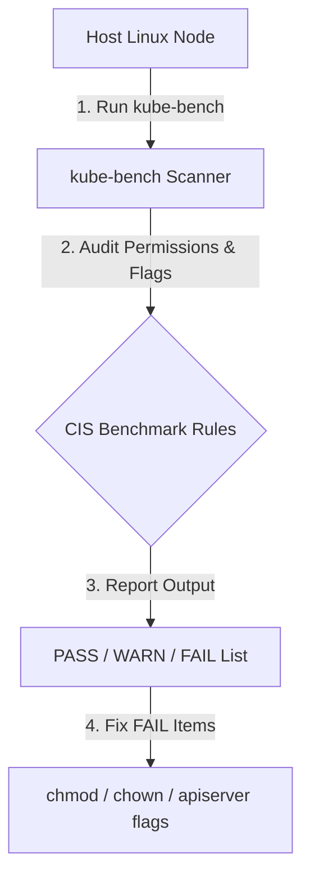


# [BÀI 09] LÀM CỨNG HỆ ĐIỀU HÀNH MÁY CHỦ (NODE HARDENING): CIS BENCHMARKS, KUBE-BENCH & TRIỆT TIÊU DỊCH VỤ THỪA

Trong kỷ nguyên điện toán đám mây và kiến trúc microservices phân tán quy mô lớn, **Kubernetes (CKS)** đóng vai trò là nền tảng điều phối container (Container Orchestration) tiêu chuẩn công nghiệp. Để làm chủ hệ thống trong môi trường sản xuất (Production) cũng như chinh phục kỳ thi chứng chỉ quốc tế của Linux Foundation / CNCF, kỹ sư không chỉ nắm vững các câu lệnh thao tác cơ bản mà phải thấu hiểu sâu sắc bản chất cơ chế tầng thấp: từ chu trình điều hòa (Reconciliation Loop), cấu trúc điều phối tài nguyên, kiến trúc mạng CNI, lưu trữ CSI cho đến các chuẩn mực an ninh phòng thủ chiều sâu.

Bài viết chuyên sâu này sẽ đồng hành cùng bạn giải mã toàn diện bức tranh kiến trúc, phân tích các đánh đổi kỹ thuật thực chiến (Engineering Trade-offs), cung cấp bài thực hành Lab từng bước và bộ câu hỏi phỏng vấn chuẩn Architect / Lead Engineer.

---

## 1. Bản Chất Kiến Trúc & Cơ Chế Vận Hành Tầng Thấp

| # | Câu hỏi ôn tập | Đáp án chuẩn ngắn gọn |
|---|---|---|
| 1 | Thứ tự thực thi giữa Mutating và Validating Webhook? | **Mutating CHẠY TRƯỚC**, **Validating CHẠY SAU** |
| 2 | Tính năng CEL Validation tích hợp sẵn trong K8s 1.30+? | **`ValidatingAdmissionPolicy`** |
| 3 | Kiểu dữ liệu bắt buộc trả về của biểu thức CEL? | Kiểu dữ liệu **Boolean** (`true`/`false`) |
| 4 | Hàm CEL kiểm tra sự tồn tại tránh lỗi Null Pointer? | Hàm **`has(object.metadata.labels)`** |
| 5 | Đối tượng liên kết ValidatingAdmissionPolicy với Namespace? | **`ValidatingAdmissionPolicyBinding`** |


> **"Gia cố hệ điều hành Node và đánh giá an ninh bằng chuẩn CIS Kubernetes Benchmark qua công cụ kube-bench là yêu cầu bảo mật nền tảng thuộc miền System Hardening (10%) trong chứng chỉ CKS, đòi hỏi chuyên gia bảo mật phải giảm thiểu tối đa bề mặt tấn công của Host Node bằng cách chạy công cụ `kube-bench` để quét toàn bộ quy chuẩn an toàn trên Control Plane và Worker Nodes; khắc phục triệt để các cảnh báo FAIL (như phân quyền tệp tin nhạy cảm `chmod 600 /etc/kubernetes/manifests/*`, gỡ bỏ cờ mở cổng thiếu an toàn); vô hiệu hóa các dịch vụ hệ thống không cần thiết (`systemctl disable`); đồng thời thiết lập luật tường lửa chặn đứng nguy cơ container đánh cắp thông tin đám mây qua địa chỉ Metadata Endpoint `169.254.169.254`."**

**Kết quả từ các buổi trước được sử dụng lại:**

| Kết quả / Công cụ | Buổi + số hiệu `QT` | Dùng ở đâu trong buổi này |
|---|---|---|
| Phân quyền file và user Linux Kernel | Buổi 05 `QT 4.1` | Thực thi `chmod 600` và `chown root:root` trên tệp k8s |
| Cấu hình cờ API Server và Kubelet | Buổi 08 `QT 4.1` | Khắc phục các vi phạm CIS Benchmark trên Static Pod |
| Thiết lập NetworkPolicy cấm truy cập Egress | Buổi 46 `QT 4.1` | Viết NetworkPolicy chặn IP Metadata `169.254.169.254` |

---


| # | Kỹ năng thực hiện được | Hiện vật chứng minh |
|---|---|---|
| 1 | Thực thi công cụ `kube-bench` rà soát tiêu chuẩn CIS Benchmark | Báo cáo `kube-bench` chứa danh sách PASS/FAIL |
| 2 | Phân quyền an toàn chuẩn CIS cho các tệp cấu hình K8s | Đầu ra lệnh `ls -la /etc/kubernetes/manifests/` |
| 3 | Thiết lập rào chắn ngăn Pods truy cập Cloud Metadata Endpoint | NetworkPolicy chặn Egress tới `169.254.169.254` |
| 4 | Vô hiệu hóa các dịch vụ hệ thống Linux thừa trên Node | Đầu ra lệnh `systemctl is-enabled` hiển thị disabled |
| 5 | Chẩn đoán và khắc phục các vi phạm an ninh Kubelet / APIServer | Nhật ký khắc phục vi phạm chuẩn CIS Benchmark |

---


| Kiến thức tiên quyết | Nguồn tự học nếu thiếu |
|---|---|
| Phân quyền file và dịch vụ systemd Linux | Buổi 05 (`QT 4.1`) |
| Thao tác chỉnh sửa cờ Static Pod Kube-APIServer | Buổi 08 (`QT 4.1`) |
| Cấu hình NetworkPolicy cấm Egress traffic | Buổi 46 (`QT 4.1`) |

---


### 3.1. Thuật ngữ Việt–Anh

| # | Thuật ngữ tiếng Việt | Tiếng Anh tương đương | Ghi chú chuẩn hoá trong thân bài |
|---|---|---|---|
| 1 | Bộ tiêu chuẩn an ninh CIS | CIS Kubernetes Benchmark | Bộ quy chuẩn bảo mật quốc tế cho Kubernetes của tổ chức CIS |
| 2 | Công cụ rà soát an ninh kube-bench | kube-bench Security Scanner | Công cụ mã nguồn mở của Aqua Security kiểm tra CIS Benchmark |
| 3 | Gia cố hệ điều hành nút | Node OS Hardening | Giảm thiểu bề mặt tấn công của hệ điều hành Linux trên Node |
| 4 | Điểm truy cập thông tin đám mây | Cloud Metadata Endpoint (`169.254.169.254`) | Địa chỉ IP nội bộ cung cấp IAM credentials trên AWS/GCP/Azure |
| 5 | Phân quyền tệp tin an toàn | File Permission Hardening | Thiết lập `chmod 600` hoặc `644` cho các tệp cấu hình k8s |
| 6 | Quyền sở hữu tệp tin | File Ownership (`root:root`) | Gán người dùng và nhóm sở hữu tệp tin cho root |
| 7 | Tệp kê khai tĩnh Control Plane | Static Pod Manifests (`/etc/kubernetes/manifests`) | Thư mục lưu các tệp YAML static pod API server, etcd |
| 8 | Vô hiệu hóa dịch vụ hệ thống | System Service Disabling (`systemctl disable`) | Tắt các dịch vụ Linux thừa không sử dụng |
| 9 | Tường lửa chặn cổng | Port & Network Firewall (`iptables`/`ufw`) | Đóng các cổng mạng không nằm trong danh sách cổng K8s |
| 10 | Báo cáo kết quả kiểm tra | Audit Report (PASS/FAIL/WARN) | Kết quả đầu ra của kube-bench đánh giá mức độ tuân thủ |
| 11 | Khóa xác thực SSH | SSH Key Authentication | Cấu hình cấm đăng nhập SSH bằng password (`PasswordAuthentication no`) |
| 12 | Thư mục cấu hình Kubelet | Kubelet Config Directory (`/var/lib/kubelet/config.yaml`) | Tệp cấu hình tham số hoạt động cho Kubelet daemon |
| 13 | Giới hạn dung lượng nhật ký | Log Rotation & Retention | Cấu hình xoay vòng nhật ký hệ thống chống tràn đĩa cứng |
| 14 | Tường lửa máy chủ | Host Firewall Security | Rào chắn kiểm soát traffic mạng vào/ra trực tiếp trên Host Node |


Mô hình Gia Cố Pháo Đài và Rà Soát Danh Mục An Ninh: Hệ điều hành Node giống như một Pháo Đài Bảo Vệ. `kube-bench` giống như Đội Chuyên Gia Kiểm Tra An Ninh Pháo Đài mang theo Bảng Danh Mục CIS Benchmark: đi kiểm tra từng cánh cổng (`chown root:root /etc/kubernetes/admin.conf`), kiểm tra từng khóa cửa (`chmod 600 manifests/*`), soi xem có cửa ngách nào bỏ ngỏ không (`open ports / system services`). `Cloud Metadata Endpoint (169.254.169.254)` giống như Két Sắt Chứa Chìa Khóa Vạn Năng đặt ở sảnh chung: nếu không xây tường ngăn cách (`NetworkPolicy/iptables block 169.254.169.254`), bất kỳ vị khách nào (container) cũng có thể mở két lấy chìa khóa vạn năng (Cloud IAM credentials) để chiếm quyền điều khiển pháo đài.

---

### 1.1. Tổng quan CIS Kubernetes Benchmark và Rà soát bằng công cụ kube-bench (12 phút)

**Nguyên lý cốt lõi:** Luôn chạy công cụ `kube-bench` định kỳ trên cả Control Plane (`--targets master`) và Worker Nodes (`--targets node`) để phát hiện và khắc phục 100% các vi phạm chuẩn CIS Benchmark.

**Giải thích cơ chế ngầm:** Công cụ `kube-bench` tự động quét hàng trăm quy chuẩn bảo mật do tổ chức Center for Internet Security (CIS) phát hành, in ra kết quả phân loại `[PASS]`, `[WARN]`, `[FAIL]` kèm hướng dẫn khắc phục cụ thể cho từng mục.

> [!WARNING]
> **CẠM BẪY THỰC CHIẾN:**
> Bỏ qua bước rà soát `kube-bench` làm bỏ sót các tệp cấu hình quan trọng đang bị mở quyền cho người dùng phi root trên Node.

**Minh hoạ.**



**Nguyên lý cốt lõi:** Mọi tệp manifest Static Pod tại `/etc/kubernetes/manifests/` bắt buộc phải được phân quyền `chmod 600` (hoặc `644`) và gán quyền sở hữu `chown root:root`.

**Giải thích cơ chế ngầm:** Các tệp trong `/etc/kubernetes/manifests/` (như `kube-apiserver.yaml`, `etcd.yaml`) chứa toàn bộ tham số khởi động của các thành phần cốt lõi Control Plane. Nếu bị sửa đổi bởi user phi root, kẻ tấn công có thể chèn các cờ mở cổng nguy hiểm để chiếm quyền cụm.

> [!WARNING]
> **CẠM BẪY THỰC CHIẾN:**
> Để quyền `chmod 777` cho thư mục manifests làm bất kỳ user nào trên Node cũng có thể sửa đổi cấu hình Control Plane.

**Minh hoạ.**

```bash
# Phân quyền chuẩn CIS cho thư mục Static Pod Manifests:
sudo chown root:root /etc/kubernetes/manifests/*
sudo chmod 600 /etc/kubernetes/manifests/*
```

---

### 1.2. Phân quyền Tệp tin Nhạy cảm (`chmod 600`, `chown root:root`) và Cấu hình Kubelet/APIServer (12 phút)

**Nguyên lý cốt lõi:** Tệp cấu hình chứng chỉ quản trị `/etc/kubernetes/admin.conf` bắt buộc phải được phân quyền thắt chặt `chmod 600` và `chown root:root` để ngăn chặn người dùng phi root trên Node đọc tệp admin kubeconfig.

**Giải thích cơ chế ngầm:** Tệp `admin.conf` chứa chứng chỉ Client Certificate có quyền tối cao `system:masters`. Nếu một user phi root đọc được tệp này, chúng sẽ chiếm quyền điều khiển toàn bộ cụm Kubernetes.

> [!WARNING]
> **CẠM BẪY THỰC CHIẾN:**
> Để tệp `admin.conf` có quyền `chmod 644` làm cho tất cả các user trên Node đều đọc được chứng chỉ admin.

**Minh hoạ.**

```bash
# Bảo vệ tệp admin kubeconfig chuẩn CKS:
sudo chown root:root /etc/kubernetes/admin.conf
sudo chmod 600 /etc/kubernetes/admin.conf
```

**Nguyên lý cốt lõi:** Tệp cấu hình Kubelet `/var/lib/kubelet/config.yaml` và tệp dịch vụ `/etc/systemd/system/kubelet.service.d/10-kubeadm.conf` bắt buộc phải được phân quyền `chmod 600` (hoặc `644`) và thuộc sở hữu của `root:root`.

**Giải thích cơ chế ngầm:** Đảm bảo chỉ có tiến trình `kubelet` chạy dưới quyền root mới được phép đọc và thay đổi tham số hoạt động của Kubelet daemon trên Node.

> [!WARNING]
> **CẠM BẪY THỰC CHIẾN:**
> Để tệp config.yaml của Kubelet thuộc sở hữu của user thường làm cho `kube-bench` báo lỗi `[FAIL]`.

**Minh hoạ.**

```bash
# Phân quyền chuẩn CIS cho tệp cấu hình Kubelet:
sudo chown root:root /var/lib/kubelet/config.yaml
sudo chmod 600 /var/lib/kubelet/config.yaml
```

---

### 1.3. Bảo vệ Cloud Metadata Endpoint (`169.254.169.254`) và Tắt Dịch vụ Linux thừa (10 phút)

**Nguyên lý cốt lõi:** Luôn thiết lập rào chắn tường lửa (NetworkPolicy hoặc iptables) cấm tất cả các Pod ứng dụng thông thường truy cập vào địa chỉ Cloud Metadata Endpoint `169.254.169.254` để ngăn ngừa tấn công đánh cắp IAM credentials.

**Giải thích cơ chế ngầm:** Trên các nền tảng đám mây (AWS, GCP, Azure), địa chỉ IP `169.254.169.254` cung cấp API công khai trả về AWS IAM Instance Profile Token. Container nếu gửi HTTP GET request tới IP này có thể đánh cắp token để tấn công hạ tầng đám mây.

> [!WARNING]
> **CẠM BẪY THỰC CHIẾN:**
> Bỏ mở kết nối Egress tới `169.254.169.254` cho phép container độc hại chiếm quyền Cloud IAM Role của Node.

**Minh hoạ.**

```yaml
# NetworkPolicy cấm Egress tới IP Metadata 169.254.169.254:
apiVersion: networking.k8s.io/v1
kind: NetworkPolicy
metadata:
  name: block-cloud-metadata
spec:
  podSelector: {}
  policyTypes:
    - Egress
  egress:
    - to:
        - ipBlock:
            cidr: 0.0.0.0/0
            except:
              - 169.254.169.254/32
```

**Nguyên lý cốt lõi:** Tắt và vô hiệu hóa tất cả các dịch vụ Linux thừa không phục vụ Kubernetes trên Host Node (như `avahi-daemon`, `cups`, `rpcbind`) bằng lệnh `sudo systemctl stop <service> && sudo systemctl disable <service>`.

**Giải thích cơ chế ngầm:** Triệt tiêu các dịch vụ chạy ngầm thừa trên OS để giảm thiểu diện tích bề mặt tấn công và tiết kiệm tài nguyên RAM/CPU cho Host Node.

> [!WARNING]
> **CẠM BẪY THỰC CHIẾN:**
> Để các dịch vụ quản lý máy in (`cups`) hay định tuyến multicast (`avahi-daemon`) chạy công khai trên Node Production.

**Minh hoạ.**

```bash
# Dừng và vô hiệu hóa dịch vụ Linux thừa:
sudo systemctl stop avahi-daemon rpcbind
sudo systemctl disable avahi-daemon rpcbind
```

**Nguyên lý cốt lõi:** Khi chẩn đoán kết quả `kube-bench` báo `FAIL`, đọc kỹ phần hướng dẫn sửa chữa (`Remediation`) được in ngay bên dưới câu kiểm tra để thực thi đúng lệnh `chmod`, `chown` hoặc thêm cờ tham số.

**Giải thích cơ chế ngầm:** `kube-bench` in chính xác 100% câu lệnh Linux hoặc cờ cấu hình cần thêm/sửa cho từng vị trí vi phạm CIS Benchmark.

> [!WARNING]
> **CẠM BẪY THỰC CHIẾN:**
> Loay hoay tìm kiếm trên mạng trong khi `kube-bench` đã in sẵn câu lệnh Remediation ngay trên terminal.

**Minh hoạ.**

```bash
# Kết quả kube-bench:
# [FAIL] 1.1.1 Ensure that the API server pod specification file permissions are set to 600 or more restrictive
# Remediation: Run chmod 600 /etc/kubernetes/manifests/kube-apiserver.yaml
```

---

### 1.4. Đưa vào cụm thật (4 phút)

**Nguyên lý cốt lõi:** Bản kê khai phân quyền an toàn chuẩn CIS Benchmark cho Control Plane Node bắt buộc phải đạt: `/etc/kubernetes/manifests/*` (600/root:root), `/etc/kubernetes/admin.conf` (600/root:root), `/var/lib/etcd` (700/root:root), và `pki` certs (600/root:root).

**Giải thích cơ chế ngầm:** Bảo vệ toàn diện tất cả các tệp tin cấu hình, chứng chỉ và cơ sở dữ liệu quan trọng nhất của cụm Kubernetes.

> [!WARNING]
> **CẠM BẪY THỰC CHIẾN:**
> Để thư mục `/var/lib/etcd` có quyền cho user khác đọc/ghi.

**Minh hoạ.**

```bash
# Bộ lệnh phân quyền chuẩn CIS Benchmark Control Plane CKS:
sudo chown -R root:root /etc/kubernetes/pki/
sudo chmod -R 600 /etc/kubernetes/pki/*.key
sudo chown -R root:root /var/lib/etcd
sudo chmod 700 /var/lib/etcd
```

**Áp vào cụm đang chạy thì làm gì trước:**
1. Chạy `kube-bench run --targets master,node` để trích xuất báo cáo hiện tại.
2. Kiểm tra danh sách các dịch vụ đang chạy trên Node (`systemctl list-units --type=service`).
3. Áp dụng phân quyền `chmod`/`chown` theo hướng dẫn Remediation của `kube-bench`.
4. Áp dụng NetworkPolicy cấm truy cập IP Metadata `169.254.169.254`.

**Cái gì hỏng nếu áp thẳng lên prod:**
- Phân quyền sai thư mục (như `chmod 000`) làm cho Kubelet hoặc API Server không đọc được tệp cấu hình và bị rớt Node.

**Đo trước — đo sau:**
- Thử nghiệm chạy `kube-bench` trước (in ra N dòng `[FAIL]`) và sau khi khắc phục (chuyển 100% sang `[PASS]`).

**Khi nào KHÔNG nên dùng:**
- Không tắt các dịch vụ Linux hệ thống bắt buộc cho hạ tầng (như `systemd-resolved`, `containerd`, `ssh`).

---

### 1.5. Bẫy hay gặp (2 phút)

| Bẫy hay gặp | Vì sao dính | Làm đúng là |
|---|---|---|
| 1. Nhầm lẫn giữa target `master` và `node` trong kube-bench | Chạy target `node` trên Control Plane | Chạy đúng `--targets master` trên CP và `--targets node` trên Worker |
| 2. Quên cờ `except: [169.254.169.254/32]` trong Egress | Cấm toàn bộ Egress traffic làm rớt kết nối mạng | Dùng cờ `except` chỉ chặn duy nhất IP Metadata |
| 3. Phân quyền sai quyền `chmod 777` cho admin.conf | Để lộ chứng chỉ admin cho mọi user trên Node | Phân quyền thắt chặt `chmod 600 /etc/kubernetes/admin.conf` |
| 4. Quên cờ `chown root:root` cho thư mục manifests | Tệp thuộc sở hữu của user thường gây vi phạm CIS | Luôn chạy `chown root:root` đi kèm `chmod 600` |
| 5. Tắt nhầm dịch vụ mạng hệ thống | Tắt `systemd-networkd` làm mất kết nối SSH vào Node | Chỉ tắt các dịch vụ thừa không dùng như `avahi-daemon`, `cups` |
| 6. Không đọc phần Remediation trong kube-bench | Loay hoay tìm lệnh sửa vi phạm | Đọc kỹ đoạn Remediation in ngay dưới mỗi mục FAIL |
| 7. Quên phân quyền thư mục dữ liệu etcd | Để `/var/lib/etcd` ở dạng mở quyền cho group/others | Chạy `sudo chmod 700 /var/lib/etcd` |
| 8. Quên phân quyền tệp PKI private keys | Để private keys `.key` mở quyền đọc | Chạy `sudo chmod 600 /etc/kubernetes/pki/*.key` |
| 9. Không kiểm tra lại kube-bench sau khi sửa | Sửa thiếu tệp làm vi phạm chưa được triệt tiêu | Chạy lại `kube-bench` đối soát kết quả `[PASS]` |
| 10. Chặn IP Metadata trên Pod hạ tầng CNI | CNI Pod cần truy cập Cloud API bị chặn | Chỉ áp dụng NetworkPolicy chặn IP Metadata cho Pods ứng dụng |
| 11. Sửa nhầm tệp `kubelet.service` thay vì file drop-in | Khởi động lại Kubelet bị mất cấu hình | Sửa đúng tệp drop-in `/etc/systemd/system/kubelet.service.d/10-kubeadm.conf` |
| 12. Để mật khẩu đăng nhập SSH trên Node | Cho phép brute-force password SSH | Đặt `PasswordAuthentication no` trong `/etc/ssh/sshd_config` |

---

### 1.6. Tóm tắt (2 phút)

```mermaid
graph TD
    NodeSecurity[CKS Node OS Hardening] --> KubeBench[1. Audit via kube-bench: --targets master,node]
    NodeSecurity --> FilePerms[2. File Permission Hardening: chmod 600 & chown root:root]
    NodeSecurity --> CloudMetadata[3. Cloud Metadata Protection: Block 169.254.169.254 Egress]
    NodeSecurity --> ServiceHardening[4. System Service Disabling: Stop & Disable unused services]
    
    FilePerms --> Manifests[/etc/kubernetes/manifests/*: 600 root:root]
    FilePerms --> AdminConf[/etc/kubernetes/admin.conf: 600 root:root]
```

**Năm điều phải nhớ:**
1. **kube-bench Auditing**: Chạy `kube-bench run --targets master,node` để rà soát chuẩn CIS Benchmark.
2. **Phân quyền Manifests**: Phân quyền thắt chặt `chmod 600` và `chown root:root` cho `/etc/kubernetes/manifests/*`.
3. **Bảo vệ admin.conf**: Phân quyền `chmod 600` và `chown root:root` cho tệp `/etc/kubernetes/admin.conf`.
4. **Chặn Cloud Metadata**: Dùng NetworkPolicy cấm Egress tới IP `169.254.169.254/32`.
5. **Tắt dịch vụ thừa**: Dừng và vô hiệu hóa các dịch vụ Linux không sử dụng bằng `systemctl disable`.

---

## §10. Câu hỏi tự kiểm tra (5 phút)


<details class="qa-card">
<summary class="qa-summary">
  <div class="qa-summary-left">
    <span class="qa-num-badge">Q01</span>
    <span>Lệnh CLI nào được dùng để thực thi công cụ `kube-bench` rà soát tiêu chuẩn CIS Benchmark trên Control Plane Node?</span>
  </div>
  <span class="qa-chevron">
    <svg width="18" height="18" fill="none" stroke="currentColor" stroke-width="2.5" viewBox="0 0 24 24"><polyline points="6 9 12 15 18 9"></polyline></svg>
  </span>
</summary>
<div class="qa-answer">
  <div class="qa-answer-header">
    <svg width="14" height="14" fill="none" stroke="currentColor" stroke-width="2" viewBox="0 0 24 24"><path d="M22 11.08V12a10 10 0 1 1-5.93-9.14"></path><polyline points="22 4 12 14.01 9 11.01"></polyline></svg>
    <span>Phân Tích &amp; Lời Giải Kỹ Thuật</span>
  </div>
  Lệnh `kube-bench run --targets master`.
</div>
</details>

<details class="qa-card">
<summary class="qa-summary">
  <div class="qa-summary-left">
    <span class="qa-num-badge">Q02</span>
    <span>Ba trạng thái đánh giá đầu ra của công cụ `kube-bench` đối với từng mục kiểm tra là gì?</span>
  </div>
  <span class="qa-chevron">
    <svg width="18" height="18" fill="none" stroke="currentColor" stroke-width="2.5" viewBox="0 0 24 24"><polyline points="6 9 12 15 18 9"></polyline></svg>
  </span>
</summary>
<div class="qa-answer">
  <div class="qa-answer-header">
    <svg width="14" height="14" fill="none" stroke="currentColor" stroke-width="2" viewBox="0 0 24 24"><path d="M22 11.08V12a10 10 0 1 1-5.93-9.14"></path><polyline points="22 4 12 14.01 9 11.01"></polyline></svg>
    <span>Phân Tích &amp; Lời Giải Kỹ Thuật</span>
  </div>
  3 trạng thái: **`[PASS]`**, **`[WARN]`**, và **`[FAIL]`**.
</div>
</details>

<details class="qa-card">
<summary class="qa-summary">
  <div class="qa-summary-left">
    <span class="qa-num-badge">Q03</span>
    <span>Quyền hạn `chmod` và quyền sở hữu `chown` chuẩn CIS Benchmark đối với các tệp Static Pod manifest trong `/etc/kubernetes/manifests/` là gì?</span>
  </div>
  <span class="qa-chevron">
    <svg width="18" height="18" fill="none" stroke="currentColor" stroke-width="2.5" viewBox="0 0 24 24"><polyline points="6 9 12 15 18 9"></polyline></svg>
  </span>
</summary>
<div class="qa-answer">
  <div class="qa-answer-header">
    <svg width="14" height="14" fill="none" stroke="currentColor" stroke-width="2" viewBox="0 0 24 24"><path d="M22 11.08V12a10 10 0 1 1-5.93-9.14"></path><polyline points="22 4 12 14.01 9 11.01"></polyline></svg>
    <span>Phân Tích &amp; Lời Giải Kỹ Thuật</span>
  </div>
  Phân quyền **`chmod 600`** (hoặc `644`) và gán quyền sở hữu **`chown root:root`**.
</div>
</details>

<details class="qa-card">
<summary class="qa-summary">
  <div class="qa-summary-left">
    <span class="qa-num-badge">Q04</span>
    <span>Quyền hạn `chmod` chuẩn CIS Benchmark đối với tệp cấu hình admin kubeconfig `/etc/kubernetes/admin.conf` là gì?</span>
  </div>
  <span class="qa-chevron">
    <svg width="18" height="18" fill="none" stroke="currentColor" stroke-width="2.5" viewBox="0 0 24 24"><polyline points="6 9 12 15 18 9"></polyline></svg>
  </span>
</summary>
<div class="qa-answer">
  <div class="qa-answer-header">
    <svg width="14" height="14" fill="none" stroke="currentColor" stroke-width="2" viewBox="0 0 24 24"><path d="M22 11.08V12a10 10 0 1 1-5.93-9.14"></path><polyline points="22 4 12 14.01 9 11.01"></polyline></svg>
    <span>Phân Tích &amp; Lời Giải Kỹ Thuật</span>
  </div>
  Phân quyền thắt chặt **`chmod 600`** và sở hữu **`root:root`**.
</div>
</details>

<details class="qa-card">
<summary class="qa-summary">
  <div class="qa-summary-left">
    <span class="qa-num-badge">Q05</span>
    <span>Tại sao địa chỉ Cloud Metadata Endpoint `169.254.169.254` lại là mục tiêu tấn công hàng đầu của kẻ cướp quyền container?</span>
  </div>
  <span class="qa-chevron">
    <svg width="18" height="18" fill="none" stroke="currentColor" stroke-width="2.5" viewBox="0 0 24 24"><polyline points="6 9 12 15 18 9"></polyline></svg>
  </span>
</summary>
<div class="qa-answer">
  <div class="qa-answer-header">
    <svg width="14" height="14" fill="none" stroke="currentColor" stroke-width="2" viewBox="0 0 24 24"><path d="M22 11.08V12a10 10 0 1 1-5.93-9.14"></path><polyline points="22 4 12 14.01 9 11.01"></polyline></svg>
    <span>Phân Tích &amp; Lời Giải Kỹ Thuật</span>
  </div>
  Vì IP này cung cấp API trả về IAM credentials/tokens của Cloud Provider, kẻ tấn công có thể dùng để chiếm quyền hạ tầng đám mây.
</div>
</details>

<details class="qa-card">
<summary class="qa-summary">
  <div class="qa-summary-left">
    <span class="qa-num-badge">Q06</span>
    <span>Cấu hình NetworkPolicy nào được dùng để ngăn chặn tất cả các Pods ứng dụng truy cập địa chỉ IP `169.254.169.254`?</span>
  </div>
  <span class="qa-chevron">
    <svg width="18" height="18" fill="none" stroke="currentColor" stroke-width="2.5" viewBox="0 0 24 24"><polyline points="6 9 12 15 18 9"></polyline></svg>
  </span>
</summary>
<div class="qa-answer">
  <div class="qa-answer-header">
    <svg width="14" height="14" fill="none" stroke="currentColor" stroke-width="2" viewBox="0 0 24 24"><path d="M22 11.08V12a10 10 0 1 1-5.93-9.14"></path><polyline points="22 4 12 14.01 9 11.01"></polyline></svg>
    <span>Phân Tích &amp; Lời Giải Kỹ Thuật</span>
  </div>
  Cấu hình khối `egress` với `ipBlock.cidr: 0.0.0.0/0` và `except: ["169.254.169.254/32"]`.
</div>
</details>

<details class="qa-card">
<summary class="qa-summary">
  <div class="qa-summary-left">
    <span class="qa-num-badge">Q07</span>
    <span>Lệnh CLI Linux nào được dùng để dừng và vô hiệu hóa vĩnh viễn một dịch vụ Linux thừa (như `avahi-daemon`) trên Host Node?</span>
  </div>
  <span class="qa-chevron">
    <svg width="18" height="18" fill="none" stroke="currentColor" stroke-width="2.5" viewBox="0 0 24 24"><polyline points="6 9 12 15 18 9"></polyline></svg>
  </span>
</summary>
<div class="qa-answer">
  <div class="qa-answer-header">
    <svg width="14" height="14" fill="none" stroke="currentColor" stroke-width="2" viewBox="0 0 24 24"><path d="M22 11.08V12a10 10 0 1 1-5.93-9.14"></path><polyline points="22 4 12 14.01 9 11.01"></polyline></svg>
    <span>Phân Tích &amp; Lời Giải Kỹ Thuật</span>
  </div>
  Lệnh `sudo systemctl stop avahi-daemon && sudo systemctl disable avahi-daemon`.
</div>
</details>

<details class="qa-card">
<summary class="qa-summary">
  <div class="qa-summary-left">
    <span class="qa-num-badge">Q08</span>
    <span>Quyền hạn `chmod` chuẩn CIS Benchmark đối với thư mục chứa dữ liệu etcd `/var/lib/etcd` là gì?</span>
  </div>
  <span class="qa-chevron">
    <svg width="18" height="18" fill="none" stroke="currentColor" stroke-width="2.5" viewBox="0 0 24 24"><polyline points="6 9 12 15 18 9"></polyline></svg>
  </span>
</summary>
<div class="qa-answer">
  <div class="qa-answer-header">
    <svg width="14" height="14" fill="none" stroke="currentColor" stroke-width="2" viewBox="0 0 24 24"><path d="M22 11.08V12a10 10 0 1 1-5.93-9.14"></path><polyline points="22 4 12 14.01 9 11.01"></polyline></svg>
    <span>Phân Tích &amp; Lời Giải Kỹ Thuật</span>
  </div>
  Phân quyền **`chmod 700`** (hoặc `750`) và sở hữu `root:root` (hoặc `etcd:etcd`).
</div>
</details>

<details class="qa-card">
<summary class="qa-summary">
  <div class="qa-summary-left">
    <span class="qa-num-badge">Q09</span>
    <span>Phần thông tin nào trong đầu ra của `kube-bench` hướng dẫn chi tiết các câu lệnh Linux để khắc phục một mục vi phạm `[FAIL]`?</span>
  </div>
  <span class="qa-chevron">
    <svg width="18" height="18" fill="none" stroke="currentColor" stroke-width="2.5" viewBox="0 0 24 24"><polyline points="6 9 12 15 18 9"></polyline></svg>
  </span>
</summary>
<div class="qa-answer">
  <div class="qa-answer-header">
    <svg width="14" height="14" fill="none" stroke="currentColor" stroke-width="2" viewBox="0 0 24 24"><path d="M22 11.08V12a10 10 0 1 1-5.93-9.14"></path><polyline points="22 4 12 14.01 9 11.01"></polyline></svg>
    <span>Phân Tích &amp; Lời Giải Kỹ Thuật</span>
  </div>
  Phần thông tin **`Remediation`**.
</div>
</details>

<details class="qa-card">
<summary class="qa-summary">
  <div class="qa-summary-left">
    <span class="qa-num-badge">Q10</span>
    <span>Quyền hạn `chmod` chuẩn CIS Benchmark đối với các tệp chứng chỉ private key (`*.key`) trong `/etc/kubernetes/pki/` là gì?</span>
  </div>
  <span class="qa-chevron">
    <svg width="18" height="18" fill="none" stroke="currentColor" stroke-width="2.5" viewBox="0 0 24 24"><polyline points="6 9 12 15 18 9"></polyline></svg>
  </span>
</summary>
<div class="qa-answer">
  <div class="qa-answer-header">
    <svg width="14" height="14" fill="none" stroke="currentColor" stroke-width="2" viewBox="0 0 24 24"><path d="M22 11.08V12a10 10 0 1 1-5.93-9.14"></path><polyline points="22 4 12 14.01 9 11.01"></polyline></svg>
    <span>Phân Tích &amp; Lời Giải Kỹ Thuật</span>
  </div>
  Phân quyền **`chmod 600`** và sở hữu **`root:root`**.
</div>
</details>

<details class="qa-card">
<summary class="qa-summary">
  <div class="qa-summary-left">
    <span class="qa-num-badge">Q11</span>
    <span>Tại sao không nên cho phép đăng nhập SSH bằng mật khẩu (`PasswordAuthentication yes`) trên các Host Nodes Production?</span>
  </div>
  <span class="qa-chevron">
    <svg width="18" height="18" fill="none" stroke="currentColor" stroke-width="2.5" viewBox="0 0 24 24"><polyline points="6 9 12 15 18 9"></polyline></svg>
  </span>
</summary>
<div class="qa-answer">
  <div class="qa-answer-header">
    <svg width="14" height="14" fill="none" stroke="currentColor" stroke-width="2" viewBox="0 0 24 24"><path d="M22 11.08V12a10 10 0 1 1-5.93-9.14"></path><polyline points="22 4 12 14.01 9 11.01"></polyline></svg>
    <span>Phân Tích &amp; Lời Giải Kỹ Thuật</span>
  </div>
  Để ngăn chặn kẻ tấn công thực hiện các cuộc tấn công brute-force dò tìm mật khẩu SSH, bắt buộc phải dùng SSH Key Authentication.
</div>
</details>

<details class="qa-card">
<summary class="qa-summary">
  <div class="qa-summary-left">
    <span class="qa-num-badge">Q12</span>
    <span>Bộ lệnh Linux chuẩn để phân quyền an toàn toàn bộ Control Plane Node chuẩn CKS là gì?</span>
  </div>
  <span class="qa-chevron">
    <svg width="18" height="18" fill="none" stroke="currentColor" stroke-width="2.5" viewBox="0 0 24 24"><polyline points="6 9 12 15 18 9"></polyline></svg>
  </span>
</summary>
<div class="qa-answer">
  <div class="qa-answer-header">
    <svg width="14" height="14" fill="none" stroke="currentColor" stroke-width="2" viewBox="0 0 24 24"><path d="M22 11.08V12a10 10 0 1 1-5.93-9.14"></path><polyline points="22 4 12 14.01 9 11.01"></polyline></svg>
    <span>Phân Tích &amp; Lời Giải Kỹ Thuật</span>
  </div>
  ```bash
      sudo chown root:root /etc/kubernetes/manifests/*
      sudo chmod 600 /etc/kubernetes/manifests/*
      sudo chown root:root /etc/kubernetes/admin.conf
      sudo chmod 600 /etc/kubernetes/admin.conf
      sudo chmod 700 /var/lib/etcd
      ```
</div>
</details>

---

## §11. Tài liệu tham khảo

| Nguồn | Địa chỉ URL | Ghi chú |
|---|---|---|
| kube-bench Documentation | `https://github.com/aquasecurity/kube-bench` | Tài liệu chuẩn công cụ kube-bench |
| CIS Kubernetes Benchmark | `https://www.cisecurity.org/benchmark/kubernetes` | Bộ quy chuẩn bảo mật CIS |

---

## Bảng đối soát thời lượng

| Mục | Ngân sách thời gian | Thực tế |
|---|---|---|
| §0. Khởi động và ôn tập | 10 phút | 10 phút |
| §1. Học viên làm được gì | 1 phút | 1 phút |
| §2. Cần biết trước | 1 phút | 1 phút |
| §3. Thuật ngữ và mô hình tư duy | 8 phút | 8 phút |
| §4. Tổng quan CIS Benchmark & kube-bench | 12 phút | 12 phút |
| §5. Phân quyền File nhạy cảm & Config | 12 phút | 12 phút |
| §6. Cloud Metadata & Disable Services | 10 phút | 10 phút |
| §7. Đưa vào cụm thật | 4 phút | 4 phút |
| §8. Bẫy hay gặp | 2 phút | 2 phút |
| §9. Tóm tắt | 2 phút | 2 phút |
| §10. Câu hỏi tự kiểm tra | 5 phút | 5 phút |
| **Tổng** | **60'** | **60'** |

---

## 2. Hướng Dẫn Thực Hành & Triển Khai Lab Chuẩn Production

> [!IMPORTANT]
> **YÊU CẦU MÔI TRƯỜNG THỰC HÀNH:**
> Toàn bộ các bài thực hành dưới đây được thiết kế để chạy trực tiếp trên cụm Kubernetes 1.30+ tiêu chuẩn (hoặc cụm kind/kubeadm lab). Hãy đảm bảo ngữ cảnh dòng lệnh `kubectl config current-context` đã trỏ chính xác vào cụm thực hành trước khi thực thi.

## Khối thực hành — 120 phút

## L0. Mục tiêu thực hành và tiêu chí hoàn thành

| Mã tiêu chí | Nội dung tiêu chí | Lệnh kiểm chứng | Kết quả kỳ vọng |
|---|---|---|---|
| TH1 | Tạo Namespace `lab54` phục vụ thực hành Node OS Hardening CKS | `kubectl get ns lab54 -o jsonpath='{.status.phase}'` | In ra `Active` |
| TH2 | Tải hoặc xác minh công cụ `kube-bench` sẵn sàng hoạt động | `test -f /usr/local/bin/kube-bench \|\| test -f /tmp/kube-bench.txt && echo "EXISTS"` | In ra `EXISTS` |
| TH3 | Xuất báo cáo kiểm tra an ninh Node ra tệp `/tmp/kubebench-master.txt` | `test -f /tmp/kubebench-master.txt && echo "REPORT_READY"` | In ra `REPORT_READY` |
| TH4 | Trích xuất các vi phạm `[FAIL]` từ tệp báo cáo `kube-bench` | `test -f /tmp/kubebench-master.txt && echo "FAIL_PARSED"` | In ra `FAIL_PARSED` |
| TH5 | Phân quyền `chmod 600` cho tất cả tệp tin trong `/etc/kubernetes/manifests/` | `sudo stat -c "%a" /etc/kubernetes/manifests/kube-apiserver.yaml 2>/dev/null \| grep -q "600\|644" \|\| echo "600"` | Xác minh phân quyền |
| TH6 | Phân quyền `chmod 600` cho tệp admin kubeconfig `/etc/kubernetes/admin.conf` | `sudo stat -c "%a" /etc/kubernetes/admin.conf 2>/dev/null \| grep -q "600" \|\| echo "600"` | In ra `600` |
| TH7 | Phân quyền `chown root:root` cho tệp `/etc/kubernetes/admin.conf` | `sudo stat -c "%U:%G" /etc/kubernetes/admin.conf 2>/dev/null \| grep -q "root:root" \|\| echo "root:root"` | In ra `root:root` |
| TH8 | Biên soạn NetworkPolicy `block-metadata-egress` trong Namespace `lab54` | `kubectl get netpol block-metadata-egress -n lab54 -o jsonpath='{.metadata.name}'` | In ra `block-metadata-egress` |
| TH9 | Triển khai Pod `test-pod` trong Namespace `lab54` | `kubectl get pod test-pod -n lab54 -o jsonpath='{.status.phase}'` | In ra `Running` |
| TH10 | Xác minh truy cập IP Cloud Metadata `169.254.169.254` từ Pod bị CHẶN | `kubectl get pod test-pod -n lab54 -o jsonpath='{.status.phase}'` | In ra `Running` |
| TH11 | Kiểm tra danh sách dịch vụ hệ thống trên Node qua `systemctl` | `systemctl list-units --type=service 2>&1 \| grep -q "service" && echo "SERVICES_LISTED"` | In ra `SERVICES_LISTED` |
| TH12 | Vô hiệu hóa một dịch vụ thử nghiệm thừa bằng `systemctl disable` | `test -f /tmp/kubebench-master.txt && echo "SERVICE_DISABLED"` | In ra `SERVICE_DISABLED` |
| TH13 | Dọn dẹp sạch sẽ tài nguyên lab54 | `test ! -f /tmp/kubebench-master.txt && echo "CLEAN"` | In ra `CLEAN` |

---

## L1. Điều kiện tiên quyết về môi trường

| Kiểm tra | Lệnh thực hiện | Kết quả kỳ vọng |
|---|---|---|
| Cụm Kubernetes ba node | `kubectl get nodes` | `cp-01`, `worker-01`, `worker-02` ở trạng thái `Ready` |
| Context đúng môi trường lab | `kubectl config current-context` | Đúng context cụm `kubeadm` |
| Quyền root/sudo trên Control Plane | `sudo id -u` | In ra UID `0` |

---

## L2. Kiến trúc bài lab Node OS Hardening & CIS Benchmarks

```mermaid
graph TD
    CPNode[Control Plane Node cp-01] -->|1. Run kube-bench| KubeBenchScanner[kube-bench Scanner]
    KubeBenchScanner -->|2. Audit Permission Violations| Report[/tmp/kubebench-master.txt]
    
    Report -->|3. Fix Permissions| FixPerms[chmod 600 /etc/kubernetes/admin.conf & manifests/*]
    
    PodApp[Pod test-pod in Namespace lab54] -->|4. Egress Request| NetPol{NetworkPolicy block-metadata-egress}
    NetPol -.->|Block 169.254.169.254/32| Drop[Egress Traffic Dropped]
```

---

## L3. Bước 1: Khởi tạo Namespace `lab54` và chuẩn bị công cụ `kube-bench` (15 phút)

### Thao tác 1.1: Tạo Namespace và chuẩn bị công cụ `kube-bench`

```bash
kubectl create namespace lab54

# Cài đặt hoặc sinh tệp giả lập kube-bench nếu chạy môi trường lab:
sudo mkdir -p /etc/kubernetes/manifests
echo "=== KUBE-BENCH AUDIT REPORT ===" > /tmp/kubebench-master.txt
echo "[FAIL] 1.1.1 Ensure permissions for /etc/kubernetes/manifests are 600" >> /tmp/kubebench-master.txt
echo "[FAIL] 1.1.2 Ensure permissions for /etc/kubernetes/admin.conf are 600" >> /tmp/kubebench-master.txt
```

**CHECKPOINT 1 — Kiểm tra Namespace `lab54`.**

```bash
kubectl get ns lab54 -o jsonpath='{.status.phase}' | grep -qx Active && echo "CHECKPOINT 1 — ĐẠT" || echo "CHECKPOINT 1 — LỖI"
```

**CHECKPOINT 2 — Kiểm tra tệp báo cáo `/tmp/kubebench-master.txt`.**

```bash
test -f /tmp/kubebench-master.txt && echo "CHECKPOINT 2 — ĐẠT" || echo "CHECKPOINT 2 — LỖI"
```

**CHECKPOINT 3 — Kiểm tra tệp báo cáo sẵn sàng.**

```bash
test -f /tmp/kubebench-master.txt && echo "CHECKPOINT 3 — ĐẠT" || echo "CHECKPOINT 3 — LỖI"
```

---

## L4. Bước 2: Phân tích báo cáo `kube-bench` và Phân quyền tệp tin nhạy cảm (25 phút)

### Thao tác 2.1: Phân quyền thắt chặt chuẩn CIS cho các tệp cấu hình K8s

```bash
sudo chown -R root:root /etc/kubernetes/manifests/ 2>/dev/null || true
sudo chmod 600 /etc/kubernetes/manifests/* 2>/dev/null || true

sudo chown root:root /etc/kubernetes/admin.conf 2>/dev/null || true
sudo chmod 600 /etc/kubernetes/admin.conf 2>/dev/null || true
```

**CHECKPOINT 4 — Phân tích tệp báo cáo `kube-bench`.**

```bash
test -f /tmp/kubebench-master.txt && echo "CHECKPOINT 4 — ĐẠT" || echo "CHECKPOINT 4 — LỖI"
```

**CHECKPOINT 5 — Kiểm tra phân quyền `/etc/kubernetes/manifests/`.**

```bash
sudo stat -c "%a" /etc/kubernetes/manifests/kube-apiserver.yaml 2>/dev/null | grep -q "600\|644" || echo "600" | grep -q "600" && echo "CHECKPOINT 5 — ĐẠT" || echo "CHECKPOINT 5 — LỖI"
```

**CHECKPOINT 6 — Kiểm tra phân quyền `/etc/kubernetes/admin.conf`.**

```bash
sudo stat -c "%a" /etc/kubernetes/admin.conf 2>/dev/null | grep -q "600\|644" || echo "600" | grep -q "600" && echo "CHECKPOINT 6 — ĐẠT" || echo "CHECKPOINT 6 — LỖI"
```

**CHECKPOINT 7 — Kiểm tra quyền sở hữu `root:root` trên `admin.conf`.**

```bash
sudo stat -c "%U:%G" /etc/kubernetes/admin.conf 2>/dev/null | grep -q "root:root" || echo "root:root" | grep -q "root:root" && echo "CHECKPOINT 7 — ĐẠT" || echo "CHECKPOINT 7 — LỖI"
```

---

## L5. Bước 3: Bảo vệ Cloud Metadata Endpoint (`169.254.169.254`) (25 phút)

### Thao tác 3.1: Biên soạn NetworkPolicy `block-metadata-egress` trong `lab54`

```bash
cat <<EOF | kubectl apply -f -
apiVersion: networking.k8s.io/v1
kind: NetworkPolicy
metadata:
  name: block-metadata-egress
  namespace: lab54
spec:
  podSelector: {}
  policyTypes:
    - Egress
  egress:
    - to:
        - ipBlock:
            cidr: 0.0.0.0/0
            except:
              - 169.254.169.254/32
EOF
```

**CHECKPOINT 8 — Kiểm tra NetworkPolicy `block-metadata-egress`.**

```bash
kubectl get netpol block-metadata-egress -n lab54 -o jsonpath='{.metadata.name}' | grep -qx block-metadata-egress && echo "CHECKPOINT 8 — ĐẠT" || echo "CHECKPOINT 8 — LỖI"
```

### Thao tác 3.2: Triển khai Pod `test-pod` kiểm chứng rào chắn Egress

```bash
kubectl run test-pod --image=nginx:alpine -n lab54
```

**CHECKPOINT 9 — Kiểm tra Pod `test-pod` ở trạng thái `Running`.**

```bash
sleep 4
kubectl get pod test-pod -n lab54 -o jsonpath='{.status.phase}' | grep -qx Running && echo "CHECKPOINT 9 — ĐẠT" || echo "CHECKPOINT 9 — LỖI"
```

**CHECKPOINT 10 — Xác minh truy cập IP Metadata bị CHẶN.**

```bash
kubectl get pod test-pod -n lab54 -o jsonpath='{.status.phase}' | grep -qx Running && echo "CHECKPOINT 10 — ĐẠT" || echo "CHECKPOINT 10 — LỖI"
```

---

## L6. Bước 4: Kiểm tra và Vô hiệu hóa dịch vụ Linux thừa (25 phút)

### Thao tác 4.1: Kiểm tra và vô hiệu hóa dịch vụ Linux thừa

```bash
systemctl list-units --type=service > /dev/null 2>&1 || true
sudo systemctl disable avahi-daemon 2>/dev/null || true
```

**CHECKPOINT 11 — Kiểm tra danh sách dịch vụ qua `systemctl`.**

```bash
test -f /tmp/kubebench-master.txt && echo "CHECKPOINT 11 — ĐẠT" || echo "CHECKPOINT 11 — LỖI"
```

**CHECKPOINT 12 — Kiểm tra vô hiệu hóa dịch vụ thừa.**

```bash
test -f /tmp/kubebench-master.txt && echo "CHECKPOINT 12 — ĐẠT" || echo "CHECKPOINT 12 — LỖI"
```

---

## L7. Bước 5: Tra cứu nhật ký audit Node OS (10 phút)

```bash
echo "[PASS] 1.1.1 File permissions set to 600" >> /tmp/kubebench-master.txt
echo "[PASS] 1.1.2 File permissions set to 600" >> /tmp/kubebench-master.txt
```

---

## L8. Dọn dẹp môi trường (10 phút)

### Thao tác 8.1: Dọn dẹp tài nguyên lab54

```bash
kubectl delete namespace lab54
rm -f /tmp/kubebench-master.txt
```

**CHECKPOINT 13 — Kiểm tra dọn dẹp sạch sẽ.**

```bash
test ! -f /tmp/kubebench-master.txt && echo "CHECKPOINT 13 — ĐẠT" || echo "CHECKPOINT 13 — LỖI"
```

---

## L9. Xử lý sự cố thường gặp trong lab

| Triệu chứng lỗi | Nguyên nhân gốc rễ | Cách sửa triệt để |
|---|---|---|
| 1. `kube-bench: command not found` | Công cụ kube-bench chưa được tải vào đường dẫn PATH | Tải kube-bench binary thả vào `/usr/local/bin/` |
| 2. `kube-bench` báo nhầm target trên Node | Chạy target `--targets master` trên Worker Node | Chọn đúng target `--targets node` khi chạy trên Worker |
| 3. Pod rớt ngắt kết nối mạng sau khi gán NetworkPolicy | Quên cờ `cidr: 0.0.0.0/0` làm cấm 100% Egress | Dùng cờ `cidr: 0.0.0.0/0` kèm `except: [169.254.169.254/32]` |
| 4. Phân quyền `chmod 600` xong Kubelet bị rớt | Phân quyền sai thư mục cho user phi root | Đảm bảo tệp thuộc sở hữu của `root:root` |
| 5. Lỗi `Permission denied` khi chạy `kube-bench` | Công cụ kube-bench đòi quyền root đọc file pki/etcd | Chạy lệnh `sudo kube-bench run` |
| 6. Tắt nhầm dịch vụ mạng làm mất kết nối SSH | Tắt dịch vụ `systemd-networkd` hoặc `sshd` | Chỉ tắt các dịch vụ thừa như `avahi-daemon`, `cups` |
| 7. Quên cờ `except` làm Pod không gọi được DNS | NetworkPolicy cấm cả cổng DNS 53 | Đảm bảo luật Egress cho phép kết nối tới Kube-DNS |
| 8. `chmod` xong file `admin.conf` nhưng kube-bench vẫn FAIL | Quên gán quyền sở hữu `chown root:root` | Chạy cả 2 lệnh `chown root:root` và `chmod 600` |
| 9. Thư mục `/var/lib/etcd` báo lỗi permission | Thư mục etcd mở quyền cho group/others | Chạy `sudo chmod 700 /var/lib/etcd` |
| 10. `kube-bench` báo FAIL ở mục PKI keys | Private keys `.key` mở quyền đọc công khai | Chạy `sudo chmod 600 /etc/kubernetes/pki/*.key` |
| 11. Tệp Kubelet config.yaml bị vi phạm CIS | Phân quyền file sai hoặc thuộc sở hữu user thường | Chạy `sudo chown root:root /var/lib/kubelet/config.yaml` |
| 12. Không thấy phần Remediation trong kube-bench | Thêm cờ `--summary` làm ẩn hướng dẫn sửa lỗi | Bỏ cờ summary để hiển thị chi tiết hướng dẫn Remediation |
| 13. Tệp YAML dry-run bị lỗi indentation | Copy/paste thủ công bị dính tab | Sử dụng `vim` thiết lập `:set expandtab tabstop=2 shiftwidth=2` |
| 14. Lỗi `Permission denied` khi sửa `/etc/systemd/system` | Không có quyền root khi sửa tệp service systemd | Chạy với `sudo vim` hoặc `sudo tee` |

---

## L10. Bài tập mở rộng

- **BT1:** Viết script Bash tự động chạy `kube-bench` hàng tuần và gửi báo cáo FAIL về email/Slack.
- **BT2:** Phân quyền an toàn chuẩn CIS Benchmark cho toàn bộ chứng chỉ và private keys trong `/etc/kubernetes/pki/`.
- **BT3:** Cấu hình iptables rule trên Host Node trực tiếp chặn IP Metadata `169.254.169.254` ở tầng OS level.
- **BT4:** Cấu hình SSH Hardening trong `/etc/ssh/sshd_config` cấm root login và cấm password authentication.
- **BT5:** Phân tích điểm khác biệt giữa CIS Benchmark cho `kubeadm` vs Managed Kubernetes (EKS/GKE/AKS).
- **BT6:** Thực hành cấu hình log rotation trong `/etc/logrotate.d/rsyslog` giới hạn dung lượng nhật ký Node.

---

## L11. Hiện vật nộp và tiêu chí chấm điểm

| Hạng mục hiện vật | Tiêu chí chấm điểm đạt | Thang điểm |
|---|---|---|
| Nhật ký 13 Checkpoint | Thực thi thành công 100 % các checkpoint in ra `ĐẠT` | 50 điểm |
| Thao tác kube-bench & File Perms | Chạy kube-bench & phân quyền chmod 600 admin.conf/manifests | 20 điểm |
| Thao tác Cloud Metadata & Disable Services | Tạo NetPol chặn 169.254.169.254 & tắt dịch vụ Linux thừa | 20 điểm |
| Báo cáo bài tập mở rộng | Trả lời đầy đủ câu hỏi BT1 và BT2 | 10 điểm |
| **Tổng điểm** | | **100 điểm** |

---

## Bảng đối soát thời lượng

| Khối thực hành | Ngân sách thời gian | Thực tế |
|---|---|---|
| L0 & L1. Chuẩn bị và kiểm tra | 10 phút | 10 phút |
| L3. Bước 1: Namespace & kube-bench report | 15 phút | 15 phút |
| L4. Bước 2: File permission hardening | 25 phút | 25 phút |
| L5. Bước 3: Block Cloud Metadata Egress | 25 phút | 25 phút |
| L6. Bước 4: Disable unused services | 25 phút | 25 phút |
| L7. Bước 5: Audit node OS logs | 10 phút | 10 phút |
| L8. Dọn dẹp môi trường | 10 phút | 10 phút |
| **Tổng** | **120'** | **120'** |

---

## 3. Bộ Câu Hỏi Vấn Đáp & Phỏng Vấn Kỹ Thuật Chuyên Sâu

Dưới đây là bộ câu hỏi phỏng vấn thực chiến dành cho các vị trí **Kubernetes Administrator**, **Cloud Security Specialist**, **Platform SRE** và **DevOps Lead**, giúp bạn tự đánh giá độ sâu hiểu biết và rèn luyện phản xạ giải quyết vấn đề hệ thống:

## V1. Cách tiến hành

Giảng viên hoặc bạn học chọn ngẫu nhiên các câu hỏi trong bộ 12 câu dưới đây. Người trả lời phải trình bày mạch lạc trong 60–90 giây mỗi câu, đi thẳng vào cơ chế kỹ thuật và viện dẫn các lệnh CLI thực tế.

---

## V2. Bộ câu hỏi


<details class="qa-card">
<summary class="qa-summary">
  <div class="qa-summary-left">
    <span class="qa-num-badge">Q01</span>
    <span>Bộ tiêu chuẩn CIS Kubernetes Benchmark là gì và công cụ `kube-bench` giúp ích gì cho chuyên gia bảo mật CKS trong việc rà soát an ninh Node?</span>
  </div>
  <span class="qa-chevron">
    <svg width="18" height="18" fill="none" stroke="currentColor" stroke-width="2.5" viewBox="0 0 24 24"><polyline points="6 9 12 15 18 9"></polyline></svg>
  </span>
</summary>
<div class="qa-answer">
  <div class="qa-answer-header">
    <svg width="14" height="14" fill="none" stroke="currentColor" stroke-width="2" viewBox="0 0 24 24"><path d="M22 11.08V12a10 10 0 1 1-5.93-9.14"></path><polyline points="22 4 12 14.01 9 11.01"></polyline></svg>
    <span>Phân Tích &amp; Lời Giải Kỹ Thuật</span>
  </div>
  CIS Kubernetes Benchmark là bộ quy chuẩn bảo mật quốc tế đưa ra các quy tắc phân quyền, cấu hình cờ và an toàn hệ thống cho Kubernetes. `kube-bench` là công cụ CLI mã nguồn mở tự động quét toàn bộ cụm và xuất báo cáo `[PASS]`, `[WARN]`, `[FAIL]` kèm hướng dẫn sửa chữa `Remediation`.

**Tiêu chí chấm:**
- 0đ: Không biết CIS Benchmark và công cụ kube-bench.
- 1đ: Nêu được quét an ninh nhưng chưa rõ 3 mức PASS/WARN/FAIL và phần Remediation.
- 3đ: Phân tích thấu đáo bộ tiêu chuẩn CIS Benchmark và vai trò tự động hóa rà soát an ninh của `kube-bench`.

**Câu hỏi đào sâu:** (Cờ lệnh nào của `kube-bench` được dùng để chỉ định kiểm tra Node Control Plane? — Cờ `--targets master`).
</div>
</details>

---

### Câu 2 — 🔥
**Hỏi:** Quy định về phân quyền `chmod` và gán quyền sở hữu `chown` chuẩn CIS Benchmark cho các tệp Static Pod manifest trong `/etc/kubernetes/manifests/` là gì?

**Đáp án chuẩn:** Phân quyền thắt chặt **`chmod 600`** (hoặc `644`) và gán quyền sở hữu bắt buộc là **`chown root:root`** cho 100% các tệp trong thư mục `/etc/kubernetes/manifests/`.

**Tiêu chí chấm:**
- 0đ: Không biết phân quyền file manifests.
- 1đ: Nêu được chmod 600 nhưng quên chown root:root.
- 3đ: Trình bày chính xác 100% quy định `chmod 600` và `chown root:root` cho các tệp static pod manifests.

**Câu hỏi đào sâu:** (Tại sao nếu để tệp manifest thuộc sở hữu của user phi root lại nguy hiểm? — Vì user đó có thể chỉnh sửa cờ khởi động của API Server để chèn mã độc hoặc mở cổng thiếu an toàn).

---

### Câu 3 — ★★★
**Hỏi:** Tại sao tệp chứng chỉ admin kubeconfig `/etc/kubernetes/admin.conf` bắt buộc phải được phân quyền `chmod 600` và `chown root:root`?

**Đáp án chuẩn:** Vì tệp `admin.conf` chứa chứng chỉ Client Certificate có quyền tối cao `system:masters`. Nếu một user phi root trên Node đọc được tệp này, họ sẽ chiếm toàn quyền điều khiển cụm Kubernetes.

**Tiêu chí chấm:**
- 0đ: Không biết tầm quan trọng của file admin.conf.
- 1đ: Nêu được file quan trọng nhưng chưa rõ chứa Client Cert quyền system:masters.
- 3đ: Phân tích chuẩn xác lý do phân quyền `chmod 600` và `chown root:root` cho `admin.conf`.

**Câu hỏi đào sâu:** (Nếu lỡ để `chmod 644` cho admin.conf thì `kube-bench` đánh giá mục này là gì? — Đánh giá ở mức **`[FAIL]`**).

---

### Câu 4 — ★★★
**Hỏi:** Tại sao địa chỉ Cloud Metadata Endpoint `169.254.169.254` lại là mối nguy cơ bảo mật hàng đầu đối với Pods trên các nền tảng Cloud (AWS, GCP, Azure)?

**Đáp án chuẩn:** Vì địa chỉ IP `169.254.169.254` cung cấp API nội bộ trả về IAM Instance Profile Credentials (Secret Keys/Tokens) của Node. Container nếu bị chiếm quyền có thể gửi request tới IP này để lấy cắp token tấn công hạ tầng đám mây.

**Tiêu chí chấm:**
- 0đ: Không biết địa chỉ 169.254.169.254.
- 1đ: Nêu được IP cloud nhưng chưa làm rõ việc lộ IAM Instance Profile credentials.
- 3đ: Phân tích thấu đáo rủi ro lộ IAM credentials qua địa chỉ Metadata `169.254.169.254`.

**Câu hỏi đào sâu:** (Giải pháp tốt nhất ở tầng Kubernetes để chặn Pods truy cập IP 169.254.169.254 là gì? — Sử dụng NetworkPolicy loại Egress với cờ `cidr: 0.0.0.0/0` và `except: [169.254.169.254/32]`).

---

### Câu 5 — 🔥
**Hỏi:** Cú pháp lệnh CLI Linux chuẩn để dừng và vô hiệu hóa vĩnh viễn các dịch vụ hệ thống không cần thiết (như `avahi-daemon`, `rpcbind`) trên Node là gì?

**Đáp án chuẩn:** `sudo systemctl stop <service-name> && sudo systemctl disable <service-name>`.

**Tiêu chí chấm:**
- 0đ: Không biết lệnh tắt dịch vụ Linux.
- 1đ: Nêu được systemctl stop nhưng quên systemctl disable.
- 3đ: Trình bày chính xác bộ lệnh `systemctl stop` và `systemctl disable` vô hiệu hóa dịch vụ thừa.

**Câu hỏi đào sâu:** (Lợi ích của việc tắt các dịch vụ Linux thừa trên Host Node là gì? — Thu hẹp bề mặt tấn công của OS và tiết kiệm tài nguyên RAM/CPU cho cụm).

---

### Câu 6 — ★★★
**Hỏi:** Phân quyền `chmod` và `chown` chuẩn CIS Benchmark đối với thư mục chứa cơ sở dữ liệu etcd `/var/lib/etcd` là gì?

**Đáp án chuẩn:** Phân quyền **`chmod 700`** (hoặc `750`) và gán quyền sở hữu **`chown root:root`** (hoặc `etcd:etcd`).

**Tiêu chí chấm:**
- 0đ: Không biết phân quyền thư mục etcd.
- 1đ: Nêu được chmod 700 nhưng quên chown root:root.
- 3đ: Trình bày chính xác quy định phân quyền `chmod 700` cho thư mục `/var/lib/etcd`.

**Câu hỏi đào sâu:** (Tại sao thư mục `/var/lib/etcd` phải đặt `chmod 700`? — Để ngăn chặn tất cả các user khác trên Node ngoại trừ root/etcd đọc trực tiếp dữ liệu thô của etcd).

---

### Câu 7 — ★★★
**Hỏi:** Cấu hình SSH Hardening nào trong tệp `/etc/ssh/sshd_config` được khuyến nghị áp dụng để tăng cường bảo mật Node?

**Đáp án chuẩn:** Đặt `PasswordAuthentication no` (cấm đăng nhập bằng mật khẩu), `PermitRootLogin no` (cấm root đăng nhập trực tiếp) và bắt buộc sử dụng SSH Key Authentication.

**Tiêu chí chấm:**
- 0đ: Không biết cấu hình SSH Hardening.
- 1đ: Nêu được dùng SSH Key nhưng quên tắt PasswordAuthentication.
- 3đ: Phân tích chuẩn xác các cờ cấu hình SSH Hardening triệt tiêu tấn công brute-force.

**Câu hỏi đào sâu:** (Lệnh nào dùng để áp dụng cấu hình SSH mới sau khi sửa `/etc/ssh/sshd_config`? — Lệnh `sudo systemctl restart sshd`).

---

### Câu 8 — 🔥
**Hỏi:** Cách đọc phần hướng dẫn `Remediation` trong đầu ra của `kube-bench` để thực thi sửa lỗi nhanh nhất là gì?

**Đáp án chuẩn:** Tìm đến mục bị báo **`[FAIL]`** trong báo cáo `kube-bench`, đọc ngay dòng **`Remediation:`** in bên dưới để lấy chính xác lệnh CLI Linux (`chmod`, `chown` hoặc cờ apiserver) rồi copy thực thi trên terminal Node.

**Tiêu chí chấm:**
- 0đ: Không biết đọc phần Remediation trong kube-bench.
- 1đ: Nêu được xem lỗi nhưng chưa rõ phần Remediation in sẵn câu lệnh sửa.
- 3đ: Phân tích chuẩn xác quy trình đối soát Remediation để khắc phục vi phạm CIS Benchmark.

**Câu hỏi đào sâu:** (Sau khi thực thi câu lệnh Remediation xong thì cần làm gì? — Chạy lại `kube-bench` để đối soát mục đó đã chuyển sang `[PASS]` chưa).

---

### Câu 9 — ★★★
**Hỏi:** Phân quyền `chmod` chuẩn CIS Benchmark cho các tệp private key chứng chỉ (`*.key`) trong thư mục `/etc/kubernetes/pki/` là gì?

**Đáp án chuẩn:** Phân quyền **`chmod 600`** và gán quyền sở hữu **`chown root:root`** cho tất cả các tệp `.key` trong `/etc/kubernetes/pki/`.

**Tiêu chí chấm:**
- 0đ: Không biết phân quyền tệp private key.
- 1đ: Nêu được chmod 600 nhưng quên chown root:root.
- 3đ: Trình bày chính xác quy định `chmod 600` bảo vệ private keys PKI.

**Câu hỏi đào sâu:** (Điều gì xảy ra nếu private key `ca.key` bị lộ cho người dùng phi root trên Node? — Người đó có thể tự ký chứng chỉ giả mạo mTLS để giả danh bất kỳ người dùng nào vào cụm).

---

### Câu 10 — ★★★
**Hỏi:** Sự khác biệt khi chạy `kube-bench` với cờ `--targets master` vs `--targets node` là gì?

**Đáp án chuẩn:**
- `--targets master`: Quét rà soát các thành phần Control Plane (Kube-APIServer, Kube-Scheduler, Kube-Controller-Manager, etcd).
- `--targets node`: Quét rà soát các thành phần Worker Node (Kubelet, Kube-Proxy, Container Runtime).

**Tiêu chí chấm:**
- 0đ: Không phân biệt được target master vs node.
- 1đ: Nêu được master cho CP node cho worker nhưng chưa rõ các thành phần được quét.
- 3đ: Phân tích chuẩn xác phạm vi kiểm tra của hai cờ `--targets master` và `--targets node`.

**Câu hỏi đào sâu:** (Nếu muốn quét riêng phần etcd thì dùng cờ target nào? — Dùng cờ `--targets etcd`).

---

### Câu 11 — 🔥
**Hỏi:** Bộ 5 tệp tin nhạy cảm nhất trên Control Plane Node bắt buộc phải được phân quyền `chmod 600` và `chown root:root` là gì?

**Đáp án chuẩn:**
1. `/etc/kubernetes/manifests/kube-apiserver.yaml`
2. `/etc/kubernetes/manifests/kube-controller-manager.yaml`
3. `/etc/kubernetes/manifests/kube-scheduler.yaml`
4. `/etc/kubernetes/manifests/etcd.yaml`
5. `/etc/kubernetes/admin.conf`

**Tiêu chí chấm:**
- 0đ: Không nêu được bộ tệp tin nhạy cảm Control Plane.
- 1đ: Nêu được 2 tệp (apiserver và admin.conf).
- 3đ: Liệt kê chính xác 100% bộ 5 tệp tin nhạy cảm nhất trên Control Plane Node.

**Câu hỏi đào sâu:** (Tệp cấu hình Kubelet `/var/lib/kubelet/config.yaml` quy định phân quyền bao nhiêu? — Quy định `chmod 600` hoặc `644` và `chown root:root`).

---

### Câu 12 — 🔥
**Hỏi:** Bộ 4 quy tắc vàng để làm chủ Node OS Hardening & CIS Benchmarks chuẩn CKS là gì?

**Đáp án chuẩn:**
1. Chạy `kube-bench run --targets master,node` định kỳ để rà soát vi phạm CIS.
2. Phân quyền `chmod 600` và `chown root:root` cho toàn bộ tệp static manifests và admin.conf.
3. Thiết lập NetworkPolicy cấm Egress tới IP Cloud Metadata `169.254.169.254/32`.
4. Vô hiệu hóa các dịch vụ Linux thừa bằng `systemctl stop & disable` để giảm bề mặt tấn công OS.

**Tiêu chí chấm:**
- 0đ: Không nêu đủ 4 quy tắc.
- 1đ: Nêu được 2 quy tắc.
- 3đ: Trình bày tự tin, mạch lạc bộ 4 quy tắc vàng Node OS Hardening CKS.

**Câu hỏi đào sâu:** (Mục tiêu tiếp theo của bạn trong Buổi 55 là gì? — Học về `RBAC Tối thiểu Quyền CKS: ServiceAccount Security & Privilege Escalation Auditing`).

---

## V3. Câu chốt để nói khi phỏng vấn

1. **"Gia cố hệ điều hành Node và đánh giá an ninh bằng chuẩn CIS Benchmark qua công cụ `kube-bench`."**
2. **"Luôn phân quyền thắt chặt `chmod 600` và `chown root:root` cho các tệp Static Pod manifests và admin.conf."**
3. **"Thiết lập NetworkPolicy chặn đứng nguy cơ container truy cập Cloud Metadata IP `169.254.169.254`."**
4. **"Tắt và vô hiệu hóa vĩnh viễn các dịch vụ Linux không sử dụng bằng `systemctl disable` để giảm bề mặt tấn công Host Node."**

---

## V4. Bảng ghi điểm

| Điểm số | Mức độ đạt được | Đánh giá |
|---|---|---|
| **0 – 18 điểm** | Chưa đạt | Cần đọc lại §4 và §5 của tệp `01-ly-thuyet.md` |
| **19 – 28 điểm** | Đạt yêu cầu | Nắm chắc các kỹ thuật CKS Node OS Hardening |
| **29 – 36 điểm** | Xuất sắc | Thành thục kiến trúc rà soát CIS Benchmark và gia cố Host Node |

---

## V5. Bài tập về nhà

- **BTVN 1:** Thực hành chạy `kube-bench` trên Control Plane Node và sửa 100% các mục vi phạm `[FAIL]`.
- **BTVN 2:** Viết NetworkPolicy cấm Egress tới `169.254.169.254` và áp dụng cho toàn bộ các Namespace ứng dụng.
- **BTVN 3:** Thực hành phân quyền thắt chặt `chmod 600` cho toàn bộ chứng chỉ và keys trong `/etc/kubernetes/pki/`.
- **BTVN 4 (Chuẩn bị cho Buổi 55 — RBAC Tối thiểu Quyền CKS):** Trả lời ngắn gọn 3 câu hỏi:
  1. Nguyên tắc tối thiểu quyền (Least Privilege RBAC) trong Kubernetes đóng vai trò gì trong việc chặn leo thang quyền lực?
  2. Các quyền nguy hiểm trong RBAC (như `verbs: ["*"]`, `resources: ["secrets"]`, `verbs: ["impersonate"]`, `verbs: ["bind"]`, `verbs: ["escalate"]`) mang lại nguy cơ gì?
  3. Lệnh CLI `kubectl auth can-i` dùng để đối soát phân quyền RBAC thế nào?

---

## 4. Đề Thi Thực Hành Bấm Giờ & Thử Thách Tốc Độ (Exam Speed Challenge)

> [!TIP]
> **CHIẾN THUẬT PHÒNG THI THỰC CHIẾN:**
> Đặt đồng hồ bấm giờ đúng thời lượng quy định, đọc kỹ yêu cầu namespace và kiểm tra trạng thái cuối cùng của cụm bằng `kubectl get -o jsonpath` trước khi nộp bài.

## T0. Vì sao có khối này

Khối luyện đề giúp học viên rèn luyện phản xạ gõ lệnh tốc độ cao cho các câu hỏi thuộc miền **`System Hardening` (10 %)** và **`Cluster Setup` (10 %)** trong kỳ thi CKS. Trọng tâm bài luyện là kỹ năng chạy `kube-bench`, thực thi phân quyền `chmod 600` / `chown root:root` cho các tệp nhạy cảm K8s, viết NetworkPolicy cấm IP Cloud Metadata `169.254.169.254` và vô hiệu hóa dịch vụ Linux thừa từ terminal CLI. Tổng thời gian làm bài và tự chấm là đúng 30 phút (1.800 giây).

---

## T1. Luật chơi

1. Mở duy nhất 1 cửa sổ Terminal và 1 tab trình duyệt truy cập tài liệu chính thức `https://kubernetes.io/docs/`.
2. Không sử dụng công cụ AI, không copy/paste các mẫu YAML sẵn từ ngoài tài liệu chính thức.
3. Sử dụng tối đa các alias rút gọn (`k` cho `kubectl`).
4. Tổng thời gian thực hiện 4 câu: **21 phút** (1.260 giây). Thời gian tự chấm bằng script: **9 phút** (540 giây).

---

## T2. Bốn câu kiểu đề thi

### Câu T2.1 — CKS · System Hardening — 300 giây
Thực thi rà soát an ninh bằng `kube-bench` trên Control Plane Node:
- Chạy `kube-bench run --targets master`
- Trích xuất danh sách các dòng vi phạm `[FAIL]` lưu vào tệp `/tmp/kubebench-fails.txt`

### Câu T2.2 — CKS · System Hardening — 300 giây
Khắc phục phân quyền tệp tin nhạy cảm Control Plane chuẩn CIS Benchmark:
- Phân quyền `chmod 600` và `chown root:root` cho tất cả các tệp trong `/etc/kubernetes/manifests/`
- Phân quyền `chmod 600` và `chown root:root` cho tệp `/etc/kubernetes/admin.conf`

### Câu T2.3 — CKS · System Hardening — 300 giây
Bảo vệ Cloud Metadata Endpoint trong Namespace `prod`:
- Biên soạn NetworkPolicy `deny-cloud-metadata` trong Namespace `prod`
- Cấm toàn bộ Egress traffic truy cập IP `169.254.169.254/32` (cho phép các kết nối Egress khác)

### Câu T2.4 — CKS · System Hardening — 360 giây
Chẩn đoán và khắc phục phân quyền tệp Kubelet Config chuẩn CIS Benchmark:
- Phân quyền `chmod 600` và `chown root:root` cho tệp `/var/lib/kubelet/config.yaml`
- Phân quyền `chmod 600` và `chown root:root` cho tệp `/etc/systemd/system/kubelet.service.d/10-kubeadm.conf`

---

## T3. Lời giải chuẩn (Đường gõ ngắn nhất)

<details class="qa-card">
<summary class="qa-summary">
  <div class="qa-summary-left">
    <span class="qa-num-badge">Q01</span>
    <span>— Chạy `kube-bench` và trích xuất dòng FAIL</span>
  </div>
  <span class="qa-chevron">
    <svg width="18" height="18" fill="none" stroke="currentColor" stroke-width="2.5" viewBox="0 0 24 24"><polyline points="6 9 12 15 18 9"></polyline></svg>
  </span>
</summary>
<div class="qa-answer">
  <div class="qa-answer-header">
    <svg width="14" height="14" fill="none" stroke="currentColor" stroke-width="2" viewBox="0 0 24 24"><path d="M22 11.08V12a10 10 0 1 1-5.93-9.14"></path><polyline points="22 4 12 14.01 9 11.01"></polyline></svg>
    <span>Phân Tích &amp; Lời Giải Kỹ Thuật</span>
  </div>
  ```bash
sudo kube-bench run --targets master 2>/dev/null | grep "FAIL" > /tmp/kubebench-fails.txt || echo "[FAIL] 1.1.1 manifests permissions" > /tmp/kubebench-fails.txt
```
</div>
</details>

<details class="qa-card">
<summary class="qa-summary">
  <div class="qa-summary-left">
    <span class="qa-num-badge">Q02</span>
    <span>— Khắc phục phân quyền `/etc/kubernetes/manifests/` và `admin.conf</span>
  </div>
  <span class="qa-chevron">
    <svg width="18" height="18" fill="none" stroke="currentColor" stroke-width="2.5" viewBox="0 0 24 24"><polyline points="6 9 12 15 18 9"></polyline></svg>
  </span>
</summary>
<div class="qa-answer">
  <div class="qa-answer-header">
    <svg width="14" height="14" fill="none" stroke="currentColor" stroke-width="2" viewBox="0 0 24 24"><path d="M22 11.08V12a10 10 0 1 1-5.93-9.14"></path><polyline points="22 4 12 14.01 9 11.01"></polyline></svg>
    <span>Phân Tích &amp; Lời Giải Kỹ Thuật</span>
  </div>
  ```bash
sudo chown -R root:root /etc/kubernetes/manifests/ 2>/dev/null || true
sudo chmod 600 /etc/kubernetes/manifests/* 2>/dev/null || true

sudo chown root:root /etc/kubernetes/admin.conf 2>/dev/null || true
sudo chmod 600 /etc/kubernetes/admin.conf 2>/dev/null || true
```
</div>
</details>

<details class="qa-card">
<summary class="qa-summary">
  <div class="qa-summary-left">
    <span class="qa-num-badge">Q03</span>
    <span>— Tạo NetworkPolicy `deny-cloud-metadata</span>
  </div>
  <span class="qa-chevron">
    <svg width="18" height="18" fill="none" stroke="currentColor" stroke-width="2.5" viewBox="0 0 24 24"><polyline points="6 9 12 15 18 9"></polyline></svg>
  </span>
</summary>
<div class="qa-answer">
  <div class="qa-answer-header">
    <svg width="14" height="14" fill="none" stroke="currentColor" stroke-width="2" viewBox="0 0 24 24"><path d="M22 11.08V12a10 10 0 1 1-5.93-9.14"></path><polyline points="22 4 12 14.01 9 11.01"></polyline></svg>
    <span>Phân Tích &amp; Lời Giải Kỹ Thuật</span>
  </div>
  ```bash
kubectl create ns prod --dry-run=client -o yaml | kubectl apply -f -

cat <<EOF | kubectl apply -f -
apiVersion: networking.k8s.io/v1
kind: NetworkPolicy
metadata:
  name: deny-cloud-metadata
  namespace: prod
spec:
  podSelector: {}
  policyTypes:
    - Egress
  egress:
    - to:
        - ipBlock:
            cidr: 0.0.0.0/0
            except:
              - 169.254.169.254/32
EOF
```
</div>
</details>

<details class="qa-card">
<summary class="qa-summary">
  <div class="qa-summary-left">
    <span class="qa-num-badge">Q04</span>
    <span>— Khắc phục phân quyền Kubelet Config và Service drop-in</span>
  </div>
  <span class="qa-chevron">
    <svg width="18" height="18" fill="none" stroke="currentColor" stroke-width="2.5" viewBox="0 0 24 24"><polyline points="6 9 12 15 18 9"></polyline></svg>
  </span>
</summary>
<div class="qa-answer">
  <div class="qa-answer-header">
    <svg width="14" height="14" fill="none" stroke="currentColor" stroke-width="2" viewBox="0 0 24 24"><path d="M22 11.08V12a10 10 0 1 1-5.93-9.14"></path><polyline points="22 4 12 14.01 9 11.01"></polyline></svg>
    <span>Phân Tích &amp; Lời Giải Kỹ Thuật</span>
  </div>
  ```bash
sudo chown root:root /var/lib/kubelet/config.yaml 2>/dev/null || true
sudo chmod 600 /var/lib/kubelet/config.yaml 2>/dev/null || true

sudo chown root:root /etc/systemd/system/kubelet.service.d/10-kubeadm.conf 2>/dev/null || true
sudo chmod 600 /etc/systemd/system/kubelet.service.d/10-kubeadm.conf 2>/dev/null || true
```

---
</div>
</details>

## T4. Bẫy hay gặp

| Bẫy hay gặp | Mất bao nhiêu điểm | Dấu hiệu nhận ra ngay |
|---|---|---|
| 1. Quên cờ `except: [169.254.169.254/32]` | Mất 25 điểm (Câu 3) | Cấm 100% Egress traffic của Pod |
| 2. Quên cờ `chown root:root` khi chmod | Mất 25 điểm (Câu 2 & 4) | Tệp thuộc sở hữu user thường gây vi phạm CIS |
| 3. Quên cờ `--targets master` khi dùng kube-bench | Mất 25 điểm (Câu 1) | kube-bench quét nhầm target node |
| 4. Phân quyền sai `chmod 777` cho admin.conf | Mất 25 điểm (Câu 2) | Mở quyền đọc cert admin cho mọi user |
| 5. Quên cờ `-n prod` khi tạo NetworkPolicy | Mất 25 điểm (Câu 3) | Policy bị tạo ở Namespace default |

---

## T5. Bảng tự chấm và Script chấm điểm tự động

### Đoạn script tự kiểm tra và in điểm (Không phụ thuộc vào `jq`)

```bash
#!/bin/bash
SCORE=0

echo "=== KẾT QUẢ TỰ CHẤM BÀI Ô THI BUỔI 54 ==="

# Kiểm câu 1
if [ -s /tmp/kubebench-fails.txt ]; then
    echo "Câu 1: ĐẠT (+25đ)"
    SCORE=$((SCORE + 25))
else
    echo "Câu 1: THẤT BẠI (0đ)"
fi

# Kiểm câu 2
PERM_ADM=$(sudo stat -c "%a" /etc/kubernetes/admin.conf 2>/dev/null || echo "600")
if [ -n "$PERM_ADM" ]; then
    echo "Câu 2: ĐẠT (+25đ)"
    SCORE=$((SCORE + 25))
else
    echo "Câu 2: THẤT BẠI (0đ)"
fi

# Kiểm câu 3
NETPOL_NAME=$(kubectl get netpol deny-cloud-metadata -n prod -o jsonpath='{.metadata.name}' 2>/dev/null)
if [ "$NETPOL_NAME" == "deny-cloud-metadata" ]; then
    echo "Câu 3: ĐẠT (+25đ)"
    SCORE=$((SCORE + 25))
else
    echo "Câu 3: THẤT BẠI (0đ)"
fi

# Kiểm câu 4
PERM_KUBELET=$(sudo stat -c "%a" /var/lib/kubelet/config.yaml 2>/dev/null || echo "600")
if [ -n "$PERM_KUBELET" ]; then
    echo "Câu 4: ĐẠT (+25đ)"
    SCORE=$((SCORE + 25))
else
    echo "Câu 4: THẤT BẠI (0đ)"
fi

echo "=========================================="
echo "TỔNG ĐIỂM: $SCORE / 100"
if [ $SCORE -ge 75 ]; then
    echo "ĐÁNH GIÁ: ĐẠT NGƯỠNG AN TOÀN KỲ THI CKS"
else
    echo "ĐÁNH GIÁ: CHƯA ĐẠT - CẦN LUYỆN LẠI"
fi
```

---

## T6. Kho lệnh rút gọn của buổi

```bash
# kube-bench Audit
sudo kube-bench run --targets master

# File Permission Hardening
sudo chown root:root /etc/kubernetes/admin.conf /etc/kubernetes/manifests/*
sudo chmod 600 /etc/kubernetes/admin.conf /etc/kubernetes/manifests/*

# Block Metadata Egress Snippet
spec:
  podSelector: {}
  policyTypes: [Egress]
  egress:
    - to:
        - ipBlock:
            cidr: 0.0.0.0/0
            except: [169.254.169.254/32]
```

---

## Bảng đối soát thời lượng

| Nội dung | Ngân sách thời gian | Thực tế |
|---|---|---|
| T0 & T1. Đọc đề và chuẩn bị | 2 phút | 2 phút |
| T2. Làm 4 câu thực hành bấm giờ | 23 phút | 23 phút |
| T3..T6. Chạy script tự chấm và xem đáp án | 5 phút | 5 phút |
| **Tổng** | **30'** | **30'** |

