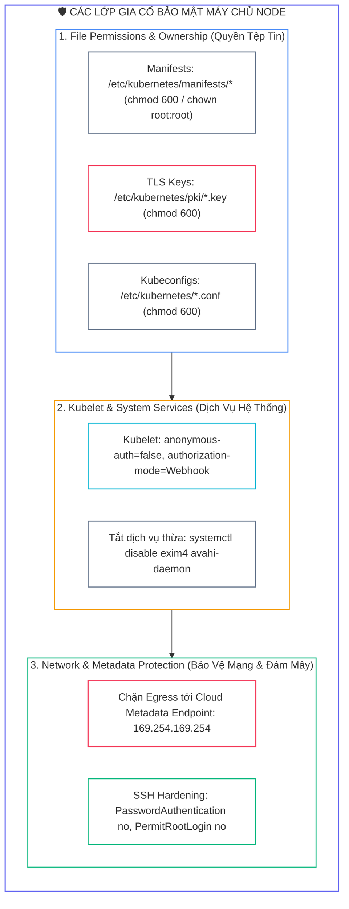
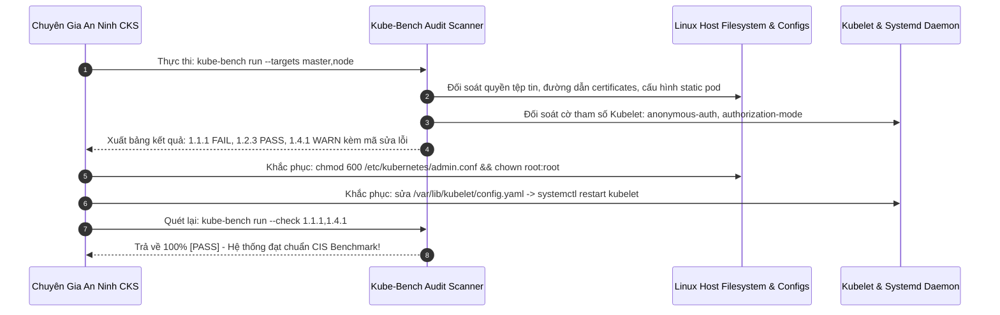
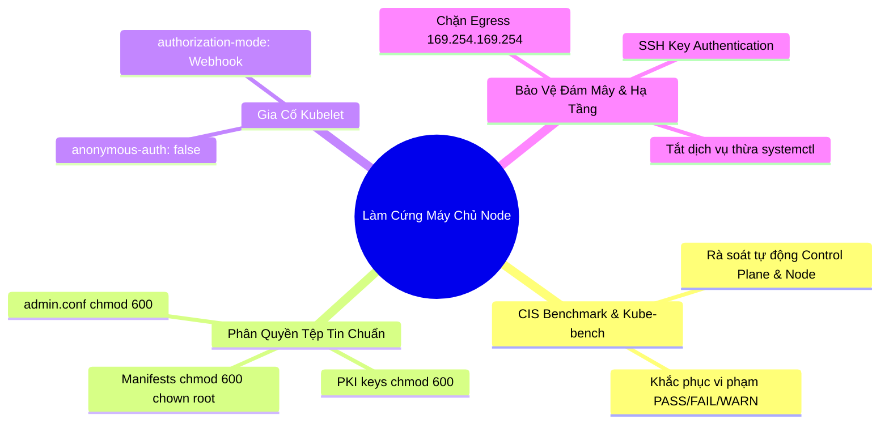


> [!IMPORTANT]
> **Mục tiêu kỹ thuật bài học**:
> - Thấu hiểu các khuyến nghị an ninh trong bộ tiêu chuẩn quốc tế **CIS Kubernetes Benchmark**.
> - Cài đặt và thực thi công cụ **`kube-bench`** để quét toàn bộ Control Plane và Worker Nodes, phân tích các chỉ số `PASS`, `FAIL`, và `WARN`.
> - Thực hành chuẩn hóa quyền sở hữu (**`chown root:root`**) và quyền truy cập tệp tin (**`chmod 600 / 644`**) cho các tệp nhạy cảm:
>   - Static Pod manifests (`/etc/kubernetes/manifests/*.yaml`).
>   - Tệp cấu hình quản trị (`admin.conf`, `kubelet.conf`, `controller-manager.conf`, `scheduler.conf`).
>   - Thư mục chứng chỉ TLS (`/etc/kubernetes/pki/*`).
>   - Thư mục dữ liệu etcd (`/var/lib/etcd`).
> - Tắt bỏ các dịch vụ nền systemd và đóng các cổng mạng không sử dụng.
> - Thiết lập rào chắn tường lửa / NetworkPolicy chặn đứng truy cập trái phép tới **Cloud Metadata Endpoint (`169.254.169.254`)**.

---

## 1. Bản Chất Kiến Trúc & Tư Duy Cốt Lõi: Làm Cứng Máy Chủ Nền Tảng (Host Node Hardening)

Mọi container trong Kubernetes dù được cấu hình cách ly tốt đến đâu thì về bản chất vẫn là các **tiến trình Linux thông thường (Linux Processes)** chạy trực tiếp trên nhân hệ điều hành của Host Node. Nếu hệ điều hành máy chủ bị cấu hình lỏng lẻo—ví dụ: tệp tin cấu hình `admin.conf` để quyền `777` cho mọi người dùng đọc được, các cổng debug bị mở công khai, hoặc máy chủ chứa các dịch vụ rác—kẻ tấn công có thể dễ dàng leo thang đặc quyền từ một Pod bị xâm nhập lên quyền quản trị viên cao nhất của Node.

Tổ chức phi lợi nhuận **Center for Internet Security (CIS)** đã phát triển bộ quy chuẩn **CIS Kubernetes Benchmark**—bộ tài liệu hướng dẫn chi tiết từng tham số cấu hình, cờ bảo mật và quyền hạn tệp tin chuẩn mực cho toàn bộ hệ sinh thái Kubernetes. Để tự động hóa việc đối soát các quy chuẩn này, công cụ mã nguồn mở **`kube-bench`** (do Aqua Security phát triển) được sử dụng chính thức trong chương trình đào tạo và khảo thí CKS.



---

## 2. Bảng Ma Trận So Sánh Kỹ Thuật Toàn Diện (Engineering Matrix)

Bảng ma trận quy chuẩn phân quyền tệp tin và cờ tham số theo tiêu chuẩn **CIS Benchmark v1.8+**:

| Tệp Tin / Thư Mục Mục Tiêu | Quyền Hạn Chuẩn (`chmod`) | Quyền Sở Hữu (`chown`) | Mục Đích An Ninh | Hậu Quả Nếu Cấu Hình Sai |
| :--- | :---: | :---: | :--- | :--- |
| **`/etc/kubernetes/manifests/*.yaml`** | `600` hoặc `644` | `root:root` | Bảo vệ định nghĩa Static Pod Control Plane | Kẻ tấn công sửa manifest để chèn backdoor |
| **`/etc/kubernetes/pki/*.key`** | `600` | `root:root` | Bảo vệ các khóa mã hóa TLS riêng tư | Bị giả mạo danh tính Root CA / Admin |
| **`/etc/kubernetes/pki/*.crt`** | `644` | `root:root` | Chứng chỉ công khai cho phép đọc | Không nguy hiểm nhưng cần bảo vệ |
| **`/etc/kubernetes/admin.conf`** | `600` | `root:root` | Chứng chỉ cụm quyền `system:masters` | Chiếm toàn quyền quản trị cụm (Cluster Admin) |
| **`/var/lib/etcd`** | `700` | `etcd:etcd` hoặc `root:root` | Thư mục cơ sở dữ liệu etcd vật lý | Trích xuất toàn bộ Secret dạng raw database |
| **`/var/lib/kubelet/config.yaml`** | `600` hoặc `644` | `root:root` | Cấu hình bảo mật Kubelet daemon | Bị tắt xác thực hoặc mở cổng anonymous |

---

## 3. Kiến Trúc Môi Trường & Luồng Thực Thi Mẫu

Quy trình tự động hóa kiểm toán và khắc phục vi phạm bằng `kube-bench` được mô hình hóa qua Sequence Diagram sau:



---

## 4. Phân Tích Cạm Bẫy Thực Chiến: Đánh Cắp Cloud IAM Role Credentials Qua Metadata Endpoint `169.254.169.254`

### Tình Huống Sự Cố Thực Tế:
<span class="badge badge--rose">🕒 06:10 PM</span> Một ứng dụng công khai bị dính lỗ hổng SSRF (Server-Side Request Forgery). Kẻ tấn công gửi request từ container tới địa chỉ IP liên kết nội bộ đám mây `http://169.254.169.254/latest/meta-data/iam/security-credentials/`. Do Node không có rào chắn mạng ngăn chặn, container trích xuất thành công **AWS IAM Temporary Credentials** của máy chủ Node, từ đó chiếm quyền kiểm soát toàn bộ hạ tầng đám mây S3 Buckets và Database ngoài cụm.

### Hậu Quả & Log Lỗi Thực Tế:
```text
================================================================================
CRITICAL CLOUD INFRASTRUCTURE BREACH: METADATA ENDPOINT EXPLOITATION (SSRF)
================================================================================
[ALERT] 2026-09-12T18:10:45.312Z AWS CloudTrail Security Audit:
EventName: AssumeRole / GetSessionToken
UserAgent: aws-cli/2.15.0 Python/3.11.2 Linux/5.15.0-generic
SourceIPAddress: 198.51.100.77 (Attacker Public IP)
Stolen Role: arn:aws:iam::123456789012:role/k8s-worker-node-role

>> THREAT FORENSICS SYSTEM LOGS:
Container PID 9812 executed: curl -s http://169.254.169.254/latest/meta-data/iam/security-credentials/k8s-node-role
Response: {"Code":"Success","AccessKeyId":"ASIA...","SecretAccessKey":"wJalr...","Token":"IQoJb..."}

[CONCLUSION] An unisolated container successfully queried the Cloud Metadata Service,
leading to complete takeover of Cloud IAM administrative permissions!
================================================================================
```

### 5-Whys Root Cause Analysis:
1. <span class="badge badge--primary">Why 1</span> **Tại sao tin tặc lấy được AccessKey và SecretKey của tài khoản AWS?** $\rightarrow$ Do tin tặc gửi request từ bên trong container tới địa chỉ IP Cloud Metadata `169.254.169.254`.
2. <span class="badge badge--primary">Why 2</span> **Tại sao container lại có thể kết nối được tới địa chỉ IP này?** $\rightarrow$ Vì địa chỉ `169.254.169.254` là địa chỉ Link-Local nội bộ, mạng Kubernetes mặc định cho phép mọi Pod kết nối ra ngoài qua NAT.
3. <span class="badge badge--primary">Why 3</span> **Tại sao ứng dụng lại cần lấy thông tin IAM của Node?** $\rightarrow$ Bản thân ứng dụng không cần, chỉ có tiến trình máy chủ vật lý mới cần để quản lý hạ tầng.
4. <span class="badge badge--primary">Why 4</span> **Tại sao không có rào chắn chặn luồng traffic này?** $\rightarrow$ Do kỹ sư chưa thiết lập NetworkPolicy cấm Egress hoặc chưa thiết lập quy tắc iptables trên Node để chặn các gói tin xuất phát từ dải mạng Pod IP tới `169.254.169.254`.
5. <span class="badge badge--emerald">Root Cause Remedy</span> **Biện pháp khắc phục chuẩn CKS (2 cấp độ):**
   - <span class="badge badge--emerald">Cấp độ NetworkPolicy:</span> Cấm Egress tới IP `169.254.169.254/32` cho toàn bộ các Pod ứng dụng thông thường.
   - <span class="badge badge--cyan">Cấp độ Tường Lửa Host (iptables):</span>
     ```bash
     sudo iptables -A OUTPUT -m tcp -p tcp -d 169.254.169.254 --dport 80 -m owner ! --uid-owner root -j DROP
     ```
   - <span class="badge badge--primary">Kích Hoạt IMDSv2 (Nếu dùng AWS):</span> Ép buộc sử dụng Token phiên làm việc với cờ `HttpTokens=required` và `HttpPutResponseHopLimit=1` để gói tin không thể nhảy qua cầu mạng container bridge.

---

## 5. Hands-on Lab: Chạy Kube-Bench, Khắc Phục Lỗi CIS & Khóa Chặt Node (8 Bước)

| Bước | Mục Tiêu Kỹ Thuật | Đầu Ra Kiểm Tra |
| :---: | :--- | :--- |
| **1** | Cài đặt và thực thi công cụ `kube-bench` trên Control Plane | Báo cáo kiểm toán CIS Benchmark ban đầu |
| **2** | Kiểm tra danh sách các mục bị `[FAIL]` trong báo cáo | Nhận diện các vi phạm phân quyền và cờ tham số |
| **3** | Phân quyền an toàn chuẩn CIS cho các Static Pod manifests | `chmod 600` và `chown root:root` tại `/etc/kubernetes/manifests/` |
| **4** | Phân quyền an toàn cho tệp cấu hình `admin.conf` và PKI keys | `chmod 600` cho `admin.conf` và các tệp `.key` |
| **5** | Khắc phục cấu hình Kubelet (Tắt anonymous-auth) | Tệp `/var/lib/kubelet/config.yaml` chứa `anonymous: {enabled: false}` |
| **6** | Vô hiệu hóa các dịch vụ hệ thống thừa trên Node | Tắt các dịch vụ `systemctl stop/disable` không dùng |
| **7** | Tạo NetworkPolicy chặn truy cập Cloud Metadata `169.254.169.254` | Pod bị timeout khi curl tới metadata IP |
| **8** | Chạy lại `kube-bench` xác nhận 100% kết quả chuyển sang `[PASS]` | Báo cáo hoàn tất đạt chuẩn an ninh CIS |

### Bước 1: Chạy `kube-bench` Kiểm Toán Control Plane

```bash
# Chạy kube-bench quét toàn bộ mục tiêu master/controlplane
kube-bench run --targets master
```

### Bước 2: Xem Chi Tiết Các Mục Thất Bại (FAIL)

```bash
kube-bench run --targets master --check 1.1.1,1.1.11,1.1.12,1.2.1
```

### Bước 3: Khắc Phục Phân Quyền Static Pod Manifests (`/etc/kubernetes/manifests`)

```bash
sudo chown -R root:root /etc/kubernetes/manifests/
sudo chmod 600 /etc/kubernetes/manifests/*.yaml

# Kiểm tra lại phân quyền
ls -la /etc/kubernetes/manifests/
```

### Bước 4: Khắc Phục Phân Quyền Tệp Cấu Hình Quản Trị & Khóa PKI

```bash
# Phân quyền các tệp cấu hình *.conf
sudo chown root:root /etc/kubernetes/*.conf
sudo chmod 600 /etc/kubernetes/*.conf

# Phân quyền các khóa TLS PKI
sudo chown -R root:root /etc/kubernetes/pki/
sudo chmod 600 /etc/kubernetes/pki/*.key
sudo chmod 644 /etc/kubernetes/pki/*.crt
```

### Bước 5: Gia Cố Cấu Hình Kubelet (`/var/lib/kubelet/config.yaml`)

Chỉnh sửa tệp `/var/lib/kubelet/config.yaml` để vô hiệu hóa truy cập ẩn danh:

```yaml
authentication:
  anonymous:
    enabled: false
  webhook:
    enabled: true
authorization:
  mode: Webhook
```

Khởi động lại dịch vụ Kubelet để áp dụng:

```bash
sudo systemctl daemon-reload
sudo systemctl restart kubelet
sudo systemctl status kubelet
```

### Bước 6: Vô Hiệu Hóa Các Dịch Vụ Hệ Thống Thừa Trên Node

```bash
# Ví dụ tắt dịch vụ in ấn cups hoặc dịch vụ thư không dùng
sudo systemctl stop cups 2>/dev/null || true
sudo systemctl disable cups 2>/dev/null || true
```

### Bước 7: Tạo NetworkPolicy Chặn Truy Cập Cloud Metadata `169.254.169.254`

```bash
cat <<EOF | kubectl apply -f -
apiVersion: networking.k8s.io/v1
kind: NetworkPolicy
metadata:
  name: block-cloud-metadata
  namespace: default
spec:
  podSelector: {}
  policyTypes:
  - Egress
  egress:
  # Mở DNS UDP/TCP 53
  - to:
    - namespaceSelector: {}
    ports:
    - protocol: UDP
      port: 53
    - protocol: TCP
      port: 53
  # Mở toàn bộ Internet/Cluster NHƯNG NGOẠI TRỪ Cloud Metadata IP 169.254.169.254
  - to:
    - ipBlock:
        cidr: 0.0.0.0/0
        except:
        - 169.254.169.254/32
EOF
```

### Bước 8: Chạy Lại `kube-bench` Xác Nhận 100% PASS

```bash
kube-bench run --targets master --check 1.1.1,1.1.11,1.1.12,1.2.1

echo ">> [VERIFIED] Chuc mung ban da lam cung Node va dat 100% CIS Benchmark theo chuan CKS!"
```

---

## 6. 10 Câu Hỏi Tự Kiểm Tra Chuyên Sâu (Self-Check Q&A Accordion)

<details class="qa-card">
<summary class="qa-summary">
  <div class="qa-summary-left">
    <span class="qa-num-badge">Q01</span>
    <span>Tại sao chuẩn CIS Benchmark yêu cầu tệp `/etc/kubernetes/admin.conf` phải có phân quyền `600` và sở hữu bởi `root:root`?</span>
  </div>
  <span class="qa-chevron">
    <svg width="18" height="18" fill="none" stroke="currentColor" stroke-width="2.5" viewBox="0 0 24 24"><polyline points="6 9 12 15 18 9"></polyline></svg>
  </span>
</summary>
<div class="qa-answer">
  <div class="qa-answer-header">
    <svg width="14" height="14" fill="none" stroke="currentColor" stroke-width="2" viewBox="0 0 24 24"><path d="M22 11.08V12a10 10 0 1 1-5.93-9.14"></path><polyline points="22 4 12 14.01 9 11.01"></polyline></svg>
    <span>Phân Tích &amp; Lời Giải Kỹ Thuật</span>
  </div>
  <div style="margin-bottom: 8px;">Tệp <code>admin.conf</code> chứa chứng chỉ TLS và khóa riêng tư của nhóm người dùng đặc quyền tối cao <b style="color: var(--accent-rose);">system:masters</b> (Cluster Admin). Nếu bất kỳ người dùng không phải root nào trên máy chủ có thể đọc được tệp này (ví dụ quyền 644 hoặc 777), họ có thể sao chép chứng chỉ và chiếm toàn quyền kiểm soát cụm Kubernetes.</div>
</div>
</details>

<details class="qa-card">
<summary class="qa-summary">
  <div class="qa-summary-left">
    <span class="qa-num-badge">Q02</span>
    <span>Làm thế nào để chạy `kube-bench` chỉ quét riêng một nhóm mục kiểm tra cụ thể (ví dụ nhóm kiểm tra Worker Node 4.1 và 4.2)?</span>
  </div>
  <span class="qa-chevron">
    <svg width="18" height="18" fill="none" stroke="currentColor" stroke-width="2.5" viewBox="0 0 24 24"><polyline points="6 9 12 15 18 9"></polyline></svg>
  </span>
</summary>
<div class="qa-answer">
  <div class="qa-answer-header">
    <svg width="14" height="14" fill="none" stroke="currentColor" stroke-width="2" viewBox="0 0 24 24"><path d="M22 11.08V12a10 10 0 1 1-5.93-9.14"></path><polyline points="22 4 12 14.01 9 11.01"></polyline></svg>
    <span>Phân Tích &amp; Lời Giải Kỹ Thuật</span>
  </div>
  <div style="margin-bottom: 8px;">Sử dụng cờ <code>--check</code> hoặc <code>--section</code>: <b style="color: var(--accent-primary);">kube-bench run --targets node --check 4.1.1,4.1.2,4.2.1</b> (hoặc <code>--section 4.1,4.2</code>).</div>
</div>
</details>

<details class="qa-card">
<summary class="qa-summary">
  <div class="qa-summary-left">
    <span class="qa-num-badge">Q03</span>
    <span>Tại sao cần thiết lập `anonymous-auth: false` trong cấu hình Kubelet `/var/lib/kubelet/config.yaml`?</span>
  </div>
  <span class="qa-chevron">
    <svg width="18" height="18" fill="none" stroke="currentColor" stroke-width="2.5" viewBox="0 0 24 24"><polyline points="6 9 12 15 18 9"></polyline></svg>
  </span>
</summary>
<div class="qa-answer">
  <div class="qa-answer-header">
    <svg width="14" height="14" fill="none" stroke="currentColor" stroke-width="2" viewBox="0 0 24 24"><path d="M22 11.08V12a10 10 0 1 1-5.93-9.14"></path><polyline points="22 4 12 14.01 9 11.01"></polyline></svg>
    <span>Phân Tích &amp; Lời Giải Kỹ Thuật</span>
  </div>
  <div style="margin-bottom: 8px;">Nếu bật <code>anonymous-auth: true</code>, bất kỳ ai truy cập được cổng mạng Kubelet <code>10250</code> trên Node đều có thể gửi request nặc danh dạng <code>system:anonymous</code> để thực thi lệnh (exec) hoặc đọc log của mọi container trên Node đó mà không cần bất kỳ mật khẩu hay chứng chỉ nào. Tắt anonymous-auth <b style="color: var(--accent-emerald);">bắt buộc mọi kết nối tới Kubelet phải được xác thực</b>.</div>
</div>
</details>

<details class="qa-card">
<summary class="qa-summary">
  <div class="qa-summary-left">
    <span class="qa-num-badge">Q04</span>
    <span>Địa chỉ IP `169.254.169.254` là gì và tại sao nó lại là mục tiêu tấn công hàng đầu trên môi trường điện toán đám mây?</span>
  </div>
  <span class="qa-chevron">
    <svg width="18" height="18" fill="none" stroke="currentColor" stroke-width="2.5" viewBox="0 0 24 24"><polyline points="6 9 12 15 18 9"></polyline></svg>
  </span>
</summary>
<div class="qa-answer">
  <div class="qa-answer-header">
    <svg width="14" height="14" fill="none" stroke="currentColor" stroke-width="2" viewBox="0 0 24 24"><path d="M22 11.08V12a10 10 0 1 1-5.93-9.14"></path><polyline points="22 4 12 14.01 9 11.01"></polyline></svg>
    <span>Phân Tích &amp; Lời Giải Kỹ Thuật</span>
  </div>
  <div style="margin-bottom: 8px;"><code>169.254.169.254</code> là địa chỉ mạng Link-Local Metadata Service trên các nền tảng Cloud (AWS, GCP, Azure, OpenStack). Nó cung cấp siêu dữ liệu máy chủ và đặc biệt là <b style="color: var(--accent-rose);">thông tin xác thực quyền hạn IAM Role của Node</b>. Nếu container độc hại gọi được tới IP này, chúng có thể lấy trộm AccessKey để tấn công toàn bộ tài khoản Cloud.</div>
</div>
</details>

<details class="qa-card">
<summary class="qa-summary">
  <div class="qa-summary-left">
    <span class="qa-num-badge">Q05</span>
    <span>Sự khác biệt về quyền hạn chuẩn giữa các tệp khóa riêng tư `*.key` và tệp chứng chỉ công khai `*.crt` trong `/etc/kubernetes/pki/` là gì?</span>
  </div>
  <span class="qa-chevron">
    <svg width="18" height="18" fill="none" stroke="currentColor" stroke-width="2.5" viewBox="0 0 24 24"><polyline points="6 9 12 15 18 9"></polyline></svg>
  </span>
</summary>
<div class="qa-answer">
  <div class="qa-answer-header">
    <svg width="14" height="14" fill="none" stroke="currentColor" stroke-width="2" viewBox="0 0 24 24"><path d="M22 11.08V12a10 10 0 1 1-5.93-9.14"></path><polyline points="22 4 12 14.01 9 11.01"></polyline></svg>
    <span>Phân Tích &amp; Lời Giải Kỹ Thuật</span>
  </div>
  <div style="margin-bottom: 8px;"><b style="color: var(--accent-rose);">Tệp *.key (Private Key):</b> Bắt buộc phải là <b style="color: var(--accent-primary);">600</b> (chỉ duy nhất root được đọc và ghi) để chống lộ khóa bí mật. <b style="color: var(--accent-emerald);">Tệp *.crt (Public Certificate):</b> Có thể phân quyền <b style="color: var(--accent-cyan);">644</b> (root ghi, các tiến trình khác được phép đọc) vì chứng chỉ công khai không chứa thông tin bí mật.</div>
</div>
</details>

<details class="qa-card">
<summary class="qa-summary">
  <div class="qa-summary-left">
    <span class="qa-num-badge">Q06</span>
    <span>Làm thế nào để kiểm tra danh sách tất cả các cổng mạng TCP đang mở trên máy chủ Linux Node?</span>
  </div>
  <span class="qa-chevron">
    <svg width="18" height="18" fill="none" stroke="currentColor" stroke-width="2.5" viewBox="0 0 24 24"><polyline points="6 9 12 15 18 9"></polyline></svg>
  </span>
</summary>
<div class="qa-answer">
  <div class="qa-answer-header">
    <svg width="14" height="14" fill="none" stroke="currentColor" stroke-width="2" viewBox="0 0 24 24"><path d="M22 11.08V12a10 10 0 1 1-5.93-9.14"></path><polyline points="22 4 12 14.01 9 11.01"></polyline></svg>
    <span>Phân Tích &amp; Lời Giải Kỹ Thuật</span>
  </div>
  <div style="margin-bottom: 8px;">Sử dụng lệnh: <b style="color: var(--accent-primary);">sudo ss -tulpn</b> (hoặc <code>sudo netstat -tulpn</code>). Đầu ra sẽ liệt kê chi tiết cổng mạng, tiến trình sở hữu (Process Name và PID) đang lắng nghe kết nối.</div>
</div>
</details>

<details class="qa-card">
<summary class="qa-summary">
  <div class="qa-summary-left">
    <span class="qa-num-badge">Q07</span>
    <span>Tại sao cần cấu hình `authorization-mode: Webhook` cho Kubelet thay vì `authorization-mode: AlwaysAllow`?</span>
  </div>
  <span class="qa-chevron">
    <svg width="18" height="18" fill="none" stroke="currentColor" stroke-width="2.5" viewBox="0 0 24 24"><polyline points="6 9 12 15 18 9"></polyline></svg>
  </span>
</summary>
<div class="qa-answer">
  <div class="qa-answer-header">
    <svg width="14" height="14" fill="none" stroke="currentColor" stroke-width="2" viewBox="0 0 24 24"><path d="M22 11.08V12a10 10 0 1 1-5.93-9.14"></path><polyline points="22 4 12 14.01 9 11.01"></polyline></svg>
    <span>Phân Tích &amp; Lời Giải Kỹ Thuật</span>
  </div>
  <div style="margin-bottom: 8px;">Nếu để <code>AlwaysAllow</code>, bất kỳ request nào vượt qua bước xác thực đều được thực thi toàn quyền trên Kubelet. Thiết lập <code>authorization-mode: Webhook</code> chỉ đạo Kubelet gửi truy vấn SubjectAccessReview về <code>kube-apiserver</code> để <b style="color: var(--accent-emerald);">đối soát quyền hạn RBAC chính thức</b> trước khi cho phép tương tác với Pod/Node.</div>
</div>
</details>

<details class="qa-card">
<summary class="qa-summary">
  <div class="qa-summary-left">
    <span class="qa-num-badge">Q08</span>
    <span>Lệnh nào dùng để dừng ngay lập tức và ngăn không cho một dịch vụ systemd tự khởi động lại khi reboot máy?</span>
  </div>
  <span class="qa-chevron">
    <svg width="18" height="18" fill="none" stroke="currentColor" stroke-width="2.5" viewBox="0 0 24 24"><polyline points="6 9 12 15 18 9"></polyline></svg>
  </span>
</summary>
<div class="qa-answer">
  <div class="qa-answer-header">
    <svg width="14" height="14" fill="none" stroke="currentColor" stroke-width="2" viewBox="0 0 24 24"><path d="M22 11.08V12a10 10 0 1 1-5.93-9.14"></path><polyline points="22 4 12 14.01 9 11.01"></polyline></svg>
    <span>Phân Tích &amp; Lời Giải Kỹ Thuật</span>
  </div>
  <div style="margin-bottom: 8px;">Sử dụng kết hợp: <b style="color: var(--accent-primary);">sudo systemctl stop &lt;service-name&gt;</b> và <b style="color: var(--accent-rose);">sudo systemctl disable &lt;service-name&gt;</b> (hoặc dùng <code>systemctl mask &lt;service-name&gt;</code> để khóa hoàn toàn).</div>
</div>
</details>

<details class="qa-card">
<summary class="qa-summary">
  <div class="qa-summary-left">
    <span class="qa-num-badge">Q09</span>
    <span>Thư mục `/var/lib/etcd` theo chuẩn CIS Benchmark bắt buộc phải có phân quyền và người sở hữu như thế nào?</span>
  </div>
  <span class="qa-chevron">
    <svg width="18" height="18" fill="none" stroke="currentColor" stroke-width="2.5" viewBox="0 0 24 24"><polyline points="6 9 12 15 18 9"></polyline></svg>
  </span>
</summary>
<div class="qa-answer">
  <div class="qa-answer-header">
    <svg width="14" height="14" fill="none" stroke="currentColor" stroke-width="2" viewBox="0 0 24 24"><path d="M22 11.08V12a10 10 0 1 1-5.93-9.14"></path><polyline points="22 4 12 14.01 9 11.01"></polyline></svg>
    <span>Phân Tích &amp; Lời Giải Kỹ Thuật</span>
  </div>
  <div style="margin-bottom: 8px;">Thư mục <code>/var/lib/etcd</code> bắt buộc phải có quyền: <b style="color: var(--accent-primary);">chmod 700</b> (chỉ duy nhất chủ sở hữu được đọc/ghi/thực thi) và sở hữu bởi <b style="color: var(--accent-emerald);">etcd:etcd</b> hoặc <code>root:root</code> tùy theo cách triển khai cụm.</div>
</div>
</details>

<details class="qa-card">
<summary class="qa-summary">
  <div class="qa-summary-left">
    <span class="qa-num-badge">Q10</span>
    <span>Hai thiết lập an ninh SSH bắt buộc trong tệp `/etc/ssh/sshd_config` trên toàn bộ các máy chủ Kubernetes Node là gì?</span>
  </div>
  <span class="qa-chevron">
    <svg width="18" height="18" fill="none" stroke="currentColor" stroke-width="2.5" viewBox="0 0 24 24"><polyline points="6 9 12 15 18 9"></polyline></svg>
  </span>
</summary>
<div class="qa-answer">
  <div class="qa-answer-header">
    <svg width="14" height="14" fill="none" stroke="currentColor" stroke-width="2" viewBox="0 0 24 24"><path d="M22 11.08V12a10 10 0 1 1-5.93-9.14"></path><polyline points="22 4 12 14.01 9 11.01"></polyline></svg>
    <span>Phân Tích &amp; Lời Giải Kỹ Thuật</span>
  </div>
  <div style="margin-bottom: 8px;">2 thiết lập bắt buộc gồm: (1) <b style="color: var(--accent-rose);">PasswordAuthentication no</b> (ép buộc dùng SSH Key, chống brute-force mật khẩu); và (2) <b style="color: var(--accent-primary);">PermitRootLogin no</b> (cấm đăng nhập trực tiếp bằng tài khoản root từ xa).</div>
</div>
</details>

---

## 7. Tổng Kết & Lộ Trình Bài Học Tiếp Theo



Gia cố **Hệ điều hành máy chủ Node** theo chuẩn **CIS Benchmark** tạo nên bệ phóng an toàn vững chắc cho toàn bộ cụm Kubernetes.

> [!TIP]
> **BÀI HỌC TIẾP THEO:**
> Trong **[[Bài 10] Tối Thiểu Hóa Đặc Quyền RBAC: Role, ClusterRole, ServiceAccount & Projected Tokens](cks-10-10-rbac-toi-thieu-quyen.html)**, chúng ta sẽ chuyển sang tầng phân quyền người dùng và tiến trình: Áp dụng nguyên tắc Least Privilege, kiểm toán quyền hạn qua `kubectl auth can-i`, và quản lý vòng đời ngắn hạn của ServiceAccount Projected Tokens.

