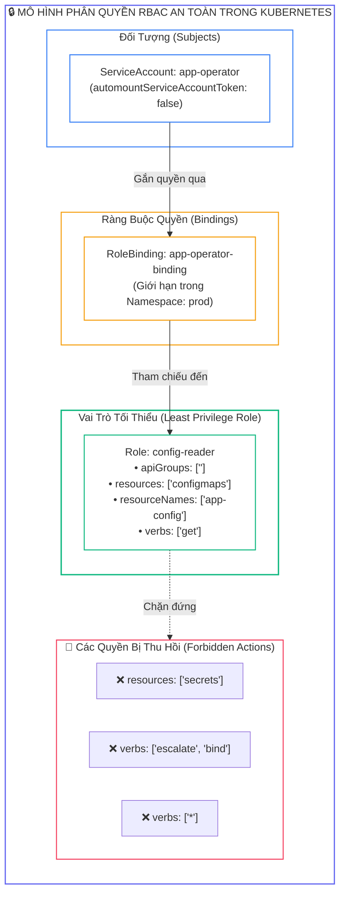
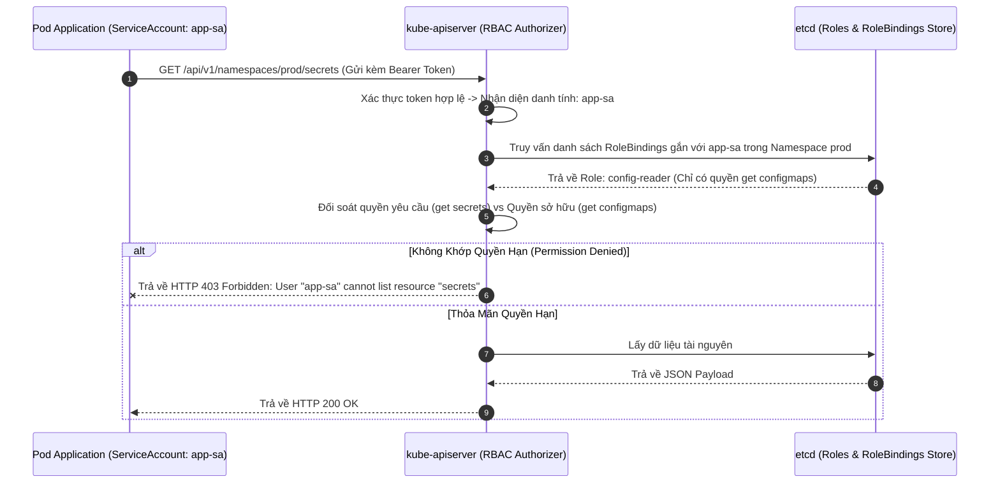
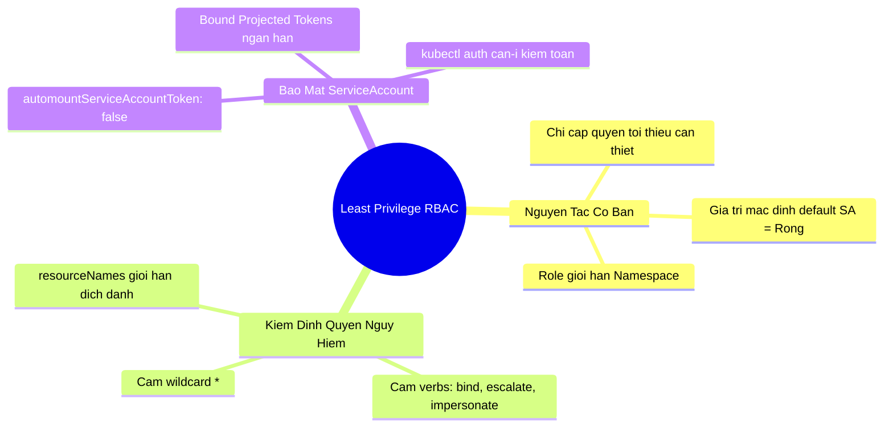


> [!IMPORTANT]
> **Mục tiêu kỹ thuật bài học**:
> - Thấu hiểu nguyên tắc **Least Privilege (Tối thiểu đặc quyền)** và mô hình phân quyền dựa trên vai trò (**Role-Based Access Control - RBAC**).
> - Nhận diện và triệt tiêu các quyền hạn leo thang nguy hiểm hàng đầu:
>   - Quyền gán vai trò (`verbs: ["bind"]`) và leo thang vai trò (`verbs: ["escalate"]`).
>   - Quyền mạo danh danh tính khác (`verbs: ["impersonate"]`).
>   - Quyền đọc toàn bộ thông tin bí mật (`resources: ["secrets"]`, `verbs: ["get", "list"]`).
>   - Quyền tạo Pod/Workload (`resources: ["pods", "deployments"]`, `verbs: ["create"]`) dẫn đến leo thang quyền truy cập Node.
> - Vô hiệu hóa tính năng tự động gắn token **`automountServiceAccountToken: false`** trên ServiceAccount và Pod spec.
> - Nắm vững cơ chế **Bound / Projected ServiceAccount Tokens** với thời gian sống ngắn hạn (**Time-to-Live - TTL**) và gắn chặt với vòng đời Pod.
> - Kiểm toán và đối soát phân quyền nhanh chóng bằng lệnh **`kubectl auth can-i`**.

---

## 1. Bản Chất Kiến Trúc & Tư Duy Cốt Lõi: Nguyên Tắc Tối Thiểu Quyền (Least Privilege RBAC)

Trong Kubernetes, hệ thống **RBAC (Role-Based Access Control)** điều phối việc ai (Subject: User, Group, ServiceAccount) được phép làm gì (Verbs: `get`, `list`, `create`, `delete`...) trên tài nguyên nào (Resources: `pods`, `secrets`, `nodes`...).

Một sai lầm phổ biến nhưng cực kỳ nguy hiểm của các kỹ sư phát triển là thói quen gán vai trò `cluster-admin` hoặc sử dụng ký tự đại diện (*Wildcard*) `verbs: ["*"]`, `resources: ["*"]` để ứng dụng "chạy cho tiện". Nếu một Pod sử dụng ServiceAccount có quyền quá rộng bị tin tặc chiếm quyền điều khiển, chúng có thể trích xuất token tại `/var/run/secrets/kubernetes.io/serviceaccount/token` và sử dụng token đó để kiểm soát toàn bộ cụm.

Chuẩn an ninh **CKS** đòi hỏi mọi tài khoản dịch vụ phải tuân thủ nghiêm ngặt **Nguyên tắc Tối thiểu Quyền (Principle of Least Privilege)**: Chỉ cấp phát quyền hạn vừa đủ cho mục đích hoạt động, giới hạn trong phạm vi Namespace, và thu hồi quyền ngay khi không còn sử dụng.



---

## 2. Bảng Ma Trận So Sánh Kỹ Thuật Toàn Diện (Engineering Matrix)

Ma trận các quyền hạn có rủi ro leo thang đặc quyền cao nhất (**High-Risk Dangerous RBAC Permissions**):

| Quyền Hạn (Resource & Verbs) | Kịch Bản Kẻ Tấn Công Khai Thác (Exploit Mechanism) | Mức Độ Nguy Hiểm | Giải Pháp Khắc Phục Chuẩn CKS |
| :--- | :--- | :---: | :--- |
| **`resources: ["roles", "rolebindings"]`<br/>`verbs: ["bind"]`** | Gán vai trò `cluster-admin` có sẵn cho chính ServiceAccount của mình | <span class="badge badge--rose">CRITICAL</span> | Thu hồi quyền `bind`, chỉ cho phép quản trị viên cụm gán quyền |
| **`resources: ["roles", "clusterroles"]`<br/>`verbs: ["escalate"]`** | Tự sửa đổi Role hiện tại để thêm quyền hạn mà mình chưa từng có | <span class="badge badge--rose">CRITICAL</span> | Thu hồi quyền `escalate` khỏi các ứng dụng |
| **`resources: ["users", "serviceaccounts"]`<br/>`verbs: ["impersonate"]`** | Giả mạo danh tính `system:admin` để thực thi mọi lệnh API | <span class="badge badge--rose">CRITICAL</span> | Cấm tuyệt đối quyền `impersonate` trên môi trường ứng dụng |
| **`resources: ["secrets"]`<br/>`verbs: ["get", "list"]`** | Đọc trộm toàn bộ mật khẩu, token, private keys trong Namespace | <span class="badge badge--rose">CRITICAL</span> | Sử dụng `resourceNames: ["my-secret"]` chỉ định đích danh tệp |
| **`resources: ["pods"]`<br/>`verbs: ["create"]`** | Tạo Pod gắn `hostPath: /` hoặc `privileged: true` để thoát container | <span class="badge badge--amber">HIGH</span> | Kết hợp Pod Security Admission (Restricted) |
| **`resources: ["pods/exec"]`<br/>`verbs: ["create"]`** | Mở shell tương tác vào Pod khác để đánh cắp dữ liệu nội bộ | <span class="badge badge--amber">HIGH</span> | Chỉ cấp quyền cho kỹ sư Debug có ghi log kiểm toán |

---

## 3. Kiến Trúc Môi Trường & Luồng Thực Thi Mẫu

Khi một ServiceAccount gửi yêu cầu tương tác với API Server, chu trình đánh giá phân quyền RBAC được mô hình hóa qua Sequence Diagram sau:



---

## 4. Phân Tích Cạm Bẫy Thực Chiến: Đánh Cắp ServiceAccount Token Mặc Định Và Leo Thang Lên Cluster-Admin

### Tình Huống Sự Cố Thực Tế:
<span class="badge badge--rose">🕒 05:15 PM</span> Một ứng dụng Nginx tĩnh phục vụ trang giới thiệu công ty bị kẻ tấn công khai thác lỗ hổng Remote Code Execution. Do kỹ sư không cấu hình `automountServiceAccountToken: false`, Kubelet tự động gắn ServiceAccount mặc định (`default`) vào Pod. Đáng tiếc hơn, ServiceAccount `default` trước đó đã bị một lập trình viên gán nhầm vào `ClusterRoleBinding: cluster-admin`. Kẻ tấn công trích xuất token và xóa sạch toàn bộ cụm dữ liệu Production.

### Hậu Quả & Log Lỗi Thực Tế:
```text
================================================================================
CRITICAL SECURITY AUDIT LOG: UNAUTHORIZED CLUSTER-ADMIN DESTRUCTION VIA SA TOKEN
================================================================================
[ALERT] 2026-09-12T17:15:33.890Z kube-apiserver audit trail:
{
  "user": {"username": "system:serviceaccount:default:default", "groups": ["system:serviceaccounts"]},
  "verb": "deletecollection",
  "requestURI": "/api/v1/namespaces/production/persistentvolumeclaims",
  "responseStatus": {"code": 200},
  "sourceIPs": ["10.244.3.45"]
}

[FATAL] Pod PID 8912 inside 'marketing-nginx' executed:
TOKEN=$(cat /var/run/secrets/kubernetes.io/serviceaccount/token)
curl -k -H "Authorization: Bearer $TOKEN" https://kubernetes.default/api/v1/namespaces -X DELETE

[CONCLUSION] Total data loss occurred due to dangerous ClusterRoleBinding on default ServiceAccount
and failure to set automountServiceAccountToken: false on edge-facing Pods!
================================================================================
```

### 5-Whys Root Cause Analysis:
1. <span class="badge badge--primary">Why 1</span> **Tại sao toàn bộ dữ liệu cụm bị xóa sạch?** $\rightarrow$ Vì một request gửi tới API Server yêu cầu xóa Namespace với quyền `cluster-admin`.
2. <span class="badge badge--primary">Why 2</span> **Tại sao request đó lại có quyền cluster-admin?** $\rightarrow$ Vì nó sử dụng Bearer Token của ServiceAccount `default` nằm trong `ClusterRoleBinding: cluster-admin`.
3. <span class="badge badge--primary">Why 3</span> **Tại sao ServiceAccount default lại có quyền cluster-admin?** $\rightarrow$ Do kỹ sư cấu hình nhầm quyền toàn cục khi debug thay vì tạo ServiceAccount riêng biệt với Role tối thiểu.
4. <span class="badge badge--primary">Why 4</span> **Tại sao một Pod Nginx tĩnh lại có sẵn Token trong thư mục để bị đánh cắp?** $\rightarrow$ Vì Kubernetes mặc định tự động gắn Token (`automountServiceAccountToken: true`) vào mọi Pod nếu không được tắt tường minh.
5. <span class="badge badge--emerald">Root Cause Remedy</span> **Biện pháp khắc phục chuẩn CKS:**
   - <span class="badge badge--emerald">Vô Hiệu Hóa Automount Token:</span> Luôn luôn khai báo `automountServiceAccountToken: false` trên ServiceAccount và Pod manifest.
   - <span class="badge badge--cyan">Không Bao Giờ Gán Quyền Cho SA Default:</span> Giữ ServiceAccount `default` hoàn toàn rỗng không có quyền hạn.
   - <span class="badge badge--primary">Sử Dụng resourceNames Cụ Thể:</span> Khi cần đọc Secret, chỉ định đích danh tên Secret thay vì mở toàn bộ.

---

## 5. Hands-on Lab: Rà Soát RBAC, Thu Hồi Quyền Nguy Hiểm & Bảo Mật ServiceAccount (8 Bước)

| Bước | Mục Tiêu Kỹ Thuật | Đầu Ra Kiểm Tra |
| :---: | :--- | :--- |
| **1** | Tạo Namespace thử nghiệm `rbac-lab` | Namespace sẵn sàng để thử nghiệm |
| **2** | Tạo ServiceAccount bảo mật có `automountServiceAccountToken: false` | SA `secure-sa` với cờ tắt token |
| **3** | Tạo Role nguy hiểm ban đầu (Chứa quyền đọc toàn bộ Secrets) | Role `dangerous-role` chứa `resources: ["secrets"]` |
| **4** | Liên kết Role nguy hiểm với ServiceAccount qua RoleBinding | Gán quyền thành công |
| **5** | Kiểm toán quyền bằng `kubectl auth can-i` | Xác nhận SA có quyền đọc toàn bộ secrets (Rủi ro) |
| **6** | Thu hẹp quyền hạn: Tái cấu trúc Role sang chuẩn Least Privilege | Role `least-privilege-role` chỉ đọc `app-config` qua `resourceNames` |
| **7** | Triển khai Pod sử dụng ServiceAccount bảo mật | Pod không có thư mục `/var/run/secrets/...` |
| **8** | Kiểm định toàn diện ranh giới phân quyền | Hoàn tất xác thực chuẩn Least Privilege RBAC |

### Bước 1: Tạo Namespace Thử Nghiệm

```bash
kubectl create namespace rbac-lab
```

### Bước 2: Tạo ServiceAccount Vô Hiệu Hóa Automount Token

```bash
cat <<EOF | kubectl apply -f -
apiVersion: v1
kind: ServiceAccount
metadata:
  name: secure-sa
  namespace: rbac-lab
automountServiceAccountToken: false
EOF
```

### Bước 3: Tạo Role Nguy Hiểm Ban Đầu (Mô Hình Cần Khắc Phục)

```bash
cat <<EOF | kubectl apply -f -
apiVersion: rbac.authorization.k8s.io/v1
kind: Role
metadata:
  name: dangerous-role
  namespace: rbac-lab
rules:
# QUYỀN NGUY HIỂM: Cho phép đọc MỌI secret trong namespace
- apiGroups: [""]
  resources: ["secrets"]
  verbs: ["get", "list", "watch"]
EOF

# Gán Role cho ServiceAccount
kubectl create rolebinding dangerous-binding \
  --role=dangerous-role \
  --serviceaccount=rbac-lab:secure-sa \
  -n rbac-lab
```

### Bước 4: Kiểm Toán Quyền Hạn Bằng `kubectl auth can-i` (Phát Hiện Rủi Ro)

```bash
# Kiểm tra xem secure-sa có quyền đọc secrets không -> KẾT QUẢ: YES (Rủi ro!)
kubectl auth can-i get secrets -n rbac-lab --as=system:serviceaccount:rbac-lab:secure-sa
```

### Bước 5: Tạo Secret Mẫu Trong Namespace

```bash
kubectl create secret generic app-secret-safe --from-literal=key=safe -n rbac-lab
kubectl create secret generic db-secret-confidential --from-literal=pass=supersecret -n rbac-lab
```

### Bước 6: Tái Cấu Trúc Role Sang Chuẩn Least Privilege (Chỉ Định Đích Danh `resourceNames`)

```bash
cat <<EOF | kubectl apply -f -
apiVersion: rbac.authorization.k8s.io/v1
kind: Role
metadata:
  name: least-privilege-role
  namespace: rbac-lab
rules:
# CHUẨN LEAST PRIVILEGE: Chỉ cho phép đọc đúng tệp app-secret-safe
- apiGroups: [""]
  resources: ["secrets"]
  resourceNames: ["app-secret-safe"]
  verbs: ["get"]
EOF

# Cập nhật lại RoleBinding sang Role mới
kubectl create rolebinding least-privilege-binding \
  --role=least-privilege-role \
  --serviceaccount=rbac-lab:secure-sa \
  -n rbac-lab --dry-run=client -o yaml | kubectl apply -f -

# Xóa bỏ RoleBinding nguy hiểm cũ
kubectl delete rolebinding dangerous-binding -n rbac-lab
```

### Bước 7: Đối Soát Lại Ranh Giới Quyền Hạn Bằng `kubectl auth can-i`

```bash
# 1. Đọc secret an toàn app-secret-safe -> PHẢI LÀ YES
kubectl auth can-i get secret/app-secret-safe -n rbac-lab --as=system:serviceaccount:rbac-lab:secure-sa

# 2. Đọc secret mật db-secret-confidential -> PHẢI LÀ NO (Đã chặn thành công!)
kubectl auth can-i get secret/db-secret-confidential -n rbac-lab --as=system:serviceaccount:rbac-lab:secure-sa

# 3. Liệt kê toàn bộ secrets -> PHẢI LÀ NO
kubectl auth can-i list secrets -n rbac-lab --as=system:serviceaccount:rbac-lab:secure-sa
```

### Bước 8: Triển Khai Pod & Xác Nhận Không Bị Lộ Token

```bash
cat <<EOF | kubectl apply -f -
apiVersion: v1
kind: Pod
metadata:
  name: secure-sa-pod
  namespace: rbac-lab
spec:
  serviceAccountName: secure-sa
  automountServiceAccountToken: false
  containers:
  - name: app
    image: busybox:latest
    command: ["sleep", "3600"]
EOF

# Kiểm tra bên trong Pod: Thư mục token hoàn toàn KHÔNG tồn tại!
kubectl exec -it secure-sa-pod -n rbac-lab -- ls /var/run/secrets/kubernetes.io/serviceaccount/ || true

echo ">> [VERIFIED] Chuc mung ban da lam chu Least Privilege RBAC & ServiceAccount Security theo chuan CKS!"
```

---

## 6. 10 Câu Hỏi Tự Kiểm Tra Chuyên Sâu (Self-Check Q&A Accordion)

<details class="qa-card">
<summary class="qa-summary">
  <div class="qa-summary-left">
    <span class="qa-num-badge">Q01</span>
    <span>Sự khác biệt cốt lõi giữa `Role` và `ClusterRole` trong mô hình Kubernetes RBAC là gì?</span>
  </div>
  <span class="qa-chevron">
    <svg width="18" height="18" fill="none" stroke="currentColor" stroke-width="2.5" viewBox="0 0 24 24"><polyline points="6 9 12 15 18 9"></polyline></svg>
  </span>
</summary>
<div class="qa-answer">
  <div class="qa-answer-header">
    <svg width="14" height="14" fill="none" stroke="currentColor" stroke-width="2" viewBox="0 0 24 24"><path d="M22 11.08V12a10 10 0 1 1-5.93-9.14"></path><polyline points="22 4 12 14.01 9 11.01"></polyline></svg>
    <span>Phân Tích &amp; Lời Giải Kỹ Thuật</span>
  </div>
  <div style="margin-bottom: 8px;"><b style="color: var(--accent-primary);">Role:</b> Định nghĩa các quyền hạn bị giới hạn nghiêm ngặt bên trong một <b style="color: var(--accent-emerald);">Namespace cụ thể</b>. <b style="color: var(--accent-cyan);">ClusterRole:</b> Định nghĩa các quyền hạn trên phạm vi <b style="color: var(--accent-amber);">toàn bộ cụm (Cluster-wide)</b> hoặc áp dụng cho các tài nguyên không thuộc Namespace nào (như Nodes, PersistentVolumes, StorageClasses, CustomResourceDefinitions).</div>
</div>
</details>

<details class="qa-card">
<summary class="qa-summary">
  <div class="qa-summary-left">
    <span class="qa-num-badge">Q02</span>
    <span>Tại sao cần thiết lập `automountServiceAccountToken: false` cho các Pods không cần giao tiếp với Kubernetes API?</span>
  </div>
  <span class="qa-chevron">
    <svg width="18" height="18" fill="none" stroke="currentColor" stroke-width="2.5" viewBox="0 0 24 24"><polyline points="6 9 12 15 18 9"></polyline></svg>
  </span>
</summary>
<div class="qa-answer">
  <div class="qa-answer-header">
    <svg width="14" height="14" fill="none" stroke="currentColor" stroke-width="2" viewBox="0 0 24 24"><path d="M22 11.08V12a10 10 0 1 1-5.93-9.14"></path><polyline points="22 4 12 14.01 9 11.01"></polyline></svg>
    <span>Phân Tích &amp; Lời Giải Kỹ Thuật</span>
  </div>
  <div style="margin-bottom: 8px;">Nếu không tắt tính năng này, Kubelet sẽ tự động mount JWT Token và CA cert vào thư mục <code>/var/run/secrets/kubernetes.io/serviceaccount/</code> của container. Nếu container bị dính lỗ hổng bảo mật, kẻ tấn công có thể <b style="color: var(--accent-rose);">lấy trộm token này để gửi request trực tiếp tới API Server</b> nhằm quét mạng và leo thang quyền lực.</div>
</div>
</details>

<details class="qa-card">
<summary class="qa-summary">
  <div class="qa-summary-left">
    <span class="qa-num-badge">Q03</span>
    <span>Quyền `verbs: ["bind"]` trên tài nguyên `roles` hoặc `clusterroles` mang lại rủi ro an ninh gì?</span>
  </div>
  <span class="qa-chevron">
    <svg width="18" height="18" fill="none" stroke="currentColor" stroke-width="2.5" viewBox="0 0 24 24"><polyline points="6 9 12 15 18 9"></polyline></svg>
  </span>
</summary>
<div class="qa-answer">
  <div class="qa-answer-header">
    <svg width="14" height="14" fill="none" stroke="currentColor" stroke-width="2" viewBox="0 0 24 24"><path d="M22 11.08V12a10 10 0 1 1-5.93-9.14"></path><polyline points="22 4 12 14.01 9 11.01"></polyline></svg>
    <span>Phân Tích &amp; Lời Giải Kỹ Thuật</span>
  </div>
  <div style="margin-bottom: 8px;">Quyền <code>bind</code> cho phép người dùng hoặc ServiceAccount có thể tạo RoleBinding để <b style="color: var(--accent-rose);">tự gán bất kỳ Role nào (kể cả cluster-admin) cho chính mình hoặc tài khoản khác</b>, ngay cả khi bản thân tài khoản đó chưa có các quyền hạn nằm trong Role đó.</div>
</div>
</details>

<details class="qa-card">
<summary class="qa-summary">
  <div class="qa-summary-left">
    <span class="qa-num-badge">Q04</span>
    <span>Quyền `verbs: ["escalate"]` khác gì so với quyền sửa đổi thông thường (`verbs: ["update", "patch"]`) trên tài nguyên Roles?</span>
  </div>
  <span class="qa-chevron">
    <svg width="18" height="18" fill="none" stroke="currentColor" stroke-width="2.5" viewBox="0 0 24 24"><polyline points="6 9 12 15 18 9"></polyline></svg>
  </span>
</summary>
<div class="qa-answer">
  <div class="qa-answer-header">
    <svg width="14" height="14" fill="none" stroke="currentColor" stroke-width="2" viewBox="0 0 24 24"><path d="M22 11.08V12a10 10 0 1 1-5.93-9.14"></path><polyline points="22 4 12 14.01 9 11.01"></polyline></svg>
    <span>Phân Tích &amp; Lời Giải Kỹ Thuật</span>
  </div>
  <div style="margin-bottom: 8px;">Kubernetes có cơ chế chống leo thang mặc định: Bạn chỉ có thể sửa Role để thêm quyền nếu bản thân bạn đã sở hữu tất cả các quyền đó. Tuy nhiên, nếu bạn được cấp quyền đặc biệt <b style="color: var(--accent-rose);">verbs: ["escalate"]</b>, bạn có thể tự do thêm bất kỳ quyền hạn tối cao nào vào Role mà không bị hệ thống chặn lại.</div>
</div>
</details>

<details class="qa-card">
<summary class="qa-summary">
  <div class="qa-summary-left">
    <span class="qa-num-badge">Q05</span>
    <span>Lệnh kubectl nào cho phép kiểm tra xem một ServiceAccount cụ thể có quyền xóa Pod trong Namespace `prod` hay không?</span>
  </div>
  <span class="qa-chevron">
    <svg width="18" height="18" fill="none" stroke="currentColor" stroke-width="2.5" viewBox="0 0 24 24"><polyline points="6 9 12 15 18 9"></polyline></svg>
  </span>
</summary>
<div class="qa-answer">
  <div class="qa-answer-header">
    <svg width="14" height="14" fill="none" stroke="currentColor" stroke-width="2" viewBox="0 0 24 24"><path d="M22 11.08V12a10 10 0 1 1-5.93-9.14"></path><polyline points="22 4 12 14.01 9 11.01"></polyline></svg>
    <span>Phân Tích &amp; Lời Giải Kỹ Thuật</span>
  </div>
  <div style="margin-bottom: 8px;">Sử dụng lệnh: <b style="color: var(--accent-primary);">kubectl auth can-i delete pods -n prod --as=system:serviceaccount:prod:&lt;serviceaccount-name&gt;</b>. Lệnh sẽ trả về <code>yes</code> hoặc <code>no</code>.</div>
</div>
</details>

<details class="qa-card">
<summary class="qa-summary">
  <div class="qa-summary-left">
    <span class="qa-num-badge">Q06</span>
    <span>Trường `resourceNames` trong định nghĩa Role có tác dụng gì và tại sao nó đại diện cho chuẩn Least Privilege?</span>
  </div>
  <span class="qa-chevron">
    <svg width="18" height="18" fill="none" stroke="currentColor" stroke-width="2.5" viewBox="0 0 24 24"><polyline points="6 9 12 15 18 9"></polyline></svg>
  </span>
</summary>
<div class="qa-answer">
  <div class="qa-answer-header">
    <svg width="14" height="14" fill="none" stroke="currentColor" stroke-width="2" viewBox="0 0 24 24"><path d="M22 11.08V12a10 10 0 1 1-5.93-9.14"></path><polyline points="22 4 12 14.01 9 11.01"></polyline></svg>
    <span>Phân Tích &amp; Lời Giải Kỹ Thuật</span>
  </div>
  <div style="margin-bottom: 8px;"><code>resourceNames</code> cho phép giới hạn quyền hạn vào <b style="color: var(--accent-emerald);">đích danh một hoặc một nhóm tài nguyên cụ thể theo tên</b> (ví dụ: <code>resourceNames: ["app-config"]</code>). Thay vì cấp quyền đọc tất cả 100 ConfigMaps trong Namespace, ServiceAccount chỉ có thể đọc đúng 1 tệp được chỉ định, triệt tiêu nguy cơ rò rỉ các cấu hình khác.</div>
</div>
</details>

<details class="qa-card">
<summary class="qa-summary">
  <div class="qa-summary-left">
    <span class="qa-num-badge">Q07</span>
    <span>Tính năng Bound ServiceAccount Token (Projected Tokens) trong Kubernetes hiện đại mang lại cải tiến bảo mật gì so với Secret Token cũ?</span>
  </div>
  <span class="qa-chevron">
    <svg width="18" height="18" fill="none" stroke="currentColor" stroke-width="2.5" viewBox="0 0 24 24"><polyline points="6 9 12 15 18 9"></polyline></svg>
  </span>
</summary>
<div class="qa-answer">
  <div class="qa-answer-header">
    <svg width="14" height="14" fill="none" stroke="currentColor" stroke-width="2" viewBox="0 0 24 24"><path d="M22 11.08V12a10 10 0 1 1-5.93-9.14"></path><polyline points="22 4 12 14.01 9 11.01"></polyline></svg>
    <span>Phân Tích &amp; Lời Giải Kỹ Thuật</span>
  </div>
  <div style="margin-bottom: 8px;">Bound ServiceAccount Tokens có 3 ưu điểm vượt trội: (1) <b style="color: var(--accent-emerald);">Có thời hạn sống (TTL ngắn hạn)</b> và tự động được Kubelet xoay vòng trước khi hết hạn; (2) <b style="color: var(--accent-cyan);">Gắn chặt với vòng đời Pod</b> (khi Pod bị xóa, token tự động vô hiệu lực ngay lập tức); và (3) <b style="color: var(--accent-amber);">Có trường Audience (aud)</b> giới hạn máy chủ nhận token, chống tấn công chuyển tiếp token giả mạo.</div>
</div>
</details>

<details class="qa-card">
<summary class="qa-summary">
  <div class="qa-summary-left">
    <span class="qa-num-badge">Q08</span>
    <span>Điều gì xảy ra nếu bạn liên kết một `ClusterRole` với một `RoleBinding` thông thường trong Namespace?</span>
  </div>
  <span class="qa-chevron">
    <svg width="18" height="18" fill="none" stroke="currentColor" stroke-width="2.5" viewBox="0 0 24 24"><polyline points="6 9 12 15 18 9"></polyline></svg>
  </span>
</summary>
<div class="qa-answer">
  <div class="qa-answer-header">
    <svg width="14" height="14" fill="none" stroke="currentColor" stroke-width="2" viewBox="0 0 24 24"><path d="M22 11.08V12a10 10 0 1 1-5.93-9.14"></path><polyline points="22 4 12 14.01 9 11.01"></polyline></svg>
    <span>Phân Tích &amp; Lời Giải Kỹ Thuật</span>
  </div>
  <div style="margin-bottom: 8px;">Đây là một kỹ thuật chuẩn rất hữu ích: Quyền hạn được định nghĩa trong <code>ClusterRole</code> sẽ <b style="color: var(--accent-primary);">chỉ có hiệu lực bên trong phạm vi Namespace của RoleBinding đó</b>. Điều này giúp tái sử dụng các ClusterRole chuẩn (như <code>view</code>, <code>edit</code>) cho từng Namespace mà không cần tạo lại nhiều Role trùng lặp.</div>
</div>
</details>

<details class="qa-card">
<summary class="qa-summary">
  <div class="qa-summary-left">
    <span class="qa-num-badge">Q09</span>
    <span>Tại sao cần cấm quyền `resources: ["pods/ephemeralcontainers"]`, `verbs: ["update", "patch"]` đối với người dùng không phải quản trị viên?</span>
  </div>
  <span class="qa-chevron">
    <svg width="18" height="18" fill="none" stroke="currentColor" stroke-width="2.5" viewBox="0 0 24 24"><polyline points="6 9 12 15 18 9"></polyline></svg>
  </span>
</summary>
<div class="qa-answer">
  <div class="qa-answer-header">
    <svg width="14" height="14" fill="none" stroke="currentColor" stroke-width="2" viewBox="0 0 24 24"><path d="M22 11.08V12a10 10 0 1 1-5.93-9.14"></path><polyline points="22 4 12 14.01 9 11.01"></polyline></svg>
    <span>Phân Tích &amp; Lời Giải Kỹ Thuật</span>
  </div>
  <div style="margin-bottom: 8px;">Quyền thêm Ephemeral Container (dùng trong <code>kubectl debug</code>) cho phép người dùng <b style="color: var(--accent-rose);">chèn một container mới với quyền root hoặc privileged vào trong một Pod đang chạy</b>, chia sẻ toàn bộ Linux namespaces của Pod đó để đọc trộm bộ nhớ và dữ liệu nhạy cảm.</div>
</div>
</details>

<details class="qa-card">
<summary class="qa-summary">
  <div class="qa-summary-left">
    <span class="qa-num-badge">Q10</span>
    <span>Lệnh nào cho phép xem nhanh danh sách toàn bộ quyền hạn mà tài khoản của bạn ĐANG CÓ trong một Namespace?</span>
  </div>
  <span class="qa-chevron">
    <svg width="18" height="18" fill="none" stroke="currentColor" stroke-width="2.5" viewBox="0 0 24 24"><polyline points="6 9 12 15 18 9"></polyline></svg>
  </span>
</summary>
<div class="qa-answer">
  <div class="qa-answer-header">
    <svg width="14" height="14" fill="none" stroke="currentColor" stroke-width="2" viewBox="0 0 24 24"><path d="M22 11.08V12a10 10 0 1 1-5.93-9.14"></path><polyline points="22 4 12 14.01 9 11.01"></polyline></svg>
    <span>Phân Tích &amp; Lời Giải Kỹ Thuật</span>
  </div>
  <div style="margin-bottom: 8px;">Sử dụng cờ <code>--list</code>: <b style="color: var(--accent-primary);">kubectl auth can-i --list -n &lt;namespace&gt;</b>. Lệnh sẽ xuất ra một bảng ma trận hoàn chỉnh liệt kê toàn bộ các Resources, Non-Resource URLs, Resource Names, và Verbs được cấp phép.</div>
</div>
</details>

---

## 7. Tổng Kết & Lộ Trình Bài Học Tiếp Theo



Thực thi nghiêm ngặt nguyên tắc **Least Privilege RBAC** giúp bạn bảo vệ toàn diện hệ thống định danh nội bộ trong cụm Kubernetes.

> [!TIP]
> **BÀI HỌC TIẾP THEO:**
> Trong **[[Bài 11] Cô Lập Tiến Trình Bằng Sandboxed Container Runtimes: Triển Khai gVisor (runsc) & Kata Containers](cks-11-11-runtime-cach-ly-gvisor-kata.html)**, chúng ta sẽ tìm hiểu giải pháp cách ly tiến trình container cấp độ phần cứng và ảo hóa: Cài đặt RuntimeClass gVisor (`runsc`) tạo nhân Linux ảo bảo vệ Kernel Host và Kata Containers chạy MicroVMs.

