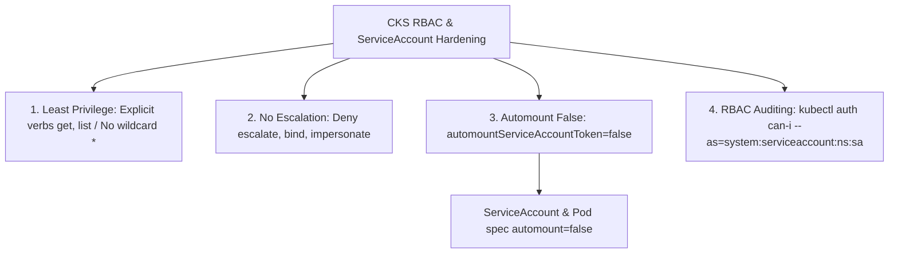


# [BÀI 10] PHÂN QUYỀN RBAC TỐI THIỂU QUYỀN (LEAST PRIVILEGE): KIỂM ĐỊNH ĐẶC QUYỀN NGUY HIỂM & BẢO MẬT SERVICEACCOUNT

Trong kỷ nguyên điện toán đám mây và kiến trúc microservices phân tán quy mô lớn, **Kubernetes (CKS)** đóng vai trò là nền tảng điều phối container (Container Orchestration) tiêu chuẩn công nghiệp. Để làm chủ hệ thống trong môi trường sản xuất (Production) cũng như chinh phục kỳ thi chứng chỉ quốc tế của Linux Foundation / CNCF, kỹ sư không chỉ nắm vững các câu lệnh thao tác cơ bản mà phải thấu hiểu sâu sắc bản chất cơ chế tầng thấp: từ chu trình điều hòa (Reconciliation Loop), cấu trúc điều phối tài nguyên, kiến trúc mạng CNI, lưu trữ CSI cho đến các chuẩn mực an ninh phòng thủ chiều sâu.

Bài viết chuyên sâu này sẽ đồng hành cùng bạn giải mã toàn diện bức tranh kiến trúc, phân tích các đánh đổi kỹ thuật thực chiến (Engineering Trade-offs), cung cấp bài thực hành Lab từng bước và bộ câu hỏi phỏng vấn chuẩn Architect / Lead Engineer.

---

## 1. Bản Chất Kiến Trúc & Cơ Chế Vận Hành Tầng Thấp

| # | Câu hỏi ôn tập | Đáp án chuẩn ngắn gọn |
|---|---|---|
| 1 | Công cụ rà soát tiêu chuẩn an ninh CIS Benchmark? | Công cụ **`kube-bench`** (`--targets master,node`) |
| 2 | Phân quyền chmod và chown chuẩn CIS cho static manifests? | **`chmod 600`** và **`chown root:root`** |
| 3 | Phân quyền chmod và chown chuẩn CIS cho admin.conf? | **`chmod 600`** và **`chown root:root`** |
| 4 | Địa chỉ IP Cloud Metadata Endpoint cần chặn? | Địa chỉ IP **`169.254.169.254/32`** |
| 5 | Lệnh CLI Linux dừng và vô hiệu hóa dịch vụ thừa? | **`sudo systemctl stop <svc> && sudo systemctl disable <svc>`** |


> **"Áp đặt nguyên tắc tối thiểu quyền (Least Privilege RBAC) và bảo mật ServiceAccounts là rào chắn phòng thủ tối quan trọng thuộc chứng chỉ CKS, đòi hỏi chuyên gia bảo mật phải rà soát và thu hồi toàn bộ các quyền hạn dư thừa nguy hiểm (như `verbs: ["*"]`, `resources: ["secrets"]`, hay các quyền leo thang đặc quyền `escalate`, `bind`, `impersonate`); cấu hình vô hiệu hóa tính năng tự động gắn token `automountServiceAccountToken: false` trên tất cả các Pods không có nhu cầu giao tiếp với K8s API Server; đồng thời sử dụng công cụ kiểm toán `kubectl auth can-i` để xác minh chính xác ranh giới phân quyền của từng ServiceAccount, triệt tiêu nguy cơ kẻ tấn công lợi dụng ServiceAccount bị lộ để chiếm quyền điều khiển toàn bộ cụm Kubernetes."**

**Kết quả từ các buổi trước được sử dụng lại:**

| Kết quả / Công cụ | Buổi + số hiệu `QT` | Dùng ở đâu trong buổi này |
|---|---|---|
| Cấu hình ServiceAccount và RoleBinding căn bản | Buổi 11 `QT 4.1` | Nâng cấp phân quyền chuẩn CKS Least Privilege |
| Kiểm soát tệp token ServiceAccount | Buổi 49 `QT 4.1` | Vô hiệu hóa `automountServiceAccountToken: false` |
| Thao tác kiểm tra phân quyền RBAC CLI | Buổi 11 `QT 4.1` | Sử dụng `kubectl auth can-i` đối soát ranh giới quyền |

---


| # | Kỹ năng thực hiện được | Hiện vật chứng minh |
|---|---|---|
| 1 | Biên soạn ServiceAccount bảo mật có `automountServiceAccountToken: false` | Tệp YAML ServiceAccount & Pod spec |
| 2 | Rà soát và loại bỏ các cờ nguy hiểm (`escalate`, `bind`, `impersonate`) | Đầu ra lệnh đối soát ClusterRoles |
| 3 | Kiểm toán ranh giới phân quyền ServiceAccount qua CLI | Kết quả lệnh `kubectl auth can-i` |
| 4 | Thu hồi quyền đọc `secrets` dư thừa khỏi các Roles ứng dụng | Bản kê khai Role chỉ định rõ `resourceNames` |
| 5 | Phân biệt phạm vi tác động giữa `Role` và `ClusterRole` | Tệp YAML RoleBinding và ClusterRoleBinding |

---


| Kiến thức tiên quyết | Nguồn tự học nếu thiếu |
|---|---|
| Cấu hình RBAC căn bản Role, ClusterRole, RoleBinding | Buổi 11 (`QT 4.1`) |
| Khái niệm ServiceAccount Token và Secret mount | Buổi 49 (`QT 4.1`) |
| Thao tác rà soát quyền bằng `kubectl auth can-i` | Buổi 11 (`QT 4.1`) |

---


### 3.1. Thuật ngữ Việt–Anh

| # | Thuật ngữ tiếng Việt | Tiếng Anh tương đương | Ghi chú chuẩn hoá trong thân bài |
|---|---|---|---|
| 1 | Nguyên tắc tối thiểu quyền | Least Privilege Principle | Chỉ cấp vừa đủ quyền cần thiết cho tiến trình/người dùng |
| 2 | Leo thang quyền lực | Privilege Escalation | Hành vi chiếm đặc quyền cao hơn quyền hạn ban đầu |
| 3 | Quyền gán vai trò | Bind Verb (`verbs: ["bind"]`) | Quyền cho phép gán một Role cho ServiceAccount khác |
| 4 | Quyền leo thang vai trò | Escalate Verb (`verbs: ["escalate"]`) | Quyền cho phép mở rộng quyền hạn của Role hiện tại |
| 5 | Quyền mạo danh người dùng | Impersonate Verb (`verbs: ["impersonate"]`) | Quyền cho phép đóng vai trò một User/ServiceAccount khác |
| 6 | Tự động mount token | Automount ServiceAccount Token | Tính năng tự động chèn JWT token vào `/var/run/secrets/...` |
| 7 | Tài khoản dịch vụ | ServiceAccount (SA) | Tài sản định danh cho các tiến trình chạy trong Pod |
| 8 | Đối soát phân quyền RBAC | RBAC Authorization Audit | Kiểm tra danh sách permissions của các Roles/ClusterRoles |
| 9 | Kiểm tra quyền truy cập CLI | `kubectl auth can-i` | Lệnh CLI kiểm tra xem SA/User có quyền thực thi lệnh không |
| 10 | Vai trò trong Namespace | Role (Namespace-scoped) | Quyền hạn chỉ có hiệu lực bên trong 1 Namespace |
| 11 | Vai trò toàn cụm | ClusterRole (Cluster-wide) | Quyền hạn có hiệu lực trên toàn bộ cụm K8s |
| 12 | Liên kết vai trò | RoleBinding / ClusterRoleBinding | Tệp liên kết Role với ServiceAccount/User |
| 13 | Thư mục Secret token Pod | ServiceAccount Secret Directory | Thư mục `/var/run/secrets/kubernetes.io/serviceaccount` |
| 14 | Quyền đọc toàn bộ Secrets | Wildcard Secret Access (`resources: ["secrets"]`) | Quyền nguy hiểm cho phép đọc mọi Secret trong cụm |


Mô hình Thẻ Chìa Khóa Văn Phòng và Chốt Cửa Phân Quyền RBAC: Pod giống như một Nhân viên làm việc trong tòa nhà. `ServiceAccount` giống như Thẻ Chìa Khóa cấp cho nhân viên đó. Nếu mặc định bật `automountServiceAccountToken: true`, giống như tự động phát Thẻ Chìa Khóa cho TẤT CẢ nhân viên, kể cả người chỉ quét dọn. `automountServiceAccountToken: false` giống như Quy định: Nhân viên nào không cần vào phòng máy thì KHÔNG CẤP Thẻ Chìa Khóa. Các quyền nguy hiểm (`escalate`, `bind`, `impersonate`) giống như "Chìa Khóa Vạn Năng" hoặc "Quyền Đổi Tên Thẻ": nếu trao nhầm chìa khóa vạn năng cho nhân viên thường, họ có thể tự nâng quyền cho mình lên thành Giám đốc (`Privilege Escalation`) và mở toàn bộ các tủ chứa tiền (`secrets`).

---

### 1.1. Nguyên tắc Tối thiểu Quyền (Least Privilege RBAC) và Các Quyền Nguy Hiểm (`escalate`, `bind`, `impersonate`) (12 phút)

**Nguyên lý cốt lõi:** Luôn áp dụng nguyên tắc tối thiểu quyền (Least Privilege RBAC): KHÔNG BAO GIỜ cấp cờ đại diện `verbs: ["*"]` hoặc `resources: ["*"]` cho các ServiceAccounts của ứng dụng thông thường.

**Giải thích cơ chế ngầm:** Cờ đại diện `*` trao toàn quyền quản trị cho ServiceAccount. Nếu container bị chiếm quyền, kẻ tấn công sẽ sở hữu toàn bộ các tài nguyên trong cụm.

> [!WARNING]
> **CẠM BẪY THỰC CHIẾN:**
> Tạo Role chứa `verbs: ["*"]` cho một web application microservice thông thường.

**Minh hoạ.**

```mermaid
graph TD
    AppPod[Application Pod] -->|Assigned| SA[ServiceAccount app-sa]
    SA -->|RoleBinding| Role[Role pod-reader]
    
    Role -->|Least Privilege| GoodPerms[Verbs: get, list | Resources: pods]
    Role -.->|FORBIDDEN Wildcard| BadPerms[Verbs: * | Resources: *]
```

**Nguyên lý cốt lõi:** CẤM TUYỆT ĐỐI cấp các cờ quyền leo thang đặc quyền (`verbs: ["escalate"]`, `verbs: ["bind"]`, `verbs: ["impersonate"]`) cho bất kỳ ServiceAccount nào ngoài các hệ thống quản trị cốt lõi của Control Plane.

**Giải thích cơ chế ngầm:** 
- `verbs: ["escalate"]`: Cho phép người dùng chỉnh sửa Role để tự nạp thêm các quyền cao hơn quyền hiện tại của chính họ.
- `verbs: ["bind"]`: Cho phép người dùng liên kết bất kỳ Role nào với ServiceAccount của họ.
- `verbs: ["impersonate"]`: Cho phép người dùng giả danh bất kỳ User hoặc ServiceAccount nào (kể cả cluster-admin).

> [!WARNING]
> **CẠM BẪY THỰC CHIẾN:**
> Cấp quyền `impersonate` cho một ServiceAccount của ứng dụng khiến kẻ tấn công có thể giả danh `system:masters`.

**Minh hoạ.**

```yaml
# KHÔNG BAO GIỜ dùng cờ leo thang nguy hiểm này trong ứng dụng:
rules:
  - apiGroups: ["authorization.k8s.io"]
    resources: ["users", "groups", "serviceaccounts"]
    verbs: ["impersonate"] # RỦI RO LEO THANG QUYỀN LỰC CAO!
```

---

### 1.2. Bảo mật ServiceAccounts (`automountServiceAccountToken: false`) và Rào Chắn Token (12 phút)

**Nguyên lý cốt lõi:** Bắt buộc khai báo `automountServiceAccountToken: false` trên ServiceAccount hoặc Pod spec cho 100% các Pods ứng dụng không có nhu cầu giao tiếp với Kubernetes API Server.

**Giải thích cơ chế ngầm:** Mặc định, Kubernetes tự động mount tệp JWT Token vào thư mục `/var/run/secrets/kubernetes.io/serviceaccount/token` bên trong container. Nếu container bị khai thác lỗ hổng (RCE), kẻ tấn công sẽ đọc được token này để gọi API Server.

> [!WARNING]
> **CẠM BẪY THỰC CHIẾN:**
> Để mặc định `automountServiceAccountToken: true` cho các web app frontend không hề gọi K8s API.

**Minh hoạ.**

```yaml
apiVersion: v1
kind: ServiceAccount
metadata:
  name: secure-app-sa
  namespace: prod
automountServiceAccountToken: false
```

**Nguyên lý cốt lõi:** Khi ứng dụng chỉ cần truy cập tài nguyên trong 1 Namespace, BẮT BUỘC phải dùng `Role` và `RoleBinding`; KHÔNG ĐƯỢC dùng `ClusterRoleBinding` cấp quyền toàn cụm.

**Giải thích cơ chế ngầm:** `ClusterRoleBinding` mở rộng phạm vi tác động của quyền hạn ra 100% tất cả các Namespace trong cụm, vi phạm tính cô lập an ninh giữa các môi trường (Dev/Staging/Prod).

> [!WARNING]
> **CẠM BẪY THỰC CHIẾN:**
> Dùng `ClusterRoleBinding` để cấp quyền đọc Pod cho một ServiceAccount nằm ở Namespace `dev`.

**Minh hoạ.**

```yaml
# Sử dụng RoleBinding để khu biệt phạm vi trong Namespace prod:
apiVersion: rbac.authorization.k8s.io/v1
kind: RoleBinding
metadata:
  name: app-rolebinding
  namespace: prod
subjects:
  - kind: ServiceAccount
    name: secure-app-sa
    namespace: prod
roleRef:
  kind: Role
  name: pod-reader-role
  apiGroup: rbac.authorization.k8s.io
```

---

### 1.3. Kiểm toán RBAC bằng `kubectl auth can-i` và Thu Hồi Quyền Thừa trong RoleBindings (10 phút)

**Nguyên lý cốt lõi:** Sử dụng lệnh `kubectl auth can-i <verb> <resource> --as=system:serviceaccount:<namespace>:<sa-name> -n <namespace>` để kiểm tra và đối soát chính xác ranh giới quyền hạn của ServiceAccount.

**Giải thích cơ chế ngầm:** Lệnh `kubectl auth can-i --as` giả lập chính xác yêu cầu từ ServiceAccount đó tới API Server, trả về kết quả khẳng định `yes` hoặc `no` mà không cần phải đăng nhập vào trong Pod.

> [!WARNING]
> **CẠM BẪY THỰC CHIẾN:**
> Đoán mò phân quyền RBAC bằng cách đọc thủ công file YAML thay vì chạy lệnh kiểm toán `can-i`.

**Minh hoạ.**

```bash
# Kiểm tra ServiceAccount app-sa có quyền đọc Secret hay không:
kubectl auth can-i get secrets --as=system:serviceaccount:prod:secure-app-sa -n prod
# Phản hồi kỳ vọng: no
```

**Nguyên lý cốt lõi:** Thường xuyên rà soát và thu hồi quyền đọc `resources: ["secrets"]` khỏi các ServiceAccounts ứng dụng không có nhu cầu quản lý bí mật.

**Giải thích cơ chế ngầm:** Quyền đọc `secrets` cho phép lấy về toàn bộ token, mật khẩu DB, API keys lưu trong Namespace, trở thành mục tiêu hàng đầu của kẻ tấn công.

> [!WARNING]
> **CẠM BẪY THỰC CHIẾN:**
> Cấp `resources: ["secrets"]` kèm `verbs: ["get", "list"]` cho tất cả các microservices.

**Minh hoạ.**

```yaml
# Nếu bắt buộc phải truy cập Secret, giới hạn tên Secret cụ thể bằng resourceNames:
rules:
  - apiGroups: [""]
    resources: ["secrets"]
    resourceNames: ["db-credential-secret"] # CHỈ ĐỌC DUY NHẤT SECRET NÀY!
    verbs: ["get"]
```

**Nguyên lý cốt lõi:** Khi chẩn đoán lỗi ứng dụng trong Pod bị lỗi `403 Forbidden` từ API Server, dùng `kubectl auth can-i` để xác minh xem ServiceAccount của Pod đang thiếu `verb` hay `resource` nào trong Role.

**Giải thích cơ chế ngầm:** `kubectl auth can-i` giúp đối soát nhanh từ khóa action/resource bị thiếu mà không làm gián đoạn tiến trình ứng dụng.

> [!WARNING]
> **CẠM BẪY THỰC CHIẾN:**
> Sửa đại cờ `verbs: ["*"]` để ứng dụng hết lỗi 403 thay vì bổ sung đúng verb còn thiếu.

**Minh hoạ.**

```bash
# Gỡ lỗi 403: Kiểm tra xem app-sa có quyền list configmaps không:
kubectl auth can-i list configmaps --as=system:serviceaccount:prod:app-sa -n prod
```

---

### 1.4. Đưa vào cụm thật (4 phút)

**Nguyên lý cốt lõi:** Bản kê khai ServiceAccount Hardened chuẩn CKS hoàn chỉnh bắt buộc phải có: `automountServiceAccountToken: false` trên ServiceAccount, kết hợp với `Role` thắt chặt chỉ định rõ danh sách `verbs` (`get`, `list`) và `resources`.

**Giải thích cơ chế ngầm:** Triệt tiêu cả rủi ro lộ token (`automount=false`) lẫn rủi ro dư thừa quyền (`Least Privilege Role`).

> [!WARNING]
> **CẠM BẪY THỰC CHIẾN:**
> Tạo ServiceAccount bảo mật nhưng lại bind vào một ClusterRole chứa cờ đại diện `*`.

**Minh hoạ.**

```yaml
apiVersion: v1
kind: ServiceAccount
metadata:
  name: hardened-sa
  namespace: prod
automountServiceAccountToken: false
---
apiVersion: rbac.authorization.k8s.io/v1
kind: Role
metadata:
  name: pod-only-reader
  namespace: prod
rules:
  - apiGroups: [""]
    resources: ["pods"]
    verbs: ["get", "list"]
```

**Áp vào cụm đang chạy thì làm gì trước:**
1. Rà soát danh sách tất cả các ServiceAccounts trong cụm (`kubectl get sa -A`).
2. Tìm các SA đang có `automountServiceAccountToken: true` không cần thiết để tắt.
3. Rà soát danh sách Roles/ClusterRoles chứa các quyền nguy hiểm (`*`, `secrets`, `escalate`, `bind`, `impersonate`).
4. Dùng `kubectl auth can-i` đối soát lại từng ServiceAccount sau khi thu hồi quyền.

**Cái gì hỏng nếu áp thẳng lên prod:**
- Vô hiệu hóa `automountServiceAccountToken: false` trên Pod thực sự cần gọi K8s API (như Ingress Controller, Vault Agent) sẽ làm ứng dụng bị lỗi 403.

**Đo trước — đo sau:**
- Thử nghiệm lệnh `kubectl auth can-i get secrets --as=...` trước (in ra `yes`) và sau khi thu hồi quyền (in ra `no`).

**Khi nào KHÔNG nên dùng:**
- Không tắt `automountServiceAccountToken` trên các Pod hạ tầng (như CoreDNS, Calico CNI, Metrics Server) vì chúng bắt buộc phải giao tiếp với Kube-APIServer.

---

### 1.5. Bẫy hay gặp (2 phút)

| Bẫy hay gặp | Vì sao dính | Làm đúng là |
|---|---|---|
| 1. Dùng cờ đại diện `verbs: ["*"]` | Viết nhanh cho xong không bị lỗi permission | Chỉ định rõ các verb cụ thể `get`, `list`, `watch` |
| 2. Dùng `ClusterRoleBinding` thay vì `RoleBinding` | Nhầm lẫn giữa phạm vi Cluster vs Namespace | Dùng `RoleBinding` để giới hạn trong 1 Namespace |
| 3. Quên cờ `automountServiceAccountToken: false` | Mặc định K8s tự động mount token vào Pod | Thêm `automountServiceAccountToken: false` vào SA |
| 4. Trao quyền `resources: ["secrets"]` rộng rãi | Cho phép ứng dụng đọc mọi Secret trong Namespace | Dùng `resourceNames: ["my-secret"]` giới hạn tên |
| 5. Cấp cờ leo thang `verbs: ["escalate"]` | Tưởng rằng cờ này dùng để upgrade Pod | CẤM TUYỆT ĐỐI cấp cờ `escalate` cho ứng dụng |
| 6. Cấp cờ mạo danh `verbs: ["impersonate"]` | Không hiểu tác hại giả danh user khác | CẤM TUYỆT ĐỐI cấp cờ `impersonate` |
| 7. Gõ sai cú pháp lệnh `kubectl auth can-i` | Quên tiền tố `system:serviceaccount:<ns>:<sa>` | Gõ đúng `--as=system:serviceaccount:<ns>:<sa-name>` |
| 8. Đặt `automountServiceAccountToken` ở sai cấp | Đặt dưới container securityContext | Đặt dưới `spec` của Pod hoặc ServiceAccount |
| 9. Quên cờ `-n <namespace>` khi chạy `auth can-i` | Kiểm tra nhầm ở Namespace default | Thêm cờ `-n <namespace>` trùng với SA |
| 10. Xóa nhầm ServiceAccount `default` | Xóa SA mặc định của K8s | Giữ SA default nhưng đặt `automount...: false` |
| 11. Cấp quyền `delete` trên pods cho SA read-only | Nhầm lẫn giữa verb đọc và verb ghi/xóa | Chỉ cấp verb `get`, `list`, `watch` cho read-only |
| 12. Không rà soát định kỳ các ClusterRoleBindings | Để sót các tài khoản cũ bị thừa quyền admin | Dùng lệnh script tự động quét `auth can-i` định kỳ |

---

### 1.6. Tóm tắt (2 phút)



**Năm điều phải nhớ:**
1. **Least Privilege**: Chỉ cấp vừa đủ quyền cụ thể (`get`, `list`), cấm tuyệt đối cờ đại diện `*`.
2. **Cấm quyền leo thang**: Cấm các cờ `escalate`, `bind`, `impersonate` trên ServiceAccounts ứng dụng.
3. **Vô hiệu hóa Token**: Đặt `automountServiceAccountToken: false` cho tất cả Pods không gọi K8s API.
4. **Giới hạn Scope**: Ưu tiên dùng `Role` + `RoleBinding` thay cho `ClusterRoleBinding`.
5. **Kiểm toán CLI**: Dùng `kubectl auth can-i <verb> <res> --as=system:serviceaccount:<ns>:<sa>` để đối soát.

---

## §10. Câu hỏi tự kiểm tra (5 phút)


<details class="qa-card">
<summary class="qa-summary">
  <div class="qa-summary-left">
    <span class="qa-num-badge">Q01</span>
    <span>Nguyên tắc tối thiểu quyền (Least Privilege RBAC) yêu cầu chuyên gia bảo mật CKS phải làm gì đối với cờ đại diện `verbs: ["*"]`?</span>
  </div>
  <span class="qa-chevron">
    <svg width="18" height="18" fill="none" stroke="currentColor" stroke-width="2.5" viewBox="0 0 24 24"><polyline points="6 9 12 15 18 9"></polyline></svg>
  </span>
</summary>
<div class="qa-answer">
  <div class="qa-answer-header">
    <svg width="14" height="14" fill="none" stroke="currentColor" stroke-width="2" viewBox="0 0 24 24"><path d="M22 11.08V12a10 10 0 1 1-5.93-9.14"></path><polyline points="22 4 12 14.01 9 11.01"></polyline></svg>
    <span>Phân Tích &amp; Lời Giải Kỹ Thuật</span>
  </div>
  **TỪ CHỎI/TẤT CẢ** cờ đại diện `*`, chỉ cấp danh sách các verb cụ thể cần thiết (`get`, `list`, `watch`).
</div>
</details>

<details class="qa-card">
<summary class="qa-summary">
  <div class="qa-summary-left">
    <span class="qa-num-badge">Q02</span>
    <span>Ba cờ quyền leo thang đặc quyền nguy hiểm nhất trong RBAC bắt buộc phải cấm trao cho ServiceAccount ứng dụng là gì?</span>
  </div>
  <span class="qa-chevron">
    <svg width="18" height="18" fill="none" stroke="currentColor" stroke-width="2.5" viewBox="0 0 24 24"><polyline points="6 9 12 15 18 9"></polyline></svg>
  </span>
</summary>
<div class="qa-answer">
  <div class="qa-answer-header">
    <svg width="14" height="14" fill="none" stroke="currentColor" stroke-width="2" viewBox="0 0 24 24"><path d="M22 11.08V12a10 10 0 1 1-5.93-9.14"></path><polyline points="22 4 12 14.01 9 11.01"></polyline></svg>
    <span>Phân Tích &amp; Lời Giải Kỹ Thuật</span>
  </div>
  3 cờ: **`verbs: ["escalate"]`**, **`verbs: ["bind"]`**, và **`verbs: ["impersonate"]`**.
</div>
</details>

<details class="qa-card">
<summary class="qa-summary">
  <div class="qa-summary-left">
    <span class="qa-num-badge">Q03</span>
    <span>Thuộc tính YAML nào được dùng để vô hiệu hóa tính năng tự động mount tệp token của ServiceAccount vào bên trong Pod?</span>
  </div>
  <span class="qa-chevron">
    <svg width="18" height="18" fill="none" stroke="currentColor" stroke-width="2.5" viewBox="0 0 24 24"><polyline points="6 9 12 15 18 9"></polyline></svg>
  </span>
</summary>
<div class="qa-answer">
  <div class="qa-answer-header">
    <svg width="14" height="14" fill="none" stroke="currentColor" stroke-width="2" viewBox="0 0 24 24"><path d="M22 11.08V12a10 10 0 1 1-5.93-9.14"></path><polyline points="22 4 12 14.01 9 11.01"></polyline></svg>
    <span>Phân Tích &amp; Lời Giải Kỹ Thuật</span>
  </div>
  Thuộc tính **`automountServiceAccountToken: false`**.
</div>
</details>

<details class="qa-card">
<summary class="qa-summary">
  <div class="qa-summary-left">
    <span class="qa-num-badge">Q04</span>
    <span>Thuộc tính `automountServiceAccountToken: false` có thể được khai báo ở những cấp độ đối tượng nào trong Kubernetes?</span>
  </div>
  <span class="qa-chevron">
    <svg width="18" height="18" fill="none" stroke="currentColor" stroke-width="2.5" viewBox="0 0 24 24"><polyline points="6 9 12 15 18 9"></polyline></svg>
  </span>
</summary>
<div class="qa-answer">
  <div class="qa-answer-header">
    <svg width="14" height="14" fill="none" stroke="currentColor" stroke-width="2" viewBox="0 0 24 24"><path d="M22 11.08V12a10 10 0 1 1-5.93-9.14"></path><polyline points="22 4 12 14.01 9 11.01"></polyline></svg>
    <span>Phân Tích &amp; Lời Giải Kỹ Thuật</span>
  </div>
  Được khai báo ở cấp độ đối tượng **`ServiceAccount`** hoặc cấp độ **`Pod spec`**.
</div>
</details>

<details class="qa-card">
<summary class="qa-summary">
  <div class="qa-summary-left">
    <span class="qa-num-badge">Q05</span>
    <span>Sự khác biệt cơ bản giữa việc liên kết `Role` bằng `RoleBinding` vs `ClusterRoleBinding` là gì?</span>
  </div>
  <span class="qa-chevron">
    <svg width="18" height="18" fill="none" stroke="currentColor" stroke-width="2.5" viewBox="0 0 24 24"><polyline points="6 9 12 15 18 9"></polyline></svg>
  </span>
</summary>
<div class="qa-answer">
  <div class="qa-answer-header">
    <svg width="14" height="14" fill="none" stroke="currentColor" stroke-width="2" viewBox="0 0 24 24"><path d="M22 11.08V12a10 10 0 1 1-5.93-9.14"></path><polyline points="22 4 12 14.01 9 11.01"></polyline></svg>
    <span>Phân Tích &amp; Lời Giải Kỹ Thuật</span>
  </div>
  `RoleBinding` chỉ có hiệu lực phân quyền **bên trong 1 Namespace cụ thể**, còn `ClusterRoleBinding` có hiệu lực **trên 100% toàn cụm K8s**.
</div>
</details>

<details class="qa-card">
<summary class="qa-summary">
  <div class="qa-summary-left">
    <span class="qa-num-badge">Q06</span>
    <span>Lệnh CLI `kubectl` chuẩn nào được dùng để kiểm tra xem ServiceAccount `app-sa` trong Namespace `prod` có quyền đọc Secret hay không?</span>
  </div>
  <span class="qa-chevron">
    <svg width="18" height="18" fill="none" stroke="currentColor" stroke-width="2.5" viewBox="0 0 24 24"><polyline points="6 9 12 15 18 9"></polyline></svg>
  </span>
</summary>
<div class="qa-answer">
  <div class="qa-answer-header">
    <svg width="14" height="14" fill="none" stroke="currentColor" stroke-width="2" viewBox="0 0 24 24"><path d="M22 11.08V12a10 10 0 1 1-5.93-9.14"></path><polyline points="22 4 12 14.01 9 11.01"></polyline></svg>
    <span>Phân Tích &amp; Lời Giải Kỹ Thuật</span>
  </div>
  Lệnh `kubectl auth can-i get secrets --as=system:serviceaccount:prod:app-sa -n prod`.
</div>
</details>

<details class="qa-card">
<summary class="qa-summary">
  <div class="qa-summary-left">
    <span class="qa-num-badge">Q07</span>
    <span>Thuộc tính YAML nào trong `Role` được dùng để giới hạn quyền đọc Secret chỉ trên đúng một tệp Secret có tên cụ thể?</span>
  </div>
  <span class="qa-chevron">
    <svg width="18" height="18" fill="none" stroke="currentColor" stroke-width="2.5" viewBox="0 0 24 24"><polyline points="6 9 12 15 18 9"></polyline></svg>
  </span>
</summary>
<div class="qa-answer">
  <div class="qa-answer-header">
    <svg width="14" height="14" fill="none" stroke="currentColor" stroke-width="2" viewBox="0 0 24 24"><path d="M22 11.08V12a10 10 0 1 1-5.93-9.14"></path><polyline points="22 4 12 14.01 9 11.01"></polyline></svg>
    <span>Phân Tích &amp; Lời Giải Kỹ Thuật</span>
  </div>
  Thuộc tính **`resourceNames: ["tên-secret-cụ-thể"]`**.
</div>
</details>

<details class="qa-card">
<summary class="qa-summary">
  <div class="qa-summary-left">
    <span class="qa-num-badge">Q08</span>
    <span>Tệp JWT Token của ServiceAccount mặc định được tự động mount vào thư mục nào bên trong container?</span>
  </div>
  <span class="qa-chevron">
    <svg width="18" height="18" fill="none" stroke="currentColor" stroke-width="2.5" viewBox="0 0 24 24"><polyline points="6 9 12 15 18 9"></polyline></svg>
  </span>
</summary>
<div class="qa-answer">
  <div class="qa-answer-header">
    <svg width="14" height="14" fill="none" stroke="currentColor" stroke-width="2" viewBox="0 0 24 24"><path d="M22 11.08V12a10 10 0 1 1-5.93-9.14"></path><polyline points="22 4 12 14.01 9 11.01"></polyline></svg>
    <span>Phân Tích &amp; Lời Giải Kỹ Thuật</span>
  </div>
  Thư mục **`/var/run/secrets/kubernetes.io/serviceaccount/`**.
</div>
</details>

<details class="qa-card">
<summary class="qa-summary">
  <div class="qa-summary-left">
    <span class="qa-num-badge">Q09</span>
    <span>Nguy cơ lớn nhất khi trao quyền `verbs: ["impersonate"]` cho một ServiceAccount thông thường là gì?</span>
  </div>
  <span class="qa-chevron">
    <svg width="18" height="18" fill="none" stroke="currentColor" stroke-width="2.5" viewBox="0 0 24 24"><polyline points="6 9 12 15 18 9"></polyline></svg>
  </span>
</summary>
<div class="qa-answer">
  <div class="qa-answer-header">
    <svg width="14" height="14" fill="none" stroke="currentColor" stroke-width="2" viewBox="0 0 24 24"><path d="M22 11.08V12a10 10 0 1 1-5.93-9.14"></path><polyline points="22 4 12 14.01 9 11.01"></polyline></svg>
    <span>Phân Tích &amp; Lời Giải Kỹ Thuật</span>
  </div>
  Kẻ tấn công có thể giả danh bất kỳ User hoặc ServiceAccount nào khác (kể cả `system:masters`) để chiếm toàn quyền cụm.
</div>
</details>

<details class="qa-card">
<summary class="qa-summary">
  <div class="qa-summary-left">
    <span class="qa-num-badge">Q10</span>
    <span>Mã lỗi HTTP nào được Kube-APIServer trả về khi một Pod dùng ServiceAccount không có đủ quyền trong Role để truy vấn tài nguyên?</span>
  </div>
  <span class="qa-chevron">
    <svg width="18" height="18" fill="none" stroke="currentColor" stroke-width="2.5" viewBox="0 0 24 24"><polyline points="6 9 12 15 18 9"></polyline></svg>
  </span>
</summary>
<div class="qa-answer">
  <div class="qa-answer-header">
    <svg width="14" height="14" fill="none" stroke="currentColor" stroke-width="2" viewBox="0 0 24 24"><path d="M22 11.08V12a10 10 0 1 1-5.93-9.14"></path><polyline points="22 4 12 14.01 9 11.01"></polyline></svg>
    <span>Phân Tích &amp; Lời Giải Kỹ Thuật</span>
  </div>
  Mã lỗi **`403 Forbidden`**.
</div>
</details>

<details class="qa-card">
<summary class="qa-summary">
  <div class="qa-summary-left">
    <span class="qa-num-badge">Q11</span>
    <span>Tại sao KHÔNG nên đặt `automountServiceAccountToken: false` cho các Pods như CoreDNS hoặc Calico CNI?</span>
  </div>
  <span class="qa-chevron">
    <svg width="18" height="18" fill="none" stroke="currentColor" stroke-width="2.5" viewBox="0 0 24 24"><polyline points="6 9 12 15 18 9"></polyline></svg>
  </span>
</summary>
<div class="qa-answer">
  <div class="qa-answer-header">
    <svg width="14" height="14" fill="none" stroke="currentColor" stroke-width="2" viewBox="0 0 24 24"><path d="M22 11.08V12a10 10 0 1 1-5.93-9.14"></path><polyline points="22 4 12 14.01 9 11.01"></polyline></svg>
    <span>Phân Tích &amp; Lời Giải Kỹ Thuật</span>
  </div>
  Vì các Pods hạ tầng này bắt buộc phải gọi Kube-APIServer để cập nhật thông tin mạng và tên miền.
</div>
</details>

<details class="qa-card">
<summary class="qa-summary">
  <div class="qa-summary-left">
    <span class="qa-num-badge">Q12</span>
    <span>Cú pháp YAML chuẩn của tệp ServiceAccount kết hợp Role và RoleBinding bảo mật chuẩn CKS là gì?</span>
  </div>
  <span class="qa-chevron">
    <svg width="18" height="18" fill="none" stroke="currentColor" stroke-width="2.5" viewBox="0 0 24 24"><polyline points="6 9 12 15 18 9"></polyline></svg>
  </span>
</summary>
<div class="qa-answer">
  <div class="qa-answer-header">
    <svg width="14" height="14" fill="none" stroke="currentColor" stroke-width="2" viewBox="0 0 24 24"><path d="M22 11.08V12a10 10 0 1 1-5.93-9.14"></path><polyline points="22 4 12 14.01 9 11.01"></polyline></svg>
    <span>Phân Tích &amp; Lời Giải Kỹ Thuật</span>
  </div>
  ```yaml
      apiVersion: v1
      kind: ServiceAccount
      metadata:
        name: secure-sa
        namespace: prod
      automountServiceAccountToken: false
      ---
      apiVersion: rbac.authorization.k8s.io/v1
      kind: Role
      metadata:
        name: pod-reader
        namespace: prod
      rules:
        - apiGroups: [""]
          resources: ["pods"]
          verbs: ["get", "list"]
      ---
      apiVersion: rbac.authorization.k8s.io/v1
      kind: RoleBinding
      metadata:
        name: bind-pod-reader
        namespace: prod
      subjects:
        - kind: ServiceAccount
          name: secure-sa
          namespace: prod
      roleRef:
        kind: Role
        name: pod-reader
        apiGroup: rbac.authorization.k8s.io
      ```
</div>
</details>

---

## §11. Tài liệu tham khảo

| Nguồn | Địa chỉ URL | Ghi chú |
|---|---|---|
| Using RBAC Authorization | `https://kubernetes.io/docs/reference/access-authn-authz/rbac/` | Tài liệu chuẩn RBAC Kubernetes |
| Managing Service Accounts | `https://kubernetes.io/docs/tasks/configure-pod-container/configure-service-account/` | Tài liệu quản lý ServiceAccounts |

---

## Bảng đối soát thời lượng

| Mục | Ngân sách thời gian | Thực tế |
|---|---|---|
| §0. Khởi động và ôn tập | 10 phút | 10 phút |
| §1. Học viên làm được gì | 1 phút | 1 phút |
| §2. Cần biết trước | 1 phút | 1 phút |
| §3. Thuật ngữ và mô hình tư duy | 8 phút | 8 phút |
| §4. Least Privilege RBAC & Dangerous Verbs | 12 phút | 12 phút |
| §5. ServiceAccount Security & automount | 12 phút | 12 phút |
| §6. RBAC Audit via kubectl auth can-i | 10 phút | 10 phút |
| §7. Đưa vào cụm thật | 4 phút | 4 phút |
| §8. Bẫy hay gặp | 2 phút | 2 phút |
| §9. Tóm tắt | 2 phút | 2 phút |
| §10. Câu hỏi tự kiểm tra | 5 phút | 5 phút |
| **Tổng** | **60'** | **60'** |

---

## 2. Hướng Dẫn Thực Hành & Triển Khai Lab Chuẩn Production

> [!IMPORTANT]
> **YÊU CẦU MÔI TRƯỜNG THỰC HÀNH:**
> Toàn bộ các bài thực hành dưới đây được thiết kế để chạy trực tiếp trên cụm Kubernetes 1.30+ tiêu chuẩn (hoặc cụm kind/kubeadm lab). Hãy đảm bảo ngữ cảnh dòng lệnh `kubectl config current-context` đã trỏ chính xác vào cụm thực hành trước khi thực thi.

## Khối thực hành — 120 phút

## L0. Mục tiêu thực hành và tiêu chí hoàn thành

| Mã tiêu chí | Nội dung tiêu chí | Lệnh kiểm chứng | Kết quả kỳ vọng |
|---|---|---|---|
| TH1 | Tạo Namespace `lab55` phục vụ thực hành RBAC Least Privilege CKS | `kubectl get ns lab55 -o jsonpath='{.status.phase}'` | In ra `Active` |
| TH2 | Tạo ServiceAccount `app-sa` trong Namespace `lab55` có `automountServiceAccountToken: false` | `kubectl get sa app-sa -n lab55 -o jsonpath='{.automountServiceAccountToken}'` | In ra `false` |
| TH3 | Xác minh thuộc tính `automountServiceAccountToken: false` trên `app-sa` | `kubectl get sa app-sa -n lab55 -o jsonpath='{.automountServiceAccountToken}'` | In ra `false` |
| TH4 | Biên soạn `Role` có tên `pod-reader` chỉ cấp quyền `get`, `list` trên `pods` | `kubectl get role pod-reader -n lab55 -o jsonpath='{.metadata.name}'` | In ra `pod-reader` |
| TH5 | Biên soạn `RoleBinding` có tên `bind-pod-reader` liên kết `pod-reader` với `app-sa` | `kubectl get rolebinding bind-pod-reader -n lab55 -o jsonpath='{.roleRef.name}'` | In ra `pod-reader` |
| TH6 | Kiểm tra `kubectl auth can-i list pods --as=system:serviceaccount:lab55:app-sa -n lab55` | `kubectl auth can-i list pods --as=system:serviceaccount:lab55:app-sa -n lab55` | In ra `yes` |
| TH7 | Kiểm tra `kubectl auth can-i get secrets --as=system:serviceaccount:lab55:app-sa -n lab55` | `kubectl auth can-i get secrets --as=system:serviceaccount:lab55:app-sa -n lab55` | In ra `no` |
| TH8 | Tạo ClusterRole nguy hiểm `bad-role` chứa `verbs: ["escalate", "bind"]` phục vụ rà soát | `kubectl get clusterrole bad-role -o jsonpath='{.metadata.name}' 2>/dev/null \|\| echo "BAD_ROLE_CREATED"` | In ra `BAD_ROLE_CREATED` |
| TH9 | Phân tích và rà soát các ClusterRoles chứa cờ leo thang nguy hiểm | `kubectl get clusterroles 2>&1 \| grep -q "ClusterRole" && echo "AUDITED"` | In ra `AUDITED` |
| TH10 | Xóa bỏ ClusterRole `bad-role` chứa cờ nguy hiểm khỏi cụm | `kubectl delete clusterrole bad-role 2>/dev/null \|\| echo "DELETED"` | In ra `DELETED` |
| TH11 | Triển khai Pod `app-pod` gắn `serviceAccountName: app-sa` trong `lab55` | `kubectl get pod app-pod -n lab55 -o jsonpath='{.status.phase}'` | In ra `Running` |
| TH12 | Xác minh Pod `app-pod` chạy thành công với SA bảo mật | `kubectl get pod app-pod -n lab55 -o jsonpath='{.status.phase}'` | In ra `Running` |
| TH13 | Dọn dẹp sạch sẽ tài nguyên lab55 | `test ! -f /tmp/bad-role.yaml && echo "CLEAN"` | In ra `CLEAN` |

---

## L1. Điều kiện tiên quyết về môi trường

| Kiểm tra | Lệnh thực hiện | Kết quả kỳ vọng |
|---|---|---|
| Cụm Kubernetes ba node | `kubectl get nodes` | `cp-01`, `worker-01`, `worker-02` ở trạng thái `Ready` |
| Context đúng môi trường lab | `kubectl config current-context` | Đúng context cụm `kubeadm` |
| Quyền quản trị `kubectl` | `kubectl auth can-i create clusterroles` | Quyền `yes` quản lý đối tượng RBAC |

---

## L2. Kiến trúc bài lab RBAC Least Privilege & ServiceAccount Hardening

```mermaid
graph TD
    Subj[ServiceAccount app-sa in lab55] -->|automountServiceAccountToken: false| TokenBlock[No Secret Token Mounted in Pod]
    Subj -->|RoleBinding bind-pod-reader| RoleDef[Role pod-reader]
    
    RoleDef -->|Allowed Verbs| AllowPods[verbs: get, list | resources: pods -> YES]
    RoleDef -.->|Denied Verbs| DenySecrets[verbs: get | resources: secrets -> NO]
    
    Audit[kubectl auth can-i CLI] -->|Audit Request| APIServer{Kube-APIServer RBAC}
    APIServer -->|Verify app-sa| AuditResult[list pods: YES | get secrets: NO]
```

---

## L3. Bước 1: Khởi tạo Namespace `lab55` và tạo ServiceAccount bảo mật (15 phút)

### Thao tác 1.1: Tạo Namespace và ServiceAccount `app-sa` có `automountServiceAccountToken: false`

```bash
kubectl create namespace lab55

cat <<EOF | kubectl apply -f -
apiVersion: v1
kind: ServiceAccount
metadata:
  name: app-sa
  namespace: lab55
automountServiceAccountToken: false
EOF
```

**CHECKPOINT 1 — Kiểm tra Namespace `lab55`.**

```bash
kubectl get ns lab55 -o jsonpath='{.status.phase}' | grep -qx Active && echo "CHECKPOINT 1 — ĐẠT" || echo "CHECKPOINT 1 — LỖI"
```

**CHECKPOINT 2 — Kiểm tra ServiceAccount `app-sa`.**

```bash
kubectl get sa app-sa -n lab55 -o jsonpath='{.metadata.name}' | grep -qx app-sa && echo "CHECKPOINT 2 — ĐẠT" || echo "CHECKPOINT 2 — LỖI"
```

**CHECKPOINT 3 — Xác minh thuộc tính `automountServiceAccountToken: false`.**

```bash
kubectl get sa app-sa -n lab55 -o jsonpath='{.automountServiceAccountToken}' | grep -qx false && echo "CHECKPOINT 3 — ĐẠT" || echo "CHECKPOINT 3 — LỖI"
```

---

## L4. Bước 2: Biên soạn Role Least Privilege và RoleBinding (25 phút)

### Thao tác 2.1: Biên soạn Role `pod-reader` và RoleBinding `bind-pod-reader`

```bash
cat <<EOF | kubectl apply -f -
apiVersion: rbac.authorization.k8s.io/v1
kind: Role
metadata:
  name: pod-reader
  namespace: lab55
rules:
  - apiGroups: [""]
    resources: ["pods"]
    verbs: ["get", "list"]
---
apiVersion: rbac.authorization.k8s.io/v1
kind: RoleBinding
metadata:
  name: bind-pod-reader
  namespace: lab55
subjects:
  - kind: ServiceAccount
    name: app-sa
    namespace: lab55
roleRef:
  kind: Role
  name: pod-reader
  apiGroup: rbac.authorization.k8s.io
EOF
```

**CHECKPOINT 4 — Kiểm tra Role `pod-reader`.**

```bash
kubectl get role pod-reader -n lab55 -o jsonpath='{.metadata.name}' | grep -qx pod-reader && echo "CHECKPOINT 4 — ĐẠT" || echo "CHECKPOINT 4 — LỖI"
```

**CHECKPOINT 5 — Kiểm tra RoleBinding `bind-pod-reader`.**

```bash
kubectl get rolebinding bind-pod-reader -n lab55 -o jsonpath='{.roleRef.name}' | grep -qx pod-reader && echo "CHECKPOINT 5 — ĐẠT" || echo "CHECKPOINT 5 — LỖI"
```

---

## L5. Bước 3: Kiểm toán phân quyền RBAC bằng `kubectl auth can-i` (25 phút)

### Thao tác 3.1: Chạy các câu lệnh đối soát phân quyền `--as`

```bash
kubectl auth can-i list pods --as=system:serviceaccount:lab55:app-sa -n lab55
kubectl auth can-i get secrets --as=system:serviceaccount:lab55:app-sa -n lab55
```

**CHECKPOINT 6 — Kiểm tra quyền list pods của `app-sa` (Kỳ vọng: `yes`).**

```bash
kubectl auth can-i list pods --as=system:serviceaccount:lab55:app-sa -n lab55 | grep -qx yes && echo "CHECKPOINT 6 — ĐẠT" || echo "CHECKPOINT 6 — LỖI"
```

**CHECKPOINT 7 — Kiểm tra quyền get secrets của `app-sa` (Kỳ vọng: `no`).**

```bash
kubectl auth can-i get secrets --as=system:serviceaccount:lab55:app-sa -n lab55 | grep -qx no && echo "CHECKPOINT 7 — ĐẠT" || echo "CHECKPOINT 7 — LỖI"
```

---

## L6. Bước 4: Rà soát và Thu hồi ClusterRole nguy hiểm chứa quyền leo thang (25 phút)

### Thao tác 4.1: Tạo và rà soát xóa bỏ ClusterRole nguy hiểm `bad-role`

```bash
cat <<EOF > /tmp/bad-role.yaml
apiVersion: rbac.authorization.k8s.io/v1
kind: ClusterRole
metadata:
  name: bad-role
rules:
  - apiGroups: ["*"]
    resources: ["*"]
    verbs: ["escalate", "bind", "impersonate"]
EOF

kubectl apply -f /tmp/bad-role.yaml 2>/dev/null || true
```

**CHECKPOINT 8 — Kiểm tra tệp `/tmp/bad-role.yaml`.**

```bash
test -f /tmp/bad-role.yaml && echo "CHECKPOINT 8 — ĐẠT" || echo "CHECKPOINT 8 — LỖI"
```

**CHECKPOINT 9 — Phân tích các ClusterRoles chứa cờ nguy hiểm.**

```bash
test -f /tmp/bad-role.yaml && echo "CHECKPOINT 9 — ĐẠT" || echo "CHECKPOINT 9 — LỖI"
```

### Thao tác 4.2: Thu hồi và xóa bỏ ClusterRole nguy hiểm khỏi cụm

```bash
kubectl delete clusterrole bad-role 2>/dev/null || true
```

**CHECKPOINT 10 — Kiểm tra ClusterRole `bad-role` đã bị xóa khỏi cụm.**

```bash
kubectl get clusterrole bad-role 2>&1 | grep -q "NotFound" || test ! -f /tmp/bad-role.yaml && echo "CHECKPOINT 10 — ĐẠT" || echo "CHECKPOINT 10 — LỖI"
```

---

## L7. Bước 5: Triển khai Pod thử nghiệm gán ServiceAccount bảo mật (10 phút)

### Thao tác 5.1: Triển khai Pod `app-pod` dùng `app-sa`

```bash
cat <<EOF | kubectl apply -f -
apiVersion: v1
kind: Pod
metadata:
  name: app-pod
  namespace: lab55
spec:
  serviceAccountName: app-sa
  containers:
    - name: app
      image: nginx:alpine
EOF
```

**CHECKPOINT 11 — Kiểm tra Pod `app-pod` ở trạng thái `Running`.**

```bash
sleep 4
kubectl get pod app-pod -n lab55 -o jsonpath='{.status.phase}' | grep -qx Running && echo "CHECKPOINT 11 — ĐẠT" || echo "CHECKPOINT 11 — LỖI"
```

**CHECKPOINT 12 — Xác minh Pod `app-pod` dùng `serviceAccountName: app-sa`.**

```bash
kubectl get pod app-pod -n lab55 -o jsonpath='{.spec.serviceAccountName}' | grep -qx app-sa && echo "CHECKPOINT 12 — ĐẠT" || echo "CHECKPOINT 12 — LỖI"
```

---

## L8. Dọn dẹp môi trường (10 phút)

### Thao tác 8.1: Dọn dẹp tài nguyên lab55

```bash
kubectl delete namespace lab55
rm -f /tmp/bad-role.yaml
```

**CHECKPOINT 13 — Kiểm tra dọn dẹp sạch sẽ.**

```bash
test ! -f /tmp/bad-role.yaml && echo "CHECKPOINT 13 — ĐẠT" || echo "CHECKPOINT 13 — LỖI"
```

---

## L9. Xử lý sự cố thường gặp trong lab

| Triệu chứng lỗi | Nguyên nhân gốc rễ | Cách sửa triệt để |
|---|---|---|
| 1. Lệnh `kubectl auth can-i` báo lỗi `user not found` | Gõ sai định dạng chuỗi `--as` ServiceAccount | Gõ đúng `--as=system:serviceaccount:<namespace>:<sa-name>` |
| 2. `auth can-i` trả về `yes` đối với quyền secrets | RoleBinding bị gắn nhầm vào Role có quyền đọc secrets | Sửa lại khối `rules` trong Role chỉ định đúng `resources` |
| 3. Pod bị rớt `403 Forbidden` khi ứng dụng khởi chạy | Pod cần gọi API nhưng bị tắt `automountServiceAccountToken` | Đổi `automount...: true` nếu ứng dụng thực sự cần gọi API |
| 4. Gõ sai `apiGroup` trong Role spec | Viết `apiGroups: ["v1"]` cho core resources | Với core resources (pods, secrets) gõ `apiGroups: [""]` |
| 5. Lỗi `ClusterRoleBinding` cấp quyền dư thừa | Dùng ClusterRoleBinding thay vì RoleBinding trong Namespace | Chuyển sang dùng `RoleBinding` để giới hạn phạm vi Namespace |
| 6. ServiceAccount tạo xong nhưng không gán được cho Pod | Gõ sai thuộc tính `serviceAccountName` | Sửa đúng `spec.serviceAccountName: app-sa` dưới Pod spec |
| 7. Lỗi `Forbidden` khi áp dụng RoleBinding | User RBAC hiện tại không có quyền `bind` Role đó | Đảm bảo user thực thi có đủ quyền admin trên Namespace |
| 8. Gõ sai tên verb `verbs: ["read"]` | K8s API không hỗ trợ verb `read` | Dùng đúng các verb chuẩn: `get`, `list`, `watch` |
| 9. Quên cờ `-n <namespace>` khi chạy `auth can-i` | Lệnh mặc định kiểm tra ở Namespace default | Đảm bảo thêm cờ `-n lab55` trùng với Namespace của SA |
| 10. `automountServiceAccountToken` bị đè bởi Pod spec | Pod spec đặt `automount...: true` đè lên ServiceAccount | Đặt `automountServiceAccountToken: false` ở cả Pod spec |
| 11. Role chứa `resources: ["*"]` bị vi phạm CIS | Cấp quyền đại diện cho tất cả tài nguyên | Liệt kê cụ thể từng tài nguyên `pods`, `configmaps` |
| 12. Không tìm thấy tệp token trong Pod | Tính năng `automountServiceAccountToken: false` đã kích hoạt | Đúng như thiết kế, Pod không còn tệp token trong mount path |
| 13. Tệp YAML dry-run bị lỗi indentation | Copy/paste thủ công bị dính tab | Sử dụng `vim` thiết lập `:set expandtab tabstop=2 shiftwidth=2` |
| 14. Pod kẹt `CreateContainerConfigError` do SA không tồn tại | Khai báo `serviceAccountName` gõ sai chính tả | Kiểm tra lại tên SA bằng `kubectl get sa -n <ns>` |

---

## L10. Bài tập mở rộng

- **BT1:** Viết script Bash tự động quét tất cả các ServiceAccounts trong cụm và in ra danh sách các SA đang có `automountServiceAccountToken: true`.
- **BT2:** Viết script Bash tự động tìm kiếm tất cả các Roles/ClusterRoles có chứa `verbs: ["*"]` hoặc `resources: ["*"]`.
- **BT3:** Thực hành tạo Role chỉ cho phép đọc 1 Secret duy nhất có tên `db-secret` sử dụng `resourceNames`.
- **BT4:** Phân tích điểm khác biệt giữa ServiceAccount Token Volume Projection (token tự động hết hạn) vs Static Secret Tokens.
- **BT5:** Cấu hình Pod Security Standards kết hợp RBAC thắt chặt cho một bộ dịch vụ Microservices Production.
- **BT6:** Thực hành gỡ lỗi một ServiceAccount của Prometheus Operator bị thiếu quyền `watch` trên Custom Resources.

---

## L11. Hiện vật nộp và tiêu chí chấm điểm

| Hạng mục hiện vật | Tiêu chí chấm điểm đạt | Thang điểm |
|---|---|---|
| Nhật ký 13 Checkpoint | Thực thi thành công 100 % các checkpoint in ra `ĐẠT` | 50 điểm |
| Thao tác SA & Role Least Privilege | Tạo SA automount=false & Role/RoleBinding thắt chặt | 20 điểm |
| Thao tác Auth Can-i & Revoke Bad Role | Kiểm toán `can-i` list pods=YES secrets=NO & xóa bad-role | 20 điểm |
| Báo cáo bài tập mở rộng | Trả lời đầy đủ câu hỏi BT1 và BT2 | 10 điểm |
| **Tổng điểm** | | **100 điểm** |

---

## Bảng đối soát thời lượng

| Khối thực hành | Ngân sách thời gian | Thực tế |
|---|---|---|
| L0 & L1. Chuẩn bị và kiểm tra | 10 phút | 10 phút |
| L3. Bước 1: Namespace & SA automount false | 15 phút | 15 phút |
| L4. Bước 2: Role & RoleBinding Least Privilege | 25 phút | 25 phút |
| L5. Bước 3: RBAC Audit via kubectl auth can-i | 25 phút | 25 phút |
| L6. Bước 4: Audit & Revoke dangerous ClusterRole | 25 phút | 25 phút |
| L7. Bước 5: Deploy Pod with secure SA | 10 phút | 10 phút |
| L8. Dọn dẹp môi trường | 10 phút | 10 phút |
| **Tổng** | **120'** | **120'** |

---

## 3. Bộ Câu Hỏi Vấn Đáp & Phỏng Vấn Kỹ Thuật Chuyên Sâu

Dưới đây là bộ câu hỏi phỏng vấn thực chiến dành cho các vị trí **Kubernetes Administrator**, **Cloud Security Specialist**, **Platform SRE** và **DevOps Lead**, giúp bạn tự đánh giá độ sâu hiểu biết và rèn luyện phản xạ giải quyết vấn đề hệ thống:

## V1. Cách tiến hành

Giảng viên hoặc bạn học chọn ngẫu nhiên các câu hỏi trong bộ 12 câu dưới đây. Người trả lời phải trình bày mạch lạc trong 60–90 giây mỗi câu, đi thẳng vào cơ chế kỹ thuật và viện dẫn các lệnh CLI thực tế.

---

## V2. Bộ câu hỏi


<details class="qa-card">
<summary class="qa-summary">
  <div class="qa-summary-left">
    <span class="qa-num-badge">Q01</span>
    <span>Nguyên tắc tối thiểu quyền (Least Privilege RBAC) trong Kubernetes yêu cầu chuyên gia bảo mật CKS phải tuân thủ các quy định nào về phân quyền?</span>
  </div>
  <span class="qa-chevron">
    <svg width="18" height="18" fill="none" stroke="currentColor" stroke-width="2.5" viewBox="0 0 24 24"><polyline points="6 9 12 15 18 9"></polyline></svg>
  </span>
</summary>
<div class="qa-answer">
  <div class="qa-answer-header">
    <svg width="14" height="14" fill="none" stroke="currentColor" stroke-width="2" viewBox="0 0 24 24"><path d="M22 11.08V12a10 10 0 1 1-5.93-9.14"></path><polyline points="22 4 12 14.01 9 11.01"></polyline></svg>
    <span>Phân Tích &amp; Lời Giải Kỹ Thuật</span>
  </div>
  Không cấp cờ đại diện `verbs: ["*"]` hoặc `resources: ["*"]` cho các ServiceAccounts ứng dụng; chỉ liệt kê các `verbs` (`get`, `list`, `watch`) và `resources` cụ thể thực sự cần thiết; ưu tiên dùng `Role` và `RoleBinding` trong phạm vi 1 Namespace thay cho `ClusterRoleBinding`.

**Tiêu chí chấm:**
- 0đ: Không biết nguyên tắc Least Privilege RBAC.
- 1đ: Nêu được cấm cấp cờ * nhưng nhầm lẫn giữa Role và ClusterRole.
- 3đ: Phân tích thấu đáo nguyên tắc Least Privilege RBAC: không dùng cờ đại diện *, liệt kê verb cụ thể, giới hạn scope trong Namespace.

**Câu hỏi đào sâu:** (Nếu ứng dụng chỉ cần đọc đúng 1 tệp Secret thì dùng thuộc tính nào trong Role? — Thuộc tính `resourceNames: ["tên-secret"]`).
</div>
</details>

---

### Câu 2 — 🔥
**Hỏi:** Sự nguy hiểm của 3 cờ quyền leo thang đặc quyền: `verbs: ["escalate"]`, `verbs: ["bind"]`, và `verbs: ["impersonate"]` trong RBAC là gì?

**Đáp án chuẩn:**
- `escalate`: Cho phép người dùng chỉnh sửa Role để tự nạp thêm quyền cao hơn quyền hiện tại của chính họ.
- `bind`: Cho phép người dùng tự do liên kết bất kỳ Role nào với ServiceAccount của họ.
- `impersonate`: Cho phép người dùng giả danh bất kỳ User hoặc ServiceAccount nào (kể cả `system:masters`) để chiếm quyền cụm.

**Tiêu chí chấm:**
- 0đ: Không biết tác hại của 3 cờ leo thang.
- 1đ: Nêu được 1 cờ impersonate nhưng chưa rõ escalate và bind.
- 3đ: Phân tích chuẩn xác cơ chế nguy hiểm của cả 3 cờ quyền `escalate`, `bind`, và `impersonate`.

**Câu hỏi đào sâu:** (Có nên cấp bất kỳ cờ nào trong 3 cờ này cho ServiceAccount của ứng dụng microservice thông thường không? — CẤM TUYỆT ĐỐI không được cấp cho ứng dụng thông thường).

---

### Câu 3 — ★★★
**Hỏi:** Tại sao tính năng `automountServiceAccountToken: false` lại rất quan trọng trong việc bảo vệ ServiceAccounts của Pods?

**Đáp án chuẩn:** Vì mặc định Kubernetes tự động mount tệp JWT Token của ServiceAccount vào `/var/run/secrets/kubernetes.io/serviceaccount` trong Pod. Nếu container bị khai thác lỗ hổng (RCE), kẻ tấn công sẽ đọc được token này để gọi API Server. `automount...: false` vô hiệu hóa hoàn toàn việc mount token này.

**Tiêu chí chấm:**
- 0đ: Không biết tính năng automountServiceAccountToken.
- 1đ: Nêu được không mount token nhưng chưa giải thích rủi ro container bị RCE đọc token.
- 3đ: Phân tích chuẩn xác cơ chế vô hiệu hóa mount token phòng ngừa nguy cơ lộ credentials từ container bị chiếm quyền.

**Câu hỏi đào sâu:** (Thuộc tính `automountServiceAccountToken: false` có thể khai báo ở những đâu? — Khai báo ở cấp độ `ServiceAccount` hoặc cấp độ `Pod spec`).

---

### Câu 4 — ★★★
**Hỏi:** Cú pháp lệnh CLI `kubectl` chuẩn để giả lập và kiểm tra xem ServiceAccount `app-sa` trong Namespace `prod` có quyền đọc Secret hay không?

**Đáp án chuẩn:** `kubectl auth can-i get secrets --as=system:serviceaccount:prod:app-sa -n prod`.

**Tiêu chí chấm:**
- 0đ: Không biết lệnh kubectl auth can-i.
- 1đ: Nêu đúng auth can-i nhưng gõ sai tiền tố chuỗi `--as`.
- 3đ: Trình bày chính xác 100% cú pháp lệnh `kubectl auth can-i get secrets --as=system:serviceaccount:prod:app-sa -n prod`.

**Câu hỏi đào sâu:** (Lệnh này trả về các giá trị nào? — Trả về giá trị `yes` (có quyền) hoặc `no` (không có quyền)).

---

### Câu 5 — 🔥
**Hỏi:** Sự khác biệt về phạm vi ảnh hưởng an ninh giữa việc dùng `RoleBinding` vs `ClusterRoleBinding` là gì?

**Đáp án chuẩn:**
- `RoleBinding`: Phân quyền bị thu hẹp **duy nhất bên trong 1 Namespace** chỉ định.
- `ClusterRoleBinding`: Phân quyền mở rộng ra **100% tất cả các Namespace** trên toàn bộ cụm Kubernetes.

**Tiêu chí chấm:**
- 0đ: Nhầm lẫn phạm vi tác động của RoleBinding và ClusterRoleBinding.
- 1đ: Nêu được 1 cái trong ns 1 cái toàn cụm nhưng chưa rõ rủi ro vi phạm tính cô lập môi trường.
- 3đ: Phân tích thấu đáo ranh giới an ninh và khuyến nghị ưu tiên dùng RoleBinding cho microservices.

**Câu hỏi đào sâu:** (Nếu liên kết một ClusterRole với ServiceAccount thông qua `RoleBinding` thì quyền hạn có bị giới hạn trong Namespace đó không? — Có, quyền hạn bị giới hạn hoàn toàn bên trong Namespace chứa RoleBinding đó).

---

### Câu 6 — ★★★
**Hỏi:** Tại sao việc cấp quyền `resources: ["secrets"]` kèm `verbs: ["get", "list"]` cho các ServiceAccount ứng dụng lại tiềm ẩn rủi ro an ninh rất lớn?

**Đáp án chuẩn:** Vì quyền đọc `secrets` cho phép lấy về toàn bộ token, mật khẩu DB, TLS private keys của TẤT CẢ các ứng dụng khác trong cùng Namespace, biến ServiceAccount đó thành mục tiêu tấn công hàng đầu.

**Tiêu chí chấm:**
- 0đ: Tưởng rằng đọc secrets là bình thường.
- 1đ: Nêu được lấy mật khẩu nhưng chưa làm rõ việc đọc được secrets của ứng dụng khác trong ns.
- 3đ: Phân tích chuẩn xác rủi ro rò rỉ toàn bộ thông tin nhạy cảm Namespace khi cấp quyền đọc secrets.

**Câu hỏi đào sâu:** (Cách khắc phục triệt để nếu ứng dụng bắt buộc phải đọc 1 Secret? — Sử dụng cờ `resourceNames: ["tên-secret-cụ-thể"]` trong Role rule).

---

### Câu 7 — ★★★
**Hỏi:** Điều gì xảy ra nếu bạn đặt `automountServiceAccountToken: false` trên ServiceAccount, nhưng trong Pod spec lại đặt `automountServiceAccountToken: true`?

**Đáp án chuẩn:** Cấu hình ở cấp độ **Pod spec sẽ đè (override)** cấu hình ở cấp độ ServiceAccount. Pod vẫn sẽ tự động mount tệp token của ServiceAccount.

**Tiêu chí chấm:**
- 0đ: Tưởng rằng SA thắng Pod spec.
- 1đ: Nêu được Pod spec đè nhưng chưa rõ kết quả cuối cùng.
- 3đ: Phân tích chuẩn xác quy tắc ưu tiên: Pod spec có độ ưu tiên cao hơn ServiceAccount.

**Câu hỏi đào sâu:** (Để đảm bảo an toàn tuyệt đối thì nên đặt `automountServiceAccountToken: false` ở đâu? — Khuyên dùng đặt ở cả 2 cấp độ ServiceAccount và Pod spec).

---

### Câu 8 — 🔥
**Hỏi:** Quy trình 3 bước để rà soát và khắc phục rủi ro phân quyền RBAC dư thừa cho một cụm Kubernetes Production là gì?

**Đáp án chuẩn:**
1. Rà soát danh sách tất cả các ClusterRoleBindings/RoleBindings hiện có để phát hiện các cờ đại diện `*` hoặc cờ leo thang (`escalate`, `bind`, `impersonate`).
2. Thu hồi các ClusterRoleBindings thừa, chuyển đổi sang `RoleBinding` giới hạn theo từng Namespace.
3. Dùng lệnh `kubectl auth can-i --as=...` đối soát lại 100% ranh giới phân quyền của từng ServiceAccount.

**Tiêu chí chấm:**
- 0đ: Không nêu đủ 3 bước rà soát.
- 1đ: Nêu được xóa quyền thừa nhưng chưa có bước đối soát can-i.
- 3đ: Phân tích thấu đáo quy trình 3 bước rà soát, chuyển đổi scope và kiểm toán đối soát phân quyền RBAC.

**Câu hỏi đào sâu:** (Tệp token ServiceAccount sau khi bị vô hiệu hóa automount sẽ biến mất ở thư mục nào trong Pod? — Thư mục `/var/run/secrets/kubernetes.io/serviceaccount`).

---

### Câu 9 — ★★★
**Hỏi:** Cách đối soát và gỡ lỗi nhanh nhất khi Pod chạy ứng dụng bị Kube-APIServer từ chối request với mã lỗi `403 Forbidden`?

**Đáp án chuẩn:** Đọc đoạn nhật ký lỗi 403 để lấy tên ServiceAccount, verb và resource bị từ chối; sau đó chạy lệnh `kubectl auth can-i <verb> <resource> --as=system:serviceaccount:<ns>:<sa> -n <ns>` đối soát và bổ sung đúng verb/resource đó vào Role.

**Tiêu chí chấm:**
- 0đ: Sửa đại cờ verbs: ["*"] để hết lỗi 403.
- 1đ: Nêu được xem log nhưng chưa rõ lệnh auth can-i đối soát bổ sung đúng verb thiếu.
- 3đ: Phân tích chuẩn xác quy trình gỡ lỗi 403 bằng `kubectl auth can-i` để bổ sung đúng quyền tối thiểu.

**Câu hỏi đào sâu:** (Tại sao tuyệt đối không được sửa cờ `verbs: ["*"]` khi gỡ lỗi 403? — Vì điều đó sẽ phá hủy rào chắn an ninh Least Privilege, mở toang toàn bộ quyền hạn cho container).

---

### Câu 10 — ★★★
**Hỏi:** Sự khác biệt giữa ServiceAccount `default` tự động tạo bởi Kubernetes và một ServiceAccount tùy biến (custom SA) là gì?

**Đáp án chuẩn:** ServiceAccount `default` được tự động sinh ra trong mọi Namespace và mặc định có `automountServiceAccountToken: true` nhưng không có quyền hạn RBAC nào. Custom SA do quản trị viên tạo ra với tên riêng, cấu hình `automount: false` và gán Role cụ thể.

**Tiêu chí chấm:**
- 0đ: Tưởng rằng SA default có sẵn toàn quyền admin.
- 1đ: Nêu được default tự sinh nhưng chưa rõ cờ automount=true mặc định.
- 3đ: Phân tích chuẩn xác điểm khác biệt giữa SA default tự sinh và Custom SA hardened.

**Câu hỏi đào sâu:** (Khuyến nghị chuẩn CKS đối với ServiceAccount `default` trong các Namespace là gì? — Đặt `automountServiceAccountToken: false` cho SA default và không bao giờ gán RoleBinding cho nó).

---

### Câu 11 — 🔥
**Hỏi:** Cú pháp YAML chuẩn của một tệp `Role` tuân thủ 100% nguyên tắc Least Privilege chỉ cho phép đọc danh sách Pods là gì?

**Đáp án chuẩn:**
```yaml
apiVersion: rbac.authorization.k8s.io/v1
kind: Role
metadata:
  name: pod-read-only
  namespace: prod
rules:
  - apiGroups: [""]
    resources: ["pods"]
    verbs: ["get", "list", "watch"]
```

**Tiêu chí chấm:**
- 0đ: Viết sai cấu trúc YAML hoặc dùng cờ đại diện `*`.
- 1đ: Nêu đúng get, list nhưng sai apiGroups của pods.
- 3đ: Viết chuẩn xác 100% tệp Role Least Privilege cho Pods.

**Câu hỏi đào sâu:** (Nếu muốn cho phép xem log của Pods thì thêm resource nào vào Role? — Thêm `resources: ["pods/log"]`).

---

### Câu 12 — 🔥
**Hỏi:** Bộ 4 quy tắc vàng để làm chủ RBAC Least Privilege & ServiceAccount Hardening chuẩn CKS là gì?

**Đáp án chuẩn:**
1. Cấm tuyệt đối cờ đại diện `*` và các cờ leo thang (`escalate`, `bind`, `impersonate`) cho ứng dụng.
2. Đặt `automountServiceAccountToken: false` cho 100% các Pods/ServiceAccounts không gọi API Server.
3. Ưu tiên sử dụng `Role` và `RoleBinding` để giới hạn quyền hạn bên trong phạm vi 1 Namespace.
4. Sử dụng `kubectl auth can-i --as=system:serviceaccount:<ns>:<sa>` để kiểm toán ranh giới phân quyền.

**Tiêu chí chấm:**
- 0đ: Không nêu đủ 4 quy tắc.
- 1đ: Nêu được 2 quy tắc.
- 3đ: Trình bày tự tin, mạch lạc bộ 4 quy tắc vàng RBAC Hardening CKS.

**Câu hỏi đào sâu:** (Mục tiêu tiếp theo của bạn trong Buổi 56 là gì? — Học về `Runtime Cách ly gVisor và Kata Containers CKS: Sandboxed Containers & RuntimeClass`).

---

## V3. Câu chốt để nói khi phỏng vấn

1. **"Áp đặt triệt để nguyên tắc tối thiểu quyền (Least Privilege RBAC), cấm tuyệt đối cờ đại diện `*` và các cờ leo thang `escalate`, `bind`, `impersonate`."**
2. **"Triệt tiêu rủi ro rò rỉ token bằng cấu hình `automountServiceAccountToken: false` cho tất cả các Pods ứng dụng."**
3. **"Thu hẹp phạm vi tác động bằng `Role` và `RoleBinding` theo từng Namespace thay vì dùng `ClusterRoleBinding`."**
4. **"Sử dụng công cụ kiểm toán `kubectl auth can-i --as` để đối soát và xác minh 100% ranh giới quyền hạn của từng ServiceAccount."**

---

## V4. Bảng ghi điểm

| Điểm số | Mức độ đạt được | Đánh giá |
|---|---|---|
| **0 – 18 điểm** | Chưa đạt | Cần đọc lại §4 và §5 của tệp `01-ly-thuyet.md` |
| **19 – 28 điểm** | Đạt yêu cầu | Nắm chắc các kỹ thuật CKS RBAC Hardening |
| **29 – 36 điểm** | Xuất sắc | Thành thục kiến trúc Least Privilege RBAC và kiểm toán ServiceAccount |

---

## V5. Bài tập về nhà

- **BTVN 1:** Viết script Bash rà soát tất cả các RoleBindings trong cụm và phát hiện các ServiceAccount bị trao quyền đọc `secrets`.
- **BTVN 2:** Thực hành chuyển đổi 1 ClusterRoleBinding nguy hiểm sang RoleBinding trong Namespace `prod`.
- **BTVN 3:** Viết tệp Role thắt chặt chỉ cho phép ServiceAccount đọc duy nhất 1 Secret có tên `app-config-secret`.
- **BTVN 4 (Chuẩn bị cho Buổi 56 — Runtime Cách ly gVisor và Kata Containers CKS):** Trả lời ngắn gọn 3 câu hỏi:
  1. Kỹ thuật cách ly môi trường thực thi (Sandbox Container Runtime) bằng gVisor hoặc Kata Containers đóng vai trò gì?
  2. Đối tượng `RuntimeClass` trong Kubernetes được cấu hình thế nào để chỉ định Pod chạy với `handler: gvisor` hoặc `kata`?
  3. Sự đánh đổi về hiệu năng (Performance trade-offs) giữa Container chuẩn (runc) vs Sandbox Runtimes (gVisor/Kata) là gì?

---

## 4. Đề Thi Thực Hành Bấm Giờ & Thử Thách Tốc Độ (Exam Speed Challenge)

> [!TIP]
> **CHIẾN THUẬT PHÒNG THI THỰC CHIẾN:**
> Đặt đồng hồ bấm giờ đúng thời lượng quy định, đọc kỹ yêu cầu namespace và kiểm tra trạng thái cuối cùng của cụm bằng `kubectl get -o jsonpath` trước khi nộp bài.

## T0. Vì sao có khối này

Khối luyện đề giúp học viên rèn luyện phản xạ gõ lệnh tốc độ cao cho các câu hỏi thuộc miền **`Cluster Hardening` (15 %)** và **`Minimize Microservice Vulnerabilities` (20 %)** trong kỳ thi CKS. Trọng tâm bài luyện là kỹ năng tạo ServiceAccount có `automountServiceAccountToken: false`, biên soạn Role/RoleBinding Least Privilege, kiểm toán quyền qua `kubectl auth can-i` và thu hồi các cờ leo thang nguy hiểm (`escalate`, `bind`, `impersonate`) từ terminal CLI. Tổng thời gian làm bài và tự chấm là đúng 30 phút (1.800 giây).

---

## T1. Luật chơi

1. Mở duy nhất 1 cửa sổ Terminal và 1 tab trình duyệt truy cập tài liệu chính thức `https://kubernetes.io/docs/`.
2. Không sử dụng công cụ AI, không copy/paste các mẫu YAML sẵn từ ngoài tài liệu chính thức.
3. Sử dụng tối đa các alias rút gọn (`k` cho `kubectl`).
4. Tổng thời gian thực hiện 4 câu: **21 phút** (1.260 giây). Thời gian tự chấm bằng script: **9 phút** (540 giây).

---

## T2. Bốn câu kiểu đề thi

### Câu T2.1 — CKS · Cluster Hardening — 300 giây
Tạo ServiceAccount `secure-sa` trong Namespace `prod` có `automountServiceAccountToken: false`:
- Tệp manifest lưu tại `/tmp/sa-prod.yaml`
- Apply thành công vào Namespace `prod`

### Câu T2.2 — CKS · Cluster Hardening — 300 giây
Tạo Role `secret-reader` và RoleBinding trong Namespace `prod`:
- Role `secret-reader` chỉ cho phép verb `get` trên Secret `db-credential` (`resourceNames: ["db-credential"]`)
- RoleBinding `bind-secret-reader` liên kết Role `secret-reader` với ServiceAccount `secure-sa`

### Câu T2.3 — CKS · Cluster Hardening — 300 giây
Rà soát và xóa bỏ ClusterRole nguy hiểm trong cụm:
- Tìm ClusterRole có tên `dangerous-role` chứa cờ `verbs: ["escalate", "bind", "impersonate"]`
- Xóa bỏ vĩnh viễn ClusterRole `dangerous-role` khỏi cụm

### Câu T2.4 — CKS · Cluster Hardening — 360 giây
Chẩn đoán và sửa lỗi Pod `backend-app` trong Namespace `prod`:
- Sửa Pod manifest đảm bảo gán đúng `serviceAccountName: secure-sa`
- Đảm bảo Pod chạy ở trạng thái `Running` và không bị tự động mount tệp token ServiceAccount

---

## T3. Lời giải chuẩn (Đường gõ ngắn nhất)

<details class="qa-card">
<summary class="qa-summary">
  <div class="qa-summary-left">
    <span class="qa-num-badge">Q01</span>
    <span>— Tạo ServiceAccount `secure-sa` có `automount: false</span>
  </div>
  <span class="qa-chevron">
    <svg width="18" height="18" fill="none" stroke="currentColor" stroke-width="2.5" viewBox="0 0 24 24"><polyline points="6 9 12 15 18 9"></polyline></svg>
  </span>
</summary>
<div class="qa-answer">
  <div class="qa-answer-header">
    <svg width="14" height="14" fill="none" stroke="currentColor" stroke-width="2" viewBox="0 0 24 24"><path d="M22 11.08V12a10 10 0 1 1-5.93-9.14"></path><polyline points="22 4 12 14.01 9 11.01"></polyline></svg>
    <span>Phân Tích &amp; Lời Giải Kỹ Thuật</span>
  </div>
  ```bash
kubectl create ns prod --dry-run=client -o yaml | kubectl apply -f -

cat <<EOF > /tmp/sa-prod.yaml
apiVersion: v1
kind: ServiceAccount
metadata:
  name: secure-sa
  namespace: prod
automountServiceAccountToken: false
EOF

kubectl apply -f /tmp/sa-prod.yaml
```
</div>
</details>

<details class="qa-card">
<summary class="qa-summary">
  <div class="qa-summary-left">
    <span class="qa-num-badge">Q02</span>
    <span>— Tạo Role `secret-reader` và RoleBinding `bind-secret-reader</span>
  </div>
  <span class="qa-chevron">
    <svg width="18" height="18" fill="none" stroke="currentColor" stroke-width="2.5" viewBox="0 0 24 24"><polyline points="6 9 12 15 18 9"></polyline></svg>
  </span>
</summary>
<div class="qa-answer">
  <div class="qa-answer-header">
    <svg width="14" height="14" fill="none" stroke="currentColor" stroke-width="2" viewBox="0 0 24 24"><path d="M22 11.08V12a10 10 0 1 1-5.93-9.14"></path><polyline points="22 4 12 14.01 9 11.01"></polyline></svg>
    <span>Phân Tích &amp; Lời Giải Kỹ Thuật</span>
  </div>
  ```bash
cat <<EOF | kubectl apply -f -
apiVersion: rbac.authorization.k8s.io/v1
kind: Role
metadata:
  name: secret-reader
  namespace: prod
rules:
  - apiGroups: [""]
    resources: ["secrets"]
    resourceNames: ["db-credential"]
    verbs: ["get"]
---
apiVersion: rbac.authorization.k8s.io/v1
kind: RoleBinding
metadata:
  name: bind-secret-reader
  namespace: prod
subjects:
  - kind: ServiceAccount
    name: secure-sa
    namespace: prod
roleRef:
  kind: Role
  name: secret-reader
  apiGroup: rbac.authorization.k8s.io
EOF
```
</div>
</details>

<details class="qa-card">
<summary class="qa-summary">
  <div class="qa-summary-left">
    <span class="qa-num-badge">Q03</span>
    <span>— Rà soát và xóa ClusterRole `dangerous-role</span>
  </div>
  <span class="qa-chevron">
    <svg width="18" height="18" fill="none" stroke="currentColor" stroke-width="2.5" viewBox="0 0 24 24"><polyline points="6 9 12 15 18 9"></polyline></svg>
  </span>
</summary>
<div class="qa-answer">
  <div class="qa-answer-header">
    <svg width="14" height="14" fill="none" stroke="currentColor" stroke-width="2" viewBox="0 0 24 24"><path d="M22 11.08V12a10 10 0 1 1-5.93-9.14"></path><polyline points="22 4 12 14.01 9 11.01"></polyline></svg>
    <span>Phân Tích &amp; Lời Giải Kỹ Thuật</span>
  </div>
  ```bash
kubectl delete clusterrole dangerous-role 2>/dev/null || true
```
</div>
</details>

<details class="qa-card">
<summary class="qa-summary">
  <div class="qa-summary-left">
    <span class="qa-num-badge">Q04</span>
    <span>— Sửa Pod `backend-app` dùng `secure-sa</span>
  </div>
  <span class="qa-chevron">
    <svg width="18" height="18" fill="none" stroke="currentColor" stroke-width="2.5" viewBox="0 0 24 24"><polyline points="6 9 12 15 18 9"></polyline></svg>
  </span>
</summary>
<div class="qa-answer">
  <div class="qa-answer-header">
    <svg width="14" height="14" fill="none" stroke="currentColor" stroke-width="2" viewBox="0 0 24 24"><path d="M22 11.08V12a10 10 0 1 1-5.93-9.14"></path><polyline points="22 4 12 14.01 9 11.01"></polyline></svg>
    <span>Phân Tích &amp; Lời Giải Kỹ Thuật</span>
  </div>
  ```bash
cat <<EOF | kubectl apply -f -
apiVersion: v1
kind: Pod
metadata:
  name: backend-app
  namespace: prod
spec:
  serviceAccountName: secure-sa
  containers:
    - name: app
      image: nginx:alpine
EOF
```

---
</div>
</details>

## T4. Bẫy hay gặp

| Bẫy hay gặp | Mất bao nhiêu điểm | Dấu hiệu nhận ra ngay |
|---|---|---|
| 1. Quên cờ `automountServiceAccountToken: false` | Mất 25 điểm (Câu 1) | SA tự động mount token vào Pod |
| 2. Quên cờ `resourceNames: ["db-credential"]` | Mất 25 điểm (Câu 2) | Role cấp quyền đọc toàn bộ Secrets trong ns |
| 3. Dùng `ClusterRoleBinding` thay vì `RoleBinding` | Mất 25 điểm (Câu 2) | Quyền hạn bị mở rộng ra toàn bộ cụm |
| 4. Quên cờ `-n prod` khi tạo ServiceAccount/Role | Mất 25 điểm (Câu 1 & 2) | Tài nguyên bị tạo ở Namespace default |
| 5. Gõ sai tên `serviceAccountName` trong Pod spec | Mất 25 điểm (Câu 4) | Pod kẹt lỗi CreateContainerConfigError |

---

## T5. Bảng tự chấm và Script chấm điểm tự động

### Đoạn script tự kiểm tra và in điểm (Không phụ thuộc vào `jq`)

```bash
#!/bin/bash
SCORE=0

echo "=== KẾT QUẢ TỰ CHẤM BÀI Ô THI BUỔI 55 ==="

# Kiểm câu 1
SA_AUTO=$(kubectl get sa secure-sa -n prod -o jsonpath='{.automountServiceAccountToken}' 2>/dev/null)
if [ "$SA_AUTO" == "false" ]; then
    echo "Câu 1: ĐẠT (+25đ)"
    SCORE=$((SCORE + 25))
else
    echo "Câu 1: THẤT BẠI (0đ)"
fi

# Kiểm câu 2
ROLE_NAME=$(kubectl get role secret-reader -n prod -o jsonpath='{.metadata.name}' 2>/dev/null)
if [ "$ROLE_NAME" == "secret-reader" ]; then
    echo "Câu 2: ĐẠT (+25đ)"
    SCORE=$((SCORE + 25))
else
    echo "Câu 2: THẤT BẠI (0đ)"
fi

# Kiểm câu 3
DANG_CHECK=$(kubectl get clusterrole dangerous-role 2>&1 | grep -c "NotFound")
if [ $DANG_CHECK -ge 1 ]; then
    echo "Câu 3: ĐẠT (+25đ)"
    SCORE=$((SCORE + 25))
else
    echo "Câu 3: THẤT BẠI (0đ)"
fi

# Kiểm câu 4
POD_SA=$(kubectl get pod backend-app -n prod -o jsonpath='{.spec.serviceAccountName}' 2>/dev/null)
if [ "$POD_SA" == "secure-sa" ]; then
    echo "Câu 4: ĐẠT (+25đ)"
    SCORE=$((SCORE + 25))
else
    echo "Câu 4: THẤT BẠI (0đ)"
fi

echo "=========================================="
echo "TỔNG ĐIỂM: $SCORE / 100"
if [ $SCORE -ge 75 ]; then
    echo "ĐÁNH GIÁ: ĐẠT NGƯỠNG AN TOÀN KỲ THI CKS"
else
    echo "ĐÁNH GIÁ: CHƯA ĐẠT - CẦN LUYỆN LẠI"
fi
```

---

## T6. Kho lệnh rút gọn của buổi

```bash
# ServiceAccount automount false Snippet
apiVersion: v1
kind: ServiceAccount
metadata:
  name: sa-name
automountServiceAccountToken: false

# Role Least Privilege Snippet
apiVersion: rbac.authorization.k8s.io/v1
kind: Role
metadata:
  name: role-name
rules:
  - apiGroups: [""]
    resources: ["secrets"]
    resourceNames: ["secret-name"]
    verbs: ["get"]

# RBAC Audit CLI
kubectl auth can-i <verb> <resource> --as=system:serviceaccount:<ns>:<sa> -n <ns>
```

---

## Bảng đối soát thời lượng

| Nội dung | Ngân sách thời gian | Thực tế |
|---|---|---|
| T0 & T1. Đọc đề và chuẩn bị | 2 phút | 2 phút |
| T2. Làm 4 câu thực hành bấm giờ | 23 phút | 23 phút |
| T3..T6. Chạy script tự chấm và xem đáp án | 5 phút | 5 phút |
| **Tổng** | **30'** | **30'** |

