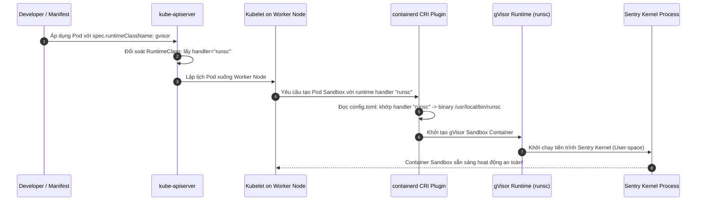
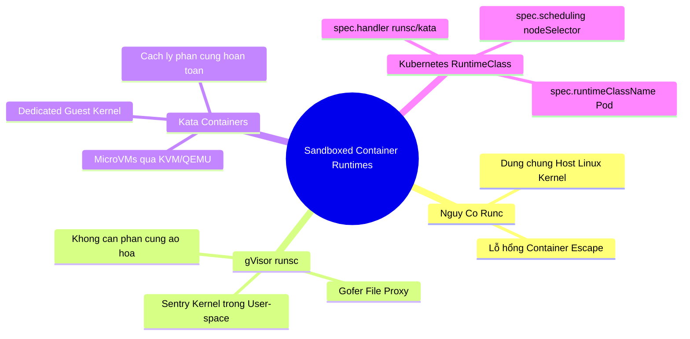


> [!IMPORTANT]
> **Mục tiêu kỹ thuật bài học**:
> - Hiểu rõ nguy cơ an ninh cốt lõi của mô hình container truyền thống (**Shared Host Kernel**) và kỹ thuật tấn công **Container Escape**.
> - Phân tích kiến trúc hoạt động của **gVisor (`runsc`)** gồm 2 thành phần cốt lõi: **Sentry** (Kernel ảo user-space) và **Gofer** (File proxy).
> - Phân tích kiến trúc **Kata Containers** dựa trên **Micro-Virtual Machines (MicroVMs)** và ảo hóa phần cứng KVM.
> - Cấu hình `containerd` daemon (`/etc/containerd/config.toml`) để đăng ký các runtime handlers (`runsc`, `kata`).
> - Khởi tạo tài nguyên Kubernetes **`RuntimeClass`** với cờ `handler` và định tuyến lập lịch qua `scheduling`.
> - Gán thuộc tính `spec.runtimeClassName` vào Pod manifest để cô lập $100\%$ ứng dụng không tin cậy khỏi máy chủ Host.
> - Kiểm chứng sự khác biệt về môi trường nhân qua lệnh `dmesg` và `uname -a` bên trong container.

---

## 1. Bản Chất Kiến Trúc & Tư Duy Cốt Lõi: Sandboxed Containers & Đối Tượng RuntimeClass

Trong kiến trúc container chuẩn (**OCI Runtime - `runc`**), container thực chất chỉ là một tiến trình Linux thông thường được giới hạn tầm nhìn bởi **Namespaces** và giới hạn tài nguyên bởi **cgroups**. Tuy nhiên, container **không có nhân hệ điều hành riêng** mà gọi trực tiếp các System Calls xuống **Linux Kernel của máy chủ Host Node**.

Nếu xuất hiện một lỗ hổng nghiêm trọng trong nhân Linux (ví dụ: *Dirty Pipe - CVE-2022-0847*, *OverlayFS privilege escalation*), một tiến trình chạy trong container có thể lợi dụng lỗ hổng đó để ghi đè bộ nhớ của Kernel và chiếm toàn quyền kiểm soát máy chủ vật lý (**Container Escape**).

Để giải quyết triệt để bài toán này cho các ứng dụng không tin cậy (*Untrusted Workloads* / *Multi-tenant SaaS*), ta cần chuyển sang mô hình **Sandboxed Container Runtimes**:

1. **gVisor (Google `runsc`):** Cung cấp một nhân Linux ảo hoàn chỉnh mang tên **Sentry** viết bằng ngôn ngữ Go chạy hoàn toàn trong *User-space*. Mọi system call của ứng dụng bị Sentry chặn lại và xử lý tại chỗ, tuyệt đối không cho phép ứng dụng chạm trực tiếp vào Host Kernel.
2. **Kata Containers:** Khởi tạo một máy ảo siêu nhẹ (**Micro-Virtual Machine**) riêng biệt cho từng Pod bằng công nghệ ảo hóa phần cứng (KVM / QEMU). Mỗi Pod sở hữu một Linux Kernel và hệ thống bộ nhớ độc lập hoàn toàn.
3. **RuntimeClass:** Tài nguyên Kubernetes chính thức giúp nhà phát triển chỉ định Pod nào cần chạy với runtime thông thường (`runc`) và Pod nào cần chạy với runtime cách ly an toàn cao (`gvisor`, `kata`).

```mermaid
flowchart TD
    subgraph RUNTIME_COMPARISON["🔍 SO SÁNH 3 MÔ HÌNH CONTAINER RUNTIME"]
        direction TB
        
        subgraph STANDARD_RUNC["1. Traditional Container (runc)"]
            APP1["Container App"] -->|"Syscall trực tiếp"| HOST_KERNEL1["⚠️ Dùng Chung Host Linux Kernel (Rủi ro Escape)"]
        end

        subgraph GVISOR_SANDBOX["2. gVisor Sandbox (runsc)"]
            APP2["Untrusted App"] -->|"Syscall"| SENTRY["🛡️ gVisor Sentry (Go User-space Kernel)"]
            SENTRY -->|"Lọc & Giới hạn"| HOST_KERNEL2["Host Linux Kernel (Được Bảo Vệ 100%)"]
        end

        subgraph KATA_SANDBOX["3. Kata Containers (MicroVM)"]
            APP3["Untrusted App"] --> GUEST_KERNEL["🐧 Dedicated Guest Linux Kernel"]
            GUEST_KERNEL --> HYPERVISOR["⚡ Hardware Hypervisor (KVM / QEMU)"]
            HYPERVISOR --> HOST_KERNEL3["Host Hardware & Kernel"]
        end
    end

    style RUNTIME_COMPARISON fill:none,stroke:#6366f1,stroke-width:1.75px
    style STANDARD_RUNC fill:none,stroke:#f43f5e,stroke-width:1.5px
    style GVISOR_SANDBOX fill:none,stroke:#10b981,stroke-width:2px
    style KATA_SANDBOX fill:none,stroke:#3b82f6,stroke-width:1.5px
    style HOST_KERNEL1 fill:none,stroke:#f43f5e,stroke-width:1.5px
    style SENTRY fill:none,stroke:#10b981,stroke-width:1.5px
    style GUEST_KERNEL fill:none,stroke:#3b82f6,stroke-width:1.5px
```



---

## 2. Bảng Ma Trận So Sánh Kỹ Thuật Toàn Diện (Engineering Matrix)

| Tiêu Chí Kỹ Thuật | Standard `runc` | Google gVisor (`runsc`) | Kata Containers (MicroVM) | AWS Firecracker |
| :--- | :--- | :--- | :--- | :--- |
| **Cơ chế cách ly** | Cgroups & Namespaces | Kernel ảo hóa trong User-space (Sentry) | Ảo hóa phần cứng MicroVM (KVM) | MicroVM chuyên dụng cho Serverless |
| **Tốc độ khởi động** | Siêu nhanh ($< 50\text{ ms}$) | Rất nhanh ($< 150\text{ ms}$) | Nhanh ($< 500\text{ ms}$) | Rất nhanh ($< 100\text{ ms}$) |
| **Tiêu tốn bộ nhớ (RAM Overhead)** | Rất thấp ($< 15\text{ MB}$) | Thấp ($+ 20\text{ MB} - 30\text{ MB}$ cho Sentry) | Trung bình ($+ 100\text{ MB} - 150\text{ MB}$ cho Guest OS) | Thấp ($+ 5\text{ MB} - 10\text{ MB}$) |
| **Độ tương thích Syscalls** | $100\%$ Linux Syscalls | Khoảng $75\% - 85\%$ Syscalls thông dụng | $100\%$ (Chạy nhân Linux thật) | Cao |
| **Yêu cầu phần cứng CPU** | Mọi CPU x86_64 / ARM64 | Mọi CPU (Không cần VT-x/AMD-V) | Bắt buộc bật ảo hóa phần cứng (VT-x/KVM) | Bắt buộc hỗ trợ KVM |
| **Trọng tâm thi CKS** | Runtime mặc định | <span class="badge badge--emerald">Bắt buộc cấu hình RuntimeClass</span> | Kiến thức nâng cao | Kiến thức tham khảo |

---

## 3. Kiến Trúc Môi Trường & Luồng Thực Thi Mẫu

Khi người dùng triển khai Pod có thuộc tính `runtimeClassName: gvisor`, luồng xử lý giữa Kubernetes, Container Runtime và gVisor được mô hình hóa qua Sequence Diagram sau:



---

## 4. Phân Tích Cạm Bẫy Thực Chiến: Khởi Tạo Pod Thất Bại Với `CreateContainerError` Do Thiếu Handler Khai Báo Trong containerd `config.toml`

### Tình Huống Sự Cố Thực Tế:
<span class="badge badge--rose">🕒 07:45 AM</span> Trong bài thi CKS, thí sinh tạo thành công đối tượng `RuntimeClass` tên là `gvisor` với `handler: runsc`, sau đó tạo Pod gắn `runtimeClassName: gvisor`. Tuy nhiên, Pod ngay lập tức bị lỗi `CreateContainerError` và kẹt tại trạng thái `ContainerCreating`. Thí sinh loay hoay sửa Pod manifest mà không biết rằng gốc rễ nằm ở cấu hình của Container Runtime trên máy chủ Node.

### Hậu Quả & Log Lỗi Thực Tế:
```text
================================================================================
CRITICAL CONTAINER RUNTIME ERROR: RUNTIME HANDLER NOT CONFIGURED IN CONTAINERD
================================================================================
[ERROR] 2026-09-12T07:45:22.102Z kubelet on worker-node:
Error: failed to create containerd task: failed to runsc runtime:
unknown runtime handler "runsc" from containerd configuration: no such runtime

[FATAL] kubectl describe pod untrusted-app -n default:
Events:
  Type     Reason     Age               From               Message
  ----     ------     ----              ----               -------
  Warning  Failed     10s (x3 over 30s) kubelet            Error: failed to create containerd container:
  runtime handler "runsc" not found in containerd config.toml
================================================================================
```

### 5-Whys Root Cause Analysis:
1. <span class="badge badge--primary">Why 1</span> **Tại sao Pod không thể khởi chạy với RuntimeClass gvisor?** $\rightarrow$ Vì Kubelet báo lỗi `runtime handler "runsc" not found in containerd config.toml`.
2. <span class="badge badge--primary">Why 2</span> **Tại sao Kubelet lại tìm kiếm handler "runsc"?** $\rightarrow$ Vì đối tượng `RuntimeClass` trong Kubernetes khai báo trường `spec.handler: runsc`.
3. <span class="badge badge--primary">Why 3</span> **Tại sao containerd lại không nhận diện được handler "runsc"?** $\rightarrow$ Vì tệp cấu hình `/etc/containerd/config.toml` trên máy chủ Node chưa được khai báo plugin `plugins."io.containerd.grpc.v1.cri".containerd.runtimes.runsc`.
4. <span class="badge badge--primary">Why 4</span> **Tại sao chỉ tạo tài nguyên RuntimeClass trong K8s là chưa đủ?** $\rightarrow$ Vì `RuntimeClass` chỉ là một tài nguyên logic trên Control Plane; bản thân `containerd` trên từng Worker Node phải được cấu hình đường dẫn binary của runtime tương ứng.
5. <span class="badge badge--emerald">Root Cause Remedy</span> **Biện pháp khắc phục chuẩn CKS (2 bước bắt buộc):**
   - <span class="badge badge--emerald">Bước 1: Khai báo Handler trong `/etc/containerd/config.toml`:</span>
     ```toml
     [plugins."io.containerd.grpc.v1.cri".containerd.runtimes.runsc]
       runtime_type = "io.containerd.runsc.v1"
     ```
   - <span class="badge badge--cyan">Bước 2: Khởi động lại containerd:</span>
     ```bash
     sudo systemctl restart containerd
     ```

---

## 5. Hands-on Lab: Khởi Tạo RuntimeClass gVisor & Triển Khai Sandboxed Pod Cách Ly (8 Bước)

| Bước | Mục Tiêu Kỹ Thuật | Đầu Ra Kiểm Tra |
| :---: | :--- | :--- |
| **1** | Kiểm tra cài đặt binary `runsc` trên máy chủ Node | `runsc --version` hoạt động chính xác |
| **2** | Cấu hình đăng ký runtime handler `runsc` trong `config.toml` | Tệp `/etc/containerd/config.toml` chứa runtime `runsc` |
| **3** | Khởi động lại dịch vụ `containerd` | `systemctl status containerd` active |
| **4** | Khởi tạo tài nguyên Kubernetes `RuntimeClass` | Đối tượng `RuntimeClass: gvisor` sẵn sàng |
| **5** | Triển khai Pod thông thường sử dụng runtime `runc` mặc định | Pod `standard-pod` chạy với Host Kernel |
| **6** | Triển khai Pod Sandboxed sử dụng `runtimeClassName: gvisor` | Pod `sandboxed-pod` chạy trong gVisor Sandbox |
| **7** | Kiểm tra tính cô lập Kernel bằng lệnh `dmesg` bên trong Pod | `sandboxed-pod` in ra thông điệp gVisor Sentry |
| **8** | Kiểm định toàn diện ranh giới an toàn của Sandboxed Pod | Hoàn tất xác thực cách ly an toàn cao |

### Bước 1: Kiểm Tra Cài Đặt Binary `runsc`

```bash
runsc --version
```

### Bước 2: Cấu Hình Đăng Ký Handler `runsc` Trong `/etc/containerd/config.toml`

```bash
cat <<'EOF' | sudo tee -a /etc/containerd/config.toml

[plugins."io.containerd.grpc.v1.cri".containerd.runtimes.runsc]
  runtime_type = "io.containerd.runsc.v1"
EOF
```

### Bước 3: Khởi Động Lại containerd Daemon

```bash
sudo systemctl restart containerd
sudo systemctl is-active containerd
```

### Bước 4: Khởi Tạo Tài Nguyên Kubernetes `RuntimeClass`

```bash
cat <<EOF | kubectl apply -f -
apiVersion: node.k8s.io/v1
kind: RuntimeClass
metadata:
  name: gvisor
handler: runsc
EOF

# Kiểm tra RuntimeClass đã được tạo
kubectl get runtimeclass
```

### Bước 5: Triển Khai Pod Thông Thường (Default `runc`)

```bash
cat <<EOF | kubectl apply -f -
apiVersion: v1
kind: Pod
metadata:
  name: standard-pod
  namespace: default
spec:
  containers:
  - name: app
    image: busybox:latest
    command: ["sleep", "3600"]
EOF
```

### Bước 6: Triển Khai Pod Sandboxed Với `runtimeClassName: gvisor`

```bash
cat <<EOF | kubectl apply -f -
apiVersion: v1
kind: Pod
metadata:
  name: sandboxed-pod
  namespace: default
spec:
  runtimeClassName: gvisor
  containers:
  - name: untrusted-app
    image: busybox:latest
    command: ["sleep", "3600"]
EOF
```

### Bước 7: Kiểm Chứng Sự Khác Biệt Giữa 2 Môi Trường Bằng `dmesg`

```bash
# 1. Kiểm tra Pod thông thường: Nhìn thấy toàn bộ log phần cứng của Host Node
kubectl exec standard-pod -- dmesg | head -n 5

# 2. Kiểm tra Pod Sandboxed gVisor: Chỉ nhìn thấy log ảo của gVisor Sentry
kubectl exec sandboxed-pod -- dmesg

# Đầu ra kỳ vọng của gVisor: "Starting gVisor..." hoặc log trống cô lập hoàn toàn!
```

### Bước 8: Kiểm Tra Thông Tin Nhân Hệ Điều Hành Bằng `uname -a`

```bash
# Kiểm tra uname trong gVisor Pod
kubectl exec sandboxed-pod -- uname -a

echo ">> [VERIFIED] Chuc mung ban da thiet lap thanh cong Sandboxed RuntimeClass theo chuan CKS!"
```

---

## 6. 10 Câu Hỏi Tự Kiểm Tra Chuyên Sâu (Self-Check Q&A Accordion)

<details class="qa-card">
<summary class="qa-summary">
  <div class="qa-summary-left">
    <span class="qa-num-badge">Q01</span>
    <span>Trường `spec.handler` trong đối tượng `RuntimeClass` liên kết với cấu hình nào trên máy chủ Worker Node?</span>
  </div>
  <span class="qa-chevron">
    <svg width="18" height="18" fill="none" stroke="currentColor" stroke-width="2.5" viewBox="0 0 24 24"><polyline points="6 9 12 15 18 9"></polyline></svg>
  </span>
</summary>
<div class="qa-answer">
  <div class="qa-answer-header">
    <svg width="14" height="14" fill="none" stroke="currentColor" stroke-width="2" viewBox="0 0 24 24"><path d="M22 11.08V12a10 10 0 1 1-5.93-9.14"></path><polyline points="22 4 12 14.01 9 11.01"></polyline></svg>
    <span>Phân Tích &amp; Lời Giải Kỹ Thuật</span>
  </div>
  <div style="margin-bottom: 8px;">Trường <code>spec.handler</code> (ví dụ: <code>runsc</code> hoặc <code>kata</code>) ánh xạ trực tiếp tới khối cấu hình <b style="color: var(--accent-primary);">plugins."io.containerd.grpc.v1.cri".containerd.runtimes.&lt;handler-name&gt;</b> bên trong tệp <code>/etc/containerd/config.toml</code> của Container Runtime trên Node.</div>
</div>
</details>

<details class="qa-card">
<summary class="qa-summary">
  <div class="qa-summary-left">
    <span class="qa-num-badge">Q02</span>
    <span>Sự khác biệt cốt lõi về cơ chế cách ly giữa Google gVisor và Kata Containers là gì?</span>
  </div>
  <span class="qa-chevron">
    <svg width="18" height="18" fill="none" stroke="currentColor" stroke-width="2.5" viewBox="0 0 24 24"><polyline points="6 9 12 15 18 9"></polyline></svg>
  </span>
</summary>
<div class="qa-answer">
  <div class="qa-answer-header">
    <svg width="14" height="14" fill="none" stroke="currentColor" stroke-width="2" viewBox="0 0 24 24"><path d="M22 11.08V12a10 10 0 1 1-5.93-9.14"></path><polyline points="22 4 12 14.01 9 11.01"></polyline></svg>
    <span>Phân Tích &amp; Lời Giải Kỹ Thuật</span>
  </div>
  <div style="margin-bottom: 8px;"><b style="color: var(--accent-emerald);">gVisor (runsc):</b> Cách ly dựa trên nhân ảo trong User-space (Sentry) viết bằng Go để đánh chặn và xử lý syscalls mà không cần ảo hóa phần cứng. <b style="color: var(--accent-cyan);">Kata Containers:</b> Cách ly dựa trên ảo hóa phần cứng thực thụ (MicroVMs chạy qua QEMU/KVM), mỗi Pod sở hữu một nhân Linux Kernel độc lập riêng biệt.</div>
</div>
</details>

<details class="qa-card">
<summary class="qa-summary">
  <div class="qa-summary-left">
    <span class="qa-num-badge">Q03</span>
    <span>Trường `spec.overhead` trong định nghĩa `RuntimeClass` có ý nghĩa gì đối với việc lập lịch của Kubernetes?</span>
  </div>
  <span class="qa-chevron">
    <svg width="18" height="18" fill="none" stroke="currentColor" stroke-width="2.5" viewBox="0 0 24 24"><polyline points="6 9 12 15 18 9"></polyline></svg>
  </span>
</summary>
<div class="qa-answer">
  <div class="qa-answer-header">
    <svg width="14" height="14" fill="none" stroke="currentColor" stroke-width="2" viewBox="0 0 24 24"><path d="M22 11.08V12a10 10 0 1 1-5.93-9.14"></path><polyline points="22 4 12 14.01 9 11.01"></polyline></svg>
    <span>Phân Tích &amp; Lời Giải Kỹ Thuật</span>
  </div>
  <div style="margin-bottom: 8px;"><code>spec.overhead</code> khai báo lượng tài nguyên RAM và CPU tiêu hao thêm do bản thân sandbox runtime sử dụng (ví dụ RAM của MicroVM guest kernel hoặc Sentry). Kubernetes Scheduler sẽ <b style="color: var(--accent-amber);">cộng thêm lượng overhead này vào tổng Resource Requests của Pod</b> khi tính toán dung lượng trống của Node để lập lịch chính xác.</div>
</div>
</details>

<details class="qa-card">
<summary class="qa-summary">
  <div class="qa-summary-left">
    <span class="qa-num-badge">Q04</span>
    <span>Làm thế nào để đảm bảo rằng các Pod sử dụng `RuntimeClass: gvisor` chỉ được lập lịch lên các Worker Node đã có cài đặt `runsc`?</span>
  </div>
  <span class="qa-chevron">
    <svg width="18" height="18" fill="none" stroke="currentColor" stroke-width="2.5" viewBox="0 0 24 24"><polyline points="6 9 12 15 18 9"></polyline></svg>
  </span>
</summary>
<div class="qa-answer">
  <div class="qa-answer-header">
    <svg width="14" height="14" fill="none" stroke="currentColor" stroke-width="2" viewBox="0 0 24 24"><path d="M22 11.08V12a10 10 0 1 1-5.93-9.14"></path><polyline points="22 4 12 14.01 9 11.01"></polyline></svg>
    <span>Phân Tích &amp; Lời Giải Kỹ Thuật</span>
  </div>
  <div style="margin-bottom: 8px;">Khai báo khối <code>spec.scheduling.nodeSelector</code> bên trong định nghĩa <code>RuntimeClass</code>:
  <div style="margin-top: 6px; padding: 8px; background: rgba(0,0,0,0.2); border-radius: 4px; font-family: monospace; font-size: 0.9em;">
  spec:<br/>
  &nbsp;&nbsp;handler: runsc<br/>
  &nbsp;&nbsp;scheduling:<br/>
  &nbsp;&nbsp;&nbsp;&nbsp;nodeSelector:<br/>
  &nbsp;&nbsp;&nbsp;&nbsp;&nbsp;&nbsp;sandbox.runtime: gvisor
  </div>
  K8s sẽ tự động chuyển tiếp Pod tới các Node có gắn nhãn <code>sandbox.runtime=gvisor</code>.
  </div>
</div>
</details>

<details class="qa-card">
<summary class="qa-summary">
  <div class="qa-summary-left">
    <span class="qa-num-badge">Q05</span>
    <span>Tại sao lệnh `dmesg` bên trong một Pod chạy bằng gVisor lại không hiển thị log của máy chủ Host vật lý?</span>
  </div>
  <span class="qa-chevron">
    <svg width="18" height="18" fill="none" stroke="currentColor" stroke-width="2.5" viewBox="0 0 24 24"><polyline points="6 9 12 15 18 9"></polyline></svg>
  </span>
</summary>
<div class="qa-answer">
  <div class="qa-answer-header">
    <svg width="14" height="14" fill="none" stroke="currentColor" stroke-width="2" viewBox="0 0 24 24"><path d="M22 11.08V12a10 10 0 1 1-5.93-9.14"></path><polyline points="22 4 12 14.01 9 11.01"></polyline></svg>
    <span>Phân Tích &amp; Lời Giải Kỹ Thuật</span>
  </div>
  <div style="margin-bottom: 8px;">Bởi vì tiến trình bên trong gVisor giao tiếp trực tiếp với nhân ảo **Sentry**. Sentry giả lập toàn bộ hệ thống ring buffer của kernel và <b style="color: var(--accent-emerald);">hoàn toàn cô lập bộ nhớ log kernel của Host</b>, ngăn chặn triệt để hành vi trích xuất thông tin phần cứng hoặc kernel crash dump của máy chủ.</div>
</div>
</details>

<details class="qa-card">
<summary class="qa-summary">
  <div class="qa-summary-left">
    <span class="qa-num-badge">Q06</span>
    <span>Hai thành phần cốt lõi cấu tạo nên kiến trúc gVisor là gì và nhiệm vụ của từng thành phần?</span>
  </div>
  <span class="qa-chevron">
    <svg width="18" height="18" fill="none" stroke="currentColor" stroke-width="2.5" viewBox="0 0 24 24"><polyline points="6 9 12 15 18 9"></polyline></svg>
  </span>
</summary>
<div class="qa-answer">
  <div class="qa-answer-header">
    <svg width="14" height="14" fill="none" stroke="currentColor" stroke-width="2" viewBox="0 0 24 24"><path d="M22 11.08V12a10 10 0 1 1-5.93-9.14"></path><polyline points="22 4 12 14.01 9 11.01"></polyline></svg>
    <span>Phân Tích &amp; Lời Giải Kỹ Thuật</span>
  </div>
  <div style="margin-bottom: 8px;">Gồm 2 thành phần: (1) <b style="color: var(--accent-emerald);">Sentry:</b> Nhân hệ điều hành ảo viết bằng Go, trực tiếp xử lý các cuộc gọi hệ thống của ứng dụng; và (2) <b style="color: var(--accent-cyan);">Gofer:</b> Tiến trình proxy tệp tin trung gian chịu trách nhiệm đọc/ghi dữ liệu từ hệ thống tệp của Host an toàn thông qua giao thức 9P/lisafs.</div>
</div>
</details>

<details class="qa-card">
<summary class="qa-summary">
  <div class="qa-summary-left">
    <span class="qa-num-badge">Q07</span>
    <span>Điều gì xảy ra nếu bạn triển khai một ứng dụng yêu cầu sử dụng các tính năng mạng tầng sâu (như Raw Sockets hoặc BPF JIT) trên gVisor?</span>
  </div>
  <span class="qa-chevron">
    <svg width="18" height="18" fill="none" stroke="currentColor" stroke-width="2.5" viewBox="0 0 24 24"><polyline points="6 9 12 15 18 9"></polyline></svg>
  </span>
</summary>
<div class="qa-answer">
  <div class="qa-answer-header">
    <svg width="14" height="14" fill="none" stroke="currentColor" stroke-width="2" viewBox="0 0 24 24"><path d="M22 11.08V12a10 10 0 1 1-5.93-9.14"></path><polyline points="22 4 12 14.01 9 11.01"></polyline></svg>
    <span>Phân Tích &amp; Lời Giải Kỹ Thuật</span>
  </div>
  <div style="margin-bottom: 8px;">Ứng dụng có thể <b style="color: var(--accent-rose);">báo lỗi và không hoạt động được</b>. gVisor triển khai ngăn xếp mạng ảo Netstack trong Go và chỉ hỗ trợ các socket TCP/UDP tiêu chuẩn. Các tính năng kernel nâng cao chưa được hiện thực hóa trong Sentry sẽ trả về mã lỗi <code>ENOSYS (Function not implemented)</code>.</div>
</div>
</details>

<details class="qa-card">
<summary class="qa-summary">
  <div class="qa-summary-left">
    <span class="qa-num-badge">Q08</span>
    <span>Tại sao Kata Containers bắt buộc máy chủ vật lý hoặc máy ảo đám mây phải hỗ trợ ảo hóa lồng nhau (Nested Virtualization)?</span>
  </div>
  <span class="qa-chevron">
    <svg width="18" height="18" fill="none" stroke="currentColor" stroke-width="2.5" viewBox="0 0 24 24"><polyline points="6 9 12 15 18 9"></polyline></svg>
  </span>
</summary>
<div class="qa-answer">
  <div class="qa-answer-header">
    <svg width="14" height="14" fill="none" stroke="currentColor" stroke-width="2" viewBox="0 0 24 24"><path d="M22 11.08V12a10 10 0 1 1-5.93-9.14"></path><polyline points="22 4 12 14.01 9 11.01"></polyline></svg>
    <span>Phân Tích &amp; Lời Giải Kỹ Thuật</span>
  </div>
  <div style="margin-bottom: 8px;">Kata Containers khởi tạo một máy ảo phần cứng MicroVM thực thụ cho mỗi Pod thông qua Linux KVM (Kernel-based Virtual Machine). Nếu Worker Node là một máy ảo trên Cloud (như AWS EC2 hay GCP Compute Engine), máy ảo đó <b style="color: var(--accent-primary);">bắt buộc phải bật Nested Virtualization</b> để có thể tạo thêm máy ảo con bên trong nó.</div>
</div>
</details>

<details class="qa-card">
<summary class="qa-summary">
  <div class="qa-summary-left">
    <span class="qa-num-badge">Q09</span>
    <span>Làm thế nào để kiểm tra danh sách tất cả các RuntimeClass đang có sẵn trong cụm Kubernetes?</span>
  </div>
  <span class="qa-chevron">
    <svg width="18" height="18" fill="none" stroke="currentColor" stroke-width="2.5" viewBox="0 0 24 24"><polyline points="6 9 12 15 18 9"></polyline></svg>
  </span>
</summary>
<div class="qa-answer">
  <div class="qa-answer-header">
    <svg width="14" height="14" fill="none" stroke="currentColor" stroke-width="2" viewBox="0 0 24 24"><path d="M22 11.08V12a10 10 0 1 1-5.93-9.14"></path><polyline points="22 4 12 14.01 9 11.01"></polyline></svg>
    <span>Phân Tích &amp; Lời Giải Kỹ Thuật</span>
  </div>
  <div style="margin-bottom: 8px;">Sử dụng lệnh: <b style="color: var(--accent-primary);">kubectl get runtimeclass</b> (hoặc <code>kubectl get runtimeclasses.node.k8s.io</code>). Đầu ra sẽ liệt kê tên RuntimeClass và giá trị handler tương ứng.</div>
</div>
</details>

<details class="qa-card">
<summary class="qa-summary">
  <div class="qa-summary-left">
    <span class="qa-num-badge">Q10</span>
    <span>Khái niệm "Container Escape" là gì và tại sao Sandboxed Runtimes lại là giải pháp phòng thủ triệt để nhất?</span>
  </div>
  <span class="qa-chevron">
    <svg width="18" height="18" fill="none" stroke="currentColor" stroke-width="2.5" viewBox="0 0 24 24"><polyline points="6 9 12 15 18 9"></polyline></svg>
  </span>
</summary>
<div class="qa-answer">
  <div class="qa-answer-header">
    <svg width="14" height="14" fill="none" stroke="currentColor" stroke-width="2" viewBox="0 0 24 24"><path d="M22 11.08V12a10 10 0 1 1-5.93-9.14"></path><polyline points="22 4 12 14.01 9 11.01"></polyline></svg>
    <span>Phân Tích &amp; Lời Giải Kỹ Thuật</span>
  </div>
  <div style="margin-bottom: 8px;"><b style="color: var(--accent-rose);">Container Escape:</b> Hành vi kẻ tấn công phá vỡ các rào chắn cách ly phần mềm của container để truy cập và thực thi lệnh trực tiếp trên hệ điều hành máy chủ Host. <b style="color: var(--accent-emerald);">Sandboxed Runtimes:</b> Loại bỏ hoàn toàn việc chia sẻ Host Kernel trực tiếp, biến ranh giới container thành ranh giới ảo hóa độc lập, đảm bảo ngay cả khi Kernel trong Sandbox bị sập thì máy chủ Host vẫn an toàn 100%.</div>
</div>
</details>

---

## 7. Tổng Kết & Lộ Trình Bài Học Tiếp Theo



Làm chủ **Sandboxed Container Runtimes** và **RuntimeClass** giúp bạn bảo vệ toàn diện các ứng dụng không tin cậy và hoàn thành xuất sắc các bài toán nâng cao trong kỳ thi CKS.

> [!TIP]
> **BÀI HỌC TIẾP THEO:**
> Trong **[[Bài 12] Quản Lý Bí Mật Nâng Cao: Secrets Store CSI Driver, HashiCorp Vault & Auto-Rotation](cks-12-12-quan-ly-secret-nang-cao-va-csi.html)**, chúng ta sẽ khám phá giải pháp quản lý Secret cấp doanh nghiệp: Tích hợp Secrets Store CSI Driver, nạp khóa từ Vault/Cloud KMS dưới dạng Volume gắn ngoài và tự động xoay vòng khóa không cần restart Pod.

