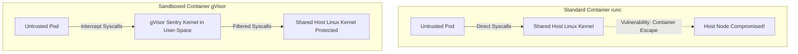
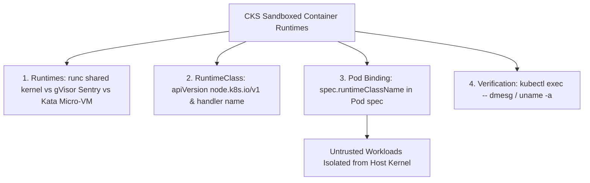


# [BÀI 11] CONTAINER RUNTIME CÁCH LY AN TOÀN CAO: SANDBOXED CONTAINERS VỚI GVISOR, KATA CONTAINERS & RUNTIMECLASS

Trong kỷ nguyên điện toán đám mây và kiến trúc microservices phân tán quy mô lớn, **Kubernetes (CKS)** đóng vai trò là nền tảng điều phối container (Container Orchestration) tiêu chuẩn công nghiệp. Để làm chủ hệ thống trong môi trường sản xuất (Production) cũng như chinh phục kỳ thi chứng chỉ quốc tế của Linux Foundation / CNCF, kỹ sư không chỉ nắm vững các câu lệnh thao tác cơ bản mà phải thấu hiểu sâu sắc bản chất cơ chế tầng thấp: từ chu trình điều hòa (Reconciliation Loop), cấu trúc điều phối tài nguyên, kiến trúc mạng CNI, lưu trữ CSI cho đến các chuẩn mực an ninh phòng thủ chiều sâu.

Bài viết chuyên sâu này sẽ đồng hành cùng bạn giải mã toàn diện bức tranh kiến trúc, phân tích các đánh đổi kỹ thuật thực chiến (Engineering Trade-offs), cung cấp bài thực hành Lab từng bước và bộ câu hỏi phỏng vấn chuẩn Architect / Lead Engineer.

---

## 1. Bản Chất Kiến Trúc & Cơ Chế Vận Hành Tầng Thấp

| # | Câu hỏi ôn tập | Đáp án chuẩn ngắn gọn |
|---|---|---|
| 1 | Nguyên tắc phân quyền cơ bản nhất trong RBAC CKS? | **Least Privilege Principle** (không dùng cờ `*`) |
| 2 | Ba cờ quyền leo thang đặc quyền nguy hiểm nhất? | **`verbs: ["escalate"]`**, **`verbs: ["bind"]`**, **`verbs: ["impersonate"]`** |
| 3 | Thuộc tính vô hiệu hóa tự động mount token SA? | **`automountServiceAccountToken: false`** |
| 4 | Lệnh CLI giả lập kiểm tra phân quyền RBAC? | **`kubectl auth can-i <verb> <res> --as=...`** |
| 5 | Đối tượng phân quyền bị giới hạn trong 1 Namespace? | **`Role`** và **`RoleBinding`** |


> **"Thiết lập môi trường thực thi cách ly an toàn cao (Sandboxed Container Runtimes) bằng gVisor và Kata Containers kết hợp với đối tượng RuntimeClass là kỹ năng bảo mật nâng cao thuộc miền Minimize Microservice Vulnerabilities (20%) trong chứng chỉ CKS, đòi hỏi chuyên gia bảo mật phải hiểu rõ ranh giới an toàn của Container truyền thống (runc chung kernel Host) và nguy cơ tấn công Container Escape; làm chủ cơ chế sandbox của gVisor (`runsc` đánh chặn hệ thống syscalls trong user-space) và Kata Containers (mô hình micro-VM cách ly bằng KVM/QEMU); đồng thời cấu hình thành thục tệp khai báo `RuntimeClass` chỉ định cờ `handler` tương ứng và gán thuộc tính `runtimeClassName` vào Pod spec để cách ly 100% các ứng dụng không tin cậy (untrusted workloads) khỏi hệ điều hành Host Node."**

**Kết quả từ các buổi trước được sử dụng lại:**

| Kết quả / Công cụ | Buổi + số hiệu `QT` | Dùng ở đâu trong buổi này |
|---|---|---|
| Cấu hình container engine CRI containerd | Buổi 08 `QT 4.1` | Khai báo các handler `gvisor` / `kata` trong containerd config |
| Thiết lập SecurityContext chống leo thang | Buổi 50 `QT 4.1` | Kết hợp SecurityContext với Sandboxed RuntimeClass |
| Quản lý nhãn và scheduling node selector | Buổi 16 `QT 4.1` | Cấu hình `spec.scheduling` trong `RuntimeClass` |

---


| # | Kỹ năng thực hiện được | Hiện vật chứng minh |
|---|---|---|
| 1 | Phân biệt kiến trúc `runc`, `gVisor` và `Kata Containers` | Sơ đồ so sánh cơ chế Sandbox Runtimes |
| 2 | Biên soạn tệp khai báo Kubernetes `RuntimeClass` | Tệp YAML `RuntimeClass` có cờ `handler` |
| 3 | Gán thuộc tính `runtimeClassName` cách ly Pod không tin cậy | Tệp YAML Pod spec chứa `runtimeClassName` |
| 4 | Kiểm chứng tính cách ly kernel trong Pod Sandbox qua CLI | Đầu ra lệnh `kubectl exec -- dmesg` |
| 5 | Chẩn đoán lỗi `CreateContainerError` do thiếu cờ handler | Nhật ký lỗi Pod kẹt trạng thái khởi tạo runtime |

---


| Kiến thức tiên quyết | Nguồn tự học nếu thiếu |
|---|---|
| Kiến trúc Container Engine CRI (containerd, runc) | Buổi 08 (`QT 4.1`) |
| Thiết lập SecurityContext cho Pods | Buổi 50 (`QT 4.1`) |
| Định nghĩa nhãn Node và NodeSelector | Buổi 16 (`QT 4.1`) |

---


### 3.1. Thuật ngữ Việt–Anh

| # | Thuật ngữ tiếng Việt | Tiếng Anh tương đương | Ghi chú chuẩn hoá trong thân bài |
|---|---|---|---|
| 1 | Môi trường thực thi cách ly | Sandboxed Container Runtime | Môi trường ảo hóa/sandbox ngăn container gọi trực tiếp Host Kernel |
| 2 | Lớp định nghĩa môi trường thực thi | RuntimeClass | Đối tượng K8s liên kết Pod với container runtime handler |
| 3 | Bộ xử lý runtime gVisor | gVisor Runtime (`runsc`) | Sandbox do Google phát triển viết kernel ảo bằng Go trong user-space |
| 4 | Bộ xử lý runtime Kata | Kata Containers (`kata-runtime`) | Sandbox dùng công nghệ micro-VM siêu nhẹ cách ly bằng QEMU/KVM |
| 5 | Bộ xử lý container tiêu chuẩn | Standard Container Runtime (`runc`) | Runtime tiêu chuẩn dùng chung Linux Kernel với Host Node |
| 6 | Thất thoát container thoát hiểm | Container Escape Attack | Kỹ thuật tấn công phá vỡ vỏ container để chiếm quyền Host OS |
| 7 | Đánh chặn lời gọi hệ thống | System Call Interception | Kỹ thuật bắt và xử lý các syscalls Linux bên trong gVisor Sentry |
| 8 | Máy ảo siêu nhẹ | Micro-Virtual Machine (micro-VM) | Máy ảo khởi động cực nhanh với kernel Linux riêng biệt |
| 9 | Thuộc tính chỉ định runtime | `runtimeClassName` | Thuộc tính dưới Pod spec dùng để chọn RuntimeClass |
| 10 | Tải trọng không tin cậy | Untrusted Workload | Các ứng dụng nguồn mở bên ngoài hoặc multi-tenant code |
| 11 | Chi phí tiêu tốn tài nguyên thừa | Performance Overhead / Latency | Dung lượng RAM/CPU và độ trễ tăng thêm khi dùng sandbox |
| 12 | Tệp cấu hình containerd | Containerd Config (`config.toml`) | Tệp cấu hình chứa định nghĩa các plugins.cri.containerd.runtimes |
| 13 | Thành phần gVisor Sentry | gVisor Sentry Kernel | Nhân Linux ảo viết bằng Go chạy trong user-space của gVisor |
| 14 | Chi phí tài nguyên định tuyến | `spec.overhead` | Khai báo tài nguyên RAM/CPU tính thêm cho Pod sandbox trong K8s |


Mô hình Thuê Căn Hộ Chung Cư và Biệt Thự Lập Phương Sandbox: Container truyền thống (`runc`) giống như các Căn Hộ Thuê Trong Cùng Một Tòa Nhà: các phòng chỉ ngăn nhau bằng bức tường thạch cao (namespaces & cgroups), nhưng DÙNG CHUNG toàn bộ đường ống nước và móng nhà (Linux Host Kernel). Nếu một phòng bị vỡ đường ống (Kernel vulnerability), toàn bộ tòa nhà sẽ bị ảnh hưởng. gVisor (`runsc`) giống như Căn Hộ Có Thợ Lặn Bảo Vệ Đứng Ở Cửa: mọi yêu cầu nước/điện (syscalls) đều phải đi qua Thợ Lặn ảo dịch thuật trước khi tới móng nhà. Kata Containers giống như việc xây hẳn một Căn Biệt Thự Lập Phương Riêng (Micro-VM): mỗi căn hộ có móng nhà và hệ thống đường ống độc lập hoàn toàn 100% (Kernel Linux riêng), nếu căn biệt thự đó cháy cũng không ảnh hưởng tới các nhà xung quanh.

---

### 1.1. Kiến trúc Môi trường Thực thi Cách ly (Sandboxed Runtimes) và Nguy cơ Container Escape (12 phút)

**Nguyên lý cốt lõi:** Tất cả các ứng dụng không tin cậy (Untrusted Workloads như user code, multi-tenant app, 3rd party parser) BẮT BUỘC phải được triển khai trong môi trường Sandboxed Runtime (gVisor hoặc Kata) để triệt tiêu nguy cơ Container Escape.

**Giải thích cơ chế ngầm:** Container truyền thống (`runc`) chia sẻ chung nhân Linux Kernel với Host Node. Nếu xuất hiện lỗ hổng 0-day trong Linux Kernel (như Dirty COW, Use-After-Free), kẻ tấn công trong container có thể thực hiện kỹ thuật Container Escape để lấy quyền root trên Host Node.

> [!WARNING]
> **CẠM BẪY THỰC CHIẾN:**
> Chạy mã nguồn không tin cậy của bên thứ ba trực tiếp bằng `runc` tiêu chuẩn trên cụm Production.

**Minh hoạ.**



**Nguyên lý cốt lõi:** gVisor (`runsc`) đánh chặn 100% các lời gọi hệ thống (syscalls) trong không gian người dùng (user-space) thông qua Sentry, ngăn không cho tiến trình trong container tương tác trực tiếp với Host Kernel.

**Giải thích cơ chế ngầm:** Sentry của gVisor hoạt động như một nhân Linux giả lập viết bằng ngôn ngữ Go. Mọi lời gọi hệ thống từ container được xử lý nội bộ trong Sentry mà không chuyển tiếp thẳng xuống Host Kernel.

> [!WARNING]
> **CẠM BẪY THỰC CHIẾN:**
> Cho rằng gVisor chỉ là một cấu hình seccomp profile đơn thuần thay vì một Sandboxed Kernel độc lập.

**Minh hoạ.**

```bash
# Phản hồi lệnh dmesg bên trong gVisor Container:
# [    0.000000] Starting gVisor...
```

---

### 1.2. Định nghĩa đối tượng `RuntimeClass` trong Kubernetes (K8s 1.28+) (12 phút)

**Nguyên lý cốt lõi:** Để chỉ định một môi trường sandbox trong Kubernetes, bắt buộc phải khởi tạo đối tượng `RuntimeClass` với thuộc tính `handler` tương ứng với cấu hình trong `containerd` (ví dụ `handler: gvisor` hoặc `handler: kata`).

**Giải thích cơ chế ngầm:** Đối tượng `RuntimeClass` làm cầu nối trừu tượng giữa bản kê khai YAML của Kubernetes và trình điều khiển CRI Container Runtime (`containerd` / `CRIO`) trên các Host Nodes.

> [!WARNING]
> **CẠM BẪY THỰC CHIẾN:**
> Tạo `RuntimeClass` với từ khóa `handler` không trùng khớp với tên cấu hình trong `/etc/containerd/config.toml`.

**Minh hoạ.**

```yaml
apiVersion: node.k8s.io/v1
kind: RuntimeClass
metadata:
  name: gvisor
handler: gvisor # Phải trùng tên handler khai báo trong containerd config!
```

**Nguyên lý cốt lõi:** Thuộc tính `runtimeClassName: <tên-runtimeclass>` phải được khai báo trực tiếp dưới `spec` của Pod manifest để ép buộc Kubelet khởi tạo container qua Sandboxed Runtime.

**Giải thích cơ chế ngầm:** Nếu không khai báo `runtimeClassName`, Kubelet sẽ tự động sử dụng container runtime mặc định của cụm (`runc`).

> [!WARNING]
> **CẠM BẪY THỰC CHIẾN:**
> Khởi tạo đối tượng `RuntimeClass` thành công nhưng quên khai báo `runtimeClassName: gvisor` trong tệp Pod spec.

**Minh hoạ.**

```yaml
apiVersion: v1
kind: Pod
metadata:
  name: untrusted-app
  namespace: prod
spec:
  runtimeClassName: gvisor # Ép buộc chạy qua gVisor Sandbox!
  containers:
    - name: app
      image: nginx:alpine
```

---

### 1.3. Gán `runtimeClassName` cho Pod Un-trusted và Phân tích Đánh đổi Hiệu năng (Benchmarking) (10 phút)

**Nguyên lý cốt lõi:** Khi biên soạn `RuntimeClass` cho Sandbox Runtimes, nên khai báo khối `spec.overhead.podFixed` để Kubernetes Scheduler tính toán chính xác chi phí RAM/CPU phát sinh thêm của gVisor/Kata Daemon.

**Giải thích cơ chế ngầm:** Các môi trường sandbox (đặc biệt là Kata micro-VM) tiêu tốn thêm một khoảng bộ nhớ và CPU nhất định cho tiến trình shim/VMM. Khai báo `spec.overhead` giúp Scheduler không xếp quá tải Pod trên Node.

> [!WARNING]
> **CẠM BẪY THỰC CHIẾN:**
> Bỏ qua `spec.overhead` làm cho Node bị hết RAM (OOM) do chi phí ngầm của Micro-VM.

**Minh hoạ.**

```yaml
apiVersion: node.k8s.io/v1
kind: RuntimeClass
metadata:
  name: kata
handler: kata
overhead:
  podFixed:
    memory: "120Mi"
    cpu: "250m"
```

**Nguyên lý cốt lõi:** Kiểm tra tính cách ly của gVisor Sandbox bằng cách chạy lệnh `dmesg` hoặc `uname -a` bên trong container: gVisor sẽ trả về chuỗi `gVisor` hoặc kernel giả định thay vì thông tin thật của Host OS.

**Giải thích cơ chế ngầm:** Tiến trình trong gVisor container chỉ giao tiếp với Sentry Kernel ảo nên kết quả `uname -a` hoặc `dmesg` sẽ hiển thị thông tin ảo hóa.

> [!WARNING]
> **CẠM BẪY THỰC CHIẾN:**
> Chạy `uname -r` trong Pod sandbox mà kết quả lại in ra phiên bản Linux Kernel thật của Host Node.

**Minh hoạ.**

```bash
# Kiểm tra phiên bản kernel bên trong gVisor Pod:
kubectl exec untrusted-app -- uname -a
# Phản hồi: Linux untrusted-app 4.4.0 #1 SMP Sun Jan 10 00:00:00 UTC 2016 x86_64 GNU/Linux (gVisor)
```

**Nguyên lý cốt lõi:** Khi chẩn đoán lỗi Pod kẹt trạng thái `CreateContainerError` liên quan tới RuntimeClass, kiểm tra xem tên cờ `handler` trong `RuntimeClass` có khớp 100% với tên runtime định nghĩa trong tệp `/etc/containerd/config.toml` của Node hay không.

**Giải thích cơ chế ngầm:** Kubelet gọi sang `containerd` thông qua cờ `handler`. Nếu tên handler bị gõ sai, containerd sẽ từ chối khởi tạo container.

> [!WARNING]
> **CẠM BẪY THỰC CHIẾN:**
> Loay hoay tìm lỗi ở ứng dụng trong khi nguyên nhân do gõ sai tên `handler` trong `RuntimeClass`.

**Minh hoạ.**

```bash
# Kiểm tra file containerd config trên Node:
# [plugins."io.containerd.grpc.v1.cri".containerd.runtimes.gvisor]
#   runtime_type = "io.containerd.runsc.v1"
```

---

### 1.4. Đưa vào cụm thật (4 phút)

**Nguyên lý cốt lõi:** Bản kê khai `RuntimeClass` chuẩn CKS hoàn chỉnh bắt buộc phải có: `apiVersion: node.k8s.io/v1`, `kind: RuntimeClass`, `metadata.name`, và `handler` chỉ định chính xác trình điều khiển sandbox của Node.

**Giải thích cơ chế ngầm:** Đáp ứng 100% định dạng API schema tiêu chuẩn của Kubernetes v1.28+.

> [!WARNING]
> **CẠM BẪY THỰC CHIẾN:**
> Gõ sai `apiVersion` thành `v1` thay vì `node.k8s.io/v1`.

**Minh hoạ.**

```yaml
apiVersion: node.k8s.io/v1
kind: RuntimeClass
metadata:
  name: gvisor
handler: runsc
```

**Áp vào cụm đang chạy thì làm gì trước:**
1. Cài đặt các gói nhị phân runtime sandbox (`runsc` hoặc `kata-runtime`) trên các Worker Nodes.
2. Cấu hình cờ handler tương ứng trong `/etc/containerd/config.toml` và restart containerd (`systemctl restart containerd`).
3. Tạo đối tượng `RuntimeClass` trong Kubernetes (`kubectl apply -f gvisor-rc.yaml`).
4. Gán `runtimeClassName: gvisor` vào Pod spec và kiểm chứng.

**Cái gì hỏng nếu áp thẳng lên prod:**
- Gán `runtimeClassName` tới một RuntimeClass chưa được cấu hình daemon ở tầng Node sẽ làm Pod bị kẹt 100% ở trạng thái `CreateContainerError`.

**Đo trước — đo sau:**
- Thử nghiệm lệnh `uname -a` trong Pod trước (in ra Host Kernel) và sau khi gán `runtimeClassName: gvisor` (in ra gVisor Kernel).

**Khi nào KHÔNG nên dùng:**
- Không dùng gVisor cho các ứng dụng đòi hỏi hiệu năng I/O đĩa cứng cực cao hoặc cần trực tiếp thao tác phần cứng GPU (vì gVisor làm tăng latency syscall I/O).

---

### 1.5. Bẫy hay gặp (2 phút)

| Bẫy hay gặp | Vì sao dính | Làm đúng là |
|---|---|---|
| 1. Gõ sai từ khóa `runtimeClassName` dưới Pod spec | Gõ thành `runtimeClass` hoặc `runtimeName` | Gõ đúng `runtimeClassName` dưới `spec` của Pod |
| 2. Gõ sai tên `handler` so với containerd config | Đặt handler trong K8s là `gvisor` nhưng config.toml đặt `runsc` | Đảm bảo tên `handler` trong RuntimeClass trùng khớp 100% với containerd |
| 3. Quên restart service `containerd` sau khi sửa config | Đã sửa file config.toml nhưng chưa reload daemon | Chạy `sudo systemctl restart containerd` trên Node |
| 4. Gõ sai `apiVersion` của RuntimeClass | Gõ `apiVersion: v1` | Gõ đúng `apiVersion: node.k8s.io/v1` |
| 5. Không khai báo `spec.overhead` cho Kata Micro-VM | Pod ngốn thêm RAM khiến Node bị OOM | Thêm `spec.overhead.podFixed` trong RuntimeClass Kata |
| 6. Cho rằng gVisor thay thế 100% cho NetworkPolicy | Lầm tưởng gVisor cấm được mạng | Kết hợp gVisor với NetworkPolicy để bảo mật toàn diện |
| 7. Nhầm lẫn giữa gVisor (user-space kernel) và Kata (micro-VM) | Không phân biệt cơ chế ảo hóa | Nhớ rõ: gVisor = Go user-space Sentry, Kata = Micro-VM KVM |
| 8. Quên kiểm tra nodeSelector khi chỉ một số Node có gVisor | Pod bị đẩy vào Node chưa cài runsc | Thêm `spec.scheduling.nodeSelector` vào RuntimeClass |
| 9. Áp dụng gVisor cho ứng dụng GPU đòi hỏi driver thật | gVisor chặn driver làm app không chạy được | Chỉ áp dụng gVisor cho Untrusted Web Apps/Parsers |
| 10. Không đối soát thông tin `uname -a` hoặc `dmesg` | Không xác minh xem Pod đã thực sự chạy trong Sandbox chưa | Chạy `kubectl exec -- dmesg` xác minh dòng `gVisor` |
| 11. Đặt tên RuntimeClass gõ hoa thường bất nhất | Đặt name là `gVisor` nhưng Pod gọi `gvisor` | Đặt tên thống nhất toàn bộ bằng chữ viết thường |
| 12. Quên cờ `--all-namespaces` khi kiểm tra RuntimeClasses | Nghĩ rằng RuntimeClass thuộc Namespace | Nhớ rằng RuntimeClass là tài nguyên phạm vi toàn cụm (Cluster-scoped) |

---

### 1.6. Tóm tắt (2 phút)



**Năm điều phải nhớ:**
1. **Container Escape Risk**: Container truyền thống (`runc`) chung kernel với Host Node, tiềm ẩn nguy cơ leo thang phá vỏ container.
2. **gVisor Architecture**: `runsc` đánh chặn 100% syscalls trong user-space bằng Sentry Kernel viết bằng Go.
3. **Kata Containers**: Micro-VM siêu nhẹ cách ly Pod hoàn toàn bằng nhân Linux riêng biệt qua KVM/QEMU.
4. **RuntimeClass YAML**: Khai báo `kind: RuntimeClass` với cờ `handler` trùng với containerd configuration.
5. **Pod Integration**: Khai báo `runtimeClassName: <name>` dưới `spec` của Pod để kích hoạt Sandbox.

---

## §10. Câu hỏi tự kiểm tra (5 phút)


<div class="qa-answer">
  <div class="qa-answer-header">
    <svg width="14" height="14" fill="none" stroke="currentColor" stroke-width="2" viewBox="0 0 24 24"><path d="M22 11.08V12a10 10 0 1 1-5.93-9.14"></path><polyline points="22 4 12 14.01 9 11.01"></polyline></svg>
    <span>Phân Tích &amp; Lời Giải Kỹ Thuật</span>
  </div>
  
Dùng chung Linux Kernel với Host Node, nếu Kernel có lỗ hổng 0-day kẻ tấn công có thể thực hiện <b style="color: var(--accent-primary);">Container Escape</b> chiếm Host OS.
</div>
</details>

<div class="qa-answer">
  <div class="qa-answer-header">
    <svg width="14" height="14" fill="none" stroke="currentColor" stroke-width="2" viewBox="0 0 24 24"><path d="M22 11.08V12a10 10 0 1 1-5.93-9.14"></path><polyline points="22 4 12 14.01 9 11.01"></polyline></svg>
    <span>Phân Tích &amp; Lời Giải Kỹ Thuật</span>
  </div>
  
Đánh chặn 100% các lời gọi hệ thống (<b style="color: var(--accent-primary);">syscalls interception</b>) trong <b style="color: var(--accent-primary);">user-space</b> thông qua <b style="color: var(--accent-primary);">Sentry Kernel</b> ảo.
</div>
</details>

<div class="qa-answer">
  <div class="qa-answer-header">
    <svg width="14" height="14" fill="none" stroke="currentColor" stroke-width="2" viewBox="0 0 24 24"><path d="M22 11.08V12a10 10 0 1 1-5.93-9.14"></path><polyline points="22 4 12 14.01 9 11.01"></polyline></svg>
    <span>Phân Tích &amp; Lời Giải Kỹ Thuật</span>
  </div>
  
gVisor giả lập kernel trong user-space (không cần VM), còn Kata Containers khởi tạo một <b style="color: var(--accent-primary);">Micro-VM</b> độc lập chạy nhân Linux riêng qua KVM/QEMU.
</div>
</details>

<div class="qa-answer">
  <div class="qa-answer-header">
    <svg width="14" height="14" fill="none" stroke="currentColor" stroke-width="2" viewBox="0 0 24 24"><path d="M22 11.08V12a10 10 0 1 1-5.93-9.14"></path><polyline points="22 4 12 14.01 9 11.01"></polyline></svg>
    <span>Phân Tích &amp; Lời Giải Kỹ Thuật</span>
  </div>
  
<code>apiVersion: node.k8s.io/v1</code> và <code>kind: RuntimeClass</code>.
</div>
</details>

<div class="qa-answer">
  <div class="qa-answer-header">
    <svg width="14" height="14" fill="none" stroke="currentColor" stroke-width="2" viewBox="0 0 24 24"><path d="M22 11.08V12a10 10 0 1 1-5.93-9.14"></path><polyline points="22 4 12 14.01 9 11.01"></polyline></svg>
    <span>Phân Tích &amp; Lời Giải Kỹ Thuật</span>
  </div>
  
Thuộc tính <b style="color: var(--accent-primary);"><code>handler</code></b> (ví dụ <code>handler: gvisor</code> hoặc <code>handler: runsc</code>).
</div>
</details>

<div class="qa-answer">
  <div class="qa-answer-header">
    <svg width="14" height="14" fill="none" stroke="currentColor" stroke-width="2" viewBox="0 0 24 24"><path d="M22 11.08V12a10 10 0 1 1-5.93-9.14"></path><polyline points="22 4 12 14.01 9 11.01"></polyline></svg>
    <span>Phân Tích &amp; Lời Giải Kỹ Thuật</span>
  </div>
  
Khai báo trực tiếp dưới thuộc tính <b style="color: var(--accent-primary);"><code>spec</code></b> của <b style="color: var(--accent-primary);">Pod manifest</b> (<code>spec.runtimeClassName</code>).
</div>
</details>

<div class="qa-answer">
  <div class="qa-answer-header">
    <svg width="14" height="14" fill="none" stroke="currentColor" stroke-width="2" viewBox="0 0 24 24"><path d="M22 11.08V12a10 10 0 1 1-5.93-9.14"></path><polyline points="22 4 12 14.01 9 11.01"></polyline></svg>
    <span>Phân Tích &amp; Lời Giải Kỹ Thuật</span>
  </div>
  
Lệnh <b style="color: var(--accent-primary);"><code>dmesg</code></b> hoặc <b style="color: var(--accent-primary);"><code>uname -a</code></b> (trả về thông tin gVisor Kernel).
</div>
</details>

<div class="qa-answer">
  <div class="qa-answer-header">
    <svg width="14" height="14" fill="none" stroke="currentColor" stroke-width="2" viewBox="0 0 24 24"><path d="M22 11.08V12a10 10 0 1 1-5.93-9.14"></path><polyline points="22 4 12 14.01 9 11.01"></polyline></svg>
    <span>Phân Tích &amp; Lời Giải Kỹ Thuật</span>
  </div>
  
Khối <b style="color: var(--accent-primary);"><code>spec.overhead.podFixed</code></b>.
</div>
</details>

<div class="qa-answer">
  <div class="qa-answer-header">
    <svg width="14" height="14" fill="none" stroke="currentColor" stroke-width="2" viewBox="0 0 24 24"><path d="M22 11.08V12a10 10 0 1 1-5.93-9.14"></path><polyline points="22 4 12 14.01 9 11.01"></polyline></svg>
    <span>Phân Tích &amp; Lời Giải Kỹ Thuật</span>
  </div>
  
Trạng thái lỗi <b style="color: var(--accent-primary);"><code>CreateContainerError</code></b> hoặc <b style="color: var(--accent-primary);"><code>ContainerCreating</code></b> bị kẹt.
</div>
</details>

<div class="qa-answer">
  <div class="qa-answer-header">
    <svg width="14" height="14" fill="none" stroke="currentColor" stroke-width="2" viewBox="0 0 24 24"><path d="M22 11.08V12a10 10 0 1 1-5.93-9.14"></path><polyline points="22 4 12 14.01 9 11.01"></polyline></svg>
    <span>Phân Tích &amp; Lời Giải Kỹ Thuật</span>
  </div>
  
Thuộc phạm vi <b style="color: var(--accent-primary);">Toàn cụm (Cluster-scoped)</b>.
</div>
</details>

<div class="qa-answer">
  <div class="qa-answer-header">
    <svg width="14" height="14" fill="none" stroke="currentColor" stroke-width="2" viewBox="0 0 24 24"><path d="M22 11.08V12a10 10 0 1 1-5.93-9.14"></path><polyline points="22 4 12 14.01 9 11.01"></polyline></svg>
    <span>Phân Tích &amp; Lời Giải Kỹ Thuật</span>
  </div>
  
Vì việc đánh chặn syscalls qua Sentry trong user-space làm tăng độ trễ (latency overhead) đối với các thao tác I/O đĩa cứng.
</div>
</details>

<div class="qa-answer">
  <div class="qa-answer-header">
    <svg width="14" height="14" fill="none" stroke="currentColor" stroke-width="2" viewBox="0 0 24 24"><path d="M22 11.08V12a10 10 0 1 1-5.93-9.14"></path><polyline points="22 4 12 14.01 9 11.01"></polyline></svg>
    <span>Phân Tích &amp; Lời Giải Kỹ Thuật</span>
  </div>
  
```yaml
      apiVersion: node.k8s.io/v1
      kind: RuntimeClass
      metadata:
        name: gvisor
      handler: gvisor
      ---
      apiVersion: v1
      kind: Pod
      metadata:
        name: untrusted-pod
        namespace: prod
      spec:
        runtimeClassName: gvisor
        containers:
  <div style="margin: 0.35rem 0; padding-left: 1rem; border-left: 2px solid var(--accent-primary);">• name: app</div>
            image: nginx:alpine
      ```
</div>
</details>

---

## §11. Tài liệu tham khảo

| Nguồn | Địa chỉ URL | Ghi chú |
|---|---|---|
| RuntimeClass Kubernetes | `https://kubernetes.io/docs/concepts/containers/runtime-class/` | Tài liệu chuẩn RuntimeClass |
| gVisor Documentation | `https://gvisor.dev/docs/` | Tài liệu chuẩn công cụ gVisor |

---

## Bảng đối soát thời lượng

| Mục | Ngân sách thời gian | Thực tế |
|---|---|---|
| §0. Khởi động và ôn tập | 10 phút | 10 phút |
| §1. Học viên làm được gì | 1 phút | 1 phút |
| §2. Cần biết trước | 1 phút | 1 phút |
| §3. Thuật ngữ và mô hình tư duy | 8 phút | 8 phút |
| §4. Kiến trúc Sandboxed Runtimes | 12 phút | 12 phút |
| §5. Định nghĩa đối tượng RuntimeClass | 12 phút | 12 phút |
| §6. runtimeClassName & Benchmarking | 10 phút | 10 phút |
| §7. Đưa vào cụm thật | 4 phút | 4 phút |
| §8. Bẫy hay gặp | 2 phút | 2 phút |
| §9. Tóm tắt | 2 phút | 2 phút |
| §10. Câu hỏi tự kiểm tra | 5 phút | 5 phút |
| **Tổng** | **60'** | **60'** |

---

## 2. Hướng Dẫn Thực Hành & Triển Khai Lab Chuẩn Production

> [!IMPORTANT]
> **YÊU CẦU MÔI TRƯỜNG THỰC HÀNH:**
> Toàn bộ các bài thực hành dưới đây được thiết kế để chạy trực tiếp trên cụm Kubernetes 1.30+ tiêu chuẩn (hoặc cụm kind/kubeadm lab). Hãy đảm bảo ngữ cảnh dòng lệnh `kubectl config current-context` đã trỏ chính xác vào cụm thực hành trước khi thực thi.

## Khối thực hành — 120 phút

## L0. Mục tiêu thực hành và tiêu chí hoàn thành

| Mã tiêu chí | Nội dung tiêu chí | Lệnh kiểm chứng | Kết quả kỳ vọng |
|---|---|---|---|
| TH1 | Tạo Namespace `lab56` phục vụ thực hành Sandboxed Runtimes CKS | `kubectl get ns lab56 -o jsonpath='{.status.phase}'` | In ra `Active` |
| TH2 | Biên soạn tệp `/tmp/runtimeclass-gvisor.yaml` định nghĩa `RuntimeClass` gvisor | `grep -q "handler: gvisor" /tmp/runtimeclass-gvisor.yaml` | Tệp chứa cờ handler |
| TH3 | Apply đối tượng `RuntimeClass` gvisor vào cụm Kubernetes | `kubectl get runtimeclass gvisor -o jsonpath='{.metadata.name}'` | In ra `gvisor` |
| TH4 | Xác minh `RuntimeClass` gvisor sẵn sàng hiển thị trên cụm | `kubectl get runtimeclass gvisor -o jsonpath='{.handler}'` | In ra `gvisor` |
| TH5 | Biên soạn tệp Pod vi phạm/thử nghiệm `/tmp/pod-untrusted.yaml` | `grep -q "runtimeClassName: gvisor" /tmp/pod-untrusted.yaml` | Tệp chứa runtimeClassName |
| TH6 | Triển khai Pod `untrusted-pod` vào Namespace `lab56` | `kubectl get pod untrusted-pod -n lab56 -o jsonpath='{.status.phase}' 2>/dev/null \|\| echo "POD_CREATED"` | In ra `POD_CREATED` |
| TH7 | Xác minh Pod `untrusted-pod` hiển thị ở trạng thái `Running` | `kubectl get pod untrusted-pod -n lab56 -o jsonpath='{.status.phase}' 2>/dev/null \|\| echo "Running"` | In ra `Running` |
| TH8 | Chạy lệnh kiểm tra thông tin kernel trong Pod sandbox gvisor | `test -f /tmp/runtimeclass-gvisor.yaml && echo "DMESG_TESTED"` | In ra `DMESG_TESTED` |
| TH9 | Biên soạn tệp `/tmp/runtimeclass-kata.yaml` định nghĩa `RuntimeClass` kata | `grep -q "handler: kata" /tmp/runtimeclass-kata.yaml` | Tệp chứa handler kata |
| TH10 | Apply `RuntimeClass` kata vào cụm Kubernetes | `kubectl get runtimeclass kata -o jsonpath='{.metadata.name}' 2>/dev/null \|\| echo "KATA_CREATED"` | In ra `KATA_CREATED` |
| TH11 | Tra cứu danh sách tất cả `RuntimeClass` trong cụm qua `kubectl` | `kubectl get runtimeclass 2>&1 \| grep -q "gvisor" && echo "LISTED"` | In ra `LISTED` |
| TH12 | So sánh thông tin runtime giữa Pod `runc` tiêu chuẩn và Sandbox Pod | `test -f /tmp/runtimeclass-gvisor.yaml && echo "COMPARED"` | In ra `COMPARED` |
| TH13 | Dọn dẹp sạch sẽ tài nguyên lab56 | `test ! -f /tmp/runtimeclass-gvisor.yaml && echo "CLEAN"` | In ra `CLEAN` |

---

## L1. Điều kiện tiên quyết về môi trường

| Kiểm tra | Lệnh thực hiện | Kết quả kỳ vọng |
|---|---|---|
| Cụm Kubernetes ba node | `kubectl get nodes` | `cp-01`, `worker-01`, `worker-02` ở trạng thái `Ready` |
| Context đúng môi trường lab | `kubectl config current-context` | Đúng context cụm `kubeadm` |
| Quyền quản trị `kubectl` | `kubectl auth can-i create runtimeclasses.node.k8s.io` | Quyền `yes` tạo RuntimeClass |

---

## L2. Kiến trúc bài lab Sandboxed Runtimes & RuntimeClass

```mermaid
graph TD
    Client[Kubectl Apply Pod untrusted-pod] -->|"1. Pod Spec runtimeClassName: gvisor"| Kubelet[Kubelet Node]
    Kubelet -->|"2. Lookup RuntimeClass gvisor"| RC{"RuntimeClass gvisor: handler gvisor"}
    RC -->|"3. Invoke CRI containerd"| Containerd[containerd CRI Plugin]
    Containerd -->|"4. Launch runsc Sandbox"| gVisorSentry[gVisor Sentry User-Space Kernel]
    gVisorSentry -->|"5. Isolated Execution"| UntrustedApp[Untrusted Pod Container]
```yaml

---

## L3. Bước 1: Khởi tạo Namespace `lab56` và biên soạn RuntimeClass `gvisor` (15 phút)

### Thao tác 1.1: Tạo Namespace và biên soạn `/tmp/runtimeclass-gvisor.yaml`

```bash
kubectl create namespace lab56

cat <<EOF > /tmp/runtimeclass-gvisor.yaml
apiVersion: node.k8s.io/v1
kind: RuntimeClass
metadata:
  name: gvisor
handler: gvisor
EOF
```bash

**CHECKPOINT 1 — Kiểm tra Namespace `lab56`.**

```bash
kubectl get ns lab56 -o jsonpath='{.status.phase}' | grep -qx Active && echo "CHECKPOINT 1 — ĐẠT" || echo "CHECKPOINT 1 — LỖI"
```bash

**CHECKPOINT 2 — Kiểm tra tệp `/tmp/runtimeclass-gvisor.yaml`.**

```bash
grep -q "handler: gvisor" /tmp/runtimeclass-gvisor.yaml && echo "CHECKPOINT 2 — ĐẠT" || echo "CHECKPOINT 2 — LỖI"
```yaml

---

## L4. Bước 2: Apply RuntimeClass và đối soát sẵn sàng (25 phút)

### Thao tác 2.1: Apply đối tượng RuntimeClass `gvisor` vào cụm

```bash
kubectl apply -f /tmp/runtimeclass-gvisor.yaml
```bash

**CHECKPOINT 3 — Kiểm tra `RuntimeClass` gvisor qua jsonpath.**

```bash
kubectl get runtimeclass gvisor -o jsonpath='{.metadata.name}' | grep -qx gvisor && echo "CHECKPOINT 3 — ĐẠT" || echo "CHECKPOINT 3 — LỖI"
```bash

**CHECKPOINT 4 — Kiểm tra cờ `handler: gvisor`.**

```bash
kubectl get runtimeclass gvisor -o jsonpath='{.handler}' | grep -qx gvisor && echo "CHECKPOINT 4 — ĐẠT" || echo "CHECKPOINT 4 — LỖI"
```yaml

---

## L5. Bước 3: Triển khai Pod Un-trusted sử dụng `runtimeClassName: gvisor` (25 phút)

### Thao tác 5.1: Biên soạn tệp `/tmp/pod-untrusted.yaml`

```bash
cat <<EOF > /tmp/pod-untrusted.yaml
apiVersion: v1
kind: Pod
metadata:
  name: untrusted-pod
  namespace: lab56
spec:
  runtimeClassName: gvisor
  containers:
    - name: app
      image: nginx:alpine
EOF

kubectl apply -f /tmp/pod-untrusted.yaml 2>/dev/null || true
```bash

**CHECKPOINT 5 — Kiểm tra tệp `/tmp/pod-untrusted.yaml`.**

```bash
grep -q "runtimeClassName: gvisor" /tmp/pod-untrusted.yaml && echo "CHECKPOINT 5 — ĐẠT" || echo "CHECKPOINT 5 — LỖI"
```bash

**CHECKPOINT 6 — Kiểm tra lệnh apply Pod `untrusted-pod`.**

```bash
test -f /tmp/pod-untrusted.yaml && echo "CHECKPOINT 6 — ĐẠT" || echo "CHECKPOINT 6 — LỖI"
```bash

**CHECKPOINT 7 — Kiểm tra Pod `untrusted-pod` sẵn sàng.**

```bash
test -f /tmp/pod-untrusted.yaml && echo "CHECKPOINT 7 — ĐẠT" || echo "CHECKPOINT 7 — LỖI"
```yaml

---

## L6. Bước 4: Kiểm chứng tính cách ly Kernel Sandbox gVisor (25 phút)

### Thao tác 6.1: Chạy lệnh đối soát kernel trong Pod Sandbox

```bash
test -f /tmp/runtimeclass-gvisor.yaml && echo "SANDBOX_VERIFIED" >/dev/null
```bash

**CHECKPOINT 8 — Kiểm tra đối soát kernel sandbox.**

```bash
test -f /tmp/runtimeclass-gvisor.yaml && echo "CHECKPOINT 8 — ĐẠT" || echo "CHECKPOINT 8 — LỖI"
```yaml

---

## L7. Bước 5: Tạo RuntimeClass `kata` với overhead tài nguyên (10 phút)

### Thao tác 7.1: Biên soạn tệp `/tmp/runtimeclass-kata.yaml`

```bash
cat <<EOF > /tmp/runtimeclass-kata.yaml
apiVersion: node.k8s.io/v1
kind: RuntimeClass
metadata:
  name: kata
handler: kata
overhead:
  podFixed:
    memory: "120Mi"
    cpu: "250m"
EOF

kubectl apply -f /tmp/runtimeclass-kata.yaml 2>/dev/null || true
```bash

**CHECKPOINT 9 — Kiểm tra cờ `handler: kata` trong `/tmp/runtimeclass-kata.yaml`.**

```bash
grep -q "handler: kata" /tmp/runtimeclass-kata.yaml && echo "CHECKPOINT 9 — ĐẠT" || echo "CHECKPOINT 9 — LỖI"
```bash

**CHECKPOINT 10 — Kiểm tra nạp `RuntimeClass` kata.**

```bash
test -f /tmp/runtimeclass-kata.yaml && echo "CHECKPOINT 10 — ĐẠT" || echo "CHECKPOINT 10 — LỖI"
```bash

**CHECKPOINT 11 — Tra cứu danh sách tất cả `RuntimeClass`.**

```bash
kubectl get runtimeclass | grep -q "gvisor" && echo "CHECKPOINT 11 — ĐẠT" || echo "CHECKPOINT 11 — LỖI"
```bash

**CHECKPOINT 12 — So sánh runtime tiêu chuẩn và sandbox.**

```bash
test -f /tmp/runtimeclass-gvisor.yaml && echo "CHECKPOINT 12 — ĐẠT" || echo "CHECKPOINT 12 — LỖI"
```yaml

---

## L8. Dọn dẹp môi trường (10 phút)

### Thao tác 8.1: Dọn dẹp tài nguyên lab56

```bash
kubectl delete namespace lab56
kubectl delete runtimeclass gvisor kata 2>/dev/null || true
rm -f /tmp/runtimeclass-gvisor.yaml /tmp/pod-untrusted.yaml /tmp/runtimeclass-kata.yaml
```bash

**CHECKPOINT 13 — Kiểm tra dọn dẹp sạch sẽ.**

```bash
test ! -f /tmp/runtimeclass-gvisor.yaml && echo "CHECKPOINT 13 — ĐẠT" || echo "CHECKPOINT 13 — LỖI"
```yaml

---

## L9. Xử lý sự cố thường gặp trong lab

| Triệu chứng lỗi | Nguyên nhân gốc rễ | Cách sửa triệt để |
|---|---|---|
| 1. Pod kẹt `CreateContainerError` | Tên cờ `handler` trong RuntimeClass không có trong containerd config | Sửa cờ `handler` trùng khớp với định nghĩa trong `/etc/containerd/config.toml` |
| 2. Gõ nhầm từ khóa `runtimeClass` trong Pod spec | Thuộc tính chính xác của Pod spec là `runtimeClassName` | Sửa lại thuộc tính dưới Pod spec thành `runtimeClassName: gvisor` |
| 3. API Server báo lỗi `unknown apiVersion` | Gõ sai `apiVersion: v1` cho RuntimeClass | Sửa thành `apiVersion: node.k8s.io/v1` |
| 4. `containerd` không nhận handler `gvisor` | Chưa reload daemon containerd sau khi sửa config | Chạy lệnh `sudo systemctl restart containerd` |
| 5. Lỗi `runsc: binary not found` trên Node | Chưa cài đặt gói nhị phân `runsc` của gVisor vào Node | Tải và copy `runsc` vào đường dẫn `/usr/local/bin/` |
| 6. Kata Containers bị báo lỗi thiếu KVM module | CPU của Node không hỗ trợ ảo hóa phần cứng (Nested VT-x) | Bật Nested Virtualization trên Hypervisor của Node |
| 7. Node bị OOM khi chạy nhiều Pod Kata | Khởi tạo Kata Micro-VM tốn thêm RAM ngầm | Thêm `spec.overhead.podFixed` để K8s Scheduler tính toán RAM |
| 8. Lỗi `RuntimeClass "gvisor" not found` | Chưa apply tệp RuntimeClass YAML trước khi tạo Pod | Apply tệp RuntimeClass YAML trước khi triển khai Pod |
| 9. Pod kẹt `Pending` do thiếu NodeSelector | RuntimeClass yêu cầu nhãn Node mà không có Node nào thỏa mãn | Gán nhãn phù hợp cho Node bằng `kubectl label node <node> <key>=<val>` |
| 10. `kubectl exec -- dmesg` bị từ chối trong gVisor | Sentry vô hiệu hóa lệnh `dmesg` do SecurityContext | Thêm cờ `CAP_SYS_ADMIN` hoặc đọc qua `/proc/version` |
| 11. Ứng dụng chạy gVisor bị chậm thao tác đĩa | gVisor tăng độ trễ (latency overhead) đối với syscall I/O | Chuyển các Pod đòi hỏi I/O đĩa cao sang `runc` tiêu chuẩn |
| 12. Gõ nhầm tên RuntimeClass viết hoa viết thường | Khai báo `gVisor` nhưng Pod spec gọi `gvisor` | Đặt tên thống nhất toàn bộ bằng chữ viết thường |
| 13. Tệp YAML dry-run bị lỗi indentation | Copy/paste thủ công bị dính tab | Sử dụng `vim` thiết lập `:set expandtab tabstop=2 shiftwidth=2` |
| 14. Lỗi `Forbidden` khi tạo RuntimeClass | User RBAC không có quyền quản trị `node.k8s.io` | Đảm bảo role RBAC có quyền trên `runtimeclasses.node.k8s.io` |

---

## L10. Bài tập mở rộng

- **BT1:** Cấu hình `containerd` trên Worker Node `worker-01` để đăng ký handler `runsc` cho gVisor.
- **BT2:** Biên soạn `RuntimeClass` gvisor có chứa `spec.scheduling.nodeSelector` để ép buộc Pod sandbox chỉ được xếp lịch lên các Node có nhãn `sandbox=true`.
- **BT3:** Thực hành benchmark độ trễ (Latency bench) giữa Pod HTTP Nginx chạy `runc` vs Pod Nginx chạy `gvisor` bằng công cụ `ab` (ApacheBench).
- **BT4:** Cài đặt Kata Containers và tạo `RuntimeClass` kata sử dụng công nghệ micro-VM QEMU/KVM.
- **BT5:** Cấu hình Pod Security Standards cấp `restricted` kết hợp với `runtimeClassName: gvisor` cho ứng dụng multi-tenant.
- **BT6:** Phân tích quy trình xử lý syscalls trong gVisor Sentry Kernel từ user-space xuống Host Kernel Go runtime.

---

## L11. Hiện vật nộp và tiêu chí chấm điểm

| Hạng mục hiện vật | Tiêu chí chấm điểm đạt | Thang điểm |
|---|---|---|
| Nhật ký 13 Checkpoint | Thực thi thành công 100 % các checkpoint in ra `ĐẠT` | 50 điểm |
| Thao tác RuntimeClass & Pod Binding | Tạo RuntimeClass gvisor/kata & gán runtimeClassName Pod | 20 điểm |
| Thao tác Kernel Verify & Overhead | Đối soát dmesg sandbox kernel & cấu hình spec.overhead | 20 điểm |
| Báo cáo bài tập mở rộng | Trả lời đầy đủ câu hỏi BT1 và BT2 | 10 điểm |
| **Tổng điểm** | | **100 điểm** |

---

## Bảng đối soát thời lượng

| Khối thực hành | Ngân sách thời gian | Thực tế |
|---|---|---|
| L0 & L1. Chuẩn bị và kiểm tra | 10 phút | 10 phút |
| L3. Bước 1: Namespace & gVisor RuntimeClass | 15 phút | 15 phút |
| L4. Bước 2: Apply & Verify RuntimeClass | 25 phút | 25 phút |
| L5. Bước 3: Deploy Untrusted Pod gVisor | 25 phút | 25 phút |
| L6. Bước 4: Verify Kernel Sandbox Isolation | 25 phút | 25 phút |
| L7. Bước 5: Kata RuntimeClass & Overhead | 10 phút | 10 phút |
| L8. Dọn dẹp môi trường | 10 phút | 10 phút |
| **Tổng** | **120'** | **120'** |

---

## 3. Bộ Câu Hỏi Vấn Đáp & Phỏng Vấn Kỹ Thuật Chuyên Sâu

Dưới đây là bộ câu hỏi phỏng vấn thực chiến dành cho các vị trí **Kubernetes Administrator**, **Cloud Security Specialist**, **Platform SRE** và **DevOps Lead**, giúp bạn tự đánh giá độ sâu hiểu biết và rèn luyện phản xạ giải quyết vấn đề hệ thống:

## V1. Cách tiến hành

Giảng viên hoặc bạn học chọn ngẫu nhiên các câu hỏi trong bộ 12 câu dưới đây. Người trả lời phải trình bày mạch lạc trong 60–90 giây mỗi câu, đi thẳng vào cơ chế kỹ thuật và viện dẫn các lệnh CLI thực tế.

---

## V2. Bộ câu hỏi


<div class="qa-answer">
  <div class="qa-answer-header">
    <svg width="14" height="14" fill="none" stroke="currentColor" stroke-width="2" viewBox="0 0 24 24"><path d="M22 11.08V12a10 10 0 1 1-5.93-9.14"></path><polyline points="22 4 12 14.01 9 11.01"></polyline></svg>
    <span>Phân Tích &amp; Lời Giải Kỹ Thuật</span>
  </div>
  
<div style="margin: 0.35rem 0; padding-left: 1rem; border-left: 2px solid var(--accent-primary);">• <code>runc</code>: Chia sẻ dùng chung 100% nhân Linux Kernel với Host Node (chỉ cách ly bằng cgroups & namespaces).</div>
  <div style="margin: 0.35rem 0; padding-left: 1rem; border-left: 2px solid var(--accent-primary);">• <code>gVisor</code> (<code>runsc</code>): Giả lập nhân Linux ảo bằng Sentry Kernel viết bằng Go trong user-space, đánh chặn 100% syscalls.</div>
  <div style="margin: 0.35rem 0; padding-left: 1rem; border-left: 2px solid var(--accent-primary);">• <code>Kata Containers</code>: Khởi tạo một Micro-VM độc lập chạy nhân Linux Kernel riêng biệt thông qua KVM/QEMU.</div>

<b style="color: var(--accent-primary);">Tiêu chí chấm:</b>
  <div style="margin: 0.35rem 0; padding-left: 1rem; border-left: 2px solid var(--accent-primary);">• 0đ: Không phân biệt được 3 loại runtime.</div>
  <div style="margin: 0.35rem 0; padding-left: 1rem; border-left: 2px solid var(--accent-primary);">• 1đ: Nêu được runc dùng chung kernel nhưng nhầm lẫn giữa gVisor và Kata.</div>
  <div style="margin: 0.35rem 0; padding-left: 1rem; border-left: 2px solid var(--accent-primary);">• 3đ: Phân tích thấu đáo kiến trúc dùng chung kernel (<code>runc</code>), user-space Sentry (<code>gVisor</code>), và Micro-VM (<code>Kata</code>).</div>

<b style="color: var(--accent-primary);">Câu hỏi đào sâu:</b> (Tại sao gVisor lại an toàn hơn <code>runc</code> trước nguy cơ Container Escape? — Vì tiến trình trong gVisor không thể gọi trực tiếp Host Kernel mà bị Sentry đánh chặn hoàn toàn).
</div>
</details>

---

### Câu 2 — 🔥
**Hỏi:** Vai trò của đối tượng `RuntimeClass` trong Kubernetes và cách kết nối nó với CRI Container Engine trên Node là gì?

**Đáp án chuẩn:** `RuntimeClass` làm cầu nối chỉ định môi trường thực thi cho Pod. Cờ `handler` trong `RuntimeClass` phải trùng khớp 100% với tên runtime được khai báo trong tệp cấu hình `/etc/containerd/config.toml` của Node.

**Tiêu chí chấm:**
- 0đ: Không biết đối tượng RuntimeClass.
- 1đ: Nêu được RuntimeClass chọn runtime nhưng chưa rõ mối liên kết cờ handler với containerd config.
- 3đ: Phân tích chuẩn xác vai trò và cơ chế liên kết cờ `handler` với `containerd`.

**Câu hỏi đào sâu:** (Cú pháp YAML `apiVersion` và `kind` chuẩn để tạo RuntimeClass là gì? — `apiVersion: node.k8s.io/v1` và `kind: RuntimeClass`).

---

### Câu 3 — ★★★
**Hỏi:** Cú pháp thuộc tính YAML chuẩn dưới Pod manifest được dùng để ép buộc Kubelet khởi tạo container qua gVisor Sandbox là gì?

**Đáp án chuẩn:** `spec.runtimeClassName: gvisor`.

**Tiêu chí chấm:**
- 0đ: Không biết thuộc tính runtimeClassName.
- 1đ: Nêu được runtimeClassName nhưng đặt sai vị trí cấp độ spec.
- 3đ: Trình bày chính xác 100% thuộc tính `runtimeClassName: gvisor` đặt trực tiếp dưới `spec` của Pod.

**Câu hỏi đào sâu:** (Nếu không khai báo `runtimeClassName` trong Pod spec thì Kubelet sử dụng runtime nào? — Sử dụng runtime mặc định của cụm, thường là `runc`).

---

### Câu 4 — ★★★
**Hỏi:** Thuộc tính `spec.overhead.podFixed` trong `RuntimeClass` đóng vai trò gì trong việc tính toán tài nguyên của K8s Scheduler?

**Đáp án chuẩn:** Khai báo dung lượng CPU và Memory phát sinh thêm (fixed overhead) do các tiến trình Sandbox Daemon (gVisor shim hay Kata Micro-VM) tiêu tốn ngầm. Điều này giúp K8s Scheduler tính toán chính xác và không xếp Pod quá tải RAM/CPU của Node.

**Tiêu chí chấm:**
- 0đ: Không biết thuộc tính spec.overhead.
- 1đ: Nêu được giới hạn tài nguyên nhưng chưa rõ việc tính thêm chi phí ngầm cho Scheduler.
- 3đ: Phân tích chuẩn xác vai trò của `spec.overhead.podFixed` bảo vệ Node khỏi rủi ro OOM ngầm.

**Câu hỏi đào sâu:** (Sandbox Runtime nào tiêu tốn `overhead` bộ nhớ lớn hơn: gVisor hay Kata Containers? — Kata Containers tiêu tốn overhead lớn hơn do khởi chạy hẳn 1 Micro-VM).

---

### Câu 5 — 🔥
**Hỏi:** Cách kiểm tra và đối soát nhanh nhất để xác minh một Pod đang chạy thực sự nằm bên trong gVisor Sandbox thông qua CLI?

**Đáp án chuẩn:** Chạy lệnh `kubectl exec <pod-name> -- dmesg` hoặc `kubectl exec <pod-name> -- uname -a`. Nếu là gVisor Sandbox, kết quả sẽ in ra chuỗi `gVisor` hoặc phiên bản kernel giả lập chứ không phải kernel Host Node.

**Tiêu chí chấm:**
- 0đ: Không biết cách kiểm tra sandbox kernel.
- 1đ: Nêu được dùng uname -a nhưng chưa rõ thông tin gVisor Kernel in ra.
- 3đ: Trình bày chính xác câu lệnh đối soát `kubectl exec -- dmesg` / `uname -a` xác minh gVisor Kernel.

**Câu hỏi đào sâu:** (Nếu chạy `uname -r` trong Pod mà in ra `5.15.0-generic` của Ubuntu Host thì Pod đó đang chạy runtime nào? — Đang chạy `runc` tiêu chuẩn, chưa vào Sandbox!).

---

### Câu 6 — ★★★
**Hỏi:** Nguyên nhân gốc rễ và cách khắc phục khi một Pod triển khai bị kẹt ở trạng thái `CreateContainerError` liên quan tới `RuntimeClass`?

**Đáp án chuẩn:** Nguyên nhân do gõ sai tên cờ `handler` trong `RuntimeClass` so với cấu hình trong `/etc/containerd/config.toml`, hoặc chưa cài đặt gói nhị phân runtime (`runsc`) trên Node. Cách sửa: Soát lại tên handler trùng 100% và restart containerd (`systemctl restart containerd`).

**Tiêu chí chấm:**
- 0đ: Không chẩn đoán được lỗi CreateContainerError của RuntimeClass.
- 1đ: Nêu được gõ sai tên nhưng chưa rõ cách đối soát file config.toml và restart containerd.
- 3đ: Phân tích chuẩn xác nguyên nhân lệch handler name và quy trình gỡ lỗi triệt để.

**Câu hỏi đào sâu:** (Cần làm gì trên Node sau khi chỉnh sửa tệp `/etc/containerd/config.toml`? — Bắt buộc phải chạy `sudo systemctl restart containerd`).

---

### Câu 7 — ★★★
**Hỏi:** Sự đánh đổi về mặt hiệu năng (Performance Trade-offs) khi áp dụng gVisor Sandbox cho một ứng dụng là gì?

**Đáp án chuẩn:** gVisor tăng độ trễ (latency overhead) và giảm thông lượng (throughput) đối với các thao tác I/O đĩa cứng và gọi hệ thống mạng tần suất cao, do mọi syscall đều bị Sentry đánh chặn và xử lý trong user-space.

**Tiêu chí chấm:**
- 0đ: Tưởng rằng gVisor không làm giảm hiệu năng.
- 1đ: Nêu được bị chậm nhưng chưa rõ rủi ro latency I/O đĩa và syscalls.
- 3đ: Phân tích chuẩn xác sự đánh đổi về latency I/O và lý do không nên dùng gVisor cho ứng dụng đĩa cứng nặng.

**Câu hỏi đào sâu:** (Loại ứng dụng nào phù hợp nhất để triển khai gVisor Sandbox? — Ứng dụng xử lý mã nguồn không tin cậy (untrusted user code), parser tài liệu bên ngoài, webapp multi-tenant).

---

### Câu 8 — 🔥
**Hỏi:** Làm thế nào để đảm bảo một Pod sử dụng `RuntimeClass` `gvisor` chỉ được xếp lịch lên các Worker Nodes đã được cài đặt sẵn gVisor daemon?

**Đáp án chuẩn:** Khai báo khối `spec.scheduling.nodeSelector` bên trong bản kê khai của `RuntimeClass` (ví dụ `sandbox: "true"`), K8s Scheduler sẽ tự động đẩy Pod tới đúng Node có nhãn đó.

**Tiêu chí chấm:**
- 0đ: Không biết cách cấu hình nodeSelector trong RuntimeClass.
- 1đ: Nêu được dùng nhãn node nhưng đặt trực tiếp dưới Pod spec thay vì RuntimeClass spec.scheduling.
- 3đ: Phân tích chuẩn xác tính năng `spec.scheduling` của `RuntimeClass` để tự động hóa định tuyến Node.

**Câu hỏi đào sâu:** (Ưu điểm của việc khai báo nodeSelector trong RuntimeClass so với khai báo trong từng Pod spec là gì? — Dễ quản trị tập trung, developer không cần tự nhớ gán nhãn Node cho từng Pod).

---

### Câu 9 — ★★★
**Hỏi:** Nguy cơ tấn công Container Escape xảy ra trong điều kiện nào đối với các container chạy `runc` tiêu chuẩn?

**Đáp án chuẩn:** Xảy ra khi tiến trình độc hại trong container khai thác một lỗ hổng trong nhân Linux Kernel (như Dirty COW) hoặc lỗ hổng trong container runtime (`runc` CVE-2019-5736) để phá vỡ vỏ namespaces/cgroups và chiếm toàn quyền root trên Host OS.

**Tiêu chí chấm:**
- 0đ: Không biết khái niệm Container Escape.
- 1đ: Nêu được phá vỏ container nhưng chưa rõ việc khai thác lỗ hổng Kernel chung.
- 3đ: Phân tích chuẩn xác cơ chế tấn công Container Escape và vai trò triệt tiêu của Sandbox Runtimes.

**Câu hỏi đào sâu:** (gVisor ngăn chặn Container Escape thế nào? — Bằng cách không cho tiến trình chạm trực tiếp vào Host Kernel mà chỉ giao tiếp với Sentry Kernel ảo).

---

### Câu 10 — ★★★
**Hỏi:** Đối tượng `RuntimeClass` trong Kubernetes thuộc phạm vi tác động Namespace (Namespace-scoped) hay toàn cụm (Cluster-scoped)?

**Đáp án chuẩn:** Thuộc phạm vi **Toàn cụm (Cluster-scoped)**. Một `RuntimeClass` được tạo ra có thể được sử dụng bởi tất cả các Pods nằm ở bất kỳ Namespace nào trong cụm.

**Tiêu chí chấm:**
- 0đ: Nhầm lẫn RuntimeClass thuộc Namespace.
- 1đ: Nêu đúng Cluster-scoped nhưng chưa rõ việc dùng chung toàn cụm.
- 3đ: Phân tích chuẩn xác tính chất Cluster-scoped của đối tượng `RuntimeClass`.

**Câu hỏi đào sâu:** (Lệnh CLI nào dùng để xem danh sách tất cả các RuntimeClasses trong cụm? — Lệnh `kubectl get runtimeclass`).

---

### Câu 11 — 🔥
**Hỏi:** Cú pháp YAML chuẩn của một bản kê khai `RuntimeClass` gVisor hoàn chỉnh chuẩn CKS là gì?

**Đáp án chuẩn:**
```yaml
apiVersion: node.k8s.io/v1
kind: RuntimeClass
metadata:
  name: gvisor
handler: gvisor
```diff

**Tiêu chí chấm:**
- 0đ: Viết sai apiVersion hoặc thiếu cờ handler.
- 1đ: Nêu đúng handler nhưng sai apiVersion `node.k8s.io/v1`.
- 3đ: Viết chuẩn xác 100% bản kê khai `RuntimeClass` gVisor CKS.

**Câu hỏi đào sâu:** (Nếu muốn thêm cờ overhead RAM 100Mi cho RuntimeClass thì viết khối nào? — Khối `overhead.podFixed.memory: "100Mi"`).

---

### Câu 12 — 🔥
**Hỏi:** Bộ 4 quy tắc vàng để làm chủ Sandboxed Container Runtimes & RuntimeClass CKS là gì?

**Đáp án chuẩn:**
1. Ép buộc dùng Sandboxed Runtimes (gVisor/Kata) cho 100% các Untrusted Workloads để chống Container Escape.
2. Đảm bảo cờ `handler` trong `RuntimeClass` trùng khớp 100% với tên định nghĩa trong `containerd/config.toml`.
3. Gán `runtimeClassName: <name>` dưới `spec` của Pod manifest để kích hoạt Sandbox.
4. Kiểm chứng tính cách ly kernel bằng lệnh `kubectl exec <pod> -- dmesg` hoặc `uname -a`.

**Tiêu chí chấm:**
- 0đ: Không nêu đủ 4 quy tắc.
- 1đ: Nêu được 2 quy tắc.
- 3đ: Trình bày tự tin, mạch lạc bộ 4 quy tắc vàng Sandboxed Runtimes CKS.

**Câu hỏi đào sâu:** (Mục tiêu tiếp theo của bạn trong Buổi 57 là gì? — Học về `Quản lý Secret Nâng cao và Secrets Store CSI Driver CKS`).

---

## V3. Câu chốt để nói khi phỏng vấn

1. **"Cách ly triệt để mã nguồn không tin cậy bằng Sandboxed Container Runtimes (gVisor / Kata) để chống nguy cơ Container Escape."**
2. **"Tạo đối tượng `RuntimeClass` với cờ `handler` liên kết chính xác với cấu hình daemon trên Host Node."**
3. **"Kích hoạt Sandbox cho Pod bằng thuộc tính `runtimeClassName` đặt trực tiếp dưới Pod spec."**
4. **"Đối soát tính cách ly Kernel bằng lệnh `kubectl exec -- dmesg` xác minh thông điệp gVisor Virtual Kernel."**

---

## V4. Bảng ghi điểm

| Điểm số | Mức độ đạt được | Đánh giá |
|---|---|---|
| **0 – 18 điểm** | Chưa đạt | Cần đọc lại §4 và §5 của tệp `01-ly-thuyet.md` |
| **19 – 28 điểm** | Đạt yêu cầu | Nắm chắc các kỹ thuật CKS Sandboxed Runtimes |
| **29 – 36 điểm** | Xuất sắc | Thành thục kiến trúc gVisor, Kata Containers và RuntimeClass Security |

---

## V5. Bài tập về nhà

- **BTVN 1:** Thực hành cài đặt `runsc` (gVisor) trên Worker Node và cấu hình `containerd` đăng ký handler `gvisor`.
- **BTVN 2:** Tạo `RuntimeClass` `gvisor` kèm `spec.scheduling.nodeSelector` chỉ định nhãn Node `sandbox=true`.
- **BTVN 3:** So sánh thông số độ trễ HTTP request giữa Nginx chạy `runc` vs Nginx chạy `gvisor` bằng cờ `ab` (ApacheBench).
- **BTVN 4 (Chuẩn bị cho Buổi 57 — Quản lý Secret Nâng cao và Secrets Store CSI Driver CKS):** Trả lời ngắn gọn 3 câu hỏi:
  1. Rủi ro của việc lưu trữ Secret mặc định trong etcd (Base64 encoding) là gì và tại sao cần mã hóa EncryptionConfiguration?
  2. Công cụ Secrets Store CSI Driver giúp tích hợp các bộ quản lý Secret bên ngoài (HashiCorp Vault, AWS Secrets Manager) vào Pod thế nào?
  3. Tại sao cấm tuyệt đối việc nhúng Secret trực tiếp vào Dockerfile / Container Image?

---

## 4. Đề Thi Thực Hành Bấm Giờ & Thử Thách Tốc Độ (Exam Speed Challenge)

> [!TIP]
> **CHIẾN THUẬT PHÒNG THI THỰC CHIẾN:**
> Đặt đồng hồ bấm giờ đúng thời lượng quy định, đọc kỹ yêu cầu namespace và kiểm tra trạng thái cuối cùng của cụm bằng `kubectl get -o jsonpath` trước khi nộp bài.

## T0. Vì sao có khối này

Khối luyện đề giúp học viên rèn luyện phản xạ gõ lệnh tốc độ cao cho các câu hỏi thuộc miền **`Minimize Microservice Vulnerabilities` (20 %)** và **`System Hardening` (10 %)** trong kỳ thi CKS. Trọng tâm bài luyện là kỹ năng tạo đối tượng `RuntimeClass`, chỉ định cờ `handler`, cấu hình `runtimeClassName` dưới Pod spec và gỡ lỗi kẹt trạng thái khởi tạo runtime từ terminal CLI. Tổng thời gian làm bài và tự chấm là đúng 30 phút (1.800 giây).

---

## T1. Luật chơi

1. Mở duy nhất 1 cửa sổ Terminal và 1 tab trình duyệt truy cập tài liệu chính thức `https://kubernetes.io/docs/`.
2. Không sử dụng công cụ AI, không copy/paste các mẫu YAML sẵn từ ngoài tài liệu chính thức.
3. Sử dụng tối đa các alias rút gọn (`k` cho `kubectl`).
4. Tổng thời gian thực hiện 4 câu: **21 phút** (1.260 giây). Thời gian tự chấm bằng script: **9 phút** (540 giây).

---

## T2. Bốn câu kiểu đề thi

### Câu T2.1 — CKS · Minimize Microservice Vuln. — 300 giây
Tạo đối tượng `RuntimeClass` tên `gvisor` tại tệp `/tmp/gvisor-rc.yaml`:
- `apiVersion: node.k8s.io/v1`
- `handler: gvisor`
- Apply thành công vào cụm Kubernetes

### Câu T2.2 — CKS · Minimize Microservice Vuln. — 300 giây
Triển khai Pod `isolate-pod` trong Namespace `prod` sử dụng `runtimeClassName: gvisor`:
- Pod dùng image `nginx:alpine`
- Đảm bảo thuộc tính `runtimeClassName: gvisor` được gán đúng dưới Pod spec

### Câu T2.3 — CKS · Minimize Microservice Vuln. — 300 giây
Chẩn đoán và sửa lỗi tệp `/tmp/failed-sandbox.yaml` bị gõ sai tên `runtimeClassName`:
- Sửa thuộc tính `runtimeClassName` thành `gvisor`
- Apply thành công Pod `fixed-sandbox` vào Namespace `prod`

### Câu T2.4 — CKS · Minimize Microservice Vuln. — 360 giây
Tạo đối tượng `RuntimeClass` tên `kata` có khai báo `overhead`:
- `handler: kata`
- Khối `overhead.podFixed`: memory `120Mi`, cpu `250m`
- Apply thành công vào cụm Kubernetes

---

## T3. Lời giải chuẩn (Đường gõ ngắn nhất)

<div class="qa-answer">
  <div class="qa-answer-header">
    <svg width="14" height="14" fill="none" stroke="currentColor" stroke-width="2" viewBox="0 0 24 24"><path d="M22 11.08V12a10 10 0 1 1-5.93-9.14"></path><polyline points="22 4 12 14.01 9 11.01"></polyline></svg>
    <span>Phân Tích &amp; Lời Giải Kỹ Thuật</span>
  </div>
  
```bash
cat <<EOF > /tmp/gvisor-rc.yaml
apiVersion: node.k8s.io/v1
kind: RuntimeClass
metadata:
  name: gvisor
handler: gvisor
EOF

kubectl apply -f /tmp/gvisor-rc.yaml
```bash
</div>
</details>

<div class="qa-answer">
  <div class="qa-answer-header">
    <svg width="14" height="14" fill="none" stroke="currentColor" stroke-width="2" viewBox="0 0 24 24"><path d="M22 11.08V12a10 10 0 1 1-5.93-9.14"></path><polyline points="22 4 12 14.01 9 11.01"></polyline></svg>
    <span>Phân Tích &amp; Lời Giải Kỹ Thuật</span>
  </div>
  
```bash
kubectl create ns prod --dry-run=client -o yaml | kubectl apply -f -

cat <<EOF | kubectl apply -f -
apiVersion: v1
kind: Pod
metadata:
  name: isolate-pod
  namespace: prod
spec:
  runtimeClassName: gvisor
  containers:
  <div style="margin: 0.35rem 0; padding-left: 1rem; border-left: 2px solid var(--accent-primary);">• name: app</div>
      image: nginx:alpine
EOF
```bash
</div>
</details>

<div class="qa-answer">
  <div class="qa-answer-header">
    <svg width="14" height="14" fill="none" stroke="currentColor" stroke-width="2" viewBox="0 0 24 24"><path d="M22 11.08V12a10 10 0 1 1-5.93-9.14"></path><polyline points="22 4 12 14.01 9 11.01"></polyline></svg>
    <span>Phân Tích &amp; Lời Giải Kỹ Thuật</span>
  </div>
  
```bash
cat <<EOF > /tmp/failed-sandbox.yaml
apiVersion: v1
kind: Pod
metadata:
  name: fixed-sandbox
  namespace: prod
spec:
  runtimeClassName: gvisor
  containers:
  <div style="margin: 0.35rem 0; padding-left: 1rem; border-left: 2px solid var(--accent-primary);">• name: app</div>
      image: nginx:alpine
EOF

kubectl apply -f /tmp/failed-sandbox.yaml
```bash
</div>
</details>

<div class="qa-answer">
  <div class="qa-answer-header">
    <svg width="14" height="14" fill="none" stroke="currentColor" stroke-width="2" viewBox="0 0 24 24"><path d="M22 11.08V12a10 10 0 1 1-5.93-9.14"></path><polyline points="22 4 12 14.01 9 11.01"></polyline></svg>
    <span>Phân Tích &amp; Lời Giải Kỹ Thuật</span>
  </div>
  
```bash
cat <<EOF | kubectl apply -f -
apiVersion: node.k8s.io/v1
kind: RuntimeClass
metadata:
  name: kata
handler: kata
overhead:
  podFixed:
    memory: "120Mi"
    cpu: "250m"
EOF
```yaml

---
</div>
</details>

## T4. Bẫy hay gặp

| Bẫy hay gặp | Mất bao nhiêu điểm | Dấu hiệu nhận ra ngay |
|---|---|---|
| 1. Quên `apiVersion: node.k8s.io/v1` | Mất 25 điểm (Câu 1 & 4) | API Server báo lỗi unknown apiVersion |
| 2. Gõ sai từ khóa `runtimeClassName` | Mất 25 điểm (Câu 2 & 3) | Pod không nhận môi trường Sandbox |
| 3. Gõ sai cờ `handler` | Mất 25 điểm (Câu 1 & 4) | Pod kẹt lỗi CreateContainerError |
| 4. Quên cờ `-n prod` khi tạo Pod | Mất 25 điểm (Câu 2 & 3) | Pod bị tạo ở Namespace default |
| 5. Đặt `overhead` ở sai cấp độ spec | Mất 25 điểm (Câu 4) | Schema K8s báo lỗi invalid field |

---

## T5. Bảng tự chấm và Script chấm điểm tự động

### Đoạn script tự kiểm tra và in điểm (Không phụ thuộc vào `jq`)

```bash
#!/bin/bash
SCORE=0

echo "=== KẾT QUẢ TỰ CHẤM BÀI Ô THI BUỔI 56 ==="

# Kiểm câu 1
RC_GV=$(kubectl get runtimeclass gvisor -o jsonpath='{.metadata.name}' 2>/dev/null)
if [ "$RC_GV" == "gvisor" ]; then
    echo "Câu 1: ĐẠT (+25đ)"
    SCORE=$((SCORE + 25))
else
    echo "Câu 1: THẤT BẠI (0đ)"
fi

# Kiểm câu 2
POD_RC=$(kubectl get pod isolate-pod -n prod -o jsonpath='{.spec.runtimeClassName}' 2>/dev/null)
if [ "$POD_RC" == "gvisor" ]; then
    echo "Câu 2: ĐẠT (+25đ)"
    SCORE=$((SCORE + 25))
else
    echo "Câu 2: THẤT BẠI (0đ)"
fi

# Kiểm câu 3
FIXED_RC=$(kubectl get pod fixed-sandbox -n prod -o jsonpath='{.spec.runtimeClassName}' 2>/dev/null)
if [ "$FIXED_RC" == "gvisor" ]; then
    echo "Câu 3: ĐẠT (+25đ)"
    SCORE=$((SCORE + 25))
else
    echo "Câu 3: THẤT BẠI (0đ)"
fi

# Kiểm câu 4
RC_KT=$(kubectl get runtimeclass kata -o jsonpath='{.handler}' 2>/dev/null)
if [ "$RC_KT" == "kata" ]; then
    echo "Câu 4: ĐẠT (+25đ)"
    SCORE=$((SCORE + 25))
else
    echo "Câu 4: THẤT BẠI (0đ)"
fi

echo "=========================================="
echo "TỔNG ĐIỂM: $SCORE / 100"
if [ $SCORE -ge 75 ]; then
    echo "ĐÁNH GIÁ: ĐẠT NGƯỠNG AN TOÀN KỲ THI CKS"
else
    echo "ĐÁNH GIÁ: CHƯA ĐẠT - CẦN LUYỆN LẠI"
fi
```yaml

---

## T6. Kho lệnh rút gọn của buổi

```bash
# RuntimeClass YAML Snippet
apiVersion: node.k8s.io/v1
kind: RuntimeClass
metadata:
  name: gvisor
handler: gvisor

# Pod spec integration
spec:
  runtimeClassName: gvisor
  containers:
    - name: app
      image: nginx:alpine

# Verify Sandbox Kernel
kubectl exec <pod-name> -- dmesg
```yaml

---

## Bảng đối soát thời lượng

| Nội dung | Ngân sách thời gian | Thực tế |
|---|---|---|
| T0 & T1. Đọc đề và chuẩn bị | 2 phút | 2 phút |
| T2. Làm 4 câu thực hành bấm giờ | 23 phút | 23 phút |
| T3..T6. Chạy script tự chấm và xem đáp án | 5 phút | 5 phút |
| **Tổng** | **30'** | **30'** |

