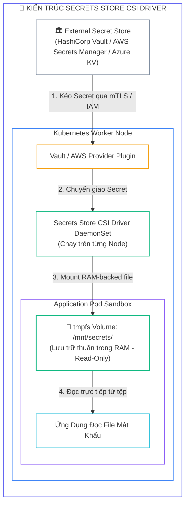
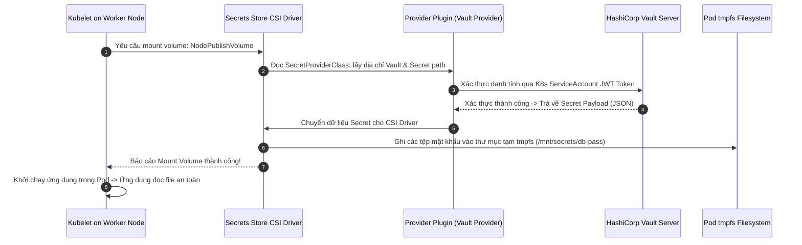
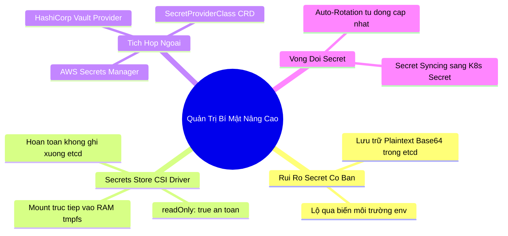


> [!IMPORTANT]
> **Mục tiêu kỹ thuật bài học**:
> - Hiểu rõ các rủi ro an ninh của việc truyền Secret qua biến môi trường (**Environment Variables**) và lưu trữ Secret mặc định trong etcd.
> - Nắm vững kiến trúc hoạt động của **Secrets Store CSI Driver** và các Provider tích hợp (**HashiCorp Vault**, **AWS Secrets Manager**, **Azure Key Vault**, **GCP Secret Manager**).
> - Biên soạn tệp khai báo **`SecretProviderClass`** để chỉ định kho khóa và ánh xạ các trường dữ liệu mật.
> - Cấu hình khối `volumes` loại **`csi`** dưới Pod spec để mount Secret an toàn vào thư mục **`tmpfs (RAM-backed)`** với quyền `readOnly: true`.
> - Kích hoạt tính năng **Auto-Rotation** và **K8s Secret Syncing (`secretObjects`)** khi ứng dụng cần đồng bộ ngược vào K8s API.
> - Quét phát hiện và triệt tiêu các thông tin nhạy cảm bị nhúng cứng (*Hardcoded Secrets*) trong mã nguồn và Dockerfile.

---

## 1. Bản Chất Kiến Trúc & Tư Duy Cốt Lõi: Quản Trị Bí Mật Doanh Nghiệp (External Secrets Management)

Trong phát triển ứng dụng Kubernetes, nhiều đội ngũ có thói quen tiêm Secret vào Pod thông qua các biến môi trường (`spec.containers[0].env` hoặc `envFrom`). Tuy nhiên, theo các tiêu chuẩn an ninh **CKS** và **CIS Benchmark**, đây là một **lỗ hổng bảo mật nghiêm trọng**:
1. **Lộ qua Logs & Crash Dumps:** Khi ứng dụng gặp sự cố và in stack trace hoặc log môi trường (`printenv`), toàn bộ mật khẩu sẽ bị ghi vào log tập trung.
2. **Lộ qua `/proc` Filesystem:** Bất kỳ tiến trình nào chạy trên cùng Node hoặc kẻ tấn công qua lệnh `kubectl exec` đều có thể đọc tệp `/proc/<pid>/environ` để lấy cắp Secret.
3. **Không Hỗ Trợ Xoay Vòng Khóa (Key Rotation):** Biến môi trường chỉ được nạp một lần khi tiến trình khởi tạo. Nếu mật khẩu trên máy chủ thay đổi, bắt buộc phải khởi động lại (*Restart*) toàn bộ Pod.

Giải pháp chuẩn mực cấp doanh nghiệp là sử dụng **Secrets Store CSI Driver (Container Storage Interface)**: Kubelet trực tiếp gọi CSI Driver để kéo Secret từ kho quản lý bí mật chuyên dụng bên ngoài (**HashiCorp Vault**, **AWS Secrets Manager**, **Azure Key Vault**) và mount trực tiếp vào hệ thống tệp tạm trong bộ nhớ RAM (**`tmpfs`**) của Pod. Mật khẩu không bao giờ bị ghi xuống đĩa cứng, không lưu vào etcd, và tự động được cập nhật khi xoay vòng khóa.



---

## 2. Bảng Ma Trận So Sánh Kỹ Thuật Toàn Diện (Engineering Matrix)

| Tiêu Chí Kỹ Thuật | Kubernetes Native Secret | Bitnami Sealed Secrets | External Secrets Operator (ESO) | Secrets Store CSI Driver |
| :--- | :--- | :--- | :--- | :--- |
| **Cơ chế lưu trữ** | Base64 lưu trong etcd | Mã hóa bất đối xứng lưu trong Git | Đọc từ Vault/Cloud -> tạo K8s Secret | Mount trực tiếp vào RAM (`tmpfs`) của Pod |
| **Dữ liệu có ghi vào etcd?** | <span class="badge badge--rose">Có (Ghi vào etcd)</span> | Có (Sau khi giải mã) | Có (Lưu thành K8s Secret) | <span class="badge badge--emerald">Không (Hoàn toàn ngoài etcd)</span> |
| **Tự động xoay vòng (Rotation)** | Không (Cần restart Pod) | Không | Có (Định kỳ đồng bộ) | <span class="badge badge--emerald">Có (Tự cập nhật file trong tmpfs)</span> |
| **Hỗ trợ biến môi trường** | Có | Có | Có | Chỉ hỗ trợ qua tính năng Syncing |
| **Độ trễ khi khởi động Pod** | Cực nhanh | Nhanh | Nhanh (Đã có sẵn trong etcd) | Chậm hơn chút (Cần gọi mạng ra Vault) |
| **Đánh giá bảo mật CKS** | Thấp | Trung bình (Tốt cho GitOps) | Tốt cho ứng dụng cũ | <span class="badge badge--emerald">Tiêu chuẩn vàng cho Enterprise</span> |

---

## 3. Kiến Trúc Môi Trường & Luồng Thực Thi Mẫu

Khi một Pod khai báo Secret CSI Volume được lập lịch tới Node, luồng tương tác giữa Kubelet, CSI Driver và Vault diễn ra theo quy trình sau:



---

## 4. Phân Tích Cạm Bẫy Thực Chiến: Lộ Mật Khẩu Qua Biến Môi Trường `env` Khi Pod Bị Crash Dump / Inspect

### Tình Huống Sự Cố Thực Tế:
<span class="badge badge--rose">🕒 02:10 PM</span> Một ứng dụng xử lý thanh toán bị lỗi ngoại lệ chưa bắt (`Unhandled NullPointerException`) và tự động ghi toàn bộ tiến trình Core Dump ra tệp log hệ thống. Do mật khẩu kết nối cơ sở dữ liệu `DB_PASSWORD` được truyền qua biến môi trường `env`, giá trị mật khẩu dạng plaintext bị in thẳng lên màn hình log tập trung của công ty, nơi mà hơn 50 nhân viên phát triển và kiểm thử có quyền truy cập.

### Hậu Quả & Log Lỗi Thực Tế:
```text
================================================================================
INCIDENT LOG: SENSITIVE CREDENTIAL LEAKAGE VIA CONTAINER PROCESS ENVIRONMENT
================================================================================
[ALERT] 2026-09-12T14:10:15.981Z payment-processor-6b78d-9zk4p crash-dump:
Exception in thread "main" java.lang.NullPointerException: Database Connection Refused
Full Environment Dump:
  HOSTNAME=payment-processor-6b78d-9zk4p
  KUBERNETES_PORT=tcp://10.96.0.1:443
  DB_HOST=postgres-prod.internal
  DB_USER=payment_admin
  DB_PASSWORD=SuperSecretMasterKeyP@ss2026!  <-- CRITICAL CREDENTIAL EXPOSED!

>> INSPECT FORENSICS:
$ kubectl describe pod payment-processor-6b78d-9zk4p | grep -A 5 "Environment:"
    Environment:
      DB_PASSWORD: SuperSecretMasterKeyP@ss2026!
================================================================================
```

### 5-Whys Root Cause Analysis:
1. <span class="badge badge--primary">Why 1</span> **Tại sao mật khẩu quản trị cơ sở dữ liệu bị lộ cho toàn bộ nhân viên?** $\rightarrow$ Vì mật khẩu bị ghi vào nhật ký log tập trung khi ứng dụng bị crash.
2. <span class="badge badge--primary">Why 2</span> **Tại sao mật khẩu lại có mặt trong log crash dump?** $\rightarrow$ Vì ứng dụng tự động in toàn bộ biến môi trường của tiến trình (`System.getenv()`) khi gặp lỗi nghiêm trọng.
3. <span class="badge badge--primary">Why 3</span> **Tại sao mật khẩu lại nằm trong biến môi trường của container?** $\rightarrow$ Vì Pod manifest khai báo truyền Secret qua trường `spec.containers[0].env`.
4. <span class="badge badge--primary">Why 4</span> **Tại sao không sử dụng cơ chế mount file trong bộ nhớ?** $\rightarrow$ Do lập trình viên chọn cách đọc biến môi trường cho tiện mà không đánh giá rủi ro an ninh rò rỉ.
5. <span class="badge badge--emerald">Root Cause Remedy</span> **Biện pháp khắc phục chuẩn CKS:**
   - <span class="badge badge--emerald">Chuyển Sang File Mount Qua Secrets Store CSI:</span> Không bao giờ truyền mật khẩu qua biến môi trường; chuyển sang đọc trực tiếp từ tệp tin mount trong `/mnt/secrets/`.
   - <span class="badge badge--cyan">Gia Cố Phân Quyền Tệp:</span> Đảm bảo tệp Secret mount có quyền chỉ đọc (`readOnly: true`) và chỉ có người dùng non-root của ứng dụng được phép đọc.

---

## 5. Hands-on Lab: Cài Đặt Secrets Store CSI Driver, Tạo SecretProviderClass & Mount Vào Pod (8 Bước)

| Bước | Mục Tiêu Kỹ Thuật | Đầu Ra Kiểm Tra |
| :---: | :--- | :--- |
| **1** | Kiểm tra cài đặt Secrets Store CSI Driver trong cụm | DaemonSet `secrets-store-csi-driver` đang chạy |
| **2** | Tạo Namespace thử nghiệm `secret-csi-lab` | Namespace sẵn sàng để triển khai |
| **3** | Tạo ServiceAccount cho ứng dụng | SA `app-vault-sa` |
| **4** | Biên soạn tệp định nghĩa `SecretProviderClass` mẫu | Custom Resource `vault-db-creds` |
| **5** | Triển khai Pod khai báo CSI Volume mount từ SecretProviderClass | Pod `secure-db-app` khởi chạy thành công |
| **6** | Kiểm tra tệp Secret được tạo an toàn trong thư mục `/mnt/secrets/` | Tệp mật khẩu nằm trong RAM `tmpfs` |
| **7** | Xác nhận không có Secret nào bị lưu thừa vào `etcd` | Không phát sinh K8s Secret thừa |
| **8** | Kiểm định toàn diện luồng bảo mật Secret CSI | Hoàn tất xác thực quản trị bí mật doanh nghiệp |

### Bước 1: Kiểm Tra Trạng Thái Secrets Store CSI Driver DaemonSet

```bash
kubectl get daemonset -n kube-system | grep secrets-store
```

### Bước 2: Tạo Namespace Thử Nghiệm

```bash
kubectl create namespace secret-csi-lab
```

### Bước 3: Tạo ServiceAccount Dành Riêng Cho Ứng Dụng

```bash
kubectl create serviceaccount app-vault-sa -n secret-csi-lab
```

### Bước 4: Khởi Tạo Tài Nguyên `SecretProviderClass`

```bash
cat <<EOF | kubectl apply -f -
apiVersion: secrets-store.csi.x-k8s.io/v1
kind: SecretProviderClass
metadata:
  name: vault-database-creds
  namespace: secret-csi-lab
spec:
  provider: vault
  parameters:
    vaultAddress: "http://vault.vault.svc:8200"
    roleName: "database-reader-role"
    objects: |
      - objectName: "db-password"
        secretPath: "secret/data/db-config"
        secretKey: "password"
      - objectName: "db-username"
        secretPath: "secret/data/db-config"
        secretKey: "username"
EOF

# Kiểm tra SecretProviderClass đã được tạo
kubectl get secretproviderclass -n secret-csi-lab
```

### Bước 5: Triển Khai Pod Khai Báo CSI Volume Mount

```bash
cat <<EOF | kubectl apply -f -
apiVersion: v1
kind: Pod
metadata:
  name: secure-db-app
  namespace: secret-csi-lab
spec:
  serviceAccountName: app-vault-sa
  containers:
  - name: client
    image: busybox:latest
    command: ["sleep", "3600"]
    volumeMounts:
    - name: secrets-store-inline
      mountPath: "/mnt/secrets"
      readOnly: true
  volumes:
  - name: secrets-store-inline
    csi:
      driver: secrets-store.csi.k8s.io
      readOnly: true
      volumeAttributes:
        secretProviderClass: "vault-database-creds"
EOF
```

### Bước 6: Kiểm Tra Thư Mục Mount Bên Trong Container

```bash
# Kiểm tra danh sách tệp Secret trong thư mục /mnt/secrets/
kubectl exec -n secret-csi-lab secure-db-app -- ls -la /mnt/secrets/

# Kiểm tra định dạng hệ thống tệp: PHẢI LÀ TMPFS TRONG RAM!
kubectl exec -n secret-csi-lab secure-db-app -- df -h /mnt/secrets/
```

### Bước 7: Cấu Hình Đồng Bộ Ngược (K8s Secret Syncing - Tùy Chọn)

Nếu ứng dụng cũ vẫn cần Secret dưới dạng K8s Secret, bổ sung khối `secretObjects` vào `SecretProviderClass`:

```yaml
spec:
  secretObjects:
  - secretName: synced-k8s-secret
    type: Opaque
    data:
    - objectName: "db-password"
      key: "password"
```

### Bước 8: Kiểm Định Toàn Diện Luồng Quản Trị Bí Mật

```bash
kubectl get pod secure-db-app -n secret-csi-lab -o jsonpath='{.status.phase}'

echo ">> [VERIFIED] Chuc mung ban da lam chu Secrets Store CSI Driver theo chuan CKS!"
```

---

## 6. 10 Câu Hỏi Tự Kiểm Tra Chuyên Sâu (Self-Check Q&A Accordion)

<details class="qa-card">
<summary class="qa-summary">
  <div class="qa-summary-left">
    <span class="qa-num-badge">Q01</span>
    <span>Tại sao việc truyền Secret qua tệp mount Volume trong RAM (tmpfs) lại an toàn hơn truyền qua biến môi trường (env)?</span>
  </div>
  <span class="qa-chevron">
    <svg width="18" height="18" fill="none" stroke="currentColor" stroke-width="2.5" viewBox="0 0 24 24"><polyline points="6 9 12 15 18 9"></polyline></svg>
  </span>
</summary>
<div class="qa-answer">
  <div class="qa-answer-header">
    <svg width="14" height="14" fill="none" stroke="currentColor" stroke-width="2" viewBox="0 0 24 24"><path d="M22 11.08V12a10 10 0 1 1-5.93-9.14"></path><polyline points="22 4 12 14.01 9 11.01"></polyline></svg>
    <span>Phân Tích &amp; Lời Giải Kỹ Thuật</span>
  </div>
  <div style="margin-bottom: 8px;">Tệp mount trong <code>tmpfs</code> được lưu thuần túy trên bộ nhớ RAM và <b style="color: var(--accent-emerald);">không bao giờ bị ghi xuống đĩa cứng vật lý</b>. Ngược lại, biến môi trường (env) dễ dàng bị lộ khi ứng dụng bị crash dump, bị ghi vào log tập trung (printenv), hoặc bị đọc trộm qua hệ thống tệp <code>/proc/&lt;pid&gt;/environ</code>.</div>
</div>
</details>

<details class="qa-card">
<summary class="qa-summary">
  <div class="qa-summary-left">
    <span class="qa-num-badge">Q02</span>
    <span>Đối tượng `SecretProviderClass` trong Kubernetes đóng vai trò gì?</span>
  </div>
  <span class="qa-chevron">
    <svg width="18" height="18" fill="none" stroke="currentColor" stroke-width="2.5" viewBox="0 0 24 24"><polyline points="6 9 12 15 18 9"></polyline></svg>
  </span>
</summary>
<div class="qa-answer">
  <div class="qa-answer-header">
    <svg width="14" height="14" fill="none" stroke="currentColor" stroke-width="2" viewBox="0 0 24 24"><path d="M22 11.08V12a10 10 0 1 1-5.93-9.14"></path><polyline points="22 4 12 14.01 9 11.01"></polyline></svg>
    <span>Phân Tích &amp; Lời Giải Kỹ Thuật</span>
  </div>
  <div style="margin-bottom: 8px;"><code>SecretProviderClass</code> là một Custom Resource Definition (CRD) định nghĩa <b style="color: var(--accent-primary);">thông số kết nối cụ thể</b> tới kho lưu trữ bí mật bên ngoài (như địa chỉ HashiCorp Vault, Role IAM của AWS, danh sách tên Secret và khóa cần lấy) để CSI Driver biết cách kéo dữ liệu chính xác về cho Pod.</div>
</div>
</details>

<details class="qa-card">
<summary class="qa-summary">
  <div class="qa-summary-left">
    <span class="qa-num-badge">Q03</span>
    <span>Tính năng Auto-Rotation trong Secrets Store CSI Driver hoạt động theo cơ chế nào?</span>
  </div>
  <span class="qa-chevron">
    <svg width="18" height="18" fill="none" stroke="currentColor" stroke-width="2.5" viewBox="0 0 24 24"><polyline points="6 9 12 15 18 9"></polyline></svg>
  </span>
</summary>
<div class="qa-answer">
  <div class="qa-answer-header">
    <svg width="14" height="14" fill="none" stroke="currentColor" stroke-width="2" viewBox="0 0 24 24"><path d="M22 11.08V12a10 10 0 1 1-5.93-9.14"></path><polyline points="22 4 12 14.01 9 11.01"></polyline></svg>
    <span>Phân Tích &amp; Lời Giải Kỹ Thuật</span>
  </div>
  <div style="margin-bottom: 8px;">Khi bật cờ <code>enable-secret-rotation: "true"</code> (kèm chu kỳ <code>rotation-poll-interval</code>), CSI Driver sẽ định kỳ thăm dò kho lưu trữ bên ngoài (Vault/AWS). Nếu phát hiện Secret có phiên bản mới, CSI Driver sẽ <b style="color: var(--accent-emerald);">tự động ghi đè nội dung mới vào tệp mount trong RAM của Pod</b> mà không cần phải khởi động lại Pod.</div>
</div>
</details>

<details class="qa-card">
<summary class="qa-summary">
  <div class="qa-summary-left">
    <span class="qa-num-badge">Q04</span>
    <span>Tại sao khi sử dụng Secrets Store CSI Driver thuần túy, lệnh `kubectl get secrets` lại không thấy Secret nào xuất hiện?</span>
  </div>
  <span class="qa-chevron">
    <svg width="18" height="18" fill="none" stroke="currentColor" stroke-width="2.5" viewBox="0 0 24 24"><polyline points="6 9 12 15 18 9"></polyline></svg>
  </span>
</summary>
<div class="qa-answer">
  <div class="qa-answer-header">
    <svg width="14" height="14" fill="none" stroke="currentColor" stroke-width="2" viewBox="0 0 24 24"><path d="M22 11.08V12a10 10 0 1 1-5.93-9.14"></path><polyline points="22 4 12 14.01 9 11.01"></polyline></svg>
    <span>Phân Tích &amp; Lời Giải Kỹ Thuật</span>
  </div>
  <div style="margin-bottom: 8px;">Bởi vì CSI Driver nạp dữ liệu trực tiếp từ kho ngoài vào thư mục mount của Pod trên Node mà <b style="color: var(--accent-emerald);">hoàn toàn không tạo đối tượng Secret trong Kubernetes API Server</b> và không ghi vào etcd. Điều này giúp nâng cao an ninh tối đa vì dữ liệu nhạy cảm không nằm trong cơ sở dữ liệu của cụm.</div>
</div>
</details>

<details class="qa-card">
<summary class="qa-summary">
  <div class="qa-summary-left">
    <span class="qa-num-badge">Q05</span>
    <span>Làm thế nào để đồng bộ dữ liệu từ Secrets Store CSI Driver thành một đối tượng Kubernetes Secret chuẩn?</span>
  </div>
  <span class="qa-chevron">
    <svg width="18" height="18" fill="none" stroke="currentColor" stroke-width="2.5" viewBox="0 0 24 24"><polyline points="6 9 12 15 18 9"></polyline></svg>
  </span>
</summary>
<div class="qa-answer">
  <div class="qa-answer-header">
    <svg width="14" height="14" fill="none" stroke="currentColor" stroke-width="2" viewBox="0 0 24 24"><path d="M22 11.08V12a10 10 0 1 1-5.93-9.14"></path><polyline points="22 4 12 14.01 9 11.01"></polyline></svg>
    <span>Phân Tích &amp; Lời Giải Kỹ Thuật</span>
  </div>
  <div style="margin-bottom: 8px;">Khai báo khối <b style="color: var(--accent-cyan);">spec.secretObjects</b> bên trong <code>SecretProviderClass</code>, chỉ định tên Secret đích và ánh xạ các trường <code>objectName</code> vào các khóa (keys). Đồng thời CSI Driver phải được bật cờ <code>syncSecret.enabled=true</code> khi cài đặt.</div>
</div>
</details>

<details class="qa-card">
<summary class="qa-summary">
  <div class="qa-summary-left">
    <span class="qa-num-badge">Q06</span>
    <span>Tên trình điều khiển (Driver Name) chuẩn bắt buộc phải khai báo trong khối `volume.csi.driver` của Pod spec là gì?</span>
  </div>
  <span class="qa-chevron">
    <svg width="18" height="18" fill="none" stroke="currentColor" stroke-width="2.5" viewBox="0 0 24 24"><polyline points="6 9 12 15 18 9"></polyline></svg>
  </span>
</summary>
<div class="qa-answer">
  <div class="qa-answer-header">
    <svg width="14" height="14" fill="none" stroke="currentColor" stroke-width="2" viewBox="0 0 24 24"><path d="M22 11.08V12a10 10 0 1 1-5.93-9.14"></path><polyline points="22 4 12 14.01 9 11.01"></polyline></svg>
    <span>Phân Tích &amp; Lời Giải Kỹ Thuật</span>
  </div>
  <div style="margin-bottom: 8px;">Tên driver chính thức là: <b style="color: var(--accent-primary);">secrets-store.csi.k8s.io</b>.</div>
</div>
</details>

<details class="qa-card">
<summary class="qa-summary">
  <div class="qa-summary-left">
    <span class="qa-num-badge">Q07</span>
    <span>Điều gì xảy ra nếu Pod được lập lịch tới một Node nhưng máy chủ HashiCorp Vault bị mất kết nối mạng?</span>
  </div>
  <span class="qa-chevron">
    <svg width="18" height="18" fill="none" stroke="currentColor" stroke-width="2.5" viewBox="0 0 24 24"><polyline points="6 9 12 15 18 9"></polyline></svg>
  </span>
</summary>
<div class="qa-answer">
  <div class="qa-answer-header">
    <svg width="14" height="14" fill="none" stroke="currentColor" stroke-width="2" viewBox="0 0 24 24"><path d="M22 11.08V12a10 10 0 1 1-5.93-9.14"></path><polyline points="22 4 12 14.01 9 11.01"></polyline></svg>
    <span>Phân Tích &amp; Lời Giải Kỹ Thuật</span>
  </div>
  <div style="margin-bottom: 8px;">Kubelet sẽ không thể hoàn tất bước Mount Volume và Pod rơi vào trạng thái <b style="color: var(--accent-rose);">ContainerCreating / FailedMount</b>. Ứng dụng sẽ không bao giờ được phép khởi chạy nếu thiếu các Secret cần thiết, đảm bảo tính toàn vẹn và an toàn của hệ thống.</div>
</div>
</details>

<details class="qa-card">
<summary class="qa-summary">
  <div class="qa-summary-left">
    <span class="qa-num-badge">Q08</span>
    <span>Cơ chế xác thực nào thường được dùng giữa Kubernetes Pod và HashiCorp Vault Server để lấy Secret?</span>
  </div>
  <span class="qa-chevron">
    <svg width="18" height="18" fill="none" stroke="currentColor" stroke-width="2.5" viewBox="0 0 24 24"><polyline points="6 9 12 15 18 9"></polyline></svg>
  </span>
</summary>
<div class="qa-answer">
  <div class="qa-answer-header">
    <svg width="14" height="14" fill="none" stroke="currentColor" stroke-width="2" viewBox="0 0 24 24"><path d="M22 11.08V12a10 10 0 1 1-5.93-9.14"></path><polyline points="22 4 12 14.01 9 11.01"></polyline></svg>
    <span>Phân Tích &amp; Lời Giải Kỹ Thuật</span>
  </div>
  <div style="margin-bottom: 8px;">Phương thức <b style="color: var(--accent-emerald);">Kubernetes Auth Method (auth/kubernetes)</b> của Vault. Vault sử dụng TokenReview API của Kubernetes API Server để xác thực tính hợp lệ của ServiceAccount JWT Token do Pod gửi lên và đối soát với Vault Policy được cấp phép.</div>
</div>
</details>

<details class="qa-card">
<summary class="qa-summary">
  <div class="qa-summary-left">
    <span class="qa-num-badge">Q09</span>
    <span>Tại sao cần gán `readOnly: true` cho cả hai khối `volumeMounts` và `volumes.csi` trong Pod manifest?</span>
  </div>
  <span class="qa-chevron">
    <svg width="18" height="18" fill="none" stroke="currentColor" stroke-width="2.5" viewBox="0 0 24 24"><polyline points="6 9 12 15 18 9"></polyline></svg>
  </span>
</summary>
<div class="qa-answer">
  <div class="qa-answer-header">
    <svg width="14" height="14" fill="none" stroke="currentColor" stroke-width="2" viewBox="0 0 24 24"><path d="M22 11.08V12a10 10 0 1 1-5.93-9.14"></path><polyline points="22 4 12 14.01 9 11.01"></polyline></svg>
    <span>Phân Tích &amp; Lời Giải Kỹ Thuật</span>
  </div>
  <div style="margin-bottom: 8px;">Để ngăn chặn tiến trình trong container (hoặc mã độc) có thể <b style="color: var(--accent-rose);">chỉnh sửa, ghi đè hoặc xóa bỏ tệp Secret</b> trong thư mục mount, đảm bảo tính toàn vẹn và bất biến của dữ liệu xác thực.</div>
</div>
</details>

<details class="qa-card">
<summary class="qa-summary">
  <div class="qa-summary-left">
    <span class="qa-num-badge">Q10</span>
    <span>Lệnh nào cho phép quét nhanh phát hiện các API Keys hoặc mật khẩu bị nhúng cứng trong mã nguồn trước khi đóng gói Docker?</span>
  </div>
  <span class="qa-chevron">
    <svg width="18" height="18" fill="none" stroke="currentColor" stroke-width="2.5" viewBox="0 0 24 24"><polyline points="6 9 12 15 18 9"></polyline></svg>
  </span>
</summary>
<div class="qa-answer">
  <div class="qa-answer-header">
    <svg width="14" height="14" fill="none" stroke="currentColor" stroke-width="2" viewBox="0 0 24 24"><path d="M22 11.08V12a10 10 0 1 1-5.93-9.14"></path><polyline points="22 4 12 14.01 9 11.01"></polyline></svg>
    <span>Phân Tích &amp; Lời Giải Kỹ Thuật</span>
  </div>
  <div style="margin-bottom: 8px;">Sử dụng công cụ Trivy với chế độ quét Secret: <b style="color: var(--accent-primary);">trivy fs --scanners secret &lt;path-to-source-code&gt;</b> (hoặc dùng các công cụ chuyên dụng như <code>gitleaks</code> hay <code>trufflehog</code>).</div>
</div>
</details>

---

## 7. Tổng Kết & Lộ Trình Bài Học Tiếp Theo



Làm chủ **Secrets Store CSI Driver** giúp bạn xây dựng kiến trúc bảo vệ bí mật chuẩn doanh nghiệp và ghi trọn điểm trong kỳ thi CKS.

> [!TIP]
> **BÀI HỌC TIẾP THEO:**
> Trong **[[Bài 13] Bảo Mật Giao Tiếp Vi Dịch Vụ: mTLS & Service Mesh Tối Thiểu (Istio & Linkerd)](cks-13-13-mtls-va-service-mesh-toi-thieu.html)**, chúng ta sẽ tìm hiểu cách mã hóa toàn bộ lưu lượng mạng nội bộ Pod-to-Pod: Cấu hình mTLS STRICT mode, xác thực chứng chỉ hai chiều và thiết lập chính sách ủy quyền L7 AuthorizationPolicy.

