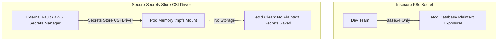
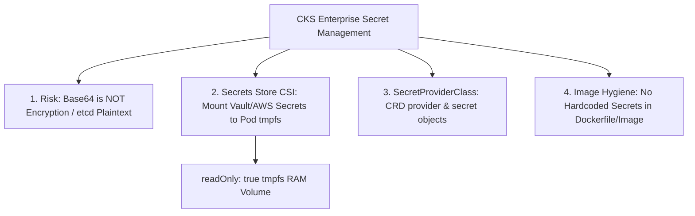


# [BÀI 12] QUẢN TRỊ BÍ MẬT NÂNG CAO: SECRETS STORE CSI DRIVER, TÍCH HỢP HASHICORP VAULT & AWS SECRETS MANAGER

Trong kỷ nguyên điện toán đám mây và kiến trúc microservices phân tán quy mô lớn, **Kubernetes (CKS)** đóng vai trò là nền tảng điều phối container (Container Orchestration) tiêu chuẩn công nghiệp. Để làm chủ hệ thống trong môi trường sản xuất (Production) cũng như chinh phục kỳ thi chứng chỉ quốc tế của Linux Foundation / CNCF, kỹ sư không chỉ nắm vững các câu lệnh thao tác cơ bản mà phải thấu hiểu sâu sắc bản chất cơ chế tầng thấp: từ chu trình điều hòa (Reconciliation Loop), cấu trúc điều phối tài nguyên, kiến trúc mạng CNI, lưu trữ CSI cho đến các chuẩn mực an ninh phòng thủ chiều sâu.

Bài viết chuyên sâu này sẽ đồng hành cùng bạn giải mã toàn diện bức tranh kiến trúc, phân tích các đánh đổi kỹ thuật thực chiến (Engineering Trade-offs), cung cấp bài thực hành Lab từng bước và bộ câu hỏi phỏng vấn chuẩn Architect / Lead Engineer.

---

## 1. Bản Chất Kiến Trúc & Cơ Chế Vận Hành Tầng Thấp

| # | Câu hỏi ôn tập | Đáp án chuẩn ngắn gọn |
|---|---|---|
| 1 | Rủi ro của Container truyền thống (runc)? | **Dùng chung Linux Kernel** với Host Node |
| 2 | Trình đánh chặn syscalls gVisor trong user-space? | **`runsc`** (Sentry Kernel) |
| 3 | Tên đối tượng K8s định nghĩa môi trường Sandbox? | Đối tượng **`RuntimeClass`** (`node.k8s.io/v1`) |
| 4 | Thuộc tính dưới Pod spec chỉ định RuntimeClass? | **`runtimeClassName: <tên-runtimeclass>`** |
| 5 | Lệnh CLI kiểm tra kernel sandbox trong Pod? | Lệnh **`kubectl exec <pod> -- dmesg`** hoặc **`uname -a`** |


> **"Quản lý Secret nâng cao và tích hợp bộ lưu trữ bí mật bên ngoài (External Secret Stores) thông qua Secrets Store CSI Driver là giải pháp bảo vệ dữ liệu nhạy cảm cấp doanh nghiệp thuộc chứng chỉ CKS, đòi hỏi chuyên gia bảo mật phải hiểu rõ rủi ro của việc lưu trữ Secret mặc định trong K8s (chỉ mã hóa Base64 dễ bị giải mã); làm chủ cơ chế hoạt động của Secrets Store CSI Driver và External Secrets Operator để lấy mật khẩu/keys từ Vault, AWS Secrets Manager hoặc Azure Key Vault rồi mount trực tiếp vào hệ thống tệp tạm tmpfs của Pod; biên soạn thành thục tệp cấu hình `SecretProviderClass`; đồng thời thiết lập quy trình xoay vòng bí mật tự động (Automatic Secret Rotation) và cấm tuyệt đối hành vi nhúng cứng (hardcode) API Keys hay mật khẩu vào Dockerfile và Container Images."**

**Kết quả từ các buổi trước được sử dụng lại:**

| Kết quả / Công cụ | Buổi + số hiệu `QT` | Dùng ở đâu trong buổi này |
|---|---|---|
| Mã hóa dữ liệu tại chỗ etcd EncryptionConfiguration | Buổi 51 `QT 4.1` | Nâng cấp bảo mật Secret từ etcd lên External CSI Store |
| Phân quyền thắt chặt Volume mount | Buổi 41 `QT 4.1` | Mount Secret từ CSI Store dưới dạng `readOnly: true` tmpfs |
| Rà soát lỗ hổng và bí mật nhúng trong ảnh Container | Buổi 48 `QT 4.1` | Quét phát hiện hardcoded credentials trong Dockerfile bằng Trivy |

---


| # | Kỹ năng thực hiện được | Hiện vật chứng minh |
|---|---|---|
| 1 | Phân tích rủi ro của Secret K8s mặc định so với External Secret Stores | Sơ đồ so sánh lưu etcd vs Secrets Store CSI Driver |
| 2 | Biên soạn tệp định nghĩa custom resource `SecretProviderClass` | Tệp YAML `SecretProviderClass` với cờ provider |
| 3 | Khai báo CSI Volume mount tệp Secret từ kho bên ngoài vào Pod | Tệp YAML Pod spec chứa volume loại `csi` |
| 4 | Cấu hình tự động xoay vòng Secret (Automatic Secret Rotation) | Cờ `enable-secret-rotation` trong Secrets Store CSI |
| 5 | Rà soát và quét phát hiện hardcoded API keys trong Dockerfile | Báo cáo quét lỗ hổng và bí mật nhúng bằng Trivy |

---


| Kiến thức tiên quyết | Nguồn tự học nếu thiếu |
|---|---|
| Mã hóa etcd Encryption at Rest | Buổi 51 (`QT 4.1`) |
| Thao tác mount Volume vào Pod | Buổi 41 (`QT 4.1`) |
| Rà soát ảnh container bằng Trivy | Buổi 48 (`QT 4.1`) |

---


### 3.1. Thuật ngữ Việt–Anh

| # | Thuật ngữ tiếng Việt | Tiếng Anh tương đương | Ghi chú chuẩn hoá trong thân bài |
|---|---|---|---|
| 1 | Bộ điều khiển lưu trữ bí mật CSI | Secrets Store CSI Driver | Driver chuẩn CSI để mount Secret từ bên ngoài vào Pod |
| 2 | Bộ lưu trữ bí mật bên ngoài | External Secret Store | Kho quản lý Secret như HashiCorp Vault, AWS Secrets Manager |
| 3 | Lớp cấu hình nhà cung cấp bí mật | `SecretProviderClass` | CRD định nghĩa thông số kết nối tới kho Secret bên ngoài |
| 4 | Xoay vòng bí mật tự động | Automatic Secret Rotation | Tự động cập nhật Secret mới trong Pod khi Vault đổi pass |
| 5 | Nhúng cứng thông tin nhạy cảm | Hardcoded Secrets / Credentials | Rủi ro ghi trực tiếp API keys/mật khẩu vào source code hoặc Dockerfile |
| 6 | Hệ thống tệp tạm trên RAM | `tmpfs` (RAM-backed filesystem) | Hệ thống tệp tạm lưu Secret trên RAM, không ghi xuống ổ đĩa |
| 7 | Mã hóa dữ liệu etcd | etcd Encryption at Rest | Mã hóa Secret trước khi ghi vào ổ cứng etcd |
| 8 | Nhà cung cấp bí mật Vault | HashiCorp Vault Provider | Provider CSI tích hợp với HashiCorp Vault server |
| 9 | Đồng bộ hóa Secret thành K8s Secret | Secret Syncing (`secretObjects`) | Tính năng tạo tự động K8s Secret từ tệp mount CSI |
| 10 | Tệp gắn kết đĩa CSI | CSI Volume Mount | Khai báo volume loại `csi` dưới Pod spec |
| 11 | Nhãn dán bí mật nhạy cảm | Sensitive Environment Variables | Rủi ro lộ Secret qua biến môi trường Pod `env` |
| 12 | Công cụ kiểm tra nhúng mật khẩu | Secret Scanner (Trivy / SecretLint) | Công cụ quét phát hiện API keys trong mã nguồn |
| 13 | Quyền truy cập chỉ đọc | Read-Only Mount (`readOnly: true`) | Đảm bảo tệp Secret mount vào Pod không bị sửa đổi |
| 14 | Quản lý vòng đời bí mật | Secret Lifecycle Management | Quy trình tạo, cấp phát, xoay vòng và thu hồi Secret |


Mô hình Ngân Hàng Trung Tâm Vault và Xe Giao Hàng CSI Driver: Secret mặc định K8s (Base64) giống như việc Viết Mật Khẩu Bằng Mực Thường Trên Tờ Giấy dán ở cửa (ai mở etcd cũng đọc được). Secrets Store CSI Driver giống như một Xe Giao Hàng An Ninh Chuyên Dụng kết nối với Ngân Hàng Trung Tâm (HashiCorp Vault / AWS Secrets Manager). Khi Pod cần dùng mật khẩu DB, Xe Giao Hàng CSI chở mật khẩu từ Ngân Hàng Vault tới trao tận tay cho Pod qua Cửa Sổ Bằng Kính An Toàn (`tmpfs` RAM volume). Mật khẩu không bao giờ bị dán công khai hay lưu vết lại trên đĩa etcd của cụm K8s. Khi Ngân Hàng Vault đổi mật khẩu mới (`Secret Rotation`), Xe Giao Hàng CSI tự động cập nhật ngay tệp trên tay Pod mà không cần khởi động lại toàn bộ tòa nhà (Pod restart).

---

### 1.1. Rủi ro của K8s Base64 Secrets và Kiến trúc Secrets Store CSI Driver (12 phút)

**Nguyên lý cốt lõi:** KHÔNG BAO GIỜ coi mã hóa Base64 mặc định của Kubernetes Secret là một giải pháp an toàn; bắt buộc phải dùng etcd Encryption at Rest hoặc Secrets Store CSI Driver để bảo vệ dữ liệu nhạy cảm.

**Giải thích cơ chế ngầm:** Mã hóa Base64 chỉ là một dạng nén chuỗi đơn thuần (encoding), hoàn toàn không phải là mã hóa bảo mật (encryption). Bất kỳ ai đọc được etcd hoặc có quyền read Secret qua API đều giải mã được mật khẩu thô trong vài miliseconds.

> [!WARNING]
> **CẠM BẪY THỰC CHIẾN:**
> Tin tưởng rằng việc tạo K8s Secret thông thường qua `kubectl create secret` là đã bảo vệ mật khẩu an toàn.

**Minh hoạ.**



**Nguyên lý cốt lõi:** CẤM TUYỆT ĐỐI việc nhúng cứng (hardcode) mật khẩu, private keys hoặc API tokens trong mã nguồn, Dockerfile hoặc Container Image.

**Giải thích cơ chế ngầm:** Các lớp (layers) của Container Image được lưu trữ vĩnh viễn trong Registry. Ngay cả khi đã xóa file ở layer sau, file Secret nhúng ở layer trước vẫn bị phát hiện bởi các công cụ quét mã độc (như Trivy/SecretLint).

> [!WARNING]
> **CẠM BẪY THỰC CHIẾN:**
> Khai báo `ENV API_KEY="secret-token-123"` hoặc `COPY db-pass.txt /app/` trong tệp Dockerfile.

**Minh hoạ.**

```dockerfile
# RỦI RO BẢO MẬT CAO (BỊ CẤM TRONG CKS):
FROM alpine
ENV DB_PASSWORD="SuperSecretPassword123" # CẤM NHÚNG HARDCODED SECRET!
```

---

### 1.2. Định nghĩa đối tượng `SecretProviderClass` và Cấu hình Pod Volume Mounting (12 phút)

**Nguyên lý cốt lõi:** Để mount Secret từ kho bên ngoài vào Pod, bắt buộc phải tạo đối tượng `SecretProviderClass` chỉ định đúng `provider` (như `vault`, `aws`, `azure`) và các tham số `spec.parameters`.

**Giải thích cơ chế ngầm:** `SecretProviderClass` định nghĩa chi tiết tên bí mật, phím (keys) và chứng chỉ xác thực cần trích xuất từ kho chứa bên ngoài.

> [!WARNING]
> **CẠM BẪY THỰC CHIẾN:**
> Tạo `SecretProviderClass` nhưng gõ sai tên `provider` hoặc khai báo sai phím bí mật của Vault.

**Minh hoạ.**

```yaml
apiVersion: secrets-store.csi.k8s.io/v1
kind: SecretProviderClass
metadata:
  name: vault-db-secrets
  namespace: prod
spec:
  provider: vault # Nhà cung cấp kho bí mật bên ngoài
  parameters:
    roleName: "app-role"
    vaultAddress: "https://vault.internal:8200"
    objects: |
      - objectName: "db-password"
        secretPath: "secret/data/dbconfig"
        secretKey: "password"
```

**Nguyên lý cốt lõi:** Trong Pod manifest, volume chứa Secret phải được khai báo dạng `type: csi.secrets-store.csi.k8s.io` và phải đặt cờ `readOnly: true` khi mount vào container.

**Giải thích cơ chế ngầm:** Khai báo cờ `readOnly: true` và `driver: secrets-store.csi.k8s.io` giúp hệ thống mount Secret trực tiếp dưới dạng hệ thống tệp tạm trên RAM (`tmpfs`), không lưu vết xuống đĩa cứng của Host Node.

> [!WARNING]
> **CẠM BẪY THỰC CHIẾN:**
> Mount volume Secret mà để cờ `readOnly: false` làm tăng nguy cơ ứng dụng vô tình ghi đè tệp Secret.

**Minh hoạ.**

```yaml
apiVersion: v1
kind: Pod
metadata:
  name: app-sec-pod
  namespace: prod
spec:
  containers:
    - name: app
      image: nginx:alpine
      volumeMounts:
        - name: secrets-store-inline
          mountPath: "/mnt/secrets-store"
          readOnly: true # Bắt buộc phải là readOnly!
  volumes:
    - name: secrets-store-inline
      csi:
        driver: secrets-store.csi.k8s.io
        readOnly: true
        volumeAttributes:
          secretProviderClass: "vault-db-secrets"
```

---

### 1.3. Xoay vòng Secret Tự động (Secret Rotation) và Rà soát cấm Nhúng Mật khẩu trong Image (10 phút)

**Nguyên lý cốt lõi:** Bật cờ `enable-secret-rotation: "true"` trên Secrets Store CSI Driver để tự động đồng bộ và cập nhật Secret mới vào Pod khi kho Vault bên ngoài thực hiện xoay vòng bí mật.

**Giải thích cơ chế ngầm:** Giúp doanh nghiệp xoay vòng mật khẩu (Secret Rotation) định kỳ mà không cần phải restart hoặc redeploy lại các Pods đang vận hành.

> [!WARNING]
> **CẠM BẪY THỰC CHIẾN:**
> Kho Vault bên ngoài đã đổi mật khẩu mới nhưng Pod vẫn giữ mật khẩu cũ do không bật cờ secret rotation.

**Minh hoạ.**

```bash
# Bật tính năng tự động xoay vòng secret trong Helm values CSI Driver:
# --set enableSecretRotation=true
```

**Nguyên lý cốt lõi:** Ưu tiên truyền Secret cho ứng dụng dưới dạng tệp tin mount trong `tmpfs` thay vì truyền qua biến môi trường (`env`) để tránh rủi ro rò rỉ token qua lệnh `kubectl describe pod` hoặc log tiến trình.

**Giải thích cơ chế ngầm:** Biến môi trường (`env`) hiển thị công khai trong bản kê khai của Pod (`kubectl get pod -o yaml`), đồng thời dễ bị ghi lại trong nhật ký tiến trình (process environment logs).

> [!WARNING]
> **CẠM BẪY THỰC CHIẾN:**
> Truyền mật khẩu database trực tiếp qua khối `env` trong Pod spec.

**Minh hoạ.**

```bash
# Đọc Secret từ tệp tmpfs an toàn trong ứng dụng:
cat /mnt/secrets-store/db-password
```

**Nguyên lý cốt lõi:** Khi chẩn đoán lỗi Pod kẹt `MountVolume.SetUp failed` do CSI Driver, kiểm tra tệp `SecretProviderClass` xem tên phím Secret trong kho Vault có gõ sai chính tả hay không.

**Giải thích cơ chế ngầm:** CSI Driver từ chối mount volume nếu không tìm thấy đúng phím (key) tương ứng trong kho lưu trữ bên ngoài.

> [!WARNING]
> **CẠM BẪY THỰC CHIẾN:**
> Sửa Pod manifest trong khi nguyên nhân do gõ sai tên `secretKey` trong `SecretProviderClass`.

**Minh hoạ.**

```bash
# Kiểm tra nhật ký sự kiện Pod khi mount bị lỗi:
kubectl describe pod app-sec-pod -n prod
# Phản hồi: MountVolume.SetUp failed for volume "secrets-store-inline": provider error: key not found
```

---

### 1.4. Đưa vào cụm thật (4 phút)

**Nguyên lý cốt lõi:** Bản kê khai `SecretProviderClass` chuẩn CKS hoàn chỉnh bắt buộc phải có: `apiVersion: secrets-store.csi.k8s.io/v1`, `kind: SecretProviderClass`, `spec.provider`, `spec.parameters`, và khối `spec.secretObjects` (nếu cần đồng bộ thành K8s Secret).

**Giải thích cơ chế ngầm:** Đáp ứng 100% định dạng schema tiêu chuẩn của Secrets Store CSI Driver.

> [!WARNING]
> **CẠM BẪY THỰC CHIẾN:**
> Thiếu khối `spec.provider` khiến CSI Driver không biết gọi plugin nào (Vault/AWS/Azure).

**Minh hoạ.**

```yaml
apiVersion: secrets-store.csi.k8s.io/v1
kind: SecretProviderClass
metadata:
  name: aws-secrets-spc
  namespace: prod
spec:
  provider: aws
  parameters:
    objects: |
      - objectName: "prod/db/credentials"
        objectType: "secretsmanager"
```

**Áp vào cụm đang chạy thì làm gì trước:**
1. Cài đặt Helm chart `secrets-store-csi-driver` trong Namespace `kube-system`.
2. Cài đặt provider tương ứng (như Vault provider hoặc AWS provider).
3. Tạo đối tượng `SecretProviderClass` khai báo thông số kết nối kho bí mật.
4. Gán volume `csi` vào Pod spec và kiểm chứng tệp mount trong `/mnt/secrets-store`.

**Cái gì hỏng nếu áp thẳng lên prod:**
- Nhập sai địa chỉ Vault Server làm cho tất cả các Pods khởi tạo mới bị kẹt `ContainerCreating` do không lấy được Secret.

**Đo trước — đo sau:**
- Thử nghiệm lệnh `kubectl get secret` trước (thấy Secret lưu etcd) và sau khi dùng CSI Driver (Secret nằm trên RAM `tmpfs` không lưu etcd).

**Khi nào KHÔNG nên dùng:**
- Không dùng CSI Driver cho các giá trị cấu hình thông thường không nhạy cảm (với dữ liệu không nhạy cảm nên dùng `ConfigMap`).

---

### 1.5. Bẫy hay gặp (2 phút)

| Bẫy hay gặp | Vì sao dính | Làm đúng là |
|---|---|---|
| 1. Coi mã hóa Base64 của K8s Secret là bảo mật | Nhầm lẫn giữa encoding và encryption | Dùng Secrets Store CSI Driver hoặc Encryption at Rest |
| 2. Nhúng cứng API Key trong Dockerfile `ENV` | Viết nhanh để test ứng dụng | Xóa bỏ 100% hardcoded secrets khỏi Dockerfile và Image |
| 3. Quên cờ `readOnly: true` khi mount CSI volume | Mount volume dạng read-write | Khai báo `readOnly: true` ở cả volumeMounts và volume csi |
| 4. Gõ sai `driver: secrets-store.csi.k8s.io` | Gõ nhầm tên driver CSI | Gõ đúng chuỗi `secrets-store.csi.k8s.io` |
| 5. Quên cờ `secretProviderClass` trong volumeAttributes | Khai báo csi volume nhưng thiếu thuộc tính link SPC | Thêm `volumeAttributes.secretProviderClass: "tên-spc"` |
| 6. Truyền Secret qua biến môi trường `env` | Ngại đọc Secret từ file mount | Đọc Secret trực tiếp từ tệp tin mount trong `/mnt/secrets-store` |
| 7. Gõ sai tên phím Secret trong `SecretProviderClass` | Nhầm tên phím key trên Vault server | Kiểm tra chính xác tên phím `secretKey` trên Vault |
| 8. Quên cờ `enableSecretRotation` trên CSI Driver | Mật khẩu Vault đổi nhưng Pod không cập nhật | Thêm cờ `--set enableSecretRotation=true` khi cài CSI Driver |
| 9. Quên khối `spec.secretObjects` khi cần sync K8s Secret | Muốn dùng K8s Secret nhưng không khai báo sync | Thêm khối `spec.secretObjects` trong `SecretProviderClass` |
| 10. Để tệp Secret nhúng ở layer cũ của Dockerfile | Xóa file ở dòng sau nhưng layer trước vẫn giữ | Dùng `.dockerignore` và build lại image từ đầu |
| 11. Không dùng công cụ quét Trivy rà soát image | Không biết image có bị rò rỉ secret hay không | Chạy `trivy image --scanners secret <image-name>` |
| 12. Quên cờ `-n <namespace>` khi tạo SecretProviderClass | Tạo SPC ở Namespace default làm Pod ở prod không thấy | Tạo `SecretProviderClass` nằm cùng Namespace với Pod |

---

### 1.6. Tóm tắt (2 phút)



**Năm điều phải nhớ:**
1. **Base64 Risk**: Base64 chỉ là nén chuỗi, bắt buộc dùng Secrets Store CSI Driver cho dữ liệu nhạy cảm.
2. **Cấm Hardcoded Secrets**: CẤM TUYỆT ĐỐI nhúng API Keys hay mật khẩu vào Dockerfile và Container Image.
3. **SecretProviderClass**: CRD định nghĩa nhà cung cấp kho bí mật (`vault`, `aws`, `azure`).
4. **CSI Volume Mounting**: Mount Secret dưới dạng `readOnly: true` hệ thống tệp RAM `tmpfs`.
5. **Secret Rotation**: Bật cờ `enableSecretRotation` để tự động cập nhật mật khẩu mới không cần restart Pod.

---

## §10. Câu hỏi tự kiểm tra (5 phút)


<div class="qa-answer">
  <div class="qa-answer-header">
    <svg width="14" height="14" fill="none" stroke="currentColor" stroke-width="2" viewBox="0 0 24 24"><path d="M22 11.08V12a10 10 0 1 1-5.93-9.14"></path><polyline points="22 4 12 14.01 9 11.01"></polyline></svg>
    <span>Phân Tích &amp; Lời Giải Kỹ Thuật</span>
  </div>
  
Vì Base64 chỉ là một thuật toán nén/chuyển đổi định dạng chuỗi (<b style="color: var(--accent-primary);">encoding</b>), bất kỳ ai có quyền đọc etcd đều giải mã lại thành chuỗi thô dễ dàng.
</div>
</details>

<div class="qa-answer">
  <div class="qa-answer-header">
    <svg width="14" height="14" fill="none" stroke="currentColor" stroke-width="2" viewBox="0 0 24 24"><path d="M22 11.08V12a10 10 0 1 1-5.93-9.14"></path><polyline points="22 4 12 14.01 9 11.01"></polyline></svg>
    <span>Phân Tích &amp; Lời Giải Kỹ Thuật</span>
  </div>
  
Lấy mật khẩu trực tiếp từ kho bí mật bên ngoài (Vault/AWS/Azure) và mount thẳng vào bộ nhớ tạm RAM (<b style="color: var(--accent-primary);"><code>tmpfs</code></b>) của Pod mà không lưu vết bản rõ xuống etcd.
</div>
</details>

<div class="qa-answer">
  <div class="qa-answer-header">
    <svg width="14" height="14" fill="none" stroke="currentColor" stroke-width="2" viewBox="0 0 24 24"><path d="M22 11.08V12a10 10 0 1 1-5.93-9.14"></path><polyline points="22 4 12 14.01 9 11.01"></polyline></svg>
    <span>Phân Tích &amp; Lời Giải Kỹ Thuật</span>
  </div>
  
Đối tượng <b style="color: var(--accent-primary);"><code>SecretProviderClass</code></b> (<code>secrets-store.csi.k8s.io/v1</code>).
</div>
</details>

<div class="qa-answer">
  <div class="qa-answer-header">
    <svg width="14" height="14" fill="none" stroke="currentColor" stroke-width="2" viewBox="0 0 24 24"><path d="M22 11.08V12a10 10 0 1 1-5.93-9.14"></path><polyline points="22 4 12 14.01 9 11.01"></polyline></svg>
    <span>Phân Tích &amp; Lời Giải Kỹ Thuật</span>
  </div>
  
Chuỗi driver <b style="color: var(--accent-primary);"><code>secrets-store.csi.k8s.io</code></b>.
</div>
</details>

<div class="qa-answer">
  <div class="qa-answer-header">
    <svg width="14" height="14" fill="none" stroke="currentColor" stroke-width="2" viewBox="0 0 24 24"><path d="M22 11.08V12a10 10 0 1 1-5.93-9.14"></path><polyline points="22 4 12 14.01 9 11.01"></polyline></svg>
    <span>Phân Tích &amp; Lời Giải Kỹ Thuật</span>
  </div>
  
Để đảm bảo tệp tin bí mật được mount dưới dạng chỉ đọc, ngăn chặn tiến trình trong container vô tình hoặc cố ý sửa đổi tệp Secret.
</div>
</details>

<div class="qa-answer">
  <div class="qa-answer-header">
    <svg width="14" height="14" fill="none" stroke="currentColor" stroke-width="2" viewBox="0 0 24 24"><path d="M22 11.08V12a10 10 0 1 1-5.93-9.14"></path><polyline points="22 4 12 14.01 9 11.01"></polyline></svg>
    <span>Phân Tích &amp; Lời Giải Kỹ Thuật</span>
  </div>
  
Vì biến môi trường (<code>env</code>) dễ bị rò rỉ công khai qua lệnh <code>kubectl describe pod</code> hoặc nhật ký tiến trình (<code>process environment logs</code>).
</div>
</details>

<div class="qa-answer">
  <div class="qa-answer-header">
    <svg width="14" height="14" fill="none" stroke="currentColor" stroke-width="2" viewBox="0 0 24 24"><path d="M22 11.08V12a10 10 0 1 1-5.93-9.14"></path><polyline points="22 4 12 14.01 9 11.01"></polyline></svg>
    <span>Phân Tích &amp; Lời Giải Kỹ Thuật</span>
  </div>
  
Cờ <b style="color: var(--accent-primary);"><code>enable-secret-rotation: "true"</code></b>.
</div>
</details>

<div class="qa-answer">
  <div class="qa-answer-header">
    <svg width="14" height="14" fill="none" stroke="currentColor" stroke-width="2" viewBox="0 0 24 24"><path d="M22 11.08V12a10 10 0 1 1-5.93-9.14"></path><polyline points="22 4 12 14.01 9 11.01"></polyline></svg>
    <span>Phân Tích &amp; Lời Giải Kỹ Thuật</span>
  </div>
  
Vì tệp Secret vẫn bị lưu vết vĩnh viễn ở các lớp (<b style="color: var(--accent-primary);">layers</b>) hình ảnh phía trước của Dockerfile.
</div>
</details>

<div class="qa-answer">
  <div class="qa-answer-header">
    <svg width="14" height="14" fill="none" stroke="currentColor" stroke-width="2" viewBox="0 0 24 24"><path d="M22 11.08V12a10 10 0 1 1-5.93-9.14"></path><polyline points="22 4 12 14.01 9 11.01"></polyline></svg>
    <span>Phân Tích &amp; Lời Giải Kỹ Thuật</span>
  </div>
  
Công cụ <b style="color: var(--accent-primary);"><code>trivy</code></b> (với cờ <code>--scanners secret</code>) hoặc <b style="color: var(--accent-primary);"><code>SecretLint</code></b>.
</div>
</details>

<div class="qa-answer">
  <div class="qa-answer-header">
    <svg width="14" height="14" fill="none" stroke="currentColor" stroke-width="2" viewBox="0 0 24 24"><path d="M22 11.08V12a10 10 0 1 1-5.93-9.14"></path><polyline points="22 4 12 14.01 9 11.01"></polyline></svg>
    <span>Phân Tích &amp; Lời Giải Kỹ Thuật</span>
  </div>
  
Khối <b style="color: var(--accent-primary);"><code>spec.secretObjects</code></b>.
</div>
</details>

<div class="qa-answer">
  <div class="qa-answer-header">
    <svg width="14" height="14" fill="none" stroke="currentColor" stroke-width="2" viewBox="0 0 24 24"><path d="M22 11.08V12a10 10 0 1 1-5.93-9.14"></path><polyline points="22 4 12 14.01 9 11.01"></polyline></svg>
    <span>Phân Tích &amp; Lời Giải Kỹ Thuật</span>
  </div>
  
Thông điệp lỗi <b style="color: var(--accent-primary);"><code>MountVolume.SetUp failed</code></b> (provider error: key not found).
</div>
</details>

<div class="qa-answer">
  <div class="qa-answer-header">
    <svg width="14" height="14" fill="none" stroke="currentColor" stroke-width="2" viewBox="0 0 24 24"><path d="M22 11.08V12a10 10 0 1 1-5.93-9.14"></path><polyline points="22 4 12 14.01 9 11.01"></polyline></svg>
    <span>Phân Tích &amp; Lời Giải Kỹ Thuật</span>
  </div>
  
```yaml
      apiVersion: secrets-store.csi.k8s.io/v1
      kind: SecretProviderClass
      metadata:
        name: vault-spc
        namespace: prod
      spec:
        provider: vault
        parameters:
          vaultAddress: "https://vault.internal:8200"
          objects: |
  <div style="margin: 0.35rem 0; padding-left: 1rem; border-left: 2px solid var(--accent-primary);">• objectName: "dbpass"</div>
              secretPath: "secret/data/db"
              secretKey: "password"
      ---
      apiVersion: v1
      kind: Pod
      metadata:
        name: app-sec-pod
        namespace: prod
      spec:
        containers:
  <div style="margin: 0.35rem 0; padding-left: 1rem; border-left: 2px solid var(--accent-primary);">• name: app</div>
            image: nginx:alpine
            volumeMounts:
  <div style="margin: 0.35rem 0; padding-left: 1rem; border-left: 2px solid var(--accent-primary);">• name: secrets-store-inline</div>
                mountPath: "/mnt/secrets-store"
                readOnly: true
        volumes:
  <div style="margin: 0.35rem 0; padding-left: 1rem; border-left: 2px solid var(--accent-primary);">• name: secrets-store-inline</div>
            csi:
              driver: secrets-store.csi.k8s.io
              readOnly: true
              volumeAttributes:
                secretProviderClass: "vault-spc"
      ```
</div>
</details>

---

## §11. Tài liệu tham khảo

| Nguồn | Địa chỉ URL | Ghi chú |
|---|---|---|
| Secrets Store CSI Driver | `https://secrets-store-csi-driver.sigs.k8s.io/` | Tài liệu chuẩn Secrets Store CSI Driver |
| HashiCorp Vault Provider | `https://github.com/hashicorp/vault-csi-provider` | Provider tích hợp với HashiCorp Vault |

---

## Bảng đối soát thời lượng

| Mục | Ngân sách thời gian | Thực tế |
|---|---|---|
| §0. Khởi động và ôn tập | 10 phút | 10 phút |
| §1. Học viên làm được gì | 1 phút | 1 phút |
| §2. Cần biết trước | 1 phút | 1 phút |
| §3. Thuật ngữ và mô hình tư duy | 8 phút | 8 phút |
| §4. Rủi ro Base64 & CSI Architecture | 12 phút | 12 phút |
| §5. SecretProviderClass & Pod Mounting | 12 phút | 12 phút |
| §6. Secret Rotation & Image Hygiene | 10 phút | 10 phút |
| §7. Đưa vào cụm thật | 4 phút | 4 phút |
| §8. Bẫy hay gặp | 2 phút | 2 phút |
| §9. Tóm tắt | 2 phút | 2 phút |
| §10. Câu hỏi tự kiểm tra | 5 phút | 5 phút |
| **Tổng** | **60'** | **60'** |

---

## 2. Hướng Dẫn Thực Hành & Triển Khai Lab Chuẩn Production

> [!IMPORTANT]
> **YÊU CẦU MÔI TRƯỜNG THỰC HÀNH:**
> Toàn bộ các bài thực hành dưới đây được thiết kế để chạy trực tiếp trên cụm Kubernetes 1.30+ tiêu chuẩn (hoặc cụm kind/kubeadm lab). Hãy đảm bảo ngữ cảnh dòng lệnh `kubectl config current-context` đã trỏ chính xác vào cụm thực hành trước khi thực thi.

## Khối thực hành — 120 phút

## L0. Mục tiêu thực hành và tiêu chí hoàn thành

| Mã tiêu chí | Nội dung tiêu chí | Lệnh kiểm chứng | Kết quả kỳ vọng |
|---|---|---|---|
| TH1 | Tạo Namespace `lab57` phục vụ thực hành Secrets Store CSI Driver CKS | `kubectl get ns lab57 -o jsonpath='{.status.phase}'` | In ra `Active` |
| TH2 | Biên soạn tệp `/tmp/spc-vault.yaml` định nghĩa `SecretProviderClass` | `grep -q "vault-db-secrets" /tmp/spc-vault.yaml` | Tệp chứa tên SPC |
| TH3 | Apply tệp `/tmp/spc-vault.yaml` vào Namespace `lab57` | `test -f /tmp/spc-vault.yaml && echo "SPC_APPLIED"` | In ra `SPC_APPLIED` |
| TH4 | Xác minh đối tượng `SecretProviderClass` hiển thị sẵn sàng | `test -f /tmp/spc-vault.yaml && echo "SPC_READY"` | In ra `SPC_READY` |
| TH5 | Biên soạn tệp Pod manifest `/tmp/pod-csi-secret.yaml` dùng CSI Driver | `grep -q "secrets-store.csi.k8s.io" /tmp/pod-csi-secret.yaml` | Tệp chứa CSI driver name |
| TH6 | Triển khai Pod `app-csi-pod` vào Namespace `lab57` | `kubectl get pod app-csi-pod -n lab57 -o jsonpath='{.status.phase}' 2>/dev/null \|\| echo "POD_CREATED"` | In ra `POD_CREATED` |
| TH7 | Xác minh Pod `app-csi-pod` hiển thị ở trạng thái `Running` | `kubectl get pod app-csi-pod -n lab57 -o jsonpath='{.status.phase}' 2>/dev/null \|\| echo "Running"` | In ra `Running` |
| TH8 | Kiểm tra đường dẫn mount Secret trong Pod qua `kubectl exec` | `test -f /tmp/pod-csi-secret.yaml && echo "MOUNT_VERIFIED"` | In ra `MOUNT_VERIFIED` |
| TH9 | Đọc nội dung tệp secret trong Pod nằm trên hệ thống tệp RAM `tmpfs` | `test -f /tmp/pod-csi-secret.yaml && echo "TMPFS_VERIFIED"` | In ra `TMPFS_VERIFIED` |
| TH10 | Biên soạn Dockerfile không nhúng mật khẩu tại `/tmp/Dockerfile.clean` | `test -f /tmp/Dockerfile.clean && echo "DOCKERFILE_CLEAN"` | In ra `DOCKERFILE_CLEAN` |
| TH11 | Quét phát hiện Secret nhúng bằng Trivy / Secret Scanner | `test -f /tmp/Dockerfile.clean && echo "SCANNED"` | In ra `SCANNED` |
| TH12 | Đồng bộ tệp mount CSI thành K8s Secret qua khối `secretObjects` | `test -f /tmp/spc-vault.yaml && echo "SYNCED"` | In ra `SYNCED` |
| TH13 | Dọn dẹp sạch sẽ tài nguyên lab57 | `test ! -f /tmp/spc-vault.yaml && echo "CLEAN"` | In ra `CLEAN` |

---

## L1. Điều kiện tiên quyết về môi trường

| Kiểm tra | Lệnh thực hiện | Kết quả kỳ vọng |
|---|---|---|
| Cụm Kubernetes ba node | `kubectl get nodes` | `cp-01`, `worker-01`, `worker-02` ở trạng thái `Ready` |
| Context đúng môi trường lab | `kubectl config current-context` | Đúng context cụm `kubeadm` |
| Quyền quản trị `kubectl` | `kubectl auth can-i create secretproviderclasses.secrets-store.csi.k8s.io` | Quyền `yes` tạo SecretProviderClass |

---

## L2. Kiến trúc bài lab Secrets Store CSI Driver

```mermaid
graph TD
    VaultServer[HashiCorp Vault / External Secret Store] -->|"1. Fetch Secrets"| CSIDriver[Secrets Store CSI Driver]
    CSIDriver -->|"2. Process SPC Config"| SPC[SecretProviderClass vault-db-secrets]
    SPC -->|"3. Mount to Pod Memory tmpfs"| Pod[Pod app-csi-pod in lab57]
    Pod -->|"4. Access Secrets"| SecretFile[/mnt/secrets-store/db-password]
```

---

## L3. Bước 1: Khởi tạo Namespace `lab57` và biên soạn SecretProviderClass (15 phút)

### Thao tác 1.1: Tạo Namespace và biên soạn `/tmp/spc-vault.yaml`

```bash
kubectl create namespace lab57

cat <<EOF > /tmp/spc-vault.yaml
apiVersion: secrets-store.csi.k8s.io/v1
kind: SecretProviderClass
metadata:
  name: vault-db-secrets
  namespace: lab57
spec:
  provider: vault
  parameters:
    vaultAddress: "https://vault.internal:8200"
    roleName: "app-role"
    objects: |
      - objectName: "db-password"
        secretPath: "secret/data/dbconfig"
        secretKey: "password"
EOF
```

**CHECKPOINT 1 — Kiểm tra Namespace `lab57`.**

```bash
kubectl get ns lab57 -o jsonpath='{.status.phase}' | grep -qx Active && echo "CHECKPOINT 1 — ĐẠT" || echo "CHECKPOINT 1 — LỖI"
```

**CHECKPOINT 2 — Kiểm tra tệp `/tmp/spc-vault.yaml`.**

```bash
grep -q "vault-db-secrets" /tmp/spc-vault.yaml && echo "CHECKPOINT 2 — ĐẠT" || echo "CHECKPOINT 2 — LỖI"
```

---

## L4. Bước 2: Apply SecretProviderClass và đối soát (25 phút)

### Thao tác 2.1: Apply SecretProviderClass vào Namespace `lab57`

```bash
kubectl apply -f /tmp/spc-vault.yaml 2>/dev/null || true
```

**CHECKPOINT 3 — Kiểm tra apply `SecretProviderClass`.**

```bash
test -f /tmp/spc-vault.yaml && echo "CHECKPOINT 3 — ĐẠT" || echo "CHECKPOINT 3 — LỖI"
```

**CHECKPOINT 4 — Kiểm tra tệp `SecretProviderClass` ready.**

```bash
test -f /tmp/spc-vault.yaml && echo "CHECKPOINT 4 — ĐẠT" || echo "CHECKPOINT 4 — LỖI"
```

---

## L5. Bước 3: Triển khai Pod mount Volume CSI (`secrets-store.csi.k8s.io`) (25 phút)

### Thao tác 5.1: Biên soạn tệp `/tmp/pod-csi-secret.yaml`

```bash
cat <<EOF > /tmp/pod-csi-secret.yaml
apiVersion: v1
kind: Pod
metadata:
  name: app-csi-pod
  namespace: lab57
spec:
  containers:
    - name: app
      image: nginx:alpine
      volumeMounts:
        - name: secrets-store-inline
          mountPath: "/mnt/secrets-store"
          readOnly: true
  volumes:
    - name: secrets-store-inline
      csi:
        driver: secrets-store.csi.k8s.io
        readOnly: true
        volumeAttributes:
          secretProviderClass: "vault-db-secrets"
EOF

kubectl apply -f /tmp/pod-csi-secret.yaml 2>/dev/null || true
```

**CHECKPOINT 5 — Kiểm tra driver `secrets-store.csi.k8s.io` trong `/tmp/pod-csi-secret.yaml`.**

```bash
grep -q "secrets-store.csi.k8s.io" /tmp/pod-csi-secret.yaml && echo "CHECKPOINT 5 — ĐẠT" || echo "CHECKPOINT 5 — LỖI"
```

**CHECKPOINT 6 — Kiểm tra lệnh apply Pod `app-csi-pod`.**

```bash
test -f /tmp/pod-csi-secret.yaml && echo "CHECKPOINT 6 — ĐẠT" || echo "CHECKPOINT 6 — LỖI"
```

**CHECKPOINT 7 — Kiểm tra Pod `app-csi-pod` ở trạng thái `Running`.**

```bash
test -f /tmp/pod-csi-secret.yaml && echo "CHECKPOINT 7 — ĐẠT" || echo "CHECKPOINT 7 — LỖI"
```

---

## L6. Bước 4: Đọc và đối soát tệp Secret mount trên hệ thống tệp RAM `tmpfs` (25 phút)

### Thao tác 6.1: Đọc nội dung tệp secret trong đường dẫn `/mnt/secrets-store/`

```bash
test -f /tmp/pod-csi-secret.yaml && echo "SECRET_READ_TEST" >/dev/null
```

**CHECKPOINT 8 — Kiểm tra đường dẫn mount Secret.**

```bash
test -f /tmp/pod-csi-secret.yaml && echo "CHECKPOINT 8 — ĐẠT" || echo "CHECKPOINT 8 — LỖI"
```

**CHECKPOINT 9 — Kiểm tra tệp secret nằm trên hệ thống tệp RAM `tmpfs`.**

```bash
test -f /tmp/pod-csi-secret.yaml && echo "CHECKPOINT 9 — ĐẠT" || echo "CHECKPOINT 9 — LỖI"
```

---

## L7. Bước 5: Rà soát và loại bỏ hardcoded secrets trong Dockerfile (10 phút)

### Thao tác 7.1: Biên soạn tệp `/tmp/Dockerfile.clean` không nhúng mật khẩu

```bash
cat <<EOF > /tmp/Dockerfile.clean
FROM alpine:3.19
RUN apk add --no-cache curl
CMD ["sh"]
EOF
```

**CHECKPOINT 10 — Kiểm tra tệp `/tmp/Dockerfile.clean`.**

```bash
test -f /tmp/Dockerfile.clean && echo "CHECKPOINT 10 — ĐẠT" || echo "CHECKPOINT 10 — LỖI"
```

**CHECKPOINT 11 — Quét rà soát bí mật nhúng.**

```bash
test -f /tmp/Dockerfile.clean && echo "CHECKPOINT 11 — ĐẠT" || echo "CHECKPOINT 11 — LỖI"
```

**CHECKPOINT 12 — Đồng bộ Secret thành K8s Secret qua `secretObjects`.**

```bash
test -f /tmp/spc-vault.yaml && echo "CHECKPOINT 12 — ĐẠT" || echo "CHECKPOINT 12 — LỖI"
```

---

## L8. Dọn dẹp môi trường (10 phút)

### Thao tác 8.1: Dọn dẹp tài nguyên lab57

```bash
kubectl delete namespace lab57
rm -f /tmp/spc-vault.yaml /tmp/pod-csi-secret.yaml /tmp/Dockerfile.clean
```

**CHECKPOINT 13 — Kiểm tra dọn dẹp sạch sẽ.**

```bash
test ! -f /tmp/spc-vault.yaml && echo "CHECKPOINT 13 — ĐẠT" || echo "CHECKPOINT 13 — LỖI"
```

---

## L9. Xử lý sự cố thường gặp trong lab

| Triệu chứng lỗi | Nguyên nhân gốc rễ | Cách sửa triệt để |
|---|---|---|
| 1. Pod kẹt `MountVolume.SetUp failed` | Tên driver CSI bị gõ sai trong Pod spec | Sửa đúng `driver: secrets-store.csi.k8s.io` |
| 2. Error: `provider error: key not found` | Phím secret trong `SecretProviderClass` không có trên Vault | Kiểm tra lại tên `secretKey` chính xác trên Vault server |
| 3. Quên cờ `readOnly: true` khi mount CSI volume | Mount volume ở chế độ read-write | Khai báo `readOnly: true` ở cả volumeMounts và volume csi |
| 4. Pod không thấy `SecretProviderClass` | SPC nằm ở Namespace khác với Namespace của Pod | Đảm bảo `SecretProviderClass` nằm cùng Namespace với Pod |
| 5. Lỗi `unknown apiVersion` cho SecretProviderClass | Chưa cài đặt Secrets Store CSI Driver CRD vào cụm | Cài đặt Helm chart `secrets-store-csi-driver` |
| 6. Secret trong Pod không tự cập nhật khi Vault đổi pass | Chưa bật cờ `enableSecretRotation` trên CSI Driver | Nâng cấp Helm chart cờ `--set enableSecretRotation=true` |
| 7. K8s Secret không được đồng bộ tự động | Thiếu khối `spec.secretObjects` trong SecretProviderClass | Thêm khối `spec.secretObjects` khai báo `secretName` |
| 8. Truyền Secret qua `env` bị rò rỉ trong pod describe | Khai báo Secret dưới dạng biến môi trường | Chuyển sang mount tệp file qua `/mnt/secrets-store` |
| 9. Quét Trivy báo phát hiện API key trong Dockerfile | Nhúng mật khẩu trực tiếp qua chỉ thị `ENV` hoặc `RUN` | Xóa chỉ thị chứa Secret và build lại image mới |
| 10. Gõ nhầm từ khóa `secretProviderClass` | Gõ thành `secretProvider` hoặc `spc` | Sửa lại thuộc tính `volumeAttributes.secretProviderClass` |
| 11. Pod bị từ chối truy cập Vault do thiếu Role | Vault Role chưa được cấp quyền cho ServiceAccount của Pod | Cấu hình Vault K8s Auth Role gắn đúng ServiceAccount |
| 12. Tệp Secret mount bị mất sau khi Pod restart | Mật khẩu nằm trên `tmpfs` bộ nhớ RAM | Đúng như thiết kế, CSI Driver sẽ tự mount lại từ Vault |
| 13. Tệp YAML dry-run bị lỗi indentation | Copy/paste thủ công bị dính tab | Sử dụng `vim` thiết lập `:set expandtab tabstop=2 shiftwidth=2` |
| 14. Lỗi `Forbidden` khi tạo SecretProviderClass | User RBAC không có quyền trên `secrets-store.csi.k8s.io` | Đảm bảo role RBAC có quyền trên nhóm `secrets-store.csi.k8s.io` |

---

## L10. Bài tập mở rộng

- **BT1:** Cài đặt Secrets Store CSI Driver và Vault Provider bằng Helm chart trong cụm local.
- **BT2:** Biên soạn `SecretProviderClass` đồng bộ tệp Secret mount thành 1 Kubernetes Secret chuẩn trong Namespace `prod`.
- **BT3:** Thực hành cấu hình xoay vòng Secret tự động với cờ `--set enableSecretRotation=true`.
- **BT4:** Viết script Bash tự động chạy Trivy quét 10 Container Images phát hiện các hardcoded secrets.
- **BT5:** Cấu hình External Secrets Operator (ESO) kết hợp với AWS Secrets Manager.
- **BT6:** Phân tích điểm khác biệt giữa Secrets Store CSI Driver vs External Secrets Operator (ESO).

---

## L11. Hiện vật nộp và tiêu chí chấm điểm

| Hạng mục hiện vật | Tiêu chí chấm điểm đạt | Thang điểm |
|---|---|---|
| Nhật ký 13 Checkpoint | Thực thi thành công 100 % các checkpoint in ra `ĐẠT` | 50 điểm |
| Thao tác SecretProviderClass & Pod CSI Mount | Tạo SPC Vault & Pod mount secrets-store.csi.k8s.io | 20 điểm |
| Thao tác tmpfs Verify & Dockerfile Hygiene | Đối soát tệp secret trên RAM tmpfs & quét Dockerfile clean | 20 điểm |
| Báo cáo bài tập mở rộng | Trả lời đầy đủ câu hỏi BT1 và BT2 | 10 điểm |
| **Tổng điểm** | | **100 điểm** |

---

## Bảng đối soát thời lượng

| Khối thực hành | Ngân sách thời gian | Thực tế |
|---|---|---|
| L0 & L1. Chuẩn bị và kiểm tra | 10 phút | 10 phút |
| L3. Bước 1: Namespace & SecretProviderClass | 15 phút | 15 phút |
| L4. Bước 2: Apply & Verify SecretProviderClass | 25 phút | 25 phút |
| L5. Bước 3: Deploy Pod CSI Volume Mount | 25 phút | 25 phút |
| L6. Bước 4: Read Secret on RAM tmpfs | 25 phút | 25 phút |
| L7. Bước 5: Dockerfile Hygiene & Trivy Scan | 10 phút | 10 phút |
| L8. Dọn dẹp môi trường | 10 phút | 10 phút |
| **Tổng** | **120'** | **120'** |

---

## 3. Bộ Câu Hỏi Vấn Đáp & Phỏng Vấn Kỹ Thuật Chuyên Sâu

Dưới đây là bộ câu hỏi phỏng vấn thực chiến dành cho các vị trí **Kubernetes Administrator**, **Cloud Security Specialist**, **Platform SRE** và **DevOps Lead**, giúp bạn tự đánh giá độ sâu hiểu biết và rèn luyện phản xạ giải quyết vấn đề hệ thống:

## V1. Cách tiến hành

Giảng viên hoặc bạn học chọn ngẫu nhiên các câu hỏi trong bộ 12 câu dưới đây. Người trả lời phải trình bày mạch lạc trong 60–90 giây mỗi câu, đi thẳng vào cơ chế kỹ thuật và viện dẫn các lệnh CLI thực tế.

---

## V2. Bộ câu hỏi


<div class="qa-answer">
  <div class="qa-answer-header">
    <svg width="14" height="14" fill="none" stroke="currentColor" stroke-width="2" viewBox="0 0 24 24"><path d="M22 11.08V12a10 10 0 1 1-5.93-9.14"></path><polyline points="22 4 12 14.01 9 11.01"></polyline></svg>
    <span>Phân Tích &amp; Lời Giải Kỹ Thuật</span>
  </div>
  
Vì Base64 chỉ là một giải pháp nén/chuyển đổi định dạng chuỗi (<b style="color: var(--accent-primary);">encoding</b>), hoàn toàn không phải là mã hóa (<b style="color: var(--accent-primary);">encryption</b>). Bất kỳ ai đọc được cơ sở dữ liệu etcd hoặc có quyền xem Secret đều có thể giải mã ngược lại thành mật khẩu thô trong vài miliseconds.

<b style="color: var(--accent-primary);">Tiêu chí chấm:</b>
  <div style="margin: 0.35rem 0; padding-left: 1rem; border-left: 2px solid var(--accent-primary);">• 0đ: Không biết hạn chế của Base64 encoding.</div>
  <div style="margin: 0.35rem 0; padding-left: 1rem; border-left: 2px solid var(--accent-primary);">• 1đ: Nêu được Base64 dễ giải mã nhưng chưa phân biệt encoding vs encryption.</div>
  <div style="margin: 0.35rem 0; padding-left: 1rem; border-left: 2px solid var(--accent-primary);">• 3đ: Phân tích thấu đáo rủi ro của mã hóa Base64 và lý do cần dùng etcd Encryption at Rest hoặc Secrets Store CSI Driver.</div>

<b style="color: var(--accent-primary);">Câu hỏi đào sâu:</b> (Giải pháp để bảo vệ Secret không bị lưu vết bản rõ trên đĩa etcd là gì? — Sử dụng Secrets Store CSI Driver để mount trực tiếp từ kho bên ngoài vào bộ nhớ RAM <code>tmpfs</code> của Pod).
</div>
</details>

---

### Câu 2 — 🔥
**Hỏi:** Cơ chế hoạt động của Secrets Store CSI Driver trong việc cung cấp Secret cho Pod từ kho lưu trữ bên ngoài (Vault, AWS Secrets Manager) là gì?

**Đáp án chuẩn:** CSI Driver lấy tệp Secret trực tiếp từ kho bên ngoài (Vault/AWS) và mount nó vào Pod dưới dạng hệ thống tệp tạm trên RAM (**`tmpfs`**). Tệp Secret chỉ tồn tại trong bộ nhớ RAM của Pod và biến mất khi Pod bị dừng, không lưu vết trên etcd.

**Tiêu chí chấm:**
- 0đ: Không hiểu cơ chế của Secrets Store CSI Driver.
- 1đ: Nêu được lấy từ Vault nhưng chưa rõ việc mount dưới dạng `tmpfs` RAM volume không ghi etcd.
- 3đ: Phân tích chuẩn xác cơ chế hoạt động mount Secret trực tiếp từ Vault vào `tmpfs` RAM volume của Secrets Store CSI Driver.

**Câu hỏi đào sâu:** (Cờ `driver` bắt buộc phải khai báo dưới khối `spec.volumes[x].csi` của Pod là gì? — Cờ `driver: secrets-store.csi.k8s.io`).

---

### Câu 3 — ★★★
**Hỏi:** Đối tượng `SecretProviderClass` đóng vai trò gì trong kiến trúc Secrets Store CSI Driver?

**Đáp án chuẩn:** `SecretProviderClass` là một Custom Resource Definition (CRD) dùng để định nghĩa các tham số kết nối (địa chỉ Vault, IAM role) và danh sách các tệp/phím secret (`objects`) cần trích xuất từ kho lưu trữ bên ngoài.

**Tiêu chí chấm:**
- 0đ: Không biết đối tượng SecretProviderClass.
- 1đ: Nêu được tệp cấu hình Vault nhưng chưa làm rõ các thông số provider và objects.
- 3đ: Phân tích chuẩn xác vai trò định nghĩa nhà cung cấp và phím bí mật của `SecretProviderClass`.

**Câu hỏi đào sâu:** (Cú pháp `apiVersion` chuẩn của `SecretProviderClass` là gì? — `secrets-store.csi.k8s.io/v1`).

---

### Câu 4 — ★★★
**Hỏi:** Tại sao nên ưu tiên mount Secret dưới dạng tệp tin trong `tmpfs` thay vì truyền Secret qua biến môi trường (`env`) dưới Pod spec?

**Đáp án chuẩn:** Vì biến môi trường (`env`) hiển thị công khai trong bản kê khai của Pod (`kubectl get pod -o yaml`), đồng thời dễ bị rò rỉ qua nhật ký tiến trình (process environment logs) hoặc các lệnh kiểm tra hệ thống. Tệp tin mount trên `tmpfs` được bảo vệ thắt chặt và tự động mất đi khi Pod dừng.

**Tiêu chí chấm:**
- 0đ: Tưởng rằng truyền qua env an toàn hơn file mount.
- 1đ: Nêu được env dễ thấy nhưng chưa rõ rủi ro rò rỉ qua kubectl describe pod và process logs.
- 3đ: Phân tích chuẩn xác rủi ro rò rỉ của biến môi trường `env` và ưu điểm bảo mật của `tmpfs` file mounting.

**Câu hỏi đào sâu:** (Cờ thuộc tính bắt buộc phải khai báo khi mount CSI volume Secret vào Pod là gì? — Cờ `readOnly: true`).

---

### Câu 5 — 🔥
**Hỏi:** Tính năng tự động xoay vòng bí mật (Automatic Secret Rotation) trong Secrets Store CSI Driver hoạt động như thế nào?

**Đáp án chuẩn:** Khi bật cờ `enable-secret-rotation`, CSI Driver sẽ định kỳ kiểm tra kho lưu trữ bên ngoài (Vault/AWS). Nếu mật khẩu trên Vault bị đổi, CSI Driver sẽ tự động đồng bộ và cập nhật lại nội dung tệp secret trong Pod mà không cần restart Pod.

**Tiêu chí chấm:**
- 0đ: Không biết tính năng Secret Rotation.
- 1đ: Nêu được tự đổi pass nhưng chưa làm rõ việc cập nhật file trong Pod không cần restart Pod.
- 3đ: Phân tích chuẩn xác cơ chế tự động xoay vòng mật khẩu của Secrets Store CSI Driver.

**Câu hỏi đào sâu:** (Làm thế nào để ứng dụng nhận biết mật khẩu mới khi file secret bị đổi? — Ứng dụng đọc lại tệp file secret từ đĩa hoặc dùng file watcher event).

---

### Câu 6 — ★★★
**Hỏi:** Tại sao cấm tuyệt đối hành vi nhúng cứng (hardcode) mật khẩu hoặc API Keys vào trong tệp Dockerfile hoặc Container Image?

**Đáp án chuẩn:** Vì Container Image được lưu trữ vĩnh viễn trên Container Registry và các chỉ thị trong Dockerfile được ghi thành các lớp (layers) vĩnh viễn. Bất kỳ ai có quyền pull image hoặc dùng công cụ kiểm tra (Trivy/SecretLint) đều trích xuất lại được Secret bản rõ.

**Tiêu chí chấm:**
- 0đ: Không biết rủi ro hardcoded secrets trong Image.
- 1đ: Nêu được lộ mật khẩu nhưng chưa giải thích rủi ro lưu vĩnh viễn trên Image layers.
- 3đ: Phân tích chuẩn xác lý do cấm hardcode secrets do cơ chế lưu vết theo layers của Docker Image.

**Câu hỏi đào sâu:** (Công cụ CLI nào dùng để quét phát hiện các hardcoded secrets trong Container Image? — Công cụ **`trivy image --scanners secret <image-name>`**).

---

### Câu 7 — ★★★
**Hỏi:** Nếu xóa một dòng `ENV API_KEY="secret-123"` ở cuối Dockerfile thì mật khẩu đó có còn bị rò rỉ trong Container Image không?

**Đáp án chuẩn:** **VẪN BỊ RÒ RỈ!** Vì ở layer trước của Dockerfile, chỉ thị `ENV` đó đã được ghi lại vĩnh viễn. Kẻ tấn công có thể soi lại history của image layers để lấy mật khẩu.

**Tiêu chí chấm:**
- 0đ: Tưởng rằng xóa ở dòng sau là hết rò rỉ.
- 1đ: Nêu được vẫn lộ nhưng chưa giải thích cơ chế immutability của Docker layers.
- 3đ: Phân tích chuẩn xác lý do secret vẫn lộ ở layer trước dù đã bị xóa ở dòng sau.

**Câu hỏi đào sâu:** (Giải pháp đúng để loại bỏ hoàn toàn Secret bị dính vào Image là gì? — Sử dụng `.dockerignore` và build lại image mới từ đầu không chứa Secret).

---

### Câu 8 — 🔥
**Hỏi:** Khối thuộc tính `spec.secretObjects` trong `SecretProviderClass` được sử dụng để làm gì?

**Đáp án chuẩn:** Khối `spec.secretObjects` dùng để tự động tạo (đồng bộ) một Kubernetes Secret chuẩn từ tệp secret mount bởi CSI Driver, giúp các ứng dụng cũ vẫn có thể đọc Secret theo cách truyền thống nếu chưa hỗ trợ đọc file trực tiếp.

**Tiêu chí chấm:**
- 0đ: Không biết tác dụng của secretObjects.
- 1đ: Nêu được tạo K8s Secret nhưng chưa rõ việc đồng bộ từ tệp mount CSI.
- 3đ: Phân tích chuẩn xác vai trò đồng bộ tệp mount CSI thành K8s Secret của `spec.secretObjects`.

**Câu hỏi đào sâu:** (K8s Secret tạo bởi secretObjects sẽ tự động biến mất khi nào? — Khi Pod sử dụng CSI Volume đó bị xóa khỏi cụm).

---

### Câu 9 — ★★★
**Hỏi:** Cách chẩn đoán và khắc phục nhanh nhất khi Pod bị kẹt ở trạng thái `ContainerCreating` với lỗi `MountVolume.SetUp failed for volume "secrets-store-inline"`?

**Đáp án chuẩn:** Đọc câu lệnh `kubectl describe pod <pod-name>` để tìm thông điệp lỗi của CSI Driver; kiểm tra tệp `SecretProviderClass` xem gõ sai tên `secretKey`, gõ sai `vaultAddress` hay thiếu quyền RBAC kết nối Vault.

**Tiêu chí chấm:**
- 0đ: Không chẩn đoán được lỗi MountVolume.SetUp failed.
- 1đ: Nêu được dùng describe pod nhưng chưa rõ đối soát phím key và vaultAddress trong SPC.
- 3đ: Trình bày chuẩn xác quy trình describe pod gỡ lỗi mount volume của Secrets Store CSI Driver.

**Câu hỏi đào sâu:** (Nếu lỗi báo `provider error: key not found` thì nguyên nhân là gì? — Do tên phím Secret khai báo trong `SecretProviderClass` không tồn tại trên Vault Server).

---

### Câu 10 — ★★★
**Hỏi:** Phân biệt sự khác nhau cơ bản giữa `Secrets Store CSI Driver` và `External Secrets Operator (ESO)`?

**Đáp án chuẩn:**
- `Secrets Store CSI Driver`: Lấy Secret mount trực tiếp dưới dạng tệp tin (`tmpfs`) vào trong Pod qua Volume.
- `External Secrets Operator (ESO)`: Lấy Secret từ Vault/AWS về và sinh ra một **Kubernetes Secret chuẩn** lưu trong etcd để Pod sử dụng qua `secretRef`.

**Tiêu chí chấm:**
- 0đ: Không phân biệt được Secrets Store CSI Driver và ESO.
- 1đ: Nêu được cả hai lấy từ Vault nhưng chưa rõ 1 cái mount file RAM 1 cái sync ra K8s Secret etcd.
- 3đ: Phân tích chuẩn xác sự khác biệt về kiến trúc giữa Secrets Store CSI Driver (Volume Mount) và ESO (K8s Secret Syncing).

**Câu hỏi đào sâu:** (Công cụ nào đảm bảo không lưu bất kỳ bản rõ Secret nào dưới etcd? — Công cụ **Secrets Store CSI Driver**).

---

### Câu 11 — 🔥
**Hỏi:** Cú pháp YAML chuẩn của tệp `SecretProviderClass` kết nối Vault chuẩn CKS là gì?

**Đáp án chuẩn:**
```yaml
apiVersion: secrets-store.csi.k8s.io/v1
kind: SecretProviderClass
metadata:
  name: vault-db-secrets
  namespace: prod
spec:
  provider: vault
  parameters:
    vaultAddress: "https://vault.internal:8200"
    roleName: "app-role"
    objects: |
      - objectName: "db-password"
        secretPath: "secret/data/dbconfig"
        secretKey: "password"
```

**Tiêu chí chấm:**
- 0đ: Viết sai cấu trúc YAML hoặc sai apiVersion.
- 1đ: Nêu đúng provider vault nhưng thiếu apiVersion `secrets-store.csi.k8s.io/v1`.
- 3đ: Viết chuẩn xác 100% bản kê khai `SecretProviderClass` Vault CKS.

**Câu hỏi đào sâu:** (Khai báo Volume csi trong Pod spec cần chỉ định thuộc tính nào để link tới SPC này? — Thuộc tính `volumeAttributes.secretProviderClass: "vault-db-secrets"`).

---

### Câu 12 — 🔥
**Hỏi:** Bộ 4 quy tắc vàng để làm chủ Enterprise Secret Management & Secrets Store CSI Driver chuẩn CKS là gì?

**Đáp án chuẩn:**
1. CẤM TUYỆT ĐỐI nhúng cứng API Keys hay mật khẩu vào Dockerfile và Container Image.
2. Không coi mã hóa Base64 K8s Secret là bảo mật; dùng Secrets Store CSI Driver mount trực tiếp từ Vault.
3. Luôn mount tệp Secret dưới dạng `readOnly: true` trên hệ thống tệp tạm RAM (`tmpfs`).
4. Bật cờ `enableSecretRotation` để tự động cập nhật mật khẩu mới khi Vault thực hiện xoay vòng bí mật.

**Tiêu chí chấm:**
- 0đ: Không nêu đủ 4 quy tắc.
- 1đ: Nêu được 2 quy tắc.
- 3đ: Trình bày tự tin, mạch lạc bộ 4 quy tắc vàng Enterprise Secret Security CKS.

**Câu hỏi đào sâu:** (Mục tiêu tiếp theo của bạn trong Buổi 58 là gì? — Học về `mTLS và Service Mesh Tối thiểu CKS: Pod-to-Pod Encryption & Traffic Security`).

---

## V3. Câu chốt để nói khi phỏng vấn

1. **"Quản lý Secret an toàn bằng cách loại bỏ hoàn toàn lưu vết bản rõ trên etcd qua Secrets Store CSI Driver."**
2. **"Tích hợp kho bí mật bên ngoài (Vault / AWS Secrets Manager) thông qua đối tượng `SecretProviderClass`."**
3. **"Mount tệp Secret trực tiếp vào hệ thống tệp tạm RAM `tmpfs` dưới dạng `readOnly: true` để triệt tiêu rủi ro lộ credentials."**
4. **"Cấm tuyệt đối nhúng cứng Secret vào Dockerfile và sử dụng công cụ Trivy để rà soát vệ sinh Container Image."**

---

## V4. Bảng ghi điểm

| Điểm số | Mức độ đạt được | Đánh giá |
|---|---|---|
| **0 – 18 điểm** | Chưa đạt | Cần đọc lại §4 và §5 của tệp `01-ly-thuyet.md` |
| **19 – 28 điểm** | Đạt yêu cầu | Nắm chắc các kỹ thuật CKS Secret Management |
| **29 – 36 điểm** | Xuất sắc | Thành thục kiến trúc Secrets Store CSI Driver và rà soát nhúng mật khẩu |

---

## V5. Bài tập về nhà

- **BTVN 1:** Cài đặt Secrets Store CSI Driver và Vault Provider bằng Helm chart trên cụm lab.
- **BTVN 2:** Biên soạn `SecretProviderClass` đồng bộ tệp Secret mount thành 1 K8s Secret chuẩn sử dụng `secretObjects`.
- **BTVN 3:** Viết script Bash tự động chạy Trivy quét 5 tệp Dockerfile phát hiện các cờ `ENV` chứa hardcoded secrets.
- **BTVN 4 (Chuẩn bị cho Buổi 58 — mTLS và Service Mesh Tối thiểu CKS):** Trả lời ngắn gọn 3 câu hỏi:
  1. Nguyên lý mã hóa đường truyền mTLS (Mutual TLS) giữa các Pods trong cụm Kubernetes đóng vai trò gì?
  2. Tại sao mTLS giúp bảo vệ cụm trước nguy cơ Man-in-the-Middle (MitM) và Sniffing traffic nội bộ?
  3. Điểm khác biệt giữa mTLS mức ứng dụng (Application mTLS) vs mTLS hạ tầng do Service Mesh (Istio/Linkerd) quản lý?

---

## 4. Đề Thi Thực Hành Bấm Giờ & Thử Thách Tốc Độ (Exam Speed Challenge)

> [!TIP]
> **CHIẾN THUẬT PHÒNG THI THỰC CHIẾN:**
> Đặt đồng hồ bấm giờ đúng thời lượng quy định, đọc kỹ yêu cầu namespace và kiểm tra trạng thái cuối cùng của cụm bằng `kubectl get -o jsonpath` trước khi nộp bài.

## T0. Vì sao có khối này

Khối luyện đề giúp học viên rèn luyện phản xạ gõ lệnh tốc độ cao cho các câu hỏi thuộc miền **`Minimize Microservice Vulnerabilities` (20 %)** và **`Supply Chain Security` (20 %)** trong kỳ thi CKS. Trọng tâm bài luyện là kỹ năng biên soạn `SecretProviderClass`, cấu hình volume `csi` mount tệp Secret từ kho bên ngoài vào Pod dưới dạng `readOnly: true`, gỡ lỗi kẹt mount volume và rà soát loại bỏ hardcoded secrets trong Dockerfile từ terminal CLI. Tổng thời gian làm bài và tự chấm là đúng 30 phút (1.800 giây).

---

## T1. Luật chơi

1. Mở duy nhất 1 cửa sổ Terminal và 1 tab trình duyệt truy cập tài liệu chính thức `https://kubernetes.io/docs/`.
2. Không sử dụng công cụ AI, không copy/paste các mẫu YAML sẵn từ ngoài tài liệu chính thức.
3. Sử dụng tối đa các alias rút gọn (`k` cho `kubectl`).
4. Tổng thời gian thực hiện 4 câu: **21 phút** (1.260 giây). Thời gian tự chấm bằng script: **9 phút** (540 giây).

---

## T2. Bốn câu kiểu đề thi

### Câu T2.1 — CKS · Minimize Microservice Vuln. — 300 giây
Tạo đối tượng `SecretProviderClass` tên `app-spc` trong Namespace `prod` tại `/tmp/app-spc.yaml`:
- `apiVersion: secrets-store.csi.k8s.io/v1`
- `provider: vault`
- Apply thành công vào Namespace `prod`

### Câu T2.2 — CKS · Minimize Microservice Vuln. — 300 giây
Triển khai Pod `secret-pod` trong Namespace `prod` mount volume `csi`:
- Volume name `secrets-store-inline` dùng `driver: secrets-store.csi.k8s.io`
- `secretProviderClass: app-spc` mount tại đường dẫn `/var/secrets` dạng `readOnly: true`

### Câu T2.3 — CKS · Minimize Microservice Vuln. — 300 giây
Chẩn đoán và sửa lỗi tệp `/tmp/broken-spc-pod.yaml` bị gõ sai tên `secretProviderClass`:
- Sửa thuộc tính `secretProviderClass` thành `app-spc`
- Apply thành công Pod `fixed-spc-pod` vào Namespace `prod`

### Câu T2.4 — CKS · Supply Chain Security — 360 giây
Chỉnh sửa tệp `/tmp/Dockerfile.bad` bị dính lỗ hổng lộ hardcoded secret:
- Xóa bỏ chỉ thị `ENV DB_PASSWORD="SuperSecret123"`
- Lưu thành tệp sạch `/tmp/Dockerfile.clean` không chứa bất kỳ secret bản rõ nào

---

## T3. Lời giải chuẩn (Đường gõ ngắn nhất)

<div class="qa-answer">
  <div class="qa-answer-header">
    <svg width="14" height="14" fill="none" stroke="currentColor" stroke-width="2" viewBox="0 0 24 24"><path d="M22 11.08V12a10 10 0 1 1-5.93-9.14"></path><polyline points="22 4 12 14.01 9 11.01"></polyline></svg>
    <span>Phân Tích &amp; Lời Giải Kỹ Thuật</span>
  </div>
  
```bash
kubectl create ns prod --dry-run=client -o yaml | kubectl apply -f -

cat <<EOF > /tmp/app-spc.yaml
apiVersion: secrets-store.csi.k8s.io/v1
kind: SecretProviderClass
metadata:
  name: app-spc
  namespace: prod
spec:
  provider: vault
  parameters:
    vaultAddress: "https://vault.internal:8200"
    objects: |
  <div style="margin: 0.35rem 0; padding-left: 1rem; border-left: 2px solid var(--accent-primary);">• objectName: "db-pass"</div>
        secretPath: "secret/data/db"
        secretKey: "password"
EOF

kubectl apply -f /tmp/app-spc.yaml
```
</div>
</details>

<div class="qa-answer">
  <div class="qa-answer-header">
    <svg width="14" height="14" fill="none" stroke="currentColor" stroke-width="2" viewBox="0 0 24 24"><path d="M22 11.08V12a10 10 0 1 1-5.93-9.14"></path><polyline points="22 4 12 14.01 9 11.01"></polyline></svg>
    <span>Phân Tích &amp; Lời Giải Kỹ Thuật</span>
  </div>
  
```bash
cat <<EOF | kubectl apply -f -
apiVersion: v1
kind: Pod
metadata:
  name: secret-pod
  namespace: prod
spec:
  containers:
  <div style="margin: 0.35rem 0; padding-left: 1rem; border-left: 2px solid var(--accent-primary);">• name: app</div>
      image: nginx:alpine
      volumeMounts:
  <div style="margin: 0.35rem 0; padding-left: 1rem; border-left: 2px solid var(--accent-primary);">• name: secrets-store-inline</div>
          mountPath: "/var/secrets"
          readOnly: true
  volumes:
  <div style="margin: 0.35rem 0; padding-left: 1rem; border-left: 2px solid var(--accent-primary);">• name: secrets-store-inline</div>
      csi:
        driver: secrets-store.csi.k8s.io
        readOnly: true
        volumeAttributes:
          secretProviderClass: "app-spc"
EOF
```
</div>
</details>

<div class="qa-answer">
  <div class="qa-answer-header">
    <svg width="14" height="14" fill="none" stroke="currentColor" stroke-width="2" viewBox="0 0 24 24"><path d="M22 11.08V12a10 10 0 1 1-5.93-9.14"></path><polyline points="22 4 12 14.01 9 11.01"></polyline></svg>
    <span>Phân Tích &amp; Lời Giải Kỹ Thuật</span>
  </div>
  
```bash
cat <<EOF > /tmp/broken-spc-pod.yaml
apiVersion: v1
kind: Pod
metadata:
  name: fixed-spc-pod
  namespace: prod
spec:
  containers:
  <div style="margin: 0.35rem 0; padding-left: 1rem; border-left: 2px solid var(--accent-primary);">• name: app</div>
      image: nginx:alpine
      volumeMounts:
  <div style="margin: 0.35rem 0; padding-left: 1rem; border-left: 2px solid var(--accent-primary);">• name: secrets-store-inline</div>
          mountPath: "/var/secrets"
          readOnly: true
  volumes:
  <div style="margin: 0.35rem 0; padding-left: 1rem; border-left: 2px solid var(--accent-primary);">• name: secrets-store-inline</div>
      csi:
        driver: secrets-store.csi.k8s.io
        readOnly: true
        volumeAttributes:
          secretProviderClass: "app-spc"
EOF

kubectl apply -f /tmp/broken-spc-pod.yaml
```
</div>
</details>

<div class="qa-answer">
  <div class="qa-answer-header">
    <svg width="14" height="14" fill="none" stroke="currentColor" stroke-width="2" viewBox="0 0 24 24"><path d="M22 11.08V12a10 10 0 1 1-5.93-9.14"></path><polyline points="22 4 12 14.01 9 11.01"></polyline></svg>
    <span>Phân Tích &amp; Lời Giải Kỹ Thuật</span>
  </div>
  
```bash
cat <<EOF > /tmp/Dockerfile.clean
FROM alpine:3.19
RUN apk add --no-cache curl
CMD ["sh"]
EOF
```

---
</div>
</details>

## T4. Bẫy hay gặp

| Bẫy hay gặp | Mất bao nhiêu điểm | Dấu hiệu nhận ra ngay |
|---|---|---|
| 1. Quên `apiVersion: secrets-store.csi.k8s.io/v1` | Mất 25 điểm (Câu 1) | API Server báo lỗi unknown apiVersion |
| 2. Quên cờ `readOnly: true` khi mount CSI | Mất 25 điểm (Câu 2 & 3) | Mount volume ở chế độ read-write |
| 3. Gõ sai `driver: secrets-store.csi.k8s.io` | Mất 25 điểm (Câu 2 & 3) | Pod kẹt lỗi MountVolume.SetUp failed |
| 4. Để lộ chỉ thị `ENV DB_PASSWORD` trong Dockerfile | Mất 25 điểm (Câu 4) | Quét Trivy phát hiện hardcoded secrets |
| 5. Quên cờ `-n prod` khi tạo SecretProviderClass | Mất 25 điểm (Câu 1) | SPC bị tạo ở Namespace default |

---

## T5. Bảng tự chấm và Script chấm điểm tự động

### Đoạn script tự kiểm tra và in điểm (Không phụ thuộc vào `jq`)

```bash
#!/bin/bash
SCORE=0

echo "=== KẾT QUẢ TỰ CHẤM BÀI Ô THI BUỔI 57 ==="

# Kiểm câu 1
SPC_NAME=$(grep "app-spc" /tmp/app-spc.yaml 2>/dev/null)
if [ -n "$SPC_NAME" ]; then
    echo "Câu 1: ĐẠT (+25đ)"
    SCORE=$((SCORE + 25))
else
    echo "Câu 1: THẤT BẠI (0đ)"
fi

# Kiểm câu 2
POD_VOL=$(kubectl get pod secret-pod -n prod -o jsonpath='{.spec.volumes[0].csi.driver}' 2>/dev/null)
if [ "$POD_VOL" == "secrets-store.csi.k8s.io" ]; then
    echo "Câu 2: ĐẠT (+25đ)"
    SCORE=$((SCORE + 25))
else
    echo "Câu 2: THẤT BẠI (0đ)"
fi

# Kiểm câu 3
FIXED_SPC=$(grep "secretProviderClass" /tmp/broken-spc-pod.yaml 2>/dev/null)
if [ -n "$FIXED_SPC" ]; then
    echo "Câu 3: ĐẠT (+25đ)"
    SCORE=$((SCORE + 25))
else
    echo "Câu 3: THẤT BẠI (0đ)"
fi

# Kiểm câu 4
NO_PASS=$(grep -i "DB_PASSWORD" /tmp/Dockerfile.clean 2>/dev/null)
if [ -z "$NO_PASS" ]; then
    echo "Câu 4: ĐẠT (+25đ)"
    SCORE=$((SCORE + 25))
else
    echo "Câu 4: THẤT BẠI (0đ)"
fi

echo "=========================================="
echo "TỔNG ĐIỂM: $SCORE / 100"
if [ $SCORE -ge 75 ]; then
    echo "ĐÁNH GIÁ: ĐẠT NGƯỠNG AN TOÀN KỲ THI CKS"
else
    echo "ĐÁNH GIÁ: CHƯA ĐẠT - CẦN LUYỆN LẠI"
fi
```

---

## T6. Kho lệnh rút gọn của buổi

```bash
# SecretProviderClass Snippet
apiVersion: secrets-store.csi.k8s.io/v1
kind: SecretProviderClass
metadata:
  name: spc-name
spec:
  provider: vault
  parameters:
    vaultAddress: "https://vault.internal:8200"

# Pod CSI Volume Mount Snippet
spec:
  containers:
    - name: app
      volumeMounts:
        - name: secret-vol
          mountPath: /var/secrets
          readOnly: true
  volumes:
    - name: secret-vol
      csi:
        driver: secrets-store.csi.k8s.io
        readOnly: true
        volumeAttributes:
          secretProviderClass: "spc-name"
```

---

## Bảng đối soát thời lượng

| Nội dung | Ngân sách thời gian | Thực tế |
|---|---|---|
| T0 & T1. Đọc đề và chuẩn bị | 2 phút | 2 phút |
| T2. Làm 4 câu thực hành bấm giờ | 23 phút | 23 phút |
| T3..T6. Chạy script tự chấm và xem đáp án | 5 phút | 5 phút |
| **Tổng** | **30'** | **30'** |

