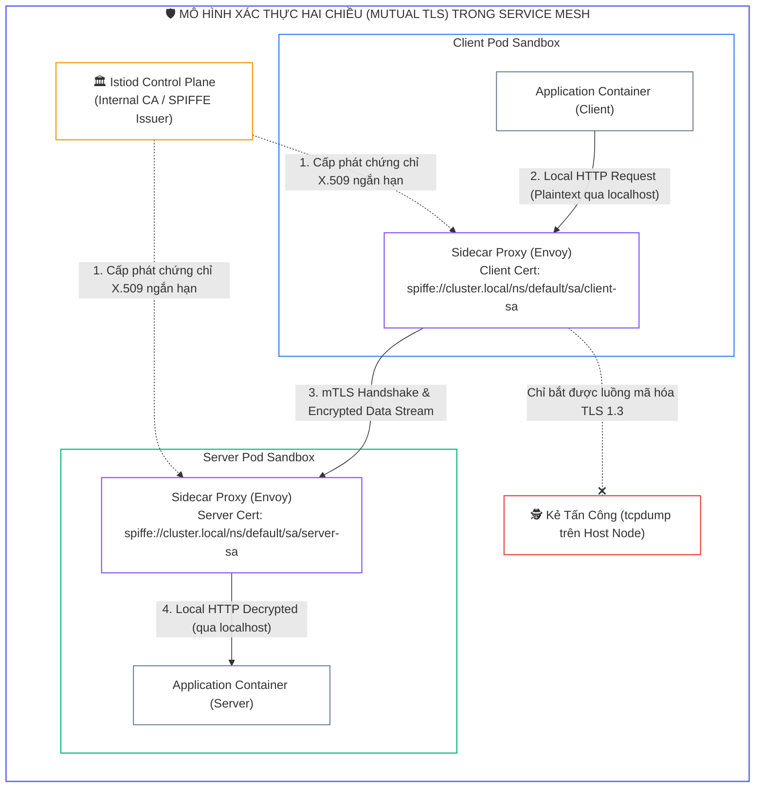
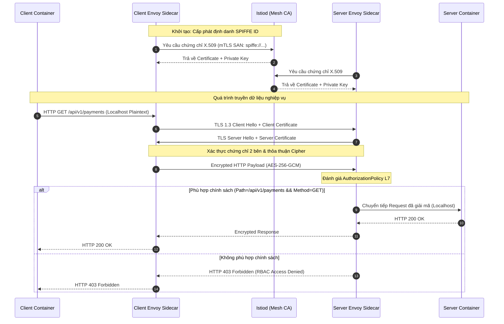
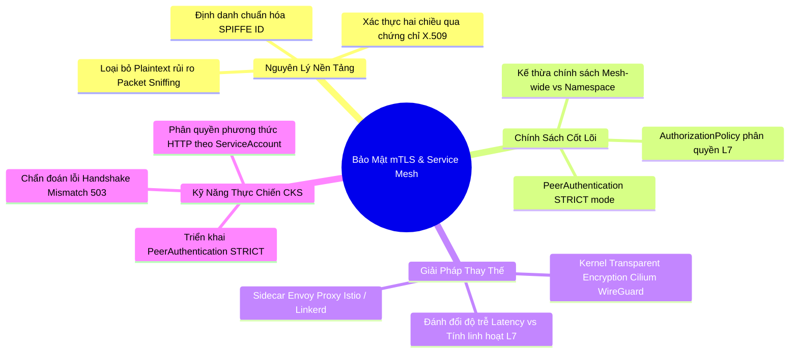


> [!IMPORTANT]
> **Mục tiêu kỹ thuật bài học**:
> - Hiểu rõ nguy cơ của luồng dữ liệu thô (**Plaintext Traffic**) trong mạng Pod và cơ chế phòng chống tấn công **Packet Sniffing / MitM**.
> - Nắm vững nguyên lý xác thực hai chiều **Mutual TLS (mTLS)** và chu trình cấp phát chứng chỉ tự động qua **Istiod / SPIRE**.
> - Biên soạn và triển khai chính sách **`PeerAuthentication`** với các chế độ `STRICT`, `PERMISSIVE`, và `DISABLE`.
> - Thiết lập chính sách phân quyền tầng ứng dụng L7 bằng **`AuthorizationPolicy`** (chặn/cho phép theo HTTP methods, paths, identity).
> - Đánh giá ưu nhược điểm giữa **Sidecar-based Service Mesh (Istio Envoy)** và **Kernel-level Transparent Encryption (Cilium WireGuard / IPsec)**.
> - Xử lý sự cố lỗi kết nối do **TLS Handshake Failure (503 Service Unavailable / Connection Reset)** trong môi trường thực chiến.

---

## 1. Bản Chất Kiến Trúc & Tư Duy Cốt Lõi: Bảo Mật Giao Vận Mạng Pod-to-Pod

Trong mô hình mạng phẳng của Kubernetes, tất cả các Pod trên mọi Node có thể giao tiếp trực tiếp với nhau mà không qua NAT. Mặc định, toàn bộ lưu lượng giao tiếp qua CNI overlay network đều là **văn bản thô (Plaintext)**:
1. **Packet Sniffing Attack:** Nếu kẻ tấn công chiếm quyền điều khiển một container hoặc chạy tiến trình có quyền `CAP_NET_RAW` trên cùng Node, chúng có thể sử dụng `tcpdump` trên giao diện mạng ảo (`veth`) để bắt trọn các Token xác thực, mật khẩu cơ sở dữ liệu và thông tin thẻ thanh toán.
2. **Man-in-the-Middle (MitM) & Spoofing:** Kẻ tấn công có thể giả mạo địa chỉ IP Pod để đánh lừa dịch vụ đích hoặc chỉnh sửa nội dung phản hồi giữa các microservices.

Để ngăn chặn triệt để, kiến trúc Zero-Trust yêu cầu thiết lập **Mutual TLS (mTLS)**: Cả bên gửi (Client) và bên nhận (Server) đều phải xác thực chứng chỉ số X.509 của nhau trước khi thiết lập kênh truyền mã hóa AES-GCM / ChaCha20-Poly1305.



---

## 2. Bảng Ma Trận So Sánh Kỹ Thuật Toàn Diện (Engineering Matrix)

| Tiêu Chí Đánh Giá | Plaintext K8s Mặc Định | Istio / Linkerd Service Mesh | Cilium WireGuard CNI | IPsec CNI Encryption |
| :--- | :--- | :--- | :--- | :--- |
| **Cơ chế mã hóa** | Không mã hóa (Plaintext) | TLS 1.3 thông qua Envoy Sidecar | WireGuard tunnel trong Kernel eBPF | IPsec ESP tunnel trong Kernel |
| **Mức độ bảo vệ** | Không có | Xác thực định danh cấp độ Service Account (L7) | Mã hóa toàn bộ gói tin Node-to-Node / Pod-to-Pod (L3/L4) | Mã hóa Node-to-Node (L3) |
| **Kiểm soát chính sách L7** | Không | Rất mạnh (`AuthorizationPolicy`: Path, Method, JWT) | Có (khi bật Cilium L7 eBPF Proxy) | Không |
| **Độ trễ & Overhead CPU** | Rất thấp | Cao (2 proxy hops + giải mã TLS ở userspace) | Rất thấp (Tối ưu hóa trong Linux Kernel) | Trung bình (Tốn CPU hơn WireGuard) |
| **Độ phức tạp vận hành** | Đơn giản nhất | Phức tạp (Cần quản trị CRD, CA, Sidecar Injection) | Đơn giản (Chỉ cần bật cờ trong Cilium Config) | Phức tạp (Quản lý khóa IPsec) |
| **Đánh giá thi CKS** | Điểm yếu nghiêm trọng | <span class="badge badge--emerald">Trọng tâm câu hỏi Service Mesh</span> | Thường xuất hiện trong phần CNI Hardening | Đọc thêm |

---

## 3. Kiến Trúc Môi Trường & Luồng Thực Thi Mẫu

Luồng thực thi tiêu chuẩn để bảo vệ lưu lượng bằng Service Mesh và chính sách L7:



### Khai Báo Chính Sách PeerAuthentication Bắt Buộc (STRICT Mode)

Tệp khai báo sau đây ép buộc toàn bộ các Pod trong namespace `finance` phải giao tiếp bằng mTLS:

```yaml
apiVersion: security.istio.io/v1beta1
kind: PeerAuthentication
metadata:
  name: default
  namespace: finance
spec:
  mtls:
    mode: STRICT
```

### Khai Báo Chính Sách Phân Quyền Tầng Ứng Dụng (AuthorizationPolicy)

Chỉ cho phép ServiceAccount `frontend-sa` thực hiện lệnh `GET` tới endpoint `/api/v1/data`:

```yaml
apiVersion: security.istio.io/v1beta1
kind: AuthorizationPolicy
metadata:
  name: allow-frontend-read
  namespace: finance
spec:
  selector:
    matchLabels:
      app: backend-api
  action: ALLOW
  rules:
  - from:
    - source:
        principals: ["cluster.local/ns/finance/sa/frontend-sa"]
    to:
    - operation:
        methods: ["GET"]
        paths: ["/api/v1/data*"]
```

---

## 4. Phân Tích Cạm Bẫy Thực Chiến: Chẩn Đoán & Xử Lý Sự Cố

### Cạm Bẫy 1: Sự Cố Cháy Kết Nối Do Để Chế Độ PERMISSIVE Trong Môi Trường Sản Xuất

Nhiều quản trị viên để `PeerAuthentication` ở chế độ `PERMISSIVE` để "tránh lỗi kết nối". Tuy nhiên, chế độ này chấp nhận cả kết nối Plaintext lẫn mTLS. Kẻ tấn công trên cùng Node có thể cố tình gửi Plaintext request tới cổng ứng dụng để vượt qua cơ chế kiểm tra chứng chỉ.

### Hậu Quả & Log Lỗi Thực Tế:

```text
# Kiểm tra lưu lượng mạng bắt được từ Pod không có Sidecar:
$ tcpdump -i any -A port 8080 -nn
10.244.1.15.48292 > 10.244.2.10.8080: Flags [P.], seq 1:120, ack 1
GET /v1/creditcards HTTP/1.1
Host: payment-service:8080
Authorization: Bearer eyJhbGciOi... (JWT TOKEN BỊ LỘ BẢN RÕ!)
```

### 5-Whys Root Cause Analysis:
1. **Tại sao dữ liệu nhạy cảm bị lộ?** Vì gói tin truyền giữa 2 Pod không được mã hóa.
2. **Tại sao gói tin không được mã hóa?** Vì Client không có Sidecar Proxy và Server chấp nhận kết nối thô.
3. **Tại sao Server chấp nhận kết nối thô?** Vì `PeerAuthentication` đang cấu hình `mode: PERMISSIVE`.
4. **Tại sao cấu hình PERMISSIVE?** Do kỹ sư muốn quá trình di chuyển ứng dụng không bị đứt đoạn nhưng quên siết lại.
5. **Biện pháp khắc phục triệt để:** Chuyển ngay `PeerAuthentication` sang `mode: STRICT` và áp dụng giám sát tuân thủ tự động.

---

### Cạm Bẫy 2: Lỗi "503 Service Unavailable / Connection Reset" Do Mismatch mTLS Cấu Hình

Khi áp dụng `mode: STRICT` trên Server nhưng Client chưa được tiêm Sidecar Proxy (`sidecar.istio.io/inject: "true"`), Client sẽ gửi yêu cầu HTTP thuần. Envoy Proxy phía Server sẽ ngắt kết nối lập tức tại bước bắt tay TLS.

### Hậu Quả & Log Lỗi Thực Tế:

```text
$ kubectl exec -it legacy-client -n finance -- curl http://backend-api:8080/data
curl: (56) Recv failure: Connection reset by peer

# Nhật ký lỗi từ Envoy Sidecar của backend-api:
$ kubectl logs backend-api-799d5f7b4c-kx8wq -c istio-proxy -n finance
[2026-09-12T11:05:22.140Z] "- - -" 0 - - - "-" 0 0 0 - "-" "-" "-" "-" "-" 
downstream_peer_cert_validation_failed: TLS_error:|268435703:SSL routines:OPENSSL_internal:WRONG_VERSION_NUMBER
```

```diff
  apiVersion: apps/v1
  kind: Deployment
  metadata:
    name: legacy-client
    namespace: finance
+   annotations:
+     sidecar.istio.io/inject: "true"
```

---

## 5. Hands-on Lab: Cấu Hình Toàn Diện mTLS STRICT & Phân Quyền L7

| Bước | Mục tiêu thực hiện | Lệnh / Thao tác kiểm chứng |
| :--- | :--- | :--- |
| **B1** | Tạo namespace thực hành có gắn nhãn tự động inject Sidecar | `kubectl create ns mesh-secure && kubectl label ns mesh-secure istio-injection=enabled` |
| **B2** | Triển khai 2 ứng dụng mẫu Client và Server | `kubectl apply -f apps.yaml -n mesh-secure` |
| **B3** | Kiểm tra trạng thái giao tiếp mặc định (PERMISSIVE) | `kubectl exec -it sleep-client -n mesh-secure -- curl http://httpbin:8000/headers` |
| **B4** | Cấu hình chính sách `PeerAuthentication` chế độ `STRICT` | `kubectl apply -f peer-auth-strict.yaml -n mesh-secure` |
| **B5** | Kiểm tra kết nối từ Pod có Sidecar hợp lệ | Đảm bảo trả về HTTP 200 OK với chứng chỉ mTLS hợp lệ |
| **B6** | Triển khai Pod ngoài Mesh (không có Sidecar) để kiểm tra chặn | Kiểm tra lệnh `curl` bị ngắt kết nối (`Connection reset by peer`) |
| **B7** | Thiết lập chính sách `AuthorizationPolicy` chỉ cho phép `GET` | `kubectl apply -f auth-policy-get-only.yaml -n mesh-secure` |
| **B8** | Kiểm chứng phân quyền L7: lệnh `POST` bị trả về `403 Forbidden` | `kubectl exec -it sleep-client -n mesh-secure -- curl -X POST ...` |

---

### Bước 1: Khởi tạo Namespace & Kích Hoạt Sidecar Auto-Injection

```bash
kubectl create namespace mesh-secure
kubectl label namespace mesh-secure istio-injection=enabled --overwrite
kubectl get namespace mesh-secure --show-labels
```

### Bước 2: Triển Khai Dịch Vụ Ứng Dụng Mẫu

Tạo tệp khai báo `apps.yaml`:

```yaml
apiVersion: v1
kind: ServiceAccount
metadata:
  name: client-sa
  namespace: mesh-secure
---
apiVersion: apps/v1
kind: Deployment
metadata:
  name: client-app
  namespace: mesh-secure
spec:
  replicas: 1
  selector:
    matchLabels:
      app: client-app
  template:
    metadata:
      labels:
        app: client-app
    spec:
      serviceAccountName: client-sa
      containers:
      - name: client
        image: curlimages/curl:8.5.0
        command: ["sleep", "3600"]
---
apiVersion: v1
kind: ServiceAccount
metadata:
  name: server-sa
  namespace: mesh-secure
---
apiVersion: apps/v1
kind: Deployment
metadata:
  name: server-app
  namespace: mesh-secure
spec:
  replicas: 1
  selector:
    matchLabels:
      app: server-app
  template:
    metadata:
      labels:
        app: server-app
    spec:
      serviceAccountName: server-sa
      containers:
      - name: server
        image: kennethreitz/httpbin
        ports:
        - containerPort: 80
---
apiVersion: v1
kind: Service
metadata:
  name: server-svc
  namespace: mesh-secure
spec:
  ports:
  - port: 8000
    targetPort: 80
  selector:
    app: server-app
```

Triển khai vào cụm:

```bash
kubectl apply -f apps.yaml
kubectl get pods -n mesh-secure -o wide
```

> [!NOTE]
> Kiểm tra cột `READY`: Các Pod phải có `2/2` containers (1 ứng dụng + 1 `istio-proxy`).

---

### Bước 3: Kiểm Tra Giao Tiếp Ban Đầu

```bash
kubectl exec -it deploy/client-app -c client -n mesh-secure -- curl -s http://server-svc:8000/headers | grep -i "x-forwarded-client-cert"
```

---

### Bước 4: Khởi Tạo Chính Sách PeerAuthentication Chế Độ STRICT

Tạo tệp `peer-auth-strict.yaml`:

```yaml
apiVersion: security.istio.io/v1beta1
kind: PeerAuthentication
metadata:
  name: default
  namespace: mesh-secure
spec:
  mtls:
    mode: STRICT
```

Áp dụng chính sách:

```bash
kubectl apply -f peer-auth-strict.yaml
kubectl get peerauthentication -n mesh-secure
```

---

### Bước 5: Kiểm Chứng Kết Nối Nội Bộ Mesh Hoạt Động Hoàn Hảo

```bash
kubectl exec -it deploy/client-app -c client -n mesh-secure -- curl -s -o /dev/null -w "%{http_code}\n" http://server-svc:8000/get
```
*Kết quả đầu ra kỳ vọng:* `200`

---

### Bước 6: Kiểm Chứng Chặn Kết Nối Từ Pod Không Thuộc Mesh

Khởi tạo một Pod nằm ở namespace mặc định không có Envoy Sidecar:

```bash
kubectl run unmanaged-client --image=curlimages/curl:8.5.0 -n default --command -- sleep 3600
kubectl wait --for=condition=Ready pod/unmanaged-client -n default --timeout=30s

# Thực hiện gọi vào server-svc trong namespace mesh-secure:
kubectl exec -it unmanaged-client -n default -- curl -s http://server-svc.mesh-secure.svc.cluster.local:8000/get || echo "KẾT NỐI BỊ CHẶN HOÀN TOÀN"
```

---

### Bước 7: Cấu Hình Chính Sách Phân Quyền Tầng L7 (AuthorizationPolicy)

Chỉ cho phép `client-sa` thực hiện phương thức `GET`:

```yaml
apiVersion: security.istio.io/v1beta1
kind: AuthorizationPolicy
metadata:
  name: restrict-server-access
  namespace: mesh-secure
spec:
  selector:
    matchLabels:
      app: server-app
  action: ALLOW
  rules:
  - from:
    - source:
        principals: ["cluster.local/ns/mesh-secure/sa/client-sa"]
    to:
    - operation:
        methods: ["GET"]
```

Áp dụng cấu hình:

```bash
kubectl apply -f auth-policy.yaml
```

---

### Bước 8: Kiểm Chứng Phân Quyền L7

```bash
# 1. Thử nghiệm gửi lệnh GET (Thành công):
kubectl exec -it deploy/client-app -c client -n mesh-secure -- curl -s -o /dev/null -w "%{http_code}\n" -X GET http://server-svc:8000/get
# Output: 200

# 2. Thử nghiệm gửi lệnh POST (Bị chặn 403):
kubectl exec -it deploy/client-app -c client -n mesh-secure -- curl -s -o /dev/null -w "%{http_code}\n" -X POST http://server-svc:8000/post
# Output: 403
```

---

## 6. 10 Câu Hỏi Tự Kiểm Tra Chuyên Sâu (Self-Check Q&A Accordion)

<details class="qa-card">
  <summary><b>Câu 1: Sự khác biệt cơ bản giữa mã hóa TLS 1 chiều và Mutual TLS (mTLS 2 chiều) là gì?</b></summary>
  <div class="qa-answer">
    <div>TLS 1 chiều thông thường chỉ yêu cầu máy chủ (Server) trình chứng chỉ số X.509 để trình duyệt/máy khách xác thực danh tính máy chủ. Trong khi đó, <b>Mutual TLS (mTLS)</b> bắt buộc <b>CẢ HAI BÊN</b> (Client và Server) đều phải xuất trình và xác thực chứng chỉ số X.509 của nhau, tạo kênh truyền mã hóa đối xứng và loại trừ nguy cơ mạo danh Client.</div>
  </div>
</details>

<details class="qa-card">
  <summary><b>Câu 2: Chế độ <code>PERMISSIVE</code> trong PeerAuthentication hoạt động như thế nào và rủi ro bảo mật là gì?</b></summary>
  <div class="qa-answer">
    <div>Chế độ <code>PERMISSIVE</code> cho phép một Pod chấp nhận đồng thời cả kết nối đã được mã hóa mTLS lẫn kết nối văn bản thô (Plaintext). Rủi ro là nếu có kẻ tấn công nội bộ hoặc Pod ngoài Mesh gửi dữ liệu nhạy cảm không mã hóa, kết nối vẫn được thực hiện thành công, làm mất đi khả năng đảm bảo tính bảo mật tuyệt đối.</div>
  </div>
</details>

<details class="qa-card">
  <summary><b>Câu 3: Để ép buộc toàn bộ cụm Kubernetes (Mesh-wide) phải dùng mTLS, ta áp dụng PeerAuthentication ở đâu?</b></summary>
  <div class="qa-answer">
    <div>Ta tạo đối tượng <code>PeerAuthentication</code> với <code>mode: STRICT</code> tại namespace gốc quản trị của Service Mesh (thường là <b><code>istio-system</code></b>) mà không khai báo trường <code>selector</code>. Khi đó chính sách sẽ tự động kế thừa và áp dụng cho tất cả các namespace trong cụm.</div>
  </div>
</details>

<details class="qa-card">
  <summary><b>Câu 4: SPIFFE ID trong Service Mesh có cấu trúc như thế nào và đóng vai trò gì?</b></summary>
  <div class="qa-answer">
    <div>SPIFFE ID là một định danh chuẩn hóa có dạng URI: <code>spiffe://&lt;trust-domain&gt;/ns/&lt;namespace&gt;/sa/&lt;service-account-name&gt;</code>. Chuỗi định danh này được nhúng vào trường SAN (Subject Alternative Name) của chứng chỉ X.509, cho phép các chính sách <code>AuthorizationPolicy</code> nhận diện chính xác danh tính của Pod đang gửi yêu cầu.</div>
  </div>
</details>

<details class="qa-card">
  <summary><b>Câu 5: Tại sao NetworkPolicy không thể thay thế được PeerAuthentication và AuthorizationPolicy?</b></summary>
  <div class="qa-answer">
    <div><b>NetworkPolicy</b> hoạt động chủ yếu ở tầng L3/L4 (IP và Port), chỉ quyết định cho phép hoặc chặn gói tin nhưng <b>hoàn toàn không mã hóa dữ liệu</b> và không hiểu được các phương thức HTTP (GET/POST/PUT) hay URI Path. <code>PeerAuthentication</code> đảm nhiệm mã hóa tầng truyền tải (mTLS), còn <code>AuthorizationPolicy</code> phân quyền ở tầng L7.</div>
  </div>
</details>

<details class="qa-card">
  <summary><b>Câu 6: Cơ chế mã hóa Transparent Encryption của Cilium WireGuard khác biệt gì so với Istio mTLS?</b></summary>
  <div class="qa-answer">
    <div>Cilium WireGuard thực hiện mã hóa và giải mã gói tin trực tiếp trong nhân Linux (<b>Linux Kernel Space</b>) bằng công nghệ eBPF và WireGuard tunnel giữa các Node. Cơ chế này không cần inject Sidecar Proxy vào từng Pod, mang lại hiệu năng cao hơn và tiêu thụ ít tài nguyên RAM/CPU hơn so với Istio Envoy.</div>
  </div>
</details>

<details class="qa-card">
  <summary><b>Câu 7: Khi gặp lỗi <code>503 Service Unavailable</code> hoặc <code>Connection reset by peer</code> sau khi áp dụng STRICT mTLS, bước đầu tiên cần kiểm tra là gì?</b></summary>
  <div class="qa-answer">
    <div>Cần kiểm tra xem Pod gọi đi (Client) đã được tiêm (injected) <b>Envoy Sidecar Proxy</b> hay chưa bằng lệnh <code>kubectl get pod &lt;pod-name&gt; -o jsonpath='{.spec.containers[*].name}'</code>. Nếu Client không có Sidecar, nó sẽ gửi HTTP thô và bị phía Server từ chối ngay lập tức tại bước Handshake.</div>
  </div>
</details>

<details class="qa-card">
  <summary><b>Câu 8: Khối <code>action: DENY</code> trong AuthorizationPolicy có độ ưu tiên như thế nào so với <code>action: ALLOW</code>?</b></summary>
  <div class="qa-answer">
    <div>Quy tắc <b><code>DENY</code> luôn có độ ưu tiên cao nhất</b>. Nếu một yêu cầu mạng thỏa mãn điều kiện của cả quy tắc <code>DENY</code> và quy tắc <code>ALLOW</code>, yêu cầu đó sẽ bị từ chối truy cập ngay lập tức (Explicit Deny trumps Allow).</div>
  </div>
</details>

<details class="qa-card">
  <summary><b>Câu 9: Chứng chỉ X.509 cấp cho các Sidecar Proxy có thời hạn bao lâu và được xoay vòng như thế nào?</b></summary>
  <div class="qa-answer">
    <div>Mặc định trong Istio, chứng chỉ cấp cho Workload có thời hạn rất ngắn (thường là <b>24 giờ</b>). Tiến trình <code>istio-agent</code> chạy bên trong Sidecar sẽ tự động liên hệ với Control Plane (Istiod) qua giao thức gRPC Secret Discovery Service (SDS) để xoay vòng và làm mới chứng chỉ trước khi hết hạn mà không gây gián đoạn kết nối.</div>
  </div>
</details>

<details class="qa-card">
  <summary><b>Câu 10: Trong kỳ thi CKS, làm thế nào để vô hiệu hóa mTLS cho một dịch vụ đặc thù trong namespace đang bật STRICT?</b></summary>
  <div class="qa-answer">
    <div>Tạo một đối tượng <code>PeerAuthentication</code> mới trong namespace đó, khai báo khối <code>selector.matchLabels</code> trỏ đúng vào nhãn (Labels) của dịch vụ cần loại trừ, và đặt giá trị <code>spec.mtls.mode: DISABLE</code>. Cấu hình cụ thể này sẽ ghi đè lên cấu hình mặc định của namespace.</div>
  </div>
</details>

---

## 7. Tổng Kết & Lộ Trình Bài Học Tiếp Theo



> [!TIP]
> **Bài học tiếp theo:** Khám phá chuyên sâu phương pháp ký số hiện vật phần mềm và tạo lập hóa đơn nguyên liệu phần mềm trong bài **[Bài 14] Ký Số Hiện Vật Phần Mềm & Quản Lý SBOM: Cosign, Syft, Grype & Khung SLSA](cks-14-14-cosign-va-sbom-ky-so-hien-vat.html)**.

