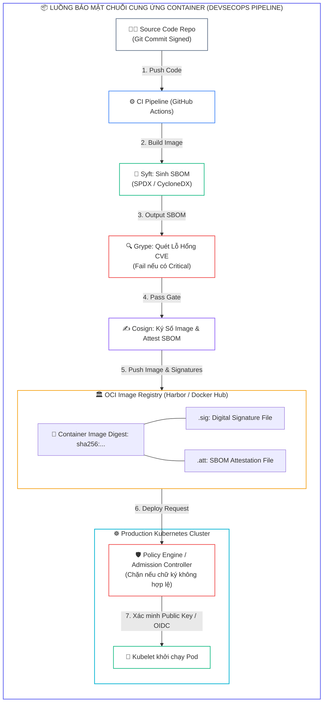
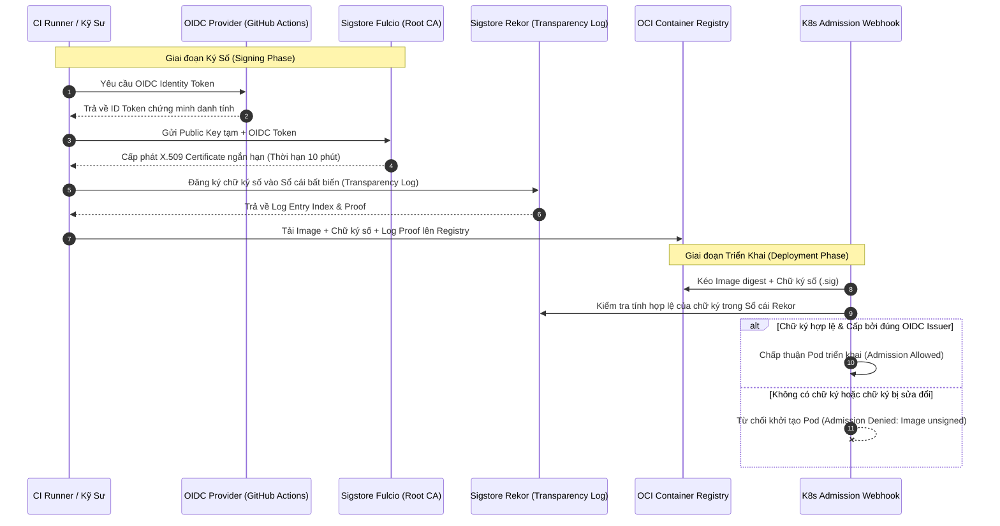
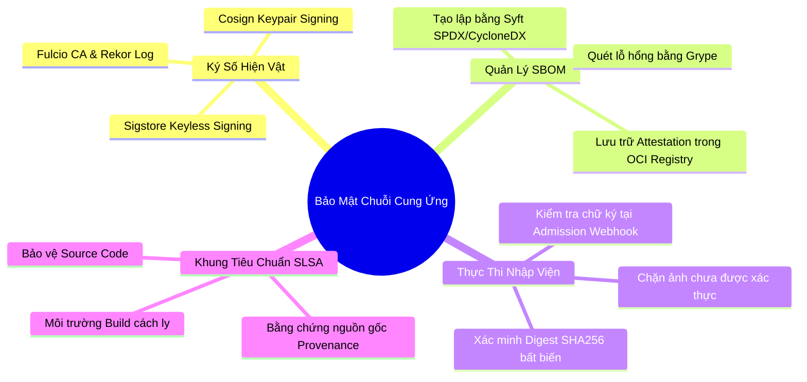


> [!IMPORTANT]
> **Mục tiêu kỹ thuật bài học**:
> - Hiểu rõ các vector tấn công vào chuỗi cung ứng phần mềm (**Software Supply Chain Attacks**) và cấu trúc cấp độ an ninh theo khung **SLSA (Levels 1-4)**.
> - Nắm vững cơ chế ký số bất đối xứng truyền thống (**Keypair Signing**) và mô hình ký số không khóa (**Keyless Signing**) với **Sigstore (Fulcio + Rekor)**.
> - Sinh cặp khóa Cosign, thực hiện ký số Container Image (`cosign sign`) và xác minh chữ ký số (`cosign verify`).
> - Sử dụng **Syft** để tạo hóa đơn nguyên liệu phần mềm (**SBOM - Software Bill of Materials**) chuẩn định dạng `SPDX` và `CycloneDX`.
> - Tích hợp **Grype** để quét lỗ hổng bảo mật trực tiếp từ tệp SBOM đã sinh ra.
> - Đính kèm chứng chỉ kiểm định (**Attestation**) vào Image trên OCI Registry bằng lệnh `cosign attest`.
> - Thiết lập chính sách kiểm soát nhập viện (**Admission Control / Kyverno**) để từ chối khởi chạy Pod từ Image chưa được ký số hợp lệ.

---

## 1. Bản Chất Kiến Trúc & Tư Duy Cốt Lõi: Bảo Vệ Chuỗi Cung Ứng Phần Mềm

Trong quy trình CI/CD hiện đại, việc một Container Image được build thành công không đồng nghĩa với việc nó an toàn để triển khai lên môi trường sản xuất. Các cuộc tấn công chuỗi cung ứng phần mềm (*như vụ tấn công SolarWinds hay Codecov*) đã chứng minh rằng kẻ xấu có thể xâm nhập vào máy chủ CI, can thiệp vào mã nhị phân hoặc tráo đổi Image trên Registry mà không làm thay đổi tag `latest` hay `v1.0.0`.

Để thiết lập lòng tin không thể chối bỏ (**Cryptographic Provenance**), kiến trúc bảo mật **CKS** yêu cầu áp dụng hệ sinh thái **Sigstore & SBOM**:
1. **Chữ ký số (Digital Signature):** Khẳng định ai là người tạo ra Image và nội dung Image không hề bị biến đổi (Tính toàn vẹn - Integrity).
2. **Hóa đơn nguyên liệu phần mềm (SBOM):** Danh mục chi tiết toàn bộ các thư viện bên thứ ba (Dependencies), phiên bản, giấy phép và tệp nhị phân có trong Image.
3. **Attestation (Chứng nhận kiểm định):** Đính kèm kết quả quét mã nguồn, quét lỗ hổng và chữ ký số vào cùng một Manifest trong OCI Registry.



---

## 2. Bảng Ma Trận So Sánh Kỹ Thuật Toàn Diện (Engineering Matrix)

| Tiêu Chí So Sánh | Docker Content Trust (Notary v1) | Cosign Keypair Signing | Cosign Keyless Signing (Sigstore) |
| :--- | :--- | :--- | :--- |
| **Hạ tầng quản lý khóa** | Yêu cầu máy chủ Notary riêng biệt | Quản lý Private/Public Key cục bộ (hoặc KMS) | **Không cần quản lý Private Key** (Dựa trên OIDC Token) |
| **Gốc tin cậy (Root of Trust)** | Notary Root Keys | Quản lý thủ công cặp khóa bí mật | OpenID Connect (OIDC: Google, GitHub, Microsoft) |
| **Nhật ký minh bạch (Transparency)** | Không có | Không có | **Có (Rekor Public Transparency Log)** |
| **Nhà chức trách cấp chứng chỉ** | Tự quản lý | Không dùng Certificate X.509 | **Fulcio CA** (Cấp chứng chỉ số tạm thời có hiệu lực 10 phút) |
| **Vị trí lưu trữ chữ ký** | Metadata server của Notary | Trực tiếp trong OCI Registry (dưới dạng tag `.sig`) | Trực tiếp trong OCI Registry |
| **Khả năng đính kèm SBOM** | Rất khó khăn | Hỗ trợ qua Cosign Attestation | **Hỗ trợ toàn diện qua in-toto Attestation** |
| **Độ phổ biến & CKS Focus** | Đang bị loại bỏ dần | <span class="badge badge--emerald">Trọng tâm thi CKS thực chiến</span> | <span class="badge badge--emerald">Tiêu chuẩn công nghiệp tương lai</span> |

---

## 3. Kiến Trúc Môi Trường & Luồng Thực Thi Mẫu

Luồng ký số không khóa (Keyless Signing) và xác thực tính toàn vẹn của Container Image:



### Các Lệnh Thao Tác Cơ Bản Với Cosign & Syft

```bash
# 1. Sinh cặp khóa ký số với mật khẩu bảo vệ:
cosign generate-key-pair

# 2. Ký số một Container Image dựa trên Digest SHA256:
cosign sign --key cosign.key my-registry.internal/apps/payment-api@sha256:4a5b6c...

# 3. Xác minh chữ ký số của Image bằng Public Key:
cosign verify --key cosign.pub my-registry.internal/apps/payment-api@sha256:4a5b6c...

# 4. Sinh SBOM định dạng SPDX bằng Syft:
syft my-registry.internal/apps/payment-api:v1.0.0 -o spdx-json=sbom.spdx.json

# 5. Quét lỗ hổng trực tiếp từ tệp SBOM bằng Grype:
grype sbom:sbom.spdx.json --only-fixed --fail-on critical

# 6. Đính kèm SBOM Attestation vào Image trên Registry:
cosign attest --key cosign.key --type spdxjson --predicate sbom.spdx.json my-registry.internal/apps/payment-api@sha256:4a5b6c...
```

---

## 4. Phân Tích Cạm Bẫy Thực Chiến: Chẩn Đoán & Xử Lý Sự Cố

### Cạm Bẫy 1: Ký Số Bằng Mutable Tag (Ví dụ: `latest`) Thay Vì Immutable SHA256 Digest

Nếu thực hiện ký số một Image bằng tag (như `payment-api:v1.0.0`), kẻ tấn công có quyền ghi trên Registry có thể đẩy đè một Image độc hại trùng tag đó. Khi K8s kéo Image, mã băm digest đã thay đổi nhưng lệnh kiểm tra tag vẫn có thể gây nhầm lẫn nếu không cấu hình ép buộc kiểm tra Digest.

### Hậu Quả & Log Lỗi Thực Tế:

```text
# Lỗi cảnh báo bảo mật từ Cosign:
$ cosign sign --key cosign.key my-repo/api:v1.0
WARNING: Signing by tag is not recommended. If the tag is overwritten in the registry,
the signature will point to the new image digest which may not have been signed by you!
Please sign by digest: my-repo/api@sha256:e3b0c44298fc1c149afbf4c8996fb92427ae41e4649b934ca495991b7852b855
```

### 5-Whys Root Cause Analysis:
1. **Tại sao chữ ký số không bảo vệ được Image?** Vì Image thực tế chạy trong Pod khác với Image ban đầu được ký.
2. **Tại sao Image bị thay đổi?** Vì tag `v1.0` trên Docker Registry đã bị push đè bản mới.
3. **Tại sao hệ thống cho phép push đè?** Vì Registry không bật tính năng `Immutable Tags`.
4. **Tại sao lệnh ký lại dùng tag?** Do lập trình viên gõ lệnh bằng tag cho thuận tiện.
5. **Biện pháp khắc phục triệt để:** Bắt buộc luôn lấy Immutable Digest (`sha256:...`) trước khi ký và cấu hình Registry ở chế độ `Immutable Tags`.

---

### Cạm Bẫy 2: Lỗi "Verify Failed: No Signatures Found" Do Chưa Phân Quyền Đọc Cho ServiceAccount

Khi K8s Admission Controller xác minh chữ ký Image trên Private Registry, nếu Webhook không có quyền `Pull` đối với tệp `.sig` trên Registry, quá trình xác thực sẽ thất bại mặc dù Image đã được ký đầy đủ.

### Hậu Quả & Log Lỗi Thực Tế:

```text
Error from server (InternalError): error when creating "deployment.yaml": admission webhook 
"validate.kyverno.svc" denied the request: image my-registry.internal/apps/payment-api:v1.0.0 
failed verification: no matching signatures found: response 401 Unauthorized from registry
```

```diff
  apiVersion: v1
  kind: Secret
  metadata:
    name: registry-credentials
    namespace: kyverno
  type: kubernetes.io/dockerconfigjson
  data:
+   .dockerconfigjson: <BASE64_ENCODED_READ_ALL_PULL_SECRET>
```

---

## 5. Hands-on Lab: Ký Số Image, Tạo SBOM Syft & Thực Thi Kiểm Soát Nhập Viện

| Bước | Mục tiêu thực hiện | Lệnh / Thao tác kiểm chứng |
| :--- | :--- | :--- |
| **B1** | Cài đặt các công cụ dòng lệnh Cosign, Syft và Grype | `cosign version && syft version && grype version` |
| **B2** | Khởi tạo cặp khóa mật mã bất đối xứng (Public/Private Key) | `cosign generate-key-pair` |
| **B3** | Kéo và đẩy một Image mẫu vào Local Registry kèm Digest | `crane digest localhost:5000/secure-app:1.0` |
| **B4** | Ký số Container Image bằng Private Key | `cosign sign --key cosign.key localhost:5000/secure-app@sha256:...` |
| **B5** | Xác minh tính toàn vẹn của chữ ký số bằng Public Key | `cosign verify --key cosign.pub localhost:5000/secure-app@sha256:...` |
| **B6** | Sinh hóa đơn nguyên liệu phần mềm (SBOM) với Syft | `syft localhost:5000/secure-app:1.0 -o spdx-json=app.sbom.json` |
| **B7** | Quét tìm lỗ hổng CVE từ tệp SBOM bằng Grype | `grype sbom:app.sbom.json --fail-on medium` |
| **B8** | Đính kèm SBOM Attestation và kiểm tra trên Registry | `cosign attest --key cosign.key --predicate app.sbom.json ...` |

---

### Bước 1: Kiểm Tra Môi Trường & Phiên Bản Công Cụ

```bash
cosign version
syft version
grype version
```

---

### Bước 2: Tạo Cặp Khóa Ký Số Cosign

Khởi tạo cặp khóa bất đối xứng `cosign.key` (Private Key) và `cosign.pub` (Public Key):

```bash
# Thiết lập mật khẩu môi trường để tự động hóa:
export COSIGN_PASSWORD="CksSecurePassword2026!"
cosign generate-key-pair

# Kiểm tra tệp sinh ra:
ls -l cosign.key cosign.pub
```

---

### Bước 3: Chuẩn Bị Container Image & Xác Định SHA256 Digest

```bash
# Giả lập Image và đẩy vào local registry:
docker pull alpine:3.19.1
docker tag alpine:3.19.1 localhost:5000/secure-app:1.0
docker push localhost:5000/secure-app:1.0

# Lấy chính xác Digest của Image:
IMAGE_DIGEST=$(docker inspect --format='{{index .RepoDigests 0}}' localhost:5000/secure-app:1.0)
echo "Target Image Digest: ${IMAGE_DIGEST}"
```

---

### Bước 4: Thực Hiện Ký Số Container Image

```bash
cosign sign --key cosign.key --yes "${IMAGE_DIGEST}"
```

> [!NOTE]
> Cosign sẽ tự động đẩy một OCI Artifact mới có đuôi tag `.sig` chứa chữ ký số lên Registry tương ứng.

---

### Bước 5: Xác Minh Chữ Ký Số

```bash
cosign verify --key cosign.pub "${IMAGE_DIGEST}"
```
*Kết quả đầu ra kỳ vọng:* In ra JSON chứa thông tin xác minh chữ ký hợp lệ kèm `critical` payload và `optional` metadata.

---

### Bước 6: Sinh Hóa Đơn Nguyên Liệu Phần Mềm (SBOM) Bằng Syft

```bash
syft "${IMAGE_DIGEST}" -o spdx-json=app.sbom.spdx.json
ls -lh app.sbom.spdx.json
head -n 20 app.sbom.spdx.json
```

---

### Bước 7: Quét Lỗ Hổng Bảo Mật Bằng Grype

```bash
grype sbom:app.sbom.spdx.json --only-fixed
```

---

### Bước 8: Đính Kèm SBOM Dưới Dạng Attestation

```bash
cosign attest --key cosign.key --type spdxjson --predicate app.sbom.spdx.json --yes "${IMAGE_DIGEST}"

# Xác minh Attestation:
cosign verify-attestation --key cosign.pub --type spdxjson "${IMAGE_DIGEST}"
```

---

## 6. 10 Câu Hỏi Tự Kiểm Tra Chuyên Sâu (Self-Check Q&A Accordion)

<details class="qa-card">
  <summary><b>Câu 1: Chữ ký số Cosign bảo vệ hệ thống khỏi vector tấn công nào nguy hiểm nhất?</b></summary>
  <div class="qa-answer">
    <div>Chữ ký số Cosign bảo vệ hệ thống khỏi <b>tấn công chuỗi cung ứng (Supply Chain Attacks)</b> và <b>giả mạo Image (Image Tampering)</b>. Nó đảm bảo rằng Container Image nạp vào cụm thực sự được biên dịch bởi hệ thống CI/CD được ủy quyền và không hề bị kẻ tấn công can thiệp, tiêm mã độc hoặc tráo đổi trên Registry.</div>
  </div>
</details>

<details class="qa-card">
  <summary><b>Câu 2: Tại sao luôn phải ký số dựa trên SHA256 Digest thay vì Image Tag?</b></summary>
  <div class="qa-answer">
    <div>Image Tag (như <code>v1.0</code>, <code>latest</code>) có tính chất biến đổi (<b>Mutable</b>) và có thể bị đẩy đè bởi một Image khác. Ngược lại, <b>SHA256 Digest</b> là định danh bất biến (<b>Immutable</b>) dựa trên nội dung thực tế của Image. Ký số trên Digest đảm bảo chữ ký chỉ có hiệu lực với đúng phiên bản nhị phân đó.</div>
  </div>
</details>

<details class="qa-card">
  <summary><b>Câu 3: Cơ chế Keyless Signing trong Sigstore hoạt động như thế nào?</b></summary>
  <div class="qa-answer">
    <div>Thay vì duy trì Private Key dài hạn, Keyless Signing sử dụng <b>OIDC Token</b> (từ GitHub Actions, Google, v.v.) để chứng minh danh tính. Dịch vụ <b>Fulcio CA</b> cấp một chứng chỉ số X.509 ngắn hạn (khoảng 10 phút), sau đó ký số và ghi lại bằng chứng giao dịch vào sổ cái bất biến công khai <b>Rekor Transparency Log</b>.</div>
  </div>
</details>

<details class="qa-card">
  <summary><b>Câu 4: SBOM là gì và hai định dạng chuẩn công nghiệp phổ biến nhất của SBOM là gì?</b></summary>
  <div class="qa-answer">
    <div><b>SBOM (Software Bill of Materials)</b> là bản danh mục chi tiết toàn bộ các thành phần, thư viện phụ thuộc, tệp nhị phân và giấy phép có trong phần mềm. Hai định dạng chuẩn công nghiệp được sử dụng rộng rãi nhất hiện nay là <b>SPDX</b> (chuẩn ISO/IEC 5962) và <b>CycloneDX</b> (do tổ chức OWASP phát triển).</div>
  </div>
</details>

<details class="qa-card">
  <summary><b>Câu 5: Sự khác biệt cơ bản giữa Cosign Sign và Cosign Attest là gì?</b></summary>
  <div class="qa-answer">
    <div><code>cosign sign</code> tạo ra chữ ký số chứng nhận tính toàn vẹn của bản thân Container Image. Trong khi đó, <b><code>cosign attest</code></b> tạo ra một chứng chỉ kiểm định (In-toto Attestation) liên kết chặt chẽ một siêu dữ liệu đi kèm (như tệp SBOM, kết quả kiểm thử, báo cáo quét mã nguồn) với Image đó.</div>
  </div>
</details>

<details class="qa-card">
  <summary><b>Câu 6: Vai trò của công cụ Syft và Grype trong quy trình DevSecOps là gì?</b></summary>
  <div class="qa-answer">
    <div><b>Syft</b> chịu trách nhiệm phân tích Container Image và tạo ra bản mô tả SBOM chi tiết. <b>Grype</b> là công cụ quét bảo mật chuyên dụng, tiếp nhận tệp SBOM từ Syft để so khớp và phát hiện các lỗ hổng bảo mật (CVE) đã biết trong cơ sở dữ liệu lỗ hổng quốc gia.</div>
  </div>
</details>

<details class="qa-card">
  <summary><b>Câu 7: Khung tiêu chuẩn SLSA (Supply-chain Levels for Software Artifacts) định nghĩa điều gì?</b></summary>
  <div class="qa-answer">
    <div>SLSA là khung hướng dẫn an ninh định nghĩa <b>4 cấp độ trưởng thành</b> nhằm gia tăng tính an toàn và minh bạch cho chuỗi cung ứng phần mềm: từ việc tự động hóa quy trình build (Level 1), ngăn chặn can thiệp mã nguồn (Level 2), môi trường build độc lập không thể giả mạo (Level 3), đến việc kiểm duyệt mã nguồn bởi 2 người (Two-person review - Level 4).</div>
  </div>
</details>

<details class="qa-card">
  <summary><b>Câu 8: Tệp chữ ký <code>.sig</code> của Cosign được lưu trữ ở đâu trên hệ thống?</b></summary>
  <div class="qa-answer">
    <div>Cosign không cần cơ sở dữ liệu riêng mà lưu trữ trực tiếp chữ ký số dưới dạng một <b>OCI Artifact</b> ngay trong chính <b>OCI Container Registry</b> nơi chứa Image, sử dụng tag có quy tắc: <code>sha256-&lt;image-digest&gt;.sig</code>.</div>
  </div>
</details>

<details class="qa-card">
  <summary><b>Câu 9: Làm thế nào Kubernetes có thể tự động chặn các Image chưa được ký số?</b></summary>
  <div class="qa-answer">
    <div>Cụm Kubernetes tích hợp các công cụ <b>Policy Engine / Admission Controller</b> như <b>Kyverno</b> hoặc <b>OPA Gatekeeper</b> kết hợp với Cosign. Khi có yêu cầu tạo Pod, Webhook sẽ tự động đối soát chữ ký số của Image với Public Key hoặc OIDC Issuer; nếu không hợp lệ, yêu cầu tạo Pod sẽ bị từ chối ngay lập tức.</div>
  </div>
</details>

<details class="qa-card">
  <summary><b>Câu 10: Lợi ích lớn nhất của việc lưu trữ SBOM dưới dạng Attestation trên Registry là gì?</b></summary>
  <div class="qa-answer">
    <div>Giúp đội ngũ bảo mật có thể truy vấn, kiểm toán và quét lại các lỗ hổng bảo mật mới xuất hiện (Zero-day CVEs) đối với các Image đang chạy trên Production bất kỳ lúc nào mà không cần phải tải về hoặc giải nén lại toàn bộ Container Image khổng lồ.</div>
  </div>
</details>

---

## 7. Tổng Kết & Lộ Trình Bài Học Tiếp Theo



> [!TIP]
> **Bài học tiếp theo:** Tìm hiểu kỹ thuật quản trị Registry tin cậy nội bộ và phân tích tĩnh Dockerfile trong bài **[Bài 15] Quản Trị Registry Tin Cậy & Phân Tích Tĩnh Dockerfile: Harbor, Notary & Hadolint](cks-15-15-registry-tin-cay-va-static-analysis.html)**.

