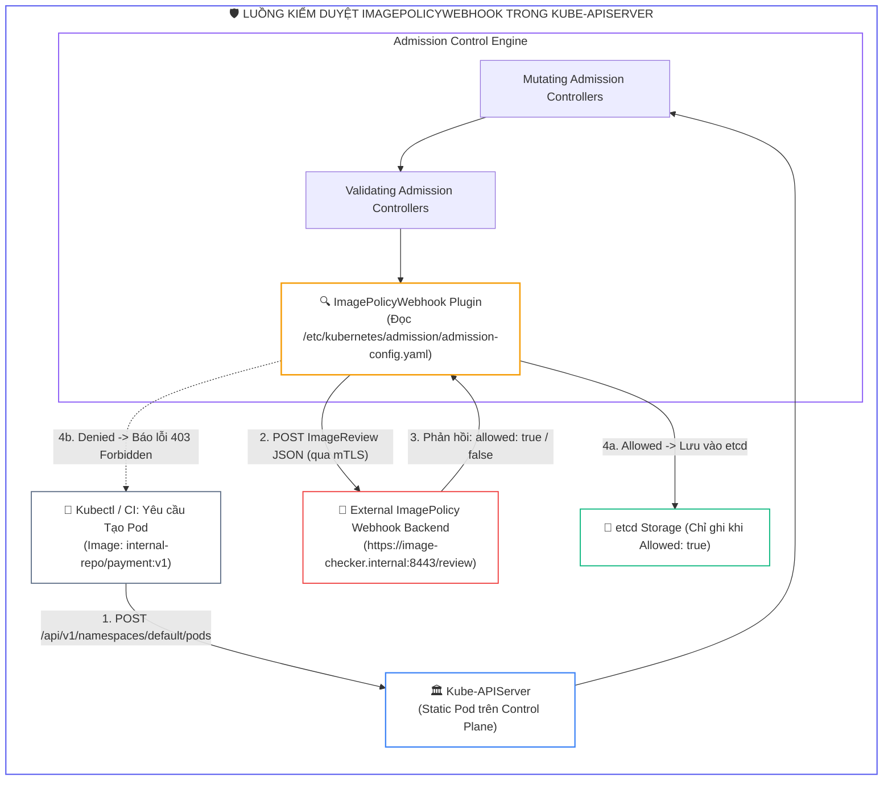
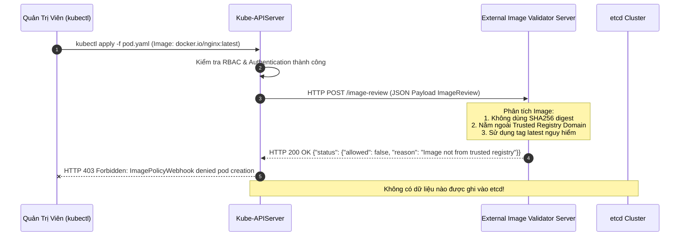
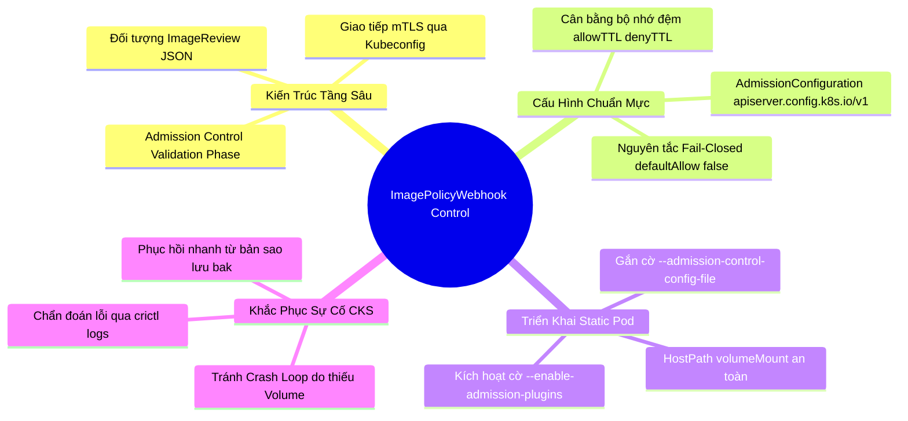


> [!IMPORTANT]
> **Mục tiêu kỹ thuật bài học**:
> - Hiểu rõ vị trí và luồng vận hành của **ImagePolicyWebhook** trong chu trình nhập viện của **Kube-APIServer** (**Admission Control Flow**).
> - Biên soạn tệp cấu hình **`AdmissionConfiguration`** chuẩn API `apiserver.config.k8s.io/v1`.
> - Tạo tệp **`Kubeconfig`** độc lập chứa chứng chỉ mTLS để Kube-APIServer kết nối an toàn với máy chủ Webhook backend.
> - Cấu hình tham số **`defaultAllow: false`** và **`allowTTL`** để cân bằng giữa tính an toàn tối đa và hiệu năng bộ nhớ đệm.
> - Chỉnh sửa an toàn tệp Manifest tĩnh **`/etc/kubernetes/manifests/kube-apiserver.yaml`**, kích hoạt cờ `--enable-admission-plugins=ImagePolicyWebhook` và cấu hình `hostPath` volumes mount.
> - Chẩn đoán và khắc phục sự cố Kube-APIServer crash loop do sai đường dẫn cấu hình hoặc lỗi kết nối Webhook backend.

---

## 1. Bản Chất Kiến Trúc & Tư Duy Cốt Lõi: Kiểm Soát Nhập Viện Ảnh Container

Trong Kubernetes, khi một yêu cầu tạo Pod gửi tới API Server, nó phải trải qua 3 giai đoạn liên tiếp:
1. **Authentication (Xác thực):** Kiểm tra danh tính người gửi (User/ServiceAccount).
2. **Authorization (Phân quyền):** Kiểm tra quyền thực thi qua RBAC/ABAC.
3. **Admission Control (Kiểm soát nhập viện):** Kiểm tra và chỉnh sửa cấu hình tài nguyên trước khi ghi vào etcd.

**ImagePolicyWebhook** là một Admission Plugin thuộc giai đoạn *Validation*. Mỗi khi có yêu cầu tạo Pod hoặc Deployment, Kube-APIServer sẽ tự động trích xuất thông tin của tất cả container images, đóng gói thành một đối tượng JSON `ImageReview` và gửi qua HTTP POST tới một máy chủ Webhook bên ngoài (ví dụ: máy chủ kiểm định nội bộ, Trivy Webhook, hoặc OPA). Nếu Webhook trả về `allowed: false`, APIServer sẽ từ chối lưu Pod vào etcd và trả lỗi về cho người dùng.



---

## 2. Bảng Ma Trận So Sánh Kỹ Thuật Toàn Diện (Engineering Matrix)

| Tiêu Chí So Sánh | ValidatingAdmissionWebhook (CRD) | ImagePolicyWebhook (APIServer Built-in) | OPA Gatekeeper / Kyverno |
| :--- | :--- | :--- | :--- |
| **Vị trí cấu hình** | Tạo đối tượng `ValidatingWebhookConfiguration` trong cụm | Cấu hình trực tiếp trên tệp cờ của `kube-apiserver` | Cài đặt Controller & CRD trong cụm |
| **Cơ chế gọi** | Gọi động qua Kubernetes Service DNS | Gọi trực tiếp qua IP / Domain khai báo trong Kubeconfig | Gọi qua Webhook động trong cụm |
| **Phạm vi kiểm tra** | Mọi loại tài nguyên (Pod, Service, Ingress, ...) | **Chỉ chuyên biệt cho Container Images** | Toàn bộ tài nguyên Kubernetes |
| **Khả năng tự bảo vệ** | Nếu Controller Pod bị chết, cấu hình `FailurePolicy` quyết định | Quản lý độc lập ngoài Kubelet/APIServer qua `defaultAllow` | Chạy trong chính cụm Kubernetes |
| **Độ khó cấu hình** | Trung bình (Dùng kubectl apply) | <span class="badge badge--rose">Khó (Cần can thiệp APIServer Static Pod Manifest)</span> | Dễ đến trung bình (Dùng YAML Policy) |
| **Trọng tâm thi CKS** | Thường gặp | <span class="badge badge--emerald">Câu hỏi kinh điển trong phần Control Plane Security</span> | Rất phổ biến |

---

## 3. Kiến Trúc Môi Trường & Luồng Thực Thi Mẫu

Cấu trúc luồng dữ liệu JSON trao đổi giữa Kube-APIServer và Webhook Server:



### 1. Tệp Cấu Hình AdmissionConfiguration (`admission-config.yaml`)

```yaml
apiVersion: apiserver.config.k8s.io/v1
kind: AdmissionConfiguration
plugins:
- name: ImagePolicyWebhook
  configuration:
    imagePolicy:
      kubeConfigFile: /etc/kubernetes/admission/kubeconfig.yaml
      allowTTL: 50
      denyTTL: 50
      retryBackoff: 500
      defaultAllow: false
```

### 2. Tệp Kubeconfig Cho Webhook (`kubeconfig.yaml`)

```yaml
apiVersion: v1
kind: Config
clusters:
- cluster:
    certificate-authority: /etc/kubernetes/admission/webhook-ca.crt
    server: https://image-validator.internal:8443/review
  name: webhook-server
contexts:
- context:
    cluster: webhook-server
    user: apiserver-client
  name: webhook-context
current-context: webhook-context
users:
- name: apiserver-client
  user:
    client-certificate: /etc/kubernetes/admission/apiserver-client.crt
    client-key: /etc/kubernetes/admission/apiserver-client.key
```

### 3. Cấu Hình Cờ Kube-APIServer Trong `/etc/kubernetes/manifests/kube-apiserver.yaml`

```yaml
spec:
  containers:
  - name: kube-apiserver
    command:
    - kube-apiserver
    - --enable-admission-plugins=NodeRestriction,ImagePolicyWebhook
    - --admission-control-config-file=/etc/kubernetes/admission/admission-config.yaml
    volumeMounts:
    - mountPath: /etc/kubernetes/admission
      name: admission-config
      readOnly: true
  volumes:
  - name: admission-config
    hostPath:
      path: /etc/kubernetes/admission
      type: DirectoryOrCreate
```

---

## 4. Phân Tích Cạm Bẫy Thực Chiến: Chẩn Đoán & Xử Lý Sự Cố

### Cạm Bẫy 1: Cấu Hình `defaultAllow: true` Khiến Hệ Thống Mất Khả Năng Phòng Vệ Khi Webhook Sập

Nếu đặt `defaultAllow: true`, khi máy chủ Webhook bị lỗi mạng, sập nguồn hoặc quá tải, Kube-APIServer sẽ tự động cho phép mọi Image nạp vào cụm mà không hề được kiểm tra an ninh.

### Hậu Quả & Log Lỗi Thực Tế:

```text
# Log cảnh báo từ Kube-APIServer khi Webhook không phản hồi nhưng defaultAllow=true:
$ crictl logs kube-apiserver-...
W0912 11:35:10.112 image_policy.go:145] Failed to reach webhook server https://image-validator.internal:8443/review: dial tcp: i/o timeout.
W0912 11:35:10.113 image_policy.go:146] defaultAllow is enabled. ALLOWING image "untrusted-repo/backdoor:v1" to run!
```

### 5-Whys Root Cause Analysis:
1. **Tại sao Image độc hại lọt vào cụm?** Vì APIServer cho phép tạo Pod mặc dù Webhook bị sập.
2. **Tại sao APIServer lại cho phép?** Vì tham số `defaultAllow` được đặt là `true`.
3. **Tại sao kỹ sư lại đặt true?** Để tránh làm gián đoạn việc triển khai ứng dụng khi máy chủ Webhook bảo trì.
4. **Tại sao đây là vi phạm nguyên tắc bảo mật?** Vì nguyên tắc an ninh Zero-Trust yêu cầu *Fail-Closed* (Thất bại là phải khóa chặt).
5. **Biện pháp khắc phục triệt để:** Bắt buộc đặt `defaultAllow: false` và thiết lập High Availability (HA) cho máy chủ Webhook.

---

### Cạm Bẫy 2: Kube-APIServer Bị Treo / Crash Loop Do Quên Cấu Hình VolumeMount

Khi sửa tệp Static Pod `/etc/kubernetes/manifests/kube-apiserver.yaml` để thêm cờ `--admission-control-config-file=/etc/kubernetes/admission/admission-config.yaml`, nếu quên cấu hình khối `volumeMounts` và `volumes`, Kube-APIServer chạy trong container sẽ không tìm thấy tệp trên Node và liên tục khởi động lại thất bại.

### Hậu Quả & Log Lỗi Thực Tế:

```text
# Kiểm tra trạng thái container APIServer qua crictl:
$ crictl ps -a --name kube-apiserver
CONTAINER           IMAGE               STATE       NAME
a1b2c3d4e5f6        kube-apiserver      Exited      kube-apiserver

# Đọc log lỗi container:
$ crictl logs a1b2c3d4e5f6
F0912 11:38:00.123 server.go:275] open /etc/kubernetes/admission/admission-config.yaml: no such file or directory
```

```diff
  # Sửa chữa trong /etc/kubernetes/manifests/kube-apiserver.yaml:
      volumeMounts:
+     - mountPath: /etc/kubernetes/admission
+       name: admission-dir
+       readOnly: true
    volumes:
+   - name: admission-dir
+     hostPath:
+       path: /etc/kubernetes/admission
+       type: DirectoryOrCreate
```

---

## 5. Hands-on Lab: Cấu Hình Toàn Diện ImagePolicyWebhook Trên Control Plane

| Bước | Mục tiêu thực hiện | Lệnh / Thao tác kiểm chứng |
| :--- | :--- | :--- |
| **B1** | Tạo thư mục lưu trữ cấu hình trên Control Plane Node | `mkdir -p /etc/kubernetes/admission` |
| **B2** | Khởi tạo tệp Kubeconfig kết nối Webhook | `cat << 'EOF' > /etc/kubernetes/admission/kubeconfig.yaml` |
| **B3** | Khởi tạo tệp `AdmissionConfiguration` với `defaultAllow: false` | `cat << 'EOF' > /etc/kubernetes/admission/admission-config.yaml` |
| **B4** | Sao lưu tệp Static Pod Manifest của Kube-APIServer | `cp /etc/kubernetes/manifests/kube-apiserver.yaml /root/kube-apiserver.yaml.bak` |
| **B5** | Chỉnh sửa cờ và volume mount trong `kube-apiserver.yaml` | Thêm cờ `--enable-admission-plugins` & `--admission-control-config-file` |
| **B6** | Theo dõi Kube-APIServer tự động khởi động lại an toàn | `watch -n 1 'kubectl get pods -n kube-system'` |
| **B7** | Thử nghiệm tạo Pod với Image hợp lệ (Whitelisted Image) | `kubectl run test-valid --image=harbor.internal/apps/clean:v1.0` |
| **B8** | Thử nghiệm tạo Pod với Image không hợp lệ (Bị chặn thành công) | `kubectl run test-bad --image=docker.io/nginx:latest` |

---

### Bước 1: Khởi Tạo Thư Mục Cấu Hình

```bash
sudo mkdir -p /etc/kubernetes/admission
cd /etc/kubernetes/admission
```

---

### Bước 2: Tạo Tệp Kubeconfig Cho ImagePolicyWebhook

```yaml
cat << 'EOF' | sudo tee /etc/kubernetes/admission/kubeconfig.yaml
apiVersion: v1
kind: Config
clusters:
- cluster:
    insecure-skip-tls-verify: true
    server: https://127.0.0.1:18443/image-review
  name: local-image-reviewer
contexts:
- context:
    cluster: local-image-reviewer
    user: apiserver
  name: reviewer-context
current-context: reviewer-context
users:
- name: apiserver
  user:
    token: SecretWebhookAuthToken2026
EOF
```

---

### Bước 3: Tạo Tệp AdmissionConfiguration

```yaml
cat << 'EOF' | sudo tee /etc/kubernetes/admission/admission-config.yaml
apiVersion: apiserver.config.k8s.io/v1
kind: AdmissionConfiguration
plugins:
- name: ImagePolicyWebhook
  configuration:
    imagePolicy:
      kubeConfigFile: /etc/kubernetes/admission/kubeconfig.yaml
      allowTTL: 30
      denyTTL: 30
      retryBackoff: 500
      defaultAllow: false
EOF
```

---

### Bước 4: Sao Lưu Kube-APIServer Manifest

```bash
sudo cp /etc/kubernetes/manifests/kube-apiserver.yaml /etc/kubernetes/kube-apiserver.yaml.bak
```

---

### Bước 5: Cập Nhật Kube-APIServer Manifest

Chỉnh sửa tệp `/etc/kubernetes/manifests/kube-apiserver.yaml`:

```yaml
# Thêm vào khối spec.containers[0].command:
    - --enable-admission-plugins=NodeRestriction,ImagePolicyWebhook
    - --admission-control-config-file=/etc/kubernetes/admission/admission-config.yaml

# Thêm vào khối spec.containers[0].volumeMounts:
    - mountPath: /etc/kubernetes/admission
      name: k8s-admission
      readOnly: true

# Thêm vào khối spec.volumes:
    - name: k8s-admission
      hostPath:
        path: /etc/kubernetes/admission
        type: DirectoryOrCreate
```

---

### Bước 6: Kiểm Tra Quá Trình Khởi Động Lại Của Kube-APIServer

```bash
# Đợi APIServer khởi động lại hoàn tất:
kubectl get nodes
kubectl get pods -n kube-system
```

---

### Bước 7: Kiểm Thử Với Image Hợp Lệ (Whitelisted)

```bash
# Tạo Pod với Image nằm trong danh sách trắng:
kubectl run nginx-allowed --image=harbor.internal/production/nginx:1.25.4-alpine
kubectl get pod nginx-allowed
```
*Kết quả:* Pod được khởi tạo ở trạng thái `Running` hoặc `ContainerCreating`.

---

### Bước 8: Kiểm Thử Chặn Image Vi Phạm Chính Sách

```bash
# Thử tạo Pod từ Image trôi nổi không được xác thực:
kubectl run bad-app --image=untrusted-repo/crypto-miner:latest
```

*Kết quả đầu ra bị từ chối:*
```text
Error from server (Forbidden): pods "bad-app" is forbidden: image policy webhook backend denied one or more images: Image not allowed by organizational policy.
```

---

## 6. 10 Câu Hỏi Tự Kiểm Tra Chuyên Sâu (Self-Check Q&A Accordion)

<details class="qa-card">
  <summary><b>Câu 1: ImagePolicyWebhook hoạt động ở giai đoạn nào trong vòng đời của một API Request?</b></summary>
  <div class="qa-answer">
    <div>ImagePolicyWebhook hoạt động ở giai đoạn <b>Validating Admission Control</b> (Kiểm soát nhập viện xác thực), diễn ra sau khi Request đã vượt qua các bước Authentication, Authorization (RBAC) và Mutating Admission Controllers.</div>
  </div>
</details>

<details class="qa-card">
  <summary><b>Câu 2: Ý nghĩa an ninh của tham số <code>defaultAllow: false</code> trong AdmissionConfiguration là gì?</b></summary>
  <div class="qa-answer">
    <div>Tham số <code>defaultAllow: false</code> áp dụng nguyên tắc <b>Fail-Closed (Đóng khi có lỗi)</b>. Nếu máy chủ Webhook backend không phản hồi, bị timeout hoặc gặp lỗi mạng, Kube-APIServer sẽ mặc định từ chối (Deny) yêu cầu tạo Pod để ngăn chặn các Image chưa được kiểm duyệt nạp vào hệ thống.</div>
  </div>
</details>

<details class="qa-card">
  <summary><b>Câu 3: Mục đích của hai trường <code>allowTTL</code> và <code>denyTTL</code> là gì?</b></summary>
  <div class="qa-answer">
    <div>Hai trường này xác định <b>thời gian lưu vào bộ nhớ đệm (Cache TTL - tính bằng giây)</b> của các kết quả đánh giá Image (Cho phép hoặc Từ chối). Caching giúp giảm thiểu số lượng HTTP request gửi tới Webhook server khi có nhiều Pod dùng chung một Image được tạo đồng thời.</div>
  </div>
</details>

<details class="qa-card">
  <summary><b>Câu 4: Tệp cấu hình của ImagePolicyWebhook yêu cầu định dạng API phiên bản nào?</b></summary>
  <div class="qa-answer">
    <div>Tệp cấu hình yêu cầu sử dụng API chuẩn <b><code>apiserver.config.k8s.io/v1</code></b> với loại đối tượng <b><code>kind: AdmissionConfiguration</code></b>.</div>
  </div>
</details>

<details class="qa-card">
  <summary><b>Câu 5: Tại sao khi kích hoạt ImagePolicyWebhook ta bắt buộc phải cấu hình volumeMounts cho Kube-APIServer?</b></summary>
  <div class="qa-answer">
    <div>Vì <code>kube-apiserver</code> chạy dưới dạng một <b>Static Pod</b> bên trong container. Nếu không mount thư mục cấu hình từ máy chủ vật lý (HostPath) vào container, APIServer sẽ không thể truy cập tệp <code>admission-config.yaml</code> và tệp <code>kubeconfig.yaml</code>, dẫn tới sự cố APIServer crash liên tục.</div>
  </div>
</details>

<details class="qa-card">
  <summary><b>Câu 6: Cấu trúc dữ liệu JSON gửi tới máy chủ Webhook có tên đối tượng là gì?</b></summary>
  <div class="qa-answer">
    <div>Đối tượng gửi đi là <b><code>imagepolicy.k8s.io/v1alpha1: ImageReview</code></b>, chứa danh sách các container images, annotations của Pod, namespace và định danh ServiceAccount yêu cầu tạo Pod.</div>
  </div>
</details>

<details class="qa-card">
  <summary><b>Câu 7: Điểm khác biệt giữa ImagePolicyWebhook và ValidatingWebhookConfiguration là gì?</b></summary>
  <div class="qa-answer">
    <div><b>ImagePolicyWebhook</b> là một plugin nội tại được cấu hình tĩnh trên cờ của APIServer dành riêng cho việc kiểm tra Image. <b>ValidatingWebhookConfiguration</b> là một tài nguyên động (Dynamic Admission Controller) có thể tạo qua lệnh <code>kubectl apply</code> và áp dụng cho mọi đối tượng Kubernetes.</div>
  </div>
</details>

<details class="qa-card">
  <summary><b>Câu 8: Nếu Kube-APIServer không thể khởi động lại sau khi chỉnh sửa manifest, lệnh nào giúp kiểm tra log lỗi nhanh nhất?</b></summary>
  <div class="qa-answer">
    <div>Sử dụng công cụ quản trị container tầng thấp như <b><code>crictl ps -a --name kube-apiserver</code></b> để lấy ID container bị lỗi, sau đó chạy lệnh <b><code>crictl logs &lt;container-id&gt;</code></b> hoặc xem tệp nhật ký hệ thống <code>/var/log/pods/kube-system_kube-apiserver...</code>.</div>
  </div>
</details>

<details class="qa-card">
  <summary><b>Câu 9: Làm thế nào để cấu hình mTLS giữa Kube-APIServer và Webhook Server?</b></summary>
  <div class="qa-answer">
    <div>Khai báo đầy đủ đường dẫn tới các tệp chứng chỉ số trong tệp <code>kubeconfig.yaml</code> của Webhook: <code>certificate-authority</code> (CA của Webhook Server), <code>client-certificate</code> và <code>client-key</code> (Chứng chỉ Client của APIServer).</div>
  </div>
</details>

<details class="qa-card">
  <summary><b>Câu 10: Quy tắc an ninh tối ưu nhất mà một Webhook Server nên kiểm tra trước khi trả về <code>allowed: true</code> là gì?</b></summary>
  <div class="qa-answer">
    <div>Webhook Server nên kiểm tra đồng thời: (1) Image phải có <b>SHA256 Digest bất biến</b>, (2) Nguồn tải từ <b>Trusted Domain</b> nội bộ, (3) Image đã được <b>ký số bởi Cosign</b> hợp lệ, và (4) Báo cáo quét lỗ hổng <b>không chứa CVE Critical</b>.</div>
  </div>
</details>

---

## 7. Tổng Kết & Lộ Trình Bài Học Tiếp Theo



> [!TIP]
> **Bài học tiếp theo:** Tìm hiểu kỹ thuật phân tích tĩnh cấu hình Kubernetes Manifest và phát hiện cấu hình sai lệch tự động trong bài **[Bài 17] Phân Tích Tĩnh Kubernetes Manifest & Cơ Sở Hạ Tầng: Kube-linter, Checkov & Trivy Config](cks-17-17-phan-tich-tinh-manifest.html)**.

