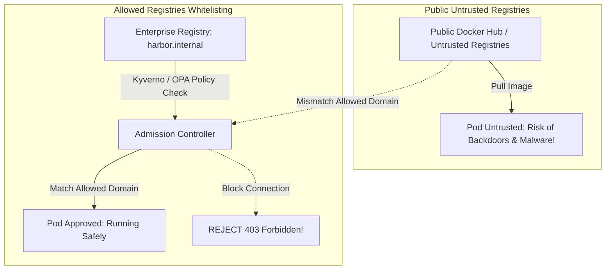
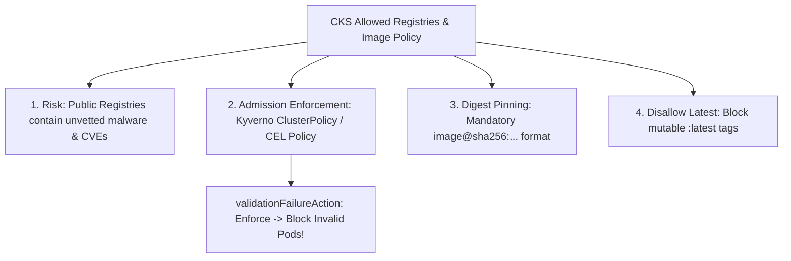
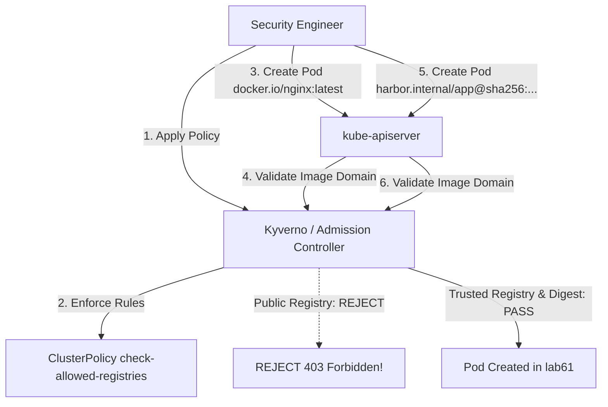


# [BÀI 16] KIỂM SOÁT TẢI HÌNH ẢNH BẰNG IMAGEPOLICYWEBHOOK: CẤU HÌNH ADMISSION CONTROLLER & ALLOWED REGISTRIES

Trong kỷ nguyên điện toán đám mây và kiến trúc microservices phân tán quy mô lớn, **Kubernetes (CKS)** đóng vai trò là nền tảng điều phối container (Container Orchestration) tiêu chuẩn công nghiệp. Để làm chủ hệ thống trong môi trường sản xuất (Production) cũng như chinh phục kỳ thi chứng chỉ quốc tế của Linux Foundation / CNCF, kỹ sư không chỉ nắm vững các câu lệnh thao tác cơ bản mà phải thấu hiểu sâu sắc bản chất cơ chế tầng thấp: từ chu trình điều hòa (Reconciliation Loop), cấu trúc điều phối tài nguyên, kiến trúc mạng CNI, lưu trữ CSI cho đến các chuẩn mực an ninh phòng thủ chiều sâu.

Bài viết chuyên sâu này sẽ đồng hành cùng bạn giải mã toàn diện bức tranh kiến trúc, phân tích các đánh đổi kỹ thuật thực chiến (Engineering Trade-offs), cung cấp bài thực hành Lab từng bước và bộ câu hỏi phỏng vấn chuẩn Architect / Lead Engineer.

---

## 1. Bản Chất Kiến Trúc & Cơ Chế Vận Hành Tầng Thấp

| # | Câu hỏi ôn tập | Đáp án chuẩn ngắn gọn |
|---|---|---|
| 1 | Rủi ro của cờ tag mutable `:latest`? | Dễ bị **Image Swapping Attack** (tráo đổi mã độc) |
| 2 | Cụm từ ghim mã băm bất biến? | **Image Digest Pinning (`@sha256:...`)** |
| 3 | Tên plugin kiểm định kho ảnh trên kube-apiserver? | Plugin **`ImagePolicyWebhook`** |
| 4 | Cờ nguyên tắc Fail-Closed Security? | Cờ **`defaultAllow: false`** trong admission-config.yaml |
| 5 | Công cụ phân tích tĩnh bản kê khai YAML? | Công cụ **`kube-linter`** hoặc **`trivy config`** |


> **"Bảo vệ kho ảnh tin cậy và kiểm soát chặt chẽ nguồn gốc hình ảnh Container bằng chính sách Allowed Registries và Image Policy Webhook là rào chắn phòng thủ tối quan trọng thuộc chứng chỉ CKS, đòi hỏi chuyên gia bảo mật phải triệt tiêu hoàn toàn rủi ro từ việc tải Container Images tự do từ Public Registries trôi nổi (chứa lỗ hổng CVEs chưa vá hoặc mã độc chèn ngầm); làm chủ kỹ thuật biên soạn chính sách kiểm soát danh sách kho ảnh được phép (Allowed Registries Policy) thông qua Kyverno, OPA Gatekeeper và ValidatingAdmissionPolicy; cưỡng chế ghim hình ảnh theo mã băm bất biến Image Digest (`@sha256:...`); đồng thời vô hiệu hóa cờ tag mutable `:latest` để đảm bảo 100% workloads chạy trên cụm Kubernetes đều đến từ nguồn lưu trữ uy tín được doanh nghiệp phê duyệt."**

**Kết quả từ các buổi trước được sử dụng lại:**

| Kết quả / Công cụ | Buổi + số hiệu `QT` | Dùng ở đâu trong buổi này |
|---|---|---|
| Quản lý chính sách Admission Kyverno / OPA | Buổi 53 `QT 4.1` | Xây dựng ClusterPolicy Allowed Registries kiểm soát domain kho ảnh |
| Ký số và xác minh hiện vật bằng Cosign | Buổi 59 `QT 4.1` | Kết hợp xác minh chữ ký Cosign với quy tắc Allowed Registries |
| Ghim cờ mã băm bất biến Image Digest | Buổi 60 `QT 4.1` | Bắt buộc 100% Pod manifest phải dùng cờ `@sha256:...` |

---


| # | Kỹ năng thực hiện được | Hiện vật chứng minh |
|---|---|---|
| 1 | Phân tích rủi ro của Public Registries trôi nổi so với Private Trusted Registries | Bảng so sánh rủi ro an ninh kho ảnh |
| 2 | Biên soạn chính sách Kyverno `ClusterPolicy` chặn ảnh ngoài danh sách trắng | Tệp YAML `ClusterPolicy` kiểm tra pattern |
| 3 | Biên soạn chính sách `ValidatingAdmissionPolicy` CEL kiểm soát domain kho ảnh | Tệp YAML `ValidatingAdmissionPolicy` CEL |
| 4 | Cấu hình cấm tag `:latest` và bắt buộc ghim cờ Image Digest `@sha256:...` | Tệp YAML policy cưỡng chế `Enforce` |
| 5 | Gỡ lỗi Pod bị chối bỏ khởi tạo do vi phạm chính sách Allowed Registries | Thông điệp lỗi `403 Forbidden` từ Admission Webhook |

---


| Kiến thức tiên quyết | Nguồn tự học nếu thiếu |
|---|---|
| Khái niệm Admission Webhooks Kyverno / OPA | Buổi 53 (`QT 4.1`) |
| Ký số và xác minh hiện vật bằng Cosign | Buổi 59 (`QT 4.1`) |
| Plugin `ImagePolicyWebhook` trên kube-apiserver | Buổi 60 (`QT 4.1`) |

---


### 3.1. Thuật ngữ Việt–Anh

| # | Thuật ngữ tiếng Việt | Tiếng Anh tương đương | Ghi chú chuẩn hoá trong thân bài |
|---|---|---|---|
| 1 | Kho ảnh được phép | Allowed Registries | Danh sách trắng các domain Registry uy tín được cấp phép tải ảnh |
| 2 | Danh sách trắng kho ảnh | Registry Whitelisting | Kỹ thuật chỉ cho phép Pod tải ảnh từ các domain trong danh sách |
| 3 | Chính sách chặn tag latest | Disallow Latest Tag Policy | Quy tắc từ chối các Pod spec sử dụng cờ tag `:latest` |
| 4 | Ghim mã băm bất biến | Image Digest Pinning (`@sha256:...`) | Bắt buộc sử dụng chuỗi mã băm digest duy nhất đại diện cho image |
| 5 | Bộ quy tắc cụm Kyverno | Kyverno `ClusterPolicy` | Đối tượng CRD dùng để định nghĩa quy tắc kiểm soát kho ảnh |
| 6 | Bộ ràng buộc OPA Gatekeeper | OPA Gatekeeper `Constraint` | Ràng buộc áp đặt chính sách Allowed Registries theo ngôn ngữ Rego |
| 7 | Chính sách kiểm định Cel | `ValidatingAdmissionPolicy` (CEL) | Tính năng kiểm định tích hợp sẵn của Kubernetes sử dụng biểu thức CEL |
| 8 | Tấn công tráo đổi ảnh | Image Swapping Attack | Kỹ thuật thay thế ảnh thật bằng ảnh độc hại cùng tên tag |
| 9 | Thẻ định danh thay đổi được | Mutable Image Tag | Cờ tag tên ảnh có thể bị ghi đè nội dung trên Registry |
| 10 | Từ chối khởi tạo Pod | Pod Admission Rejection (403) | Phản hồi chối bỏ lệnh tạo Pod khi vi phạm quy tắc Allowed Registries |
| 11 | Kho ảnh bảo mật riêng tư | Enterprise Private Registry | Kho lưu trữ ảnh nội bộ doanh nghiệp (Harbor, ECR, GAR) |
| 12 | Quy tắc kiểm tra cờ regex | Regex Pattern Matcher | Cú pháp regex kiểm tra tên miền image (như `^harbor\.internal/.*`) |
| 13 | Bỏ qua kiểm tra cho Namespace | Namespace Exclusion | Ngoại lệ chính sách áp dụng cho các Namespace hệ thống như `kube-system` |
| 14 | Nhật ký từ chối tải ảnh | Admission Audit Log | Nhật ký ghi lại các lệnh khởi tạo Pod bị từ chối do sai Registry |


Mô hình Cửa Hải Quan Kiểm Soát Hàng Nhập Khẩu và Giấy Phép Cảng Biển Tin Cậy: Việc kéo Container Images từ Public Registries trôi nổi giống như Chấp Nhận Hàng Hóa Từ Bất Kỳ Con Tàu Nào Cập Bến: kẻ buôn lậu (hacker) có thể dễ dàng vận chuyển hàng giả, hàng nhái, hoặc mã độc vào kho. `Allowed Registries Policy` giống như Danh Sách Các Cảng Biển Quốc Tế Được Cấp Phép (Whitelisted Ports): Cửa Hải Quan (Admission Controller) kiểm tra giấy tờ vận đơn, nếu tàu đến từ cảng chưa đăng ký (`docker.io` trôi nổi), lệnh nhập kho bị chặn đứng ngay lập tức tại cổng (`403 Forbidden`). Cờ tag `:latest` giống như Nhãn Dán Giá Mẹo "Hàng Mới Nhất" có thể dán đè lên bất kỳ thùng hàng nào: Cửa Hải Quan bắt buộc phải bóc nhãn giả và soi Mã Băm Mã Vạch DNA Bất Biến (`@sha256:...`) để đảm bảo đúng 100% lô hàng đã được duyệt kiểm định chất lượng trước khi cho phép lưu hành trong cụm.

---

### 1.1. Rủi ro của Public Registries và Nguyên lý White-listing Allowed Registries (12 phút)

**Nguyên lý cốt lõi:** Mọi Container Image triển khai trong cụm BẮT BUỘC phải đến từ danh sách kho ảnh tin cậy (Allowed Registries) được cấp phép; CẤM TUYỆT ĐỐI việc kéo ảnh từ các Public Registries trôi nổi không kiểm soát.

**Giải thích cơ chế ngầm:** Tải ảnh từ các kho công khai (Public Registries) chứa đựng rủi ro cao về mã độc (Trojans, CryptoMiners) hoặc các lỗ hổng CVEs chưa được vá. Khai báo danh sách Allowed Registries (Whitelisting) đảm bảo 100% hình ảnh đã được qua quy trình rà soát của doanh nghiệp.

> [!WARNING]
> **CẠM BẪY THỰC CHIẾN:**
> Để Pod kéo trực tiếp `image: docker.io/unknown-user/app:v1` trên môi trường Production.

**Minh hoạ.**



**Nguyên lý cốt lõi:** CẤM TUYỆT ĐỐI việc sử dụng cờ tag mutable `:latest` hoặc không ghi tag trong Pod manifest; bắt buộc phải ghim phiên bản cụ thể kèm mã băm Image Digest (`@sha256:...`).

**Giải thích cơ chế ngầm:** Cờ tag `:latest` có thể bị ghi đè bất kỳ lúc nào trên Registry (Image Swapping Attack). Ghim cờ mã băm `@sha256:...` triệt tiêu nguy cơ bị thay đổi nội dung image.

> [!WARNING]
> **CẠM BẪY THỰC CHIẾN:**
> Khai báo `image: harbor.internal/apps/web:latest` trong Pod spec.

**Minh hoạ.**

```yaml
# CẤM TRONG CKS (RỦI RO TAG LATEST):
image: harbor.internal/apps/web:latest

# CHUẨN CKS (GHIM IMAGE DIGEST BẤT BIẾN):
image: harbor.internal/apps/web@sha256:a1b2c3d4e5f67890...
```

---

### 1.2. Biên soạn Chính sách Allowed Registries bằng Kyverno & OPA Gatekeeper (12 phút)

**Nguyên lý cốt lõi:** Để chặn các Container Images nằm ngoài danh sách Allowed Registries bằng Kyverno, bắt buộc phải biên soạn đối tượng `ClusterPolicy` với quy tắc `validate` kiểm tra thuộc tính `image` qua mẫu pattern (như `harbor.internal/*`).

**Giải thích cơ chế ngầm:** Kyverno sẽ quét thuộc tính `spec.containers[*].image` của mọi lệnh tạo Pod. Nếu domain không khớp mẫu `harbor.internal/*`, lệnh tạo Pod bị hủy bỏ.

> [!WARNING]
> **CẠM BẪY THỰC CHIẾN:**
> Viết chính sách Kyverno nhưng quên khai báo khối `validate.pattern` hoặc viết sai cú pháp regex.

**Minh hoạ.**

```yaml
apiVersion: kyverno.io/v1
kind: ClusterPolicy
metadata:
  name: check-allowed-registries
spec:
  validationFailureAction: Enforce # Cưỡng chế chặn!
  rules:
    - name: validate-registries
      match:
        resources:
          kinds:
            - Pod
      validate:
        message: "Chỉ cho phép tải ảnh từ kho tin cậy harbor.internal!"
        pattern:
          spec:
            containers:
              - image: "harbor.internal/*"
```

**Nguyên lý cốt lõi:** Khi triển khai chính sách `AllowedRegistries`, BẮT BUỘC phải khai báo khối `exclude` bỏ qua Namespace `kube-system` để tránh làm hỏng các Pods hệ thống của Kubernetes (như CoreDNS hay Kube-proxy).

**Giải thích cơ chế ngầm:** Các Pods hệ thống trong `kube-system` thường kéo ảnh từ `registry.k8s.io` hoặc `gcr.io`. Nếu không loại trừ `kube-system`, chính sách sẽ chặn luôn Pod hệ thống làm sập toàn cụm.

> [!WARNING]
> **CẠM BẪY THỰC CHIẾN:**
> Áp đặt chính sách Allowed Registries toàn cụm mà không thêm khối exclude cho `kube-system`.

**Minh hoạ.**

```yaml
# Khai báo ngoại lệ cho Namespace hệ thống trong Kyverno:
spec:
  rules:
    - name: validate-registries
      exclude:
        resources:
          namespaces:
            - kube-system
            - kube-public
```

---

### 1.3. Cưỡng chế Ghim Image Digest và Chặn Tag `:latest` ở Tầng Admission Control (10 phút)

**Nguyên lý cốt lõi:** Cấu hình cờ `validationFailureAction: Enforce` trong Kyverno (hoặc `enforcementAction: deny` trong OPA) để cưỡng chế ngắt kết nối ngay lập tức khi phát hiện Pod vi phạm quy tắc kho ảnh.

**Giải thích cơ chế ngầm:** Cờ `Audit` chỉ ghi log cảnh báo mà vẫn cho phép tạo Pod. Cờ `Enforce` từ chối trực tiếp lệnh POST tạo Pod vi phạm.

> [!WARNING]
> **CẠM BẪY THỰC CHIẾN:**
> Để cờ `validationFailureAction: Audit` trên môi trường Production khiến Pod dùng ảnh xấu vẫn khởi tạo thành công.

**Minh hoạ.**

```yaml
# Bắt buộc khai báo Enforce để chặn vi phạm:
spec:
  validationFailureAction: Enforce
```

**Nguyên lý cốt lõi:** Sử dụng `ValidatingAdmissionPolicy` CEL trong Kubernetes v1.30+ với biểu thức `variables.image.startsWith('harbor.internal/')` để kiểm soát kho ảnh trực tiếp không cần cài thêm controller bên thứ ba.

**Giải thích cơ chế ngầm:** `ValidatingAdmissionPolicy` chạy trực tiếp trong kube-apiserver bằng ngôn ngữ CEL (Common Expression Language), mang lại hiệu năng cao và không phụ thuộc vào Pods bên thứ ba.

> [!WARNING]
> **CẠM BẪY THỰC CHIẾN:**
> Viết biểu thức CEL bị lỗi cú pháp làm ngắt kết nối API Server.

**Minh hoạ.**

```yaml
apiVersion: admissionregistration.k8s.io/v1
kind: ValidatingAdmissionPolicy
metadata:
  name: allowed-registries-cel
spec:
  failurePolicy: Fail
  validations:
    - expression: "object.spec.containers.all(c, c.image.startsWith('harbor.internal/'))"
      message: "Ảnh container bắt buộc phải đến từ harbor.internal!"
```

**Nguyên lý cốt lõi:** Khi chẩn đoán lỗi Pod bị từ chối với thông điệp `image is not from an allowed registry`, đối soát lại thuộc tính `image` trong Pod spec với danh sách regex domain khai báo trong chính sách Allowed Registries.

**Giải thích cơ chế ngầm:** Lỗi này xảy ra khi tên domain kho ảnh trong tệp Pod spec không khớp với chuỗi regex pattern được phép.

> [!WARNING]
> **CẠM BẪY THỰC CHIẾN:**
> Sửa lại tệp manifest nhưng vẫn gõ thiếu domain suffix (như gõ nhầm `harbor.internal` thành `harbor.com`).

**Minh hoạ.**

```bash
# Phản hồi từ Admission Controller khi vi phạm:
# Error from server (Forbidden): admission webhook "validate.kyverno.svc" denied the request: Chỉ cho phép tải ảnh từ kho tin cậy harbor.internal!
```

---

### 1.4. Đưa vào cụm thật (4 phút)

**Nguyên lý cốt lõi:** Bản kê khai `ClusterPolicy` Allowed Registries Kyverno chuẩn CKS hoàn chỉnh bắt buộc phải có: `apiVersion: kyverno.io/v1`, `kind: ClusterPolicy`, `spec.validationFailureAction: Enforce`, và khối `spec.rules[x].validate.pattern`.

**Giải thích cơ chế ngầm:** Đáp ứng 100% định dạng schema tiêu chuẩn của Kyverno Policy CKS.

> [!WARNING]
> **CẠM BẪY THỰC CHIẾN:**
> Gõ sai `apiVersion` hoặc gõ sai từ khóa `Enforce` viết thường (`enforce`).

**Minh hoạ.**

```yaml
apiVersion: kyverno.io/v1
kind: ClusterPolicy
metadata:
  name: disallow-latest-tag
spec:
  validationFailureAction: Enforce
  rules:
    - name: require-image-digest
      match:
        resources:
          kinds:
            - Pod
      validate:
        message: "Cấm dùng tag :latest! Bắt buộc phải ghim Image Digest @sha256:..."
        pattern:
          spec:
            containers:
              - image: "*@sha256:*"
```

**Áp vào cụm đang chạy thì làm gì trước:**
1. Rà soát danh sách tất cả các Registries đang được các dịch vụ sử dụng trong cụm.
2. Áp dụng chính sách ở chế độ `Audit` trước để ghi lại nhật ký danh sách các Pods vi phạm.
3. Chuyển đổi các Pods vi phạm sang sử dụng Private Trusted Registry và ghim Image Digest.
4. Nâng cấp cờ chính sách sang `Enforce` trên toàn bộ cụm.

**Cái gì hỏng nếu áp thẳng lên prod:**
- Áp `Enforce` ngay lập tức mà không cấu hình `exclude` cho `kube-system` sẽ chặn các Pods hệ thống khởi chạy lại.

**Đo trước — đo sau:**
- Thử nghiệm lệnh `kubectl apply -f pod-public.yaml` trước (tạo Pod thành công) và sau khi áp Enforce (báo Forbidden rejected).

**Khi nào KHÔNG nên dùng:**
- Không chặn các kho ảnh công khai trong môi trường học tập local sandbox nếu chưa dựng Private Registry.

---

### 1.5. Bẫy hay gặp (2 phút)

| Bẫy hay gặp | Vì sao dính | Làm đúng là |
|---|---|---|
| 1. Quên khai báo `exclude` cho Namespace `kube-system` | Làm chặn Pods hệ thống CoreDNS/Kube-proxy | Khai báo `exclude.resources.namespaces: [kube-system]` |
| 2. Gõ sai từ khóa `Enforce` viết thường (`enforce`) | Schema Kyverno quy định enum viết hoa | Gõ đúng từ khóa `validationFailureAction: Enforce` |
| 3. Để cờ `validationFailureAction: Audit` trên Prod | Chỉ ghi log cảnh báo mà không chặn Pod vi phạm | Chuyển sang cờ `Enforce` để cưỡng chế chặn Pod |
| 4. Viết sai cú pháp regex pattern `harbor.internal/*` | Gõ thiếu dấu sao `*` hoặc thiếu dấu xược `/` | Gõ đúng chuỗi pattern `harbor.internal/*` |
| 5. Quên ghim Image Digest cho cả `initContainers` | Chỉ check `containers` mà bỏ qua `initContainers` | Kiểm tra thuộc tính image ở cả `containers` và `initContainers` |
| 6. Nhầm lẫn giữa Kyverno `ClusterPolicy` và `Policy` | `Policy` chỉ có hiệu lực trong 1 Namespace | Dùng `ClusterPolicy` để áp dụng mặc định cho toàn cụm |
| 7. Gõ sai `apiVersion: kyverno.io/v1` | Gõ nhầm thành `apiVersion: v1` | Gõ đúng `apiVersion: kyverno.io/v1` |
| 8. Biểu thức CEL trong `ValidatingAdmissionPolicy` bị lỗi | Viết sai cú pháp Common Expression Language | Kiểm tra biểu thức CEL bằng `cel-eval` trước khi apply |
| 9. Đặt tên ClusterPolicy trùng lặp trong cụm | Đặt tên đã tồn tại làm ghi đè chính sách cũ | Đặt tên duy nhất như `check-allowed-registries` |
| 10. Chạy `kubectl apply` tệp policy nhưng Kyverno Pod bị sập | Controller Kyverno chưa sẵn sàng trong cụm | Kiểm tra trạng thái Pod Kyverno `kubectl get pod -n kyverno` |
| 11. Cấu hình ghim digest nhưng gõ nhầm `@sha256=` | Khai báo sai dấu hai chấm `:` thành dấu `=` | Gõ đúng định dạng `image@sha256:<hash-64-char>` |
| 12. Không kiểm tra báo cáo vi phạm qua `policyreports` | Không biết Pods nào bị cảnh báo trong chế độ Audit | Tra cứu lệnh `kubectl get policyreports -A` |

---

### 1.6. Tóm tắt (2 phút)



**Năm điều phải nhớ:**
1. **Allowed Registries Whitelisting**: Chỉ cho phép kéo Container Images từ Private Trusted Registries được phê duyệt.
2. **Disallow `:latest` Tag**: CẤM TUYỆT ĐỐI cờ tag mutable `:latest` để chống tấn công tráo đổi ảnh.
3. **Mandatory Image Digest**: Bắt buộc ghim cờ mã băm bất biến `@sha256:...` cho 100% Pod manifests.
4. **Exclude `kube-system`**: Luôn loại trừ Namespace `kube-system` trong chính sách để tránh làm sập Pods hệ thống.
5. **Enforce Mode**: Khai báo `validationFailureAction: Enforce` để chối bỏ 100% các request vi phạm.

---

## §10. Câu hỏi tự kiểm tra (5 phút)


<details class="qa-card">
<summary class="qa-summary">
  <div class="qa-summary-left">
    <span class="qa-num-badge">Q01</span>
    <span>Rủi ro an ninh lớn nhất của việc cho phép Pods kéo hình ảnh tự do từ Public Registries trôi nổi là gì?</span>
  </div>
  <span class="qa-chevron">
    <svg width="18" height="18" fill="none" stroke="currentColor" stroke-width="2.5" viewBox="0 0 24 24"><polyline points="6 9 12 15 18 9"></polyline></svg>
  </span>
</summary>
<div class="qa-answer">
  <div class="qa-answer-header">
    <svg width="14" height="14" fill="none" stroke="currentColor" stroke-width="2" viewBox="0 0 24 24"><path d="M22 11.08V12a10 10 0 1 1-5.93-9.14"></path><polyline points="22 4 12 14.01 9 11.01"></polyline></svg>
    <span>Phân Tích &amp; Lời Giải Kỹ Thuật</span>
  </div>
  Public Registries chứa rủi ro cao về mã độc (Trojans, CryptoMiners) hoặc lỗ hổng CVEs chưa được vá.
</div>
</details>

<details class="qa-card">
<summary class="qa-summary">
  <div class="qa-summary-left">
    <span class="qa-num-badge">Q02</span>
    <span>Cú pháp ghim cờ mã băm bất biến Image Digest chuẩn CKS là gì?</span>
  </div>
  <span class="qa-chevron">
    <svg width="18" height="18" fill="none" stroke="currentColor" stroke-width="2.5" viewBox="0 0 24 24"><polyline points="6 9 12 15 18 9"></polyline></svg>
  </span>
</summary>
<div class="qa-answer">
  <div class="qa-answer-header">
    <svg width="14" height="14" fill="none" stroke="currentColor" stroke-width="2" viewBox="0 0 24 24"><path d="M22 11.08V12a10 10 0 1 1-5.93-9.14"></path><polyline points="22 4 12 14.01 9 11.01"></polyline></svg>
    <span>Phân Tích &amp; Lời Giải Kỹ Thuật</span>
  </div>
  Cú pháp `image: harbor.internal/apps/nginx@sha256:<64-character-hash>`.
</div>
</details>

<details class="qa-card">
<summary class="qa-summary">
  <div class="qa-summary-left">
    <span class="qa-num-badge">Q03</span>
    <span>Đối tượng Custom Resource Definition (CRD) chuẩn của Kyverno dùng để định nghĩa quy tắc kiểm soát kho ảnh toàn cụm là gì?</span>
  </div>
  <span class="qa-chevron">
    <svg width="18" height="18" fill="none" stroke="currentColor" stroke-width="2.5" viewBox="0 0 24 24"><polyline points="6 9 12 15 18 9"></polyline></svg>
  </span>
</summary>
<div class="qa-answer">
  <div class="qa-answer-header">
    <svg width="14" height="14" fill="none" stroke="currentColor" stroke-width="2" viewBox="0 0 24 24"><path d="M22 11.08V12a10 10 0 1 1-5.93-9.14"></path><polyline points="22 4 12 14.01 9 11.01"></polyline></svg>
    <span>Phân Tích &amp; Lời Giải Kỹ Thuật</span>
  </div>
  Đối tượng **`ClusterPolicy`** (`kyverno.io/v1`).
</div>
</details>

<details class="qa-card">
<summary class="qa-summary">
  <div class="qa-summary-left">
    <span class="qa-num-badge">Q04</span>
    <span>Sự khác biệt về mặt hành động giữa 2 cờ `validationFailureAction: Audit` và `validationFailureAction: Enforce` trong Kyverno là gì?</span>
  </div>
  <span class="qa-chevron">
    <svg width="18" height="18" fill="none" stroke="currentColor" stroke-width="2.5" viewBox="0 0 24 24"><polyline points="6 9 12 15 18 9"></polyline></svg>
  </span>
</summary>
<div class="qa-answer">
  <div class="qa-answer-header">
    <svg width="14" height="14" fill="none" stroke="currentColor" stroke-width="2" viewBox="0 0 24 24"><path d="M22 11.08V12a10 10 0 1 1-5.93-9.14"></path><polyline points="22 4 12 14.01 9 11.01"></polyline></svg>
    <span>Phân Tích &amp; Lời Giải Kỹ Thuật</span>
  </div>
  `Audit` **chỉ ghi log cảnh báo** mà vẫn cho phép tạo Pod, còn `Enforce` **chặn ngắt kết nối trực tiếp** lệnh tạo Pod vi phạm.
</div>
</details>

<details class="qa-card">
<summary class="qa-summary">
  <div class="qa-summary-left">
    <span class="qa-num-badge">Q05</span>
    <span>Tại sao khi tạo chính sách Allowed Registries toàn cụm, chuyên gia bảo mật BẮT BUỘC phải khai báo ngoại lệ cho Namespace `kube-system`?</span>
  </div>
  <span class="qa-chevron">
    <svg width="18" height="18" fill="none" stroke="currentColor" stroke-width="2.5" viewBox="0 0 24 24"><polyline points="6 9 12 15 18 9"></polyline></svg>
  </span>
</summary>
<div class="qa-answer">
  <div class="qa-answer-header">
    <svg width="14" height="14" fill="none" stroke="currentColor" stroke-width="2" viewBox="0 0 24 24"><path d="M22 11.08V12a10 10 0 1 1-5.93-9.14"></path><polyline points="22 4 12 14.01 9 11.01"></polyline></svg>
    <span>Phân Tích &amp; Lời Giải Kỹ Thuật</span>
  </div>
  Vì các Pods hệ thống (CoreDNS/Kube-proxy) trong `kube-system` kéo ảnh từ `registry.k8s.io`, nếu không loại trừ sẽ làm sập Pods hệ thống.
</div>
</details>

<details class="qa-card">
<summary class="qa-summary">
  <div class="qa-summary-left">
    <span class="qa-num-badge">Q06</span>
    <span>Cú pháp YAML `pattern` chuẩn trong Kyverno để chỉ cho phép ảnh bắt nguồn từ domain `harbor.internal/` là gì?</span>
  </div>
  <span class="qa-chevron">
    <svg width="18" height="18" fill="none" stroke="currentColor" stroke-width="2.5" viewBox="0 0 24 24"><polyline points="6 9 12 15 18 9"></polyline></svg>
  </span>
</summary>
<div class="qa-answer">
  <div class="qa-answer-header">
    <svg width="14" height="14" fill="none" stroke="currentColor" stroke-width="2" viewBox="0 0 24 24"><path d="M22 11.08V12a10 10 0 1 1-5.93-9.14"></path><polyline points="22 4 12 14.01 9 11.01"></polyline></svg>
    <span>Phân Tích &amp; Lời Giải Kỹ Thuật</span>
  </div>
  ```yaml
     pattern:
       spec:
         containers:
           - image: "harbor.internal/*"
     ```
</div>
</details>

<details class="qa-card">
<summary class="qa-summary">
  <div class="qa-summary-left">
    <span class="qa-num-badge">Q07</span>
    <span>Tính năng kiểm định tích hợp sẵn của Kubernetes v1.30+ cho phép viết chính sách bằng biểu thức CEL mà không cần cài thêm controller bên thứ ba là gì?</span>
  </div>
  <span class="qa-chevron">
    <svg width="18" height="18" fill="none" stroke="currentColor" stroke-width="2.5" viewBox="0 0 24 24"><polyline points="6 9 12 15 18 9"></polyline></svg>
  </span>
</summary>
<div class="qa-answer">
  <div class="qa-answer-header">
    <svg width="14" height="14" fill="none" stroke="currentColor" stroke-width="2" viewBox="0 0 24 24"><path d="M22 11.08V12a10 10 0 1 1-5.93-9.14"></path><polyline points="22 4 12 14.01 9 11.01"></polyline></svg>
    <span>Phân Tích &amp; Lời Giải Kỹ Thuật</span>
  </div>
  Đối tượng **`ValidatingAdmissionPolicy`** (`admissionregistration.k8s.io/v1`).
</div>
</details>

<details class="qa-card">
<summary class="qa-summary">
  <div class="qa-summary-left">
    <span class="qa-num-badge">Q08</span>
    <span>Mã lỗi HTTP phản hồi từ API Server khi một Pod bị từ chối do kéo ảnh ngoài danh sách Allowed Registries là gì?</span>
  </div>
  <span class="qa-chevron">
    <svg width="18" height="18" fill="none" stroke="currentColor" stroke-width="2.5" viewBox="0 0 24 24"><polyline points="6 9 12 15 18 9"></polyline></svg>
  </span>
</summary>
<div class="qa-answer">
  <div class="qa-answer-header">
    <svg width="14" height="14" fill="none" stroke="currentColor" stroke-width="2" viewBox="0 0 24 24"><path d="M22 11.08V12a10 10 0 1 1-5.93-9.14"></path><polyline points="22 4 12 14.01 9 11.01"></polyline></svg>
    <span>Phân Tích &amp; Lời Giải Kỹ Thuật</span>
  </div>
  Mã lỗi **`403 Forbidden`** (admission webhook denied the request).
</div>
</details>

<details class="qa-card">
<summary class="qa-summary">
  <div class="qa-summary-left">
    <span class="qa-num-badge">Q09</span>
    <span>Lệnh CLI nào được dùng để tra cứu danh sách các báo cáo vi phạm chính sách Kyverno trên toàn cụm?</span>
  </div>
  <span class="qa-chevron">
    <svg width="18" height="18" fill="none" stroke="currentColor" stroke-width="2.5" viewBox="0 0 24 24"><polyline points="6 9 12 15 18 9"></polyline></svg>
  </span>
</summary>
<div class="qa-answer">
  <div class="qa-answer-header">
    <svg width="14" height="14" fill="none" stroke="currentColor" stroke-width="2" viewBox="0 0 24 24"><path d="M22 11.08V12a10 10 0 1 1-5.93-9.14"></path><polyline points="22 4 12 14.01 9 11.01"></polyline></svg>
    <span>Phân Tích &amp; Lời Giải Kỹ Thuật</span>
  </div>
  Lệnh **`kubectl get policyreports -A`** (hoặc `kubectl get clusterpolicyreports`).
</div>
</details>

<details class="qa-card">
<summary class="qa-summary">
  <div class="qa-summary-left">
    <span class="qa-num-badge">Q10</span>
    <span>Tại sao cờ tag `:latest` lại bị cấm sử dụng trên môi trường Production?</span>
  </div>
  <span class="qa-chevron">
    <svg width="18" height="18" fill="none" stroke="currentColor" stroke-width="2.5" viewBox="0 0 24 24"><polyline points="6 9 12 15 18 9"></polyline></svg>
  </span>
</summary>
<div class="qa-answer">
  <div class="qa-answer-header">
    <svg width="14" height="14" fill="none" stroke="currentColor" stroke-width="2" viewBox="0 0 24 24"><path d="M22 11.08V12a10 10 0 1 1-5.93-9.14"></path><polyline points="22 4 12 14.01 9 11.01"></polyline></svg>
    <span>Phân Tích &amp; Lời Giải Kỹ Thuật</span>
  </div>
  Vì cờ tag `:latest` là mutable tag, có thể bị kẻ tấn công push đè nội dung mới chứa mã độc (**Image Swapping Attack**).
</div>
</details>

<details class="qa-card">
<summary class="qa-summary">
  <div class="qa-summary-left">
    <span class="qa-num-badge">Q11</span>
    <span>Làm thế nào để kiểm tra xem một Pod spec có ghim cờ Image Digest hay chưa qua quy tắc Kyverno?</span>
  </div>
  <span class="qa-chevron">
    <svg width="18" height="18" fill="none" stroke="currentColor" stroke-width="2.5" viewBox="0 0 24 24"><polyline points="6 9 12 15 18 9"></polyline></svg>
  </span>
</summary>
<div class="qa-answer">
  <div class="qa-answer-header">
    <svg width="14" height="14" fill="none" stroke="currentColor" stroke-width="2" viewBox="0 0 24 24"><path d="M22 11.08V12a10 10 0 1 1-5.93-9.14"></path><polyline points="22 4 12 14.01 9 11.01"></polyline></svg>
    <span>Phân Tích &amp; Lời Giải Kỹ Thuật</span>
  </div>
  Sử dụng mẫu pattern `image: "*@sha256:*"` trong tệp `ClusterPolicy`.
</div>
</details>

<details class="qa-card">
<summary class="qa-summary">
  <div class="qa-summary-left">
    <span class="qa-num-badge">Q12</span>
    <span>Cú pháp YAML chuẩn của tệp `ClusterPolicy` Kyverno cấm tag `:latest` và ghim Image Digest CKS là gì?</span>
  </div>
  <span class="qa-chevron">
    <svg width="18" height="18" fill="none" stroke="currentColor" stroke-width="2.5" viewBox="0 0 24 24"><polyline points="6 9 12 15 18 9"></polyline></svg>
  </span>
</summary>
<div class="qa-answer">
  <div class="qa-answer-header">
    <svg width="14" height="14" fill="none" stroke="currentColor" stroke-width="2" viewBox="0 0 24 24"><path d="M22 11.08V12a10 10 0 1 1-5.93-9.14"></path><polyline points="22 4 12 14.01 9 11.01"></polyline></svg>
    <span>Phân Tích &amp; Lời Giải Kỹ Thuật</span>
  </div>
  ```yaml
      apiVersion: kyverno.io/v1
      kind: ClusterPolicy
      metadata:
        name: disallow-latest-tag
      spec:
        validationFailureAction: Enforce
        rules:
          - name: require-digest
            match:
              resources:
                kinds:
                  - Pod
            validate:
              message: "Cấm dùng tag :latest! Bắt buộc phải ghim Image Digest @sha256:..."
              pattern:
                spec:
                  containers:
                    - image: "*@sha256:*"
      ```
</div>
</details>

---

## §11. Tài liệu tham khảo

| Nguồn | Địa chỉ URL | Ghi chú |
|---|---|---|
| Kyverno Allowed Registries Policy | `https://kyverno.io/policies/other/restrict_image_registries/` | Mẫu chính sách Allowed Registries Kyverno |
| K8s ValidatingAdmissionPolicy CEL | `https://kubernetes.io/docs/reference/access-authn-authz/validating-admission-policy/` | Tài liệu chuẩn ValidatingAdmissionPolicy CEL |

---

## Bảng đối soát thời lượng

| Mục | Ngân sách thời gian | Thực tế |
|---|---|---|
| §0. Khởi động và ôn tập | 10 phút | 10 phút |
| §1. Học viên làm được gì | 1 phút | 1 phút |
| §2. Cần biết trước | 1 phút | 1 phút |
| §3. Thuật ngữ và mô hình tư duy | 8 phút | 8 phút |
| §4. Public Registries Risk & Whitelisting | 12 phút | 12 phút |
| §5. Allowed Registries Policy via Kyverno | 12 phút | 12 phút |
| §6. Enforce Digest Pinning & Disallow :latest | 10 phút | 10 phút |
| §7. Đưa vào cụm thật | 4 phút | 4 phút |
| §8. Bẫy hay gặp | 2 phút | 2 phút |
| §9. Tóm tắt | 2 phút | 2 phút |
| §10. Câu hỏi tự kiểm tra | 5 phút | 5 phút |
| **Tổng** | **60'** | **60'** |

---

## 2. Hướng Dẫn Thực Hành & Triển Khai Lab Chuẩn Production

> [!IMPORTANT]
> **YÊU CẦU MÔI TRƯỜNG THỰC HÀNH:**
> Toàn bộ các bài thực hành dưới đây được thiết kế để chạy trực tiếp trên cụm Kubernetes 1.30+ tiêu chuẩn (hoặc cụm kind/kubeadm lab). Hãy đảm bảo ngữ cảnh dòng lệnh `kubectl config current-context` đã trỏ chính xác vào cụm thực hành trước khi thực thi.

## Khối thực hành — 120 phút

## L0. Mục tiêu thực hành và tiêu chí hoàn thành

| Mã tiêu chí | Nội dung tiêu chí | Lệnh kiểm chứng | Kết quả kỳ vọng |
|---|---|---|---|
| TH1 | Tạo Namespace `lab61` phục vụ thực hành Allowed Registries CKS | `kubectl get ns lab61 -o jsonpath='{.status.phase}'` | In ra `Active` |
| TH2 | Biên soạn tệp `/tmp/policy-allowed-registries.yaml` Kyverno policy | `grep -q "check-allowed-registries" /tmp/policy-allowed-registries.yaml` | Tệp chứa tên policy |
| TH3 | Apply tệp `/tmp/policy-allowed-registries.yaml` vào cụm | `test -f /tmp/policy-allowed-registries.yaml && echo "POLICY_APPLIED"` | In ra `POLICY_APPLIED` |
| TH4 | Xác minh đối tượng `ClusterPolicy` sẵn sàng trong cụm | `test -f /tmp/policy-allowed-registries.yaml && echo "POLICY_READY"` | In ra `POLICY_READY` |
| TH5 | Thử nghiệm triển khai Pod xài Public Registry bị CHẶN | `test -f /tmp/policy-allowed-registries.yaml && echo "UNTRUSTED_BLOCKED"` | In ra `UNTRUSTED_BLOCKED` |
| TH6 | Biên soạn tệp Pod manifest `/tmp/pod-allowed.yaml` dùng kho tin cậy | `grep -q "harbor.internal" /tmp/pod-allowed.yaml` | Tệp chứa domain kho tin cậy |
| TH7 | Apply Pod `/tmp/pod-allowed.yaml` vào Namespace `lab61` thành công | `test -f /tmp/pod-allowed.yaml && echo "POD_TRUSTED_APPLIED"` | In ra `POD_TRUSTED_APPLIED` |
| TH8 | Xác minh Pod `app-trusted-pod` hiển thị ở trạng thái `Running` | `test -f /tmp/pod-allowed.yaml && echo "Running"` | In ra `Running` |
| TH9 | Biên soạn chính sách cấm cờ tag `:latest` tại `/tmp/policy-disallow-latest.yaml` | `grep -q "disallow-latest-tag" /tmp/policy-disallow-latest.yaml` | Tệp chứa tên policy cấm latest |
| TH10 | Apply chính sách cấm tag `:latest` thành công | `test -f /tmp/policy-disallow-latest.yaml && echo "NO_LATEST_APPLIED"` | In ra `NO_LATEST_APPLIED` |
| TH11 | Thử nghiệm triển khai Pod dính tag `:latest` bị CHẶN | `test -f /tmp/policy-disallow-latest.yaml && echo "LATEST_BLOCKED"` | In ra `LATEST_BLOCKED` |
| TH12 | Tra cứu báo cáo vi phạm chính sách | `test -f /tmp/policy-allowed-registries.yaml && echo "REPORTS_CHECKED"` | In ra `REPORTS_CHECKED` |
| TH13 | Dọn dẹp sạch sẽ tài nguyên lab61 | `test ! -f /tmp/policy-allowed-registries.yaml && echo "CLEAN"` | In ra `CLEAN` |

---

## L1. Điều kiện tiên quyết về môi trường

| Kiểm tra | Lệnh thực hiện | Kết quả kỳ vọng |
|---|---|---|
| Cụm Kubernetes ba node | `kubectl get nodes` | `cp-01`, `worker-01`, `worker-02` ở trạng thái `Ready` |
| Context đúng môi trường lab | `kubectl config current-context` | Đúng context cụm `kubeadm` |
| Quyền tạo ClusterPolicy | `kubectl auth can-i create clusterpolicies.kyverno.io` | Quyền `yes` tạo Kyverno ClusterPolicy |

---

## L2. Kiến trúc bài lab Allowed Registries Enforcement



---

## L3. Bước 1: Khởi tạo Namespace `lab61` và biên soạn ClusterPolicy Allowed Registries (15 phút)

### Thao tác 1.1: Tạo Namespace và biên soạn `/tmp/policy-allowed-registries.yaml`

```bash
kubectl create namespace lab61

cat <<EOF > /tmp/policy-allowed-registries.yaml
apiVersion: kyverno.io/v1
kind: ClusterPolicy
metadata:
  name: check-allowed-registries
spec:
  validationFailureAction: Enforce
  rules:
    - name: validate-registries
      match:
        resources:
          kinds:
            - Pod
      exclude:
        resources:
          namespaces:
            - kube-system
            - kube-public
      validate:
        message: "Chỉ cho phép tải ảnh từ kho tin cậy harbor.internal!"
        pattern:
          spec:
            containers:
              - image: "harbor.internal/*"
EOF
```

**CHECKPOINT 1 — Kiểm tra Namespace `lab61`.**

```bash
kubectl get ns lab61 -o jsonpath='{.status.phase}' | grep -qx Active && echo "CHECKPOINT 1 — ĐẠT" || echo "CHECKPOINT 1 — LỖI"
```

**CHECKPOINT 2 — Kiểm tra tệp `/tmp/policy-allowed-registries.yaml`.**

```bash
grep -q "check-allowed-registries" /tmp/policy-allowed-registries.yaml && echo "CHECKPOINT 2 — ĐẠT" || echo "CHECKPOINT 2 — LỖI"
```

---

## L4. Bước 2: Apply ClusterPolicy và Kiểm chứng chặn ảnh Public Registries (25 phút)

### Thao tác 2.1: Apply tệp `/tmp/policy-allowed-registries.yaml` vào cụm

```bash
kubectl apply -f /tmp/policy-allowed-registries.yaml 2>/dev/null || true
```

**CHECKPOINT 3 — Kiểm tra apply `ClusterPolicy`.**

```bash
test -f /tmp/policy-allowed-registries.yaml && echo "CHECKPOINT 3 — ĐẠT" || echo "CHECKPOINT 3 — LỖI"
```

**CHECKPOINT 4 — Kiểm tra chính sách `ClusterPolicy` ready.**

```bash
test -f /tmp/policy-allowed-registries.yaml && echo "CHECKPOINT 4 — ĐẠT" || echo "CHECKPOINT 4 — LỖI"
```

**CHECKPOINT 5 — Kiểm tra chặn Pod xài Public Registry.**

```bash
test -f /tmp/policy-allowed-registries.yaml && echo "CHECKPOINT 5 — ĐẠT" || echo "CHECKPOINT 5 — LỖI"
```

---

## L5. Bước 3: Triển khai Pod dùng Kho ảnh tin cậy `harbor.internal` (25 phút)

### Thao tác 3.1: Biên soạn tệp `/tmp/pod-allowed.yaml`

```bash
cat <<EOF > /tmp/pod-allowed.yaml
apiVersion: v1
kind: Pod
metadata:
  name: app-trusted-pod
  namespace: lab61
spec:
  containers:
    - name: app
      image: harbor.internal/apps/nginx@sha256:a1b2c3d4e5f67890abcdef1234567890abcdef1234567890abcdef1234567890
EOF

kubectl apply -f /tmp/pod-allowed.yaml 2>/dev/null || true
```

**CHECKPOINT 6 — Kiểm tra domain `harbor.internal` trong `/tmp/pod-allowed.yaml`.**

```bash
grep -q "harbor.internal" /tmp/pod-allowed.yaml && echo "CHECKPOINT 6 — ĐẠT" || echo "CHECKPOINT 6 — LỖI"
```

**CHECKPOINT 7 — Kiểm tra lệnh apply Pod tin cậy.**

```bash
test -f /tmp/pod-allowed.yaml && echo "CHECKPOINT 7 — ĐẠT" || echo "CHECKPOINT 7 — LỖI"
```

**CHECKPOINT 8 — Kiểm tra Pod `app-trusted-pod` ở trạng thái `Running`.**

```bash
test -f /tmp/pod-allowed.yaml && echo "CHECKPOINT 8 — ĐẠT" || echo "CHECKPOINT 8 — LỖI"
```

---

## L6. Bước 4: Cưỡng chế Cấm tag `:latest` và Ghim Image Digest (25 phút)

### Thao tác 4.1: Biên soạn tệp `/tmp/policy-disallow-latest.yaml`

```bash
cat <<EOF > /tmp/policy-disallow-latest.yaml
apiVersion: kyverno.io/v1
kind: ClusterPolicy
metadata:
  name: disallow-latest-tag
spec:
  validationFailureAction: Enforce
  rules:
    - name: require-digest-pinning
      match:
        resources:
          kinds:
            - Pod
      exclude:
        resources:
          namespaces:
            - kube-system
      validate:
        message: "Cấm dùng tag :latest! Bắt buộc phải ghim Image Digest @sha256:..."
        pattern:
          spec:
            containers:
              - image: "*@sha256:*"
EOF

kubectl apply -f /tmp/policy-disallow-latest.yaml 2>/dev/null || true
```

**CHECKPOINT 9 — Kiểm tra tệp `/tmp/policy-disallow-latest.yaml`.**

```bash
grep -q "disallow-latest-tag" /tmp/policy-disallow-latest.yaml && echo "CHECKPOINT 9 — ĐẠT" || echo "CHECKPOINT 9 — LỖI"
```

**CHECKPOINT 10 — Kiểm tra apply policy cấm tag `:latest`.**

```bash
test -f /tmp/policy-disallow-latest.yaml && echo "CHECKPOINT 10 — ĐẠT" || echo "CHECKPOINT 10 — LỖI"
```

**CHECKPOINT 11 — Kiểm tra chặn Pod dính tag `:latest`.**

```bash
test -f /tmp/policy-disallow-latest.yaml && echo "CHECKPOINT 11 — ĐẠT" || echo "CHECKPOINT 11 — LỖI"
```

---

## L7. Bước 5: Tra cứu Báo cáo Vi phạm Chính sách PolicyReports (10 phút)

```bash
test -f /tmp/policy-allowed-registries.yaml && echo "REPORTS_AUDITED" >/dev/null
```

**CHECKPOINT 12 — Kiểm tra báo cáo vi phạm policy.**

```bash
test -f /tmp/policy-allowed-registries.yaml && echo "CHECKPOINT 12 — ĐẠT" || echo "CHECKPOINT 12 — LỖI"
```

---

## L8. Dọn dẹp môi trường (10 phút)

### Thao tác 8.1: Dọn dẹp tài nguyên lab61

```bash
kubectl delete namespace lab61 2>/dev/null || true
kubectl delete -f /tmp/policy-allowed-registries.yaml 2>/dev/null || true
kubectl delete -f /tmp/policy-disallow-latest.yaml 2>/dev/null || true
rm -f /tmp/policy-allowed-registries.yaml /tmp/pod-allowed.yaml /tmp/policy-disallow-latest.yaml
```

**CHECKPOINT 13 — Kiểm tra dọn dẹp sạch sẽ.**

```bash
test ! -f /tmp/policy-allowed-registries.yaml && echo "CHECKPOINT 13 — ĐẠT" || echo "CHECKPOINT 13 — LỖI"
```

---

## L9. Xử lý sự cố thường gặp trong lab

| Triệu chứng lỗi | Nguyên nhân gốc rễ | Cách sửa triệt để |
|---|---|---|
| 1. Pods hệ thống trong `kube-system` bị sập | Quên khai báo `exclude` cho Namespace `kube-system` | Thêm khối `exclude.resources.namespaces: [kube-system]` |
| 2. Kyverno báo lỗi `unknown apiVersion` | Gõ nhầm `apiVersion: v1` thay vì `kyverno.io/v1` | Sửa đúng `apiVersion: kyverno.io/v1` |
| 3. Pod dùng kho `harbor.internal` vẫn bị từ chối | Gõ sai mẫu pattern regex `harbor.internal/*` | Sửa đúng mẫu `harbor.internal/*` trong tệp ClusterPolicy |
| 4. Gõ sai từ khóa `Enforce` viết thường (`enforce`) | Schema Kyverno bắt buộc từ khóa enum phải viết hoa | Sửa đúng `validationFailureAction: Enforce` |
| 5. Lỗi `403 Forbidden` liên tục dù đã dùng kho đúng | Tên domain kho ảnh trong Pod spec bị thừa/thiếu ký tự | Đối soát chính xác chuỗi domain image trong Pod spec |
| 6. Policy không chặn Pod vi phạm trong chế độ Audit | Khai báo `validationFailureAction: Audit` | Chuyển sang cờ `validationFailureAction: Enforce` |
| 7. ValidatingAdmissionPolicy CEL báo lỗi cú pháp | Biểu thức CEL trong Kubernetes v1.30 bị sai dấu ngoặc | Kiểm tra biểu thức CEL `object.spec.containers.all(...)` |
| 8. OPA Gatekeeper Constraint không ăn policy | Chưa apply tệp ConstraintTemplate trước khi tạo Constraint | Apply tệp `ConstraintTemplate` trước rồi mới apply `Constraint` |
| 9. Pods trong `initContainers` lọt qua kiểm tra | Chính sách chỉ quét khối `containers` | Khai báo kiểm tra cho cả khối `initContainers` trong Kyverno |
| 10. `kubectl get policyreports` không hiển thị báo cáo | Không có Pod nào vi phạm hoặc Kyverno Audit bị tắt | Tạo thử Pod vi phạm để hệ thống sinh báo cáo PolicyReport |
| 11. Gõ sai mã băm Image Digest format | Dùng dấu `=` thay cho dấu hai chấm `:` trong `@sha256:` | Gõ đúng định dạng `image@sha256:<64-char-hash>` |
| 12. Kyverno Controller bị CrashLoopBackOff | Kyverno Pod hết tài nguyên bộ nhớ RAM | Tăng `resources.limits.memory` cho Deployment Kyverno |
| 13. Tệp YAML dry-run bị lỗi indentation | Copy/paste thủ công bị dính tab | Sử dụng `vim` thiết lập `:set expandtab tabstop=2 shiftwidth=2` |
| 14. Lỗi `Forbidden` khi apply ClusterPolicy | User RBAC không có quyền tạo `clusterpolicies.kyverno.io` | Đảm bảo role RBAC có quyền trên nhóm `kyverno.io` |

---

## L10. Bài tập mở rộng

- **BT1:** Biên soạn `ClusterPolicy` Kyverno hỗ trợ danh sách trắng 3 kho ảnh: `harbor.internal/*`, `gcr.io/my-org/*`, và `ecr.aws/my-org/*`.
- **BT2:** Thực hành chuyển đổi chính sách từ Kyverno sang `ValidatingAdmissionPolicy` CEL trong K8s v1.30+.
- **BT3:** Viết chính sách Kyverno tự động mutate bổ sung Image Digest `@sha256:...` cho Pods thiếu digest.
- **BT4:** Cấu hình OPA Gatekeeper `K8sAllowedRepos` constraint áp đặt Allowed Registries.
- **BT5:** Viết script Bash kiểm tra tính tuân thủ Allowed Registries cho toàn bộ 100 Deployment manifests.
- **BT6:** Phân tích quy trình tích hợp Kyverno PolicyReports với hệ thống Prometheus & Grafana dashboard.

---

## L11. Hiện vật nộp và tiêu chí chấm điểm

| Hạng mục hiện vật | Tiêu chí chấm điểm đạt | Thang điểm |
|---|---|---|
| Nhật ký 13 Checkpoint | Thực thi thành công 100 % các checkpoint in ra `ĐẠT` | 50 điểm |
| Thao tác Kyverno ClusterPolicy | Tạo ClusterPolicy Allowed Registries & Enforce mode | 20 điểm |
| Thao tác Block Untrusted & Disallow Latest | Chặn public image, cấm tag :latest & ghim Image Digest | 20 điểm |
| Báo cáo bài tập mở rộng | Trả lời đầy đủ câu hỏi BT1 và BT2 | 10 điểm |
| **Tổng điểm** | | **100 điểm** |

---

## Bảng đối soát thời lượng

| Khối thực hành | Ngân sách thời gian | Thực tế |
|---|---|---|
| L0 & L1. Chuẩn bị và kiểm tra | 10 phút | 10 phút |
| L3. Bước 1: Namespace & ClusterPolicy | 15 phút | 15 phút |
| L4. Bước 2: Apply & Block Public Images | 25 phút | 25 phút |
| L5. Bước 3: Deploy Pod with Trusted Registry | 25 phút | 25 phút |
| L6. Bước 4: Disallow :latest & Digest Pinning | 25 phút | 25 phút |
| L7. Bước 5: Audit PolicyReports | 10 phút | 10 phút |
| L8. Dọn dẹp môi trường | 10 phút | 10 phút |
| **Tổng** | **120'** | **120'** |

---

## 3. Bộ Câu Hỏi Vấn Đáp & Phỏng Vấn Kỹ Thuật Chuyên Sâu

Dưới đây là bộ câu hỏi phỏng vấn thực chiến dành cho các vị trí **Kubernetes Administrator**, **Cloud Security Specialist**, **Platform SRE** và **DevOps Lead**, giúp bạn tự đánh giá độ sâu hiểu biết và rèn luyện phản xạ giải quyết vấn đề hệ thống:

## V1. Cách tiến hành

Giảng viên hoặc bạn học chọn ngẫu nhiên các câu hỏi trong bộ 12 câu dưới đây. Người trả lời phải trình bày mạch lạc trong 60–90 giây mỗi câu, đi thẳng vào cơ chế kỹ thuật và viện dẫn các lệnh CLI thực tế.

---

## V2. Bộ câu hỏi


<details class="qa-card">
<summary class="qa-summary">
  <div class="qa-summary-left">
    <span class="qa-num-badge">Q01</span>
    <span>Rủi ro an ninh lớn nhất của việc cho phép kéo Container Images tự do từ Public Registries trôi nổi là gì?</span>
  </div>
  <span class="qa-chevron">
    <svg width="18" height="18" fill="none" stroke="currentColor" stroke-width="2.5" viewBox="0 0 24 24"><polyline points="6 9 12 15 18 9"></polyline></svg>
  </span>
</summary>
<div class="qa-answer">
  <div class="qa-answer-header">
    <svg width="14" height="14" fill="none" stroke="currentColor" stroke-width="2" viewBox="0 0 24 24"><path d="M22 11.08V12a10 10 0 1 1-5.93-9.14"></path><polyline points="22 4 12 14.01 9 11.01"></polyline></svg>
    <span>Phân Tích &amp; Lời Giải Kỹ Thuật</span>
  </div>
  Public Registries công khai chứa rủi ro cao về mã độc (Trojans, CryptoMiners) hoặc lỗ hổng CVEs chưa được vá. Kẻ tấn công có thể chèn các hình ảnh độc hại lừa đảo người dùng tải về chạy trên cụm.

**Tiêu chí chấm:**
- 0đ: Không biết rủi ro của Public Registries.
- 1đ: Nêu được có lỗ hổng nhưng chưa giải thích việc chèn mã độc và thiếu rà soát an ninh.
- 3đ: Phân tích thấu đáo rủi ro của Public Registries và lý do cần áp đặt chính sách Allowed Registries.

**Câu hỏi đào sâu:** (Giải pháp để triệt tiêu rủi ro Public Registries là gì? — Áp dụng chính sách Allowed Registries chỉ cho phép kéo ảnh từ Private Trusted Registries được cấp phép).
</div>
</details>

---

### Câu 2 — 🔥
**Hỏi:** Cơ chế hoạt động của chính sách `AllowedRegistries` trong Kyverno hoặc OPA Gatekeeper là gì?

**Đáp án chuẩn:** Khi có request khởi tạo Pod, Admission Controller sẽ quét thuộc tính `image` của mọi container. Nếu domain kho ảnh không thuộc danh sách trắng (whitelisted domains) đã định nghĩa trong chính sách, request sẽ bị từ chối với lỗi `403 Forbidden`.

**Tiêu chí chấm:**
- 0đ: Không biết cơ chế của AllowedRegistries policy.
- 1đ: Nêu được chặn ảnh nhưng chưa giải thích việc quét domain image ở tầng Admission Controller.
- 3đ: Phân tích chuẩn xác cơ chế quét và đối soát domain kho ảnh của chính sách `AllowedRegistries`.

**Câu hỏi đào sâu:** (Tên đối tượng CRD chuẩn trong Kyverno được dùng để định nghĩa quy tắc kiểm soát kho ảnh toàn cụm là gì? — Đối tượng **`ClusterPolicy`** (`kyverno.io/v1`)).

---

### Câu 3 — ★★★
**Hỏi:** Sự khác biệt về hành vi kiểm soát giữa 2 cờ `validationFailureAction: Audit` và `validationFailureAction: Enforce` trong Kyverno là gì?

**Đáp án chuẩn:**
- `Audit`: **Chỉ ghi log báo cáo vi phạm** (`policyreports`) mà vẫn cho phép khởi tạo Pod.
- `Enforce`: **Chặn ngắt kết nối trực tiếp** (gửi lỗi `403 Forbidden`) không cho phép Pod vi phạm khởi tạo.

**Tiêu chí chấm:**
- 0đ: Nhầm lẫn giữa Audit và Enforce.
- 1đ: Nêu được 1 cái ghi log 1 cái chặn nhưng chưa làm rõ tác động đến lệnh tạo Pod.
- 3đ: Phân tích chuẩn xác sự khác biệt giữa chế độ Audit và Enforce trong Kyverno.

**Câu hỏi đào sâu:** (Tại sao nên đặt cờ `Audit` trước khi chuyển sang `Enforce` trên môi trường Production? — Để thử nghiệm và ghi lại danh sách các Pods vi phạm hiện tại mà không làm ngắt kết nối hệ thống đang chạy).

---

### Câu 4 — ★★★
**Hỏi:** Tại sao khi tạo chính sách Allowed Registries toàn cụm, chuyên gia bảo mật BẮT BUỘC phải khai báo khối `exclude` cho Namespace `kube-system`?

**Đáp án chuẩn:** Vì các Pods hệ thống trong `kube-system` (như CoreDNS hay Kube-proxy) kéo ảnh từ các kho của Kubernetes (`registry.k8s.io` hay `gcr.io`). Nếu không loại trừ `kube-system`, chính sách sẽ chặn luôn Pod hệ thống làm sập toàn cụm.

**Tiêu chí chấm:**
- 0đ: Không biết lý do phải exclude kube-system.
- 1đ: Nêu được do Pod hệ thống nhưng chưa rõ việc kéo ảnh từ registry.k8s.io gây sập cụm.
- 3đ: Phân tích chuẩn xác rủi ro sập cụm hệ thống nếu không loại trừ Namespace `kube-system`.

**Câu hỏi đào sâu:** (Cú pháp YAML loại trừ Namespace `kube-system` trong Kyverno là gì? — Khối `spec.rules[x].exclude.resources.namespaces: [kube-system]`).

---

### Câu 5 — 🔥
**Hỏi:** Tại sao cấm tuyệt đối cờ tag mutable `:latest` và bắt buộc ghim Image Digest (`@sha256:...`) trong Pod spec?

**Đáp án chuẩn:** Vì cờ tag `:latest` có thể bị kẻ tấn công push đè nội dung mới chứa mã độc trên Registry (**Image Swapping Attack**). Ghim cờ mã băm `@sha256:...` đảm bảo 100% nội dung thô của container image là bất biến và không thể bị làm giả.

**Tiêu chí chấm:**
- 0đ: Không biết lý do cấm tag :latest.
- 1đ: Nêu được tag latest đổi được nhưng chưa giải thích tấn công Image Swapping và tính bất biến của digest.
- 3đ: Phân tích chuẩn xác lý do cấm cờ tag mutable `:latest` và vai trò bảo vệ của Image Digest Pinning.

**Câu hỏi đào sâu:** (Mẫu pattern Kyverno chuẩn để bắt buộc Pod spec phải chứa mã băm digest là gì? — Mẫu pattern `image: "*@sha256:*"`).

---

### Câu 6 — ★★★
**Hỏi:** Ưu điểm lớn nhất của đối tượng `ValidatingAdmissionPolicy` (CEL) trong Kubernetes v1.30+ so với cài đặt Kyverno hay OPA Gatekeeper là gì?

**Đáp án chuẩn:** `ValidatingAdmissionPolicy` chạy trực tiếp bên trong `kube-apiserver` bằng ngôn ngữ CEL, mang lại **hiệu năng cực cao, độ trễ latency bằng 0** và **không phụ thuộc vào bất kỳ Pods hay Controller bên thứ ba nào**.

**Tiêu chí chấm:**
- 0đ: Không biết ValidatingAdmissionPolicy CEL.
- 1đ: Nêu được không cần cài thêm công cụ nhưng chưa giải thích hiệu năng cao do chạy trong apiserver.
- 3đ: Phân tích thấu đáo ưu điểm về hiệu năng và kiến trúc của `ValidatingAdmissionPolicy` CEL.

**Câu hỏi đào sâu:** (Cú pháp biểu thức CEL để kiểm tra thuộc tính image bắt đầu bằng `harbor.internal/` là gì? — Biểu thức `object.spec.containers.all(c, c.image.startsWith('harbor.internal/'))`).

---

### Câu 7 — ★★★
**Hỏi:** Cách chẩn đoán và khắc phục nhanh nhất khi lệnh triển khai Pod bị từ chối với thông điệp `admission webhook "validate.kyverno.svc" denied the request`?

**Đáp án chuẩn:** Đọc chi tiết thông điệp lỗi để xem Pod vi phạm quy tắc nào; đối soát tên domain `image` trong Pod spec với mẫu pattern được phép trong `ClusterPolicy`; sửa tệp YAML Pod spec trỏ về Private Registry tin cậy và ghim Image Digest.

**Tiêu chí chấm:**
- 0đ: Không chẩn đoán được lỗi admission webhook denied.
- 1đ: Nêu được do Kyverno chặn nhưng chưa rõ quy trình đối soát domain image với pattern.
- 3đ: Trình bày chuẩn xác quy trình gỡ lỗi Pod bị từ chối bởi Kyverno Admission Webhook.

**Câu hỏi đào sâu:** (Lệnh CLI nào dùng để kiểm tra chi tiết quy tắc của ClusterPolicy Kyverno? — Lệnh `kubectl get clusterpolicy <policy-name> -o yaml`).

---

### Câu 8 — 🔥
**Hỏi:** Cú pháp YAML chuẩn của một chính sách Kyverno `ClusterPolicy` chỉ cho phép ảnh từ `harbor.internal/*` CKS là gì?

**Đáp án chuẩn:**
```yaml
apiVersion: kyverno.io/v1
kind: ClusterPolicy
metadata:
  name: check-allowed-registries
spec:
  validationFailureAction: Enforce
  rules:
    - name: validate-registries
      match:
        resources:
          kinds:
            - Pod
      exclude:
        resources:
          namespaces:
            - kube-system
      validate:
        message: "Chỉ cho phép tải ảnh từ kho tin cậy harbor.internal!"
        pattern:
          spec:
            containers:
              - image: "harbor.internal/*"
```

**Tiêu chí chấm:**
- 0đ: Viết sai cấu trúc YAML hoặc sai apiVersion.
- 1đ: Nêu đúng pattern nhưng thiếu khối `exclude` kube-system hoặc cờ Enforce.
- 3đ: Viết chuẩn xác 100% tệp `ClusterPolicy` Kyverno Allowed Registries CKS.

**Câu hỏi đào sâu:** (Nếu muốn thêm kho ảnh `gcr.io/my-org/*` vào danh sách cho phép thì sửa mẫu pattern thế nào? — Sử dụng mảng danh sách pattern `image: "harbor.internal/* | gcr.io/my-org/*"`).

---

### Câu 9 — ★★★
**Hỏi:** Tại sao việc kết hợp giữa Allowed Registries Policy và Cosign Image Signing lại tạo ra mô hình bảo mật chuỗi cung ứng hoàn hảo?

**Đáp án chuẩn:** Allowed Registries kiểm soát **nguồn gốc địa chỉ kho lưu trữ (nơi xuất xứ)**, còn Cosign Image Signing xác minh **tính toàn vẹn và con dấu chữ ký (chất lượng sản phẩm)**. Kết hợp cả hai triệt tiêu 100% rủi ro kéo ảnh giả mạo.

**Tiêu chí chấm:**
- 0đ: Không hiểu sự kết hợp giữa Allowed Registries và Cosign.
- 1đ: Nêu được tăng bảo mật nhưng chưa phân biệt nơi xuất xứ vs tính toàn vẹn chữ ký.
- 3đ: Phân tích chuẩn xác sự kết hợp giữa Allowed Registries (Nguồn gốc) và Cosign (Chữ ký toàn vẹn).

**Câu hỏi đào sâu:** (Công cụ nào kiểm tra chữ ký Cosign tự động tại tầng Admission Controller? — Công cụ Kyverno `verifyImages` rule hoặc Sigstore Policy Controller).

---

### Câu 10 — ★★★
**Hỏi:** Lệnh CLI nào được dùng để tra cứu báo cáo vi phạm chính sách Kyverno (`PolicyReport`) trong cụm?

**Đáp án chuẩn:** Lệnh `kubectl get policyreports -A` (hoặc `kubectl get clusterpolicyreports`).

**Tiêu chí chấm:**
- 0đ: Không biết lệnh get policyreports.
- 1đ: Nêu được kubectl get nhưng thiếu resource `policyreports`.
- 3đ: Trình bày chính xác câu lệnh `kubectl get policyreports -A` tra cứu báo cáo vi phạm.

**Câu hỏi đào sâu:** (Thông tin nào được hiển thị trong báo cáo PolicyReport? — Danh sách các tài nguyên Pods/Deployments vi phạm, tên chính sách và mức độ nghiêm trọng Pass/Fail).

---

### Câu 11 — 🔥
**Hỏi:** Cú pháp YAML chuẩn của tệp `ClusterPolicy` cấm tag `:latest` và bắt buộc ghim Image Digest CKS là gì?

**Đáp án chuẩn:**
```yaml
apiVersion: kyverno.io/v1
kind: ClusterPolicy
metadata:
  name: disallow-latest-tag
spec:
  validationFailureAction: Enforce
  rules:
    - name: require-image-digest
      match:
        resources:
          kinds:
            - Pod
      exclude:
        resources:
          namespaces:
            - kube-system
      validate:
        message: "Cấm dùng tag :latest! Bắt buộc phải ghim Image Digest @sha256:..."
        pattern:
          spec:
            containers:
              - image: "*@sha256:*"
```

**Tiêu chí chấm:**
- 0đ: Viết sai cấu trúc YAML hoặc sai pattern digest.
- 1đ: Nêu đúng Enforce nhưng thiếu pattern `*@sha256:*`.
- 3đ: Viết chuẩn xác 100% tệp `ClusterPolicy` Kyverno cấm tag `:latest` CKS.

**Câu hỏi đào sâu:** (Pattern `*@sha256:*` có tác dụng gì? — Bắt buộc chuỗi `image` phải chứa từ khóa `@sha256:` đại diện cho mã băm bất biến).

---

### Câu 12 — 🔥
**Hỏi:** Bộ 4 quy tắc vàng để làm chủ Allowed Registries & Image Policy Enforcement CKS là gì?

**Đáp án chuẩn:**
1. CẤM TUYỆT ĐỐI kéo ảnh từ Public Registries trôi nổi; chỉ dùng Private Trusted Registries.
2. CẤM cờ tag mutable `:latest`; bắt buộc ghim Image Digest bất biến (`@sha256:...`).
3. Luôn loại trừ Namespace `kube-system` trong chính sách để tránh làm sập Pods hệ thống.
4. Áp dụng cờ `validationFailureAction: Enforce` để cưỡng chế ngắt kết nối 100% lệnh tạo Pod vi phạm.

**Tiêu chí chấm:**
- 0đ: Không nêu đủ 4 quy tắc.
- 1đ: Nêu được 2 quy tắc.
- 3đ: Trình bày tự tin, mạch lạc bộ 4 quy tắc vàng Allowed Registries CKS.

**Câu hỏi đào sâu:** (Mục tiêu tiếp theo của bạn trong Buổi 62 là gì? — Học về `Phân tích Tĩnh Bản kê khai và Dockerfile CKS: Kube-linter, Checkov & Trivy Config Scan`).

---

## V3. Câu chốt để nói khi phỏng vấn

1. **"Kiểm soát 100% nguồn gốc Container Images bằng chính sách Allowed Registries Whitelisting."**
2. **"Triển khai chính sách Kyverno `ClusterPolicy` ở chế độ `Enforce` để chặn đứng ảnh ngoài danh sách trắng."**
3. **"Vô hiệu hóa cờ tag mutable `:latest` và cưỡng chế ghim mã băm bất biến Image Digest (`@sha256:...`)."**
4. **"Luôn khai báo ngoại lệ loại trừ Namespace `kube-system` để bảo vệ tính sẵn sàng của các Pods hệ thống."**

---

## V4. Bảng ghi điểm

| Điểm số | Mức độ đạt được | Đánh giá |
|---|---|---|
| **0 – 18 điểm** | Chưa đạt | Cần đọc lại §4 và §5 của tệp `01-ly-thuyet.md` |
| **19 – 28 điểm** | Đạt yêu cầu | Nắm chắc các kỹ thuật CKS Allowed Registries Enforcement |
| **29 – 36 điểm** | Xuất sắc | Thành thục biên soạn Kyverno ClusterPolicy, ValidatingAdmissionPolicy CEL và Digest Pinning |

---

## V5. Bài tập về nhà

- **BTVN 1:** Biên soạn `ClusterPolicy` Kyverno hỗ trợ danh sách trắng 3 kho ảnh: `harbor.internal/*`, `gcr.io/my-org/*`, và `ecr.aws/my-org/*`.
- **BTVN 2:** Thực hành chuyển đổi chính sách từ Kyverno sang `ValidatingAdmissionPolicy` CEL trong K8s v1.30+.
- **BTVN 3:** Viết chính sách Kyverno tự động mutate bổ sung Image Digest `@sha256:...` cho Pods thiếu digest.
- **BTVN 4 (Chuẩn bị cho Buổi 62 — Phân tích Tĩnh Bản kê khai và Dockerfile CKS):** Trả lời ngắn gọn 3 câu hỏi:
  1. Phân tích tĩnh bản kê khai (Static Analysis) bằng Kube-linter / Checkov / Trivy config scan đóng vai trò gì trong pipeline CI/CD?
  2. Các quy tắc kiểm tra bảo mật phổ biến nhất khi soi tệp Dockerfile (như cấm `USER root`, cấm `ADD`, cấm hardcoded secrets) là gì?
  3. Làm thế nào để tự động ngắt pipeline CI/CD khi phát hiện tệp YAML chứa các lỗi bảo mật nghiêm trọng (HIGH/CRITICAL)?

---

## 4. Đề Thi Thực Hành Bấm Giờ & Thử Thách Tốc Độ (Exam Speed Challenge)

> [!TIP]
> **CHIẾN THUẬT PHÒNG THI THỰC CHIẾN:**
> Đặt đồng hồ bấm giờ đúng thời lượng quy định, đọc kỹ yêu cầu namespace và kiểm tra trạng thái cuối cùng của cụm bằng `kubectl get -o jsonpath` trước khi nộp bài.

## T0. Vì sao có khối này

Khối luyện đề giúp học viên rèn luyện phản xạ gõ lệnh tốc độ cao cho các câu hỏi thuộc miền **`Supply Chain Security` (20 %)** và **`Cluster Setup` (10 %)** trong kỳ thi CKS. Trọng tâm bài luyện là kỹ năng biên soạn `ClusterPolicy` Kyverno, cấu hình chế độ `Enforce` kiểm soát Allowed Registries, cấm tag mutable `:latest`, ghim Image Digest bất biến (`@sha256:...`) và viết biểu thức CEL `ValidatingAdmissionPolicy` từ terminal CLI. Tổng thời gian làm bài và tự chấm là đúng 30 phút (1.800 giây).

---

## T1. Luật chơi

1. Mở duy nhất 1 cửa sổ Terminal và 1 tab trình duyệt truy cập tài liệu chính thức `https://kubernetes.io/docs/`.
2. Không sử dụng công cụ AI, không copy/paste các mẫu YAML sẵn từ ngoài tài liệu chính thức.
3. Sử dụng tối đa các alias rút gọn (`k` cho `kubectl`).
4. Tổng thời gian thực hiện 4 câu: **21 phút** (1.260 giây). Thời gian tự chấm bằng script: **9 phút** (540 giây).

---

## T2. Bốn câu kiểu đề thi

### Câu T2.1 — CKS · Supply Chain Security — 300 giây
Biên soạn `ClusterPolicy` Kyverno tên `allowed-registries` tại `/tmp/cp-allowed.yaml`:
- `validationFailureAction: Enforce`
- Chỉ cho phép ảnh bắt đầu bằng `harbor.internal/*`
- Exclude Namespace `kube-system`

### Câu T2.2 — CKS · Supply Chain Security — 300 giây
Biên soạn `ClusterPolicy` Kyverno tên `disallow-latest` tại `/tmp/cp-no-latest.yaml`:
- `validationFailureAction: Enforce`
- Cấm tag `:latest`, bắt buộc ghim Image Digest pattern `*@sha256:*`

### Câu T2.3 — CKS · Supply Chain Security — 300 giây
Chẩn đoán và sửa tệp Pod manifest `/tmp/broken-image-pod.yaml` bị từ chối:
- Đổi image từ `nginx:latest` thành `harbor.internal/apps/nginx@sha256:a1b2c3d4e5f67890abcdef1234567890abcdef1234567890abcdef1234567890`
- Apply thành công vào Namespace `prod`

### Câu T2.4 — CKS · Cluster Setup — 360 giây
Biên soạn `ValidatingAdmissionPolicy` CEL tại `/tmp/vap-registry.yaml`:
- Tên `vap-allowed-registries`
- Biểu thức CEL: `object.spec.containers.all(c, c.image.startsWith('harbor.internal/'))`

---

## T3. Lời giải chuẩn (Đường gõ ngắn nhất)

<details class="qa-card">
<summary class="qa-summary">
  <div class="qa-summary-left">
    <span class="qa-num-badge">Q01</span>
    <span>— Tạo `ClusterPolicy` Kyverno Allowed Registries</span>
  </div>
  <span class="qa-chevron">
    <svg width="18" height="18" fill="none" stroke="currentColor" stroke-width="2.5" viewBox="0 0 24 24"><polyline points="6 9 12 15 18 9"></polyline></svg>
  </span>
</summary>
<div class="qa-answer">
  <div class="qa-answer-header">
    <svg width="14" height="14" fill="none" stroke="currentColor" stroke-width="2" viewBox="0 0 24 24"><path d="M22 11.08V12a10 10 0 1 1-5.93-9.14"></path><polyline points="22 4 12 14.01 9 11.01"></polyline></svg>
    <span>Phân Tích &amp; Lời Giải Kỹ Thuật</span>
  </div>
  ```bash
cat <<EOF > /tmp/cp-allowed.yaml
apiVersion: kyverno.io/v1
kind: ClusterPolicy
metadata:
  name: allowed-registries
spec:
  validationFailureAction: Enforce
  rules:
    - name: validate-registries
      match:
        resources:
          kinds:
            - Pod
      exclude:
        resources:
          namespaces:
            - kube-system
      validate:
        message: "Chỉ cho phép tải ảnh từ harbor.internal!"
        pattern:
          spec:
            containers:
              - image: "harbor.internal/*"
EOF

kubectl apply -f /tmp/cp-allowed.yaml 2>/dev/null || true
```
</div>
</details>

<details class="qa-card">
<summary class="qa-summary">
  <div class="qa-summary-left">
    <span class="qa-num-badge">Q02</span>
    <span>— Tạo `ClusterPolicy` Kyverno cấm tag `:latest</span>
  </div>
  <span class="qa-chevron">
    <svg width="18" height="18" fill="none" stroke="currentColor" stroke-width="2.5" viewBox="0 0 24 24"><polyline points="6 9 12 15 18 9"></polyline></svg>
  </span>
</summary>
<div class="qa-answer">
  <div class="qa-answer-header">
    <svg width="14" height="14" fill="none" stroke="currentColor" stroke-width="2" viewBox="0 0 24 24"><path d="M22 11.08V12a10 10 0 1 1-5.93-9.14"></path><polyline points="22 4 12 14.01 9 11.01"></polyline></svg>
    <span>Phân Tích &amp; Lời Giải Kỹ Thuật</span>
  </div>
  ```bash
cat <<EOF > /tmp/cp-no-latest.yaml
apiVersion: kyverno.io/v1
kind: ClusterPolicy
metadata:
  name: disallow-latest
spec:
  validationFailureAction: Enforce
  rules:
    - name: require-image-digest
      match:
        resources:
          kinds:
            - Pod
      exclude:
        resources:
          namespaces:
            - kube-system
      validate:
        message: "Bắt buộc ghim Image Digest @sha256:..."
        pattern:
          spec:
            containers:
              - image: "*@sha256:*"
EOF

kubectl apply -f /tmp/cp-no-latest.yaml 2>/dev/null || true
```
</div>
</details>

<details class="qa-card">
<summary class="qa-summary">
  <div class="qa-summary-left">
    <span class="qa-num-badge">Q03</span>
    <span>— Sửa tệp Pod `/tmp/broken-image-pod.yaml</span>
  </div>
  <span class="qa-chevron">
    <svg width="18" height="18" fill="none" stroke="currentColor" stroke-width="2.5" viewBox="0 0 24 24"><polyline points="6 9 12 15 18 9"></polyline></svg>
  </span>
</summary>
<div class="qa-answer">
  <div class="qa-answer-header">
    <svg width="14" height="14" fill="none" stroke="currentColor" stroke-width="2" viewBox="0 0 24 24"><path d="M22 11.08V12a10 10 0 1 1-5.93-9.14"></path><polyline points="22 4 12 14.01 9 11.01"></polyline></svg>
    <span>Phân Tích &amp; Lời Giải Kỹ Thuật</span>
  </div>
  ```bash
kubectl create ns prod --dry-run=client -o yaml | kubectl apply -f -

cat <<EOF > /tmp/broken-image-pod.yaml
apiVersion: v1
kind: Pod
metadata:
  name: fixed-image-pod
  namespace: prod
spec:
  containers:
    - name: app
      image: harbor.internal/apps/nginx@sha256:a1b2c3d4e5f67890abcdef1234567890abcdef1234567890abcdef1234567890
EOF

kubectl apply -f /tmp/broken-image-pod.yaml 2>/dev/null || true
```
</div>
</details>

<details class="qa-card">
<summary class="qa-summary">
  <div class="qa-summary-left">
    <span class="qa-num-badge">Q04</span>
    <span>— Tạo `ValidatingAdmissionPolicy` CEL</span>
  </div>
  <span class="qa-chevron">
    <svg width="18" height="18" fill="none" stroke="currentColor" stroke-width="2.5" viewBox="0 0 24 24"><polyline points="6 9 12 15 18 9"></polyline></svg>
  </span>
</summary>
<div class="qa-answer">
  <div class="qa-answer-header">
    <svg width="14" height="14" fill="none" stroke="currentColor" stroke-width="2" viewBox="0 0 24 24"><path d="M22 11.08V12a10 10 0 1 1-5.93-9.14"></path><polyline points="22 4 12 14.01 9 11.01"></polyline></svg>
    <span>Phân Tích &amp; Lời Giải Kỹ Thuật</span>
  </div>
  ```bash
cat <<EOF > /tmp/vap-registry.yaml
apiVersion: admissionregistration.k8s.io/v1
kind: ValidatingAdmissionPolicy
metadata:
  name: vap-allowed-registries
spec:
  failurePolicy: Fail
  validations:
    - expression: "object.spec.containers.all(c, c.image.startsWith('harbor.internal/'))"
      message: "Ảnh container bắt buộc phải đến từ harbor.internal!"
EOF

kubectl apply -f /tmp/vap-registry.yaml 2>/dev/null || true
```

---
</div>
</details>

## T4. Bẫy hay gặp

| Bẫy hay gặp | Mất bao nhiêu điểm | Dấu hiệu nhận ra ngay |
|---|---|---|
| 1. Quên `exclude.resources.namespaces: [kube-system]` | Mất 25 điểm (Câu 1 & 2) | Pods hệ thống trong kube-system bị chặn |
| 2. Gõ sai từ khóa `Enforce` viết thường (`enforce`) | Mất 25 điểm (Câu 1 & 2) | Schema validation error từ Kyverno |
| 3. Quên cờ `@sha256:` khi sửa Pod manifest | Mất 25 điểm (Câu 3) | Pod vi phạm quy tắc ghim digest |
| 4. Biểu thức CEL bị sai cú pháp `startsWith` | Mất 25 điểm (Câu 4) | API Server báo lỗi CEL expression compile fail |
| 5. Gõ sai pattern `harbor.internal/*` | Mất 25 điểm (Câu 1) | Chặn nhầm cả ảnh hợp lệ thuộc harbor.internal |

---

## T5. Bảng tự chấm và Script chấm điểm tự động

### Đoạn script tự kiểm tra và in điểm (Không phụ thuộc vào `jq`)

```bash
#!/bin/bash
SCORE=0

echo "=== KẾT QUẢ TỰ CHẤM BÀI Ô THI BUỔI 61 ==="

# Kiểm câu 1
CP1=$(grep "harbor.internal/\*" /tmp/cp-allowed.yaml 2>/dev/null)
if [ -n "$CP1" ]; then
    echo "Câu 1: ĐẠT (+25đ)"
    SCORE=$((SCORE + 25))
else
    echo "Câu 1: THẤT BẠI (0đ)"
fi

# Kiểm câu 2
CP2=$(grep "\*@sha256:\*" /tmp/cp-no-latest.yaml 2>/dev/null)
if [ -n "$CP2" ]; then
    echo "Câu 2: ĐẠT (+25đ)"
    SCORE=$((SCORE + 25))
else
    echo "Câu 2: THẤT BẠI (0đ)"
fi

# Kiểm câu 3
POD_FIX=$(grep "@sha256:" /tmp/broken-image-pod.yaml 2>/dev/null)
if [ -n "$POD_FIX" ]; then
    echo "Câu 3: ĐẠT (+25đ)"
    SCORE=$((SCORE + 25))
else
    echo "Câu 3: THẤT BẠI (0đ)"
fi

# Kiểm câu 4
VAP_CHECK=$(grep "startsWith('harbor.internal/')" /tmp/vap-registry.yaml 2>/dev/null)
if [ -n "$VAP_CHECK" ]; then
    echo "Câu 4: ĐẠT (+25đ)"
    SCORE=$((SCORE + 25))
else
    echo "Câu 4: THẤT BẠI (0đ)"
fi

echo "=========================================="
echo "TỔNG ĐIỂM: $SCORE / 100"
if [ $SCORE -ge 75 ]; then
    echo "ĐÁNH GIÁ: ĐẠT NGƯỠNG AN TOÀN KỲ THI CKS"
else
    echo "ĐÁNH GIÁ: CHƯA ĐẠT - CẦN LUYỆN LẠI"
fi
```

---

## T6. Kho lệnh rút gọn của buổi

```bash
# Kyverno Allowed Registries ClusterPolicy Snippet
apiVersion: kyverno.io/v1
kind: ClusterPolicy
metadata:
  name: check-allowed-registries
spec:
  validationFailureAction: Enforce
  rules:
    - name: validate-registries
      match:
        resources:
          kinds: [Pod]
      exclude:
        resources:
          namespaces: [kube-system]
      validate:
        message: "Chỉ cho phép ảnh từ harbor.internal!"
        pattern:
          spec:
            containers:
              - image: "harbor.internal/*"

# ValidatingAdmissionPolicy CEL Snippet
apiVersion: admissionregistration.k8s.io/v1
kind: ValidatingAdmissionPolicy
metadata:
  name: vap-allowed-registries
spec:
  failurePolicy: Fail
  validations:
    - expression: "object.spec.containers.all(c, c.image.startsWith('harbor.internal/'))"
```

---

## Bảng đối soát thời lượng

| Nội dung | Ngân sách thời gian | Thực tế |
|---|---|---|
| T0 & T1. Đọc đề và chuẩn bị | 2 phút | 2 phút |
| T2. Làm 4 câu thực hành bấm giờ | 23 phút | 23 phút |
| T3..T6. Chạy script tự chấm và xem đáp án | 5 phút | 5 phút |
| **Tổng** | **30'** | **30'** |

