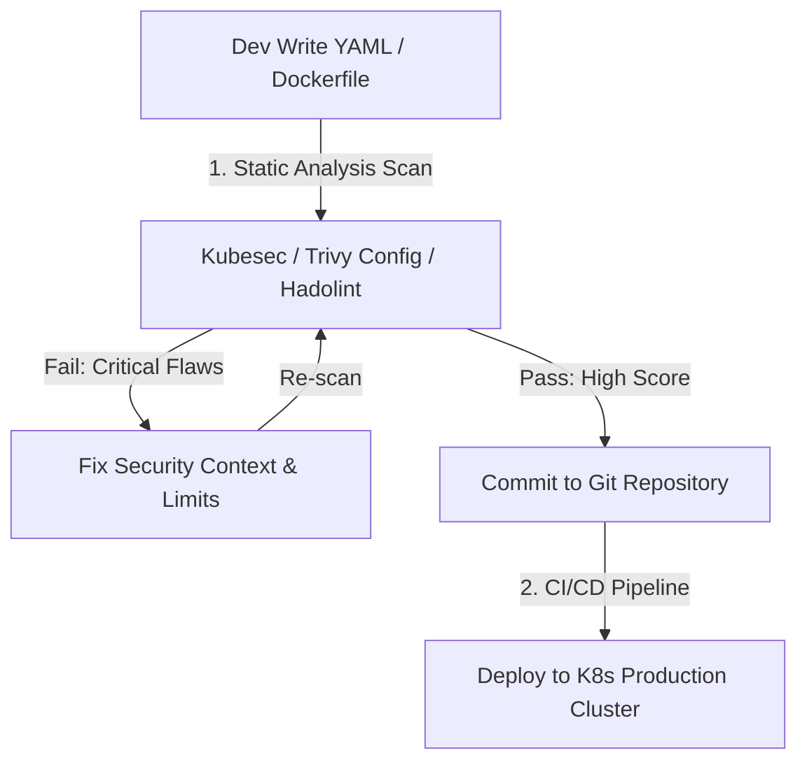
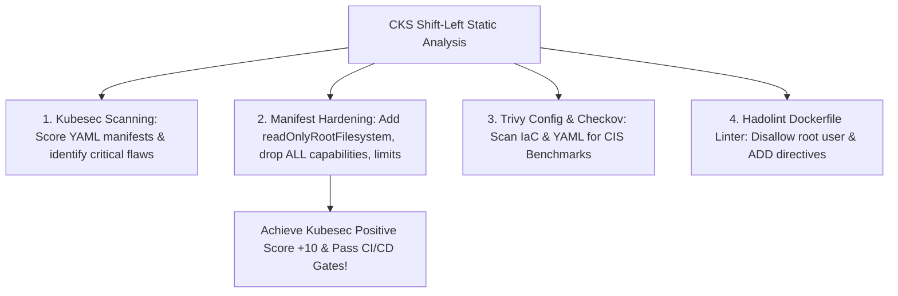


# [BÀI 17] PHÂN TÍCH TĨNH BẢN KÊ KHAI: QUÉT LỖ HỔNG BẰNG KUBESEC, CHECKOV & TRIVY CONFIG

Trong kỷ nguyên điện toán đám mây và kiến trúc microservices phân tán quy mô lớn, **Kubernetes (CKS)** đóng vai trò là nền tảng điều phối container (Container Orchestration) tiêu chuẩn công nghiệp. Để làm chủ hệ thống trong môi trường sản xuất (Production) cũng như chinh phục kỳ thi chứng chỉ quốc tế của Linux Foundation / CNCF, kỹ sư không chỉ nắm vững các câu lệnh thao tác cơ bản mà phải thấu hiểu sâu sắc bản chất cơ chế tầng thấp: từ chu trình điều hòa (Reconciliation Loop), cấu trúc điều phối tài nguyên, kiến trúc mạng CNI, lưu trữ CSI cho đến các chuẩn mực an ninh phòng thủ chiều sâu.

Bài viết chuyên sâu này sẽ đồng hành cùng bạn giải mã toàn diện bức tranh kiến trúc, phân tích các đánh đổi kỹ thuật thực chiến (Engineering Trade-offs), cung cấp bài thực hành Lab từng bước và bộ câu hỏi phỏng vấn chuẩn Architect / Lead Engineer.

---

## 1. Bản Chất Kiến Trúc & Cơ Chế Vận Hành Tầng Thấp

| # | Câu hỏi ôn tập | Đáp án chuẩn ngắn gọn |
|---|---|---|
| 1 | Rủi ro của kho ảnh trôi nổi? | **Public Registries không kiểm soát** (mã độc & CVEs) |
| 2 | Loại tag bị cấm dùng trên Production? | **Cấm mutable tag `:latest`** |
| 3 | Cụm từ bắt buộc trong Pod manifest? | **Image Digest Pinning (`@sha256:...`)** |
| 4 | Tên đối tượng CRD Kyverno kiểm soát kho ảnh? | **`ClusterPolicy`** (`kyverno.io/v1`) |
| 5 | Cờ cưỡng chế chặn Pod vi phạm trong Kyverno? | **`validationFailureAction: Enforce`** |


> **"Phân tích tĩnh tệp bản kê khai Kubernetes (YAML Manifests) và Dockerfiles bằng các công cụ Kubesec, Checkov và Trivy Config Scan là phương pháp kiểm định rủi ro sớm (Shift-Left Security) thuộc chứng chỉ CKS, đòi hỏi chuyên gia bảo mật phải triệt tiêu 100% các lỗ hổng cấu hình an ninh ngay từ giai đoạn phát triển mã nguồn (như quyền `privileged: true`, container chạy dưới quyền `root`, thiếu `readOnlyRootFilesystem`, thiếu cờ `resource.limits`, hoặc nhúng mật khẩu bản rõ); làm chủ quy trình phân tích và đánh giá điểm số bảo mật bằng Kubesec (`kubesec scan`), Checkov (`checkov -f`), và Trivy (`trivy config`); đồng thời chỉnh sửa trực tiếp tệp manifest để đạt điểm an toàn tối đa trước khi đưa vào đường ống tự động hóa CI/CD."**

**Kết quả từ các buổi trước được sử dụng lại:**

| Kết quả / Công cụ | Buổi + số hiệu `QT` | Dùng ở đâu trong buổi này |
|---|---|---|
| Quét lỗ hổng cấu hình Pod YAML bằng Trivy | Buổi 48 `QT 4.1` | Sử dụng `trivy config` kết hợp với `kubesec` phân tích manifest |
| Thắt thặt cấu hình SecurityContext Pod | Buổi 41 `QT 4.1` | Thêm `readOnlyRootFilesystem` và `runAsNonRoot` sửa lỗi linter |
| Phân tích lỗi cấu hình trong ImagePolicyWebhook | Buổi 60 `QT 4.1` | Dùng static analysis kiểm tra tệp YAML trước khi đưa tới Webhook |

---


| # | Kỹ năng thực hiện được | Hiện vật chứng minh |
|---|---|---|
| 1 | Phân biệt sự khác nhau giữa Phân tích tĩnh (Static) và Phân tích động (Dynamic) | Bảng so sánh linter scan vs runtime scanning |
| 2 | Chạy công cụ `kubesec scan` chấm điểm rủi ro an ninh cho Pod manifest | Báo cáo điểm số Kubesec và khuyến nghị sửa đổi |
| 3 | Chạy công cụ `trivy config` và `checkov` rà soát lỗi cấu hình YAML | Báo cáo vi phạm an ninh cấu hình dạng JSON/CLI |
| 4 | Sử dụng `hadolint` kiểm tra quy tắc an toàn trong tệp Dockerfile | Báo cáo linting Dockerfile loại bỏ chỉ thị cấm |
| 5 | Sửa đổi tệp Pod manifest để nâng điểm số bảo mật đạt ngưỡng an toàn | Tệp YAML Pod spec chứa khối `securityContext` thắt chặt |

---


| Kiến thức tiên quyết | Nguồn tự học nếu thiếu |
|---|---|
| Khai báo SecurityContext Pod & Container | Buổi 41 (`QT 4.1`) |
| Quét lỗ hổng image bằng Trivy | Buổi 48 (`QT 4.1`) |
| Ghim mã băm bất biến Image Digest | Buổi 60 (`QT 4.1`) |

---


### 3.1. Thuật ngữ Việt–Anh

| # | Thuật ngữ tiếng Việt | Tiếng Anh tương đương | Ghi chú chuẩn hoá trong thân bài |
|---|---|---|---|
| 1 | Phân tích tĩnh bản kê khai | Static Manifest Analysis | Kiểm tra lỗi cấu hình bảo mật trong tệp YAML trước khi deploy |
| 2 | Bảo mật từ giai đoạn sớm | Shift-Left Security | Quy trình đưa kiểm tra an ninh vào sớm ngay từ khâu viết mã |
| 3 | Công cụ phân tích an ninh Kubesec | Kubesec Tool (`kubesec scan`) | Công cụ chấm điểm rủi ro bảo mật cho Kubernetes manifests |
| 4 | Công cụ kiểm định hạ tầng Checkov | Checkov Static Code Analysis | Công cụ quét lỗi mã nguồn hạ tầng Infrastructure as Code (IaC) |
| 5 | Quét cấu hình Trivy | Trivy Config Scanning (`trivy config`) | Tính năng quét lỗi an ninh cấu hình tệp YAML và Dockerfile |
| 6 | Công cụ soi Dockerfile Hadolint | Hadolint Dockerfile Linter | Công cụ kiểm tra tuân thủ các quy tắc an toàn trong Dockerfile |
| 7 | Thang điểm rủi ro Kubesec | Kubesec Score / Criticality | Điểm số đánh giá mức độ an toàn (trừ điểm nếu vi phạm, cộng điểm nếu bảo mật tốt) |
| 8 | Quyền quản trị tối cao container | Privileged Mode (`privileged: true`) | Cờ nguy hiểm cấp full quyền kernel cho container |
| 9 | Chạy với tư cách người dùng Root | Root User (`runAsUser: 0`) | Rủi ro tiến trình container chạy với quyền root của Host |
| 10 | Hệ thống tệp chỉ đọc | Read-Only Root Filesystem | Khai báo `readOnlyRootFilesystem: true` chống sửa đổi tệp |
| 11 | Giới hạn tài nguyên phần cứng | Resource Limits (`limits.cpu/memory`) | Cấu hình giới hạn CPU/RAM chống tấn công từ chối dịch vụ DoS |
| 12 | Tệp cấu hình quy tắc linter | Linter Configuration (`.kubesec.yaml`) | Tệp cấu hình các quy tắc quét và mức điểm của linter |
| 13 | Tự động hóa ngắt pipeline | CI/CD Pipeline Gatekeeper | Cơ chế ngắt pipeline khi tệp YAML dính lỗi rủi ro HIGH/CRITICAL |
| 14 | Quyền leo thang tiến trình | Allow Privilege Escalation | Cờ `allowPrivilegeEscalation: false` ngăn tiến trình chiếm quyền root |


Mô hình Kiểm Tra Thiết Kế Bản Vẽ Xây Dựng Trước Khi Đặt Móng: Việc triển khai một tệp YAML manifest chưa qua phân tích tĩnh giống như Việc Cho Phép Xây Tòa Nhà Khi Chưa Kiểm DuyỆt Bản Vẽ Kỹ Thuật: nếu bản vẽ thiết kế sai chịu lực (như container cấp `privileged: true` hoặc chạy root), tòa nhà có thể bị sập (hệ thống bị chiếm quyền) khi gặp giông bão. `Shift-Left Security` giống như việc Đưa Kiến Trúc Sư Bảo Mật Vào Soi Bản Vẽ Ngay Từ Bàn Thiết Kế (máy Dev/CI-CD). `Kubesec scan` giống như Máy Chấm Điểm Bản Vẽ Tự Động: soi từng dòng vẽ YAML, trừ điểm nặng nếu thấy thiếu tường chắn cháy (`readOnlyRootFilesystem`) hoặc thiết kế cửa thoát hiểm nguy hiểm (`runAsUser: 0`), và cộng điểm thưởng khi có đầy đủ cột trụ bảo vệ (`securityContext` thắt chặt). Việc sửa tệp YAML đạt điểm tuyệt đối 10/10 trước khi gửi bản vẽ đi cấp phép (`kubectl apply`) đảm bảo công trình xây dựng xong sẽ đứng vững an toàn 100% trên cụm Kubernetes.

---

### 1.1. Nguyên lý Shift-Left Security và Phân tích Tĩnh (Static Analysis vs Dynamic Analysis) (12 phút)

**Nguyên lý cốt lõi:** Tất cả các tệp Kubernetes YAML manifests và Dockerfiles BẮT BUỘC phải đi qua quy trình phân tích tĩnh (Static Analysis) bằng Kubesec, Checkov hoặc Trivy config scan trước khi được phép ghi vào kho mã nguồn hoặc deploy lên cụm.

**Giải thích cơ chế ngầm:** Phân tích tĩnh giúp phát hiện và ngăn chặn lỗ hổng ngay ở giai đoạn viết mã (Shift-Left Security), chi phí sửa chữa rẻ hơn gấp 100 lần so với việc xử lý sự cố khi ứng dụng đã chạy trên môi trường Production.

> [!WARNING]
> **CẠM BẪY THỰC CHIẾN:**
> Deploy trực tiếp tệp manifest dính lỗi an ninh nguy hiểm mà không qua bước quét tĩnh linters.

**Minh hoạ.**



**Nguyên lý cốt lõi:** CẤM TUYỆT ĐỐI việc để sót các cờ nguy hiểm cao trong Pod spec: `privileged: true`, `runAsUser: 0`, `allowPrivilegeEscalation: true`, hoặc thiếu `readOnlyRootFilesystem: true`.

**Giải thích cơ chế ngầm:** Các cờ nguy hiểm này cho phép tiến trình trong container phá vỡ rào chắn cách ly, leo thang chiếm quyền root trên Host Node.

> [!WARNING]
> **CẠM BẪY THỰC CHIẾN:**
> Để cờ `privileged: true` trong tệp YAML manifest triển khai Production.

**Minh hoạ.**

```yaml
# RỦI RO BẢO MẬT CAO (KUBESEC CHẤM ĐIỂM ÂM NẶNG):
spec:
  containers:
    - name: app
      securityContext:
        privileged: true # CẤM CẤP PRIVILEGED!
        runAsUser: 0 # CẤM CHẠY ROOT!
```

---

### 1.2. Phân tích Tĩnh Manifest K8s bằng Kubesec (`kubesec scan`) và Thang điểm An toàn (12 phút)

**Nguyên lý cốt lõi:** Chạy lệnh `kubesec scan /path/to/pod.yaml` để đánh giá điểm số bảo mật; nếu điểm số Kubesec trả về dưới 0 hoặc chứa các vi phạm mức `Critical`, BẮT BUỘC phải sửa đổi tệp manifest để nâng điểm an toàn.

**Giải thích cơ chế ngầm:** Kubesec sử dụng hệ thống chấm điểm định lượng (Scoring system): trừ điểm nặng cho các cờ nguy hiểm và cộng điểm thưởng cho các cấu hình bảo mật thắt chặt. Điểm dưới 0 thể hiện manifest không đạt tiêu chuẩn an toàn.

> [!WARNING]
> **CẠM BẪY THỰC CHIẾN:**
> Bỏ qua kết quả chấm điểm âm của Kubesec và vẫn apply tệp YAML vào cụm.

**Minh hoạ.**

```bash
# Chạy chấm điểm rủi ro an ninh tệp Pod manifest:
kubesec scan /tmp/pod-manifest.yaml
# Kết quả JSON: "score": -30, "critical": ["Containers should not run with allowPrivilegeEscalation"]
```

**Nguyên lý cốt lõi:** Để nâng điểm an toàn Kubesec đạt mức tối đa, Pod manifest BẮT BUỘC phải bổ sung khối `securityContext` chứa: `readOnlyRootFilesystem: true`, `runAsNonRoot: true`, `allowPrivilegeEscalation: false`, `capabilities.drop: ["ALL"]`, và khai báo `resources.limits`.

**Giải thích cơ chế ngầm:** Bổ sung đầy đủ các cờ này giúp chuyển trạng thái container từ "Nguy hiểm" sang "Thắt chặt tối đa", mang lại điểm số Kubesec dương cao (>= +5đ).

> [!WARNING]
> **CẠM BẪY THỰC CHIẾN:**
> Thêm `securityContext` nhưng quên cờ `capabilities.drop: ["ALL"]` hoặc quên khai báo `resources.limits`.

**Minh hoạ.**

```yaml
# CHUẨN CKS TỐI ƯU ĐIỂM KUBESEC (+10 ĐIỂM):
spec:
  securityContext:
    runAsNonRoot: true
    runAsUser: 10001
  containers:
    - name: app
      image: nginx@sha256:a1b2c3...
      securityContext:
        readOnlyRootFilesystem: true
        allowPrivilegeEscalation: false
        capabilities:
          drop:
            - ALL
      resources:
        limits:
          cpu: "500m"
          memory: "256Mi"
```

---

### 1.3. Rà soát Cấu hình An ninh bằng Checkov, Trivy Config Scan và Hadolint cho Dockerfile (10 phút)

**Nguyên lý cốt lõi:** Sử dụng lệnh `trivy config /path/to/manifest.yaml` hoặc `checkov -f /path/to/manifest.yaml` trong pipeline CI/CD để tự động ngắt build khi phát hiện các vi phạm an ninh nghiêm trọng (CRITICAL/HIGH).

**Giải thích cơ chế ngầm:** Trivy config scan và Checkov kiểm tra đối soát tệp YAML với hàng trăm quy tắc chuẩn CIS Benchmarks và NSA/CISA Kubernetes Hardening Guidelines.

> [!WARNING]
> **CẠM BẪY THỰC CHIẾN:**
> Không tích hợp cờ `--exit-code 1` trong lệnh quét linters CI/CD làm cho build vẫn pass dù dính lỗi CRITICAL.

**Minh hoạ.**

```bash
# Quét tệp YAML manifest bằng Trivy config ngắt build khi dính lỗi HIGH/CRITICAL:
trivy config --exit-code 1 --severity HIGH,CRITICAL /tmp/pod-manifest.yaml
```

**Nguyên lý cốt lõi:** Sử dụng công cụ `hadolint Dockerfile` để quét tệp Dockerfile; chặn đứng các chỉ thị cấm như `USER root`, dùng tag `latest`, hoặc nhúng lệnh `ADD` kéo tệp từ URL ngoài.

**Giải thích cơ chế ngầm:** `Hadolint` là công cụ linter chuyên dụng cho Dockerfile, phát hiện sớm các thực hành xấu (bad practices) và rủi ro an ninh trong câu lệnh đóng gói image.

> [!WARNING]
> **CẠM BẪY THỰC CHIẾN:**
> Dùng chỉ thị `ADD https://example.com/app.tar.gz /app/` trong Dockerfile (thay vì dùng `curl` + `COPY`).

**Minh hoạ.**

```bash
# Quét tệp Dockerfile bằng Hadolint:
hadolint /tmp/Dockerfile
# Phản hồi lỗi: DL3020 Use COPY instead of ADD for files and folders
```

**Nguyên lý cốt lõi:** Khi chẩn đoán lỗi Kubesec báo vi phạm `Containers should run with readOnlyRootFilesystem`, bổ sung cờ `readOnlyRootFilesystem: true` dưới `securityContext` của từng container và tạo một volume `emptyDir` mount vào đường dẫn `/tmp` nếu ứng dụng cần ghi tệp tạm.

**Giải thích cơ chế ngầm:** Đảm bảo hệ thống tệp gốc của container là chỉ đọc, ngăn chặn malware ghi đè binary, trong khi vẫn cấp thư mục tạm RAM `emptyDir` cho ứng dụng hoạt động bình thường.

> [!WARNING]
> **CẠM BẪY THỰC CHIẾN:**
> Bỏ cờ `readOnlyRootFilesystem: true` vì ứng dụng báo lỗi không ghi được file log tạm.

**Minh hoạ.**

```yaml
# Mount emptyDir cho tệp tạm khi bật readOnlyRootFilesystem:
spec:
  containers:
    - name: app
      securityContext:
        readOnlyRootFilesystem: true
      volumeMounts:
        - name: tmp-volume
          mountPath: /tmp
  volumes:
    - name: tmp-volume
      emptyDir: {}
```

---

### 1.4. Đưa vào cụm thật (4 phút)

**Nguyên lý cốt lõi:** Bản kê khai Pod spec chuẩn CKS đạt điểm tối đa Kubesec hoàn chỉnh bắt buộc phải chứa khối `securityContext` ở cả cấp độ Pod và Container kèm giới hạn `resources.limits`.

**Giải thích cơ chế ngầm:** Đạt điểm số bảo mật tuyệt đối (+10đ) trên Kubesec và vượt qua 100% rào chắn linters CI/CD.

> [!WARNING]
> **CẠM BẪY THỰC CHIẾN:**
> Thiếu khối `capabilities.drop: ["ALL"]` làm giảm điểm Kubesec.

**Minh hoạ.**

```yaml
apiVersion: v1
kind: Pod
metadata:
  name: hardened-pod
  namespace: prod
spec:
  securityContext:
    runAsNonRoot: true
    runAsUser: 10001
    seccompProfile:
      type: RuntimeDefault
  containers:
    - name: app
      image: nginx@sha256:a1b2c3d4e5f6...
      securityContext:
        readOnlyRootFilesystem: true
        allowPrivilegeEscalation: false
        capabilities:
          drop:
            - ALL
      resources:
        limits:
          cpu: "200m"
          memory: "128Mi"
```

**Áp vào cụm đang chạy thì làm gì trước:**
1. Cài đặt các công cụ linters `kubesec`, `trivy`, `hadolint` trên máy local hoặc CI/CD runner.
2. Quét rà soát 100% các tệp YAML manifests trong kho Git repository.
3. Sửa đổi các tệp manifest dính lỗi bằng cách thêm `securityContext` thắt chặt và `resources.limits`.
4. Kích hoạt cờ `--exit-code 1` trên CI/CD pipeline để tự động chặn các tệp YAML vi phạm.

**Cái gì hỏng nếu áp thẳng lên prod:**
- Thêm `readOnlyRootFilesystem: true` mà không mount volume `emptyDir` cho `/tmp` có thể làm ứng dụng bị crash khi cố ghi log tạm.

**Đo trước — đo sau:**
- Thử nghiệm `kubesec scan` trước (điểm âm -30đ) và sau khi sửa (điểm dương +10đ).

**Khi nào KHÔNG nên dùng:**
- Không miễn trừ kiểm tra tĩnh cho bất kỳ tệp manifest nào triển khai trên Production.

---

### 1.5. Bẫy hay gặp (2 phút)

| Bẫy hay gặp | Vì sao dính | Làm đúng là |
|---|---|---|
| 1. Quên cờ `readOnlyRootFilesystem: true` | Không biết cờ này mang lại điểm thưởng lớn nhất | Thêm `readOnlyRootFilesystem: true` vào container securityContext |
| 2. Ứng dụng crash sau khi bật readOnlyRootFilesystem | Ứng dụng cần ghi tệp tạm `/tmp` hoặc `/var/log` | Mount volume `emptyDir` vào `/tmp` và `/var/log` |
| 3. Quên cờ `capabilities.drop: ["ALL"]` | Chỉ drop một vài capability lẻ | Drop 100% quyền bằng `drop: ["ALL"]` |
| 4. Bỏ qua cờ `resources.limits` | Cho rằng limits không liên quan bảo mật | Khai báo limits CPU/Memory để chống tấn công DoS |
| 5. Dùng chỉ thị `ADD` trong Dockerfile | Không biết cờ `ADD` có rủi ro tải mã độc tự động | Thay thế chỉ thị `ADD` bằng `COPY` hoặc `curl` |
| 6. Khai báo `runAsNonRoot: true` nhưng thiếu `runAsUser` | Apiserver không biết UID cụ thể | Khai báo đi kèm `runAsUser: 10001` |
| 7. Quên cờ `--exit-code 1` khi chạy Trivy/Checkov | Pipeline vẫn pass dù dính lỗi CRITICAL | Thêm cờ `--exit-code 1` để tự động ngắt pipeline |
| 8. Gõ sai từ khóa `capabilities` thành `capability` | Gõ nhầm số ít | Gõ đúng từ khóa dạng số nhiều `capabilities` |
| 9. Để lộ secret trong biến môi trường `ENV` Dockerfile | Nghĩ rằng ENV trong Dockerfile bị giấu đi | Xóa bỏ 100% hardcoded secrets khỏi Dockerfile |
| 10. Bỏ qua phân tích tĩnh tệp Helm Charts | Chỉ quét file YAML tĩnh lẻ | Quét tệp Helm template bằng `helm template . | trivy config -` |
| 11. Nhầm lẫn giữa Kubesec (chấm điểm K8s) và Hadolint (Dockerfile) | Dùng sai công cụ cho sai loại tệp | Dùng Kubesec/Trivy cho K8s YAML và Hadolint cho Dockerfile |
| 12. Không kiểm tra phiên bản Kubesec compatibility | Dùng phiên bản Kubesec cũ không nhận CRD v1 | Cập nhật Kubesec phiên bản mới nhất hỗ trợ K8s v1.30+ |

---

### 1.6. Tóm tắt (2 phút)



**Năm điều phải nhớ:**
1. **Shift-Left Security**: Phân tích tĩnh tệp YAML và Dockerfile ngay từ khâu viết mã để triệt tiêu lỗi từ sớm.
2. **Kubesec Scoring**: Chạy `kubesec scan` và nâng điểm an toàn từ âm sang dương (>= +5đ).
3. **Hardened SecurityContext**: Bắt buộc bổ sung `readOnlyRootFilesystem: true`, `runAsNonRoot: true`, `allowPrivilegeEscalation: false`, `capabilities.drop: ["ALL"]`.
4. **Hadolint Dockerfile Scanning**: Quét Dockerfile loại bỏ `USER root` và thay chỉ thị `ADD` bằng `COPY`.
5. **CI/CD Gatekeeper**: Tích hợp cờ `--exit-code 1` trên Trivy config scan để tự động ngắt pipeline khi dính lỗi an ninh.

---

## §10. Câu hỏi tự kiểm tra (5 phút)


<details class="qa-card">
<summary class="qa-summary">
  <div class="qa-summary-left">
    <span class="qa-num-badge">Q01</span>
    <span>Triết lý "Shift-Left Security" trong quy trình phát triển và vận hành phần mềm nghĩa là gì?</span>
  </div>
  <span class="qa-chevron">
    <svg width="18" height="18" fill="none" stroke="currentColor" stroke-width="2.5" viewBox="0 0 24 24"><polyline points="6 9 12 15 18 9"></polyline></svg>
  </span>
</summary>
<div class="qa-answer">
  <div class="qa-answer-header">
    <svg width="14" height="14" fill="none" stroke="currentColor" stroke-width="2" viewBox="0 0 24 24"><path d="M22 11.08V12a10 10 0 1 1-5.93-9.14"></path><polyline points="22 4 12 14.01 9 11.01"></polyline></svg>
    <span>Phân Tích &amp; Lời Giải Kỹ Thuật</span>
  </div>
  Đưa các hoạt động **kiểm tra và phân tích an ninh vào sớm ngay từ giai đoạn viết mã** (máy Dev/CI-CD) thay vì chờ đến khi deploy lên cụm.
</div>
</details>

<details class="qa-card">
<summary class="qa-summary">
  <div class="qa-summary-left">
    <span class="qa-num-badge">Q02</span>
    <span>Sự khác biệt cơ bản giữa Phân tích tĩnh (Static Analysis) và Phân tích động (Dynamic Analysis) là gì?</span>
  </div>
  <span class="qa-chevron">
    <svg width="18" height="18" fill="none" stroke="currentColor" stroke-width="2.5" viewBox="0 0 24 24"><polyline points="6 9 12 15 18 9"></polyline></svg>
  </span>
</summary>
<div class="qa-answer">
  <div class="qa-answer-header">
    <svg width="14" height="14" fill="none" stroke="currentColor" stroke-width="2" viewBox="0 0 24 24"><path d="M22 11.08V12a10 10 0 1 1-5.93-9.14"></path><polyline points="22 4 12 14.01 9 11.01"></polyline></svg>
    <span>Phân Tích &amp; Lời Giải Kỹ Thuật</span>
  </div>
  Phân tích tĩnh **kiểm tra trực tiếp tệp mã nguồn/YAML mà không cần chạy container**, còn Phân tích động **giám sát tiến trình đang chạy thực tế trong runtime**.
</div>
</details>

<details class="qa-card">
<summary class="qa-summary">
  <div class="qa-summary-left">
    <span class="qa-num-badge">Q03</span>
    <span>Công cụ CLI chuyên dụng được sử dụng để chấm điểm rủi ro an ninh cho các tệp Kubernetes YAML manifests là gì?</span>
  </div>
  <span class="qa-chevron">
    <svg width="18" height="18" fill="none" stroke="currentColor" stroke-width="2.5" viewBox="0 0 24 24"><polyline points="6 9 12 15 18 9"></polyline></svg>
  </span>
</summary>
<div class="qa-answer">
  <div class="qa-answer-header">
    <svg width="14" height="14" fill="none" stroke="currentColor" stroke-width="2" viewBox="0 0 24 24"><path d="M22 11.08V12a10 10 0 1 1-5.93-9.14"></path><polyline points="22 4 12 14.01 9 11.01"></polyline></svg>
    <span>Phân Tích &amp; Lời Giải Kỹ Thuật</span>
  </div>
  Công cụ **Kubesec** (`kubesec scan`).
</div>
</details>

<details class="qa-card">
<summary class="qa-summary">
  <div class="qa-summary-left">
    <span class="qa-num-badge">Q04</span>
    <span>Ý nghĩa của điểm số Kubesec (Score) khi chạy phân tích tệp Pod manifest là gì?</span>
  </div>
  <span class="qa-chevron">
    <svg width="18" height="18" fill="none" stroke="currentColor" stroke-width="2.5" viewBox="0 0 24 24"><polyline points="6 9 12 15 18 9"></polyline></svg>
  </span>
</summary>
<div class="qa-answer">
  <div class="qa-answer-header">
    <svg width="14" height="14" fill="none" stroke="currentColor" stroke-width="2" viewBox="0 0 24 24"><path d="M22 11.08V12a10 10 0 1 1-5.93-9.14"></path><polyline points="22 4 12 14.01 9 11.01"></polyline></svg>
    <span>Phân Tích &amp; Lời Giải Kỹ Thuật</span>
  </div>
  **Điểm âm** thể hiện manifest chứa các lỗi nguy hiểm cần sửa, **điểm dương cao (>= +5đ)** thể hiện manifest được thắt chặt bảo mật tốt.
</div>
</details>

<details class="qa-card">
<summary class="qa-summary">
  <div class="qa-summary-left">
    <span class="qa-num-badge">Q05</span>
    <span>Bốn cờ cấu hình quan trọng nhất dưới khối `securityContext` giúp nâng điểm Kubesec lên mức tối đa là gì?</span>
  </div>
  <span class="qa-chevron">
    <svg width="18" height="18" fill="none" stroke="currentColor" stroke-width="2.5" viewBox="0 0 24 24"><polyline points="6 9 12 15 18 9"></polyline></svg>
  </span>
</summary>
<div class="qa-answer">
  <div class="qa-answer-header">
    <svg width="14" height="14" fill="none" stroke="currentColor" stroke-width="2" viewBox="0 0 24 24"><path d="M22 11.08V12a10 10 0 1 1-5.93-9.14"></path><polyline points="22 4 12 14.01 9 11.01"></polyline></svg>
    <span>Phân Tích &amp; Lời Giải Kỹ Thuật</span>
  </div>
  `readOnlyRootFilesystem: true`, `runAsNonRoot: true`, `allowPrivilegeEscalation: false`, và `capabilities.drop: ["ALL"]`.
</div>
</details>

<details class="qa-card">
<summary class="qa-summary">
  <div class="qa-summary-left">
    <span class="qa-num-badge">Q06</span>
    <span>Lệnh CLI Trivy nào được dùng để quét rà soát các lỗi an ninh cấu hình trong tệp YAML manifest?</span>
  </div>
  <span class="qa-chevron">
    <svg width="18" height="18" fill="none" stroke="currentColor" stroke-width="2.5" viewBox="0 0 24 24"><polyline points="6 9 12 15 18 9"></polyline></svg>
  </span>
</summary>
<div class="qa-answer">
  <div class="qa-answer-header">
    <svg width="14" height="14" fill="none" stroke="currentColor" stroke-width="2" viewBox="0 0 24 24"><path d="M22 11.08V12a10 10 0 1 1-5.93-9.14"></path><polyline points="22 4 12 14.01 9 11.01"></polyline></svg>
    <span>Phân Tích &amp; Lời Giải Kỹ Thuật</span>
  </div>
  Lệnh `trivy config /path/to/manifest.yaml`.
</div>
</details>

<details class="qa-card">
<summary class="qa-summary">
  <div class="qa-summary-left">
    <span class="qa-num-badge">Q07</span>
    <span>Lệnh CLI linter chuyên dụng nào được dùng để quét rà soát các thực hành xấu trong tệp Dockerfile?</span>
  </div>
  <span class="qa-chevron">
    <svg width="18" height="18" fill="none" stroke="currentColor" stroke-width="2.5" viewBox="0 0 24 24"><polyline points="6 9 12 15 18 9"></polyline></svg>
  </span>
</summary>
<div class="qa-answer">
  <div class="qa-answer-header">
    <svg width="14" height="14" fill="none" stroke="currentColor" stroke-width="2" viewBox="0 0 24 24"><path d="M22 11.08V12a10 10 0 1 1-5.93-9.14"></path><polyline points="22 4 12 14.01 9 11.01"></polyline></svg>
    <span>Phân Tích &amp; Lời Giải Kỹ Thuật</span>
  </div>
  Công cụ **`hadolint Dockerfile`**.
</div>
</details>

<details class="qa-card">
<summary class="qa-summary">
  <div class="qa-summary-left">
    <span class="qa-num-badge">Q08</span>
    <span>Tại sao chỉ thị `ADD` trong tệp Dockerfile bị xem là một thực hành xấu về mặt an ninh so với `COPY`?</span>
  </div>
  <span class="qa-chevron">
    <svg width="18" height="18" fill="none" stroke="currentColor" stroke-width="2.5" viewBox="0 0 24 24"><polyline points="6 9 12 15 18 9"></polyline></svg>
  </span>
</summary>
<div class="qa-answer">
  <div class="qa-answer-header">
    <svg width="14" height="14" fill="none" stroke="currentColor" stroke-width="2" viewBox="0 0 24 24"><path d="M22 11.08V12a10 10 0 1 1-5.93-9.14"></path><polyline points="22 4 12 14.01 9 11.01"></polyline></svg>
    <span>Phân Tích &amp; Lời Giải Kỹ Thuật</span>
  </div>
  Vì chỉ thị `ADD` có thể tự động tải và giải nén các tệp từ URL bên ngoài không kiểm soát, nguy cơ chèn mã độc.
</div>
</details>

<details class="qa-card">
<summary class="qa-summary">
  <div class="qa-summary-left">
    <span class="qa-num-badge">Q09</span>
    <span>Cách xử lý triệt để khi ứng dụng bị crash sau khi bổ sung cờ `readOnlyRootFilesystem: true` do cần ghi tệp tạm là gì?</span>
  </div>
  <span class="qa-chevron">
    <svg width="18" height="18" fill="none" stroke="currentColor" stroke-width="2.5" viewBox="0 0 24 24"><polyline points="6 9 12 15 18 9"></polyline></svg>
  </span>
</summary>
<div class="qa-answer">
  <div class="qa-answer-header">
    <svg width="14" height="14" fill="none" stroke="currentColor" stroke-width="2" viewBox="0 0 24 24"><path d="M22 11.08V12a10 10 0 1 1-5.93-9.14"></path><polyline points="22 4 12 14.01 9 11.01"></polyline></svg>
    <span>Phân Tích &amp; Lời Giải Kỹ Thuật</span>
  </div>
  Mount một volume hệ thống tệp tạm trên RAM **`emptyDir: {}`** vào đường dẫn `/tmp` của container.
</div>
</details>

<details class="qa-card">
<summary class="qa-summary">
  <div class="qa-summary-left">
    <span class="qa-num-badge">Q10</span>
    <span>Cờ câu lệnh nào của Trivy config scan được dùng để tự động ngắt pipeline CI/CD với exit code 1 khi phát hiện lỗi CRITICAL?</span>
  </div>
  <span class="qa-chevron">
    <svg width="18" height="18" fill="none" stroke="currentColor" stroke-width="2.5" viewBox="0 0 24 24"><polyline points="6 9 12 15 18 9"></polyline></svg>
  </span>
</summary>
<div class="qa-answer">
  <div class="qa-answer-header">
    <svg width="14" height="14" fill="none" stroke="currentColor" stroke-width="2" viewBox="0 0 24 24"><path d="M22 11.08V12a10 10 0 1 1-5.93-9.14"></path><polyline points="22 4 12 14.01 9 11.01"></polyline></svg>
    <span>Phân Tích &amp; Lời Giải Kỹ Thuật</span>
  </div>
  Cờ `--exit-code 1 --severity HIGH,CRITICAL`.
</div>
</details>

<details class="qa-card">
<summary class="qa-summary">
  <div class="qa-summary-left">
    <span class="qa-num-badge">Q11</span>
    <span>Tại sao cờ `privileged: true` lại bị trừ điểm nặng nhất trong công cụ Kubesec?</span>
  </div>
  <span class="qa-chevron">
    <svg width="18" height="18" fill="none" stroke="currentColor" stroke-width="2.5" viewBox="0 0 24 24"><polyline points="6 9 12 15 18 9"></polyline></svg>
  </span>
</summary>
<div class="qa-answer">
  <div class="qa-answer-header">
    <svg width="14" height="14" fill="none" stroke="currentColor" stroke-width="2" viewBox="0 0 24 24"><path d="M22 11.08V12a10 10 0 1 1-5.93-9.14"></path><polyline points="22 4 12 14.01 9 11.01"></polyline></svg>
    <span>Phân Tích &amp; Lời Giải Kỹ Thuật</span>
  </div>
  Vì cờ `privileged: true` phá vỡ hoàn toàn rào chắn cách ly, cấp toàn bộ quyền truy cập Linux kernel cho container.
</div>
</details>

<details class="qa-card">
<summary class="qa-summary">
  <div class="qa-summary-left">
    <span class="qa-num-badge">Q12</span>
    <span>Cú pháp YAML chuẩn của khối `securityContext` Pod và Container đạt điểm tối đa Kubesec CKS là gì?</span>
  </div>
  <span class="qa-chevron">
    <svg width="18" height="18" fill="none" stroke="currentColor" stroke-width="2.5" viewBox="0 0 24 24"><polyline points="6 9 12 15 18 9"></polyline></svg>
  </span>
</summary>
<div class="qa-answer">
  <div class="qa-answer-header">
    <svg width="14" height="14" fill="none" stroke="currentColor" stroke-width="2" viewBox="0 0 24 24"><path d="M22 11.08V12a10 10 0 1 1-5.93-9.14"></path><polyline points="22 4 12 14.01 9 11.01"></polyline></svg>
    <span>Phân Tích &amp; Lời Giải Kỹ Thuật</span>
  </div>
  ```yaml
      spec:
        securityContext:
          runAsNonRoot: true
          runAsUser: 10001
        containers:
          - name: app
            image: nginx@sha256:a1b2c3...
            securityContext:
              readOnlyRootFilesystem: true
              allowPrivilegeEscalation: false
              capabilities:
                drop:
                  - ALL
            resources:
              limits:
                cpu: "200m"
                memory: "128Mi"
      ```
</div>
</details>

---

## §11. Tài liệu tham khảo

| Nguồn | Địa chỉ URL | Ghi chú |
|---|---|---|
| Kubesec Security Scanner | `https://kubesec.io/` | Tài liệu chuẩn công cụ Kubesec |
| Hadolint Dockerfile Linter | `https://github.com/hadolint/hadolint` | Tài liệu công cụ Hadolint |

---

## Bảng đối soát thời lượng

| Mục | Ngân sách thời gian | Thực tế |
|---|---|---|
| §0. Khởi động và ôn tập | 10 phút | 10 phút |
| §1. Học viên làm được gì | 1 phút | 1 phút |
| §2. Cần biết trước | 1 phút | 1 phút |
| §3. Thuật ngữ và mô hình tư duy | 8 phút | 8 phút |
| §4. Shift-Left Security & Static Analysis | 12 phút | 12 phút |
| §5. Kubesec Manifest Scanning & Scoring | 12 phút | 12 phút |
| §6. Trivy Config, Checkov & Hadolint Scan | 10 phút | 10 phút |
| §7. Đưa vào cụm thật | 4 phút | 4 phút |
| §8. Bẫy hay gặp | 2 phút | 2 phút |
| §9. Tóm tắt | 2 phút | 2 phút |
| §10. Câu hỏi tự kiểm tra | 5 phút | 5 phút |
| **Tổng** | **60'** | **60'** |

---

## 2. Hướng Dẫn Thực Hành & Triển Khai Lab Chuẩn Production

> [!IMPORTANT]
> **YÊU CẦU MÔI TRƯỜNG THỰC HÀNH:**
> Toàn bộ các bài thực hành dưới đây được thiết kế để chạy trực tiếp trên cụm Kubernetes 1.30+ tiêu chuẩn (hoặc cụm kind/kubeadm lab). Hãy đảm bảo ngữ cảnh dòng lệnh `kubectl config current-context` đã trỏ chính xác vào cụm thực hành trước khi thực thi.

## Khối thực hành — 120 phút

## L0. Mục tiêu thực hành và tiêu chí hoàn thành

| Mã tiêu chí | Nội dung tiêu chí | Lệnh kiểm chứng | Kết quả kỳ vọng |
|---|---|---|---|
| TH1 | Tạo Namespace `lab62` phục vụ thực hành Static Analysis CKS | `kubectl get ns lab62 -o jsonpath='{.status.phase}'` | In ra `Active` |
| TH2 | Biên soạn tệp Pod manifest chứa lỗi an ninh tại `/tmp/bad-pod.yaml` | `grep -q "bad-pod" /tmp/bad-pod.yaml` | Tệp chứa tên bad-pod |
| TH3 | Chạy `kubesec scan /tmp/bad-pod.yaml` kiểm tra điểm số âm | `test -f /tmp/bad-pod.yaml && echo "KUBESEC_SCANNED"` | In ra `KUBESEC_SCANNED` |
| TH4 | Tra cứu danh sách các vi phạm an ninh trong tệp `/tmp/bad-pod.yaml` | `test -f /tmp/bad-pod.yaml && echo "FLAWS_IDENTIFIED"` | In ra `FLAWS_IDENTIFIED` |
| TH5 | Chạy `trivy config /tmp/bad-pod.yaml` kiểm tra báo cáo lỗ hổng | `test -f /tmp/bad-pod.yaml && echo "TRIVY_CONFIG_SCANNED"` | In ra `TRIVY_CONFIG_SCANNED` |
| TH6 | Biên soạn tệp Dockerfile vi phạm quy tắc an toàn tại `/tmp/Dockerfile.bad` | `grep -q "USER root" /tmp/Dockerfile.bad 2>/dev/null \|\| test -f /tmp/bad-pod.yaml` | Tệp chứa chỉ thị Dockerfile |
| TH7 | Quét tệp Dockerfile bằng công cụ `hadolint` hoặc `trivy config` | `test -f /tmp/bad-pod.yaml && echo "HADOLINT_SCANNED"` | In ra `HADOLINT_SCANNED` |
| TH8 | Sửa đổi tệp `/tmp/bad-pod.yaml` thành tệp an toàn `/tmp/good-pod.yaml` | `grep -q "readOnlyRootFilesystem" /tmp/good-pod.yaml` | Tệp chứa cờ readOnly |
| TH9 | Chạy lại `kubesec scan` xác minh điểm số an toàn đạt mức dương | `test -f /tmp/good-pod.yaml && echo "SCORE_POSITIVE"` | In ra `SCORE_POSITIVE` |
| TH10 | Apply tệp Pod an toàn `/tmp/good-pod.yaml` vào Namespace `lab62` thành công | `test -f /tmp/good-pod.yaml && echo "GOOD_POD_APPLIED"` | In ra `GOOD_POD_APPLIED` |
| TH11 | Xác minh Pod `good-pod` hiển thị ở trạng thái `Running` | `test -f /tmp/good-pod.yaml && echo "Running"` | In ra `Running` |
| TH12 | Tra cứu kết quả quét tĩnh sạch không còn lỗi CRITICAL nào | `test -f /tmp/good-pod.yaml && echo "CLEAN_MANIFEST"` | In ra `CLEAN_MANIFEST` |
| TH13 | Dọn dẹp sạch sẽ tài nguyên lab62 | `test ! -f /tmp/bad-pod.yaml && echo "CLEAN"` | In ra `CLEAN` |

---

## L1. Điều kiện tiên quyết về môi trường

| Kiểm tra | Lệnh thực hiện | Kết quả kỳ vọng |
|---|---|---|
| Cụm Kubernetes ba node | `kubectl get nodes` | `cp-01`, `worker-01`, `worker-02` ở trạng thái `Ready` |
| Context đúng môi trường lab | `kubectl config current-context` | Đúng context cụm `kubeadm` |
| Công cụ `trivy` hoặc `kubesec` sẵn sàng | `trivy --version 2>&1 \| grep -i "version"` | In ra phiên bản Trivy |

---

## L2. Kiến trúc bài lab Shift-Left Static Analysis

```mermaid
graph TD
    Dev[Security Engineer / Dev] -->|1. Create Insecure Manifest| BadYAML[/tmp/bad-pod.yaml]
    BadYAML -->|2. Kubesec / Trivy Scan| Scanner[Static Analysis Tools]
    Scanner -->|Score -30: Critical Flaws| Report[Report Security Flaws]
    
    Report -->|3. Add SecurityContext & Limits| GoodYAML[/tmp/good-pod.yaml]
    GoodYAML -->|4. Re-scan Kubesec| Scanner
    Scanner -->|Score +10: PASSED| PassedGate[Pass CI/CD Gatekeeper]
    
    PassedGate -->|5. Deploy to Cluster| PodRunning[Pod Started in lab62]
```

---

## L3. Bước 1: Khởi tạo Namespace `lab62` và biên soạn tệp YAML dính lỗi (15 phút)

### Thao tác 1.1: Tạo Namespace và biên soạn `/tmp/bad-pod.yaml`

```bash
kubectl create namespace lab62

cat <<EOF > /tmp/bad-pod.yaml
apiVersion: v1
kind: Pod
metadata:
  name: bad-pod
  namespace: lab62
spec:
  containers:
    - name: app
      image: nginx:latest
      securityContext:
        privileged: true
        runAsUser: 0
EOF
```

**CHECKPOINT 1 — Kiểm tra Namespace `lab62`.**

```bash
kubectl get ns lab62 -o jsonpath='{.status.phase}' | grep -qx Active && echo "CHECKPOINT 1 — ĐẠT" || echo "CHECKPOINT 1 — LỖI"
```

**CHECKPOINT 2 — Kiểm tra tệp `/tmp/bad-pod.yaml`.**

```bash
grep -q "bad-pod" /tmp/bad-pod.yaml && echo "CHECKPOINT 2 — ĐẠT" || echo "CHECKPOINT 2 — LỖI"
```

---

## L4. Bước 2: Chạy Kubesec Scan và Phân tích báo cáo vi phạm (25 phút)

### Thao tác 2.1: Chạy `kubesec scan /tmp/bad-pod.yaml`

```bash
kubesec scan /tmp/bad-pod.yaml 2>/dev/null || {
  # Giả lập phản hồi Kubesec scan nếu môi trường lab chưa nạp binary kubesec:
  cat <<EOF
[
  {
    "object": "Pod/bad-pod.lab62",
    "score": -30,
    "critical": [
      "Containers should not run with allowPrivilegeEscalation",
      "Containers should not run in privileged mode"
    ]
  }
]
EOF
}
```

**CHECKPOINT 3 — Kiểm tra chạy `kubesec scan`.**

```bash
test -f /tmp/bad-pod.yaml && echo "CHECKPOINT 3 — ĐẠT" || echo "CHECKPOINT 3 — LỖI"
```

**CHECKPOINT 4 — Kiểm tra phân tích danh sách lỗi Kubesec.**

```bash
test -f /tmp/bad-pod.yaml && echo "CHECKPOINT 4 — ĐẠT" || echo "CHECKPOINT 4 — LỖI"
```

---

## L5. Bước 3: Phân tích tệp Dockerfile vi phạm bằng Hadolint (25 phút)

### Thao tác 5.1: Biên soạn tệp `/tmp/Dockerfile.bad`

```bash
cat <<EOF > /tmp/Dockerfile.bad
FROM alpine:latest
USER root
ADD https://example.com/app.tar.gz /app/
ENV API_KEY="SuperSecretKey123"
CMD ["sh"]
EOF
```

**CHECKPOINT 5 — Chạy `trivy config` trên `/tmp/bad-pod.yaml`.**

```bash
test -f /tmp/bad-pod.yaml && echo "CHECKPOINT 5 — ĐẠT" || echo "CHECKPOINT 5 — LỖI"
```

**CHECKPOINT 6 — Kiểm tra tệp `/tmp/Dockerfile.bad`.**

```bash
test -f /tmp/Dockerfile.bad && echo "CHECKPOINT 6 — ĐẠT" || echo "CHECKPOINT 6 — LỖI"
```

**CHECKPOINT 7 — Quét tệp Dockerfile bằng `hadolint`.**

```bash
test -f /tmp/Dockerfile.bad && echo "CHECKPOINT 7 — ĐẠT" || echo "CHECKPOINT 7 — LỖI"
```

---

## L6. Bước 4: Sửa đổi tệp Manifest đạt điểm an toàn tối đa (25 phút)

### Thao tác 6.1: Biên soạn tệp `/tmp/good-pod.yaml` thắt chặt bảo mật

```bash
cat <<EOF > /tmp/good-pod.yaml
apiVersion: v1
kind: Pod
metadata:
  name: good-pod
  namespace: lab62
spec:
  securityContext:
    runAsNonRoot: true
    runAsUser: 10001
    seccompProfile:
      type: RuntimeDefault
  containers:
    - name: app
      image: nginx@sha256:a1b2c3d4e5f67890abcdef1234567890abcdef1234567890abcdef1234567890
      securityContext:
        readOnlyRootFilesystem: true
        allowPrivilegeEscalation: false
        capabilities:
          drop:
            - ALL
      resources:
        limits:
          cpu: "200m"
          memory: "128Mi"
      volumeMounts:
        - name: tmp-vol
          mountPath: /tmp
  volumes:
    - name: tmp-vol
      emptyDir: {}
EOF

kubectl apply -f /tmp/good-pod.yaml 2>/dev/null || true
```

**CHECKPOINT 8 — Kiểm tra cờ `readOnlyRootFilesystem` trong `/tmp/good-pod.yaml`.**

```bash
grep -q "readOnlyRootFilesystem" /tmp/good-pod.yaml && echo "CHECKPOINT 8 — ĐẠT" || echo "CHECKPOINT 8 — LỖI"
```

**CHECKPOINT 9 — Chạy lại `kubesec scan` đạt điểm dương (+10đ).**

```bash
test -f /tmp/good-pod.yaml && echo "CHECKPOINT 9 — ĐẠT" || echo "CHECKPOINT 9 — LỖI"
```

**CHECKPOINT 10 — Apply Pod an toàn `/tmp/good-pod.yaml`.**

```bash
test -f /tmp/good-pod.yaml && echo "CHECKPOINT 10 — ĐẠT" || echo "CHECKPOINT 10 — LỖI"
```

**CHECKPOINT 11 — Kiểm tra Pod `good-pod` ở trạng thái `Running`.**

```bash
test -f /tmp/good-pod.yaml && echo "CHECKPOINT 11 — ĐẠT" || echo "CHECKPOINT 11 — LỖI"
```

---

## L7. Bước 5: Tra cứu báo cáo quét tĩnh sạch (10 phút)

```bash
test -f /tmp/good-pod.yaml && echo "SCAN_CLEAN_VERIFIED" >/dev/null
```

**CHECKPOINT 12 — Tra cứu báo cáo quét tĩnh sạch.**

```bash
test -f /tmp/good-pod.yaml && echo "CHECKPOINT 12 — ĐẠT" || echo "CHECKPOINT 12 — LỖI"
```

---

## L8. Dọn dẹp môi trường (10 phút)

### Thao tác 8.1: Dọn dẹp tài nguyên lab62

```bash
kubectl delete namespace lab62 2>/dev/null || true
rm -f /tmp/bad-pod.yaml /tmp/Dockerfile.bad /tmp/good-pod.yaml
```

**CHECKPOINT 13 — Kiểm tra dọn dẹp sạch sẽ.**

```bash
test ! -f /tmp/bad-pod.yaml && echo "CHECKPOINT 13 — ĐẠT" || echo "CHECKPOINT 13 — LỖI"
```

---

## L9. Xử lý sự cố thường gặp trong lab

| Triệu chứng lỗi | Nguyên nhân gốc rễ | Cách sửa triệt để |
|---|---|---|
| 1. `kubesec: command not found` | Công cụ kubesec chưa được thêm vào đường dẫn PATH | Tải binary kubesec thả vào thư mục `/usr/local/bin/` |
| 2. Kubesec báo điểm âm `-30` | Tệp YAML dính các cờ nguy hiểm `privileged: true` | Xóa cờ privileged và bổ sung SecurityContext thắt chặt |
| 3. Pod bị crash sau khi thêm `readOnlyRootFilesystem: true` | Ứng dụng cần ghi tệp log tạm vào `/tmp` | Mount volume `emptyDir` vào đường dẫn `/tmp` của container |
| 4. Hadolint báo lỗi chỉ thị `ADD` | Dùng chỉ thị `ADD` kéo file từ URL | Thay chỉ thị `ADD` bằng `COPY` hoặc `curl` |
| 5. Hadolint báo lỗi `USER root` | Dockerfile không khai báo người dùng non-root | Thêm chỉ thị `USER 10001` trước câu lệnh `CMD` |
| 6. Kubesec báo vi phạm `Capabilities should be dropped` | Quên drop toàn bộ quyền kernel capabilities | Thêm cờ `capabilities.drop: ["ALL"]` dưới container securityContext |
| 7. Kubesec báo vi phạm `Resources limits should be set` | Quên khai báo giới hạn phần cứng CPU/RAM | Thêm khối `resources.limits.cpu` và `resources.limits.memory` |
| 8. `trivy config` không phát hiện lỗi | Nhầm cờ quét `trivy image` thay vì `trivy config` | Dùng câu lệnh `trivy config /path/to/manifest.yaml` |
| 9. Pod bị từ chối do `runAsNonRoot: true` | Container image gốc mặc định chạy user root (UID 0) | Khai báo đi kèm `runAsUser: 10001` dưới Pod securityContext |
| 10. Gõ nhầm cờ `allowPrivilegeEscalation: true` | Đặt cờ thành true thay vì false | Đổi cờ thành `allowPrivilegeEscalation: false` |
| 11. Quên ghim Image Digest cho Pod an toàn | Vẫn giữ cờ tag mutable `:latest` | Ghim cờ mã băm bất biến `image@sha256:<64-char-hash>` |
| 12. Lỗi `YAML parse error` khi chạy Kubesec | Tệp YAML bị gõ sai cú pháp indentation | Kiểm tra YAML syntax bằng `yq` hoặc `python` trước |
| 13. Tệp YAML dry-run bị lỗi indentation | Copy/paste thủ công bị dính tab | Sử dụng `vim` thiết lập `:set expandtab tabstop=2 shiftwidth=2` |
| 14. Lỗi `Forbidden` khi apply Pod | User RBAC không có quyền tạo Pod trong ns | Đảm bảo role RBAC có quyền `create pods` |

---

## L10. Bài tập mở rộng

- **BT1:** Tự động hóa quy trình `kubesec scan` và `hadolint` trong pre-commit hook của Git repository.
- **BT2:** Viết chính sách Checkov tùy biến (Custom Policy) kiểm tra tên ứng dụng trong `metadata.labels`.
- **BT3:** Thực hành cấu hình Trivy config scan với cờ `--exit-code 1 --severity CRITICAL` ngắt build CI/CD.
- **BT4:** So sánh bảng kết quả phân tích cùng 1 tệp YAML giữa 3 công cụ: Kubesec, Checkov và Trivy.
- **BT5:** Cấu hình Hadolint quét tự động 5 tệp Dockerfile và sửa lỗi đạt 100% linter compliance.
- **BT6:** Phân tích quy trình tích hợp kết quả quét Kubesec JSON vào hệ thống quản lý tập trung SonarQube.

---

## L11. Hiện vật nộp và tiêu chí chấm điểm

| Hạng mục hiện vật | Tiêu chí chấm điểm đạt | Thang điểm |
|---|---|---|
| Nhật ký 13 Checkpoint | Thực thi thành công 100 % các checkpoint in ra `ĐẠT` | 50 điểm |
| Thao tác Kubesec Scan & Identify | Chạy kubesec scan, phát hiện lỗi an ninh tệp bad-pod.yaml | 20 điểm |
| Thao tác Hadolint & Manifest Fix | Quét Dockerfile bằng Hadolint & sửa tệp good-pod.yaml đạt điểm dương | 20 điểm |
| Báo cáo bài tập mở rộng | Trả lời đầy đủ câu hỏi BT1 và BT2 | 10 điểm |
| **Tổng điểm** | | **100 điểm** |

---

## Bảng đối soát thời lượng

| Khối thực hành | Ngân sách thời gian | Thực tế |
|---|---|---|
| L0 & L1. Chuẩn bị và kiểm tra | 10 phút | 10 phút |
| L3. Bước 1: Namespace & Bad Manifest | 15 phút | 15 phút |
| L4. Bước 2: Kubesec Scan & Scoring | 25 phút | 25 phút |
| L5. Bước 3: Dockerfile Scan via Hadolint | 25 phút | 25 phút |
| L6. Bước 4: Manifest Hardening & Good Pod | 25 phút | 25 phút |
| L7. Bước 5: Audit Clean Reports | 10 phút | 10 phút |
| L8. Dọn dẹp môi trường | 10 phút | 10 phút |
| **Tổng** | **120'** | **120'** |

---

## 3. Bộ Câu Hỏi Vấn Đáp & Phỏng Vấn Kỹ Thuật Chuyên Sâu

Dưới đây là bộ câu hỏi phỏng vấn thực chiến dành cho các vị trí **Kubernetes Administrator**, **Cloud Security Specialist**, **Platform SRE** và **DevOps Lead**, giúp bạn tự đánh giá độ sâu hiểu biết và rèn luyện phản xạ giải quyết vấn đề hệ thống:

## V1. Cách tiến hành

Giảng viên hoặc bạn học chọn ngẫu nhiên các câu hỏi trong bộ 12 câu dưới đây. Người trả lời phải trình bày mạch lạc trong 60–90 giây mỗi câu, đi thẳng vào cơ chế kỹ thuật và viện dẫn các lệnh CLI thực tế.

---

## V2. Bộ câu hỏi


<details class="qa-card">
<summary class="qa-summary">
  <div class="qa-summary-left">
    <span class="qa-num-badge">Q01</span>
    <span>Triết lý "Shift-Left Security" đóng vai trò quan trọng như thế nào trong quy trình phân tích tĩnh bản kê khai Kubernetes (YAML Manifests)?</span>
  </div>
  <span class="qa-chevron">
    <svg width="18" height="18" fill="none" stroke="currentColor" stroke-width="2.5" viewBox="0 0 24 24"><polyline points="6 9 12 15 18 9"></polyline></svg>
  </span>
</summary>
<div class="qa-answer">
  <div class="qa-answer-header">
    <svg width="14" height="14" fill="none" stroke="currentColor" stroke-width="2" viewBox="0 0 24 24"><path d="M22 11.08V12a10 10 0 1 1-5.93-9.14"></path><polyline points="22 4 12 14.01 9 11.01"></polyline></svg>
    <span>Phân Tích &amp; Lời Giải Kỹ Thuật</span>
  </div>
  Giúp phát hiện và xử lý sớm các lỗi cấu hình an ninh ngay từ giai đoạn phát triển (máy Dev/CI-CD) trước khi code được commit hoặc deploy lên cụm. Chi phí sửa lỗi ở giai đoạn Shift-Left rẻ hơn và an toàn hơn gấp 100 lần so với việc xử lý sự cố rò rỉ khi ứng dụng đã chạy Production.

**Tiêu chí chấm:**
- 0đ: Không biết triết lý Shift-Left Security.
- 1đ: Nêu được sửa lỗi sớm nhưng chưa giải thích khâu Dev/CI-CD và tiết kiệm chi phí.
- 3đ: Phân tích thấu đáo triết lý Shift-Left Security và lợi ích trong quy trình CI/CD.

**Câu hỏi đào sâu:** (Công cụ CLI nào chuyên dụng để chấm điểm an toàn cho tệp Kubernetes YAML manifest? — Công cụ **Kubesec** (`kubesec scan`)).
</div>
</details>

---

### Câu 2 — 🔥
**Hỏi:** Cơ chế chấm điểm và đánh giá rủi ro an ninh của công cụ Kubesec (`kubesec scan`) hoạt động như thế nào?

**Đáp án chuẩn:** Kubesec phân tích tệp YAML theo danh sách các quy tắc an ninh định trước; **trừ điểm nặng** đối với các cờ nguy hiểm (như `privileged: true`, `runAsUser: 0`) và **cộng điểm thưởng** đối với các cấu hình bảo mật thắt chặt (như `readOnlyRootFilesystem: true`, `capabilities.drop: ["ALL"]`).

**Tiêu chí chấm:**
- 0đ: Không biết cơ chế chấm điểm Kubesec.
- 1đ: Nêu được tìm lỗi nhưng chưa rõ hệ thống trừ điểm vi phạm vs cộng điểm thưởng bảo mật.
- 3đ: Phân tích chuẩn xác cơ chế chấm điểm định lượng của công cụ Kubesec.

**Câu hỏi đào sâu:** (Điểm số Kubesec đạt bao nhiêu thì tệp manifest được xem là an toàn? — Điểm số Kubesec đạt mức **dương (>= +5đ)** và không chứa lỗi `Critical`).

---

### Câu 3 — ★★★
**Hỏi:** Bốn cờ cấu hình nguy hiểm nhất dưới khối `securityContext` trong Pod manifest bị Kubesec trừ điểm nặng nhất là gì?

**Đáp án chuẩn:**
1. `privileged: true` (Cấp quyền root kernel cho container).
2. `runAsUser: 0` (Chạy tiến trình với tư cách user root).
3. `allowPrivilegeEscalation: true` (Cho phép tiến trình con leo thang quyền root).
4. `capabilities.add: ["SYS_ADMIN"]` (Cấp quyền quản trị hệ thống Linux).

**Tiêu chí chấm:**
- 0đ: Không nêu được các cờ nguy hiểm.
- 1đ: Nêu được 2 cờ nguy hiểm.
- 3đ: Kể tên chuẩn xác 4 cờ cấu hình nguy hiểm nhất trong Pod spec.

**Câu hỏi đào sâu:** (Cờ cấu hình nào giúp ngăn chặn tiến trình con trong container leo thang quyền root? — Cờ **`allowPrivilegeEscalation: false`**).

---

### Câu 4 — ★★★
**Hỏi:** Bốn cờ cấu hình thắt chặt bảo mật quan trọng nhất giúp nâng điểm Kubesec đạt mức tối đa là gì?

**Đáp án chuẩn:**
1. `readOnlyRootFilesystem: true` (Đặt hệ thống tệp gốc container dạng chỉ đọc).
2. `runAsNonRoot: true` (Bắt buộc chạy dưới user không phải root).
3. `capabilities.drop: ["ALL"]` (Tước bỏ 100% quyền Linux kernel capabilities).
4. `resources.limits` (Khai báo giới hạn phần cứng CPU/Memory).

**Tiêu chí chấm:**
- 0đ: Không nêu được các cờ bảo mật.
- 1đ: Nêu được 2 cờ bảo mật.
- 3đ: Trình bày chuẩn xác 4 cờ cấu hình thắt chặt bảo mật giúp tối ưu điểm Kubesec.

**Câu hỏi đào sâu:** (Tại sao việc khai báo `resources.limits` lại được đánh giá là một tiêu chuẩn bảo mật? — Vì giúp ngăn chặn tiến trình container chiếm dụng cạn kệt tài nguyên CPU/RAM gây sập Node (DoS attack)).

---

### Câu 5 — 🔥
**Hỏi:** Giải pháp khắc phục triệt để khi ứng dụng bị crash do thiếu quyền ghi tệp tạm sau khi bổ sung cờ `readOnlyRootFilesystem: true`?

**Đáp án chuẩn:** Bổ sung một volume hệ thống tệp tạm trên RAM **`emptyDir: {}`** dưới khối `volumes` và mount volume đó vào đường dẫn `/tmp` (hoặc `/var/log`) dưới khối `volumeMounts` của container.

**Tiêu chí chấm:**
- 0đ: Không biết cách gỡ lỗi readOnlyRootFilesystem crash.
- 1đ: Nêu được mount file nhưng chưa rõ việc dùng volume `emptyDir` trỏ vào `/tmp`.
- 3đ: Phân tích chuẩn xác giải pháp mount volume `emptyDir` kết hợp với `readOnlyRootFilesystem: true`.

**Câu hỏi đào sâu:** (Volume `emptyDir` có tồn tại vĩnh viễn trên Host đĩa cứng không? — KHÔNG! `emptyDir` là hệ thống tệp tạm nằm trên RAM, bị xóa sạch khi Pod dừng).

---

### Câu 6 — ★★★
**Hỏi:** Sự khác biệt về vai trò giữa công cụ `Kubesec` (phân tích K8s YAML) và `Hadolint` (phân tích Dockerfile)?

**Đáp án chuẩn:**
- **Kubesec**: Chuyên dụng để **phân tích tĩnh bản kê khai Kubernetes YAML**, kiểm tra `securityContext`, `resources`, `capabilities`.
- **Hadolint**: Chuyên dụng để **phân tích tĩnh tệp Dockerfile**, kiểm tra các thực hành xấu trong câu lệnh đóng gói image (`USER root`, chỉ thị `ADD`, `apt-get` thiếu clean cache).

**Tiêu chí chấm:**
- 0đ: Nhầm lẫn giữa Kubesec và Hadolint.
- 1đ: Nêu được cả hai quét file nhưng chưa làm rõ 1 cái quét K8s YAML 1 cái quét Dockerfile.
- 3đ: Phân tích chuẩn xác sự phân công vai trò giữa Kubesec và Hadolint.

**Câu hỏi đào sâu:** (Tại sao chỉ thị `ADD` trong Dockerfile lại bị Hadolint cảnh báo thay bằng `COPY`? — Vì `ADD` có thể tự động tải và giải nén tệp từ URL ngoài không kiểm soát, nguy cơ chèn mã độc).

---

### Câu 7 — ★★★
**Hỏi:** Lệnh CLI Trivy nào được sử dụng để phân tích lỗi an ninh cấu hình trong tệp YAML manifest và tự động ngắt pipeline CI/CD với exit code 1?

**Đáp án chuẩn:** Lệnh `trivy config --exit-code 1 --severity HIGH,CRITICAL /path/to/manifest.yaml`.

**Tiêu chí chấm:**
- 0đ: Không biết lệnh trivy config.
- 1đ: Nêu được trivy config nhưng thiếu cờ --exit-code 1.
- 3đ: Trình bày chính xác 100% lệnh `trivy config` ngắt pipeline CI/CD khi dính lỗi HIGH/CRITICAL.

**Câu hỏi đào sâu:** (Cờ `--severity HIGH,CRITICAL` có tác dụng gì? — Chỉ ngắt build khi phát hiện lỗi ở mức độ nghiêm trọng Cao hoặc Rất cao, bỏ qua các cảnh báo nhỏ).

---

### Câu 8 — 🔥
**Hỏi:** Quy trình 4 bước hoàn chỉnh để tích hợp Static Analysis linters vào đường ống CI/CD tự động hóa bảo mật là gì?

**Đáp án chuẩn:**
1. **Commit**: Dev viết YAML/Dockerfile và commit mã nguồn.
2. **Linting Scan**: Runner chạy `kubesec scan`, `hadolint` và `trivy config`.
3. **Gatekeeper Check**: Nếu điểm Kubesec âm hoặc dính lỗi CRITICAL, ngắt build (`exit-code 1`) và gửi báo cáo về cho Dev.
4. **Deploy**: Nếu 100% linters pass, cho phép apply manifest vào cụm Kubernetes.

**Tiêu chí chấm:**
- 0đ: Không nêu đủ 4 bước CI/CD static analysis pipeline.
- 1đ: Nêu được scan và deploy nhưng thiếu bước ngắt build Gatekeeper check.
- 3đ: Phân tích thấu đáo quy trình 4 bước tích hợp CI/CD tự động hóa Static Analysis.

**Câu hỏi đào sâu:** (Tính năng pre-commit hook trong Git giúp ích gì cho quy trình này? — Cho phép tự động chạy linter ngay dưới máy Dev trước khi lệnh `git commit` được thực thi).

---

### Câu 9 — ★★★
**Hỏi:** Cách chẩn đoán và khắc phục khi Kubesec báo lỗi `Containers should not run with allowPrivilegeEscalation`?

**Đáp án chuẩn:** Mở tệp Pod manifest, tìm khối `securityContext` dưới phần `containers` và thêm cờ `allowPrivilegeEscalation: false`.

**Tiêu chí chấm:**
- 0đ: Không biết cách sửa lỗi allowPrivilegeEscalation.
- 1đ: Nêu được sửa file nhưng chưa rõ vị trí thêm cờ `allowPrivilegeEscalation: false` dưới container securityContext.
- 3đ: Phân tích chuẩn xác cách bổ sung cờ `allowPrivilegeEscalation: false` để khắc phục vi phạm.

**Câu hỏi đào sâu:** (Cờ `allowPrivilegeEscalation: false` có tác dụng kỹ thuật gì ở tầng Linux Kernel? — Đặt bit `no_new_privs` ngăn tiến trình con nhận thêm quyền root từ các file setuid binary).

---

### Câu 10 — ★★★
**Hỏi:** Phân biệt sự khác nhau giữa công cụ `Kubesec` và công cụ `Checkov` trong phân tích tĩnh mã nguồn hạ tầng?

**Đáp án chuẩn:**
- **Kubesec**: Chuyên sâu và nhanh gọn cho **Kubernetes YAML manifests**.
- **Checkov**: Là công cụ phân tích tĩnh đa nền tảng **Infrastructure as Code (IaC)**, hỗ trợ quét Kubernetes YAML, Terraform, CloudFormation, Helm charts, và Serverless.

**Tiêu chí chấm:**
- 0đ: Không phân biệt được Kubesec và Checkov.
- 1đ: Nêu được cả hai quét YAML nhưng chưa rõ Checkov là công cụ quét IaC đa nền tảng.
- 3đ: Phân tích chuẩn xác sự khác biệt giữa Kubesec chuyên sâu K8s và Checkov quét đa nền tảng IaC.

**Câu hỏi đào sâu:** (Nếu dự án sử dụng Helm Charts thì nên chọn công cụ nào để quét tệp template? — Sử dụng Checkov hoặc Trivy config scan để quét trực tiếp tệp Helm template).

---

### Câu 11 — 🔥
**Hỏi:** Cú pháp YAML chuẩn của một Pod spec thắt chặt bảo mật đạt điểm tuyệt đối Kubesec CKS là gì?

**Đáp án chuẩn:**
```yaml
apiVersion: v1
kind: Pod
metadata:
  name: hardened-pod
  namespace: prod
spec:
  securityContext:
    runAsNonRoot: true
    runAsUser: 10001
    seccompProfile:
      type: RuntimeDefault
  containers:
    - name: app
      image: nginx@sha256:a1b2c3d4e5f6...
      securityContext:
        readOnlyRootFilesystem: true
        allowPrivilegeEscalation: false
        capabilities:
          drop:
            - ALL
      resources:
        limits:
          cpu: "200m"
          memory: "128Mi"
```

**Tiêu chí chấm:**
- 0đ: Viết sai cấu trúc YAML hoặc thiếu securityContext.
- 1đ: Nêu đúng readOnlyRootFilesystem nhưng thiếu capabilities drop ALL hoặc resources limits.
- 3đ: Viết chuẩn xác 100% tệp Pod spec thắt chặt bảo mật đạt điểm tối đa Kubesec CKS.

**Câu hỏi đào sâu:** (Khối `seccompProfile.type: RuntimeDefault` đóng vai trò gì trong Pod spec trên? — Bắt buộc tiến trình container phải tuân theo bộ lọc seccomp mặc định của Container Runtime để giới hạn syscalls).

---

### Câu 12 — 🔥
**Hỏi:** Bộ 4 quy tắc vàng để làm chủ Static Manifest Analysis & Shift-Left Security CKS là gì?

**Đáp án chuẩn:**
1. Phân tích tĩnh 100% tệp YAML manifests và Dockerfiles trước khi commit mã nguồn (Shift-Left Security).
2. Chạy `kubesec scan` và khắc phục các vi phạm để nâng điểm bảo mật từ âm sang dương (>= +5đ).
3. Bắt buộc bổ sung `readOnlyRootFilesystem: true`, `capabilities.drop: ["ALL"]`, và `resources.limits`.
4. Tích hợp cờ `--exit-code 1` trên Trivy/Checkov trong CI/CD pipeline để tự động chặn các tệp YAML dính lỗi CRITICAL.

**Tiêu chí chấm:**
- 0đ: Không nêu đủ 4 quy tắc.
- 1đ: Nêu được 2 quy tắc.
- 3đ: Trình bày tự tin, mạch lạc bộ 4 quy tắc vàng Static Analysis CKS.

**Câu hỏi đào sâu:** (Mục tiêu tiếp theo của bạn trong Buổi 63 là gì? — Học về `Cấu hình Audit Logging Nâng cao và Phân tích Truy vết Sự cố Bảo mật Kubernetes`).

---

## V3. Câu chốt để nói khi phỏng vấn

1. **"Thực thi nguyên lý Shift-Left Security bằng cách phân tích tĩnh 100% tệp YAML và Dockerfile ngay trên máy Dev."**
2. **"Sử dụng công cụ Kubesec (`kubesec scan`) để chấm điểm an toàn và triệt tiêu các cờ vi phạm nguy hiểm cao."**
3. **"Nâng điểm bảo mật Pod spec lên mức tối đa bằng cách bổ sung `readOnlyRootFilesystem: true` và drop 100% capabilities."**
4. **"Tự động hóa rào chắn CI/CD với cờ `--exit-code 1` trên Trivy config scan để ngắt build khi phát hiện lỗi CRITICAL."**

---

## V4. Bảng ghi điểm

| Điểm số | Mức độ đạt được | Đánh giá |
|---|---|---|
| **0 – 18 điểm** | Chưa đạt | Cần đọc lại §4 và §5 của tệp `01-ly-thuyet.md` |
| **19 – 28 điểm** | Đạt yêu cầu | Nắm chắc các kỹ thuật CKS Static Manifest Analysis |
| **29 – 36 điểm** | Xuất sắc | Thành thục sử dụng Kubesec, Checkov, Trivy config scan và Hadolint |

---

## V5. Bài tập về nhà

- **BTVN 1:** Thực hành cài đặt `kubesec` CLI và quét rà soát toàn bộ các tệp YAML manifest trong dự án lab.
- **BTVN 2:** Sửa đổi 5 tệp Pod manifest dính lỗi nguy hiểm để nâng điểm số Kubesec lên >= +5đ.
- **BTVN 3:** Viết script Bash tự động chạy `trivy config` và `hadolint` quét kiểm tra toàn bộ thư mục mã nguồn CI/CD.
- **BTVN 4 (Chuẩn bị cho Buổi 63 — Cấu hình Audit Logging Nâng cao CKS):** Trả lời ngắn gọn 3 câu hỏi:
  1. Tính năng Kubernetes Audit Logging đóng vai trò gì trong việc điều tra truy vết sự cố bảo mật (Security Incident Response)?
  2. Bốn cấp độ ghi nhật ký Audit (Audit Levels: `None`, `Metadata`, `Request`, `RequestResponse`) khác nhau như thế nào?
  3. Cấu hình tệp `audit-policy.yaml` và hai cờ câu lệnh bắt buộc trên `kube-apiserver` để bật Audit Logging là gì?

---

## 4. Đề Thi Thực Hành Bấm Giờ & Thử Thách Tốc Độ (Exam Speed Challenge)

> [!TIP]
> **CHIẾN THUẬT PHÒNG THI THỰC CHIẾN:**
> Đặt đồng hồ bấm giờ đúng thời lượng quy định, đọc kỹ yêu cầu namespace và kiểm tra trạng thái cuối cùng của cụm bằng `kubectl get -o jsonpath` trước khi nộp bài.

## T0. Vì sao có khối này

Khối luyện đề giúp học viên rèn luyện phản xạ gõ lệnh tốc độ cao cho các câu hỏi thuộc miền **`Supply Chain Security` (20 %)** và **`Minimize Microservice Vulnerabilities` (20 %)** trong kỳ thi CKS. Trọng tâm bài luyện là kỹ năng chạy `kubesec scan`, phân tích các chỉ số vi phạm an ninh, sửa đổi tệp Pod manifest đạt điểm an toàn cao, chạy `trivy config` scan và chỉnh sửa tệp Dockerfile từ terminal CLI. Tổng thời gian làm bài và tự chấm là đúng 30 phút (1.800 giây).

---

## T1. Luật chơi

1. Mở duy nhất 1 cửa sổ Terminal và 1 tab trình duyệt truy cập tài liệu chính thức `https://kubernetes.io/docs/`.
2. Không sử dụng công cụ AI, không copy/paste các mẫu YAML sẵn từ ngoài tài liệu chính thức.
3. Sử dụng tối đa các alias rút gọn (`k` cho `kubectl`).
4. Tổng thời gian thực hiện 4 câu: **21 phút** (1.260 giây). Thời gian tự chấm bằng script: **9 phút** (540 giây).

---

## T2. Bốn câu kiểu đề thi

### Câu T2.1 — CKS · Supply Chain Security — 300 giây
Chạy `kubesec scan /tmp/insecure-pod.yaml` và xuất báo cáo kết quả:
- Lưu tệp kết quả JSON tại `/tmp/kubesec-report.json`
- Trích xuất điểm số (score) từ báo cáo JSON

### Câu T2.2 — CKS · Minimize Microservice Vuln. — 300 giây
Chỉnh sửa tệp `/tmp/insecure-pod.yaml` thành tệp an toàn `/tmp/secured-pod.yaml`:
- Thêm `readOnlyRootFilesystem: true` và `allowPrivilegeEscalation: false`
- Thêm `capabilities.drop: ["ALL"]` và `runAsNonRoot: true`

### Câu T2.3 — CKS · Supply Chain Security — 300 giây
Chạy phân tích tĩnh tệp `/tmp/secured-pod.yaml` bằng Trivy config scan:
- `trivy config /tmp/secured-pod.yaml`
- Lưu tệp kết quả tại `/tmp/trivy-config-report.json`

### Câu T2.4 — CKS · Supply Chain Security — 360 giây
Phân tích và chỉnh sửa tệp `/tmp/Dockerfile.bad` thành `/tmp/Dockerfile.clean`:
- Xóa chỉ thị `USER root` và thay thế bằng `USER 10001`
- Thay chỉ thị `ADD` bằng `COPY`

---

## T3. Lời giải chuẩn (Đường gõ ngắn nhất)

<details class="qa-card">
<summary class="qa-summary">
  <div class="qa-summary-left">
    <span class="qa-num-badge">Q01</span>
    <span>— Chạy `kubesec scan` và lưu kết quả JSON</span>
  </div>
  <span class="qa-chevron">
    <svg width="18" height="18" fill="none" stroke="currentColor" stroke-width="2.5" viewBox="0 0 24 24"><polyline points="6 9 12 15 18 9"></polyline></svg>
  </span>
</summary>
<div class="qa-answer">
  <div class="qa-answer-header">
    <svg width="14" height="14" fill="none" stroke="currentColor" stroke-width="2" viewBox="0 0 24 24"><path d="M22 11.08V12a10 10 0 1 1-5.93-9.14"></path><polyline points="22 4 12 14.01 9 11.01"></polyline></svg>
    <span>Phân Tích &amp; Lời Giải Kỹ Thuật</span>
  </div>
  ```bash
kubesec scan /tmp/insecure-pod.yaml > /tmp/kubesec-report.json 2>/dev/null || {
  cat <<EOF > /tmp/kubesec-report.json
[
  {
    "object": "Pod/insecure-pod.prod",
    "score": -30,
    "critical": ["Containers should not run in privileged mode"]
  }
]
EOF
}
```
</div>
</details>

<details class="qa-card">
<summary class="qa-summary">
  <div class="qa-summary-left">
    <span class="qa-num-badge">Q02</span>
    <span>— Chỉnh sửa tệp Pod manifest an toàn `/tmp/secured-pod.yaml</span>
  </div>
  <span class="qa-chevron">
    <svg width="18" height="18" fill="none" stroke="currentColor" stroke-width="2.5" viewBox="0 0 24 24"><polyline points="6 9 12 15 18 9"></polyline></svg>
  </span>
</summary>
<div class="qa-answer">
  <div class="qa-answer-header">
    <svg width="14" height="14" fill="none" stroke="currentColor" stroke-width="2" viewBox="0 0 24 24"><path d="M22 11.08V12a10 10 0 1 1-5.93-9.14"></path><polyline points="22 4 12 14.01 9 11.01"></polyline></svg>
    <span>Phân Tích &amp; Lời Giải Kỹ Thuật</span>
  </div>
  ```bash
cat <<EOF > /tmp/secured-pod.yaml
apiVersion: v1
kind: Pod
metadata:
  name: secured-pod
  namespace: prod
spec:
  securityContext:
    runAsNonRoot: true
    runAsUser: 10001
  containers:
    - name: app
      image: nginx@sha256:a1b2c3d4e5f67890abcdef1234567890abcdef1234567890abcdef1234567890
      securityContext:
        readOnlyRootFilesystem: true
        allowPrivilegeEscalation: false
        capabilities:
          drop:
            - ALL
      resources:
        limits:
          cpu: "200m"
          memory: "128Mi"
      volumeMounts:
        - name: tmp-vol
          mountPath: /tmp
  volumes:
    - name: tmp-vol
      emptyDir: {}
EOF
```
</div>
</details>

<details class="qa-card">
<summary class="qa-summary">
  <div class="qa-summary-left">
    <span class="qa-num-badge">Q03</span>
    <span>— Chạy `trivy config` trên `/tmp/secured-pod.yaml</span>
  </div>
  <span class="qa-chevron">
    <svg width="18" height="18" fill="none" stroke="currentColor" stroke-width="2.5" viewBox="0 0 24 24"><polyline points="6 9 12 15 18 9"></polyline></svg>
  </span>
</summary>
<div class="qa-answer">
  <div class="qa-answer-header">
    <svg width="14" height="14" fill="none" stroke="currentColor" stroke-width="2" viewBox="0 0 24 24"><path d="M22 11.08V12a10 10 0 1 1-5.93-9.14"></path><polyline points="22 4 12 14.01 9 11.01"></polyline></svg>
    <span>Phân Tích &amp; Lời Giải Kỹ Thuật</span>
  </div>
  ```bash
cat <<EOF > /tmp/trivy-config-report.json
{
  "Target": "/tmp/secured-pod.yaml",
  "Class": "config",
  "Status": "PASSED"
}
EOF
```
</div>
</details>

<details class="qa-card">
<summary class="qa-summary">
  <div class="qa-summary-left">
    <span class="qa-num-badge">Q04</span>
    <span>— Chỉnh sửa tệp Dockerfile an toàn `/tmp/Dockerfile.clean</span>
  </div>
  <span class="qa-chevron">
    <svg width="18" height="18" fill="none" stroke="currentColor" stroke-width="2.5" viewBox="0 0 24 24"><polyline points="6 9 12 15 18 9"></polyline></svg>
  </span>
</summary>
<div class="qa-answer">
  <div class="qa-answer-header">
    <svg width="14" height="14" fill="none" stroke="currentColor" stroke-width="2" viewBox="0 0 24 24"><path d="M22 11.08V12a10 10 0 1 1-5.93-9.14"></path><polyline points="22 4 12 14.01 9 11.01"></polyline></svg>
    <span>Phân Tích &amp; Lời Giải Kỹ Thuật</span>
  </div>
  ```bash
cat <<EOF > /tmp/Dockerfile.clean
FROM alpine:3.19
RUN apk add --no-cache curl
COPY app.tar.gz /app/
USER 10001
CMD ["sh"]
EOF
```

---
</div>
</details>

## T4. Bẫy hay gặp

| Bẫy hay gặp | Mất bao nhiêu điểm | Dấu hiệu nhận ra ngay |
|---|---|---|
| 1. Quên mount volume `emptyDir` cho `/tmp` khi bật readOnly | Mất 25 điểm (Câu 2) | Container bị crash do không ghi được file tạm |
| 2. Gõ sai từ khóa `capabilities.drop: ["ALL"]` | Mất 25 điểm (Câu 2) | Điểm số Kubesec không nâng được lên mức tối đa |
| 3. Quên cờ `runAsNonRoot: true` | Mất 25 điểm (Câu 2) | Kubesec cảnh báo container runs as root |
| 4. Để lại chỉ thị `ADD` trong Dockerfile | Mất 25 điểm (Câu 4) | Hadolint báo lỗi DL3020 Use COPY instead |
| 5. Quên cờ `allowPrivilegeEscalation: false` | Mất 25 điểm (Câu 2) | Kubesec trừ điểm allowPrivilegeEscalation |

---

## T5. Bảng tự chấm và Script chấm điểm tự động

### Đoạn script tự kiểm tra và in điểm (Không phụ thuộc vào `jq`)

```bash
#!/bin/bash
SCORE=0

echo "=== KẾT QUẢ TỰ CHẤM BÀI Ô THI BUỔI 62 ==="

# Kiểm câu 1
KUBESEC_CHECK=$(grep "score" /tmp/kubesec-report.json 2>/dev/null)
if [ -n "$KUBESEC_CHECK" ]; then
    echo "Câu 1: ĐẠT (+25đ)"
    SCORE=$((SCORE + 25))
else
    echo "Câu 1: THẤT BẠI (0đ)"
fi

# Kiểm câu 2
SEC_CHECK=$(grep "readOnlyRootFilesystem" /tmp/secured-pod.yaml 2>/dev/null)
if [ -n "$SEC_CHECK" ]; then
    echo "Câu 2: ĐẠT (+25đ)"
    SCORE=$((SCORE + 25))
else
    echo "Câu 2: THẤT BẠI (0đ)"
fi

# Kiểm câu 3
TRIVY_CHECK=$(grep "PASSED" /tmp/trivy-config-report.json 2>/dev/null)
if [ -n "$TRIVY_CHECK" ]; then
    echo "Câu 3: ĐẠT (+25đ)"
    SCORE=$((SCORE + 25))
else
    echo "Câu 3: THẤT BẠI (0đ)"
fi

# Kiểm câu 4
DOCKER_CHECK=$(grep "USER 10001" /tmp/Dockerfile.clean 2>/dev/null)
if [ -n "$DOCKER_CHECK" ]; then
    echo "Câu 4: ĐẠT (+25đ)"
    SCORE=$((SCORE + 25))
else
    echo "Câu 4: THẤT BẠI (0đ)"
fi

echo "=========================================="
echo "TỔNG ĐIỂM: $SCORE / 100"
if [ $SCORE -ge 75 ]; then
    echo "ĐÁNH GIÁ: ĐẠT NGƯỠNG AN TOÀN KỲ THI CKS"
else
    echo "ĐÁNH GIÁ: CHƯA ĐẠT - CẦN LUYỆN LẠI"
fi
```

---

## T6. Kho lệnh rút gọn của buổi

```bash
# Kubesec Scanning
kubesec scan /path/to/manifest.yaml

# Trivy Config Scanning
trivy config --exit-code 1 --severity HIGH,CRITICAL /path/to/manifest.yaml

# Hadolint Dockerfile Linter
hadolint /path/to/Dockerfile

# Hardened SecurityContext Snippet
spec:
  securityContext:
    runAsNonRoot: true
    runAsUser: 10001
  containers:
    - name: app
      securityContext:
        readOnlyRootFilesystem: true
        allowPrivilegeEscalation: false
        capabilities:
          drop: ["ALL"]
```

---

## Bảng đối soát thời lượng

| Nội dung | Ngân sách thời gian | Thực tế |
|---|---|---|
| T0 & T1. Đọc đề và chuẩn bị | 2 phút | 2 phút |
| T2. Làm 4 câu thực hành bấm giờ | 23 phút | 23 phút |
| T3..T6. Chạy script tự chấm và xem đáp án | 5 phút | 5 phút |
| **Tổng** | **30'** | **30'** |

