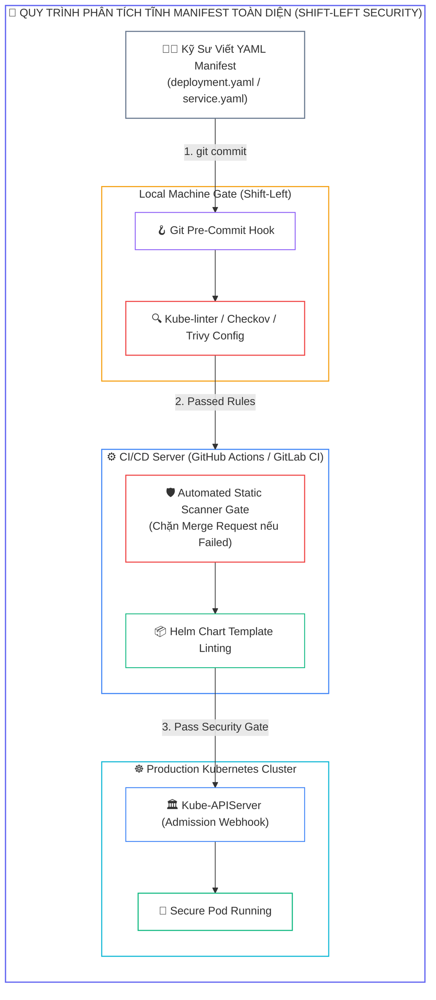
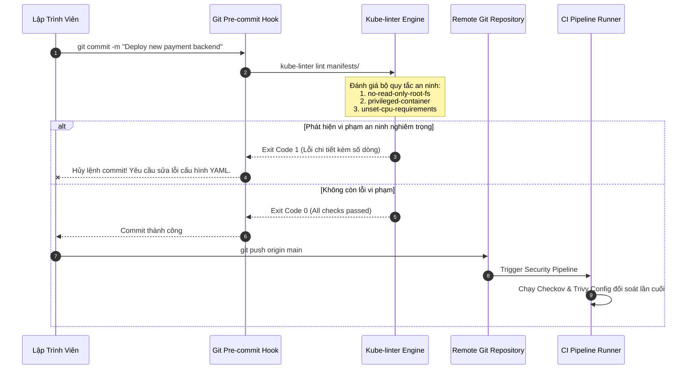
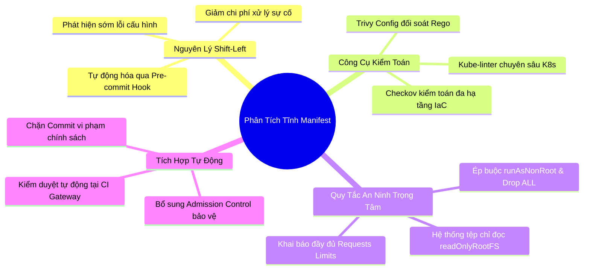


> [!IMPORTANT]
> **Mục tiêu kỹ thuật bài học**:
> - Hiểu rõ triết lý **Shift-Left Security** và lợi ích kinh tế của việc phát hiện lỗi cấu hình Manifest ở giai đoạn sớm.
> - Nắm vững danh mục các lỗi cấu hình sai lầm nghiêm trọng (**Kubernetes Misconfigurations**): chạy privileged, thiếu SecurityContext, thiếu NetworkPolicy, không giới hạn CPU/RAM.
> - Cài đặt, biên soạn tệp cấu hình `.kube-linter.yaml` và thực thi kiểm toán bằng **Kube-linter**.
> - Khai thác **Checkov** để quét toàn diện hạ tầng dạng mã (**IaC - Infrastructure as Code**) theo chuẩn CIS Kubernetes Benchmark.
> - Sử dụng **Trivy Config** để kiểm tra tự động các tệp YAML và Helm Charts trong một câu lệnh duy nhất.
> - Xây dựng **Git Pre-commit Hook** tự động chặn lập trình viên commit mã nguồn vi phạm chính sách an ninh.

---

## 1. Bản Chất Kiến Trúc & Tư Duy Cốt Lõi: Chuyển Dịch Bảo Mật Về Bên Trái (Shift-Left)

Trong mô hình DevSecOps hiện đại, chi phí khắc phục một lỗ hổng an ninh trên môi trường Production đắt gấp hàng chục lần so với việc phát hiện và sửa chữa nó ngay trên máy trạm của lập trình viên. Hầu hết các sự cố rò rỉ dữ liệu hoặc xâm nhập cụm Kubernetes bắt nguồn từ **cấu hình sai (Misconfigurations)** trong tệp khai báo YAML chứ không phải lỗi trong mã nguồn ứng dụng:
1. **Thiếu giới hạn tài nguyên:** Không khai báo `resources.limits` dẫn đến nguy cơ một Pod bị rò rỉ bộ nhớ chiếm dụng toàn bộ tài nguyên Node gây sập cụm (Resource Starvation / DoS).
2. **Quyền hạn vượt mức:** Không khai báo `securityContext.runAsNonRoot: true` hoặc cấp quyền `privileged: true` không cần thiết.
3. **Mất an toàn hệ thống tệp:** Không thiết lập `readOnlyRootFilesystem: true`, cho phép kẻ tấn công tải và thực thi mã độc vào thư mục `/tmp`.

Phân tích tĩnh (**Static Analysis / Linting**) đóng vai trò như một bộ lọc an ninh đầu nguồn (First Line of Defense), tự động quét cấu trúc tệp YAML mà không cần triển khai thực tế lên cụm Kubernetes.



---

## 2. Bảng Ma Trận So Sánh Kỹ Thuật Toàn Diện (Engineering Matrix)

| Tiêu Chí Kỹ Thuật | Kube-linter (Red Hat / StackRox) | Checkov (Bridgecrew / Palo Alto) | Trivy Config (Aqua Security) |
| :--- | :--- | :--- | :--- |
| **Ngôn ngữ phát triển** | Go (Siêu nhẹ, tốc độ cực nhanh) | Python (Hệ sinh thái phong phú) | Go (Công cụ tất-cả-trong-một) |
| **Hỗ trợ định dạng hạ tầng** | Kubernetes Manifests, Helm Charts | K8s YAML, Helm, Terraform, CloudFormation, ARM | K8s YAML, Helm, Terraform, Dockerfile |
| **Bộ quy tắc tích hợp sẵn** | Tập trung sâu vào K8s Best Practices | Hơn 1000+ quy tắc tuân thủ CIS, NIST, PCI-DSS | Tập trung vào Misconfigurations & Secrets |
| **Tùy biến chính sách** | Tệp YAML `.kube-linter.yaml` đơn giản | Viết Policy bằng Python hoặc YAML | Viết Policy tùy biến bằng Rego (OPA) |
| **Tốc độ thực thi** | <span class="badge badge--emerald">Cực nhanh (< 1 giây)</span> | Trung bình (Tốn tài nguyên khởi động Python) | Rất nhanh |
| **Trọng tâm thi CKS** | <span class="badge badge--emerald">Xuất hiện trực tiếp trong bài thi thực hành</span> | <span class="badge badge--emerald">Rất phổ biến trong môi trường thực chiến</span> | Thường gặp trong chuỗi công cụ bảo mật |

---

## 3. Kiến Trúc Môi Trường & Luồng Thực Thi Mẫu

Luồng thực thi kiểm duyệt tự động trong quy trình phát triển:



### So Sánh Manifest Kém An Toàn vs Manifest Chuẩn CKS

#### Manifest Tiềm Ẩn Lỗ Hổng Bảo Mật (`bad-deploy.yaml`):

```yaml
apiVersion: apps/v1
kind: Deployment
metadata:
  name: insecure-app
spec:
  replicas: 1
  selector:
    matchLabels:
      app: insecure-app
  template:
    metadata:
      labels:
        app: insecure-app
    spec:
      containers:
      - name: web
        image: nginx:latest
        securityContext:
          privileged: true
          allowPrivilegeEscalation: true
        # Thiếu resources limits/requests
        # Thiếu readOnlyRootFilesystem
```

#### Manifest An Toàn Tuyệt Đối Đạt Chuẩn CKS (`good-deploy.yaml`):

```yaml
apiVersion: apps/v1
kind: Deployment
metadata:
  name: secure-app
spec:
  replicas: 2
  selector:
    matchLabels:
      app: secure-app
  template:
    metadata:
      labels:
        app: secure-app
    spec:
      securityContext:
        runAsNonRoot: true
        runAsUser: 10001
        runAsGroup: 10001
        seccompProfile:
          type: RuntimeDefault
      containers:
      - name: web
        image: nginx:1.25.4-alpine
        securityContext:
          allowPrivilegeEscalation: false
          readOnlyRootFilesystem: true
          capabilities:
            drop: ["ALL"]
        resources:
          requests:
            cpu: "100m"
            memory: "128Mi"
          limits:
            cpu: "500m"
            memory: "256Mi"
        volumeMounts:
        - mountPath: /tmp
          name: tmp-volume
        - mountPath: /var/cache/nginx
          name: cache-volume
      volumes:
      - name: tmp-volume
        emptyDir: {}
      - name: cache-volume
        emptyDir: {}
```

---

## 4. Phân Tích Cạm Bẫy Thực Chiến: Chẩn Đoán & Xử Lý Sự Cố

### Cạm Bẫy 1: Sự Cố Bật `readOnlyRootFilesystem: true` Khiến Nginx Bị Crash Loop

Khi bật thuộc tính an ninh `readOnlyRootFilesystem: true` để vượt qua bài kiểm tra của Kube-linter, nhiều ứng dụng như Nginx, Node.js hoặc Python sẽ bị lỗi crash liên tục lúc khởi động vì chúng có thói quen ghi các tệp tạm (PID file, log, cache) vào `/var/run` hoặc `/tmp`.

### Hậu Quả & Log Lỗi Thực Tế:

```text
# Log lỗi khi Nginx cố ghi vào filesystem chỉ đọc:
$ kubectl logs deploy/secure-app -c web
nginx: [alert] could not open error log file: open() "/var/log/nginx/error.log" failed (30: Read-only file system)
2026/09/12 11:45:00 [emerg] 1#1: mkdir() "/var/cache/nginx/client_temp" failed (30: Read-only file system)
```

### 5-Whys Root Cause Analysis:
1. **Tại sao Nginx không khởi động được?** Vì tiến trình không thể tạo thư mục `/var/cache/nginx/client_temp`.
2. **Tại sao không tạo được thư mục?** Vì hệ thống tệp gốc của container đang ở chế độ chỉ đọc.
3. **Tại sao lại bật chỉ đọc?** Để tuân thủ chính sách bảo mật chống ghi mã độc của CKS.
4. **Tại sao không thể ghi tệp tạm?** Vì chưa gắn kết ổ đĩa tạm thời cho các đường dẫn yêu cầu ghi.
5. **Biện pháp khắc phục triệt để:** Gắn thêm ổ đĩa `emptyDir: {}` vào các thư mục ghi tạm thời (`/tmp`, `/var/cache/nginx`, `/var/run`).

---

### Cạm Bẫy 2: Bỏ Qua Cảnh Báo "unset-cpu-requirements" Dẫn Đến Quá Tải Cụm

Nhiều đội ngũ cấu hình bỏ qua kiểm tra CPU/Memory trong Kube-linter để dễ triển khai. Hậu quả là khi một Pod bị lỗi rò rỉ bộ nhớ, Linux OOM Killer trên Node sẽ buộc phải tiêu diệt ngẫu nhiên các Pod quan trọng khác trên cùng Node.

### Hậu Quả & Log Lỗi Thực Tế:

```text
# Cảnh báo từ Kube-linter:
$ kube-linter lint manifests/
manifests/deployment.yaml: (object: default/apps/v1, Kind=Deployment: payment) container "app" has no CPU limit specified (check: unset-cpu-requirements, remediation: Set CPU limits for container "app")

# Hậu quả trên Node khi bị cạn kiệt tài nguyên:
$ kubectl describe node worker-node-01
Events:
  Warning  SystemOOM  1m  kubelet  System OOM encountered, killing process 28419 (java)
```

```diff
  containers:
  - name: app
    image: app:v1.0
+   resources:
+     limits:
+       cpu: "500m"
+       memory: "512Mi"
+     requests:
+       cpu: "100m"
+       memory: "128Mi"
```

---

## 5. Hands-on Lab: Cài Đặt Kube-linter, Checkov & Thiết Lập Tự Động Hóa Shift-Left

| Bước | Mục tiêu thực hiện | Lệnh / Thao tác kiểm chứng |
| :--- | :--- | :--- |
| **B1** | Kiểm tra và cài đặt công cụ Kube-linter | `kube-linter version` |
| **B2** | Liệt kê toàn bộ các quy tắc kiểm tra tích hợp trong Kube-linter | `kube-linter checks list` |
| **B3** | Tạo thư mục manifest chứa tệp YAML thử nghiệm có lỗi | `cat << 'EOF' > manifests/bad-pod.yaml` |
| **B4** | Chạy Kube-linter để quét và phân tích các lỗi an ninh | `kube-linter lint manifests/` |
| **B5** | Tạo tệp cấu hình `.kube-linter.yaml` để tinh chỉnh chính sách | Bật kiểm tra bắt buộc và loại trừ các quy tắc không phù hợp |
| **B6** | Sửa đổi tệp manifest để vượt qua 100% các bài kiểm tra | `kube-linter lint manifests/ --config .kube-linter.yaml` (0 lỗi) |
| **B7** | Chạy kiểm tra bổ sung bằng Checkov và Trivy Config | `checkov -f manifests/ --framework kubernetes` |
| **B8** | Thiết lập tệp Git Pre-commit Hook tự động hóa | `chmod +x .git/hooks/pre-commit` |

---

### Bước 1: Kiểm Tra Công Cụ Kube-linter

```bash
kube-linter version
```

---

### Bước 2: Khám Phá Danh Sách Quy Tắc An Ninh

```bash
kube-linter checks list | head -n 30
```
*Các quy tắc cốt lõi cần ghi nhớ trong kỳ thi CKS:*
- `privileged-container`: Phát hiện container chạy cờ privileged.
- `no-read-only-root-fs`: Phát hiện container không bật hệ thống tệp chỉ đọc.
- `run-as-non-root`: Phát hiện container chưa ép buộc chạy non-root.
- `privilege-escalation-container`: Phát hiện cho phép leo thang quyền hạn.
- `unset-cpu-requirements` / `unset-memory-requirements`: Phát hiện thiếu giới hạn tài nguyên.

---

### Bước 3: Tạo Manifest Thử Nghiệm Có Chứa Lỗi An Ninh

```bash
mkdir -p manifests
cat << 'EOF' > manifests/bad-pod.yaml
apiVersion: v1
kind: Pod
metadata:
  name: demo-insecure
spec:
  containers:
  - name: test-container
    image: redis:latest
    securityContext:
      privileged: true
EOF
```

---

### Bước 4: Thực Thi Quét Bằng Kube-linter

```bash
kube-linter lint manifests/bad-pod.yaml
```

*Kết quả đầu ra phát hiện hàng loạt lỗi nghiêm trọng:*
- `Error: container "test-container" is privileged (check: privileged-container)`
- `Error: container "test-container" does not have a read-only root file system (check: no-read-only-root-fs)`
- `Error: container "test-container" does not specify runAsNonRoot: true (check: run-as-non-root)`
- `Error: container "test-container" uses image with tag latest (check: latest-tag)`

---

### Bước 5: Tạo Tệp Cấu Hình Tùy Biến `.kube-linter.yaml`

```yaml
cat << 'EOF' > .kube-linter.yaml
customChecks: []
checks:
  addAllBuiltIn: true
  exclude:
    - "host-ipc"
  include:
    - "privileged-container"
    - "no-read-only-root-fs"
    - "run-as-non-root"
    - "unset-cpu-requirements"
    - "unset-memory-requirements"
EOF
```

---

### Bước 6: Sửa Đổi Manifest Đạt Chuẩn An Ninh Tuyệt Đối

```yaml
cat << 'EOF' > manifests/good-pod.yaml
apiVersion: v1
kind: Pod
metadata:
  name: demo-secure
spec:
  securityContext:
    runAsNonRoot: true
    runAsUser: 10001
    runAsGroup: 10001
    seccompProfile:
      type: RuntimeDefault
  containers:
  - name: test-container
    image: redis:7.2.4-alpine
    securityContext:
      allowPrivilegeEscalation: false
      privileged: false
      readOnlyRootFilesystem: true
      capabilities:
        drop: ["ALL"]
    resources:
      requests:
        cpu: "50m"
        memory: "64Mi"
      limits:
        cpu: "200m"
        memory: "128Mi"
    volumeMounts:
    - mountPath: /data
      name: redis-data
  volumes:
  - name: redis-data
    emptyDir: {}
EOF
```

Kiểm tra lại:

```bash
kube-linter lint manifests/good-pod.yaml --config .kube-linter.yaml
echo "Exit Code: $?"
```
*Kết quả:* Trả về Exit code `0` (Không còn bất kỳ cảnh báo nào).

---

### Bước 7: Quét Kiểm Tra Đối Soát Với Checkov & Trivy Config

```bash
# Quét bằng Trivy Config:
trivy config manifests/good-pod.yaml

# Quét bằng Checkov:
checkov -f manifests/good-pod.yaml --framework kubernetes
```

---

### Bước 8: Thiết Lập Tự Động Hóa Bằng Git Pre-commit Hook

```bash
cat << 'EOF' > .git/hooks/pre-commit
#!/bin/bash
echo "==> Đang kiểm tra an ninh Manifest bằng Kube-linter..."
kube-linter lint manifests/ --config .kube-linter.yaml
if [ $? -ne 0 ]; then
    echo "❌ LỖI AN NINH: Manifest vi phạm chính sách! Hủy commit."
    exit 1
fi
echo "✅ Manifest đạt chuẩn an ninh!"
exit 0
EOF

chmod +x .git/hooks/pre-commit
```

---

## 6. 10 Câu Hỏi Tự Kiểm Tra Chuyên Sâu (Self-Check Q&A Accordion)

<details class="qa-card">
  <summary><b>Câu 1: Triết lý Shift-Left Security trong Kubernetes mang lại lợi ích gì lớn nhất?</b></summary>
  <div class="qa-answer">
    <div>Shift-Left Security giúp <b>phát hiện và khắc phục các lỗ hổng cấu hình ngay từ máy trạm lập trình viên hoặc CI Pipeline</b> trước khi tệp YAML được đẩy vào cụm. Điều này giảm thiểu tối đa chi phí sửa chữa sự cố, loại bỏ rủi ro gián đoạn dịch vụ và ngăn chặn các mối đe dọa tiếp cận môi trường sản xuất.</div>
  </div>
</details>

<details class="qa-card">
  <summary><b>Câu 2: Quy tắc <code>no-read-only-root-fs</code> trong Kube-linter kiểm tra điều gì?</b></summary>
  <div class="qa-answer">
    <div>Quy tắc này kiểm tra xem container đã được bật thuộc tính <b><code>securityContext.readOnlyRootFilesystem: true</code></b> hay chưa. Việc khóa hệ thống tệp chỉ đọc ngăn chặn kẻ tấn công tải mã độc, ghi đè các tệp nhị phân hệ thống hoặc thay đổi tệp cấu hình nếu chiếm được shell của container.</div>
  </div>
</details>

<details class="qa-card">
  <summary><b>Câu 3: Khi nào một container bắt buộc phải khai báo cả <code>limits</code> và <code>requests</code> cho tài nguyên?</b></summary>
  <div class="qa-answer">
    <div>Mọi container trên môi trường Production đều bắt buộc phải khai báo cả hai. <b><code>requests</code></b> giúp Kube-scheduler tìm Node phù hợp có đủ tài nguyên để lập lịch; trong khi <b><code>limits</code></b> ngăn chặn Pod tiêu thụ vượt mức dẫn đến hiện tượng tranh chấp tài nguyên (Resource Contention) và làm sập các Pod lân cận.</div>
  </div>
</details>

<details class="qa-card">
  <summary><b>Câu 4: Sự khác biệt chính giữa Kube-linter và Checkov là gì?</b></summary>
  <div class="qa-answer">
    <div><b>Kube-linter</b> được viết bằng Go, tập trung chuyên sâu vào các thực hành tối ưu đặc thù của Kubernetes với tốc độ siêu nhanh. <b>Checkov</b> là công cụ kiểm toán đa hạ tầng (Infrastructure as Code) hỗ trợ quét toàn diện từ Kubernetes YAML, Helm đến Terraform, CloudFormation với bộ chính sách tuân thủ chuẩn CIS Benchmark phong phú.</div>
  </div>
</details>

<details class="qa-card">
  <summary><b>Câu 5: Tại sao việc sử dụng <code>capabilities: drop: ["ALL"]</code> là một thực hành bảo mật bắt buộc?</b></summary>
  <div class="qa-answer">
    <div>Mặc định container Linux vẫn giữ lại một số Linux Capabilities như <code>CAP_NET_RAW</code>, <code>CAP_CHOWN</code>. Thao tác loại bỏ toàn bộ (<b>Drop ALL</b>) và chỉ thêm lại đúng các quyền tối thiểu thực sự cần thiết giúp triệt tiêu bề mặt tấn công leo thang đặc quyền trong nhân Linux.</div>
  </div>
</details>

<details class="qa-card">
  <summary><b>Câu 6: Làm thế nào để loại trừ một quy tắc kiểm tra cụ thể trong tệp cấu hình <code>.kube-linter.yaml</code>?</b></summary>
  <div class="qa-answer">
    <div>Trong tệp <code>.kube-linter.yaml</code>, thêm tên của quy tắc cần bỏ qua vào danh sách dưới khối <b><code>checks.exclude</code></b> (ví dụ: <code>exclude: ["host-ipc", "latest-tag"]</code>).</div>
  </div>
</details>

<details class="qa-card">
  <summary><b>Câu 7: Điểm khác nhau cơ bản giữa Static Analysis (Phân tích tĩnh) và Admission Webhook là gì?</b></summary>
  <div class="qa-answer">
    <div><b>Static Analysis</b> hoạt động ở phía Client/CI (trước khi gửi tới API Server), kiểm tra mã nguồn tệp tin. <b>Admission Webhook</b> hoạt động ở phía Server (bên trong Kube-APIServer), kiểm duyệt trực tiếp các yêu cầu API thời gian thực trước khi ghi vào etcd. Cả hai phối hợp tạo thành chiến lược phòng thủ chiều sâu.</div>
  </div>
</details>

<details class="qa-card">
  <summary><b>Câu 8: Tại sao không nên cấu hình <code>hostPID: true</code> hoặc <code>hostNetwork: true</code> trong Pod Manifest?</b></summary>
  <div class="qa-answer">
    <div>Việc chia sẻ không gian tên tiến trình (<code>hostPID</code>) hoặc mạng (<code>hostNetwork</code>) với máy chủ vật lý phá vỡ ranh giới cách ly của container, cho phép container nhìn thấy và tương tác với tất cả các tiến trình của Node, tạo điều kiện cho kẻ tấn công thực hiện tấn công thoát container (Container Escape).</div>
  </div>
</details>

<details class="qa-card">
  <summary><b>Câu 9: Cơ chế hoạt động của lệnh <code>trivy config</code> là gì?</b></summary>
  <div class="qa-answer">
    <div><code>trivy config</code> quét các tệp cấu hình YAML/JSON cục bộ và đối soát cấu trúc đó với cơ sở dữ liệu các lỗ hổng cấu hình sai (Defsec Misconfiguration Rules) dựa trên ngôn ngữ Rego, giúp phát hiện sớm các rủi ro mà không cần kết nối tới cụm Kubernetes.</div>
  </div>
</details>

<details class="qa-card">
  <summary><b>Câu 10: Trong kỳ thi CKS, nếu đề bài yêu cầu sửa một Deployment vi phạm bảo mật, những trường nào cần ưu tiên kiểm tra đầu tiên?</b></summary>
  <div class="qa-answer">
    <div>Cần kiểm tra ngay 4 vị trí cốt lõi: (1) <code>spec.template.spec.securityContext</code> (bật <code>runAsNonRoot: true</code>), (2) <code>containers[*].securityContext</code> (tắt <code>privileged</code>, <code>allowPrivilegeEscalation: false</code>, bật <code>readOnlyRootFilesystem: true</code>), (3) <code>containers[*].resources</code> (khai báo limits/requests), và (4) xóa bỏ các volume mount nhạy cảm như <code>/var/run/docker.sock</code> hay <code>/etc/kubernetes</code>.</div>
  </div>
</details>

---

## 7. Tổng Kết & Lộ Trình Bài Học Tiếp Theo



> [!TIP]
> **Bài học tiếp theo:** Khám phá chuyên sâu cơ chế ghi vết và kiểm toán nhật ký vận hành cụm trong bài **[Bài 18] Giám Sát Nhật Ký Kiểm Toán Cụm: Kubernetes Audit Policy, Audit Logging & Phân Tích Sự Cố](cks-18-18-audit-log.html)**.

