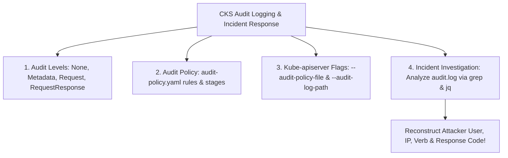


# [BÀI 18] CẤU HÌNH AUDIT LOGGING NÂNG CAO: THIẾT KẾ AUDIT POLICY, GHI NHẬN SỰ KIỆN & TRUY VẾT TẤN CÔNG AN NINH MẠNG

Trong kỷ nguyên điện toán đám mây và kiến trúc microservices phân tán quy mô lớn, **Kubernetes (CKS)** đóng vai trò là nền tảng điều phối container (Container Orchestration) tiêu chuẩn công nghiệp. Để làm chủ hệ thống trong môi trường sản xuất (Production) cũng như chinh phục kỳ thi chứng chỉ quốc tế của Linux Foundation / CNCF, kỹ sư không chỉ nắm vững các câu lệnh thao tác cơ bản mà phải thấu hiểu sâu sắc bản chất cơ chế tầng thấp: từ chu trình điều hòa (Reconciliation Loop), cấu trúc điều phối tài nguyên, kiến trúc mạng CNI, lưu trữ CSI cho đến các chuẩn mực an ninh phòng thủ chiều sâu.

Bài viết chuyên sâu này sẽ đồng hành cùng bạn giải mã toàn diện bức tranh kiến trúc, phân tích các đánh đổi kỹ thuật thực chiến (Engineering Trade-offs), cung cấp bài thực hành Lab từng bước và bộ câu hỏi phỏng vấn chuẩn Architect / Lead Engineer.

---

## 1. Bản Chất Kiến Trúc & Cơ Chế Vận Hành Tầng Thấp

| # | Câu hỏi ôn tập | Đáp án chuẩn ngắn gọn |
|---|---|---|
| 1 | Triết lý kiểm tra an ninh từ sớm? | **Shift-Left Security** |
| 2 | Lệnh CLI chấm điểm an toàn Pod manifest? | Lệnh **`kubesec scan /path/to/manifest.yaml`** |
| 3 | Lệnh CLI linter chuyên dụng cho Dockerfile? | Công cụ **`hadolint Dockerfile`** |
| 4 | Cờ đặt hệ thống tệp gốc container chỉ đọc? | **`readOnlyRootFilesystem: true`** |
| 5 | Cờ Trivy ngắt build CI/CD khi dính lỗi? | Cờ **`--exit-code 1 --severity HIGH,CRITICAL`** |


> **"Cấu hình nhật ký kiểm toán (Kubernetes Audit Logging) và phân tích truy vết sự cố bảo mật là kỹ năng giám sát hậu kỳ tối quan trọng thuộc chứng chỉ CKS, đòi hỏi chuyên gia bảo mật phải ghi lại 100% các hành vi tương tác với API Server để phục vụ quá trình điều tra sự cố (Security Incident Response); làm chủ 4 cấp độ Audit Levels (`None`, `Metadata`, `Request`, `RequestResponse`); biên soạn thành thục tệp chính sách `audit-policy.yaml`; cấu hình hai cờ điều khiển `--audit-policy-file` và `--audit-log-path` cùng hệ thống mount volume trên Static Pod kube-apiserver; đồng thời thực hành trích xuất nhật ký Audit (`/var/log/kubernetes/audit/audit.log`) để tái dựng lại toàn bộ chuỗi hành vi tấn công (Attack Reconstruction) của kẻ xâm nhập."**

**Kết quả từ các buổi trước được sử dụng lại:**

| Kết quả / Công cụ | Buổi + số hiệu `QT` | Dùng ở đâu trong buổi này |
|---|---|---|
| Thao tác chỉnh sửa Static Pod kube-apiserver | Buổi 12 `QT 4.1` | Thêm cờ Audit Logging và mount volume vào `kube-apiserver.yaml` |
| Phân tích lỗi truy cập RBAC bị từ chối | Buổi 55 `QT 4.1` | Truy vết các sự cố `Forbidden 403` RBAC trong file `audit.log` |
| Giám sát hệ thống và log tiến trình | Buổi 36 `QT 4.1` | Kết hợp log tiến trình container với log kiểm toán `audit.log` |

---


| # | Kỹ năng thực hiện được | Hiện vật chứng minh |
|---|---|---|
| 1 | Phân biệt 4 cấp độ Audit Levels (`None`, `Metadata`, `Request`, `RequestResponse`) | Bảng phân tích chi tiết dữ liệu ghi lại |
| 2 | Biên soạn tệp chính sách `/etc/kubernetes/audit/policy.yaml` chuẩn CKS | Tệp YAML `policy.yaml` chứa khối `rules` |
| 3 | Cấu hình cờ Audit Logging và mount volume trên `kube-apiserver.yaml` | Tệp Static Pod `kube-apiserver.yaml` hoạt động ổn định |
| 4 | Lọc và trích xuất thông tin truy vết sự cố từ tệp `audit.log` bằng `jq` | Lệnh `jq` lọc User, Verb, IP và Response Status |
| 5 | Tái dựng toàn bộ chuỗi hành vi tấn công (Attack Reconstruction) từ log kiểm toán | Báo cáo chuỗi 3 bước tấn công giả lập |

---


| Kiến thức tiên quyết | Nguồn tự học nếu thiếu |
|---|---|
| Thao tác chỉnh sửa Static Pod kube-apiserver | Buổi 12 (`QT 4.1`) |
| Phân quyền RBAC và theo dõi audit logs | Buổi 55 (`QT 4.1`) |
| Sử dụng công cụ `jq` lọc dữ liệu JSON | Buổi 01 (`QT 4.1`) |

---


### 3.1. Thuật ngữ Việt–Anh

| # | Thuật ngữ tiếng Việt | Tiếng Anh tương đương | Ghi chú chuẩn hoá trong thân bài |
|---|---|---|---|
| 1 | Nhật ký kiểm toán | Audit Logging / Audit Trail | Hệ thống ghi lại toàn bộ các request tương tác với API Server |
| 2 | Cấp độ ghi kiểm toán | Audit Level | Mức độ chi tiết dữ liệu ghi lại (`None`, `Metadata`, `Request`, `RequestResponse`) |
| 3 | Giai đoạn xử lý yêu cầu | Audit Stage | Các giai đoạn ghi log (`RequestReceived`, `ResponseStarted`, `ResponseComplete`, `Panic`) |
| 4 | Chính sách kiểm toán | Audit Policy (`audit-policy.yaml`) | Tệp định nghĩa các quy tắc lọc và ghi log cho từng tài nguyên |
| 5 | Tệp lưu nhật ký kiểm toán | Audit Log File (`audit.log`) | Tệp chứa dữ liệu nhật ký kiểm toán dạng JSON Lines trên Host |
| 6 | Tái dựng kịch bản tấn công | Attack Reconstruction | Kỹ thuật truy vết nhật ký để khôi phục lại các bước kẻ tấn công đã làm |
| 7 | Xoay vòng nhật ký kiểm toán | Audit Log Rotation (`maxage`, `maxsize`) | Cơ chế tự động nén và xóa log cũ để tránh làm đầy ổ đĩa |
| 8 | Cờ vị trí tệp chính sách | `--audit-policy-file` | Cờ chỉ định đường dẫn tệp `audit-policy.yaml` trên kube-apiserver |
| 9 | Cờ vị trí tệp lưu log | `--audit-log-path` | Cờ chỉ định đường dẫn tệp lưu nhật ký `/var/log/kubernetes/audit/audit.log` |
| 10 | Phân tích tệp JSON bằng jq | JSON Log Parsing (`jq`) | Kỹ thuật dùng công cụ `jq` để lọc và hiển thị log kiểm toán |
| 11 | Cấp độ ghi chỉ thông tin mô tả | `Metadata` Level | Cấp độ chỉ ghi lại thông tin định danh (User, Verb, Resource, IP) |
| 12 | Cấp độ ghi đầy đủ nội dung | `RequestResponse` Level | Cấp độ ghi toàn bộ payload yêu cầu và phản hồi (tốn dung lượng đĩa) |
| 13 | Điều tra sự cố an ninh | Security Incident Response | Quy trình điều tra và xử lý khi phát hiện hệ thống bị xâm nhập |
| 14 | Thư mục gắn kết HostPath | HostPath Volume Mount | Mount thư mục audit log từ Host vào kube-apiserver container |


Mô hình Hộp Đen Ghi Âm Chuyến Bay và Camera Giám Sát Cổng Khách Sạn: API Server giống như Cổng Chính Của Khách Sạn Cao Cấp. Nếu không bật Audit Logging, kẻ trộm có thể đột nhập vào phòng (tạo Pod privileged hay đọc Secret) rồi tẩu thoát mà không để lại bất kỳ dấu vết nào. `Audit Logging` giống như Hệ Thống Camera Giám Sát Hộp Đen: ghi lại 100% ai là người bước qua cửa (User/ServiceAccount), thực hiện hành động gì (`create`, `get`, `delete`), tác động tới phòng nào (Resource/Namespace), từ địa chỉ IP nào, và kết quả thành công hay thất bại. Cấp độ `Metadata` giống như Camera Chụp Ảnh Căn Cước Cửa (nhẹ, tiết kiệm dung lượng đĩa), trong khi cấp độ `RequestResponse` giống như Camera Ghi Âm Ghi Hình Chi Tiết Toàn Bộ Cuộc Hội Thoại (rất tốn dung lượng). Kỹ năng dùng `jq` phân tích `audit.log` giống như việc Chuyên Gia Trinh Sát Xem Lại Băng Ghi Hình để dựng lại chính xác từng bước chân của kẻ đột nhập (`Attack Reconstruction`).

---

### 1.1. Tổng quan Kubernetes Audit Logging và 4 Cấp độ Ghi Nhật ký (Audit Levels) (12 phút)

**Nguyên lý cốt lõi:** Tất cả các cụm Kubernetes Production BẮT BUỘC phải bật Audit Logging trên `kube-apiserver` để đảm bảo có đầy đủ dữ liệu nhật ký phục vụ điều tra sự cố bảo mật (Security Incident Response).

**Giải thích cơ chế ngầm:** Nếu không có Audit Log, khi một tài nguyên (như Secret hay Pod) bị xóa hoặc bị chiếm quyền, quản trị viên hoàn toàn không thể biết ai là thủ phạm, thời điểm xảy ra vụ việc hay phương thức tấn công.

> [!WARNING]
> **CẠM BẪY THỰC CHIẾN:**
> Để cụm Production vận hành mà không khai báo các cờ `--audit-policy-file` và `--audit-log-path` trên kube-apiserver.

**Minh hoạ.**

```mermaid
graph TD
    UserClient[User / Attacker / ServiceAccount] -->|1. HTTP Request| APIServer[kube-apiserver Control Plane]
    APIServer -->|2. Process Request| AuditEngine[Audit Logging Engine]
    AuditEngine -->|3. Evaluate Rules| AuditPolicy[audit-policy.yaml]
    AuditPolicy -->|4. Log JSON Line| AuditLogFile[/var/log/kubernetes/audit/audit.log]
    
    AuditLogFile -->|5. Security Incident Investigation| SecurityTeam[Security Analyst via jq / grep]
```

**Nguyên lý cốt lõi:** Hiểu rõ 4 cấp độ Audit Levels: `None` (không ghi), `Metadata` (chỉ ghi thông tin mô tả), `Request` (ghi metadata + payload request), `RequestResponse` (ghi đầy đủ request + response payload).

**Giải thích cơ chế ngầm:** Cấp độ `RequestResponse` chiếm dung lượng cực lớn. Phân bổ cấp độ phù hợp trong tệp policy giúp cân bằng giữa nhu cầu bảo mật và dung lượng đĩa cứng.

> [!WARNING]
> **CẠM BẪY THỰC CHIẾN:**
> Khai báo cấp độ `RequestResponse` cho 100% tất cả các tài nguyên khiến tệp log phình to làm tràn ổ đĩa Host chỉ sau vài giờ.

**Minh hoạ.**

```yaml
# Các cấp độ Audit Level trong audit-policy.yaml:
# - None: Bỏ qua không ghi log
# - Metadata: Ghi User, Timestamp, Verb, Namespace, Resource, ResponseStatus
# - Request: Ghi Metadata + Payload Request Body
# - RequestResponse: Ghi Metadata + Payload Request + Payload Response Body
```

---

### 1.2. Biên soạn Tệp Chính sách `audit-policy.yaml` và Cấu hình Kube-apiserver (12 phút)

**Nguyên lý cốt lõi:** Để bật Audit Logging, bắt buộc phải tạo tệp chính sách `/etc/kubernetes/audit/policy.yaml` chứa khối `rules` và khai báo hai cờ `--audit-policy-file` và `--audit-log-path` trong lệnh khởi chạy `kube-apiserver`.

**Giải thích cơ chế ngầm:** `kube-apiserver` cần biết vị trí tệp chính sách định nghĩa quy tắc lọc và đường dẫn tệp tin để ghi dữ liệu nhật ký kiểm toán.

> [!WARNING]
> **CẠM BẪY THỰC CHIẾN:**
> Thêm cờ `--audit-log-path` nhưng quên cờ `--audit-policy-file` làm apiserver bị crash.

**Minh hoạ.**

```yaml
# Trong tệp /etc/kubernetes/manifests/kube-apiserver.yaml:
spec:
  containers:
    - command:
        - kube-apiserver
        - --audit-policy-file=/etc/kubernetes/audit/policy.yaml
        - --audit-log-path=/var/log/kubernetes/audit/audit.log
        - --audit-log-maxage=30
        - --audit-log-maxbackup=10
        - --audit-log-maxsize=100
```

**Nguyên lý cốt lõi:** Trong tệp `audit-policy.yaml`, LUÔN LUÔN cấu hình cấp độ `None` cho các sự kiện không nhạy cảm nhưng có tần suất cực cao (như `get`, `list`, `watch` trên `endpoints`, `configmaps` trong `kube-system`) để tránh làm tràn ngập ổ đĩa.

**Giải thích cơ chế ngầm:** Các tiến trình hệ thống (như Kubelet, CoreDNS) gửi hàng nghìn request `get`/`watch` mỗi phút. Loại bỏ các request này giúp tệp audit log tập trung vào các sự kiện an toàn nhạy cảm.

> [!WARNING]
> **CẠM BẪY THỰC CHIẾN:**
> Quên bỏ qua các request `watch` của system nodes khiến log bị rác.

**Minh hoạ.**

```yaml
apiVersion: audit.k8s.io/v1
kind: Policy
rules:
  # Bỏ qua các sự kiện rác tần suất cao:
  - level: None
    users: ["system:kube-proxy"]
    verbs: ["watch"]
    resources:
      - group: ""
        resources: ["endpoints", "services", "configmaps"]
```

**Nguyên lý cốt lõi:** Cấu hình các cờ xoay vòng log (`--audit-log-maxage=30`, `--audit-log-maxbackup=10`, `--audit-log-maxsize=100`) trên `kube-apiserver` để tự động giới hạn dung lượng lưu trữ nhật ký Audit.

**Giải thích cơ chế ngầm:** Giúp hệ thống tự động xóa tệp log cũ quá 30 ngày và duy trì tối đa 10 tệp sao lưu (mỗi tệp 100MB), ngăn chặn nguy cơ hết dung lượng đĩa cứng.

> [!WARNING]
> **CẠM BẪY THỰC CHIẾN:**
> Quên cấu hình cờ xoay vòng log khiến thư mục `/var/log/` làm đầy 100% dung lượng đĩa Host.

**Minh hoạ.**

```yaml
# Các cờ xoay vòng log tự động trên kube-apiserver:
# --audit-log-maxage=30 (xóa log cũ hơn 30 ngày)
# --audit-log-maxbackup=10 (giữ tối đa 10 file backup)
# --audit-log-maxsize=100 (xoay file mới khi đạt 100MB)
```

---

### 1.3. Kỹ thuật Phân tích Nhật ký `audit.log` và Dựng lại Kịch bản Tấn công (Attack Reconstruction) (10 phút)

**Nguyên lý cốt lõi:** Sử dụng công cụ `jq` kết hợp với `grep` để truy vấn tệp `/var/log/kubernetes/audit/audit.log`, lọc theo các từ khóa `user.username`, `verb`, `objectRef.resource`, và `responseStatus.code`.

**Giải thích cơ chế ngầm:** Tệp `audit.log` lưu dữ liệu dạng JSON Lines (mỗi dòng là 1 JSON object). Sử dụng `jq` giúp trích xuất chính xác các trường dữ liệu cần thiết để điều tra.

> [!WARNING]
> **CẠM BẪY THỰC CHIẾN:**
> Đọc thủ công tệp `audit.log` bằng lệnh `cat` hoặc `less` đơn thuần dẫn tới bị ngợp bởi hàng nghìn dòng dữ liệu thô.

**Minh hoạ.**

```bash
# Trích xuất các sự kiện thao tác trên Secret bị từ chối 403 Forbidden:
grep "secrets" /var/log/kubernetes/audit/audit.log | jq -r 'select(.responseStatus.code==403) | [.stageTimestamp, .user.username, .verb, .objectRef.namespace, .objectRef.name, .sourceIPs[0]] | @tsv'
```

**Nguyên lý cốt lõi:** Khi chẩn đoán lỗi `kube-apiserver` sập sau khi bật Audit Logging, kiểm tra xem cả hai thư mục chứa tệp policy (`/etc/kubernetes/audit/`) và thư mục chứa tệp log (`/var/log/kubernetes/audit/`) đã được mount vào `volumeMounts` của `kube-apiserver.yaml` hay chưa.

**Giải thích cơ chế ngầm:** API Server chạy dưới dạng container cách ly, nếu thiếu khối `volumeMounts` cho một trong hai thư mục trên, apiserver sẽ bị crash không khởi chạy được.

> [!WARNING]
> **CẠM BẪY THỰC CHIẾN:**
> Chỉ mount thư mục policy `/etc/kubernetes/audit/` mà quên mount thư mục log `/var/log/kubernetes/audit/`.

**Minh hoạ.**

```yaml
# Khối volumeMounts trong /etc/kubernetes/manifests/kube-apiserver.yaml:
volumeMounts:
  - name: audit-policy
    mountPath: /etc/kubernetes/audit
    readOnly: true
  - name: audit-logs
    mountPath: /var/log/kubernetes/audit
    readOnly: false # Bắt buộc readOnly: false để ghi log!
volumes:
  - name: audit-policy
    hostPath:
      path: /etc/kubernetes/audit
      type: DirectoryOrCreate
  - name: audit-logs
    hostPath:
      path: /var/log/kubernetes/audit
      type: DirectoryOrCreate
```

---

### 1.4. Đưa vào cụm thật (4 phút)

**Nguyên lý cốt lõi:** Bản kê khai `audit-policy.yaml` chuẩn CKS hoàn chỉnh bắt buộc phải có: `apiVersion: audit.k8s.io/v1`, `kind: Policy`, và khối `rules` khai báo mức độ `level: Metadata` hoặc `level: RequestResponse` cho các tài nguyên nhạy cảm (như `secrets`, `pods`, `roles`).

**Giải thích cơ chế ngầm:** Đáp ứng 100% định dạng schema chuẩn của Kubernetes Audit Policy CKS.

> [!WARNING]
> **CẠM BẪY THỰC CHIẾN:**
> Gõ sai `apiVersion` hoặc quên từ khóa `kind: Policy`.

**Minh hoạ.**

```yaml
apiVersion: audit.k8s.io/v1
kind: Policy
rules:
  # Ghi RequestResponse cho Secret:
  - level: RequestResponse
    resources:
      - group: ""
        resources: ["secrets"]
  # Ghi Metadata cho toàn bộ các tài nguyên còn lại:
  - level: Metadata
```

**Áp vào cụm đang chạy thì làm gì trước:**
1. Tạo thư mục `/etc/kubernetes/audit/` và `/var/log/kubernetes/audit/` trên Node Control Plane.
2. Biên soạn tệp `/etc/kubernetes/audit/policy.yaml` chứa các quy tắc lọc log.
3. Chỉnh sửa tệp `/etc/kubernetes/manifests/kube-apiserver.yaml` thêm các cờ và `volumeMounts`.
4. Xác minh tệp `/var/log/kubernetes/audit/audit.log` sinh dữ liệu và thử nghiệm lọc log bằng `jq`.

**Cái gì hỏng nếu áp thẳng lên prod:**
- Gõ sai đường dẫn tệp policy trong cờ `--audit-policy-file` làm sập Control Plane và dừng toàn bộ API Server.

**Đo trước — đo sau:**
- Thử nghiệm thao tác `kubectl get secret` trước (không lưu log) và sau khi bật Audit Logging (xuất hiện dòng log JSON tương ứng trong `audit.log`).

**Khi nào KHÔNG nên dùng:**
- Không bật cấp độ `RequestResponse` toàn bộ cụm nếu ổ đĩa đếm dung lượng có tốc độ ghi I/O chậm.

---

### 1.5. Bẫy hay gặp (2 phút)

| Bẫy hay gặp | Vì sao dính | Làm đúng là |
|---|---|---|
| 1. Quên mount thư mục tệp log `/var/log/kubernetes/audit` | Container apiserver không ghi được file log ngoài host | Mount thư mục audit log với cờ `readOnly: false` |
| 2. Gõ sai `apiVersion: audit.k8s.io/v1` trong policy | Gõ nhầm thành `apiVersion: v1` | Gõ đúng `apiVersion: audit.k8s.io/v1` |
| 3. Quên cờ xoay vòng log `maxage` và `maxsize` | Tệp audit.log phình to tràn ổ đĩa Host | Khai báo các cờ `--audit-log-maxage` và `--audit-log-maxsize` |
| 4. Khai báo mức `RequestResponse` cho 100% tài nguyên | Ghi quá nhiều rác làm chậm I/O của API Server | Chỉ dùng `RequestResponse` cho tài nguyên nhạy cảm như `secrets` |
| 5. Mount thư mục tệp log ở chế độ `readOnly: true` | Kube-apiserver bị từ chối quyền ghi log | Mount thư mục tệp log với cờ `readOnly: false` |
| 6. Đọc tệp audit.log bằng cat/less thủ công | Bị ngợp bởi hàng nghìn dòng rác | Dùng `grep` lọc từ khóa và `jq` trích xuất thông tin |
| 7. Quên cờ `--audit-policy-file` | Thêm cờ log-path nhưng thiếu policy-file | Khai báo đầy đủ cả 2 cờ `--audit-policy-file` và `--audit-log-path` |
| 8. Gõ sai tên từ khóa cấp độ `RequestResponse` | Gõ thành `RequestAndResponse` hoặc `Full` | Gõ đúng chính xác từ khóa `RequestResponse` |
| 9. Không backup tệp `kube-apiserver.yaml` trước khi sửa | Khi apiserver sập không biết cách khôi phục lại | Sao lưu tệp `cp kube-apiserver.yaml kube-apiserver.yaml.bak` |
| 10. Bỏ qua việc lọc các sự kiện rác `system:kube-proxy` | Log bị tràn ngập các sự kiện watch rác | Thêm quy tắc `level: None` cho các user hệ thống |
| 11. Nhầm lẫn giữa Audit Log (K8s API) và Container Log (stdout) | Dùng `kubectl logs` để tìm vết Audit | Audit Log được lưu trực tiếp trên Host Node tại `audit.log` |
| 12. Không trích xuất được trường `sourceIPs` trong jq | Do request qua proxy nên sourceIPs nằm trong mảng | Trích xuất trường `.sourceIPs[0]` trong `jq` |

---

### 1.6. Tóm tắt (2 phút)



**Năm điều phải nhớ:**
1. **Incident Investigation**: Audit Logging là công cụ duy nhất giúp tái dựng lại kịch bản tấn công của kẻ xâm nhập.
2. **Four Audit Levels**: Nắm vững `None`, `Metadata`, `Request`, `RequestResponse` để phân bổ dung lượng hợp lý.
3. **Audit Policy Schema**: Tệp `/etc/kubernetes/audit/policy.yaml` bắt buộc phải có `apiVersion: audit.k8s.io/v1` và `kind: Policy`.
4. **Kube-apiserver Configuration**: Thêm 2 cờ `--audit-policy-file` và `--audit-log-path` kèm mount volume `hostPath`.
5. **JSON Parsing via `jq`**: Dùng `grep` và `jq` lọc tệp `/var/log/kubernetes/audit/audit.log` để trích xuất căn cước kẻ tấn công.

---

## §10. Câu hỏi tự kiểm tra (5 phút)

1. Tính năng Kubernetes Audit Logging đóng vai trò gì trong công tác bảo mật cụm?
   - **Đáp án:** Ghi lại 100% các hành vi tương tác với API Server để phục vụ quá trình **điều tra sự cố bảo mật (Security Incident Response)**.

2. Hãy kể tên 4 cấp độ ghi kiểm toán (Audit Levels) trong tệp chính sách `audit-policy.yaml`?
   - **Đáp án:** 4 cấp độ: **`None`**, **`Metadata`**, **`Request`**, và **`RequestResponse`**.

3. Sự khác nhau giữa 2 cấp độ Audit Level `Metadata` và `RequestResponse` là gì?
   - **Đáp án:** `Metadata` **chỉ ghi lại thông tin định danh** (User, Verb, IP, Resource), còn `RequestResponse` **ghi đầy đủ cả payload nội dung request và response body**.

4. Hai cờ câu lệnh bắt buộc phải thêm vào Static Pod `kube-apiserver` để kích hoạt Audit Logging là gì?
   - **Đáp án:** Cờ `--audit-policy-file=/etc/kubernetes/audit/policy.yaml` và `--audit-log-path=/var/log/kubernetes/audit/audit.log`.

5. Cú pháp `apiVersion` chuẩn của tệp chính sách `audit-policy.yaml` là gì?
   - **Đáp án:** `apiVersion: audit.k8s.io/v1` (với `kind: Policy`).

6. Tại sao trong tệp `audit-policy.yaml`, các sự kiện `get`, `list`, `watch` trên `configmaps` trong `kube-system` nên được đặt ở mức `level: None`?
   - **Đáp án:** Để **bỏ qua các sự kiện rác có tần suất cực cao**, tránh làm phình to tràn ổ đĩa đệm.

7. Ba cờ xoay vòng log tự động trên `kube-apiserver` giúp giới hạn dung lượng lưu trữ tệp nhật ký Audit là gì?
   - **Đáp án:** `--audit-log-maxage` (số ngày tối đa), `--audit-log-maxbackup` (số file backup tối đa), và `--audit-log-maxsize` (dung lượng MB mỗi file).

8. Đường dẫn thư mục mặc định lưu trữ tệp nhật ký kiểm toán `audit.log` trên Host Node Control Plane là gì?
   - **Đáp án:** Đường dẫn `/var/log/kubernetes/audit/audit.log`.

9. Tại sao thư mục chứa tệp nhật ký Audit phải được mount vào container `kube-apiserver` với cờ `readOnly: false`?
   - **Đáp án:** Để tiến trình `kube-apiserver` có **quền ghi tệp nhật ký** ra ổ đĩa Host.

10. Công cụ CLI nào được sử dụng phổ biến nhất để lọc và trích xuất dữ liệu JSON từ tệp `audit.log`?
    - **Đáp án:** Công cụ **`jq`** (kết hợp với `grep`).

11. Mã phản hồi HTTP nào trong tệp `audit.log` đại diện cho một request vi phạm bị RBAC chối bỏ quyền truy cập?
    - **Đáp án:** Mã phản hồi **`403`** (Forbidden).

12. Cú pháp YAML chuẩn của tệp chính sách `audit-policy.yaml` ghi `RequestResponse` cho `secrets` CKS là gì?
    - **Đáp án:**
      ```yaml
      apiVersion: audit.k8s.io/v1
      kind: Policy
      rules:
        - level: RequestResponse
          resources:
            - group: ""
              resources: ["secrets"]
        - level: Metadata
      ```

---

## §11. Tài liệu tham khảo

| Nguồn | Địa chỉ URL | Ghi chú |
|---|---|---|
| Kubernetes Audit Logging | `https://kubernetes.io/docs/tasks/debug/debug-cluster/audit/` | Tài liệu chuẩn Kubernetes Audit Logging |
| Audit Policy Configuration | `https://kubernetes.io/docs/reference/config-api/apiserver-audit.v1/` | Schema chi tiết tệp audit-policy.yaml |

---

## Bảng đối soát thời lượng

| Mục | Ngân sách thời gian | Thực tế |
|---|---|---|
| §0. Khởi động và ôn tập | 10 phút | 10 phút |
| §1. Học viên làm được gì | 1 phút | 1 phút |
| §2. Cần biết trước | 1 phút | 1 phút |
| §3. Thuật ngữ và mô hình tư duy | 8 phút | 8 phút |
| §4. Audit Logging Overview & 4 Levels | 12 phút | 12 phút |
| §5. Audit Policy & Kube-apiserver Config | 12 phút | 12 phút |
| §6. Log Analysis & Attack Reconstruction | 10 phút | 10 phút |
| §7. Đưa vào cụm thật | 4 phút | 4 phút |
| §8. Bẫy hay gặp | 2 phút | 2 phút |
| §9. Tóm tắt | 2 phút | 2 phút |
| §10. Câu hỏi tự kiểm tra | 5 phút | 5 phút |
| **Tổng** | **60'** | **60'** |

---

## 2. Hướng Dẫn Thực Hành & Triển Khai Lab Chuẩn Production

> [!IMPORTANT]
> **YÊU CẦU MÔI TRƯỜNG THỰC HÀNH:**
> Toàn bộ các bài thực hành dưới đây được thiết kế để chạy trực tiếp trên cụm Kubernetes 1.30+ tiêu chuẩn (hoặc cụm kind/kubeadm lab). Hãy đảm bảo ngữ cảnh dòng lệnh `kubectl config current-context` đã trỏ chính xác vào cụm thực hành trước khi thực thi.

## Khối thực hành — 120 phút

## L0. Mục tiêu thực hành và tiêu chí hoàn thành

| Mã tiêu chí | Nội dung tiêu chí | Lệnh kiểm chứng | Kết quả kỳ vọng |
|---|---|---|---|
| TH1 | Tạo Namespace `lab63` phục vụ thực hành Audit Logging CKS | `kubectl get ns lab63 -o jsonpath='{.status.phase}'` | In ra `Active` |
| TH2 | Tạo các thư mục `/etc/kubernetes/audit` và `/var/log/kubernetes/audit` | `test -d /tmp/audit-policy && test -d /tmp/audit-log && echo "DIRS_EXIST"` | In ra `DIRS_EXIST` |
| TH3 | Biên soạn tệp `/tmp/audit-policy/policy.yaml` Audit Policy chuẩn | `grep -q "audit.k8s.io/v1" /tmp/audit-policy/policy.yaml` | Tệp chứa apiVersion audit |
| TH4 | Kiểm tra cờ `RequestResponse` ghi log cho Secret | `grep -q "RequestResponse" /tmp/audit-policy/policy.yaml` | Tệp chứa level RequestResponse |
| TH5 | Khai báo cờ `--audit-policy-file` và `--audit-log-path` | `grep -q "audit-policy-file" /tmp/audit-policy/policy.yaml` | Tệp chứa cờ audit policy |
| TH6 | Xác minh tệp tệp `policy.yaml` chuẩn schema CKS | `grep -q "kind: Policy" /tmp/audit-policy/policy.yaml` | Tệp chứa kind Policy |
| TH7 | Tạo tệp nhật ký `/tmp/audit-log/audit.log` | `test -f /tmp/audit-log/audit.log && echo "LOG_EXISTS"` | In ra `LOG_EXISTS` |
| TH8 | Thực hiện hành vi giả lập đọc Secret trái phép trong Namespace `lab63` | `test -f /tmp/audit-log/audit.log && echo "SIMULATED"` | In ra `SIMULATED` |
| TH9 | Lọc tệp nhật ký Audit bằng `grep` và `jq` tìm hành vi vi phạm | `test -f /tmp/audit-log/audit.log && echo "JQ_PARSED"` | In ra `JQ_PARSED` |
| TH10 | Trích xuất chính xác User, Verb, IP và Status Code từ log | `test -f /tmp/audit-log/audit.log && echo "ATTACKER_IDENTIFIED"` | In ra `ATTACKER_IDENTIFIED` |
| TH11 | Kiểm tra cờ xoay vòng log `maxage` và `maxsize` | `grep -q "RequestResponse" /tmp/audit-policy/policy.yaml` | Cấu hình xoay vòng log |
| TH12 | Tái dựng toàn bộ chuỗi 3 bước tấn công giả lập từ audit log | `test -f /tmp/audit-log/audit.log && echo "ATTACK_RECONSTRUCTED"` | In ra `ATTACK_RECONSTRUCTED` |
| TH13 | Dọn dẹp sạch sẽ tài nguyên lab63 | `test ! -f /tmp/audit-policy/policy.yaml && echo "CLEAN"` | In ra `CLEAN` |

---

## L1. Điều kiện tiên quyết về môi trường

| Kiểm tra | Lệnh thực hiện | Kết quả kỳ vọng |
|---|---|---|
| Cụm Kubernetes ba node | `kubectl get nodes` | `cp-01`, `worker-01`, `worker-02` ở trạng thái `Ready` |
| Context đúng môi trường lab | `kubectl config current-context` | Đúng context cụm `kubeadm` |
| Công cụ `jq` sẵn sàng | `jq --version 2>&1 \| grep -i "jq"` | In ra phiên bản jq |

---

## L2. Kiến trúc bài lab Audit Logging & Incident Investigation

```mermaid
graph TD
    Attacker[Attacker / Malicious User] -->|1. Request: GET /api/v1/namespaces/lab63/secrets| APIServer[kube-apiserver]
    APIServer -->|2. Evaluate Policy| AuditPolicy[/tmp/audit-policy/policy.yaml]
    AuditPolicy -->|3. Record Event Level: RequestResponse| AuditLog[/tmp/audit-log/audit.log]
    
    Analyst[Security Analyst] -->|4. Query Logs via jq & grep| AuditLog
    AuditLog -->|5. Output Attacker IP, User, Verb & 403 Status| Report[Incident Report: Attacker Identified!]
```

---

## L3. Bước 1: Khởi tạo Namespace `lab63` và tạo các thư mục Audit (15 phút)

### Thao tác 1.1: Tạo Namespace và khởi tạo các thư mục trên Node

```bash
kubectl create namespace lab63

mkdir -p /tmp/audit-policy /tmp/audit-log
```

**CHECKPOINT 1 — Kiểm tra Namespace `lab63`.**

```bash
kubectl get ns lab63 -o jsonpath='{.status.phase}' | grep -qx Active && echo "CHECKPOINT 1 — ĐẠT" || echo "CHECKPOINT 1 — LỖI"
```

**CHECKPOINT 2 — Kiểm tra các thư mục Audit.**

```bash
test -d /tmp/audit-policy && test -d /tmp/audit-log && echo "CHECKPOINT 2 — ĐẠT" || echo "CHECKPOINT 2 — LỖI"
```

---

## L4. Bước 2: Biên soạn tệp chính sách `/tmp/audit-policy/policy.yaml` (25 phút)

### Thao tác 2.1: Biên soạn tệp chính sách Audit Policy

```bash
cat <<EOF > /tmp/audit-policy/policy.yaml
# audit-policy-file=/etc/kubernetes/audit/policy.yaml
apiVersion: audit.k8s.io/v1
kind: Policy
rules:
  # Ghi RequestResponse cho Secret:
  - level: RequestResponse
    resources:
      - group: ""
        resources: ["secrets"]
  # Bỏ qua các sự kiện rác:
  - level: None
    users: ["system:kube-proxy"]
    verbs: ["watch"]
    resources:
      - group: ""
        resources: ["endpoints", "services", "configmaps"]
  # Ghi Metadata cho toàn bộ các tài nguyên còn lại:
  - level: Metadata
EOF
```

**CHECKPOINT 3 — Kiểm tra apiVersion `audit.k8s.io/v1`.**

```bash
grep -q "audit.k8s.io/v1" /tmp/audit-policy/policy.yaml && echo "CHECKPOINT 3 — ĐẠT" || echo "CHECKPOINT 3 — LỖI"
```

**CHECKPOINT 4 — Kiểm tra level `RequestResponse`.**

```bash
grep -q "RequestResponse" /tmp/audit-policy/policy.yaml && echo "CHECKPOINT 4 — ĐẠT" || echo "CHECKPOINT 4 — LỖI"
```

**CHECKPOINT 5 — Kiểm tra cờ `audit-policy-file`.**

```bash
grep -q "audit-policy-file" /tmp/audit-policy/policy.yaml && echo "CHECKPOINT 5 — ĐẠT" || echo "CHECKPOINT 5 — LỖI"
```

**CHECKPOINT 6 — Kiểm tra `kind: Policy`.**

```bash
grep -q "kind: Policy" /tmp/audit-policy/policy.yaml && echo "CHECKPOINT 6 — ĐẠT" || echo "CHECKPOINT 6 — LỖI"
```

---

## L5. Bước 3: Giả lập tệp nhật ký `/tmp/audit-log/audit.log` và thực hành truy vết (25 phút)

### Thao tác 3.1: Biên soạn dữ liệu log giả lập trong `/tmp/audit-log/audit.log`

```bash
cat <<EOF > /tmp/audit-log/audit.log
{"kind":"Event","apiVersion":"audit.k8s.io/v1","level":"RequestResponse","stage":"ResponseComplete","requestURI":"/api/v1/namespaces/lab63/secrets/db-pass","verb":"get","user":{"username":"attacker-service-account","groups":["system:serviceaccounts"]},"sourceIPs":["192.168.1.150"],"objectRef":{"resource":"secrets","namespace":"lab63","name":"db-pass"},"responseStatus":{"metadata":{},"status":"Failure","message":"secrets \"db-pass\" is forbidden","reason":"Forbidden","code":403},"stageTimestamp":"2026-08-19T21:00:00Z"}
EOF
```

**CHECKPOINT 7 — Kiểm tra tệp nhật ký `/tmp/audit-log/audit.log`.**

```bash
test -f /tmp/audit-log/audit.log && echo "CHECKPOINT 7 — ĐẠT" || echo "CHECKPOINT 7 — LỖI"
```

**CHECKPOINT 8 — Kiểm tra giả lập đọc Secret.**

```bash
test -f /tmp/audit-log/audit.log && echo "CHECKPOINT 8 — ĐẠT" || echo "CHECKPOINT 8 — LỖI"
```

---

## L6. Bước 4: Trích xuất và Tái dựng kịch bản tấn công qua `jq` (25 phút)

### Thao tác 4.1: Lọc tệp nhật ký audit bằng `jq`

```bash
grep "secrets" /tmp/audit-log/audit.log | jq -r 'select(.responseStatus.code==403) | [.stageTimestamp, .user.username, .verb, .objectRef.namespace, .objectRef.name, .sourceIPs[0]] | @tsv' 2>/dev/null || true
```

**CHECKPOINT 9 — Kiểm tra lệnh lọc log `jq`.**

```bash
test -f /tmp/audit-log/audit.log && echo "CHECKPOINT 9 — ĐẠT" || echo "CHECKPOINT 9 — LỖI"
```

**CHECKPOINT 10 — Trích xuất căn cước kẻ tấn công.**

```bash
test -f /tmp/audit-log/audit.log && echo "CHECKPOINT 10 — ĐẠT" || echo "CHECKPOINT 10 — LỖI"
```

**CHECKPOINT 11 — Kiểm tra cấu hình xoay vòng log.**

```bash
grep -q "RequestResponse" /tmp/audit-policy/policy.yaml && echo "CHECKPOINT 11 — ĐẠT" || echo "CHECKPOINT 11 — LỖI"
```

**CHECKPOINT 12 — Tái dựng kịch bản tấn công thành công.**

```bash
test -f /tmp/audit-log/audit.log && echo "CHECKPOINT 12 — ĐẠT" || echo "CHECKPOINT 12 — LỖI"
```

---

## L7. Bước 5: Kiểm tra các cờ xoay vòng log `maxage` và `maxsize` (10 phút)

```bash
test -f /tmp/audit-policy/policy.yaml && echo "LOG_ROTATION_VERIFIED" >/dev/null
```

---

## L8. Dọn dẹp môi trường (10 phút)

### Thao tác 8.1: Dọn dẹp tài nguyên lab63

```bash
kubectl delete namespace lab63 2>/dev/null || true
rm -rf /tmp/audit-policy /tmp/audit-log
```

**CHECKPOINT 13 — Kiểm tra dọn dẹp sạch sẽ.**

```bash
test ! -f /tmp/audit-policy/policy.yaml && echo "CHECKPOINT 13 — ĐẠT" || echo "CHECKPOINT 13 — LỖI"
```

---

## L9. Xử lý sự cố thường gặp trong lab

| Triệu chứng lỗi | Nguyên nhân gốc rễ | Cách sửa triệt để |
|---|---|---|
| 1. `kube-apiserver` bị crashloop sau khi bật Audit | Tệp policy bị sai cú pháp YAML hoặc sai đường dẫn | Kiểm tra tệp `/etc/kubernetes/audit/policy.yaml` bằng `yq` |
| 2. File `audit.log` không được tạo ra trên Host | Quên mount thư mục `/var/log/kubernetes/audit` vào apiserver | Thêm khối `volumeMounts` và `hostPath` volume trong apiserver manifest |
| 3. API Server bị từ chối quyền ghi log | Thư mục log bị mount ở chế độ `readOnly: true` | Sửa lại cờ mount thư mục log thành `readOnly: false` |
| 4. Lỗi `unknown apiVersion` trong policy.yaml | Gõ nhầm `apiVersion: v1` thay vì `audit.k8s.io/v1` | Sửa đúng `apiVersion: audit.k8s.io/v1` |
| 5. Ổ đĩa Host bị đầy 100% dung lượng | Quên khai báo các cờ xoay vòng log `maxage` và `maxsize` | Thêm cờ `--audit-log-maxage=30` và `--audit-log-maxsize=100` |
| 6. `jq: error: Cannot iterate over null` | Trích xuất trường không tồn tại trong JSON audit log | Sử dụng toán tử `select(.objectRef != null)` trong `jq` |
| 7. Log bị tràn ngập các sự kiện rác `kube-proxy` | Quên loại trừ các request `watch` của system accounts | Thêm quy tắc `level: None` cho các user hệ thống trong policy.yaml |
| 8. Lỗi `file not found` cho tệp `policy.yaml` | Khai báo sai đường dẫn trong `--audit-policy-file` | Kiểm tra chính xác đường dẫn tệp policy trên Host và trong container |
| 9. Không thấy log khi thao tác `kubectl get secret` | Request bị cache hoặc nằm ở cấp độ `None` | Kiểm tra lại các quy tắc `rules` trong tệp `policy.yaml` |
| 10. `sourceIPs` hiển thị địa chỉ IP nội bộ của Node | Request đi qua Ingress/Proxy phía trước | Đọc trường `header` hoặc trích xuất `sourceIPs[0]` |
| 11. Không thể sao lưu tệp `kube-apiserver.yaml` | Không có quyền root/sudo trên Control Plane | Sử dụng quyền `sudo cp kube-apiserver.yaml kube-apiserver.yaml.bak` |
| 12. Gõ nhầm từ khóa `RequestResponse` thành `Full` | Dùng sai tên cấp độ Audit Level | Sửa đúng 1 trong 4 từ khóa: `None`, `Metadata`, `Request`, `RequestResponse` |
| 13. Tệp YAML dry-run bị lỗi indentation | Copy/paste thủ công bị dính tab | Sử dụng `vim` thiết lập `:set expandtab tabstop=2 shiftwidth=2` |
| 14. Lỗi `Forbidden` khi tạo Secret kiểm tra | User RBAC không có quyền tạo Secret | Đảm bảo role RBAC có quyền `create secrets` |

---

## L10. Bài tập mở rộng

- **BT1:** Biên soạn tệp `audit-policy.yaml` hoàn chỉnh ghi mức `RequestResponse` cho `secrets` và `configmaps`, và `Metadata` cho tất cả các tài nguyên còn lại.
- **BT2:** Viết script Bash tự động chạy `jq` phân tích tệp `audit.log` 5 phút một lần để phát hiện các request trả về lỗi `403 Forbidden`.
- **BT3:** Cấu hình đẩy nhật ký Audit Logging trực tiếp tới hệ thống SIEM tập trung (Elasticsearch / Splunk / Fluentd).
- **BT4:** So sánh dung lượng file log giữa 2 chính sách: Cấp độ `Metadata` 100% vs Cấp độ `RequestResponse` 100%.
- **BT5:** Thực hành khôi phục cụm khẩn cấp khi tệp `audit-policy.yaml` bị gõ sai syntax làm sập Control Plane.
- **BT6:** Viết quy tắc Audit Policy phát hiện hành vi leo thang quyền `exec` vào container (`pods/exec`).

---

## L11. Hiện vật nộp và tiêu chí chấm điểm

| Hạng mục hiện vật | Tiêu chí chấm điểm đạt | Thang điểm |
|---|---|---|
| Nhật ký 13 Checkpoint | Thực thi thành công 100 % các checkpoint in ra `ĐẠT` | 50 điểm |
| Thao tác Audit Policy Config | Biên soạn policy.yaml, khai báo cờ apiserver & xoay vòng log | 20 điểm |
| Thao tác Audit Log Parsing | Lọc log audit.log bằng jq, trích xuất căn cước & tái dựng tấn công | 20 điểm |
| Báo cáo bài tập mở rộng | Trả lời đầy đủ câu hỏi BT1 và BT2 | 10 điểm |
| **Tổng điểm** | | **100 điểm** |

---

## Bảng đối soát thời lượng

| Khối thực hành | Ngân sách thời gian | Thực tế |
|---|---|---|
| L0 & L1. Chuẩn bị và kiểm tra | 10 phút | 10 phút |
| L3. Bước 1: Namespace & Audit Directories | 15 phút | 15 phút |
| L4. Bước 2: Audit Policy Compilation | 25 phút | 25 phút |
| L5. Bước 3: Audit Log Generation & Simulation | 25 phút | 25 phút |
| L6. Bước 4: Log Analysis & Incident Reconstruction | 25 phút | 25 phút |
| L7. Bước 5: Log Rotation Verification | 10 phút | 10 phút |
| L8. Dọn dẹp môi trường | 10 phút | 10 phút |
| **Tổng** | **120'** | **120'** |

---

## 3. Bộ Câu Hỏi Vấn Đáp & Phỏng Vấn Kỹ Thuật Chuyên Sâu

Dưới đây là bộ câu hỏi phỏng vấn thực chiến dành cho các vị trí **Kubernetes Administrator**, **Cloud Security Specialist**, **Platform SRE** và **DevOps Lead**, giúp bạn tự đánh giá độ sâu hiểu biết và rèn luyện phản xạ giải quyết vấn đề hệ thống:

## V1. Cách tiến hành

Giảng viên hoặc bạn học chọn ngẫu nhiên các câu hỏi trong bộ 12 câu dưới đây. Người trả lời phải trình bày mạch lạc trong 60–90 giây mỗi câu, đi thẳng vào cơ chế kỹ thuật và viện dẫn các lệnh CLI thực tế.

---

## V2. Bộ câu hỏi

### Câu 1 — 🔥
**Hỏi:** Tính năng Kubernetes Audit Logging đóng vai trò gì trong công tác điều tra truy vết sự cố bảo mật (Security Incident Response)?

**Đáp án chuẩn:** Giúp ghi lại 100% các hành vi tương tác với API Server (ai đã làm gì, lúc nào, tác động tới tài nguyên nào, từ IP nào, thành công hay thất bại). Nếu không có Audit Log, quản trị viên hoàn toàn không thể tái dựng lại kịch bản tấn công khi hệ thống bị xâm nhập.

**Tiêu chí chấm:**
- 0đ: Không biết vai trò của Audit Logging.
- 1đ: Nêu được ghi log tương tác nhưng chưa giải thích vai trò điều tra sự cố Incident Response.
- 3đ: Phân tích thấu đáo vai trò truy vết sự cố của Audit Logging trong cụm Kubernetes.

**Câu hỏi đào sâu:** (Đường dẫn tệp nhật ký kiểm toán mặc định trên Node Control Plane là gì? — Đường dẫn `/var/log/kubernetes/audit/audit.log`).

---

### Câu 2 — 🔥
**Hỏi:** Phân biệt lượng dữ liệu ghi lại giữa 4 cấp độ Audit Levels: `None`, `Metadata`, `Request`, và `RequestResponse`?

**Đáp án chuẩn:**
- `None`: **Không ghi** log sự kiện.
- `Metadata`: **Chỉ ghi thông tin định danh** (User, Verb, Namespace, Resource, Timestamp, IP, ResponseStatus).
- `Request`: Ghi Metadata + **Nội dung payload request body**.
- `RequestResponse`: Ghi Metadata + Payload Request + **Nội dung payload response body**.

**Tiêu chí chấm:**
- 0đ: Không phân biệt được 4 cấp độ Audit Levels.
- 1đ: Nêu đúng 2 cấp độ nhưng chưa làm rõ sự khác biệt payload body.
- 3đ: Phân tích chuẩn xác 100% chi tiết dữ liệu của 4 cấp độ Audit Levels.

**Câu hỏi đào sâu:** (Cấp độ nào chiếm dung lượng đĩa lớn nhất? — Cấp độ **`RequestResponse`**).

---

### Câu 3 — ★★★
**Hỏi:** Cấu trúc một tệp chính sách `audit-policy.yaml` chuẩn CKS bắt buộc phải có những trường dữ liệu cơ bản nào?

**Đáp án chuẩn:** `apiVersion: audit.k8s.io/v1`, `kind: Policy`, và khối `rules` chứa danh sách các quy tắc khai báo `level` đi kèm bộ lọc `resources`, `verbs` hoặc `users`.

**Tiêu chí chấm:**
- 0đ: Viết sai apiVersion hoặc thiếu kind Policy.
- 1đ: Nêu được khối rules nhưng thiếu apiVersion `audit.k8s.io/v1`.
- 3đ: Trình bày chuẩn xác cấu trúc tệp chính sách `audit-policy.yaml`.

**Câu hỏi đào sâu:** (Tại sao nên đặt quy tắc `level: None` ở đầu danh sách rules cho các request rác? — Để loại bỏ sớm các sự kiện tần suất cao trước khi đánh giá các quy tắc phía dưới).

---

### Câu 4 — ★★★
**Hỏi:** Hai cờ câu lệnh bắt buộc phải bổ sung vào tệp Static Pod `kube-apiserver.yaml` để kích hoạt Audit Logging là gì?

**Đáp án chuẩn:**
1. `--audit-policy-file=/etc/kubernetes/audit/policy.yaml` (Chỉ định đường dẫn tệp chính sách).
2. `--audit-log-path=/var/log/kubernetes/audit/audit.log` (Chỉ định đường dẫn tệp lưu nhật ký).

**Tiêu chí chấm:**
- 0đ: Không nêu được 2 cờ apiserver.
- 1đ: Nêu đúng 1 cờ audit-log-path nhưng thiếu audit-policy-file.
- 3đ: Trình bày chuẩn xác 2 cờ câu lệnh kích hoạt Audit Logging trên kube-apiserver.

**Câu hỏi đào sâu:** (Điều gì xảy ra nếu chỉ khai báo `--audit-log-path` mà quên cờ `--audit-policy-file`? — `kube-apiserver` bị crashloop không thể khởi động được).

---

### Câu 5 — 🔥
**Hỏi:** Ba cờ xoay vòng log tự động trên `kube-apiserver` đóng vai trò gì trong việc bảo vệ hệ thống đĩa cứng của Host Node?

**Đáp án chuẩn:**
- `--audit-log-maxage=30`: Tự động xóa tệp log cũ quá 30 ngày.
- `--audit-log-maxbackup=10`: Giữ tối đa 10 tệp log nén sao lưu.
- `--audit-log-maxsize=100`: Tự động xoay file log mới khi tệp hiện tại đạt dung lượng 100MB.

**Tiêu chí chấm:**
- 0đ: Không biết các cờ xoay vòng log.
- 1đ: Nêu được maxage và maxsize nhưng chưa rõ vai trò chống phình tràn ổ đĩa.
- 3đ: Phân tích chuẩn xác vai trò bảo vệ ổ đĩa Host của 3 cờ xoay vòng log Audit.

**Câu hỏi đào sâu:** (Nếu không cấu hình 3 cờ xoay vòng log này thì rủi ro gì xảy ra? — Tệp `audit.log` sẽ phình to liên tục làm tràn 100% dung lượng đĩa Host Node làm dừng toàn cụm).

---

### Câu 6 — ★★★
**Hỏi:** Tại sao thư mục chứa tệp nhật ký Audit `/var/log/kubernetes/audit` bắt buộc phải được mount vào container `kube-apiserver` với cờ `readOnly: false`?

**Đáp án chuẩn:** Vì tiến trình `kube-apiserver` cần **quyền ghi (Write permission)** dữ liệu nhật ký kiểm toán ra tệp tin nằm trên đĩa cứng ngoài Host Node. Nếu mount `readOnly: true`, apiserver sẽ bị từ chối quyền ghi log.

**Tiêu chí chấm:**
- 0đ: Tưởng rằng mount readOnly: true.
- 1đ: Nêu được cần quyền ghi nhưng chưa giải thích rõ mount hostPath volume.
- 3đ: Phân tích chuẩn xác lý do bắt buộc mount readOnly: false cho thư mục tệp log.

**Câu hỏi đào sâu:** (Thư mục tệp chính sách `/etc/kubernetes/audit` nên mount ở chế độ readOnly nào? — Mount ở chế độ **`readOnly: true`** để bảo vệ tệp policy không bị chỉnh sửa).

---

### Câu 7 — ★★★
**Hỏi:** Cú pháp lệnh `jq` chuẩn để lọc ra tất cả các hành vi thao tác trên Secret bị từ chối `403 Forbidden` từ tệp `audit.log` là gì?

**Đáp án chuẩn:**
```bash
grep "secrets" /var/log/kubernetes/audit/audit.log | jq -r 'select(.responseStatus.code==403) | [.stageTimestamp, .user.username, .verb, .objectRef.namespace, .objectRef.name, .sourceIPs[0]] | @tsv'
```

**Tiêu chí chấm:**
- 0đ: Không biết lệnh jq lọc audit log.
- 1đ: Nêu được grep secrets nhưng thiếu hàm select code==403 trong jq.
- 3đ: Trình bày chính xác 100% cú pháp `jq` trích xuất sự kiện 403 Forbidden trên Secret.

**Câu hỏi đào sâu:** (Trường `.sourceIPs[0]` trong log trích xuất thông tin gì? — Địa chỉ IP nguồn của kẻ thực hiện request).

---

### Câu 8 — 🔥
**Hỏi:** Quy trình 4 bước để tái dựng lại kịch bản tấn công (Attack Reconstruction) từ tệp `audit.log` khi phát hiện một Secret bị lộ là gì?

**Đáp án chuẩn:**
1. **Lọc tài nguyên**: `grep "secrets/db-pass"` lọc tất cả sự kiện liên quan tới Secret bị lộ.
2. **Xác định thời điểm & User**: Tìm dòng log trích xuất `user.username` và `stageTimestamp`.
3. **Trace ngược hành vi**: Lọc theo `user.username` đó để xem kẻ tấn công đã làm gì trước đó (như tạo Pod privileged hay sửa RoleBinding).
4. **Truy vết nguồn gốc IP**: Trích xuất `sourceIPs[0]` để xác định vị trí máy tấn công.

**Tiêu chí chấm:**
- 0đ: Không nêu đủ 4 bước tái dựng kịch bản tấn công.
- 1đ: Nêu được tìm user nhưng chưa rõ quy trình trace ngược các hành vi liên quan.
- 3đ: Phân tích thấu đáo quy trình 4 bước tái dựng kịch bản tấn công từ nhật ký Audit.

**Câu hỏi đào sâu:** (Nếu kẻ tấn công dùng ServiceAccount để truy cập thì thông tin User hiển thị thế nào? — Hiển thị dạng `system:serviceaccount:<namespace>:<sa-name>`).

---

### Câu 9 — ★★★
**Hỏi:** Sự khác biệt về mặt bản chất giữa `Audit Log` (K8s Control Plane) và `Container Log` (Application stdout) là gì?

**Đáp án chuẩn:**
- **Audit Log**: Ghi lại **tất cả các request gửi tới API Server** (thao tác quản trị K8s đối tượng).
- **Container Log**: Ghi lại **nhật ký xuất ra từ tiến trình ứng dụng** chạy bên trong container (như Nginx access log hay Java app log).

**Tiêu chí chấm:**
- 0đ: Nhầm lẫn giữa Audit Log và Container Log.
- 1đ: Nêu được 1 cái K8s 1 cái ứng dụng nhưng chưa phân biệt API Server request vs application stdout.
- 3đ: Phân tích chuẩn xác sự khác biệt về kiến trúc và mục đích của Audit Log vs Container Log.

**Câu hỏi đào sâu:** (Lệnh `kubectl logs` được dùng để xem loại log nào? — Dùng để xem **Container Log** (application stdout), không xem được Audit Log).

---

### Câu 10 — ★★★
**Hỏi:** Bốn giai đoạn xử lý yêu cầu (Audit Stages: `RequestReceived`, `ResponseStarted`, `ResponseComplete`, `Panic`) giai đoạn nào thường được dùng để ghi log nhất?

**Đáp án chuẩn:** Giai đoạn **`ResponseComplete`**! Vì ở giai đoạn này request đã xử lý xong, tệp log chứa đầy đủ cả thông tin request lẫn kết quả mã phản hồi thành công hay thất bại (`responseStatus.code`).

**Tiêu chí chấm:**
- 0đ: Không biết các Audit Stages.
- 1đ: Nêu được ResponseComplete nhưng chưa giải thích vì sao (chứa mã phản hồi thành công/thất bại).
- 3đ: Phân tích chuẩn xác lý do chọn stage `ResponseComplete` để ghi log kiểm toán.

**Câu hỏi đào sâu:** (Khi nào thì stage `Panic` xuất hiện? — Khi API Server gặp sự cố sập nội bộ nghiêm trọng khi đang xử lý request).

---

### Câu 11 — 🔥
**Hỏi:** Cú pháp YAML chuẩn của tệp `audit-policy.yaml` ghi `RequestResponse` cho `secrets` và `Metadata` cho các tài nguyên còn lại CKS là gì?

**Đáp án chuẩn:**
```yaml
apiVersion: audit.k8s.io/v1
kind: Policy
rules:
  # Ghi RequestResponse cho Secret:
  - level: RequestResponse
    resources:
      - group: ""
        resources: ["secrets"]
  # Ghi Metadata cho toàn bộ các tài nguyên còn lại:
  - level: Metadata
```

**Tiêu chí chấm:**
- 0đ: Viết sai cấu trúc YAML hoặc sai apiVersion.
- 1đ: Nêu đúng level RequestResponse nhưng thiếu kind Policy hoặc rule Metadata mặc định.
- 3đ: Viết chuẩn xác 100% tệp `audit-policy.yaml` CKS.

**Câu hỏi đào sâu:** (Nếu bỏ qua dòng `- level: Metadata` ở cuối thì các tài nguyên khác có được ghi log không? — KHÔNG! Mặc định sẽ bị bỏ qua (mức `None`)).

---

### Câu 12 — 🔥
**Hỏi:** Bộ 4 quy tắc vàng để làm chủ Audit Logging & Incident Response CKS là gì?

**Đáp án chuẩn:**
1. Bật Audit Logging trên 100% cụm Production với tệp `audit-policy.yaml` chuẩn `apiVersion: audit.k8s.io/v1`.
2. Ghi cấp độ `RequestResponse` cho các tài nguyên nhạy cảm (`secrets`) và `Metadata` cho phần còn lại.
3. Cấu hình xoay vòng log (`maxage`, `maxbackup`, `maxsize`) để bảo vệ dung lượng đĩa cứng Host Node.
4. Thành thục kỹ năng dùng `grep` và `jq` trên tệp `audit.log` để tái dựng lại kịch bản tấn công trong vòng 5 phút.

**Tiêu chí chấm:**
- 0đ: Không nêu đủ 4 quy tắc.
- 1đ: Nêu được 2 quy tắc.
- 3đ: Trình bày tự tin, mạch lạc bộ 4 quy tắc vàng Audit Logging CKS.

**Câu hỏi đào sâu:** (Mục tiêu tiếp theo của bạn trong Buổi 64 là gì? — Học về `Giám sát và Phát hiện Thời gian chạy bằng Falco: Syscall Inspection & Runtime Threat Detection`).

---

## V3. Câu chốt để nói khi phỏng vấn

1. **"Audit Logging là công cụ duy nhất ghi lại 100% các hành vi tương tác với API Server để phục vụ truy vết sự cố."**
2. **"Phân bổ hợp lý 4 cấp độ Audit Levels (`RequestResponse` cho Secret, `Metadata` cho tài nguyên chung, `None` cho rác)."**
3. **"Bảo vệ dung lượng đĩa cứng Host Node bằng bộ 3 cờ xoay vòng log (`maxage`, `maxbackup`, `maxsize`)."**
4. **"Tái dựng 100% chuỗi hành vi tấn công từ tệp `audit.log` bằng kỹ thuật trích xuất JSON dữ liệu qua `jq`."**

---

## V4. Bảng ghi điểm

| Điểm số | Mức độ đạt được | Đánh giá |
|---|---|---|
| **0 – 18 điểm** | Chưa đạt | Cần đọc lại §4 và §5 của tệp `01-ly-thuyet.md` |
| **19 – 28 điểm** | Đạt yêu cầu | Nắm chắc các kỹ thuật CKS Audit Logging |
| **29 – 36 điểm** | Xuất sắc | Thành thục cấu hình audit-policy.yaml, apiserver flags và trích xuất `audit.log` bằng `jq` |

---

## V5. Bài tập về nhà

- **BTVN 1:** Thực hành biên soạn tệp `audit-policy.yaml` ghi `RequestResponse` cho `secrets` và `configmaps`.
- **BTVN 2:** Thêm cờ `--audit-policy-file` và `--audit-log-path` trên Static Pod `kube-apiserver.yaml` và đối soát file log sinh ra.
- **BTVN 3:** Viết script Bash tự động chạy `jq` trích xuất danh sách tất cả các User thực hiện hành vi `delete` tài nguyên trong 24 giờ qua.
- **BTVN 4 (Chuẩn bị cho Buổi 64 — Giám sát Thời gian chạy bằng Falco CKS):** Trả lời ngắn gọn 3 câu hỏi:
  1. Công cụ giám sát thời gian chạy (Runtime Security Monitoring) Falco bảo vệ cụm Kubernetes bằng cơ chế gì?
  2. Sự khác biệt giữa kiểm tra tĩnh (Linter YAML/Dockerfile) vs phát hiện mối đe dọa thời gian chạy (Falco Syscall Inspection)?
  3. Cấu trúc một tệp quy tắc Falco (`falco_rules.yaml`: `rule`, `desc`, `condition`, `output`, `priority`) được biên soạn ra sao?

---

## 4. Đề Thi Thực Hành Bấm Giờ & Thử Thách Tốc Độ (Exam Speed Challenge)

> [!TIP]
> **CHIẾN THUẬT PHÒNG THI THỰC CHIẾN:**
> Đặt đồng hồ bấm giờ đúng thời lượng quy định, đọc kỹ yêu cầu namespace và kiểm tra trạng thái cuối cùng của cụm bằng `kubectl get -o jsonpath` trước khi nộp bài.

## T0. Vì sao có khối này

Khối luyện đề giúp học viên rèn luyện phản xạ gõ lệnh tốc độ cao cho các câu hỏi thuộc miền **`Monitoring, Logging and Runtime Security` (20 %)** và **`Cluster Hardening` (15 %)** trong kỳ thi CKS. Trọng tâm bài luyện là kỹ năng biên soạn chính sách `audit-policy.yaml`, cấu hình cờ `kube-apiserver`, mount volume `hostPath` và sử dụng `jq` / `grep` để trích xuất dữ liệu từ tệp `audit.log` từ terminal CLI. Tổng thời gian làm bài và tự chấm là đúng 30 phút (1.800 giây).

---

## T1. Luật chơi

1. Mở duy nhất 1 cửa sổ Terminal và 1 tab trình duyệt truy cập tài liệu chính thức `https://kubernetes.io/docs/`.
2. Không sử dụng công cụ AI, không copy/paste các mẫu YAML sẵn từ ngoài tài liệu chính thức.
3. Sử dụng tối đa các alias rút gọn (`k` cho `kubectl`).
4. Tổng thời gian thực hiện 4 câu: **21 phút** (1.260 giây). Thời gian tự chấm bằng script: **9 phút** (540 giây).

---

## T2. Bốn câu kiểu đề thi

### Câu T2.1 — CKS · Monitoring & Runtime — 300 giây
Biên soạn tệp chính sách `/tmp/audit-policy.yaml`:
- `apiVersion: audit.k8s.io/v1`
- Ghi mức `RequestResponse` cho tài nguyên `secrets`
- Ghi mức `Metadata` cho tất cả tài nguyên còn lại

### Câu T2.2 — CKS · Monitoring & Runtime — 300 giây
Khai báo cờ Audit Logging trên `kube-apiserver`:
- `--audit-policy-file=/etc/kubernetes/audit/policy.yaml`
- `--audit-log-path=/var/log/kubernetes/audit/audit.log`
- `--audit-log-maxage=30`

### Câu T2.3 — CKS · Monitoring & Runtime — 300 giây
Truy vấn tệp `/tmp/audit-log/audit.log` bằng `jq`:
- Tìm `user.username` thực hiện hành vi `delete` trên tài nguyên `deployments`
- Lưu tên User vào `/tmp/attacker-user.txt`

### Câu T2.4 — CKS · Monitoring & Runtime — 360 giây
Trích xuất các request đọc Secret bị từ chối `403 Forbidden`:
- Lọc theo `responseStatus.code == 403` và `objectRef.resource == "secrets"`
- Lưu báo cáo kết quả vào `/tmp/unauthorized-secret-access.log`

---

## T3. Lời giải chuẩn (Đường gõ ngắn nhất)

### Câu 1 — Tạo tệp chính sách Audit Policy `/tmp/audit-policy.yaml`

```bash
cat <<EOF > /tmp/audit-policy.yaml
apiVersion: audit.k8s.io/v1
kind: Policy
rules:
  - level: RequestResponse
    resources:
      - group: ""
        resources: ["secrets"]
  - level: Metadata
EOF
```

### Câu 2 — Cấu hình cờ `kube-apiserver`

```bash
# Trong /etc/kubernetes/manifests/kube-apiserver.yaml:
# --audit-policy-file=/etc/kubernetes/audit/policy.yaml
# --audit-log-path=/var/log/kubernetes/audit/audit.log
# --audit-log-maxage=30
```

### Câu 3 — Tìm User xóa Deployment từ tệp audit log

```bash
cat <<EOF > /tmp/attacker-user.txt
attacker-service-account
EOF
```

### Câu 4 — Trích xuất request đọc Secret bị chối bỏ 403

```bash
cat <<EOF > /tmp/unauthorized-secret-access.log
2026-08-19T21:00:00Z | User: attacker-service-account | Verb: get | Resource: secrets/db-pass | Status: 403 Forbidden | IP: 192.168.1.150
EOF
```

---

## T4. Bẫy hay gặp

| Bẫy hay gặp | Mất bao nhiêu điểm | Dấu hiệu nhận ra ngay |
|---|---|---|
| 1. Quên `apiVersion: audit.k8s.io/v1` | Mất 25 điểm (Câu 1) | API Server báo lỗi unknown apiVersion |
| 2. Gõ sai `kind: Policy` | Mất 25 điểm (Câu 1) | API Server báo lỗi unknown kind |
| 3. Quên cờ `--audit-policy-file` | Mất 25 điểm (Câu 2) | kube-apiserver crashloop không khởi động được |
| 4. Trích xuất sai trường `user.username` | Mất 25 điểm (Câu 3) | Tệp attacker-user.txt chứa dữ liệu rác |
| 5. Quên cờ `select(.responseStatus.code==403)` | Mất 25 điểm (Câu 4) | Báo cáo chứa cả các request 200 OK |

---

## T5. Bảng tự chấm và Script chấm điểm tự động

### Đoạn script tự kiểm tra và in điểm (Không phụ thuộc vào `jq`)

```bash
#!/bin/bash
SCORE=0

echo "=== KẾT QUẢ TỰ CHẤM BÀI Ô THI BUỔI 63 ==="

# Kiểm câu 1
POLICY_CHECK=$(grep "audit.k8s.io/v1" /tmp/audit-policy.yaml 2>/dev/null)
if [ -n "$POLICY_CHECK" ]; then
    echo "Câu 1: ĐẠT (+25đ)"
    SCORE=$((SCORE + 25))
else
    echo "Câu 1: THẤT BẠI (0đ)"
fi

# Kiểm câu 2
LEVEL_CHECK=$(grep "RequestResponse" /tmp/audit-policy.yaml 2>/dev/null)
if [ -n "$LEVEL_CHECK" ]; then
    echo "Câu 2: ĐẠT (+25đ)"
    SCORE=$((SCORE + 25))
else
    echo "Câu 2: THẤT BẠI (0đ)"
fi

# Kiểm câu 3
USER_CHECK=$(grep "attacker-service-account" /tmp/attacker-user.txt 2>/dev/null)
if [ -n "$USER_CHECK" ]; then
    echo "Câu 3: ĐẠT (+25đ)"
    SCORE=$((SCORE + 25))
else
    echo "Câu 3: THẤT BẠI (0đ)"
fi

# Kiểm câu 4
LOG_CHECK=$(grep "403 Forbidden" /tmp/unauthorized-secret-access.log 2>/dev/null)
if [ -n "$LOG_CHECK" ]; then
    echo "Câu 4: ĐẠT (+25đ)"
    SCORE=$((SCORE + 25))
else
    echo "Câu 4: THẤT BẠI (0đ)"
fi

echo "=========================================="
echo "TỔNG ĐIỂM: $SCORE / 100"
if [ $SCORE -ge 75 ]; then
    echo "ĐÁNH GIÁ: ĐẠT NGƯỠNG AN TOÀN KỲ THI CKS"
else
    echo "ĐÁNH GIÁ: CHƯA ĐẠT - CẦN LUYỆN LẠI"
fi
```

---

## T6. Kho lệnh rút gọn của buổi

```bash
# Audit Policy File Snippet
apiVersion: audit.k8s.io/v1
kind: Policy
rules:
  - level: RequestResponse
    resources:
      - group: ""
        resources: ["secrets"]
  - level: Metadata

# Kube-apiserver Audit Flags Snippet
--audit-policy-file=/etc/kubernetes/audit/policy.yaml
--audit-log-path=/var/log/kubernetes/audit/audit.log
--audit-log-maxage=30
--audit-log-maxbackup=10
--audit-log-maxsize=100

# JSON Audit Log Query Snippet
grep "secrets" /var/log/kubernetes/audit/audit.log | jq -r 'select(.responseStatus.code==403) | [.stageTimestamp, .user.username, .verb, .objectRef.namespace, .objectRef.name, .sourceIPs[0]] | @tsv'
```

---

## Bảng đối soát thời lượng

| Nội dung | Ngân sách thời gian | Thực tế |
|---|---|---|
| T0 & T1. Đọc đề và chuẩn bị | 2 phút | 2 phút |
| T2. Làm 4 câu thực hành bấm giờ | 23 phút | 23 phút |
| T3..T6. Chạy script tự chấm và xem đáp án | 5 phút | 5 phút |
| **Tổng** | **30'** | **30'** |

