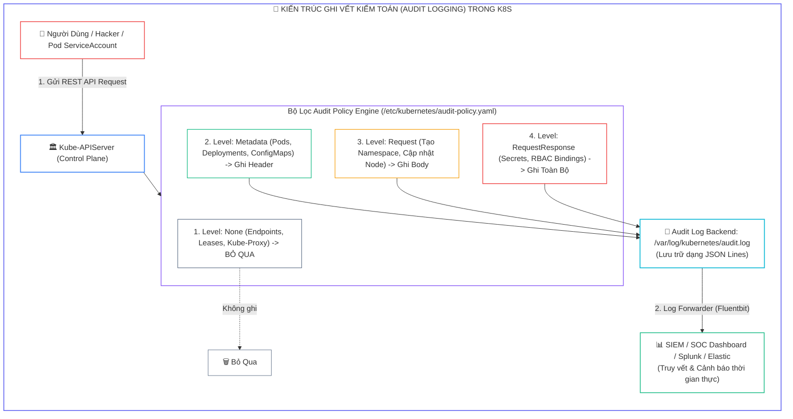
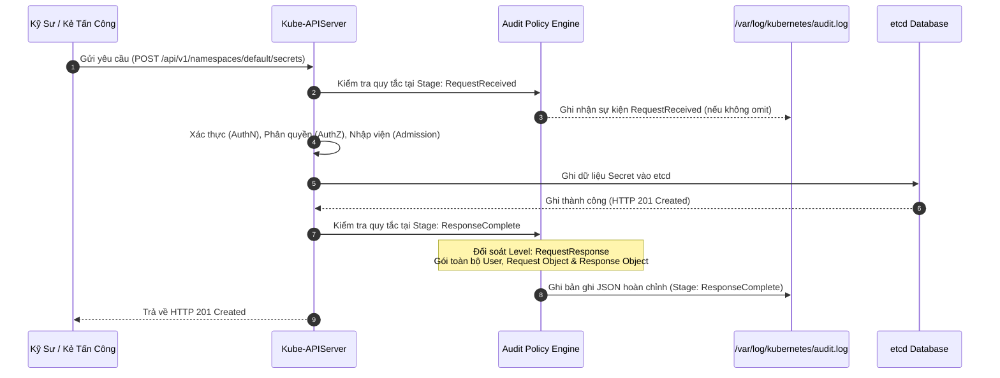
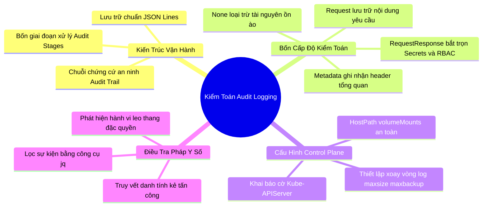


> [!IMPORTANT]
> **Mục tiêu kỹ thuật bài học**:
> - Nắm vững bản chất kiến trúc của hệ thống **Kubernetes Audit Logging** và vai trò trong điều tra pháp y an ninh (**Security Incident Response**).
> - Phân biệt chính xác 4 cấp độ kiểm toán: **`None`**, **`Metadata`**, **`Request`**, **`RequestResponse`** và khi nào nên áp dụng cho từng loại tài nguyên.
> - Hiểu rõ 4 giai đoạn xử lý của một yêu cầu API (**Audit Stages**): `RequestReceived`, `ResponseStarted`, `ResponseComplete`, `Panic`.
> - Biên soạn tệp chính sách **`Audit Policy`** chuẩn API `audit.k8s.io/v1`, tối ưu hóa hiệu năng bằng cách loại trừ các sự kiện ồn ào (`system:nodes`, `endpoints`, `leases`).
> - Cấu hình an toàn các cờ kiểm toán và `volumeMounts` trên tệp Static Pod Manifest **`/etc/kubernetes/manifests/kube-apiserver.yaml`**.
> - Thực hành phân tích và truy vết dấu vết xâm nhập, hành vi đọc Secret trái phép hoặc tạo ClusterRoleBinding quyền root thông qua công cụ **`jq`**.

---

## 1. Bản Chất Kiến Trúc & Tư Duy Cốt Lõi: Chuỗi Chứng Cứ An Ninh (Audit Trail)

Khi một sự cố an ninh xảy ra trên cụm Kubernetes (*ví dụ: một Secret chứa mật khẩu cơ sở dữ liệu sản xuất bị đánh cắp, hoặc một ClusterRole đặc quyền bất ngờ được gán cho một ServiceAccount nặc danh*), câu hỏi đầu tiên của đội ngũ phản ứng sự cố là: **Ai đã làm điều đó? Khi nào? Từ địa chỉ IP nào? Và dữ liệu gì đã bị truy cập?**

Nếu không bật **Audit Logging**, Kube-APIServer sẽ không lưu lại lịch sử các yêu cầu đã xử lý. Mặc định Kubernetes không kích hoạt tính năng này vì nó tạo ra lượng dữ liệu ghi đĩa rất lớn.

Hệ thống **Kubernetes Audit Logging** ghi lại toàn bộ vòng đời của mỗi lệnh gọi REST API theo cấu trúc JSON có định dạng chuẩn:



---

## 2. Bảng Ma Trận So Sánh Kỹ Thuật Toàn Diện (Engineering Matrix)

| Cấp Độ (Level) | Dữ Liệu Được Ghi Lại | Tác Động CPU / Đĩa | Trường Hợp Sử Dụng Điển Hình |
| :--- | :--- | :--- | :--- |
| **`None`** | Hoàn toàn không ghi lại bất kỳ sự kiện nào | 0% (Tối ưu nhất) | Loại trừ lưu lượng ồn ào: `kube-proxy`, `endpoints`, `leases`, `healthz` |
| **`Metadata`** | Ghi thông tin người gọi (User/SA), thời gian, URI, verb, mã HTTP trả về | Thấp (Khoảng 200–400 bytes/event) | Áp dụng cho hầu hết tài nguyên: Pods, Services, Deployments |
| **`Request`** | Ghi Metadata + Toàn bộ nội dung body của yêu cầu gửi lên | Trung bình | Áp dụng khi cần kiểm tra nội dung sửa đổi cấu hình hạ tầng |
| **`RequestResponse`** | Ghi Metadata + Body gửi lên + Toàn bộ Body dữ liệu phản hồi về | <span class="badge badge--rose">Cao (Tốn dung lượng đĩa lớn)</span> | <span class="badge badge--emerald">Bắt buộc cho tài nguyên nhạy cảm: Secrets, RBAC, Tokens</span> |

---

## 3. Kiến Trúc Môi Trường & Luồng Thực Thi Mẫu

Luồng xử lý sự kiện qua các giai đoạn (Stages) của Kube-APIServer:



### Tệp Khai Báo Audit Policy Chuẩn Doanh Nghiệp (`audit-policy.yaml`)

```yaml
apiVersion: audit.k8s.io/v1
kind: Policy
# Bỏ qua giai đoạn RequestReceived để giảm tải 50% dung lượng log
omitStages:
  - "RequestReceived"
rules:
  # 1. Bỏ qua các sự kiện ồn ào từ node heartbeats và endpoint monitoring
  - level: None
    users: ["system:kube-proxy", "system:kube-scheduler"]
    verbs: ["watch", "list", "get"]
  - level: None
    resources:
      - group: "" # Core group
        resources: ["endpoints", "services/status", "events"]
      - group: "coordination.k8s.io"
        resources: ["leases"]

  # 2. Ghi toàn bộ nội dung với Secrets và RBAC nhạy cảm
  - level: RequestResponse
    resources:
      - group: ""
        resources: ["secrets", "configmaps"]
      - group: "rbac.authorization.k8s.io"
        resources: ["roles", "rolebindings", "clusterroles", "clusterrolebindings"]

  # 3. Ghi cấp độ Request cho các thao tác thay đổi trạng thái hạ tầng
  - level: Request
    verbs: ["create", "update", "patch", "delete"]
    resources:
      - group: "apps"
        resources: ["deployments", "daemonsets", "statefulsets"]

  # 4. Mặc định ghi Metadata cho mọi tài nguyên còn lại trong cụm
  - level: Metadata
```

---

## 4. Phân Tích Cạm Bẫy Thực Chiến: Chẩn Đoán & Xử Lý Sự Cố

### Cạm Bẫy 1: Quên Khai Báo HostPath Mount Cho Thư Mục Chứa Log

Khi kích hoạt cờ `--audit-log-path=/var/log/kubernetes/audit.log` trên Kube-APIServer, nếu quản trị viên chỉ mount tệp chính sách mà quên mount thư mục `/var/log/kubernetes/`, APIServer sẽ ghi log vào bên trong container tạm thời. Khi container APIServer bị khởi động lại, toàn bộ bằng chứng kiểm toán sẽ bị xóa sạch.

### Hậu Quả & Log Lỗi Thực Tế:

```text
# Kiểm tra trên máy chủ Host không thấy tệp log kiểm toán:
$ ls -lh /var/log/kubernetes/audit.log
ls: cannot access '/var/log/kubernetes/audit.log': No such file or directory

# Container APIServer bị crash do không tạo được thư mục ghi log:
$ crictl logs <apiserver-container-id>
F0912 11:55:00.001 server.go:310] error creating audit log file: open /var/log/kubernetes/audit.log: no such file or directory
```

### 5-Whys Root Cause Analysis:
1. **Tại sao tệp audit.log không tồn tại trên Host?** Vì APIServer ghi log vào filesystem cách ly của container.
2. **Tại sao không ghi ra Host?** Vì thiếu khối `volumeMounts` trỏ vào `/var/log/kubernetes/`.
3. **Tại sao cấu hình cờ đường dẫn nhưng không có file?** Do lầm tưởng cờ CLI tự động tạo tệp trên Host.
4. **Tại sao container bị crash?** Vì thư mục cha trong container chưa được khởi tạo.
5. **Biện pháp khắc phục triệt để:** Luôn mount cặp `volumeMounts` và `volumes` loại `DirectoryOrCreate` cho cả thư mục chính sách và thư mục log.

---

### Cạm Bẫy 2: Cấu Hình Level RequestResponse Cho Tất Cả Tài Nguyên Khiến Đĩa Bị Tràn (Disk Full)

Đặt quy tắc `level: RequestResponse` ở đầu danh sách cho toàn bộ tài nguyên sẽ khiến APIServer ghi lại hàng chục nghìn gói tin trạng thái mỗi giây từ `kubelet` và `kube-proxy`, làm đầy 100% dung lượng phân vùng đĩa cứng chỉ sau vài giờ.

### Hậu Quả & Log Lỗi Thực Tế:

```text
# Kiểm tra dung lượng phân vùng đĩa:
$ df -h /var/log
Filesystem      Size  Used Avail Use% Mounted on
/dev/sda1        50G   50G     0 100% /var/log

# Kubelet báo lỗi DiskPressure và ngắt hoạt động của Node:
$ kubectl describe node master-01
Conditions:
  Type             Status  Reason
  DiskPressure     True    KubeletHasDiskPressure
```

```diff
  rules:
- - level: RequestResponse
+ - level: None
+   resources:
+     - group: "coordination.k8s.io"
+       resources: ["leases"]
+ - level: Metadata
```

---

## 5. Hands-on Lab: Cấu Hình Toàn Diện Audit Policy & Truy Vết Bằng jq

| Bước | Mục tiêu thực hiện | Lệnh / Thao tác kiểm chứng |
| :--- | :--- | :--- |
| **B1** | Tạo thư mục chứa chính sách và log trên Control Plane | `mkdir -p /etc/kubernetes/audit /var/log/kubernetes` |
| **B2** | Khởi tạo tệp chính sách `audit-policy.yaml` | `cat << 'EOF' > /etc/kubernetes/audit/audit-policy.yaml` |
| **B3** | Sao lưu tệp Manifest tĩnh của Kube-APIServer | `cp /etc/kubernetes/manifests/kube-apiserver.yaml /root/kube-apiserver.yaml.bak` |
| **B4** | Cấu hình 5 cờ kiểm toán và volume mounts trong `kube-apiserver.yaml` | Thêm các cờ `--audit-policy-file`, `--audit-log-path`, v.v. |
| **B5** | Chờ Kube-APIServer khởi động lại và kiểm tra tệp log sinh ra | `ls -lh /var/log/kubernetes/audit.log` |
| **B6** | Thực hiện hành động tạo Secret và gán quyền ClusterRoleBinding | `kubectl create secret generic db-pass --from-literal=pass=123` |
| **B7** | Dùng lệnh `jq` để lọc sự kiện đọc Secret trái phép | `cat /var/log/kubernetes/audit.log \| jq 'select(...)'` |
| **B8** | Truy vết nguồn gốc địa chỉ IP và tài khoản của kẻ tấn công | `cat /var/log/kubernetes/audit.log \| jq '{user: .user.username, ip: .sourceIPs}'` |

---

### Bước 1: Khởi Tạo Cấu Trúc Thư Mục

```bash
sudo mkdir -p /etc/kubernetes/audit
sudo mkdir -p /var/log/kubernetes
```

---

### Bước 2: Biên Soạn Tệp Chính Sách Audit Policy

```yaml
cat << 'EOF' | sudo tee /etc/kubernetes/audit/audit-policy.yaml
apiVersion: audit.k8s.io/v1
kind: Policy
omitStages:
  - "RequestReceived"
rules:
  # Bỏ qua các yêu cầu nội bộ từ scheduler và proxy
  - level: None
    users: ["system:kube-scheduler", "system:kube-proxy"]
  - level: None
    verbs: ["get", "list", "watch"]
    resources:
      - group: ""
        resources: ["endpoints", "configmaps"]
      - group: "coordination.k8s.io"
        resources: ["leases"]

  # Ghi RequestResponse cho Secret và RBAC
  - level: RequestResponse
    resources:
      - group: ""
        resources: ["secrets"]
      - group: "rbac.authorization.k8s.io"
        resources: ["roles", "rolebindings", "clusterroles", "clusterrolebindings"]

  # Ghi Metadata cho mọi tài nguyên khác
  - level: Metadata
EOF
```

---

### Bước 3: Sao Lưu Tệp Manifest Kube-APIServer

```bash
sudo cp /etc/kubernetes/manifests/kube-apiserver.yaml /etc/kubernetes/manifests/kube-apiserver.yaml.backup
```

---

### Bước 4: Chỉnh Sửa Kube-APIServer Manifest

Cập nhật các cờ và volume trong `/etc/kubernetes/manifests/kube-apiserver.yaml`:

```yaml
# Thêm các cờ kiểm toán vào khối command:
    - --audit-policy-file=/etc/kubernetes/audit/audit-policy.yaml
    - --audit-log-path=/var/log/kubernetes/audit.log
    - --audit-log-maxage=30
    - --audit-log-maxbackup=10
    - --audit-log-maxsize=100

# Thêm volumeMounts:
    - mountPath: /etc/kubernetes/audit
      name: audit-policy
      readOnly: true
    - mountPath: /var/log/kubernetes
      name: audit-logs
      readOnly: false

# Thêm volumes:
    - name: audit-policy
      hostPath:
        path: /etc/kubernetes/audit
        type: DirectoryOrCreate
    - name: audit-logs
      hostPath:
        path: /var/log/kubernetes
        type: DirectoryOrCreate
```

---

### Bước 5: Kiểm Tra Trạng Thái Hoạt Động Của APIServer

```bash
# Kiểm tra Kube-APIServer đã khởi động lại thành công:
kubectl get nodes
ls -lh /var/log/kubernetes/audit.log
```

---

### Bước 6: Tạo Sự Kiện Nhạy Cảm Để Thử Nghiệm

```bash
# Tạo Secret mật khẩu:
kubectl create secret generic payment-db-secret --from-literal=password=SuperSecretPass2026

# Đọc nội dung Secret:
kubectl get secret payment-db-secret -o yaml
```

---

### Bước 7: Phân Tích Dấu Vết Kiểm Toán Bằng jq

Lọc tất cả các sự kiện truy cập vào tài nguyên `secrets`:

```bash
sudo tail -n 100 /var/log/kubernetes/audit.log | jq '
  select(.objectRef.resource == "secrets" and .objectRef.name == "payment-db-secret") |
  {
    timestamp: .requestReceivedTimestamp,
    user: .user.username,
    verb: .verb,
    sourceIP: .sourceIPs[0],
    responseCode: .responseStatus.code
  }'
```

---

### Bước 8: Truy Vết Hành Vi Tạo ClusterRoleBinding Trái Phép

```bash
sudo cat /var/log/kubernetes/audit.log | jq '
  select(.objectRef.resource == "clusterrolebindings" and .verb == "create") |
  {
    time: .requestReceivedTimestamp,
    actor: .user.username,
    bindingName: .objectRef.name,
    clientIP: .sourceIPs[0]
  }'
```

---

## 6. 10 Câu Hỏi Tự Kiểm Tra Chuyên Sâu (Self-Check Q&A Accordion)

<details class="qa-card">
  <summary><b>Câu 1: Kubernetes Audit Policy có thứ tự ưu tiên đánh giá các quy tắc (Rules) như thế nào?</b></summary>
  <div class="qa-answer">
    <div>Các quy tắc trong Audit Policy được đánh giá tuần tự <b>từ trên xuống dưới</b> (First-match wins). Khi một yêu cầu API khớp với quy tắc đầu tiên, cấp độ kiểm toán của quy tắc đó sẽ được áp dụng ngay lập tức và các quy tắc phía sau sẽ bị bỏ qua.</div>
  </div>
</details>

<details class="qa-card">
  <summary><b>Câu 2: Ý nghĩa của cờ <code>omitStages</code> trong Audit Policy là gì?</b></summary>
  <div class="qa-answer">
    <div>Cờ <code>omitStages</code> dùng để chỉ định danh sách các giai đoạn kiểm toán không cần ghi log (ví dụ: <code>RequestReceived</code>). Việc bỏ qua giai đoạn này giúp <b>giảm 50% số lượng bản ghi log</b> mà vẫn giữ trọn vẹn thông tin kết quả xử lý cuối cùng ở giai đoạn <code>ResponseComplete</code>.</div>
  </div>
</details>

<details class="qa-card">
  <summary><b>Câu 3: Bốn giai đoạn (Stages) trong vòng đời của một Audit Event là gì?</b></summary>
  <div class="qa-answer">
    <div>Bốn giai đoạn bao gồm: (1) <b><code>RequestReceived</code></b>: Khi API Server vừa nhận yêu cầu từ client, (2) <b><code>ResponseStarted</code></b>: Khi header phản hồi bắt đầu được gửi đi (chủ yếu dùng cho watch/streaming), (3) <b><code>ResponseComplete</code></b>: Khi toàn bộ nội dung phản hồi đã gửi xong, và (4) <b><code>Panic</code></b>: Khi xảy ra lỗi nghiêm trọng nội bộ máy chủ.</div>
  </div>
</details>

<details class="qa-card">
  <summary><b>Câu 4: Cờ <code>--audit-log-maxsize=100</code> và <code>--audit-log-maxbackup=10</code> có ý nghĩa gì?</b></summary>
  <div class="qa-answer">
    <div><code>--audit-log-maxsize=100</code> quy định dung lượng tối đa của một tệp log trước khi tiến hành xoay vòng (Rotate) là <b>100 Megabytes</b>. <code>--audit-log-maxbackup=10</code> quy định số lượng tệp log lịch sử cũ tối đa được giữ lại là <b>10 tệp</b> trước khi tự động xóa bản cũ nhất.</div>
  </div>
</details>

<details class="qa-card">
  <summary><b>Câu 5: Tại sao không nên cấu hình <code>level: RequestResponse</code> cho tài nguyên ConfigMap hoặc Leases?</b></summary>
  <div class="qa-answer">
    <div>Vì các thành phần Control Plane như Kube-Scheduler và Kube-Controller-Manager liên tục cập nhật đối tượng <code>leases</code> mỗi 2 giây để duy trì trạng thái Leader Election. Cấu hình <code>RequestResponse</code> sẽ làm phát sinh hàng triệu dòng log rác khổng lồ, gây nghẽn I/O đĩa và làm tràn dung lượng lưu trữ.</div>
  </div>
</details>

<details class="qa-card">
  <summary><b>Câu 6: Để ghi log hành vi của kẻ tấn công cố tình liệt kê danh sách Secret nhưng bị cấm bởi RBAC, ta cần kiểm tra trường nào trong JSON?</b></summary>
  <div class="qa-answer">
    <div>Ta kiểm tra trường <b><code>responseStatus.code == 403</code></b> kết hợp với <b><code>objectRef.resource == "secrets"</code></b> và <b><code>verb == "list"</code></b>. Bản ghi này sẽ chỉ rõ định danh kẻ gửi (<code>user.username</code>) và địa chỉ IP nguồn (<code>sourceIPs</code>).</div>
  </div>
</details>

<details class="qa-card">
  <summary><b>Câu 7: Điểm khác biệt giữa Audit Log Backend dạng File và Webhook là gì?</b></summary>
  <div class="qa-answer">
    <div><b>File Backend</b> ghi trực tiếp các dòng log JSON ra tệp tin cục bộ trên máy chủ (HostPath). <b>Webhook Backend</b> gửi các sự kiện kiểm toán theo luồng HTTP POST tới một hệ thống SIEM hoặc dịch vụ lưu trữ log từ xa (như Elasticsearch, Datadog).</div>
  </div>
</details>

<details class="qa-card">
  <summary><b>Câu 8: Tại sao thư mục chứa log trên host cần được mount với quyền <code>readOnly: false</code>?</b></summary>
  <div class="qa-answer">
    <div>Vì tiến trình Kube-APIServer chạy bên trong container cần <b>quyền ghi (Write Permission)</b> để liên tục ghi thêm dữ liệu log mới và thực hiện xoay vòng tệp tin khi đạt ngưỡng dung lượng.</div>
  </div>
</details>

<details class="qa-card">
  <summary><b>Câu 9: Trong kỳ thi CKS, nếu đề bài yêu cầu "Log metadata of all requests at cluster level, but RequestResponse for secrets", thứ tự cấu hình rule như thế nào?</b></summary>
  <div class="qa-answer">
    <div>Quy tắc <b><code>level: RequestResponse</code> cho tài nguyên <code>secrets</code> phải đặt ở phía trên</b>, sau đó mới đặt quy tắc chung <b><code>level: Metadata</code> ở cuối cùng</b>. Nếu đặt Metadata ở đầu, mọi yêu cầu Secret sẽ bị khớp với Metadata trước và không bao giờ ghi được body RequestResponse.</div>
  </div>
</details>

<details class="qa-card">
  <summary><b>Câu 10: Làm thế nào để kiểm tra tính hợp lệ của tệp <code>audit-policy.yaml</code> trước khi khởi động lại APIServer?</b></summary>
  <div class="qa-answer">
    <div>Có thể kiểm tra cú pháp YAML bằng công cụ <code>yamllint</code> hoặc chạy lệnh <code>kube-apiserver --audit-policy-file=... --validate=true</code> (hoặc kiểm tra cẩn thận cấu trúc API <code>audit.k8s.io/v1</code> và tên các trường để tránh làm treo Static Pod).</div>
  </div>
</details>

---

## 7. Tổng Kết & Lộ Trình Bài Học Tiếp Theo



> [!TIP]
> **Bài học tiếp theo:** Khám phá chuyên sâu công cụ giám sát phát hiện mối đe dọa thời gian thực tầng nhân Linux trong bài **[Bài 19] Giám Sát Thời Gian Thực Nâng Cao: Falco Rules, Falcosidekick & Điều Tra Pháp Y Số](cks-19-19-falco-va-phat-hien-thoi-gian-chay.html)**.

