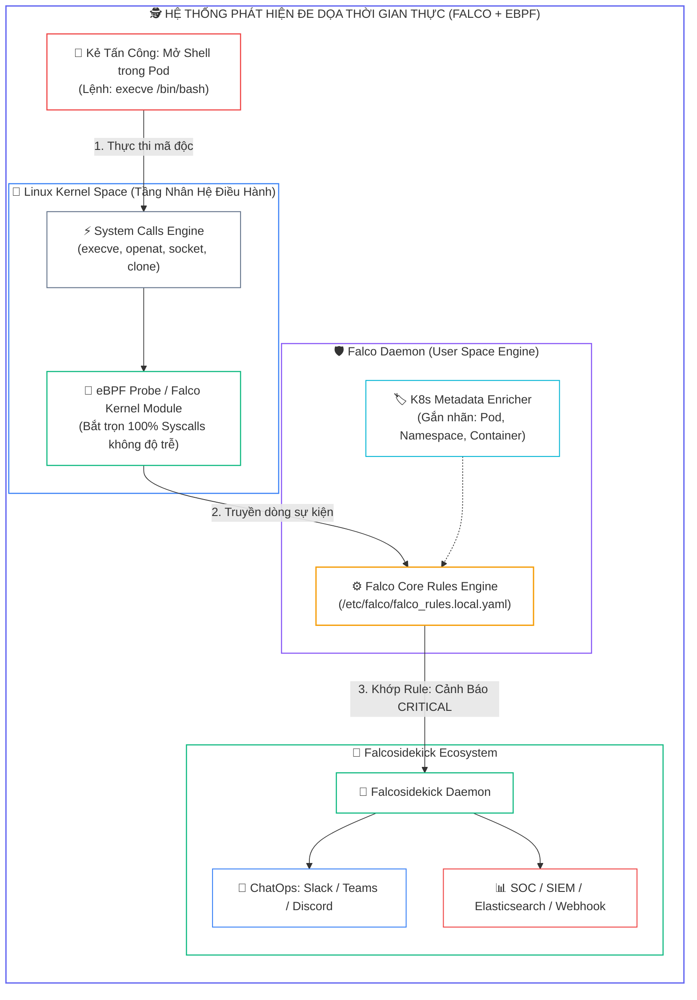
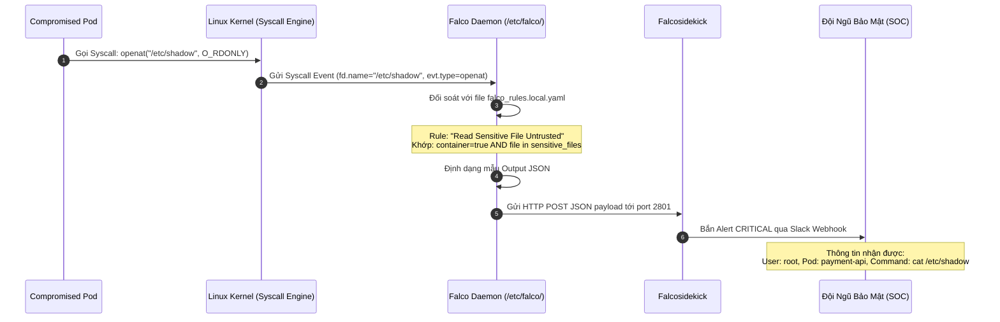
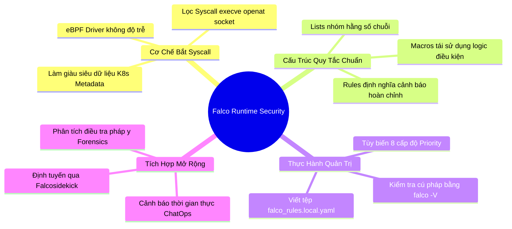


> [!IMPORTANT]
> **Mục tiêu kỹ thuật bài học**:
> - Nắm vững cơ chế vận hành tầng sâu của **Falco Runtime Security** sử dụng công nghệ **eBPF (Extended Berkeley Packet Filter)** và **Linux System Calls**.
> - Phân biệt và ứng dụng linh hoạt 3 khối xây dựng quy tắc: **`lists`**, **`macros`**, và **`rules`**.
> - Nắm vững các trường dữ liệu quan trọng trong cú pháp điều kiện: `fd.name`, `proc.name`, `proc.pname`, `container.name`, `k8s.pod.name`, `evt.type`.
> - Tùy biến các cấp độ ưu tiên cảnh báo (**Priority Levels**): `EMERGENCY`, `ALERT`, `CRITICAL`, `ERROR`, `WARNING`, `NOTICE`, `INFO`, `DEBUG`.
> - Cấu hình chuyển tiếp sự kiện thời gian thực qua **Falcosidekick** tới máy chủ Webhook và kênh cảnh báo của đội ngũ SOC.
> - Thực hành viết quy tắc phát hiện tấn công thực tế: Chạy lệnh trái phép trong Pod, đọc trộm SSH Key, và leo thang đặc quyền container.

---

## 1. Bản Chất Kiến Trúc & Tư Duy Cốt Lõi: Giám Sát Thời Gian Thực Tầng Nhân Linux

Các giải pháp an ninh như quét lỗ hổng ảnh (Trivy) hay phân tích tĩnh (Kube-linter) chỉ có thể bảo vệ hệ thống trước khi triển khai (**Shift-Left**). Tuy nhiên, khi một ứng dụng đang chạy thực tế trên cụm, nó vẫn có thể bị tấn công bằng các lỗ hổng chưa từng được công bố (**Zero-Day Exploits**) hoặc bị nhân viên nội bộ lạm quyền.

Để bảo vệ giai đoạn **Runtime**, **Falco** hoạt động như một hệ thống camera an ninh 24/7 đặt tại tầng nhân Linux (**Linux Kernel Space**). Mọi hành vi mở tệp, thực thi tiến trình, kết nối mạng hay chuyển đổi người dùng đều phải thông qua các hàm gọi hệ thống (**System Calls** như `openat`, `execve`, `connect`, `setuid`). Falco bắt giữ các sự kiện này, làm giàu thông tin với siêu dữ liệu của Kubernetes (Pod name, Namespace, Container ID), và đối soát với bộ quy tắc an ninh theo thời gian thực.



---

## 2. Bảng Ma Trận So Sánh Kỹ Thuật Toàn Diện (Engineering Matrix)

| Cấu Trúc Thành Phần | Khối `list` | Khối `macro` | Khối `rule` |
| :--- | :--- | :--- | :--- |
| **Mục đích sử dụng** | Định nghĩa một danh sách các chuỗi hoặc hằng số | Định nghĩa một mệnh đề điều kiện logic tái sử dụng | Quy tắc hoàn chỉnh định nghĩa cảnh báo an ninh |
| **Cú pháp khai báo** | `- list: <tên_list>`<br/>`  items: [...]` | `- macro: <tên_macro>`<br/>`  condition: (...)` | `- rule: <tên_rule>`<br/>`  desc: ...`<br/>`  condition: ...`<br/>`  output: ...`<br/>`  priority: ...` |
| **Mức độ phụ thuộc** | Độc lập | Có thể tham chiếu `list` hoặc `macro` khác | Tham chiếu cả `list`, `macro` và điều kiện trực tiếp |
| **Ví dụ điển hình** | Danh sách các shell nguy hiểm: `[bash, sh, zsh, csh]` | `spawned_process and container` | `Terminal shell in container` |
| **Tác động cảnh báo** | Không sinh cảnh báo | Không sinh cảnh báo | <span class="badge badge--rose">Trực tiếp kích hoạt Log & Alert</span> |
| **Trọng tâm thi CKS** | Cốt lõi | Cốt lõi | <span class="badge badge--emerald">Bắt buộc nắm vững 100% cú pháp</span> |

---

## 3. Kiến Trúc Môi Trường & Luồng Thực Thi Mẫu

Cấu trúc luồng dữ liệu từ khi Syscall phát sinh đến khi Falco và Falcosidekick bắn cảnh báo:



### Cấu Trúc Một Quy Tắc Tùy Biến Hoàn Chỉnh Trong `/etc/falco/falco_rules.local.yaml`

```yaml
# 1. Định nghĩa Danh Sách (Lists)
- list: sensitive_credentials
  items: [/etc/shadow, /etc/sudoers, /root/.ssh/id_rsa, /var/run/secrets/kubernetes.io/serviceaccount/token]

- list: allowed_token_readers
  items: [kube-proxy, calico-node, cilium-agent]

# 2. Định nghĩa Biểu Thức Điều Kiện (Macros)
- macro: open_read
  condition: (evt.type in (open, openat, openat2) and evt.is_open_read = true and fd.typechar='f')

- macro: container_context
  condition: (container.id != host and container.name != "host")

# 3. Định nghĩa Quy Tắc An Ninh (Rules)
- rule: Unauthorized Sensitive Credential Access in Container
  desc: Phát hiện hành vi đọc tệp chứa bí mật nhạy cảm bên trong container trái phép
  condition: container_context and open_read and fd.name in (sensitive_credentials) and not proc.name in (allowed_token_readers)
  output: "CẢNH BÁO AN NINH [ĐỌC TRỘM BÍ MẬT] (user=%user.name pod=%k8s.pod.name ns=%k8s.ns.name process=%proc.name file=%fd.name cmdline=%proc.cmdline)"
  priority: CRITICAL
  tags: [security, credentials, forensics, cks]
```

---

## 4. Phân Tích Cạm Bẫy Thực Chiến: Chẩn Đoán & Xử Lý Sự Cố

### Cạm Bẫy 1: Sửa Trực Tiếp Tệp `/etc/falco/falco_rules.yaml` Khiến Cấu Hình Bị Mất Khi Cập Nhật

Nhiều quản trị viên viết trực tiếp các quy tắc tùy biến vào tệp mặc định `falco_rules.yaml`. Khi gói `falco` được nâng cấp (apt-get upgrade) hoặc cập nhật container image, tệp này sẽ bị ghi đè hoàn toàn về bản gốc từ upstream, làm mất sạch toàn bộ các rule tùy biến của doanh nghiệp.

### Hậu Quả & Log Lỗi Thực Tế:

```text
# Log cảnh báo từ apt khi cập nhật gói Falco:
$ sudo apt-get install --only-upgrade falco
Configuration file '/etc/falco/falco_rules.yaml'
 ==> Modified (by you or by a script) since installation.
 ==> Package distributor has shipped an updated version.
Installing new version of config file... (TOÀN BỘ CUSTOM RULES ĐÃ BỊ XÓA ĐÈ!)
```

### 5-Whys Root Cause Analysis:
1. **Tại sao các custom rule biến mất?** Vì tệp `falco_rules.yaml` bị ghi đè khi nâng cấp gói phần mềm.
2. **Tại sao lại bị ghi đè?** Vì đây là tệp quản lý chính của hệ thống upstream.
3. **Tại sao không dùng tệp riêng?** Do kỹ sư không biết cơ chế nạp cấu hình nhiều tệp của Falco.
4. **Falco nạp quy tắc theo thứ tự nào?** Nạp `falco_rules.yaml` trước, sau đó nạp đè `falco_rules.local.yaml`.
5. **Biện pháp khắc phục triệt để:** Luôn luôn viết quy tắc mới hoặc ghi đè (override) quy tắc có sẵn trong tệp `/etc/falco/falco_rules.local.yaml`.

---

### Cạm Bẫy 2: Lỗi Cú Pháp Khiến Falco Service Bị Treo Và Ngừng Giám Sát

Chỉ một lỗi thụt lề khoảng trắng (Indentation) hoặc sai tên trường dữ liệu trong YAML sẽ khiến daemon `falco` không thể khởi động lại (Crash), làm tê liệt hoàn toàn hệ thống giám sát thời gian thực của cụm mà không hề có cảnh báo.

### Hậu Quả & Log Lỗi Thực Tế:

```text
# Trạng thái Falco service sau khi sửa rule lỗi:
$ sudo systemctl status falco
● falco.service - Falco: Container Native Runtime Security
     Loaded: loaded (/lib/systemd/system/falco.service; enabled)
     Active: failed (Result: exit-code) since Sat 2026-09-12 12:05:00 UTC
    Process: 41200 ExecStart=/usr/bin/falco (code=exited, status=1/FAILURE)

# Đọc log lỗi cú pháp chi tiết:
$ sudo journalctl -u falco -n 20 --no-pager
Sep 12 12:05:00 node01 falco[41200]: Runtime error: Rule 'Bad_Rule': field 'process.name' does not exist. Did you mean 'proc.name'?
Sep 12 12:05:00 node01 falco[41200]: Sat Sep 12 12:05:00 2026: Loading rules files: /etc/falco/falco_rules.local.yaml: Invalid rule syntax
```

```diff
  - rule: Detect Bad Process
    desc: Detect process execution
-   condition: container.id != host and process.name = "nc"
+   condition: container.id != host and proc.name = "nc"
    output: "Netcat spawned in container (user=%user.name)"
    priority: WARNING
```

---

## 5. Hands-on Lab: Cấu Hình Toàn Diện Falco Rule Nâng Cao & Tích Hợp Falcosidekick

| Bước | Mục tiêu thực hiện | Lệnh / Thao tác kiểm chứng |
| :--- | :--- | :--- |
| **B1** | Kiểm tra trạng thái và phiên bản của Falco daemon | `sudo systemctl status falco && falco --version` |
| **B2** | Mở tệp quy tắc địa phương `/etc/falco/falco_rules.local.yaml` | `sudo nano /etc/falco/falco_rules.local.yaml` |
| **B3** | Viết quy tắc bắt hành vi mở Interactive Shell trong container | Định nghĩa `spawn_shell_in_container` |
| **B4** | Viết quy tắc phát hiện thay đổi quyền sở hữu tệp nhạy cảm | Bắt Syscall `chmod` và `chown` |
| **B5** | Kiểm tra tính hợp lệ của quy tắc bằng cờ `-V` (Validate) | `falco -V /etc/falco/falco_rules.local.yaml` |
| **B6** | Khởi động lại dịch vụ Falco và theo dõi log hệ thống | `sudo systemctl restart falco && sudo journalctl -fu falco` |
| **B7** | Kích hoạt hành vi tấn công giả lập bên trong Pod | `kubectl exec -it test-pod -- /bin/bash` |
| **B8** | Kiểm tra bản ghi cảnh báo phát sinh tức thì trong Falco log | `sudo cat /var/log/messages \| grep -i "CẢNH BÁO AN NINH"` |

---

### Bước 1: Kiểm Tra Trạng Thái Hoạt Động Của Falco

```bash
sudo systemctl status falco
falco --version
```

---

### Bước 2: Chuẩn Bị Tệp Quy Tắc Địa Phương

```bash
sudo touch /etc/falco/falco_rules.local.yaml
```

---

### Bước 3: Thêm Quy Tắc Phát Hiện Mở Terminal Shell Trong Pod

Chèn đoạn cấu hình sau vào `/etc/falco/falco_rules.local.yaml`:

```yaml
cat << 'EOF' | sudo tee /etc/falco/falco_rules.local.yaml
- list: shell_binaries
  items: [bash, sh, zsh, ksh, csh, dash]

- macro: container_running
  condition: (container.id != host and container.name != "host")

- macro: shell_execution
  condition: (proc.name in (shell_binaries) and evt.type = execve and evt.dir = <)

- rule: Terminal Shell Spawned in Container
  desc: Phát hiện hành vi mở interactive terminal shell trong một Pod đang chạy
  condition: container_running and shell_execution and proc.tty != 0
  output: "CẢNH BÁO AN NINH: Mở Terminal Shell trong Container (user=%user.name pod=%k8s.pod.name ns=%k8s.ns.name cmd=%proc.cmdline tty=%proc.tty)"
  priority: WARNING
  tags: [runtime, container, shell, cks]
EOF
```

---

### Bước 4: Kiểm Tra Cú Pháp Tệp Quy Tắc Trước Khi Khởi Động Lại

> [!TIP]
> Sử dụng cờ `-V` để kiểm tra cú pháp tệp rule giúp tránh làm sập Falco service trong bài thi CKS thực tế!

```bash
sudo falco -V /etc/falco/falco_rules.local.yaml
```
*Kết quả kỳ vọng:* In ra dòng `Rules file /etc/falco/falco_rules.local.yaml: Ok` (Exit Code 0).

---

### Bước 5: Nạp Lại Cấu Hình Falco Service

```bash
sudo systemctl restart falco
sudo systemctl status falco --no-pager
```

---

### Bước 6: Khởi Tạo Pod Thử Nghiệm Trên Kubernetes

```bash
kubectl run test-runtime-sec --image=nginx:alpine --restart=Never
kubectl wait --for=condition=Ready pod/test-runtime-sec --timeout=30s
```

---

### Bước 7: Kích Hoạt Hành Vi Vi Phạm An Ninh

Thực hiện lệnh mở interactive shell vào container:

```bash
kubectl exec -it test-runtime-sec -- /bin/sh -c "whoami && uname -a"
```

---

### Bước 8: Kiểm Tra Bằng Chứng Cảnh Báo Trong Nhật Ký Falco

```bash
sudo journalctl -u falco -n 20 --no-pager | grep "CẢNH BÁO AN NINH"
```

*Kết quả đầu ra nhận diện chuẩn xác hành vi:*
```text
Sep 12 12:10:00 node01 falco[42150]: 12:10:00.123456789: Warning CẢNH BÁO AN NINH: Mở Terminal Shell trong Container (user=root pod=test-runtime-sec ns=default cmd=sh -c whoami && uname -a tty=0)
```

---

## 6. 10 Câu Hỏi Tự Kiểm Tra Chuyên Sâu (Self-Check Q&A Accordion)

<details class="qa-card">
  <summary><b>Câu 1: Falco phát hiện các mối đe dọa an ninh dựa trên nguồn dữ liệu nào từ hệ điều hành?</b></summary>
  <div class="qa-answer">
    <div>Falco phát hiện các mối đe dọa bằng cách bắt giữ và phân tích trực tiếp các <b>lời gọi hệ thống (Linux System Calls)</b> theo thời gian thực thông qua trình điều khiển nhân <b>eBPF Probe</b> hoặc Kernel Module chuyên dụng, kết hợp với siêu dữ liệu phong phú từ Kubernetes API Server.</div>
  </div>
</details>

<details class="qa-card">
  <summary><b>Câu 2: Tại sao các quy tắc tùy biến luôn phải được viết vào <code>falco_rules.local.yaml</code>?</b></summary>
  <div class="qa-answer">
    <div>Vì tệp <code>falco_rules.yaml</code> là tệp mặc định thuộc quyền quản lý của gói phần mềm upstream và sẽ <b>bị ghi đè hoàn toàn khi nâng cấp</b>. Tệp <code>falco_rules.local.yaml</code> được sinh ra chuyên biệt cho người quản trị cục bộ, được nạp sau và bảo toàn toàn bộ cấu hình qua các lần cập nhật.</div>
  </div>
</details>

<details class="qa-card">
  <summary><b>Câu 3: Làm thế nào để kiểm tra tính hợp lệ của tệp quy tắc Falco mà không cần khởi động lại dịch vụ?</b></summary>
  <div class="qa-answer">
    <div>Sử dụng lệnh kiểm tra cú pháp độc lập: <b><code>sudo falco -V /đường_dẫn/tệp_rules.yaml</code></b>. Nếu tệp hợp lệ, lệnh sẽ trả về thông báo <code>Ok</code> và mã thoát (Exit Code) bằng 0.</div>
  </div>
</details>

<details class="qa-card">
  <summary><b>Câu 4: Ý nghĩa của trường <code>evt.dir = &lt;</code> trong điều kiện lọc Syscall là gì?</b></summary>
  <div class="qa-answer">
    <div>Trường <code>evt.dir = &lt;</code> đại diện cho <b>giai đoạn Syscall hoàn thành (Exit event)</b> trả kết quả về cho ứng dụng. Ngược lại, <code>evt.dir = &gt;</code> đại diện cho giai đoạn bắt đầu gọi Syscall (Enter event). Thông thường ta kiểm tra ở pha Exit để chắc chắn lời gọi hệ thống đã thực thi thành công.</div>
  </div>
</details>

<details class="qa-card">
  <summary><b>Câu 5: Sự khác biệt giữa <code>proc.name</code> và <code>proc.pname</code> là gì?</b></summary>
  <div class="qa-answer">
    <div><b><code>proc.name</code></b> là tên của tiến trình hiện tại đang thực thi hành động (ví dụ: <code>cat</code> hoặc <code>sh</code>). <b><code>proc.pname</code></b> là tên của <b>tiến trình cha (Parent Process)</b> đã sinh ra tiến trình hiện tại (ví dụ: tiến trình cha là <code>containerd-shim</code> hoặc <code>python</code>).</div>
  </div>
</details>

<details class="qa-card">
  <summary><b>Câu 6: Trường <code>fd.name</code> trong Falco dùng để biểu thị thông tin gì?</b></summary>
  <div class="qa-answer">
    <div>Trường <code>fd.name</code> biểu thị <b>tên hoặc đường dẫn đầy đủ của tệp tin, socket mạng hoặc thiết bị</b> mà File Descriptor (fd) đang tham chiếu tới (ví dụ: <code>/etc/shadow</code> hoặc địa chỉ IP kết nối socket).</div>
  </div>
</details>

<details class="qa-card">
  <summary><b>Câu 7: Tám cấp độ ưu tiên (Priority Levels) trong Falco theo thứ tự từ cao đến thấp là gì?</b></summary>
  <div class="qa-answer">
    <div>Tám cấp độ theo chuẩn Syslog RFC 5424 là: <b>EMERGENCY &gt; ALERT &gt; CRITICAL &gt; ERROR &gt; WARNING &gt; NOTICE &gt; INFO &gt; DEBUG</b>.</div>
  </div>
</details>

<details class="qa-card">
  <summary><b>Câu 8: Vai trò chính của thành phần Falcosidekick trong hệ sinh thái an ninh là gì?</b></summary>
  <div class="qa-answer">
    <div><b>Falcosidekick</b> là một ứng dụng daemon nhẹ đóng vai trò làm cổng chuyển tiếp sự kiện (<b>Event Forwarder / Router</b>). Nó tiếp nhận các cảnh báo JSON từ Falco qua HTTP POST và tự động phân phối song song tới hơn 50 đích đến khác nhau như Slack, Discord, Elasticsearch, Kafka, AWS SNS, GCP PubSub.</div>
  </div>
</details>

<details class="qa-card">
  <summary><b>Câu 9: Làm thế nào để lọc chỉ bắt các sự kiện xảy ra bên trong container chứ không bắt trên máy chủ Host?</b></summary>
  <div class="qa-answer">
    <div>Thêm điều kiện logic: <b><code>container.id != host</code></b> hoặc sử dụng macro có sẵn: <b><code>container</code></b> trong khối condition của quy tắc.</div>
  </div>
</details>

<details class="qa-card">
  <summary><b>Câu 10: Quy tắc Falco nào có thể phát hiện hành vi ghi đè các tệp nhị phân hệ thống?</b></summary>
  <div class="qa-answer">
    <div>Quy tắc kiểm tra sự kiện mở tệp với quyền ghi (<code>open_write</code>) kết hợp với đường dẫn tệp nằm trong danh sách thư mục hệ thống nhạy cảm: <b><code>fd.name startswith /bin/ or fd.name startswith /sbin/ or fd.name startswith /usr/bin/</code></b>.</div>
  </div>
</details>

---

## 7. Tổng Kết & Lộ Trình Bài Học Tiếp Theo



> [!TIP]
> **Bài học tiếp theo:** Thử sức với phòng thi thực chiến mô phỏng 100% môi trường CKS chính thức trong bài **[Bài 20] Đề Thi Thử CKS Toàn Diện: 16 Kịch Bản Thực Chiến & Lời Giải Chi Tiết](cks-20-20-thi-thu-cks.html)**.

