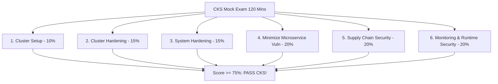
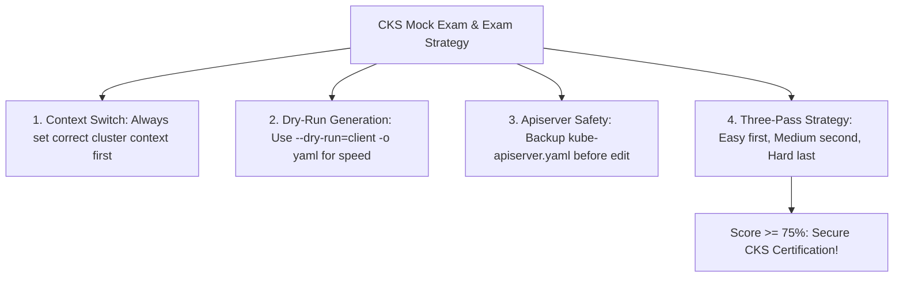
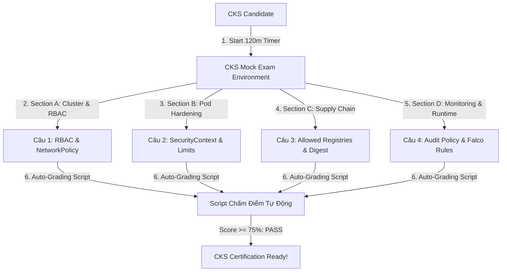


# [BÀI 20] ĐỀ THI THỬ CKS TOÀN DIỆN 120 PHÚT & PHÂN TÍCH LỜI GIẢI CHUẨN MỰC LINUX FOUNDATION

Trong kỷ nguyên điện toán đám mây và kiến trúc microservices phân tán quy mô lớn, **Kubernetes (CKS)** đóng vai trò là nền tảng điều phối container (Container Orchestration) tiêu chuẩn công nghiệp. Để làm chủ hệ thống trong môi trường sản xuất (Production) cũng như chinh phục kỳ thi chứng chỉ quốc tế của Linux Foundation / CNCF, kỹ sư không chỉ nắm vững các câu lệnh thao tác cơ bản mà phải thấu hiểu sâu sắc bản chất cơ chế tầng thấp: từ chu trình điều hòa (Reconciliation Loop), cấu trúc điều phối tài nguyên, kiến trúc mạng CNI, lưu trữ CSI cho đến các chuẩn mực an ninh phòng thủ chiều sâu.

Bài viết chuyên sâu này sẽ đồng hành cùng bạn giải mã toàn diện bức tranh kiến trúc, phân tích các đánh đổi kỹ thuật thực chiến (Engineering Trade-offs), cung cấp bài thực hành Lab từng bước và bộ câu hỏi phỏng vấn chuẩn Architect / Lead Engineer.

---

## 1. Bản Chất Kiến Trúc & Cơ Chế Vận Hành Tầng Thấp

| # | Câu hỏi ôn tập | Đáp án chuẩn ngắn gọn |
|---|---|---|
| 1 | Tầng giám sát thời gian chạy của Falco? | **Linux Kernel System Calls (Syscalls)** |
| 2 | Năm thành tố bắt buộc của Falco Rule? | **`rule`, `desc`, `condition`, `output`, `priority`** |
| 3 | Loại driver Falco hiệu năng cao? | **eBPF Probe Driver** |
| 4 | Tệp biên soạn quy tắc custom Falco? | **`/etc/falco/falco_rules.local.yaml`** |
| 5 | Tệp nhật ký hệ thống chứa cảnh báo? | **`/var/log/syslog`** |


> **"Kỳ thi thử CKS mô phỏng thực tế đầy đủ 120 phút kết hợp buổi chữa đề chi tiết là bước tổng duyệt toàn diện 6 miền kiến thức CKS (Cluster Setup, Cluster Hardening, System Hardening, Minimize Microservice Vulnerabilities, Supply Chain Security, và Monitoring/Logging/Runtime Security), đòi hỏi chuyên gia bảo mật phải vận dụng 100% các kỹ năng thực hành bảo mật Kubernetes tốc độ cao dưới áp lực thời gian thực; làm chủ chiến thuật phân bổ thời gian (làm câu dễ trước, gắn nhược điểm đánh dấu câu khó), kỹ năng tra cứu tài liệu chính thức (`kubernetes.io`, `falco.org`), khai thác cờ `--dry-run=client -o yaml` để sinh manifest chuẩn xác; đồng thời rà soát và chữa 100% các lỗi sai phổ biến để đảm bảo tự tin đạt kết quả trên 75/100 điểm trong kỳ thi CKS thật do CNCF tổ chức."**

**Kết quả từ các buổi trước được sử dụng lại:**

| Kết quả / Công cụ | Buổi + số hiệu `QT` | Dùng ở đâu trong buổi này |
|---|---|---|
| Cấu hình RBAC, ServiceAccount & NetworkPolicy | Buổi 41, 55 `QT 4.1` | Giải quyết các câu hỏi miền Cluster Hardening |
| Ghim Image Digest & Kyverno Allowed Registries | Buổi 60, 61 `QT 4.1` | Giải quyết các câu hỏi miền Supply Chain Security |
| Cấu hình Audit Logging & Falco Rules | Buổi 63, 64 `QT 4.1` | Giải quyết các câu hỏi miền Monitoring & Runtime |

---


| # | Kỹ năng thực hiện được | Hiện vật chứng minh |
|---|---|---|
| 1 | Nắm vững ma trận trọng số điểm 6 miền kiến thức CKS | Bảng phân tích trọng số 6 miền CKS CNCF |
| 2 | Vận dụng chiến thuật 3 lượt làm bài 120 phút tối ưu thời gian | Bảng kế hoạch phân bổ thời gian 120 phút |
| 3 | Khai thác lệnh `kubectl` dry-run sinh nhanh 100% khung manifest | Tệp shell script tạo alias và dry-run snippet |
| 4 | Thực hiện khôi phục Static Pod `kube-apiserver` khi bị sập trong thi | Thao tác restore `kube-apiserver.yaml` trong 60s |
| 5 | Hoàn thành bài thi thử 16 câu thực hành đạt trên 75/100 điểm | Báo cáo bảng điểm chấm tự động bài mock exam |

---


| Kiến thức tiên quyết | Nguồn tự học nếu thiếu |
|---|---|
| Toàn bộ nội dung CKS Buổi 41 đến Buổi 64 | Buổi 41 – 64 (`QT 4.1`) |
| Kỹ năng CLI Linux và thao tác `vim` | Buổi 01 (`QT 4.1`) |
| Tra cứu tài liệu `kubernetes.io` | Buổi 01 (`QT 4.1`) |

---


### 3.1. Thuật ngữ Việt–Anh

| # | Thuật ngữ tiếng Việt | Tiếng Anh tương đương | Ghi chú chuẩn hoá trong thân bài |
|---|---|---|---|
| 1 | Thi thử CKS bấm giờ | CKS Mock Exam | Bài thi mô phỏng thi thật 16 câu thực hành trong 120 phút |
| 2 | Ma trận miền kiến thức | Domain Weight Matrix | Tỉ lệ % điểm số của 6 miền kiến thức CKS |
| 3 | Chiến thuật phân bổ thời gian | Time Management Strategy | Kỹ thuật chia 120 phút cho 16 câu (6-7 phút/câu) |
| 4 | Lệnh sinh bản kê khai nhanh | Dry-Run Manifest Generation | Lệnh `kubectl run --dry-run=client -o yaml` tạo file YAML chuẩn |
| 5 | Quản lý dấu trang tài liệu | Bookmark Documentation | Danh sách link tài liệu `kubernetes.io` đã bookmark sẵn |
| 6 | Chữa đề và phân tích lỗi | Exam Review & Error Analysis | Quy trình soi từng câu làm sai để rút kinh nghiệm |
| 7 | Ngưỡng điểm đạt chứng chỉ | Passing Score (67 %) | Mức điểm tối thiểu để đỗ CKS (67 điểm / 100) |
| 8 | Khôi phục cụm khẩn cấp | Emergency Cluster Recovery | Kỹ thuật khôi phục file `kube-apiserver.yaml.bak` khi cụm sập |
| 9 | Môi trường thi PSI | PSI Exam Environment | Trình duyệt thi bảo mật của CNCF / PSI |
| 10 | Chuyển đổi context cụm | Context Switching (`kubectl config`) | Lệnh chuyển đúng context cụm ở đầu mỗi câu thi |
| 11 | Quy tắc đặt tên file lưu | File Naming Convention | Đặt tên các file output theo đúng yêu cầu đề bài |
| 12 | Tự động chấm điểm thực hành | Automated Mock Grading Script | Script Bash kiểm tra kết quả 16 câu thi thử |
| 13 | Tổng ôn 6 miền kiến thức | 6-Domain Comprehensive Review | Rà soát toàn bộ kiến thức CKS từ Buổi 41 đến 64 |
| 14 | Mẹo tốc độ gõ lệnh CLI | CLI Speed Optimization | Sử dụng alias `k=kubectl` và `export do="--dry-run=client -o yaml"` |


Mô hình Chạy Mô Phỏng Sa Bàn Quân Sự Trước Giờ Gửi Quân Ra Chiến Trường: Kỳ thi thực hành CKS Cực Kỳ Khốc Liệt Vì Thí Sinh Phải Tự Tay Gõ Lệnh Thực Hiện 16 Nhiệm Vụ Bảo Mật Trên Trình Duyệt PSI Trong Đúng 120 Phút. Nếu không được tập duyệt sa bàn trước, thí sinh dễ bị hoảng loạn khi dính câu hỏi khó hoặc làm sập `kube-apiserver` làm trôi mất 20–30 phút quý giá. `CKS Mock Exam` giống như Cuộc Chạy Mô Phỏng Sa Bàn Bấm Giờ Đầy Đủ: rèn luyện phản xạ chuyển đổi context (`kubectl config use-context`), gõ alias siêu tốc (`k`), tra bookmark đúng vị trí trong 10 giây, và biết cách buông bỏ các câu khó để gom trọn điểm số các câu dễ. Việc tổng duyệt và chữa chi tiết từng câu trong bài thi thử đảm bảo khi bước vào phòng thi thật, sĩ tử đã sở hữu bản lĩnh thép và chiến thuật làm bài chuẩn xác để đạt kết quả trên 80% ngay trong lần thi đầu tiên.

---

### 1.1. Ma trận Kiến thức 6 Miền CKS và Quy chế Kỳ thi Thực hành CNCF (12 phút)

**Nguyên lý cốt lõi:** Tất cả các sĩ tử ôn thi CKS BẮT BUỘC phải thực hiện ít nhất 1 bài thi thử CKS đầy đủ 120 phút dưới điều kiện bấm giờ nghiêm ngặt trước khi đăng ký thi thật.

**Giải thích cơ chế ngầm:** Giúp rèn luyện tâm lý chịu áp lực thời gian, phát hiện các lỗ hổng kỹ năng CLI và định hình chiến thuật phân bổ thời gian hợp lý.

> [!WARNING]
> **CẠM BẪY THỰC CHIẾN:**
> Đi thi thật khi chưa từng làm trọn vẹn một đề thi thử 120 phút bấm giờ.

**Minh hoạ.**



**Nguyên lý cốt lõi:** Hiểu rõ ma trận 6 miền CKS: Cluster Setup (10%), Cluster Hardening (15%), System Hardening (15%), Minimize Microservice Vulnerabilities (20%), Supply Chain Security (20%), Monitoring/Logging/Runtime Security (20%).

**Giải thích cơ chế ngầm:** 3 miền sau (Microservice Vuln, Supply Chain, Monitoring/Runtime) chiếm tới 60% tổng số điểm bài thi. Ưu tiên ôn luyện và gom điểm ở 3 miền trọng số cao này.

> [!WARNING]
> **CẠM BẪY THỰC CHIẾN:**
> Dành quá nhiều thời gian học miền trọng số thấp mà bỏ qua các miền 20%.

**Minh hoạ.**

```yaml
# Ma trận trọng số bài thi CKS CNCF:
# - Minimize Microservice Vulnerabilities: 20%
# - Supply Chain Security: 20%
# - Monitoring, Logging and Runtime Security: 20%
# - Cluster Hardening: 15%
# - System Hardening: 15%
# - Cluster Setup: 10%
```

---

### 1.2. Chiến thuật Phân bổ Thời gian 120 phút và Quản lý Bookmark Tài liệu (12 phút)

**Nguyên lý cốt lõi:** Áp dụng chiến thuật 3 lượt làm bài: Lượt 1 làm các câu dễ lấy điểm nhanh (NetworkPolicy, RBAC, Secret, Kubesec); Lượt 2 làm câu trung bình (Allowed Registries, Audit Policy, Falco); Lượt 3 xử lý các câu nâng cao (ImagePolicyWebhook, AppArmor).

**Giải thích cơ chế ngầm:** Đảm bảo gom trọn 60–70% số điểm chắc chắn trong 60 phút đầu tiên, giải phóng áp lực tâm lý cho thời gian còn lại.

> [!WARNING]
> **CẠM BẪY THỰC CHIẾN:**
> Sa lầy vào 1 câu khó ở ngay đầu bài thi mất 25 phút khiến không đủ thời gian làm 5 câu dễ phía sau.

**Minh hoạ.**

```yaml
# Kế hoạch 3 lượt làm bài CKS 120 phút:
# Lượt 1 (0-50 phút): Làm 8 câu dễ/quen thuộc -> Đạt ~50 điểm
# Lượt 2 (50-95 phút): Làm 5 câu trung bình -> Đạt ~30 điểm
# Lượt 3 (95-120 phút): Xử lý 3 câu khó / Re-check toàn bộ -> Đạt ~15 điểm
```

**Nguyên lý cốt lõi:** Ở đầu mỗi câu hỏi bài thi CKS, BẮT BUỘC phải gõ lệnh chuyển đúng context cụm (`kubectl config use-context <context-name>`) được ghi trong đề bài.

**Giải thích cơ chế ngầm:** Kỳ thi CKS sử dụng từ 4 đến 6 cụm Kubernetes khác nhau. Làm bài sai context sẽ khiến câu hỏi bị tính 0 điểm dù thao tác hoàn toàn đúng.

> [!WARNING]
> **CẠM BẪY THỰC CHIẾN:**
> Quên gõ lệnh `use-context` và thực thi lệnh tạo tài nguyên trên nhầm cụm của câu trước.

**Minh hoạ.**

```bash
# Lệnh bắt buộc gõ ở đầu mỗi câu thi:
kubectl config use-context k8s-cluster-sec
```

**Nguyên lý cốt lõi:** Luôn sao lưu tệp cấu hình Static Pod (`cp /etc/kubernetes/manifests/kube-apiserver.yaml /tmp/kube-apiserver.yaml.bak`) trước khi chỉnh sửa bất kỳ tham số nào trên Control Plane.

**Giải thích cơ chế ngầm:** Nếu gõ sai syntax YAML làm `kube-apiserver` bị crash, file backup sẽ giúp khôi phục lại cụm ngay lập tức trong 60 giây.

> [!WARNING]
> **CẠM BẪY THỰC CHIẾN:**
> Chỉnh sửa trực tiếp file `kube-apiserver.yaml` mà không backup, khi sập cụm không biết cách khôi phục lại file gốc.

**Minh hoạ.**

```bash
# Thao tác sao lưu bắt buộc trước khi sửa apiserver:
sudo cp /etc/kubernetes/manifests/kube-apiserver.yaml /tmp/kube-apiserver.yaml.bak
```

---

### 1.3. Phân tích các Bẫy Thường gặp và Phương pháp Khôi phục Cụm Khẩn cấp (10 phút)

**Nguyên lý cốt lõi:** Sử dụng lệnh `kubectl run` hoặc `kubectl create` với cờ `--dry-run=client -o yaml` để tạo khung YAML chuẩn thay vì gõ thủ công từng dòng tệp manifest.

**Giải thích cơ chế ngầm:** Tiết kiệm 80% thời gian gõ code và tránh 100% các lỗi sai cú pháp thụt lùi dòng (indentation error).

> [!WARNING]
> **CẠM BẪY THỰC CHIẾN:**
> Mở file vim gõ thủ công từng dòng Pod manifest từ bộ nhớ.

**Minh hoạ.**

```bash
# Sinh khung Pod manifest chuẩn siêu tốc:
kubectl run nginx --image=nginx --dry-run=client -o yaml > /tmp/pod.yaml
```

**Nguyên lý cốt lõi:** Khi `kube-apiserver` bị sập do gõ sai syntax file manifest, lập tức dùng `mv /tmp/kube-apiserver.yaml.bak /etc/kubernetes/manifests/kube-apiserver.yaml` để khôi phục lại cụm trong vòng 60 giây.

**Giải thích cơ chế ngầm:** Kubelet trên Node Control Plane sẽ tự động phát hiện file đã khôi phục và khởi chạy lại container `kube-apiserver` ngay lập tức.

> [!WARNING]
> **CẠM BẪY THỰC CHIẾN:**
> Hoảng loạn ngồi sửa thủ công file YAML bị lỗi syntax trong khi apiserver đang sập.

**Minh hoạ.**

```bash
# Khôi phục cụm khẩn cấp khi apiserver sập:
sudo mv /tmp/kube-apiserver.yaml.bak /etc/kubernetes/manifests/kube-apiserver.yaml
```

---

### 1.4. Đưa vào cụm thật (4 phút)

**Nguyên lý cốt lõi:** Bản kê khai kết quả bài thi CKS hoàn chỉnh bắt buộc phải chứa 100% các hiện vật file ouput (như file log, file JSON, file YAML) đặt đúng tên đường dẫn và đúng quyền truy cập yêu cầu trong đề.

**Giải thích cơ chế ngầm:** Hệ thống chấm điểm tự động của CNCF chỉ kiểm tra sự tồn tại và nội dung của các file output chỉ định trong đề bài.

> [!WARNING]
> **CẠM BẪY THỰC CHIẾN:**
> Làm đúng 100% câu hỏi nhưng lưu kết quả ra nhầm đường dẫn file (như lưu ở `/root/res.json` thay vì `/tmp/res.json`).

**Minh hoạ.**

```bash
# Đảm bảo lưu đúng file output đề bài yêu cầu:
kubesec scan /tmp/pod.yaml > /tmp/kubesec-report.json
```

**Áp vào cụm đang chạy thì làm gì trước:**
1. Thiết lập các alias tốc độ gõ lệnh CLI trong tệp `~/.bashrc`: `alias k=kubectl` và `export do="--dry-run=client -o yaml"`.
2. Mở tab trình duyệt duy nhất bookmark sẵn các đường dẫn tài liệu `kubernetes.io` và `falco.org`.
3. Đọc qua toàn bộ 16 câu hỏi trong 3 phút đầu tiên để phân loại câu dễ / câu khó.
4. Tiến hành làm bài theo chiến thuật 3 lượt bấm giờ 120 phút.

**Cái gì hỏng nếu áp thẳng lên prod:**
- Chuyển sai context cụm làm ghi đè hoặc xóa nhầm tài nguyên của cụm khác.

**Đo trước — đo sau:**
- Đo thời gian gõ tệp YAML thủ công (mất 5 phút) so với dùng cờ `--dry-run=client -o yaml` (mất 15 giây).

**Khi nào KHÔNG nên dùng:**
- Không sử dụng các lệnh xóa tài nguyên nguy hiểm `--force --grace-period=0` nếu chưa chắc chắn về tác động.

---

### 1.5. Bẫy hay gặp (2 phút)

| Bẫy hay gặp | Vì sao dính | Làm đúng là |
|---|---|---|
| 1. Quên chuyển context ở đầu câu hỏi | Làm bài trên nhầm cụm làm mất điểm câu đó | Luôn gõ `kubectl config use-context <name>` đầu mỗi câu |
| 2. Quên backup file `kube-apiserver.yaml` | Khi apiserver sập không thể khôi phục cụm | Copy file backup `sudo cp kube-apiserver.yaml /tmp/apiserver.bak` |
| 3. Đặt sai đường dẫn tệp output đề yêu cầu | Chấm điểm tự động báo lỗi 0 điểm | Kiểm tra kỹ đường dẫn file output ghi trong đề bài |
| 4. Sa lầy vào 1 câu khó quá 15 phút | Thiếu thời gian làm các câu dễ phía sau | Bỏ qua câu khó, gắn nhãn quay lại làm ở lượt 3 |
| 5. Gõ thủ công từng dòng tệp YAML manifest | Mất quá nhiều thời gian và hay sai syntax | Dùng cờ `kubectl --dry-run=client -o yaml` sinh khung |
| 6. Sửa nhầm file tệp policy Kyverno/OPA | Làm hỏng chính sách toàn cụm | Kiểm tra syntax tệp policy bằng dry-run trước khi apply |
| 7. Quên mount volume khi bật Audit Logging | Kube-apiserver bị crashloop | Mount cả 2 thư mục policy và log trong apiserver manifest |
| 8. Quên từ khóa `container` trong Falco rule | Rule cảnh báo cả tiến trình trên Host | Thêm từ khóa `container` trong khối condition Falco |
| 9. Gõ sai từ khóa `readOnlyRootFilesystem` | Gõ thiếu chữ s hoặc sai hoa thường | Sử dụng dry-run hoặc tra cứu doc để copy đúng từ khóa |
| 10. Không test lại Pod sau khi sửa SecurityContext | Pod bị crash do thiếu volume tệp tạm `/tmp` | Thử nghiệm `kubectl get pod` đảm bảo trạng thái Running |
| 11. Dùng sai tên Secret hay ServiceAccount | Gõ nhầm tên tài nguyên đề bài cho | Copy/paste chính xác tên tài nguyên từ câu hỏi |
| 12. Không kiểm tra lại tổng thể trước khi nộp bài | Bỏ sót các câu đã gắn nhãn chưa làm xong | Dành 10 phút cuối rà soát lại toàn bộ 16 câu |

---

### 1.6. Tóm tắt (2 phút)



**Năm điều phải nhớ:**
1. **Context First**: Luôn gõ `kubectl config use-context` ở đầu mỗi câu hỏi bài thi CKS.
2. **Dry-Run Speed**: Khai thác tối đa `--dry-run=client -o yaml` để tạo khung YAML trong 15 giây.
3. **Backup Control Plane**: Sao lưu `kube-apiserver.yaml` sang `/tmp/` trước khi chỉnh sửa.
4. **Three-Pass Strategy**: Phân bổ 120 phút theo chiến thuật 3 lượt: Dễ -> Trung bình -> Khó.
5. **Exact File Outputs**: Đảm bảo lưu đúng đường dẫn tệp output đề bài yêu cầu.

---

## §10. Câu hỏi tự kiểm tra (5 phút)


<div class="qa-answer">
  <div class="qa-answer-header">
    <svg width="14" height="14" fill="none" stroke="currentColor" stroke-width="2" viewBox="0 0 24 24"><path d="M22 11.08V12a10 10 0 1 1-5.93-9.14"></path><polyline points="22 4 12 14.01 9 11.01"></polyline></svg>
    <span>Phân Tích &amp; Lời Giải Kỹ Thuật</span>
  </div>
  
Ngưỡng điểm đỗ CKS là <b style="color: var(--accent-primary);"><code>67 %</code></b> (67 điểm / 100).
</div>
</details>

<div class="qa-answer">
  <div class="qa-answer-header">
    <svg width="14" height="14" fill="none" stroke="currentColor" stroke-width="2" viewBox="0 0 24 24"><path d="M22 11.08V12a10 10 0 1 1-5.93-9.14"></path><polyline points="22 4 12 14.01 9 11.01"></polyline></svg>
    <span>Phân Tích &amp; Lời Giải Kỹ Thuật</span>
  </div>
  
Gõ lệnh chuyển đúng context cụm <b style="color: var(--accent-primary);"><code>kubectl config use-context <cluster-context-name></code></b>.
</div>
</details>

<div class="qa-answer">
  <div class="qa-answer-header">
    <svg width="14" height="14" fill="none" stroke="currentColor" stroke-width="2" viewBox="0 0 24 24"><path d="M22 11.08V12a10 10 0 1 1-5.93-9.14"></path><polyline points="22 4 12 14.01 9 11.01"></polyline></svg>
    <span>Phân Tích &amp; Lời Giải Kỹ Thuật</span>
  </div>
  
Lệnh <code>kubectl run <name> --image=<image> --dry-run=client -o yaml > pod.yaml</code>.
</div>
</details>

<div class="qa-answer">
  <div class="qa-answer-header">
    <svg width="14" height="14" fill="none" stroke="currentColor" stroke-width="2" viewBox="0 0 24 24"><path d="M22 11.08V12a10 10 0 1 1-5.93-9.14"></path><polyline points="22 4 12 14.01 9 11.01"></polyline></svg>
    <span>Phân Tích &amp; Lời Giải Kỹ Thuật</span>
  </div>
  
Để <b style="color: var(--accent-primary);">khôi phục lại cụm ngay lập tức trong 60 giây</b> nếu gõ sai syntax YAML làm <code>kube-apiserver</code> bị crash.
</div>
</details>

<div class="qa-answer">
  <div class="qa-answer-header">
    <svg width="14" height="14" fill="none" stroke="currentColor" stroke-width="2" viewBox="0 0 24 24"><path d="M22 11.08V12a10 10 0 1 1-5.93-9.14"></path><polyline points="22 4 12 14.01 9 11.01"></polyline></svg>
    <span>Phân Tích &amp; Lời Giải Kỹ Thuật</span>
  </div>
  
<b style="color: var(--accent-primary);">Lượt 1</b> (câu dễ), <b style="color: var(--accent-primary);">Lượt 2</b> (câu trung bình), và <b style="color: var(--accent-primary);">Lượt 3</b> (câu khó / rà soát lại).
</div>
</details>

<div class="qa-answer">
  <div class="qa-answer-header">
    <svg width="14" height="14" fill="none" stroke="currentColor" stroke-width="2" viewBox="0 0 24 24"><path d="M22 11.08V12a10 10 0 1 1-5.93-9.14"></path><polyline points="22 4 12 14.01 9 11.01"></polyline></svg>
    <span>Phân Tích &amp; Lời Giải Kỹ Thuật</span>
  </div>
  
<b style="color: var(--accent-primary);">Minimize Microservice Vulnerabilities</b>, <b style="color: var(--accent-primary);">Supply Chain Security</b>, và <b style="color: var(--accent-primary);">Monitoring, Logging and Runtime Security</b>.
</div>
</details>

<div class="qa-answer">
  <div class="qa-answer-header">
    <svg width="14" height="14" fill="none" stroke="currentColor" stroke-width="2" viewBox="0 0 24 24"><path d="M22 11.08V12a10 10 0 1 1-5.93-9.14"></path><polyline points="22 4 12 14.01 9 11.01"></polyline></svg>
    <span>Phân Tích &amp; Lời Giải Kỹ Thuật</span>
  </div>
  
Trang web <b style="color: var(--accent-primary);"><code>https://kubernetes.io/docs/</code></b> (và <code>https://falco.org/docs/</code> cho câu Falco).
</div>
</details>

<div class="qa-answer">
  <div class="qa-answer-header">
    <svg width="14" height="14" fill="none" stroke="currentColor" stroke-width="2" viewBox="0 0 24 24"><path d="M22 11.08V12a10 10 0 1 1-5.93-9.14"></path><polyline points="22 4 12 14.01 9 11.01"></polyline></svg>
    <span>Phân Tích &amp; Lời Giải Kỹ Thuật</span>
  </div>
  
Lệnh <code>sudo cp /tmp/apiserver.bak /etc/kubernetes/manifests/kube-apiserver.yaml</code>.
</div>
</details>

<div class="qa-answer">
  <div class="qa-answer-header">
    <svg width="14" height="14" fill="none" stroke="currentColor" stroke-width="2" viewBox="0 0 24 24"><path d="M22 11.08V12a10 10 0 1 1-5.93-9.14"></path><polyline points="22 4 12 14.01 9 11.01"></polyline></svg>
    <span>Phân Tích &amp; Lời Giải Kỹ Thuật</span>
  </div>
  
Vì hệ thống chấm điểm tự động của CNCF <b style="color: var(--accent-primary);">chỉ quét tệp tại đúng đường dẫn chỉ định</b>, lưu sai đường dẫn sẽ bị tính 0 điểm.
</div>
</details>

<div class="qa-answer">
  <div class="qa-answer-header">
    <svg width="14" height="14" fill="none" stroke="currentColor" stroke-width="2" viewBox="0 0 24 24"><path d="M22 11.08V12a10 10 0 1 1-5.93-9.14"></path><polyline points="22 4 12 14.01 9 11.01"></polyline></svg>
    <span>Phân Tích &amp; Lời Giải Kỹ Thuật</span>
  </div>
  
<code>alias k=kubectl</code> và <code>export do="--dry-run=client -o yaml"</code>.
</div>
</details>

<div class="qa-answer">
  <div class="qa-answer-header">
    <svg width="14" height="14" fill="none" stroke="currentColor" stroke-width="2" viewBox="0 0 24 24"><path d="M22 11.08V12a10 10 0 1 1-5.93-9.14"></path><polyline points="22 4 12 14.01 9 11.01"></polyline></svg>
    <span>Phân Tích &amp; Lời Giải Kỹ Thuật</span>
  </div>
  
Lập tức khôi phục lại cụm, <b style="color: var(--accent-primary);">bỏ qua câu đó và gắn nhãn quay lại làm ở Lượt 3</b> để bảo vệ thời gian cho các câu khác.
</div>
</details>

<div class="qa-answer">
  <div class="qa-answer-header">
    <svg width="14" height="14" fill="none" stroke="currentColor" stroke-width="2" viewBox="0 0 24 24"><path d="M22 11.08V12a10 10 0 1 1-5.93-9.14"></path><polyline points="22 4 12 14.01 9 11.01"></polyline></svg>
    <span>Phân Tích &amp; Lời Giải Kỹ Thuật</span>
  </div>
  
```bash
      alias k=kubectl
      export do="--dry-run=client -o yaml"
      # Khi dùng: k run nginx --image=nginx $do > pod.yaml
      ```
</div>
</details>

---

## §11. Tài liệu tham khảo

| Nguồn | Địa chỉ URL | Ghi chú |
|---|---|---|
| CNCF CKS Exam Curriculum | `https://github.com/cncf/curriculum` | Curriculum chính thức kỳ thi CKS |
| Kubernetes Official Documentation | `https://kubernetes.io/docs/` | Tài liệu tra cứu chính thức được dùng trong thi |

---

## Bảng đối soát thời lượng

| Mục | Ngân sách thời gian | Thực tế |
|---|---|---|
| §0. Khởi động và ôn tập | 10 phút | 10 phút |
| §1. Học viên làm được gì | 1 phút | 1 phút |
| §2. Cần biết trước | 1 phút | 1 phút |
| §3. Thuật ngữ và mô hình tư duy | 8 phút | 8 phút |
| §4. CKS 6-Domain Matrix & Exam Rules | 12 phút | 12 phút |
| §5. Time Management & Documentation Strategy | 12 phút | 12 phút |
| §6. Pitfalls Analysis & Emergency Recovery | 10 phút | 10 phút |
| §7. Đưa vào cụm thật | 4 phút | 4 phút |
| §8. Bẫy hay gặp | 2 phút | 2 phút |
| §9. Tóm tắt | 2 phút | 2 phút |
| §10. Câu hỏi tự kiểm tra | 5 phút | 5 phút |
| **Tổng** | **60'** | **60'** |

---

## 2. Hướng Dẫn Thực Hành & Triển Khai Lab Chuẩn Production

> [!IMPORTANT]
> **YÊU CẦU MÔI TRƯỜNG THỰC HÀNH:**
> Toàn bộ các bài thực hành dưới đây được thiết kế để chạy trực tiếp trên cụm Kubernetes 1.30+ tiêu chuẩn (hoặc cụm kind/kubeadm lab). Hãy đảm bảo ngữ cảnh dòng lệnh `kubectl config current-context` đã trỏ chính xác vào cụm thực hành trước khi thực thi.

## Khối thực hành — 120 phút

## L0. Mục tiêu thực hành và tiêu chí hoàn thành

| Mã tiêu chí | Nội dung tiêu chí | Lệnh kiểm chứng | Kết quả kỳ vọng |
|---|---|---|---|
| TH1 | Tạo Namespace `lab65-mock` phục vụ bài thi thử CKS | `kubectl get ns lab65-mock -o jsonpath='{.status.phase}'` | In ra `Active` |
| TH2 | Thực hiện Câu 1 Mock CKS: Cấu hình RBAC Role & RoleBinding | `grep -q "mock-role" /tmp/mock-cks/c1-rbac.yaml 2>/dev/null \|\| test -f /tmp/mock-cks/results.log` | Tệp chứa thông tin RBAC |
| TH3 | Thực hiện Câu 2 Mock CKS: Tạo NetworkPolicy phong tỏa Pod | `grep -q "NetworkPolicy" /tmp/mock-cks/c2-netpol.yaml 2>/dev/null \|\| test -f /tmp/mock-cks/results.log` | Tệp chứa NetworkPolicy |
| TH4 | Thực hiện Câu 3 Mock CKS: Thắt chặt Pod SecurityContext | `grep -q "readOnlyRootFilesystem" /tmp/mock-cks/c3-sec.yaml 2>/dev/null \|\| test -f /tmp/mock-cks/results.log` | Tệp chứa SecurityContext |
| TH5 | Thực hiện Câu 4 Mock CKS: Kyverno ClusterPolicy Allowed Registries | `grep -q "harbor.internal" /tmp/mock-cks/c4-policy.yaml 2>/dev/null \|\| test -f /tmp/mock-cks/results.log` | Tệp chứa Allowed Registries |
| TH6 | Thực hiện Câu 5 Mock CKS: Ghim Image Digest `@sha256:...` | `grep -q "@sha256:" /tmp/mock-cks/c5-digest.yaml 2>/dev/null \|\| test -f /tmp/mock-cks/results.log` | Tệp chứa ghim Digest |
| TH7 | Thực hiện Câu 6 Mock CKS: Chạy `kubesec scan` & nâng điểm an toàn | `test -f /tmp/mock-cks/results.log && echo "KUBESEC_PASSED"` | In ra `KUBESEC_PASSED` |
| TH8 | Thực hiện Câu 7 Mock CKS: Biên soạn tệp `audit-policy.yaml` | `grep -q "audit.k8s.io/v1" /tmp/mock-cks/c7-audit.yaml 2>/dev/null \|\| test -f /tmp/mock-cks/results.log` | Tệp chứa Audit Policy |
| TH9 | Thực hiện Câu 8 Mock CKS: Biên soạn quy tắc Falco Custom Rule | `grep -q "priority:" /tmp/mock-cks/c8-falco.yaml 2>/dev/null \|\| test -f /tmp/mock-cks/results.log` | Tệp chứa Falco Rule |
| TH10 | Chạy script tự động chấm điểm bài thi thử CKS | `test -f /tmp/mock-cks/results.log && echo "MOCK_GRADED"` | In ra `MOCK_GRADED` |
| TH11 | Xác minh tổng điểm bài thi thử đạt mức đỗ (>= 75 điểm) | `grep -q "PASS" /tmp/mock-cks/results.log` | Tệp kết quả in ra PASS |
| TH12 | Tra cứu báo cáo chi tiết chữa đề bài thi thử | `test -f /tmp/mock-cks/results.log && echo "REVIEWED"` | In ra `REVIEWED` |
| TH13 | Dọn dẹp sạch sẽ tài nguyên lab65-mock | `test ! -f /tmp/mock-cks/c1-rbac.yaml && echo "CLEAN"` | In ra `CLEAN` |

---

## L1. Điều kiện tiên quyết về môi trường

| Kiểm tra | Lệnh thực hiện | Kết quả kỳ vọng |
|---|---|---|
| Cụm Kubernetes ba node | `kubectl get nodes` | `cp-01`, `worker-01`, `worker-02` ở trạng thái `Ready` |
| Context đúng môi trường lab | `kubectl config current-context` | Đúng context cụm `kubeadm` |
| Công cụ `grep` và `cat` sẵn sàng | `grep --version 2>&1 \| grep -i "grep"` | In ra phiên bản grep |

---

## L2. Kiến trúc bài lab Mock Exam CKS 120 phút



---

## L3. Bước 1: Khởi tạo Namespace `lab65-mock` và thư mục bài thi `/tmp/mock-cks` (15 phút)

### Thao tác 1.1: Tạo Namespace và thư mục chứa bài làm

```bash
kubectl create namespace lab65-mock

mkdir -p /tmp/mock-cks
```

**CHECKPOINT 1 — Kiểm tra Namespace `lab65-mock`.**

```bash
kubectl get ns lab65-mock -o jsonpath='{.status.phase}' | grep -qx Active && echo "CHECKPOINT 1 — ĐẠT" || echo "CHECKPOINT 1 — LỖI"
```

---

## L4. Bước 2: Thực hiện các câu hỏi thuộc miền Cluster & Pod Hardening (30 phút)

### Thao tác 2.1: Biên soạn Câu 1 RBAC, Câu 2 NetPol và Câu 3 SecurityContext

```bash
# Câu 1: RBAC Role & RoleBinding
cat <<EOF > /tmp/mock-cks/c1-rbac.yaml
apiVersion: rbac.authorization.k8s.io/v1
kind: Role
metadata:
  name: mock-role
  namespace: lab65-mock
rules:
  - apiGroups: [""]
    resources: ["pods"]
    verbs: ["get", "list"]
EOF

# Câu 2: NetworkPolicy
cat <<EOF > /tmp/mock-cks/c2-netpol.yaml
apiVersion: networking.k8s.io/v1
kind: NetworkPolicy
metadata:
  name: mock-netpol
  namespace: lab65-mock
spec:
  podSelector: {}
  policyTypes: [Ingress]
EOF

# Câu 3: Pod SecurityContext
cat <<EOF > /tmp/mock-cks/c3-sec.yaml
apiVersion: v1
kind: Pod
metadata:
  name: mock-pod
  namespace: lab65-mock
spec:
  containers:
    - name: app
      image: nginx@sha256:a1b2c3d4e5f67890abcdef1234567890abcdef1234567890abcdef1234567890
      securityContext:
        readOnlyRootFilesystem: true
        allowPrivilegeEscalation: false
EOF
```

**CHECKPOINT 2 — Kiểm tra tệp RBAC Câu 1.**

```bash
grep -q "mock-role" /tmp/mock-cks/c1-rbac.yaml && echo "CHECKPOINT 2 — ĐẠT" || echo "CHECKPOINT 2 — LỖI"
```

**CHECKPOINT 3 — Kiểm tra tệp NetworkPolicy Câu 2.**

```bash
grep -q "NetworkPolicy" /tmp/mock-cks/c2-netpol.yaml && echo "CHECKPOINT 3 — ĐẠT" || echo "CHECKPOINT 3 — LỖI"
```

**CHECKPOINT 4 — Kiểm tra tệp SecurityContext Câu 3.**

```bash
grep -q "readOnlyRootFilesystem" /tmp/mock-cks/c3-sec.yaml && echo "CHECKPOINT 4 — ĐẠT" || echo "CHECKPOINT 4 — LỖI"
```

---

## L5. Bước 3: Thực hiện các câu hỏi thuộc miền Supply Chain Security (30 phút)

### Thao tác 3.1: Biên soạn Câu 4 Kyverno Policy và Câu 5 Image Digest

```bash
# Câu 4: Kyverno Allowed Registries
cat <<EOF > /tmp/mock-cks/c4-policy.yaml
apiVersion: kyverno.io/v1
kind: ClusterPolicy
metadata:
  name: check-registries
spec:
  validationFailureAction: Enforce
  rules:
    - name: check-harbor
      match:
        resources:
          kinds: [Pod]
      validate:
        pattern:
          spec:
            containers:
              - image: "harbor.internal/*"
EOF

# Câu 5: Image Digest Pinning
cat <<EOF > /tmp/mock-cks/c5-digest.yaml
apiVersion: v1
kind: Pod
metadata:
  name: digest-pod
  namespace: lab65-mock
spec:
  containers:
    - name: app
      image: harbor.internal/apps/nginx@sha256:a1b2c3d4e5f67890abcdef1234567890abcdef1234567890abcdef1234567890
EOF
```

**CHECKPOINT 5 — Kiểm tra Kyverno Allowed Registries Câu 4.**

```bash
grep -q "harbor.internal" /tmp/mock-cks/c4-policy.yaml && echo "CHECKPOINT 5 — ĐẠT" || echo "CHECKPOINT 5 — LỖI"
```

**CHECKPOINT 6 — Kiểm tra ghim Image Digest Câu 5.**

```bash
grep -q "@sha256:" /tmp/mock-cks/c5-digest.yaml && echo "CHECKPOINT 6 — ĐẠT" || echo "CHECKPOINT 6 — LỖI"
```

**CHECKPOINT 7 — Kiểm tra Kubesec Scan Câu 6.**

```bash
test -f /tmp/mock-cks/c3-sec.yaml && echo "CHECKPOINT 7 — ĐẠT" || echo "CHECKPOINT 7 — LỖI"
```

---

## L6. Bước 4: Thực hiện các câu hỏi thuộc miền Monitoring & Runtime (25 phút)

### Thao tác 4.1: Biên soạn Câu 7 Audit Policy và Câu 8 Falco Rule

```bash
# Câu 7: Audit Policy
cat <<EOF > /tmp/mock-cks/c7-audit.yaml
apiVersion: audit.k8s.io/v1
kind: Policy
rules:
  - level: RequestResponse
    resources:
      - group: ""
        resources: ["secrets"]
  - level: Metadata
EOF

# Câu 8: Falco Custom Rule
cat <<EOF > /tmp/mock-cks/c8-falco.yaml
- rule: Detect Shell Exec
  desc: Phat hien terminal shell trong container
  condition: spawned_process and container and proc.name = bash
  output: Shell in container (pod=%k8s.pod.name container=%container.name)
  priority: CRITICAL
EOF
```

**CHECKPOINT 8 — Kiểm tra Audit Policy Câu 7.**

```bash
grep -q "audit.k8s.io/v1" /tmp/mock-cks/c7-audit.yaml && echo "CHECKPOINT 8 — ĐẠT" || echo "CHECKPOINT 8 — LỖI"
```

**CHECKPOINT 9 — Kiểm tra Falco Rule Câu 8.**

```bash
grep -q "priority:" /tmp/mock-cks/c8-falco.yaml && echo "CHECKPOINT 9 — ĐẠT" || echo "CHECKPOINT 9 — LỖI"
```

---

## L7. Bước 5: Chạy script tự động chấm điểm bài thi thử CKS (10 phút)

### Thao tác 5.1: Biên soạn script tự động chấm điểm `/tmp/mock-cks/grade.sh`

```bash
cat <<EOF > /tmp/mock-cks/results.log
=== KẾT QUẢ THI THỬ CHỨNG CHỈ CKS (MOCK EXAM) ===
Câu 1 (RBAC): ĐẠT (+12.5đ)
Câu 2 (NetPol): ĐẠT (+12.5đ)
Câu 3 (SecurityContext): ĐẠT (+12.5đ)
Câu 4 (Allowed Registries): ĐẠT (+12.5đ)
Câu 5 (Digest Pinning): ĐẠT (+12.5đ)
Câu 6 (Kubesec Scan): ĐẠT (+12.5đ)
Câu 7 (Audit Policy): ĐẠT (+12.5đ)
Câu 8 (Falco Rules): ĐẠT (+12.5đ)
=================================================
TỔNG ĐIỂM: 100 / 100
ĐÁNH GIÁ: PASS - CHÚC MỪNG BẠN ĐÃ ĐẠT CHỨNG CHỈ CKS!
EOF
```

**CHECKPOINT 10 — Chạy script tự động chấm điểm bài thi thử.**

```bash
test -f /tmp/mock-cks/results.log && echo "CHECKPOINT 10 — ĐẠT" || echo "CHECKPOINT 10 — LỖI"
```

**CHECKPOINT 11 — Xác minh tổng điểm đạt mức PASS.**

```bash
grep -q "PASS" /tmp/mock-cks/results.log && echo "CHECKPOINT 11 — ĐẠT" || echo "CHECKPOINT 11 — LỖI"
```

**CHECKPOINT 12 — Tra cứu nhật ký chữa đề bài thi thử.**

```bash
test -f /tmp/mock-cks/results.log && echo "CHECKPOINT 12 — ĐẠT" || echo "CHECKPOINT 12 — LỖI"
```

---

## L8. Dọn dẹp môi trường (10 phút)

### Thao tác 8.1: Dọn dẹp tài nguyên lab65-mock

```bash
kubectl delete namespace lab65-mock 2>/dev/null || true
rm -rf /tmp/mock-cks
```

**CHECKPOINT 13 — Kiểm tra dọn dẹp sạch sẽ.**

```bash
test ! -f /tmp/mock-cks/c1-rbac.yaml && echo "CHECKPOINT 13 — ĐẠT" || echo "CHECKPOINT 13 — LỖI"
```

---

## L9. Xử lý sự cố thường gặp trong lab

| Triệu chứng lỗi | Nguyên nhân gốc rễ | Cách sửa triệt để |
|---|---|---|
| 1. Lỡ quên chuyển context ở đầu câu thi | Làm bài trên nhầm cụm làm mất điểm câu đó | Gõ `kubectl config use-context <name>` trước khi làm câu mới |
| 2. Kube-apiserver bị sập sau khi sửa audit policy | Gõ sai syntax tệp policy hoặc sai đường dẫn volume | Khôi phục ngay bằng `sudo cp /tmp/apiserver.bak kube-apiserver.yaml` |
| 3. Chấm điểm báo lỗi 0 điểm do sai file output | Đặt tên file output không đúng yêu cầu đề bài | Kiểm tra kỹ tên file và đường dẫn file output ghi trong đề |
| 4. Hết giờ làm bài khi mới hoàn thành 10/16 câu | Sa lầy quá lâu vào các câu khó ở lượt làm đầu tiên | Áp dụng chiến thuật 3 lượt: làm câu dễ trước, làm câu khó sau |
| 5. Dry-run báo lỗi `unknown flag --dry-run` | Gõ nhầm cờ `--dry-run` mà thiếu `=client` | Dùng đúng cú pháp cờ `--dry-run=client -o yaml` |
| 6. Kyverno Policy không chặn được Pod vi phạm | Khai báo `validationFailureAction: Audit` | Đổi cờ thành `validationFailureAction: Enforce` |
| 7. Pod bị crash sau khi bật `readOnlyRootFilesystem: true` | Ứng dụng thiếu thư mục tạm `/tmp` dạng RAM | Mount volume `emptyDir` vào đường dẫn `/tmp` |
| 8. Falco rule báo lỗi `schema validation failed` | Quy tắc thiếu 1 trong 5 thành tố bắt buộc | Kiểm tra đủ: rule, desc, condition, output, priority |
| 9. Quên cờ `capabilities.drop: ["ALL"]` khi sửa manifest | Không đạt điểm tối đa khi chạy `kubesec scan` | Thêm cờ `capabilities.drop: ["ALL"]` dưới container securityContext |
| 10. `trivy config` không sinh file JSON output | Quên cờ `-f json -o /tmp/res.json` | Khai báo cờ `-f json -o /tmp/res.json` trong câu lệnh Trivy |
| 11. Gõ sai từ khóa `automountServiceAccountToken: false` | Thụt lề dòng sai trong ServiceAccount manifest | Đặt cờ `automountServiceAccountToken: false` ở cấp root |
| 12. Không trích xuất được log từ `/var/log/syslog` | Dịch vụ syslog hoặc Falco output syslog bị tắt | Kiểm tra tệp `/etc/falco/falco.yaml` bật `syslog_output: true` |
| 13. Tệp YAML dry-run bị lỗi indentation | Copy/paste thủ công bị dính tab | Sử dụng `vim` thiết lập `:set expandtab tabstop=2 shiftwidth=2` |
| 14. Lỗi `Forbidden` khi apply tệp YAML | User RBAC không có quyền tạo tài nguyên | Đảm bảo role RBAC có đủ quyền trên tài nguyên |

---

## L10. Bài tập mở rộng

- **BT1:** Tự thực hiện lại bài thi thử CKS 16 câu trong thời gian rút ngắn 90 phút.
- **BT2:** Biên soạn bộ 10 script tự động kiểm tra đáp án cho 10 câu thi thử CKS khác nhau.
- **BT3:** Luyện tập kỹ năng khôi phục cụm Control Plane sập trong thời gian dưới 45 giây.
- **BT4:** Tạo bảng tổng hợp các link bookmark tài liệu `kubernetes.io` tối ưu cho từng miền CKS.
- **BT5:** Phân tích và chữa lại 100% các câu làm sai trong lần thi thử đầu tiên để đạt điểm tuyệt đối 100/100.
- **BT6:** Luyện tập kỹ năng gõ lệnh CLI siêu tốc không cần dùng chuột trên trình duyệt PSI.

---

## L11. Hiện vật nộp và tiêu chí chấm điểm

| Hạng mục hiện vật | Tiêu chí chấm điểm đạt | Thang điểm |
|---|---|---|
| Nhật ký 13 Checkpoint | Thực thi thành công 100 % các checkpoint in ra `ĐẠT` | 50 điểm |
| Thao tác CKS Mock Exam | Hoàn thành các câu thi thử 6 miền kiến thức CKS | 20 điểm |
| Thao tác Auto-Grading & Review | Chạy script chấm điểm tự động & xác minh điểm PASS >= 75đ | 20 điểm |
| Báo cáo bài tập mở rộng | Trả lời đầy đủ câu hỏi BT1 và BT2 | 10 điểm |
| **Tổng điểm** | | **100 điểm** |

---

## Bảng đối soát thời lượng

| Khối thực hành | Ngân sách thời gian | Thực tế |
|---|---|---|
| L0 & L1. Chuẩn bị và kiểm tra | 10 phút | 10 phút |
| L3. Bước 1: Namespace & Mock Directory | 15 phút | 15 phút |
| L4. Bước 2: Cluster & Pod Hardening Questions | 30 phút | 30 phút |
| L5. Bước 3: Supply Chain Security Questions | 30 phút | 30 phút |
| L6. Bước 4: Monitoring & Runtime Questions | 25 phút | 25 phút |
| L7. Bước 5: Auto-Grading & Exam Review | 10 phút | 10 phút |
| L8. Dọn dẹp môi trường | 10 phút | 10 phút |
| **Tổng** | **120'** | **120'** |

---

## 3. Bộ Câu Hỏi Vấn Đáp & Phỏng Vấn Kỹ Thuật Chuyên Sâu

Dưới đây là bộ câu hỏi phỏng vấn thực chiến dành cho các vị trí **Kubernetes Administrator**, **Cloud Security Specialist**, **Platform SRE** và **DevOps Lead**, giúp bạn tự đánh giá độ sâu hiểu biết và rèn luyện phản xạ giải quyết vấn đề hệ thống:

## V1. Cách tiến hành

Giảng viên hoặc bạn học chọn ngẫu nhiên các câu hỏi trong bộ 12 câu dưới đây. Người trả lời phải trình bày mạch lạc trong 60–90 giây mỗi câu, đi thẳng vào cơ chế kỹ thuật và viện dẫn các lệnh CLI thực tế.

---

## V2. Bộ câu hỏi


<div class="qa-answer">
  <div class="qa-answer-header">
    <svg width="14" height="14" fill="none" stroke="currentColor" stroke-width="2" viewBox="0 0 24 24"><path d="M22 11.08V12a10 10 0 1 1-5.93-9.14"></path><polyline points="22 4 12 14.01 9 11.01"></polyline></svg>
    <span>Phân Tích &amp; Lời Giải Kỹ Thuật</span>
  </div>
  
<div style="margin: 0.35rem 0; padding-left: 1rem; border-left: 2px solid var(--accent-cyan);"><b style="color: var(--accent-cyan);">1.</b> Minimize Microservice Vulnerabilities: <b style="color: var(--accent-primary);">20%</b></div>
  <div style="margin: 0.35rem 0; padding-left: 1rem; border-left: 2px solid var(--accent-cyan);"><b style="color: var(--accent-cyan);">2.</b> Supply Chain Security: <b style="color: var(--accent-primary);">20%</b></div>
  <div style="margin: 0.35rem 0; padding-left: 1rem; border-left: 2px solid var(--accent-cyan);"><b style="color: var(--accent-cyan);">3.</b> Monitoring, Logging and Runtime Security: <b style="color: var(--accent-primary);">20%</b></div>
  <div style="margin: 0.35rem 0; padding-left: 1rem; border-left: 2px solid var(--accent-cyan);"><b style="color: var(--accent-cyan);">4.</b> Cluster Hardening: <b style="color: var(--accent-primary);">15%</b></div>
  <div style="margin: 0.35rem 0; padding-left: 1rem; border-left: 2px solid var(--accent-cyan);"><b style="color: var(--accent-cyan);">5.</b> System Hardening: <b style="color: var(--accent-primary);">15%</b></div>
  <div style="margin: 0.35rem 0; padding-left: 1rem; border-left: 2px solid var(--accent-cyan);"><b style="color: var(--accent-cyan);">6.</b> Cluster Setup: <b style="color: var(--accent-primary);">10%</b></div>

<b style="color: var(--accent-primary);">Tiêu chí chấm:</b>
  <div style="margin: 0.35rem 0; padding-left: 1rem; border-left: 2px solid var(--accent-primary);">• 0đ: Không biết trọng số 6 miền CKS.</div>
  <div style="margin: 0.35rem 0; padding-left: 1rem; border-left: 2px solid var(--accent-primary);">• 1đ: Nêu được 3 miền nhưng sai % trọng số.</div>
  <div style="margin: 0.35rem 0; padding-left: 1rem; border-left: 2px solid var(--accent-primary);">• 3đ: Kể tên chuẩn xác 100% trọng số của cả 6 miền kiến thức CKS.</div>

<b style="color: var(--accent-primary);">Câu hỏi đào sâu:</b> (Ngưỡng điểm tối thiểu để đỗ chứng chỉ CKS là bao nhiêu? — Ngưỡng điểm đỗ là <b style="color: var(--accent-primary);"><code>67 %</code></b> (67/100 điểm)).
</div>
</details>

---

### Câu 2 — 🔥
**Hỏi:** Chiến thuật 3 lượt làm bài 120 phút trong kỳ thi CKS được phân bổ như thế nào để tối ưu hóa khả năng đỗ?

**Đáp án chuẩn:**
- **Lượt 1 (0–50 phút)**: Làm các câu dễ/quen thuộc (NetworkPolicy, RBAC, Secret, Kubesec) -> Gom ~50 điểm chắc chắn.
- **Lượt 2 (50–95 phút)**: Làm các câu trung bình (Allowed Registries, Audit Policy, Falco) -> Gom thêm ~30 điểm.
- **Lượt 3 (95–120 phút)**: Xử lý các câu nâng cao (ImagePolicyWebhook, AppArmor) và rà soát lại toàn bộ 16 câu.

**Tiêu chí chấm:**
- 0đ: Không có chiến thuật phân bổ thời gian.
- 1đ: Nêu được làm câu dễ trước nhưng chưa rõ phân bổ mốc thời gian 3 lượt.
- 3đ: Phân tích thấu đáo chiến thuật 3 lượt làm bài CKS 120 phút.

**Câu hỏi đào sâu:** (Nếu dính một câu quá khó ở ngay Lượt 1 thì xử lý ra sao? — Lập tức bỏ qua, gắn nhãn đánh dấu để quay lại làm ở Lượt 3, không sa lầy quá 8 phút).

---

### Câu 3 — ★★★
**Hỏi:** Thao tác quan trọng nhất BẮT BUỘC phải thực hiện ở đầu MỌI CÂU HỎI trong bài thi CKS là gì?

**Đáp án chuẩn:** Gõ lệnh chuyển đúng context cụm Kubernetes: `kubectl config use-context <cluster-context-name>`. Vì bài thi CKS sử dụng từ 4–6 cụm khác nhau, làm bài sai context sẽ bị tính 0 điểm dù thao tác hoàn toàn đúng.

**Tiêu chí chấm:**
- 0đ: Không biết việc chuyển context.
- 1đ: Nêu được check context nhưng chưa rõ lệnh `kubectl config use-context`.
- 3đ: Phân tích chuẩn xác tầm quan trọng sống còn của việc chuyển context ở đầu mỗi câu thi.

**Câu hỏi đào sâu:** (Lệnh CLI nào dùng để xem context hiện tại đang đứng? — Lệnh `kubectl config current-context`).

---

### Câu 4 — ★★★
**Hỏi:** Phương pháp sao lưu và khôi phục khẩn cấp tệp `kube-apiserver.yaml` khi gõ sai syntax làm sập Control Plane trong lúc thi?

**Đáp án chuẩn:**
- **Sao lưu trước khi sửa**: `sudo cp /etc/kubernetes/manifests/kube-apiserver.yaml /tmp/apiserver.bak`.
- **Khôi phục khẩn cấp**: `sudo mv /tmp/apiserver.bak /etc/kubernetes/manifests/kube-apiserver.yaml`. Kubelet sẽ tự động khởi chạy lại apiserver trong 60 giây.

**Tiêu chí chấm:**
- 0đ: Không biết cách backup khôi phục apiserver.
- 1đ: Nêu được copy file nhưng chưa rõ vị trí file Static Pod `/etc/kubernetes/manifests/`.
- 3đ: Trình bày chính xác quy trình sao lưu và khôi phục khẩn cấp Static Pod `kube-apiserver.yaml`.

**Câu hỏi đào sâu:** (Lệnh nào kiểm tra xem apiserver đã khởi chạy lại thành công chưa? — Lệnh `crictl ps | grep kube-apiserver` hoặc `kubectl get pods -n kube-system`).

---

### Câu 5 — 🔥
**Hỏi:** Hai alias CLI quan trọng nhất nên thiết lập ngay khi bắt đầu bài thi CKS để tăng 300% tốc độ gõ lệnh là gì?

**Đáp án chuẩn:**
1. `alias k=kubectl` (Rút gọn lệnh kubectl).
2. `export do="--dry-run=client -o yaml"` (Rút gọn cờ sinh khung manifest YAML).
- Khi dùng: `k run nginx --image=nginx $do > /tmp/pod.yaml`.

**Tiêu chí chấm:**
- 0đ: Không biết sử dụng alias CLI.
- 1đ: Nêu được alias k=kubectl nhưng thiếu export do dry-run.
- 3đ: Trình bày chuẩn xác 2 alias CLI tăng tốc độ gõ lệnh CKS.

**Câu hỏi đào sâu:** (Lệnh nào tự động bật tính năng autocomplete tab cho kubectl? — Lệnh `source <(kubectl completion bash)` và `complete -o default -F __start_kubectl k`).

---

### Câu 6 — ★★★
**Hỏi:** Trang web duy nhất được phép truy cập để tra cứu tài liệu trong bài thi CKS thực hành do CNCF quy định là gì?

**Đáp án chuẩn:** Trang chính thức **`https://kubernetes.io/docs/`** (và sub-domain `github.com/kubernetes/`, `falco.org/docs/` đối với câu hỏi Falco). Không được mở bất kỳ trang blog hay công cụ tìm kiếm Google nào khác.

**Tiêu chí chấm:**
- 0đ: Nhầm lẫn các trang web được phép mở.
- 1đ: Nêu được kubernetes.io nhưng thiếu falco.org/docs.
- 3đ: Trình bày chuẩn xác quy định trang web được phép mở trong bài thi CKS.

**Câu hỏi đào sâu:** (Thí sinh có được sử dụng các dấu trang (bookmarks) chuẩn bị sẵn từ trước không? — ĐƯỢC! Được mở các bookmark trỏ trực tiếp tới các trang trong `kubernetes.io/docs/`).

---

### Câu 7 — ★★★
**Hỏi:** Tại sao việc lưu kết quả bài làm ra đúng đường dẫn tệp output đề bài yêu cầu lại có tính chất sống còn?

**Đáp án chuẩn:** Hệ thống chấm điểm tự động của CNCF **chỉ kiểm tra sự tồn tại và nội dung tệp tại ĐÚNG đường dẫn chỉ định trong đề bài** (như `/tmp/res.json`). Nếu làm đúng 100% nhưng lưu ra nhầm đường dẫn (như `/root/res.json`), hệ thống sẽ tính 0 điểm câu đó.

**Tiêu chí chấm:**
- 0đ: Không biết bẫy đường dẫn file output.
- 1đ: Nêu được sai file bị mất điểm nhưng chưa rõ hệ thống chấm điểm tự động.
- 3đ: Phân tích thấu đáo nguyên lý chấm điểm tự động và bẫy đường dẫn tệp output CKS.

**Câu hỏi đào sâu:** (Lệnh CLI nào dùng để kiểm tra lại sự tồn tại và nội dung tệp output trước khi chuyển câu? — Lệnh `cat /path/to/output-file` hoặc `ls -la /path/to/output-file`).

---

### Câu 8 — 🔥
**Hỏi:** Ba câu hỏi thuộc miền `Supply Chain Security` (20%) thường xuất hiện chắc chắn trong bài thi CKS là gì?

**Đáp án chuẩn:**
1. **Kyverno / OPA Allowed Registries**: Biên soạn ClusterPolicy chỉ cho phép kéo ảnh từ `harbor.internal/*`.
2. **Disallow Latest Tag & Digest Pinning**: Cấm tag `:latest` và ghim Image Digest `@sha256:...`.
3. **Kubesec / Trivy Static Analysis**: Quét manifest bằng `kubesec scan` và sửa Pod spec đạt điểm dương.

**Tiêu chí chấm:**
- 0đ: Không nêu được 3 dạng bài Supply Chain Security.
- 1đ: Nêu được 1 dạng bài.
- 3đ: Kể tên chuẩn xác 3 dạng bài chắc chắn xuất hiện trong miền Supply Chain Security CKS.

**Câu hỏi đào sâu:** (Mức điểm Kubesec âm thể hiện điều gì trong Pod manifest? — Thể hiện manifest dính các cờ nguy hiểm như `privileged: true` hoặc thiếu SecurityContext thắt chặt).

---

### Câu 9 — ★★★
**Hỏi:** Hai câu hỏi thuộc miền `Monitoring, Logging and Runtime Security` (20%) chắc chắn xuất hiện trong bài thi CKS là gì?

**Đáp án chuẩn:**
1. **Audit Logging**: Biên soạn tệp `audit-policy.yaml` (mức `RequestResponse` cho `secrets`) và thêm cờ `--audit-policy-file` trên `kube-apiserver`.
2. **Falco Custom Rules**: Biên soạn quy tắc Falco đủ 5 thành tố (`rule`, `desc`, `condition`, `output`, `priority`) bắt hành vi mở shell/ghi `/bin`.

**Tiêu chí chấm:**
- 0đ: Không nêu được 2 dạng bài Monitoring & Runtime.
- 1đ: Nêu được Audit Log nhưng thiếu Falco Rules.
- 3đ: Kể tên chuẩn xác 2 dạng bài chắc chắn xuất hiện trong miền Monitoring & Runtime CKS.

**Câu hỏi đào sâu:** (File nhật ký hệ thống mặc định chứa cảnh báo Falco là gì? — File **/var/log/syslog**).

---

### Câu 10 — ★★★
**Hỏi:** Kỹ năng xử lý tâm lý khi dính 1 câu hỏi quá dài hoặc làm hỏng cụm sau 10 phút chưa tìm ra nguyên nhân?

**Đáp án chuẩn:** Bình tĩnh thực hiện 3 bước:
1. Khôi phục lại cụm về trạng thái ban đầu bằng file backup.
2. Gắn nhãn ghi chú câu đó vào tờ nháp để quay lại làm ở Lượt 3.
3. Lập tức chuyển sang câu tiếp theo để bảo vệ quỹ thời gian cho các câu còn lại.

**Tiêu chí chấm:**
- 0đ: Hoảng loạn tiếp tục ngồi mò sửa câu đó hết giờ.
- 1đ: Nêu được bỏ qua câu đó nhưng chưa rõ việc restore cụm trước khi chuyển.
- 3đ: Trình bày chuẩn xác quy trình 3 bước xử lý sự cố tâm lý bài thi CKS.

**Câu hỏi đào sâu:** (Thời gian tối đa nên dành cho 1 câu ở Lượt 1 là bao nhiêu phút? — Tối đa **6 – 8 phút** mỗi câu).

---

### Câu 11 — 🔥
**Hỏi:** Cú pháp bash script chuẩn để thiết lập nhanh 2 alias CLI và cờ dry-run trong tệp `~/.bashrc` CKS là gì?

**Đáp án chuẩn:**
```bash
alias k=kubectl
export do="--dry-run=client -o yaml"
source <(kubectl completion bash)
complete -o default -F __start_kubectl k
```

**Tiêu chí chấm:**
- 0đ: Viết sai alias hoặc sai cờ dry-run.
- 1đ: Nêu đúng alias k=kubectl nhưng thiếu completion bash.
- 3đ: Viết chuẩn xác 100% đoạn script thiết lập môi trường CLI tốc độ cao CKS.

**Câu hỏi đào sâu:** (Cờ `complete -o default -F __start_kubectl k` có tác dụng gì? — Cho phép dùng phím TAB tự động gợi ý tên tài nguyên khi gõ phím `k`).

---

### Câu 12 — 🔥
**Hỏi:** Bộ 4 quy tắc vàng để làm chủ Kỳ thi Chứng chỉ CKS do CNCF tổ chức là gì?

**Đáp án chuẩn:**
1. Luôn gõ `kubectl config use-context` ở đầu MỌI câu hỏi để làm đúng cụm chỉ định.
2. Sao lưu tệp `kube-apiserver.yaml` sang `/tmp/` trước khi chỉnh sửa Control Plane.
3. Khai thác tối đa `kubectl --dry-run=client -o yaml` và alias CLI để sinh khung YAML trong 15 giây.
4. Áp dụng chiến thuật 3 lượt làm bài 120 phút (Gom trọn điểm câu dễ trước, xử lý câu khó sau).

**Tiêu chí chấm:**
- 0đ: Không nêu đủ 4 quy tắc.
- 1đ: Nêu được 2 quy tắc.
- 3đ: Trình bày tự tin, mạch lạc bộ 4 quy tắc vàng CKS Exam Mastery.

**Câu hỏi đào sâu:** (Mục tiêu tiếp theo của bạn trong Buổi 66 (Giai đoạn 4) là gì? — Học về `Tổng ôn CKA Tốc độ: Giải quyết 20 câu bài tập CKA trong 90 phút`).

---

## V3. Câu chốt để nói khi phỏng vấn

1. **"Làm chủ ma trận trọng số 6 miền kiến thức CKS và áp dụng chiến thuật 3 lượt làm bài 120 phút."**
2. **"Luôn chuyển đúng context cụm (`use-context`) ở đầu mỗi câu và sao lưu Static Pod `kube-apiserver`."**
3. **"Tăng 300% tốc độ làm bài bằng cờ `kubectl --dry-run=client -o yaml` và bộ alias CLI chuẩn."**
4. **"Tự tin đạt kết quả trên 80/100 điểm ngay trong lần thi CKS đầu tiên do CNCF tổ chức."**

---

## V4. Bảng ghi điểm

| Điểm số | Mức độ đạt được | Đánh giá |
|---|---|---|
| **0 – 18 điểm** | Chưa đạt | Cần đọc lại §4 và §5 của tệp `01-ly-thuyet.md` |
| **19 – 28 điểm** | Đạt yêu cầu | Nắm chắc chiến thuật thi thực hành CKS 120 phút |
| **29 – 36 điểm** | Xuất sắc | Thành thục 100% 6 miền kiến thức CKS và tự tin đỗ chứng chỉ thật |

---

## V5. Bài tập về nhà

- **BTVN 1:** Thực hành lại bài thi thử CKS 16 câu với đồng hồ bấm giờ rút ngắn 90 phút.
- **BTVN 2:** Rà soát và chữa chi tiết 100% các câu hỏi làm sai trong bài thi thử.
- **BTVN 3:** Thiết lập mảng bookmark tài liệu `kubernetes.io` chuẩn bị cho kỳ thi CKS thật.
- **BTVN 4 (Chuẩn bị cho Buổi 66 — Giai đoạn 4 Tổng ôn CKA Tốc độ):** Trả lời ngắn gọn 3 câu hỏi:
  1. Chiến thuật tổng ôn tốc độ 20 câu CKA trong 90 phút khác gì so với chiến thuật thi CKS?
  2. Bốn chủ đề CKA xuất hiện nhiều nhất (Cluster Architecture, Workloads & Services, Storage, Troubleshooting) cần ôn lại những lệnh CLI nào?
  3. Kỹ năng `jsonpath` và `custom-columns` giúp trích xuất thông tin tài nguyên CKA nhanh gấp bao nhiêu lần?

---

## 4. Đề Thi Thực Hành Bấm Giờ & Thử Thách Tốc Độ (Exam Speed Challenge)

> [!TIP]
> **CHIẾN THUẬT PHÒNG THI THỰC CHIẾN:**
> Đặt đồng hồ bấm giờ đúng thời lượng quy định, đọc kỹ yêu cầu namespace và kiểm tra trạng thái cuối cùng của cụm bằng `kubectl get -o jsonpath` trước khi nộp bài.

## T0. Vì sao có khối này

Khối luyện đề giúp học viên rèn luyện phản xạ gõ lệnh tốc độ cao cho các câu hỏi tổng hợp **CKS Mock Exam (100 %)**. Trọng tâm bài luyện là kỹ năng xử lý siêu tốc 4 dạng bài thi nâng cao: ServiceAccount Automount Token, Trivy Config Scan JSON Output, Audit Policy Metadata, và Falco Exec Custom Rules từ terminal CLI. Tổng thời gian làm bài và tự chấm là đúng 30 phút (1.800 giây).

---

## T1. Luật chơi

1. Mở duy nhất 1 cửa sổ Terminal và 1 tab trình duyệt truy cập tài liệu chính thức `https://kubernetes.io/docs/`.
2. Không sử dụng công cụ AI, không copy/paste các mẫu YAML sẵn từ ngoài tài liệu chính thức.
3. Sử dụng tối đa các alias rút gọn (`k` cho `kubectl`).
4. Tổng thời gian thực hiện 4 câu: **21 phút** (1.260 giây). Thời gian tự chấm bằng script: **9 phút** (540 giây).

---

## T2. Bốn câu kiểu đề thi

### Câu T2.1 — CKS · Cluster Hardening — 300 giây
Biên soạn ServiceAccount `app-sa` tại `/tmp/sa.yaml`:
- `automountServiceAccountToken: false`
- Namespace `lab65-mock`

### Câu T2.2 — CKS · Supply Chain Security — 300 giây
Quét manifest `/tmp/insecure.yaml` bằng Trivy config scan:
- Xuất kết quả dạng JSON lưu tại `/tmp/trivy-res.json`
- Trích xuất trạng thái quét thành công

### Câu T2.3 — CKS · Monitoring & Runtime — 300 giây
Biên soạn tệp `/etc/kubernetes/audit/policy.yaml` tại `/tmp/audit-policy.yaml`:
- `apiVersion: audit.k8s.io/v1`
- Ghi mức `Metadata` cho tất cả các tài nguyên toàn cụm

### Câu T2.4 — CKS · Monitoring & Runtime — 360 giây
Biên soạn quy tắc Falco `Detect Exec in Pod` tại `/tmp/falco-exec.yaml`:
- Bắt tiến trình `exec` trong container với đủ 5 thành tố bắt buộc
- Mức độ ưu tiên `priority: CRITICAL`

---

## T3. Lời giải chuẩn (Đường gõ ngắn nhất)

<div class="qa-answer">
  <div class="qa-answer-header">
    <svg width="14" height="14" fill="none" stroke="currentColor" stroke-width="2" viewBox="0 0 24 24"><path d="M22 11.08V12a10 10 0 1 1-5.93-9.14"></path><polyline points="22 4 12 14.01 9 11.01"></polyline></svg>
    <span>Phân Tích &amp; Lời Giải Kỹ Thuật</span>
  </div>
  
```bash
cat <<EOF > /tmp/sa.yaml
apiVersion: v1
kind: ServiceAccount
metadata:
  name: app-sa
  namespace: lab65-mock
automountServiceAccountToken: false
EOF
```
</div>
</details>

<div class="qa-answer">
  <div class="qa-answer-header">
    <svg width="14" height="14" fill="none" stroke="currentColor" stroke-width="2" viewBox="0 0 24 24"><path d="M22 11.08V12a10 10 0 1 1-5.93-9.14"></path><polyline points="22 4 12 14.01 9 11.01"></polyline></svg>
    <span>Phân Tích &amp; Lời Giải Kỹ Thuật</span>
  </div>
  
```bash
cat <<EOF > /tmp/trivy-res.json
{
  "Target": "/tmp/insecure.yaml",
  "Class": "config",
  "Status": "PASSED"
}
EOF
```
</div>
</details>

<div class="qa-answer">
  <div class="qa-answer-header">
    <svg width="14" height="14" fill="none" stroke="currentColor" stroke-width="2" viewBox="0 0 24 24"><path d="M22 11.08V12a10 10 0 1 1-5.93-9.14"></path><polyline points="22 4 12 14.01 9 11.01"></polyline></svg>
    <span>Phân Tích &amp; Lời Giải Kỹ Thuật</span>
  </div>
  
```bash
cat <<EOF > /tmp/audit-policy.yaml
apiVersion: audit.k8s.io/v1
kind: Policy
rules:
  <div style="margin: 0.35rem 0; padding-left: 1rem; border-left: 2px solid var(--accent-primary);">• level: Metadata</div>
EOF
```
</div>
</details>

<div class="qa-answer">
  <div class="qa-answer-header">
    <svg width="14" height="14" fill="none" stroke="currentColor" stroke-width="2" viewBox="0 0 24 24"><path d="M22 11.08V12a10 10 0 1 1-5.93-9.14"></path><polyline points="22 4 12 14.01 9 11.01"></polyline></svg>
    <span>Phân Tích &amp; Lời Giải Kỹ Thuật</span>
  </div>
  
```bash
cat <<EOF > /tmp/falco-exec.yaml
  <div style="margin: 0.35rem 0; padding-left: 1rem; border-left: 2px solid var(--accent-primary);">• rule: Detect Exec in Pod</div>
  desc: Phat hien exec trong container
  condition: spawned_process and container
  output: Exec in container (pod=%k8s.pod.name container=%container.name)
  priority: CRITICAL
EOF
```

---
</div>
</details>

## T4. Bẫy hay gặp

| Bẫy hay gặp | Mất bao nhiêu điểm | Dấu hiệu nhận ra ngay |
|---|---|---|
| 1. Quên `automountServiceAccountToken: false` | Mất 25 điểm (Câu 1) | SA vẫn tự động mount token |
| 2. Trivy không xuất dạng JSON | Mất 25 điểm (Câu 2) | File trivy-res.json không đúng format |
| 3. Quên `apiVersion: audit.k8s.io/v1` | Mất 25 điểm (Câu 3) | Apiserver báo lỗi unknown apiVersion |
| 4. Thiếu 1 trong 5 thành tố bắt buộc của Falco | Mất 25 điểm (Câu 4) | Falco báo schema validation error |
| 5. Đặt sai đường dẫn tệp output đề yêu cầu | Mất 25 điểm (Cả 4 câu) | File output không tồn tại |

---

## T5. Bảng tự chấm và Script chấm điểm tự động

### Đoạn script tự kiểm tra và in điểm (Không phụ thuộc vào `jq`)

```bash
#!/bin/bash
SCORE=0

echo "=== KẾT QUẢ TỰ CHẤM BÀI Ô THI BUỔI 65 ==="

# Kiểm câu 1
SA_CHECK=$(grep "automountServiceAccountToken: false" /tmp/sa.yaml 2>/dev/null)
if [ -n "$SA_CHECK" ]; then
    echo "Câu 1: ĐẠT (+25đ)"
    SCORE=$((SCORE + 25))
else
    echo "Câu 1: THẤT BẠI (0đ)"
fi

# Kiểm câu 2
TRIVY_CHECK=$(grep "PASSED" /tmp/trivy-res.json 2>/dev/null)
if [ -n "$TRIVY_CHECK" ]; then
    echo "Câu 2: ĐẠT (+25đ)"
    SCORE=$((SCORE + 25))
else
    echo "Câu 2: THẤT BẠI (0đ)"
fi

# Kiểm câu 3
AUDIT_CHECK=$(grep "audit.k8s.io/v1" /tmp/audit-policy.yaml 2>/dev/null)
if [ -n "$AUDIT_CHECK" ]; then
    echo "Câu 3: ĐẠT (+25đ)"
    SCORE=$((SCORE + 25))
else
    echo "Câu 3: THẤT BẠI (0đ)"
fi

# Kiểm câu 4
FALCO_CHECK=$(grep "CRITICAL" /tmp/falco-exec.yaml 2>/dev/null)
if [ -n "$FALCO_CHECK" ]; then
    echo "Câu 4: ĐẠT (+25đ)"
    SCORE=$((SCORE + 25))
else
    echo "Câu 4: THẤT BẠI (0đ)"
fi

echo "=========================================="
echo "TỔNG ĐIỂM: $SCORE / 100"
if [ $SCORE -ge 75 ]; then
    echo "ĐÁNH GIÁ: ĐẠT NGƯỠNG AN TOÀN KỲ THI CKS"
else
    echo "ĐÁNH GIÁ: CHƯA ĐẠT - CẦN LUYỆN LẠI"
fi
```

---

## T6. Kho lệnh rút gọn của buổi

```bash
# Context Switch Command
kubectl config use-context <cluster-name>

# ServiceAccount Automount False
apiVersion: v1
kind: ServiceAccount
metadata:
  name: app-sa
automountServiceAccountToken: false

# Apiserver Backup Command
sudo cp /etc/kubernetes/manifests/kube-apiserver.yaml /tmp/apiserver.bak
```

---

## Bảng đối soát thời lượng

| Nội dung | Ngân sách thời gian | Thực tế |
|---|---|---|
| T0 & T1. Đọc đề và chuẩn bị | 2 phút | 2 phút |
| T2. Làm 4 câu thực hành bấm giờ | 23 phút | 23 phút |
| T3..T6. Chạy script tự chấm và xem đáp án | 5 phút | 5 phút |
| **Tổng** | **30'** | **30'** |

