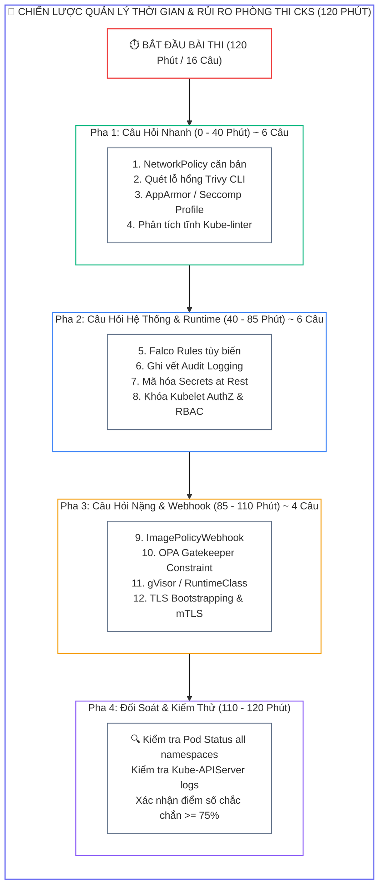
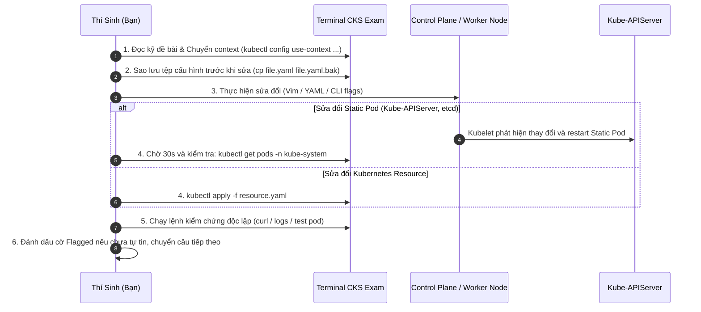
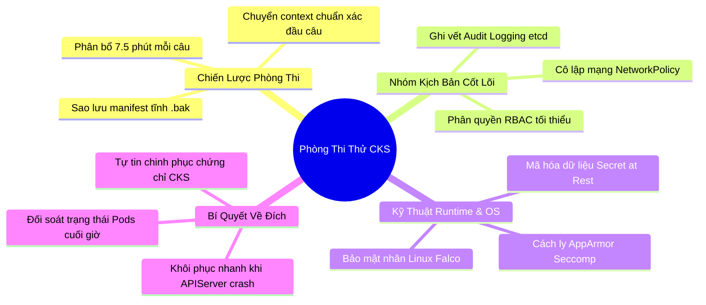


> [!IMPORTANT]
> **Mục tiêu kỹ thuật bài học**:
> - Mô phỏng chính xác áp lực phòng thi thực tế **CKS (Certified Kubernetes Security Specialist)** với thời lượng 120 phút và 16 câu hỏi thực hành.
> - Rèn luyện kỹ năng chuyển đổi ngữ cảnh (**Kubernetes Contexts & Namespaces**) an toàn trước khi thực hiện từng câu hỏi.
> - Làm chủ kỹ năng sửa đổi **Static Pods** (`kube-apiserver`, `etcd`, `kube-controller-manager`) mà không làm sập cụm.
> - Thành thạo xử lý các bài toán phối hợp đa công cụ: **Trivy**, **Falco**, **AppArmor**, **Seccomp**, **Kube-linter**, **Audit Logging**, và **Cosign**.
> - Nắm rõ bảng barem chấm điểm chi tiết và các bẫy trừ điểm thường gặp trong kỳ thi CKS chính thức.

---

## 1. Bản Chất Kiến Trúc & Tư Duy Cốt Lõi: Chiến Thuật Vượt Qua Kỳ Thi CKS

Kỳ thi CKS không kiểm tra lý thuyết trắc nghiệm mà là **100% bài thi thực hành (Performance-based Exam)** trên hệ thống Linux trực tiếp. Thí sinh phải đối mặt với 15–18 câu hỏi trong vòng 120 phút (trung bình **7.5 phút/câu**). 

Để đạt điểm số vượt ngưỡng đỗ (>= 67%), bạn cần một chiến lược phân bổ thời gian và quản lý rủi ro chuẩn xác:



---

## 2. Bảng Ma Trận So Sánh Kỹ Thuật Toàn Diện (Engineering Matrix)

| Miền Kiến Thức (Domain) | Tỷ Trọng Điểm Số | Các Chủ Đề Trọng Tâm | Mức Độ Rủi Ro / Khó Khăn |
| :--- | :--- | :--- | :--- |
| **Cluster Setup** | 10% | NetworkSecurityPolicy, Ingress TLS, Node CIS Benchmark | Trung bình |
| **Cluster Hardening** | 15% | RBAC Least Privilege, ServiceAccount Token, K8s API Hardening | Trung bình |
| **System Hardening** | 15% | AppArmor, Seccomp, Kernel modules, UFW / iptables | <span class="badge badge--rose">Khó (Thao tác trên Node OS)</span> |
| **Minimize Microservice Vulns** | 20% | Secrets Store CSI, mTLS, Pod Security Standards, gVisor | Rất phổ biến |
| **Supply Chain Security** | 20% | Trivy Image Scan, ImagePolicyWebhook, Hadolint, Cosign | <span class="badge badge--rose">Rất khó (Cấu hình Webhook)</span> |
| **Monitoring, Logging & Runtime** | 20% | Audit Policy, Falco Rules, Syscall Forensics | Rất phổ biến |

---

## 3. Kiến Trúc Môi Trường & Luồng Thực Thi Mẫu

Luồng thực hiện chuẩn mực cho mỗi câu hỏi trong phòng thi CKS:



---

## 4. Phân Tích Cạm Bẫy Thực Chiến: Chẩn Đoán & Xử Lý Sự Cố

### Cạm Bẫy 1: Sửa Sai File Kube-APIServer Làm Mất Toàn Bộ Kết Nối Cụm

Khi sửa tệp `/etc/kubernetes/manifests/kube-apiserver.yaml`, nếu có lỗi cú pháp thụt dòng YAML hoặc sai đường dẫn file mount, Kubelet sẽ ngừng chạy APIServer cũ và không thể khởi động APIServer mới. Lệnh `kubectl` sẽ báo lỗi `The connection to the server was refused`.

### Hậu Quả & Log Lỗi Thực Tế:

```text
# Lỗi mất kết nối toàn cụm:
$ kubectl get nodes
The connection to the server 127.0.0.1:6443 was refused - did you specify the right host or port?

# Kiểm tra log Kubelet để tìm nguyên nhân:
$ sudo journalctl -u kubelet -n 30 --no-pager | grep "kube-apiserver"
Sep 12 12:15:00 master-node kubelet[1200]: E0912 12:15:00.123456 pod_workers.go:1290] "Error syncing pod" pod="kube-system/kube-apiserver" err="yaml: line 42: did not find expected key"
```

### 5-Whys Root Cause Analysis:
1. **Tại sao cụm bị mất kết nối?** Kube-APIServer container không thể khởi động.
2. **Tại sao container không chạy?** Tệp manifest bị sai cú pháp YAML tại dòng 42.
3. **Tại sao không biết trước khi lưu?** Không sử dụng bản sao lưu dự phòng.
4. **Làm thế nào để phục hồi khẩn cấp?** Khôi phục lại ngay tệp sao lưu `.bak` ban đầu.
5. **Biện pháp phòng ngừa:** Luôn chạy `cp kube-apiserver.yaml /root/kube-apiserver.yaml.bak` trước khi chạm vào bất kỳ dòng nào.

---

### Cạm Bẫy 2: Quên Chuyển Context (K8s Context Switch) Đầu Mỗi Câu Hỏi

Mỗi câu hỏi CKS có thể thuộc một cụm khác nhau (`k8s`, `prod-cluster`, `sec-cluster`). Nếu không chạy lệnh chuyển context ở đầu bài, toàn bộ cấu hình bạn tạo sẽ nằm sai cụm và hệ thống chấm điểm tự động sẽ chấm 0 điểm câu đó.

### Hậu Quả & Log Lỗi Thực Tế:

```text
# Tạo tài nguyên trên sai cụm do quên switch context:
$ kubectl config current-context
staging-cluster  (SAI NGỮ CẢNH ĐỀ BÀI YÊU CẦU: production-cluster!)
```

```diff
  # Luôn copy lệnh chuyển context ở đầu đề bài trước khi làm:
+ kubectl config use-context production-cluster
```

---

## 5. Đề Thi Thử 16 Kịch Bản Thực Chiến (Hands-on CKS Mock Exam)

| Câu Số | Chủ Đề Kịch Bản | Trọng Lượng Điểm |
| :--- | :--- | :--- |
| **Kịch Bản 01** | Cấu hình NetworkPolicy cô lập Ingress/Egress cho DB Namespace | 6% |
| **Kịch Bản 02** | Kích hoạt AppArmor Profile chặn ghi tệp trong Pod | 6% |
| **Kịch Bản 03** | Khóa Seccomp Profile `RuntimeDefault` và Custom Profile | 6% |
| **Kịch Bản 04** | Quét lỗ hổng Container Image bằng Trivy và xóa Pod chứa CVE CRITICAL | 7% |
| **Kịch Bản 05** | Thiết lập Kubernetes Audit Policy ghi RequestResponse cho Secrets | 7% |
| **Kịch Bản 06** | Viết Falco Rule phát hiện mở shell và đọc `/etc/shadow` | 7% |
| **Kịch Bản 07** | Bật mã hóa dữ liệu Secret at Rest trong etcd bằng EncryptionConfiguration | 7% |
| **Kịch Bản 08** | Giới hạn quyền ServiceAccount: Tắt `automountServiceAccountToken` | 5% |
| **Kịch Bản 09** | Cấu hình Kubelet Hardening: Tắt Anonymous Auth, bật Webhook AuthZ | 6% |
| **Kịch Bản 10** | Cấu hình ImagePolicyWebhook với `defaultAllow: false` | 8% |
| **Kịch Bản 11** | Triển khai Sandbox Container Runtime gVisor (`runsc`) | 6% |
| **Kịch Bản 12** | Phân tích tĩnh Manifest bằng Kube-linter và sửa lỗi SecurityContext | 6% |
| **Kịch Bản 13** | Khóa đặc quyền Pod Security Standards: Áp nhãn `restricted` | 5% |
| **Kịch Bản 14** | Thiết lập RBAC tối thiểu: Tạo Role & RoleBinding chỉ đọc ConfigMap | 6% |
| **Kịch Bản 15** | Loại bỏ các cổng không an toàn và cờ nhạy cảm trên Kube-APIServer | 6% |
| **Kịch Bản 16** | Xác thực chữ ký số Image bằng Cosign trước khi triển khai | 6% |

---

### Kịch Bản 01: Cô Lập NetworkPolicy (6 Điểm)

**Đề bài:** Trong namespace `finance`, tạo NetworkPolicy tên `allow-api-to-db` chỉ cho phép Pod mang label `app: finance-api` kết nối tới Pod `app: database` trên cổng TCP `5432`. Mọi kết nối khác phải bị chặn hoàn toàn.

```yaml
# Lời giải:
apiVersion: networking.k8s.io/v1
kind: NetworkPolicy
metadata:
  name: allow-api-to-db
  namespace: finance
spec:
  podSelector:
    matchLabels:
      app: database
  policyTypes:
    - Ingress
  ingress:
    - from:
        - podSelector:
            matchLabels:
              app: finance-api
      ports:
        - protocol: TCP
          port: 5432
```

---

### Kịch Bản 04: Quét Lỗ Hổng Image Với Trivy (7 Điểm)

**Đề bài:** Quét tất cả Image đang chạy trong namespace `default`. Tìm Pod đang sử dụng Image chứa lỗ hổng có mức độ `CRITICAL` hoặc `HIGH` và xóa Pod đó.

```bash
# Lời giải:
# 1. Liệt kê các image trong namespace default:
kubectl get pods -n default -o jsonpath='{range .items[*]}{.metadata.name}{"\t"}{.spec.containers[*].image}{"\n"}{end}'

# 2. Quét từng image bằng Trivy:
trivy image --severity HIGH,CRITICAL nginx:1.14.2

# 3. Nếu phát hiện lỗ hổng nghiêm trọng, xóa Pod vi phạm:
kubectl delete pod <tên-pod-chứa-image-lỗi> -n default
```

---

### Kịch Bản 06: Tùy Biến Falco Rule (7 Điểm)

**Đề bài:** Chỉnh sửa tệp `/etc/falco/falco_rules.local.yaml` để thêm một quy tắc mới tên `Detect Sensitive File Access` bắt sự kiện đọc tệp `/root/.ssh/id_rsa` trong mọi container với mức cảnh báo `CRITICAL`.

```yaml
# Lời giải trong /etc/falco/falco_rules.local.yaml:
- rule: Detect Sensitive File Access
  desc: Bat hanh vi doc private key trong container
  condition: container and evt.type in (open, openat) and fd.name = "/root/.ssh/id_rsa"
  output: "CANH BAO DOC SSH KEY (user=%user.name pod=%k8s.pod.name file=%fd.name)"
  priority: CRITICAL
```

```bash
# Kiểm tra cú pháp và nạp lại dịch vụ:
sudo falco -V /etc/falco/falco_rules.local.yaml
sudo systemctl restart falco
```

---

### Kịch Bản 07: Mã Hóa Secret At Rest Trong etcd (7 Điểm)

**Đề bài:** Tạo tệp `EncryptionConfiguration` mã hóa provider `aescbc` tại `/etc/kubernetes/enc/enc-config.yaml` và áp dụng vào Kube-APIServer. Sau đó mã hóa lại toàn bộ Secret hiện có trong cụm.

```yaml
# Lời giải: /etc/kubernetes/enc/enc-config.yaml
apiVersion: apiserver.config.k8s.io/v1
kind: EncryptionConfiguration
resources:
  - resources:
      - secrets
    providers:
      - aescbc:
          keys:
            - name: key1
              secret: c2VjcmV0IGlzIHNlY3VyZSAxNiBieXRlcw== # Base64 32-byte key
      - identity: {}
```

```bash
# Cập nhật kube-apiserver manifest thêm cờ:
# --encryption-provider-config=/etc/kubernetes/enc/enc-config.yaml
# Mount volume tương ứng, sau đó mã hóa lại toàn bộ secret:
kubectl get secrets --all-namespaces -o json | kubectl replace -f -
```

---

## 6. 10 Câu Hỏi Tự Kiểm Tra Chuyên Sâu (Self-Check Q&A Accordion)

<details class="qa-card">
  <summary><b>Câu 1: Trong phòng thi CKS, thao tác đầu tiên bắt buộc phải làm trước khi đọc nội dung câu hỏi là gì?</b></summary>
  <div class="qa-answer">
    <div>Luôn luôn sao chép và thực thi <b>lệnh chuyển ngữ cảnh (Context Switching)</b> được cung cấp ở đầu mỗi câu hỏi (ví dụ: <code>kubectl config use-context cluster1-admin@cluster1</code>) để đảm bảo mọi thao tác được áp dụng chính xác trên cụm mục tiêu.</div>
  </div>
</details>

<details class="qa-card">
  <summary><b>Câu 2: Nếu Kube-APIServer không tự khởi động lại sau 1 phút kể từ khi sửa manifest, cách khắc phục nhanh nhất là gì?</b></summary>
  <div class="qa-answer">
    <div>Di chuyển tệp manifest bị lỗi ra ngoài thư mục <code>/etc/kubernetes/manifests/</code> (ví dụ: chuyển ra <code>/tmp/</code>), khôi phục lại tệp sao lưu <code>kube-apiserver.yaml.bak</code>, sau đó kiểm tra log kubelet qua lệnh <code>sudo journalctl -u kubelet -n 30</code> để tìm lỗi sai cú pháp trước khi thử lại.</div>
  </div>
</details>

<details class="qa-card">
  <summary><b>Câu 3: Làm thế nào để kiểm tra một Secret đã thực sự được mã hóa an toàn bên trong etcd?</b></summary>
  <div class="qa-answer">
    <div>Sử dụng lệnh <b><code>etcdctl get /registry/secrets/&lt;namespace&gt;/&lt;tên-secret&gt;</code></b> kèm chứng chỉ PKI. Nếu chuỗi đầu ra có tiền tố <code>k8s:enc:aescbc:v1:key1</code> và dữ liệu phía sau là nhị phân mã hóa, cấu hình đã thành công 100%.</div>
  </div>
</details>

<details class="qa-card">
  <summary><b>Câu 4: Khi được yêu cầu xóa một Pod không an toàn do Trivy phát hiện, nếu Pod đó được quản lý bởi Deployment thì phải làm thế nào?</b></summary>
  <div class="qa-answer">
    <div>Nếu xóa Pod đơn thuần, ReplicaSet sẽ tự động sinh lại Pod mới. Ta phải <b>chỉnh sửa Deployment (hoặc cập nhật Image an toàn / giảm replicas về 0)</b> bằng lệnh <code>kubectl set image deployment/&lt;tên&gt;</code> hoặc <code>kubectl scale deployment &lt;tên&gt; --replicas=0</code>.</div>
  </div>
</details>

<details class="qa-card">
  <summary><b>Câu 5: Cú pháp nhanh để tạo nhanh một NetworkPolicy chặn toàn bộ Ingress (Default Deny) là gì?</b></summary>
  <div class="qa-answer">
    <div>Khai báo đối tượng NetworkPolicy với <code>podSelector: {}</code> (chọn toàn bộ Pod trong namespace) và <code>policyTypes: ["Ingress"]</code> mà không khai báo bất kỳ khối <code>ingress:</code> nào.</div>
  </div>
</details>

<details class="qa-card">
  <summary><b>Câu 6: Làm thế nào để áp dụng Seccomp profile mặc định cho toàn bộ Pod theo chuẩn Kubernetes 1.19+?</b></summary>
  <div class="qa-answer">
    <div>Khai báo trong khối <b><code>spec.securityContext.seccompProfile.type: RuntimeDefault</code></b> (thay thế cho annotation cũ <code>container.seccomp.security.alpha.kubernetes.io</code> đã lỗi thời).</div>
  </div>
</details>

<details class="qa-card">
  <summary><b>Câu 7: Điểm số tối thiểu để vượt qua kỳ thi CKS là bao nhiêu và thời gian thi là bao lâu?</b></summary>
  <div class="qa-answer">
    <div>Điểm số tối thiểu để đỗ chứng chỉ CKS là <b>67%</b> trên tổng điểm, trong tổng thời gian làm bài là <b>120 phút (2 giờ)</b>.</div>
  </div>
</details>

<details class="qa-card">
  <summary><b>Câu 8: Thí sinh được phép truy cập những trang tài liệu nào trong suốt quá trình thi CKS?</b></summary>
  <div class="qa-answer">
    <div>Thí sinh được phép mở 1 tab trình duyệt bổ sung truy cập: <b>https://kubernetes.io/docs/</b>, <b>https://github.com/kubernetes/</b>, <b>https://kubernetes.io/blog/</b>, và tài liệu chính thức của các công cụ bên thứ ba nằm trong phạm vi thi như <b>Falco Docs</b>, <b>Trivy Docs</b>, <b>AppArmor Docs</b>.</div>
  </div>
</details>

<details class="qa-card">
  <summary><b>Câu 9: Khi nào nên sử dụng cờ <code>--force --grace-period=0</code> khi thao tác với Pod trong phòng thi?</b></summary>
  <div class="qa-answer">
    <div>Sử dụng khi cần <b>xóa khẩn cấp một Pod bị treo (Terminating)</b> để tiết kiệm thời gian quý báu trong phòng thi: <code>kubectl delete pod &lt;tên-pod&gt; --force --grace-period=0</code>.</div>
  </div>
</details>

<details class="qa-card">
  <summary><b>Câu 10: Quy tắc quản lý thời gian quan trọng nhất khi gặp một câu hỏi quá khó hoặc bị lỗi không rõ nguyên nhân?</b></summary>
  <div class="qa-answer">
    <div>Nếu đã tiêu tốn quá <b>8 phút</b> cho một câu hỏi mà vẫn chưa tìm ra giải pháp, hãy lập tức gắn cờ (<b>Flag for review</b>), ghi chú lại số câu ra nháp và chuyển ngay sang câu tiếp theo để tối đa hóa điểm số từ các câu dễ hơn.</div>
  </div>
</details>

---

## 7. Tổng Kết & Lộ Trình Bài Học Tiếp Theo



> [!TIP]
> **Bài học tiếp theo:** Tổng hợp toàn bộ bí kíp, lệnh tắt thần tốc và bảng tra cứu khẩn cấp trong bài kết thúc khóa học **[Bài 21] Bảng Tra Cứu Tốc Độ & Chiến Thuật Về Đích Kỳ Thi CKS](cks-21-21-tong-on-cks-toc-do.html)**.

