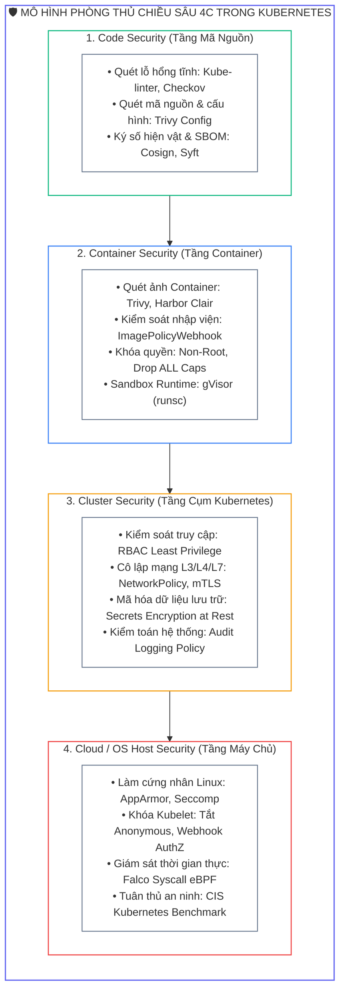
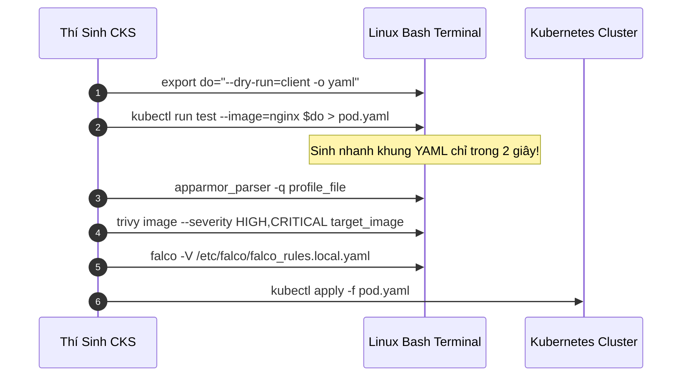
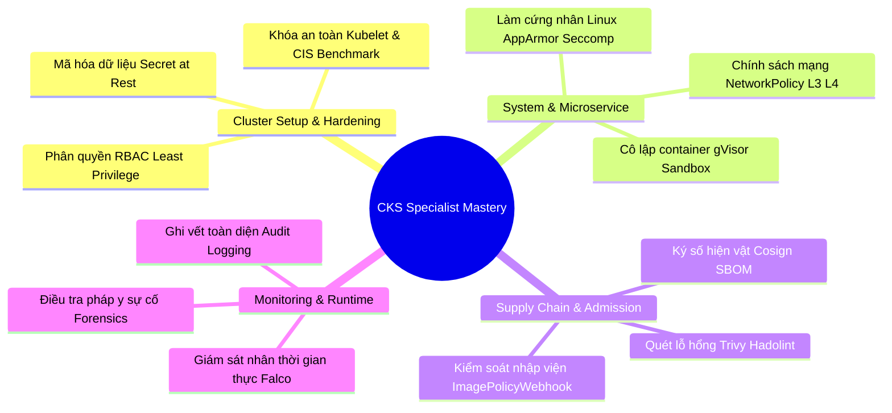


> [!IMPORTANT]
> **Mục tiêu kỹ thuật bài học**:
> - Tổng hợp và hệ thống hóa toàn bộ kiến thức của chuỗi 21 bài học **CKS Security Specialist Mastery**.
> - Nắm vững danh mục **đường dẫn tệp tin trọng yếu** trên máy chủ Linux Control Plane và Worker Node.
> - Làm chủ bảng tra cứu nhanh các **câu lệnh dòng lệnh (CLI Cheat Sheet)** cho `kubectl`, `crictl`, `falco`, `trivy`, `apparmor_parser`, `cosign`.
> - Nắm trọn các mẫu YAML tối giản giúp tiết kiệm tối đa thời gian gõ phím trong phòng thi.
> - Áp dụng quy trình kiểm thử và đối soát an toàn trước khi nộp bài để đạt điểm số xuất sắc (>= 85%).

---

## 1. Bản Chất Kiến Trúc & Tư Duy Cốt Lõi: Bản Đồ Toàn Cảnh An Ninh Kubernetes

Chương trình **CKS (Certified Kubernetes Security Specialist)** xây dựng một mô hình phòng thủ theo chiều sâu (**Defense-in-Depth**) bao phủ toàn bộ 4 lớp an ninh của điện toán đám mây (**The 4Cs of Cloud Native Security**): **Cloud**, **Cluster**, **Container**, và **Code**.



---

## 2. Bảng Tra Cứu Đường Dẫn Tệp Trọng Yếu Trên Hệ Thống (Critical File Paths)

| Thành Phần Hệ Thống | Đường Dẫn Tệp Tin / Thư Mục Mặc Định |
| :--- | :--- |
| **Static Pod Manifests** | `/etc/kubernetes/manifests/` (`kube-apiserver.yaml`, `etcd.yaml`, `kube-controller-manager.yaml`) |
| **Kubelet Configuration** | `/var/lib/kubelet/config.yaml` hoặc `/etc/kubernetes/kubelet.conf` |
| **PKI TLS Certificates** | `/etc/kubernetes/pki/` (`ca.crt`, `apiserver.crt`, `apiserver-etcd-client.crt`) |
| **AppArmor Profiles** | `/etc/apparmor.d/` (Nạp bằng `apparmor_parser -q /etc/apparmor.d/<profile>`) |
| **Seccomp Profiles** | `/var/lib/kubelet/seccomp/` (Thư mục mặc định cho local profiles) |
| **Falco Configuration** | `/etc/falco/falco.yaml` và `/etc/falco/falco_rules.local.yaml` |
| **Audit Policy File** | `/etc/kubernetes/audit-policy.yaml` (Do thí sinh tự tạo theo đề bài) |
| **Secrets Encryption Config** | `/etc/kubernetes/enc/enc-config.yaml` (Do thí sinh tự tạo theo đề bài) |
| **ImagePolicyWebhook Config**| `/etc/kubernetes/admission/admission-config.yaml` và `kubeconfig.yaml` |
| **Containerd Config** | `/etc/containerd/config.toml` (Cấu hình gVisor `runsc` runtime) |

---

## 3. Bảng Lệnh Tắt Thần Tốc (CLI Speed Cheat Sheet)



### 1. Thiết Lập Môi Trường Dòng Lệnh Nhanh

```bash
# Thêm vào ~/.bashrc trong 10 giây đầu bài thi:
alias k=kubectl
alias kgp="kubectl get pods"
alias kgs="kubectl get svc"
export do="--dry-run=client -o yaml"
export now="--force --grace-period=0"
```

### 2. Quét Lỗ Hổng Ảnh Bằng Trivy

```bash
# Quét chỉ lọc các lỗi CRITICAL và lưu kết quả:
trivy image --severity CRITICAL <image-name>

# Bỏ qua các lỗi chưa có bản vá (unfixed):
trivy image --ignore-unfixed --severity HIGH,CRITICAL <image-name>
```

### 3. Nạp và Kiểm Tra AppArmor Profile

```bash
# Nạp profile mới vào nhân Linux:
sudo apparmor_parser -q /etc/apparmor.d/k8s-deny-write

# Kiểm tra trạng thái các profile đang hoạt động:
sudo aa-status | grep k8s-deny-write
```

### 4. Kiểm Tra Cú Pháp Falco Rules

```bash
# Kiểm tra hợp lệ cú pháp trước khi restart:
sudo falco -V /etc/falco/falco_rules.local.yaml

# Khởi động lại và kiểm tra log:
sudo systemctl restart falco
sudo journalctl -u falco -n 20 --no-pager
```

### 5. Mã Hóa Lại Toàn Bộ Secret Sau Khi Bật Encryption Provider

```bash
kubectl get secrets --all-namespaces -o json | kubectl replace -f -
```

---

## 4. Tổng Hợp Mẫu YAML Cốt Lõi Thường Gặp Nhất Trong CKS

### 1. Pod Bảo Mật Chuẩn Restricted (SecurityContext Full)

```yaml
apiVersion: v1
kind: Pod
metadata:
  name: hardened-pod
spec:
  securityContext:
    runAsNonRoot: true
    runAsUser: 10001
    runAsGroup: 10001
    seccompProfile:
      type: RuntimeDefault
  containers:
  - name: app
    image: nginx:1.25.4-alpine
    securityContext:
      allowPrivilegeEscalation: false
      readOnlyRootFilesystem: true
      capabilities:
        drop: ["ALL"]
    resources:
      requests:
        cpu: "50m"
        memory: "64Mi"
      limits:
        cpu: "200m"
        memory: "128Mi"
    volumeMounts:
    - mountPath: /tmp
      name: tmp-dir
  volumes:
  - name: tmp-dir
    emptyDir: {}
```

### 2. NetworkPolicy Khóa Mặc Định (Default Deny All Ingress & Egress)

```yaml
apiVersion: networking.k8s.io/v1
kind: NetworkPolicy
metadata:
  name: default-deny-all
  namespace: secure-ns
spec:
  podSelector: {}
  policyTypes:
  - Ingress
  - Egress
```

### 3. Tệp Mã Hóa Dữ Liệu Secret At Rest (`enc-config.yaml`)

```yaml
apiVersion: apiserver.config.k8s.io/v1
kind: EncryptionConfiguration
resources:
  - resources:
      - secrets
    providers:
      - aescbc:
          keys:
            - name: key1
              secret: <BASE64_32_BYTE_STRING>
      - identity: {}
```

---

## 5. Danh Sách Kiểm Tra 10 Phút Trước Giờ G (Pre-Exam Checklist)

### Hậu Quả & Log Lỗi Thực Tế Khi Quên Kiểm Tra Toàn Bộ Cụm:

```text
# Lỗi phổ biến: Một Static Pod bị lỗi CrashLoop sau khi thí sinh chuyển câu hỏi khác:
$ kubectl get pods -n kube-system
NAME                                    READY   STATUS             RESTARTS   AGE
kube-apiserver-control-plane            0/1     CrashLoopBackOff   5          10m
```

### Bảng Kiểm Tra Đối Soát Trước Khi Submit Bài Thi:

| Hạng Mục Kiểm Tra | Thao Tác Thực Hiện | Trạng Thái Đạt Chuẩn |
| :--- | :--- | :--- |
| **1. Kiểm tra Static Pods** | `kubectl get pods -n kube-system` | 100% Pods ở trạng thái `Running 1/1` |
| **2. Kiểm tra AppArmor** | `sudo aa-status` | Profile yêu cầu hiển thị ở mục `enforce` |
| **3. Kiểm tra Falco Daemon** | `sudo systemctl status falco` | Trạng thái `active (running)` |
| **4. Kiểm tra Secrets Encryption** | `etcdctl get /registry/secrets/...` | Chuỗi đầu ra có tiền tố `k8s:enc:aescbc:v1` |
| **5. Kiểm tra Pods Namespace** | `kubectl get pods -A` | Không có Pod nào bị lỗi `CrashLoopBackOff` |

---

## 6. 10 Câu Hỏi Tự Kiểm Tra Chuyên Sâu (Self-Check Q&A Accordion)

<details class="qa-card">
  <summary><b>Câu 1: Ba cờ cốt lõi trên Kubelet để đạt chuẩn bảo mật CIS Benchmark là gì?</b></summary>
  <div class="qa-answer">
    <div>Ba cờ bắt buộc: (1) <b><code>--anonymous-auth=false</code></b> (Tắt xác thực nặc danh), (2) <b><code>--authorization-mode=Webhook</code></b> (Bật ủy quyền qua APIServer Webhook), và (3) <b><code>--read-only-port=0</code></b> (Đóng cổng xem thông số không mã hóa 10255).</div>
  </div>
</details>

<details class="qa-card">
  <summary><b>Câu 2: Cách tạo chuỗi khóa bí mật 32-byte Base64 ngẫu nhiên cho EncryptionConfiguration là gì?</b></summary>
  <div class="qa-answer">
    <div>Chạy lệnh Linux: <b><code>head -c 32 /dev/urandom | base64</code></b>. Sao chép chuỗi kết quả và dán vào trường <code>secret</code> trong tệp cấu hình mã hóa.</div>
  </div>
</details>

<details class="qa-card">
  <summary><b>Câu 3: Làm thế nào để áp dụng một AppArmor Profile cho Pod theo chuẩn Kubernetes 1.30+?</b></summary>
  <div class="qa-answer">
    <div>Khai báo trong trường <b><code>spec.securityContext.appArmorProfile.type: Localhost</code></b> kết hợp với <b><code>spec.securityContext.appArmorProfile.localhostProfile: &lt;tên-profile&gt;</code></b> bên trong tệp Manifest YAML.</div>
  </div>
</details>

<details class="qa-card">
  <summary><b>Câu 4: Khi nào nên sử dụng cờ <code>insecure-skip-tls-verify: true</code> trong tệp Kubeconfig của ImagePolicyWebhook?</b></summary>
  <div class="qa-answer">
    <div>Chỉ sử dụng khi Webhook Server chạy trên địa chỉ cục bộ (<code>127.0.0.1</code>) và đề bài thi không cung cấp tệp chứng chỉ CA riêng, nhằm bỏ qua bước xác thực TLS nghiêm ngặt để tiết kiệm thời gian thiết lập.</div>
  </div>
</details>

<details class="qa-card">
  <summary><b>Câu 5: Sự khác nhau giữa lệnh <code>kubectl replace</code> và <code>kubectl apply</code> trong phòng thi là gì?</b></summary>
  <div class="qa-answer">
    <div><b><code>kubectl apply</code></b> thực hiện cơ chế Two-Way / Three-Way Merge Patch. <b><code>kubectl replace --force</code></b> sẽ xóa hẳn đối tượng cũ và tạo mới hoàn toàn, rất hữu ích khi cần cập nhật các trường bất biến (Immutable fields) mà không thể sửa trực tiếp.</div>
  </div>
</details>

<details class="qa-card">
  <summary><b>Câu 6: Lệnh nào giúp kiểm tra nhanh quyền hạn của tài khoản người dùng hiện tại đối với một tài nguyên cụ thể?</b></summary>
  <div class="qa-answer">
    <div>Sử dụng lệnh: <b><code>kubectl auth can-i &lt;verb&gt; &lt;resource&gt; --as=&lt;username&gt; -n &lt;namespace&gt;</code></b> (ví dụ: <code>kubectl auth can-i get secrets --as=developer -n dev</code>).</div>
  </div>
</details>

<details class="qa-card">
  <summary><b>Câu 7: Làm thế nào để ngăn chặn một Pod tự động gắn kết mã Token của ServiceAccount?</b></summary>
  <div class="qa-answer">
    <div>Khai báo trường <b><code>automountServiceAccountToken: false</code></b> trong định nghĩa của <code>ServiceAccount</code> hoặc trực tiếp trong khối <code>spec</code> của <code>Pod</code>.</div>
  </div>
</details>

<details class="qa-card">
  <summary><b>Câu 8: Cấu hình nào trong tệp Audit Policy giúp loại trừ hoàn toàn các sự kiện không cần thiết?</b></summary>
  <div class="qa-answer">
    <div>Đặt quy tắc có <b><code>level: None</code></b> ở đầu danh sách <code>rules</code> đối với các nhóm tài nguyên hoặc tài khoản ồn ào (như <code>endpoints</code>, <code>leases</code>, <code>system:kube-proxy</code>).</div>
  </div>
</details>

<details class="qa-card">
  <summary><b>Câu 9: Khi nào một container cần được cấp RuntimeClass là <code>gvisor</code> (hoặc <code>runsc</code>)?</b></summary>
  <div class="qa-answer">
    <div>Khi container chạy các ứng dụng không tin cậy (<b>Untrusted Code</b>), nhận đầu vào trực tiếp từ Internet, hoặc ứng dụng đa khách hàng (<b>Multi-tenancy</b>) cần cách ly tuyệt đối với nhân Linux của máy chủ Host.</div>
  </div>
</details>

<details class="qa-card">
  <summary><b>Câu 10: Tinh thần cốt lõi nhất để vượt qua kỳ thi CKS thành công là gì?</b></summary>
  <div class="qa-answer">
    <div><b>Bình tĩnh, cẩn thận sao lưu cấu hình (.bak), chuyển context chính xác đầu mỗi câu, và luôn kiểm tra xác thực độc lập sau khi hoàn thành từng kịch bản.</b></div>
  </div>
</details>

---

## 7. Tổng Kết & Lộ Trình Hoàn Thành Khóa Học



> [!TIP]
> **Chúc mừng bạn đã hoàn thành toàn bộ khóa học CKS Security Specialist Mastery!** Bạn đã trang bị trọn vẹn kiến thức lý thuyết chuyên sâu và kỹ năng thực hành đỉnh cao. Hãy ôn luyện lại các bài lab và tự tin đăng ký lịch thi để chinh phục chứng chỉ **Certified Kubernetes Security Specialist (CKS)**. Bạn có thể xem lại bài mở đầu khóa học tại **[Bài 01: Thiết Lập NetworkPolicy Chuyên Sâu Chuẩn CKS](cks-01-01-cks-network-security-policy.html)**.

