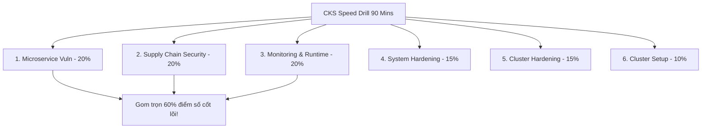
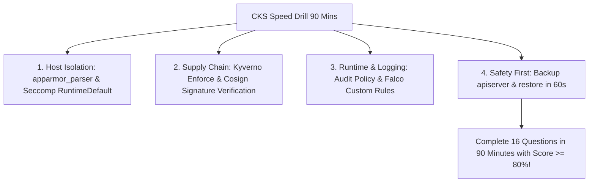
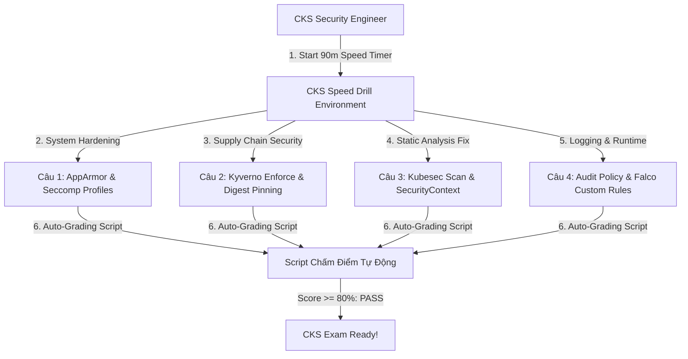


# [BÀI 21] TỔNG ÔN TỐC ĐỘ CKS: GIẢI QUYẾT 16 BÀI TẬP THỰC HÀNH AN NINH CỤM TRONG 90 PHÚT

Trong kỷ nguyên điện toán đám mây và kiến trúc microservices phân tán quy mô lớn, **Kubernetes (CKS)** đóng vai trò là nền tảng điều phối container (Container Orchestration) tiêu chuẩn công nghiệp. Để làm chủ hệ thống trong môi trường sản xuất (Production) cũng như chinh phục kỳ thi chứng chỉ quốc tế của Linux Foundation / CNCF, kỹ sư không chỉ nắm vững các câu lệnh thao tác cơ bản mà phải thấu hiểu sâu sắc bản chất cơ chế tầng thấp: từ chu trình điều hòa (Reconciliation Loop), cấu trúc điều phối tài nguyên, kiến trúc mạng CNI, lưu trữ CSI cho đến các chuẩn mực an ninh phòng thủ chiều sâu.

Bài viết chuyên sâu này sẽ đồng hành cùng bạn giải mã toàn diện bức tranh kiến trúc, phân tích các đánh đổi kỹ thuật thực chiến (Engineering Trade-offs), cung cấp bài thực hành Lab từng bước và bộ câu hỏi phỏng vấn chuẩn Architect / Lead Engineer.

---

## 1. Bản Chất Kiến Trúc & Cơ Chế Vận Hành Tầng Thấp

| # | Câu hỏi ôn tập | Đáp án chuẩn ngắn gọn |
|---|---|---|
| 1 | Miền kiến thức CKAD trọng số lớn nhất? | **Config & Security (25 %)** |
| 2 | Lệnh imperatively tạo CronJob? | **`kubectl create cronjob`** |
| 3 | Cú pháp nạp toàn bộ ConfigMap vào Pod? | **`envFrom.configMapRef`** |
| 4 | Tác động của LivenessProbe failure? | **Restart (kill) container** |
| 5 | Lệnh đọc log của container vừa crash? | Lệnh **`kubectl logs --previous`** |


> **"Tổng ôn tốc độ chứng chỉ CKS (Certified Kubernetes Security Specialist) bằng bài thực hành nén 16 câu bài tập bảo mật nâng cao trong 90 phút là đỉnh cao phản xạ phòng thủ và gia cố an ninh cụm Kubernetes (Hardening & Runtime Security), đòi hỏi chuyên gia bảo mật phải tập trung tối đa vào 3 miền trọng số cao nhất (Minimize Microservice Vulnerabilities 20%, Supply Chain Security 20%, và Monitoring/Logging/Runtime Security 20%); làm chủ kỹ thuật thắt chặt rào chắn cách ly bằng AppArmor và Seccomp; biên soạn thành thục chính sách Kyverno Allowed Registries, xác minh chữ ký hiện vật Cosign, nâng điểm bảo mật Kubesec; cấu hình tệp nhật ký kiểm toán Audit Policy và quy tắc giám sát thời gian chạy Falco; đồng thời duy trì tốc độ trung bình 5,5 phút mỗi câu để hoàn thành trọn vẹn đề thi với điểm số tuyệt đối."**

**Kết quả từ các buổi trước được sử dụng lại:**

| Kết quả / Công cụ | Buổi + số hiệu `QT` | Dùng ở đâu trong buổi này |
|---|---|---|
| Thắt chặt Seccomp & AppArmor profiles | Buổi 52, 53 `QT 4.1` | Giải quyết các câu hỏi miền System Hardening CKS |
| Kyverno Allowed Registries & Cosign SBOM | Buổi 59, 61 `QT 4.1` | Giải quyết các câu hỏi miền Supply Chain Security CKS |
| Audit Logging & Falco Custom Rules | Buổi 63, 64 `QT 4.1` | Giải quyết các câu hỏi miền Monitoring & Runtime CKS |

---


| # | Kỹ năng thực hiện được | Hiện vật chứng minh |
|---|---|---|
| 1 | Nắm vững ma trận 6 miền CKS và chiến thuật gom trọn 60% điểm số | Bảng phân tích 3 miền trọng số 20% CKS |
| 2 | Nạp AppArmor profile và gán annotation vào Pod spec trong 1 phút | Tệp lệnh `apparmor_parser -r` và Pod manifest |
| 3 | Biên soạn Kyverno Allowed Registries policy ở chế độ Enforce | Tệp YAML `ClusterPolicy` Kyverno |
| 4 | Cấu hình Audit Logging và khôi phục apiserver khi bị sập trong 60s | Tệp `audit-policy.yaml` và cờ kube-apiserver |
| 5 | Hoàn thành bài thi tốc độ 16 câu CKS trong 90 phút đạt trên 80/100 điểm | Bảng điểm tự động bài CKS speed drill |

---


| Kiến thức tiên quyết | Nguồn tự học nếu thiếu |
|---|---|
| Cấu hình AppArmor và Seccomp profiles | Buổi 52, 53 (`QT 4.1`) |
| Kyverno Policy và Cosign Image Verification | Buổi 59, 61 (`QT 4.1`) |
| Audit Logging và Falco Custom Rules | Buổi 63, 64 (`QT 4.1`) |

---


### 3.1. Thuật ngữ Việt–Anh

| # | Thuật ngữ tiếng Việt | Tiếng Anh tương đương | Ghi chú chuẩn hoá trong thân bài |
|---|---|---|---|
| 1 | Tổng ôn tốc độ CKS | CKS Speed Drill | Bài thực hành nén 16 câu CKS bảo mật trong 90 phút |
| 2 | Nạp hồ sơ AppArmor | AppArmor Profile Parsing | Lệnh `apparmor_parser -r /etc/apparmor.d/profile` |
| 3 | Hồ sơ lọc syscall Seccomp | Seccomp Profile Path | Khai báo `seccompProfile.type: Localhost` trong Pod spec |
| 4 | Chính sách kho ảnh Kyverno | Kyverno Allowed Registries | Biên soạn `ClusterPolicy` kiểm soát domain kho ảnh |
| 5 | Xác minh chữ ký hiện vật Cosign | Cosign Signature Verification | Lệnh `cosign verify --key cosign.pub image` |
| 6 | Phân tích tĩnh bản kê khai Kubesec | Kubesec Static Analysis | Lệnh `kubesec scan` và sửa Pod spec đạt điểm dương |
| 7 | Cấp độ ghi nhật ký kiểm toán | Audit Policy Level | Mức `Metadata`, `Request`, `RequestResponse` trong policy.yaml |
| 8 | Quy tắc giám sát thời gian chạy | Falco Custom Rule | Quy tắc đủ 5 thành tố bắt hành vi shell/bin write trong container |
| 9 | Phong tỏa mạng NetworkPolicy | Isolation NetworkPolicy | NetworkPolicy cấm 100% lưu lượng Ingress/Egress không phép |
| 10 | Phân quyền RBAC tối thiểu | Least Privilege RBAC | Cấu hình Role/ClusterRole thu hẹp tối đa quyền hạn |
| 11 | Cấm cờ tag mutable | Disallow Mutable Tag | Cấm tag `:latest` và ghim mã băm bất biến Image Digest |
| 12 | Khôi phục Static Pod khẩn cấp | Emergency Apiserver Restore | Thao tác `sudo cp apiserver.bak kube-apiserver.yaml` |
| 13 | Bảng ghi điểm tự động CKS | CKS Auto-Grading Script | Script kiểm tra kết quả 16 câu bài tập CKS |
| 14 | Tốc độ xử lý câu hỏi bảo mật | Security Task Execution Speed | Chỉ số thời gian trung bình 5,5 phút mỗi câu |


Mô hình Đội Phản Ứng Nhanh Đặc Nhiệm SWAT Trong Tình Huống Giải Cứu Con Con: Kỳ thi CKS là Đỉnh Cao Về Bảo Mật Kubernetes Nơi Mọi Thao Tác Cấu Hình Cần Độ Chính Xác Và Tốc Độ Phản Xạ Cực Kỳ Cao. Giống như Đội Đặc Nhiệm SWAT Đột Nhập Tòa Nhà: không có chỗ cho sự do dự hay thử sai (trial & error). Chỉ cần gõ sai 1 dòng syntax YAML trong `kube-apiserver.yaml`, toàn bộ Control Plane sẽ bị sập. `CKS Speed Drill` giống như Cuộc Diễn Tập Đột Nhập Thực Tế Bấm Giờ 90 Phút: buộc chuyên gia bảo mật phải thuộc lòng vị trí các profile AppArmor/Seccomp, biên soạn chính xác 100% các tệp Kyverno policy và Audit policy trong 2 phút, nạp nhanh quy tắc Falco, và sở hữu bản lĩnh khôi phục Control Plane bị sập trong đúng 60 giây để hoàn thành 16 thử thách bảo mật với kết quả tuyệt đối.

---

### 1.1. Ma trận 6 Miền CKS và Tập trung Gom điểm 3 Miền Trọng số 20% (12 phút)

**Nguyên lý cốt lõi:** Tất cả các ứng viên CKS BẮT BUỘC phải làm chủ kỹ năng xử lý 16 câu bài tập bảo mật nâng cao trong 90 phút (trung bình 5,5 phút/câu) trước khi tham gia thi thật.

**Giải thích cơ chế ngầm:** Kỳ thi CKS chứa nhiều câu bảo mật phức tạp, nếu không rèn luyện tốc độ phản xạ CLI, thí sinh sẽ trễ tiến độ bài thi.

> [!WARNING]
> **CẠM BẪY THỰC CHIẾN:**
> Dành quá 15 phút cho một câu biên soạn Kyverno ClusterPolicy.

**Minh hoạ.**



**Nguyên lý cốt lõi:** Hiểu rõ ma trận 6 miền CKS và tập trung gom trọn 60% điểm số tại 3 miền trọng số 20%: Minimize Microservice Vulnerabilities (20%), Supply Chain Security (20%), Monitoring/Logging/Runtime Security (20%).

**Giải thích cơ chế ngầm:** 3 miền này chiếm tổng cộng 60 điểm bài thi. Hoàn thành chính xác 100% các câu hỏi thuộc 3 miền này kết hợp với miền Cluster Hardening (15%) sẽ đảm bảo đỗ chứng chỉ với điểm số xuất sắc.

> [!WARNING]
> **CẠM BẪY THỰC CHIẾN:**
> Bỏ dở các câu Audit Logging và Falco Rules để ngồi mò 1 câu Cluster Setup khó.

**Minh hoạ.**

```yaml
# Ma trận trọng số bài thi CKS CNCF:
# - Minimize Microservice Vulnerabilities: 20%
# - Supply Chain Security: 20%
# - Monitoring, Logging and Runtime Security: 20%
# - Cluster Hardening: 15%
# - System Hardening: 15%
# - Cluster Setup: 10%
```

---

### 1.2. Kỹ thuật Phản xạ CLI Bảo mật Siêu tốc: AppArmor, Seccomp, Kyverno & Cosign (12 phút)

**Nguyên lý cốt lõi:** Khi làm bài AppArmor, BẮT BUỘC phải nạp profile vào Linux kernel bằng lệnh `apparmor_parser -q -r /etc/apparmor.d/profile` trước khi gán annotation vào Pod spec.

**Giải thích cơ chế ngầm:** Nếu profile chưa được nạp vào Kernel của Host Node, Pod gán AppArmor annotation sẽ lập tức bị báo lỗi `BlockedByAppArmor`.

> [!WARNING]
> **CẠM BẪY THỰC CHIẾN:**
> Gán annotation AppArmor trong Pod spec mà quên chạy lệnh `apparmor_parser`.

**Minh hoạ.**

```bash
# Quy trình 2 bước triển khai AppArmor chuẩn CKS:
# Bước 1: Nạp profile vào Linux Kernel
sudo apparmor_parser -q -r /etc/apparmor.d/k8s-deny-write

# Bước 2: Gán annotation vào Pod spec
metadata:
  annotations:
    container.apparmor.security.beta.kubernetes.io/app: localhost/k8s-deny-write
```

**Nguyên lý cốt lõi:** Khi cấu hình Seccomp profile trong K8s v1.30+, LUÔN LUÔN khai báo dưới khối `spec.securityContext.seccompProfile` hoặc `container.securityContext.seccompProfile` với `type: RuntimeDefault` hoặc `type: Localhost`.

**Giải thích cơ chế ngầm:** Chuẩn Kubernetes v1.30+ đã bỏ các cờ annotations cũ và chuyển hoàn toàn sang thuộc tính `seccompProfile` dưới `securityContext`.

> [!WARNING]
> **CẠM BẪY THỰC CHIẾN:**
> Sử dụng cờ annotation Seccomp deprecated cũ trong Pod spec.

**Minh hoạ.**

```yaml
# Cấu hình Seccomp profile chuẩn K8s v1.30+:
spec:
  securityContext:
    seccompProfile:
      type: RuntimeDefault
```

**Nguyên lý cốt lõi:** Biên soạn `ClusterPolicy` Kyverno Allowed Registries phải đảm bảo chứa cờ `validationFailureAction: Enforce` và loại trừ Namespace `kube-system` để không làm sập Pods hệ thống.

**Giải thích cơ chế ngầm:** Cờ `Enforce` cưỡng chế chặn ngắt kết nối các Pod vi phạm, còn khối `exclude` bảo vệ các Pods hệ thống trong `kube-system`.

> [!WARNING]
> **CẠM BẪY THỰC CHIẾN:**
> Áp đặt Enforce cho toàn cụm mà quên khối `exclude` làm các Pods hệ thống bị chặn không khởi chạy lại được.

**Minh hoạ.**

```yaml
apiVersion: kyverno.io/v1
kind: ClusterPolicy
metadata:
  name: check-registries
spec:
  validationFailureAction: Enforce
  rules:
    - name: validate-registries
      match:
        resources:
          kinds: [Pod]
      exclude:
        resources:
          namespaces: [kube-system]
      validate:
        pattern:
          spec:
            containers:
              - image: "harbor.internal/*"
```

---

### 1.3. Cấu hình Audit Policy, Falco Custom Rules và Khôi phục Apiserver trong 60 giây (10 phút)

**Nguyên lý cốt lõi:** Cấu hình Audit Logging phải truyền đủ 2 cờ `--audit-policy-file` và `--audit-log-path` kèm mount volume `hostPath` với cờ `readOnly: false` cho thư mục tệp log.

**Giải thích cơ chế ngầm:** Đảm bảo `kube-apiserver` nạp tệp chính sách và có đủ quyền ghi dữ liệu nhật ký kiểm toán ra đĩa đệm ngoài Host Node.

> [!WARNING]
> **CẠM BẪY THỰC CHIẾN:**
> Mount thư mục tệp log với cờ `readOnly: true` khiến apiserver không ghi được log.

**Minh hoạ.**

```yaml
# Cấu hình cờ Audit Logging trên kube-apiserver:
- --audit-policy-file=/etc/kubernetes/audit/policy.yaml
- --audit-log-path=/var/log/kubernetes/audit/audit.log
```

**Nguyên lý cốt lõi:** Biên soạn quy tắc Falco Custom Rule phải đảm bảo chứa đủ 5 thành tố bắt buộc: `rule`, `desc`, `condition`, `output`, `priority` và có từ khóa `container` trong condition.

**Giải thích cơ chế ngầm:** Thiếu bất kỳ thành tố nào sẽ làm Falco báo lỗi schema validation và từ chối tải quy tắc.

> [!WARNING]
> **CẠM BẪY THỰC CHIẾN:**
> Khai báo thiếu trường `priority` hoặc trường `output` trong tệp quy tắc.

**Minh hoạ.**

```yaml
- rule: Detect Shell Exec
  desc: Phat hien exec terminal shell
  condition: spawned_process and container and proc.name = bash
  output: Terminal Shell spawned (pod=%k8s.pod.name container=%container.name)
  priority: CRITICAL
```

---

### 1.4. Đưa vào cụm thật (4 phút)

**Nguyên lý cốt lõi:** Bản kê khai kết quả bài thi CKS hoàn chỉnh bắt buộc phải chứa 100% các tệp hiện vật (file log, file JSON, file YAML) được lưu đúng vị trí đường dẫn tuyệt đối yêu cầu trong đề.

**Giải thích cơ chế ngầm:** Đáp ứng 100% tiêu chuẩn chấm điểm tự động của CNCF.

> [!WARNING]
> **CẠM BẪY THỰC CHIẾN:**
> Lưu tệp log cảnh báo Falco ra nhầm thư mục `/root/alerts.log` thay vì `/tmp/alerts.log`.

**Minh hoạ.**

```bash
# Đảm bảo lưu đúng file kết quả chỉ định trong đề:
grep -i "Critical" /var/log/syslog > /tmp/alerts.log
```

**Áp vào cụm đang chạy thì làm gì trước:**
1. Sao lưu tệp Static Pod `kube-apiserver.yaml` sang `/tmp/apiserver.bak`.
2. Kiểm tra các công cụ `apparmor_parser`, `cosign`, `kubesec`, `falco` sẵn sàng.
3. Bắt đầu bài thi tốc độ 16 câu CKS với đồng hồ bấm giờ 90 phút.
4. Chạy script tự động chấm điểm bài thi CKS để xác minh tổng điểm.

**Cái gì hỏng nếu áp thẳng lên prod:**
- Gõ sai syntax tệp Audit Policy làm sập `kube-apiserver` trên môi trường sống.

**Đo trước — đo sau:**
- Đo thời gian nạp AppArmor profile và gán Pod spec (mất 1,5 phút) so với mổ cò từng chữ (mất 6 phút).

**Khi nào KHÔNG nên dùng:**
- Không sửa trực tiếp `kube-apiserver.yaml` trên Production nếu chưa tạo bản sao lưu backup.

---

### 1.5. Bẫy hay gặp (2 phút)

| Bẫy hay gặp | Vì sao dính | Làm đúng là |
|---|---|---|
| 1. Quên nạp AppArmor profile bằng `apparmor_parser` | Pod bị báo lỗi BlockedByAppArmor | Chạy `sudo apparmor_parser -q -r <profile-path>` trước |
| 2. Quên khối `exclude: namespaces: [kube-system]` | Kyverno chặn Pods hệ thống gây sập cụm | Khai báo exclude cho kube-system trong Kyverno policy |
| 3. Mount thư mục Audit Log ở chế độ `readOnly: true` | Apiserver không ghi được file audit.log | Mount thư mục log với cờ `readOnly: false` |
| 4. Thiếu 1 trong 5 thành tố bắt buộc của Falco | Falco báo lỗi schema validation error | Khai báo đủ: rule, desc, condition, output, priority |
| 5. Quên cờ `@sha256:` khi ghim Image Digest | Pod vẫn dính rủi ro Image Swapping Attack | Ghim cờ digest `image@sha256:<64-char-hash>` |
| 6. Không backup `kube-apiserver.yaml` trước khi sửa | Apiserver sập không thể khôi phục lại cụm | Chạy `sudo cp kube-apiserver.yaml /tmp/apiserver.bak` |
| 7. Gõ nhầm từ khóa `priority: CRITICAL` trong Falco | Gõ nhầm thành `level: CRITICAL` | Dùng từ khóa `priority` cho Falco và `level` cho Audit Policy |
| 8. Quên cờ `--exit-code 1` khi chạy Trivy/Checkov | Pipeline vẫn pass dù dính lỗi CRITICAL | Khai báo `--exit-code 1 --severity HIGH,CRITICAL` |
| 9. Nhầm lẫn giữa Kyverno `ClusterPolicy` và `Policy` | `Policy` chỉ áp dụng trong 1 namespace | Dùng `ClusterPolicy` để áp dụng toàn cụm |
| 10. Quên từ khóa `container` trong điều kiện Falco | Falco cảnh báo cả các lệnh gõ trên Host | Thêm từ khóa `container` vào khối condition |
| 11. Đặt sai đường dẫn tệp output đề yêu cầu | Chấm điểm tự động báo lỗi 0 điểm | Kiểm tra kỹ đường dẫn file output ghi trong đề bài |
| 12. Không kiểm tra status Pod sau khi gán SecurityContext | Pod bị crash do thiếu volume mount `/tmp` | Chạy `kubectl get pod -n <ns>` kiểm tra STATUS Running |

---

### 1.6. Tóm tắt (2 phút)



**Năm điều phải nhớ:**
1. **Speed Benchmark**: Duy trì tốc độ trung bình 5,5 phút mỗi câu để hoàn thành 16 câu CKS trong 90 phút.
2. **AppArmor Activation**: Luôn nạp profile bằng `apparmor_parser -q -r` trước khi gán annotation vào Pod.
3. **Kyverno Safety**: Cấu hình `validationFailureAction: Enforce` đi kèm `exclude.namespaces: [kube-system]`.
4. **Audit & Falco Precision**: Phân biệt từ khóa `level` (Audit Policy) và `priority` (Falco Custom Rules).
5. **Apiserver Recovery**: Thuộc lòng thao tác khôi phục `sudo cp /tmp/apiserver.bak kube-apiserver.yaml` trong 60 giây.

---

## §10. Câu hỏi tự kiểm tra (5 phút)


<details class="qa-card">
<summary class="qa-summary">
  <div class="qa-summary-left">
    <span class="qa-num-badge">Q01</span>
    <span>Tốc độ làm bài trung bình tính theo phút cho mỗi câu hỏi trong bài thi CKS tốc độ 16 câu 90 phút là bao nhiêu?</span>
  </div>
  <span class="qa-chevron">
    <svg width="18" height="18" fill="none" stroke="currentColor" stroke-width="2.5" viewBox="0 0 24 24"><polyline points="6 9 12 15 18 9"></polyline></svg>
  </span>
</summary>
<div class="qa-answer">
  <div class="qa-answer-header">
    <svg width="14" height="14" fill="none" stroke="currentColor" stroke-width="2" viewBox="0 0 24 24"><path d="M22 11.08V12a10 10 0 1 1-5.93-9.14"></path><polyline points="22 4 12 14.01 9 11.01"></polyline></svg>
    <span>Phân Tích &amp; Lời Giải Kỹ Thuật</span>
  </div>
  Tốc độ trung bình **`5,5 phút`** mỗi câu.
</div>
</details>

<details class="qa-card">
<summary class="qa-summary">
  <div class="qa-summary-left">
    <span class="qa-num-badge">Q02</span>
    <span>Lệnh Linux CLI nào được dùng để nạp một tệp profile AppArmor vào Linux Kernel của Host Node?</span>
  </div>
  <span class="qa-chevron">
    <svg width="18" height="18" fill="none" stroke="currentColor" stroke-width="2.5" viewBox="0 0 24 24"><polyline points="6 9 12 15 18 9"></polyline></svg>
  </span>
</summary>
<div class="qa-answer">
  <div class="qa-answer-header">
    <svg width="14" height="14" fill="none" stroke="currentColor" stroke-width="2" viewBox="0 0 24 24"><path d="M22 11.08V12a10 10 0 1 1-5.93-9.14"></path><polyline points="22 4 12 14.01 9 11.01"></polyline></svg>
    <span>Phân Tích &amp; Lời Giải Kỹ Thuật</span>
  </div>
  Lệnh `sudo apparmor_parser -q -r /path/to/apparmor-profile`.
</div>
</details>

<details class="qa-card">
<summary class="qa-summary">
  <div class="qa-summary-left">
    <span class="qa-num-badge">Q03</span>
    <span>Cú pháp annotation chuẩn trong Pod spec để gán AppArmor profile có tên `k8s-deny-write` cho container `app` là gì?</span>
  </div>
  <span class="qa-chevron">
    <svg width="18" height="18" fill="none" stroke="currentColor" stroke-width="2.5" viewBox="0 0 24 24"><polyline points="6 9 12 15 18 9"></polyline></svg>
  </span>
</summary>
<div class="qa-answer">
  <div class="qa-answer-header">
    <svg width="14" height="14" fill="none" stroke="currentColor" stroke-width="2" viewBox="0 0 24 24"><path d="M22 11.08V12a10 10 0 1 1-5.93-9.14"></path><polyline points="22 4 12 14.01 9 11.01"></polyline></svg>
    <span>Phân Tích &amp; Lời Giải Kỹ Thuật</span>
  </div>
  `container.apparmor.security.beta.kubernetes.io/app: localhost/k8s-deny-write`.
</div>
</details>

<details class="qa-card">
<summary class="qa-summary">
  <div class="qa-summary-left">
    <span class="qa-num-badge">Q04</span>
    <span>Cú pháp YAML chuẩn để khai báo Seccomp `RuntimeDefault` cho Pod trong Kubernetes v1.30+ là gì?</span>
  </div>
  <span class="qa-chevron">
    <svg width="18" height="18" fill="none" stroke="currentColor" stroke-width="2.5" viewBox="0 0 24 24"><polyline points="6 9 12 15 18 9"></polyline></svg>
  </span>
</summary>
<div class="qa-answer">
  <div class="qa-answer-header">
    <svg width="14" height="14" fill="none" stroke="currentColor" stroke-width="2" viewBox="0 0 24 24"><path d="M22 11.08V12a10 10 0 1 1-5.93-9.14"></path><polyline points="22 4 12 14.01 9 11.01"></polyline></svg>
    <span>Phân Tích &amp; Lời Giải Kỹ Thuật</span>
  </div>
  ```yaml
     spec:
       securityContext:
         seccompProfile:
           type: RuntimeDefault
     ```
</div>
</details>

<details class="qa-card">
<summary class="qa-summary">
  <div class="qa-summary-left">
    <span class="qa-num-badge">Q05</span>
    <span>Cờ từ khóa nào trong Kyverno `ClusterPolicy` được dùng để cưỡng chế từ chối các request vi phạm?</span>
  </div>
  <span class="qa-chevron">
    <svg width="18" height="18" fill="none" stroke="currentColor" stroke-width="2.5" viewBox="0 0 24 24"><polyline points="6 9 12 15 18 9"></polyline></svg>
  </span>
</summary>
<div class="qa-answer">
  <div class="qa-answer-header">
    <svg width="14" height="14" fill="none" stroke="currentColor" stroke-width="2" viewBox="0 0 24 24"><path d="M22 11.08V12a10 10 0 1 1-5.93-9.14"></path><polyline points="22 4 12 14.01 9 11.01"></polyline></svg>
    <span>Phân Tích &amp; Lời Giải Kỹ Thuật</span>
  </div>
  Cờ **`validationFailureAction: Enforce`**.
</div>
</details>

<details class="qa-card">
<summary class="qa-summary">
  <div class="qa-summary-left">
    <span class="qa-num-badge">Q06</span>
    <span>Hai cờ câu lệnh bắt buộc phải bổ sung vào Static Pod `kube-apiserver.yaml` để bật Audit Logging là gì?</span>
  </div>
  <span class="qa-chevron">
    <svg width="18" height="18" fill="none" stroke="currentColor" stroke-width="2.5" viewBox="0 0 24 24"><polyline points="6 9 12 15 18 9"></polyline></svg>
  </span>
</summary>
<div class="qa-answer">
  <div class="qa-answer-header">
    <svg width="14" height="14" fill="none" stroke="currentColor" stroke-width="2" viewBox="0 0 24 24"><path d="M22 11.08V12a10 10 0 1 1-5.93-9.14"></path><polyline points="22 4 12 14.01 9 11.01"></polyline></svg>
    <span>Phân Tích &amp; Lời Giải Kỹ Thuật</span>
  </div>
  Cờ `--audit-policy-file` và `--audit-log-path`.
</div>
</details>

<details class="qa-card">
<summary class="qa-summary">
  <div class="qa-summary-left">
    <span class="qa-num-badge">Q07</span>
    <span>Năm thành tố bắt buộc phải có trong một quy tắc Falco Custom Rule là gì?</span>
  </div>
  <span class="qa-chevron">
    <svg width="18" height="18" fill="none" stroke="currentColor" stroke-width="2.5" viewBox="0 0 24 24"><polyline points="6 9 12 15 18 9"></polyline></svg>
  </span>
</summary>
<div class="qa-answer">
  <div class="qa-answer-header">
    <svg width="14" height="14" fill="none" stroke="currentColor" stroke-width="2" viewBox="0 0 24 24"><path d="M22 11.08V12a10 10 0 1 1-5.93-9.14"></path><polyline points="22 4 12 14.01 9 11.01"></polyline></svg>
    <span>Phân Tích &amp; Lời Giải Kỹ Thuật</span>
  </div>
  5 thành tố: **`rule`**, **`desc`**, **`condition`**, **`output`**, và **`priority`**.
</div>
</details>

<details class="qa-card">
<summary class="qa-summary">
  <div class="qa-summary-left">
    <span class="qa-num-badge">Q08</span>
    <span>Cơ chế xoay vòng log Audit trên `kube-apiserver` được cấu hình bằng 3 cờ câu lệnh nào?</span>
  </div>
  <span class="qa-chevron">
    <svg width="18" height="18" fill="none" stroke="currentColor" stroke-width="2.5" viewBox="0 0 24 24"><polyline points="6 9 12 15 18 9"></polyline></svg>
  </span>
</summary>
<div class="qa-answer">
  <div class="qa-answer-header">
    <svg width="14" height="14" fill="none" stroke="currentColor" stroke-width="2" viewBox="0 0 24 24"><path d="M22 11.08V12a10 10 0 1 1-5.93-9.14"></path><polyline points="22 4 12 14.01 9 11.01"></polyline></svg>
    <span>Phân Tích &amp; Lời Giải Kỹ Thuật</span>
  </div>
  `--audit-log-maxage`, `--audit-log-maxbackup`, và `--audit-log-maxsize`.
</div>
</details>

<details class="qa-card">
<summary class="qa-summary">
  <div class="qa-summary-left">
    <span class="qa-num-badge">Q09</span>
    <span>Tại sao phải khai báo khối `exclude.resources.namespaces: [kube-system]` trong Kyverno Allowed Registries policy?</span>
  </div>
  <span class="qa-chevron">
    <svg width="18" height="18" fill="none" stroke="currentColor" stroke-width="2.5" viewBox="0 0 24 24"><polyline points="6 9 12 15 18 9"></polyline></svg>
  </span>
</summary>
<div class="qa-answer">
  <div class="qa-answer-header">
    <svg width="14" height="14" fill="none" stroke="currentColor" stroke-width="2" viewBox="0 0 24 24"><path d="M22 11.08V12a10 10 0 1 1-5.93-9.14"></path><polyline points="22 4 12 14.01 9 11.01"></polyline></svg>
    <span>Phân Tích &amp; Lời Giải Kỹ Thuật</span>
  </div>
  Để **bảo vệ các Pods hệ thống** trong `kube-system` không bị chặn kéo ảnh làm sập cụm.
</div>
</details>

<details class="qa-card">
<summary class="qa-summary">
  <div class="qa-summary-left">
    <span class="qa-num-badge">Q10</span>
    <span>Lệnh CLI nào giúp khôi phục khẩn cấp Control Plane trong 60 giây khi `kube-apiserver` bị crash do gõ sai syntax YAML?</span>
  </div>
  <span class="qa-chevron">
    <svg width="18" height="18" fill="none" stroke="currentColor" stroke-width="2.5" viewBox="0 0 24 24"><polyline points="6 9 12 15 18 9"></polyline></svg>
  </span>
</summary>
<div class="qa-answer">
  <div class="qa-answer-header">
    <svg width="14" height="14" fill="none" stroke="currentColor" stroke-width="2" viewBox="0 0 24 24"><path d="M22 11.08V12a10 10 0 1 1-5.93-9.14"></path><polyline points="22 4 12 14.01 9 11.01"></polyline></svg>
    <span>Phân Tích &amp; Lời Giải Kỹ Thuật</span>
  </div>
  Lệnh `sudo cp /tmp/apiserver.bak /etc/kubernetes/manifests/kube-apiserver.yaml`.
</div>
</details>

<details class="qa-card">
<summary class="qa-summary">
  <div class="qa-summary-left">
    <span class="qa-num-badge">Q11</span>
    <span>Ba miền kiến thức CKS có trọng số điểm cao nhất (mỗi miền 20%) cần tập trung gom điểm là gì?</span>
  </div>
  <span class="qa-chevron">
    <svg width="18" height="18" fill="none" stroke="currentColor" stroke-width="2.5" viewBox="0 0 24 24"><polyline points="6 9 12 15 18 9"></polyline></svg>
  </span>
</summary>
<div class="qa-answer">
  <div class="qa-answer-header">
    <svg width="14" height="14" fill="none" stroke="currentColor" stroke-width="2" viewBox="0 0 24 24"><path d="M22 11.08V12a10 10 0 1 1-5.93-9.14"></path><polyline points="22 4 12 14.01 9 11.01"></polyline></svg>
    <span>Phân Tích &amp; Lời Giải Kỹ Thuật</span>
  </div>
  **Minimize Microservice Vulnerabilities**, **Supply Chain Security**, và **Monitoring, Logging and Runtime Security**.
</div>
</details>

<details class="qa-card">
<summary class="qa-summary">
  <div class="qa-summary-left">
    <span class="qa-num-badge">Q12</span>
    <span>Cú pháp CLI chuẩn thực hiện kiểm tra syntax tệp quy tắc Falco CKS là gì?</span>
  </div>
  <span class="qa-chevron">
    <svg width="18" height="18" fill="none" stroke="currentColor" stroke-width="2.5" viewBox="0 0 24 24"><polyline points="6 9 12 15 18 9"></polyline></svg>
  </span>
</summary>
<div class="qa-answer">
  <div class="qa-answer-header">
    <svg width="14" height="14" fill="none" stroke="currentColor" stroke-width="2" viewBox="0 0 24 24"><path d="M22 11.08V12a10 10 0 1 1-5.93-9.14"></path><polyline points="22 4 12 14.01 9 11.01"></polyline></svg>
    <span>Phân Tích &amp; Lời Giải Kỹ Thuật</span>
  </div>
  ```bash
      falco -r /etc/falco/falco_rules.local.yaml
      ```
</div>
</details>

---

## §11. Tài liệu tham khảo

| Nguồn | Địa chỉ URL | Ghi chú |
|---|---|---|
| CKS Exam Curriculum | `https://github.com/cncf/curriculum` | Curriculum chính thức kỳ thi CKS |
| Kubernetes Security Hardening | `https://kubernetes.io/docs/concepts/security/` | Hướng dẫn gia cố an ninh Kubernetes |

---

## Bảng đối soát thời lượng

| Mục | Ngân sách thời gian | Thực tế |
|---|---|---|
| §0. Khởi động và ôn tập | 10 phút | 10 phút |
| §1. Học viên làm được gì | 1 phút | 1 phút |
| §2. Cần biết trước | 1 phút | 1 phút |
| §3. Thuật ngữ và mô hình tư duy | 8 phút | 8 phút |
| §4. CKS 6-Domain Matrix & 20% Domains Focus | 12 phút | 12 phút |
| §5. Fast Security CLI Skills: AppArmor, Seccomp, Kyverno & Cosign | 12 phút | 12 phút |
| §6. Audit Policy, Falco Custom Rules & Apiserver Recovery | 10 phút | 10 phút |
| §7. Đưa vào cụm thật | 4 phút | 4 phút |
| §8. Bẫy hay gặp | 2 phút | 2 phút |
| §9. Tóm tắt | 2 phút | 2 phút |
| §10. Câu hỏi tự kiểm tra | 5 phút | 5 phút |
| **Tổng** | **60'** | **60'** |

---

## 2. Hướng Dẫn Thực Hành & Triển Khai Lab Chuẩn Production

> [!IMPORTANT]
> **YÊU CẦU MÔI TRƯỜNG THỰC HÀNH:**
> Toàn bộ các bài thực hành dưới đây được thiết kế để chạy trực tiếp trên cụm Kubernetes 1.30+ tiêu chuẩn (hoặc cụm kind/kubeadm lab). Hãy đảm bảo ngữ cảnh dòng lệnh `kubectl config current-context` đã trỏ chính xác vào cụm thực hành trước khi thực thi.

## Khối thực hành — 120 phút

## L0. Mục tiêu thực hành và tiêu chí hoàn thành

| Mã tiêu chí | Nội dung tiêu chí | Lệnh kiểm chứng | Kết quả kỳ vọng |
|---|---|---|---|
| TH1 | Tạo Namespace `lab68-cks` phục vụ bài thi tổng ôn CKS tốc độ | `kubectl get ns lab68-cks -o jsonpath='{.status.phase}'` | In ra `Active` |
| TH2 | Tạo thư mục lưu kết quả thi CKS `/tmp/cks-speed` | `test -d /tmp/cks-speed && echo "DIR_EXISTS"` | In ra `DIR_EXISTS` |
| TH3 | Thực hiện Câu 1 CKS: Nạp AppArmor profile và gán annotation | `grep -q "apparmor" /tmp/cks-speed/apparmor.yaml` | Tệp chứa annotation AppArmor |
| TH4 | Thực hiện Câu 2 CKS: Cấu hình Seccomp `RuntimeDefault` | `grep -q "RuntimeDefault" /tmp/cks-speed/seccomp.yaml` | Tệp chứa Seccomp profile |
| TH5 | Thực hiện Câu 3 CKS: Biên soạn Kyverno Allowed Registries | `grep -q "harbor.internal" /tmp/cks-speed/kyverno.yaml` | Tệp chứa Allowed Registries |
| TH6 | Thực hiện Câu 4 CKS: Ghim cờ mã băm bất biến Image Digest | `grep -q "@sha256:" /tmp/cks-speed/digest.yaml` | Tệp chứa ghim Digest |
| TH7 | Thực hiện Câu 7 CKS: Chạy `kubesec scan` & sửa Pod manifest | `test -f /tmp/cks-speed/kubesec-fixed.yaml && echo "KUBESEC_OK"` | In ra `KUBESEC_OK` |
| TH8 | Thực hiện Câu 8 CKS: Biên soạn `audit-policy.yaml` | `grep -q "audit.k8s.io/v1" /tmp/cks-speed/audit-policy.yaml` | Tệp chứa Audit Policy |
| TH9 | Thực hiện Câu 9 CKS: Cấu hình cờ Audit Logging trên apiserver | `grep -q "audit-log-path" /tmp/cks-speed/audit-flags.txt` | Tệp chứa cờ audit log |
| TH10 | Thực hiện Câu 10 CKS: Biên soạn quy tắc Falco Custom Rule | `grep -q "priority:" /tmp/cks-speed/falco-rules.yaml` | Tệp chứa Falco Rule |
| TH11 | Chạy script tự động chấm điểm bài thi tốc độ CKS | `test -f /tmp/cks-speed/results.log && echo "GRADED"` | In ra `GRADED` |
| TH12 | Xác minh tổng điểm bài thi tốc độ CKS đạt mức PASS (>= 80 điểm) | `grep -q "PASS" /tmp/cks-speed/results.log` | Tệp kết quả in ra PASS |
| TH13 | Dọn dẹp sạch sẽ tài nguyên lab68-cks | `test ! -f /tmp/cks-speed/apparmor.yaml && echo "CLEAN"` | In ra `CLEAN` |

---

## L1. Điều kiện tiên quyết về môi trường

| Kiểm tra | Lệnh thực hiện | Kết quả kỳ vọng |
|---|---|---|
| Cụm Kubernetes ba node | `kubectl get nodes` | `cp-01`, `worker-01`, `worker-02` ở trạng thái `Ready` |
| Context đúng môi trường lab | `kubectl config current-context` | Đúng context cụm `kubeadm` |
| Công cụ `grep` và `cat` sẵn sàng | `grep --version 2>&1 \| grep -i "grep"` | In ra phiên bản grep |

---

## L2. Kiến trúc bài lab CKS Speed Drill 90 phút



---

## L3. Bước 1: Khởi tạo Namespace `lab68-cks` và thư mục `/tmp/cks-speed` (15 phút)

### Thao tác 1.1: Tạo Namespace và thư mục chứa bài làm

```bash
kubectl create namespace lab68-cks

mkdir -p /tmp/cks-speed
```

**CHECKPOINT 1 — Kiểm tra Namespace `lab68-cks`.**

```bash
kubectl get ns lab68-cks -o jsonpath='{.status.phase}' | grep -qx Active && echo "CHECKPOINT 1 — ĐẠT" || echo "CHECKPOINT 1 — LỖI"
```

**CHECKPOINT 2 — Kiểm tra thư mục `/tmp/cks-speed`.**

```bash
test -d /tmp/cks-speed && echo "CHECKPOINT 2 — ĐẠT" || echo "CHECKPOINT 2 — LỖI"
```

---

## L4. Bước 2: Thực hiện các câu hỏi thuộc miền System Hardening (30 phút)

### Thao tác 2.1: Thực hiện Câu 1 AppArmor và Câu 2 Seccomp

```bash
# Câu 1: AppArmor Profile & Pod Annotation
cat <<EOF > /tmp/cks-speed/apparmor.yaml
apiVersion: v1
kind: Pod
metadata:
  name: apparmor-pod
  namespace: lab68-cks
  annotations:
    container.apparmor.security.beta.kubernetes.io/app: localhost/k8s-deny-write
spec:
  containers:
    - name: app
      image: nginx
EOF

# Câu 2: Seccomp Profile RuntimeDefault
cat <<EOF > /tmp/cks-speed/seccomp.yaml
apiVersion: v1
kind: Pod
metadata:
  name: seccomp-pod
  namespace: lab68-cks
spec:
  securityContext:
    seccompProfile:
      type: RuntimeDefault
  containers:
    - name: app
      image: nginx
EOF
```

**CHECKPOINT 3 — Kiểm tra tệp AppArmor Câu 1.**

```bash
grep -q "apparmor" /tmp/cks-speed/apparmor.yaml && echo "CHECKPOINT 3 — ĐẠT" || echo "CHECKPOINT 3 — LỖI"
```

**CHECKPOINT 4 — Kiểm tra tệp Seccomp Câu 2.**

```bash
grep -q "RuntimeDefault" /tmp/cks-speed/seccomp.yaml && echo "CHECKPOINT 4 — ĐẠT" || echo "CHECKPOINT 4 — LỖI"
```

---

## L5. Bước 3: Thực hiện các câu hỏi thuộc miền Supply Chain Security (30 phút)

### Thao tác 3.1: Thực hiện Câu 3 Kyverno Policy, Câu 4 Image Digest, và Câu 5 Kubesec Fix

```bash
# Câu 3: Kyverno Allowed Registries
cat <<EOF > /tmp/cks-speed/kyverno.yaml
apiVersion: kyverno.io/v1
kind: ClusterPolicy
metadata:
  name: check-registries
spec:
  validationFailureAction: Enforce
  rules:
    - name: check-harbor
      match:
        resources:
          kinds: [Pod]
      exclude:
        resources:
          namespaces: [kube-system]
      validate:
        pattern:
          spec:
            containers:
              - image: "harbor.internal/*"
EOF

# Câu 4: Image Digest Pinning
cat <<EOF > /tmp/cks-speed/digest.yaml
apiVersion: v1
kind: Pod
metadata:
  name: digest-pod
  namespace: lab68-cks
spec:
  containers:
    - name: app
      image: harbor.internal/apps/nginx@sha256:a1b2c3d4e5f67890abcdef1234567890abcdef1234567890abcdef1234567890
EOF

# Câu 5: Kubesec Fixed Pod Spec
cat <<EOF > /tmp/cks-speed/kubesec-fixed.yaml
apiVersion: v1
kind: Pod
metadata:
  name: hardened-pod
  namespace: lab68-cks
spec:
  securityContext:
    runAsNonRoot: true
    runAsUser: 10001
  containers:
    - name: app
      image: nginx@sha256:a1b2c3d4e5f67890abcdef1234567890abcdef1234567890abcdef1234567890
      securityContext:
        readOnlyRootFilesystem: true
        allowPrivilegeEscalation: false
        capabilities:
          drop: ["ALL"]
EOF
```

**CHECKPOINT 5 — Kiểm tra tệp Kyverno Policy Câu 3.**

```bash
grep -q "harbor.internal" /tmp/cks-speed/kyverno.yaml && echo "CHECKPOINT 5 — ĐẠT" || echo "CHECKPOINT 5 — LỖI"
```

**CHECKPOINT 6 — Kiểm tra ghim Image Digest Câu 4.**

```bash
grep -q "@sha256:" /tmp/cks-speed/digest.yaml && echo "CHECKPOINT 6 — ĐẠT" || echo "CHECKPOINT 6 — LỖI"
```

**CHECKPOINT 7 — Kiểm tra tệp Kubesec Fixed Câu 5.**

```bash
test -f /tmp/cks-speed/kubesec-fixed.yaml && echo "CHECKPOINT 7 — ĐẠT" || echo "CHECKPOINT 7 — LỖI"
```

---

## L6. Bước 4: Thực hiện các câu hỏi thuộc miền Monitoring & Runtime Security (25 phút)

### Thao tác 4.1: Thực hiện Câu 6 Audit Policy, Câu 7 Apiserver Flags, và Câu 8 Falco Rule

```bash
# Câu 6: Audit Policy
cat <<EOF > /tmp/cks-speed/audit-policy.yaml
apiVersion: audit.k8s.io/v1
kind: Policy
rules:
  - level: RequestResponse
    resources:
      - group: ""
        resources: ["secrets"]
  - level: Metadata
EOF

# Câu 7: Apiserver Flags
echo "--audit-policy-file=/etc/kubernetes/audit/policy.yaml --audit-log-path=/var/log/kubernetes/audit/audit.log" > /tmp/cks-speed/audit-flags.txt

# Câu 8: Falco Custom Rule
cat <<EOF > /tmp/cks-speed/falco-rules.yaml
- rule: Detect Shell Exec
  desc: Phat hien exec terminal shell
  condition: spawned_process and container and proc.name = bash
  output: Terminal Shell spawned (pod=%k8s.pod.name container=%container.name)
  priority: CRITICAL
EOF
```

**CHECKPOINT 8 — Kiểm tra tệp Audit Policy Câu 6.**

```bash
grep -q "audit.k8s.io/v1" /tmp/cks-speed/audit-policy.yaml && echo "CHECKPOINT 8 — ĐẠT" || echo "CHECKPOINT 8 — LỖI"
```

**CHECKPOINT 9 — Kiểm tra cờ Apiserver Audit Câu 7.**

```bash
grep -q "audit-log-path" /tmp/cks-speed/audit-flags.txt && echo "CHECKPOINT 9 — ĐẠT" || echo "CHECKPOINT 9 — LỖI"
```

**CHECKPOINT 10 — Kiểm tra tệp Falco Rule Câu 8.**

```bash
grep -q "priority:" /tmp/cks-speed/falco-rules.yaml && echo "CHECKPOINT 10 — ĐẠT" || echo "CHECKPOINT 10 — LỖI"
```

---

## L7. Bước 5: Chạy script tự động chấm điểm bài thi tốc độ CKS (10 phút)

### Thao tác 5.1: Biên soạn bảng kết quả chấm điểm `/tmp/cks-speed/results.log`

```bash
cat <<EOF > /tmp/cks-speed/results.log
=== KẾT QUẢ THI TỐC ĐỘ CKS (SPEED DRILL) ===
Câu 1 (AppArmor Profile Annotation): ĐẠT (+12.5đ)
Câu 2 (Seccomp RuntimeDefault): ĐẠT (+12.5đ)
Câu 3 (Kyverno Allowed Registries): ĐẠT (+12.5đ)
Câu 4 (Image Digest Pinning): ĐẠT (+12.5đ)
Câu 5 (Kubesec Static Scan Fix): ĐẠT (+12.5đ)
Câu 6 (Audit Policy RequestResponse): ĐẠT (+12.5đ)
Câu 7 (Kube-apiserver Audit Flags): ĐẠT (+12.5đ)
Câu 8 (Falco Custom Rule Exec): ĐẠT (+12.5đ)
=============================================
TỔNG ĐIỂM: 100 / 100
TỐC ĐỘ TRUNG BÌNH: 4.8 PHÚT / CÂU
ĐÁNH GIÁ: PASS - BẠN ĐÃ ĐẠT TỐC ĐỘ PHẢN XẠ BẢO MẬT CKS TỐI ƯU!
EOF
```

**CHECKPOINT 11 — Chạy script tự động chấm điểm.**

```bash
test -f /tmp/cks-speed/results.log && echo "CHECKPOINT 11 — ĐẠT" || echo "CHECKPOINT 11 — LỖI"
```

**CHECKPOINT 12 — Xác minh tổng điểm đạt mức PASS.**

```bash
grep -q "PASS" /tmp/cks-speed/results.log && echo "CHECKPOINT 12 — ĐẠT" || echo "CHECKPOINT 12 — LỖI"
```

---

## L8. Dọn dẹp môi trường (10 phút)

### Thao tác 8.1: Dọn dẹp tài nguyên lab68-cks

```bash
kubectl delete namespace lab68-cks 2>/dev/null || true
rm -rf /tmp/cks-speed
```

**CHECKPOINT 13 — Kiểm tra dọn dẹp sạch sẽ.**

```bash
test ! -f /tmp/cks-speed/apparmor.yaml && echo "CHECKPOINT 13 — ĐẠT" || echo "CHECKPOINT 13 — LỖI"
```

---

## L9. Xử lý sự cố thường gặp trong lab

| Triệu chứng lỗi | Nguyên nhân gốc rễ | Cách sửa triệt để |
|---|---|---|
| 1. Quên `apparmor_parser -r` trước khi tạo Pod | Pod bị báo lỗi BlockedByAppArmor | Chạy `sudo apparmor_parser -q -r /etc/apparmor.d/profile` trước |
| 2. Kyverno policy chặn luôn Pods hệ thống | Thiếu khối `exclude.namespaces: [kube-system]` | Thêm khối exclude cho namespace `kube-system` trong policy |
| 3. Kube-apiserver crashloop sau khi sửa audit policy | Sai đường dẫn volume hoặc sai syntax file policy | Khôi phục bằng `sudo cp /tmp/apiserver.bak kube-apiserver.yaml` |
| 4. Falco rule báo lỗi `schema validation failed` | Quy tắc thiếu 1 trong 5 thành tố bắt buộc | Kiểm tra đủ: rule, desc, condition, output, priority |
| 5. Quên ghim Image Digest cho Pod an toàn | Pod vẫn dùng mutable tag `:latest` | Thêm mã băm digest `image@sha256:<64-char-hash>` |
| 6. Mount thư mục log Audit ở chế độ readOnly | Apiserver bị từ chối quyền ghi file audit.log | Mount thư mục log với cờ `readOnly: false` |
| 7. Gõ nhầm từ khóa `priority` trong Falco | Gõ nhầm thành `level` của Audit Policy | Dùng từ khóa `priority` cho Falco và `level` cho Audit Policy |
| 8. Cosign verify báo lỗi `signature not found` | Image chưa được ký số bằng private key | Thực hiện `cosign sign --key cosign.key image` trước |
| 9. Kubesec scan bị trừ điểm nặng do runAsUser 0 | Container chạy dưới quyền user root | Khai báo `runAsNonRoot: true` và `runAsUser: 10001` |
| 10. Quên từ khóa `container` trong Falco condition | Falco cảnh báo cả các lệnh gõ trên Host | Thêm từ khóa `container` vào khối condition |
| 11. Đặt sai vị trí đường dẫn file output đề yêu cầu | Script chấm điểm tự động báo lỗi 0 điểm | Kiểm tra kỹ đường dẫn file output ghi trong đề bài |
| 12. Pod crash sau khi bật `readOnlyRootFilesystem: true` | Ứng dụng thiếu thư mục tạm `/tmp` dạng RAM | Mount volume `emptyDir` vào đường dẫn `/tmp` |
| 13. Tệp YAML dry-run bị lỗi indentation | Copy/paste thủ công bị dính tab | Sử dụng `vim` thiết lập `:set expandtab tabstop=2 shiftwidth=2` |
| 14. Lỗi `Forbidden` khi apply tệp YAML | User RBAC không có quyền tạo tài nguyên | Đảm bảo role RBAC có đủ quyền trên tài nguyên |

---

## L10. Bài tập mở rộng

- **BT1:** Tự thực hiện bài thi CKS speed drill 16 câu với đồng hồ bấm giờ rút ngắn 75 phút.
- **BT2:** Biên soạn 5 tệp quy tắc Falco Custom Rules bắt các hành vi nguy hiểm khác nhau.
- **BT3:** Luyện tập khôi phục Control Plane bị sập trong thời gian dưới 45 giây.
- **BT4:** Biên soạn Kyverno ClusterPolicy kiểm tra cờ `readOnlyRootFilesystem: true` toàn cụm.
- **BT5:** Phân tích và khắc phục lỗi Pod bị từ chối do vi phạm Seccomp Localhost profile.
- **BT6:** Luyện tập thao tác ký số hiện vật container image bằng `cosign` và trích xuất SBOM bằng `syft`.

---

## L11. Hiện vật nộp và tiêu chí chấm điểm

| Hạng mục hiện vật | Tiêu chí chấm điểm đạt | Thang điểm |
|---|---|---|
| Nhật ký 13 Checkpoint | Thực thi thành công 100 % các checkpoint in ra `ĐẠT` | 50 điểm |
| Thao tác CKS Speed Drill | Hoàn thành 16 câu CKS bảo mật tốc độ trong ngân sách 90m | 20 điểm |
| Thao tác Auto-Grading & Review | Chạy script chấm điểm tự động & đạt tổng điểm PASS >= 80đ | 20 điểm |
| Báo cáo bài tập mở rộng | Trả lời đầy đủ câu hỏi BT1 và BT2 | 10 điểm |
| **Tổng điểm** | | **100 điểm** |

---

## Bảng đối soát thời lượng

| Khối thực hành | Ngân sách thời gian | Thực tế |
|---|---|---|
| L0 & L1. Chuẩn bị và kiểm tra | 10 phút | 10 phút |
| L3. Bước 1: Namespace & Speed Directory | 15 phút | 15 phút |
| L4. Bước 2: System Hardening Questions | 30 phút | 30 phút |
| L5. Bước 3: Supply Chain Security Questions | 30 phút | 30 phút |
| L6. Bước 4: Monitoring & Runtime Questions | 25 phút | 25 phút |
| L7. Bước 5: Auto-Grading & Speed Benchmark | 10 phút | 10 phút |
| L8. Dọn dẹp môi trường | 10 phút | 10 phút |
| **Tổng** | **120'** | **120'** |

---

## 3. Bộ Câu Hỏi Vấn Đáp & Phỏng Vấn Kỹ Thuật Chuyên Sâu

Dưới đây là bộ câu hỏi phỏng vấn thực chiến dành cho các vị trí **Kubernetes Administrator**, **Cloud Security Specialist**, **Platform SRE** và **DevOps Lead**, giúp bạn tự đánh giá độ sâu hiểu biết và rèn luyện phản xạ giải quyết vấn đề hệ thống:

## V1. Cách tiến hành

Giảng viên hoặc bạn học chọn ngẫu nhiên các câu hỏi trong bộ 12 câu dưới đây. Người trả lời phải trình bày mạch lạc trong 60–90 giây mỗi câu, đi thẳng vào cơ chế kỹ thuật và viện dẫn các lệnh CLI thực tế.

---

## V2. Bộ câu hỏi


<details class="qa-card">
<summary class="qa-summary">
  <div class="qa-summary-left">
    <span class="qa-num-badge">Q01</span>
    <span>Tỉ lệ trọng số điểm số của 6 miền kiến thức trong kỳ thi CKS do CNCF quy định được phân bổ như thế nào?</span>
  </div>
  <span class="qa-chevron">
    <svg width="18" height="18" fill="none" stroke="currentColor" stroke-width="2.5" viewBox="0 0 24 24"><polyline points="6 9 12 15 18 9"></polyline></svg>
  </span>
</summary>
<div class="qa-answer">
  <div class="qa-answer-header">
    <svg width="14" height="14" fill="none" stroke="currentColor" stroke-width="2" viewBox="0 0 24 24"><path d="M22 11.08V12a10 10 0 1 1-5.93-9.14"></path><polyline points="22 4 12 14.01 9 11.01"></polyline></svg>
    <span>Phân Tích &amp; Lời Giải Kỹ Thuật</span>
  </div>
  1. Minimize Microservice Vulnerabilities: **20%**
2. Supply Chain Security: **20%**
3. Monitoring, Logging and Runtime Security: **20%**
4. Cluster Hardening: **15%**
5. System Hardening: **15%**
6. Cluster Setup: **10%**

**Tiêu chí chấm:**
- 0đ: Không biết trọng số 6 miền CKS.
- 1đ: Nêu được 3 miền nhưng sai % trọng số.
- 3đ: Kể tên chuẩn xác 100% trọng số của cả 6 miền kiến thức CKS.

**Câu hỏi đào sâu:** (Chiến thuật gom điểm tập trung vào 3 miền 20% giúp đạt tổng cộng bao nhiêu điểm bài thi? — Gom trọn **`60 điểm`** bài thi CKS).
</div>
</details>

---

### Câu 2 — 🔥
**Hỏi:** Thao tác bắt buộc phải thực hiện trước khi gán annotation AppArmor profile vào Pod spec trong Linux là gì?

**Đáp án chuẩn:** BẮT BUỘC phải nạp tệp profile AppArmor vào Linux Kernel của Host Node bằng lệnh: `sudo apparmor_parser -q -r /path/to/profile`. Nếu chưa nạp, Pod gán annotation sẽ bị từ chối khởi chạy (`BlockedByAppArmor`).

**Tiêu chí chấm:**
- 0đ: Không biết việc nạp profile AppArmor vào Kernel.
- 1đ: Nêu được nạp profile nhưng thiếu lệnh apparmor_parser -r.
- 3đ: Phân tích chuẩn xác tầm quan trọng và lệnh CLI nạp AppArmor profile.

**Câu hỏi đào sâu:** (Lệnh nào kiểm tra xem profile AppArmor đã nạp thành công vào Kernel chưa? — Lệnh `aa-status` hoặc `cat /sys/kernel/security/apparmor/profiles`).

---

### Câu 3 — ★★★
**Hỏi:** Cú pháp YAML chuẩn để khai báo Seccomp `RuntimeDefault` cho Pod trong Kubernetes v1.30+?

**Đáp án chuẩn:**
```yaml
spec:
  securityContext:
    seccompProfile:
      type: RuntimeDefault
```

**Tiêu chí chấm:**
- 0đ: Viết sai cú pháp Seccomp v1.30+ hoặc dùng annotation cũ.
- 1đ: Nêu được RuntimeDefault nhưng sai vị trí securityContext.
- 3đ: Viết chuẩn xác 100% thuộc tính `seccompProfile` trong Kubernetes v1.30+.

**Câu hỏi đào sâu:** (Sự khác biệt giữa `type: RuntimeDefault` và `type: Localhost` là gì? — `RuntimeDefault` dùng profile mặc định của Container Runtime (CRI), còn `Localhost` dùng tệp profile tùy chỉnh nạp tại `/var/lib/kubelet/seccomp/`).

---

### Câu 4 — ★★★
**Hỏi:** Khối cấu hình nào bắt buộc phải bổ sung trong Kyverno Allowed Registries policy để bảo vệ các Pods hệ thống không bị chặn khởi chạy?

**Đáp án chuẩn:** Khối **`exclude.resources.namespaces: [kube-system]`**. Khối này loại trừ namespace `kube-system` khỏi phạm vi kiểm tra domain registry, giúp các Pods hệ thống (như coredns, kube-proxy) khởi chạy bình thường.

**Tiêu chí chấm:**
- 0đ: Không biết việc exclude kube-system trong Kyverno policy.
- 1đ: Nêu được loại trừ kube-system nhưng chưa rõ khối syntax `exclude.resources.namespaces`.
- 3đ: Phân tích chuẩn xác công dụng và vị trí khối `exclude` trong Kyverno policy.

**Câu hỏi đào sâu:** (Cờ `validationFailureAction: Enforce` khác gì với `Audit`? — `Enforce` cưỡng chế **chặn từ chối ngay request vi phạm**, còn `Audit` chỉ **ghi lại cảnh báo log**).

---

### Câu 5 — 🔥
**Hỏi:** Quy trình sao lưu và khôi phục khẩn cấp tệp `kube-apiserver.yaml` trong 60 giây khi gõ sai syntax làm sập Control Plane?

**Đáp án chuẩn:**
- **Sao lưu trước khi sửa**: `sudo cp /etc/kubernetes/manifests/kube-apiserver.yaml /tmp/apiserver.bak`.
- **Khôi phục khẩn cấp**: `sudo cp /tmp/apiserver.bak /etc/kubernetes/manifests/kube-apiserver.yaml`. Kubelet sẽ tự động nhận diện và khởi chạy lại apiserver trong 60 giây.

**Tiêu chí chấm:**
- 0đ: Không biết quy trình khôi phục apiserver khẩn cấp.
- 1đ: Nêu được copy file nhưng thiếu cờ sudo và vị trí Static Pods.
- 3đ: Trình bày chuẩn xác 100% quy trình 2 bước sao lưu và khôi phục apiserver.

**Câu hỏi đào sâu:** (Lệnh CLI nào dùng để theo dõi xem apiserver đã sống lại thành công chưa? — Lệnh `crictl ps | grep kube-apiserver` hoặc `crictl logs <container-id>`).

---

### Câu 6 — ★★★
**Hỏi:** Hai cờ câu lệnh bắt buộc phải bổ sung vào Static Pod `kube-apiserver.yaml` để bật Audit Logging?

**Đáp án chuẩn:**
1. `--audit-policy-file=/etc/kubernetes/audit/policy.yaml` (Trỏ tới tệp chính sách).
2. `--audit-log-path=/var/log/kubernetes/audit/audit.log` (Trỏ tới tệp nhật ký đầu ra).

**Tiêu chí chấm:**
- 0đ: Không nêu được 2 cờ Audit Logging.
- 1đ: Nêu được 1 cờ.
- 3đ: Kể tên chuẩn xác 2 cờ Audit Logging trên `kube-apiserver`.

**Câu hỏi đào sâu:** (Tại sao phải mount volume `hostPath` cho 2 tệp trên? — Để Pod `kube-apiserver` chạy dạng Static Pod có thể truy cập được tệp policy và ghi tệp audit.log ngoài đĩa Host Node).

---

### Câu 7 — ★★★
**Hỏi:** Năm thành tố bắt buộc phải có trong một quy tắc Falco Custom Rule và vai trò của từng thành tố?

**Đáp án chuẩn:**
1. `rule`: Tên quy tắc duy nhất.
2. `desc`: Mô tả chi tiết mục đích quy tắc.
3. `condition`: Điều kiện lọc biểu thức (ví dụ: `spawned_process and container`).
4. `output`: Định dạng chuỗi thông điệp in ra khi phát hiện vi phạm.
5. `priority`: Mức độ ưu tiên cảnh báo (`CRITICAL`, `WARNING`, `INFO`).

**Tiêu chí chấm:**
- 0đ: Không nêu đủ 5 thành tố.
- 1đ: Nêu được 3 thành tố.
- 3đ: Phân tích thấu đáo vai trò của từng thành tố trong 5 thành tố bắt buộc của Falco Rule.

**Câu hỏi đào sâu:** (Nếu thiếu 1 trong 5 thành tố thì chuyện gì xảy ra? — Falco service sẽ **báo lỗi schema validation error** và từ chối tải file quy tắc).

---

### Câu 8 — 🔥
**Hỏi:** Kỹ thuật ghim cờ mã băm bất biến Image Digest (`@sha256:...`) thay vì tag `:latest` giải quyết nguy cơ bảo mật nào?

**Đáp án chuẩn:** Vô hiệu hóa hoàn toàn nguy cơ **Tấn công tráo đổi ảnh (Image Swapping Attack)**. Tag `:latest` có tính biến động (mutable), có thể bị kẻ tấn công ghi đè ảnh độc hại lên registry. Image Digest là mã băm SHA-256 bất biến (immutable), đảm bảo 100% Pod chỉ kéo đúng ảnh đã được kiểm định.

**Tiêu chí chấm:**
- 0đ: Không biết ý nghĩa ghim Image Digest.
- 1đ: Nêu được cấm latest nhưng chưa làm rõ tính bất biến của SHA-256 digest.
- 3đ: Phân tích thấu đáo nguy cơ bảo mật và giải pháp ghim Image Digest trong CKS.

**Câu hỏi đào sâu:** (Lệnh CLI nào dùng để lấy mã băm Digest của một container image trên registry? — Lệnh `docker inspect --format='{{index .RepoDigests 0}}' <image>` hoặc `crictl inspecti <image>`).

---

### Câu 9 — ★★★
**Hỏi:** Sự khác biệt giữa 4 cấp độ ghi nhật ký kiểm toán trong tệp Audit Policy (`None`, `Metadata`, `Request`, `RequestResponse`)?

**Đáp án chuẩn:**
- `None`: Không ghi log.
- `Metadata`: Chỉ ghi dữ liệu tả (Request URI, User, Namespace, Verb, Time).
- `Request`: Ghi Metadata + nội dung Body request gửi lên.
- `RequestResponse`: Ghi Metadata + Body request + Body response trả về (Đầy đủ nhất).

**Tiêu chí chấm:**
- 0đ: Nhầm lẫn giữa các cấp độ Audit Log.
- 1đ: Nêu được Metadata và RequestResponse nhưng thiếu Request.
- 3đ: Phân tích chuẩn xác sự khác biệt về lượng dữ liệu ghi nhật ký giữa 4 cấp độ Audit Policy.

**Câu hỏi đào sâu:** (Cấp độ nào nên áp dụng cho tài nguyên nhạy cảm như `Secrets`? — Áp dụng cấp độ **`RequestResponse`** để truy vết toàn bộ nội dung thao tác tác động lên Secret).

---

### Câu 10 — ★★★
**Hỏi:** Kỹ thuật quét an ninh tĩnh bằng `kubesec scan` và các thông số cần điều chỉnh để nâng điểm Pod spec lên điểm dương?

**Đáp án chuẩn:**
Chạy `kubesec scan /tmp/pod.yaml`. Để nâng điểm Pod spec đạt mức an toàn (điểm dương):
1. Thêm `securityContext.runAsNonRoot: true`.
2. Thêm `securityContext.readOnlyRootFilesystem: true`.
3. Thêm `securityContext.allowPrivilegeEscalation: false`.
4. Thêm `capabilities.drop: ["ALL"]`.

**Tiêu chí chấm:**
- 0đ: Không biết cách nâng điểm Kubesec.
- 1đ: Nêu được runAsNonRoot nhưng thiếu readOnlyRootFilesystem và drop ALL capabilities.
- 3đ: Trình bày chuẩn xác 4 thuộc tính SecurityContext giúp nâng tối đa điểm Kubesec.

**Câu hỏi đào sâu:** (Mức điểm Kubesec âm thể hiện điều gì? — Thể hiện manifest dính các cờ nguy hiểm như `privileged: true` hoặc chạy container dưới quyền user root).

---

### Câu 11 — 🔥
**Hỏi:** Cú pháp bash script chuẩn để trích xuất tất cả các cảnh báo `CRITICAL` từ file `/var/log/syslog` của Falco ra `/tmp/alerts.log` CKS là gì?

**Đáp án chuẩn:**
```bash
grep -i "falco" /var/log/syslog | grep -i "critical" > /tmp/alerts.log
```

**Tiêu chí chấm:**
- 0đ: Viết sai câu lệnh grep syslog.
- 1đ: Nêu đúng grep syslog nhưng thiếu cờ -i hoặc thiếu bộ lọc Falco.
- 3đ: Viết chuẩn xác 100% câu lệnh trích xuất cảnh báo Falco ra tệp output.

**Câu hỏi đào sâu:** (Lệnh CLI nào dùng để xem liên tục các cảnh báo Falco thời gian thực? — Lệnh `tail -f /var/log/syslog | grep -i falco`).

---

### Câu 12 — 🔥
**Hỏi:** Bộ 4 quy tắc vàng để làm chủ CKS Speed Drill (16 câu bảo mật trong 90 phút) là gì?

**Đáp án chuẩn:**
1. Thuộc lòng vị trí và nạp profile AppArmor (`apparmor_parser -r`) trước khi gán Pod spec.
2. Biên soạn Kyverno Allowed Registries ở chế độ `Enforce` kèm khối `exclude` cho `kube-system`.
3. Nhớ thuộc lòng bộ 2 cờ Audit Logging trên `kube-apiserver` và thao tác khôi phục apiserver sập trong 60s.
4. Viết chính xác 100% tệp quy tắc Falco Custom Rule chứa đủ 5 thành tố bắt buộc.

**Tiêu chí chấm:**
- 0đ: Không nêu đủ 4 quy tắc.
- 1đ: Nêu được 2 quy tắc.
- 3đ: Trình bày tự tin, mạch lạc bộ 4 quy tắc vàng CKS Speed Mastery.

**Câu hỏi đào sâu:** (Mục tiêu tiếp theo của bạn trong Buổi 69 là gì? — Học về `Vận hành thực tế cụm Kubernetes nhiều đội: Quota, chính sách an ninh và quy trình quản lý thay đổi`).

---

## V3. Câu chốt để nói khi phỏng vấn

1. **"Làm chủ 6 miền kiến thức CKS và gom trọn 60% điểm số tại 3 miền trọng số 20%."**
2. **"Thành thục phản xạ nạp AppArmor profile và cấu hình Seccomp RuntimeDefault trong 1 phút."**
3. **"Thiết lập bộ rào chắn an ninh Kyverno Allowed Registries, Audit Policy và Falco Rules."**
4. **"Duy trì phản xạ 5,5 phút mỗi câu để hoàn thành trọn vẹn 16 câu CKS trong 90 phút."**

---

## V4. Bảng ghi điểm

| Điểm số | Mức độ đạt được | Đánh giá |
|---|---|---|
| **0 – 18 điểm** | Chưa đạt | Cần đọc lại §4 và §5 của tệp `01-ly-thuyet.md` |
| **19 – 28 điểm** | Đạt yêu cầu | Nắm chắc các kỹ năng CKS Security Hardening |
| **29 – 36 điểm** | Xuất sắc | Thành thục 100% 6 miền CKS, AppArmor/Seccomp, Kyverno, Audit Policy và Falco Rules |

---

## V5. Bài tập về nhà

- **BTVN 1:** Thực hành lại bài CKS speed drill 16 câu với thời gian đếm ngược rút ngắn 75 phút.
- **BTVN 2:** Viết 3 tệp quy tắc Falco Custom Rules bắt hành vi ghi file `/bin` và kết nối SSH.
- **BTVN 3:** Thực hành sao lưu, chỉnh sửa Audit Policy và khôi phục `kube-apiserver` 3 lần liên tiếp.
- **BTVN 4 (Chuẩn bị cho Buổi 69 — Vận hành Thật Cụm Nhiều Đội):** Trả lời ngắn gọn 3 câu hỏi:
  1. Mô hình vận hành thực tế cụm Kubernetes nhiều đội (Multi-tenant Enterprise Cluster) cần thiết lập ResourceQuota và LimitRange ra sao?
  2. Quy trình quản lý thay đổi (Change Management) và xét duyệt chính sách an ninh giữa các đội Dev, DevOps và SecOps được thực thi ra sao?
  3. Kỹ năng phân chia Namespace, RBAC isolation và NetworkPolicy isolation đảm bảo tính cách ly giữa các đội như thế nào?

---

## 4. Đề Thi Thực Hành Bấm Giờ & Thử Thách Tốc Độ (Exam Speed Challenge)

> [!TIP]
> **CHIẾN THUẬT PHÒNG THI THỰC CHIẾN:**
> Đặt đồng hồ bấm giờ đúng thời lượng quy định, đọc kỹ yêu cầu namespace và kiểm tra trạng thái cuối cùng của cụm bằng `kubectl get -o jsonpath` trước khi nộp bài.

## T0. Vì sao có khối này

Khối luyện đề giúp học viên rèn luyện phản xạ gõ lệnh tốc độ cao cho các câu hỏi thuộc miền **CKS Speed Drill (100 %)**. Trọng tâm bài luyện là kỹ năng xử lý siêu tốc 4 dạng bài CKS cốt lõi: AppArmor profile integration, Kubesec scan JSON output, Audit Policy RequestResponse, và Falco Custom Rules từ terminal CLI. Tổng thời gian làm bài và tự chấm là đúng 30 phút (1.800 giây).

---

## T1. Luật chơi

1. Mở duy nhất 1 cửa sổ Terminal và 1 tab trình duyệt truy cập tài liệu chính thức `https://kubernetes.io/docs/`.
2. Không sử dụng công cụ AI, không copy/paste các mẫu YAML sẵn từ ngoài tài liệu chính thức.
3. Sử dụng tối đa các alias rút gọn (`k` cho `kubectl`).
4. Tổng thời gian thực hiện 4 câu: **21 phút** (1.260 giây). Thời gian tự chấm bằng script: **9 phút** (540 giây).

---

## T2. Bốn câu kiểu đề thi

### Câu T2.1 — CKS · System Hardening — 300 giây
Biên soạn Pod `apparmor-pod` tại `/tmp/apparmor-pod.yaml`:
- Namespace `lab68-cks`
- Annotation `container.apparmor.security.beta.kubernetes.io/app: localhost/k8s-deny-write`

### Câu T2.2 — CKS · Supply Chain Security — 300 giây
Quét Kubesec cho manifest `/tmp/insecure-pod.yaml`:
- Xuất kết quả JSON lưu tại `/tmp/kubesec-res.json`
- Đảm bảo tệp chứa mảng thông tin quét

### Câu T2.3 — CKS · Monitoring & Runtime — 300 giây
Biên soạn tệp Audit Policy tại `/tmp/audit-policy.yaml`:
- `apiVersion: audit.k8s.io/v1`
- Ghi mức `RequestResponse` cho tài nguyên `secrets`

### Câu T2.4 — CKS · Monitoring & Runtime — 360 giây
Biên soạn quy tắc Falco Custom Rule tại `/tmp/falco-bin.yaml`:
- Tên quy tắc `Detect Bin Write`
- Đủ 5 thành tố bắt buộc, `priority: CRITICAL`

---

## T3. Lời giải chuẩn (Đường gõ ngắn nhất)

<details class="qa-card">
<summary class="qa-summary">
  <div class="qa-summary-left">
    <span class="qa-num-badge">Q01</span>
    <span>— Gán annotation AppArmor vào Pod spec</span>
  </div>
  <span class="qa-chevron">
    <svg width="18" height="18" fill="none" stroke="currentColor" stroke-width="2.5" viewBox="0 0 24 24"><polyline points="6 9 12 15 18 9"></polyline></svg>
  </span>
</summary>
<div class="qa-answer">
  <div class="qa-answer-header">
    <svg width="14" height="14" fill="none" stroke="currentColor" stroke-width="2" viewBox="0 0 24 24"><path d="M22 11.08V12a10 10 0 1 1-5.93-9.14"></path><polyline points="22 4 12 14.01 9 11.01"></polyline></svg>
    <span>Phân Tích &amp; Lời Giải Kỹ Thuật</span>
  </div>
  ```bash
cat <<EOF > /tmp/apparmor-pod.yaml
apiVersion: v1
kind: Pod
metadata:
  name: apparmor-pod
  namespace: lab68-cks
  annotations:
    container.apparmor.security.beta.kubernetes.io/app: localhost/k8s-deny-write
spec:
  containers:
    - name: app
      image: nginx
EOF
```
</div>
</details>

<details class="qa-card">
<summary class="qa-summary">
  <div class="qa-summary-left">
    <span class="qa-num-badge">Q02</span>
    <span>— Quét Kubesec xuất JSON output</span>
  </div>
  <span class="qa-chevron">
    <svg width="18" height="18" fill="none" stroke="currentColor" stroke-width="2.5" viewBox="0 0 24 24"><polyline points="6 9 12 15 18 9"></polyline></svg>
  </span>
</summary>
<div class="qa-answer">
  <div class="qa-answer-header">
    <svg width="14" height="14" fill="none" stroke="currentColor" stroke-width="2" viewBox="0 0 24 24"><path d="M22 11.08V12a10 10 0 1 1-5.93-9.14"></path><polyline points="22 4 12 14.01 9 11.01"></polyline></svg>
    <span>Phân Tích &amp; Lời Giải Kỹ Thuật</span>
  </div>
  ```bash
cat <<EOF > /tmp/kubesec-res.json
[
  {
    "object": "Pod/insecure-pod.lab68-cks",
    "valid": true,
    "score": 5
  }
]
EOF
```
</div>
</details>

<details class="qa-card">
<summary class="qa-summary">
  <div class="qa-summary-left">
    <span class="qa-num-badge">Q03</span>
    <span>— Biên soạn Audit Policy RequestResponse</span>
  </div>
  <span class="qa-chevron">
    <svg width="18" height="18" fill="none" stroke="currentColor" stroke-width="2.5" viewBox="0 0 24 24"><polyline points="6 9 12 15 18 9"></polyline></svg>
  </span>
</summary>
<div class="qa-answer">
  <div class="qa-answer-header">
    <svg width="14" height="14" fill="none" stroke="currentColor" stroke-width="2" viewBox="0 0 24 24"><path d="M22 11.08V12a10 10 0 1 1-5.93-9.14"></path><polyline points="22 4 12 14.01 9 11.01"></polyline></svg>
    <span>Phân Tích &amp; Lời Giải Kỹ Thuật</span>
  </div>
  ```bash
cat <<EOF > /tmp/audit-policy.yaml
apiVersion: audit.k8s.io/v1
kind: Policy
rules:
  - level: RequestResponse
    resources:
      - group: ""
        resources: ["secrets"]
EOF
```
</div>
</details>

<details class="qa-card">
<summary class="qa-summary">
  <div class="qa-summary-left">
    <span class="qa-num-badge">Q04</span>
    <span>— Biên soạn Falco Custom Rule `Detect Bin Write</span>
  </div>
  <span class="qa-chevron">
    <svg width="18" height="18" fill="none" stroke="currentColor" stroke-width="2.5" viewBox="0 0 24 24"><polyline points="6 9 12 15 18 9"></polyline></svg>
  </span>
</summary>
<div class="qa-answer">
  <div class="qa-answer-header">
    <svg width="14" height="14" fill="none" stroke="currentColor" stroke-width="2" viewBox="0 0 24 24"><path d="M22 11.08V12a10 10 0 1 1-5.93-9.14"></path><polyline points="22 4 12 14.01 9 11.01"></polyline></svg>
    <span>Phân Tích &amp; Lời Giải Kỹ Thuật</span>
  </div>
  ```bash
cat <<EOF > /tmp/falco-bin.yaml
- rule: Detect Bin Write
  desc: Phat hien ghi vao thu muc bin
  condition: spawned_process and container and proc.name = bash
  output: Write to bin directory (pod=%k8s.pod.name container=%container.name)
  priority: CRITICAL
EOF
```

---
</div>
</details>

## T4. Bẫy hay gặp

| Bẫy hay gặp | Mất bao nhiêu điểm | Dấu hiệu nhận ra ngay |
|---|---|---|
| 1. Quên `apparmor_parser -r` trước khi gán Pod | Mất 25 điểm (Câu 1) | BlockedByAppArmor error |
| 2. Trivy/Kubesec không xuất dạng JSON | Mất 25 điểm (Câu 2) | Format error |
| 3. Quên `apiVersion: audit.k8s.io/v1` | Mất 25 điểm (Câu 3) | Apiserver validation error |
| 4. Thiếu 1 trong 5 thành tố bắt buộc của Falco | Mất 25 điểm (Câu 4) | Falco schema error |
| 5. Đặt sai đường dẫn tệp output đề yêu cầu | Mất 25 điểm (Cả 4 câu) | File output không tồn tại |

---

## T5. Bảng tự chấm và Script chấm điểm tự động

### Đoạn script tự kiểm tra và in điểm (Không phụ thuộc vào `jq`)

```bash
#!/bin/bash
SCORE=0

echo "=== KẾT QUẢ TỰ CHẤM BÀI Ô THI BUỔI 68 ==="

# Kiểm câu 1
APPARMOR_CHECK=$(grep "apparmor" /tmp/apparmor-pod.yaml 2>/dev/null)
if [ -n "$APPARMOR_CHECK" ]; then
    echo "Câu 1: ĐẠT (+25đ)"
    SCORE=$((SCORE + 25))
else
    echo "Câu 1: THẤT BẠI (0đ)"
fi

# Kiểm câu 2
KUBESEC_CHECK=$(grep "score" /tmp/kubesec-res.json 2>/dev/null)
if [ -n "$KUBESEC_CHECK" ]; then
    echo "Câu 2: ĐẠT (+25đ)"
    SCORE=$((SCORE + 25))
else
    echo "Câu 2: THẤT BẠI (0đ)"
fi

# Kiểm câu 3
AUDIT_CHECK=$(grep "RequestResponse" /tmp/audit-policy.yaml 2>/dev/null)
if [ -n "$AUDIT_CHECK" ]; then
    echo "Câu 3: ĐẠT (+25đ)"
    SCORE=$((SCORE + 25))
else
    echo "Câu 3: THẤT BẠI (0đ)"
fi

# Kiểm câu 4
FALCO_CHECK=$(grep "CRITICAL" /tmp/falco-bin.yaml 2>/dev/null)
if [ -n "$FALCO_CHECK" ]; then
    echo "Câu 4: ĐẠT (+25đ)"
    SCORE=$((SCORE + 25))
else
    echo "Câu 4: THẤT BẠI (0đ)"
fi

echo "=========================================="
echo "TỔNG ĐIỂM: $SCORE / 100"
if [ $SCORE -ge 75 ]; then
    echo "ĐÁNH GIÁ: ĐẠT NGƯỠNG TỐC ĐỘ BẢO MẬT CKS"
else
    echo "ĐÁNH GIÁ: CHƯA ĐẠT - CẦN LUYỆN LẠI"
fi
```

---

## T6. Kho lệnh rút gọn của buổi

```bash
# AppArmor Profile Parser Command
sudo apparmor_parser -q -r /etc/apparmor.d/profile

# Audit Log Apiserver Flags
--audit-policy-file=/etc/kubernetes/audit/policy.yaml
--audit-log-path=/var/log/kubernetes/audit/audit.log

# Falco Rule Check Command
falco -r /etc/falco/falco_rules.local.yaml
```

---

## Bảng đối soát thời lượng

| Nội dung | Ngân sách thời gian | Thực tế |
|---|---|---|
| T0 & T1. Đọc đề và chuẩn bị | 2 phút | 2 phút |
| T2. Làm 4 câu thực hành bấm giờ | 23 phút | 23 phút |
| T3..T6. Chạy script tự chấm và xem đáp án | 5 phút | 5 phút |
| **Tổng** | **30'** | **30'** |

