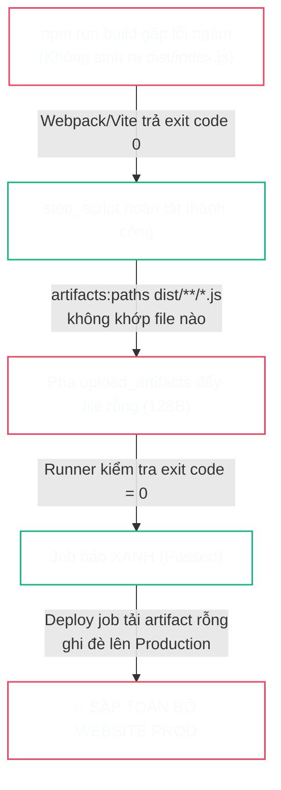


# [BÀI 01] KIẾN TRÚC GITLAB CI/CD & MÔ HÌNH THỰC THI JOB: GITLAB SERVER, RUNNER, COORDINATOR & VÒNG ĐỜI PIPELINE

Trong kỷ nguyên **DevOps, DevSecOps và Cloud Native Engineering**, **GitLab CI/CD** được công nhận là một trong những nền tảng tự động hóa tích hợp liên tục và phân phối liên tục (CI/CD) hoàn chỉnh, mạnh mẽ và được tin dùng nhất trong các doanh nghiệp quy mô lớn. Không chỉ dừng lại ở các pipeline tuần tự cơ bản, việc vận hành GitLab CI/CD ở cấp độ Production đòi hỏi kỹ sư phải làm chủ kiến trúc điều phối phi tuyến tính **DAG (Directed Acyclic Graph)**, cơ chế quản trị **Autoscaling Runners**, tối ưu hóa **Caching đa tầng**, xác thực không khóa **Keyless OIDC**, bảo mật chuỗi cung ứng phần mềm **SLSA & SBOM** cùng các chính sách **Quality & Security Gates** tự động.

Bài viết chuyên sâu này sẽ đồng hành cùng bạn mổ xẻ toàn diện bức tranh kiến trúc, phân tích các đánh đổi kỹ thuật thực chiến (Engineering Trade-offs), cung cấp hướng dẫn thực hành Lab chi tiết từng bước và bộ câu hỏi phỏng vấn chuyên sâu chuẩn DevOps Lead / DevSecOps Architect.

---

## 1. Bản Chất Kiến Trúc & Cơ Chế Vận Hành Tầng Thấp

### 1.1. Luận Đề Trung Tâm: Môi Trường Dùng Một Lần (Ephemeral Environment)
Một Job trong GitLab CI/CD **không bao giờ chạy trực tiếp "bên trong GitLab"**. Nó được thực thi trong một môi trường cô lập dùng một lần (Ephemeral Container / Pod) do GitLab Runner khởi tạo thông qua Docker hoặc Kubernetes Executor.

Mọi tài nguyên và dữ liệu mà Job cần chỉ có thể đi vào thông qua **BỐN ĐƯỜNG VÀO** và rời khỏi Job thông qua **HAI ĐƯỜNG RA**. Tuyệt đối không tồn tại đường thứ năm:

```text
        BỐN ĐƯỜNG VÀO                MÔI TRƯỜNG DÙNG MỘT LẦN            HAI ĐƯỜNG RA
   ┌──────────────────────┐        ┌────────────────────────┐      ┌──────────────────┐
   │ 1. git clone/fetch   │───────▶│                        │─────▶│ 1. artifacts     │
   │ 2. cache (KHÔNG hứa) │───────▶│   Container của Job    │─────▶│ 2. mã thoát      │
   │ 3. artifact job trước│───────▶│   (Xóa sạch khi xong)  │      └──────────────────┘
   │ 4. biến môi trường   │───────▶│                        │
   └──────────────────────┘        └────────────────────────┘
                                    Mọi thứ khác ghi ra đĩa
                                           → BỊ XÓA MẤT
```

### 1.2. Vòng Đời Một Job: 8 Pha Thực Thi Tuần Tự
Khi Runner nhận một Job từ Coordinator (GitLab Server), nó sẽ thực hiện tuần tự **8 pha** theo quy trình chuẩn. Việc nắm rõ tên pha trong trace log giúp khoanh vùng nguyên nhân lỗi trong 5 giây:

```mermaid
flowchart LR
    P1["1. prepare_executor<br/>(Kéo image, chuẩn bị container)"] --> P2["2. prepare_script<br/>(Nạp biến môi trường)"]
    P2 --> P3["3. get_sources<br/>(Git clone/fetch)"]
    P3 --> P4["4. restore_cache<br/>(Giải nén cache)"]
    P4 --> P5["5. download_artifacts<br/>(Tải artifact job trước)"]
    P5 --> P6["6. step_script<br/>(before_script + script)"]
    P6 --> P7["7. after_script<br/>(Shell mới, dọn dẹp)"]
    P7 --> P8["8. archive_cache & upload<br/>(Lưu cache & đẩy artifact)"]

    classDef phase fill:none,stroke:#3b82f6,stroke-width:1.5px,color:#f8fafc;
    class P1,P2,P3,P4,P5,P6,P7,P8 phase;
```



1. **`prepare_executor`**: Kéo Docker Image, kiểm tra phân quyền Docker socket và khởi tạo container. Lỗi ở pha này là lỗi hạ tầng/quyền hạn, không liên quan tới mã nguồn.
2. **`prepare_script`**: Thiết lập shell môi trường, ghi các tệp File-based Variables.
3. **`get_sources`**: Thực hiện `git clone` hoặc `git fetch` phụ thuộc vào cấu hình `GIT_STRATEGY`.
4. **`restore_cache`**: Tìm kiếm và giải nén tệp nén cache từ kho lưu trữ. Cache miss **không bao giờ** làm Job bị fail.
5. **`download_artifacts`**: Tải xuống các artifacts từ các stage trước hoặc từ danh sách khai báo trong `needs`.
6. **`step_script`**: **Pha duy nhất thực thi câu lệnh của người dùng** (bao gồm cả `before_script` và `script`).
7. **`after_script`**: Chạy trong một **Subshell hoàn toàn mới**, độc lập với `step_script`. Thư mục làm việc tự động quay về root dự án và không kế thừa biến `export` từ `step_script`.
8. **`archive_cache` & `upload_artifacts`**: Đóng gói thư mục cache và upload artifact lên máy chủ GitLab.

---

## 2. Bảng So Sánh Kỹ Thuật Toàn Diện (Engineering Matrix)

### 2.1. So Sánh Bốn Đường Vào Dữ Liệu
| Đường Vào | Cơ Chế Thực Thi | Độ Đảm Bảo Tồn Tại | Dung Lượng Điển Hình | Từ Khóa Điều Khiển |
| :---: | :--- | :---: | :---: | :--- |
| <span class="badge badge--primary">01</span> **Mã Nguồn (Git)** | `git clone` hoặc `git fetch` | **100% Đảm bảo** (Lỗi thì fail ở pha 3) | Toàn bộ repo | `GIT_STRATEGY`, `GIT_DEPTH` |
| <span class="badge badge--amber">02</span> **Cache** | Giải nén file nén từ local/S3 | **KHÔNG đảm bảo** (Tối ưu tốc độ) | 50 MB – 2 GB | `cache:key`, `cache:paths`, `cache:policy` |
| <span class="badge badge--emerald">03</span> **Artifacts** | Tải từ kho lưu trữ GitLab Server | **100% Đảm bảo** (Fail nếu thiếu) | 1 MB – 500 MB | `artifacts:paths`, `dependencies`, `needs` |
| <span class="badge badge--cyan">04</span> **Biến (Variables)** | Nạp vào environment process | **100% Đảm bảo** | Vài KB | `variables:`, CI/CD Project Settings |

### 2.2. So Sánh Bản Chất: Cache vs Artifacts
| Tiêu Chí So Sánh | Cache (Tối Ưu Tốc Độ) | Artifacts (Hợp Đồng Giữa Các Job) |
| :--- | :--- | :--- |
| **Vị trí lưu trữ** | Cục bộ trên Runner hoặc Object Storage dùng chung | Lưu trữ tập trung trên GitLab Server |
| **Độ tin cậy** | **Không đảm bảo** (Có thể bị dọn dẹp hoặc miss) | **Đảm bảo tuyệt đối** trong thời hạn `expire_in` |
| **Khi bị thiếu dữ liệu** | Runner ghi log cảnh báo và **chạy tiếp bình thường** | Job phụ thuộc **báo đỏ (Failed)** ngay ở pha 5 |
| **Phạm vi truyền** | Xuyên suốt giữa các Pipeline khác nhau | Mặc định chỉ truyền trong nội bộ 1 Pipeline |
| **Use case thực tế** | Thư mục dependency: `.npm/`, `~/.m2/`, `$GOMODCACHE` | Kết quả build: `dist/`, `target/*.jar`, báo cáo test |

### 2.3. Ma Trận Bốn Chế Độ Hỏng Của Pipeline
| Phân Loại Chế Độ Hỏng | Có Chặn Pipeline (Blocking) | Không Chặn Pipeline (Non-blocking) |
| :--- | :--- | :--- |
| **Ồn ào (Loud - Có Báo Lỗi)** | **Job Đỏ (Failed)**<br/>• Phát hiện: **Vài giây**<br/>• Chi phí sửa chữa: **Rất thấp** | **Job Đỏ nhưng `allow_failure: true`**<br/>• Phát hiện: **Vài ngày**<br/>• Có cảnh báo nhưng không bắt buộc xem |
| **Im lặng (Silent - Không Báo Lỗi)** | **Job Pending vô hạn / Timeout**<br/>• Phát hiện: **60 phút (theo timeout)**<br/>• Do không khớp tag hoặc runner chết | <strong style="color: var(--accent-rose);">Job Xanh nhưng Sản Phẩm Sai</strong><br/>• Phát hiện: **Hàng tuần (Outage trên Prod)**<br/>• <span class="badge badge--rose">Chế độ nguy hiểm nhất</span> |

---

## 3. Kiến Trúc Triển Khai Chuẩn Production (Architecture Breakdown)

### 3.1. Cấu Trúc Pipeline Tách Biệt Đa Tầng Hoàn Chỉnh
Dưới đây là kiến trúc pipeline mẫu tuân thủ chuẩn Enterprise: sử dụng `cache` cho dependency, `artifacts` cho kết quả build, `dotenv` để truyền dynamic version, và tối ưu hóa `dependencies: []` để triệt tiêu tải dư thừa:

```yaml
# ==============================================================================
# File: .gitlab-ci.yml - Production Multi-tier Pipeline Standard
# ==============================================================================
stages:
  - versioning
  - lint
  - build
  - test
  - package

variables:
  GIT_DEPTH: "20"
  FF_USE_FASTZIP: "true"

default:
  image: node:22-alpine
  interruptible: true

# ------------------------------------------------------------------------------
# 1. Stage Versioning: Tạo version động và truyền qua dotenv report
# ------------------------------------------------------------------------------
compute-version:
  stage: versioning
  image: alpine:3.20
  script:
    - APP_VERSION="1.0.${CI_PIPELINE_IID}-${CI_COMMIT_SHORT_SHA}"
    - echo "APP_VERSION=${APP_VERSION}" > build.env
    - echo "Calculated Dynamic Version = ${APP_VERSION}"
  artifacts:
    reports:
      dotenv: build.env

# ------------------------------------------------------------------------------
# 2. Stage Lint: Tắt hẳn tải artifact từ stage trước với dependencies: []
# ------------------------------------------------------------------------------
lint-code:
  stage: lint
  dependencies: []
  script:
    - npm ci --prefer-offline
    - npx eslint src/

# ------------------------------------------------------------------------------
# 3. Stage Build: Kết hợp Cache thư mục tải về và Artifact kết quả build
# ------------------------------------------------------------------------------
build-artifact:
  stage: build
  needs:
    - job: compute-version
      artifacts: true
  cache:
    key:
      files:
        - package-lock.json
    paths:
      - .npm/
    policy: pull-push
  before_script:
    - npm config set cache "$(pwd)/.npm" --global
  script:
    - npm ci --prefer-offline
    - npm run build
    # Assertions: Khẳng định tính đúng đắn trước khi đóng gói
    - test -d dist || { echo "ASSERTION FAILED: dist/ folder missing"; exit 1; }
    - test -s dist/index.js || { echo "ASSERTION FAILED: dist/index.js is empty"; exit 1; }
  artifacts:
    paths:
      - dist/
    expire_in: 1 day

# ------------------------------------------------------------------------------
# 4. Stage Test: Kế thừa đúng artifact từ build
# ------------------------------------------------------------------------------
unit-test:
  stage: test
  needs:
    - job: build-artifact
      artifacts: true
  script:
    - npm test -- --ci

# ------------------------------------------------------------------------------
# 5. Stage Package: Sử dụng version động từ stage versioning
# ------------------------------------------------------------------------------
package-release:
  stage: package
  needs:
    - job: compute-version
      artifacts: true
    - job: build-artifact
      artifacts: true
  image: alpine:3.20
  script:
    - test -n "${APP_VERSION}" || { echo "ASSERTION FAILED: APP_VERSION is empty"; exit 1; }
    - echo "Packaging Application Version ${APP_VERSION}..."
    - tar -czf "app-${APP_VERSION}.tar.gz" dist/
  artifacts:
    paths:
      - "app-*.tar.gz"
    expire_in: 7 days
```

---

## 4. Phân Tích Cạm Bẫy Thực Chiến (5-Whys Incident Analysis)

### Tình Huống Sự Cố Thực Tế:
<span class="badge badge--rose">🕒 02:00 AM</span> Pipeline triển khai tự động lên môi trường Production báo trạng thái <span class="badge badge--emerald">Passed (Xanh)</span> hoàn toàn. Tuy nhiên, sau khi release, toàn bộ website người dùng báo lỗi trắng trang (`HTTP 404 / Missing Assets`). Khi đội ngũ kiểm tra trên máy chủ web thì thư mục chứa mã nguồn tĩnh `dist/` rỗng hoàn toàn.

### Hậu Quả & Log Lỗi Thực Tế:

```text

Job build kết thúc thành công với mã thoát 0 nhưng artifact upload chỉ vỏn vẹn 128 bytes:

Executing "step_script" stage of the job script
$ npm run build
> build
> vite build
Building for production...
dist/index.js   0.00 kB (build failed silently due to missing env var)
Uploading artifacts for successful job
Uploading artifacts...
dist/**/*.js: found 0 matching files
Uploading artifacts to coordinator... ok
Job succeeded
```



### 5-Whys Root Cause Analysis:
1. <span class="badge badge--primary">Why 1</span> **Tại sao Production bị trắng trang?** &rarr; Vì file `dist/index.js` không tồn tại trong gói deploy artifact.
2. <span class="badge badge--primary">Why 2</span> **Tại sao file không tồn tại mà Job build vẫn Xanh?** &rarr; Vì lệnh `npm run build` không ném ra mã thoát lỗi và GitLab Runner upload gói rỗng vẫn coi là thành công.
3. <span class="badge badge--primary">Why 3</span> **Tại sao lệnh build lỗi mà exit code vẫn là 0?** &rarr; Do script build trong `package.json` nuốt lỗi qua pipe: `vite build | tee build.log` mà không bật `pipefail`.
4. <span class="badge badge--primary">Why 4</span> **Tại sao GitLab CI không kiểm tra sự tồn tại của artifact trước khi upload?** &rarr; Vì GitLab thiết kế mặc định nếu mẫu `paths` không khớp thì coi như bỏ qua mà không làm fail job.
5. <span class="badge badge--emerald">Root Cause Remedy</span> **Biện pháp khắc phục chuẩn SRE:**
   - Kích hoạt chế độ kiểm tra nghiêm ngặt `set -euo pipefail` trong `before_script`.
   - Bổ sung **Assertions** bắt buộc bằng `test -s dist/index.js` ngay sau bước build.
   - Thêm quy tắc kiểm tra kích thước tối thiểu của thư mục build.

---

## 5. Hands-on Lab: Triển Khai & Kiểm Thử Vòng Đời Job (8 Bước Chuẩn)

### Bước 1: Khởi Tạo Project & Nạp Bộ Công Cụ Lab API
Tạo thư mục dự án và thiết lập script tương tác với GitLab API để đo đạc dữ liệu khách quan:

```bash
mkdir -p ~/gitlab-lab01 && cd ~/gitlab-lab01
git init -b main

cat > cong-cu.sh <<'EOF'
#!/usr/bin/env bash
set -euo pipefail
H=(--header "PRIVATE-TOKEN: $GITLAB_TOKEN")

day_pipeline() {
  git add -A
  git commit -m "${1:-update pipeline}" --allow-empty
  git push -q origin HEAD
  sleep 3
  curl -sf "${H[@]}" "$GITLAB/api/v4/projects/$PID/pipelines?per_page=1" | jq -r '.[0].id'
}

cho_pipeline() {
  local pipe="$1" t=0
  while [ $t -lt 300 ]; do
    st=$(curl -sf "${H[@]}" "$GITLAB/api/v4/projects/$PID/pipelines/$pipe" | jq -r .status)
    case "$st" in
      success|failed|canceled) echo "$st"; return 0 ;;
    esac
    sleep 4; t=$((t+4))
  done
  echo "$st"
}
EOF
chmod +x cong-cu.sh
source cong-cu.sh
```

### Bước 2: Thiết Lập Pipeline Đầu Tiên Với Đủ 4 Đường Vào & 2 Đường Ra
Tạo tệp `.gitlab-ci.yml` kiểm thử toàn bộ 8 pha thực thi:

```yaml
# .gitlab-ci.yml
stages:
  - prepare
  - execute

variables:
  GLOBAL_VAR: "Input-Path-4-Variables"

generate-data:
  stage: prepare
  image: alpine:3.20
  script:
    - mkdir -p output
    - echo "Artifact data from prepare stage" > output/data.txt
    - dd if=/dev/urandom of=output/blob.bin bs=1M count=5 2>/dev/null
  artifacts:
    paths:
      - output/
    expire_in: 1 hour

test-lifecycle:
  stage: execute
  image: alpine:3.20
  cache:
    key: lab01-cache
    paths:
      - .cache-dir/
  script:
    - mkdir -p .cache-dir && date +%s > .cache-dir/timestamp.txt
    - echo "1. Git Source     : $(ls -1)"
    - echo "2. Cache Data     : $(cat .cache-dir/timestamp.txt)"
    - echo "3. Artifact Data  : $(cat output/data.txt)"
    - echo "4. Variable Data  : ${GLOBAL_VAR}"
  after_script:
    - echo "Pha after_script đang chạy trong subshell riêng biệt"
  artifacts:
    paths:
      - output/data.txt
```

### Bước 3: Đo Đạc & Trích Xuất 8 Pha Thực Thi Từ Log Thật
Chạy pipeline và trích xuất dấu thời gian thực tế của từng pha từ trace log:

```bash
PIPE_ID=$(day_pipeline "Test full 8 phases")
cho_pipeline "$PIPE_ID"

JOB_ID=$(curl -sf "${H[@]}" "$GITLAB/api/v4/projects/$PID/pipelines/$PIPE_ID/jobs" | jq -r '.[] | select(.name=="test-lifecycle") | .id')

# Trích xuất các mốc chuyển pha từ raw log
curl -sf "${H[@]}" "$GITLAB/api/v4/projects/$PID/jobs/$JOB_ID/trace"   | grep -nE 'Preparing the|Preparing environment|Getting source|Restoring cache|Downloading artifacts|Executing "step_script"|Running after_script|Saving cache|Uploading artifacts|Cleaning up|Job succeeded'
```

### Bước 4: Kiểm Chứng Môi Trường Ephemeral (Ranh Giới /tmp)
Chứng minh hệ tệp container bị hủy hoàn toàn giữa 2 Job độc lập:

```yaml
stages: [step-a, step-b]

write-temp:
  stage: step-a
  image: alpine:3.20
  script:
    - echo "Ephemeral data" > /tmp/temp_data.txt
    - echo "Hostname in step-a: $(hostname)"

read-temp:
  stage: step-b
  image: alpine:3.20
  script:
    - echo "Hostname in step-b: $(hostname)"
    - cat /tmp/temp_data.txt # Kết quả: Báo lỗi No such file or directory
```

### Bước 5: Kiểm Chứng Khác Biệt Cache Miss vs Missing Artifacts
Chứng minh Cache Miss không làm Job đỏ, trong khi thiếu Artifact sẽ làm Job fail ngay lập tức:

```yaml
stages: [source, consumer]

dummy-source:
  stage: source
  image: alpine:3.20
  script:
    - echo "Khong tao artifact"

test-cache-miss:
  stage: consumer
  image: alpine:3.20
  cache:
    key: non-existent-cache-key
    paths: [.cache/]
  script:
    - echo "Cache miss van tiep tuc chay thanh cong"

test-artifact-missing:
  stage: consumer
  image: alpine:3.20
  needs: [dummy-source]
  script:
    - cat non_existent_artifact.txt # Job đỏ ngay lập tức
```

### Bước 6: Đo Lường Hiệu Năng Tối Ưu Với `dependencies: []`
So sánh thời gian thực thi khi tắt tải artifact không cần thiết:

```yaml
stages: [generate, consume]

large-artifact:
  stage: generate
  image: alpine:3.20
  script:
    - mkdir -p data && dd if=/dev/urandom of=data/large.bin bs=1M count=100
  artifacts:
    paths: [data/]

with-download:
  stage: consume
  image: alpine:3.20
  script:
    - ls -lh data/ # Tải 100MB thừa thãi

skip-download:
  stage: consume
  image: alpine:3.20
  dependencies: []
  script:
    - echo "Khong tai artifact, tiet kiem 100% thoi gian download"
```

### Bước 7: Tái Hiện Sự Cố Hỏng Im Lặng (Silent Failures)
Kiểm chứng 2 ca lỗi nguy hiểm: Sai tag khiến Job pending vô hạn và Upload artifact rỗng:

```yaml
stages: [test-pending, test-empty-artifact]

job-pending:
  stage: test-pending
  tags: [gpu-non-existent-tag] # Pending vo han
  script:
    - echo "Will never run"

job-empty-artifact:
  stage: test-empty-artifact
  image: alpine:3.20
  script:
    - mkdir -p dist && echo "app" > dist/app.js
  artifacts:
    paths:
      - build/**/*.js # Sai duong dan -> Artifact rong nhung Job van Xanh
```

### Bước 8: Áp Dụng Strict Assertions Biến Lỗi Im Lặng Thành Báo Đỏ
Thêm các câu lệnh kiểm tra nghiêm ngặt để bảo vệ toàn bộ Pipeline:

```yaml
build-secure:
  stage: build
  image: node:22-alpine
  before_script:
    - set -euo pipefail
  script:
    - npm run build
    # Khẳng định thư mục tồn tại và có dữ liệu
    - test -d dist || { echo "ASSERT ERROR: dist folder missing"; exit 1; }
    - test -s dist/index.js || { echo "ASSERT ERROR: dist/index.js empty"; exit 1; }
    - >
      [ "$(find dist -name '*.js' | wc -l)" -ge 1 ] ||
      { echo "ASSERT ERROR: No JS files found"; exit 1; }
  artifacts:
    paths:
      - dist/
```

---

## 6. Bộ Câu Hỏi Vấn Đáp & Phỏng Vấn Chuyên Sâu (Self-Check Q&A)

<details class="qa-card">
  <summary class="qa-summary">
    <span class="qa-num-badge">Q01</span>
    <span class="qa-question-text">Bốn đường vào và hai đường ra của một job trong GitLab CI/CD là gì? Có tồn tại đường thứ năm không?</span>
  </summary>
  <div class="qa-answer">
    <div class="qa-answer-header">
      <svg width="14" height="14" fill="none" stroke="currentColor" stroke-width="2" viewBox="0 0 24 24"><path d="M22 11.08V12a10 10 0 1 1-5.93-9.14"></path><polyline points="22 4 12 14.01 9 11.01"></polyline></svg>
      <span>Phân Tích &amp; Lời Giải Kỹ Thuật</span>
    </div>
    <div><b>Đáp án chuẩn:</b></div>
    <div>• <b>Bốn đường vào:</b> (1) Mã nguồn từ Git repository ở pha <code>get_sources</code>; (2) <code>cache</code> ở pha <code>restore_cache</code>; (3) <code>artifacts</code> của các job trước ở pha <code>download_artifacts</code>; (4) Biến môi trường (Variables) nạp ở pha <code>prepare_script</code>.</div>
    <div>• <b>Hai đường ra:</b> (1) <code>artifacts</code> đẩy lên máy chủ GitLab; (2) <b>Mã thoát (Exit Code)</b> của script.</div>
    <div>• <b>Tuyệt đối không có đường thứ năm:</b> Log <b>không phải</b> là đường ra (không job nào đọc được log của job khác một cách có cấu trúc; ngoại lệ duy nhất là <code>artifacts:reports:dotenv</code> vốn là một loại artifact). Mọi dữ liệu ghi ra ngoài thư mục dự án hoặc đĩa tạm đều bị hủy hoàn toàn khi container kết thúc.</div>
    <div style="margin-top: 0.5rem;"><b style="color: var(--accent-cyan);">&bull; Tiêu chí chấm điểm:</b> 0: Chỉ nêu chung chung từ Git &bull; 1: Kể được Git và Artifacts, thiếu Cache/Biến &bull; 2: Kể đủ 4 vào 2 ra &bull; 3: Phân tích xuất sắc 4 vào 2 ra + giải thích vì sao log không phải đường ra và cơ chế <code>dotenv</code>.</div>
    <div><b style="color: var(--accent-rose);">&bull; Câu hỏi đào sâu:</b> Nếu job cần tải một tệp cấu hình từ máy chủ nội bộ thì nó vào bằng đường nào? <i>(Không đường nào cả — chính lệnh trong <code>script</code> phải tự dùng curl/scp để tải về và tự xử lý chứng thực mạng.)</i></div>
  </div>
</details>

<details class="qa-card">
  <summary class="qa-summary">
    <span class="qa-num-badge">Q02</span>
    <span class="qa-question-text">Kể tên 8 pha trong vòng đời của một job theo thứ tự. Pha nào chứa script do người dùng viết?</span>
  </summary>
  <div class="qa-answer">
    <div class="qa-answer-header">
      <svg width="14" height="14" fill="none" stroke="currentColor" stroke-width="2" viewBox="0 0 24 24"><path d="M22 11.08V12a10 10 0 1 1-5.93-9.14"></path><polyline points="22 4 12 14.01 9 11.01"></polyline></svg>
      <span>Phân Tích &amp; Lời Giải Kỹ Thuật</span>
    </div>
    <div><b>Đáp án chuẩn:</b> 8 pha thực thi tuần tự gồm: <code>prepare_executor</code> &rarr; <code>prepare_script</code> &rarr; <code>get_sources</code> &rarr; <code>restore_cache</code> &rarr; <code>download_artifacts</code> &rarr; <code>step_script</code> &rarr; <code>after_script</code> &rarr; <code>archive_cache &amp; upload_artifacts</code>.</div>
    <div>Lệnh do người dùng viết nằm duy nhất trong pha <b><code>step_script</code></b> (bao gồm cả <code>before_script</code> và <code>script</code>).</div>
    <div>Ý nghĩa thực chiến: Nếu trong trace log không xuất hiện dòng <code>Executing "step_script" stage</code> thì lệnh của bạn chưa hề được thực thi (lỗi nằm ở hạ tầng/kéo image/mạng), việc sửa code trong <code>script</code> là hoàn toàn vô nghĩa.</div>
    <div style="margin-top: 0.5rem;"><b style="color: var(--accent-cyan);">&bull; Tiêu chí chấm điểm:</b> 0: Không nhớ thứ tự &bull; 1: Kể được 3-4 pha &bull; 2: Kể đúng 8 pha và chỉ ra <code>step_script</code> &bull; 3: Nêu đúng 8 pha + quy tắc chẩn đoán log 5 giây khi thiếu dòng <code>step_script</code>.</div>
    <div><b style="color: var(--accent-rose);">&bull; Câu hỏi đào sâu:</b> Pha <code>after_script</code> có nằm trong <code>step_script</code> không? <i>(Không, nó là pha số 7 chạy trong process shell hoàn toàn riêng biệt.)</i></div>
  </div>
</details>

<details class="qa-card">
  <summary class="qa-summary">
    <span class="qa-num-badge">Q03</span>
    <span class="qa-question-text">Phân biệt sự khác nhau bản chất giữa Cache và Artifacts? Khi nào dùng cái nào?</span>
  </summary>
  <div class="qa-answer">
    <div class="qa-answer-header">
      <svg width="14" height="14" fill="none" stroke="currentColor" stroke-width="2" viewBox="0 0 24 24"><path d="M22 11.08V12a10 10 0 1 1-5.93-9.14"></path><polyline points="22 4 12 14.01 9 11.01"></polyline></svg>
      <span>Phân Tích &amp; Lời Giải Kỹ Thuật</span>
    </div>
    <div><b>Đáp án chuẩn:</b> Khác biệt ở <b>SỰ ĐẢM BẢO</b> chứ không phải cách dùng:</div>
    <div>• <b>Artifacts (Hợp đồng):</b> Lưu trữ trên GitLab Server, đảm bảo 100% tồn tại trong thời hạn <code>expire_in</code>. Nếu job phụ thuộc không tìm thấy artifact cần thiết, nó sẽ <b>BÁO ĐỎ (FAILED)</b> ngay tại pha 5.</div>
    <div>• <b>Cache (Tối ưu tốc độ):</b> Lưu trữ trên Runner hoặc Object Storage, <b>không đảm bảo tồn tại</b>. Khi cache miss, Runner chỉ ghi log cảnh báo và <b>vẫn chạy tiếp bình thường</b>. Cache miss làm hỏng Job 0 lần nếu cấu hình đúng.</div>
    <div>• <b>Quy tắc chọn:</b> Cái gì job sau <i>bắt buộc phải có để chạy</i> (mã đã build, binary, test report) &rarr; dùng <code>artifacts</code>. Cái gì chỉ để <i>chạy nhanh hơn</i> (thư mục tải về <code>.npm/</code>, <code>~/.m2/</code>) &rarr; dùng <code>cache</code>.</div>
    <div style="margin-top: 0.5rem;"><b style="color: var(--accent-cyan);">&bull; Tiêu chí chấm điểm:</b> 0: Nói giống nhau &bull; 1: Phân biệt được nơi lưu nhưng thiếu tính đảm bảo &bull; 2: Nêu đúng hợp đồng vs tối ưu tốc độ &bull; 3: Phân tích xuất sắc cơ chế lỗi ngẫu nhiên khi dùng nhầm cache làm artifact.</div>
    <div><b style="color: var(--accent-rose);">&bull; Câu hỏi đào sâu:</b> Pipeline chạy 9 lần thành công, lần thứ 10 fail vì thiếu module dù code không đổi, nguyên nhân do đâu? <i>(Dùng cache để truyền <code>node_modules</code>; lần thứ 10 job rơi vào runner mới chưa có cache.)</i></div>
  </div>
</details>

<details class="qa-card">
  <summary class="qa-summary">
    <span class="qa-num-badge">Q04</span>
    <span class="qa-question-text">Vì sao after_script không thấy biến mà script vừa export và chạy trong một shell mới?</span>
  </summary>
  <div class="qa-answer">
    <div class="qa-answer-header">
      <svg width="14" height="14" fill="none" stroke="currentColor" stroke-width="2" viewBox="0 0 24 24"><path d="M22 11.08V12a10 10 0 1 1-5.93-9.14"></path><polyline points="22 4 12 14.01 9 11.01"></polyline></svg>
      <span>Phân Tích &amp; Lời Giải Kỹ Thuật</span>
    </div>
    <div><b>Đáp án chuẩn:</b> Runner khởi tạo <b>hai script riêng biệt</b> và thực thi chúng dưới dạng hai tiến trình (processes) độc lập. Trong Linux, biến môi trường <code>export</code> chỉ truyền từ tiến trình cha sang tiến trình con, không thể truyền ngang giữa hai tiến trình anh em.</div>
    <div>Mục đích thiết kế: <code>after_script</code> được tạo ra để dọn dẹp và thu thập log nên nó bắt buộc phải thực thi được <b>ngay cả khi <code>script</code> đã bị crash hoặc timeout</b>. Do đó nó không thể chung shell với <code>script</code>.</div>
    <div>Cách truyền dữ liệu sang <code>after_script</code>: Ghi thông tin ra tệp tin trong thư mục dự án (ví dụ: <code>echo "VAR=1" > state.env</code>) và đọc lại bằng <code>source state.env</code> trong <code>after_script</code>.</div>
    <div style="margin-top: 0.5rem;"><b style="color: var(--accent-cyan);">&bull; Tiêu chí chấm điểm:</b> 0: Không biết &bull; 1: Biết không thấy nhưng không giải thích được cơ chế &bull; 2: Nêu đúng cơ chế 2 process độc lập &bull; 3: Phân tích xuất sắc lý do thiết kế (resilience) và giải pháp truyền qua file.</div>
    <div><b style="color: var(--accent-rose);">&bull; Câu hỏi đào sâu:</b> Timeout mặc định của <code>after_script</code> là bao lâu? <i>(Mặc định 5 phút, cấu hình qua biến <code>RUNNER_AFTER_SCRIPT_TIMEOUT</code>.)</i></div>
  </div>
</details>

<details class="qa-card">
  <summary class="qa-summary">
    <span class="qa-num-badge">Q05</span>
    <span class="qa-question-text">Executor là gì và việc chọn Shell, Docker hay Kubernetes Executor ảnh hưởng như thế nào đến trạng thái máy chủ?</span>
  </summary>
  <div class="qa-answer">
    <div class="qa-answer-header">
      <svg width="14" height="14" fill="none" stroke="currentColor" stroke-width="2" viewBox="0 0 24 24"><path d="M22 11.08V12a10 10 0 1 1-5.93-9.14"></path><polyline points="22 4 12 14.01 9 11.01"></polyline></svg>
      <span>Phân Tích &amp; Lời Giải Kỹ Thuật</span>
    </div>
    <div><b>Đáp án chuẩn:</b> Runner là daemon nhận job; <code>executor</code> là cơ chế môi trường mà Runner dùng để thực thi job. Quyết định lớn nhất nằm ở <b>trạng thái tồn lưu giữa các job</b>:</div>
    <div>• <b>Docker / Kubernetes Executor:</b> Mỗi job chạy trong 1 container/pod hoàn toàn mới, số byte trạng thái còn lại sau khi job xong là <b>0 byte</b> (tính cô lập tuyệt đối).</div>
    <div>• <b>Shell Executor:</b> Chạy trực tiếp trên máy chủ host của Runner. Mọi tệp cài đặt, biến môi trường, file rác ghi ra ngoài thư mục build đều tồn lưu vĩnh viễn, dẫn đến nguy cơ xung đột môi trường và rò rỉ bảo mật giữa các project khác nhau.</div>
    <div style="margin-top: 0.5rem;"><b style="color: var(--accent-cyan);">&bull; Tiêu chí chấm điểm:</b> 0: Không phân biệt được runner vs executor &bull; 1: Nêu được docker sạch hơn shell &bull; 2: Phân tích đúng trạng thái tồn lưu 0 byte vs host pollution &bull; 3: Phân tích xuất sắc cả 3 loại kèm rủi ro bảo mật của Shell executor trên Enterprise.</div>
    <div><b style="color: var(--accent-rose);">&bull; Câu hỏi đào sâu:</b> Khi nào buộc phải dùng Shell Executor? <i>(Khi cần truy cập trực tiếp phần cứng chuyên dụng hoặc chi phí khởi tạo container quá lớn so với thời lượng job vài giây.)</i></div>
  </div>
</details>

<details class="qa-card">
  <summary class="qa-summary">
    <span class="qa-num-badge">Q06</span>
    <span class="qa-question-text">Tại sao lệnh curl http://localhost:8080 trong Docker executor bị lỗi Connection Refused?</span>
  </summary>
  <div class="qa-answer">
    <div class="qa-answer-header">
      <svg width="14" height="14" fill="none" stroke="currentColor" stroke-width="2" viewBox="0 0 24 24"><path d="M22 11.08V12a10 10 0 1 1-5.93-9.14"></path><polyline points="22 4 12 14.01 9 11.01"></polyline></svg>
      <span>Phân Tích &amp; Lời Giải Kỹ Thuật</span>
    </div>
    <div><b>Đáp án chuẩn:</b> Trong Docker executor, <code>localhost</code> trỏ vào <b>chính container của job đó</b>, không phải trỏ vào máy chủ host hay container runner. Container job là một container anh em (sibling container) nằm ở bridge network riêng biệt.</div>
    <div>Phân biệt 2 lỗi mạng cốt lõi:</div>
    <div>1. <code>Failed to connect to localhost: Connection refused</code>: Tên phân giải được nhưng không có tiến trình nào lắng nghe trong container job.</div>
    <div>2. <code>Could not resolve host</code>: Lỗi DNS, runner chưa cấu hình ánh xạ hostname nội bộ.</div>
    <div>Khắc phục: Dùng <code>services:</code> để liên kết container, hoặc cấu hình runner với <code>--docker-network-mode</code> và <code>--docker-extra-hosts</code>.</div>
    <div style="margin-top: 0.5rem;"><b style="color: var(--accent-cyan);">&bull; Tiêu chí chấm điểm:</b> 0: Nói do service chết &bull; 1: Biết localhost là container &bull; 2: Phân tích đúng mô hình container anh em &bull; 3: Phân tích xuất sắc 2 mã lỗi mạng + cấu hình <code>extra_hosts</code>.</div>
    <div><b style="color: var(--accent-rose);">&bull; Câu hỏi đào sâu:</b> Khi dùng <code>services: [postgres:16]</code> thì job kết nối tới DB bằng host nào? <i>(Bằng hostname <code>postgres</code> do GitLab tự inject alias vào container network.)</i></div>
  </div>
</details>

<details class="qa-card">
  <summary class="qa-summary">
    <span class="qa-num-badge">Q07</span>
    <span class="qa-question-text">Một job nằm ở trạng thái Pending suốt 40 phút không có log, nguyên nhân từ đâu và cách chẩn đoán?</span>
  </summary>
  <div class="qa-answer">
    <div class="qa-answer-header">
      <svg width="14" height="14" fill="none" stroke="currentColor" stroke-width="2" viewBox="0 0 24 24"><path d="M22 11.08V12a10 10 0 1 1-5.93-9.14"></path><polyline points="22 4 12 14.01 9 11.01"></polyline></svg>
      <span>Phân Tích &amp; Lời Giải Kỹ Thuật</span>
    </div>
    <div><b>Đáp án chuẩn:</b> Trace log chỉ được sinh ra <b>sau khi Runner đã nhận Job</b>. Job ở trạng thái <code>pending</code> nghĩa là chưa có Runner nào nhận. Có 2 giả thuyết:</div>
    <div>• <b>Giả thuyết 1:</b> Không có Runner nào online khớp với tập <code>tags</code> của Job, hoặc Runner online đang tắt cờ <code>run_untagged: true</code> khi Job không khai báo tag.</div>
    <div>• <b>Giả thuyết 2:</b> Tất cả Runner đang bận (đạt ngưỡng <code>concurrent</code> tối đa).</div>
    <div>Chẩn đoán nhanh qua API: Gọi <code>GET /api/v4/runners/all</code> đối soát danh sách tag của job với tag của runner. Hạn giờ timeout mặc định là 60 phút trước khi job bị chuyển thành Failed.</div>
    <div style="margin-top: 0.5rem;"><b style="color: var(--accent-cyan);">&bull; Tiêu chí chấm điểm:</b> 0: Đoán GitLab lag &bull; 1: Biết do tag không khớp &bull; 2: Nêu đủ 2 giả thuyết và cách kiểm API &bull; 3: Phân tích đầy đủ cờ <code>run_untagged</code>, timeout 60 phút và giải thích vì sao log rỗng.</div>
    <div><b style="color: var(--accent-rose);">&bull; Câu hỏi đào sâu:</b> Chế độ hỏng này thuộc ô nào trong ma trận sự cố? <i>(Im lặng, có chặn. Sớm muộn cũng phát hiện do pipeline bị nghẽn.)</i></div>
  </div>
</details>

<details class="qa-card">
  <summary class="qa-summary">
    <span class="qa-num-badge">Q08</span>
    <span class="qa-question-text">Từ khóa dependencies: [] có tác dụng gì, giúp tiết kiệm tài nguyên thế nào và khi nào không nên dùng?</span>
  </summary>
  <div class="qa-answer">
    <div class="qa-answer-header">
      <svg width="14" height="14" fill="none" stroke="currentColor" stroke-width="2" viewBox="0 0 24 24"><path d="M22 11.08V12a10 10 0 1 1-5.93-9.14"></path><polyline points="22 4 12 14.01 9 11.01"></polyline></svg>
      <span>Phân Tích &amp; Lời Giải Kỹ Thuật</span>
    </div>
    <div><b>Đáp án chuẩn:</b> Mặc định một Job sẽ tự động tải toàn bộ Artifacts của <b>tất cả các Job ở các stage phía trước</b>. Khai báo <code>dependencies: []</code> sẽ tắt hoàn toàn pha <code>download_artifacts</code> cho Job đó.</div>
    <div>Lợi ích: Tiết kiệm đáng kể băng thông mạng và thời gian máy (Machine time). Ví dụ: Pipeline có 8 job ở stage sau, mỗi job tiết kiệm 20s tải 300MB artifact thừa &rarr; tiết kiệm 160s thời gian máy.</div>
    <div>Khi <b>KHÔNG</b> nên dùng: Khi chưa xác định chắc chắn job có cần file sinh ra từ stage trước hay không. Tắt nhầm sẽ gây lỗi thiếu file ở bước sau.</div>
    <div style="margin-top: 0.5rem;"><b style="color: var(--accent-cyan);">&bull; Tiêu chí chấm điểm:</b> 0: Không biết &bull; 1: Biết tắt download artifact &bull; 2: Tính toán được thời gian máy tiết kiệm &bull; 3: Phân biệt rõ thời gian máy (Machine time) vs thời gian đồng hồ (Wall clock time) và lưu ý khi dùng.</div>
    <div><b style="color: var(--accent-rose);">&bull; Câu hỏi đào sâu:</b> <code>needs</code> khác <code>dependencies</code> thế nào? <i>(<code>needs</code> vừa định nghĩa DAG đổi thứ tự chạy vừa thu hẹp artifact; <code>dependencies</code> chỉ thu hẹp artifact mà giữ nguyên thứ tự stage.)</i></div>
  </div>
</details>

<details class="qa-card">
  <summary class="qa-summary">
    <span class="qa-num-badge">Q09</span>
    <span class="qa-question-text">Tại sao một Job xanh (Success) không chứng minh được công việc đã hoàn thành chính xác?</span>
  </summary>
  <div class="qa-answer">
    <div class="qa-answer-header">
      <svg width="14" height="14" fill="none" stroke="currentColor" stroke-width="2" viewBox="0 0 24 24"><path d="M22 11.08V12a10 10 0 1 1-5.93-9.14"></path><polyline points="22 4 12 14.01 9 11.01"></polyline></svg>
      <span>Phân Tích &amp; Lời Giải Kỹ Thuật</span>
    </div>
    <div><b>Đáp án chuẩn:</b> Trạng thái của một Job chỉ là kết quả của <b>Mã thoát (Exit Code == 0)</b> của lệnh cuối cùng, Runner không có mô hình kiểm tra ngữ nghĩa công việc của người dùng.</div>
    <div>3 ca điển hình Job Xanh nhưng kết quả Sai:</div>
    <div>1. <code>artifacts:paths</code> chỉ định sai mẫu glob &rarr; upload artifact rỗng (128B), job vẫn Xanh.</div>
    <div>2. Lỗi bị nuốt qua ống dẫn: <code>test_cmd | tee log.txt</code> &rarr; exit code là của lệnh <code>tee</code> (thành công 0).</div>
    <div>3. Dùng <code>|| true</code> vô tội vạ làm triệt tiêu mã lỗi của command.</div>
    <div>Giải pháp: Luôn áp dụng <code>set -euo pipefail</code> và bổ sung Assertions (<code>test -s</code>, <code>test -d</code>).</div>
    <div style="margin-top: 0.5rem;"><b style="color: var(--accent-cyan);">&bull; Tiêu chí chấm điểm:</b> 0: Cho rằng job xanh là đã đúng 100% &bull; 1: Nêu được có thể có lỗi &bull; 2: Phân tích đúng cơ chế exit code và cho ví dụ &bull; 3: Phân tích sâu 3 ca lỗi ngầm + kỹ thuật strict pipefail assertions.</div>
    <div><b style="color: var(--accent-rose);">&bull; Câu hỏi đào sâu:</b> Chi phí thực thi của một lệnh assertion <code>test -s</code> là bao nhiêu? <i>(Khoảng 0.05 giây, hoàn toàn không đáng kể so với tổng thời gian pipeline.)</i></div>
  </div>
</details>

<details class="qa-card">
  <summary class="qa-summary">
    <span class="qa-num-badge">Q10</span>
    <span class="qa-question-text">Phân loại các chế độ hỏng (Failure Modes) của Pipeline theo 2 trục. Chế độ nào nguy hiểm nhất và vì sao?</span>
  </summary>
  <div class="qa-answer">
    <div class="qa-answer-header">
      <svg width="14" height="14" fill="none" stroke="currentColor" stroke-width="2" viewBox="0 0 24 24"><path d="M22 11.08V12a10 10 0 1 1-5.93-9.14"></path><polyline points="22 4 12 14.01 9 11.01"></polyline></svg>
      <span>Phân Tích &amp; Lời Giải Kỹ Thuật</span>
    </div>
    <div><b>Đáp án chuẩn:</b> Phân loại theo 2 trục: <b>Ồn ào vs Im lặng</b> (có báo hiệu hay không) và <b>Có chặn vs Không chặn</b> (pipeline dừng hay đi tiếp).</div>
    <div>• <b>Ồn ào + Có chặn (Job Đỏ):</b> Phát hiện trong vài giây, rẻ nhất.</div>
    <div>• <b>Ồn ào + Không chặn (allow_failure: true):</b> Phát hiện trong vài ngày.</div>
    <div>• <b>Im lặng + Có chặn (Job Pending/Timeout):</b> Phát hiện trong 60 phút.</div>
    <div>• <strong style="color: var(--accent-rose);">Im lặng + Không chặn (Job Xanh nhưng Sản Phẩm Sai):</strong> <b>NGUY HIỂM NHẤT</b>. Chi phí sự cố tỉ lệ thuận với thời gian phát hiện. Ở ô này không có ai bị chặn nên lỗi trôi thẳng lên Production và chỉ bị phát hiện sau nhiều tuần bởi khách hàng.</div>
    <div>Mục tiêu kỹ thuật: Sử dụng Assertions để dồn toàn bộ lỗi về ô <b>Ồn ào + Có chặn</b>.</div>
    <div style="margin-top: 0.5rem;"><b style="color: var(--accent-cyan);">&bull; Tiêu chí chấm điểm:</b> 0: Không phân loại được &bull; 1: Nêu được job xanh sai vs job đỏ &bull; 2: Vẽ đủ ma trận 4 ô 2 trục &bull; 3: Giải thích xuất sắc triết lý chi phí thời gian phát hiện và mục tiêu dồn lỗi về ô Loud-Blocking.</div>
    <div><b style="color: var(--accent-rose);">&bull; Câu hỏi đào sâu:</b> <code>allow_failure: true</code> có phải là một cạm bẫy không? <i>(Có, nó tạo ra chiếc cổng bảo vệ giả "Fake Gate", ru ngủ kỹ sư rằng đã có kiểm tra nhưng thực chất không ai để ý khi nó đỏ.)</i></div>
  </div>
</details>

<details class="qa-card">
  <summary class="qa-summary">
    <span class="qa-num-badge">Q11</span>
    <span class="qa-question-text">Làm thế nào để truyền giá trị động (như Version, Image Tag) từ Job này sang Job kế tiếp một cách an toàn?</span>
  </summary>
  <div class="qa-answer">
    <div class="qa-answer-header">
      <svg width="14" height="14" fill="none" stroke="currentColor" stroke-width="2" viewBox="0 0 24 24"><path d="M22 11.08V12a10 10 0 1 1-5.93-9.14"></path><polyline points="22 4 12 14.01 9 11.01"></polyline></svg>
      <span>Phân Tích &amp; Lời Giải Kỹ Thuật</span>
    </div>
    <div><b>Đáp án chuẩn:</b> Cơ chế chuẩn duy nhất là sử dụng <b><code>artifacts:reports:dotenv</code></b>.</div>
    <div>Job nguồn xuất giá trị dạng key-value ra tệp: <code>echo "APP_VERSION=1.2.3" > build.env</code> và khai báo báo cáo dotenv. GitLab Server sẽ tự động parse file này và nạp thành biến môi trường cho các Job ở stage sau hoặc Job có liên kết <code>needs</code>.</div>
    <div>3 Giới hạn bắt buộc phải nhớ:</div>
    <div>1. Dung lượng tối đa chỉ vài KB (không nhét file nhị phân vào dotenv).</div>
    <div>2. Biến truyền qua dotenv <b>không tự động được masked</b> &rarr; Không truyền mật khẩu/secret qua dotenv.</div>
    <div>3. Biến chỉ đi xuôi theo đồ thị pipeline, không thể truyền ngược lên trên.</div>
    <div style="margin-top: 0.5rem;"><b style="color: var(--accent-cyan);">&bull; Tiêu chí chấm điểm:</b> 0: Đề xuất echo ra log &bull; 1: Đề xuất lưu artifact thường rồi tự source &bull; 2: Nêu đúng <code>artifacts:reports:dotenv</code> &bull; 3: Nêu đúng cú pháp + phân tích 3 giới hạn an toàn bảo mật của dotenv.</div>
    <div><b style="color: var(--accent-rose);">&bull; Câu hỏi đào sâu:</b> Nếu truyền token qua dotenv thì rủi ro là gì? <i>(Token sẽ in lộ nguyên văn trong log môi trường của job sau vì không có cơ chế mask tự động.)</i></div>
  </div>
</details>

<details class="qa-card">
  <summary class="qa-summary">
    <span class="qa-num-badge">Q12</span>
    <span class="qa-question-text">Quy trình 4 bước chẩn đoán và khoanh vùng sự cố khi một Pipeline phức tạp bị hỏng không rõ nguyên nhân?</span>
  </summary>
  <div class="qa-answer">
    <div class="qa-answer-header">
      <svg width="14" height="14" fill="none" stroke="currentColor" stroke-width="2" viewBox="0 0 24 24"><path d="M22 11.08V12a10 10 0 1 1-5.93-9.14"></path><polyline points="22 4 12 14.01 9 11.01"></polyline></svg>
      <span>Phân Tích &amp; Lời Giải Kỹ Thuật</span>
    </div>
    <div><b>Đáp án chuẩn:</b> Quy trình 4 bước chuyên nghiệp:</div>
    <div>• <b>Bước 1 — Xác định Pha:</b> Mở trace log, tìm dòng tiêu đề pha cuối cùng ngay trước dòng báo lỗi. Nếu không có dòng <code>Executing "step_script"</code> thì lỗi 100% thuộc về hạ tầng Runner/Mạng, tuyệt đối không mất thời gian sửa code.</div>
    <div>• <b>Bước 2 — Ánh xạ Pha sang nhóm nguyên nhân:</b> <code>prepare_executor</code> (lỗi image/docker), <code>get_sources</code> (lỗi auth git/mạng), <code>download_artifacts</code> (lỗi dependencies), <code>step_script</code> (lỗi code người dùng).</div>
    <div>• <b>Bước 3 — Kiểm tra 4 Đường Vào:</b> Nếu lỗi trong <code>step_script</code> do thiếu dữ liệu, rà soát 4 đường: Git strategy, Cache miss (nghi phạm số 1 khi lỗi ngẫu nhiên), Artifact dependencies, và Variables precedence.</div>
    <div>• <b>Bước 4 — Kiểm tra Ngược lại (Khi Job Xanh):</b> So sánh dung lượng artifact và thời lượng job so với baseline lần chạy trước để phát hiện ngay các ca hỏng im lặng.</div>
    <div style="margin-top: 0.5rem;"><b style="color: var(--accent-cyan);">&bull; Tiêu chí chấm điểm:</b> 0: Bấm retry cầu may &bull; 1: Cuộn xuống tìm chữ ERROR &bull; 2: Thực hiện xác định pha &bull; 3: Trình bày xuất sắc quy trình 4 bước chuẩn SRE kèm cách xử lý job pending không có log.</div>
    <div><b style="color: var(--accent-rose);">&bull; Câu hỏi đào sâu:</b> Khi job pending không có log thì chẩn đoán thế nào? <i>(Truy vấn trực tiếp GitLab API <code>/runners/all</code> đối soát tag và trạng thái online của runner.)</i></div>
  </div>
</details>

---

## 7. Tổng Kết & Lộ Trình Bài Học Tiếp Theo

### Tóm Tắt Các Điểm Cốt Lõi:
1. **Môi trường Ephemeral:** Container của Job chỉ tồn tại tạm thời; mọi trạng thái dữ liệu bắt buộc phải đi qua 4 đường vào và 2 đường ra.
2. **Quy tắc 8 Pha:** Đọc dòng tiêu đề pha trong log để khoanh vùng nguyên nhân sự cố trong 5 giây.
3. **Phân biệt Cache & Artifact:** Cache để tăng tốc (chấp nhận miss), Artifact là hợp đồng bắt buộc giữa các Job.
4. **Triệt tiêu Hỏng Im Lặng:** Áp dụng `set -euo pipefail` và các lệnh Assertions để biến mọi lỗi ngầm thành cảnh báo đỏ ngay lập tức.

```mermaid
mindmap
  root((GitLab Job Architecture))
    Ephemeral Lifecycle
      8 Pha Thuc Thi Tuần Tự
      Container Xóa Sạch Sau Job
      After_script Process Riêng
    4 Đường Vào & 2 Đường Ra
      Git Sources & Variables
      Cache: Tối Ưu Tốc Độ
      Artifacts: Hợp Đồng Bắt Buộc
      Exit Code: Chuẩn Đo Lỗi
    Vận Hành An Toàn
      Strict Mode: set -euo pipefail
      Dependencies Rỗng: dependencies []
      Truyền Biến Động: dotenv report
      Dồn Lỗi Về Ô: Loud & Blocking
```

---

> [!TIP]
> **BÀI HỌC TIẾP THEO:**
> Trong **[[Bài 02] Kiến Trúc GitLab Runner & Executor Chuyên Sâu: Shell, Docker, Kubernetes & Autoscaling Architecture](gitlab-02-02-runner-va-executor.html)**, chúng ta sẽ đi sâu vào cơ chế hoạt động tầng thấp của Runner Daemon, giải mã file cấu hình `config.toml`, cơ chế phân bổ tài nguyên `concurrent / limit` và thiết kế hệ thống Autoscaling Runner cấp Enterprise.


