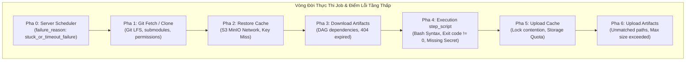
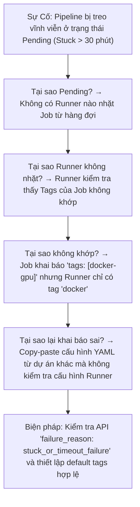


> [!IMPORTANT]
> **Mục tiêu kỹ thuật bài học**:
> - Nắm vững nguyên lý nền tảng và tư duy cốt lõi về Kỹ Thuật Gỡ Rối Pipeline (Troubleshooting & Debugging): doc-pha.sh, failure_reason, CI_DEBUG_TRACE, Timeout/Retry & Resource Group.
> - Thiết kế ma trận chẩn đoán sự cố 4 trục, phân tích trường failure_reason từ REST API và giải quyết pipeline pending/timeout.
> - Làm chủ cơ chế retry thông minh, điều phối race condition với resource_group và tự động hủy job thừa bằng interruptible.
> - Tự kiểm tra kiến thức chuyên sâu với bộ 12 câu hỏi phân tích tình huống thực tế kèm lời giải.

---

Trong kỷ nguyên **DevOps, DevSecOps và Cloud Native Engineering**, **GitLab CI/CD** được công nhận là một trong những nền tảng tự động hóa tích hợp liên tục và phân phối liên tục (CI/CD) hoàn chỉnh, mạnh mẽ và được tin dùng nhất trong các doanh nghiệp quy mô lớn. Không chỉ dừng lại ở các pipeline tuần tự cơ bản, việc vận hành GitLab CI/CD ở cấp độ Production đòi hỏi kỹ sư phải làm chủ kiến trúc điều phối phi tuyến tính **DAG (Directed Acyclic Graph)**, cơ chế quản trị **Autoscaling Runners**, tối ưu hóa **Caching đa tầng**, xác thực không khóa **Keyless OIDC**, bảo mật chuỗi cung ứng phần mềm **SLSA & SBOM** cùng các chính sách **Quality & Security Gates** tự động.

Bài viết chuyên sâu này sẽ đồng hành cùng bạn mổ xẻ toàn diện bức tranh kiến trúc, phân tích các đánh đổi kỹ thuật thực chiến (Engineering Trade-offs), cung cấp hướng dẫn thực hành Lab chi tiết từng bước và bộ câu hỏi phỏng vấn chuyên sâu chuẩn DevOps Lead / DevSecOps Architect.

---

## 1. Bản Chất Kiến Trúc & Cơ Chế Vận Hành Tầng Thấp

### 1.1. Luận Đề Trung Tâm: Gỡ Rối Bằng Ma Trận Trạng Thái 4 Cột × 8 Pha

Khi một pipeline bị lỗi (đỏ) hoặc tệ hơn là "xanh mà không deploy gì", kỹ sư thiếu kinh nghiệm thường chỉ nhìn vào vài dòng cuối cùng của Web UI Console Log. Đây là phương pháp thụ động và tốn thời gian nhất.

> **Mọi sự cố trong quá trình thực thi Job đều quy về việc xác định chính xác: Lỗi xảy ra ở PHA NÀO trong 8 pha của Runner, và thuộc về TRỤC DỮ LIỆU NÀO trong 4 đường vào (Mã nguồn Git, Caching, Artifacts, hoặc Biến môi trường). Không bao giờ đoán mò lỗi khi chưa đọc trường `failure_reason` từ REST API.**

```text
   MA TRẬN CHẨN ĐOÁN SỰ CỐ CI/CD (4 TRỤC DỮ LIỆU × 8 PHA THỰC THI)
   
                     [ Cột 1: GIT ]      [ Cột 2: CACHE ]    [ Cột 3: ARTIFACT ]   [ Cột 4: BIẾN ]
   ─────────────────────────────────────────────────────────────────────────────────────────────
   Pha 0: t0 (Server)│ .gitlab-ci.yml    │ (chưa có)         │ (chưa có)           │ rules: evaluation
   Pha 1: Git clone  │ clone / fetch err │ (chưa có)         │ (chưa có)           │ GIT_STRATEGY
   Pha 2: Cache pull │ (bỏ qua)          │ S3 403 / Miss     │ (chưa có)           │ CI_JOB_JWT_V2
   Pha 3: Artifact dl│ (bỏ qua)          │ (bỏ qua)          │ 404 Not Found       │ dependencies
   Pha 4: Pre-script │ Submodule err     │ (bỏ qua)          │ Path mismatch       │ expand: false err
   Pha 5: Main script│ Build compile err │ Missing node_mods │ Corrupted binary    │ 401 / Empty Var
   Pha 6: Cache push │ (bỏ qua)          │ Upload timeout    │ (bỏ qua)            │ policy: pull-push
   Pha 7: Artifact up│ (bỏ qua)          │ (bỏ qua)          │ File untracked      │ expire_in
```



### 1.2. Phân Tích Trường `failure_reason` Qua GitLab REST API

Khi một Job thất bại, GitLab Server ghi nhận mã lỗi chuẩn hóa trong cơ sở dữ liệu. API endpoint `GET /projects/:id/jobs/:id` trả về trường `failure_reason` giúp lập trình viên xác định nguyên nhân trong 0.5 giây mà không cần cuộn qua hàng nghìn dòng log:

- `stuck_or_timeout_failure`: Không có Runner nào nhận job (do thiếu tag, runner locked, runner offline) hoặc job chạy quá thời gian `timeout`.
- `runner_system_failure`: Lỗi từ phía hạ tầng Docker/Kubernetes Runner (hết đĩa `/var/run/docker.sock`, lỗi memory OOM, mạng nội bộ sập).
- `script_failure`: Lỗi người dùng (Exit code khác 0 từ lệnh trong `script`).
- `missing_dependency_failure`: Khai báo `dependencies:` nhưng job cha không sinh artifact hoặc artifact đã bị hết hạn.
- `insufficient_upstream_permissions`: Không có quyền trigger hoặc kéo artifact từ project khác.

### 1.3. Hệ Thống Phân Cấp Timeout (Timeout Precedence Hierarchy)

Nhiều kỹ sư thắc mắc tại sao cấu hình `timeout: 2h` trong `.gitlab-ci.yml` nhưng job vẫn bị ngắt đột ngột sau đúng 10 phút. Đó là do nguyên tắc **Giá trị nhỏ nhất luôn thắng (Strict Minimum Rule)**:

$$\text{Effective Timeout} = \min(\text{Job YAML Timeout}, \text{Project CI/CD Timeout}, \text{Runner Timeout})$$

```text
   ┌────────────────────────────────────────────────────────┐
   │ Project Settings Timeout (VD: 10 phút) ──────────────┐ │
   │                                                      │ │
   │ Runner config.toml Timeout (VD: 30 phút) ────────────┼─┼──► THỜI GIAN THỰC TẾ: 10 PHÚT
   │                                                      │ │    (Giá trị nhỏ nhất thắng)
   │ Job YAML timeout: (VD: 2 giờ) ───────────────────────┘ │
   └────────────────────────────────────────────────────────┘
```

### 1.4. Tự Phục Hồi Lỗi Hạ Tầng Với `retry: when:`

Không phải lỗi nào cũng do lập trình viên viết code sai. Trong môi trường Cloud/Spot Instances, các lỗi mạng chập chờn (network glitch) hoặc lỗi Docker daemon có thể được giải quyết tự động bằng cấu hình `retry` thông minh:

```yaml
compile_app:
  stage: build
  script:
    - make build
  retry:
    max: 2
    when:
      - runner_system_failure
      - stuck_or_timeout_failure
      - api_failure
      - runner_unsupported
```

> **Nguyên tắc vàng**: Tuyệt đối **không** cấu hình `retry` cho lỗi `script_failure` (lỗi logic phần mềm), vì nếu unit test đỏ thì chạy lại 10 lần vẫn đỏ, chỉ gây lãng phí tài nguyên Runner.

### 1.5. Điều Phối Độc Quyền Với `resource_group` & Tối Ưu Hóa `interruptible`

1. **`resource_group`**: Đảm bảo tại một thời điểm chỉ có DUY NHẤT một job trong nhóm được thực thi. Điều này cực kỳ quan trọng đối với các job chạy **Database Migration** hoặc **Terraform Apply** nhằm loại bỏ hoàn toàn nguy cơ Race Condition khi hai merge request merge gần nhau.
2. **`interruptible: true`**: Khi lập trình viên liên tục push các commit mới lên cùng một Branch/MR, các pipeline cũ đang chạy dở ở các stage test/build sẽ tự động bị hủy để nhường tài nguyên Runner cho commit mới nhất.

---

## 2. Bảng So Sánh Kỹ Thuật Toàn Diện (Engineering Matrix)

| Công cụ / Phương pháp | Phạm vi quan sát | Chi phí tài nguyên | Rủi ro bảo mật | Trường hợp sử dụng tối ưu |
| :--- | :--- | :--- | :--- | :--- |
| **Web UI Job Logs** | STDOUT/STDERR thông thường | Thấp (0 overhead) | Thấp (Có mask log) | Đọc lỗi script cơ bản, cú pháp |
| **GitLab REST API (`failure_reason`)** | Metadata cấp nền tảng (DB level) | Cực thấp (1 HTTP call) | Thấp (Dùng API token) | Phân loại lỗi tự động, monitoring bot |
| **`CI_DEBUG_TRACE: "true"`** | Toàn bộ lệnh Shell (`set -x`) | Trung bình (Log phình to gấp 10x) | ⚠️ **CỰC CAO** (Lộ plain-text vars) | Gỡ rối biến môi trường phức tạp |
| **Interactive Web Terminal** | Môi trường Live Container | Cao (Chiếm giữ Runner) | ⚠️ Trung bình (Quyền root container) | Debug lỗi môi trường Docker/OS |
| **Runner System Logs (`journalctl`)** | Docker Daemon, Network, Executor | Cần quyền SSH Server | Thấp (Admin only) | Gỡ lỗi Runner Offline, Crash, Disk Full |

---

## 3. Kiến Trúc Triển Khai Chuẩn Production (Architecture Breakdown)

Dưới đây là pipeline mẫu tích hợp đầy đủ các kỹ thuật tự bảo vệ, tự phục hồi lỗi hạ tầng, chống race condition khi deploy và tối ưu hủy job thừa:

```yaml
# ==============================================================================
# PIPELINE GỠ RỐI TỰ ĐỘNG & ĐIỀU PHỐI ĐỘC QUYỀN CHUẨN PRODUCTION
# ==============================================================================
workflow:
  rules:
    - if: '$CI_PIPELINE_SOURCE == "merge_request_event"'
    - if: '$CI_COMMIT_BRANCH && $CI_OPEN_MERGE_REQUESTS'
      when: never
    - if: '$CI_COMMIT_BRANCH'

stages:
  - test
  - build
  - migrate
  - deploy

default:
  interruptible: true # Tự động hủy job của commit cũ khi có commit mới
  retry:
    max: 2
    when:
      - runner_system_failure
      - stuck_or_timeout_failure

# ------------------------------------------------------------------------------
# 1. STAGE TEST: Chạy song song và fail-fast
# ------------------------------------------------------------------------------
unit_test:
  stage: test
  image: node:20-alpine
  timeout: 15m
  script:
    - echo "=== [Stage Test] Running Unit Tests ==="
    - npm ci --prefer-offline
    - npm test -- --ci --maxWorkers=2
  after_script:
    # Ghi nhận trạng thái job để gửi thông báo nếu cần
    - echo "Job Finished with Status: ${CI_JOB_STATUS}"

# ------------------------------------------------------------------------------
# 2. STAGE BUILD: Tự động phục hồi lỗi mạng khi kéo package
# ------------------------------------------------------------------------------
build_package:
  stage: build
  image: docker:27-cli
  timeout: 30m
  retry:
    max: 2
    when:
      - api_failure
      - runner_system_failure
  script:
    - echo "=== [Stage Build] Building Container Image ==="
    - docker build -t "internal-registry.corp/app:${CI_COMMIT_SHORT_SHA}" .
    - docker save "internal-registry.corp/app:${CI_COMMIT_SHORT_SHA}" -o app.tar
  artifacts:
    paths:
      - app.tar
    expire_in: 2 hours

# ------------------------------------------------------------------------------
# 3. STAGE MIGRATE: Điều phối độc quyền với Resource Group (Chống Race Condition)
# ------------------------------------------------------------------------------
db_migration:
  stage: migrate
  image: alpine:3.20
  resource_group: production_db_lock # Đảm bảo chỉ 1 job migrate chạy tại 1 thời điểm
  timeout: 10m
  interruptible: false # KHÔNG ĐƯỢC ngắt giữa chừng khi đang chạy migration!
  rules:
    - if: '$CI_COMMIT_BRANCH == $CI_DEFAULT_BRANCH'
  script:
    - echo "=== [Stage Migrate] Acquired exclusive lock for Database Migration ==="
    - echo "Applying Flyway / Liquibase database migration scripts..."
    - sleep 5 # Giả lập tiến trình migration
    - echo "Database schema migration completed successfully."

# ------------------------------------------------------------------------------
# 4. STAGE DEPLOY: Deploy Production với Manual Gate và Bảo Vệ Concurrency
# ------------------------------------------------------------------------------
deploy_production:
  stage: deploy
  image: alpine:3.20
  resource_group: production_deploy_lock
  timeout: 20m
  interruptible: false
  rules:
    - if: '$CI_COMMIT_BRANCH == $CI_DEFAULT_BRANCH'
      when: manual
  script:
    - echo "=== [Stage Deploy] Rolling update to Production Kubernetes Cluster ==="
    - : "${PROD_DEPLOY_KEY:?Error: PROD_DEPLOY_KEY is required!}"
    - echo "Deploying version ${CI_COMMIT_SHORT_SHA}..."
    - echo "Deployment verified and finished."
  environment:
    name: production
    url: https://app.production.corp
```

---

## 4. Phân Tích Cạm Bẫy Thực Chiến (5-Whys Incident Analysis)



### 4.1. Incident 1: Pipeline Bị Treo Vĩnh Viễn Ở Trạng Thái Pending Do Sai Lệch Runner Tag

### Tình Huống Sự Cố Thực Tế:
<span class="badge badge--rose">🕒 09:30 AM</span> — Sau khi một lập trình viên merge branch tính năng mới vào `main`, toàn bộ đội ngũ phát hiện pipeline deploy bị kẹt ở trạng thái `pending` suốt 45 phút, chặn đứng mọi bản release tiếp theo của dự án.

### Hậu Quả & Log Lỗi Thực Tế:
```text
$ curl -s --header "PRIVATE-TOKEN: ${GITLAB_TOKEN}" \
    "https://gitlab.internal.corp/api/v4/projects/105/jobs/48201" | jq .
{
  "id": 48201,
  "status": "pending",
  "stage": "deploy",
  "name": "deploy_prod",
  "failure_reason": "stuck_or_timeout_failure",
  "tag_list": ["k8s-prod-gpu"],
  "allow_failure": false
}
WARNING: This job is stuck because you don't have any active runners online with any of these tags assigned to them: k8s-prod-gpu
```

### 5-Whys Root Cause Analysis:
1. <span class="badge badge--primary">Why 1</span> **Tại sao Job deploy không được Runner nào xử lý?** &rarr; Không có bất kỳ GitLab Runner nào đang online sở hữu tag `k8s-prod-gpu`.
2. <span class="badge badge--primary">Why 2</span> **Tại sao job lại yêu cầu tag `k8s-prod-gpu`?** &rarr; Kỹ sư copy đoạn mã mẫu từ một dự án AI/ML khác mà quên sửa lại danh sách `tags:` phù hợp với hạ tầng deploy web.
3. <span class="badge badge--primary">Why 3</span> **Tại sao Runner có sẵn trong nhóm không tự động nhận job?** &rarr; Tất cả Runner chung trong Group đều đang cấu hình tùy chọn `Untagged jobs only: true`, nghĩa là chúng từ chối nhận các job có gắn tag chỉ định.
4. <span class="badge badge--primary">Why 4</span> **Tại sao hệ thống không cảnh báo ngay khi tạo pipeline?** &rarr; GitLab coi trạng thái thiếu Runner phù hợp là tạm thời (chờ Runner online) nên để Job ở hàng đợi `pending` cho đến khi chạm trần timeout.
5. <span class="badge badge--emerald">Root Cause Remedy</span> **Biện pháp khắc phục chuẩn SRE:**
   - <span class="badge badge--emerald">Tag Standardization</span>: Chuẩn hóa hệ thống Runner Tags toàn doanh nghiệp (`docker-standard`, `k8s-general`, `heavy-build`).
   - <span class="badge badge--cyan">doc-pha.sh Tooling</span>: Dùng script chẩn đoán tự động kiểm tra `failure_reason: stuck_or_timeout_failure` để thông báo qua Slack/Telegram sau 2 phút pending.

### 4.2. Incident 2: Race Condition Làm Hỏng Dữ Liệu Khi Hai Người Cùng Merge Vào `main`

### Tình Huống Sự Cố Thực Tế:
<span class="badge badge--rose">🕒 03:45 PM</span> — Hai kỹ sư A và B được phê duyệt MR cùng lúc và nhấn nút Merge cách nhau 10 giây. Cả hai pipeline deploy cùng khởi chạy song song và thực thi lệnh Database Migration, dẫn đến việc database bị khóa cứng và schema rơi vào trạng thái xung đột (Deadlock & Schema Corruption).

### Hậu Quả & Log Lỗi Thực Tế:
```text
$ flyway migrate
Flyway Community Edition 10.4.1 by Redgate
Database: jdbc:postgresql://postgres-prod.internal:5432/app_db (PostgreSQL 16.2)
ERROR: Lock wait timeout exceeded; try restarting transaction
ERROR: Table 'schema_version' is currently locked by another concurrent migration process (Job ID: 48205)!
ERROR: Job failed: exit code 1
```

### 5-Whys Root Cause Analysis:
1. <span class="badge badge--primary">Why 1</span> **Tại sao lệnh database migration bị fail với mã lock wait timeout?** &rarr; Tiến trình migration của Pipeline B cố gắng chiếm lock trên bảng `schema_version` trong khi Pipeline A đang nắm giữ độc quyền lock đó.
2. <span class="badge badge--primary">Why 2</span> **Tại sao hai pipeline lại chạy migration đồng thời trên cùng môi trường?** &rarr; GitLab CI mặc định cho phép các job thuộc nhiều pipeline khác nhau chạy song song nếu hệ thống có đủ Runner executor.
3. <span class="badge badge--primary">Why 3</span> **Tại sao cấu hình YAML không ngăn chặn việc này?** &rarr; Job `db_migration` không được gán từ khóa `resource_group: production_db_lock`.
4. <span class="badge badge--primary">Why 4</span> **Tại sao các đợt release trước đây không gặp sự cố này?** &rarr; Trước đây đội ngũ release tuần tự bằng tay, sự cố chỉ bộc lộ khi chuyển sang quy trình tự động hóa kích hoạt merge liên tục.
5. <span class="badge badge--emerald">Root Cause Remedy</span> **Biện pháp khắc phục chuẩn SRE:**
   - <span class="badge badge--rose">Resource Group Locking</span>: Bắt buộc khai báo `resource_group: <environment_lock>` cho mọi job deploy hạ tầng, database migration hoặc tác vụ ghi trạng thái.
   - <span class="badge badge--emerald">Non-interruptible Guards</span>: Đặt `interruptible: false` cho toàn bộ các job can thiệp dữ liệu để ngăn ngừa ngắt đột ngột.

---

## 5. Hands-on Lab: Gỡ Rối Pipeline & Khắc Phục Sự Cố Toàn Diện (8 Bước Chuẩn)

```text
   ┌────────────────────────────────────────────────────────────────────────┐
   │                    LAB ARCHITECTURE: TROUBLESHOOTING                   │
   ├────────────────────────────────────────────────────────────────────────┤
   │                                                                        │
   │  [ Bước 1: Dựng Bộ Công Cụ Chẩn Đoán Tự Động doc-pha.sh ]             │
   │  Viết script query failure_reason và trace log từ GitLab REST API      │
   │                         │                                              │
   │                         ▼                                              │
   │  [ Bước 2: Tái Hiện & Xử Lý Sự Cố Runner Tag Mismatch (Pending) ]     │
   │  Gỡ lỗi pipeline bị kẹt hàng đợi do sai tag runner                     │
   │                         │                                              │
   │                         ▼                                              │
   │  [ Bước 3: Chẩn Đoán Lỗi Mất Artifacts & Thứ Tự Thực Thi ]            │
   │  Phát hiện lỗi dependencies và tệp artifact hết hạn                    │
   │                         │                                              │
   │                         ▼                                              │
   │  [ Bước 4: Kiểm Chứng Thứ Tự Ưu Tiên Timeout Đa Tầng ]                │
   │  Đo lường sự xung đột giữa Project Timeout, Runner và YAML             │
   │                         │                                              │
   │                         ▼                                              │
   │  [ Bước 5: Cấu Hình Tự Phục Hồi Lỗi Hạ Tầng với retry: when: ]        │
   │  Tự động retry khi Runner gặp lỗi hệ thống hoặc rớt mạng               │
   │                         │                                              │
   │                         ▼                                              │
   │  [ Bước 6: Khóa Độc Quyền Deploy với resource_group ]                  │
   │  Ngăn chặn Race Condition và xung đột môi trường triển khai           │
   │                         │                                              │
   │                         ▼                                              │
   │  [ Bước 7: Tối Ưu Hàng Đợi Runner với interruptible: true ]           │
   │  Tự động hủy các build dư thừa trên cùng branch                        │
   │                         │                                              │
   │                         ▼                                              │
   │  [ Bước 8: Dọn Dẹp Môi Trường & Tổng Hợp Runbook ]                    │
   │  Lưu trữ template xử lý sự cố chuẩn hóa cho đội ngũ                   │
   │                                                                        │
   └────────────────────────────────────────────────────────────────────────┘
```

### Bước 1: Dựng Bộ Công Cụ Chẩn Đoán Tự Động `doc-pha.sh`
Tạo một script shell cục bộ để truy vấn nhanh trạng thái và `failure_reason` của bất kỳ Job nào qua GitLab API.

```bash
cat << 'EOF' > doc-pha.sh
#!/usr/bin/env bash
set -euo pipefail

JOB_ID="${1:?Usage: ./doc-pha.sh <JOB_ID>}"
GITLAB_URL="${GITLAB:-https://gitlab.example.com}"
TOKEN="${GITLAB_TOKEN:?Missing GITLAB_TOKEN}"
PID="${PID:?Missing PID}"

echo "=== Querying Job ${JOB_ID} Status & Failure Reason ==="
JOB_INFO=$(curl --silent --header "PRIVATE-TOKEN: ${TOKEN}" \
  "${GITLAB_URL}/api/v4/projects/${PID}/jobs/${JOB_ID}")

STATUS=$(echo "${JOB_INFO}" | jq -r '.status')
FAILURE_REASON=$(echo "${JOB_INFO}" | jq -r '.failure_reason // "none"')
STAGE=$(echo "${JOB_INFO}" | jq -r '.stage')
NAME=$(echo "${JOB_INFO}" | jq -r '.name')
DURATION=$(echo "${JOB_INFO}" | jq -r '.duration // 0')

echo "Job Name:       ${NAME}"
echo "Stage:          ${STAGE}"
echo "Status:         ${STATUS}"
echo "Failure Reason: ${FAILURE_REASON}"
echo "Duration:       ${DURATION} seconds"

if [ "${STATUS}" = "failed" ]; then
  echo "--- Fetching Last 20 lines of Trace Log ---"
  curl --silent --header "PRIVATE-TOKEN: ${TOKEN}" \
    "${GITLAB_URL}/api/v4/projects/${PID}/jobs/${JOB_ID}/trace" | tail -n 20
fi
EOF

chmod +x doc-pha.sh
```

> **Checkpoint 1**: Chạy `./doc-pha.sh <JOB_ID>` trả về đầy đủ metadata lỗi và 20 dòng log cuối cùng trong dưới 1 giây.

### Bước 2: Tái Hiện & Xử Lý Sự Cố Runner Tag Mismatch (Pipeline Pending)
Tạo một job với tag không tồn tại để quan sát trạng thái pending.

```yaml
test_pending_trap:
  stage: test
  image: alpine:3.20
  tags:
    - non-existent-gpu-runner
  script:
    - echo "This job will be stuck pending"
```

> **Checkpoint 2**: Chạy pipeline. Job rơi vào trạng thái `pending`. Chạy `./doc-pha.sh <JOB_ID>` thấy `status: pending`. Khắc phục bằng cách xóa tag lỗi hoặc cấu hình runner chấp nhận untagged jobs.

### Bước 3: Chẩn Đoán Lỗi Mất Artifacts & Thứ Tự Thực Thi
Thực nghiệm lỗi `missing_dependency_failure` do cấu hình sai `dependencies:`.

```yaml
compile_code:
  stage: build
  image: alpine:3.20
  script:
    - mkdir -p build/
    - echo "Binary release v1" > build/app.bin
  artifacts:
    paths:
      - build/
    expire_in: 5 seconds # Cho hết hạn cực nhanh

test_execution:
  stage: test
  image: alpine:3.20
  dependencies:
    - compile_code
  script:
    - echo "Testing binary..."
    - cat build/app.bin
```

> **Checkpoint 3**: Chạy script gỡ rối `./doc-pha.sh <JOB_ID>`, phát hiện mã lỗi `failure_reason: missing_dependency_failure`. Sửa thời gian `expire_in: 1 hour` để khắc phục.

### Bước 4: Kiểm Chứng Thứ Tự Ưu Tiên Timeout Đa Tầng
Kiểm tra phản ứng của Runner khi thời gian chạy vượt quá giới hạn.

```yaml
test_timeout:
  stage: test
  image: alpine:3.20
  timeout: 5s
  script:
    - echo "Starting long running task..."
    - sleep 15
    - echo "Finished"
```

> **Checkpoint 4**: Sau đúng 5 giây, Runner hủy Job với mã thoát lỗi `stuck_or_timeout_failure`. Log in rõ: `Job failed: execution took longer than 5s seconds`.

### Bước 5: Cấu Hình Tự Phục Hồi Lỗi Hạ Tầng với `retry: when:`
Thử nghiệm cơ chế retry tự động khi gặp lỗi không phải do code.

```yaml
flaky_infrastructure_job:
  stage: test
  image: alpine:3.20
  retry:
    max: 2
    when:
      - runner_system_failure
      - stuck_or_timeout_failure
  script:
    - echo "Simulating flaky infrastructure check..."
    - echo "Execution finished successfully."
```

> **Checkpoint 5**: Quan sát giao diện GitLab: Nếu có sự cố hạ tầng, GitLab Runner tự động đánh dấu vòng tròn retry `(Attempt 1/2)` mà không cần can thiệp thủ công.

### Bước 6: Khóa Độc Quyền Deploy với `resource_group`
Kiểm tra cơ chế tuần tự hóa các job deploy đồng thời.

```yaml
deploy_canary:
  stage: deploy
  image: alpine:3.20
  resource_group: production_lock
  script:
    - echo "Acquired production lock. Deploying canary..."
    - sleep 10
    - echo "Canary deployment complete."

deploy_production_full:
  stage: deploy
  image: alpine:3.20
  resource_group: production_lock
  script:
    - echo "Acquired production lock. Deploying full fleet..."
    - sleep 5
    - echo "Full deployment complete."
```

> **Checkpoint 6**: Đẩy hai commit liên tiếp. GitLab đưa job thứ hai vào trạng thái `waiting for resource` cho tới khi job thứ nhất giải phóng lock `production_lock`.

### Bước 7: Tối Ưu Hàng Đợi Runner với `interruptible: true`
Kiểm tra khả năng tự hủy job thừa trên commit cũ.

```yaml
default:
  interruptible: true

heavy_analysis:
  stage: test
  image: alpine:3.20
  script:
    - echo "Running heavy 60s analysis..."
    - sleep 60
```

> **Checkpoint 7**: Khi push commit A, `heavy_analysis` bắt đầu chạy. Ngay lập tức push commit B. Pipeline của commit A lập tức chuyển sang trạng thái `canceled` với lý do: `Auto-canceled by newer pipeline`.

### Bước 8: Dọn Dẹp Môi Trường & Tổng Hợp Runbook Sự Cố
Đóng các branch test và lưu lại script chẩn đoán vào kho tài liệu kỹ thuật.

```bash
# Xóa các pipeline và job thử nghiệm
echo "Cleaning test workspace..."
rm -f doc-pha.sh
echo "Runbook & Diagnostic tooling standard verified."
```

> **Checkpoint 8**: Hệ thống CI/CD được làm sạch và tài liệu runbook sẵn sàng cho toàn đội ngũ vận hành.

---

## 6. Bộ Câu Hỏi Vấn Đáp & Phỏng Vấn Chuyên Sâu (Self-Check Q&A)

<details class="qa-card">
  <summary class="qa-summary">
    <div class="qa-summary-left">
      <span class="qa-num-badge">Q01</span>
      <span>Khi một Job trong GitLab CI bị kẹt ở trạng thái Pending vô tận, quy trình chẩn đoán 3 bước chuẩn xác nhất là gì?</span>
    </div>
    <span class="qa-chevron">
      <svg width="18" height="18" fill="none" stroke="currentColor" stroke-width="2.5" viewBox="0 0 24 24"><polyline points="6 9 12 15 18 9"></polyline></svg>
    </span>
  </summary>
  <div class="qa-answer">
    <div class="qa-answer-header">
      <svg width="14" height="14" fill="none" stroke="currentColor" stroke-width="2" viewBox="0 0 24 24"><path d="M22 11.08V12a10 10 0 1 1-5.93-9.14"></path><polyline points="22 4 12 14.01 9 11.01"></polyline></svg>
      <span>Phân Tích &amp; Lời Giải Kỹ Thuật</span>
    </div>
    <p><b>Quy trình chẩn đoán 3 bước:</b></p>
    <ol>
      <li><b>Kiểm tra Tags và Runner Scope</b>: So sánh danh sách <code>tags:</code> trong Job YAML với danh sách tags của các Runner đang online trong <i>Settings &gt; CI/CD &gt; Runners</i>. Kiểm tra xem Runner có bị khóa (Locked to Project) hay tắt cờ <i>Indicate whether this runner can pick up jobs that do not have tags</i> hay không.</li>
      <li><b>Kiểm tra Hàng đợi Runner Concurrency</b>: Kiểm tra xem tất cả các slot thực thi của Runner (<code>concurrent</code> trong <code>config.toml</code>) đã bị chiếm dụng bởi các job dài hạn khác hay chưa.</li>
      <li><b>Truy vấn REST API</b>: Gọi <code>GET /projects/:id/jobs/:job_id</code> kiểm tra trường <code>failure_reason</code>. Nếu trả về <code>stuck_or_timeout_failure</code>, 100% nguyên nhân nằm ở việc không có Runner khả dụng đáp ứng điều kiện tag/quyền.</li>
    </ol>
  </div>
</details>

<details class="qa-card">
  <summary class="qa-summary">
    <div class="qa-summary-left">
      <span class="qa-num-badge">Q02</span>
      <span>Giải thích nguyên tắc phân cấp Timeout giữa Project Settings, Runner Config và Job YAML. Trường hợp nào Job bị hủy sớm hơn cấu hình trong YAML?</span>
    </div>
    <span class="qa-chevron">
      <svg width="18" height="18" fill="none" stroke="currentColor" stroke-width="2.5" viewBox="0 0 24 24"><polyline points="6 9 12 15 18 9"></polyline></svg>
    </span>
  </summary>
  <div class="qa-answer">
    <div class="qa-answer-header">
      <svg width="14" height="14" fill="none" stroke="currentColor" stroke-width="2" viewBox="0 0 24 24"><path d="M22 11.08V12a10 10 0 1 1-5.93-9.14"></path><polyline points="22 4 12 14.01 9 11.01"></polyline></svg>
      <span>Phân Tích &amp; Lời Giải Kỹ Thuật</span>
    </div>
    <p><b>Nguyên tắc phân cấp Timeout</b>: Áp dụng quy tắc <b>Strict Minimum Rule (Giá trị nhỏ nhất luôn có hiệu lực tuyệt đối)</b>:</p>
    <p>$$\text{Timeout Thực Tế} = \min(\text{Job YAML Timeout}, \text{Project Timeout}, \text{Runner Timeout})$$</p>
    <p><b>Trường hợp bị hủy sớm</b>: Nếu trong <code>.gitlab-ci.yml</code> đặt <code>timeout: 2h</code> nhưng trên giao diện Project Settings chỉ đặt <code>Timeout: 10m</code> (hoặc Runner <code>config.toml</code> đặt <code>output_limit/timeout</code> thấp), Runner sẽ hủy Job sau đúng 10 phút. YAML không bao giờ có thể mở rộng timeout vượt quá trần quy định của Project và Runner.</p>
  </div>
</details>

<details class="qa-card">
  <summary class="qa-summary">
    <div class="qa-summary-left">
      <span class="qa-num-badge">Q03</span>
      <span>Tính năng <code>resource_group</code> giải quyết vấn đề gì trong triển khai Continuous Deployment? Phân biệt với <code>concurrency</code> của Runner.</span>
    </div>
    <span class="qa-chevron">
      <svg width="18" height="18" fill="none" stroke="currentColor" stroke-width="2.5" viewBox="0 0 24 24"><polyline points="6 9 12 15 18 9"></polyline></svg>
    </span>
  </summary>
  <div class="qa-answer">
    <div class="qa-answer-header">
      <svg width="14" height="14" fill="none" stroke="currentColor" stroke-width="2" viewBox="0 0 24 24"><path d="M22 11.08V12a10 10 0 1 1-5.93-9.14"></path><polyline points="22 4 12 14.01 9 11.01"></polyline></svg>
      <span>Phân Tích &amp; Lời Giải Kỹ Thuật</span>
    </div>
    <p><b>Vấn đề giải quyết</b>: <code>resource_group</code> áp dụng cơ chế <b>Mutual Exclusion (Khóa loại trừ lẫn nhau)</b> ở cấp độ logic Pipeline. Nó đảm bảo tại một thời điểm chỉ có <i>duy nhất một job thuộc cùng resource_group</i> được phép chạy trên toàn hệ thống GitLab, ngăn chặn hoàn toàn hiện tượng Race Condition khi nhiều lập trình viên cùng merge code gây xung đột database migration hoặc triển khai hạ tầng Terraform.</p>
    <p><b>Khác biệt với Concurrency</b>: <code>concurrency</code> trong <code>config.toml</code> của Runner chỉ giới hạn số lượng container tối đa Runner có thể spawn song song trên máy chủ vật lý, hoàn toàn không quan tâm đến logic nghiệp vụ hay xung đột dữ liệu giữa các job.</p>
  </div>
</details>

<details class="qa-card">
  <summary class="qa-summary">
    <div class="qa-summary-left">
      <span class="qa-num-badge">Q04</span>
      <span>Khi nào nên và KHÔNG NÊN sử dụng <code>interruptible: true</code>? Cho ví dụ thực tế.</span>
    </div>
    <span class="qa-chevron">
      <svg width="18" height="18" fill="none" stroke="currentColor" stroke-width="2.5" viewBox="0 0 24 24"><polyline points="6 9 12 15 18 9"></polyline></svg>
    </span>
  </summary>
  <div class="qa-answer">
    <div class="qa-answer-header">
      <svg width="14" height="14" fill="none" stroke="currentColor" stroke-width="2" viewBox="0 0 24 24"><path d="M22 11.08V12a10 10 0 1 1-5.93-9.14"></path><polyline points="22 4 12 14.01 9 11.01"></polyline></svg>
      <span>Phân Tích &amp; Lời Giải Kỹ Thuật</span>
    </div>
    <p><b>NÊN dùng khi</b>: Các job thuộc stage kiểm thử mã nguồn, linting, unit test, build docker image trên các nhánh tính năng (Feature Branches / Merge Requests). Khi lập trình viên push commit mới, các job cũ không còn giá trị và cần được hủy ngay lập tức để giải phóng tài nguyên Runner.</p>
    <p><b>KHÔNG ĐƯỢC dùng khi</b>: Các job mang tính chất ghi dữ liệu hoặc triển khai như <b>Database Migration</b>, <b>Terraform Apply</b>, <b>Deploy Production</b>, hoặc <b>Release Tagging</b>. Nếu ngắt giữa chừng, hệ thống có thể rơi vào trạng thái corrupt dữ liệu hoặc triển khai dở dang không thể rollback.</p>
  </div>
</details>

<details class="qa-card">
  <summary class="qa-summary">
    <div class="qa-summary-left">
      <span class="qa-num-badge">Q05</span>
      <span>Tại sao không nên cấu hình <code>retry: when: [script_failure]</code> cho các job Unit Test hoặc Linting?</span>
    </div>
    <span class="qa-chevron">
      <svg width="18" height="18" fill="none" stroke="currentColor" stroke-width="2.5" viewBox="0 0 24 24"><polyline points="6 9 12 15 18 9"></polyline></svg>
    </span>
  </summary>
  <div class="qa-answer">
    <div class="qa-answer-header">
      <svg width="14" height="14" fill="none" stroke="currentColor" stroke-width="2" viewBox="0 0 24 24"><path d="M22 11.08V12a10 10 0 1 1-5.93-9.14"></path><polyline points="22 4 12 14.01 9 11.01"></polyline></svg>
      <span>Phân Tích &amp; Lời Giải Kỹ Thuật</span>
    </div>
    <p>Bởi vì <code>script_failure</code> đại diện cho <b>Lỗi logic mã nguồn người dùng</b> (Exit code != 0). Mã nguồn bị sai cú pháp hoặc thuật toán hỏng có tính chất tiền định (deterministic): Chạy 1 lần hay retry 10 lần trong cùng điều kiện thì kết quả vẫn thất bại.</p>
    <p>Cấu hình retry cho <code>script_failure</code> chỉ gây lãng phí thời gian pipeline, nghẽn tài nguyên Runner của các thành viên khác và làm sai lệch chỉ số DORA Lead Time for Changes.</p>
  </div>
</details>

<details class="qa-card">
  <summary class="qa-summary">
    <div class="qa-summary-left">
      <span class="qa-num-badge">Q06</span>
      <span>Trường hợp <code>failure_reason: runner_system_failure</code> thường do những nguyên nhân hạ tầng nào gây ra?</span>
    </div>
    <span class="qa-chevron">
      <svg width="18" height="18" fill="none" stroke="currentColor" stroke-width="2.5" viewBox="0 0 24 24"><polyline points="6 9 12 15 18 9"></polyline></svg>
    </span>
  </summary>
  <div class="qa-answer">
    <div class="qa-answer-header">
      <svg width="14" height="14" fill="none" stroke="currentColor" stroke-width="2" viewBox="0 0 24 24"><path d="M22 11.08V12a10 10 0 1 1-5.93-9.14"></path><polyline points="22 4 12 14.01 9 11.01"></polyline></svg>
      <span>Phân Tích &amp; Lời Giải Kỹ Thuật</span>
    </div>
    <p>Các nguyên nhân hạ tầng phổ biến bao gồm:</p>
    <ul>
      <li>Hết dung lượng đĩa cứng trên máy chủ Runner (<code>no space left on device</code>).</li>
      <li>Docker Daemon bị crash, quá tải hoặc mất kết nối tới <code>/var/run/docker.sock</code>.</li>
      <li>Kubernetes Cluster không thể schedule Pod Runner do thiếu RAM/CPU (OOMKilled hoặc Insufficient resources).</li>
      <li>Mất kết nối mạng giữa Runner và GitLab Server (Network Timeout / DNS Resolution Failure).</li>
    </ul>
  </div>
</details>

<details class="qa-card">
  <summary class="qa-summary">
    <div class="qa-summary-left">
      <span class="qa-num-badge">Q07</span>
      <span>Lệnh <code>after_script</code> có chạy khi các lệnh trong <code>script</code> bị thất bại (Exit code != 0) không? Nó có làm thay đổi trạng thái Pass/Fail của Job không?</span>
    </div>
    <span class="qa-chevron">
      <svg width="18" height="18" fill="none" stroke="currentColor" stroke-width="2.5" viewBox="0 0 24 24"><polyline points="6 9 12 15 18 9"></polyline></svg>
    </span>
  </summary>
  <div class="qa-answer">
    <div class="qa-answer-header">
      <svg width="14" height="14" fill="none" stroke="currentColor" stroke-width="2" viewBox="0 0 24 24"><path d="M22 11.08V12a10 10 0 1 1-5.93-9.14"></path><polyline points="22 4 12 14.01 9 11.01"></polyline></svg>
      <span>Phân Tích &amp; Lời Giải Kỹ Thuật</span>
    </div>
    <p><b>CÓ CHẠY</b>: <code>after_script</code> luôn được Runner thực thi ngay cả khi <code>before_script</code> hoặc <code>script</code> chính bị fail (trừ trường hợp Job bị timeout hoặc cancel bởi người dùng).</p>
    <p><b>KHÔNG THAY ĐỔI ĐƯỢC TRẠNG THÁI</b>: Mã thoát (Exit code) của các lệnh trong <code>after_script</code> không ảnh hưởng đến trạng thái cuối cùng của Job. Nếu <code>script</code> bị đỏ, dù <code>after_script</code> chạy thành công 100% thì Job vẫn được đánh dấu là FAILED.</p>
  </div>
</details>

<details class="qa-card">
  <summary class="qa-summary">
    <div class="qa-summary-left">
      <span class="qa-num-badge">Q08</span>
      <span>Làm thế nào để phát hiện một Job "Xanh giả tạo" (Green build) trong khi bản build thực chất bị lỗi hoặc không tạo ra artifact?</span>
    </div>
    <span class="qa-chevron">
      <svg width="18" height="18" fill="none" stroke="currentColor" stroke-width="2.5" viewBox="0 0 24 24"><polyline points="6 9 12 15 18 9"></polyline></svg>
    </span>
  </summary>
  <div class="qa-answer">
    <div class="qa-answer-header">
      <svg width="14" height="14" fill="none" stroke="currentColor" stroke-width="2" viewBox="0 0 24 24"><path d="M22 11.08V12a10 10 0 1 1-5.93-9.14"></path><polyline points="22 4 12 14.01 9 11.01"></polyline></svg>
      <span>Phân Tích &amp; Lời Giải Kỹ Thuật</span>
    </div>
    <p>Áp dụng các kỹ thuật phòng thủ <b>Fail-Fast Assertions</b>:</p>
    <ol>
      <li><b>Kiểm tra mã thoát lệnh</b>: Đảm bảo không sử dụng <code>|| true</code> hoặc chôn vùi mã lỗi sau các lệnh pipe (sử dụng <code>set -o pipefail</code> ở đầu script).</li>
      <li><b>Khẳng định sự tồn tại của File Output</b>: Sử dụng <code>test -s target/app.jar || (echo "Artifact missing!" &amp;&amp; exit 1)</code>.</li>
      <li><b>Xác thực Checksum</b>: Sinh mã SHA256 cho artifact và kiểm tra lại ở đầu job tiêu thụ kế tiếp.</li>
    </ol>
  </div>
</details>

<details class="qa-card">
  <summary class="qa-summary">
    <div class="qa-summary-left">
      <span class="qa-num-badge">Q09</span>
      <span>Interactive Web Terminal trong GitLab CI hoạt động theo nguyên lý nào và yêu cầu cấu hình gì ở phía Runner?</span>
    </div>
    <span class="qa-chevron">
      <svg width="18" height="18" fill="none" stroke="currentColor" stroke-width="2.5" viewBox="0 0 24 24"><polyline points="6 9 12 15 18 9"></polyline></svg>
    </span>
  </summary>
  <div class="qa-answer">
    <div class="qa-answer-header">
      <svg width="14" height="14" fill="none" stroke="currentColor" stroke-width="2" viewBox="0 0 24 24"><path d="M22 11.08V12a10 10 0 1 1-5.93-9.14"></path><polyline points="22 4 12 14.01 9 11.01"></polyline></svg>
      <span>Phân Tích &amp; Lời Giải Kỹ Thuật</span>
    </div>
    <p><b>Nguyên lý</b>: Tạo một kết nối WebSocket trực tiếp hai chiều giữa trình duyệt người dùng qua GitLab Server tới GitLab Runner, mở một phiên tương tác shell (<code>/bin/sh</code> hoặc <code>/bin/bash</code>) bên trong container đang thực thi job.</p>
    <p><b>Yêu cầu cấu hình</b>:</p>
    <ul>
      <li>Runner sử dụng executor <code>docker</code>, <code>kubernetes</code> hoặc <code>shell</code>.</li>
      <li>Trong <code>config.toml</code> của Runner, khối <code>[session_server]</code> phải được cấu hình với <code>listen_address</code> và <code>advertise_address</code> hợp lệ.</li>
      <li>Mạng và Firewall phải mở cổng cho phép traffic WebSocket (thường là port 8093).</li>
    </ul>
  </div>
</details>

<details class="qa-card">
  <summary class="qa-summary">
    <div class="qa-summary-left">
      <span class="qa-num-badge">Q10</span>
      <span>Phân biệt sự khác nhau giữa <code>dependencies: []</code> và <code>needs: []</code> trong việc kiểm soát tải artifacts.</span>
    </div>
    <span class="qa-chevron">
      <svg width="18" height="18" fill="none" stroke="currentColor" stroke-width="2.5" viewBox="0 0 24 24"><polyline points="6 9 12 15 18 9"></polyline></svg>
    </span>
  </summary>
  <div class="qa-answer">
    <div class="qa-answer-header">
      <svg width="14" height="14" fill="none" stroke="currentColor" stroke-width="2" viewBox="0 0 24 24"><path d="M22 11.08V12a10 10 0 1 1-5.93-9.14"></path><polyline points="22 4 12 14.01 9 11.01"></polyline></svg>
      <span>Phân Tích &amp; Lời Giải Kỹ Thuật</span>
    </div>
    <p><b><code>dependencies: []</code></b>: Chỉ kiểm soát <i>việc tải artifacts</i> trong mô hình tuần tự theo stage. <code>dependencies: []</code> chỉ thị cho Job không tải bất kỳ artifact nào từ các job thuộc các stage trước đó, giúp tăng tốc độ khởi động job.</p>
    <p><b><code>needs: []</code></b>: Kiểm soát cả <i>đồ thị thực thi DAG (Directed Acyclic Graph) lẫn artifacts</i>. Khai báo <code>needs: []</code> chỉ thị cho Job thực thi ngay lập tức ở thời điểm t0 khi pipeline vừa khởi tạo mà không cần chờ các stage trước hoàn thành, đồng thời không tải bất kỳ artifact nào.</p>
  </div>
</details>

<details class="qa-card">
  <summary class="qa-summary">
    <div class="qa-summary-left">
      <span class="qa-num-badge">Q11</span>
      <span>Khi một Job bị ngắt với thông báo <code>exit code 137</code>, nguyên nhân gốc rễ là gì và cách giải quyết trong GitLab CI?</span>
    </div>
    <span class="qa-chevron">
      <svg width="18" height="18" fill="none" stroke="currentColor" stroke-width="2.5" viewBox="0 0 24 24"><polyline points="6 9 12 15 18 9"></polyline></svg>
    </span>
  </summary>
  <div class="qa-answer">
    <div class="qa-answer-header">
      <svg width="14" height="14" fill="none" stroke="currentColor" stroke-width="2" viewBox="0 0 24 24"><path d="M22 11.08V12a10 10 0 1 1-5.93-9.14"></path><polyline points="22 4 12 14.01 9 11.01"></polyline></svg>
      <span>Phân Tích &amp; Lời Giải Kỹ Thuật</span>
    </div>
    <p><b>Nguyên nhân</b>: <code>Exit code 137</code> tương ứng với tín hiệu <code>SIGKILL (128 + 9)</code> do <b>Linux OOM (Out Of Memory) Killer</b> kích hoạt khi tiến trình bên trong container sử dụng vượt quá giới hạn RAM được cấp phát của Runner máy chủ hoặc Kubernetes Pod Resource Limit.</p>
    <p><b>Giải pháp</b>:</p>
    <ul>
      <li>Tăng thông số <code>memory_limit</code> trong <code>config.toml</code> của Runner hoặc Kubernetes Resource Requests/Limits.</li>
      <li>Cấu hình giới hạn bộ nhớ của ứng dụng/trình biên dịch (ví dụ <code>NODE_OPTIONS="--max-old-space-size=4096"</code> hoặc <code>JAVA_OPTS="-Xmx4g"</code>).</li>
    </ul>
  </div>
</details>

<details class="qa-card">
  <summary class="qa-summary">
    <div class="qa-summary-left">
      <span class="qa-num-badge">Q12</span>
      <span>Chiến lược thiết kế Pipeline để vừa đảm bảo tốc độ phản hồi nhanh cho Developer vừa bảo đảm độ ổn định cho Release là gì?</span>
    </div>
    <span class="qa-chevron">
      <svg width="18" height="18" fill="none" stroke="currentColor" stroke-width="2.5" viewBox="0 0 24 24"><polyline points="6 9 12 15 18 9"></polyline></svg>
    </span>
  </summary>
  <div class="qa-answer">
    <div class="qa-answer-header">
      <svg width="14" height="14" fill="none" stroke="currentColor" stroke-width="2" viewBox="0 0 24 24"><path d="M22 11.08V12a10 10 0 1 1-5.93-9.14"></path><polyline points="22 4 12 14.01 9 11.01"></polyline></svg>
      <span>Phân Tích &amp; Lời Giải Kỹ Thuật</span>
    </div>
    <p><b>Chiến lược tối ưu chuẩn Enterprise:</b></p>
    <ol>
      <li><b>Phân tách Pipeline theo ngữ cảnh (Workflow Rules)</b>: MR Pipeline chỉ chạy Fast Feedback (Lint, Test song song dưới 5 phút, <code>interruptible: true</code>); Main Pipeline chạy Full E2E &amp; Security Scans.</li>
      <li><b>Kiến trúc DAG phi tuần tự (<code>needs</code>)</b>: Cho phép các job độc lập chạy song song không phụ thuộc ranh giới stage.</li>
      <li><b>Tự phục hồi hạ tầng</b>: Áp dụng <code>retry: when: [runner_system_failure, stuck_or_timeout_failure]</code>.</li>
      <li><b>Bảo vệ môi trường Deploy</b>: Sử dụng <code>resource_group</code> để chống race condition và cấu hình <code>manual</code> approval gate cho môi trường Production.</li>
    </ol>
  </div>
</details>

---

## 7. Tổng Kết & Lộ Trình Bài Học Tiếp Theo

### 7.1. Tóm Tắt Các Điểm Cốt Lõi (Key Takeaways)

```text
                          CHIẾN LƯỢC GỠ RỐI & ĐIỀU PHỐI CI/CD
                                           │
     ┌───────────────────┬─────────────────┴─────────────────┬───────────────────┐
     ▼                   ▼                                   ▼                   ▼
[ MA TRẬN 4 TRỤC ]  [ FAILURE_REASON API ]             [ TIMEOUT & RETRY ]  [ CONCURRENCY LOCK ]
Git - Cache         Truy vấn metadata DB               Strict Minimum Rule  resource_group:
- Artifacts - Vars  stuck_or_timeout_failure           Tự retry lỗi hạ tầng Mutual exclusion
Xác định chính xác  Phân loại lỗi trong 0.5s           Không retry lỗi code interruptible: Auto-cancel
```

- **Gỡ rối có phương pháp**: Sử dụng mã lỗi `failure_reason` từ REST API và ma trận 4 trục thay vì đọc log dòng cuối thụ động.
- **Tự động phục hồi**: Tích hợp `retry: when:` cho các lỗi mạng và hạ tầng, giữ pipeline ổn định mà không lãng phí tài nguyên cho lỗi logic mã nguồn.
- **Điều phối sản xuất an toàn**: Luôn bảo vệ các tác vụ Deploy và Migration bằng `resource_group` và tối ưu hàng đợi bằng `interruptible: true`.

### 7.2. Lộ Trình Bài Học Tiếp Theo

Ở bài học tiếp theo, chúng ta sẽ bước sang tối ưu hóa tốc độ pipeline lên mức cực đại với kiến trúc **DAG (Directed Acyclic Graph)**, cơ chế **Needs** phá vỡ rào cản Stage tuần tự và **Parallel Matrix** để chạy hàng trăm tác vụ kiểm thử đồng thời.

> [!TIP]
> **Khám phá bài học tiếp theo**: [Bài 08: Tối Ưu Hóa DAG Pipeline, Needs & Parallel Matrix: Loại Bỏ Nghẽn Cổ Chai Trong CI/CD](gitlab-08-08-needs-dag-parallel-matrix.html)

