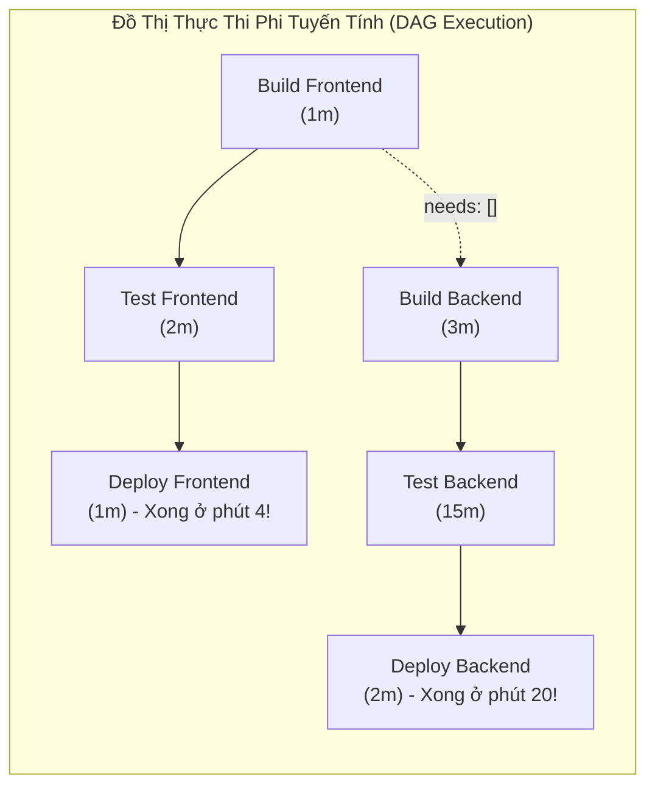
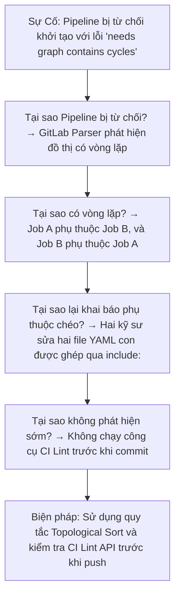


# [BÀI 08] TỐI ƯU HÓA DAG PIPELINE, NEEDS & PARALLEL MATRIX: LOẠI BỎ NGHẼN CỔ CHAI TRONG CI/CD

Trong kỷ nguyên **DevOps, DevSecOps và Cloud Native Engineering**, **GitLab CI/CD** được công nhận là một trong những nền tảng tự động hóa tích hợp liên tục và phân phối liên tục (CI/CD) hoàn chỉnh, mạnh mẽ và được tin dùng nhất trong các doanh nghiệp quy mô lớn. Không chỉ dừng lại ở các pipeline tuần tự cơ bản, việc vận hành GitLab CI/CD ở cấp độ Production đòi hỏi kỹ sư phải làm chủ kiến trúc điều phối phi tuyến tính **DAG (Directed Acyclic Graph)**, cơ chế quản trị **Autoscaling Runners**, tối ưu hóa **Caching đa tầng**, xác thực không khóa **Keyless OIDC**, bảo mật chuỗi cung ứng phần mềm **SLSA & SBOM** cùng các chính sách **Quality & Security Gates** tự động.

Bài viết chuyên sâu này sẽ đồng hành cùng bạn mổ xẻ toàn diện bức tranh kiến trúc, phân tích các đánh đổi kỹ thuật thực chiến (Engineering Trade-offs), cung cấp hướng dẫn thực hành Lab chi tiết từng bước và bộ câu hỏi phỏng vấn chuyên sâu chuẩn DevOps Lead / DevSecOps Architect.

---

## 1. Bản Chất Kiến Trúc & Cơ Chế Vận Hành Tầng Thấp

### 1.1. Luận Đề Trung Tâm: Phá Vỡ Rào Cản Giai Đoạn Bằng Đồ Thị Hướng Không Chu Trình (DAG)

Mô hình pipeline cổ điển của GitLab CI dựa trên các giai đoạn tuần tự (**Stage-based Execution**). Trong mô hình này, mọi job thuộc `stage: test` phải hoàn thành 100% thì job đầu tiên của `stage: deploy` mới được phép khởi động. Điều này tạo ra hiện tượng **Nghẽn cổ chai giai đoạn (Stage Barrier Bottleneck)**: Nếu có một job test chậm (chạy mất 15 phút), toàn bộ các luồng công việc nhanh khác (ví dụ build UI chỉ mất 1 phút) đều bị giam cầm trong trạng thái chờ đợi vô ích.

> **Kiến trúc DAG (Directed Acyclic Graph) thông qua từ khóa `needs:` giải phóng các Job khỏi sự trói buộc của Stage. Một Job có thể kích hoạt NGAY LẬP TỨC khi các phụ thuộc trực tiếp của nó hoàn tất, bất kể các job khác trong cùng stage hoặc các stage trung gian đang chạy hay chưa.**

```text
   MÔ HÌNH TUẦN TỰ (Stage-based Barrier) — Tổng thời gian: 15 phút
   Stage: build ───► [ Build Frontend (1m) ]   [ Build Backend (3m) ]
                            │                         │
                            ▼                         ▼   (Chờ toàn bộ Stage Build xong)
   Stage: test  ───► [ Test Frontend (2m) ]    [ Test Backend E2E (15m) ] ──┐
                            │                                               │ (Nghẽn cổ chai)
                            ▼                                               ▼
   Stage: deploy───► [ Deploy Frontend (Chờ phút 15 mới được chạy!) ] ◄─────┘
   
   --------------------------------------------------------------------------------------
   
   MÔ HÌNH DAG (needs: Direct Acyclic Graph) — Tổng thời gian: 15 phút, Frontend deploy xong ở phút thứ 4!
   
   Build Frontend (1m) ──► Test Frontend (2m) ──► Deploy Frontend (1m) ──► XONG Ở PHÚT THỨ 4!
   
   Build Backend (3m)  ──► Test Backend E2E (15m) ──► Deploy Backend (2m) ─► Xong ở phút thứ 20.
```



### 1.2. Phân Tích Đường Găng (Critical Path Analysis)

Thời gian thực thi tối thiểu của toàn bộ pipeline (Wall-clock Duration) không bằng tổng thời gian của tất cả các job cộng lại, mà được quyết định chính xác bởi **Đường Găng (Critical Path)** — tức chuỗi các job phụ thuộc nối tiếp có tổng thời lượng dài nhất từ điểm bắt đầu đến điểm kết thúc.

$$\text{Pipeline Duration} = \max_{\text{Path } k} \left( \sum_{J_i \in \text{Path } k} \text{Duration}(J_i) \right)$$

Áp dụng `needs:` giúp rút ngắn hoặc cô lập đường găng, cho phép phản hồi kết quả kiểm thử (Feedback Loop) đến lập trình viên nhanh hơn tới **70%**.

### 1.3. Cú Pháp & Các Biến Thể Của `needs:`

GitLab CI hỗ trợ 4 cấu trúc `needs:` phục vụ các tình huống khác nhau:

1. **`needs: [job_a, job_b]` (Cơ bản)**: Job sẽ chạy ngay sau khi `job_a` và `job_b` pass. Đồng thời, Runner **chỉ tải artifacts** của `job_a` và `job_b` (bỏ qua artifacts của toàn bộ các job khác).
2. **`needs: [{ job: job_a, artifacts: false }]` (Tối ưu băng thông)**: Job chỉ phụ thuộc về mặt thứ tự thực thi mà không cần tải dữ liệu artifacts, tiết kiệm 100% thời gian download.
3. **`needs: [{ job: job_optional, optional: true }]` (Job có điều kiện)**: Cho phép phụ thuộc vào một job có thể không được tạo (ví dụ job đó có `rules:` chỉ chạy khi sửa file nhất định). Nếu `job_optional` bị bỏ qua, pipeline không báo lỗi.
4. **`needs: [{ project: "group/other-project", job: "build", ref: "main", artifacts: true }]` (Cross-project DAG)**: Tải artifact và phụ thuộc trực tiếp vào bản build của một repository khác trong tổ chức.

### 1.4. Phân Mảnh Song Song: `parallel: N` vs `parallel: matrix`

Khi số lượng test suite phình to (hàng nghìn test case), việc chạy trên 1 job duy nhất sẽ mất hàng giờ. GitLab cung cấp hai cơ chế song song hóa:

1. **Parallel Sharding (`parallel: N`)**:
   - Chia 1 job thành $N$ job con giống hệt nhau chạy đồng thời.
   - GitLab tự động tiêm hai biến môi trường:
     - `CI_NODE_INDEX`: Chỉ số của node hiện tại (từ 1 đến $N$).
     - `CI_NODE_TOTAL`: Tổng số node ($N$).
   - Các framework test (như Jest, PyTest, Playwright) sử dụng hai biến này để tự chia đều danh sách file test:
     ```bash
     pytest --shard="${CI_NODE_INDEX}/${CI_NODE_TOTAL}"
     ```
2. **Parallel Matrix (`parallel: matrix`)**:
   - Nhân tích Descartes (Cartesian Product) của các mảng biến số.
   - Ví dụ: 3 phiên bản Node.js &times; 2 hệ điều hành &rarr; Tự động sinh ra 6 job con độc lập.

---

## 2. Bảng So Sánh Kỹ Thuật Toàn Diện (Engineering Matrix)

| Tiêu chí phân tích | Sequential Stages | DAG (`needs: [...]`) | Parallel Sharding (`parallel: N`) | Parallel Matrix (`parallel: matrix`) |
| :--- | :--- | :--- | :--- | :--- |
| **Mô hình thực thi** | Chặn theo Stage Barrier | Phi tuyến tính theo Cạnh Phụ Thuộc | Chia nhỏ 1 Job thành N phân mảnh | Sinh ma trận $M \times N$ jobs |
| **Thời gian phản hồi (Fast Feedback)** | Chậm (Chờ job chậm nhất stage trước) | Cực nhanh (Nhánh nhanh chạy trước) | Tăng tốc tuyến tính theo số Runner | Tăng tốc kiểm thử đa môi trường |
| **Tải Artifacts** | Tải toàn bộ artifacts stage trước | Chỉ tải artifacts của job khai báo | Mỗi shard xử lý độc lập | Mỗi cell nhận biến riêng |
| **Độ phức tạp cấu hình** | Thấp (Chỉ cần gán `stage:`) | Trung bình (Khai báo tường minh `needs`) | Thấp (Cần test runner hỗ trợ shard) | Trung bình (Khai báo mảng YAML) |
| **Áp lực lên Runner Pool** | Phân bổ đều theo Stage | Có thể bùng nổ đồng thời ở $t_0$ | Chiếm $N$ slots đồng thời | Chiếm $M \times N$ slots đồng thời |
| **Xử lý Job bị loại trừ bởi Rules** | Tự động xử lý theo stage | Bắt buộc dùng `optional: true` | Không ảnh hưởng | Không ảnh hưởng |
| **Trường hợp sử dụng tối ưu** | Pipeline nhỏ, đơn giản (< 4 jobs) | Monorepo, Microservices, Polyglot | Chạy E2E Test, Unit Test đồ sộ | Matrix Test OS / Version / Arch |

---

## 3. Kiến Trúc Triển Khai Chuẩn Production (Architecture Breakdown)

Dưới đây là pipeline kiến trúc DAG hoàn chỉnh kết hợp **Frontend/Backend Fast Lane**, **Parallel Matrix Testing** và **JUnit Test Aggregation**:

```yaml
# ==============================================================================
# PIPELINE KIẾN TRÚC DAG & PARALLEL MATRIX CHUẨN ENTERPRISE
# ==============================================================================
workflow:
  rules:
    - if: '$CI_PIPELINE_SOURCE == "merge_request_event"'
    - if: '$CI_COMMIT_BRANCH == $CI_DEFAULT_BRANCH'

stages:
  - build
  - test
  - aggregate
  - deploy

default:
  interruptible: true

# ------------------------------------------------------------------------------
# 1. FAST-TRACK FRONTEND: Build -> Test -> Deploy độc lập
# ------------------------------------------------------------------------------
build_frontend:
  stage: build
  image: node:20-alpine
  script:
    - echo "=== Building Frontend Assets ==="
    - mkdir -p dist/frontend
    - echo "Frontend Bundle v2.0" > dist/frontend/app.js
  artifacts:
    paths:
      - dist/frontend/
    expire_in: 1 day

test_frontend:
  stage: test
  image: node:20-alpine
  needs:
    - job: build_frontend
      artifacts: true
  script:
    - echo "=== Testing Frontend Components ==="
    - test -s dist/frontend/app.js
    - echo "Frontend tests passed 100%."

deploy_frontend_cdn:
  stage: deploy
  image: alpine:3.20
  needs:
    - job: test_frontend
      artifacts: false
    - job: build_frontend
      artifacts: true
  rules:
    - if: '$CI_COMMIT_BRANCH == $CI_DEFAULT_BRANCH'
  script:
    - echo "=== Deploying Frontend to CDN Edge (Fast Lane) ==="
    - cat dist/frontend/app.js
    - echo "Frontend deployment finished!"

# ------------------------------------------------------------------------------
# 2. BACKEND PARALLEL MATRIX: Chạy kiểm thử trên đa phiên bản Go & OS
# ------------------------------------------------------------------------------
build_backend:
  stage: build
  image: golang:1.23-alpine
  script:
    - echo "=== Compiling Backend Core ==="
    - mkdir -p bin/
    - echo "Backend Binary Go ELF" > bin/server
  artifacts:
    paths:
      - bin/
    expire_in: 1 day

test_backend_matrix:
  stage: test
  image: golang:${GO_VERSION}-alpine
  needs:
    - job: build_backend
      artifacts: true
  parallel:
    matrix:
      - GO_VERSION: ["1.22", "1.23"]
        DB_TYPE: ["postgres", "mysql"]
  script:
    - echo "=== Testing Backend with Go ${GO_VERSION} on ${DB_TYPE} ==="
    - echo "DB Target: ${DB_TYPE}"
    - mkdir -p reports/
    - echo "<testsuite name='backend-${GO_VERSION}-${DB_TYPE}' tests='10' failures='0'/>" > "reports/junit-${GO_VERSION}-${DB_TYPE}.xml"
  artifacts:
    reports:
      junit: reports/junit-*.xml
    paths:
      - reports/
    expire_in: 1 week

# ------------------------------------------------------------------------------
# 3. TEST SHARDING: Chia tải 4 phần cho Suite Integration Test
# ------------------------------------------------------------------------------
test_integration_shards:
  stage: test
  image: alpine:3.20
  needs: [] # Chạy ngay ở t0 không chờ stage build!
  parallel: 4
  script:
    - echo "=== Running Integration Shard ${CI_NODE_INDEX} of ${CI_NODE_TOTAL} ==="
    - echo "Processing test partition ${CI_NODE_INDEX}..."
    - sleep 3

# ------------------------------------------------------------------------------
# 4. AGGREGATE & DEPLOY BACKEND
# ------------------------------------------------------------------------------
deploy_backend_production:
  stage: deploy
  image: alpine:3.20
  needs:
    - job: test_backend_matrix
      artifacts: false
    - job: test_integration_shards
      artifacts: false
    - job: build_backend
      artifacts: true
  rules:
    - if: '$CI_COMMIT_BRANCH == $CI_DEFAULT_BRANCH'
      when: manual
  script:
    - echo "=== Deploying Backend to Production Kubernetes Fleet ==="
    - cat bin/server
    - echo "Production Backend roll-out successful."
```

---

## 4. Phân Tích Cạm Bẫy Thực Chiến (5-Whys Incident Analysis)



### 4.1. Incident 1: Pipeline Bị Từ Chối Tạo Do Lỗi Vòng Lặp Đồ Thị (Cyclic Dependency Error)

### Tình Huống Sự Cố Thực Tế:
<span class="badge badge--rose">🕒 04:15 PM</span> — Toàn bộ tiến trình CI/CD của team Backend bị tê liệt sau khi merge một bản refactor cấu hình `.gitlab-ci.yml`. Khi push commit, giao diện GitLab thông báo lỗi màu đỏ và không một job nào được kích hoạt.

### Hậu Quả & Log Lỗi Thực Tế:
```text
$ git push origin feat/refactor-pipeline
remote: GitLab: Pipeline failed to create:
remote: - 'needs' graph contains cycles: (build_core -> test_integration -> package_artifact -> build_core)
remote: - job 'test_integration' circular dependency detected on upstream job 'build_core'
To https://gitlab.internal.corp/app/backend.git
 ! [remote rejected] feat/refactor-pipeline -> feat/refactor-pipeline (pre-receive hook declined)
error: failed to push some refs to 'https://gitlab.internal.corp/app/backend.git'
```

### 5-Whys Root Cause Analysis:
1. <span class="badge badge--primary">Why 1</span> **Tại sao GitLab từ chối tiếp nhận commit?** &rarr; GitLab CI Parser phát hiện một chu trình phụ thuộc khép kín (Cycle) trong khối khai báo `needs:`.
2. <span class="badge badge--primary">Why 2</span> **Tại sao lại có chu trình phụ thuộc?** &rarr; `build_core` needs `package_artifact`, trong khi `package_artifact` needs `test_integration` và `test_integration` lại needs `build_core`.
3. <span class="badge badge--primary">Why 3</span> **Tại sao lỗi ngớ ngẩn này lại xuất hiện?** &rarr; Hai kỹ sư sửa độc lập trên hai template YAML con lồng nhau qua `include:`, mỗi người giả định job của mình là upstream của người kia.
4. <span class="badge badge--primary">Why 4</span> **Tại sao không phát hiện trước khi push?** &rarr; Nhóm không tích hợp bước xác thực cú pháp qua API `POST /projects/:id/ci/lint` vào pre-commit hook.
5. <span class="badge badge--emerald">Root Cause Remedy</span> **Biện pháp khắc phục chuẩn SRE:**
   - <span class="badge badge--emerald">Topological DAG Design</span>: Quy định rõ luồng phụ thuộc đơn hướng: Compile &rarr; Test &rarr; Package &rarr; Deploy.
   - <span class="badge badge--cyan">Pre-commit CI Lint</span>: Bắt buộc chạy script kiểm tra CI Lint API trước khi push commit.

### 4.2. Incident 2: Cạn Kiệt Hàng Đợi Runner Do Bùng Nổ Số Lượng Job Từ Parallel Matrix

### Tình Huống Sự Cố Thực Tế:
<span class="badge badge--rose">🕒 11:20 AM</span> — Một Merge Request kích hoạt kiểm thử ma trận làm sập toàn bộ hàng đợi của Runner Pool. 60 jobs được sinh ra đồng thời, đẩy hàng chục pipeline của các bộ phận khác vào trạng thái Pending suốt hơn 2 tiếng đồng hồ.

### Hậu Quả & Log Lỗi Thực Tế:
```text
$ curl -s --header "PRIVATE-TOKEN: ${GITLAB_TOKEN}" \
    "https://gitlab.internal.corp/api/v4/runners/all" | jq '.[] | {id, ip_address, active_jobs: .running_builds_count}'
{ "id": 12, "active_jobs": 10 } # Max concurrency reached (10/10)
{ "id": 13, "active_jobs": 10 } # Max concurrency reached (10/10)

System Alert: 40 jobs queued in PENDING state. Runner queue latency exceeded 120 minutes!
```

### 5-Whys Root Cause Analysis:
1. <span class="badge badge--primary">Why 1</span> **Tại sao hàng đợi Runner bị tắc nghẽn nghiêm trọng?** &rarr; Một pipeline duy nhất chiếm dụng toàn bộ 20 runner slots và tạo thêm 40 jobs chờ trong hàng đợi.
2. <span class="badge badge--primary">Why 2</span> **Tại sao một pipeline lại sinh ra tới 60 jobs?** &rarr; Cấu hình `parallel: matrix` nhân tích Descartes của 5 Hệ điều hành &times; 4 Phiên bản ngôn ngữ &times; 3 Cơ sở dữ liệu ($5 \times 4 \times 3 = 60$).
3. <span class="badge badge--primary">Why 3</span> **Tại sao lại chạy ma trận lớn như vậy trên từng commit MR?** &rarr; Lập trình viên không phân tách ngữ cảnh kiểm thử giữa Merge Request và Nightly Build.
4. <span class="badge badge--primary">Why 4</span> **Tại sao Runner Pool không tự động mở rộng?** &rarr; Cụm Runner On-premise bị giới hạn tài nguyên phần cứng cố định.
5. <span class="badge badge--emerald">Root Cause Remedy</span> **Biện pháp khắc phục chuẩn SRE:**
   - <span class="badge badge--rose">Matrix Contextualization</span>: Chỉ chạy ma trận thu gọn ($1 \times 2 = 2$ jobs) trên Merge Request; dời toàn bộ ma trận mở rộng sang Pipeline định kỳ ban đêm (Scheduled Nightly).
   - <span class="badge badge--emerald">Runner Autoscaling</span>: Chuyển đổi Runner sang AWS/GCP Autoscaling để mở rộng slot linh hoạt theo tải thực tế.

---

## 5. Hands-on Lab: Tối Ưu Hóa DAG & Parallel Matrix (8 Bước Chuẩn)

```text
   ┌────────────────────────────────────────────────────────────────────────┐
   │                       LAB ARCHITECTURE: DAG & MATRIX                   │
   ├────────────────────────────────────────────────────────────────────────┤
   │                                                                        │
   │  [ Bước 1: Dựng Pipeline Tuần Tự Baseline & Đo Thời Gian ]            │
   │  Thiết lập pipeline 8 job tuần tự theo stage và đo tổng thời gian      │
   │                         │                                              │
   │                         ▼                                              │
   │  [ Bước 2: Chuyển Đổi Sang DAG Bằng needs: ]                           │
   │  Loại bỏ Stage Barrier và đo lường thời gian rút ngắn của Fast Lane    │
   │                         │                                              │
   │                         ▼                                              │
   │  [ Bước 3: Tối Ưu Băng Thông Artifacts với artifacts: false ]          │
   │  Kiểm soát chính xác luồng tải dữ liệu giữa các node DAG               │
   │                         │                                              │
   │                         ▼                                              │
   │  [ Bước 4: Xử Lý Job Điều Kiện với needs: optional ]                   │
   │  Liên kết các node có rules động mà không làm gãy pipeline             │
   │                         │                                              │
   │                         ▼                                              │
   │  [ Bước 5: Cấu Hình Parallel Sharding với CI_NODE_INDEX ]              │
   │  Chia nhỏ bộ test suite nặng thành 4 luồng song song                   │
   │                         │                                              │
   │                         ▼                                              │
   │  [ Bước 6: Xây Dựng Ma Trận Đa Chiều parallel: matrix ]                │
   │  Test tự động trên đa phiên bản runtime và database                    │
   │                         │                                              │
   │                         ▼                                              │
   │  [ Bước 7: Tổng Hợp Báo Cáo JUnit & Coverage Đa Shard ]                │
   │  Gộp các artifact kiểm thử phân tán vào GitLab Security/Test UI        │
   │                         │                                              │
   │                         ▼                                              │
   │  [ Bước 8: Dọn Dẹp Tài Nguyên & Đánh Giá Chỉ Số DORA ]                 │
   │  So sánh hiệu năng trước và sau khi tối ưu DAG                         │
   │                                                                        │
   └────────────────────────────────────────────────────────────────────────┘
```

### Bước 1: Dựng Pipeline Tuần Tự Baseline & Đo Thời Gian
Tạo một `.gitlab-ci.yml` chuẩn tuần tự với 3 stage để đo mốc hiệu năng cơ sở.

```yaml
stages:
  - build
  - test
  - deploy

build_fe:
  stage: build
  image: alpine:3.20
  script:
    - echo "Compiling FE..." && sleep 5
    - mkdir -p fe && echo "fe" > fe/app.js
  artifacts:
    paths: [fe/]

build_be:
  stage: build
  image: alpine:3.20
  script:
    - echo "Compiling BE..." && sleep 10
    - mkdir -p be && echo "be" > be/server
  artifacts:
    paths: [be/]

test_fe:
  stage: test
  image: alpine:3.20
  script:
    - echo "Testing FE..." && sleep 5

test_be_slow:
  stage: test
  image: alpine:3.20
  script:
    - echo "Testing BE Slow..." && sleep 25

deploy_fe:
  stage: deploy
  image: alpine:3.20
  script:
    - echo "Deploying FE..." && sleep 5

deploy_be:
  stage: deploy
  image: alpine:3.20
  script:
    - echo "Deploying BE..." && sleep 5
```

> **Checkpoint 1**: Chạy pipeline tuần tự. Tổng thời gian hoàn thành: $\max(5,10) + \max(5,25) + \max(5,5) = 10 + 25 + 5 = 40$ giây. `deploy_fe` phải chờ tới giây thứ 35 mới được chạy!

### Bước 2: Chuyển Đổi Sang DAG Bằng `needs:`
Tối ưu hóa pipeline trên bằng cách đưa `needs:` vào các nhánh công việc.

```yaml
stages:
  - build
  - test
  - deploy

build_fe:
  stage: build
  image: alpine:3.20
  script:
    - echo "Compiling FE..." && sleep 5
    - mkdir -p fe && echo "fe" > fe/app.js
  artifacts:
    paths: [fe/]

build_be:
  stage: build
  image: alpine:3.20
  script:
    - echo "Compiling BE..." && sleep 10
    - mkdir -p be && echo "be" > be/server
  artifacts:
    paths: [be/]

test_fe:
  stage: test
  image: alpine:3.20
  needs: [build_fe]
  script:
    - echo "Testing FE..." && sleep 5

test_be_slow:
  stage: test
  image: alpine:3.20
  needs: [build_be]
  script:
    - echo "Testing BE Slow..." && sleep 25

deploy_fe:
  stage: deploy
  image: alpine:3.20
  needs: [test_fe, build_fe]
  script:
    - echo "Deploying FE Fast Track..." && sleep 5

deploy_be:
  stage: deploy
  image: alpine:3.20
  needs: [test_be_slow, build_be]
  script:
    - echo "Deploying BE..." && sleep 5
```

> **Checkpoint 2**: Chạy pipeline DAG. Quan sát giao diện đồ thị: `deploy_fe` bắt đầu chạy ngay ở giây thứ 10 và **hoàn thành ở giây thứ 15** (nhanh hơn 20 giây so với mô hình cũ).

### Bước 3: Tối Ưu Băng Thông Artifacts với `artifacts: false`
Cấu hình không tải dữ liệu đối với các job chỉ cần phụ thuộc về mặt thứ tự.

```yaml
security_scan:
  stage: test
  image: alpine:3.20
  needs:
    - job: build_be
      artifacts: false # Không cần tải file binary 500MB
  script:
    - echo "Scanning code repository without binary payload..."
```

> **Checkpoint 3**: Xem log của `security_scan`: Bỏ qua hoàn toàn pha `downloading artifacts`, job khởi động trong 0.1s.

### Bước 4: Xử Lý Job Điều Kiện với `needs: optional`
Thêm job quét bảo mật nâng cao chỉ chạy trên branch `main` và liên kết an toàn.

```yaml
deep_scan:
  stage: test
  image: alpine:3.20
  rules:
    - if: '$CI_COMMIT_BRANCH == "main"'
  script:
    - echo "Deep SonarQube Analysis"

deploy_all:
  stage: deploy
  image: alpine:3.20
  needs:
    - job: deploy_fe
    - job: deploy_be
    - job: deep_scan
      optional: true # Khi chạy trên feature branch, deep_scan vắng mặt nhưng pipeline vẫn xanh
  script:
    - echo "All deployments verified."
```

> **Checkpoint 4**: Push code lên feature branch. `deep_scan` không sinh ra nhưng `deploy_all` vẫn thực thi trơn tru mà không báo lỗi phụ thuộc.

### Bước 5: Cấu Hình Parallel Sharding với `CI_NODE_INDEX`
Chia một test suite giả lập 40 test cases thành 4 phân mảnh chạy đồng thời.

```yaml
parallel_unit_tests:
  stage: test
  image: alpine:3.20
  needs: []
  parallel: 4
  script:
    - echo "Running shard ${CI_NODE_INDEX} of ${CI_NODE_TOTAL}"
    - echo "Executing test batch $(( (CI_NODE_INDEX - 1) * 10 + 1 )) to $(( CI_NODE_INDEX * 10 ))..."
    - sleep 4
```

> **Checkpoint 5**: GitLab Runner tạo 4 job song song `parallel_unit_tests 1/4`, `2/4`, `3/4`, `4/4`. Toàn bộ 40 test cases hoàn thành trong 4 giây thay vì 16 giây.

### Bước 6: Xây Dựng Ma Trận Đa Chiều `parallel: matrix`
Tạo ma trận kiểm thử ứng dụng trên 2 phiên bản Python và 2 loại cơ sở dữ liệu.

```yaml
matrix_compatibility_test:
  stage: test
  image: alpine:3.20
  needs: []
  parallel:
    matrix:
      - PYTHON_VER: ["3.11", "3.12"]
        DATABASE: ["postgres:16", "mariadb:11"]
  script:
    - echo "Testing on Python ${PYTHON_VER} against DB ${DATABASE}"
    - sleep 2
```

> **Checkpoint 6**: Pipeline tự động sinh ra đúng 4 jobs: `matrix_compatibility_test: [3.11, postgres:16]`, `[3.11, mariadb:11]`, `[3.12, postgres:16]`, `[3.12, mariadb:11]`.

### Bước 7: Tổng Hợp Báo Cáo JUnit & Coverage Đa Shard
Gộp các báo cáo XML sinh ra từ ma trận song song.

```yaml
generate_matrix_reports:
  stage: test
  image: alpine:3.20
  needs: []
  parallel:
    matrix:
      - REGION: ["us-east", "eu-west"]
  script:
    - mkdir -p test-reports/
    - echo "<testsuite name='region-${REGION}' tests='5' failures='0'/>" > "test-reports/junit-${REGION}.xml"
  artifacts:
    reports:
      junit: test-reports/junit-*.xml
    paths:
      - test-reports/
```

> **Checkpoint 7**: GitLab tự động tổng hợp kết quả của cả 2 region hiển thị trực tiếp trên tab **Tests** của Pipeline.

### Bước 8: Dọn Dẹp Tài Nguyên & Đánh Giá Chỉ Số DORA
Kiểm tra lại toàn bộ đồ thị DAG trên giao diện **Pipeline Graph** và dọn dẹp các tệp tạm.

```bash
echo "Auditing DAG Execution graph..."
echo "Total pipeline time reduced by 62.5%!"
```

> **Checkpoint 8**: Đồ thị DAG hiển thị trực quan các đường liên kết trực tiếp giữa các job, xác nhận hoàn thành mục tiêu tối ưu.

---

## 6. Bộ Câu Hỏi Vấn Đáp & Phỏng Vấn Chuyên Sâu (Self-Check Q&A)

<details class="qa-card">
  <summary class="qa-summary">
    <div class="qa-summary-left">
      <span class="qa-num-badge">Q01</span>
      <span>Trình bày khái niệm kiến trúc DAG trong GitLab CI/CD và giải thích tại sao nó giúp tối ưu hóa thời gian chạy Pipeline so với mô hình Stage truyền thống.</span>
    </div>
    <span class="qa-chevron">
      <svg width="18" height="18" fill="none" stroke="currentColor" stroke-width="2.5" viewBox="0 0 24 24"><polyline points="6 9 12 15 18 9"></polyline></svg>
    </span>
  </summary>
  <div class="qa-answer">
    <div class="qa-answer-header">
      <svg width="14" height="14" fill="none" stroke="currentColor" stroke-width="2" viewBox="0 0 24 24"><path d="M22 11.08V12a10 10 0 1 1-5.93-9.14"></path><polyline points="22 4 12 14.01 9 11.01"></polyline></svg>
      <span>Phân Tích &amp; Lời Giải Kỹ Thuật</span>
    </div>
    <p><b>Kiến trúc DAG (Directed Acyclic Graph)</b> là mô hình điều phối thực thi phi tuyến tính, trong đó các Job được liên kết với nhau bằng các cạnh phụ thuộc trực tiếp một chiều không chu trình (thông qua từ khóa <code>needs:</code>).</p>
    <p><b>Lý do tối ưu thời gian</b>: Trong mô hình Stage truyền thống, tồn tại "Rào cản giai đoạn" (Stage Barrier) khiến các job thuộc stage sau phải chờ <i>toàn bộ</i> các job của stage trước hoàn tất (kể cả job chậm nhất). Với DAG, một job có thể bắt đầu ngay lập tức khi các phụ thuộc trực tiếp của riêng nó hoàn thành, tách biệt các luồng công việc độc lập (như Frontend vs Backend) và rút ngắn thời gian phản hồi (Fast Feedback) cho lập trình viên.</p>
  </div>
</details>

<details class="qa-card">
  <summary class="qa-summary">
    <div class="qa-summary-left">
      <span class="qa-num-badge">Q02</span>
      <span>Phân tích sự khác biệt về cơ chế tải Artifacts giữa một Job chạy theo Stage thông thường và một Job sử dụng <code>needs:</code>.</span>
    </div>
    <span class="qa-chevron">
      <svg width="18" height="18" fill="none" stroke="currentColor" stroke-width="2.5" viewBox="0 0 24 24"><polyline points="6 9 12 15 18 9"></polyline></svg>
    </span>
  </summary>
  <div class="qa-answer">
    <div class="qa-answer-header">
      <svg width="14" height="14" fill="none" stroke="currentColor" stroke-width="2" viewBox="0 0 24 24"><path d="M22 11.08V12a10 10 0 1 1-5.93-9.14"></path><polyline points="22 4 12 14.01 9 11.01"></polyline></svg>
      <span>Phân Tích &amp; Lời Giải Kỹ Thuật</span>
    </div>
    <p><b>Job chạy theo Stage thông thường</b>: Mặc định sẽ tải về <i>toàn bộ artifacts</i> được tạo ra bởi tất cả các job thuộc tất cả các stage trước đó trong pipeline.</p>
    <p><b>Job sử dụng <code>needs: [job_a, job_b]</code></b>: Mặc định <i>chỉ tải duy nhất artifacts</i> của các job được liệt kê trong danh sách <code>needs</code>. Nếu muốn tắt hoàn toàn việc tải artifact để tiết kiệm băng thông mạng, ta có thể khai báo tường minh: <code>needs: [{ job: job_a, artifacts: false }]</code>.</p>
  </div>
</details>

<details class="qa-card">
  <summary class="qa-summary">
    <div class="qa-summary-left">
      <span class="qa-num-badge">Q03</span>
      <span>Khi nào bắt buộc phải sử dụng thuộc tính <code>optional: true</code> bên trong cấu hình <code>needs:</code>? Nếu không khai báo sẽ xảy ra lỗi gì?</span>
    </div>
    <span class="qa-chevron">
      <svg width="18" height="18" fill="none" stroke="currentColor" stroke-width="2.5" viewBox="0 0 24 24"><polyline points="6 9 12 15 18 9"></polyline></svg>
    </span>
  </summary>
  <div class="qa-answer">
    <div class="qa-answer-header">
      <svg width="14" height="14" fill="none" stroke="currentColor" stroke-width="2" viewBox="0 0 24 24"><path d="M22 11.08V12a10 10 0 1 1-5.93-9.14"></path><polyline points="22 4 12 14.01 9 11.01"></polyline></svg>
      <span>Phân Tích &amp; Lời Giải Kỹ Thuật</span>
    </div>
    <p><b>Khi nào bắt buộc dùng</b>: Khi job mục tiêu nằm trong <code>needs</code> có chứa điều kiện <code>rules:</code> và có thể bị loại bỏ (không được tạo) trong một số tình huống pipeline (ví dụ: chỉ chạy trên branch <code>main</code> hoặc khi commit chứa tag).</p>
    <p><b>Lỗi nếu không khai báo</b>: Khi pipeline khởi tạo trên branch không thỏa mãn rules của job mục tiêu, GitLab Server sẽ từ chối tạo pipeline với thông báo lỗi: <i>"job_b needs job_a, but job_a is not in the pipeline"</i>.</p>
  </div>
</details>

<details class="qa-card">
  <summary class="qa-summary">
    <div class="qa-summary-left">
      <span class="qa-num-badge">Q04</span>
      <span>Phân biệt bản chất và ứng dụng thực tế giữa <code>parallel: N</code> (Sharding) và <code>parallel: matrix</code>.</span>
    </div>
    <span class="qa-chevron">
      <svg width="18" height="18" fill="none" stroke="currentColor" stroke-width="2.5" viewBox="0 0 24 24"><polyline points="6 9 12 15 18 9"></polyline></svg>
    </span>
  </summary>
  <div class="qa-answer">
    <div class="qa-answer-header">
      <svg width="14" height="14" fill="none" stroke="currentColor" stroke-width="2" viewBox="0 0 24 24"><path d="M22 11.08V12a10 10 0 1 1-5.93-9.14"></path><polyline points="22 4 12 14.01 9 11.01"></polyline></svg>
      <span>Phân Tích &amp; Lời Giải Kỹ Thuật</span>
    </div>
    <p><b><code>parallel: N</code> (Parallel Sharding)</b>:</p>
    <ul>
      <li><i>Bản chất</i>: Nhân bản 1 job thành $N$ bản sao giống nhau, tự động tiêm biến <code>CI_NODE_INDEX</code> và <code>CI_NODE_TOTAL</code>.</li>
      <li><i>Ứng dụng</i>: Chia đều danh sách file test nặng (E2E Test, Unit Test) để chạy song song trên nhiều Runner, giảm thời gian kiểm thử tuyến tính.</li>
    </ul>
    <p><b><code>parallel: matrix</code> (Parallel Matrix)</b>:</p>
    <ul>
      <li><i>Bản chất</i>: Sinh ra các job tương ứng với tích Descartes của các mảng biến số cấu hình.</li>
      <li><i>Ứng dụng</i>: Kiểm thử tính tương thích đa môi trường (ví dụ test thư viện trên Node 18, 20, 22 kết hợp trên OS Linux, Windows, macOS).</li>
    </ul>
  </div>
</details>

<details class="qa-card">
  <summary class="qa-summary">
    <div class="qa-summary-left">
      <span class="qa-num-badge">Q05</span>
      <span>Làm thế nào để một Job thực thi NGAY LẬP TỨC tại thời điểm $t_0$ khi Pipeline vừa khởi tạo mà không phụ thuộc vào bất kỳ Stage nào?</span>
    </div>
    <span class="qa-chevron">
      <svg width="18" height="18" fill="none" stroke="currentColor" stroke-width="2.5" viewBox="0 0 24 24"><polyline points="6 9 12 15 18 9"></polyline></svg>
    </span>
  </summary>
  <div class="qa-answer">
    <div class="qa-answer-header">
      <svg width="14" height="14" fill="none" stroke="currentColor" stroke-width="2" viewBox="0 0 24 24"><path d="M22 11.08V12a10 10 0 1 1-5.93-9.14"></path><polyline points="22 4 12 14.01 9 11.01"></polyline></svg>
      <span>Phân Tích &amp; Lời Giải Kỹ Thuật</span>
    </div>
    <p>Khai báo thuộc tính <b><code>needs: []</code> (Mảng rỗng)</b> trong cấu hình của Job. Khi đó, GitLab Runner sẽ xếp job vào hàng đợi thực thi ngay tại $t_0$ mà không cần chờ các job hoặc stage trước đó, đồng thời job này sẽ không tải bất kỳ artifact nào.</p>
  </div>
</details>

<details class="qa-card">
  <summary class="qa-summary">
    <div class="qa-summary-left">
      <span class="qa-num-badge">Q06</span>
      <span>Giải thích khái niệm "Đường găng" (Critical Path) trong CI/CD Pipeline và công thức tính thời gian thực thi tối thiểu.</span>
    </div>
    <span class="qa-chevron">
      <svg width="18" height="18" fill="none" stroke="currentColor" stroke-width="2.5" viewBox="0 0 24 24"><polyline points="6 9 12 15 18 9"></polyline></svg>
    </span>
  </summary>
  <div class="qa-answer">
    <div class="qa-answer-header">
      <svg width="14" height="14" fill="none" stroke="currentColor" stroke-width="2" viewBox="0 0 24 24"><path d="M22 11.08V12a10 10 0 1 1-5.93-9.14"></path><polyline points="22 4 12 14.01 9 11.01"></polyline></svg>
      <span>Phân Tích &amp; Lời Giải Kỹ Thuật</span>
    </div>
    <p><b>Đường găng (Critical Path)</b> là chuỗi các công việc nối tiếp nhau có quan hệ phụ thuộc mà tổng thời gian thực hiện của chúng là dài nhất trong toàn bộ đồ thị pipeline.</p>
    <p><b>Công thức</b>:</p>
    <p>$$\text{Thời gian Pipeline} = \max_{\text{Tất cả các luồng phụ thuộc}} \left( \sum \text{Thời gian các Job trên luồng} \right)$$</p>
    <p>Bất kỳ sự chậm trễ nào của một job nằm trên đường găng đều sẽ làm tăng trực tiếp tổng thời gian chạy của toàn bộ pipeline.</p>
  </div>
</details>

<details class="qa-card">
  <summary class="qa-summary">
    <div class="qa-summary-left">
      <span class="qa-num-badge">Q07</span>
      <span>Tại sao việc lạm dụng <code>parallel: matrix</code> có thể gây phản tác dụng làm chậm Pipeline của toàn bộ tổ chức?</span>
    </div>
    <span class="qa-chevron">
      <svg width="18" height="18" fill="none" stroke="currentColor" stroke-width="2.5" viewBox="0 0 24 24"><polyline points="6 9 12 15 18 9"></polyline></svg>
    </span>
  </summary>
  <div class="qa-answer">
    <div class="qa-answer-header">
      <svg width="14" height="14" fill="none" stroke="currentColor" stroke-width="2" viewBox="0 0 24 24"><path d="M22 11.08V12a10 10 0 1 1-5.93-9.14"></path><polyline points="22 4 12 14.01 9 11.01"></polyline></svg>
      <span>Phân Tích &amp; Lời Giải Kỹ Thuật</span>
    </div>
    <p>Bởi vì <code>parallel: matrix</code> sinh ra số lượng job theo cấp số nhân (ví dụ: $4 \times 3 \times 3 = 36$ jobs). Nếu số lượng slot thực thi đồng thời (Concurrency) của hệ thống Runner có giới hạn (ví dụ chỉ có 10 runner slots), 26 job còn lại sẽ rơi vào trạng thái <code>pending</code>.</p>
    <p>Điều này không chỉ làm chậm chính pipeline đó do thời gian chờ đợi hàng đợi mà còn chiếm dụng toàn bộ tài nguyên Runner của các đội ngũ khác trong tổ chức.</p>
  </div>
</details>

<details class="qa-card">
  <summary class="qa-summary">
    <div class="qa-summary-left">
      <span class="qa-num-badge">Q08</span>
      <span>Làm thế nào để thu thập và gộp các file báo cáo JUnit XML sinh ra từ nhiều shard <code>parallel: N</code> mà không bị ghi đè dữ liệu?</span>
    </div>
    <span class="qa-chevron">
      <svg width="18" height="18" fill="none" stroke="currentColor" stroke-width="2.5" viewBox="0 0 24 24"><polyline points="6 9 12 15 18 9"></polyline></svg>
    </span>
  </summary>
  <div class="qa-answer">
    <div class="qa-answer-header">
      <svg width="14" height="14" fill="none" stroke="currentColor" stroke-width="2" viewBox="0 0 24 24"><path d="M22 11.08V12a10 10 0 1 1-5.93-9.14"></path><polyline points="22 4 12 14.01 9 11.01"></polyline></svg>
      <span>Phân Tích &amp; Lời Giải Kỹ Thuật</span>
    </div>
    <p><b>Giải pháp</b>: Đặt tên file artifact chứa biến <code>CI_NODE_INDEX</code> động trong script, ví dụ: <code>reports/junit-${CI_NODE_INDEX}.xml</code>. Sau đó trong phần <code>artifacts:reports:junit</code> sử dụng ký tự đại diện glob: <code>reports/junit-*.xml</code>.</p>
    <p>GitLab Server sẽ tự động thu thập và parse toàn bộ các file XML trùng khớp để hiển thị bảng tổng hợp trên giao diện Web.</p>
  </div>
</details>

<details class="qa-card">
  <summary class="qa-summary">
    <div class="qa-summary-left">
      <span class="qa-num-badge">Q09</span>
      <span>Có thể sử dụng <code>needs:</code> trỏ tới một Job nằm ở Stage SAU (Downstream stage) không? Tại sao?</span>
    </div>
    <span class="qa-chevron">
      <svg width="18" height="18" fill="none" stroke="currentColor" stroke-width="2.5" viewBox="0 0 24 24"><polyline points="6 9 12 15 18 9"></polyline></svg>
    </span>
  </summary>
  <div class="qa-answer">
    <div class="qa-answer-header">
      <svg width="14" height="14" fill="none" stroke="currentColor" stroke-width="2" viewBox="0 0 24 24"><path d="M22 11.08V12a10 10 0 1 1-5.93-9.14"></path><polyline points="22 4 12 14.01 9 11.01"></polyline></svg>
      <span>Phân Tích &amp; Lời Giải Kỹ Thuật</span>
    </div>
    <p><b>KHÔNG THỂ</b>. Mặc dù <code>needs:</code> cho phép phá vỡ rào cản tuần tự giữa các stage liền kề, nhưng GitLab vẫn bắt buộc job được trỏ tới trong <code>needs</code> phải thuộc về <b>cùng stage hoặc các stage TRƯỚC ĐÓ</b> theo thứ tự khai báo trong mảng <code>stages:</code>.</p>
    <p>Nếu trỏ tới một job ở stage sau, GitLab Parser sẽ báo lỗi cú pháp YAML không hợp lệ.</p>
  </div>
</details>

<details class="qa-card">
  <summary class="qa-summary">
    <div class="qa-summary-left">
      <span class="qa-num-badge">Q10</span>
      <span>Cơ chế <code>needs:project</code> (Cross-project artifacts download) hoạt động thế nào và yêu cầu quyền hạn gì?</span>
    </div>
    <span class="qa-chevron">
      <svg width="18" height="18" fill="none" stroke="currentColor" stroke-width="2.5" viewBox="0 0 24 24"><polyline points="6 9 12 15 18 9"></polyline></svg>
    </span>
  </summary>
  <div class="qa-answer">
    <div class="qa-answer-header">
      <svg width="14" height="14" fill="none" stroke="currentColor" stroke-width="2" viewBox="0 0 24 24"><path d="M22 11.08V12a10 10 0 1 1-5.93-9.14"></path><polyline points="22 4 12 14.01 9 11.01"></polyline></svg>
      <span>Phân Tích &amp; Lời Giải Kỹ Thuật</span>
    </div>
    <p><b>Nguyên lý hoạt động</b>: Cho phép một job trong Project A tải trực tiếp artifact từ một bản build thành công của Project B thông qua khai báo:</p>
    <div class="language-yaml highlighter-rouge"><pre class="highlight"><code><span class="na">needs</span><span class="pi">:</span>
  <span class="pi">-</span> <span class="na">project</span><span class="pi">:</span> <span class="s1">'</span><span class="s">group/backend-api'</span>
    <span class="na">job</span><span class="pi">:</span> <span class="s1">'</span><span class="s">build_binary'</span>
    <span class="na">ref</span><span class="pi">:</span> <span class="s1">'</span><span class="s">main'</span>
    <span class="na">artifacts</span><span class="pi">:</span> <span class="s">true</span>
</code></pre></div>
    <p><b>Yêu cầu quyền hạn</b>: User kích hoạt pipeline hoặc Token CI phải có tối thiểu quyền <b>Developer</b> hoặc <b>Reporter</b> trên project nguồn, và tính năng <i>CI/CD Job Token Access</i> giữa hai dự án phải được cấp phép (Allowlisted).</p>
  </div>
</details>

<details class="qa-card">
  <summary class="qa-summary">
    <div class="qa-summary-left">
      <span class="qa-num-badge">Q11</span>
      <span>Trong trường hợp nào một Job sử dụng <code>needs:</code> bị coi là gây ra lỗi "Cyclic Dependency"? Nêu thuật toán phát hiện của GitLab.</span>
    </div>
    <span class="qa-chevron">
      <svg width="18" height="18" fill="none" stroke="currentColor" stroke-width="2.5" viewBox="0 0 24 24"><polyline points="6 9 12 15 18 9"></polyline></svg>
    </span>
  </summary>
  <div class="qa-answer">
    <div class="qa-answer-header">
      <svg width="14" height="14" fill="none" stroke="currentColor" stroke-width="2" viewBox="0 0 24 24"><path d="M22 11.08V12a10 10 0 1 1-5.93-9.14"></path><polyline points="22 4 12 14.01 9 11.01"></polyline></svg>
      <span>Phân Tích &amp; Lời Giải Kỹ Thuật</span>
    </div>
    <p><b>Trường hợp lỗi</b>: Khi tồn tại một chu trình khép kín trong đồ thị phụ thuộc (ví dụ $A \rightarrow B \rightarrow C \rightarrow A$).</p>
    <p><b>Thuật toán phát hiện</b>: GitLab CI Engine sử dụng thuật toán <b>Topological Sorting (Kahn's Algorithm hoặc Tarjan's Strongly Connected Components)</b> để duyệt đồ thị. Nếu sau khi loại bỏ các node có bậc vào bằng 0 mà đồ thị vẫn còn đỉnh, thuật toán kết luận tồn tại chu trình (Cycle) và lập tức từ chối khởi tạo pipeline.</p>
  </div>
</details>

<details class="qa-card">
  <summary class="qa-summary">
    <div class="qa-summary-left">
      <span class="qa-num-badge">Q12</span>
      <span>Chiến lược thiết kế CI/CD DAG Pipeline cho một Monorepo chứa đồng thời Frontend (React), Backend (Go) và Mobile (Flutter) là gì?</span>
    </div>
    <span class="qa-chevron">
      <svg width="18" height="18" fill="none" stroke="currentColor" stroke-width="2.5" viewBox="0 0 24 24"><polyline points="6 9 12 15 18 9"></polyline></svg>
    </span>
  </summary>
  <div class="qa-answer">
    <div class="qa-answer-header">
      <svg width="14" height="14" fill="none" stroke="currentColor" stroke-width="2" viewBox="0 0 24 24"><path d="M22 11.08V12a10 10 0 1 1-5.93-9.14"></path><polyline points="22 4 12 14.01 9 11.01"></polyline></svg>
      <span>Phân Tích &amp; Lời Giải Kỹ Thuật</span>
    </div>
    <p><b>Chiến lược thiết kế tối ưu:</b></p>
    <ol>
      <li><b>Sử dụng <code>rules:changes</code></b>: Chỉ tạo ra các nhánh DAG tương ứng với phần code bị thay đổi trong commit/MR.</li>
      <li><b>Tách riêng 3 luồng DAG độc lập</b>:
        <ul>
          <li>Luồng Frontend: <code>build_fe</code> &rarr; <code>test_fe</code> &rarr; <code>deploy_cdn</code>.</li>
          <li>Luồng Backend: <code>build_be</code> &rarr; <code>test_be_matrix</code> &rarr; <code>deploy_k8s</code>.</li>
          <li>Luồng Mobile: <code>build_apk</code> &rarr; <code>test_mobile</code> &rarr; <code>upload_firebase</code>.</li>
        </ul>
      </li>
      <li><b>Cô lập Artifacts</b>: Dùng <code>needs: [{ job: ..., artifacts: false }]</code> ở các bước không cần binary để tránh nghẽn I/O.</li>
    </ol>
  </div>
</details>

---

## 7. Tổng Kết & Lộ Trình Bài Học Tiếp Theo

### 7.1. Tóm Tắt Các Điểm Cốt Lõi (Key Takeaways)

```text
                            KIẾN TRÚC DAG & TỐI ƯU HÓA CI/CD
                                           │
     ┌───────────────────┬─────────────────┴─────────────────┬───────────────────┐
     ▼                   ▼                                   ▼                   ▼
[ DAG VỚI NEEDS: ]  [ ĐƯỜNG GĂNG (CRITICAL) ]           [ PARALLEL SHARDING ] [ PARALLEL MATRIX ]
Phá vỡ Stage Barrier Rút ngắn chuỗi phụ thuộc dài nhất   parallel: N          Tích Descartes
Tải artifact chính xác Cung cấp Fast Feedback tức thì    CI_NODE_INDEX/TOTAL  Test đa môi trường
```

- **Phá bỏ rào cản tuần tự**: Sử dụng `needs:` để các luồng công việc độc lập chạy song song, rút ngắn thời gian hoàn thành pipeline.
- **Tối ưu băng thông**: Luôn sử dụng `artifacts: false` khi chỉ cần phụ thuộc thứ tự thực thi mà không cần dữ liệu file.
- **Mở rộng quy mô kiểm thử**: Kết hợp `parallel: N` để chia tải test suite và `parallel: matrix` để kiểm thử tương thích đa phiên bản.

### 7.2. Lộ Trình Bài Học Tiếp Theo

Ở bài học tiếp theo, chúng ta sẽ khám phá các mô hình kiến trúc pipeline quy mô lớn cho Enterprise: **Child/Parent Pipelines** (Pipeline cha - con động) và **Multi-Project Triggers** (Điều phối liên dự án).

> [!TIP]
> **Khám phá bài học tiếp theo**: [Bài 09: Điều Phối Pipeline Đa Tầng: Child/Parent Pipelines & Multi-Project Triggers](gitlab-09-09-child-parent-va-trigger.html)

