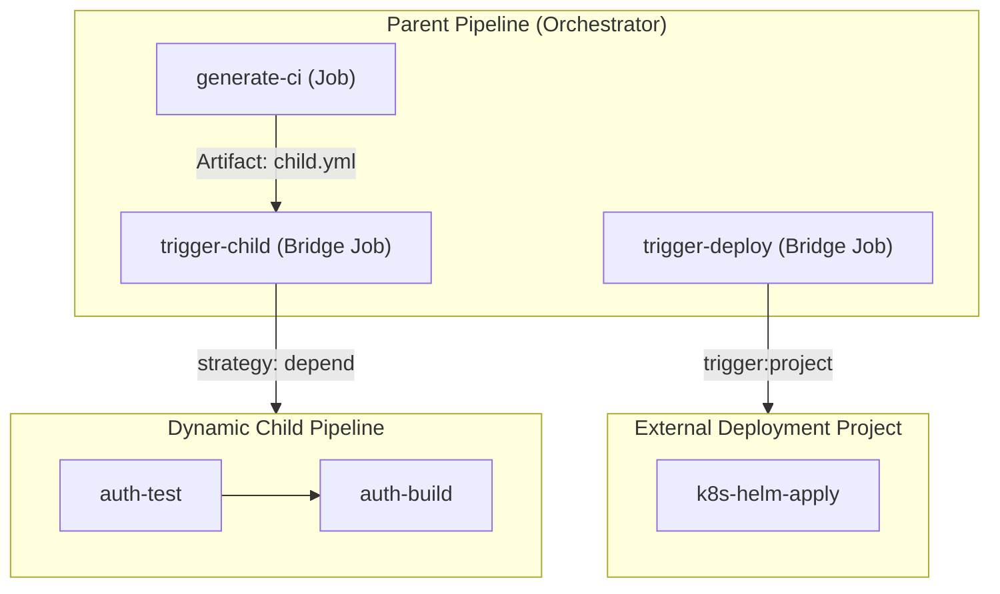
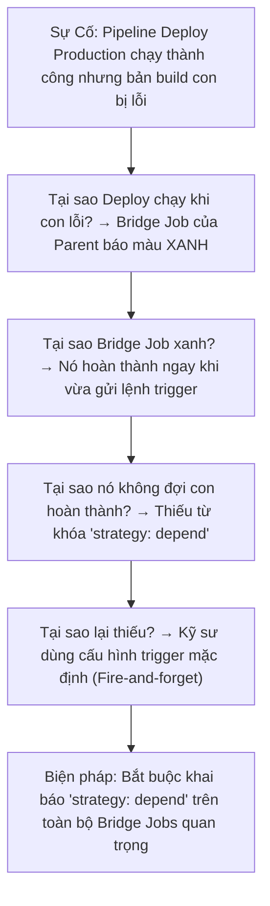


# [BÀI 09] ĐIỀU PHỐI PIPELINE ĐA TẦNG: CHILD/PARENT PIPELINES & MULTI-PROJECT TRIGGERS

Trong kỷ nguyên **DevOps, DevSecOps và Cloud Native Engineering**, **GitLab CI/CD** được công nhận là một trong những nền tảng tự động hóa tích hợp liên tục và phân phối liên tục (CI/CD) hoàn chỉnh, mạnh mẽ và được tin dùng nhất trong các doanh nghiệp quy mô lớn. Không chỉ dừng lại ở các pipeline tuần tự cơ bản, việc vận hành GitLab CI/CD ở cấp độ Production đòi hỏi kỹ sư phải làm chủ kiến trúc điều phối phi tuyến tính **DAG (Directed Acyclic Graph)**, cơ chế quản trị **Autoscaling Runners**, tối ưu hóa **Caching đa tầng**, xác thực không khóa **Keyless OIDC**, bảo mật chuỗi cung ứng phần mềm **SLSA & SBOM** cùng các chính sách **Quality & Security Gates** tự động.

Bài viết chuyên sâu này sẽ đồng hành cùng bạn mổ xẻ toàn diện bức tranh kiến trúc, phân tích các đánh đổi kỹ thuật thực chiến (Engineering Trade-offs), cung cấp hướng dẫn thực hành Lab chi tiết từng bước và bộ câu hỏi phỏng vấn chuyên sâu chuẩn DevOps Lead / DevSecOps Architect.

---

## 1. Bản Chất Kiến Trúc & Cơ Chế Vận Hành Tầng Thấp

### 1.1. Luận Đề Trung Tâm: Vượt Qua Giới Hạn Đơn Khối Bằng Kiến Trúc Đa Tầng

Khi các tổ chức chuyển đổi sang mô hình **Monorepo** (chứa hàng chục microservices trong một repository) hoặc **Micro-repositories** (mỗi service một repo độc lập nhưng phụ thuộc triển khai chéo), việc nhồi nhét toàn bộ cấu hình CI/CD vào một tệp `.gitlab-ci.yml` duy nhất sẽ gây ra 3 thảm họa:
1. **File YAML phình to hàng nghìn dòng**, không thể kiểm soát và bảo trì.
2. **Thời gian nạp pipeline tại $t_0$ chậm chạp**, dễ vượt quá giới hạn phân tích cú pháp (YAML expansion limit).
3. **Mất tính độc lập**: Thay đổi nhỏ ở một service có thể kích hoạt hoặc làm gãy pipeline của toàn bộ các service khác.

> **Kiến trúc Child/Parent Pipelines và Multi-Project Triggers chia nhỏ hệ thống điều phối thành các đồ thị độc lập. Cầu nối giữa các tầng là `Bridge Job` — một loại job đặc biệt chạy trực tiếp trên GitLab Server mà không tiêu tốn tài nguyên của Runner.**

```text
   PARENT PIPELINE (Điều phối trung tâm / Monorepo Coordinator)
   ├── [ Job: Detect Changes ] (Sinh dynamic config / Phân tích git diff)
   │
   ├── [ Bridge Job: Trigger Service Auth ] ──────► CHILD PIPELINE (Auth Service)
   │    (Chạy trên Server, không tốn Runner)         ├── [ Lint ] ──► [ Test ] ──► [ Build ]
   │
   └── [ Bridge Job: Trigger Service Order ] ─────► CHILD PIPELINE (Order Service)
        (strategy: depend)                           ├── [ Test Matrix ] ──► [ Deploy Canary ]
```



### 1.2. Bản Chất Kỹ Thuật Của Bridge Job & Chiến Lược `strategy: depend`

1. **Bridge Job Không Tiêu Tốn Runner**:
   - Khi một job chứa từ khóa `trigger:`, GitLab xem đây là một Bridge Job.
   - Server GitLab tự quản lý vòng đời của Bridge Job ở tầng PostgreSQL/Redis mà không gửi yêu cầu nhặt job (job polling request) xuống GitLab Runner.
2. **Chiến Lược Đồng Bộ `strategy: depend`**:
   - **Mặc định (Fire-and-forget)**: Bridge Job hoàn thành ngay khi Child Pipeline vừa được kích hoạt thành công. Nếu Child Pipeline sau đó bị FAILED, Parent Pipeline vẫn hiển thị màu XANH (Green) &rarr; Nguy hiểm cho các pipeline deploy tự động.
   - **`strategy: depend` (Đồng bộ hai chiều)**: Bridge Job sẽ giữ trạng thái `running` và chờ toàn bộ Child Pipeline kết thúc. Nếu Child Pipeline FAILED &rarr; Bridge Job lập tức FAILED &rarr; Toàn bộ Parent Pipeline bị đánh dấu FAILED.

### 1.3. Pipeline Động (Dynamic Child Pipelines) & Điểm $t_0$ Thứ Hai

- **Dynamic Child Pipeline** cho phép một job ở Parent Pipeline chạy code (Python, Bash, Node.js) để phân tích `git diff` và **tự sinh ra tệp YAML cấu hình tại thời điểm runtime**, sau đó truyền tệp này làm artifact cho Bridge Job:
  ```yaml
  trigger_dynamic:
    stage: deploy
    trigger:
      include:
        - artifact: generated-pipeline.yml
          job: generate_config
      strategy: depend
  ```
- **Hiện tượng $t_0$ thứ hai**:
  - Tại Parent Pipeline, thời điểm $t_0$ diễn ra khi commit được push lên.
  - Tại Child Pipeline, thời điểm $t_0$ của nó diễn ra **chính xác khi Bridge Job được kích hoạt**.
  - Do đó, **các biến sinh ra từ Parent (hoặc biến `dotenv` của Parent) hoàn toàn có thể được dùng trong mệnh đề `rules:` của Child Pipeline** — giải quyết triệt để rào cản không thể dùng biến runtime trong rules của pipeline đơn khối!

### 1.4. Phân Quyền Multi-Project Triggers Với `CI_JOB_TOKEN`

Để kích hoạt pipeline ở một repository khác (`trigger:project`), GitLab sử dụng token tạm thời `CI_JOB_TOKEN`.
- **Cơ chế bảo mật Job Token Allowlist**: Project đích phải cấu hình cho phép Project nguồn truy cập trong mục **Settings > CI/CD > Job Token Permissions**. Nếu chưa được allowlist, API sẽ trả về lỗi `403 Forbidden` hoặc `404 Project Not Found`.

---

## 2. Bảng So Sánh Kỹ Thuật Toàn Diện (Engineering Matrix)

| Tiêu chí phân tích | Single Monolithic Pipeline | Static Child Pipeline | Dynamic Child Pipeline | Multi-Project Trigger |
| :--- | :--- | :--- | :--- | :--- |
| **Vị trí định nghĩa YAML** | 1 file duy nhất `.gitlab-ci.yml` | Nhiều file tĩnh trong cùng repo | Sinh động ra file artifact | Khai báo ở repository khác |
| **Khả năng mở rộng (Scale)** | Kém (< 50 jobs) | Tốt (Phân tách theo thư mục) | Rất tốt (Monorepo quy mô lớn) | Xuất sắc (Enterprise Multi-repo) |
| **Đánh giá Rules với biến động** | ❌ Không thể | ❌ Không thể | ✅ Hỗ trợ ($t_0$ thứ hai) | ✅ Hỗ trợ (Truyền qua variables) |
| **Chi phí phân tích cú pháp** | Nặng tại $t_0$ ban đầu | Phân tán theo từng child | Tối ưu (Chỉ parse phần cần chạy) | Độc lập hoàn toàn |
| **Phân quyền bảo mật** | Dùng chung toàn repo | Dùng chung toàn repo | Dùng chung toàn repo | Kiểm soát qua `CI_JOB_TOKEN` |
| **Độ phức tạp gỡ lỗi** | Thấp | Trung bình | Khá (Cần xem artifact YAML) | Cao (Theo dõi đa repo) |
| **Trường hợp sử dụng tối ưu** | Ứng dụng nhỏ độc lập | Monorepo cố định vài service | Monorepo hàng trăm service | Microservices, GitOps Fleet Deploy |

---

## 3. Kiến Trúc Triển Khai Chuẩn Production (Architecture Breakdown)

Dưới đây là kiến trúc pipeline điều phối Monorepo chuẩn Enterprise kết hợp **Phát hiện thay đổi Git Diff**, **Sinh cấu hình động Dynamic Child Pipeline** và **Kích hoạt Multi-Project Deployment**:

```yaml
# ==============================================================================
# PIPELINE ĐIỀU PHỐI MONOREPO & MULTI-PROJECT CHUẨN ENTERPRISE
# ==============================================================================
workflow:
  rules:
    - if: '$CI_PIPELINE_SOURCE == "merge_request_event"'
    - if: '$CI_COMMIT_BRANCH == $CI_DEFAULT_BRANCH'

stages:
  - analyze
  - trigger_internal
  - trigger_external

# ------------------------------------------------------------------------------
# 1. ANALYZE & GENERATE: Phân tích thay đổi và sinh YAML động cho Microservices
# ------------------------------------------------------------------------------
generate_dynamic_ci:
  stage: analyze
  image: python:3.12-alpine
  script:
    - echo "=== Analyzing Git Diff to generate selective Child Pipelines ==="
    - apk add --no-cache git
    # Script sinh file dynamic-ci.yml dựa trên các folder bị sửa
    - |
      python3 -c "
      import subprocess, yaml

      # Lấy danh sách file thay đổi so với commit trước hoặc target branch
      diff_files = subprocess.check_output(['git', 'diff', '--name-only', 'HEAD~1']).decode().splitlines()
      
      pipeline = {'stages': ['test', 'build']}
      
      # Kiểm tra thay đổi trong thư mục services/auth
      if any(f.startswith('services/auth/') for f in diff_files) or True: # Mặc định demo
          pipeline['test-auth'] = {
              'stage': 'test',
              'image': 'alpine:3.20',
              'script': ['echo Running Auth Unit Tests', 'mkdir -p out && echo AUTH_OK > out/auth.txt'],
              'artifacts': {'paths': ['out/']}
          }
      
      # Kiểm tra thay đổi trong thư mục services/payment
      if any(f.startswith('services/payment/') for f in diff_files) or True:
          pipeline['test-payment'] = {
              'stage': 'test',
              'image': 'alpine:3.20',
              'script': ['echo Running Payment Compliance Tests']
          }
          
      with open('generated-child-ci.yml', 'w') as f:
          yaml.dump(pipeline, f)
      "
    - cat generated-child-ci.yml
  artifacts:
    paths:
      - generated-child-ci.yml
    expire_in: 1 hour

# ------------------------------------------------------------------------------
# 2. TRIGGER INTERNAL: Kích hoạt Dynamic Child Pipeline với strategy: depend
# ------------------------------------------------------------------------------
trigger_services_pipeline:
  stage: trigger_internal
  needs:
    - job: generate_dynamic_ci
      artifacts: true
  trigger:
    include:
      - artifact: generated-child-ci.yml
        job: generate_dynamic_ci
    strategy: depend # Đồng bộ trạng thái Pass/Fail với Child Pipeline

# ------------------------------------------------------------------------------
# 3. TRIGGER EXTERNAL: Kích hoạt Multi-Project Deployment sang Repository CD/GitOps
# ------------------------------------------------------------------------------
trigger_gitops_deploy:
  stage: trigger_external
  needs:
    - job: trigger_services_pipeline
  rules:
    - if: '$CI_COMMIT_BRANCH == $CI_DEFAULT_BRANCH'
      when: manual
  trigger:
    project: infrastructure/gitops-deployments
    branch: main
    strategy: depend
```

---

## 4. Phân Tích Cạm Bẫy Thực Chiến (5-Whys Incident Analysis)



### 4.1. Incident 1: Parent Pipeline Báo Xanh Giả Tạo Dù Child Pipeline Bị Lỗi

### Tình Huống Sự Cố Thực Tế:
<span class="badge badge--rose">🕒 08:30 PM</span> — Hệ thống CI/CD thông báo bản release v3.2 đã sẵn sàng deploy lên Production. Tuy nhiên, khi truy cập vào microservice Auth sau deploy, dịch vụ bị sập hoàn toàn do module thanh toán bị gãy ở tầng kiểm thử đơn vị trong Child Pipeline.

### Hậu Quả & Log Lỗi Thực Tế:
```text
Parent Pipeline #9821: Status PASSED (Green)
├── analyze (passed)
├── trigger_services_pipeline (passed in 2s)
└── trigger_gitops_deploy (passed in 15s)

Child Pipeline #9822 (Downstream of #9821): Status FAILED (Red)
├── test-auth (passed)
└── test-payment (FAILED: Exit code 1 - Assertion error: token format invalid)
```

### 5-Whys Root Cause Analysis:
1. <span class="badge badge--primary">Why 1</span> **Tại sao Parent Pipeline chuyển sang trạng thái XANH dù test trong Child bị đỏ?** &rarr; Bridge Job `trigger_services_pipeline` hoàn thành và trả về Exit Code 0 ngay sau khi gửi yêu cầu tạo Child Pipeline thành công.
2. <span class="badge badge--primary">Why 2</span> **Tại sao Bridge Job không theo dõi tiến độ chạy của con?** &rarr; Khối cấu hình `trigger:` thiếu chỉ thị `strategy: depend`.
3. <span class="badge badge--primary">Why 3</span> **Tại sao lập trình viên không cấu hình `strategy: depend`?** &rarr; Lập trình viên nhầm tưởng cơ chế trigger mặc định sẽ tự động đồng bộ kết quả giữa hai đồ thị.
4. <span class="badge badge--primary">Why 4</span> **Tại sao bước deploy GitOps ở downstream vẫn diễn ra?** &rarr; Stage `trigger_external` chỉ phụ thuộc vào trạng thái thành công của `trigger_services_pipeline` ở Parent.
5. <span class="badge badge--emerald">Root Cause Remedy</span> **Biện pháp khắc phục chuẩn SRE:**
   - <span class="badge badge--emerald">Enforce strategy: depend</span>: Bắt buộc áp dụng `strategy: depend` trên mọi Bridge Job điều phối kiểm thử hoặc đóng gói.
   - <span class="badge badge--cyan">CI Policy Gate</span>: Chặn đứng các MR thiếu `strategy: depend` thông qua quy tắc kiểm tra pipeline tự động.

### 4.2. Incident 2: Multi-Project Trigger Bị Từ Chối Với Mã Lỗi HTTP 403 Forbidden

### Tình Huống Sự Cố Thực Tế:
<span class="badge badge--rose">🕒 02:10 PM</span> — Đội ngũ phát triển ứng dụng không thể kích hoạt pipeline deploy tự động sang repository GitOps trung tâm `infrastructure/gitops-fleet` sau khi cập nhật phiên bản GitLab mới.

### Hậu Quả & Log Lỗi Thực Tế:
```text
$ git push origin main
Triggering downstream project: infrastructure/gitops-fleet (branch: main)
ERROR: Downstream pipeline could not be created:
ERROR: 403 Forbidden - Insufficient permissions to trigger downstream pipeline via CI_JOB_TOKEN.
ERROR: Project 'apps/backend' is not in the allowlist of 'infrastructure/gitops-fleet'.
ERROR: Job failed: exit code 1
```

### 5-Whys Root Cause Analysis:
1. <span class="badge badge--primary">Why 1</span> **Tại sao Bridge Job trigger sang repo GitOps bị từ chối với mã 403?** &rarr; GitLab Server từ chối quyền truy cập của `CI_JOB_TOKEN` gửi từ repository nguồn `apps/backend`.
2. <span class="badge badge--primary">Why 2</span> **Tại sao `CI_JOB_TOKEN` trước đây vẫn hoạt động mà nay bị chặn?** &rarr; GitLab phiên bản mới tự động kích hoạt chính sách bảo mật **CI/CD Job Token Allowlist** mặc định cho toàn bộ project.
3. <span class="badge badge--primary">Why 3</span> **Tại sao repository `apps/backend` chưa được cấp quyền?** &rarr; Quản trị viên chưa thêm path của project ứng dụng vào danh sách Token Access Control của repo hạ tầng.
4. <span class="badge badge--primary">Why 4</span> **Tính năng này bảo vệ điều gì?** &rarr; Ngăn chặn các repository không tin cậy hoặc token bị chiếm quyền trong cùng GitLab Instance tùy tiện kích hoạt deploy hạ tầng.
5. <span class="badge badge--emerald">Root Cause Remedy</span> **Biện pháp khắc phục chuẩn SRE:**
   - <span class="badge badge--rose">Job Token Allowlist</span>: Truy cập Settings > CI/CD > Job Token Permissions của project đích và allowlist chính xác các upstream projects.
   - <span class="badge badge--emerald">Service Account Scoping</span>: Sử dụng Project Access Token chuyên dụng cho các trigger liên tổ chức.

---

## 5. Hands-on Lab: Điều Phối Child/Parent & Multi-Project Pipelines (8 Bước Chuẩn)

```text
   ┌────────────────────────────────────────────────────────────────────────┐
   │                 LAB ARCHITECTURE: MULTI-TIER PIPELINES                 │
   ├────────────────────────────────────────────────────────────────────────┤
   │                                                                        │
   │  [ Bước 1: Khởi Tạo Cấu Trúc Monorepo Đa Dịch Vụ ]                     │
   │  Thiết lập workspace chứa service frontend và service backend          │
   │                         │                                              │
   │                         ▼                                              │
   │  [ Bước 2: Xây Dựng Static Child Pipeline ]                            │
   │  Tách cấu hình microservice thành các tệp YAML con độc lập             │
   │                         │                                              │
   │                         ▼                                              │
   │  [ Bước 3: Đồng Bộ Trạng Thái Với strategy: depend ]                   │
   │  Kiểm chứng cơ chế bắt lỗi hai chiều giữa Parent và Child              │
   │                         │                                              │
   │                         ▼                                              │
   │  [ Bước 4: Tạo Pipeline Động Dynamic Child Pipeline ]                  │
   │  Viết script tự sinh file YAML từ phân tích thay đổi                   │
   │                         │                                              │
   │                         ▼                                              │
   │  [ Bước 5: Kiểm Tra Cú Pháp YAML Tự Động Qua CI Lint API ]             │
   │  Xác thực tính toàn vẹn của tệp cấu hình động trước khi trigger        │
   │                         │                                              │
   │                         ▼                                              │
   │  [ Bước 6: Truyền Biến Động Sang $t_0$ Thứ Hai Của Con ]               │
   │  Sử dụng biến từ Parent để đánh giá rules: trong Child Pipeline        │
   │                         │                                              │
   │                         ▼                                              │
   │  [ Bước 7: Cấu Hình Multi-Project Trigger Liên Repo ]                  │
   │  Điều phối triển khai sang external project với CI_JOB_TOKEN           │
   │                         │                                              │
   │                         ▼                                              │
   │  [ Bước 8: Dọn Dẹp Tài Nguyên & Audit Báo Cáo ]                        │
   │  Xóa tệp tạm và kiểm tra cây điều phối trên giao diện Pipeline Graph   │
   │                                                                        │
   └────────────────────────────────────────────────────────────────────────┘
```

### Bước 1: Khởi Tạo Cấu Trúc Monorepo Đa Dịch Vụ
Tạo cấu trúc thư mục đại diện cho hai microservices độc lập trong dự án.

```bash
mkdir -p services/auth services/billing
echo "Auth Service v1.0" > services/auth/app.py
echo "Billing Service v1.0" > services/billing/app.py
```

> **Checkpoint 1**: Kiểm tra cấu trúc thư mục đảm bảo hai service nằm tách biệt hoàn toàn.

### Bước 2: Xây Dựng Static Child Pipeline
Tạo tệp cấu hình con `services/auth/.gitlab-ci.yml` cho service Auth.

```yaml
# services/auth/.gitlab-ci.yml
stages:
  - test
  - build

auth_unit_test:
  stage: test
  image: alpine:3.20
  script:
    - echo "Testing Auth microservice..."
    - sleep 2

auth_docker_build:
  stage: build
  image: alpine:3.20
  script:
    - echo "Building Auth container image..."
```

Cấu hình Parent `.gitlab-ci.yml` để kích hoạt:

```yaml
stages:
  - triggers

trigger_auth_service:
  stage: triggers
  trigger:
    include: services/auth/.gitlab-ci.yml
    strategy: depend
```

> **Checkpoint 2**: Chạy pipeline. Giao diện GitLab hiển thị thẻ `Downstream` dẫn thẳng vào Child Pipeline của Auth Service.

### Bước 3: Đồng Bộ Trạng Thái Với `strategy: depend`
Tạo một lỗi cố ý bên trong Child Pipeline để kiểm tra xem Parent có chuyển màu ĐỎ hay không.

```yaml
# Sửa script trong services/auth/.gitlab-ci.yml
auth_unit_test:
  stage: test
  image: alpine:3.20
  script:
    - echo "Simulating Auth Test Failure!"
    - exit 1
```

> **Checkpoint 3**: Chạy pipeline. Child Pipeline thất bại, Bridge Job `trigger_auth_service` lập tức chuyển sang trạng thái FAILED, bảo vệ Parent không bị xanh giả tạo.

### Bước 4: Tạo Pipeline Động Dynamic Child Pipeline
Khôi phục code lỗi và viết script tự động sinh cấu hình YAML cho service Billing.

```yaml
stages:
  - generate
  - trigger

generate_billing_ci:
  stage: generate
  image: alpine:3.20
  script:
    - echo "=== Generating Dynamic Billing Pipeline ==="
    - |
      cat << 'EOF' > dynamic-billing.yml
      stages:
        - verify
      billing_audit:
        stage: verify
        image: alpine:3.20
        script:
          - echo "Dynamic Billing PCI-DSS Audit PASSED"
      EOF
  artifacts:
    paths:
      - dynamic-billing.yml

trigger_dynamic_billing:
  stage: trigger
  needs:
    - job: generate_billing_ci
      artifacts: true
  trigger:
    include:
      - artifact: dynamic-billing.yml
        job: generate_billing_ci
    strategy: depend
```

> **Checkpoint 4**: Parent Pipeline tạo ra `dynamic-billing.yml` và kích hoạt Child Pipeline thành công từ tệp artifact.

### Bước 5: Kiểm Tra Cú Pháp YAML Tự Động Qua CI Lint API
Tích hợp bước xác thực linting trước khi truyền sang Bridge Job.

```bash
# Kiểm tra cú pháp YAML sinh ra qua API
curl --header "Content-Type: application/json" \
  --header "PRIVATE-TOKEN: ${GITLAB_TOKEN}" \
  --data "{\"content\": $(jq -Rs . < dynamic-billing.yml)}" \
  "${GITLAB_URL}/api/v4/ci/lint" | jq .valid
```

> **Checkpoint 5**: Lệnh trả về `true`, khẳng định tệp YAML an toàn để nạp vào hệ thống điều phối.

### Bước 6: Truyền Biến Động Sang $t_0$ Thứ Hai Của Con
Truyền biến môi trường từ Parent sang Child và kiểm chứng việc sử dụng trong `rules:`.

```yaml
trigger_with_vars:
  stage: trigger
  variables:
    DEPLOY_TARGET: "production"
  trigger:
    include: dynamic-billing.yml
    strategy: depend
```

> **Checkpoint 6**: Child Pipeline nhận chính xác biến `DEPLOY_TARGET=production` và đánh giá được trong các biểu thức điều kiện của nó.

### Bước 7: Cấu Hình Multi-Project Trigger Liên Repo
Thiết lập kích hoạt pipeline sang một repository triển khai khác.

```yaml
trigger_external_fleet:
  stage: trigger
  trigger:
    project: group-deployments/k8s-fleet
    branch: main
    strategy: depend
  rules:
    - if: '$CI_COMMIT_BRANCH == $CI_DEFAULT_BRANCH'
```

> **Checkpoint 7**: Trên sơ đồ Pipeline hiển thị liên kết Cross-Project trỏ sang dự án `k8s-fleet`.

### Bước 8: Dọn Dẹp Tài Nguyên & Audit Báo Cáo
Xóa các tệp tạm sinh ra và hoàn tất quy trình chuẩn hóa.

```bash
rm -rf services/ dynamic-billing.yml
echo "Child/Parent orchestration pattern verified successfully."
```

> **Checkpoint 8**: Monorepo sạch sẽ và toàn bộ cây điều phối hoàn thành đúng tiêu chuẩn.

---

## 6. Bộ Câu Hỏi Vấn Đáp & Phỏng Vấn Chuyên Sâu (Self-Check Q&A)

<details class="qa-card">
  <summary class="qa-summary">
    <div class="qa-summary-left">
      <span class="qa-num-badge">Q01</span>
      <span>Bridge Job trong GitLab CI là gì? Nó có tiêu tốn tài nguyên CPU/RAM của GitLab Runner không?</span>
    </div>
    <span class="qa-chevron">
      <svg width="18" height="18" fill="none" stroke="currentColor" stroke-width="2.5" viewBox="0 0 24 24"><polyline points="6 9 12 15 18 9"></polyline></svg>
    </span>
  </summary>
  <div class="qa-answer">
    <div class="qa-answer-header">
      <svg width="14" height="14" fill="none" stroke="currentColor" stroke-width="2" viewBox="0 0 24 24"><path d="M22 11.08V12a10 10 0 1 1-5.93-9.14"></path><polyline points="22 4 12 14.01 9 11.01"></polyline></svg>
      <span>Phân Tích &amp; Lời Giải Kỹ Thuật</span>
    </div>
    <p><b>Bridge Job</b> là một loại job đặc biệt trong GitLab CI không chứa khối <code>script:</code> thực thi mà chứa từ khóa <code>trigger:</code> để khởi tạo một Child Pipeline hoặc Multi-Project Downstream Pipeline.</p>
    <p><b>Không tiêu tốn Runner</b>: Bridge Job được điều phối và quản lý trạng thái hoàn toàn bởi GitLab Server (thông qua database và tiến trình Sidekiq nội bộ). Nó không gửi yêu cầu thực thi xuống Runner daemon, do đó không tiêu tốn CPU/RAM hay chiếm slot đồng thời của hệ thống Runner.</p>
  </div>
</details>

<details class="qa-card">
  <summary class="qa-summary">
    <div class="qa-summary-left">
      <span class="qa-num-badge">Q02</span>
      <span>Tại sao cần sử dụng <code>strategy: depend</code> trong cấu hình trigger của Bridge Job? Hậu quả nếu bỏ quên từ khóa này là gì?</span>
    </div>
    <span class="qa-chevron">
      <svg width="18" height="18" fill="none" stroke="currentColor" stroke-width="2.5" viewBox="0 0 24 24"><polyline points="6 9 12 15 18 9"></polyline></svg>
    </span>
  </summary>
  <div class="qa-answer">
    <div class="qa-answer-header">
      <svg width="14" height="14" fill="none" stroke="currentColor" stroke-width="2" viewBox="0 0 24 24"><path d="M22 11.08V12a10 10 0 1 1-5.93-9.14"></path><polyline points="22 4 12 14.01 9 11.01"></polyline></svg>
      <span>Phân Tích &amp; Lời Giải Kỹ Thuật</span>
    </div>
    <p><b>Mục đích</b>: <code>strategy: depend</code> ép Bridge Job phải chờ cho đến khi Downstream/Child Pipeline chạy xong hoàn toàn, và đồng bộ trạng thái: Nếu Child FAILED thì Bridge Job và Parent Pipeline cũng bị FAILED.</p>
    <p><b>Hậu quả nếu thiếu</b>: Mặc định cơ chế là <i>Fire-and-forget</i>, Bridge Job sẽ chuyển màu XANH (Success) ngay khi vừa gửi lệnh trigger thành công. Nếu các job test/build trong Child Pipeline bị lỗi đỏ sau đó, Parent Pipeline vẫn hiển thị XANH, dẫn đến việc các bước deploy tự động tiếp theo vẫn chạy trên bản build hỏng.</p>
  </div>
</details>

<details class="qa-card">
  <summary class="qa-summary">
    <div class="qa-summary-left">
      <span class="qa-num-badge">Q03</span>
      <span>Giải thích khái niệm "Thời điểm t0 thứ hai" trong Dynamic Child Pipelines và lợi ích lớn nhất của nó so với Pipeline tĩnh thông thường.</span>
    </div>
    <span class="qa-chevron">
      <svg width="18" height="18" fill="none" stroke="currentColor" stroke-width="2.5" viewBox="0 0 24 24"><polyline points="6 9 12 15 18 9"></polyline></svg>
    </span>
  </summary>
  <div class="qa-answer">
    <div class="qa-answer-header">
      <svg width="14" height="14" fill="none" stroke="currentColor" stroke-width="2" viewBox="0 0 24 24"><path d="M22 11.08V12a10 10 0 1 1-5.93-9.14"></path><polyline points="22 4 12 14.01 9 11.01"></polyline></svg>
      <span>Phân Tích &amp; Lời Giải Kỹ Thuật</span>
    </div>
    <p><b>Khái niệm</b>: Trong pipeline đơn khối thông thường, thời điểm t0 (thời điểm Server phân tích cú pháp YAML và đánh giá <code>rules:</code>) chỉ diễn ra 1 lần duy nhất khi commit được push lên. Trong Dynamic Child Pipeline, thời điểm t0 của Child Pipeline diễn ra <b>tại thời điểm Bridge Job được kích hoạt (Runtime)</b>.</p>
    <p><b>Lợi ích lớn nhất</b>: Các biến môi trường sinh ra trong quá trình chạy của Parent Pipeline (ví dụ: biến <code>dotenv</code>, kết quả phân tích git diff) có thể được nạp vào Child Pipeline và <b>được đánh giá trực tiếp trong mệnh đề <code>rules:</code> của Child</b> — điều hoàn toàn bất khả thi trong pipeline tĩnh.</p>
  </div>
</details>

<details class="qa-card">
  <summary class="qa-summary">
    <div class="qa-summary-left">
      <span class="qa-num-badge">Q04</span>
      <span>Phân biệt bản chất kỹ thuật giữa Static Child Pipeline và Dynamic Child Pipeline.</span>
    </div>
    <span class="qa-chevron">
      <svg width="18" height="18" fill="none" stroke="currentColor" stroke-width="2.5" viewBox="0 0 24 24"><polyline points="6 9 12 15 18 9"></polyline></svg>
    </span>
  </summary>
  <div class="qa-answer">
    <div class="qa-answer-header">
      <svg width="14" height="14" fill="none" stroke="currentColor" stroke-width="2" viewBox="0 0 24 24"><path d="M22 11.08V12a10 10 0 1 1-5.93-9.14"></path><polyline points="22 4 12 14.01 9 11.01"></polyline></svg>
      <span>Phân Tích &amp; Lời Giải Kỹ Thuật</span>
    </div>
    <p><b>Static Child Pipeline</b>: File cấu hình YAML con đã tồn tại sẵn trong repository (ví dụ <code>services/order/.gitlab-ci.yml</code>). Khối trigger trỏ trực tiếp tới đường dẫn file tĩnh: <code>trigger: include: path/to/file.yml</code>.</p>
    <p><b>Dynamic Child Pipeline</b>: File cấu hình YAML con <i>chưa hề tồn tại trước đó</i>. Nó được sinh ra động bởi một job trước đó trong Parent Pipeline (thông qua script Python/Bash phân tích mã nguồn) và lưu thành một file artifact. Khối trigger nạp file artifact này để khởi tạo pipeline: <code>trigger: include: [{ artifact: gen.yml, job: gen_job }]</code>.</p>
  </div>
</details>

<details class="qa-card">
  <summary class="qa-summary">
    <div class="qa-summary-left">
      <span class="qa-num-badge">Q05</span>
      <span>Làm thế nào để tải Artifacts từ Parent Pipeline xuống Child Pipeline và ngược lại?</span>
    </div>
    <span class="qa-chevron">
      <svg width="18" height="18" fill="none" stroke="currentColor" stroke-width="2.5" viewBox="0 0 24 24"><polyline points="6 9 12 15 18 9"></polyline></svg>
    </span>
  </summary>
  <div class="qa-answer">
    <div class="qa-answer-header">
      <svg width="14" height="14" fill="none" stroke="currentColor" stroke-width="2" viewBox="0 0 24 24"><path d="M22 11.08V12a10 10 0 1 1-5.93-9.14"></path><polyline points="22 4 12 14.01 9 11.01"></polyline></svg>
      <span>Phân Tích &amp; Lời Giải Kỹ Thuật</span>
    </div>
    <p><b>Từ Parent xuống Child</b>: Trong Child Pipeline, sử dụng <code>needs:pipeline:job_name</code> hoặc sử dụng cơ chế truyền biến dotenv từ Parent.</p>
    <p><b>Từ Child lên Parent</b>: Cấu hình <code>needs: [{ pipeline: $CI_PIPELINE_ID, job: child_job }]</code> trong các job tiếp theo của Parent Pipeline sau khi Bridge Job hoàn tất với <code>strategy: depend</code>.</p>
  </div>
</details>

<details class="qa-card">
  <summary class="qa-summary">
    <div class="qa-summary-left">
      <span class="qa-num-badge">Q06</span>
      <span>Thuộc tính <code>inherit:variables:</code> có tác dụng gì trong việc kiểm soát bảo mật giữa Parent và Child Pipelines?</span>
    </div>
    <span class="qa-chevron">
      <svg width="18" height="18" fill="none" stroke="currentColor" stroke-width="2.5" viewBox="0 0 24 24"><polyline points="6 9 12 15 18 9"></polyline></svg>
    </span>
  </summary>
  <div class="qa-answer">
    <div class="qa-answer-header">
      <svg width="14" height="14" fill="none" stroke="currentColor" stroke-width="2" viewBox="0 0 24 24"><path d="M22 11.08V12a10 10 0 1 1-5.93-9.14"></path><polyline points="22 4 12 14.01 9 11.01"></polyline></svg>
      <span>Phân Tích &amp; Lời Giải Kỹ Thuật</span>
    </div>
    <p>Mặc định (<code>inherit:variables: true</code>), toàn bộ biến môi trường của Parent Pipeline sẽ tự động được truyền sang Child Pipeline.</p>
    <p>Để bảo vệ các Secrets nhạy cảm (như Master Database Password, Production API Keys) không bị rò rỉ sang các Child Pipeline của các microservice không liên quan, ta sử dụng <code>inherit:variables: false</code> hoặc chỉ định danh sách biến tối thiểu được phép kế thừa: <code>inherit:variables: [APP_ENV, REGISTRY_URL]</code>.</p>
  </div>
</details>

<details class="qa-card">
  <summary class="qa-summary">
    <div class="qa-summary-left">
      <span class="qa-num-badge">Q07</span>
      <span>Khi thực hiện Multi-Project Trigger sang repository khác, lỗi HTTP 403 / 404 thường do nguyên nhân gì và khắc phục như thế nào?</span>
    </div>
    <span class="qa-chevron">
      <svg width="18" height="18" fill="none" stroke="currentColor" stroke-width="2.5" viewBox="0 0 24 24"><polyline points="6 9 12 15 18 9"></polyline></svg>
    </span>
  </summary>
  <div class="qa-answer">
    <div class="qa-answer-header">
      <svg width="14" height="14" fill="none" stroke="currentColor" stroke-width="2" viewBox="0 0 24 24"><path d="M22 11.08V12a10 10 0 1 1-5.93-9.14"></path><polyline points="22 4 12 14.01 9 11.01"></polyline></svg>
      <span>Phân Tích &amp; Lời Giải Kỹ Thuật</span>
    </div>
    <p><b>Nguyên nhân</b>: Do cơ chế bảo mật <b>CI/CD Job Token Access Control</b> của GitLab. Mặc định, một dự án không cho phép các dự án khác tùy tiện kích hoạt pipeline hoặc truy cập tài nguyên của nó thông qua <code>CI_JOB_TOKEN</code>.</p>
    <p><b>Khắc phục</b>: Truy cập vào Project đích &gt; <i>Settings &gt; CI/CD &gt; Job Token Permissions (hoặc Token Access)</i> &gt; Thêm đường dẫn (Project Path) của Project nguồn vào danh sách Allowlist được cấp quyền.</p>
  </div>
</details>

<details class="qa-card">
  <summary class="qa-summary">
    <div class="qa-summary-left">
      <span class="qa-num-badge">Q08</span>
      <span>Làm thế nào để ngăn chặn hiện tượng Vòng Lặp Vô Tận (Infinite Pipeline Loop) trong Multi-Project Triggers?</span>
    </div>
    <span class="qa-chevron">
      <svg width="18" height="18" fill="none" stroke="currentColor" stroke-width="2.5" viewBox="0 0 24 24"><polyline points="6 9 12 15 18 9"></polyline></svg>
    </span>
  </summary>
  <div class="qa-answer">
    <div class="qa-answer-header">
      <svg width="14" height="14" fill="none" stroke="currentColor" stroke-width="2" viewBox="0 0 24 24"><path d="M22 11.08V12a10 10 0 1 1-5.93-9.14"></path><polyline points="22 4 12 14.01 9 11.01"></polyline></svg>
      <span>Phân Tích &amp; Lời Giải Kỹ Thuật</span>
    </div>
    <p>Sử dụng các điều kiện lọc nguồn pipeline chặt chẽ trong khối <code>workflow: rules:</code>:</p>
    <div class="language-yaml highlighter-rouge"><pre class="highlight"><code><span class="na">workflow</span><span class="pi">:</span>
  <span class="na">rules</span><span class="pi">:</span>
    <span class="c1"># Không kích hoạt pipeline nếu nguồn gốc là từ một pipeline trigger khác</span>
    <span class="pi">-</span> <span class="na">if</span><span class="pi">:</span> <span class="s1">'</span><span class="s">$CI_PIPELINE_SOURCE</span><span class="nv"> </span><span class="s">==</span><span class="nv"> </span><span class="s">"pipeline"'</span>
      <span class="na">when</span><span class="pi">:</span> <span class="s">never</span>
    <span class="pi">-</span> <span class="na">if</span><span class="pi">:</span> <span class="s1">'</span><span class="s">$CI_COMMIT_BRANCH'</span>
</code></pre></div>
  </div>
</details>

<details class="qa-card">
  <summary class="qa-summary">
    <div class="qa-summary-left">
      <span class="qa-num-badge">Q09</span>
      <span>Tại sao cần chạy bước kiểm tra cú pháp (CI Lint) trước khi kích hoạt Dynamic Child Pipeline?</span>
    </div>
    <span class="qa-chevron">
      <svg width="18" height="18" fill="none" stroke="currentColor" stroke-width="2.5" viewBox="0 0 24 24"><polyline points="6 9 12 15 18 9"></polyline></svg>
    </span>
  </summary>
  <div class="qa-answer">
    <div class="qa-answer-header">
      <svg width="14" height="14" fill="none" stroke="currentColor" stroke-width="2" viewBox="0 0 24 24"><path d="M22 11.08V12a10 10 0 1 1-5.93-9.14"></path><polyline points="22 4 12 14.01 9 11.01"></polyline></svg>
      <span>Phân Tích &amp; Lời Giải Kỹ Thuật</span>
    </div>
    <p>Bởi vì tệp YAML được sinh ra bằng mã code runtime (Python/Bash). Nếu code có bug sinh ra cú pháp YAML không hợp lệ (sai thụt lề, thiếu trường bắt buộc), Bridge Job sẽ bị crash ngay lập tức tại thời điểm nạp file với thông báo lỗi rất khó theo dõi.</p>
    <p>Gọi API <code>POST /api/v4/ci/lint</code> giúp kiểm tra tính hợp lệ của tệp YAML ngay trong job sinh file, giúp fail-fast và cung cấp log lỗi cú pháp chi tiết cho lập trình viên.</p>
  </div>
</details>

<details class="qa-card">
  <summary class="qa-summary">
    <div class="qa-summary-left">
      <span class="qa-num-badge">Q10</span>
      <span>Một Child Pipeline có thể tiếp tục kích hoạt một Child Pipeline khác (Grandchild Pipeline) không? GitLab giới hạn bao nhiêu tầng?</span>
    </div>
    <span class="qa-chevron">
      <svg width="18" height="18" fill="none" stroke="currentColor" stroke-width="2.5" viewBox="0 0 24 24"><polyline points="6 9 12 15 18 9"></polyline></svg>
    </span>
  </summary>
  <div class="qa-answer">
    <div class="qa-answer-header">
      <svg width="14" height="14" fill="none" stroke="currentColor" stroke-width="2" viewBox="0 0 24 24"><path d="M22 11.08V12a10 10 0 1 1-5.93-9.14"></path><polyline points="22 4 12 14.01 9 11.01"></polyline></svg>
      <span>Phân Tích &amp; Lời Giải Kỹ Thuật</span>
    </div>
    <p><b>CÓ THỂ</b>. GitLab CI hỗ trợ phân cấp đa tầng (Parent &rarr; Child &rarr; Grandchild).</p>
    <p><b>Giới hạn</b>: GitLab áp dụng giới hạn trần mặc định là <b>2 tầng lồng nhau (2 levels of pipeline nesting)</b> trên các phiên bản tiêu chuẩn để bảo vệ hiệu năng của cơ sở dữ liệu và tránh quá tải hệ thống điều phối Sidekiq.</p>
  </div>
</details>

<details class="qa-card">
  <summary class="qa-summary">
    <div class="qa-summary-left">
      <span class="qa-num-badge">Q11</span>
      <span>So sánh kiến trúc Monorepo dùng Child Pipelines với mô hình Monorepo dùng cấu hình <code>rules:changes</code> đơn khối.</span>
    </div>
    <span class="qa-chevron">
      <svg width="18" height="18" fill="none" stroke="currentColor" stroke-width="2.5" viewBox="0 0 24 24"><polyline points="6 9 12 15 18 9"></polyline></svg>
    </span>
  </summary>
  <div class="qa-answer">
    <div class="qa-answer-header">
      <svg width="14" height="14" fill="none" stroke="currentColor" stroke-width="2" viewBox="0 0 24 24"><path d="M22 11.08V12a10 10 0 1 1-5.93-9.14"></path><polyline points="22 4 12 14.01 9 11.01"></polyline></svg>
      <span>Phân Tích &amp; Lời Giải Kỹ Thuật</span>
    </div>
    <p><b>Mô hình đơn khối với <code>rules:changes</code></b>:</p>
    <ul>
      <li>Dễ cấu hình lúc ban đầu nhưng file YAML sẽ phình to mất kiểm soát khi số lượng service tăng lên (&gt; 20 services).</li>
      <li>Toàn bộ đồ thị job vẫn phải được parse tại t0, làm chậm thời gian khởi tạo pipeline của mọi commit.</li>
    </ul>
    <p><b>Mô hình Child Pipelines</b>:</p>
    <ul>
      <li>Cô lập hoàn toàn trách nhiệm: Mỗi service sở hữu một tệp YAML riêng biệt, team nào quản lý service đó.</li>
      <li>Giao diện trực quan: GitLab gom nhóm các job của từng service vào từng ô Downstream gọn gàng, giảm rối mắt cho lập trình viên.</li>
    </ul>
  </div>
</details>

<details class="qa-card">
  <summary class="qa-summary">
    <div class="qa-summary-left">
      <span class="qa-num-badge">Q12</span>
      <span>Trình bày chiến lược điều phối triển khai Microservices an toàn từ Repository Code sang Repository GitOps bằng Multi-Project Triggers.</span>
    </div>
    <span class="qa-chevron">
      <svg width="18" height="18" fill="none" stroke="currentColor" stroke-width="2.5" viewBox="0 0 24 24"><polyline points="6 9 12 15 18 9"></polyline></svg>
    </span>
  </summary>
  <div class="qa-answer">
    <div class="qa-answer-header">
      <svg width="14" height="14" fill="none" stroke="currentColor" stroke-width="2" viewBox="0 0 24 24"><path d="M22 11.08V12a10 10 0 1 1-5.93-9.14"></path><polyline points="22 4 12 14.01 9 11.01"></polyline></svg>
      <span>Phân Tích &amp; Lời Giải Kỹ Thuật</span>
    </div>
    <p><b>Chiến lược chuẩn Enterprise:</b></p>
    <ol>
      <li><b>Code Repo (Upstream)</b>: Build Docker Image, gắn tag <code>IMAGE_TAG=$CI_COMMIT_SHORT_SHA</code>, đẩy lên Container Registry.</li>
      <li><b>Bridge Trigger</b>: Kích hoạt downstream sang <code>infrastructure/gitops-fleet</code>, truyền biến <code>SERVICE_NAME</code> và <code>NEW_TAG</code>.</li>
      <li><b>GitOps Repo (Downstream)</b>: Nhận biến, tự động cập nhật file Kubernetes Manifest / Helm Values, commit vào nhánh <code>main</code> để ArgoCD / FluxCD đồng bộ vào Cluster.</li>
      <li><b>Đồng bộ kết quả</b>: Sử dụng <code>strategy: depend</code> để đảm bảo quá trình đồng bộ GitOps thành công trước khi kết thúc pipeline của nhà phát triển.</li>
    </ol>
  </div>
</details>

---

## 7. Tổng Kết & Lộ Trình Bài Học Tiếp Theo

### 7.1. Tóm Tắt Các Điểm Cốt Lõi (Key Takeaways)

```text
                            ĐIỀU PHỐI PIPELINE ĐA TẦNG
                                         │
     ┌───────────────────┬───────────────┴───────────────┬───────────────────┐
     ▼                   ▼                               ▼                   ▼
[ BRIDGE JOBS ]     [ STRATEGY: DEPEND ]          [ DYNAMIC PIPELINES ] [ CI_JOB_TOKEN ]
Chạy trên Server    Đồng bộ trạng thái 2 chiều    Sinh YAML lúc runtime Bảo mật Multi-Project
Không tốn Runner    Bắt lỗi đỏ từ Child pipeline  Tận dụng t0 thứ hai   Allowlist phân quyền
```

- **Tách nhỏ đồ thị điều phối**: Sử dụng Child Pipelines để chia nhỏ Monorepo thành các module dễ quản lý và tăng tốc độ xử lý.
- **Luôn dùng `strategy: depend`**: Loại bỏ rủi ro Xanh giả tạo, đảm bảo tính toàn vẹn của chu trình Continuous Delivery.
- **Tận dụng Pipeline Động**: Tự động sinh cấu hình CI/CD tối ưu dựa trên phân tích thay đổi mã nguồn thực tế.

### 7.2. Lộ Trình Bài Học Tiếp Theo

Ở bài học tiếp theo, chúng ta sẽ làm chủ các kỹ thuật tái sử dụng cấu hình CI/CD nâng cao: **Include**, **Extends**, **YAML Anchors** và **Hidden Jobs** để chuẩn hóa template trong toàn doanh nghiệp.

> [!TIP]
> **Khám phá bài học tiếp theo**: [Bài 10: Tái Sử Dụng Cấu Hình CI/CD: Include, Extends, YAML Anchors & Hidden Jobs](gitlab-10-10-include-extends-anchor.html)

