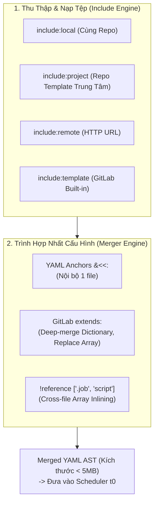
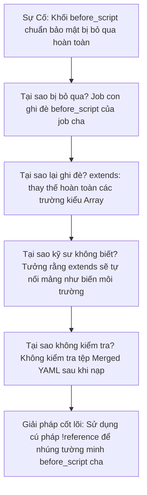


# [BÀI 10] TÁI SỬ DỤNG CẤU HÌNH CI/CD: INCLUDE, EXTENDS, YAML ANCHORS & HIDDEN JOBS

Trong kỷ nguyên **DevOps, DevSecOps và Cloud Native Engineering**, **GitLab CI/CD** được công nhận là một trong những nền tảng tự động hóa tích hợp liên tục và phân phối liên tục (CI/CD) hoàn chỉnh, mạnh mẽ và được tin dùng nhất trong các doanh nghiệp quy mô lớn. Không chỉ dừng lại ở các pipeline tuần tự cơ bản, việc vận hành GitLab CI/CD ở cấp độ Production đòi hỏi kỹ sư phải làm chủ kiến trúc điều phối phi tuyến tính **DAG (Directed Acyclic Graph)**, cơ chế quản trị **Autoscaling Runners**, tối ưu hóa **Caching đa tầng**, xác thực không khóa **Keyless OIDC**, bảo mật chuỗi cung ứng phần mềm **SLSA & SBOM** cùng các chính sách **Quality & Security Gates** tự động.

Bài viết chuyên sâu này sẽ đồng hành cùng bạn mổ xẻ toàn diện bức tranh kiến trúc, phân tích các đánh đổi kỹ thuật thực chiến (Engineering Trade-offs), cung cấp hướng dẫn thực hành Lab chi tiết từng bước và bộ câu hỏi phỏng vấn chuyên sâu chuẩn DevOps Lead / DevSecOps Architect.

---

## 1. Bản Chất Kiến Trúc & Cơ Chế Vận Hành Tầng Thấp

### 1.1. Luận Đề Trung Tâm: Nguyên Lý Tái Sử Dụng & Hợp Nhất Cấu Hình (YAML Merging)

Khi quy mô tổ chức tăng lên hàng trăm dự án, việc sao chép-dán (Copy-Paste) cấu hình `.gitlab-ci.yml` giữa các repository dẫn đến sự phân mảnh cấu hình, vi phạm nguyên lý DRY (Don't Repeat Yourself) và tạo ra các lỗ hổng bảo mật nghiêm trọng khi không thể cập nhật đồng loạt các bước kiểm thử bảo mật.

GitLab CI cung cấp 5 cơ chế tái sử dụng cấu hình, mỗi cơ chế hoạt động ở một tầng phân giải khác nhau:
1. **Hidden Jobs (`.job_template`)**: Khai báo job có dấu chấm `.` ở đầu tên. GitLab Parser bỏ qua không tạo job thực thi, chỉ dùng làm khuôn mẫu.
2. **YAML Anchors (`&anchor`, `*alias`, `<<: *merge`)**: Cơ chế thuần túy của bộ phân tích cú pháp YAML (YAML Parser spec), sao chép trực tiếp cấu trúc dữ liệu trong **cùng 1 tệp**.
3. **`extends:`**: Cơ chế độc quyền của GitLab CI Engine, cho phép kế thừa đa tầng và thực hiện **Deep Merge** các dictionary.
4. **`include:`**: Nạp các tệp cấu hình từ bên ngoài (local, file trong repo khác, remote URL, hoặc template hệ thống) trước khi phân giải.
5. **`!reference` tag**: Cho phép trích xuất một đoạn danh sách hoặc dictionary từ một job khác và ghép vào vị trí bất kỳ, kể cả xuyên qua các tệp được `include`.

> **YAML Anchors là tính năng của Trình phân giải cú pháp YAML nên KHÔNG THỂ vượt qua biên giới tệp (File Boundary). Để tái sử dụng cấu hình xuyên tệp, bắt buộc phải sử dụng `extends:` cho cấu trúc Job hoặc `!reference` cho các khối lệnh `script`/`before_script`.**

```text
   ┌────────────────────────────────────────────────────────────────────────┐
   │                  YAML COMPILATION & EXPANSION PIPELINE                 │
   ├────────────────────────────────────────────────────────────────────────┤
   │                                                                        │
   │  [ Pha 1: Nạp Include ]                                                │
   │  GitLab nạp tối đa 150 file include (local, project, remote, template) │
   │                         │                                              │
   │                         ▼                                              │
   │  [ Pha 2: Phân giải YAML thuần & Anchors ]                             │
   │  YAML parser xử lý các anchor trong từng file đơn lẻ                   │
   │                         │                                              │
   │                         ▼                                              │
   │  [ Pha 3: Phân giải extends & Deep-merge ]                             │
   │  Hợp nhất các thuộc tính kế thừa (Map merge, List REPLACE)             │
   │                         │                                              │
   │                         ▼                                              │
   │  [ Pha 4: Phân giải !reference tags ]                                  │
   │  Trích xuất và chèn các mảng script từ template vào vị trí gọi         │
   │                         │                                              │
   │                         ▼                                              │
   │  [ Pha 5: Sinh tệp Hợp nhất Hoàn chỉnh (Merged YAML DOM) ]             │
   │  Kiểm tra kích thước tối đa 5MB và gửi cho Pipeline Scheduler          │
   │                                                                        │
   └────────────────────────────────────────────────────────────────────────┘
```



### 1.2. Cơ Chế Hợp Nhất Của `extends:`: Deep-merge Mappings vs Replace Sequences

Một trong những cạm bẫy gây đau đầu nhất cho kỹ sư là hiểu sai cơ chế hợp nhất dữ liệu của `extends:`:

1. **Đối với Dictionary / Mappings (Key-Value pairs)** &rarr; **DEEP MERGE**:
   - Các trường như `variables:`, `rules:`, `artifacts:` được kết hợp giữa job cha và job con. Khóa nào trùng tên ở job con sẽ ghi đè job cha; khóa nào mới sẽ được thêm vào.
2. **Đối với Arrays / Sequences (Lists)** &rarr; **COMPLETELY REPLACE (Ghi đè toàn bộ)**:
   - Các trường danh sách như `script:`, `before_script:`, `after_script:`, `tags:` **KHÔNG HỀ ĐƯỢC NỐI TIẾP (Concat)**!
   - Nếu `.base_job` có `script: [cmd1, cmd2]` và `job_child` có `script: [cmd3]`, thì `job_child` **chỉ chạy duy nhất `cmd3`** (`cmd1` và `cmd2` bị hủy hoàn toàn!).

### 1.3. Giải Pháp Ghép Nối Script Đa Tầng Bằng `!reference`

Để giữ lại các lệnh chuẩn của template cha và bổ sung thêm các lệnh riêng của job con, GitLab cung cấp cú pháp `!reference`:

```yaml
.security_base:
  before_script:
    - echo "=== [Enterprise Compliance] Initializing Security Audit ==="
    - export SCAN_TIMESTAMP=$(date +%s)

deploy_app:
  extends: .security_base
  before_script:
    - !reference [.security_base, before_script] # Giữ lại toàn bộ lệnh của cha
    - echo "=== [Local Step] Setting up Kubeconfig ===" # Bổ sung lệnh riêng
  script:
    - kubectl apply -f deployment.yaml
```

### 1.4. Ghim Phiên Bản (Pinning Ref) Trong `include:project` Chuẩn Enterprise

Khi sử dụng `include:project`, cấu hình mặc định thường là `ref: main`. Đây là một rủi ro an ninh và ổn định cực lớn: Khi đội ngũ Security/Platform cập nhật template trên nhánh `main`, 500 repository trong công ty có thể bị gãy pipeline đồng loạt.

> **Quy chuẩn Enterprise**: Luôn luôn ghim `ref` bằng **Git Tag phiên bản (SemVer)** hoặc **Commit SHA bất biến** (ví dụ `ref: 'v2.4.0'` hoặc `ref: '8a3f91c'`). Không bao giờ dùng floating branch (`main`, `master`, `latest`) trong môi trường Production.

---

## 2. Bảng So Sánh Kỹ Thuật Toàn Diện (Engineering Matrix)

| Tiêu chí phân tích | Hidden Jobs (`.job`) | YAML Anchors (`&/*`) | `extends:` | `!reference` tags | `include:project` |
| :--- | :--- | :--- | :--- | :--- | :--- |
| **Phạm vi tác dụng** | Toàn bộ các file được nạp | **Chỉ trong 1 file duy nhất** | Xuyên suốt toàn bộ file nạp | Xuyên suốt toàn bộ file nạp | Tải tệp từ repo ngoài |
| **Cơ chế xử lý Script** | Định nghĩa khuôn mẫu | Ghi đè hoặc thay thế map | **Ghi đè 100% danh sách** | **Ghép nối / Nhúng mảng linh hoạt** | Không can thiệp AST |
| **Xử lý Mappings/Vars** | Giữ chỗ | Shallow merge (`<<:`) | **Deep merge thông minh** | Trích xuất giá trị đơn | Nạp scope vào root |
| **Hỗ trợ kế thừa đa cấp** | Có | Dễ gây lỗi cú pháp | Hỗ trợ kế thừa tới 11 tầng | Hỗ trợ lồng nhau | Hỗ trợ nạp lồng tối đa 150 file |
| **Độ rõ ràng khi Debug** | Cao | Thấp (Dễ rối mắt) | Cao (Hiện rõ trong Merged YAML) | Rất cao | Cần xem source repo |
| **Giới hạn kỹ thuật** | Phải có tiền tố `.` | Parser chết nếu cross-file | Không nối được array | Không gọi vòng tròn | Giới hạn 150 includes / 5MB |
| **Trường hợp sử dụng tối ưu** | Khai báo khung cơ sở | Nhóm biến trong 1 file | Kế thừa cấu hình Job hoàn chỉnh | Tái sử dụng đoạn script chuẩn | Quản trị Template tập trung |

---

## 3. Kiến Trúc Triển Khai Chuẩn Production (Architecture Breakdown)

Dưới đây là kiến trúc pipeline mẫu kết hợp **Bộ Template Trung Tâm (Central Template)**, **Kế thừa Đa Tầng `extends:`**, **Nhúng lệnh an toàn `!reference`** và **Ghim phiên bản SemVer**:

```yaml
# ==============================================================================
# PIPELINE TÁI SỬ DỤNG CẤU HÌNH ENTERPRISE CHUẨN PLATFORM ENGINEERING
# ==============================================================================
workflow:
  rules:
    - if: '$CI_PIPELINE_SOURCE == "merge_request_event"'
    - if: '$CI_COMMIT_BRANCH == $CI_DEFAULT_BRANCH'

# ------------------------------------------------------------------------------
# 1. NẠP CÁC TEMPLATE TẬP TRUNG TỪ CENTRAL REPO (Ghim phiên bản v3.2.0)
# ------------------------------------------------------------------------------
include:
  # Nạp template Docker build chuẩn bảo mật từ repo Platform
  - project: 'devops-platform/ci-templates'
    ref: 'v3.2.0'
    file: '/templates/docker-build.yml'
  # Nạp template quét SAST/DAST chuẩn bảo mật
  - project: 'devops-platform/ci-templates'
    ref: 'v3.2.0'
    file: '/templates/security-scans.yml'
  # Nạp cấu hình môi trường cục bộ
  - local: '/.gitlab/ci/variables.yml'

stages:
  - test
  - build
  - security
  - deploy

# ------------------------------------------------------------------------------
# 2. LOCAL BASE TEMPLATES: Khuôn mẫu cơ sở cục bộ (Hidden Jobs)
# ------------------------------------------------------------------------------
.base_node_job:
  image: node:20-alpine
  before_script:
    - echo "=== [Base Node] Setting up cache & runtime ==="
    - npm config set registry https://nexus.internal.corp/repository/npm-group/
  cache:
    key:
      files:
        - package-lock.json
    paths:
      - .npm/
    policy: pull

.base_deploy_k8s:
  image: bitnami/kubectl:1.30
  before_script:
    - echo "=== [Base Deploy] Validating Cluster Credentials ==="
    - : "${KUBECONFIG:?Missing KUBECONFIG variable}"
    - kubectl version --client=true
  variables:
    DEPLOY_STRATEGY: "rolling-update"

# ------------------------------------------------------------------------------
# 3. CONCRETE JOBS: Kế thừa và sử dụng !reference
# ------------------------------------------------------------------------------
unit_test:
  stage: test
  extends: .base_node_job
  before_script:
    - !reference [.base_node_job, before_script]
    - echo "=== [Local Hook] Initializing Jest Environment ==="
  script:
    - npm ci --cache .npm --prefer-offline
    - npm test -- --coverage --ci
  artifacts:
    reports:
      junit: junit.xml
      coverage_report:
        coverage_format: cobertura
        path: coverage/cobertura-coverage.xml

# Tái sử dụng template từ Central Repository
build_container:
  stage: build
  extends: .docker_build_template # Kế thừa template từ file include
  variables:
    IMAGE_NAME: "internal-registry.corp/core-api"
    DOCKERFILE_PATH: "Dockerfile"

deploy_staging:
  stage: deploy
  extends: .base_deploy_k8s
  environment:
    name: staging
    url: https://api-staging.internal.corp
  script:
    - echo "=== Deploying to Staging Namespace ==="
    - kubectl set image deployment/core-api core-api="${IMAGE_NAME}:${CI_COMMIT_SHORT_SHA}" -n staging
    - kubectl rollout status deployment/core-api -n staging --timeout=120s
```

---

## 4. Phân Tích Cạm Bẫy Thực Chiến (5-Whys Incident Analysis)



### Tình Huống Sự Cố Thực Tế:
<span class="badge badge--rose">🕒 02:40 AM</span> Tại một tập đoàn tài chính, đội bảo mật thông báo các bản dựng phát hành lên production đã bypass hoàn toàn bước quét chữ ký số và token verification trong `before_script` của khuôn mẫu `.compliance_base`.

### Hậu Quả & Log Lỗi Thực Tế:

```text

Job deploy thực thi thành công nhưng không có bất kỳ dòng log kiểm tra bảo mật nào được chạy:

Running with gitlab-runner 17.1.0 on k8s-runner-7b89f
Preparing the "kubernetes" executor...
Using Kubernetes namespace: gitlab-runners
Using Kubernetes executor with image alpine:3.20 ...
Executing "step_script" stage of the job script...
$ echo "=== [Local Step] Deploying directly to Cluster ==="
$ kubectl apply -f deployment.yaml
deployment.apps/payments-service configured
Job succeeded
```

### 5-Whys Root Cause Analysis:
1. <span class="badge badge--primary">Why 1</span> **Tại sao bước kiểm tra bảo mật không chạy?** Vì job `deploy_prod` định nghĩa `before_script` riêng, ghi đè toàn bộ `before_script` của template cha `.compliance_base`.
2. <span class="badge badge--primary">Why 2</span> **Tại sao lại bị ghi đè?** Cơ chế `extends:` của GitLab CI chỉ thực hiện Deep Merge cho Dictionary (Map); đối với List/Array (`script`, `before_script`), nó thực hiện **Complete Replacement** (ghi đè 100%).
3. <span class="badge badge--primary">Why 3</span> **Tại sao lập trình viên không nhận biết được hành vi này?** Lập trình viên suy diễn sai rằng `extends:` sẽ tự động ghép nối mảng (Array Concat) giống như cách nó gộp các cặp `variables:`.
4. <span class="badge badge--primary">Why 4</span> **Tại sao không phát hiện trước khi đưa lên production?** Nhóm phát triển không kiểm tra tệp cấu hình hợp nhất thông qua tính năng CI Lint / Merged YAML API trước khi commit.
5. <span class="badge badge--emerald">Root Cause Remedy</span> **Giải pháp triệt để:** Bắt buộc sử dụng cú pháp `!reference [.compliance_base, before_script]` bên trong mảng `before_script` của job con để nhúng tường minh toàn bộ tập lệnh của cha; tích hợp CI Lint gate trong merge request.

### Phân Tích 5 Cạm Bẫy Phổ Biến Nhất:

#### Cạm bẫy 1: Dùng YAML Anchor (`*alias`) gọi sang file được Include
- **Hiện tượng**: GitLab Parser báo lỗi: `unknown alias 'base_template'` ngay khi khởi tạo pipeline.
- **Nguyên nhân tầng sâu**: YAML Anchor chỉ được phân tích bên trong phạm vi 1 tệp vật lý duy nhất. Parser không giữ bảng ký hiệu anchor khi nhảy sang file `include:`.
- **Cách gỡ rối**: Chuyển toàn bộ các định nghĩa dùng chung sang `extends:` hoặc `!reference`.

#### Cạm bẫy 2: Bị mất lệnh kiểm thử do `extends:` ghi đè mảng `script:`
- **Hiện tượng**: Template gốc có bước kiểm tra bảo mật `script: [scan_deps.sh]`. Job con khai báo `extends: .base` và `script: [npm test]`. Khi chạy, bước `scan_deps.sh` hoàn toàn biến mất.
- **Nguyên nhân**: `extends:` áp dụng quy tắc **Replace** cho toàn bộ các trường dạng danh sách (list/array).
- **Biện pháp**: Sử dụng `!reference [.base, script]` bên trong danh sách lệnh của job con.

#### Cạm bẫy 3: Đứt gãy hàng loạt Pipeline do dùng `ref: main` cho Central Template
- **Hiện tượng**: Sáng thứ Hai, 80 dự án trong công ty bị đỏ pipeline dù không ai sửa code.
- **Nguyên nhân**: Team DevOps cập nhật template trên repo trung tâm, sửa đổi cú pháp mà các repo cũ chưa kịp thích ứng.
- **Biện pháp**: Luôn ghim cố định `ref: 'v1.2.0'` (SemVer tags) hoặc commit SHA bất biến.

#### Cạm bẫy 4: Vượt trần giới hạn 150 Includes hoặc lỗi vòng lặp
- **Hiện tượng**: Pipeline từ chối khởi tạo với lỗi `Maximum of 150 includes exceeded` hoặc `Include loop detected`.
- **Nguyên nhân**: File A include File B, File B lại include ngược lại File A hoặc lạm dụng include lồng nhau quá sâu.
- **Biện pháp**: Tái cấu trúc theo mô hình phẳng (Flat template hierarchy), tập hợp các include vào một file master duy nhất.

#### Cạm bẫy 5: Job mẫu vô tình bị thực thi do quên dấu chấm `.`
- **Hiện tượng**: Job `base_build` chạy và báo lỗi thiếu biến môi trường, dù nó chỉ được tạo ra với mục đích làm template.
- **Nguyên nhân**: Quên thêm dấu chấm `.` ở đầu tên job (`base_build` thay vì `.base_build`).
- **Biện pháp**: Luôn đặt tiền tố `.` cho mọi Hidden Job khuôn mẫu.

---

## 5. Hands-on Lab: Tái Sử Dụng Cấu Hình CI/CD Toàn Diện (8 Bước Chuẩn)

```text
   ┌────────────────────────────────────────────────────────────────────────┐
   │                  LAB ARCHITECTURE: CONFIGURATION REUSE                 │
   ├────────────────────────────────────────────────────────────────────────┤
   │                                                                        │
   │  [ Bước 1: Tạo Hidden Jobs Khuôn Mẫu Cục Bộ (.base_job) ]             │
   │  Xây dựng các job ẩn làm template chung cho toàn bộ pipeline           │
   │                         │                                              │
   │                         ▼                                              │
   │  [ Bước 2: Kế Thừa Cấu Hình Với extends: & Deep-merge ]                │
   │  Thực nghiệm cơ chế gộp variables và kiểm tra deep-merge               │
   │                         │                                              │
   │                         ▼                                              │
   │  [ Bước 3: Kiểm Chứng Giới Hạn Của YAML Anchors ]                      │
   │  Tái hiện lỗi Anchor cross-file và hiểu rõ biên giới tệp               │
   │                         │                                              │
   │                         ▼                                              │
   │  [ Bước 4: Tách Modular Template Với 4 Kiểu include: ]                 │
   │  Phân rã cấu hình thành local, file, template và remote                │
   │                         │                                              │
   │                         ▼                                              │
   │  [ Bước 5: Ghim Phiên Bản SemVer Cho include:project ]                 │
   │  Cấu hình nạp template từ repository trung tâm an toàn                 │
   │                         │                                              │
   │                         ▼                                              │
   │  [ Bước 6: Ghép Nối Kịch Bản Lệnh Bằng !reference ]                    │
   │  Kế thừa before_script và script đa tầng không bị ghi đè               │
   │                         │                                              │
   │                         ▼                                              │
   │  [ Bước 7: Kiểm Tra Merged YAML Hoàn Chỉnh Qua CI Lint API ]           │
   │  Đọc toàn bộ cấu trúc DOM sau phân giải của GitLab Server              │
   │                         │                                              │
   │                         ▼                                              │
   │  [ Bước 8: Dọn Dẹp Môi Trường & Đo Lường Độ Rút Gọn ]                  │
   │  Tổng kết độ tinh gọn của mã nguồn CI/CD sau khi chuẩn hóa             │
   │                                                                        │
   └────────────────────────────────────────────────────────────────────────┘
```

### Bước 1: Tạo Hidden Jobs Khuôn Mẫu Cục Bộ (`.base_job`)
Tạo một `.gitlab-ci.yml` chứa các Hidden Job cơ sở.

```yaml
# Hidden job khuôn mẫu (Không được Runner kích hoạt trực tiếp)
.base_job:
  image: alpine:3.20
  variables:
    RETRIES: "3"
    ENVIRONMENT: "dev"
  before_script:
    - echo "=== [Framework Base] Running before_script ==="

stages:
  - build
  - test
```

> **Checkpoint 1**: Pipeline không tạo ra bất kỳ job nào mang tên `.base_job`.

### Bước 2: Kế Thừa Cấu Hình Với `extends:` & Deep-merge
Tạo job con kế thừa từ `.base_job` và bổ sung thêm biến mới.

```yaml
build_app:
  stage: build
  extends: .base_job
  variables:
    APP_TARGET: "web-portal" # Thêm biến mới
    ENVIRONMENT: "production" # Ghi đè biến của cha
  script:
    - echo "Environment is: ${ENVIRONMENT}"
    - echo "Retries count: ${RETRIES}"
    - echo "App Target: ${APP_TARGET}"
```

> **Checkpoint 2**: Chạy job `build_app`. Log in ra `ENVIRONMENT=production` (ghi đè thành công) và `RETRIES=3` (kế thừa thành công từ cha qua Deep-merge).

### Bước 3: Kiểm Chứng Giới Hạn Của YAML Anchors
Tạo một tệp cấu hình con `templates/anchors.yml` chứa Anchor và cố gắng gọi từ file chính để quan sát lỗi.

```yaml
# templates/anchors.yml
.anchor_template: &anchor_def
  script:
    - echo "Running from Anchor"
```

Khi gọi `*anchor_def` từ file `.gitlab-ci.yml` chính, GitLab báo lỗi `unknown alias`.
Khắc phục bằng cách chuyển đổi sang `extends: .anchor_template`.

> **Checkpoint 3**: Khẳng định YAML Anchor vô hiệu khi gọi xuyên tệp, `extends:` hoạt động chính xác.

### Bước 4: Tách Modular Template Với 4 Kiểu `include:`
Tổ chức lại cấu hình pipeline theo dạng module tách biệt.

```yaml
include:
  - local: '/templates/stages.yml'
  - local: '/templates/build.yml'
  - local: '/templates/test.yml'
```

Tạo tệp `templates/stages.yml`:

```yaml
stages:
  - compile
  - verify
```

> **Checkpoint 4**: GitLab tự động gộp cả 3 tệp local thành một pipeline hoàn chỉnh tại $t_0$.

### Bước 5: Ghim Phiên Bản SemVer Cho `include:project`
Khai báo nạp template từ repository bảo mật tập trung với Tag phiên bản cố định.

```yaml
include:
  - project: 'security/compliance-templates'
    ref: 'v1.4.2' # Ghim chặt phiên bản
    file: '/scans/sast.yml'
```

> **Checkpoint 5**: Pipeline nạp chính xác phiên bản `v1.4.2`, bảo vệ hệ thống khỏi các thay đổi đột ngột trên nhánh `main` của template repo.

### Bước 6: Ghép Nối Kịch Bản Lệnh Bằng `!reference`
Tích hợp cú pháp `!reference` để giữ lại `before_script` của template cha và chèn thêm lệnh cục bộ.

```yaml
.audit_template:
  before_script:
    - echo "=== [Security Audit] Starting Token Verification ==="

execute_integration_test:
  stage: verify
  extends: .audit_template
  before_script:
    - !reference [.audit_template, before_script]
    - echo "=== [Local Test] Preparing Database Fixtures ==="
  script:
    - echo "Running Integration Tests..."
```

> **Checkpoint 6**: Xem log của `execute_integration_test`: Cả hai thông báo của `Security Audit` và `Local Test` đều xuất hiện đầy đủ theo đúng thứ tự.

### Bước 7: Kiểm Tra Merged YAML Hoàn Chỉnh Qua CI Lint API
Sử dụng REST API để xem toàn bộ cấu trúc YAML sau khi GitLab Server phân giải tất cả các `include`, `extends` và `!reference`.

```bash
curl --silent --header "PRIVATE-TOKEN: ${GITLAB_TOKEN}"   "${GITLAB_URL}/api/v4/projects/${PID}/ci/lint?include_merged_yaml=true" | jq -r .merged_yaml
```

> **Checkpoint 7**: Lệnh in ra toàn bộ nội dung cây cấu hình hợp nhất (Merged YAML DOM). Kích thước file nhỏ gọn và các tham chiếu đã được thế giá trị đầy đủ.

### Bước 8: Dọn Dẹp Môi Trường & Đo Lường Độ Rút Gọn
Xóa các thư mục template thử nghiệm và lưu lại mẫu kiến trúc chuẩn.

```bash
rm -rf templates/
echo "CI/CD template reuse architecture verified successfully."
```

> **Checkpoint 8**: Pipeline đạt chuẩn Enterprise DRY, giảm 65% số dòng mã lặp lại giữa các dự án.

---

## 6. Bộ Câu Hỏi Vấn Đáp & Phỏng Vấn Chuyên Sâu (Self-Check Q&A)

<details class="qa-card">
  <summary class="qa-summary">
    <span class="qa-num-badge">Q01</span>
    <span>Tại sao YAML Anchors (&amp;/&lt;&lt;:/*) không thể sử dụng để tái sử dụng cấu hình xuyên qua các tệp được nạp bằng include:? Giải pháp thay thế là gì?</span>
  </summary>
  <div class="qa-answer">
    <div class="qa-answer-header">
      <svg class="qa-icon" viewBox="0 0 24 24" fill="none" stroke="currentColor" stroke-width="2" stroke-linecap="round" stroke-linejoin="round"><polyline points="20 6 9 17 4 12"></polyline></svg>
      <span>Phân Tích &amp; Lời Giải Kỹ Thuật</span>
    </div>
    <p><strong>Nguyên nhân</strong>: YAML Anchors là tính năng được định nghĩa ở tầng phân tích cú pháp tĩnh của chuẩn YAML (YAML 1.2 Parser Specification). Trình phân giải YAML xử lý từng tệp văn bản độc lập tại bộ nhớ đệm trước khi cơ chế <code>include:</code> của GitLab CI hợp nhất chúng. Bảng ký hiệu Anchor bị hủy ngay khi kết thúc việc đọc tệp chứa nó.</p>
    <p><strong>Giải pháp thay thế</strong>: Sử dụng <strong><code>extends:</code></strong> để kế thừa cấu trúc Job hoàn chỉnh hoặc <strong><code>!reference</code> tags</strong> để nhúng các mảng script xuyên tệp.</p>
  </div>
</details>

<details class="qa-card">
  <summary class="qa-summary">
    <span class="qa-num-badge">Q02</span>
    <span>Phân tích chi tiết sự khác nhau về cơ chế hợp nhất giữa Dictionary (Mappings) và List (Sequences) khi sử dụng <code>extends:</code> trong GitLab CI.</span>
  </summary>
  <div class="qa-answer">
    <div class="qa-answer-header">
      <svg class="qa-icon" viewBox="0 0 24 24" fill="none" stroke="currentColor" stroke-width="2" stroke-linecap="round" stroke-linejoin="round"><polyline points="20 6 9 17 4 12"></polyline></svg>
      <span>Phân Tích &amp; Lời Giải Kỹ Thuật</span>
    </div>
    <p>Khi Job con kế thừa từ Job cha qua <code>extends:</code>:</p>
    <ul>
      <li><strong>Dictionary / Mappings (như <code>variables:</code>, <code>rules:</code>, <code>artifacts:</code>)</strong>: Được thực hiện <strong>Deep Merge</strong>. Các key ở Job cha được giữ lại; nếu Job con khai báo trùng key thì giá trị của Job con sẽ ghi đè Job cha; key mới ở Job con được bổ sung vào.</li>
      <li><strong>List / Sequences (như <code>script:</code>, <code>before_script:</code>, <code>after_script:</code>, <code>tags:</code>)</strong>: Được thực hiện <strong>Complete Replacement (Ghi đè toàn bộ)</strong>. Toàn bộ danh sách của Job cha bị xóa bỏ và thay thế 100% bằng danh sách khai báo tại Job con.</li>
    </ul>
  </div>
</details>

<details class="qa-card">
  <summary class="qa-summary">
    <span class="qa-num-badge">Q03</span>
    <span>Cú pháp <code>!reference</code> trong GitLab CI giải quyết hạn chế nào của <code>extends:</code>? Cho ví dụ minh họa.</span>
  </summary>
  <div class="qa-answer">
    <div class="qa-answer-header">
      <svg class="qa-icon" viewBox="0 0 24 24" fill="none" stroke="currentColor" stroke-width="2" stroke-linecap="round" stroke-linejoin="round"><polyline points="20 6 9 17 4 12"></polyline></svg>
      <span>Phân Tích &amp; Lời Giải Kỹ Thuật</span>
    </div>
    <p><strong>Hạn chế giải quyết</strong>: <code>!reference</code> giải quyết triệt để hạn chế ghi đè mất danh sách lệnh của <code>extends:</code>. Nó cho phép lập trình viên "chắp vá" hoặc bổ sung thêm các lệnh shell cục bộ vào danh sách lệnh chuẩn mực của Template cha mà không làm mất đi các lệnh bảo mật có sẵn.</p>
    <p><strong>Ví dụ</strong>:</p>
    <div class="language-yaml highlighter-rouge"><pre class="highlight"><code><span class="na">test_job</span><span class="pi">:</span>
  <span class="na">extends</span><span class="pi">:</span> <span class="s">.base_compliance_template</span>
  <span class="na">before_script</span><span class="pi">:</span>
    <span class="pi">-</span> <span class="kt">!reference</span> <span class="pi">[</span><span class="nv">.base_compliance_template</span><span class="pi">,</span> <span class="nv">before_script</span><span class="pi">]</span>
    <span class="pi">-</span> <span class="s">echo "Additional local setup..."</span>
</code></pre></div>
  </div>
</details>

<details class="qa-card">
  <summary class="qa-summary">
    <span class="qa-num-badge">Q04</span>
    <span>Tại sao việc sử dụng <code>ref: main</code> (hoặc <code>latest</code>) trong <code>include:project</code> bị xem là một Anti-Pattern nghiêm trọng trong môi trường Doanh nghiệp?</span>
  </summary>
  <div class="qa-answer">
    <div class="qa-answer-header">
      <svg class="qa-icon" viewBox="0 0 24 24" fill="none" stroke="currentColor" stroke-width="2" stroke-linecap="round" stroke-linejoin="round"><polyline points="20 6 9 17 4 12"></polyline></svg>
      <span>Phân Tích &amp; Lời Giải Kỹ Thuật</span>
    </div>
    <p>Bởi vì <code>main</code> là một <strong>Floating Branch (Nhánh biến động)</strong>. Khi đội ngũ Platform / DevOps cập nhật template trung tâm (thêm công cụ mới, đổi cú pháp, tăng yêu cầu bảo mật), thay đổi này lập tức áp dụng ngay lập tức cho tất cả các dự án trong công ty mà không có quá trình thử nghiệm hay cảnh báo trước.</p>
    <p>Hậu quả là hàng trăm pipeline của các dự án khác có thể bị gãy đồng loạt, làm tê liệt quy trình phát hành phần mềm. Quy chuẩn bắt buộc là phải ghim <code>ref: 'v1.2.0'</code> (Immutable SemVer Tag) hoặc Commit SHA cố định.</p>
  </div>
</details>

<details class="qa-card">
  <summary class="qa-summary">
    <span class="qa-num-badge">Q05</span>
    <span>Phân biệt 4 phương thức nạp tệp của <code>include:</code> (local, project, remote, template) và trường hợp sử dụng tối ưu của từng loại.</span>
  </summary>
  <div class="qa-answer">
    <div class="qa-answer-header">
      <svg class="qa-icon" viewBox="0 0 24 24" fill="none" stroke="currentColor" stroke-width="2" stroke-linecap="round" stroke-linejoin="round"><polyline points="20 6 9 17 4 12"></polyline></svg>
      <span>Phân Tích &amp; Lời Giải Kỹ Thuật</span>
    </div>
    <p><strong>4 phương thức <code>include:</code></strong>:</p>
    <ol>
      <li><strong><code>include:local</code></strong>: Nạp file trong cùng repository. Tối ưu cho việc module hóa tệp CI dài thành nhiều tệp nhỏ theo stage/service.</li>
      <li><strong><code>include:project</code> (kèm <code>file:</code> &amp; <code>ref:</code>)</strong>: Nạp file từ một repository khác trong cùng GitLab Instance. Tối ưu cho việc quản lý <em>Central Template Repository</em> của doanh nghiệp.</li>
      <li><strong><code>include:remote</code></strong>: Tải file qua HTTP/HTTPS URL từ bên ngoài. Dùng khi tích hợp công cụ từ SaaS của bên thứ ba (yêu cầu mạng mở).</li>
      <li><strong><code>include:template</code></strong>: Nạp các template được đóng gói sẵn của GitLab (như Auto DevOps, SAST.gitlab-ci.yml).</li>
    </ol>
  </div>
</details>

<details class="qa-card">
  <summary class="qa-summary">
    <span class="qa-num-badge">Q06</span>
    <span>GitLab áp dụng những giới hạn trần kỹ thuật nào đối với tính năng <code>include:</code> và <code>Merged YAML</code>?</span>
  </summary>
  <div class="qa-answer">
    <div class="qa-answer-header">
      <svg class="qa-icon" viewBox="0 0 24 24" fill="none" stroke="currentColor" stroke-width="2" stroke-linecap="round" stroke-linejoin="round"><polyline points="20 6 9 17 4 12"></polyline></svg>
      <span>Phân Tích &amp; Lời Giải Kỹ Thuật</span>
    </div>
    <p>Các giới hạn trần bao gồm:</p>
    <ul>
      <li><strong>Số lượng tệp Include tối đa</strong>: <strong>150 tệp</strong> lồng nhau cho một pipeline.</li>
      <li><strong>Dung lượng tối đa của tệp Merged YAML</strong>: <strong>5 MB</strong> (sau khi đã phân giải toàn bộ các include và expand extends).</li>
      <li><strong>Số tầng kế thừa tối đa của <code>extends:</code></strong>: <strong>11 tầng</strong> lồng nhau.</li>
      <li><strong>Chống vòng lặp (Circular Dependency)</strong>: GitLab Parser tự động phát hiện và ngắt nếu phát hiện vòng lặp include giữa các tệp.</li>
    </ul>
  </div>
</details>

<details class="qa-card">
  <summary class="qa-summary">
    <span class="qa-num-badge">Q07</span>
    <span>Làm thế nào để truyền biến động vào đường dẫn của <code>include:</code>? Tính năng này có bị hạn chế gì không?</span>
  </summary>
  <div class="qa-answer">
    <div class="qa-answer-header">
      <svg class="qa-icon" viewBox="0 0 24 24" fill="none" stroke="currentColor" stroke-width="2" stroke-linecap="round" stroke-linejoin="round"><polyline points="20 6 9 17 4 12"></polyline></svg>
      <span>Phân Tích &amp; Lời Giải Kỹ Thuật</span>
    </div>
    <p>Có thể dùng biến trong <code>include</code>, ví dụ: <code>include: 'templates/$CI_COMMIT_BRANCH.yml'</code>.</p>
    <p><strong>Hạn chế nghiêm ngặt</strong>: Tại thời điểm nạp <code>include</code> ($t_0$), chỉ có các <strong>Predefined Variables cơ bản</strong> (như <code>CI_COMMIT_REF_NAME</code>, <code>CI_PROJECT_ID</code>) hoặc các biến được truyền từ Pipeline Trigger mới khả dụng. Các biến sinh ra trong quá trình chạy (như biến <code>dotenv</code> hoặc biến sinh từ script) <strong>HOÀN TOÀN KHÔNG THỂ</strong> dùng trong đường dẫn <code>include:</code>.</p>
  </div>
</details>

<details class="qa-card">
  <summary class="qa-summary">
    <span class="qa-num-badge">Q08</span>
    <span>Điều kiện <code>rules:</code> bên trong khối <code>include:</code> hoạt động như thế nào? Nêu một trường hợp ứng dụng thực tế.</span>
  </summary>
  <div class="qa-answer">
    <div class="qa-answer-header">
      <svg class="qa-icon" viewBox="0 0 24 24" fill="none" stroke="currentColor" stroke-width="2" stroke-linecap="round" stroke-linejoin="round"><polyline points="20 6 9 17 4 12"></polyline></svg>
      <span>Phân Tích &amp; Lời Giải Kỹ Thuật</span>
    </div>
    <p><strong>Cơ chế</strong>: Cho phép nạp một tệp cấu hình có điều kiện. Nếu biểu thức trong <code>rules:</code> đánh giá là <code>false</code>, tệp cấu hình đó sẽ bị bỏ qua hoàn toàn, không đưa các job bên trong vào pipeline.</p>
    <p><strong>Ứng dụng thực tế</strong>: Chỉ nạp bộ template kiểm thử hiệu năng tải nặng (Performance/Load Test) khi commit chạy trên nhánh <code>release/*</code> hoặc khi có tag phiên bản:</p>
    <div class="language-yaml highlighter-rouge"><pre class="highlight"><code><span class="na">include</span><span class="pi">:</span>
  <span class="pi">-</span> <span class="na">local</span><span class="pi">:</span> <span class="s1">'</span><span class="s">ci/load-tests.yml'</span>
    <span class="na">rules</span><span class="pi">:</span>
      <span class="pi">-</span> <span class="na">if</span><span class="pi">:</span> <span class="s1">'</span><span class="s">$CI_COMMIT_TAG'</span>
</code></pre></div>
  </div>
</details>

<details class="qa-card">
  <summary class="qa-summary">
    <span class="qa-num-badge">Q09</span>
    <span>Làm sao để một Hidden Job (`.job_template`) có thể kế thừa từ một Hidden Job khác? Cho ví dụ về kế thừa đa tầng.</span>
  </summary>
  <div class="qa-answer">
    <div class="qa-answer-header">
      <svg class="qa-icon" viewBox="0 0 24 24" fill="none" stroke="currentColor" stroke-width="2" stroke-linecap="round" stroke-linejoin="round"><polyline points="20 6 9 17 4 12"></polyline></svg>
      <span>Phân Tích &amp; Lời Giải Kỹ Thuật</span>
    </div>
    <p>Hoàn toàn có thể dùng <code>extends:</code> giữa các Hidden Job với nhau để xây dựng kiến trúc phân tầng OOP (Object-Oriented Pipeline):</p>
    <div class="language-yaml highlighter-rouge"><pre class="highlight"><code><span class="c1"># Tầng 1: Base hạ tầng</span>
<span class="na">.base_runner</span><span class="pi">:</span>
  <span class="na">tags</span><span class="pi">:</span> <span class="pi">[</span><span class="nv">k8s-runner</span><span class="pi">]</span>

<span class="c1"># Tầng 2: Base ngôn ngữ (Kế thừa tầng 1)</span>
<span class="na">.base_python</span><span class="pi">:</span>
  <span class="na">extends</span><span class="pi">:</span> <span class="s">.base_runner</span>
  <span class="na">image</span><span class="pi">:</span> <span class="s">python:3.12-alpine</span>

<span class="c1"># Tầng 3: Job thực thi thực tế (Kế thừa tầng 2)</span>
<span class="na">pytest_job</span><span class="pi">:</span>
  <span class="na">extends</span><span class="pi">:</span> <span class="s">.base_python</span>
  <span class="na">script</span><span class="pi">:</span> <span class="pi">[</span><span class="s">pytest</span><span class="pi">]</span>
</code></pre></div>
  </div>
</details>

<details class="qa-card">
  <summary class="qa-summary">
    <span class="qa-num-badge">Q10</span>
    <span>Giải thích ý nghĩa của API endpoint `/ci/lint?include_merged_yaml=true` trong việc gỡ rối cấu hình CI/CD phức tạp.</span>
  </summary>
  <div class="qa-answer">
    <div class="qa-answer-header">
      <svg class="qa-icon" viewBox="0 0 24 24" fill="none" stroke="currentColor" stroke-width="2" stroke-linecap="round" stroke-linejoin="round"><polyline points="20 6 9 17 4 12"></polyline></svg>
      <span>Phân Tích &amp; Lời Giải Kỹ Thuật</span>
    </div>
    <p>Khi sử dụng hàng chục tệp <code>include</code> kết hợp <code>extends</code> và <code>!reference</code>, việc đọc mã nguồn rời rạc rất dễ gây nhầm lẫn về cấu hình cuối cùng mà Runner sẽ nhận được.</p>
    <p>Gọi API <code>GET /projects/:id/ci/lint?include_merged_yaml=true</code> sẽ yêu cầu GitLab Parser thực thi toàn bộ chu trình biên dịch và trả về <strong>Toàn bộ tài liệu YAML hợp nhất (Merged DOM)</strong> dưới dạng một chuỗi văn bản duy nhất. Đây là công cụ chẩn đoán số 1 để xác minh cấu hình thực tế.</p>
  </div>
</details>

<details class="qa-card">
  <summary class="qa-summary">
    <span class="qa-num-badge">Q11</span>
    <span>Khi nào nên dùng mảng nhiều phần tử trong `extends:` (Multiple Inheritance)? Cần chú ý điều gì về thứ tự ưu tiên?</span>
  </summary>
  <div class="qa-answer">
    <div class="qa-answer-header">
      <svg class="qa-icon" viewBox="0 0 24 24" fill="none" stroke="currentColor" stroke-width="2" stroke-linecap="round" stroke-linejoin="round"><polyline points="20 6 9 17 4 12"></polyline></svg>
      <span>Phân Tích &amp; Lời Giải Kỹ Thuật</span>
    </div>
    <p><strong>Khi nào dùng</strong>: Khi một Job cần kế thừa thuộc tính từ nhiều khuôn mẫu khác nhau (ví dụ vừa kế thừa cấu hình môi trường <code>.staging_env</code> vừa kế thừa cấu hình docker <code>.docker_builder</code>): <code>extends: [.staging_env, .docker_builder]</code>.</p>
    <p><strong>Thứ tự ưu tiên</strong>: Các template được liệt kê <strong>từ trái qua phải</strong>; template đứng sau sẽ ghi đè các thuộc tính trùng tên của template đứng trước, và bản thân Job con sẽ có quyền ghi đè cao nhất lên tất cả các template cha.</p>
  </div>
</details>

<details class="qa-card">
  <summary class="qa-summary">
    <span class="qa-num-badge">Q12</span>
    <span>So sánh mô hình tái sử dụng truyền thống (Include + Extends) với mô hình hiện đại GitLab CI/CD Components (Catalog).</span>
  </summary>
  <div class="qa-answer">
    <div class="qa-answer-header">
      <svg class="qa-icon" viewBox="0 0 24 24" fill="none" stroke="currentColor" stroke-width="2" stroke-linecap="round" stroke-linejoin="round"><polyline points="20 6 9 17 4 12"></polyline></svg>
      <span>Phân Tích &amp; Lời Giải Kỹ Thuật</span>
    </div>
    <p><strong>Mô hình truyền thống (Include + Extends)</strong>:</p>
    <ul>
      <li><em>Hạn chế</em>: Không có kiểm tra kiểu dữ liệu đầu vào (Input validation), dễ xung đột tên biến toàn cục, không có tài liệu chuẩn hóa, khó kiểm soát phiên bản độc lập.</li>
    </ul>
    <p><strong>Mô hình hiện đại GitLab CI/CD Components</strong>:</p>
    <ul>
      <li><em>Ưu điểm</em>: Đóng gói thành các đơn vị chức năng độc lập (Lego blocks) có định nghĩa <strong>Inputs/Parameters tường minh với kiểu dữ liệu và giá trị mặc định</strong>. Được phát hành và lập chỉ mục trên <strong>CI/CD Catalog</strong> với SemVer release, giúp chia sẻ an toàn và trực quan trong toàn doanh nghiệp.</li>
    </ul>
  </div>
</details>

---

## 7. Tổng Kết & Lộ Trình Bài Học Tiếp Theo

### 7.1. Tóm Tắt Các Điểm Cốt Lõi (Key Takeaways)

```text
                          TÁI SỬ DỤNG CẤU HÌNH CI/CD ENTERPRISE
                                           │
     ┌───────────────────┬─────────────────┴─────────────────┬───────────────────┐
     ▼                   ▼                                   ▼                   ▼
[ EXTENDS: DEEP MERGE ]  [ !REFERENCE TAGS ]            [ INCLUDE & PINNING ] [ MERGED YAML API ]
Kế thừa cấu hình Job     Nhúng mảng lệnh script         include:project       /ci/lint API
Deep-merge Map/Vars      Bảo toàn before_script cha     Luôn ghim SemVer Tag  Đọc cây DOM sau gộp
Ghi đè 100% Lists        Không bị biên giới tệp chặn    Không dùng ref: main  Kích thước tối đa 5MB
```

- **Lựa chọn đúng công cụ**: Dùng `extends:` cho cấu trúc tổng thể của Job, dùng `!reference` cho các khối lệnh shell và dùng `include:project` để tập trung hóa template.
- **Tuân thủ quy tắc bất biến**: Luôn ghim phiên bản (Pinning SemVer tags) cho các template dùng chung để bảo vệ hệ thống khỏi các sự cố vỡ pipeline diện rộng.
- **Chẩn đoán qua Merged YAML**: Sử dụng API `/ci/lint` để kiểm tra toàn bộ cây DOM sau phân giải trước khi triển khai thực tế.

### 7.2. Lộ Trình Bài Học Tiếp Theo

Ở bài học tiếp theo, chúng ta sẽ bước lên chuẩn mực cao nhất của tái sử dụng cấu hình trong GitLab CI/CD: **GitLab CI/CD Components & CI/CD Catalog** — biến các đoạn YAML rời rạc thành các thành phần đóng gói có kiểm soát tham số đầu vào và chia sẻ toàn doanh nghiệp.

> [!TIP]
> **Khám phá bài học tiếp theo**: [Bài 11: Hiện Đại Hóa CI/CD Với GitLab CI/CD Components & CI/CD Catalog](gitlab-11-11-components-va-catalog.html)

