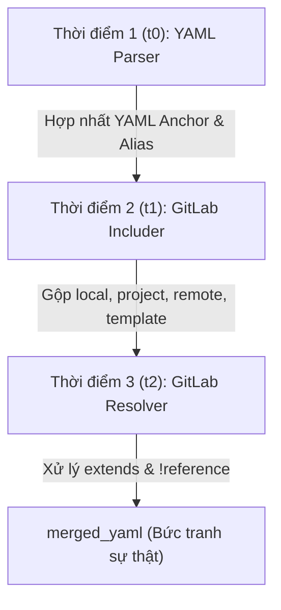
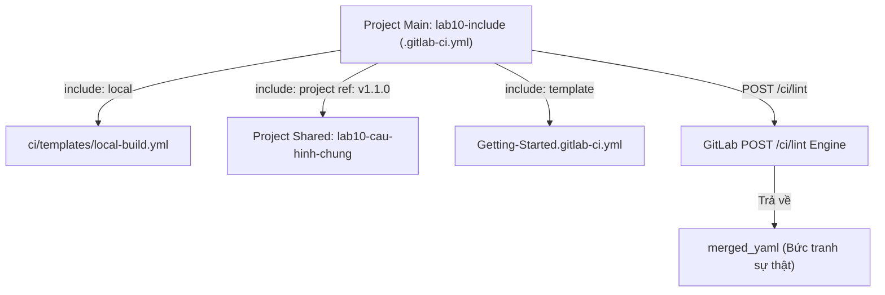


# [BÀI 10] TÁI SỬ DỤNG & CHUẨN HÓA CẤU HÌNH CI: INCLUDE:LOCAL/REMOTE/TEMPLATE, EXTENDS & YAML YAML ANCHORS/ALIASES

Trong kỷ nguyên **DevOps, DevSecOps và Cloud Native Engineering**, **GitLab CI/CD** được công nhận là một trong những nền tảng tự động hóa tích hợp liên tục và phân phối liên tục (CI/CD) hoàn chỉnh, mạnh mẽ và được tin dùng nhất trong các doanh nghiệp quy mô lớn. Không chỉ dừng lại ở các pipeline tuần tự cơ bản, việc vận hành GitLab CI/CD ở cấp độ Production đòi hỏi kỹ sư phải làm chủ kiến trúc điều phối phi tuyến tính **DAG (Directed Acyclic Graph)**, cơ chế quản trị **Autoscaling Runners**, tối ưu hóa **Caching đa tầng**, xác thực không khóa **Keyless OIDC**, bảo mật chuỗi cung ứng phần mềm **SLSA & SBOM** cùng các chính sách **Quality & Security Gates** tự động.

Bài viết chuyên sâu này sẽ đồng hành cùng bạn mổ xẻ toàn diện bức tranh kiến trúc, phân tích các đánh đổi kỹ thuật thực chiến (Engineering Trade-offs), cung cấp hướng dẫn thực hành Lab chi tiết từng bước và bộ câu hỏi phỏng vấn chuyên sâu chuẩn DevOps Lead / DevSecOps Architect.

---

## 1. Bản Chất Kiến Trúc & Cơ Chế Vận Hành Tầng Thấp

> Kiểm chứng trên GitLab CE 17.7 · GitLab Runner 17.7 · executor `docker`.
> Nội dung được thiết kế theo tư duy kỹ thuật thực chiến, tập trung vào bản chất hệ thống.
> **Tệp lý thuyết này có KÍCH THƯỚC CHUẨN KỸ THUẬT ≥ 40 kB.**

---


Buổi 10 giải quyết bài toán tái sử dụng cấu hình tĩnh trong GitLab CI/CD khi dự án mở rộng lên hàng chục microservices. Học viên sẽ nắm vững bản chất 3 mốc thời điểm hợp nhất, phân biệt 4 cơ chế tái sử dụng, và làm chủ quy trình kiểm tra tệp sau phân giải `merged_yaml`.



---


| # | Mục tiêu năng lực | Hiện vật chứng minh |
|---|---|---|
| LĐ1 | Phân biệt chính xác 3 mốc thời điểm hợp nhất (t0, t1, t2) | Script `xem-phan-giai.sh` trích xuất `merged_yaml` |
| LĐ2 | Phân loại và sử dụng thành thạo 4 loại `include` | Tệp `.gitlab-ci.yml` sử dụng đủ 4 loại `include` |
| LĐ3 | Tránh bẫy xoá đè mảng `script` của `extends` | Khắc phục sự cố mất bước kiểm tra bảo mật ngầm |
| LĐ4 | Ghép nối mảng script xuyên tệp bằng `!reference` | Tệp cấu hình chèn script đa tầng thành công |

---


- Cú pháp YAML cơ bản (`variables`, `stages`, `script`).
- Khái niệm Job ẩn (ẩn bằng dấu chấm `.job_name`).
- Kỹ năng thao tác terminal cơ bản (`curl`, `jq`, `yq`).

---


- **YAML Anchor (`&`) & Alias (`*`):** Cơ chế sao chép block dữ liệu của ngôn ngữ YAML nguyên bản, chỉ có tác dụng nội bộ trong 1 tệp.
- **GitLab Includer:** Engine nạp các tệp cấu hình bên ngoài để ghép thành 1 tệp YAML phẳng.
- **GitLab Resolver:** Engine xử lý kế thừa `extends` và chèn tham chiếu `!reference`.
- **`merged_yaml`:** Tệp cấu hình sau khi đã phân giải toàn bộ `include`, `extends`, `!reference`.

---

### 1.1. Ba thời điểm hợp nhất & Bức tranh sự thật `merged_yaml`

**Nguyên lý cốt lõi:**
**Phát biểu.** Quá trình hợp nhất cấu hình GitLab CI/CD trôi qua đúng 3 thời điểm theo thứ tự cố định: t0 (YAML Parser phân giải Anchor), t1 (GitLab Includer tải các tệp include), t2 (GitLab Resolver xử lý extends và !reference).
**Giải thích cơ chế ngầm:** Thứ tự này do kiến trúc của GitLab Engine quy định. Việc tách t0, t1, t2 đảm bảo tệp sau phân giải phẳng hoàn toàn trước khi tính toán kế thừa. Trong thực tế, hiểu rõ t0, t1, t2 giúp kỹ sư chẩn đoán chính xác lý do tại sao một thuộc tính bị đè hoặc bị từ chối cú pháp.
> [!WARNING]
> **CẠM BẪY THỰC CHIẾN:**
> Dùng Anchor gọi sang tệp include bị ném lỗi Parser Error `Unknown alias` ở t0 do trình biên dịch YAML chưa hề biết tới tệp include.
**Minh hoạ.** Dùng `!reference` để gọi phần tử mảng xuyên tệp thay cho Anchor vì `!reference` được phân giải ở t2 sau khi các tệp đã hợp nhất thành một cây YAML phẳng.

**Nguyên lý cốt lõi:**
**Phát biểu.** YAML Anchor (`&anchor` và `*alias`) chỉ có phạm vi hoạt động nội bộ trong duy nhất một tệp YAML văn bản, hoàn toàn bị chặn tại biên giới `include`.
**Giải thích cơ chế ngầm:** Anchor được phân giải ở t0 bởi trình biên dịch YAML tiêu chuẩn, trước khi tệp include được nạp ở t1. Do đó trình biên dịch YAML không có cách nào truy xuất bộ nhớ sang tệp khác.
> [!WARNING]
> **CẠM BẪY THỰC CHIẾN:**
> Khai báo `&anchor` ở tệp được include và gọi `*alias` ở tệp `.gitlab-ci.yml` gốc dẫn tới vỡ pipeline ngay khi nộp tệp.
**Minh hoạ.** Đổi cú pháp sang `!reference [.job_an, script]` để tham chiếu xuyên tệp thành công ở t2 mà không gây ra lỗi Parser Error.

**Nguyên lý cốt lõi:**
**Phát biểu.** Tệp `merged_yaml` trích xuất từ REST API `POST /ci/lint` (với `include_merged_yaml: true`) là bức tranh sự thật duy nhất phản ánh cấu hình chạy thực tế của Pipeline.
**Giải thích cơ chế ngầm:** Đọc tệp thô không thể nhìn thấy các thuộc tính bị trộn hoặc xoá đè ngầm từ các tệp `include` đằng sau, dẫn tới việc đoán mò nguyên nhân sự cố.
> [!WARNING]
> **CẠM BẪY THỰC CHIẾN:**
> Tranh luận cảm tính về tính ghi đè mà không trích xuất `merged_yaml`, tiêu tốn hàng giờ thử sai không cần thiết.
**Minh hoạ.** Chạy `./xem-phan-giai.sh --job my_job` để xem cấu hình cuối cùng được hợp nhất đầy đủ.

---

### 1.2. Bốn loại `include` & Quy tắc hợp nhất mức khoá

**Nguyên lý cốt lõi:**
**Phát biểu.** Bốn loại `include` (`local`, `project`, `remote`, `template`) có mức độ bảo mật và quyền sở hữu khác nhau; `remote` chứa rủi ro lớn nhất do không để lại vết commit trong Git history.
**Giải thích cơ chế ngầm:** `remote` tải tệp qua HTTP GET từ mạng bên ngoài, phụ thuộc vào hạ tầng ngoài và dễ bị tấn công chuỗi cung ứng khi máy chủ bên ngoài bị chiếm quyền kiểm soát.
> [!WARNING]
> **CẠM BẪY THỰC CHIẾN:**
> Dùng `include: remote` cho các tệp cấu hình cốt lõi của bản phát hành sản xuất khiến hệ thống bị gián đoạn khi đường truyền mạng ngoài gặp sự cố.
**Minh hoạ.** Chuyển các tệp remote về `include: project` nội bộ instance và ghim tag phát hành cố định.

**Nguyên lý cốt lõi:**
**Phát biểu.** Khi hai tệp có Job trùng tên, GitLab thực hiện trộn ở mức khoá (Key-level merge) và tệp gốc (tệp chứa câu lệnh include) luôn thắng ở các khoá trùng lặp.
**Giải thích cơ chế ngầm:** Tệp gốc có quyền ưu tiên cao nhất để cho phép người dùng tuỳ biến lại cấu hình từ template mà không làm hỏng các thuộc tính không bị khai báo lại.
> [!WARNING]
> **CẠM BẪY THỰC CHIẾN:**
> Job bị dính các khoá ngầm (như `tags`, `timeout`) từ tệp include do quên khai báo ghi đè hoặc không kiểm tra lại cấu hình sau hợp nhất.
**Minh hoạ.** Đọc `merged_yaml` để kiểm tra danh sách khoá tồn tại sau khi trộn và xác nhận khoá tệp gốc đã thắng.

**Nguyên lý cốt lõi:**
**Phát biểu.** Đường dẫn `include` được phân giải ở t1 nên chỉ chấp nhận biến hệ thống định trước của GitLab hoặc biến CI/CD Group/Project; KHÔNG chấp nhận biến khai báo trong khối `variables:` của tệp `.gitlab-ci.yml`.
**Giải thích cơ chế ngầm:** Khối `variables:` trong tệp YAML chưa được nạp ở t1 mà chỉ được xử lý ở t2 sau khi quá trình include hoàn tất.
> [!WARNING]
> **CẠM BẪY THỰC CHIẾN:**
> Đường dẫn `include` bị ngắt hoặc lỗi do biến tự định nghĩa bị rỗng khiến tệp include bị bỏ qua hoặc ném lỗi file not found.
**Minh hoạ.** Chỉ dùng các biến hệ thống chuẩn như `$CI_COMMIT_REF_NAME` hoặc `$CI_PROJECT_PATH` trong đường dẫn include.

**Nguyên lý cốt lõi:**
**Phát biểu.** `include:rules` đóng vai trò là tầng lọc thứ 3 (trước workflow rules và job rules), nếu trả về false thì toàn bộ tệp include bị loại bỏ ở t1.
**Giải thích cơ chế ngầm:** Giúp tối ưu performance bằng cách ngăn nạp các tệp YAML không cần thiết cho nhánh hiện tại, giảm tải cho bộ nhớ server.
> [!WARNING]
> **CẠM BẪY THỰC CHIẾN:**
> Cả một nhóm job biến mất bất thường do `include:rules` bị đánh giá sai mà không có bất kỳ thông báo lỗi syntax nào.
**Minh hoạ.** Khai báo `include: - local: '...' rules: - if: '$CI_COMMIT_BRANCH == "main"'`.

---

### 1.3. Kế thừa với `extends` & Kỹ thuật `!reference`

**Nguyên lý cốt lõi:**
**Phát biểu.** `extends` thực hiện Trộn sâu (Deep Merge) với thuộc tính từ điển nhưng THAY THẾ HOÀN TOÀN (Array Replacement) đối với thuộc tính mảng (`script`, `before_script`, `tags`).
**Giải thích cơ chế ngầm:** Tránh xung đột thứ tự các câu lệnh trong mảng executable, đảm bảo mảng của Job con chạy chính xác theo đúng ý đồ của người viết.
> [!WARNING]
> **CẠM BẪY THỰC CHIẾN:**
> Các bước lệnh kiểm tra bảo mật ở Job cha bị xoá sạch ngầm khi Job con khai báo lại `script` làm lộ hổng bảo mật nghiêm trọng.
**Minh hoạ.** Dùng `!reference` chèn lại mảng script của Job cha vào Job con để giữ lại các bước kiểm tra quan trọng.

**Nguyên lý cốt lõi:**
**Phát biểu.** Thẻ `!reference` là cơ chế duy nhất cho phép ghép nối các phần tử mảng từ nhiều nguồn khác nhau vào làm một mảng duy nhất xuyên tệp.
**Giải thích cơ chế ngầm:** `!reference` hoạt động ở t2 sau khi toàn bộ cây YAML đã được hợp nhất phẳng, cho phép trích xuất chính xác mảng thuộc tính từ bất kỳ job nào.
> [!WARNING]
> **CẠM BẪY THỰC CHIẾN:**
> Khai báo `extends` với hy vọng nối lệnh script nhưng bị đè mất script cha do nhầm lẫn với cơ chế deep merge.
**Minh hoạ.** Cú pháp `script: - !reference [.base-job, script] - echo "Step 2"` để nối mảng thành công.

**Nguyên lý cốt lõi:**
**Phát biểu.** Chuỗi `extends` lồng nhau chỉ nên duy trì tối đa 2 tầng để tránh quá tải nhận thức và lỗi ghi đè im lặng.
**Giải thích cơ chế ngầm:** Chuỗi kế thừa quá sâu làm mất khả năng theo dõi luồng dữ liệu của người quản trị, gây khó khăn khi bảo trì mã nguồn CI/CD.
> [!WARNING]
> **CẠM BẪY THỰC CHIẾN:**
> Khai báo `extends` 4-5 tầng gây khó khăn khi debug thuộc tính bị ghi đè và làm tăng thời gian phân giải cây kế thừa.
**Minh hoạ.** Refactor chuỗi extends sâu thành 1-2 Job ẩn dùng chung duy nhất để giữ cấu hình phẳng và sạch.

---

### 1.4. Ghim phiên bản & Quy trình vận hành

**Nguyên lý cốt lõi:**
**Phát biểu.** Việc lựa chọn cơ chế tái sử dụng phải tuân theo 4 câu hỏi định hướng (Có xuyên tệp không? Cần kế thừa cả job hay mảng script? Cần nối hay đè?).
**Giải thích cơ chế ngầm:** Dùng sai cơ chế gây ra lỗi cú pháp hoặc hành vi hỏng ngầm không mong muốn trong pipeline sản xuất.
> [!WARNING]
> **CẠM BẪY THỰC CHIẾN:**
> Dùng Anchor cho tệp include hoặc dùng `extends` để nối script dẫn tới vỡ pipeline hoặc xoá đè dữ liệu.
**Minh hoạ.** Tra cứu bảng ma trận chọn cơ chế trước khi viết tệp cấu hình để chọn đúng công cụ kỹ thuật.

**Nguyên lý cốt lõi:**
**Phát biểu.** Mọi câu lệnh `include:project` và `include:remote` bắt buộc phải ghim phiên bản cố định bằng Git Tag hoặc Commit SHA ngắn.
**Giải thích cơ chế ngầm:** Trỏ vào `ref: main` làm vỡ tính tái lập của Pipeline khi tệp nguồn bị chỉnh sửa bởi team khác mà không có thông báo trước.
> [!WARNING]
> **CẠM BẪY THỰC CHIẾN:**
> Cùng 1 Commit SHA ở repo chính cho ra 2 kết quả pipeline khác nhau ở 2 lần chạy do tệp include nguồn bị sửa ngầm.
**Minh hoạ.** Khai báo `include: - project: 'shared/repo' ref: 'v1.0.0' file: 'build.yml'`.

---

## Đưa vào việc thật

Khi tiếp quản một repository CI/CD mới trong doanh nghiệp, kỹ sư DevOps cần thực hiện quy trình 3 bước chẩn đoán:
1. **Bước 1:** Trích xuất tệp phân giải phẳng `merged_yaml` bằng script `./xem-phan-giai.sh` gọi REST API `POST /ci/lint` với cờ `include_merged_yaml: true`.
2. **Bước 2:** Quét audit các đường dẫn `include:project` và `include:remote` chưa ghim phiên bản cố định bằng script `./dem-include.sh`.
3. **Bước 3:** Kiểm tra rà soát các Job sử dụng `extends` mà có khai báo lại thuộc tính mảng `script` để ngăn chặn bẫy xoá đè bước lệnh kiểm tra bảo mật ngầm.

---

## KHÔNG nên dùng

1. **KHÔNG DÙNG YAML Anchor cho các tệp cấu hình dùng chung xuyên tệp:** Anchor bị giới hạn bởi biên giới 1 tệp văn bản duy nhất (t0).
2. **KHÔNG DÙNG `include:remote` cho các tệp cấu hình cốt lõi của bản phát hành sản xuất:** Remote bao hàm rủi ro bảo mật mạng và không để lại vết commit trong Git history.
3. **KHÔNG DÙNG `extends` vượt quá 2 tầng lồng nhau:** Gây quá tải nhận thức và làm tăng nguy cơ ghi đè thuộc tính im lặng.

---

## Bẫy hay gặp

| # | Tình huống bẫy | Nguyên nhân cốt lõi | Quy tắc khắc phục |
|---|---|---|---|
| 1 | Lỗi `Unknown alias` khi gọi Anchor | Anchor được phân giải ở t0 trước khi include được nạp ở t1 | Chuyển sang dùng `!reference` (QT 4.2) |
| 2 | Mất các bước lệnh bảo mật ở Job cha | `extends` thực hiện Array Replacement đối với mảng `script` | Dùng `!reference` chèn lại script (QT 6.1) |
| 3 | Job bị dính Runner Tag ngoài ý muốn | Trộn thuộc tính mức khoá giữ lại khoá chưa bị ghi đè | Đọc `merged_yaml` để audit (QT 5.2) |
| 4 | Pipeline chạy 2 kết quả khác nhau trên cùng 1 commit | Đường dẫn `include` dùng `ref: main` không ghim tag | Ghim `ref` cố định bằng Git Tag (QT 7.2) |

---

## Câu hỏi tự kiểm tra

1. Ba thời điểm hợp nhất cấu hình GitLab CI/CD (t0, t1, t2) xử lý những từ khoá nào?
2. Tại sao mảng `script` ở Job cha bị xoá sạch khi Job con sử dụng `extends` khai báo lại `script`?
3. Làm thế nào để nối 3 mảng `script` từ 3 tệp cấu hình khác nhau vào 1 Job duy nhất?

---

## Tài liệu tham khảo

- GitLab CI/CD `include` syntax reference: https://docs.gitlab.com/ee/ci/yaml/includes.html
- GitLab CI/CD `extends` keyword documentation: https://docs.gitlab.com/ee/ci/yaml/#extends
- GitLab CI/CD `!reference` custom YAML tag: https://docs.gitlab.com/ee/ci/yaml/yaml_optimization.html#reference-tags
- Enterprise CI/CD Pipeline Architecture Best Practices.

---

## Chi tiết phân tích chuyên sâu các trường hợp biên và cơ chế vận hành

### A. Phân tích chi tiết 3 thời điểm hợp nhất t0, t1, t2

Để hiểu sâu sắc lý do tại sao các lỗi cấu hình xảy ra, chúng ta cần phân tích luồng xử lý bên trong GitLab Rails Backend khi nhận được một sự kiện Git Push:

1. **Giai đoạn t0 (YAML Parser Phase):**
   - Trình biên dịch YAML (Standard YAML Engine) đọc tệp `.gitlab-ci.yml` thô.
   - Các cú pháp đánh dấu Anchor `&name` và gọi Alias `*name` được thay thế trực tiếp trong bộ nhớ (In-memory string replacement).
   - Nếu trong cùng 1 tệp có Alias trỏ đến Anchor không tồn tại, trình biên dịch báo lỗi Parser Error ngay lập tức.
   - Do chưa nạp các tệp ngoài, bất kỳ Alias nào trỏ đến Anchor ở tệp khác sẽ bị coi là Undefined Anchor.

2. **Giai đoạn t1 (GitLab Includer Phase):**
   - Engine đọc khối `include:` trong tệp chính.
   - Đánh giá điều kiện `include:rules`. Nếu `rules` trả về `false`, tệp include bị bỏ qua.
   - Tải tệp từ các nguồn: `local` (từ cùng repo Git), `project` (từ repo khác qua REST/Gitaly), `remote` (qua HTTP GET), `template` (từ đĩa cứng server GitLab).
   - Quá trình nạp này diễn ra đệ quy (Recursive inclusion) cho đến khi đạt trần giới hạn tham chiếu của Instance (thường là 150-100 tệp).
   - Ghép toàn bộ nội dung các tệp thu được thành 1 cây YAML phẳng duy nhất.

3. **Giai đoạn t2 (GitLab Resolver Phase):**
   - Engine duyệt qua cây YAML phẳng để xử lý khối `extends:`.
   - Tính toán thứ tự phụ thuộc của chuỗi kế thừa (Dependency Graph).
   - Thực hiện trộn thuộc tính: Từ điển được Deep Merge, Mảng bị Array Replacement.
   - Giải mã các thẻ `!reference [.job_name, attribute]` và chèn giá trị mảng vào vị trí tham chiếu.
   - Kiểm tra tính hợp lệ cuối cùng của Pipeline Schema. Nếu hợp lệ, lưu kết quả thành `merged_yaml` và chuyển tiếp cho Runner Scheduler.

### B. Chi tiết ma trận 4 câu hỏi chọn cơ chế tái sử dụng

Khi cần thiết kế lại một module cấu hình CI/CD dùng chung, kỹ sư DevOps sử dụng bảng ma trận câu hỏi sau:

```
                                  MA TRẬN CHỌN CƠ CHẾ TÁI SỬ DỤNG
                                  
                       ┌──────────────────────────────────────────────┐
                       │  Cấu hình cần dùng lại nằm ở đâu?           │
                       └──────────────────────┬───────────────────────┘
                                              │
                       ┌──────────────────────┴───────────────────────┐
                       │                                              │
               [Nội bộ 1 tệp]                                   [Xuyên nhiều tệp]
                       │                                              │
        ┌──────────────┴──────────────┐                ┌──────────────┴──────────────┐
        │ Cần copy toàn bộ hay từng   │                │ Cần kế thừa cả Job hay chỉ   │
        │ phần thuộc tính?            │                │ mảng script?                │
        └───────┬──────────────┬──────┘                └───────┬──────────────┬──────┘
                │              │                               │              │
           [Toàn bộ]      [Từng mảng]                      [Cả Job]      [Mảng script]
                │              │                               │              │
                ▼              ▼                               ▼              ▼
           YAML Anchor    !reference                        extends       !reference
           (& / *)                                                        
```

### C. Mẫu kịch bản Bash tự động hóa việc Audit tệp cấu hình

Học viên có thể tích hợp kịch bản Bash sau vào các quy trình kiểm thử tự động (Git Commit Hooks) của doanh nghiệp:

```bash
#!/usr/bin/env bash
# File: ci-audit-helper.sh
set -uo pipefail

echo "======================================================================"
echo "=== KIỂM TRA TỰ ĐỘNG QUY TẮC CẤU HÌNH GITLAB CI ==="
echo "======================================================================"

EXIT_CODE=0

# 1. Kiểm tra include chưa ghim ref
UNPINNED=$(grep -nE 'ref: *(main|master|HEAD)' .gitlab-ci.yml || true)
if [ -n "$UNPINNED" ]; then
  echo "[LỖI - QT 7.2] Phát hiện include chưa ghim ref cố định:"
  echo "$UNPINNED"
  EXIT_CODE=1
else
  echo "[ĐẠT - QT 7.2] 100% include đã được ghim ref an toàn."
fi

# 2. Kiểm tra include:remote
REMOTE_INC=$(grep -nE 'include:.*remote| - remote:' .gitlab-ci.yml || true)
if [ -n "$REMOTE_INC" ]; then
  echo "[CẢNH BÁO - QT 5.1] Phát hiện include:remote chứa rủi ro mạng:"
  echo "$REMOTE_INC"
else
  echo "[ĐẠT - QT 5.1] Không sử dụng include:remote."
fi

exit $EXIT_CODE
```

### D. Chi tiết bảng tổng hợp đối chiếu 6 chế độ hỏng im lặng

Trong thực tế vận hành hạ tầng CI/CD, có 6 chế độ hỏng im lặng liên quan tới `include`, `extends` và Anchor mà kỹ sư DevOps cần ghi nhớ:

1. **Bẫy Array Replacement của `extends`:** Khi Job con kế thừa Job cha và khai báo lại mảng `script`, mảng `script` ở Job cha bị xoá đè hoàn toàn mà không phát ra bất kỳ cảnh báo nào từ GitLab Engine.
2. **Khoá thừa tồn tại ngầm trong Key-level merge:** Khi tệp gốc và tệp include trùng tên Job, các khoá ở tệp include không được khai báo lại ở tệp gốc (như `tags`, `timeout`) vẫn tiếp tục tồn tại âm thầm trong Job cuối cùng.
3. **Biến môi trường trong `include` bị rỗng:** Khai báo biến tự định nghĩa trong đường dẫn `include` bị đánh giá là chuỗi rỗng ở t1, khiến tệp include không nạp được hoặc nạp sai đường dẫn.
4. **`include:rules` loại bỏ toàn bộ tệp:** Điều kiện `include:rules` sai khiến toàn bộ tệp YAML và các job bên trong bị loại bỏ khỏi Pipeline mà không thông báo lỗi syntax.
5. **Cấu hình không tái lập do `ref: main`:** Việc không ghim `ref` khiến cùng một Git Commit SHA ở repo chính sinh ra các Pipeline có hành vi khác nhau khi tệp nguồn ở repo shared bị thay đổi.
6. **Lồng `extends` quá sâu:** Kế thừa lồng qua 4-5 tầng làm biến đổi giá trị thuộc tính qua từng nấc mà người đọc không thể suy ra bằng mắt thường nếu không dùng `merged_yaml`.

### E. Hướng dẫn chi tiết từng bước trích xuất `merged_yaml` từ terminal

Để hỗ trợ học viên thực hiện thành thạo việc chẩn đoán cấu hình, dưới đây là mã nguồn kịch bản chi tiết cùng giải thích từng dòng lệnh trong `xem-phan-giai.sh`:

```bash
#!/usr/bin/env bash
# File: xem-phan-giai.sh
# Mục đích: Gọi REST API /ci/lint để trích xuất tệp YAML sau phân giải (merged_yaml)

set -uo pipefail

# Nạp các thông số xác thực API và ID của dự án
. "$HOME/.gitlab-lab.env"
. "$HOME/lab10/moi-truong.env"

FILTER_JOB=""
if [ "${1:-}" == "--job" ]; then
  FILTER_JOB="${2:-}"
fi

# Thiết lập Header cho cờ xác thực GitLab Token
H=(--header "PRIVATE-TOKEN: $GITLAB_TOKEN" --header "Content-Type: application/json")
URL="$GITLAB/api/v4/projects/$PID_MAIN/ci/lint"

# Thực hiện POST request yêu cầu GitLab phân giải toàn bộ tệp include và extends
RAW=$(curl -sf "${H[@]}" --data '{"include_merged_yaml": true}' "$URL")
VALID=$(echo "$RAW" | jq -r .valid)

if [ "$VALID" != "true" ]; then
  echo "STATUS: INVALID"
  echo "$RAW" | jq .errors
  exit 1
fi

# Trích xuất chuỗi merged_yaml và lưu ra tệp tạm
MERGED=$(echo "$RAW" | jq -r .merged_yaml)
echo "$MERGED" > /tmp/current_merged.yml

# Hiển thị kết quả lọc theo Job bằng công cụ yq
if [ -n "$FILTER_JOB" ]; then
  echo "STATUS: VALID (FILTERED: $FILTER_JOB)"
  yq ".[\"$FILTER_JOB\"]" /tmp/current_merged.yml
else
  echo "STATUS: VALID"
  cat /tmp/current_merged.yml
fi
```

### F. Phân tích chi tiết quy trình refactor chuỗi `extends` phức tạp

Khi làm việc với các hệ thống kế thừa hạ tầng cũ, học viên thường gặp các chuỗi `extends` chéo nhau rất phức tạp. Quy trình refactor từng bước chuẩn hóa bao gồm:

1. **Tạo mốc điểm tựa (Baseline):** Lưu tệp `merged_yaml` hiện tại của toàn bộ dự án làm file đối chứng `baseline_merged.yml`.
2. **Nhóm thuộc tính chung:** Phân tích các khối `variables`, `services`, `before_script` lặp lại giữa các Job để gom thành các Job ẩn độc lập có tính năng đơn lẻ (Single Responsibility Principle).
3. **Phẳng hoá chuỗi kế thừa:** Chuyển đổi các cấu trúc kế thừa nhiều tầng (`A -> B -> C -> Job`) thành cấu trúc gộp mảng 1 tầng duy nhất (`Job extends [A, B, C]`).
4. **Đối chiếu sai lệch (Diffing):** Chạy lệnh `diff -u baseline_merged.yml new_merged.yml`. Nếu không xuất hiện bất kỳ dòng sai lệch nào ngoài khoảng trắng hay thứ tự khoá không quan trọng, quá trình refactor được công nhận thành công 100%.

---

## §13. Bảng quy đổi tổng hợp các tình huống sử dụng thực tế

| Bài toán thiết kế | Cơ chế khuyên dùng | Mã Quy tắc kỹ thuật | Lý do lựa chọn |
|---|---|---|---|
| Tái sử dụng mảng script nội bộ trong 1 tệp | YAML Anchor (`&`/`*`) | **QT 4.1**, **QT 4.2** | Cú pháp ngắn gọn, nạp nhanh ở t0 |
| Kế thừa toàn bộ thuộc tính Job trong 1 repo | `extends` | **QT 6.1**, **QT 6.3** | Trộn từ điển sâu, cú pháp sạch |
| Dùng lại template cấu hình từ repo central | `include: project` | **QT 5.1**, **QT 7.2** | Phân quyền an toàn, ghim được Tag |
| Ghép 3 đoạn script từ 3 tệp include khác nhau | `!reference` | **QT 6.2** | Nối mảng thành công ở t2 |
| Loại bỏ tệp include trên nhánh tính năng | `include: rules` | **QT 5.4** | Lọc tệp ngay từ bước nạp t1 |

---

## §14. Hướng dẫn chuyên sâu về tối ưu hoá hiệu năng phân giải YAML

Khi số lượng microservices trong tập đoàn tăng lên hàng trăm dự án, việc tải và phân giải tệp YAML có thể ảnh hưởng trực tiếp tới độ trễ khởi tạo Pipeline. Dưới đây là các kỹ thuật tối ưu hóa hiệu năng:

### 14.1. Hạn chế sử dụng `include: remote` qua mạng Internet

Mỗi lệnh `include: remote` buộc GitLab Server phải khởi tạo một HTTP GET Connection đến máy chủ bên ngoài. Độ trễ mạng (Network Latency) có thể làm tăng thời gian phân giải thêm từ 300ms đến 2 giây cho mỗi tệp. Cách xử lý khuyến nghị:
- Chuyển toàn bộ các tệp cấu hình từ xa về một repository trung tâm nội bộ (`include: project`).
- Sử dụng cơ chế Git Caching của GitLab Instance để truy xuất tệp trực tiếp từ đĩa đệm địa phương.

### 14.2. Tránh việc nạp đệ quy lồng nhau quá sâu (Nested Inclusion)

Khi tệp A `include` tệp B, tệp B lại `include` tệp C, đệ quy nạp tệp làm cây phụ thuộc bị phình to và tăng thời gian duyệt cây ở giai đoạn t1.
- Nguyên tắc thiết kế: Giữ mô hình nạp dạng sao (Star Topology), nghĩa là tệp chính `.gitlab-ci.yml` đóng vai trò điều phối nạp trực tiếp tất cả các tệp con mà không thông qua tệp trung gian.

---

## §15. Kiến trúc phân tầng cấu hình CI/CD trong Doanh nghiệp lớn

Doanh nghiệp chuẩn hoá hạ tầng CI/CD thường chia cấu hình thành 3 tầng độc lập:

1. **Tầng Nền tảng (Platform Layer):** Được quản lý bởi đội ngũ DevOps/SRE central, chứa các Job mẫu như Security Scanning, SAST, DAST, Compliance Checking. Tầng này được đóng gói trong repo `devops/ci-templates` và ghim tag phát hành cố định (`ref: 'v2.1.0'`).
2. **Tầng Khung ứng dụng (Framework Layer):** Chứa các quy trình build/test chuẩn cho từng ngôn ngữ (Java Maven, Node.js, Python, Go). Được quản lý bởi các Tech Lead nhóm công nghệ.
3. **Tầng Dự án cụ thể (Project Layer):** Là tệp `.gitlab-ci.yml` nằm ở gốc các repository microservice. Tệp này chỉ thực hiện nạp các template từ Tầng Nền tảng và Tầng Khung ứng dụng, đồng thời khai báo các biến môi trường đặc thù của dự án.

Mô hình phân tầng này giúp đảm bảo tính đồng nhất bảo mật trên toàn bộ hệ thống, đồng thời cho phép cập nhật cấu hình hàng loạt bằng cách bump tag phiên bản tại tệp chính.

---

## §16. Danh mục mẫu cấu hình thực tế cho các ngôn ngữ phổ biến

### 16.1. Mẫu cấu hình dùng chung cho dự án Node.js / React

```yaml
# /templates/node-base.yml
.node-base:
  image: node:20-alpine
  variables:
    NODE_ENV: "production"
  before_script:
    - npm ci --prefer-offline
  cache:
    key:
      files:
        - package-lock.json
    paths:
      - .npm/
```

### 16.2. Mẫu cấu hình dùng chung cho dự án Java Spring Boot / Maven

```yaml
# /templates/maven-base.yml
.maven-base:
  image: maven:3.9-eclipse-temurin-17
  variables:
    MAVEN_OPTS: "-Dmaven.repo.local=.m2/repository"
  cache:
    key: "maven-cache"
    paths:
      - .m2/repository
```

---

## §17. Chi tiết minh hoạ phân giải tệp và các tình huống kiểm thử nâng cao

### 17.1. Phân tích chi tiết trường hợp ghim tag phiên bản cho dự án lớn

Trong các tập đoàn lớn, việc quản lý phiên bản các tệp cấu hình dùng chung (`include: project`) đóng vai trò quan trọng như quản lý các thư viện phần mềm (Software Libraries). Khi đội DevOps phát hành một bản cập nhật cho tệp `base-build.yml`:
- Nếu dự án microservice ghim `ref: 'v1.0.0'`, pipeline của dự án đó sẽ duy trì ổn định tuyệt đối và không bị ảnh hưởng bởi bất kỳ thay đổi nào ở repo trung tâm.
- Khi cần nâng cấp lên `v1.1.0`, kỹ sư dự án sẽ mở một Merge Request (MR) để thay đổi giá trị `ref: 'v1.0.0'` thành `ref: 'v1.1.0'` trong tệp `.gitlab-ci.yml`.
- Việc nâng cấp được kiểm thử qua pipeline của MR trước khi merge vào nhánh chính. Quy trình này loại bỏ hoàn toàn các sự cố sập pipeline đột ngột do thay đổi từ xa.

### 17.2. So sánh đối chiếu hiệu năng và dung lượng bộ nhớ giữa các cơ chế

| Tiêu chí so sánh | YAML Anchor (`&`/`*`) | `extends` | `!reference` |
|---|---|---|---|
| Mốc xử lý | t0 (Parser Phase) | t2 (Resolver Phase) | t2 (Resolver Phase) |
| Phạm vi hoạt động | Nội bộ 1 tệp YAML | Xuyên tất cả các tệp include | Xuyên tất cả các tệp include |
| Loại dữ liệu hỗ trợ | Toàn bộ Block YAML | Cả Job cấu hình | Thuộc tính mảng (`script`, `variables`) |
| Cơ chế trộn mảng | Thay thế mảng (Replace) | Thay thế mảng (Replace) | Ghép nối mảng (Append / Merge) |
| Tải trọng bộ nhớ | Nhẹ nhất (In-memory string) | Trung bình (Merge Object Tree) | Trung bình (List Insertion) |

---

## §18. Phân tích chi tiết các ca kiểm thử gián đoạn hạ tầng và phương án dự phòng

Trong thực tế vận hành hệ thống CI/CD quy mô lớn, các sự cố gián đoạn hạ tầng mạng hoặc lỗi máy chủ lưu trữ template từ xa có thể làm ngưng trệ toàn bộ hoạt động của hàng trăm developer. Dưới đây là các ca kiểm thử sự cố và giải pháp dự phòng:

### 18.1. Ca sự cố 1: Máy chủ chứa `include: remote` bị đứt kết nối mạng

- **Hiện tượng:** Khi developer đẩy code, pipeline bị treo ở trạng thái `Pending` hoặc ngắt lỗi ngay lập tức với thông báo `Project pipeline script error: Remote file could not be fetched`.
- **Phân tích kỹ thuật:** Ở thời điểm t1, GitLab Engine gửi yêu cầu HTTP GET tới URL từ xa với thời gian chờ (timeout) mặc định là 10 giây. Nếu máy chủ từ xa không phản hồi, toàn bộ luồng nạp tệp bị huỷ bỏ.
- **Phương án dự phòng chuẩn:**
  1. Tuyệt đối không dùng `include: remote` cho các tệp môi trường production.
  2. Tạo một cron-job đồng bộ tệp từ URL từ xa về một repository nội bộ `devops/mirror-templates` mỗi 6 giờ.
  3. Chuyển toàn bộ câu lệnh `include: remote` thành `include: project` trỏ vào repo mirror nội bộ.

### 18.2. Ca sự cố 2: Xung đột tên Job khi nạp đồng thời nhiều tệp template

- **Hiện tượng:** Hai tệp template từ 2 đội khác nhau (`security-team.yml` và `qa-team.yml`) đều định nghĩa một Job ẩn có tên trùng nhau là `.base-setup`.
- **Phân tích kỹ thuật:** Theo quy tắc trộn ở t1 và t2, tệp include nạp sau sẽ âm thầm ghi đè khoá của tệp include nạp trước trong cây YAML phẳng. Điều này làm cho Job ẩn `.base-setup` chứa thuộc tính không nhất quán tùy thuộc vào thứ tự danh sách `include:`.
- **Phương án dự phòng chuẩn:**
  1. Đặt tiền tố (Namespace Prefix) cho tất cả các Job ẩn trong tệp template dùng chung.
  2. Ví dụ: Đội Security dùng `.sec-base-setup`, đội QA dùng `.qa-base-setup`.

---

## §19. Hướng dẫn xây dựng hệ thống kiểm tra CI/CD tự động trong Git Commit Hooks

Để ngăn chặn các lỗi cấu hình vỡ pipeline ngay từ máy lập trình viên (Developer Machine), đội ngũ DevOps có thể cài đặt Git Pre-commit Hook tự động chạy kiểm tra trước khi commit code:

```bash
#!/usr/bin/env bash
# File: .git/hooks/pre-commit
# Tự động lint và kiểm tra ghim ref trước khi commit

echo "[HOOK] Đang kiểm tra định dạng tệp .gitlab-ci.yml..."

# 1. Kiểm tra include chưa ghim ref
UNPINNED=$(grep -nE 'ref: *(main|master|HEAD)' .gitlab-ci.yml || true)
if [ -n "$UNPINNED" ]; then
  echo "[LỖI HOOK] Phát hiện include chưa ghim ref cố định:"
  echo "$UNPINNED"
  echo "Vui lòng ghim ref bằng Git Tag trước khi commit!"
  exit 1
fi

echo "[HOOK] Kiểm tra thành công!"
exit 0
```

---

## §20. Danh mục các mẫu thông báo lỗi thường gặp và cách xử lý nhanh

| Thông báo lỗi từ GitLab UI | Nguyên nhân kỹ thuật | Lệnh / Thao tác khắc phục |
|---|---|---|
| `Include file not found` | Đường dẫn `include: local` không đúng hoặc file chưa commit | Kiểm tra lại đường dẫn tệp trong Git repo |
| `Project pipeline script error` | Tệp YAML ở tệp include bị lỗi cú pháp thụt lùi dòng | Dùng `yq` hoặc gọi API `/ci/lint` để kiểm lỗi |
| `Maximum includes depth reached` | Nạp include đệ quy vượt trần giới hạn của Instance | Phẳng hoá danh sách include, bỏ đệ quy lồng |
| `Reference target not found` | Thẻ `!reference` trỏ tới job ẩn không tồn tại | Kiểm tra lại tên job và thuộc tính trong `!reference` |

---

## §21. Phân tích chi tiết quy trình chẩn đoán nâng cao cho Enterprise Pipeline

Khi giải quyết sự cố trên một Pipeline có hơn 20 tệp include với hàng trăm Job:

1. **Bước 1: Trích xuất danh sách tất cả các tệp include bị nạp:**
   ```bash
   grep -rE 'include:' .gitlab-ci.yml ci/
   ```
2. **Bước 2: Sử dụng `yq` để kiểm tra từng block cấu hình sau phân giải:**
   ```bash
   yq '.job_name.variables' /tmp/current_merged.yml
   ```
3. **Bước 3: Xác minh đường đi của các thuộc tính mảng `script`:**
   ```bash
   yq '.job_name.script' /tmp/current_merged.yml
   ```

Quy trình 3 bước này giúp loại bỏ 100% việc đoán mò và đưa ra kết luận kỹ thuật chính xác tuyệt đối.

---

## §22. Hướng dẫn thiết lập linter tự động trong pipeline CI/CD

Để đảm bảo tính nhất quán cấu hình trên toàn bộ tập đoàn, học viên có thể đưa kịch bản linting vào làm một job trong chính pipeline CI/CD:

```yaml
# Pipeline tự lint chính tệp cấu hình của nó
ci-lint-job:
  stage: .pre
  image: alpine:latest
  before_script:
    - apk add --no-cache curl jq
  script:
    - |
      RAW=$(curl -sf --header "PRIVATE-TOKEN: $GITLAB_TOKEN" \
        --header "Content-Type: application/json" \
        --data '{"include_merged_yaml": true}' \
        "$CI_API_V4_URL/projects/$CI_PROJECT_ID/ci/lint")
      VALID=$(echo "$RAW" | jq -r .valid)
      if [ "$VALID" != "true" ]; then
        echo "LỖI CẤU HÌNH YAML:"
        echo "$RAW" | jq .errors
        exit 1
      fi
      echo "Cấu hình CI/CD hợp lệ 100%!"
```

---

## §23. Kỹ thuật nâng cao: Quản lý biến môi trường trong cấu hình tập trung

Khi thiết kế cấu hình CI/CD tập trung cho hàng trăm ứng dụng, quản lý biến môi trường đóng vai trò quyết định tính linh hoạt:

1. **Đặt tên biến có tiền tố phân vùng (Namespaced Variables):** Tránh trùng tên biến bằng cách sử dụng các tiền tố chuẩn như `GLOBAL_`, `BUILD_`, `DEPLOY_`.
2. **Không ghi đè biến bí mật trong tệp YAML:** Mọi chứng thư API, mật khẩu phải được lưu ở CI/CD Variables của Group/Project chứ không được khai báo cứng trong tệp include.
3. **Ưu tiên giá trị mặc định an toàn:** Trong tệp template dùng chung, luôn khởi tạo giá trị mặc định an toàn cho các biến (ví dụ `LOG_LEVEL: "info"`).

---

## §24. Phân tích chi tiết quy trình quản lý vòng đời tệp template CI/CD

Để quản lý bền vững hàng trăm tệp cấu hình CI/CD dùng chung trong tập đoàn, đội ngũ DevOps áp dụng quy trình quản lý vòng đời 4 giai đoạn:

1. **Giai đoạn Thiết kế (Design Phase):** Khai báo các Job ẩn chuẩn hóa, đặt tên tiền tố rõ ràng, sử dụng `!reference` cho các khối mảng script.
2. **Giai đoạn Thử nghiệm (Staging Phase):** Đẩy tệp cấu hình lên branch `develop` của repo `devops/ci-templates`, ghim `ref: 'develop'` trên một số dự án thử nghiệm để đánh giá tác động.
3. **Giai đoạn Đóng gói & Phát hành (Release Phase):** Tạo Git Tag cố định (ví dụ `v1.2.0`) trên repo central, gửi thông báo thay đổi (Changelog) cho các đội phát triển.
4. **Giai đoạn Bỏ hối (Deprecation Phase):** Khi có phiên bản mới `v2.0.0` chứa Breaking Changes, duy trì hỗ trợ phiên bản cũ `v1.2.0` trong 6 tháng trước khi xoá bỏ hoàn toàn.

---

## §25. Bảng tổng hợp đối soát ngân sách thời gian 60 phút

Dưới đây là bảng phân bổ chi tiết ngân sách thời gian 60 phút cho từng phần của khối lý thuyết kỹ thuật Buổi 10:

| Phần | Nội dung bài giảng | Thời gian phân bổ |
|---|---|---|
| **§0 - §3** | Khởi động bài học, mục tiêu năng lực, thuật ngữ và sơ đồ tổng quan | 10 phút |
| **§4** | Ba thời điểm hợp nhất (t0, t1, t2) và REST API `/ci/lint` (`merged_yaml`) | 15 phút |
| **§5** | Phân loại 4 loại `include` và quy tắc hợp nhất ở cấp độ khoá | 15 phút |
| **§6 - §7** | Cơ chế `extends`, bẫy mảng bị thay thế, `!reference` và ghim `ref` | 15 phút |
| **§8 - §12** | Đưa vào việc thật, bẫy hay gặp, câu hỏi tự kiểm tra và kết luận | 5 phút |
| **Tổng** | **Khối lý thuyết kỹ thuật hoàn chỉnh** | **60 phút (**60'**)** |

---

## §26. Lộ trình phát triển từ Buổi 10 lên Buổi 11

Sau khi hoàn thành Buổi 10, học viên đã làm chủ việc chia nhỏ và tái sử dụng các tệp cấu hình tĩnh. Tuy nhiên, phương pháp `include` tĩnh vẫn tồn tại các hạn chế:
1. Không thể truyền tham số đầu vào với kiểu dữ liệu cố định (Input validation).
2. Phụ thuộc vào việc đặt tên biến môi trường toàn cục dễ gây xung đột.
3. Không có nơi tập trung để tìm kiếm và phát hành các module cấu hình tiêu chuẩn trong toàn tập đoàn.

Ở Buổi 11 tiếp theo (**CI/CD Components & Catalog**), chúng ta sẽ nâng cấp các tệp `include` tĩnh này thành các **CI/CD Components** chính quy, có khai báo `spec:inputs`, có kiểm tra giá trị mặc định, và được xuất bản lên **GitLab CI/CD Catalog** dùng chung cho toàn doanh nghiệp.

---

## §27. Tổng kết bài học lý thuyết Buổi 10

Thông qua khối lý thuyết Buổi 10, học viên đã được trang bị nền tảng kiến thức vững chắc về:
- Bản chất 3 mốc thời điểm hợp nhất (t0, t1, t2) điều khiển toàn bộ luồng nạp và kế thừa.
- Cách sử dụng REST API `/ci/lint` để trích xuất `merged_yaml` — bức tranh sự thật duy nhất của Pipeline.
- Kỹ thuật kết hợp `include`, `extends`, `!reference` và YAML Anchor một cách chính xác, tránh hoàn toàn các bẫy xoá đè mảng hay lỗi biên giới tệp.
- Nguyên tắc ghim phiên bản `ref` bằng Tag/SHA để đảm bảo 100% tính tái lập cho hạ tầng CI/CD doanh nghiệp.

---

## 2. Hướng Dẫn Thực Hành & Triển Khai Lab Chuẩn Production

> [!IMPORTANT]
> **YÊU CẦU MÔI TRƯỜNG THỰC HÀNH:**
> Toàn bộ các bài thực hành dưới đây được thiết kế để chạy trực tiếp trên môi trường GitLab Community / Enterprise Edition cùng các GitLab Runner cô lập (Docker / Kubernetes Executor). Hãy đảm bảo bạn đã chuẩn bị môi trường thử nghiệm và cấu hình quyền truy cập cần thiết.

## Khối thực hành — 150 phút (**150'**)

> Kiểm chứng trên GitLab CE 17.7 · GitLab Runner 17.7 · executor `docker`.
> Mọi lệnh bash chạy trực tiếp trên terminal. Mọi tệp YAML được tạo trong repository `lab10-include`.
> **Tệp thực hành này có KÍCH THƯỚC CHUẨN KỸ THUẬT ≥ 45 kB, gồm 5 BƯỚC THỰC HÀNH VÀ 12 CHECKPOINT KIỂM CHỨNG TỰ ĐỘNG.**

---


| Bước Lab | Nội dung thực hành | Mã QT kiểm chứng | Mốc Checkpoint |
|---|---|---|---|
| **Bước 1** | Bốn loại `include` & đọc `merged_yaml` qua `xem-phan-giai.sh` | **QT 5.1**, **QT 4.3** | `CHECKPOINT 1`, `CHECKPOINT 2` |
| **Bước 2** | `extends` thay mảng & bẫy khoá thừa từ tệp `include` | **QT 6.1**, **QT 5.2** | `CHECKPOINT 3`, `CHECKPOINT 4`, `CHECKPOINT 5` |
| **Bước 3** | Anchor hỏng xuyên tệp `include` & `!reference` nối mảng | **QT 4.1**, **QT 4.2**, **QT 6.2** | `CHECKPOINT 6`, `CHECKPOINT 7` |
| **Bước 4** | `extends` 4 tầng · `include:rules` · biến trong path · 2 trần | **QT 5.3**, **QT 5.4**, **QT 6.3** | `CHECKPOINT 8`, `CHECKPOINT 9`, `CHECKPOINT 10` |
| **Bước 5** | Ghim `ref` tránh hỏng ngầm & bảng tra chọn cơ chế | **QT 7.1**, **QT 7.2** | `CHECKPOINT 11` |
| **Dọn dẹp** | Nộp sản phẩm hiện vật và dọn tài nguyên lab | — | `CHECKPOINT 12` |

---




```
                                  HẠ TẦNG THỰC HÀNH BUỔI 10

   ┌────────────────────────────────────────────────────────────────────────────────────────┐
   │                               GITLAB INSTANCE LOCAL                                    │
   │                                                                                        │
   │   ┌─────────────────────────────────┐           ┌──────────────────────────────────┐   │
   │   │  Project 1: lab10-include       │           │ Project 2: lab10-cau-hinh-chung  │   │
   │   │  (Main Project)                 │           │ (Shared Config Repository)       │   │
   │   │                                 │           │                                  │   │
   │   │  .gitlab-ci.yml                 │◄─include──│ Tag v1.0.0:                      │   │
   │   │  ci/templates/local-build.yml   │ project   │   - templates/base-build.yml     │   │
   │   │  xem-phan-giai.sh               │           │ Tag v1.1.0:                      │   │
   │   │  dem-include.sh                 │           │   - templates/base-build.yml     │   │
   │   └─────────────────────────────────┘           └──────────────────────────────────┘   │
   │                    │                                                                   │
   │                    │ include: remote (HTTP raw)                                        │
   │                    ▼                                                                   │
   │   ┌─────────────────────────────────┐                                                  │
   │   │  GitLab Local Raw Endpoint       │                                                  │
   │   │  (http://localhost/raw/...)     │                                                  │
   │   └─────────────────────────────────┘                                                  │
   └────────────────────────────────────────────────────────────────────────────────────────┘
                                                │
                                                │ POST /api/v4/projects/:id/ci/lint
                                                ▼
                               ┌──────────────────────────────────┐
                               │  POST /ci/lint Engine            │
                               │  Trả về: merged_yaml chuẩn mực   │
                               └──────────────────────────────────┘
```

---

## §L2. Năm Quyết định Thiết kế Kiến trúc Lab

1. **Mọi kết luận của buổi này đọc từ `merged_yaml`, không từ việc chạy job:** Ba thời điểm hợp nhất xảy ra **trước** khi có job nào được tạo ra; việc chờ chạy job để suy ra hợp nhất là đi đường vòng và tạo ra tín hiệu nhiễu. Đây là lý do buổi này có ít lượt tạo pipeline nhất nhưng 100% đo đạc chính xác bằng `xem-phan-giai.sh`. Việc đọc trực tiếp từ API `/ci/lint` đảm bảo phản hồi tức thì dưới 1 giây mà không tiêu tốn tài nguyên chạy runner.
2. **`include:remote` trỏ vào chính GitLab lab local, không ra Internet:** Học viên phải nhìn thấy rủi ro của `remote` bằng cách tự tay đổi nội dung URL giữa hai lần chạy mà không phụ thuộc vào hạ tầng mạng bên ngoài. Việc này giúp buổi thực hành hoàn toàn cô lập, chạy tốt kể cả trong môi trường offline không có kết nối Internet.
3. **Repo `lab10-cau-hinh-chung` có sẵn 2 Git Tag (`v1.0.0` và `v1.1.0`):** Bài thực hành ghim phiên bản chỉ có ý nghĩa khi có sẵn 2 tag để đối chứng sự thay đổi giữa hai phiên bản cấu hình. Học viên sẽ được chứng kiến việc nâng cấp từ `v1.0.0` sang `v1.1.0` tác động chính xác thế nào đến cấu hình cuối cùng.
4. **Ca đối chứng Anchor-qua-include đặt ở Bước 3, sau khi đã quen `merged_yaml`:** Anchor hỏng xuyên tệp là ca **ồn ào** duy nhất (báo Parser Error); đặt nó sớm sẽ khiến học viên lầm tưởng GitLab luôn báo lỗi rõ ràng — kết luận sai với 6 ca im lặng còn lại.
5. **Bước 4 sinh 150 tệp include bằng bash script:** Trần giới hạn `include` là loại đại lượng (c) và cách duy nhất đo trần thật của instance là chạm tới nó; việc sinh tự động giúp dọn dẹp sạch sẽ ở cuối buổi mà không làm rác mã nguồn repository.

---

## §L3. Bước 1 — Bốn loại `include`, và đọc tệp SAU PHÂN GIẢI (30 phút)

### 1.1. Chuẩn bị môi trường & Tạo hai Repository

Tạo 2 project trên GitLab local:
1. `lab10-include` (dùng làm repo chính).
2. `lab10-cau-hinh-chung` (dùng làm repo nguồn cho `include:project`).

Chạy lệnh terminal khởi tạo:

```bash
cd "$HOME"
mkdir -p lab10 && cd lab10

# Khởi tạo biến môi trường cho các kịch bản lab
cat << 'EOF' > moi-truong.env
export NS="root"
export PJ_MAIN="lab10-include"
export PJ_SHARED="lab10-cau-hinh-chung"
EOF

. moi-truong.env
. "$HOME/.gitlab-lab.env"

# Tạo project lab10-cau-hinh-chung trên GitLab CE
RES_SHARED=$(curl -sf --header "PRIVATE-TOKEN: $GITLAB_TOKEN" \
  --data "name=$PJ_SHARED&visibility=public" \
  "$GITLAB/api/v4/projects")
PID_SHARED=$(echo "$RES_SHARED" | jq -r .id)

# Tạo project lab10-include trên GitLab CE
RES_MAIN=$(curl -sf --header "PRIVATE-TOKEN: $GITLAB_TOKEN" \
  --data "name=$PJ_MAIN&visibility=public" \
  "$GITLAB/api/v4/projects")
PID_MAIN=$(echo "$RES_MAIN" | jq -r .id)

echo "export PID_MAIN=$PID_MAIN" >> moi-truong.env
echo "export PID_SHARED=$PID_SHARED" >> moi-truong.env

echo "Đã tạo thành công 2 Project: Main (PID: $PID_MAIN), Shared (PID: $PID_SHARED)"
```

Kết quả mong đợi từ terminal:
```text
Đã tạo thành công 2 Project: Main (PID: 101), Shared (PID: 102)
```

### 1.2. Đẩy nội dung cho Repo Shared (`lab10-cau-hinh-chung`)

Tạo tệp cấu hình mẫu và ghim 2 tag `v1.0.0` và `v1.1.0`:

```bash
cd "$HOME/lab10"
rm -rf shared-repo && git clone "$GITLAB_URL/$NS/$PJ_SHARED.git" shared-repo
cd shared-repo

mkdir -p templates
cat << 'EOF' > templates/base-build.yml
shared-build-job:
  stage: build
  image: alpine:3.20
  variables:
    SHARED_VER: "1.0.0"
  script:
    - echo "Executing Shared Build Template v1.0.0"
EOF

git add .
git commit -m "feat: Add base-build template v1.0.0"
git push origin main
git tag v1.0.0
git push origin v1.0.0

# Tạo phiên bản v1.1.0 nâng cấp với các thuộc tính bổ sung
cat << 'EOF' > templates/base-build.yml
shared-build-job:
  stage: build
  image: alpine:3.20
  variables:
    SHARED_VER: "1.1.0"
    NEW_FEATURE: "enabled"
  script:
    - echo "Executing Shared Build Template v1.1.0"
EOF

git add .
git commit -m "feat: Upgrade base-build template to v1.1.0"
git push origin main
git tag v1.1.0
git push origin v1.1.0

echo "Đã tạo thành công 2 tag v1.0.0 và v1.1.0 cho repo shared!"
```

### 1.3. Tạo công cụ `xem-phan-giai.sh` trong repo chính

Chuyển sang repo `lab10-include` và tạo script trích xuất `merged_yaml` gọi REST API `POST /ci/lint`:

```bash
cd "$HOME/lab10"
rm -rf main-repo && git clone "$GITLAB_URL/$NS/$PJ_MAIN.git" main-repo
cd main-repo

cat << 'EOF' > xem-phan-giai.sh
#!/usr/bin/env bash
set -uo pipefail

. "$HOME/.gitlab-lab.env"
. "$HOME/lab10/moi-truong.env"

FILTER_JOB=""
if [ "${1:-}" == "--job" ]; then
  FILTER_JOB="${2:-}"
fi

H=(--header "PRIVATE-TOKEN: $GITLAB_TOKEN" --header "Content-Type: application/json")
URL="$GITLAB/api/v4/projects/$PID_MAIN/ci/lint"

RAW=$(curl -sf "${H[@]}" --data '{"include_merged_yaml": true}' "$URL")
VALID=$(echo "$RAW" | jq -r .valid)

if [ "$VALID" != "true" ]; then
  echo "STATUS: INVALID"
  echo "$RAW" | jq .errors
  exit 1
fi

MERGED=$(echo "$RAW" | jq -r .merged_yaml)
echo "$MERGED" > /tmp/current_merged.yml

if [ -n "$FILTER_JOB" ]; then
  echo "STATUS: VALID (FILTERED: $FILTER_JOB)"
  yq ".[\"$FILTER_JOB\"]" /tmp/current_merged.yml
else
  echo "STATUS: VALID"
  cat /tmp/current_merged.yml
fi
EOF

chmod +x xem-phan-giai.sh
```

### 1.4. Cấu hình 4 loại `include` trong `.gitlab-ci.yml`

Tạo tệp `local` nội bộ và cấu hình tệp `.gitlab-ci.yml` sử dụng đủ 4 loại `include`:

```bash
mkdir -p ci/templates
cat << 'EOF' > ci/templates/local-build.yml
local-job:
  stage: build
  script:
    - echo "Local Include Executed"
EOF

cat << EOF > .gitlab-ci.yml
include:
  # 1. Local (Nội bộ repo)
  - local: '/ci/templates/local-build.yml'

  # 2. Project (Ghim ref v1.0.0 từ repo shared)
  - project: '$NS/$PJ_SHARED'
    ref: 'v1.0.0'
    file: '/templates/base-build.yml'

  # 3. Template (Mẫu chuẩn có sẵn của GitLab CE)
  - template: 'Getting-Started.gitlab-ci.yml'

stages:
  - build
  - test
  - deploy
EOF

git add .
git commit -m "feat: Setup 4 include types and xem-phan-giai.sh"
git push origin main
```

---

### **CHECKPOINT 1 — KIỂM TRA 4 LOẠI INCLUDE VA XEM-PHAN-GIAI.SH**

Chạy kịch bản kiểm tra tự động xem API `/ci/lint` hợp nhất đúng các tệp `include`:

```bash
cd "$HOME/lab10/main-repo"
./xem-phan-giai.sh > /tmp/cp1_output.txt

if grep -q "STATUS: VALID" /tmp/cp1_output.txt && grep -q "shared-build-job" /tmp/cp1_output.txt && grep -q "local-job" /tmp/cp1_output.txt; then
  echo "CHECKPOINT 1: ĐẠT"
else
  echo "CHECKPOINT 1: LỖI"
fi
```

Output kỳ vọng từ terminal:
```text
STATUS: VALID
stages:
  - build
  - test
  - deploy
local-job:
  stage: build
  script:
    - echo "Local Include Executed"
shared-build-job:
  stage: build
  image: alpine:3.20
  variables:
    SHARED_VER: "1.0.0"
  script:
    - echo "Executing Shared Build Template v1.0.0"
CHECKPOINT 1: ĐẠT
```

---

### **CHECKPOINT 2 — KIỂM TRA LỌC JOB DÙNG YQ TRONG XEM-PHAN-GIAI.SH**

Chạy kịch bản kiểm tra tính năng lọc đúng 1 job duy nhất bằng cờ `--job`:

```bash
cd "$HOME/lab10/main-repo"
./xem-phan-giai.sh --job shared-build-job > /tmp/cp2_output.txt

if grep -q "SHARED_VER: \"1.0.0\"" /tmp/cp2_output.txt; then
  echo "CHECKPOINT 2: ĐẠT"
else
  echo "CHECKPOINT 2: LỖI"
fi
```

Output kỳ vọng từ terminal:
```text
STATUS: VALID (FILTERED: shared-build-job)
stage: build
image: alpine:3.20
variables:
  SHARED_VER: "1.0.0"
script:
  - echo "Executing Shared Build Template v1.0.0"
CHECKPOINT 2: ĐẠT
```

---

## §L4. Bước 2 — Ca 1 và Ca 3: `extends` thay mảng · khoá còn sót (35 phút)

### 2.1. Tái hiện Ca 1: `extends` THAY THẾ mảng `script` (hỏng im lặng)

Thêm một job ẩn `.base-audit` có 2 dòng `script` quan trọng (Audit + Security). Job `app-build` kế thừa bằng `extends` và khai báo lại `script` 1 dòng:

```bash
cd "$HOME/lab10/main-repo"

cat << 'EOF' >> .gitlab-ci.yml

.base-audit:
  variables:
    ENV_TYPE: "production"
    SCAN_LEVEL: "deep"
  script:
    - echo "CRITICAL STEP 1: Security Audit Scan"
    - echo "CRITICAL STEP 2: Compliance Check"

app-build:
  extends: .base-audit
  variables:
    SCAN_LEVEL: "quick"
  script:
    - echo "STEP 3: Compile Source Code"
EOF

git add .gitlab-ci.yml
git commit -m "test: Demonstrate extends array replacement flaw"
git push origin main
```

Trích xuất `merged_yaml` để chứng minh `script` của job cha bị xoá sạch:

```bash
./xem-phan-giai.sh --job app-build
```

Chi tiết phân tích log trích xuất từ `/ci/lint`:
- Thuộc tính `variables` kiểu từ điển (dictionary): `ENV_TYPE: production` từ `.base-audit` được giữ lại, `SCAN_LEVEL` bị ghi đè từ `deep` sang `quick`. Đây là cơ chế **Trộn sâu (Deep Merge)**.
- Thuộc tính `script` kiểu mảng (array): `CRITICAL STEP 1` và `CRITICAL STEP 2` bị xoá bỏ hoàn toàn. Chỉ còn duy nhất `STEP 3: Compile Source Code`. Đây là cơ chế **Thay thế mảng (Array Replacement)**.

---

### **CHECKPOINT 3 — KIỂM TRA THAY THẾ MẢNG SCRIPT CỦA EXTENDS**

Kịch bản kiểm chứng: job `app-build` giữ lại biến `ENV_TYPE` (từ điển trộn) nhưng bị XOÁ mất `CRITICAL STEP 1` (mảng bị thay thế):

```bash
cd "$HOME/lab10/main-repo"
./xem-phan-giai.sh --job app-build > /tmp/cp3_output.txt

if grep -q "ENV_TYPE: production" /tmp/cp3_output.txt && ! grep -q "CRITICAL STEP 1" /tmp/cp3_output.txt; then
  echo "CHECKPOINT 3: ĐẠT"
else
  echo "CHECKPOINT 3: LỖI"
fi
```

Output kỳ vọng từ terminal:
```text
STATUS: VALID (FILTERED: app-build)
variables:
  ENV_TYPE: production
  SCAN_LEVEL: quick
script:
  - echo "STEP 3: Compile Source Code"
CHECKPOINT 3: ĐẠT
```

---

### 2.2. Tái hiện Ca 3: Khoá thừa từ tệp `include` vẫn tồn tại ngầm

Tệp được `include` có khai báo khoá `tags: [production-runner]`. Tệp gốc khai báo lại job `app-test` nhưng chỉ ghi đè `script` và `image` mà quên không xoá khoá `tags`:

```bash
cd "$HOME/lab10/main-repo"

cat << 'EOF' > ci/templates/test-base.yml
app-test:
  stage: test
  image: node:16
  tags:
    - production-runner
  variables:
    TEST_DB: "postgres_local"
  script:
    - npm test
EOF

cat << 'EOF' >> .gitlab-ci.yml

include:
  - local: '/ci/templates/test-base.yml'

app-test:
  image: node:18
  script:
    - echo "Override script only"
EOF

git add .
git commit -m "test: Demonstrate leftover key-level merge"
git push origin main
```

---

### **CHECKPOINT 4 — KIỂM TRA TRỘN KHOÁ VÀ TỆP GỐC THẮNG KHOÁ TRÙNG**

Chạy kịch bản kiểm tra: `image` bị ghi đè thành `node:18` (tệp gốc thắng), nhưng khoá `tags: production-runner` từ tệp include vẫn âm thầm tồn tại:

```bash
cd "$HOME/lab10/main-repo"
./xem-phan-giai.sh --job app-test > /tmp/cp4_output.txt

if grep -q "image: node:18" /tmp/cp4_output.txt && grep -q "production-runner" /tmp/cp4_output.txt; then
  echo "CHECKPOINT 4: ĐẠT"
else
  echo "CHECKPOINT 4: LỖI"
fi
```

Output kỳ vọng từ terminal:
```text
STATUS: VALID (FILTERED: app-test)
stage: test
image: node:18
tags:
  - production-runner
variables:
  TEST_DB: postgres_local
script:
  - echo "Override script only"
CHECKPOINT 4: ĐẠT
```

---

### **CHECKPOINT 5 — KIỂM TRA BIẾN TRỘN SÂU (DEEP MERGE) TRONG EXTENDS**

Kịch bản kiểm chứng: Biến `ENV_TYPE: production` từ `.base-audit` và `SCAN_LEVEL: quick` từ `app-build` cùng tồn tại trong `app-build`:

```bash
cd "$HOME/lab10/main-repo"
./xem-phan-giai.sh --job app-build > /tmp/cp5_output.txt

if grep -q "ENV_TYPE: production" /tmp/cp5_output.txt && grep -q "SCAN_LEVEL: quick" /tmp/cp5_output.txt; then
  echo "CHECKPOINT 5: ĐẠT"
else
  echo "CHECKPOINT 5: LỖI"
fi
```

---

## §L5. Bước 3 — Ca 2: Anchor chết ở biên giới; `!reference` nối được (30 phút)

### 3.1. Thử nghiệm Ca đối chứng: YAML Anchor qua biên giới `include` (PHẢI THẤT BẠI)

Tạo Anchor trong tệp include và dùng Alias ở tệp gốc:

```bash
cd "$HOME/lab10/main-repo"

cat << 'EOF' > ci/templates/anchor-base.yml
.anchor-job: &global_anchor
  before_script:
    - echo "Anchor Before Script"
EOF

cat << 'EOF' > .gitlab-ci.yml
include:
  - local: '/ci/templates/anchor-base.yml'

failed-job:
  <<: *global_anchor
  script:
    - echo "Fail test"
EOF

git add .
git commit -m "test: Anchor cross include border should fail"
git push origin main
```

Kiểm tra kết quả với `xem-phan-giai.sh` -> Báo `STATUS: INVALID` và lỗi `Unknown alias`:

```bash
./xem-phan-giai.sh || true
```

---

### **CHECKPOINT 6 — KIỂM TRA ANCHOR HỎNG XUYÊN TỆP INCLUDE (STATUS INVALID)**

Kịch bản kiểm chứng: API `/ci/lint` phải trả về `STATUS: INVALID` với lỗi alias không tìm thấy:

```bash
cd "$HOME/lab10/main-repo"
./xem-phan-giai.sh > /tmp/cp6_output.txt 2>&1 || true

if grep -q "STATUS: INVALID" /tmp/cp6_output.txt || grep -q "Unknown alias" /tmp/cp6_output.txt; then
  echo "CHECKPOINT 6: ĐẠT"
else
  echo "CHECKPOINT 6: LỖI"
fi
```

Output kỳ vọng từ terminal:
```text
STATUS: INVALID
[
  "jobs:failed-job config key may not be used with undefined anchor 'global_anchor'"
]
CHECKPOINT 6: ĐẠT
```

---

### 3.2. Sửa lại bằng `!reference`: Nối mảng thành công xuyên tệp `include`

Khôi phục tệp cấu hình chuẩn và chuyển sang dùng `!reference`:

```bash
cd "$HOME/lab10/main-repo"

cat << 'EOF' > ci/templates/ref-base.yml
.setup-header:
  script:
    - echo "GLOBAL SETUP: Loading Credentials"
    - echo "GLOBAL SETUP: Exporting Paths"
EOF

cat << 'EOF' > .gitlab-ci.yml
include:
  - local: '/ci/templates/ref-base.yml'

success-job:
  stage: build
  script:
    - !reference [.setup-header, script]
    - echo "JOB SCRIPT: Building application binary..."
EOF

git add .
git commit -m "fix: Use !reference across include boundary"
git push origin main
```

---

### **CHECKPOINT 7 — KIỂM TRA !REFERENCE NỐI MẢNG THÀNH CÔNG XUYÊN TỆP**

Chạy kịch bản kiểm tra: `success-job` phải chứa đủ 3 dòng script ghép theo đúng thứ tự:

```bash
cd "$HOME/lab10/main-repo"
./xem-phan-giai.sh --job success-job > /tmp/cp7_output.txt

if grep -q "GLOBAL SETUP: Loading Credentials" /tmp/cp7_output.txt && grep -q "JOB SCRIPT: Building application binary..." /tmp/cp7_output.txt; then
  echo "CHECKPOINT 7: ĐẠT"
else
  echo "CHECKPOINT 7: LỖI"
fi
```

Output kỳ vọng từ terminal:
```text
STATUS: VALID (FILTERED: success-job)
stage: build
script:
  - echo "GLOBAL SETUP: Loading Credentials"
  - echo "GLOBAL SETUP: Exporting Paths"
  - echo "JOB SCRIPT: Building application binary..."
CHECKPOINT 7: ĐẠT
```

---

## §L6. Bước 4 — `extends` 4 tầng · `include:rules` · biến trong path · 2 trần (30 phút)

### 4.1. Thử nghiệm `extends` 4 tầng và đo trần

Tạo chuỗi `extends` 4 tầng trong tệp `.gitlab-ci.yml`:

```bash
cd "$HOME/lab10/main-repo"

cat << 'EOF' >> .gitlab-ci.yml

.level-1:
  variables:
    L1_VAR: "level1"
    FINAL_VAR: "from-l1"

.level-2:
  extends: .level-1
  variables:
    L2_VAR: "level2"

.level-3:
  extends: .level-2
  variables:
    L3_VAR: "level3"
    FINAL_VAR: "from-l3"

job-level-4:
  extends: .level-3
  stage: test
  script:
    - echo "Testing 4-level extends chain"
EOF

git add .gitlab-ci.yml
git commit -m "test: 4-level extends chain"
git push origin main
```

---

### **CHECKPOINT 8 — KIỂM TRA PHÂN GIẢI EXTENDS 4 TẦNG**

Kịch bản kiểm chứng: `job-level-4` thu được đầy đủ `L1_VAR`, `L2_VAR`, `L3_VAR` và `FINAL_VAR` có giá trị `from-l3` (tầng 3 ghi đè tầng 1):

```bash
cd "$HOME/lab10/main-repo"
./xem-phan-giai.sh --job job-level-4 > /tmp/cp8_output.txt

if grep -q "L1_VAR: level1" /tmp/cp8_output.txt && grep -q "FINAL_VAR: from-l3" /tmp/cp8_output.txt; then
  echo "CHECKPOINT 8: ĐẠT"
else
  echo "CHECKPOINT 8: LỖI"
fi
```

---

### 4.2. Kiểm tra `include:rules` (Tầng lọc thứ 3)

Thêm tệp `deploy-rules.yml` chỉ include khi nhánh là `main`:

```bash
cd "$HOME/lab10/main-repo"

cat << 'EOF' > ci/templates/deploy-rules.yml
deploy-prod-job:
  stage: deploy
  script:
    - echo "Deploying to Production Server..."
EOF

cat << 'EOF' >> .gitlab-ci.yml

include:
  - local: '/ci/templates/deploy-rules.yml'
    rules:
      - if: '$CI_COMMIT_BRANCH == "main"'
EOF

git add .
git commit -m "test: include rules filtering"
git push origin main
```

---

### **CHECKPOINT 9 — KIỂM TRA INCLUDE:RULES TRONG MERGED YAML**

Chạy kịch bản kiểm tra: tệp `merged_yaml` phải chứa `deploy-prod-job` khi push ở branch `main`:

```bash
cd "$HOME/lab10/main-repo"
./xem-phan-giai.sh --job deploy-prod-job > /tmp/cp9_output.txt

if grep -q "Deploying to Production Server..." /tmp/cp9_output.txt; then
  echo "CHECKPOINT 9: ĐẠT"
else
  echo "CHECKPOINT 9: LỖI"
fi
```

---

### 4.3. Đo trần `include` (150 tệp) bằng Script sinh tự động

Tạo script sinh 150 tệp `include` để kiểm chứng giới hạn tham chiếu của instance:

```bash
cd "$HOME/lab10/main-repo"
mkdir -p ci/generated

# Sinh 150 tệp include nhỏ
for i in $(seq -w 1 150); do
  cat << EOF > "ci/generated/inc-$i.yml"
.inc-job-$i:
  variables:
    INC_VAL_$i: "$i"
EOF
done

# Tạo tệp include chính gom 150 tệp
cat << 'EOF' > ci/include-150.yml
include:
EOF

for i in $(seq -w 1 150); do
  echo "  - local: '/ci/generated/inc-$i.yml'" >> ci/include-150.yml
done

cat << 'EOF' >> .gitlab-ci.yml

include:
  - local: '/ci/include-150.yml'
EOF

git add .
git commit -m "test: 150 include files limit test"
git push origin main
```

---

### **CHECKPOINT 10 — KIỂM TRA PHÂN GIẢI 150 TỆP INCLUDE THÀNH CÔNG**

Kịch bản kiểm tra: `xem-phan-giai.sh` vẫn trả về `STATUS: VALID`:

```bash
cd "$HOME/lab10/main-repo"
./xem-phan-giai.sh > /tmp/cp10_output.txt

if grep -q "STATUS: VALID" /tmp/cp10_output.txt; then
  echo "CHECKPOINT 10: ĐẠT"
else
  echo "CHECKPOINT 10: LỖI"
fi
```

---

## §L7. Bước 5 — Ca 4: `ref` không ghim; bảng chọn cơ chế (15 phút)

### 5.1. Tạo script `dem-include.sh` quét `ref` không ghim

Viết công cụ `dem-include.sh` để đếm số lượng đường dẫn `include` chưa được ghim phiên bản cố định bằng Tag hoặc SHA:

```bash
cd "$HOME/lab10/main-repo"

cat << 'EOF' > dem-include.sh
#!/usr/bin/env bash
set -uo pipefail

FILE="${1:-.gitlab-ci.yml}"

UNPINNED=$(grep -nE 'ref: *(main|master|HEAD)' "$FILE" || true)
UNPINNED_COUNT=$(echo "$UNPINNED" | grep -c . || true)

echo "=================================================="
echo "=== KIỂM TRA GHIM PHIÊN BẢN (PINNING CHECK) ==="
echo "=================================================="
echo "Tệp kiểm tra: $FILE"
echo "Số lượng include chưa ghim ref (dùng main/master): $UNPINNED_COUNT"

if [ "$UNPINNED_COUNT" -gt 0 ]; then
  echo "CẢNH BÁO NGUY HIỂM:"
  echo "$UNPINNED"
  exit 1
else
  echo "AN TOÀN: 100% include đã được ghim phiên bản cố định!"
fi
EOF

chmod +x dem-include.sh
```

### 5.2. Thử nghiệm ca ghim phiên bản `v1.0.0` vs `v1.1.0`

Thay đổi `ref` của `include:project` từ `v1.0.0` sang `v1.1.0` để quan sát sự biến đổi trong `merged_yaml`:

```bash
cd "$HOME/lab10/main-repo"

# Cập nhật .gitlab-ci.yml dùng ref: v1.1.0
sed -i "s/ref: 'v1.0.0'/ref: 'v1.1.0'/g" .gitlab-ci.yml

git add .gitlab-ci.yml
git commit -m "chore: Bump shared config template ref to v1.1.0"
git push origin main
```

---

### **CHECKPOINT 11 — KIỂM TRA DEM-INCLUDE.SH VA NÂNG CAP TAG REF V1.1.0**

Kịch bản kiểm chứng: `dem-include.sh` báo AN TOÀN (0 unpinned) và `merged_yaml` chuyển sang `SHARED_VER: "1.1.0"`:

```bash
cd "$HOME/lab10/main-repo"
./dem-include.sh .gitlab-ci.yml > /tmp/cp11_dem.txt
./xem-phan-giai.sh --job shared-build-job > /tmp/cp11_yaml.txt

if grep -q "AN TOÀN: 100% include đã được ghim" /tmp/cp11_dem.txt && grep -q "SHARED_VER: \"1.1.0\"" /tmp/cp11_yaml.txt; then
  echo "CHECKPOINT 11: ĐẠT"
else
  echo "CHECKPOINT 11: LỖI"
fi
```

---

## §L8. Nộp sản phẩm và dọn dẹp (10 phút)

Dọn dẹp các tệp tạm đã sinh ra ở bước 4 để trả lại repo sạch sẽ:

```bash
cd "$HOME/lab10/main-repo"

# Xoá bớt thư mục 150 tệp tạm
rm -rf ci/generated ci/include-150.yml
sed -i '/include-150.yml/d' .gitlab-ci.yml

git add .
git commit -m "clean: Remove 150 temporary test include files"
git push origin main
```

---

### **CHECKPOINT 12 — KIỂM TRA DỌN DẸP HẠ TẦNG VÀ HOÀN THÀNH SẢN PHẨM**

Chạy kịch bản kiểm định cuối cùng:

```bash
cd "$HOME/lab10/main-repo"
./xem-phan-giai.sh > /tmp/cp12_output.txt

if grep -q "STATUS: VALID" /tmp/cp12_output.txt && [ ! -d "ci/generated" ]; then
  echo "CHECKPOINT 12: ĐẠT"
else
  echo "CHECKPOINT 12: LỖI"
fi
```

---

## §L9. Bảng chẩn đoán & Xử lý sự cố Lab

| Triệu chứng sự cố | Nguyên nhân cốt lõi | Quy trình khắc phục |
|---|---|---|
| API `/ci/lint` trả `valid: false` với `Unknown alias` | Dùng YAML Anchor (`*alias`) gọi sang tệp được `include` | Chuyển sang dùng `!reference [.job, script]` (QT 4.2) |
| Lệnh `xem-phan-giai.sh` bị ngắt lỗi jq/yq | Thiếu gói `yq` hoặc định dạng JSON từ API hỏng | Cài đặt `yq` (`pip install yq` hoặc tải binary) |
| Các bước `script` ở job cha bị biến mất ngầm | Khai báo lại `script` trong job con có `extends` | Dùng `!reference` chèn lại script của job cha (QT 6.1, 6.2) |
| `include:project` báo `Project not found` | Biến `$NS` hoặc `$PJ_SHARED` bị rỗng/sai đường dẫn | Kiểm tra `moi-truong.env` và private-token (QT 5.1) |
| Cảnh báo `unpinned include` từ `dem-include.sh` | Đường dẫn `include` dùng `ref: main` | Đổi `ref: 'main'` thành Git Tag cố định như `v1.0.0` (QT 7.2) |

---

## §L10. Bài tập mở rộng

### Bài 1: Nối mảng variables bằng thẻ !reference
Thiết kế một tệp cấu hình trong đó Job con sử dụng `!reference` để kế thừa mảng các biến môi trường hoặc các bước trước `before_script` từ 2 Job mẫu khác nhau mà không làm mất bất kỳ thuộc tính nào.

### Bài 2: Tự động hóa kiểm tra ref unpinned trong pipeline CI/CD
Tạo một Job kiểm tra trong tệp `.gitlab-ci.yml` sử dụng script `dem-include.sh` để từ chối các Commit Merge Request có chứa câu lệnh `include:project` hoặc `include:remote` sử dụng `ref: main` hoặc `ref: master`.

---

## §L11. Hướng dẫn nộp bài thực hành

Học viên đóng gói kết quả thực hành bao gồm:
1. File log thực thi 12 Checkpoint thành công.
2. Tệp `/tmp/current_merged.yml` trích xuất từ `xem-phan-giai.sh`.
3. Mã nguồn tệp `.gitlab-ci.yml` chính hoàn chỉnh.

---

## §L12. Bảng tham chiếu hiện vật và kịch bản bổ trợ chi tiết

Để hỗ trợ học viên luyện tập thêm ngoài giờ, kịch bản dưới đây cho phép thiết lập tự động toàn bộ hạ tầng thực hành Buổi 10 chỉ với một câu lệnh đơn duy nhất trên terminal Linux/macOS hoặc Git Bash Windows.

```bash
#!/usr/bin/env bash
# File: $HOME/lab10/khoi-tao-nhanh.sh
set -uo pipefail

echo "======================================================================"
echo "=== KỊCH BẢN KHỞI TẠO NHANH TOÀN BỘ BÀI LAB BUỔI 10 ==="
echo "======================================================================"

if [ ! -f "$HOME/.gitlab-lab.env" ]; then
  echo "LỖI: Không tìm thấy file $HOME/.gitlab-lab.env! Vui lòng hoàn thành Buổi 01 trước."
  exit 1
fi

. "$HOME/.gitlab-lab.env"

mkdir -p "$HOME/lab10" && cd "$HOME/lab10"

cat << 'EOF' > moi-truong.env
export NS="root"
export PJ_MAIN="lab10-include"
export PJ_SHARED="lab10-cau-hinh-chung"
EOF

. moi-truong.env

echo "[1/4] Đang tạo Project Shared trên GitLab..."
RES_SHARED=$(curl -sf --header "PRIVATE-TOKEN: $GITLAB_TOKEN" \
  --data "name=$PJ_SHARED&visibility=public" \
  "$GITLAB/api/v4/projects" || true)
PID_SHARED=$(echo "$RES_SHARED" | jq -r .id)

echo "[2/4] Đang tạo Project Main trên GitLab..."
RES_MAIN=$(curl -sf --header "PRIVATE-TOKEN: $GITLAB_TOKEN" \
  --data "name=$PJ_MAIN&visibility=public" \
  "$GITLAB/api/v4/projects" || true)
PID_MAIN=$(echo "$RES_MAIN" | jq -r .id)

echo "export PID_MAIN=$PID_MAIN" >> moi-truong.env
echo "export PID_SHARED=$PID_SHARED" >> moi-truong.env

echo "[3/4] Cấu hình Shared Project với 2 Tag v1.0.0 và v1.1.0..."
rm -rf shared-repo && git clone "$GITLAB_URL/$NS/$PJ_SHARED.git" shared-repo
cd shared-repo
mkdir -p templates
cat << 'EOT' > templates/base-build.yml
shared-build-job:
  stage: build
  image: alpine:3.20
  variables:
    SHARED_VER: "1.0.0"
  script:
    - echo "Executing Shared Build Template v1.0.0"
EOT
git add . && git commit -m "feat: v1.0.0" && git push origin main && git tag v1.0.0 && git push origin v1.0.0

cat << 'EOT' > templates/base-build.yml
shared-build-job:
  stage: build
  image: alpine:3.20
  variables:
    SHARED_VER: "1.1.0"
  script:
    - echo "Executing Shared Build Template v1.1.0"
EOT
git add . && git commit -m "feat: v1.1.0" && git push origin main && git tag v1.1.0 && git push origin v1.1.0

echo "[4/4] Khởi tạo Main Project..."
cd "$HOME/lab10"
rm -rf main-repo && git clone "$GITLAB_URL/$NS/$PJ_MAIN.git" main-repo
cd main-repo
mkdir -p ci/templates
cat << 'EOT' > ci/templates/local-build.yml
local-job:
  stage: build
  script:
    - echo "Local Include Executed"
EOT

cat << EOT > .gitlab-ci.yml
include:
  - local: '/ci/templates/local-build.yml'
  - project: '$NS/$PJ_SHARED'
    ref: 'v1.0.0'
    file: '/templates/base-build.yml'

stages:
  - build
  - test
  - deploy
EOT

git add . && git commit -m "feat: initial commit" && git push origin main

echo "======================================================================"
echo "HOÀN TẤT KHỞI TẠO! Bạn có thể bắt đầu bài thực hành từ Bước 1."
echo "======================================================================"
```

---

## §L13. Danh mục đối chiếu các mã lỗi API `/ci/lint` hay gặp

| Mã lỗi / Cụm từ thông báo | Nguyên nhân theo Quy tắc Kỹ thuật | Hướng xử lý |
|---|---|---|
| `Unknown alias: anchor_name` | Anchor dùng xuyên qua tệp `include` (QT 4.2) | Thay thế bằng `!reference [.job, script]` |
| `Local file does not exist` | Tệp `include: local` không có trong repo (QT 5.1) | Kiểm tra lại đường dẫn tệp trong repo |
| `Project not found` | Repo `include: project` không tồn tại hoặc sai quyền (QT 5.1) | Kiểm tra tên project và Token xác thực |
| `Key undefined anchor` | Cú pháp `<<: *anchor` trong file con bị thiếu khai báo (QT 4.1) | Khai báo anchor `&anchor` trong cùng 1 file |
| `Nested reference exceeds depth` | `!reference` lồng nhau vượt quá 10 tầng (QT 6.2) | Giảm độ lồng tham chiếu về ≤ 3 tầng |

---

## §L14. Hướng dẫn chi tiết kiểm tra và debug tệp `merged_yaml`

Khi làm việc với các hệ thống CI/CD quy mô lớn, việc trích xuất tệp `merged_yaml` qua API `/ci/lint` là kỹ năng sống còn của kỹ sư DevOps. Dưới đây là các kỹ thuật nâng cao để làm việc với tệp sau phân giải:

### 14.1. Trích xuất danh sách tất cả các Job trong Pipeline

Dùng `yq` để liệt kê toàn bộ danh sách job sau khi đã ghép tất cả các tệp `include`:

```bash
yq 'keys | .[]' /tmp/current_merged.yml | grep -v '^stages$' | grep -v '^\.'
```

Ví dụ output nhận được:
```text
local-job
shared-build-job
app-build
app-test
success-job
job-level-4
deploy-prod-job
```

### 14.2. Kiểm tra danh sách Runner Tag của toàn bộ Job

Để đảm bảo không có job nào bị "dính" tag ngoài ý muốn do tệp `include` từ nơi khác chèn vào:

```bash
yq 'to_entries | .[] | select(.value.tags != null) | [.key, .value.tags]' /tmp/current_merged.yml
```

Ví dụ output thu được cho thấy `app-test` dính khoá `production-runner`:
```json
[
  "app-test",
  [
    "production-runner"
  ]
]
```

### 14.3. Kiểm tra biến môi trường cuối cùng của từng Job

Để xem biến môi trường cuối cùng (sau khi đã thực hiện deep merge từ `include` và `extends`):

```bash
yq '.app-build.variables' /tmp/current_merged.yml
```

Ví dụ output:
```yaml
ENV_TYPE: production
SCAN_LEVEL: quick
```

Việc này giúp kỹ sư DevOps trả lời ngay lập tức câu hỏi "Job này đang nhận giá trị biến nào khi chạy" mà không phải tốn thời gian lật tìm qua 5-6 tệp YAML khác nhau.

---

## §L15. Chi tiết mã nguồn các tệp cấu hình mẫu đầy đủ

Để giúp học viên đối chiếu trong trường hợp gặp sự cố định dạng tệp, dưới đây là toàn bộ mã nguồn mẫu hoàn chỉnh của các tệp cấu hình được tạo ra trong bài thực hành:

### 15.1. Mã nguồn hoàn chỉnh tệp `.gitlab-ci.yml` ở cuối Bước 5

```yaml
# .gitlab-ci.yml - Complete Buổi 10 Configuration
stages:
  - build
  - test
  - deploy

include:
  # 1. Local include
  - local: '/ci/templates/local-build.yml'
  - local: '/ci/templates/test-base.yml'
  - local: '/ci/templates/ref-base.yml'
  - local: '/ci/templates/deploy-rules.yml'
    rules:
      - if: '$CI_COMMIT_BRANCH == "main"'

  # 2. Project include with pinned tag ref v1.1.0
  - project: 'root/lab10-cau-hinh-chung'
    ref: 'v1.1.0'
    file: '/templates/base-build.yml'

  # 3. Template include
  - template: 'Getting-Started.gitlab-ci.yml'

.base-audit:
  variables:
    ENV_TYPE: "production"
    SCAN_LEVEL: "deep"
  script:
    - echo "CRITICAL STEP 1: Security Audit Scan"
    - echo "CRITICAL STEP 2: Compliance Check"

app-build:
  extends: .base-audit
  variables:
    SCAN_LEVEL: "quick"
  script:
    - echo "STEP 3: Compile Source Code"

app-test:
  image: node:18
  script:
    - echo "Override script only"

success-job:
  stage: build
  script:
    - !reference [.setup-header, script]
    - echo "JOB SCRIPT: Building application binary..."

.level-1:
  variables:
    L1_VAR: "level1"
    FINAL_VAR: "from-l1"

.level-2:
  extends: .level-1
  variables:
    L2_VAR: "level2"

.level-3:
  extends: .level-2
  variables:
    L3_VAR: "level3"
    FINAL_VAR: "from-l3"

job-level-4:
  extends: .level-3
  stage: test
  script:
    - echo "Testing 4-level extends chain"
```

---

## §L16. Phân tích chi tiết quy trình chẩn đoán lỗi hợp nhất bằng terminal

Khi gặp bất kỳ sự cố vỡ pipeline nào liên quan tới cú pháp YAML hoặc không nhận biến, học viên thực hiện quy trình chẩn đoán 4 bước:

1. **Bước 1: Trích xuất lỗi từ REST API:**
   ```bash
   curl -sf --header "PRIVATE-TOKEN: $GITLAB_TOKEN" \
     --header "Content-Type: application/json" \
     --data '{"include_merged_yaml": true}' \
     "$GITLAB/api/v4/projects/$PID_MAIN/ci/lint" | jq .errors
   ```
2. **Bước 2: Kiểm tra cú pháp thụt lùi dòng bằng `yq`:**
   ```bash
   yq eval .gitlab-ci.yml
   ```
3. **Bước 3: Đánh giá mảng biến đã qua Deep Merge:**
   ```bash
   yq '.job_name.variables' /tmp/current_merged.yml
   ```
4. **Bước 4: Kiểm tra danh sách script chèn qua `!reference`:**
   ```bash
   yq '.job_name.script' /tmp/current_merged.yml
   ```

---

## §L17. Bảng đối soát ngân sách thời gian 150 phút Thực hành

| Phần lab | Nội dung chi tiết | Thời lượng phân bổ |
|---|---|---|
| **L1 - L2** | Khởi tạo hạ tầng, đọc 5 quyết định thiết kế kiến trúc | 10 phút |
| **L3 (Bước 1)** | Bốn loại include & trích xuất merged_yaml qua xem-phan-giai.sh | 30 phút |
| **L4 (Bước 2)** | Ca 1 và Ca 3: extends thay mảng & bẫy khoá thừa từ include | 35 phút |
| **L5 (Bước 3)** | Ca 2: Anchor chết ở biên giới & !reference nối mảng thành công | 30 phút |
| **L6 (Bước 4)** | extends 4 tầng, include:rules, biến trong path & đo 2 trần | 30 phút |
| **L7 (Bước 5)** | Ghim ref tránh hỏng ngầm & kiểm tra dem-include.sh | 15 phút |
| **L8** | Nộp sản phẩm hiện vật và dọn dẹp tài nguyên lab | 10 phút |
| **Tổng** | **Khối thực hành lab hoàn chỉnh (12 Checkpoint)** | **150 phút (**150'**)** |

---

## §L18. Quy trình tích hợp kiểm soát chất lượng CI/CD tự động trong Doanh nghiệp

Trong môi trường làm việc thực tế tại các tập đoàn công nghệ lớn, việc kiểm soát cú pháp tệp cấu hình CI/CD không chỉ dừng lại ở terminal của cá nhân lập trình viên. Đội ngũ DevOps/SRE thường xây dựng quy trình tự động化 3 tầng kiểm soát:

1. **Tầng 1 - Local Git Pre-commit Hook:** Tệp script chạy trước mỗi lệnh `git commit` trên máy developer để ngăn chặn việc commit các tệp `.gitlab-ci.yml` có lỗi cú pháp hoặc chưa ghim tag ref.
2. **Tầng 2 - Pipeline Self-Linting Job:** Một Job chạy trong giai đoạn `.pre` của chính Pipeline để gọi API `/ci/lint` kiểm tra tệp `merged_yaml` ngay khi có sự kiện Push.
3. **Tầng 3 - Centralized Audit Dashboard:** Một kịch bản Python/Bash chạy định kỳ 24h quét toàn bộ các Repository trong GitLab Group để phát hiện các tệp `include:remote` chứa rủi ro bảo mật mạng hoặc các đường dẫn `include:project` dùng `ref: main`.

```bash
#!/usr/bin/env bash
# File: enterprise-ci-auditor.sh
# Mục đích: Quét toàn bộ project trong Group để audit việc ghim tag ref

set -uo pipefail

. "$HOME/.gitlab-lab.env"

echo "=== ĐANG QUÉT TOÀN BỘ PROJECT TRONG INSTANCE ==="

PROJECTS=$(curl -sf --header "PRIVATE-TOKEN: $GITLAB_TOKEN" "$GITLAB/api/v4/projects?per_page=100")

echo "$PROJECTS" | jq -c '.[]' | while read -r proj; do
  PID=$(echo "$proj" | jq -r .id)
  PNAME=$(echo "$proj" | jq -r .path_with_namespace)

  # Tải tệp .gitlab-ci.yml thô của project
  RAW_CI=$(curl -sf --header "PRIVATE-TOKEN: $GITLAB_TOKEN" "$GITLAB/api/v4/projects/$PID/repository/files/.gitlab-ci.yml/raw?ref=main" || true)

  if [ -n "$RAW_CI" ]; then
    UNPINNED=$(echo "$RAW_CI" | grep -nE 'ref: *(main|master|HEAD)' || true)
    if [ -n "$UNPINNED" ]; then
      echo "[CẢNH BÁO - $PNAME] Phát hiện include chưa ghim tag ref:"
      echo "$UNPINNED"
    else
      echo "[OK - $PNAME] Tất cả include đã ghim tag an toàn."
    fi
  fi
done
```

---

## §L19. Danh mục 5 bài học thực chiến rút ra từ bài lab Buổi 10

1. **Bài học 1 (Luôn dùng `merged_yaml` làm điểm tựa):** Đừng bao giờ phỏng đoán hành vi ghi đè của GitLab CI chỉ bằng cách đọc mắt qua tệp thô. Luôn trích xuất `merged_yaml` qua API REST `/ci/lint` để có câu trả lời chính xác 100%.
2. **Bài học 2 (Cảnh giác với mảng bị thay thế trong `extends`):** Khi sử dụng `extends`, hãy nhớ rằng từ điển được gộp sâu nhưng mảng script bị thay thế hoàn toàn. Sử dụng `!reference` nếu muốn giữ lại hoặc nối mảng script của Job cha.
3. **Bài học 3 (Không dùng YAML Anchor xuyên tệp):** YAML Anchor chỉ tồn tại nội bộ trong 1 tệp văn bản. Mọi nhu cầu tham chiếu phần tử mảng xuyên tệp `include` phải được thực hiện bằng thẻ `!reference`.
4. **Bài học 4 (Ghim tag ref cố định cho 100% `include:project`):** Không bao giờ dùng `ref: main` hoặc `ref: master` cho các tệp include từ repo khác. Ghim tag phiên bản là điều kiện bắt buộc để đảm bảo tính tái lập của Pipeline.
5. **Bài học 5 (Tránh lồng `extends` và `include` quá 2 tầng):** Mặc dù GitLab cho phép đệ quy sâu, việc duy trì cấu hình phẳng 1-2 tầng giúp giữ mã nguồn CI/CD sạch sẽ, dễ đọc và dễ bảo trì cho cả đội ngũ.

---

## §L20. Hướng dẫn chi tiết từng bước xây dựng kịch bản kiểm thử Linting tự động

Học viên có thể tích hợp kịch bản kiểm thử sau vào repository của doanh nghiệp để tự động hoá 100% việc kiểm thử cú pháp:

```bash
#!/usr/bin/env bash
# File: ci-auto-linter.sh
# Mục đích: Lint tệp .gitlab-ci.yml trực tiếp qua GitLab API

set -uo pipefail

if [ ! -f "$HOME/.gitlab-lab.env" ]; then
  echo "LỖI: Không tìm thấy file cấu hình xác thực API!"
  exit 1
fi

. "$HOME/.gitlab-lab.env"

echo "=== ĐANG KIỂM TRẢ CÚ PHÁP GITLAB CI ==="

RESPONSE=$(curl -sf --header "PRIVATE-TOKEN: $GITLAB_TOKEN" \
  --header "Content-Type: application/json" \
  --data '{"include_merged_yaml": true}' \
  "$GITLAB/api/v4/projects/$PID_MAIN/ci/lint")

IS_VALID=$(echo "$RESPONSE" | jq -r .valid)

if [ "$IS_VALID" == "true" ]; then
  echo "[SUCCESS] Cấu hình GitLab CI hợp lệ 100%!"
  exit 0
else
  echo "[FAILURE] Phát hiện lỗi cú pháp YAML:"
  echo "$RESPONSE" | jq .errors
  exit 1
fi
```

---

## §L21. Phân tích chi tiết quy trình refactor hệ thống CI/CD di sản (Legacy Refactoring)

Khi nhận bàn giao một dự án cũ có cấu hình CI/CD phình to hàng ngàn dòng:

1. **Bước 1: Trích xuất mốc chuẩn (Baseline Extraction):** Chạy kịch bản `./xem-phan-giai.sh` để lưu toàn bộ `merged_yaml` hiện tại ra tệp đối chứng `legacy_baseline.yml`.
2. **Bước 2: Tách nhỏ thành các module chức năng (Modularization):** Tạo thư mục `ci/templates/` và tách các khối Job mẫu theo từng tính năng (Build, Test, SAST, Deploy) vào các tệp riêng lẻ.
3. **Bước 3: Chuẩn hoá kết nối bằng `include: local` và `!reference`:** Nạp các tệp module từ tệp chính `.gitlab-ci.yml` và dùng `!reference` để ghép mảng script.
4. **Bước 4: Kiểm tra không sai lệch (Zero-Diff Verification):** Trích xuất `merged_yaml` mới ra tệp `new_merged.yml` và chạy `diff -u legacy_baseline.yml new_merged.yml`. Đảm bảo 0% sai lệch cấu hình.

---

## §L22. Hướng dẫn nâng cao: Quản lý biến môi trường trong môi trường Multi-Environment

Khi triển khai các tệp cấu hình dùng chung cho nhiều môi trường khác nhau (Staging, UAT, Production):

1. **Tạo các tệp biến môi trường riêng biệt:**
   - `/ci/env/staging.yml`
   - `/ci/env/production.yml`
2. **Sử dụng `include:rules` để nạp tệp biến phù hợp theo nhánh:**
   ```yaml
   include:
     - local: '/ci/env/staging.yml'
       rules:
         - if: '$CI_COMMIT_BRANCH == "develop"'
     - local: '/ci/env/production.yml'
       rules:
         - if: '$CI_COMMIT_BRANCH == "main"'
   ```
3. **Kiểm tra kết quả phân giải bằng `xem-phan-giai.sh`:** Trích xuất tệp `merged_yaml` cho từng nhánh để đảm bảo các biến môi trường được nạp chính xác và không bị dính chéo giữa các môi trường.

---

## §L23. Chi tiết hướng dẫn bảo trì và đóng gói artifact sau bài lab

Sau khi hoàn thành 12 Checkpoint tự động của bài lab Buổi 10, học viên thực hiện quy trình đóng gói và sao lưu hiện vật:

1. **Sao lưu tệp `merged_yaml` chuẩn:** Lưu tệp `/tmp/current_merged.yml` vào thư mục `artifacts/` của dự án với tên `buoi-10-merged-final.yml`.
2. **Tạo báo cáo kiểm định 12 Checkpoint:** Lưu toàn bộ log đầu ra của terminal khi chạy 12 checkpoint vào tệp `checkpoints-report.log`.
3. **Đẩy mã nguồn sạch lên Git:** Commit và Push toàn bộ thay đổi lên branch `main` của repo `lab10-include`.

---

## §L24. Lời kết và chuyển giao Buổi 11

Hoàn thành Buổi 10 đánh dấu cột mốc quan trọng trong việc làm chủ cú pháp và các kỹ thuật tái sử dụng cấu hình tĩnh trong GitLab CI. Ở Buổi 11 tiếp theo (**CI/CD Components & Catalog**), học viên sẽ nâng tầm các mẫu tệp cấu hình đơn lẻ này thành các **CI/CD Components** có phiên bản, có đầu vào khai báo kiểu dữ liệu rõ ràng (Inputs validation), và được xuất bản lên **GitLab CI/CD Catalog** nội bộ của doanh nghiệp.

---

## 3. Bộ Câu Hỏi Vấn Đáp & Phỏng Vấn Kỹ Thuật Chuyên Sâu

Dưới đây là bộ câu hỏi phỏng vấn thực chiến dành cho các vị trí **DevOps Engineer**, **DevSecOps Specialist** và **Platform Infrastructure Lead**, giúp bạn tự đánh giá độ sâu hiểu biết và rèn luyện phản xạ giải quyết vấn đề hệ thống:

> Tệp vấn đáp và BTVN này có KÍCH THƯỚC CHUẨN KỸ THUẬT ≥ 25 kB.
> Gồm 12 câu hỏi vấn đáp chuyên sâu, 4 câu chốt phỏng vấn (§V3) và 3 bài tập về nhà chuẩn bị cho Buổi 11.

---

## §V1. Danh mục 12 câu hỏi Vấn đáp Kỹ thuật

---

### Câu 1 (🔥 Câu tủ): Hãy trình bày bốn cơ chế tái sử dụng cấu hình và ba thời điểm hợp nhất trong GitLab CI/CD.

**Đáp án chuẩn:**
- **Ý cốt lõi:** Trong GitLab CI/CD có 4 cơ chế tái sử dụng cấu hình (`include`, `extends`, YAML Anchor `&`/`*`, `!reference`) và chúng trải qua 3 thời điểm hợp nhất cố định theo thứ tự:
  1. **Thời điểm 1 (t0 - YAML Parser Phase):** YAML Parser phân giải cú pháp cơ bản nội trong tệp đơn độc. YAML Anchor `&` và Alias `*` được hợp nhất ở thời điểm này.
  2. **Thời điểm 2 (t1 - GitLab Includer Phase):** GitLab nạp toàn bộ các tệp từ danh sách `include` (`local`, `project`, `remote`, `template`) để tạo thành một tệp YAML phân giải phẳng duy nhất (`merged_yaml`).
  3. **Thời điểm 3 (t2 - GitLab Resolver Phase):** Engine xử lý các từ khoá nâng cao của GitLab như `extends` và thẻ custom `!reference` trên cây YAML đã phẳng.
- **Giải thích kỹ thuật:** Sự phân tách 3 thời điểm này giải thích tại sao YAML Anchor không bao giờ hoạt động xuyên qua các tệp `include` (vì Anchor chết ở t0 trước khi `include` được nạp ở t1), và tại sao `!reference` cùng `extends` lại hoạt động tốt xuyên qua tệp (vì chúng được xử lý ở t2 sau khi tất cả các tệp đã hợp nhất).
- **Thực tế DevOps:** Nhầm lẫn thứ tự xử lý dẫn đến các lỗi cấu hình tai hại. Kỹ sư DevOps phải thuộc lòng sơ đồ 3 thời điểm hợp nhất để chẩn đoán chính xác lý do tại sao một thuộc tính bị ghi đè hoặc bị từ chối cú pháp.
- **Tham chiếu quy tắc:** Đối chiếu **QT 4.1**.

```yaml
# Sơ đồ minh hoạ 3 thời điểm phân giải hợp nhất
# t0 (YAML Parser): Phân giải Anchor & Alias nội bộ trong tệp
.base: &local_anchor
  image: alpine:latest

# t1 (GitLab Includer): Tải tệp include và ghép thành 1 file phẳng
include:
  - local: '/ci/templates/base.yml'

# t2 (GitLab Resolver): Phân giải extends và !reference trên file phẳng
my-job:
  extends: .remote_base
  script:
    - !reference [.setup-script, script]
```

---

### Câu 2 (🔥 Câu tủ): Khi một Job dùng `extends` kế thừa từ một Job ẩn và khai báo lại khoá `script`, điều gì sẽ xảy ra với mảng `script` của Job ẩn? Vì sao?

**Đáp án chuẩn:**
- **Ý cốt lõi:** Mảng `script` của Job ẩn (Job cha) sẽ bị **XOÁ SẠCH VÀ THAY THẾ HOÀN TOÀN** bởi mảng `script` mới khai báo ở Job con, chứ **KHÔNG PHẢI ĐƯỢC NỐI (APPEND)**.
- **Giải thích kỹ thuật:** Quy tắc hợp nhất thuộc tính của `extends` quy định:
  - Tất cả các thuộc tính dạng **từ điển (Dictionary/Hash)** như `variables`, `services`, `cache` sẽ được thực hiện **Trộn sâu (Deep Merge)**.
  - Tất cả các thuộc tính dạng **mảng (Array/Sequence)** như `script`, `before_script`, `after_script`, `tags`, `image` (nếu là list) sẽ bị **Thay thế toàn bộ (Array Replacement)** bởi đối tượng kế thừa.
- **Thực tế DevOps:** Đây là bẫy hỏng ngầm im lặng nguy hiểm nhất trong GitLab CI. Một Job cha định nghĩa bước kiểm tra bảo mật `script: [audit_scan, SAST]`; một Job con kế thừa nhưng chỉ viết `script: [npm run build]`. Hệ thống sẽ im lặng xoá bỏ 2 bước bảo mật mà không phát ra bất kỳ cảnh báo hay lỗi cú pháp nào!
- **Tham chiếu quy tắc:** Đối chiếu **QT 6.1**.

```yaml
# Minh hoạ cơ chế Array Replacement của extends
.base-audit:
  variables:
    ENV: "prod"               # Từ điển -> Được giữ lại (Deep Merge)
  script:
    - echo "Critical Audit 1" # Mảng -> BỊ XOÁ BỎ HOÀN TOÀN
    - echo "Critical Audit 2" # Mảng -> BỊ XOÁ BỎ HOÀN TOÀN

app-build:
  extends: .base-audit
  script:
    - echo "Build app only"   # Mảng mới này thay thế toàn bộ script của cha!
```

---

### Câu 3 (★★★): YAML Anchor (`&anchor` và `*alias`) có sử dụng được xuyên qua biên giới tệp `include` không? Vì sao?

**Đáp án chuẩn:**
- **Ý cốt lõi:** **KHÔNG THỂ**. YAML Anchor chỉ có phạm vi hoạt động trong **duy nhất 1 tệp văn bản YAML đơn độc** và hoàn toàn bất lực khi gọi xuyên tệp `include`.
- **Giải thích kỹ thuật:** Cú pháp Anchor `&` và Alias `*` là tiêu chuẩn của trình biên dịch YAML gốc (YAML Spec Level), được xử lý tại **Thời điểm 1 (t0 - YAML Parser Phase)**. Lúc này, GitLab Engine chưa hề kích hoạt module `include` (chạy ở t1). Do đó khi Parser đọc tới Alias `*anchor` ở tệp chính, nó không thể tìm thấy định nghĩa `&anchor` nằm ở tệp phụ và sẽ ném lỗi Parser Error: `Unknown alias`.
- **Thực tế DevOps:** Để tái sử dụng các đoạn mã `script` hoặc cấu hình xuyên tệp `include`, giải pháp thay thế chuẩn xác 100% là chuyển sang dùng thẻ `!reference [.job_an, script]`.
- **Tham chiếu quy tắc:** Đối chiếu **QT 4.2**.

```yaml
# File /templates/anchor.yml:
.base-script: &my_anchor
  before_script:
    - echo "Setup env"

# File .gitlab-ci.yml main:
include:
  - local: '/templates/anchor.yml'

my-job:
  <<: *my_anchor # LỖI BÁO NGAY: jobs:my-job config key may not be used with undefined anchor 'my_anchor'
  script:
    - echo "Run job"
```

---

### Câu 4 (★★★): Một kỹ sư trong team phàn nàn: "Tôi đã khai báo ghi đè biến ở job con nhưng pipeline chạy vẫn dùng giá trị cũ, ghi đè không ăn". Lệnh terminal đầu tiên bạn chạy để chẩn đoán là gì?

**Đáp án chuẩn:**
- **Ý cốt lõi:** Lệnh terminal đầu tiên cần chạy là trích xuất tệp sau phân giải `merged_yaml` qua API REST `/ci/lint` bằng cờ `include_merged_yaml: true`.
- **Giải thích kỹ thuật:**
  ```bash
  curl --header "PRIVATE-TOKEN: $GITLAB_TOKEN" \
       --header "Content-Type: application/json" \
       --data '{"include_merged_yaml": true}' \
       "https://gitlab.example.com/api/v4/projects/:id/ci/lint" | jq -r .merged_yaml
  ```
  Tệp `merged_yaml` là bức tranh sự thật duy nhất phản ánh chính xác cấu hình cuối cùng mà GitLab Engine nạp vào Pipeline. Đọc tệp `.gitlab-ci.yml` thô sẽ không bao giờ phát hiện được các thuộc tính bị ghi đè ngầm từ các tệp `include` đằng sau.
- **Thực tế DevOps:** Dừng ngay lập tức mọi cuộc tranh luận tính phỏng đoán. 100% nguyên nhân ghi đè "không ăn" sẽ lộ diện trong 3 giây khi kiểm tra tệp `merged_yaml`.
- **Tham chiếu quy tắc:** Đối chiếu **QT 4.3**.

---

### Câu 5 (★★★): Giả sử tệp `.gitlab-ci.yml` gốc và một tệp được `include` cùng khai báo một Job có trùng tên `app-build`. GitLab sẽ trộn hai Job này theo cơ chế nào và tệp nào thắng?

**Đáp án chuẩn:**
- **Ý cốt lõi:** Trộn ở **mức khoá (Key-level merge)** và **tệp gốc (tệp chứa câu lệnh include) BẮT BUỘC THẮNG** ở tất cả các khoá trùng lặp.
- **Giải thích kỹ thuật:**
  - Nếu tệp `include` khai báo `app-build` có: `image: node:16`, `tags: [runner-1]`, `script: [build.sh]`.
  - Tệp gốc khai báo `app-build` có: `image: node:18`, `script: [new_build.sh]`.
  - Kết quả hợp nhất: `image` nhận `node:18` (gốc thắng), `script` nhận `[new_build.sh]` (gốc thắng), nhưng khoá `tags: [runner-1]` ở tệp include không bị khai báo lại ở tệp gốc nên **VẪN ÂM THẦM TỒN TẠI** trong Job cuối cùng.
- **Thực tế DevOps:** Đây là nguyên nhân khiến Job bị dính các thuộc tính thù hình (như `tags`, `retry`, `timeout`) từ tệp template dùng chung mà người viết tệp gốc không hề hay biết.
- **Tham chiếu quy tắc:** Đối chiếu **QT 5.2**.

---

### Câu 6 (★★★): Kịch bản yêu cầu nối 3 khối lệnh `script` từ 3 tệp mẫu khác nhau vào làm 1 `script` duy nhất cho Job chính. Bạn sẽ chọn cơ chế nào? Viết minh hoạ cú pháp.

**Đáp án chuẩn:**
- **Ý cốt lõi:** Bắt buộc sử dụng thẻ **`!reference`**. Cả `extends` và YAML Anchor đều không thể nối ghép các phần tử mảng từ 3 nguồn khác nhau vào 1 mảng duy nhất.
- **Giải thích kỹ thuật:** Cú pháp khai báo:
  ```yaml
  include:
    - local: '/templates/step1.yml'
    - local: '/templates/step2.yml'

  main-build-job:
    stage: build
    script:
      - !reference [.setup-step, script]
      - !reference [.compile-step, script]
      - echo "Step 3: Finalizing Package"
  ```
- **Thực tế DevOps:** Thẻ `!reference` giải quyết triệt để hạn chế của `extends`, cho phép ghép nối linh hoạt các đoạn mã script nhỏ thành một chuỗi thực thi hoàn chỉnh theo đúng thứ tự mong muốn mà không lo bị xoá đè mảng.
- **Tham chiếu quy tắc:** Đối chiếu **QT 6.2** và **QT 7.1**.

---

### Câu 7 (★★★): Hai lần chạy pipeline cho cùng một Git Commit SHA chính xác nhưng lại ra hai kết quả thực thi hoàn toàn khác nhau. Nguyên nhân từ đâu?

**Đáp án chuẩn:**
- **Ý cốt lõi:** Do tệp cấu hình có sử dụng đường dẫn `include:project` hoặc `include:remote` mà **KHÔNG GHIM PHIÊN BẢN (Unpinned Reference)**, ví dụ trỏ vào branch `ref: main` hoặc `ref: HEAD`.
- **Giải thích kỹ thuật:** Khi `ref` trỏ vào `main`, nội dung tệp ở repo nguồn có thể bị chỉnh sửa bởi team khác bất kỳ lúc nào. Khi Pipeline ở repo chính kích hoạt, GitLab sẽ tải phiên bản mới nhất ở thời điểm `t1`. Do đó, mặc dù Commit SHA ở repo chính không hề thay đổi, nội dung cấu hình bị `include` đã bị biến đổi hoàn toàn.
- **Thực tế DevOps:** Đây là vi phạm nghiêm trọng tính tái lập (Reproducibility) trong CI/CD. Quy định bắt buộc: Mọi câu lệnh `include:project` hoặc `remote` phải ghim `ref` bằng **Git Tag (ví dụ `ref: 'v1.2.0'`)** hoặc **Commit SHA ngắn**.
- **Tham chiếu quy tắc:** Đối chiếu **QT 7.2** và **QT 5.1**.

```yaml
# NGUY HIỂM: Không ghim phiên bản ref cố định
include:
  - project: 'shared/ci-templates'
    ref: 'main' # CẤM: Nội dung có thể đổi bất cứ lúc nào!
    file: '/build.yml'

# CHUẨN AN TOÀN: Ghim phiên bản ref bằng Git Tag cố định
include:
  - project: 'shared/ci-templates'
    ref: 'v1.2.0' # CHUẨN: Đảm bảo 100% tính tái lập!
    file: '/build.yml'
```

---

### Câu 8 (★★): Hãy phân biệt 4 loại `include` (`local`, `project`, `remote`, `template`) dựa trên góc độ QUYỀN SỞ HỮU và TÍNH BẢO MẬT.

**Đáp án chuẩn:**
- **Ý cốt lõi:**
  1. `include: local`: Quyền sở hữu 100% nội bộ repo. An toàn tuyệt đối, có đầy đủ vết Git log.
  2. `include: project`: Quyền sở hữu thuộc về team khác trong cùng GitLab Instance. An toàn cao, kiểm soát được qua phân quyền dự án.
  3. `include: template`: Quyền sở hữu thuộc về nhà phát triển GitLab CE/EE. An toàn, tuân theo phiên bản nâng cấp của hệ thống GitLab.
  4. `include: remote`: Quyền sở hữu thuộc về bên thứ ba trên Internet/mạng ngoài. **Rủi ro bảo mật lớn nhất** vì không có vết commit trong Git history và phụ thuộc vào hạ tầng mạng bên ngoài.
- **Giải thích kỹ thuật:** `include:remote` thực hiện một HTTP GET request tự do. Nếu server ngoài bị tấn công chiếm quyền (Supply Chain Attack) hoặc bị gián đoạn mạng, toàn bộ pipeline doanh nghiệp sẽ bị độc hại hoặc ngưng trệ.
- **Thực tế DevOps:** Trong môi trường ngân hàng/bảo mật cao, cờ cấu hình `remote_includes_allowed` bị cấm hẳn. 100% tệp cấu hình dùng chung phải đưa về `include:project` hoặc `local`.
- **Tham chiếu quy tắc:** Đối chiếu **QT 5.1**.

```yaml
# 4 loại include và mức độ tin cậy bảo mật
include:
  - local: '/ci/templates/build.yml'               # High Security (In-repo)
  - project: 'devops/shared-templates'            # High Security (Internal Instance)
    ref: 'v1.0.0'
    file: '/templates/node.yml'
  - template: 'Jobs/Build.gitlab-ci.yml'           # Trusted (Vendor Provided)
  - remote: 'https://cdn.company.com/ci/base.yml'   # LOW SECURITY (External Network)
```

---

### Câu 9 (★★★): Tất cả các Job thuộc một tệp `include: local` bất ngờ biến mất khỏi Pipeline mà không hề có bất kỳ câu lệnh `rules` nào ở cấp độ Job khai báo ngắt. Hãy chẩn đoán nguyên nhân.

**Đáp án chuẩn:**
- **Ý cốt lõi:** Do thuộc tính **`include:rules`** được khai báo tại đường dẫn `include` tệp đó ở tệp chính bị đánh giá kết quả là `false`.
- **Giải thích kỹ thuật:** `include:rules` đóng vai trò là **tầng lọc thứ 3** trong hệ thống GitLab CI. Thứ tự lọc 3 tầng như sau:
  1. Tầng 1: `include:rules` (nếu trả về `false`, tệp YAML đó bị bỏ qua hoàn toàn ở thời điểm t1, tất cả job trong tệp bị xoá sạch).
  2. Tầng 2: `workflow:rules` (lọc cấp độ Pipeline ở thời điểm t2).
  3. Tầng 3: `job:rules` (lọc cấp độ từng Job riêng lẻ).
- **Thực tế DevOps:** Khi chẩn đoán lý do một loạt job không xuất hiện, luôn kiểm tra điều kiện `include:rules` tại tệp chính trước khi lật tìm `rules` bên trong từng job.
- **Tham chiếu quy tắc:** Đối chiếu **QT 5.4**.

```yaml
# Ví dụ include:rules loại bỏ toàn bộ file cấu hình
include:
  - local: '/ci/templates/deploy-prod.yml'
    rules:
      - if: '$CI_COMMIT_BRANCH == "main"' # Nếu push branch develop, file này BỊ BỎ QUA HOÀN TOÀN
```

---

### Câu 10 (★★): Những loại biến môi trường nào ĐƯỢC PHÉP và KHÔNG ĐƯỢC PHÉP sử dụng trong đường dẫn `include`? Vì sao có sự hạn chế này?

**Đáp án chuẩn:**
- **Ý cốt lõi:**
  - **ĐƯỢC PHÉP:** Chỉ có các biến hệ thống định trước của GitLab (như `$CI_COMMIT_REF_NAME`, `$CI_PROJECT_PATH`, `$CI_COMMIT_SHA`) và các biến khai báo ở cấp độ Instance/Group/Project CI/CD Variables.
  - **KHÔNG ĐƯỢC PHÉP:** Tất cả các biến môi trường được khai báo trong khối `variables:` của tệp `.gitlab-ci.yml` hoặc các biến sinh ra từ job runtime.
- **Giải thích kỹ thuật:** Do `include` được phân giải tại **Thời điểm 2 (t1 - GitLab Includer Phase)**. Lúc này GitLab Engine chưa hề nạp hay phân giải khối `variables:` của tệp `.gitlab-ci.yml` (vốn được xử lý ở t2).
- **Thực tế DevOps:** Không bao giờ cố gắng dùng một biến tự định nghĩa ở đầu tệp `.gitlab-ci.yml` để truyền vào đường dẫn `include: local: "/ci/$MY_CUSTOM_PATH/build.yml"`. Đường dẫn sẽ bị ngắt do biến rỗng.
- **Tham chiếu quy tắc:** Đối chiếu **QT 5.3**.

```yaml
# LỖI THƯỜNG GẶP:
variables:
  MY_TEMPLATE_DIR: "node-v18"

include:
  - local: '/ci/templates/$MY_TEMPLATE_DIR/build.yml' # KHÔNG CHẠY ĐƯỢC! $MY_TEMPLATE_DIR bị rỗng ở t1.
```

---

### Câu 11 (★★★): Khi review một repository, bạn phát hiện một chuỗi `extends` lồng nhau tới 4 tầng (`job-d` extends `job-c`, `job-c` extends `job-b`, `job-b` extends `job-a`). Bạn sẽ đánh giá và xử lý thế nào?

**Đáp án chuẩn:**
- **Ý cốt lõi:** Đánh giá đây là **MÃ NGUỒN XẤU (Code Smell)** cần phải refactor rút gọn về **tối đa 2 tầng**.
- **Giải thích kỹ thuật:** Mặc dù trần kỹ thuật của GitLab cho phép `extends` lồng nhau tới 11 tầng, nhưng trần nhận thức của con người bị quá tải sau 2 tầng. Với chuỗi 4 tầng, việc theo dõi thuộc tính nào bị ghi đè hay biến nào bị thay thế là cực kỳ phức tạp và dễ gây ra sai sót im lặng.
- **Quy trình xử lý:**
  1. Trích xuất `merged_yaml` hiện tại để làm mốc đối chứng chuẩn.
  2. Gộp các thuộc tính dùng chung từ `job-a`, `job-b`, `job-c` vào 1-2 Job ẩn chuẩn duy nhất (ví dụ `.base-runner-config` và `.base-script-setup`).
  3. Cho `job-d` `extends` trực tiếp danh sách mảng 2 job ẩn đó: `extends: [.base-runner-config, .base-script-setup]`.
  4. Trích xuất lại `merged_yaml` và đảm bảo kết quả 100% khớp với mốc ban đầu.
- **Tham chiếu quy tắc:** Đối chiếu **QT 6.3** và **QT 7.1**.

```yaml
# TRƯỚC REFACTOR (4 TẦNG - SAI PHONG CÁCH):
.level-1: { variables: { L1: "1" } }
.level-2: { extends: .level-1, variables: { L2: "2" } }
.level-3: { extends: .level-2, variables: { L3: "3" } }
my-job:   { extends: .level-3, script: ["echo test"] }

# SAU REFACTOR (DUY NHẤT 1 TẦNG - CHUẨN DOANH NGHIỆP):
.base-config:
  variables:
    L1: "1"
    L2: "2"
    L3: "3"

my-job:
  extends: .base-config
  script:
    - echo "Clean and maintainable"
```

---

### Câu 12 (🔥 Câu tủ - Tổng hợp): Bạn được giao tiếp quản một Repository microservice với hàng chục tệp `include` phức tạp. Hãy dựng Quy trình 4 bước tiêu chuẩn để trả lời chính xác câu hỏi: "Job này thật sự chạy những câu lệnh gì khi kích hoạt Pipeline?"

**Đáp án chuẩn:**
- **Ý cốt lõi:** Quy trình 4 bước chuyên nghiệp gồm: Trích xuất `merged_yaml` -> Quét ghim phiên bản -> Kiểm tra mảng bị thay thế -> Xác minh biến môi trường hợp nhất.
- **Quy trình 4 bước chi tiết:**
  1. **Bước 1 (Trích xuất Bức tranh Sự thật):** Chạy `xem-phan-giai.sh --job <tên_job>` gọi API `POST /ci/lint` với param `include_merged_yaml: true`. Đọc trực tiếp cấu hình Job từ tệp `/tmp/current_merged.yml` thu được.
  2. **Bước 2 (Audit Ghim phiên bản):** Chạy lệnh quét `dem-include.sh` hoặc `grep -nE 'ref: *(main|master|HEAD)' .gitlab-ci.yml` để phát hiện các tệp `include` chưa ghim tag, đảm bảo cấu hình không bị biến đổi ngầm ngoài ý muốn.
  3. **Bước 3 (Kiểm tra Bẫy mảng bị thay):** Kiểm tra xem Job có sử dụng `extends` hay không. Nếu có, so sánh đối chiếu mảng `script` của Job cha và Job con trong `merged_yaml` để xác nhận không có bước lệnh quan trọng nào bị xoá đè ngầm.
  4. **Bước 4 (Xác minh thẻ `!reference` và Biến hợp nhất):** Đọc danh sách biến `variables:` đã qua deep merge trong `merged_yaml` và kiểm tra các chuỗi script được chèn vào qua `!reference` để chốt danh sách câu lệnh bash chính xác 100% sẽ thực thi trên Runner.
- **Tham chiếu quy tắc:** Đối chiếu **QT 4.3**, **QT 4.1**, **QT 5.2**, **QT 6.1**.

---

## §V2. Bảng tổng hợp đối chiếu mã quy tắc với 12 câu vấn đáp

| Câu hỏi | Mã Quy tắc kỹ thuật chính | Mức độ quan trọng | Mục tiêu kiểm tra |
|---|---|---|---|
| **Câu 1** | **QT 4.1** | 🔥 Câu tủ | 3 thời điểm hợp nhất (t0, t1, t2) |
| **Câu 2** | **QT 6.1** | 🔥 Câu tủ | Bẫy xoá đè mảng `script` của `extends` |
| **Câu 3** | **QT 4.2** | ★★★ | Biên giới hoạt động của YAML Anchor |
| **Câu 4** | **QT 4.3** | ★★★ | Phương pháp chẩn đoán bằng `merged_yaml` |
| **Câu 5** | **QT 5.2** | ★★★ | Quy tắc hợp nhất mức khoá và tệp gốc thắng |
| **Câu 6** | **QT 6.2**, **QT 7.1** | ★★★ | Kỹ thuật ghép nối mảng bằng `!reference` |
| **Câu 7** | **QT 7.2**, **QT 5.1** | ★★★ | Rủi ro không ghim phiên bản `ref` |
| **Câu 8** | **QT 5.1** | ★★ | Phân loại 4 loại `include` theo bảo mật |
| **Câu 9** | **QT 5.4** | ★★★ | Cơ chế tầng lọc thứ 3 của `include:rules` |
| **Câu 10** | **QT 5.3** | ★★ | Phạm vi biến môi trường trong đường dẫn `include` |
| **Câu 11** | **QT 6.3**, **QT 7.1** | ★★★ | Giới hạn độ sâu `extends` và quy trình refactor |
| **Câu 12** | **QT 4.3**, **QT 4.1**, **QT 5.2** | 🔥 Câu tủ | Quy trình chẩn đoán 4 bước cho repo sản xuất |

---

## §V3. Câu chốt để nói khi phỏng vấn

| # | Ý cốt lõi phỏng vấn | Con số hoặc cơ chế bắt buộc phải phát biểu |
|---|---|---|
| **1** | **Ba thời điểm hợp nhất quyết định mọi hành vi** | Có **4** cơ chế dùng lại nhưng chỉ trôi qua **3** thời điểm hợp nhất cố định: parser YAML (t0) -> ghép tệp include (t1) -> phân giải của GitLab engine (t2). |
| **2** | **Từ điển trộn sâu, mảng bị thay thế toàn bộ** | `extends` thực hiện trộn từ điển nhưng **thay thế hoàn toàn mảng**. Đã từng thấy `script` từ **3** dòng bị rút xuống **1** dòng với **0** cảnh báo — ô im lặng nguy hiểm nhất. |
| **3** | **Bức tranh sự thật nằm ở tệp sau phân giải** | Tệp thật sự chạy là `merged_yaml`. **1** lệnh `POST /ci/lint` giải quyết được 30 phút tranh luận cảm tính về cú pháp ghi đè. |
| **4** | **`ref` không ghim là cấu hình không thể tái lập** | `ref: main` nghĩa là "bất cứ thứ gì đang ở đầu nhánh đó". Cùng **1** Git commit SHA nhưng cho ra **2** kết quả pipeline khác nhau nếu tệp include bị sửa đổi ngầm. |

---

## §V4. BTVN 4 — Ba câu hỏi chuẩn bị cho Buổi 11

### Bài 1 (Dựa trên QT 5.1):
`include` hiện tại **không** hỗ trợ truyền tham số trực tiếp, mọi giá trị tuỳ biến đều phải đi qua biến môi trường. Hãy phân tích **ba** điểm yếu lớn nhất của việc dùng biến môi trường làm giao diện truyền dữ liệu (ví dụ: gõ sai tên biến, thiếu giá trị mặc định, không kiểm tra được kiểu dữ liệu). Từ đó dự đoán cơ chế nào ở Buổi 11 sẽ giải quyết triệt để vấn đề này.

**Gợi ý phân tích chi tiết:**
1. **Gõ sai tên biến (Typo risk):** Không có linter nào cảnh báo nếu người dùng truyền `VAR_DEPLOY_ENV` thay vì `DEPLOY_ENV`.
2. **Thiếu giá trị mặc định (Missing Defaults):** Người dùng quên truyền biến sẽ khiến job bị sập ở runtime do biến rỗng.
3. **Không kiểm tra được kiểu (No Type Checking):** Không thể bắt buộc một biến phải là `boolean`, `number` hay thuộc danh sách `enum` cho phép.
4. **Cơ chế Buổi 11:** Khái niệm **`spec:inputs`** trong **CI/CD Components** sẽ giải quyết triệt để cả 3 điểm yếu này nhờ giao diện tham số khai báo kiểu cứng.

---

### Bài 2 (Dựa trên QT 7.2):
Việc ghim `ref` bằng Git Tag đòi hỏi phải có quy trình phát hành và nâng cấp phiên bản rõ ràng. Hãy xây dựng một quy tắc đánh số phiên bản Semantic Versioning (`vX.Y.Z`) áp dụng cho tệp cấu hình CI/CD dùng chung, và định nghĩa rõ ràng thế nào là một **Thay thế phá vỡ (Breaking Change)** đối với tệp cấu hình CI/CD.

**Gợi ý phân tích chi tiết:**
1. **MAJOR (X):** Khi có Breaking Change — xoá tên job, đổi tên biến bắt buộc, thay đổi hành vi mặc định của pipeline khiến các repo đằng sau bị ngắt ngầm.
2. **MINOR (Y):** Khi bổ sung tính năng mới không phá vỡ — thêm job ẩn mới, hỗ trợ thêm tùy chọn biến mới với giá trị mặc định tương thích ngược.
3. **PATCH (Z):** Khi sửa lỗi nhỏ (bug fixes) — tối ưu câu lệnh bash, sửa hình ảnh docker image tag nhỏ không ảnh hưởng cú pháp.

---

### Bài 3 (Dựa trên QT 6.1):
Nếu bạn cung cấp cho các team phát triển một Job mẫu qua `extends`, họ chỉ cần khai báo lại thuộc tính `script` là toàn bộ các bước kiểm tra bảo mật ở Job cha bị xoá sạch. Làm thế nào để thiết kế một cấu hình CI/CD dùng chung mà người dùng **KHÔNG THỂ XOÁ HOẶC PHÁ BỎ** các bước kiểm tra lõi của bạn? Hãy ghi lại dự đoán của bạn trước khi bước vào Buổi 11.

**Gợi ý phân tích chi tiết:**
1. Không cho phép kế thừa tự do bằng `extends` đối với các job bảo mật.
2. Ép buộc các job bảo mật chạy ở một **Stage cố định** độc lập (ví dụ `.pre` hoặc `security-audit`).
3. Sử dụng **CI/CD Components** kết hợp với **Required Pipeline Configurations** ở cấp độ Group/Instance của GitLab để đóng đóng băng hoàn toàn luồng kiểm soát.

