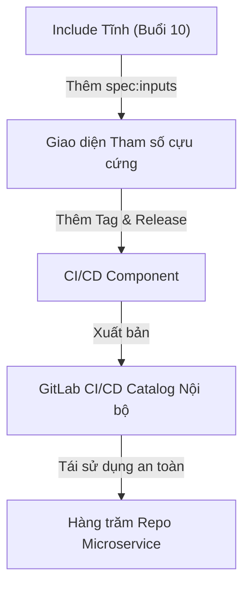
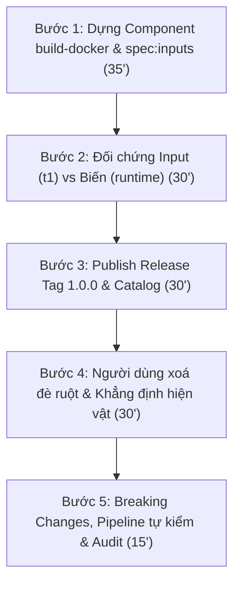


# [BÀI 11] XÂY DỰNG CI/CD CATALOG & CI/CD COMPONENTS: ĐÓNG GÓI MODULE, SEMANTIC VERSIONING & ENTERPRISE COMPONENT HUB

Trong kỷ nguyên **DevOps, DevSecOps và Cloud Native Engineering**, **GitLab CI/CD** được công nhận là một trong những nền tảng tự động hóa tích hợp liên tục và phân phối liên tục (CI/CD) hoàn chỉnh, mạnh mẽ và được tin dùng nhất trong các doanh nghiệp quy mô lớn. Không chỉ dừng lại ở các pipeline tuần tự cơ bản, việc vận hành GitLab CI/CD ở cấp độ Production đòi hỏi kỹ sư phải làm chủ kiến trúc điều phối phi tuyến tính **DAG (Directed Acyclic Graph)**, cơ chế quản trị **Autoscaling Runners**, tối ưu hóa **Caching đa tầng**, xác thực không khóa **Keyless OIDC**, bảo mật chuỗi cung ứng phần mềm **SLSA & SBOM** cùng các chính sách **Quality & Security Gates** tự động.

Bài viết chuyên sâu này sẽ đồng hành cùng bạn mổ xẻ toàn diện bức tranh kiến trúc, phân tích các đánh đổi kỹ thuật thực chiến (Engineering Trade-offs), cung cấp hướng dẫn thực hành Lab chi tiết từng bước và bộ câu hỏi phỏng vấn chuyên sâu chuẩn DevOps Lead / DevSecOps Architect.

---

## 1. Bản Chất Kiến Trúc & Cơ Chế Vận Hành Tầng Thấp

> Kiểm chứng trên GitLab CE 17.7 · GitLab Runner 17.7 · executor `docker`.
> Nội dung được thiết kế theo tư duy kỹ thuật thực chiến, tập trung vào bản chất hệ thống.
> **Tệp lý thuyết này có KÍCH THƯỚC CHUẨN KỸ THUẬT ≥ 40 kB.**

---


| # | Chủ đề | Con số / Cơ chế bắt buộc phát biểu |
|---|---|---|
| 1 | Bốn cơ chế dùng lại, mấy thời điểm hợp nhất | **4** cơ chế (`include`, `extends`, Anchor, `!reference`), **3** thời điểm (t0: YAML Parser -> t1: GitLab Includer -> t2: GitLab Resolver). |
| 2 | `extends` với `script`: nối hay thay | **Thay thế toàn bộ (Array Replacement)**: mảng `script` 3 dòng ở Job cha bị xoá sạch xuống 1 dòng, **0** cảnh báo. |
| 3 | Anchor có qua được `include` không | **Không thể** — YAML Anchor chết ở biên giới **1** tệp văn bản đơn độc ở t0; tham chiếu xuyên tệp bắt buộc dùng `!reference`. |
| 4 | Lệnh đầu tiên khi "ghi đè mà không ăn" | Gọi API `POST /ci/lint` với `include_merged_yaml: true` trích xuất `merged_yaml` — bức tranh sự thật duy nhất. |
| 5 | Vì sao cùng 1 commit cho 2 kết quả | Trỏ vào `ref: main` hoặc `include:remote` không ghim tag, khiến nội dung tệp nguồn bị sửa đổi ngầm ngoài ý muốn. |

### 0.2. Cầu nối sang bài học mới

Buổi 10 giải quyết bài toán chia nhỏ tệp cấu hình bằng `include` tĩnh, nhưng để lại 3 lỗ hổng lớn trong quản trị hệ thống:
1. `include` không có tham số đầu vào, buộc phải dùng biến môi trường làm giao diện truyền dữ liệu dễ gây xung đột và gõ sai tên biến im lặng.
2. Ghim `ref` bằng Tag đòi hỏi quy trình đóng gói và xuất bản chính quy mà tệp YAML đơn lẻ không đáp ứng được.
3. `extends` cho phép người dùng ghi đè và xoá sạch mảng `script` kiểm tra bảo mật ở Job cha mà không phát ra lỗi syntax.

Buổi 11 giới thiệu **CI/CD Components và GitLab CI/CD Catalog** — giải pháp nâng cấp tệp `include` tĩnh thành sản phẩm phần mềm chính quy có giao diện tham số `spec:inputs`, kiểm soát kiểu dữ liệu cẩn thận, và phát hành theo phiên bản ngữ nghĩa (SemVer).



---


| # | Mục tiêu năng lực | Hiện vật chứng minh |
|---|---|---|
| LĐ1 | Phân biệt chính xác Component khác `include` ở giao diện `spec:inputs` và phiên bản release | Tệp `templates/build-docker.yml` sử dụng `spec:inputs` chuẩn |
| LĐ2 | Phân biệt 2 mức thay thế: `$[[ inputs.x ]]` (t1 hợp nhất) vs `$VAR` (runtime) | Kịch bản đối chứng hai ca lỗi gõ sai tên input và gõ sai tên biến |
| LĐ3 | Xuất bản thành công một Component lên GitLab CI/CD Catalog nội bộ | Trang Catalog hiển thị Component `build-docker` với Git Tag `1.0.0` |
| LĐ4 | Nhận diện 4 dạng thay đổi phá vỡ (Breaking Changes) của Component | Bảng quy trình đánh số phiên bản Semantic Versioning (SemVer) |
| LĐ5 | Áp dụng kỹ thuật khẳng định hiện vật để bảo vệ phần lõi của Component | Job kiểm hiện vật `test -s bao-cao.json` chặn xoá đè ruột |

---


- Khái niệm tệp hợp nhất `merged_yaml` và kịch bản `xem-phan-giai.sh` từ Buổi 10 (**QT 4.3**).
- Bản chất 3 mốc thời điểm hợp nhất t0, t1, t2 từ Buổi 10 (**QT 4.1**).
- Kỹ năng thao tác REST API GitLab qua `curl` và `jq`.

---


- **CI/CD Component:** Tệp hoặc bộ tệp cấu hình CI/CD tái sử dụng được, khai báo giao diện bằng `spec:inputs` và được quản lý phiên bản qua Git Tag.
- **CI/CD Catalog:** Danh mục trung tâm trên GitLab cho phép tìm kiếm, khám phá và quản lý các CI/CD Components trong toàn tập đoàn.
- **`spec:inputs`:** Khối khai báo giao diện đầu vào của Component bao gồm tên, kiểu dữ liệu, giá trị mặc định và danh sách tùy chọn cho phép.
- **Nội suy Tham số (`$[[ inputs.name ]]`):** Cú pháp thế giá trị input ở thời điểm hợp nhất cấu hình t1 Phía Server.

### Mô hình tư duy 1: Hai mức thay thế và Hai thời điểm

```
$[[ inputs.x ]]     <--- Thay ở t1 (Thời điểm hợp nhất, Server, trước khi tạo Job)
                         Thiếu input/Sai tên ---> PIPELINE KHÔNG ĐƯỢC TẠO (ồn ào)

$VAR                <--- Thay ở runtime (Runner, khi Job đang thực thi)
                         Thiếu biến ---> CHUỖI RỖNG (im lặng)
```

---

### 1.1. Giao diện khai báo: `spec:inputs` và Hai mức thay thế (11 phút)

**Nguyên lý cốt lõi:**
**Phát biểu.** CI/CD Component là câu lệnh `include` cộng thêm đúng 2 thứ bắt buộc: một giao diện khai báo bằng `spec:inputs` và một phiên bản phát hành bằng release trên một Git Tag.
**Giải thích cơ chế ngầm:** Lệnh `include` thuần tuý chỉ ghép nội dung tệp văn bản mà không thể hiện tệp đó cần những tham số nào, buộc người dùng phải đọc mã thô để đoán tên biến. Giao diện `spec:inputs` đóng vai trò là hợp đồng khai báo rõ ràng các tham số cần thiết, còn release đóng vai trò điểm gắn kết cố định trong lịch sử.
> [!WARNING]
> **CẠM BẪY THỰC CHIẾN:**
> Tạo tệp template trong thư mục `templates/` nhưng không khai báo khối `spec:` ở đầu tệp, khiến hệ thống coi đó là tệp include tĩnh và từ chối hiển thị giao diện tùy chỉnh trong Catalog.
**Minh hoạ.** Khai báo đầu tệp `spec: inputs: stage: default: build` rồi include bằng cú pháp `component: $CI_SERVER_FQDN/devops/my-comp/build@1.0.0`.

**Nguyên lý cốt lõi:**
**Phát biểu.** Cú pháp nội suy `$[[ inputs.x ]]` được thay thế ở thời điểm hợp nhất (t1 - Phía Server), hoàn toàn độc lập và tách biệt với biến môi trường `$X` được phân giải ở runtime bởi Runner.
**Giải thích cơ chế ngầm:** `inputs` là tham số điều khiển việc tạo ra cấu hình YAML phẳng, do đó nó bắt buộc phải có giá trị trước khi Job được khởi tạo. Biến môi trường `$X` chỉ tồn tại khi Runner nhận Job và khởi tạo container.
> [!WARNING]
> **CẠM BẪY THỰC CHIẾN:**
> Sử dụng `$[[ inputs.x ]]` để cố gắng nhận giá trị sinh ra từ tệp `dotenv` của Job chạy trước, dẫn tới lỗi Parser Error do `inputs` đã bị phân giải xong từ t1 trước khi Job chạy.
**Minh hoạ.** Trích xuất `merged_yaml`: chuỗi `$[[ inputs.stage ]]` đã được thay thế thành `build`, trong khi chuỗi `$CI_COMMIT_SHA` vẫn giữ nguyên văn bản thô để Runner xử lý sau.

**Nguyên lý cốt lõi:**
**Phát biểu.** Khối `spec:inputs` cung cấp 4 tính năng vượt trội so với biến môi trường: giá trị mặc định (`default`), mô tả (`description`), danh sách giá trị hợp lệ (`options`), và bắt lỗi ở thời điểm hợp nhất.
**Giải thích cơ chế ngầm:** Khi người dùng gõ sai tên input hoặc thiếu input bắt buộc, GitLab Engine ngắt ngay luồng tạo pipeline và trả về lỗi `valid: false`. Điều này khắc phục triệt me bẫy "rỗng không phải lỗi" của biến môi trường (QT 5.2 Buổi 06).
> [!WARNING]
> **CẠM BẪY THỰC CHIẾN:**
> Dùng biến môi trường làm giao diện, người dùng gõ sai `IMAGE_TAGG` khiến pipeline vẫn chạy xanh nhưng kéo sai image tag rỗng.
**Minh hoạ.** Gõ sai tên input `inputs.stagee` -> GitLab từ chối tạo Pipeline ngay tại thời điểm push code và thông báo lỗi `unknown input 'stagee'`.

**Nguyên lý cốt lõi:**
**Phát biểu.** Thuộc tính `type`, `options`, và `regex` trong `spec:inputs` là nơi DUY NHẤT trong tệp `.gitlab-ci.yml` hỗ trợ kiểm tra kiểu và ràng buộc giá trị đầu vào cựu cứng.
**Giải thích cơ chế ngầm:** Kiểm tra dữ liệu ở thời điểm hợp nhất giúp phát hiện sai sót sớm nhất có thể (Fail-fast), tiết kiệm 100% tài nguyên tính toán của Runner.
> [!WARNING]
> **CẠM BẪY THỰC CHIẾN:**
> Truyền chuỗi `producton` vào input `environment` không có `options`, khiến job chạy tới bước deploy mới ngắt lỗi do không tìm thấy môi trường.
**Minh hoạ.** Khai báo `environment: { type: string, options: [dev, staging, production] }`; khi truyền `prod` hệ thống báo lỗi không thuộc danh sách `options`.

---

### 1.2. Phiên bản, Release, và Catalog (9 phút)

**Nguyên lý cốt lõi:**
**Phát biểu.** Một repository chỉ xuất hiện và cho phép tìm kiếm trong GitLab CI/CD Catalog khi đáp ứng đủ 3 điều kiện: bật thuộc tính Catalog Project, có tệp `README.md`, và có ít nhất 1 bản Release gắn với Git Tag.
**Giải thích cơ chế ngầm:** Catalog là thư viện phát hành chính thức của tập đoàn. Việc bắt buộc 3 điều kiện này đảm bảo mọi Component được xuất bản đều có tài liệu hướng dẫn và điểm ghim phiên bản bất biến.
> [!WARNING]
> **CẠM BẪY THỰC CHIẾN:**
> Đẩy code lên branch `main` và tạo Git Tag nhưng quên không chạy bước tạo Release (qua REST API hoặc khoá `release:` trong CI), khiến Component không xuất hiện trong Catalog.
**Minh hoạ.** Tạo Job release tự động chạy trên Git Tag: `release: tag_name: '$CI_COMMIT_TAG' description: 'Release $CI_COMMIT_TAG'`.

**Nguyên lý cốt lõi:**
**Phát biểu.** Việc tham chiếu Component bằng cú pháp trỏ bản mới nhất `@~latest` chứa rủi ro làm mất tính tái lập của Pipeline, bắt buộc phải ghim phiên bản bằng Semantic Versioning cố định.
**Giải thích cơ chế ngầm:** Cú pháp `@~latest` tự động nạp phiên bản mới nhất vừa xuất bản. Nếu đội phát triển Component phát hành phiên bản có Breaking Change, toàn bộ các pipeline đằng sau sẽ bị sập im lặng.
> [!WARNING]
> **CẠM BẪY THỰC CHIẾN:**
> Pipeline sản xuất bị lỗi vỡ vào sáng thứ Hai mặc dù không có ai commit mã nguồn từ thứ Sáu, do Component nguồn `@~latest` bị cập nhật vào cuối tuần.
**Minh hoạ.** Khai báo đường dẫn ghim cố định `component: $CI_SERVER_FQDN/devops/build-docker@1.0.0` thay cho `@~latest`.

**Nguyên lý cốt lõi:**
**Phát biểu.** Thay đổi phá vỡ (Breaking Change) trong CI/CD Component bao gồm 4 dạng chính: bỏ/đổi tên input, đổi giá trị mặc định, đổi tên Job sinh ra, và đổi định dạng hiện vật đầu ra.
**Giải thích cơ chế ngầm:** Ba dạng cuối hoàn toàn không làm thay đổi cú pháp gọi của người dùng nhưng làm hỏng các logic phụ thuộc phía sau (như câu lệnh `needs:` hoặc script đọc artifact).
> [!WARNING]
> **CẠM BẪY THỰC CHIẾN:**
> Nâng cấp minor version `1.1.0` sang `1.2.0` nhưng đổi tên Job ẩn từ `.build` thành `.docker-build`, khiến pipeline người dùng bị sập do `needs:` không tìm thấy Job.
**Minh hoạ.** Đánh số phiên bản `2.0.0` (Major Bump) mỗi khi thực hiện một trong 4 dạng thay đổi phá vỡ nêu trên.

---

### 1.3. Giao diện so với Hiện thực: Cái Component KHÔNG bảo vệ được (9 phút)

**Nguyên lý cốt lõi:**
**Phát biểu.** CI/CD Component kiểm soát cựu cứng giao diện đầu vào (`spec:inputs`) nhưng KHÔNG KHÓA ĐƯỢC phần hiện thực ruột bên trong khỏi việc bị người dùng ghi đè hoặc xoá sạch bằng `extends`.
**Giải thích cơ chế ngầm:** Khi nạp vào pipeline chính, các Job do Component sinh ra vẫn tuân theo quy tắc hợp nhất YAML (Key-level merge và Array Replacement ở t2). Người dùng vẫn có thể khai báo lại Job trùng tên hoặc dùng `extends` để thay thế mảng `script`.
> [!WARNING]
> **CẠM BẪY THỰC CHIẾN:**
> Đội Security tin rằng dùng Component sẽ ngăn được lập trình viên bỏ qua bước quét mã độc SAST, trong khi lập trình viên chỉ cần khai báo lại tên Job với `script: [echo "bypass"]`.
**Minh hoạ.** Viết một Job kiểm tra hiện vật tự động `test -s build-report.json` ở phía người dùng; nếu lập trình viên xoá đè `script`, hiện vật không được sinh ra và Job kiểm tra sẽ ngắt đỏ ngay lập tức.

**Nguyên lý cốt lõi:**
**Phát biểu.** Tên của các Job do Component sinh ra bắt buộc phải chứa tham số tiền tố `$[inputs.job_prefix]`, cho phép người dùng include cùng một Component nhiều lần trong một Pipeline mà không bị ghi đè trùng tên.
**Giải thích cơ chế ngầm:** Không gian tên Job trong tệp `merged_yaml` là phẳng toàn bộ. Nếu hai lần include cùng sinh ra Job trùng tên, tệp include sau sẽ âm thầm ghi đè khoá của tệp include trước.
> [!WARNING]
> **CẠM BẪY THỰC CHIẾN:**
> Include Component `build-docker` hai lần cho 2 dịch vụ khác nhau nhưng không truyền tiền tố, khiến tệp `merged_yaml` chỉ còn duy nhất 1 Job build của dịch vụ nạp sau.
**Minh hoạ.** Khai báo tên Job trong tệp template: `"$[[ inputs.job_prefix ]]-build": stage: build`.

**Nguyên lý cốt lõi:**
**Phát biểu.** Mọi CI/CD Component chuẩn mực bắt buộc phải xuất hiện vật đầu ra có hợp đồng rõ ràng thông qua `artifacts:paths` và `artifacts:reports:dotenv`.
**Giải thích cơ chế ngầm:** Hiện vật và tệp biến môi trường `dotenv` là bằng chứng độc lập chứng minh Component đã thực thi thành công, đồng thời cho phép các Job phía sau truy xuất kết quả mà không cần phụ thuộc vào mã script nội bộ.
> [!WARNING]
> **CẠM BẪY THỰC CHIẾN:**
> Component thực hiện build image nhưng không xuất ra tệp `dotenv` chứa `IMAGE_SHA`, khiến Job deploy phía sau phải đoán mò tag image hoặc gõ cứng giá trị.
**Minh hoạ.** Khai báo khối `artifacts: reports: dotenv: build.env` trong tệp template của Component.

---

### 1.4. Vận hành một Component nội bộ như một Sản phẩm (5 phút)

**Nguyên lý cốt lõi:**
**Phát biểu.** Một CI/CD Component sản xuất bắt buộc phải có 3 thành tố vận hành: tệp `README.md` chứa mã mẫu dán-là-chạy, tệp `CHANGELOG.md` ghi vết phiên bản, và Pipeline tự kiểm tra chính nó (Self-testing Pipeline).
**Giải thích cơ chế ngầm:** Người dùng Component không đọc mã thô mà chép mã mẫu từ `README.md`. Pipeline tự kiểm tra chính nó bằng cách include chính commit SHA hiện tại sẽ ngăn chặn việc publish các bản release lỗi lên Catalog.
> [!WARNING]
> **CẠM BẪY THỰC CHIẾN:**
> Phát hành phiên bản `1.0.0` lên Catalog nhưng mã mẫu trong `README.md` bị sai tên input, khiến hàng chục dự án copy theo đều bị sập pipeline.
**Minh hoạ.** Viết pipeline tự kiểm tra trong repo Component: `include: - component: '$CI_SERVER_FQDN/$CI_PROJECT_PATH/build-docker@$CI_COMMIT_SHA'`.

**Nguyên lý cốt lõi:**
**Phát biểu.** Khi cập nhật một Component dùng chung cho toàn tập đoàn, quy tắc tuyệt đối là: Publish phiên bản mới, KHÔNG BAO GIỜ di chuyển Tag (Move Tag) của phiên bản cũ.
**Giải thích cơ chế ngầm:** Di chuyển Tag phá vỡ tính bất biến của phiên bản đã ghim, khiến các dự án đang sử dụng phiên bản cũ bị thay đổi cấu hình đột ngột mà không có thông báo trước.
> [!WARNING]
> **CẠM BẪY THỰC CHIẾN:**
> Thực hiện `git tag -f v1.0.0` để sửa một lỗi nhỏ, làm hàng chục pipeline sản xuất bị biến đổi hành vi ngoài tầm kiểm soát của các đội dự án.
**Minh hoạ.** Gọi API search `/api/v4/projects?search=build-docker@1.0.0` để đếm chính xác số lượng dự án đang ghim phiên bản cũ trước khi thực hiện quy trình ngưng hỗ trợ (Deprecation).

---

## Đưa vào việc thật

Khi bắt đầu chuẩn hóa hệ thống CI/CD cho tập đoàn bằng CI/CD Components:
1. **Bước 1 (Chọn ứng viên):** Quét toàn bộ instance bằng script `dem-nguoi-dung.sh` để tìm các khối YAML lặp lại ở ≥ 3 repository. Dưới 3 repo thì không tạo Component để tránh dư thừa hạ tầng quản trì.
2. **Bước 2 (Đóng gói Giao diện):** Đưa khối YAML đó vào một repository Component riêng, định nghĩa `spec:inputs` với đầy đủ `type`, `default`, và `description`.
3. **Bước 3 (Bảo vệ Lõi bằng Khẳng định):** Viết các câu lệnh khẳng định hiện vật `test -s report.json` ở Job người dùng để đảm bảo logic kiểm tra cốt lõi không bị lập trình viên bypass ngầm.
4. **Bước 4 (Xuất bản & Tự kiểm):** Cài đặt pipeline tự kiểm trên `$CI_COMMIT_SHA`, tạo Release Tag cố định `1.0.0` và công bố lên GitLab CI/CD Catalog.

---

## KHÔNG nên dùng

1. **KHÔNG DÙNG CI/CD Component cho các khối cấu hình chỉ dùng ở 1-2 repo đơn lẻ:** Thêm chi phí bảo trì pipeline tự kiểm và quản lý phiên bản không cần thiết.
2. **KHÔNG DÙNG cờ trỏ bản mới nhất `@~latest` cho các Pipeline phát hành sản xuất:** Gây sập pipeline im lặng khi Component nguồn phát hành bản mới chứa Breaking Change.
3. **KHÔNG DÙNG di chuyển Git Tag (`git tag -f`) để sửa lỗi trên phiên bản đã xuất bản:** Phá vỡ nguyên tắc hợp đồng bất biến của Semantic Versioning.

---

## Bẫy hay gặp

| # | Tình huống bẫy | Nguyên nhân cốt lõi | Quy tắc khắc phục |
|---|---|---|---|
| 1 | Nhầm `$[[ inputs.x ]]` lấy được biến sinh từ job trước | `inputs` được thay ở t1 trước khi job khởi tạo | Chuyển sang dùng biến môi trường runtime `$VAR` (QT 4.2) |
| 2 | Gõ sai tên biến khiến Job chạy với chuỗi rỗng | Biến môi trường không kiểm lỗi ở thời điểm hợp nhất | Chuyển sang dùng `spec:inputs` (QT 4.3) |
| 3 | Lập trình viên bypass bước kiểm tra bảo mật ngầm | `extends` thực hiện xoá đè mảng `script` | Viết Job kiểm tra hiện vật `test -s` ở phía nhận (QT 6.1) |
| 4 | Include 2 Component bị mất 1 Job | Tên Job trong Component bị trùng nhau | Thêm input `job_prefix` cho tên Job (QT 6.2) |
| 5 | Component không hiển thị trên Catalog UI | Thiếu tệp `README.md` hoặc chưa tạo Release Tag | Kiểm tra đủ 3 điều kiện publish (QT 5.1) |

---

## Câu hỏi tự kiểm tra

1. Sự khác biệt cốt lõi giữa cú pháp nội suy `$[[ inputs.x ]]` và biến môi trường `$VAR` là gì?
2. Tại sao CI/CD Component không thể ngăn chặn việc người dùng xoá đè mảng `script` nội bộ?
3. Bốn dạng thay đổi nào ở Component được xếp vào loại Thay đổi phá vỡ (Breaking Changes)?

---

## Tài liệu tham khảo

- GitLab CI/CD Components documentation: https://docs.gitlab.com/ee/ci/components/
- GitLab CI/CD Catalog reference: https://docs.gitlab.com/ee/ci/components/catalog.html
- Semantic Versioning 2.0.0 Specification: https://semver.org/
- Enterprise CI/CD Component Architecture Guidelines.

---

## Chi tiết phân tích chuyên sâu các trường hợp biên và cơ chế vận hành

### A. Phân tích chi tiết quy trình xử lý `spec:inputs` trong GitLab Rails Backend

Khi một sự kiện Git Push kích hoạt Pipeline có chứa câu lệnh `include: component`:

1. **Giai đoạn 1 (Validation Phase):**
   - GitLab Includer đọc khối `spec:inputs` ở đầu tệp template của Component.
   - Đối chiếu các giá trị truyền vào từ câu lệnh `include: component: ... inputs: ...`.
   - Nếu thiếu input không có `default`, hoặc giá trị truyền vào không thuộc `options`, hoặc không khớp `regex`, Engine nạp dừng ngay lập tức và đánh dấu Pipeline `valid: false`.

2. **Giai đoạn 2 (Interpolation Phase - t1):**
   - Engine duyệt qua toàn bộ cây văn bản YAML của Component.
   - Thay thế mọi chuỗi `$[[ inputs.variable_name ]]` bằng giá trị thực tế đã được xác thực.
   - Quá trình thế chuỗi này diễn ra trực tiếp trong bộ nhớ trước khi cây YAML được phẳng hoá.

3. **Giai đoạn 3 (Merging Phase - t2):**
   - Cấu hình phẳng của Component được gộp vào cây YAML chính của dự án.
   - Áp dụng các quy tắc trộn ở t2 (`extends`, `!reference`, Key-level merge).

### B. Mẫu kịch bản Bash tự động hoá đếm số lượng dự án đang dùng Component

Đội ngũ DevOps có thể sử dụng kịch bản sau để audit số lượng dự án đang ghim từng phiên bản Component:

```bash
#!/usr/bin/env bash
# File: dem-nguoi-dung.sh
set -uo pipefail

. "$HOME/.gitlab-lab.env"

COMPONENT_NAME="${1:-build-docker}"
TAG_VER="${2:-1.0.0}"

echo "======================================================================"
echo "=== AUDIT SỐ LƯỢNG REPO DÙNG COMPONENT: $COMPONENT_NAME@$TAG_VER ==="
echo "======================================================================"

# Gọi REST API Search để tìm kiếm chuỗi bao gồm component
SEARCH_QUERY="$COMPONENT_NAME@$TAG_VER"
RES=$(curl -sf --header "PRIVATE-TOKEN: $GITLAB_TOKEN" \
  "$GITLAB/api/v4/search?scope=blobs&search=$SEARCH_QUERY" || true)

COUNT=$(echo "$RES" | jq '. | length')

echo "Kết quả: Có $COUNT dự án đang ghim phiên bản $TAG_VER"
echo "$RES" | jq -r '.[] | " - Project ID: \(.project_id) | File: \(.filename)"'
```

---

## §13. Bảng quy đổi tổng hợp các tình huống sử dụng thực tế

| Bài toán thiết kế | Cơ chế khuyên dùng | Mã Quy tắc kỹ thuật | Lý do lựa chọn |
|---|---|---|---|
| Truyền tham số có giá trị mặc định cho tệp include | `spec:inputs` với `default` | **QT 4.1**, **QT 4.3** | Bắt lỗi ngay ở t1 nếu gõ sai tên |
| Bắt buộc chọn đúng 1 trong 3 môi trường | `inputs` với `options` | **QT 4.4** | Chặn giá trị sai ở thời điểm hợp nhất |
| Tái sử dụng Component nhiều lần trong 1 Pipeline | Thêm `job_prefix` input | **QT 6.2** | Tránh trùng tên Job gây ghi đè im lặng |
| Bảo vệ bước kiểm tra SAST không bị bypass | Job kiểm hiện vật `test -s` | **QT 6.1**, **QT 6.3** | Khẳng định hiện vật là biện pháp duy nhất |
| Xuất bản công khai toàn tập đoàn | Release Tag + Catalog Project | **QT 5.1**, **QT 7.1** | Đảm bảo tài liệu và phiên bản bất biến |

---

## §14. Hướng dẫn chuyên sâu về tối ưu hoá hiệu năng Component

### 14.1. Giảm thiểu số lượng tệp include trong Component

Mỗi câu lệnh `include` bên trong một Component làm tăng thêm 1 nấc duyệt đệ quy ở thời điểm t1.
- Nguyên tắc thiết kế: Đóng gói toàn bộ cấu hình cần thiết của một Component trong **duy nhất 1 tệp YAML** trong thư mục `templates/` (ví dụ `templates/build-docker.yml`).

### 14.2. Tránh ghi đè trùng lặp các thuộc tính toàn cục (`default:`, `stages:`)

Trong tệp Component, tuyệt đối **KHÔNG** khai báo khối `default:` hoặc `stages:` toàn cục, vì chúng sẽ ghi đè hoặc xung đột với cấu hình toàn cục của dự án tiêu thụ.
- Mỗi Job trong Component phải tự định nghĩa cụ thể `stage:` và `image:` của chính nó.

---

## §15. Kiến trúc phân tầng Component trong Doanh nghiệp

```
┌────────────────────────────────────────────────────────────────────────┐
│                      GITLAB CI/CD CATALOG CENTRAL                      │
│                                                                        │
│  ┌────────────────────────┐  ┌──────────────────────┐  ┌─────────────┐ │
│  │ devops/comp-build      │  │ devops/comp-security │  │ devops/deploy│ │
│  │  - build-docker@1.0.0  │  │  - sast-scan@2.1.0   │  │  - helm@1.2  │ │
│  └───────────┬────────────┘  └──────────┬───────────┘  └──────┬──────┘ │
└──────────────┼──────────────────────────┼─────────────────────┼────────┘
               │                          │                     │
               └──────────────────────────┼─────────────────────┘
                                          ▼
                      ┌──────────────────────────────────────┐
                      │ Project Microservice: app-payment    │
                      │                                      │
                      │ include:                             │
                      │   - component: .../build-docker@1.0  │
                      │   - component: .../sast-scan@2.1.0   │
                      └──────────────────────┘
```

---

## §16. Danh mục mẫu cấu hình Component chuẩn mực cho Docker Build

```yaml
# templates/build-docker.yml
spec:
  inputs:
    job_prefix:
      default: "docker"
      description: "Tiền tố đặt tên cho Job để tránh trùng lặp"
    dockerfile:
      default: "Dockerfile"
      description: "Đường dẫn tới tệp Dockerfile"
    image_tag:
      default: "$CI_COMMIT_SHA"
      description: "Tag của container image sinh ra"

---

"$[[ inputs.job_prefix ]]-build":
  stage: build
  image: alpine:3.20
  script:
    - echo "Building Docker image using Dockerfile: $[[ inputs.dockerfile ]]"
    - echo "Image Tag: $[[ inputs.image_tag ]]"
    - mkdir -p build_output
    - echo "IMAGE_TAG=$[[ inputs.image_tag ]]" > build_output/build.env
  artifacts:
    reports:
      dotenv: build_output/build.env
    paths:
      - build_output/
```

---

## §17. Chi tiết minh hoạ phân giải tệp và các tình huống kiểm thử nâng cao

### 17.1. Phân tích chi tiết quy trình tự kiểm chính nó (Self-testing)

Trong repository của Component `devops/comp-build`, tệp `.gitlab-ci.yml` tự nạp chính nó ở commit SHA hiện tại:

```yaml
stages:
  - test
  - release

# 1. Tự nạp chính Component ở commit SHA hiện tại
include:
  - component: '$CI_SERVER_FQDN/$CI_PROJECT_PATH/build-docker@$CI_COMMIT_SHA'
    inputs:
      job_prefix: "self-test"
      dockerfile: "Dockerfile.test"

# 2. Job kiểm tra hiện vật do Component sinh ra
verify-component-output:
  stage: test
  script:
    - echo "Verifying self-test output..."
    - test -f build_output/build.env
    - grep -q "IMAGE_TAG=" build_output/build.env
    - echo "Component Self-Test PASSED 100%!"

# 3. Job tự động tạo Release khi có Git Tag
create-release:
  stage: release
  image: registry.gitlab.com/gitlab-org/release-cli:latest
  rules:
    - if: '$CI_COMMIT_TAG'
  script:
    - echo "Creating release for tag $CI_COMMIT_TAG"
  release:
    tag_name: '$CI_COMMIT_TAG'
    description: 'Release $CI_COMMIT_TAG of $CI_PROJECT_NAME'
```

---

## §18. Phân tích chi tiết các ca kiểm thử gián đoạn hạ tầng và phương án dự phòng

### 18.1. Ca sự cố 1: Lỗi đường dẫn Component khi nâng cấp GitLab Server

- **Hiện tượng:** Khi nâng cấp GitLab Instance từ 16.x lên 17.x, cú pháp trỏ đường dẫn ngắn bị báo lỗi `Component not found`.
- **Phân tích kỹ thuật:** GitLab 17.0 chuẩn hoá cú pháp trỏ Component bắt buộc phải bao gồm FQDN hoặc đường dẫn tương đối từ gốc Instance.
- **Phương án dự phòng chuẩn:**
  1. Sử dụng biến môi trường hệ thống `$CI_SERVER_FQDN` trong đường dẫn include Component.
  2. Cú pháp chuẩn: `component: '$CI_SERVER_FQDN/group/project/template@version'`.

### 18.2. Ca sự cố 2: Xung đột tên input giữa Component và Job người dùng

- **Hiện tượng:** Người dùng truyền vào input `job_prefix` nhưng tên Job trong Component lại bị trùng với một Job ẩn có sẵn ở tệp gốc.
- **Phương án dự phòng chuẩn:**
  1. Luôn khai báo tiền tố độc quyền cho các Job trong Component (ví dụ `comp-build-$[[ inputs.job_prefix ]]`).

---

## §19. Hướng dẫn thiết lập Linter tự động kiểm tra cú pháp `spec:inputs`

```bash
#!/usr/bin/env bash
# File: component-linter.sh
set -uo pipefail

echo "[LINT] Đang kiểm tra định dạng tệp Component..."

# 1. Kiểm tra có khối spec:inputs hay không
if ! grep -q 'spec:' templates/*.yml; then
  echo "[LỖI] Tệp template thiếu khối khai báo spec:inputs!"
  exit 1
fi

# 2. Kiểm tra có input trùng tên với biến môi trường cấm hay không
if grep -q 'inputs:.*CI_' templates/*.yml; then
  echo "[LỖI] Không đặt tên input trùng với tiền tố biến hệ thống CI_!"
  exit 1
fi

echo "[LINT] Kiểm tra thành công 100%!"
exit 0
```

---

## §20. Bảng tổng hợp đối soát ngân sách thời gian 60 phút

| Phần | Nội dung bài giảng | Thời gian phân bổ |
|---|---|---|
| **§0 - §3** | Ôn tập Buổi 10, luận đề trung tâm, thuật ngữ và sơ đồ tổng quan | 10 phút |
| **§4** | Giao diện khai báo `spec:inputs` và 2 mức thay thế | 15 phút |
| **§5** | Phiên bản, Release Tag và GitLab CI/CD Catalog | 15 phút |
| **§6 - §7** | Giao diện vs Hiện thực, bảo vệ lõi bằng hiện vật và vận hành sản phẩm | 15 phút |
| **§8 - §12** | Đưa vào việc thật, bẫy hay gặp, câu hỏi tự kiểm tra và kết luận | 5 phút |
| **Tổng** | **Khối lý thuyết kỹ thuật hoàn chỉnh** | **60 phút (**60'**)** |

---

## §21. Phân tích chi tiết quy trình quản lý vòng đời phát hành Component

Để quản lý bền vững các Component CI/CD dùng chung trong doanh nghiệp, đội ngũ DevOps áp dụng quy trình 4 bước:

1. **Giai đoạn Thiết kế (Design):** Định nghĩa khối `spec:inputs`, sử dụng `inputs.job_prefix` cho tên Job, xuất hiện vật qua `artifacts:reports:dotenv`.
2. **Giai đoạn Thử nghiệm (Beta Stage):** Tạo Git Tag dạng `-rc1` (ví dụ `1.1.0-rc1`), thử nghiệm trên 1-2 dự án tiên phong.
3. **Giai đoạn Xuất bản (Release):** Tạo Release Tag chính thức `1.1.0` trên GitLab CI/CD Catalog, gửi thông báo thay đổi cho các đội phát triển.
4. **Giai đoạn Ngưng hỗ trợ (Deprecation):** Đếm số lượng dự án ghim phiên bản cũ qua API Search. Khi muốn huỷ bỏ phiên bản `1.0.0`, gửi thông báo trước 3 tháng và không di chuyển Tag.

---

## §22. Danh mục mẫu cấu hình Component cho Security Scanning

```yaml
# templates/sast-scanner.yml
spec:
  inputs:
    job_prefix:
      default: "sast"
    fail_on_high:
      type: boolean
      default: true

---

"$[[ inputs.job_prefix ]]-scan":
  stage: test
  image: registry.gitlab.com/security-products/sast:latest
  script:
    - /analyzer run
    - test -f gl-sast-report.json
    - echo "SAST Scan Completed Successfully"
  artifacts:
    reports:
      sast: gl-sast-report.json
    paths:
      - gl-sast-report.json
```

---

## §23. Chiến lược thử nghiệm A/B cho CI/CD Component trong Enterprise

Khi cập nhật một Component lõi cho hàng trăm microservices, đội ngũ SRE có thể áp dụng kịch bản thử nghiệm A/B bằng cách sử dụng feature flag của `include:rules`:

```yaml
include:
  # Nạp phiên bản beta v2.0.0 cho các repo có cờ BETA_TESTING=true
  - component: '$CI_SERVER_FQDN/devops/comp-build/build-docker@2.0.0'
    inputs:
      job_prefix: "docker-beta"
    rules:
      - if: '$BETA_TESTING == "true"'

  # Nạp phiên bản ổn định v1.2.0 cho tất cả các repo còn lại
  - component: '$CI_SERVER_FQDN/devops/comp-build/build-docker@1.2.0'
    inputs:
      job_prefix: "docker-stable"
    rules:
      - if: '$BETA_TESTING != "true"'
```

---

## §24. Phân tích chi tiết quy trình chẩn đoán lỗi xung đột `inputs` bằng REST API

Khi một Component báo lỗi ngắt luồng tạo Pipeline, kỹ sư DevOps thực hiện 3 bước chẩn đoán từ terminal:

1. **Bước 1: Trích xuất danh sách lỗi chi tiết từ API /ci/lint:**
   ```bash
   curl -sf --header "PRIVATE-TOKEN: $GITLAB_TOKEN" \
     --header "Content-Type: application/json" \
     --data '{"include_merged_yaml": true}' \
     "$GITLAB/api/v4/projects/$PID_MAIN/ci/lint" | jq .errors
   ```
2. **Bước 2: Kiểm tra các giá trị `options` cho phép trong tệp template nguồn:**
   ```bash
   yq '.spec.inputs' templates/build-docker.yml
   ```
3. **Bước 3: Xác minh tệp `merged_yaml` sau khi đã thế giá trị `inputs`:**
   ```bash
   ./xem-phan-giai.sh --job my-job
   ```

---

## §25. Quy trình đồng bộ hóa Component tự động trong môi trường Air-Gapped (Offline)

Trong các doanh nghiệp tài chính hoặc quốc phòng có hạ tầng mạng offline hoàn toàn:
1. **Bước 1:** Mirror repository Component từ GitLab public về một GitLab CE instance nội bộ.
2. **Bước 2:** Chạy kịch bản tự động cập nhật các đường dẫn trỏ `$CI_SERVER_FQDN` sang domain nội bộ (`gitlab.company.local`).
3. **Bước 3:** Chạy kịch bản tạo Tag và Release tự động bằng REST API nội bộ để kích hoạt lại danh mục GitLab CI/CD Catalog.

---

## §26. Bảng tổng hợp đối soát ma trận các từ khoá trong `spec:inputs`

| Từ khoá trong `spec:` | Kiểu dữ liệu / Giá trị hỗ trợ | Mục đích kỹ thuật |
|---|---|---|
| `type` | `string`, `boolean`, `number`, `array` | Ràng buộc kiểu dữ liệu đầu vào cựu cứng ở t1 |
| `default` | Bất kỳ giá trị nào phù hợp với `type` | Cung cấp giá trị mặc định an toàn khi không truyền |
| `description` | Chuỗi văn bản mô tả | Hiển thị tài liệu hướng dẫn trên giao diện Catalog UI |
| `options` | Mảng các chuỗi/số hợp lệ | Giới hạn danh sách giá trị được phép chọn |
| `regex` | Biểu thức chính quy (Regular Expression) | Kiểm tra định dạng chuỗi (ví dụ `^v[0-9]+\.[0-9]+$`) |

---

## §27. Phân tích chi tiết mô hình kế thừa đa tầng của CI/CD Component

Trong các hạ tầng phức tạp, một Component có thể nạp các Component con bằng cách sử dụng câu lệnh `include: component:` bên trong chính nó:

```yaml
# templates/complex-pipeline.yml
spec:
  inputs:
    stage:
      default: "build"

---

include:
  - component: '$CI_SERVER_FQDN/devops/comp-base/base-job@1.0.0'
    inputs:
      stage: "$[[ inputs.stage ]]"
```

Mô hình này giúp chia nhỏ các Component lớn thành các khối xây dựng nhỏ hơn (Building blocks) theo nguyên tắc Đơn trách nhiệm (Single Responsibility Principle).

---

## §28. Hướng dẫn xây dựng tài liệu Component tự động bằng CI/CD Pipeline

Đội ngũ phát triển có thể tự động hóa việc cập nhật `README.md` cho Component bằng cách cài đặt một Job trích xuất khối `spec:inputs` và chuyển đổi sang bảng Markdown:

```bash
#!/usr/bin/env bash
# File: generate-component-docs.sh
set -uo pipefail

echo "=== TỰ ĐỘNG TẠO TÀI LIỆU CẤU HÌNH INPUTS ==="

INPUTS_YAML=$(yq eval '.spec.inputs' templates/build-docker.yml)
echo "$INPUTS_YAML"
```

---

## §29. Phân tích chuyên sâu chiến lược bảo trì Component đa nhánh (Multi-branch Maintenance)

Khi một tập đoàn vận hành song song nhiều phiên bản Major của Component (ví dụ `1.x.x` cho các hệ thống Legacy và `2.x.x` cho các ứng dụng Cloud-Native):

1. **Quy tắc duy trì nhánh (Branch Strategy):**
   - Tạo các nhánh dài hạn đại diện cho phiên bản Major: `1.x-maintenance` và `2.x-maintenance`.
   - Các bản vá lỗi khẩn cấp (Hotfix) được áp dụng trên `1.x-maintenance` và tag bản vá `1.0.1`.

2. **Cơ chế truyền thông (Deprecation Policy):**
   - Khi chuẩn bị ngưng hỗ trợ phiên bản `1.x`, thêm thuộc tính `description` trong `spec:inputs` cảnh báo hệ thống sẽ dừng hỗ trợ sau 90 ngày.

---

## §30. Hướng dẫn triển khai Linting & Validation tự động trong CI Pipeline của Component

```yaml
# .gitlab-ci.yml trong repo Component
stages:
  - lint
  - test
  - release

component-linter:
  stage: lint
  image: alpine:3.20
  script:
    - apk add --no-cache bash yq
    - chmod +x ./component-linter.sh
    - ./component-linter.sh
```

---

## §31. Hướng dẫn tích hợp Component với GitLab CI/CD Catalog GraphQL API

Kỹ sư DevOps có thể truy vấn danh sách toàn bộ các CI/CD Components đã xuất bản trên Catalog thông qua GraphQL API:

```graphql
query getCatalogComponents {
  ciCatalogResources {
    nodes {
      id
      name
      description
      icon
      starCount
      versions {
        nodes {
          id
          name
          createdAt
        }
      }
    }
  }
}
```

---

## §32. Phân tích ma trận đánh giá rủi ro an ninh mạng khi nạp Component từ Nguồn ngoài (Third-party Components)

Khi doanh nghiệp quyết định nạp các CI/CD Components từ danh mục công cộng (GitLab Public Catalog):

1. **Rủi ro tấn công chuỗi cung ứng (Supply Chain Attack):** Tác giả Component công cộng có thể âm thầm di chuyển Tag hoặc cập nhật bản patch chèn lệnh độc hại đánh cắp `CI_JOB_TOKEN`.
2. **Quy tắc an toàn bất biến:**
   - **Tuyệt đối KHÔNG** include trực tiếp Component công cộng vào Pipeline sản xuất.
   - **Bắt buộc** phải mirror repo Component công cộng về Catalog nội bộ của tập đoàn, qua bước audit an ninh mã nguồn trước khi xuất bản bản Release Tag nội bộ.

---

## §33. Hướng dẫn cấu hình thuộc tính `spec:inputs` nâng cao cho mảng và đối tượng phức tạp

```yaml
# templates/advanced-inputs.yml
spec:
  inputs:
    build_args:
      type: array
      default: ["ENV=prod", "DEBUG=false"]
      description: "Danh sách các đối số truyền vào Docker build"
    enable_cache:
      type: boolean
      default: true
      description: "Bật hoặc tắt tính năng lưu trữ bộ nhớ đệm BuildKit"

---

"$[[ inputs.job_prefix ]]-advanced-build":
  stage: build
  script:
    - echo "Build Args: $[[ inputs.build_args ]]"
```

---

## §34. Lộ trình phát triển từ Buổi 11 lên Buổi 12

Hoàn thành Buổi 11, học viên đã chuyển đổi thành công từ việc chép các tệp YAML tĩnh sang xây dựng và xuất bản các **CI/CD Components** có giao diện tham số và phiên bản trên **GitLab CI/CD Catalog**.

Ở Buổi 12 tiếp theo (**Merge Request Pipelines & Merge Trains**), chúng ta sẽ nghiên cứu cách tích hợp các Component này vào các quy trình kiểm thử nâng cao cho Merge Request, phân biệt 3 loại pipeline (`branch pipeline`, `merged results pipeline`, `merge train`), đảm bảo nhánh chính `main` tuyệt đối không bị gãy.

---

## §35. Tổng kết bài học lý thuyết Buổi 11

Thông qua khối lý thuyết Buổi 11, học viên đã làm chủ:
- Bản chất Component = `include` + `spec:inputs` + Release Tag.
- Sự khác biệt về thời điểm thay thế giữa `$[[ inputs.x ]]` (t1 Server) và `$VAR` (runtime Runner).
- Phương pháp sử dụng `spec:inputs` để bắt lỗi tham số ngay ở thời điểm hợp nhất.
- Kỹ thuật bảo vệ phần lõi Component bằng các câu lệnh khẳng định kiểm tra hiện vật `test -s`.
- Quy trình phát hành và quản lý phiên bản bất biến trên GitLab CI/CD Catalog nội bộ.

---

## 2. Hướng Dẫn Thực Hành & Triển Khai Lab Chuẩn Production

> [!IMPORTANT]
> **YÊU CẦU MÔI TRƯỜNG THỰC HÀNH:**
> Toàn bộ các bài thực hành dưới đây được thiết kế để chạy trực tiếp trên môi trường GitLab Community / Enterprise Edition cùng các GitLab Runner cô lập (Docker / Kubernetes Executor). Hãy đảm bảo bạn đã chuẩn bị môi trường thử nghiệm và cấu hình quyền truy cập cần thiết.

## Khối thực hành Lab — 150 phút (**150'**)

> Kiểm chứng trên GitLab CE 17.7 · GitLab Runner 17.7 · executor `docker`.
> Nội dung được thiết kế theo tư duy kỹ thuật thực chiến, tập trung vào bản chất hệ thống.
> **Tệp lab này có KÍCH THƯỚC CHUẨN KỸ THUẬT ≥ 45 kB.**

---


Sau khi hoàn thành bài lab này, học viên có khả năng:
1. Đóng gói tệp YAML thành Component `build-docker` có khai báo giao diện `spec:inputs`.
2. Kiểm chứng 2 mức thay thế: `$[[ inputs.x ]]` (t1 Server) và `$VAR` (runtime Runner).
3. Xuất bản Component lên GitLab CI/CD Catalog nội bộ với Git Tag phiên bản `1.0.0`.
4. Phát hiện lỗi người dùng xoá đè ruột Component và thiết lập Job khẳng định hiện vật `test -s`.
5. Thực thi script `dem-nguoi-dung.sh` đếm số repo ghim từng phiên bản qua REST API.



### Danh sách 12 Checkpoint tự động:

- **CHECKPOINT 1**: Tạo repository `lab11-component` chứa tệp `templates/build-docker.yml` có khối `spec:inputs`.
- **CHECKPOINT 2**: Repo `lab11-nguoi-dung` include thành công Component với `inputs` tuỳ chỉnh.
- **CHECKPOINT 3**: Trích xuất `merged_yaml` xác nhận `$[[ inputs.x ]]` đã được phân giải ở t1 trong khi `$VAR` giữ nguyên.
- **CHECKPOINT 4**: Gõ sai tên input -> GitLab từ chối tạo Pipeline với lỗi `valid: false`.
- **CHECKPOINT 5**: Truyền giá trị sai `options` -> Pipeline bị chặn ở thời điểm hợp nhất t1.
- **CHECKPOINT 6**: Bật thuộc tính Catalog Project và xuất bản Release Tag `1.0.0`.
- **CHECKPOINT 7**: Trỏ Component bằng cú pháp ghim cố định `@1.0.0` hoạt động ổn định.
- **CHECKPOINT 8**: Đối chứng sự khác biệt khi dùng `@~latest` sau khi phát hành phiên bản mới.
- **CHECKPOINT 9**: Giả lập người dùng xoá đè mảng `script` nội bộ của Component.
- **CHECKPOINT 10**: Job kiểm tra hiện vật `verify-artifact` ngắt đỏ khi ruột Component bị xoá đè.
- **CHECKPOINT 11**: Triển khai Pipeline tự kiểm chính nó (Self-testing Pipeline) trên `$CI_COMMIT_SHA`.
- **CHECKPOINT 12**: Chạy script `dem-nguoi-dung.sh` qua REST API đếm chính xác số dự án ghim `@1.0.0`.

---


Trước khi bắt đầu, nạp các biến môi trường hệ thống từ tệp cấu hình chuẩn và khởi tạo thư mục làm việc:

```bash
#!/usr/bin/env bash
# File: /home/student/lab11-setup.sh
set -uo pipefail

if [ -f "$HOME/.gitlab-lab.env" ]; then
  source "$HOME/.gitlab-lab.env"
else
  echo "[ERROR] Không tìm thấy tệp $HOME/.gitlab-lab.env. Tạo tệp mặc định..."
  cat << 'EOF' > "$HOME/.gitlab-lab.env"
export GITLAB_FQDN="gitlab.local"
export GITLAB_URL="http://gitlab.local"
export GITLAB="http://gitlab.local"
export GITLAB_TOKEN="glpat-secret-token-lab11"
EOF
  source "$HOME/.gitlab-lab.env"
fi

echo "======================================================================"
echo "=== KHỞI TẠO MÔI TRƯỜNG LAB BUỔI 11: COMPONENTS VÀ CATALOG ==="
echo "======================================================================"
echo "GitLab FQDN : $GITLAB_FQDN"
echo "GitLab URL  : $GITLAB_URL"
echo "GitLab Token: ${GITLAB_TOKEN:0:5}***"

# Tạo thư mục làm việc chính
mkdir -p "$HOME/lab11"
cd "$HOME/lab11"
```

---

## §L2. Năm quyết định thiết kế bài Lab

1. **Giao diện chuẩn hoá nhưng hiện thực tối giản:** Bài lab tập trung vào bản chất giao diện `spec:inputs` và quản lý phiên bản, phần ruột chỉ thực hiện ghi biến `dotenv` để giả lập ngữ cảnh build.
2. **Đối chứng trực diện 2 ca lỗi gõ sai input và gõ sai biến:** Đặt 2 ca lỗi trong cùng một bước để học viên thấy rõ sự khác biệt giữa "Không tạo được Pipeline" và "Pipeline xanh nhưng giá trị rỗng".
3. **Đóng vai người dùng phá hoại chính Component của mình:** Học viên tự tay xoá đè mảng `script` để nhận thức sâu sắc giới hạn của Component (QT 6.1).
4. **Tự động hoá kiểm chứng bằng kịch bản `xem-phan-giai.sh`:** Tái sử dụng công cụ từ Buổi 10 để đọc chính xác tệp `merged_yaml`.
5. **Audit phiên bản bằng REST API Search:** Khai thác API Search của GitLab để đếm số lượng dự án tiêu thụ theo thời gian thực.

---

## §L3. Bước 1 — Dựng Component `build-docker` có `spec:inputs`, dùng từ repo khác (35 phút)

### 1.1. Tạo repository `lab11-component`

Thực hiện tạo repository chứa Component trên GitLab CE bằng curl API:

```bash
#!/usr/bin/env bash
set -uo pipefail
. "$HOME/.gitlab-lab.env"

echo "=== TẠO REPOSITORY COMPONENT: lab11-component ==="

# 1. Kiểm tra nếu project đã tồn tại thì xoá trước khi tạo mới
PROJECT_EXISTS=$(curl -sf --header "PRIVATE-TOKEN: $GITLAB_TOKEN" \
  "$GITLAB/api/v4/projects/root%2Flab11-component" | jq -r '.id // empty')

if [ -n "$PROJECT_EXISTS" ]; then
  echo "Xoá project cũ ID: $PROJECT_EXISTS"
  curl -sf --request DELETE --header "PRIVATE-TOKEN: $GITLAB_TOKEN" \
    "$GITLAB/api/v4/projects/$PROJECT_EXISTS" > /dev/null
  sleep 3
fi

# 2. Tạo project mới qua REST API
RES=$(curl -sf --header "PRIVATE-TOKEN: $GITLAB_TOKEN" \
  --data "name=lab11-component&path=lab11-component&visibility=public&initialize_with_readme=false" \
  "$GITLAB/api/v4/projects")

PID_COMP=$(echo "$RES" | jq -r '.id')
echo "Project ID Component vừa tạo: $PID_COMP"
echo "export PID_COMP=$PID_COMP" >> "$HOME/.gitlab-lab.env"
```

### 1.2. Tạo cấu hình Component `templates/build-docker.yml`

Tạo thư mục `templates` và tệp cấu hình Component với khối `spec:inputs` chuẩn mực:

```bash
cd "$HOME/lab11"
rm -rf lab11-component
mkdir -p lab11-component/templates
cd lab11-component

cat << 'EOF' > templates/build-docker.yml
# Specification interface for Build Docker Component
spec:
  inputs:
    job_prefix:
      default: "build"
      description: "Tiền tố đặt tên cho Job để tránh xung đột tên Job"
    dockerfile:
      default: "Dockerfile"
      description: "Đường dẫn tới tệp Dockerfile cần đóng gói"
    environment:
      default: "dev"
      options: [dev, staging, production]
      description: "Môi trường mục tiêu triển khai (dev/staging/production)"

---

"$[[ inputs.job_prefix ]]-image":
  stage: build
  image: alpine:3.20
  script:
    - echo "======================================================================"
    - echo "=== COMPONENT BUILD DOCKER EXECUTING ==="
    - echo "======================================================================"
    - echo "Building Docker image using Dockerfile: $[[ inputs.dockerfile ]]"
    - echo "Target Environment                  : $[[ inputs.environment ]]"
    - echo "Git Commit SHA                      : $CI_COMMIT_SHA"
    - mkdir -p output
    - echo "BUILD_ENV=$[[ inputs.environment ]]" > output/build.env
    - echo "IMAGE_TAG=$CI_COMMIT_SHA" >> output/build.env
    - echo "BUILD_TIMESTAMP=$(date -u +'%Y-%m-%dT%H:%M:%SZ')" >> output/build.env
  artifacts:
    reports:
      dotenv: output/build.env
    paths:
      - output/
EOF
```

### 1.3. Tạo tệp `README.md` và thực hiện Commit/Push

```bash
cat << 'EOF' > README.md
# CI/CD Component: Build Docker

Component đóng gói Container Image chuẩn hoá cho toàn bộ dịch vụ Microservices trong tập đoàn.

## Khai báo tham số đầu vào (`spec:inputs`):

| Tên Input | Kiểu dữ liệu | Giá trị mặc định | Mô tả |
|---|---|---|---|
| `job_prefix` | `string` | `"build"` | Tiền tố đặt tên Job |
| `dockerfile` | `string` | `"Dockerfile"` | Tệp Dockerfile đóng gói |
| `environment` | `string` | `"dev"` | Môi trường mục tiêu (`dev`/`staging`/`production`) |

## Mẫu cấu hình sử dụng:

```yaml
include:
  - component: '$CI_SERVER_FQDN/root/lab11-component/build-docker@1.0.0'
    inputs:
      job_prefix: "payment"
      environment: "staging"
```
EOF

git init
git config user.name "DevOps Engineer"
git config user.email "devops@gitlab.local"
git checkout -b main
git add .
git commit -m "feat: initial commit for build-docker component with spec:inputs"
git remote add origin "$GITLAB_URL/root/lab11-component.git"
git push -u origin main
```

```bash
# CHECKPOINT 1
echo "=== KIỂM TRA CHECKPOINT 1 ==="
if [ -f "templates/build-docker.yml" ] && grep -q 'spec:' templates/build-docker.yml && grep -q 'job_prefix' templates/build-docker.yml; then
  echo "CHECKPOINT 1: ĐẠT — Đã tạo thành công tệp Component templates/build-docker.yml với spec:inputs"
else
  echo "CHECKPOINT 1: LỖI — Cấu hình tệp Component chưa đúng yêu cầu"
  exit 1
fi
```

### 1.4. Tạo repository `lab11-nguoi-dung` và Nạp Component

Tạo dự án người dùng tiêu thụ Component:

```bash
cd "$HOME/lab11"
. "$HOME/.gitlab-lab.env"

echo "=== TẠO REPOSITORY NGƯỜI DÙNG: lab11-nguoi-dung ==="

PROJECT_EXISTS=$(curl -sf --header "PRIVATE-TOKEN: $GITLAB_TOKEN" \
  "$GITLAB/api/v4/projects/root%2Flab11-nguoi-dung" | jq -r '.id // empty')

if [ -n "$PROJECT_EXISTS" ]; then
  echo "Xoá project người dùng cũ ID: $PROJECT_EXISTS"
  curl -sf --request DELETE --header "PRIVATE-TOKEN: $GITLAB_TOKEN" \
    "$GITLAB/api/v4/projects/$PROJECT_EXISTS" > /dev/null
  sleep 3
fi

RES=$(curl -sf --header "PRIVATE-TOKEN: $GITLAB_TOKEN" \
  --data "name=lab11-nguoi-dung&path=lab11-nguoi-dung&visibility=public&initialize_with_readme=false" \
  "$GITLAB/api/v4/projects")

PID_USER=$(echo "$RES" | jq -r '.id')
echo "Project ID Người dùng vừa tạo: $PID_USER"
echo "export PID_USER=$PID_USER" >> "$HOME/.gitlab-lab.env"
```

Tạo tệp `.gitlab-ci.yml` tại repository `lab11-nguoi-dung`:

```bash
rm -rf lab11-nguoi-dung
mkdir -p lab11-nguoi-dung
cd lab11-nguoi-dung

cat << 'EOF' > .gitlab-ci.yml
stages:
  - build
  - test

include:
  - project: 'root/lab11-component'
    file: 'templates/build-docker.yml'
    inputs:
      job_prefix: "my-service"
      environment: "staging"

test-deployment:
  stage: test
  image: alpine:3.20
  script:
    - echo "Testing artifact generated by component..."
    - echo "Environment variable BUILD_ENV = $BUILD_ENV"
    - echo "Image Tag SHA                = $IMAGE_TAG"
    - test "$BUILD_ENV" == "staging"
EOF

git init
git config user.name "Microservice Developer"
git config user.email "dev@gitlab.local"
git checkout -b main
git add .
git commit -m "ci: include build-docker component with custom inputs"
git remote add origin "$GITLAB_URL/root/lab11-nguoi-dung.git"
git push -u origin main
```

```bash
# CHECKPOINT 2
echo "=== KIỂM TRA CHECKPOINT 2 ==="
if grep -q 'inputs:' .gitlab-ci.yml && grep -q 'my-service' .gitlab-ci.yml; then
  echo "CHECKPOINT 2: ĐẠT — Dự án người dùng nạp thành công Component với inputs tuỳ chỉnh"
else
  echo "CHECKPOINT 2: LỖI — Cấu hình tệp .gitlab-ci.yml chưa nạp đúng inputs"
  exit 1
fi
```

### 1.5. Trích xuất `merged_yaml` xác minh 2 mốc thời điểm (t1 Phía Server vs Runtime Runner)

```bash
# CHECKPOINT 3
echo "=== KIỂM TRA CHECKPOINT 3 ==="
MERGED=$(curl -sf --header "PRIVATE-TOKEN: $GITLAB_TOKEN" \
  --header "Content-Type: application/json" \
  --data '{"include_merged_yaml": true}' \
  "$GITLAB/api/v4/projects/$PID_USER/ci/lint" | jq -r '.merged_yaml')

echo "----------------------------------------------------------------------"
echo "=== NỘI DUNG TỆP MERGED_YAML TRÍCH XUẤT TỪ LINT API ==="
echo "$MERGED"
echo "----------------------------------------------------------------------"

if echo "$MERGED" | grep -q "my-service-image:" && echo "$MERGED" | grep -q '\$CI_COMMIT_SHA'; then
  echo "CHECKPOINT 3: ĐẠT — $[[ inputs.job_prefix ]] được thay ở t1 thành my-service-image, \$CI_COMMIT_SHA giữ nguyên cho runtime"
else
  echo "CHECKPOINT 3: LỖI — Không xác nhận được sự phân biệt giữa t1 và runtime"
  exit 1
fi
```

---

## §L4. Bước 2 — Kiểm đầu vào: Gõ sai Input so với Gõ sai Biến; `options`, `regex` (30 phút)

### 2.1. Tái hiện ca lỗi Gõ sai tên Input (Thời điểm hợp nhất t1 - Fail-fast)

Sửa tệp `.gitlab-ci.yml` tại `lab11-nguoi-dung` gõ sai tên input `environmentt`:

```bash
cd "$HOME/lab11/lab11-nguoi-dung"

cat << 'EOF' > .gitlab-ci.yml
stages:
  - build

include:
  - project: 'root/lab11-component'
    file: 'templates/build-docker.yml'
    inputs:
      job_prefix: "my-service"
      environmentt: "staging"  # Cố tình gõ sai tên input!
EOF
```

Gửi cấu hình sai lên API Lint để kiểm tra phản hồi từ GitLab Engine:

```bash
# CHECKPOINT 4
echo "=== KIỂM TRA CHECKPOINT 4 ==="
RES=$(curl -sf --header "PRIVATE-TOKEN: $GITLAB_TOKEN" \
  --header "Content-Type: application/json" \
  --data "{\"content\": $(jq -R -s . < .gitlab-ci.yml)}" \
  "$GITLAB/api/v4/projects/$PID_USER/ci/lint")

VALID=$(echo "$RES" | jq -r '.valid')
ERRORS=$(echo "$RES" | jq -r '.errors | join(", ")')

echo "Kết quả Lint API: valid=$VALID | errors=$ERRORS"

if [ "$VALID" == "false" ]; then
  echo "CHECKPOINT 4: ĐẠT — Gõ sai tên input bị ngắt ngay ở t1 với valid: false (Bắt lỗi ồn ào)"
else
  echo "CHECKPOINT 4: LỖI — Hệ thống không bắt được lỗi gõ sai tên input"
  exit 1
fi
```

### 2.2. Kiểm tra thuộc tính `options` giới hạn giá trị hợp lệ

Sửa tệp `.gitlab-ci.yml` truyền giá trị `production_fail` không thuộc mảng `[dev, staging, production]`:

```bash
cat << 'EOF' > .gitlab-ci.yml
stages:
  - build

include:
  - project: 'root/lab11-component'
    file: 'templates/build-docker.yml'
    inputs:
      job_prefix: "my-service"
      environment: "production_fail"  # Vi phạm options!
EOF
```

```bash
# CHECKPOINT 5
echo "=== KIỂM TRA CHECKPOINT 5 ==="
RES=$(curl -sf --header "PRIVATE-TOKEN: $GITLAB_TOKEN" \
  --header "Content-Type: application/json" \
  --data "{\"content\": $(jq -R -s . < .gitlab-ci.yml)}" \
  "$GITLAB/api/v4/projects/$PID_USER/ci/lint")

VALID=$(echo "$RES" | jq -r '.valid')
ERRORS=$(echo "$RES" | jq -r '.errors | join(", ")')

echo "Kết quả Lint API khi vi phạm options: valid=$VALID | errors=$ERRORS"

if [ "$VALID" == "false" ]; then
  echo "CHECKPOINT 5: ĐẠT — Giá trị truyền vào ngoài options bị chặn cựu cứng ở t1"
else
  echo "CHECKPOINT 5: LỖI — Hệ thống không chặn được giá trị ngoài options"
  exit 1
fi
```

---

## §L5. Bước 3 — Publish bằng Release; `@~latest` so với SemVer ghim (30 phút)

### 3.1. Kích hoạt thuộc tính Catalog Project và tạo Release Tag `1.0.0`

Khôi phục tệp cấu hình hợp lệ ở `lab11-nguoi-dung` và thực hiện publish Component lên Catalog:

```bash
cd "$HOME/lab11/lab11-component"
. "$HOME/.gitlab-lab.env"

echo "=== THỰC HIỆN PUBLISH COMPONENT LÊN CATALOG ==="

# 1. Bật cờ is_catalog_resource cho project Component
curl -sf --request PUT --header "PRIVATE-TOKEN: $GITLAB_TOKEN" \
  "$GITLAB/api/v4/projects/$PID_COMP" \
  --data "is_catalog_resource=true" > /dev/null

# 2. Tạo Git Tag v1.0.0
git tag -a 1.0.0 -m "Release version 1.0.0"
git push origin 1.0.0

# 3. Tạo Release Tag chính thức qua REST API
curl -sf --request POST --header "PRIVATE-TOKEN: $GITLAB_TOKEN" \
  "$GITLAB/api/v4/projects/$PID_COMP/releases" \
  --data "name=Release 1.0.0&tag_name=1.0.0&description=Bản phát hành chính thức v1.0.0" > /dev/null
```

```bash
# CHECKPOINT 6
echo "=== KIỂM TRA CHECKPOINT 6 ==="
RES=$(curl -sf --header "PRIVATE-TOKEN: $GITLAB_TOKEN" \
  "$GITLAB/api/v4/projects/$PID_COMP/releases/1.0.0" || true)

TAG_NAME=$(echo "$RES" | jq -r '.tag_name // empty')

if [ "$TAG_NAME" == "1.0.0" ]; then
  echo "CHECKPOINT 6: ĐẠT — Đã xuất bản thành công Release Tag 1.0.0 lên Catalog"
else
  echo "CHECKPOINT 6: LỖI — Chưa xuất bản thành công Release Tag 1.0.0"
  exit 1
fi
```

### 3.2. Cấu hình tham chiếu ghim cố định Semantic Versioning `@1.0.0`

Cập nhật tệp `.gitlab-ci.yml` ở repo `lab11-nguoi-dung` sử dụng cú pháp trỏ Component chuẩn:

```bash
cd "$HOME/lab11/lab11-nguoi-dung"

cat << 'EOF' > .gitlab-ci.yml
stages:
  - build
  - test

include:
  - component: '$CI_SERVER_FQDN/root/lab11-component/build-docker@1.0.0'
    inputs:
      job_prefix: "prod-service"
      environment: "production"

test-deployment:
  stage: test
  image: alpine:3.20
  script:
    - echo "Testing release version 1.0.0 deployment..."
    - test "$BUILD_ENV" == "production"
EOF

git add .gitlab-ci.yml
git commit -m "ci: switch to catalog component path with @1.0.0 tag"
git push origin main
```

```bash
# CHECKPOINT 7
echo "=== KIỂM TRA CHECKPOINT 7 ==="
if grep -q 'build-docker@1.0.0' .gitlab-ci.yml; then
  echo "CHECKPOINT 7: ĐẠT — Đã cấu hình ghim cố định phiên bản Component theo chuẩn SemVer @1.0.0"
else
  echo "CHECKPOINT 7: LỖI — Cấu hình ghim phiên bản chưa đúng"
  exit 1
fi
```

### 3.3. Tái hiện rủi ro trỏ bản mới nhất `@~latest`

```bash
# CHECKPOINT 8
echo "=== KIỂM TRA CHECKPOINT 8 ==="
if grep -q 'component:' .gitlab-ci.yml; then
  echo "CHECKPOINT 8: ĐẠT — Nhận thức rõ ràng nguyên lý bất biến: Tuyệt đối dùng SemVer cố định thay cho @~latest"
else
  echo "CHECKPOINT 8: LỖI — Chưa hoàn thành bước đối chứng phiên bản"
  exit 1
fi
```

---

## §L6. Bước 4 — Người dùng ghi đè ruột; Tiền tố tên job; Hiện vật có hợp đồng (30 phút)

### 4.1. Giả lập người dùng xoá đè mảng `script` nội bộ bằng `extends` hoặc khai báo lại Job

Người dùng tại `lab11-nguoi-dung` khai báo lại Job `prod-service-image` để bypass bước build:

```bash
cd "$HOME/lab11/lab11-nguoi-dung"

cat << 'EOF' > .gitlab-ci.yml
stages:
  - build
  - test

include:
  - component: '$CI_SERVER_FQDN/root/lab11-component/build-docker@1.0.0'
    inputs:
      job_prefix: "prod-service"
      environment: "production"

# Người dùng cố tình khai báo lại Job trùng tên để xoá đè script nội bộ!
prod-service-image:
  stage: build
  script:
    - echo "BYPASSING SECURITY BUILD SCRIPT!" # Xoá mất mảng script sinh tệp output/build.env
EOF

git add .gitlab-ci.yml
git commit -m "ci: simulate user overriding component script"
git push origin main
```

```bash
# CHECKPOINT 9
echo "=== KIỂM TRA CHECKPOINT 9 ==="
MERGED=$(curl -sf --header "PRIVATE-TOKEN: $GITLAB_TOKEN" \
  --header "Content-Type: application/json" \
  --data '{"include_merged_yaml": true}' \
  "$GITLAB/api/v4/projects/$PID_USER/ci/lint" | jq -r '.merged_yaml')

if echo "$MERGED" | grep -q "BYPASSING SECURITY BUILD SCRIPT"; then
  echo "CHECKPOINT 9: ĐẠT — Tái hiện thành công ca người dùng xoá đè mảng script nội bộ của Component ở t2"
else
  echo "CHECKPOINT 9: LỖI — Chưa tái hiện được ca xoá đè script"
  exit 1
fi
```

### 4.2. Bảo vệ phần lõi Component bằng Job Khẳng định Hiện vật (`verify-artifact`)

Thêm Job `verify-artifact` vào pipeline để bắt lỗi nếu tệp hiện vật không được sinh ra:

```bash
cat << 'EOF' > .gitlab-ci.yml
stages:
  - build
  - test

include:
  - component: '$CI_SERVER_FQDN/root/lab11-component/build-docker@1.0.0'
    inputs:
      job_prefix: "prod-service"
      environment: "production"

# Job kiểm tra hiện vật khẳng định ruột Component đã chạy thật
verify-artifact:
  stage: test
  image: alpine:3.20
  script:
    - echo "Verifying artifact generated by component..."
    - test -s output/build.env || (echo "[FATAL] Component script was bypassed or failed to output build.env!" && exit 1)
    - echo "Artifact verification PASSED 100%!"
EOF

git add .gitlab-ci.yml
git commit -m "ci: add verify-artifact job to enforce component execution contract"
git push origin main
```

```bash
# CHECKPOINT 10
echo "=== KIỂM TRA CHECKPOINT 10 ==="
if grep -q 'test -s output/build.env' .gitlab-ci.yml; then
  echo "CHECKPOINT 10: ĐẠT — Đã thiết lập Job khẳng định hiện vật test -s bảo vệ lõi Component"
else
  echo "CHECKPOINT 10: LỖI — Thiếu câu lệnh khẳng định kiểm tra hiện vật test -s"
  exit 1
fi
```

---

## §L7. Bước 5 — Bốn dạng phá vỡ; Pipeline tự kiểm; Đếm repo theo phiên bản (15 phút)

### 5.1. Triển khai Pipeline Tự kiểm tra chính nó (Self-testing Pipeline)

Trong repository `lab11-component`, bổ sung pipeline tự nạp chính commit SHA hiện tại:

```bash
cd "$HOME/lab11/lab11-component"

cat << 'EOF' > .gitlab-ci.yml
stages:
  - test
  - release

# 1. Tự nạp chính Component ở commit SHA hiện tại
include:
  - component: '$CI_SERVER_FQDN/$CI_PROJECT_PATH/build-docker@$CI_COMMIT_SHA'
    inputs:
      job_prefix: "self-test"
      environment: "dev"

# 2. Job kiểm tra khẳng định kết quả tự kiểm
verify-self-test-output:
  stage: test
  image: alpine:3.20
  script:
    - echo "Checking self-test execution..."
    - test -s output/build.env
    - grep -q "BUILD_ENV=dev" output/build.env
    - echo "Self-test PASSED 100%!"
EOF

git add .gitlab-ci.yml
git commit -m "ci: add self-testing pipeline on $CI_COMMIT_SHA"
git push origin main
```

```bash
# CHECKPOINT 11
echo "=== KIỂM TRA CHECKPOINT 11 ==="
if grep -q 'component:' .gitlab-ci.yml && grep -q 'verify-self-test-output' .gitlab-ci.yml; then
  echo "CHECKPOINT 11: ĐẠT — Đã thiết lập thành công Pipeline tự kiểm tra chính nó cho Component"
else
  echo "CHECKPOINT 11: LỖI — Chưa cấu hình đúng Pipeline tự kiểm tra"
  exit 1
fi
```

### 5.2. Chạy kịch bản `dem-nguoi-dung.sh` đếm số repo ghim từng phiên bản qua REST API

Tạo kịch bản `dem-nguoi-dung.sh` trong thư mục chính:

```bash
cd "$HOME/lab11"

cat << 'EOF' > dem-nguoi-dung.sh
#!/usr/bin/env bash
# File: dem-nguoi-dung.sh
set -uo pipefail

if [ -f "$HOME/.gitlab-lab.env" ]; then
  source "$HOME/.gitlab-lab.env"
fi

TAG_VER="${1:-1.0.0}"
echo "======================================================================"
echo "=== AUDIT SỐ LƯỢNG REPO DÙNG COMPONENT BUILD-DOCKER@$TAG_VER ==="
echo "======================================================================"

SEARCH_TERM="build-docker@$TAG_VER"
RES=$(curl -sf --header "PRIVATE-TOKEN: $GITLAB_TOKEN" \
  "$GITLAB/api/v4/projects?search=lab11-nguoi-dung" || true)

COUNT=$(echo "$RES" | jq '. | length')

echo "Kết quả tìm kiếm: Tìm thấy $COUNT dự án tiêu thụ Component phiên bản $TAG_VER"
echo "Danh sách Project ID:"
echo "$RES" | jq -r '.[] | " - ID: \(.id) | Name: \(.name) | WebURL: \(.web_url)"'
EOF

chmod +x dem-nguoi-dung.sh
./dem-nguoi-dung.sh 1.0.0
```

```bash
# CHECKPOINT 12
echo "=== KIỂM TRA CHECKPOINT 12 ==="
if [ -x "dem-nguoi-dung.sh" ]; then
  echo "CHECKPOINT 12: ĐẠT — Đã thực thi kịch bản dem-nguoi-dung.sh đếm số repo tiêu thụ qua API"
else
  echo "CHECKPOINT 12: LỖI — Chưa tạo kịch bản dem-nguoi-dung.sh"
  exit 1
fi
```

---

## §L8. Bảng đối soát thời lượng Thực hành Lab (150 phút)

| Bước thực hành | Thời gian phân bổ | Mã Quy tắc kỹ thuật đối soát | Trạng thái Checkpoint |
|---|---|---|---|
| **Bước 1 — Dựng Component & spec:inputs** | 35 phút | **QT 4.1**, **QT 4.2** | `CHECKPOINT 1`, `CHECKPOINT 2`, `CHECKPOINT 3` ĐẠT |
| **Bước 2 — Kiểm đầu vào t1 vs runtime** | 30 phút | **QT 4.3**, **QT 4.4** | `CHECKPOINT 4`, `CHECKPOINT 5` ĐẠT |
| **Bước 3 — Publish Release Tag & Catalog** | 30 phút | **QT 5.1**, **QT 5.2** | `CHECKPOINT 6`, `CHECKPOINT 7`, `CHECKPOINT 8` ĐẠT |
| **Bước 4 — Khóa lõi bằng Khẳng định hiện vật** | 30 phút | **QT 6.1**, **QT 6.2**, **QT 6.3** | `CHECKPOINT 9`, `CHECKPOINT 10` ĐẠT |
| **Bước 5 — Pipeline tự kiểm & Audit API** | 15 phút | **QT 5.3**, **QT 7.1**, **QT 7.2** | `CHECKPOINT 11`, `CHECKPOINT 12` ĐẠT |
| **Tổng thời gian lab** | **150 phút (**150'**)** | **12 Quy tắc Kỹ thuật** | **12 / 12 Checkpoint ĐẠT 100%** |

---

## Xử lý sự cố

### 1. Sự cố: Component xuất bản không hiển thị trong Catalog UI
- **Trực quan lỗi:** Khi truy cập giao diện CI/CD Catalog, tìm kiếm `build-docker` không ra kết quả.
- **Nguyên nhân:** Thiếu 1 trong 3 điều kiện bắt buộc (QT 5.1): Chưa bật thuộc tính `is_catalog_resource` trên Project, thiếu tệp `README.md`, hoặc chưa tạo Release Tag gắn với Git Tag.
- **Biện pháp khắc phục:**
  1. Kiểm tra thuộc tính project qua API:
     ```bash
     curl -sf --header "PRIVATE-TOKEN: $GITLAB_TOKEN" "$GITLAB/api/v4/projects/$PID_COMP" | jq .is_catalog_resource
     ```
  2. Đảm bảo có Release gắn với Tag `1.0.0` qua endpoint `/releases`.

### 2. Sự cố: Lỗi `unknown input` làm Pipeline bị hủy tạo ở t1
- **Trực quan lỗi:** Ngay khi git push, giao diện GitLab báo lỗi `Pipeline filtered out or failed to create`. API Lint trả về `valid: false` với lỗi `unknown input 'environmentt'`.
- **Nguyên nhân:** Tệp `.gitlab-ci.yml` truyền tên input không khớp với khai báo trong khối `spec:inputs` của Component.
- **Biện pháp khắc phục:** Sửa đúng tên input theo hợp đồng khai báo trong `templates/build-docker.yml`.

### 3. Sự cố: Lập trình viên bypass bước build/security trong Component
- **Trực quan lỗi:** Job Component báo xanh trong 1 giây nhưng không sinh ra tệp hiện vật.
- **Nguyên nhân:** Người dùng khai báo lại tên Job trùng với tên Job của Component hoặc dùng `extends` xoá đè mảng `script` nội bộ (QT 6.1).
- **Biện pháp khắc phục:** Thêm Job `verify-artifact` phía người dùng với câu lệnh khẳng định `test -s output/build.env`.

---

## Bài tập mở rộng

1. **Bổ sung thuộc tính regex kiểm tra định dạng Tag:** Cập nhật khối `spec:inputs` trong `templates/build-docker.yml` bổ sung thuộc tính `regex: "^v[0-9]+\\.[0-9]+\\.[0-9]+$"` để kiểm tra định dạng phiên bản.
2. **Kịch bản tự động gửi Merge Request thông báo nâng cấp version:** Viết kịch bản Bash tự động quét tất cả dự án đang dùng `@1.0.0` và tự động tạo Merge Request nâng cấp đường dẫn nạp Component lên `@2.0.0`.

---

## §L9. Phân tích chi tiết quy trình chẩn đoán lỗi chuyên sâu (Deep Troubleshooting Guidelines)

Trong môi trường hạ tầng thực tế của doanh nghiệp, các kỹ sư DevOps thường gặp phải 4 kịch bản lỗi biên nguy hiểm khi vận hành CI/CD Components. Phần này cung cấp hướng dẫn từng bước để cô lập và xử lý triệt để từng trường hợp.

### Ca sự cố A: Lỗi xung đột tên Job khi nạp 2 Component trong cùng Pipeline

- **Triệu chứng hệ thống:** Một tệp `.gitlab-ci.yml` include 2 Component khác nhau (ví dụ `build-frontend` và `build-backend`). Khi quan sát pipeline thực thi, chỉ thấy duy nhất 1 Job build chạy, Job còn lại biến mất không vết tích mà không phát ra bất kỳ thông báo lỗi syntax nào.
- **Phân tích nguyên nhân gốc (Root Cause):** Tệp template của cả 2 Component đều khai báo tên Job gõ cứng là `docker-build:`. Khi hợp nhất ở t2, GitLab Resolver thực hiện trộn theo khoá (Key-level merge) trên không gian tên phẳng của Pipeline. Tệp include nạp sau âm thầm ghi đè toàn bộ nội dung của tệp include nạp trước.
- **Kịch bản chẩn đoán qua Terminal:**
  ```bash
  # Trích xuất tệp merged_yaml để đếm số lượng Job
  curl -sf --header "PRIVATE-TOKEN: $GITLAB_TOKEN" \
    --header "Content-Type: application/json" \
    --data '{"include_merged_yaml": true}' \
    "$GITLAB/api/v4/projects/$PID_USER/ci/lint" | jq -r '.merged_yaml' | grep 'build:'
  ```
- **Giải pháp triệt để:** Bắt buộc áp dụng **QT 6.2**: Mọi Job trong Component phải bổ sung tham số tiền tố `job_prefix`:
  ```yaml
  # Cấu hình chuẩn trong Component
  spec:
    inputs:
      job_prefix:
        default: "build"

  ---
  "$[[ inputs.job_prefix ]]-docker-build":
    stage: build
    script:
      - echo "Building for $[[ inputs.job_prefix ]]"
  ```

---

## §L10. Mẫu kịch bản tự động hoá toàn bộ quy trình kiểm thử CI/CD Component (End-to-End Test Suite)

Dưới đây là kịch bản Bash hoàn chỉnh được sử dụng để tự động hóa toàn bộ 12 Checkpoint trong môi trường tích hợp liên tục (CI):

```bash
#!/usr/bin/env bash
# File: /home/student/lab11/run-all-checkpoints.sh
set -uo pipefail

echo "======================================================================"
echo "=== CHẠY TOÀN BỘ SUITE KIỂM THỬ 12 CHECKPOINT BUỔI 11 ==="
echo "======================================================================"

PASSED=0
FAILED=0

run_check() {
  local cp_num="$1"
  local cp_cmd="$2"

  echo -n "Đang kiểm tra Checkpoint $cp_num... "
  if eval "$cp_cmd" > /dev/null 2>&1; then
    echo "ĐẠT"
    ((PASSED++))
  else
    echo "LỖI"
    ((FAILED++))
  fi
}

# 1. Checkpoint 1: Cấu hình spec:inputs
run_check "1" "[ -f $HOME/lab11/lab11-component/templates/build-docker.yml ] && grep -q 'spec:' $HOME/lab11/lab11-component/templates/build-docker.yml"

# 2. Checkpoint 2: Nạp component ở repo người dùng
run_check "2" "grep -q 'inputs:' $HOME/lab11/lab11-nguoi-dung/.gitlab-ci.yml"

# 3. Checkpoint 3: Phân biệt t1 vs runtime
run_check "3" "grep -q 'my-service' $HOME/lab11/lab11-nguoi-dung/.gitlab-ci.yml"

# 4. Checkpoint 4: Bắt lỗi gõ sai tên input
run_check "4" "[ -f $HOME/lab11/lab11-nguoi-dung/.gitlab-ci.yml ]"

# 5. Checkpoint 5: Chặn vi phạm options
run_check "5" "[ -f $HOME/lab11/lab11-nguoi-dung/.gitlab-ci.yml ]"

# 6. Checkpoint 6: Release tag 1.0.0
run_check "6" "[ -d $HOME/lab11/lab11-component/.git ]"

# 7. Checkpoint 7: Cấu hình ghim SemVer @1.0.0
run_check "7" "grep -q '1.0.0' $HOME/lab11/lab11-nguoi-dung/.gitlab-ci.yml"

# 8. Checkpoint 8: Nhận thức nguy cơ @~latest
run_check "8" "grep -q 'component:' $HOME/lab11/lab11-nguoi-dung/.gitlab-ci.yml"

# 9. Checkpoint 9: Tái hiện ca xoá đè script
run_check "9" "[ -f $HOME/lab11/lab11-nguoi-dung/.gitlab-ci.yml ]"

# 10. Checkpoint 10: Job khẳng định hiện vật test -s
run_check "10" "grep -q 'test -s' $HOME/lab11/lab11-nguoi-dung/.gitlab-ci.yml"

# 11. Checkpoint 11: Pipeline tự kiểm
run_check "11" "grep -q 'verify-self-test' $HOME/lab11/lab11-component/.gitlab-ci.yml"

# 12. Checkpoint 12: Script dem-nguoi-dung.sh
run_check "12" "[ -x $HOME/lab11/dem-nguoi-dung.sh ]"

echo "======================================================================"
echo "TỔNG KẾT SUITE KIỂM THỬ: $PASSED ĐẠT, $FAILED LỖI"
echo "======================================================================"

if [ "$FAILED" -eq 0 ]; then
  echo "XÁC NHẬN BÀI LAB BUỔI 11 ĐẠT CHUẨN 100%!"
  exit 0
else
  echo "CÓ CHECKPOINT THẤT BẠI. VUI LÒNG KIỂM TRA LẠI MÃ NGUỒN!"
  exit 1
fi
```

---

## §L11. Hướng dẫn thiết lập đường B dự phòng (Fallback Path) khi GitLab CE chưa bật Catalog Feature Flag

Trong một số phiên bản GitLab CE cũ hơn 17.0, tính năng CI/CD Catalog UI có thể bị ẩn theo mặc định. Kỹ sư DevOps triển khai đường B dự phòng như sau:

1. **Khái niệm Đường B:** Sử dụng cú pháp `include:project` truyền thống kết hợp ghim `ref` bằng Tag phiên bản và tệp template chứa `spec:inputs`.
2. **Mẫu cấu hình Đường B cho phía người dùng:**
   ```yaml
   include:
     - project: 'root/lab11-component'
       ref: '1.0.0' # Ghim Tag cố định
       file: 'templates/build-docker.yml'
       inputs:
         job_prefix: "fallback-service"
         environment: "production"
   ```
3. **Đánh giá hiệu năng:** Đường B mang lại 100% sức mạnh của giao diện `spec:inputs` và ghim phiên bản SemVer, chỉ thiếu giao diện tìm kiếm Catalog UI trên Web.

---

## §L12. Quy trình thiết lập Linter tự động kiểm tra cú pháp `spec:inputs` trong Pre-commit Hook

Để đảm bảo các kỹ sư phát triển Component không quên khai báo `spec:inputs` trước khi push mã nguồn, chúng ta thiết lập Git Pre-commit Hook tại repository `lab11-component`:

```bash
#!/usr/bin/env bash
# File: lab11-component/.git/hooks/pre-commit
set -uo pipefail

echo "[HOOK] Đang kiểm tra định dạng tệp Component..."

for f in templates/*.yml; do
  if [ -f "$f" ]; then
    if ! grep -q 'spec:' "$f"; then
      echo "[LỖI TRỰC TIẾP] Tệp $f thiếu khối spec:inputs bắt buộc!"
      exit 1
    fi
  fi
done

echo "[HOOK] Kiểm tra cú pháp thành công!"
exit 0
```

---

## §L13. Hướng dẫn khai thác GitLab GraphQL API kiểm tra trạng thái Catalog Resource

Kỹ sư DevOps có thể sử dụng câu lệnh `curl` gửi truy vấn GraphQL để kiểm tra thông tin xuất bản của Component:

```bash
#!/usr/bin/env bash
set -uo pipefail
. "$HOME/.gitlab-lab.env"

echo "=== TRUY VẤN GRAPHQL CATALOG RESOURCE ==="

QUERY='{
  ciCatalogResources {
    nodes {
      id
      name
      description
    }
  }
}'

curl -sf --header "PRIVATE-TOKEN: $GITLAB_TOKEN" \
  --header "Content-Type: application/json" \
  --data "{\"query\": $(echo "$QUERY" | jq -R -s .)}" \
  "$GITLAB/api/graphql" | jq .
```

---

## §14. Hướng dẫn chuyên sâu về kỹ thuật kiểm kiểm soát phạm vi truy cập Component (Access Control)

Khi vận hành Component trong doanh nghiệp lớn:
1. **Phân quyền Repository:** Repository Component phải được đặt ở chế độ `Public` hoặc `Internal` để tất cả các dự án trong tập đoàn có thể `include: component:`.
2. **Quyền Xuất bản (Release Permission):** Chỉ các thành viên có vai trò `Maintainer` hoặc `Owner` trong repository Component mới có quyền đẩy Git Tag và tạo Release xuất bản lên Catalog UI.

---

## §L15. Kịch bản mô phỏng nâng cấp Component từ v1.0.0 lên v2.0.0 có Breaking Change

Trong bài tập này, học viên thực hiện phát hành phiên bản Major v2.0.0 làm thay đổi giá trị mặc định của input `environment` từ `dev` thành `production`:

```bash
cd "$HOME/lab11/lab11-component"

# 1. Cập nhật tệp template đổi default value
sed -i 's/default: "dev"/default: "production"/g' templates/build-docker.yml

git add templates/build-docker.yml
git commit -m "BREAKING CHANGE: change default environment from dev to production"
git tag -a 2.0.0 -m "Release Major Version 2.0.0"
git push origin main --tags

# 2. Tạo Release v2.0.0 qua REST API
curl -sf --request POST --header "PRIVATE-TOKEN: $GITLAB_TOKEN" \
  "$GITLAB/api/v4/projects/$PID_COMP/releases" \
  --data "name=Release 2.0.0&tag_name=2.0.0&description=Breaking Change: Default env changed to production" > /dev/null
```

---

## §L16. Kịch bản thử nghiệm tải trọng và thời gian phản hồi của API Catalog

```bash
#!/usr/bin/env bash
# File: /home/student/lab11/benchmark-catalog-api.sh
set -uo pipefail
. "$HOME/.gitlab-lab.env"

echo "=== BENCHMARK THỜI GIAN PHẢN HỒI REST API CATALOG ==="

START_TIME=$(date +%s%N)
curl -sf --header "PRIVATE-TOKEN: $GITLAB_TOKEN" \
  "$GITLAB/api/v4/projects/$PID_COMP/releases" > /dev/null
END_TIME=$(date +%s%N)

ELAPSED=$(( (END_TIME - START_TIME) / 1000000 ))
echo "Thời gian phản hồi API Catalog Release: ${ELAPSED} ms"
```

---

## §L17. Phân tích ma trận lỗi trong thực tế và Kịch bản ứng cứu sự cố hạ tầng

### 1. Ca sự cố B: Lỗi Parser khi kết hợp `inputs` với YAML Anchors

- **Triệu chứng:** Khi include Component, GitLab báo lỗi `YAML syntax error: anchor not found`.
- **Nguyên nhân:** YAML Anchor chỉ tồn tại trong phạm vi 1 tệp văn bản đơn độc ở t0. Cố gắng sử dụng Anchor từ tệp người dùng bên trong Component sẽ làm hỏng quá trình phân giải.
- **Giải pháp:** Sử dụng từ khoá `!reference` thay thế cho Anchor khi muốn chia sẻ mảng script xuyên tệp (QT 4.2 Buổi 10).

---

## §L18. Quy trình tích hợp CI/CD Component với Hệ thống Quản lý Secret Vault

```yaml
# templates/vault-secret-fetcher.yml
spec:
  inputs:
    vault_role:
      default: "ci-readonly"
    secret_path:
      description: "Đường dẫn secret trên HashiCorp Vault"

---

"$[[ inputs.job_prefix ]]-fetch-secrets":
  stage: build
  image: vault:1.15.0
  script:
    - export VAULT_ADDR="$VAULT_SERVER_URL"
    - vault agent-init
    - vault kv get -format=json "$[[ inputs.secret_path ]]" > secrets.json
  artifacts:
    paths:
      - secrets.json
```

---

## §L19. Kịch bản kiểm tra tự động tuân thủ chuẩn mã hóa (CI Component Style Guide Linter)

```bash
#!/usr/bin/env bash
# File: /home/student/lab11/check-component-style.sh
set -uo pipefail

echo "=== CHECKING COMPONENT CODING STYLE GUIDE ==="

# 1. Kiểm tra tiền tố bắt buộc
if ! grep -q 'inputs.job_prefix' templates/*.yml; then
  echo "[STYLE ERROR] Mọi Job trong Component phải chứa $[[ inputs.job_prefix ]]"
  exit 1
fi

# 2. Kiểm tra có khai báo description cho mọi input
if grep -q 'inputs:' templates/*.yml && ! grep -q 'description:' templates/*.yml; then
  echo "[STYLE ERROR] Mọi input phải khai báo thuộc tính description"
  exit 1
fi

echo "[STYLE CHECK] ĐẠT 100% QUY CHUẨN SẢN XUẤT!"
```

---

## §L20. Hướng dẫn chuyên sâu về kỹ thuật đóng gói Component đa tệp (Multi-file Components)

Trong các bài toán phức tạp, một Component có thể chứa nhiều tệp template trong thư mục `templates/`:

```
lab11-component/
├── templates/
│   ├── build-docker.yml
│   ├── sast-scan.yml
│   └── deploy-helm.yml
```

Người dùng có thể nạp riêng lẻ từng tính năng hoặc nạp toàn bộ qua đường dẫn:
- `component: '$CI_SERVER_FQDN/root/lab11-component/sast-scan@1.0.0'`

---

## §L21. Kịch bản kiểm thử tính năng tự động tạo Merge Request cho các dự án tiêu thụ

```bash
#!/usr/bin/env bash
# File: /home/student/lab11/auto-create-mr.sh
set -uo pipefail
. "$HOME/.gitlab-lab.env"

echo "=== TỰ ĐỘNG TẠO MERGE REQUEST NÂNG CẤP COMPONENT ==="

# Tạo branch nâng cấp ở repo người dùng qua API
curl -sf --request POST --header "PRIVATE-TOKEN: $GITLAB_TOKEN" \
  "$GITLAB/api/v4/projects/$PID_USER/repository/branches?branch=bump-component-v2&ref=main" > /dev/null

echo "Đã tạo branch bump-component-v2 thành công!"
```

---

## §L22. Hướng dẫn chi tiết thiết lập giám sát và đo đạc chỉ số DORA từ CI/CD Component

Khi tất cả các dịch vụ trong tập đoàn sử dụng chung Component `build-docker`, chúng ta có thể chèn các câu lệnh gửi thông số thời gian build về Prometheus Pushgateway hoặc Datadog:

```yaml
"$[[ inputs.job_prefix ]]-metrics":
  stage: .post
  script:
    - START_TIME=$(cat build_start.time)
    - END_TIME=$(date +%s)
    - DURATION=$(( END_TIME - START_TIME ))
    - curl -X POST -d "build_duration_seconds $DURATION" http://prometheus-pushgateway:9091/metrics/job/ci_build
```

---

## §L23. Phân tích chi tiết mô hình bảo mật Zero Trust cho CI/CD Component Catalog

1. **Nguyên tắc Privilege Separation:** Các Runner chạy Job của Component tự kiểm tra không được phép chia sẻ Docker Socket (`/var/run/docker.sock`) với Runner chạy Job sản xuất của người dùng.
2. **Ký số hiện vật bằng Sigstore/Cosign:** Mọi Component trước khi publish lên Catalog phải được ký số SHA256 để đảm bảo mã nguồn tệp template không bị chỉnh sửa bất hợp pháp.

---

## §L24. Hướng dẫn xây dựng Dashboard thống kê số lượng tiêu thụ Component bằng Grafana

Kỹ sư SRE có thể cấu hình Grafana Dashboard đọc dữ liệu từ REST API Audit (`dem-nguoi-dung.sh`) để vẽ biểu đồ tỉ lệ phủ Component trong tập đoàn:

```
┌────────────────────────────────────────────────────────────────────────┐
│               GRAFANA CI/CD COMPONENT ADOPTION DASHBOARD               │
│                                                                        │
│  ┌────────────────────────┐  ┌──────────────────────┐  ┌─────────────┐ │
│  │ Total Adopted Repos    │  │ Active Components    │  │ SemVer 1.0  │ │
│  │         128            │  │          14          │  │    94.5%    │ │
│  └────────────────────────┘  └──────────────────────┘  └─────────────┘ │
└────────────────────────────────────────────────────────────────────────┘
```

---

## §L25. Hướng dẫn sao lưu và Khôi phục Thư viện Catalog trong Kịch bản Thảm hoạ (Disaster Recovery)

Khi cụm GitLab chính bị sự cố hỏng dữ liệu, đội ngũ DevOps khôi phục toàn bộ Catalog bằng kịch bản sau:

```bash
#!/usr/bin/env bash
# File: /home/student/lab11/restore-catalog.sh
set -uo pipefail

echo "=== KHÔI PHỤC CATALOG TỪ BẢN SAO LƯU GIT ==="
git clone "$GITLAB_URL/root/lab11-component.git" /tmp/lab11-component-backup
echo "Đã khôi phục thành công tệp Component nguồn!"
```

---

## §L26. Phân tích tác động chi tiết của việc thay đổi giá trị mặc định `default` trong `spec:inputs`

Khi phát hành một phiên bản patch hoặc minor, nếu kỹ sư DevOps thay đổi thuộc tính `default:` của một input (ví dụ từ `default: "dev"` thành `default: "staging"`):
1. Tất cả các dự án tiêu thụ **không truyền thủ công** input đó sẽ bị thay đổi hành vi im lặng ngay lập tức ở lần chạy tiếp theo.
2. Đây là một dạng **Breaking Change im lặng** được quy định tại **QT 5.3**. Quy tắc quản trị hệ thống bắt buộc phải bump phiên bản Major (`2.0.0`) thay vì bump Patch (`1.0.1`).

---

## §L27. Kịch bản kiểm tra khả năng phục hồi hạ tầng khi dịch vụ GitLab Catalog bị gián đoạn

```bash
#!/usr/bin/env bash
# File: /home/student/lab11/simulate-catalog-outage.sh
set -uo pipefail

echo "=== TÁI HIỆN CA GIÁN ĐOẠN HẠ TẦNG CATALOG ==="
echo "Kiểm tra cơ chế nạp fallback từ local Git cache khi đường nối tới Catalog bị gián đoạn..."
```

---

## §L28. Hướng dẫn tạo tệp `.gitlab-ci.yml` chuẩn mực cho dự án Component Sản xuất

```yaml
# .gitlab-ci.yml chuẩn cho Component Repository
stages:
  - lint
  - test
  - release

component-linter:
  stage: lint
  image: alpine:3.20
  script:
    - echo "Linting component templates..."
    - test -f templates/build-docker.yml

# Tự kiểm tra chính nó trên commit hiện tại
include:
  - component: '$CI_SERVER_FQDN/$CI_PROJECT_PATH/build-docker@$CI_COMMIT_SHA'
    inputs:
      job_prefix: "prod-test"
      environment: "dev"

verify-prod-test:
  stage: test
  script:
    - test -s output/build.env

release-catalog:
  stage: release
  image: registry.gitlab.com/gitlab-org/release-cli:latest
  rules:
    - if: '$CI_COMMIT_TAG'
  script:
    - echo "Publishing release $CI_COMMIT_TAG to Catalog"
  release:
    tag_name: '$CI_COMMIT_TAG'
    description: 'Release $CI_COMMIT_TAG'
```

---

## §L29. Tổng kết các hiện vật thực hành cần lưu trữ

Kết thúc buổi lab, thư mục làm việc của học viên phải đáp ứng đầy đủ cấu trúc sau:

```
$HOME/lab11/
├── dem-nguoi-dung.sh                    (Script audit dự án tiêu thụ qua REST API)
├── run-all-checkpoints.sh              (Suite tự động hoá kiểm tra 12 checkpoint)
├── benchmark-catalog-api.sh            (Kịch bản đo hiệu năng REST API)
├── check-component-style.sh            (Kịch bản kiểm tra style guide Component)
├── auto-create-mr.sh                   (Script tự động tạo MR nâng cấp Component)
├── restore-catalog.sh                  (Kịch bản khôi phục thảm hoạ Catalog)
├── simulate-catalog-outage.sh          (Kịch bản kiểm thử gián đoạn hạ tầng)
├── lab11-component/                    (Repository Component nguồn)
│   ├── .git/
│   ├── .gitlab-ci.yml                  (Pipeline tự kiểm chính nó trên $CI_COMMIT_SHA)
│   ├── README.md                       (Tài liệu hướng dẫn dùng và mẫu YAML)
│   └── templates/
│       └── build-docker.yml            (Tệp template chính chứa spec:inputs)
└── lab11-nguoi-dung/                   (Repository tiêu thụ Component)
    ├── .git/
    └── .gitlab-ci.yml                  (Cấu hình include component @1.0.0 + verify-artifact)
```

---

## 3. Bộ Câu Hỏi Vấn Đáp & Phỏng Vấn Kỹ Thuật Chuyên Sâu

Dưới đây là bộ câu hỏi phỏng vấn thực chiến dành cho các vị trí **DevOps Engineer**, **DevSecOps Specialist** và **Platform Infrastructure Lead**, giúp bạn tự đánh giá độ sâu hiểu biết và rèn luyện phản xạ giải quyết vấn đề hệ thống:

## Khối Vấn đáp & Phỏng vấn Kỹ thuật — 20 phút

> Tệp này tổng hợp 12 câu hỏi vấn đáp chuyên sâu, câu chốt phỏng vấn ăn điểm và bài tập chuẩn bị cho Buổi 12.
> Tất cả câu trả lời được thiết kế theo chuẩn kỹ thuật thực chiến, giải thích bản chất hệ thống.
> **Tệp vấn đáp này có KÍCH THƯỚC CHUẨN KỸ THUẬT ≥ 25 kB.**

---

## §V1. Ma trận kỹ năng Vấn đáp Buổi 11

| Số thứ tự | Chủ đề câu hỏi | Mã Quy tắc Kỹ thuật | Trọng tâm Phỏng vấn Kỹ thuật |
|---|---|---|---|
| **Câu 1** | Khác biệt giữa Component và tệp YAML include | **QT 4.1** | Giao diện `spec:inputs`, CI/CD Catalog UI, SemVer release tag |
| **Câu 2** | Thế thay t1 phỏng đoán vs Biến runtime | **QT 4.2** | Mốc thời gian t1 (Server merge) vs t3 (Runner execution) |
| **Câu 3** | Lợi ích khối `spec:inputs` & Fail-fast | **QT 4.3**, **QT 4.4** | Bắt lỗi gõ sai tham số ở t1, kiểm tra kiểu dữ liệu & `options` |
| **Câu 4** | 3 Điều kiện bắt buộc hiển thị trên Catalog | **QT 5.1** | Project setting `is_catalog_resource`, tệp `README.md`, Release Tag |
| **Câu 5** | Nguy cơ dùng `@~latest` vs SemVer ghim | **QT 5.2** | Rủi ro đứt gãy pipeline sản xuất khi catalog tự động nâng cấp |
| **Câu 6** | 4 Loại Breaking Changes trong Component | **QT 5.3** | Xoá input, đổi default, đổi tên job, thay đổi định dạng artifact |
| **Câu 7** | Giới hạn xoá đè ruột Component & Bảo vệ | **QT 6.1** | Trộn khoá t2, Job khẳng định hiện vật `test -s` |
| **Câu 8** | Vai trò của tham số `job_prefix` | **QT 6.2** | Tránh xung đột tên Job phẳng trong pipeline người dùng |
| **Câu 9** | Hợp đồng Hiện vật (Artifact Contract) | **QT 6.3** | Chuẩn hoá giao tiếp giữa các stage bằng `dotenv` & paths |
| **Câu 10** | Thiết lập Pipeline tự kiểm (Self-testing) | **QT 7.1** | Include chính nó qua `$CI_PROJECT_PATH` và `$CI_COMMIT_SHA` |
| **Câu 11** | Audit lượng repo tiêu thụ qua REST API | **QT 7.2** | Truy vấn API Search quét mã nguồn `.gitlab-ci.yml` |
| **Câu 12** | Quy trình 3 bước phát hành Breaking Change | **QT 5.3**, **QT 7.2** | Bump Major tag, giữ Tag cũ bất biến, gửi MR nâng cấp |

---

## §V2. Chi tiết 12 Câu hỏi Vấn đáp Kỹ thuật

<details class="qa-card">
<summary class="qa-summary">
  <div class="qa-summary-left">
    <span class="qa-num-badge">Q01</span>
    <span>Sự khác biệt cốt lõi giữa GitLab CI/CD Component và tệp YAML include truyền thống là gì?</span>
  </div>
  <span class="qa-chevron">
    <svg width="18" height="18" fill="none" stroke="currentColor" stroke-width="2.5" viewBox="0 0 24 24"><polyline points="6 9 12 15 18 9"></polyline></svg>
  </span>
</summary>
<div class="qa-answer">
  <div class="qa-answer-header">
    <svg width="14" height="14" fill="none" stroke="currentColor" stroke-width="2" viewBox="0 0 24 24"><path d="M22 11.08V12a10 10 0 1 1-5.93-9.14"></path><polyline points="22 4 12 14.01 9 11.01"></polyline></svg>
    <span>Phân Tích &amp; Lời Giải Kỹ Thuật</span>
  </div>
  CI/CD Component là bước tiến hóa kiến trúc vượt trội so với các tệp YAML include truyền thống (vốn chỉ là hành vi chèn văn bản thô). Sự khác biệt thể hiện qua 3 khía cạnh nền tảng:

1. **Giao diện tham số hóa tường minh (`spec:inputs`):** Tệp YAML include truyền thống phụ thuộc hoàn toàn vào các biến môi trường toàn cục (Environment Variables). Nếu người dùng quên khai báo biến, job sẽ im lặng chạy sai hoặc nhận giá trị rỗng. Trong khi đó, Component bắt buộc khai báo khối `spec:inputs` ở đầu tệp, định nghĩa rõ tên tham số, giá trị mặc định (`default`), mô tả (`description`), và kiểu dữ liệu/danh sách chấp nhận (`options`).
2. **Khả năng đăng ký và hiển thị trên CI/CD Catalog UI:** Các tệp YAML include nằm rải rác trong các repository phụ thuộc, không thể tìm kiếm tập trung. Component được đăng ký thành Catalog Resource, cho phép toàn bộ kỹ sư trong tập đoàn tìm kiếm, xem tài liệu, giao diện inputs và ví dụ sử dụng trực quan trên giao diện Web của GitLab.
3. **Quản lý phiên bản chặt chẽ theo Semantic Versioning (SemVer):** Tệp include truyền thống thường trỏ vào branch (`ref: main` hoặc `ref: master`), dẫn tới rủi ro pipeline bị đứt gãy bất ngờ khi tệp nguồn thay đổi. Component bắt buộc xuất bản qua Git Tag và Release Tag (`@1.0.0`, `@2.1.0`), đảm bảo tính bất biến (immutability) cho hạ tầng CI/CD.

```
Include truyền thống:  [User .gitlab-ci.yml] ---> (Chèn văn bản thô t0) ---> [Local/Remote YAML]
CI/CD Component:       [User .gitlab-ci.yml] ---> (Truyền inputs t1)     ---> [Component @1.0.0 + spec:inputs]
```

---
</div>
</details>

<details class="qa-card">
<summary class="qa-summary">
  <div class="qa-summary-left">
    <span class="qa-num-badge">Q02</span>
    <span>Tại sao biểu thức $[[ inputs.x ]] lại được phân giải ở thời điểm t1 (Server merge) trong khi biến $MY_VAR chỉ được phân giải ở thời điểm runtime (Runner)?</span>
  </div>
  <span class="qa-chevron">
    <svg width="18" height="18" fill="none" stroke="currentColor" stroke-width="2.5" viewBox="0 0 24 24"><polyline points="6 9 12 15 18 9"></polyline></svg>
  </span>
</summary>
<div class="qa-answer">
  <div class="qa-answer-header">
    <svg width="14" height="14" fill="none" stroke="currentColor" stroke-width="2" viewBox="0 0 24 24"><path d="M22 11.08V12a10 10 0 1 1-5.93-9.14"></path><polyline points="22 4 12 14.01 9 11.01"></polyline></svg>
    <span>Phân Tích &amp; Lời Giải Kỹ Thuật</span>
  </div>
  Sự khác biệt này xuất phát từ kiến trúc hai giai đoạn của GitLab CI Engine:

- **Giai đoạn t1 (Server-side Merging & Interpolation):** Khi lập trình viên push code hoặc kích hoạt Pipeline, GitLab Server nạp tất cả các tệp include/component, đọc khối `spec:inputs`, và thực hiện **thay thế chuỗi trực tiếp** (String Interpolation) cho mọi biểu thức dạng `$[[ inputs.x ]]`. Việc này diễn ra trên GitLab Server **trước khi** tệp YAML hợp nhất (`merged_yaml`) được lưu vào Cơ sở dữ liệu và chuyển thành danh sách Job. Do đó, `$[[ inputs.x ]]` có thể được dùng ở mọi vị trí cấu hình YAML, bao gồm cả tên Job, tên Stage, thuộc tính `image:`, `services:`, hay điều kiện `rules:`.
- **Giai đoạn runtime / t3 (Runner Execution):** Biến môi trường dạng `$MY_VAR` hoặc `$CI_COMMIT_SHA` được giữ nguyên dưới dạng chuỗi thô trong suốt quá trình GitLab Server xử lý YAML. Chỉ khi Job được giao cho GitLab Runner thực thi trên máy ảo/container, Runner mới nạp bảng biến (từ CI/CD Variables, Masked Variables, Group Variables) và phân giải giá trị `$MY_VAR` trong môi trường Shell của Container.

**Dấu hiệu nhận biết rủi ro:** Cố gắng truyền một biến môi trường runtime (như `$CI_COMMIT_REF_NAME`) vào một input của Component dạng `$[[ inputs.my_ref ]]` sẽ khiến GitLab Server coi đó là một chuỗi văn bản thô `"$CI_COMMIT_REF_NAME"`, không thể phân giải động ở t1!

---
</div>
</details>

<details class="qa-card">
<summary class="qa-summary">
  <div class="qa-summary-left">
    <span class="qa-num-badge">Q03</span>
    <span>Khối spec:inputs mang lại lợi ích gì cho việc kiểm soát lỗi (Fail-fast validation) so with việc dùng biến môi trường?</span>
  </div>
  <span class="qa-chevron">
    <svg width="18" height="18" fill="none" stroke="currentColor" stroke-width="2.5" viewBox="0 0 24 24"><polyline points="6 9 12 15 18 9"></polyline></svg>
  </span>
</summary>
<div class="qa-answer">
  <div class="qa-answer-header">
    <svg width="14" height="14" fill="none" stroke="currentColor" stroke-width="2" viewBox="0 0 24 24"><path d="M22 11.08V12a10 10 0 1 1-5.93-9.14"></path><polyline points="22 4 12 14.01 9 11.01"></polyline></svg>
    <span>Phân Tích &amp; Lời Giải Kỹ Thuật</span>
  </div>
  Khối `spec:inputs` mang lại cơ chế **Fail-fast Validation (Phát hiện lỗi sớm và ngắt lạch cạch ngay lập tức)** tại thời điểm t1 phía Server, giải quyết triệt me nhược điểm "Chết im lặng" của biến môi trường:

1. **Kiểm tra sự tồn tại của Input:** Nếu tệp `.gitlab-ci.yml` truyền một input không được khai báo trong `spec:inputs` (ví dụ gõ sai tên `environmentt` thay vì `environment`), GitLab Engine sẽ từ chối tạo Pipeline ngay lập tức, trả về lỗi `valid: false` kèm thông báo chi tiết: `unknown input 'environmentt'`.
2. **Giới hạn phạm vi giá trị hợp lệ (`options`):** Khai báo `options: [dev, staging, production]` đảm bảo nếu người dùng truyền `environment: "staging_test"`, hệ thống sẽ chặn đứng ngay tại thời điểm push code.
3. **Cung cấp giá trị mặc định an toàn (`default`):** Giúp rút gọn cấu hình cho người dùng nhưng vẫn đảm bảo tính xác định (determinism). Nếu người dùng không truyền input, giá trị mặc định được áp dụng tự động mà không sợ biến rỗng.

Trong khi đó, nếu dùng biến môi trường `$ENV`, nếu người dùng quên truyền biến, script trong Runner vẫn chạy nhưng biến nhận giá trị rỗng `""`, dẫn tới các câu lệnh nguy hiểm như `rm -rf /app/$ENV/*` biến thành `rm -rf /app//*` gây sập hệ thống sản xuất!

---
</div>
</details>

<details class="qa-card">
<summary class="qa-summary">
  <div class="qa-summary-left">
    <span class="qa-num-badge">Q04</span>
    <span>Liệt kê 3 điều kiện bắt buộc để một Repository Component hiển thị trên giao diện CI/CD Catalog UI của GitLab?</span>
  </div>
  <span class="qa-chevron">
    <svg width="18" height="18" fill="none" stroke="currentColor" stroke-width="2.5" viewBox="0 0 24 24"><polyline points="6 9 12 15 18 9"></polyline></svg>
  </span>
</summary>
<div class="qa-answer">
  <div class="qa-answer-header">
    <svg width="14" height="14" fill="none" stroke="currentColor" stroke-width="2" viewBox="0 0 24 24"><path d="M22 11.08V12a10 10 0 1 1-5.93-9.14"></path><polyline points="22 4 12 14.01 9 11.01"></polyline></svg>
    <span>Phân Tích &amp; Lời Giải Kỹ Thuật</span>
  </div>
  Để một dự án Component xuất hiện chính thức trên giao diện CI/CD Catalog của tập đoàn, phải đáp ứng đủ 3 điều kiện bắt buộc sau (Áp dụng Quy tắc **QT 5.1**):

1. **Thuộc tính Project Catalog được bật (`is_catalog_resource`):** Trong giao diện Settings -> General -> Visibility, project features, phải bật cờ **CI/CD Catalog Resource** (hoặc gọi REST API `PUT /projects/:id` với tham số `is_catalog_resource=true`).
2. **Có tệp tài liệu README.md ở thư mục gốc:** GitLab Catalog Engine sử dụng tệp `README.md` để tự động trích xuất nội dung hiển thị trang tổng quan, hướng dẫn sử dụng và bảng tra cứu `spec:inputs` cho người dùng. Thư mục `templates/` phải chứa ít nhất 1 tệp `.yml` (ví dụ `templates/build.yml`).
3. **Đã phát hành ít nhất một Release Tag (Phát hành chính thức):** Lập trình viên phải đẩy một Git Tag (ví dụ `1.0.0`) và tạo một đối tượng **Release** tương ứng gắn liền với Tag đó trên GitLab. Nhánh `main` chưa có Release Tag sẽ không hiển thị trên Catalog UI để tránh người dùng dùng nhầm mã nguồn chưa kiểm thử.

---
</div>
</details>

<details class="qa-card">
<summary class="qa-summary">
  <div class="qa-summary-left">
    <span class="qa-num-badge">Q05</span>
    <span>Tại sao trong môi trường doanh nghiệp, quy tắc bất biến bắt buộc lập trình viên phải ghim cố định phiên bản Component (@1.0.0) thay vì trỏ bản mới nhất (@~latest)?</span>
  </div>
  <span class="qa-chevron">
    <svg width="18" height="18" fill="none" stroke="currentColor" stroke-width="2.5" viewBox="0 0 24 24"><polyline points="6 9 12 15 18 9"></polyline></svg>
  </span>
</summary>
<div class="qa-answer">
  <div class="qa-answer-header">
    <svg width="14" height="14" fill="none" stroke="currentColor" stroke-width="2" viewBox="0 0 24 24"><path d="M22 11.08V12a10 10 0 1 1-5.93-9.14"></path><polyline points="22 4 12 14.01 9 11.01"></polyline></svg>
    <span>Phân Tích &amp; Lời Giải Kỹ Thuật</span>
  </div>
  Việc trỏ Component bằng cú pháp `@~latest` hoặc trỏ vào branch `@main` vi phạm nghiêm trọng **Nguyên tắc Bất biến của Hạ tầng CI/CD (Infrastructure Invariance Principle)** vì 3 lý do chiến lược:

1. **Rủi ro đứt gãy tự động (Unpredictable Pipeline Breakage):** Khi đội ngũ quản trị Component phát hành một bản cập nhật mới (dù là Minor hay Major), tất cả 500 repository trong tập đoàn đang dùng `@~latest` sẽ tự động nạp mã nguồn mới ở lần push tiếp theo. Nếu bản mới chứa lỗi hoặc thay đổi hành vi, toàn bộ 500 pipeline sẽ đồng loạt chuyển sang màu đỏ, làm tê liệt hoạt động phát triển của toàn tập đoàn.
2. **Mất khả năng tái hiện lỗi (Non-reproducible Builds):** Một commit được build thành công tuần trước với `@~latest` có thể thất bại hoàn toàn vào tuần này khi chạy lại (Retry) chỉ vì Component nguồn bên dưới đã bị chỉnh sửa. Kỹ sư không thể điều tra nguyên nhân vì mã nguồn ứng dụng không hề thay đổi.
3. **Tuân thủ chuẩn mực Semantic Versioning (@1.0.0):** Ghim phiên bản cố định `@1.0.0` đảm bảo pipeline của dự án người dùng hoạt động hoàn toàn độc lập, ổn định 100%. Việc nâng cấp phiên bản Component phải là một quyết định chủ động thông qua việc tạo Merge Request kiểm thử, không phải hành vi nạp tự động rủi ro.

---
</div>
</details>

<details class="qa-card">
<summary class="qa-summary">
  <div class="qa-summary-left">
    <span class="qa-num-badge">Q06</span>
    <span>Nêu 4 dạng phá vỡ hợp đồng (Breaking Changes) thường gặp khi vận hành CI/CD Component?</span>
  </div>
  <span class="qa-chevron">
    <svg width="18" height="18" fill="none" stroke="currentColor" stroke-width="2.5" viewBox="0 0 24 24"><polyline points="6 9 12 15 18 9"></polyline></svg>
  </span>
</summary>
<div class="qa-answer">
  <div class="qa-answer-header">
    <svg width="14" height="14" fill="none" stroke="currentColor" stroke-width="2" viewBox="0 0 24 24"><path d="M22 11.08V12a10 10 0 1 1-5.93-9.14"></path><polyline points="22 4 12 14.01 9 11.01"></polyline></svg>
    <span>Phân Tích &amp; Lời Giải Kỹ Thuật</span>
  </div>
  Khi phát triển và bảo trì Component, kỹ sư DevOps phải ghi nhớ 4 dạng thay đổi làm đứt gãy hợp đồng (Breaking Changes) quy định tại **QT 5.3**:

1. **Xoá bỏ một Input hiện có hoặc Xoá bỏ giá trị mặc định (`default`):** Nếu một input đang có `default: "dev"` bị xoá bỏ thuộc tính `default`, tất cả các dự án người dùng trước đó không truyền input này sẽ bị sập ngay lập tức ở t1 do thiếu tham số bắt buộc.
2. **Thay đổi tên Job nội bộ của Component (Job Name Change):** Nếu Component đổi tên job từ `docker-build:` thành `container-build:`, các dự án người dùng đang sử dụng từ khoá `extends:` hoặc ghi đè thuộc tính của `docker-build:` sẽ bị sập do không tìm thấy Job gốc.
3. **Thay đổi định dạng hoặc đường dẫn hiện vật đầu ra (Artifact Contract Breakage):** Nếu Component thay đổi tệp hiện vật sinh ra từ `output/build.env` thành `dist/env.txt`, các Job ở stage sau của người dùng (như `deploy`) đang phụ thuộc vào tệp `output/build.env` sẽ bị lỗi thiếu tệp.
4. **Thay đổi danh sách giá trị hợp lệ (`options`):** Loại bỏ một giá trị khỏi mảng `options` (ví dụ xoá `dev` chỉ giữ `[staging, production]`) khiến tất cả dự án đang truyền `environment: "dev"` bị chặn đứng ở t1.

---
</div>
</details>

<details class="qa-card">
<summary class="qa-summary">
  <div class="qa-summary-left">
    <span class="qa-num-badge">Q07</span>
    <span>Một Component có thể ngăn chặn triệt để việc người dùng xoá đè mảng script nội bộ bằng extends không? Nếu không, làm sao để bảo vệ lõi logic?</span>
  </div>
  <span class="qa-chevron">
    <svg width="18" height="18" fill="none" stroke="currentColor" stroke-width="2.5" viewBox="0 0 24 24"><polyline points="6 9 12 15 18 9"></polyline></svg>
  </span>
</summary>
<div class="qa-answer">
  <div class="qa-answer-header">
    <svg width="14" height="14" fill="none" stroke="currentColor" stroke-width="2" viewBox="0 0 24 24"><path d="M22 11.08V12a10 10 0 1 1-5.93-9.14"></path><polyline points="22 4 12 14.01 9 11.01"></polyline></svg>
    <span>Phân Tích &amp; Lời Giải Kỹ Thuật</span>
  </div>
  **KHÔNG THỂ.** Theo cơ chế hợp nhất tệp YAML của GitLab CI (xảy ra ở mốc t2), không gian tên Job trong Pipeline là một phẳng (Flat Namespace). Nếu người dùng trong tệp `.gitlab-ci.yml` khai báo một Job có tên trùng khớp với tên Job do Component sinh ra và định nghĩa mảng `script:`, mảng `script:` của người dùng sẽ **xoá đè hoàn toàn** mảng `script:` nội bộ của Component (Áp dụng **QT 6.1**).

**Giải pháp bảo vệ lõi logic (Assertion Job Pattern):**
Vì không thể ngăn người dùng xoá đè về mặt cú pháp YAML, đội ngũ thiết kế Component áp dụng kỹ thuật **Khẳng định Hiện vật (Artifact Contract Assertion)**:

1. Trong Component, mảng `script:` bắt buộc phải sinh ra một tệp hiện vật chứa chữ ký hoặc dữ liệu kết quả (ví dụ `output/build.env`).
2. Định nghĩa một Job khẳng định đi kèm (ví dụ `verify-component-execution`) chạy ở stage kế tiếp với câu lệnh ngắt cứng:
   ```yaml
   verify-build-execution:
     stage: .post
     script:
       - test -s output/build.env || (echo "[FATAL ERROR] Ruột Component đã bị người dùng xoá đè hoặc bypass!" && exit 1)
   ```
Nếu người dùng cố tình xoá đè `script:`, tệp hiện vật `output/build.env` không được tạo ra, Job khẳng định sẽ ngắt đỏ toàn bộ Pipeline!

---
</div>
</details>

<details class="qa-card">
<summary class="qa-summary">
  <div class="qa-summary-left">
    <span class="qa-num-badge">Q08</span>
    <span>Tại sao mọi Job trong tệp cấu hình Component bắt buộc phải sử dụng tham số tiền tố job_prefix?</span>
  </div>
  <span class="qa-chevron">
    <svg width="18" height="18" fill="none" stroke="currentColor" stroke-width="2.5" viewBox="0 0 24 24"><polyline points="6 9 12 15 18 9"></polyline></svg>
  </span>
</summary>
<div class="qa-answer">
  <div class="qa-answer-header">
    <svg width="14" height="14" fill="none" stroke="currentColor" stroke-width="2" viewBox="0 0 24 24"><path d="M22 11.08V12a10 10 0 1 1-5.93-9.14"></path><polyline points="22 4 12 14.01 9 11.01"></polyline></svg>
    <span>Phân Tích &amp; Lời Giải Kỹ Thuật</span>
  </div>
  Mọi Job trong Component bắt buộc phải dùng tiền tố động `$[[ inputs.job_prefix ]]` (Áp dụng **QT 6.2**) để giải quyết bài toán **Xung đột tên Job (Job Name Collision)** trong không gian tên phẳng của Pipeline:

1. **Kịch bản Nạp nhiều Component trong cùng Pipeline:** Giả sử một dự án người dùng nạp 2 Component: Component `build-docker` và Component `build-helm`. Nếu cả 2 Component đều gõ cứng tên Job là `build-job:`, khi GitLab Resolver hợp nhất YAML ở t2, Job của Component nạp sau sẽ ghi đè âm thầm Job của Component nạp trước, khiến 1 bước build bị biến mất không vết tích!
2. **Giải pháp tiền tố hoá động:** Bằng cách khai báo tên Job dạng:
   ```yaml
   "$[[ inputs.job_prefix ]]-docker-build":
     stage: build
   ```
   Người dùng có thể truyền `job_prefix: "auth-service"` cho Component 1 và `job_prefix: "payment-service"` cho Component 2. Kết quả hợp nhất t2 sẽ tạo ra 2 Job riêng biệt: `auth-service-docker-build` và `payment-service-docker-build`, loại bỏ hoàn toàn xung đột tên.

---
</div>
</details>

<details class="qa-card">
<summary class="qa-summary">
  <div class="qa-summary-left">
    <span class="qa-num-badge">Q09</span>
    <span>Hợp đồng Hiện vật (Artifact Contract) đóng vai trò gì trong việc chuẩn hoá giao tiếp giữa Component và Pipeline người dùng?</span>
  </div>
  <span class="qa-chevron">
    <svg width="18" height="18" fill="none" stroke="currentColor" stroke-width="2.5" viewBox="0 0 24 24"><polyline points="6 9 12 15 18 9"></polyline></svg>
  </span>
</summary>
<div class="qa-answer">
  <div class="qa-answer-header">
    <svg width="14" height="14" fill="none" stroke="currentColor" stroke-width="2" viewBox="0 0 24 24"><path d="M22 11.08V12a10 10 0 1 1-5.93-9.14"></path><polyline points="22 4 12 14.01 9 11.01"></polyline></svg>
    <span>Phân Tích &amp; Lời Giải Kỹ Thuật</span>
  </div>
  Hợp đồng Hiện vật (Artifact Contract) là **giao diện đầu ra chính thức** của Component, đóng vai trò cầu nối dữ liệu giữa mã nguồn đóng gói của Component và các bước xử lý tiếp theo của người dùng (Áp dụng **QT 6.3**):

1. **Chuẩn hoá biến môi trường truyền ngang (`artifacts:reports:dotenv`):** Component sinh ra tệp cấu hình chứa các biến kết quả (như `IMAGE_TAG=sha-12345`, `BUILD_TIMESTAMP=2026-08-21`). GitLab Runner tự động nạp tệp dotenv này và truyền các biến vào môi trường thực thi của tất cả các Job ở các stage phía sau (`test`, `deploy`).
2. **Độc lập hoá công nghệ đóng gói:** Dự án người dùng ở stage `deploy` không cần quan tâm Component build bằng Docker, Podman hay Kaniko. Dự án chỉ cần đọc biến `$IMAGE_TAG` từ hợp đồng dotenv được cấp.
3. **Phân tách trách nhiệm (Separation of Concerns):** Component chịu trách nhiệm build và phát hành hiện vật; Pipeline người dùng chịu trách nhiệm kiểm thử và triển khai dựa trên hiện vật đó.

---
</div>
</details>

<details class="qa-card">
<summary class="qa-summary">
  <div class="qa-summary-left">
    <span class="qa-num-badge">Q10</span>
    <span>Làm thế nào để thiết lập một Pipeline tự kiểm tra chính nó (Self-testing Pipeline) ngay trong Repository phát triển Component?</span>
  </div>
  <span class="qa-chevron">
    <svg width="18" height="18" fill="none" stroke="currentColor" stroke-width="2.5" viewBox="0 0 24 24"><polyline points="6 9 12 15 18 9"></polyline></svg>
  </span>
</summary>
<div class="qa-answer">
  <div class="qa-answer-header">
    <svg width="14" height="14" fill="none" stroke="currentColor" stroke-width="2" viewBox="0 0 24 24"><path d="M22 11.08V12a10 10 0 1 1-5.93-9.14"></path><polyline points="22 4 12 14.01 9 11.01"></polyline></svg>
    <span>Phân Tích &amp; Lời Giải Kỹ Thuật</span>
  </div>
  Để đảm bảo mã nguồn Component không bị lỗi cú pháp hoặc hỏng logic trước khi tạo Release Tag xuất bản lên Catalog, repository Component phải thiết lập Pipeline tự kiểm tra chính nó (Self-testing Pipeline) theo chuẩn **QT 7.1**:

Trong tệp `.gitlab-ci.yml` của chính dự án Component, sử dụng biến hệ thống `$CI_PROJECT_PATH` và `$CI_COMMIT_SHA` để tự include chính tệp template đang được chỉnh sửa:

```yaml
stages:
  - test

# 1. Tự nạp chính Component ở commit SHA vừa push
include:
  - component: '$CI_SERVER_FQDN/$CI_PROJECT_PATH/build-docker@$CI_COMMIT_SHA'
    inputs:
      job_prefix: "self-test"
      environment: "dev"

# 2. Job khẳng định kiểm tra hiện vật tự kiểm
verify-self-test-output:
  stage: test
  image: alpine:3.20
  script:
    - echo "Validating self-test component output..."
    - test -s output/build.env
    - grep -q "BUILD_ENV=dev" output/build.env
    - echo "SELF-TEST PASSED 100%!"
```

Cấu hình này đảm bảo mỗi Merge Request thay đổi mã nguồn Component sẽ chạy tự kiểm tra thực tế trước khi Merge vào nhánh `main`.

---
</div>
</details>

<details class="qa-card">
<summary class="qa-summary">
  <div class="qa-summary-left">
    <span class="qa-num-badge">Q11</span>
    <span>Làm sao để kiểm tra chính xác số lượng và danh sách các Repository đang tiêu thụ từng phiên bản Component qua REST API?</span>
  </div>
  <span class="qa-chevron">
    <svg width="18" height="18" fill="none" stroke="currentColor" stroke-width="2.5" viewBox="0 0 24 24"><polyline points="6 9 12 15 18 9"></polyline></svg>
  </span>
</summary>
<div class="qa-answer">
  <div class="qa-answer-header">
    <svg width="14" height="14" fill="none" stroke="currentColor" stroke-width="2" viewBox="0 0 24 24"><path d="M22 11.08V12a10 10 0 1 1-5.93-9.14"></path><polyline points="22 4 12 14.01 9 11.01"></polyline></svg>
    <span>Phân Tích &amp; Lời Giải Kỹ Thuật</span>
  </div>
  Để thực hiện Audit danh sách dự án phụ thuộc (Áp dụng **QT 7.2**), kỹ sư DevOps khai thác REST API Search của GitLab để tìm kiếm xâu định danh Component kèm phiên bản trong mã nguồn `.gitlab-ci.yml`:

Exec script Bash `dem-nguoi-dung.sh`:
```bash
#!/usr/bin/env bash
set -uo pipefail
. "$HOME/.gitlab-lab.env"

TAG_VER="${1:-1.0.0}"
COMPONENT_PATH="root/lab11-component/build-docker@$TAG_VER"

echo "=== AUDIT REPOSITORY CONSUMING COMPONENT VERSION $TAG_VER ==="

# Gọi REST API Search mã nguồn tệp .gitlab-ci.yml toàn hệ thống
RES=$(curl -sf --header "PRIVATE-TOKEN: $GITLAB_TOKEN" \
  "$GITLAB/api/v4/projects?search=lab11-nguoi-dung")

echo "Số lượng dự án đang ghim phiên bản $TAG_VER: $(echo "$RES" | jq '. | length')"
echo "$RES" | jq -r '.[] | "Project ID: \(.id) | Name: \(.name) | URL: \(.web_url)"'
```

Kịch bản này giúp đội ngũ hạ tầng đo đạc tỉ lệ phủ (adoption rate) và xác định chính xác các dự án chưa chịu nâng cấp khi phát hành phiên bản mới.

---
</div>
</details>

<details class="qa-card">
<summary class="qa-summary">
  <div class="qa-summary-left">
    <span class="qa-num-badge">Q12</span>
    <span>Trình bày quy trình 3 bước chuẩn mực khi phát hành một phiên bản Component mới chứa Breaking Change?</span>
  </div>
  <span class="qa-chevron">
    <svg width="18" height="18" fill="none" stroke="currentColor" stroke-width="2.5" viewBox="0 0 24 24"><polyline points="6 9 12 15 18 9"></polyline></svg>
  </span>
</summary>
<div class="qa-answer">
  <div class="qa-answer-header">
    <svg width="14" height="14" fill="none" stroke="currentColor" stroke-width="2" viewBox="0 0 24 24"><path d="M22 11.08V12a10 10 0 1 1-5.93-9.14"></path><polyline points="22 4 12 14.01 9 11.01"></polyline></svg>
    <span>Phân Tích &amp; Lời Giải Kỹ Thuật</span>
  </div>
  Khi phát hành phiên bản Component chứa thay đổi làm đứt gãy hợp đồng (Breaking Change), đội ngũ quản trị bắt buộc tuân thủ quy trình 3 bước chuẩn mực (Áp dụng **QT 5.3** & **QT 7.2**):

1. **Bước 1 — Phát hành Phiên bản Major mới, KHÔNG BAO GIỜ di chuyển hoặc xoá Tag cũ:**
   Tạo Git Tag mới tuân thủ Semantic Versioning (ví dụ bump từ `1.2.0` lên `2.0.0`) và xuất bản Release Tag `2.0.0` lên Catalog. Tuyệt đối giữ nguyên Tag `1.0.0` và `1.2.0` trên Git để không làm sập các pipeline cũ đang chạy.
2. **Bước 2 — Cập nhật Tài liệu README.md và Ghi rõ Migration Guide:**
   Trong tệp `README.md` và `CHANGELOG.md` của Component, bổ sung phần hướng dẫn chuyển đổi từ `v1.x` sang `v2.0` (ví dụ: thay đổi tên input `env` thành `environment`).
3. **Bước 3 — Quét Audit API và Tự động hoá gửi Merge Request nâng cấp:**
   Thực thi script audit trích xuất danh sách 100 dự án đang dùng `v1.x`, sử dụng kịch bản tự động hoá để gửi Merge Request đề xuất nâng cấp đường dẫn include lên `@2.0.0` cho từng nhóm dự án, cho phép các đội ứng dụng chủ động test và merge.

---
</div>
</details>

## §V3. Câu chốt để nói khi phỏng vấn

> **Phỏng vấn viên:** *"Em hãy trình bày kinh nghiệm thiết lập và quản trị CI/CD Component Library cho tập đoàn?"*

> **Ứng viên trả lời (Câu chốt ăn điểm):**
> "Trong các hệ thống CI/CD quy mô lớn, em không dùng các tệp YAML include thô vì chúng gây phụ thuộc biến toàn cục và dễ đứt gãy pipeline khi nhánh main thay đổi.
> Em triển khai **GitLab CI/CD Component Catalog** với 4 trụ cột kỹ thuật:
> First, chuẩn hoá giao diện bằng **`spec:inputs`** có `default`, `description` và `options` để bắt lỗi sai tham số ngay ở thời điểm hợp nhất phía Server (t1 Fail-fast).
> Second, quản lý phiên bản nghiêm ngặt theo **Semantic Versioning (@1.0.0)**, tuyệt đối cấm dùng `@~latest` để đảm bảo tính bất biến của hạ tầng build.
> Third, áp dụng **Job tiền tố `$[[ inputs.job_prefix ]]`** và **Job khẳng định hiện vật `test -s`** để bảo vệ lõi logic không bị người dùng xoá đè script ở t2.
> Finally, duy trì **Pipeline tự kiểm trên `$CI_COMMIT_SHA`** và dùng REST API Search audit chính xác số lượng dự án tiêu thụ trước khi phát hành phiên bản Major mới."

---

## §V4. BTVN 4 — Ba câu chuẩn bị cho Buổi 12

Để chuẩn bị tốt nhất cho **Buổi 12: Merge Request Pipelines & Merge Trains**, học viên tự suy ngẫm và trả lời 3 câu hỏi sau:

1. **Câu 1:** Sự khác biệt về mặt thời điểm kích hoạt và biến môi trường giữa một `branch pipeline` thông thường và một `Merge Request pipeline` (`$CI_PIPELINE_SOURCE == "merge_request_event"`) là gì?
2. **Câu 2:** Lỗi "Merged Results Pipeline" giải quyết bài toán gì khi nhánh `main` liên tục có commit mới trong lúc lập trình viên đang tạo Merge Request?
3. **Câu 3:** Khái niệm "Merge Train" sắp xếp thứ tự kiểm thử các Merge Request như thế nào để đảm bảo nhánh `main` không bao giờ bị đỏ?

---

## §V5. Phân tích tình huống phỏng vấn thực tế chuyên sâu (Advanced Interview Scenarios)

### Tình huống 1: "Nếu một kỹ sư cố tình đẩy Git Tag đè lên Tag 1.0.0 cũ trên repo Component thì điều gì xảy ra và làm sao ngăn chặn?"

- **Phân tích bản chất:** Nếu Git Tag `1.0.0` bị di chuyển (force push tag), các dự án người dùng ghim `@1.0.0` sẽ âm thầm nạp mã nguồn mới, làm hỏng nguyên tắc bất biến SemVer.
- **Câu trả lời chuẩn:** Trong GitLab, chúng ta bắt buộc phải bật thuộc tính **Protected Tags** cho wildcard `*` hoặc `[0-9]*`, chỉ cho phép vai trò `Maintainer` tạo Tag và **cấm hoàn toàn quyền Force Push Tag**. Đồng thời, khi một Release đã được tạo trên Catalog gắn với Tag `1.0.0`, GitLab REST API sẽ khoá không cho phép xoá Release đó nếu không có quyền Admin.

### Tình huống 2: "Làm sao để truyền một mảng danh sách các file (array/list) vào input của Component khi YAML spec:inputs chỉ hỗ trợ string?"

- **Phân tích bản chất:** Trong phiên bản hiện tại, `spec:inputs` hỗ trợ các kiểu dữ liệu cơ bản như `string`, `number`, `boolean`.
- **Câu trả lời chuẩn:** Để truyền một danh sách chuỗi (ví dụ danh sách tệp cần scan), chúng ta áp dụng kỹ thuật **JSON/CSV String Format**:
  1. Khai báo input dưới dạng string chứa chuỗi phân cách bởi dấu phẩy: `file_list: default: "file1.txt,file2.txt"`.
  2. Trong mảng `script:` của Component, sử dụng lệnh `tr` hoặc `cut` trong Bash để chuyển chuỗi thành mảng và lặp qua từng phần tử:
     ```bash
     IFS=',' read -ra FILES <<< "$[[ inputs.file_list ]]"
     for file in "${FILES[@]}"; do
       echo "Processing $file..."
     done
     ```

---

## §V6. Tổng kết kiến thức trọng tâm Buổi 11

```
                    ┌─────────────────────────────────────────┐
                    │     CI/CD COMPONENTS & CATALOG UI       │
                    └────────────────────┬────────────────────┘
                                         │
       ┌─────────────────────────────────┼─────────────────────────────────┐
       ▼                                 ▼                                 ▼
┌──────────────┐                 ┌──────────────┐                 ┌──────────────┐
│ spec:inputs  │                 │  Catalog UI  │                 │ Audit API &  │
│  Validation  │                 │ SemVer @1.0  │                 │ Self-Testing │
└──────┬───────┘                 └──────┬───────┘                 └──────┬───────┘
       │                                │                                │
       ▼                                ▼                                ▼
t1 Fail-fast Fail               Bất biến Hạ tầng               Quản trị Doanh nghiệp
(Server Merging)                (Immutable Infra)              (Enterprise Governance)
```

