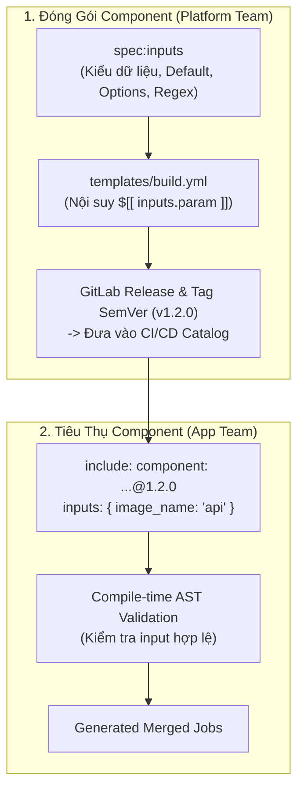
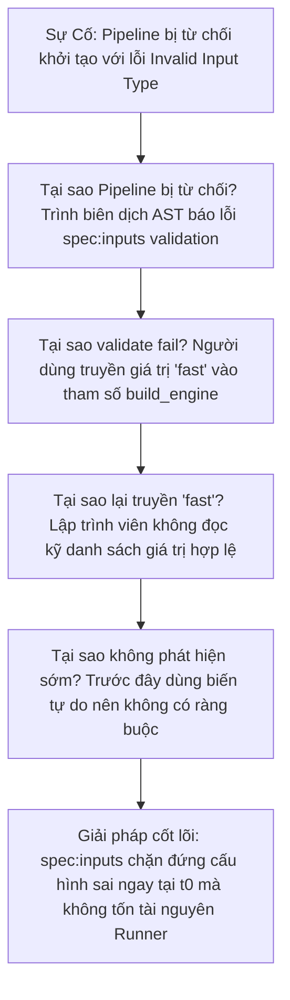


# [BÀI 11] HIỆN ĐẠI HÓA CI/CD VỚI GITLAB CI/CD COMPONENTS & CI/CD CATALOG

Trong kỷ nguyên **DevOps, DevSecOps và Cloud Native Engineering**, **GitLab CI/CD** được công nhận là một trong những nền tảng tự động hóa tích hợp liên tục và phân phối liên tục (CI/CD) hoàn chỉnh, mạnh mẽ và được tin dùng nhất trong các doanh nghiệp quy mô lớn. Không chỉ dừng lại ở các pipeline tuần tự cơ bản, việc vận hành GitLab CI/CD ở cấp độ Production đòi hỏi kỹ sư phải làm chủ kiến trúc điều phối phi tuyến tính **DAG (Directed Acyclic Graph)**, cơ chế quản trị **Autoscaling Runners**, tối ưu hóa **Caching đa tầng**, xác thực không khóa **Keyless OIDC**, bảo mật chuỗi cung ứng phần mềm **SLSA & SBOM** cùng các chính sách **Quality & Security Gates** tự động.

Bài viết chuyên sâu này sẽ đồng hành cùng bạn mổ xẻ toàn diện bức tranh kiến trúc, phân tích các đánh đổi kỹ thuật thực chiến (Engineering Trade-offs), cung cấp hướng dẫn thực hành Lab chi tiết từng bước và bộ câu hỏi phỏng vấn chuyên sâu chuẩn DevOps Lead / DevSecOps Architect.

---

## 1. Bản Chất Kiến Trúc & Cơ Chế Vận Hành Tầng Thấp

### 1.1. Luận Đề Trung Tâm: Bước Chuyển Mình Từ Include Sang Đóng Gói Hóa Component

Trước GitLab 16.0, việc tái sử dụng cấu hình CI/CD hoàn toàn dựa vào `include:project` kết hợp với `extends:` và biến toàn cục. Mô hình này bộc lộ 4 nhược điểm nghiêm trọng:
1. **Không có ràng buộc tham số (No Input Contract)**: Người dùng template không biết template cần những biến nào, kiểu dữ liệu gì nếu không mở mã nguồn ra đọc.
2. **Xung đột không gian tên biến (Global Variable Collision)**: Biến toàn cục từ template có thể vô tình ghi đè hoặc bị ghi đè bởi biến của dự án tiêu thụ.
3. **Không có kiểm tra hợp lệ kiểu dữ liệu tại thời điểm biên dịch (Compile-time Validation)**: Lỗi gõ sai tên biến chỉ bộc lộ khi script shell chạy thất bại ở runtime.
4. **Khó khăn trong phân phối và khám phá (Discovery & Versioning)**: Không có chợ trung tâm (Marketplace/Catalog) để tìm kiếm các template chuẩn mực trong công ty.

> **GitLab CI/CD Components biến các đoạn mã YAML rời rạc thành các đơn vị đóng gói độc lập (Lego Blocks) có giao diện hợp đồng tường minh (`spec:inputs`), kiểm tra kiểu dữ liệu tĩnh tại thời điểm biên dịch AST và được lập chỉ mục trên CI/CD Catalog toàn doanh nghiệp.**

```text
   TRUYỀN THỐNG (include:project)                HIỆN ĐẠI (GitLab CI/CD Components)
   
   ┌───────────────────────────────┐              ┌─────────────────────────────────────────┐
   │ .gitlab-ci.yml                │              │ .gitlab-ci.yml                          │
   │ variables:                    │              │ include:                                │
   │   DOCKER_IMAGE: "app:v1"      │ ──► Mù mờ   │   - component: $CI_SERVER_FQDN/org/     │
   │ include:                      │     không hợp│                docker-build@1.2.0       │
   │   - project: 'devops/tpl'     │     đồng     │     inputs:                             │
   │     file: 'docker.yml'        │              │       image_name: "my-app"              │
   │                               │              │       dockerfile: "Dockerfile.prod"     │
   │ └───────────────────────────────┘              └─────────────────────────────────────────┘
                                                               │ Kiểm tra kiểu dữ liệu
                                                               ▼ (Type / Options / Regex)
                                                  ┌─────────────────────────────────────────┐
                                                  │ Component Repository                    │
                                                  │ spec:                                   │
                                                  │   inputs:                               │
                                                  │     image_name:                         │
                                                  │       type: string                      │
                                                  │     dockerfile:                         │
                                                  │       type: string                      │
                                                  │       default: "Dockerfile"             │
                                                  └─────────────────────────────────────────┘
```



### 1.2. Cấu Trúc Khối `spec:inputs` & Các Kiểu Dữ Liệu Hỗ Trợ

Khối `spec:inputs` đặt ở đầu tệp template định nghĩa giao diện giao tiếp:

- **Các kiểu dữ liệu (`type`)**: `string`, `number`, `boolean`, `array`.
- **Ràng buộc kiểm tra**:
  - `default`: Giá trị mặc định nếu người dùng không truyền.
  - `description`: Mô tả tham số hiển thị trên giao diện Catalog.
  - `options`: Danh sách các giá trị hợp lệ cho phép (Enum Whitelist).
  - `regex`: Biểu thức chính quy kiểm tra định dạng chuỗi đầu vào.

### 1.3. Cơ Chế Nội Suy `$[[ inputs.name ]]` vs Biến Shell Môi Trường `$VAR`

Một điểm cốt lõi về mặt kỹ thuật:
- **`$[[ inputs.my_param ]]`**: Được trình biên dịch GitLab phân tích và thay thế trực tiếp vào cấu trúc cây cú pháp trừu tượng (AST) tại **thời điểm nạp cấu hình ($t_0$)** TRƯỚC KHI job được gửi xuống Runner.
- **`$VAR`**: Là biến môi trường POSIX shell được Runner export và đánh giá tại **thời điểm script chạy (Runtime)**.
- **Ý nghĩa an ninh**: Nội suy `$[[ inputs.name ]]` có thể dùng để sinh động tên Stage, tên Job, tên Image Docker hoặc cờ lệnh mà không sợ bị lỗ hổng Shell Script Injection do các ký tự đặc biệt gây ra.

### 1.4. Đóng Gói Component Repo & Xuất Bản Lên CI/CD Catalog

Cấu trúc thư mục chuẩn của một Component Repository:

```text
├── README.md                 # Tài liệu hướng dẫn sử dụng (Bắt buộc để hiện lên Catalog)
├── LICENSE.md                # Giấy phép
├── .gitlab-ci.yml            # Pipeline kiểm thử và release component
└── templates/
    ├── main.yml              # Component mặc định khi gọi component: org/repo@v1.0.0
    └── docker-build.yml      # Component phụ khi gọi component: org/repo/docker-build@v1.0.0
```

---

## 2. Bảng So Sánh Kỹ Thuật Toàn Diện (Engineering Matrix)

| Tiêu chí phân tích | Legacy Include Template | GitLab CI/CD Component | GitHub Actions Composite | Terraform Modules |
| :--- | :--- | :--- | :--- | :--- |
| **Giao diện tham số** | Không có (Dùng biến toàn cục) | **`spec:inputs` tường minh** | `inputs:` trong action.yml | `variable ""` blocks |
| **Kiểm tra kiểu dữ liệu** | ❌ Không hỗ trợ | ✅ `string`, `number`, `boolean`, `array` | ✅ `string`, `boolean`, `number` | ✅ Hỗ trợ type hệ thống phức tạp |
| **Kiểm tra Regex & Enum** | ❌ Không hỗ trợ | ✅ `options: [...]` và `regex:` | ❌ Cần tự validate bằng code | ✅ `validation {}` block |
| **Chợ quản lý tập trung** | ❌ Phải tự quản lý tài liệu | ✅ **GitLab CI/CD Catalog** | ✅ GitHub Marketplace | ✅ Terraform Registry |
| **Cơ chế nội suy** | Không có (Chỉ có env var) | **`$[[ inputs.param ]]` tại AST** | `${{ inputs.param }}` | `var.param` |
| **Bảo vệ đụng độ tên Job** | Thủ công (Dễ trùng tên) | Linh hoạt qua `job_prefix` | Đóng gói trong step | Đóng gói trong module namespace |
| **Quản lý phiên bản** | Branch / Tag tùy ý | **SemVer Release (Major.Minor.Patch)** | Git Tag / Release | SemVer Registry Version |

---

## 3. Kiến Trúc Triển Khai Chuẩn Production (Architecture Breakdown)

Dưới đây là mã nguồn của một CI/CD Component chuẩn mực dùng để đóng gói tác vụ **Docker Build & Push**, kiểm tra đầu vào nghiêm ngặt và xuất bản lên Catalog:

```yaml
# ==============================================================================
# TEMPLATE: templates/docker-build.yml
# Đóng gói Docker Build Component chuẩn Enterprise
# ==============================================================================
spec:
  inputs:
    stage:
      type: string
      default: "build"
      description: "Stage của pipeline để gắn Job Docker Build"
    image_name:
      type: string
      description: "Tên định danh của Docker Image (ví dụ: my-org/auth-api)"
    image_tag:
      type: string
      default: "$CI_COMMIT_SHORT_SHA"
      description: "Tag của image sau khi build"
    dockerfile_path:
      type: string
      default: "Dockerfile"
      description: "Đường dẫn tới tệp Dockerfile"
    push_to_registry:
      type: boolean
      default: true
      description: "Bật/Tắt đẩy image lên Container Registry"
    build_engine:
      type: string
      default: "kaniko"
      options: ["kaniko", "docker-dind", "buildah"]
      description: "Công nghệ engine biên dịch container image"
---
# ------------------------------------------------------------------------------
# NỘI DUNG JOB ĐƯỢC SINH TỰ ĐỘNG
# ------------------------------------------------------------------------------
"$[[ inputs.stage ]]-docker-build":
  stage: $[[ inputs.stage ]]
  image:
    name: gcr.io/kaniko-project/executor:v1.23.2-debug
    entrypoint: [""]
  rules:
    - if: '$CI_COMMIT_BRANCH'
  variables:
    KANIKO_CACHE: "true"
  script:
    - echo "=== [CI/CD Component] Building Docker Image ==="
    - echo "Target Image:  $[[ inputs.image_name ]]:$[[ inputs.image_tag ]]"
    - echo "Engine:        $[[ inputs.build_engine ]]"
    - echo "Dockerfile:    $[[ inputs.dockerfile_path ]]"
    # Tạo thư mục cấu hình auth cho Docker Registry
    - mkdir -p /kaniko/.docker
    - echo "{\"auths\":{\"$CI_REGISTRY\":{\"auth\":\"$(printf "%s:%s" "$CI_REGISTRY_USER" "$CI_REGISTRY_PASSWORD" | base64 | tr -d '\n')\"}}}" > /kaniko/.docker/config.json
    # Thực thi lệnh Kaniko biên dịch không cần quyền root daemon
    - |
      if [ "$[[ inputs.push_to_registry ]]" = "true" ]; then
        /kaniko/executor \
          --context "${CI_PROJECT_DIR}" \
          --dockerfile "${CI_PROJECT_DIR}/$[[ inputs.dockerfile_path ]]" \
          --destination "$CI_REGISTRY_IMAGE/$[[ inputs.image_name ]]:$[[ inputs.image_tag ]]" \
          --cache=$KANIKO_CACHE
      else
        /kaniko/executor \
          --context "${CI_PROJECT_DIR}" \
          --dockerfile "${CI_PROJECT_DIR}/$[[ inputs.dockerfile_path ]]" \
          --no-push
      fi
```

### Cách tiêu thụ Component từ tệp `.gitlab-ci.yml` của ứng dụng:

```yaml
stages:
  - compile
  - package
  - deploy

include:
  - component: '$CI_SERVER_FQDN/platform-components/container-tools/docker-build@1.3.0'
    inputs:
      stage: package
      image_name: "core-banking-service"
      dockerfile_path: "deploy/Dockerfile.production"
      build_engine: "kaniko"
      push_to_registry: true
```

---

## 4. Phân Tích Cạm Bẫy Thực Chiến (5-Whys Incident Analysis)



### Tình Huống Sự Cố Thực Tế:
<span class="badge badge--rose">🕒 03:15 AM</span> Trong đợt phát hành khẩn cấp phiên bản mới, pipeline của dịch vụ thanh toán bị từ chối tạo ngay lập tức với lỗi `inputs:build_engine: value 'fast' is not in options list`.

### Hậu Quả & Log Lỗi Thực Tế:
GitLab không sinh ra bất kỳ job nào và báo lỗi cú pháp ngay trên giao diện Merge Request:

```text
Status: Failed to create pipeline
Error: Included component '$CI_SERVER_FQDN/platform-components/container-tools/docker-build@1.3.0' validation failed:
- input 'build_engine': value 'fast' is not allowed. Valid options: ['kaniko', 'docker-dind', 'buildah']
```

### 5-Whys Root Cause Analysis:
1. <span class="badge badge--primary">Why 1</span> **Tại sao pipeline không được tạo?** Trình phân giải AST của GitLab phát hiện input `build_engine` nhận giá trị không hợp lệ so với schema đã định nghĩa.
2. <span class="badge badge--primary">Why 2</span> **Tại sao lập trình viên lại cấu hình `build_engine: "fast"`?** Kỹ sư dự án nhầm lẫn giữa tham số của component mới với biến môi trường cũ tự tạo trước đây (`FAST_BUILD=true`).
3. <span class="badge badge--primary">Why 3</span> **Tại sao không có cảnh báo trước runtime?** Trước đây, các template kiểu cũ chỉ dùng biến toàn cục không có schema, dẫn đến việc gõ sai biến vẫn chạy và âm thầm dùng giá trị fallback hoặc lỗi ở runtime sau 10 phút chạy.
4. <span class="badge badge--primary">Why 4</span> **Tại sao lỗi bị chặn ngay tại thời điểm submit MR?** Tính năng Component với `spec:inputs` thực hiện thẩm định kiểu dữ liệu tĩnh tại thời điểm nạp cú pháp ($t_0$).
5. <span class="badge badge--emerald">Root Cause Remedy</span> **Giải pháp triệt để:** Sửa cấu hình `build_engine: "kaniko"` theo đúng hợp đồng của Component; sử dụng CI/CD Catalog README làm tài liệu tra cứu hợp đồng tham số chuẩn cho toàn bộ team.

### Phân Tích 5 Cạm Bẫy Phổ Biến Nhất:

#### Cạm bẫy 1: Xung đột tên Job khi gọi một Component nhiều lần
- **Hiện tượng**: Khi gọi component `docker-build` 2 lần (cho backend và frontend), pipeline chỉ hiển thị 1 job duy nhất và đè cấu hình của nhau.
- **Nguyên nhân tầng sâu**: Tên Job trong component bị đặt tĩnh `build-job:`. Khi nạp nhiều lần, Job thứ hai ghi đè Job thứ nhất trong AST.
- **Cách gỡ rối**: Đặt tên Job động theo tham số đầu vào: `"$[[ inputs.job_prefix ]]-build":`.

#### Cạm bẫy 2: Nhầm lẫn giữa nội suy `$[[ inputs.var ]]` và biến Shell `$VAR`
- **Hiện tượng**: Truyền `image_tag: "$CI_COMMIT_SHORT_SHA"` nhưng khi Kaniko chạy lại build ra tag mang đúng chuỗi chữ `$CI_COMMIT_SHORT_SHA` thay vì mã SHA thật.
- **Nguyên nhân**: `$[[ inputs.image_tag ]]` được phân giải tĩnh tại AST trước khi biến môi trường của Runner được thiết lập.
- **Biện pháp**: Nếu muốn đọc biến môi trường tại runtime trong shell, hãy để script tham chiếu `$CI_COMMIT_SHORT_SHA` thay vì bọc qua inputs tĩnh.

#### Cạm bẫy 3: Phát hành Component mới gây gãy pipeline vì thiếu cờ Major SemVer
- **Hiện tượng**: Tác giả component đổi tên tham số `dockerfile` thành `dockerfile_path` và tag bản `1.0.1` (Patch version). Toàn bộ các dự án dùng `@~latest` hoặc `@1` bị đứt pipeline đồng loạt.
- **Nguyên nhân**: Thay đổi phá vỡ tương thích ngược (Breaking Change) bắt buộc phải nâng cấp **Major Version (`2.0.0`)**.
- **Biện pháp**: Áp dụng quy chuẩn Semantic Versioning nghiêm ngặt và Semantic Release tự động.

#### Cạm bẫy 4: Component không hiển thị trên CI/CD Catalog
- **Hiện tượng**: Đã tạo repository và tạo Release tag thành công nhưng mở mục Explore CI/CD Catalog lại không thấy Component xuất hiện.
- **Nguyên nhân**: Repository chưa được bật cờ **CI/CD Catalog Resource** trong mục Settings > General, hoặc tệp `README.md` bị thiếu/rỗng.
- **Biện pháp**: Bật thiết lập Catalog Resource và đảm bảo README có đầy đủ hướng dẫn sử dụng.

#### Cạm bẫy 5: Lỗi cú pháp khi truyền giá trị Boolean dạng chuỗi
- **Hiện tượng**: Khai báo `push_to_registry: "false"` nhưng điều kiện if trong script vẫn nhận là `true`.
- **Nguyên nhân**: Kiểu dữ liệu khai báo là `boolean` nhưng người dùng truyền chuỗi string `"false"`.
- **Biện pháp**: Truyền giá trị boolean thuần túy `push_to_registry: false` (không có dấu ngoặc kép) hoặc kiểm tra regex chuẩn.

---

## 5. Hands-on Lab: Xây Dựng & Phát Hành CI/CD Components Lên Catalog (8 Bước Chuẩn)

```text
   ┌────────────────────────────────────────────────────────────────────────┐
   │                  LAB ARCHITECTURE: CI/CD COMPONENTS                    │
   ├────────────────────────────────────────────────────────────────────────┤
   │                                                                        │
   │  [ Bước 1: Khởi Tạo Component Repository & Cấu Trúc Thư Mục ]          │
   │  Thiết lập repo component với cấu trúc templates/ chuẩn mực            │
   │                         │                                              │
   │                         ▼                                              │
   │  [ Bước 2: Định Nghĩa Giao Diện spec:inputs ]                          │
   │  Khai báo tham số với kiểu dữ liệu, default, options và regex          │
   │                         │                                              │
   │                         ▼                                              │
   │  [ Bước 3: Viết Nội Dung Template Với Nội Suy $[[ inputs ]] ]          │
   │  Sinh động tên job và câu lệnh an toàn                                 │
   │                         │                                              │
   │                         ▼                                              │
   │  [ Bước 4: Xây Dựng Pipeline Tự Kiểm Thử Component ]                   │
   │  Viết test pipeline nội bộ kiểm tra component trước khi publish        │
   │                         │                                              │
   │                         ▼                                              │
   │  [ Bước 5: Đóng Gói Release & Xuất Bản Lên CI/CD Catalog ]             │
   │  Tạo Git Tag SemVer v1.0.0 và xuất bản Catalog Resource                │
   │                         │                                              │
   │                         ▼                                              │
   │  [ Bước 6: Tiêu Thụ Component Từ Dự Án Ứng Dụng ]                      │
   │  Gọi component qua cú pháp include: component: ...@1.0.0               │
   │                         │                                              │
   │                         ▼                                              │
   │  [ Bước 7: Kiểm Chứng Tính Năng Fail-Fast Validation ]                 │
   │  Thử nghiệm truyền sai kiểu dữ liệu và quan sát lỗi AST                │
   │                         │                                              │
   │                         ▼                                              │
   │  [ Bước 8: Dọn Dẹp Tài Nguyên & Tổng Kết Kiến Trúc ]                   │
   │  Đo lường độ ổn định và khả năng tái sử dụng toàn tổ chức              │
   │                                                                        │
   └────────────────────────────────────────────────────────────────────────┘
```

### Bước 1: Khởi Tạo Component Repository & Cấu Trúc Thư Mục
Tạo repository mới `security-tools` và cấu trúc thư mục template chuẩn.

```bash
mkdir -p templates/
echo "# Security Tools CI/CD Components" > README.md
```

> **Checkpoint 1**: Đảm bảo tệp `README.md` tồn tại để đáp ứng điều kiện xuất bản lên Catalog.

### Bước 2: Định Nghĩa Giao Diện `spec:inputs`
Tạo tệp `templates/trivy-scan.yml` với giao diện tham số chặt chẽ:

```yaml
spec:
  inputs:
    stage:
      type: string
      default: "test"
    severity_level:
      type: string
      default: "HIGH,CRITICAL"
      options: ["LOW", "MEDIUM", "HIGH", "CRITICAL", "HIGH,CRITICAL"]
    exit_code_on_failure:
      type: number
      default: 1
---
```

> **Checkpoint 2**: Khối `spec:inputs` định nghĩa rõ ràng 3 tham số với kiểu dữ liệu và danh sách options hợp lệ.

### Bước 3: Viết Nội Dung Template Với Nội Suy `$[[ inputs ]]`
Nối tiếp nội dung job thực thi vào tệp `templates/trivy-scan.yml`:

```yaml
"trivy-vulnerability-scan":
  stage: $[[ inputs.stage ]]
  image:
    name: aquasec/trivy:0.55.0
    entrypoint: [""]
  script:
    - echo "=== Running Trivy Security Scan ==="
    - echo "Scanning Repository with Severity: $[[ inputs.severity_level ]]"
    - trivy fs --severity "$[[ inputs.severity_level ]]" --exit-code $[[ inputs.exit_code_on_failure ]] .
```

> **Checkpoint 3**: Các tham số được nội suy an toàn bằng cú pháp `$[[ inputs.name ]]`.

### Bước 4: Xây Dựng Pipeline Tự Kiểm Thử Component
Tạo tệp `.gitlab-ci.yml` bên trong repo component để tự test chính nó trước khi release:

```yaml
stages:
  - test
  - release
```

```yaml
include:
  - local: 'templates/trivy-scan.yml'
    inputs:
      stage: test
      severity_level: "HIGH,CRITICAL"
      exit_code_on_failure: 0 # Cho phép pass để kiểm thử

test-component-syntax:
  stage: test
  image: alpine:3.20
  script:
    - echo "Component self-test completed successfully!"
```

> **Checkpoint 4**: Push code lên repo component, pipeline chạy xanh xác nhận component hoạt động chính xác.

### Bước 5: Đóng Gói Release & Xuất Bản Lên CI/CD Catalog
Tạo Release với Git Tag `1.0.0` để kích hoạt lập chỉ mục trên Catalog:

```bash
# Tạo Git Tag phiên bản SemVer 1.0.0
git tag -a 1.0.0 -m "Release version 1.0.0 of Trivy Scan Component"
git push origin 1.0.0
```

Tạo GitLab Release qua API hoặc giao diện Web.

> **Checkpoint 5**: Truy cập menu **Explore > CI/CD Catalog** trên GitLab, component `security-tools` xuất hiện với phiên bản `1.0.0`.

### Bước 6: Tiêu Thụ Component Từ Dự Án Ứng Dụng
Mở một repository ứng dụng khác và cấu hình `.gitlab-ci.yml`:

```yaml
stages:
  - test
  - build

include:
  - component: '$CI_SERVER_FQDN/devops/security-tools/trivy-scan@1.0.0'
    inputs:
      stage: test
      severity_level: "CRITICAL"
      exit_code_on_failure: 1
```

> **Checkpoint 6**: Pipeline của dự án ứng dụng nạp thành công component và thực thi job quét bảo mật.

### Bước 7: Kiểm Chứng Tính Năng Fail-Fast Validation
Thử nghiệm truyền tham số sai `severity_level: "SUPER_HIGH"` không nằm trong danh sách `options`.

> **Checkpoint 7**: GitLab từ chối khởi tạo pipeline ngay lập tức với thông báo lỗi: `Input 'severity_level' value 'SUPER_HIGH' is not allowed in options`. Không có tài nguyên Runner nào bị lãng phí.

### Bước 8: Dọn Dẹp Tài Nguyên & Tổng Kết Kiến Trúc
Xóa các tag thử nghiệm và tổng hợp tài liệu Component Catalog.

```bash
echo "CI/CD Component architecture and Catalog publishing verified 100%."
```

> **Checkpoint 8**: Doanh nghiệp đã thiết lập thành công hệ thống chia sẻ component chuẩn Platform Engineering.

---

## 6. Bộ Câu Hỏi Vấn Đáp & Phỏng Vấn Chuyên Sâu (Self-Check Q&A)

<details class="qa-card">
  <summary class="qa-summary">
    <span class="qa-num-badge">Q01</span>
    <span>GitLab CI/CD Components là gì và giải quyết những nhược điểm cố hữu nào của cơ chế include/extends truyền thống?</span>
  </summary>
  <div class="qa-answer">
    <div class="qa-answer-header">
      <svg class="qa-icon" viewBox="0 0 24 24" fill="none" stroke="currentColor" stroke-width="2" stroke-linecap="round" stroke-linejoin="round"><polyline points="20 6 9 17 4 12"></polyline></svg>
      <span>Phân Tích &amp; Lời Giải Kỹ Thuật</span>
    </div>
    <p><strong>GitLab CI/CD Components</strong> là các khối cấu hình CI/CD đóng gói có thể tái sử dụng, được định nghĩa với giao diện tham số đầu vào tường minh (<code>spec:inputs</code>) và được quản lý phiên bản theo chuẩn Semantic Versioning trên <strong>CI/CD Catalog</strong>.</p>
    <p><strong>Nhược điểm giải quyết</strong>:</p>
    <ul>
      <li>Xóa bỏ sự phụ thuộc vào biến môi trường toàn cục mù mờ; thay thế bằng hợp đồng tham số có kiểm tra kiểu dữ liệu (Type-safety).</li>
      <li>Bắt lỗi cấu hình sai ngay tại thời điểm phân tích cú pháp AST ($t_0$) thay vì chờ script chạy lỗi ở runtime.</li>
      <li>Cung cấp chợ tập trung (Catalog) giúp tìm kiếm, đánh giá và chia sẻ template trong toàn doanh nghiệp.</li>
    </ul>
  </div>
</details>

<details class="qa-card">
  <summary class="qa-summary">
    <span class="qa-num-badge">Q02</span>
    <span>Phân biệt bản chất giữa cú pháp nội suy $[[ inputs.param ]] và biến môi trường shell thông thường $PARAM.</span>
  </summary>
  <div class="qa-answer">
    <div class="qa-answer-header">
      <svg class="qa-icon" viewBox="0 0 24 24" fill="none" stroke="currentColor" stroke-width="2" stroke-linecap="round" stroke-linejoin="round"><polyline points="20 6 9 17 4 12"></polyline></svg>
      <span>Phân Tích &amp; Lời Giải Kỹ Thuật</span>
    </div>
    <p><strong><code>$[[ inputs.param ]]</code> (Interpolation tại compile-time)</strong>:</p>
    <ul>
      <li>Được phân giải và thay thế tĩnh trực tiếp vào cây cú pháp YAML (AST) tại Server GitLab tại thời điểm $t_0$.</li>
      <li>Có thể dùng để thay đổi cấu trúc của Pipeline: Đặt tên động cho Job, chọn Image, gán Stage, bật/tắt Rules.</li>
    </ul>
    <p><strong><code>$PARAM</code> (Environment variable tại runtime)</strong>:</p>
    <ul>
      <li>Là biến shell được Runner nạp vào môi trường container khi tiến trình bắt đầu chạy.</li>
      <li>Chỉ có giá trị bên trong các lệnh <code>before_script</code>, <code>script</code>, <code>after_script</code>.</li>
    </ul>
  </div>
</details>

<details class="qa-card">
  <summary class="qa-summary">
    <span class="qa-num-badge">Q03</span>
    <span>Khối <code>spec:inputs</code> hỗ trợ những kiểu dữ liệu (types) nào và các thuộc tính ràng buộc kiểm tra hợp lệ nào?</span>
  </summary>
  <div class="qa-answer">
    <div class="qa-answer-header">
      <svg class="qa-icon" viewBox="0 0 24 24" fill="none" stroke="currentColor" stroke-width="2" stroke-linecap="round" stroke-linejoin="round"><polyline points="20 6 9 17 4 12"></polyline></svg>
      <span>Phân Tích &amp; Lời Giải Kỹ Thuật</span>
    </div>
    <p><strong>Các kiểu dữ liệu hỗ trợ</strong>: <code>string</code>, <code>number</code>, <code>boolean</code>, <code>array</code>.</p>
    <p><strong>Các thuộc tính ràng buộc</strong>:</p>
    <ul>
      <li><code>default</code>: Giá trị mặc định khi người dùng không truyền input.</li>
      <li><code>description</code>: Mô tả chức năng của input.</li>
      <li><code>options</code>: Danh sách mảng các giá trị hợp lệ được phép truyền (Whitelist Enum).</li>
      <li><code>regex</code>: Biểu thức chính quy kiểm tra định dạng chuỗi (Pattern Matching).</li>
    </ul>
  </div>
</details>

<details class="qa-card">
  <summary class="qa-summary">
    <span class="qa-num-badge">Q04</span>
    <span>Làm thế nào để xuất bản (Publish) một repository Component lên Enterprise CI/CD Catalog?</span>
  </summary>
  <div class="qa-answer">
    <div class="qa-answer-header">
      <svg class="qa-icon" viewBox="0 0 24 24" fill="none" stroke="currentColor" stroke-width="2" stroke-linecap="round" stroke-linejoin="round"><polyline points="20 6 9 17 4 12"></polyline></svg>
      <span>Phân Tích &amp; Lời Giải Kỹ Thuật</span>
    </div>
    <p><strong>Quy trình 3 bước xuất bản</strong>:</p>
    <ol>
      <li><strong>Cấu trúc chuẩn</strong>: Repository phải chứa tệp <code>README.md</code> mô tả và thư mục <code>templates/</code> chứa các tệp component YAML.</li>
      <li><strong>Bật Catalog Flag</strong>: Vào <em>Settings > General > Visibility, project features, permissions</em> > Bật tính năng <strong>CI/CD Catalog resource</strong>.</li>
      <li><strong>Tạo Release với Git Tag</strong>: Tạo một GitLab Release chính thức gắn với một Git Tag tuân thủ chuẩn <strong>Semantic Versioning (ví dụ: <code>1.0.0</code>)</strong>. GitLab sẽ tự động lập chỉ mục và đưa Component lên trang Catalog.</li>
    </ol>
  </div>
</details>

<details class="qa-card">
  <summary class="qa-summary">
    <span class="qa-num-badge">Q05</span>
    <span>Làm thế nào để tránh xung đột tên Job khi một dự án nạp cùng một Component nhiều lần với các bộ inputs khác nhau?</span>
  </summary>
  <div class="qa-answer">
    <div class="qa-answer-header">
      <svg class="qa-icon" viewBox="0 0 24 24" fill="none" stroke="currentColor" stroke-width="2" stroke-linecap="round" stroke-linejoin="round"><polyline points="20 6 9 17 4 12"></polyline></svg>
      <span>Phân Tích &amp; Lời Giải Kỹ Thuật</span>
    </div>
    <p><strong>Giải pháp</strong>: Tác giả Component phải thiết kế tên Job động bằng cách sử dụng nội suy <code>inputs</code>, thường là thêm tham số <code>job_prefix</code> hoặc kết hợp tên môi trường:</p>
    <div class="language-yaml highlighter-rouge"><pre class="highlight"><code><span class="s">"$[[ inputs.job_prefix ]]-deploy"</span><span class="pi">:</span>
  <span class="na">stage</span><span class="pi">:</span> <span class="s">$[[ inputs.stage ]]</span>
  <span class="na">script</span><span class="pi">:</span> <span class="pi">[</span><span class="s">deploy.sh</span><span class="pi">]</span>
</code></pre></div>
    <p>Khi người dùng gọi 2 lần với <code>job_prefix: auth</code> và <code>job_prefix: payment</code>, hai job riêng biệt <code>auth-deploy</code> và <code>payment-deploy</code> sẽ được tạo ra mà không bị ghi đè.</p>
  </div>
</details>

<details class="qa-card">
  <summary class="qa-summary">
    <span class="qa-num-badge">Q06</span>
    <span>Sự khác nhau giữa việc tham chiếu phiên bản `@~latest`, `@1`, `@1.2` và `@1.2.3` khi sử dụng Component là gì?</span>
  </summary>
  <div class="qa-answer">
    <div class="qa-answer-header">
      <svg class="qa-icon" viewBox="0 0 24 24" fill="none" stroke="currentColor" stroke-width="2" stroke-linecap="round" stroke-linejoin="round"><polyline points="20 6 9 17 4 12"></polyline></svg>
      <span>Phân Tích &amp; Lời Giải Kỹ Thuật</span>
    </div>
    <p><strong>Ý nghĩa các cú pháp tham chiếu</strong>:</p>
    <ul>
      <li><code>@1.2.3</code> (Full Pinning): Cố định chính xác bản vá (Patch level), an toàn nhất, 0% rủi ro thay đổi ngoài ý muốn.</li>
      <li><code>@1.2</code>: Tự động nhận bản vá mới nhất của nhánh Minor 1.2 (ví dụ 1.2.4).</li>
      <li><code>@1</code>: Tự động nhận bản Minor/Patch mới nhất thuộc Major 1 (ví dụ 1.5.0), tự động nhận tính năng mới không có breaking change.</li>
      <li><code>@~latest</code>: Luôn trỏ tới phiên bản Release mới nhất trên Catalog. Rủi ro cao nhất vì có thể bị dính Breaking Changes khi component lên Major version mới.</li>
    </ul>
  </div>
</details>

<details class="qa-card">
  <summary class="qa-summary">
    <span class="qa-num-badge">Q07</span>
    <span>Một Component có thể tiếp tục nạp (include) một Component khác lồng nhau không?</span>
  </summary>
  <div class="qa-answer">
    <div class="qa-answer-header">
      <svg class="qa-icon" viewBox="0 0 24 24" fill="none" stroke="currentColor" stroke-width="2" stroke-linecap="round" stroke-linejoin="round"><polyline points="20 6 9 17 4 12"></polyline></svg>
      <span>Phân Tích &amp; Lời Giải Kỹ Thuật</span>
    </div>
    <p><strong>CÓ THỂ</strong>. GitLab hỗ trợ <strong>Nested Components (Component lồng nhau)</strong>. Một Component cha có thể sử dụng từ khóa <code>include: component: ...</code> để nạp các Sub-components con và chuyển tiếp các giá trị <code>inputs</code> tương ứng xuống dưới.</p>
    <p>Quy tắc này giúp xây dựng các bộ giải pháp phức hợp (như Full DevSecOps Pipeline Component bao gồm Lint + Build + Test + Scan + Deploy).</p>
  </div>
</details>

<details class="qa-card">
  <summary class="qa-summary">
    <span class="qa-num-badge">Q08</span>
    <span>Làm thế nào để viết kịch bản kiểm thử tự động (Unit Test / Integration Test) cho chính một CI/CD Component trước khi Release?</span>
  </summary>
  <div class="qa-answer">
    <div class="qa-answer-header">
      <svg class="qa-icon" viewBox="0 0 24 24" fill="none" stroke="currentColor" stroke-width="2" stroke-linecap="round" stroke-linejoin="round"><polyline points="20 6 9 17 4 12"></polyline></svg>
      <span>Phân Tích &amp; Lời Giải Kỹ Thuật</span>
    </div>
    <p>Bên trong repository của Component, tạo tệp <code>.gitlab-ci.yml</code> thực hiện 2 giai đoạn:</p>
    <ol>
      <li><strong>Test Stage</strong>: Nạp chính các template trong thư mục <code>templates/</code> bằng <code>include: local</code> với nhiều bộ test cases khác nhau (test input mặc định, test override options, test edge cases).</li>
      <li><strong>Release Stage</strong>: Sử dụng job chạy công cụ <code>release-cli</code> để tự động tạo Git Tag và GitLab Release khi merge vào nhánh chính sau khi các bài test đều pass.</li>
    </ol>
  </div>
</details>

<details class="qa-card">
  <summary class="qa-summary">
    <span class="qa-num-badge">Q09</span>
    <span>Khi nào nên đóng gói Component thành nhiều tệp (Multi-file Component) trong thư mục `templates/`?</span>
  </summary>
  <div class="qa-answer">
    <div class="qa-answer-header">
      <svg class="qa-icon" viewBox="0 0 24 24" fill="none" stroke="currentColor" stroke-width="2" stroke-linecap="round" stroke-linejoin="round"><polyline points="20 6 9 17 4 12"></polyline></svg>
      <span>Phân Tích &amp; Lời Giải Kỹ Thuật</span>
    </div>
    <p>Nên tách thành <strong>Multi-file Components</strong> khi một repository quản lý một nhóm các công cụ có liên quan chặt chẽ nhưng người dùng có thể muốn sử dụng riêng lẻ từng phần (ví dụ repo <code>cloud-tools</code>):</p>
    <ul>
      <li><code>templates/aws-deploy.yml</code> (gọi qua <code>component: org/cloud-tools/aws-deploy@1.0.0</code>)</li>
      <li><code>templates/gcp-deploy.yml</code> (gọi qua <code>component: org/cloud-tools/gcp-deploy@1.0.0</code>)</li>
      <li><code>templates/azure-deploy.yml</code> (gọi qua <code>component: org/cloud-tools/azure-deploy@1.0.0</code>)</li>
      <li><code>templates/main.yml</code> (nạp toàn bộ cả 3 tool nếu muốn)</li>
    </ul>
  </div>
</details>

<details class="qa-card">
  <summary class="qa-summary">
    <span class="qa-num-badge">Q10</span>
    <span>Tại sao nói cơ chế nội suy $[[ inputs ]] giúp loại bỏ hoàn toàn nguy cơ Shell Injection trong CI/CD Pipeline?</span>
  </summary>
  <div class="qa-answer">
    <div class="qa-answer-header">
      <svg class="qa-icon" viewBox="0 0 24 24" fill="none" stroke="currentColor" stroke-width="2" stroke-linecap="round" stroke-linejoin="round"><polyline points="20 6 9 17 4 12"></polyline></svg>
      <span>Phân Tích &amp; Lời Giải Kỹ Thuật</span>
    </div>
    <p>Trong cách làm cũ, nếu nối chuỗi tham số qua biến môi trường để chạy lệnh: <code>eval "build.sh $USER_INPUT"</code>, attacker có thể truyền <code>USER_INPUT="test; rm -rf /"</code> để thực thi mã độc.</p>
    <p>Với CI/CD Components, <code>$[[ inputs.param ]]</code> được xử lý ở tầng AST Parser với kiểm tra kiểu dữ liệu tĩnh (Regex/Options). Nếu input chứa ký tự nguy hiểm không khớp Regex, pipeline bị hủy ngay lập tức tại $t_0$ trước khi bất kỳ shell process nào được khởi tạo trên Runner.</p>
  </div>
</details>

<details class="qa-card">
  <summary class="qa-summary">
    <span class="qa-num-badge">Q11</span>
    <span>Làm thế nào để thiết lập phân quyền truy cập (Access Control) cho CI/CD Catalog trong môi trường Private Enterprise?</span>
  </summary>
  <div class="qa-answer">
    <div class="qa-answer-header">
      <svg class="qa-icon" viewBox="0 0 24 24" fill="none" stroke="currentColor" stroke-width="2" stroke-linecap="round" stroke-linejoin="round"><polyline points="20 6 9 17 4 12"></polyline></svg>
      <span>Phân Tích &amp; Lời Giải Kỹ Thuật</span>
    </div>
    <p><strong>Phân quyền Catalog</strong> tuân theo cấu trúc phân quyền của GitLab Project:</p>
    <ul>
      <li>Nếu dự án Component được đặt ở mức <strong>Internal</strong>: Toàn bộ nhân viên đăng nhập trong cụm GitLab đều có thể duyệt Catalog và sử dụng Component.</li>
      <li>Nếu dự án Component đặt ở mức <strong>Private</strong>: Chỉ các thành viên thuộc Group/Project chứa component mới có thể nhìn thấy và sử dụng.</li>
      <li>Quản trị viên có thể ghim các Component chính thức (Verified Components) lên đầu Catalog của tổ chức.</li>
    </ul>
  </div>
</details>

<details class="qa-card">
  <summary class="qa-summary">
    <span class="qa-num-badge">Q12</span>
    <span>Trình bày quy trình chuyển đổi một hệ thống CI/CD Doanh nghiệp từ Legacy Templates sang CI/CD Components Catalog theo chuẩn Platform Engineering.</span>
  </summary>
  <div class="qa-answer">
    <div class="qa-answer-header">
      <svg class="qa-icon" viewBox="0 0 24 24" fill="none" stroke="currentColor" stroke-width="2" stroke-linecap="round" stroke-linejoin="round"><polyline points="20 6 9 17 4 12"></polyline></svg>
      <span>Phân Tích &amp; Lời Giải Kỹ Thuật</span>
    </div>
    <p><strong>Lộ trình chuyển đổi 4 giai đoạn chuẩn Enterprise:</strong></p>
    <ol>
      <li><strong>Audit &amp; Standardize</strong>: Rà soát toàn bộ các tệp <code>.gitlab-ci.yml</code> di sản, gom nhóm các tác vụ lặp lại (Docker, SAST, Deploy K8s, Notify).</li>
      <li><strong>Author &amp; Validate</strong>: Xây dựng các Component Repository riêng biệt, định nghĩa tường minh <code>spec:inputs</code> có type và regex ràng buộc, viết Unit Test kiểm thử component.</li>
      <li><strong>Publish to Catalog</strong>: Tạo Tag SemVer <code>v1.0.0</code> và xuất bản lên Private CI/CD Catalog kèm tài liệu README chi tiết.</li>
      <li><strong>Migration &amp; Deprecation</strong>: Hướng dẫn các App Team đổi từ <code>include:project</code> sang <code>include:component</code> với SemVer ghim (<code>@1.0.0</code>), đặt lịch vô hiệu hóa các template cũ sau 6 tháng.</li>
    </ol>
  </div>
</details>

---

## 7. Tổng Kết & Lộ Trình Bài Học Tiếp Theo

### 7.1. Tóm Tắt Các Điểm Cốt Lõi (Key Takeaways)

```text
                            GITLAB CI/CD COMPONENTS & CATALOG
                                           │
     ┌───────────────────┬─────────────────┴─────────────────┬───────────────────┐
     ▼                   ▼                                   ▼                   ▼
[ SPEC:INPUTS ]     [ $[[ INPUTS ]] AST ]             [ SEMVER RELEASES ] [ CI/CD CATALOG ]
Ràng buộc tham số   Nội suy compile-time              Ghim @1.2.0 cố định Chợ chia sẻ tập trung
Type, Options, Regex Chống Shell Injection             Không dùng @~latest Platform Engineering
Fail-fast tại t0    Sinh động tên Job/Stage           Tránh Breaking change Chuẩn mực Enterprise
```

- **Chuẩn hóa hợp đồng tham số**: Sử dụng `spec:inputs` để biến CI/CD thành các module có kiểu dữ liệu rõ ràng, loại bỏ hoàn toàn các lỗi biến rỗng ở runtime.
- **Quản lý phiên bản chặt chẽ**: Xuất bản Component với SemVer Tag và ghim phiên bản cụ thể ở dự án tiêu thụ để duy trì sự ổn định tuyệt đối.
- **Xây dựng Platform Engineering**: Tận dụng CI/CD Catalog để biến hạ tầng DevOps thành dịch vụ tự phục vụ (Self-service Platform) cho toàn bộ lập trình viên.

### 7.2. Lộ Trình Bài Học Tiếp Theo

Ở bài học tiếp theo, chúng ta sẽ làm chủ các quy trình kiểm thử trước khi merge code vào nhánh chính: **Merge Request Pipelines**, **Merged Results Pipelines** và **Merge Trains** để đảm bảo nhánh `main` luôn luôn xanh 100%.

> [!TIP]
> **Khám phá bài học tiếp theo**: [Bài 12: Merge Request Pipelines, Merge Trains & Chiến Lược Kiểm Thử Trước Merge](gitlab-12-12-mr-pipeline-va-merge-train.html)

