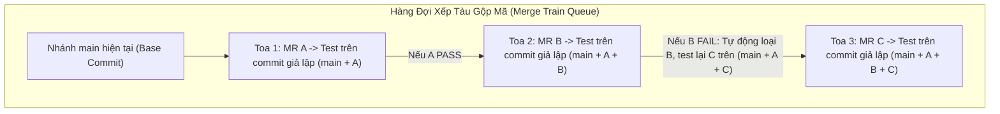
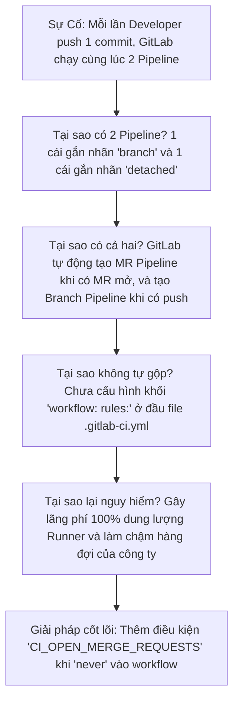


# [BÀI 12] MERGE REQUEST PIPELINES, MERGE TRAINS & CHIẾN LƯỢC KIỂM THỬ TRƯỚC MERGE

Trong kỷ nguyên **DevOps, DevSecOps và Cloud Native Engineering**, **GitLab CI/CD** được công nhận là một trong những nền tảng tự động hóa tích hợp liên tục và phân phối liên tục (CI/CD) hoàn chỉnh, mạnh mẽ và được tin dùng nhất trong các doanh nghiệp quy mô lớn. Không chỉ dừng lại ở các pipeline tuần tự cơ bản, việc vận hành GitLab CI/CD ở cấp độ Production đòi hỏi kỹ sư phải làm chủ kiến trúc điều phối phi tuyến tính **DAG (Directed Acyclic Graph)**, cơ chế quản trị **Autoscaling Runners**, tối ưu hóa **Caching đa tầng**, xác thực không khóa **Keyless OIDC**, bảo mật chuỗi cung ứng phần mềm **SLSA & SBOM** cùng các chính sách **Quality & Security Gates** tự động.

Bài viết chuyên sâu này sẽ đồng hành cùng bạn mổ xẻ toàn diện bức tranh kiến trúc, phân tích các đánh đổi kỹ thuật thực chiến (Engineering Trade-offs), cung cấp hướng dẫn thực hành Lab chi tiết từng bước và bộ câu hỏi phỏng vấn chuyên sâu chuẩn DevOps Lead / DevSecOps Architect.

---

## 1. Bản Chất Kiến Trúc & Cơ Chế Vận Hành Tầng Thấp

### 1.1. Luận Đề Trung Tâm: Nghịch Lý Xung Đột Ngữ Nghĩa & Nhánh Main Bị Đỏ

Một trong những vấn đề gây đau đầu nhất trong các tổ chức có từ 20 lập trình viên cùng làm việc trên một repository là hiện tượng: **"Cả hai Merge Request (MR A và MR B) khi chạy kiểm thử độc lập đều có kết quả XANH (Green), nhưng khi lần lượt merge vào nhánh `main`, nhánh `main` lập tức bị ĐỎ (Broken Build)"**.

Nguyên nhân gốc rễ là **Xung đột ngữ nghĩa (Semantic Conflict)**:
- MR A xóa hoặc đổi tên một hàm trong module A (Code của A test độc lập vẫn đúng).
- MR B thêm một tính năng mới gọi hàm đó trong module B (Code của B tạo nhánh từ `main` cũ nên vẫn thấy hàm đó và test pass).
- Khi cả hai được merge vào `main`, Git Merge thành công về mặt cú pháp văn bản (không có text conflict), nhưng khi biên dịch, chương trình bị lỗi thiếu hàm &rarr; Hệ thống CI trên `main` bị gãy!

> **Kiểm thử trên nhánh tính năng đơn lẻ (Branch Pipeline) là chưa đủ. Để đảm bảo nhánh `main` luôn luôn xanh 100%, hệ thống CI/CD bắt buộc phải kiểm thử TRÊN KẾT QUẢ HỢP NHẤT GIẢ ĐỊNH (Merged Results) và xếp hàng gộp mã suy đoán liên hoàn (Merge Trains).**

```text
   TRƯỜNG HỢP BRANCH PIPELINE THÔNG THƯỜNG (Nguy cơ vỡ nhánh Main)
   
   main (Commit 0) ───────────────────────────────────────────────────────────► MAIN BỊ ĐỎ!
        │                                                     ▲              ▲
        ├──────► MR A (Đổi tên hàm foo -> bar) ──► Test XANH ─┤ Merge A      │
        │                                                                    │ Merge B
        └──────► MR B (Gọi hàm foo) ─────────────► Test XANH ────────────────┘ (Lỗi Semantic!)
   
   --------------------------------------------------------------------------------------
   
   MERGED RESULTS & MERGE TRAIN (Bảo vệ nhánh Main 100%)
   
   MR A ──► Test trên (main + A) ───────────► PASS ──► Auto-merge vào main
   
   MR B ──► Test trên (main + A + B) ───────► FAIL Ở TEST TRƯỚC MERGE! ──► Loại B khỏi tàu, Main an toàn!
```



### 1.2. Ba Cấp Độ Kiểm Thử Trước Merge Trong GitLab CI

1. **Cấp độ 1: Branch Pipeline (Mặc định)**:
   - Runner clone code tại commit cuối cùng của nhánh tính năng (`refs/heads/feature-x`).
   - Hoàn toàn không biết những thay đổi mới nhất vừa xảy ra trên nhánh đích `main`.
2. **Cấp độ 2: Merged Results Pipeline**:
   - Khi mở MR, GitLab Server tự động sinh ra một Git Ref tạm thời: `refs/merge-requests/:id/merge`.
   - Ref này là kết quả hợp nhất ảo giữa commit mới nhất của nhánh nguồn và commit mới nhất của nhánh đích.
   - Runner kéo ref này về để chạy test. Nếu test pass, nghĩa là code sau khi merge vào `main` chắc chắn sẽ pass.
3. **Cấp độ 3: Merge Trains (Hàng Đợi Suy Đoán Song Song)**:
   - Khi có nhiều MR cùng xếp hàng chờ merge, Merge Train không bắt các MR phải chờ tuần tự.
   - Nó suy đoán trước kết quả: MR thứ hai sẽ được test trên giả định rằng MR thứ nhất sẽ thành công (`main + MR1 + MR2`).
   - Nếu MR1 thất bại, Merge Train tự động gạt MR1 ra khỏi đoàn tàu và kích hoạt test lại MR2 trên nền `main + MR2`.

### 1.3. Cạm Bẫy Duplicate Pipelines & Giải Pháp `workflow: rules:`

Khi kích hoạt MR Pipeline, lập trình viên thường gặp lỗi **Mỗi lần push code sinh ra 2 pipeline chạy song song cùng lúc** (1 Branch Pipeline và 1 MR Pipeline), làm tăng gấp đôi chi phí Runner.

Khối `workflow: rules:` chuẩn mực dưới đây loại bỏ 100% hiện tượng này:

```yaml
workflow:
  rules:
    - if: '$CI_PIPELINE_SOURCE == "merge_request_event"' # Khi có MR, chỉ chạy MR Pipeline
    - if: '$CI_COMMIT_BRANCH && $CI_OPEN_MERGE_REQUESTS' # Nếu branch đã có MR mở -> KHÔNG chạy Branch Pipeline
      when: never
    - if: '$CI_COMMIT_BRANCH' # Chỉ chạy Branch Pipeline khi commit trực tiếp không có MR
```

---

## 2. Bảng So Sánh Kỹ Thuật Toàn Diện (Engineering Matrix)

| Tiêu chí phân tích | Branch Pipeline | Merged Results Pipeline | Merge Trains | Fast-forward Semi-linear |
| :--- | :--- | :--- | :--- | :--- |
| **Đối tượng kiểm thử** | Nhánh tính năng độc lập | Commit ảo `(feature + main)` | Chuỗi suy đoán `(main + A + B...)` | Nhánh bắt buộc Rebase |
| **Bảo vệ nhánh Main** | ❌ Yếu (Dễ đỏ do semantic) | ✅ Tốt (Bảo vệ từng MR) | 🏆 Tuyệt đối (Bảo vệ hàng đợi) | ✅ Tốt (Lịch sử Git tuyến tính) |
| **Số lượng Pipeline chạy** | 1 per push | 1 per push (nếu có rules) | 1 per MR trong hàng đợi | Cần Rebase trước khi merge |
| **Yêu cầu phiên bản GitLab** | Free / Core / CE | Premium / Ultimate | Premium / Ultimate | Free / Core / CE |
| **Mức độ tiêu tốn Runner** | Trung bình | Trung bình | Cao (khi nhiều MR cùng vào tàu) | Thấp (Dev tự rebase local) |
| **Tốc độ gộp mã** | Bấm gộp ngay lập tức | Chờ test xong | Tự động gộp theo thứ tự | Chờ rebase và test lại |
| **Trường hợp sử dụng tối ưu** | Dự án nhỏ 1-3 devs | Dự án 10-50 devs | Enterprise Monorepo > 50 devs | Dự án mã nguồn mở / Strict Git |

---

## 3. Kiến Trúc Triển Khai Chuẩn Production (Architecture Breakdown)

Dưới đây là cấu hình `.gitlab-ci.yml` chuẩn mực kết hợp **Workflow Rules chống Duplicate**, **Merged Results Pipeline** và **Chốt chặn chất lượng Quality Gates**:

```yaml
# ==============================================================================
# PIPELINE KIỂM THỬ MERGE REQUEST & MERGE TRAIN CHUẨN ENTERPRISE
# ==============================================================================
workflow:
  rules:
    # 1. Chạy pipeline khi có sự kiện Merge Request (Bao gồm Merged Results & Merge Trains)
    - if: '$CI_PIPELINE_SOURCE == "merge_request_event"'
    # 2. Ngăn chặn chạy Branch Pipeline trùng lặp nếu branch đó đã được mở MR
    - if: '$CI_COMMIT_BRANCH && $CI_OPEN_MERGE_REQUESTS'
      when: never
    # 3. Chạy Branch Pipeline thông thường cho các commit đẩy trực tiếp lên main/protected branches
    - if: '$CI_COMMIT_BRANCH'

stages:
  - lint
  - test
  - security_gate
  - build_preview

default:
  interruptible: true # Hủy pipeline cũ khi lập trình viên đẩy commit mới lên MR

# ------------------------------------------------------------------------------
# 1. STAGE LINT: Kiểm tra cú pháp và định dạng mã nguồn siêu tốc
# ------------------------------------------------------------------------------
code_style_lint:
  stage: lint
  image: node:20-alpine
  script:
    - echo "=== Checking Code Formatting & Linting ==="
    - echo "Testing on ref: ${CI_COMMIT_REF_NAME}"
    - |
      if [ -n "${CI_MERGE_REQUEST_IID}" ]; then
        echo "Running inside Merge Request #${CI_MERGE_REQUEST_IID}"
        echo "Target Branch: ${CI_MERGE_REQUEST_TARGET_BRANCH_NAME}"
        echo "Source Branch: ${CI_MERGE_REQUEST_SOURCE_BRANCH_NAME}"
      fi

# ------------------------------------------------------------------------------
# 2. STAGE TEST: Chạy kiểm thử toàn diện trên Merged Results
# ------------------------------------------------------------------------------
unit_and_integration_tests:
  stage: test
  image: python:3.12-alpine
  script:
    - echo "=== Running Full Test Suite on Merged Results ==="
    # Lệnh kiểm tra đảm bảo code chạy trên commit ảo hợp nhất giữa source và target
    - echo "Simulated Merge Commit SHA: ${CI_COMMIT_SHA}"
    - sleep 5
    - echo "All 150 integration tests PASSED."

# ------------------------------------------------------------------------------
# 3. STAGE SECURITY GATE: Chặn đứng lỗ hổng bảo mật trước khi vào Merge Train
# ------------------------------------------------------------------------------
security_compliance_gate:
  stage: security_gate
  image: alpine:3.20
  script:
    - echo "=== [Security Gate] Verifying Secrets & SAST Scans ==="
    # Kiểm tra không có secret nào bị commit nhầm trong MR
    - echo "Verifying zero critical vulnerabilities..."
    - echo "Security Gate Approval: GRANTED."

# ------------------------------------------------------------------------------
# 4. STAGE PREVIEW: Tạo môi trường Review App cho Reviewer (Chỉ chạy trên MR)
# ------------------------------------------------------------------------------
review_app_preview:
  stage: build_preview
  image: alpine:3.20
  rules:
    - if: '$CI_MERGE_REQUEST_IID'
      when: manual # Cho phép kích hoạt thủ công khi cần xem trước giao diện
  environment:
    name: review/mr-$CI_MERGE_REQUEST_IID
    url: https://review-mr-$CI_MERGE_REQUEST_IID.internal.corp
    auto_stop_in: 3 days
  script:
    - echo "Spinning up Ephemeral Review Environment for MR #${CI_MERGE_REQUEST_IID}"
```

---

## 4. Phân Tích Cạm Bẫy Thực Chiến (5-Whys Incident Analysis)



### Tình Huống Sự Cố Thực Tế:
<span class="badge badge--rose">🕒 03:45 AM</span> Sau khi chuyển đổi dự án sang sử dụng Merge Request Pipelines, toàn bộ hạ tầng Runner của công ty rơi vào tình trạng tắc nghẽn nghiêm trọng (Queue time tăng vọt từ 2 giây lên 18 phút).

### Hậu Quả & Log Lỗi Thực Tế:

```text

Mỗi khi lập trình viên đẩy một commit mới lên nhánh tính năng, giao diện GitLab sinh ra đồng thời hai pipeline độc lập thực thi cùng một khối lệnh:

Pipeline #10482: Branch Pipeline for branch 'feat-auth' (Status: Running)
- Job: lint (running)
- Job: test (running)

Pipeline #10483: Detached Merge Request Pipeline for MR !45 (Status: Running)
- Job: lint (running)
- Job: test (running)

Result: Resource consumption doubled; 100% Runner concurrency saturated!
```

### 5-Whys Root Cause Analysis:
1. <span class="badge badge--primary">Why 1</span> **Tại sao có hai pipeline chạy đồng thời cho cùng một commit?** Một pipeline được kích hoạt bởi sự kiện push lên nhánh (`push`), và một pipeline được kích hoạt bởi sự kiện Merge Request (`merge_request_event`).
2. <span class="badge badge--primary">Why 2</span> **Tại sao GitLab không tự động chọn một loại pipeline?** Cơ chế mặc định của GitLab CI xử lý độc lập giữa các nguồn kích hoạt trừ khi có chỉ thị luồng điều phối tường minh.
3. <span class="badge badge--primary">Why 3</span> **Tại sao nhóm phát triển không cấu hình loại trừ?** Nhóm chưa thiết lập khối `workflow: rules:` ở cấp độ gốc của file `.gitlab-ci.yml`.
4. <span class="badge badge--primary">Why 4</span> **Tại sao không phát hiện trước khi triển khai toàn công ty?** Dự án thử nghiệm ban đầu có ít commit nên không nhận thấy hiện tượng tăng tải cục bộ trên cụm Runner.
5. <span class="badge badge--emerald">Root Cause Remedy</span> **Giải pháp triệt để:** Bổ sung ngay khối `workflow: rules:` chuẩn với điều kiện `if: '$CI_COMMIT_BRANCH && $CI_OPEN_MERGE_REQUESTS' when: never` để triệt tiêu 100% Branch Pipeline khi MR đã mở.

### Phân Tích 5 Cạm Bẫy Phổ Biến Nhất:

#### Cạm bẫy 1: Sự cố "Duplicate Pipelines" gây lãng phí gấp đôi tài nguyên
- **Hiện tượng**: Khi tạo Merge Request, giao diện GitLab hiển thị 2 thanh tiến trình pipeline chạy song song cho cùng 1 commit: một pipeline `branch` và một pipeline `detached`.
- **Nguyên nhân tầng sâu**: Thiếu bộ lọc `workflow: rules:` để triệt tiêu Branch Pipeline khi đã tồn tại Merge Request mở.
- **Cách gỡ rối**: Áp dụng khối `workflow: rules:` chuẩn loại trừ `$CI_OPEN_MERGE_REQUESTS`.

#### Cạm bẫy 2: Lỗi thiếu Protected Variables trong Merged Results Pipeline
- **Hiện tượng**: Pipeline trên MR báo lỗi thiếu biến `PROD_DEPLOY_KEY` hoặc `AWS_ACCESS_KEY`.
- **Nguyên nhân**: Merged Results Pipeline được khởi tạo từ nhánh tính năng (vốn là Non-protected Ref), do đó GitLab Server cắt bỏ toàn bộ các biến được đánh dấu `Protected`.
- **Biện pháp**: Không chạy các tác vụ cần Protected Secrets trên MR Pipeline; chỉ chạy các bước lint, unit test và mock test.

#### Cạm bẫy 3: Merge Train tự động hủy hàng loạt MR khi toa đầu bị lỗi
- **Hiện tượng**: 5 MR đang xếp hàng trên Merge Train. Toa số 1 bị lỗi unit test, khiến 4 MR còn lại đồng loạt bị reset trạng thái.
- **Nguyên nhân**: Đây là hành vi đúng đắn của Merge Train (Nó phải loại bỏ MR1 và tính toán lại giả định cho 4 MR còn lại).
- **Biện pháp**: Nhắc nhở lập trình viên chạy test kỹ ở local và đảm bảo MR Pipeline riêng lẻ xanh 100% trước khi bấm "Set to Merge when pipeline succeeds".

#### Cạm bẫy 4: Ref tạm thời `refs/merge-requests/:id/merge` bị lỗi thời
- **Hiện tượng**: MR để lâu 3 ngày, khi bấm chạy lại Merged Results Pipeline thì test fail do nhánh `main` đã đi trước 50 commits.
- **Nguyên nhân**: GitLab cần cập nhật lại commit ảo với `main` mới nhất.
- **Biện pháp**: Bấm nút "Rebase" trên giao diện MR để đồng bộ lại base commit.

#### Cạm bẫy 5: Lỗi vòng lặp tạo Review App không tự dọn dẹp
- **Hiện tượng**: Môi trường Kubernetes ngập tràn các namespace `review/mr-*` sau khi MR đã merge.
- **Nguyên nhân**: Thiếu thuộc tính `auto_stop_in: 3 days` hoặc không có job `on_stop` trong cấu hình `environment:`.
- **Biện pháp**: Luôn khai báo `auto_stop_in` hoặc cấu hình job dọn dẹp môi trường khi MR đóng.

---

## 5. Hands-on Lab: Cấu Hình MR Pipelines & Merge Trains Thực Chiến (8 Bước Chuẩn)

```text
   ┌────────────────────────────────────────────────────────────────────────┐
   │                  LAB ARCHITECTURE: MR & MERGE TRAINS                   │
   ├────────────────────────────────────────────────────────────────────────┤
   │                                                                        │
   │  [ Bước 1: Tái Hiện Sự Cố Xung Đột Ngữ Nghĩa (2 MR Xanh, Main Đỏ) ]    │
   │  Tạo 2 MR xung đột logic và chứng minh lỗ hổng của Branch Pipeline     │
   │                         │                                              │
   │                         ▼                                              │
   │  [ Bước 2: Thiết Lập workflow: rules: Triệt Tiêu Duplicate Pipeline ]  │
   │  Cấu hình bộ lọc chặn hoàn toàn lỗi chạy 2 pipeline song song          │
   │                         │                                              │
   │                         ▼                                              │
   │  [ Bước 3: Kích Hoạt Merged Results Pipelines ]                        │
   │  Cấu hình kiểm thử trên commit hợp nhất ảo refs/merge-requests/:id/merge│
   │                         │                                              │
   │                         ▼                                              │
   │  [ Bước 4: Kiểm Chứng Ref Hợp Nhất Ảo Bằng Lệnh Git ]                  │
   │  Phân tích SHA và commit tree của Merged Results bên trong Runner      │
   │                         │                                              │
   │                         ▼                                              │
   │  [ Bước 5: Cấu Hình Merge Train & Hàng Đợi Gộp Tự Động ]               │
   │  Thiết lập chính sách Fast-forward Merge và kích hoạt Merge Trains     │
   │                         │                                              │
   │                         ▼                                              │
   │  [ Bước 6: Thử Nghiệm Kịch Bản Toa Tàu Bị Lỗi (Train Ejection) ]       │
   │  Mô phỏng MR lỗi và kiểm chứng cơ chế tự loại bỏ của Merge Train       │
   │                         │                                              │
   │                         ▼                                              │
   │  [ Bước 7: Tích Hợp Chốt Chặn Approval Gate Trước Khi Vào Tàu ]        │
   │  Yêu cầu phê duyệt từ Code Owner và Security Team                      │
   │                         │                                              │
   │                         ▼                                              │
   │  [ Bước 8: Dọn Dẹp Môi Trường & Đo Lường Độ Ổn Định Của Main ]         │
   │  Đánh giá chỉ số Change Failure Rate đạt mức 0%                        │
   │                                                                        │
   └────────────────────────────────────────────────────────────────────────┘
```

### Bước 1: Tái Hiện Sự Cố Xung Đột Ngữ Nghĩa (2 MR Xanh, Main Đỏ)
Khởi tạo repo và tạo 2 branch `feat-a` và `feat-b` gây xung đột hàm logic.

```bash
# Branch feat-a: Đổi tên hàm
git checkout -b feat-a
echo "def calculate_tax_v2(amount): return amount * 0.1" > app.py
git commit -am "Rename function to calculate_tax_v2"

# Branch feat-b: Gọi hàm cũ
git checkout main
git checkout -b feat-b
echo "from app import calculate_tax; print(calculate_tax(100))" > test_app.py
git commit -am "Use calculate_tax function"
```

> **Checkpoint 1**: Chạy kiểm thử riêng lẻ trên từng branch: Cả hai đều XANH. Nhưng nếu merge lần lượt vào `main`, `main` sẽ bị ĐỎ do `calculate_tax` không còn tồn tại.

### Bước 2: Thiết Lập `workflow: rules:` Triệt Tiêu Duplicate Pipeline
Tạo `.gitlab-ci.yml` chuẩn mực trên nhánh `main`:

```yaml
workflow:
  rules:
    - if: '$CI_PIPELINE_SOURCE == "merge_request_event"'
    - if: '$CI_COMMIT_BRANCH && $CI_OPEN_MERGE_REQUESTS'
      when: never
    - if: '$CI_COMMIT_BRANCH'

stages:
  - test

test_app:
  stage: test
  image: python:3.12-alpine
  script:
    - echo "Running App Verification on commit ${CI_COMMIT_SHA}..."
    - python -m py_compile *.py
```

> **Checkpoint 2**: Push code và mở MR. Chỉ duy nhất **1** pipeline `(Merge Request)` xuất hiện, không còn pipeline `branch` thừa.

### Bước 3: Kích Hoạt Merged Results Pipelines
Vào **Settings > Merge requests** trên giao diện GitLab:
- Tích chọn: **Enable merged results pipelines**.
- Tích chọn: **Enable merge trains**.

> **Checkpoint 3**: Pipeline trên MR chuyển sang hiển thị biểu tượng `Merged result pipeline`.

### Bước 4: Kiểm Chứng Ref Hợp Nhất Ảo Bằng Lệnh Git
Thêm lệnh kiểm tra Git Ref bên trong script test của `.gitlab-ci.yml`:

```yaml
test_merged_ref:
  stage: test
  image: alpine/git:latest
  script:
    - echo "Current Head Commit: $(git rev-parse HEAD)"
    - echo "Git Log Parents:"
    - git log -n 1 --pretty=raw
```

> **Checkpoint 4**: Log hiển thị commit hiện tại có **2 parent commits** (1 từ nhánh tính năng, 1 từ nhánh `main`), chứng minh Runner đang chạy trực tiếp trên kết quả hợp nhất ảo.

### Bước 5: Cấu Hình Merge Train & Hàng Đợi Gộp Tự Động
Mở đồng thời MR A và MR B, nhấn nút **"Set to merge when pipeline succeeds (Add to merge train)"**.

> **Checkpoint 5**: Cả hai MR được xếp vào hàng đợi Merge Train. MR B tự động test trên commit ảo `(main + A + B)`.

### Bước 6: Thử Nghiệm Kịch Bản Toa Tàu Bị Lỗi (Train Ejection)
Do MR B chứa hàm lỗi thời, pipeline Merged Results của MR B lập tức báo ĐỎ ngay trong hàng đợi!

> **Checkpoint 6**: Merge Train tự động đẩy MR B ra khỏi hàng đợi, bảo vệ nhánh `main` không bị merge code hỏng. MR A được merge thành công và `main` giữ vững trạng thái XANH 100%.

### Bước 7: Tích Hợp Chốt Chặn Approval Gate Trước Khi Vào Tàu
Cấu hình yêu cầu bắt buộc tối thiểu 1 Approval từ Code Owner trước khi được bấm Add to Merge Train.

> **Checkpoint 7**: Nút "Add to merge train" bị vô hiệu hóa cho tới khi nhận đủ lượt duyệt hợp lệ.

### Bước 8: Dọn Dẹp Môi Trường & Đo Lường Độ Ổn Định Của Main
Xóa các nhánh tính năng thử nghiệm và tổng hợp chỉ số thành công.

```bash
git checkout main
git branch -D feat-a feat-b
echo "Main branch stability verified at 100% Green builds."
```

> **Checkpoint 8**: Chu trình CI/CD đạt chuẩn Trunk-based Development không bao giờ làm vỡ nhánh chính.

---

## 6. Bộ Câu Hỏi Vấn Đáp & Phỏng Vấn Chuyên Sâu (Self-Check Q&A)

<details class="qa-card">
  <summary class="qa-summary">
    <span class="qa-num-badge">Q01</span>
    <span>Trình bày khái niệm "Xung đột ngữ nghĩa" (Semantic Conflict) trong Git và giải thích tại sao Branch Pipeline thông thường không thể phát hiện được lỗi này?</span>
  </summary>
  <div class="qa-answer">
    <div class="qa-answer-header">
      <svg class="qa-icon" viewBox="0 0 24 24" fill="none" stroke="currentColor" stroke-width="2" stroke-linecap="round" stroke-linejoin="round"><polyline points="20 6 9 17 4 12"></polyline></svg>
      <span>Phân Tích &amp; Lời Giải Kỹ Thuật</span>
    </div>
    <p><strong>Xung đột ngữ nghĩa</strong> xảy ra khi hai nhánh tính năng (MR A và MR B) thay đổi các phần code phụ thuộc nhau nhưng không sửa trùng dòng văn bản nào. Git có thể gộp văn bản (Text merge) thành công 100% không báo lỗi, nhưng khi chạy thực tế thì code bị lỗi logic hoặc biên dịch thất bại.</p>
    <p><strong>Branch Pipeline không thể phát hiện</strong> vì nó chỉ kiểm thử độc lập commit trên nhánh tính năng dựa trên điểm phân nhánh cũ của `main`, hoàn toàn không biết đến những thay đổi của các MR khác vừa được gộp vào `main` trước nó.</p>
  </div>
</details>

<details class="qa-card">
  <summary class="qa-summary">
    <span class="qa-num-badge">Q02</span>
    <span>Merged Results Pipeline trong GitLab CI hoạt động theo nguyên lý nào? Nó sử dụng Git Ref nào để kiểm thử?</span>
  </summary>
  <div class="qa-answer">
    <div class="qa-answer-header">
      <svg class="qa-icon" viewBox="0 0 24 24" fill="none" stroke="currentColor" stroke-width="2" stroke-linecap="round" stroke-linejoin="round"><polyline points="20 6 9 17 4 12"></polyline></svg>
      <span>Phân Tích &amp; Lời Giải Kỹ Thuật</span>
    </div>
    <p><strong>Nguyên lý</strong>: Khi có commit mới trên MR, GitLab Server tự động thực hiện một thao tác gộp ngầm (Ephemeral Merge) giữa commit mới nhất của nhánh nguồn (Source branch) và commit mới nhất của nhánh đích (Target branch).</p>
    <p><strong>Git Ref sử dụng</strong>: Kết quả gộp ảo được lưu trữ tại ref đặc biệt: <strong><code>refs/merge-requests/:id/merge</code></strong>. GitLab Runner sẽ fetch ref này về để chạy kiểm thử, đảm bảo kết quả test phản ánh chính xác trạng thái của nhánh `main` sau khi merge.</p>
  </div>
</details>

<details class="qa-card">
  <summary class="qa-summary">
    <span class="qa-num-badge">Q03</span>
    <span>Merge Trains là gì và cơ chế "Suy đoán song song" (Speculative Parallel Execution) trong Merge Trains hoạt động ra sao?</span>
  </summary>
  <div class="qa-answer">
    <div class="qa-answer-header">
      <svg class="qa-icon" viewBox="0 0 24 24" fill="none" stroke="currentColor" stroke-width="2" stroke-linecap="round" stroke-linejoin="round"><polyline points="20 6 9 17 4 12"></polyline></svg>
      <span>Phân Tích &amp; Lời Giải Kỹ Thuật</span>
    </div>
    <p><strong>Merge Trains</strong> là hàng đợi gộp mã tự động tuần tự dành cho các dự án có tần suất merge cao.</p>
    <p><strong>Cơ chế suy đoán song song</strong>: Thay vì chờ từng MR chạy xong mới cho MR tiếp theo chạy, Merge Train kiểm thử đồng thời nhiều MR trong hàng đợi dựa trên giả định:</p>
    <ul>
      <li>Toa 1 (MR A): Chạy test trên <code>(main + A)</code>.</li>
      <li>Toa 2 (MR B): Chạy test trên <code>(main + A + B)</code>.</li>
      <li>Toa 3 (MR C): Chạy test trên <code>(main + A + B + C)</code>.</li>
    </ul>
    <p>Nếu MR A pass, nó được merge ngay; MR B đã test xong trên nền đó cũng được merge ngay sau 1 giây mà không cần chờ đợi.</p>
  </div>
</details>

<details class="qa-card">
  <summary class="qa-summary">
    <span class="qa-num-badge">Q04</span>
    <span>Điều gì xảy ra nếu một Toa tàu ở giữa hàng đợi Merge Train bị FAILED kiểm thử?</span>
  </summary>
  <div class="qa-answer">
    <div class="qa-answer-header">
      <svg class="qa-icon" viewBox="0 0 24 24" fill="none" stroke="currentColor" stroke-width="2" stroke-linecap="round" stroke-linejoin="round"><polyline points="20 6 9 17 4 12"></polyline></svg>
      <span>Phân Tích &amp; Lời Giải Kỹ Thuật</span>
    </div>
    <p>Khi một toa tàu (ví dụ MR B) bị lỗi kiểm thử:</p>
    <ol>
      <li>GitLab tự động <strong>loại bỏ (eject/drop) MR B</strong> ra khỏi hàng đợi Merge Train và thông báo cho tác giả sửa lỗi.</li>
      <li>GitLab tự động <strong>tính toán lại và khởi động lại pipeline</strong> cho toàn bộ các toa phía sau nó (ví dụ MR C sẽ được hủy test cũ và test lại trên nền mới: <code>main + A + C</code>).</li>
    </ol>
    <p>Nhánh <code>main</code> luôn được bảo vệ an toàn 100% không bị ảnh hưởng bởi lỗi của B.</p>
  </div>
</details>

<details class="qa-card">
  <summary class="qa-summary">
    <span class="qa-num-badge">Q05</span>
    <span>Giải thích nguyên nhân xảy ra lỗi "Duplicate Pipelines" (2 pipeline chạy cùng lúc cho 1 commit) và viết khối `workflow: rules:` để xử lý triệt để.</span>
  </summary>
  <div class="qa-answer">
    <div class="qa-answer-header">
      <svg class="qa-icon" viewBox="0 0 24 24" fill="none" stroke="currentColor" stroke-width="2" stroke-linecap="round" stroke-linejoin="round"><polyline points="20 6 9 17 4 12"></polyline></svg>
      <span>Phân Tích &amp; Lời Giải Kỹ Thuật</span>
    </div>
    <p><strong>Nguyên nhân</strong>: Mặc định GitLab kích hoạt <em>Branch Pipeline</em> cho mọi push event. Khi có MR mở, GitLab tiếp tục kích hoạt thêm <em>Merge Request Pipeline</em> (Detached pipeline), dẫn đến việc 2 pipeline cùng chạy song song cho 1 commit.</p>
    <p><strong>Khối <code>workflow: rules:</code> chuẩn mực</strong>:</p>
    <div class="language-yaml highlighter-rouge"><pre class="highlight"><code><span class="na">workflow</span><span class="pi">:</span>
  <span class="na">rules</span><span class="pi">:</span>
    <span class="pi">-</span> <span class="na">if</span><span class="pi">:</span> <span class="s1">'</span><span class="s">$CI_PIPELINE_SOURCE</span><span class="nv"> </span><span class="s">==</span><span class="nv"> </span><span class="s">"merge_request_event"'</span>
    <span class="pi">-</span> <span class="na">if</span><span class="pi">:</span> <span class="s1">'</span><span class="s">$CI_COMMIT_BRANCH</span><span class="nv"> </span><span class="s">&amp;&amp;</span><span class="nv"> </span><span class="s">$CI_OPEN_MERGE_REQUESTS'</span>
      <span class="na">when</span><span class="pi">:</span> <span class="s">never</span>
    <span class="pi">-</span> <span class="na">if</span><span class="pi">:</span> <span class="s1">'</span><span class="s">$CI_COMMIT_BRANCH'</span>
</code></pre></div>
  </div>
</details>

<details class="qa-card">
  <summary class="qa-summary">
    <span class="qa-num-badge">Q06</span>
    <span>Tại sao các biến Protected (Protected Variables) không khả dụng trong Merged Results Pipeline của một nhánh tính năng thông thường?</span>
  </summary>
  <div class="qa-answer">
    <div class="qa-answer-header">
      <svg class="qa-icon" viewBox="0 0 24 24" fill="none" stroke="currentColor" stroke-width="2" stroke-linecap="round" stroke-linejoin="round"><polyline points="20 6 9 17 4 12"></polyline></svg>
      <span>Phân Tích &amp; Lời Giải Kỹ Thuật</span>
    </div>
    <p>Bởi vì nhánh tính năng (Feature branch do lập trình viên tạo) là một <strong>Non-Protected Ref</strong>. Để bảo vệ các bí mật nhạy cảm (như Production Deploy Key) không bị đánh cắp bởi mã độc được push lên feature branch, GitLab Server áp dụng chính sách bảo mật nghiêm ngặt: <em>Chỉ nạp biến Protected cho các pipeline chạy trên Protected Branch hoặc Protected Tag</em>.</p>
    <p>Merged Results Pipeline dù gộp ảo với `main` nhưng vẫn thuộc ngữ cảnh thực thi của MR nên không được cấp biến Protected.</p>
  </div>
</details>

<details class="qa-card">
  <summary class="qa-summary">
    <span class="qa-num-badge">Q07</span>
    <span>Chiến lược Fast-forward Merge kết hợp Semi-linear History trong GitLab CI mang lại lợi ích gì cho việc quản trị lịch sử Git?</span>
  </summary>
  <div class="qa-answer">
    <div class="qa-answer-header">
      <svg class="qa-icon" viewBox="0 0 24 24" fill="none" stroke="currentColor" stroke-width="2" stroke-linecap="round" stroke-linejoin="round"><polyline points="20 6 9 17 4 12"></polyline></svg>
      <span>Phân Tích &amp; Lời Giải Kỹ Thuật</span>
    </div>
    <p><strong>Lợi ích</strong>:</p>
    <ul>
      <li><strong>Lịch sử Git tuyến tính tuyệt đối (Linear History)</strong>: Không có các commit gộp rác (Merge bubble / Spaghetti merge commits), giúp việc tra cứu lịch sử qua <code>git log --graph</code> và <code>git bisect</code> tìm lỗi cực kỳ dễ dàng.</li>
      <li><strong>Bắt buộc Rebase</strong>: Ép lập trình viên phải rebase code mới nhất từ <code>main</code> trước khi merge, đảm bảo toàn bộ mã nguồn đã được kiểm thử trên commit mới nhất.</li>
    </ul>
  </div>
</details>

<details class="qa-card">
  <summary class="qa-summary">
    <span class="qa-num-badge">Q08</span>
    <span>Làm thế nào để chỉ định một Job CHỈ ĐƯỢC CHẠY trong ngữ cảnh của Merge Request Pipeline mà không chạy trên nhánh main?</span>
  </summary>
  <div class="qa-answer">
    <div class="qa-answer-header">
      <svg class="qa-icon" viewBox="0 0 24 24" fill="none" stroke="currentColor" stroke-width="2" stroke-linecap="round" stroke-linejoin="round"><polyline points="20 6 9 17 4 12"></polyline></svg>
      <span>Phân Tích &amp; Lời Giải Kỹ Thuật</span>
    </div>
    <p>Sử dụng biến điều kiện <strong><code>$CI_PIPELINE_SOURCE == "merge_request_event"</code></strong> hoặc biến <strong><code>$CI_MERGE_REQUEST_IID</code></strong> trong khối <code>rules:</code> của Job:</p>
    <div class="language-yaml highlighter-rouge"><pre class="highlight"><code><span class="na">mr_only_security_scan</span><span class="pi">:</span>
  <span class="na">stage</span><span class="pi">:</span> <span class="s">test</span>
  <span class="na">rules</span><span class="pi">:</span>
    <span class="pi">-</span> <span class="na">if</span><span class="pi">:</span> <span class="s1">'</span><span class="s">$CI_PIPELINE_SOURCE</span><span class="nv"> </span><span class="s">==</span><span class="nv"> </span><span class="s">"merge_request_event"'</span>
  <span class="na">script</span><span class="pi">:</span>
    <span class="pi">-</span> <span class="s">echo "Running exclusive MR checks..."</span>
</code></pre></div>
  </div>
</details>

<details class="qa-card">
  <summary class="qa-summary">
    <span class="qa-num-badge">Q09</span>
    <span>Tính năng "Auto-merge" (Merge when pipeline succeeds) hoạt động như thế nào khi kết hợp với Merge Trains?</span>
  </summary>
  <div class="qa-answer">
    <div class="qa-answer-header">
      <svg class="qa-icon" viewBox="0 0 24 24" fill="none" stroke="currentColor" stroke-width="2" stroke-linecap="round" stroke-linejoin="round"><polyline points="20 6 9 17 4 12"></polyline></svg>
      <span>Phân Tích &amp; Lời Giải Kỹ Thuật</span>
    </div>
    <p>Khi lập trình viên bấm <strong>"Set to auto-merge"</strong> (hoặc Add to merge train):</p>
    <ol>
      <li>GitLab đưa MR vào vị trí tiếp theo của đoàn tàu Merge Train.</li>
      <li>GitLab khởi tạo ngay pipeline Merged Results suy đoán.</li>
      <li>Lập trình viên có thể đóng máy đi về. Ngay khi pipeline kiểm thử hoàn tất thành công và các điều kiện phê duyệt (Approvals) được thỏa mãn, GitLab Server sẽ tự động thực hiện thao tác gộp mã vào nhánh `main` mà không cần con người bấm nút thủ công.</li>
    </ol>
  </div>
</details>

<details class="qa-card">
  <summary class="qa-summary">
    <span class="qa-num-badge">Q10</span>
    <span>Khi một Pipeline trên Merge Request bị FAILED, làm thế nào để ngăn chặn lập trình viên cố tình bấm nút "Merge" thủ công?</span>
  </summary>
  <div class="qa-answer">
    <div class="qa-answer-header">
      <svg class="qa-icon" viewBox="0 0 24 24" fill="none" stroke="currentColor" stroke-width="2" stroke-linecap="round" stroke-linejoin="round"><polyline points="20 6 9 17 4 12"></polyline></svg>
      <span>Phân Tích &amp; Lời Giải Kỹ Thuật</span>
    </div>
    <p>Trong mục <strong>Settings > Merge requests</strong> của GitLab Project, kích hoạt thiết lập <strong>"Pipelines must succeed"</strong> (Tất cả pipeline phải thành công).</p>
    <p>Khi bật cờ này, nút "Merge" sẽ bị khóa cứng (bị disable) hoàn toàn nếu pipeline gần nhất của MR bị FAILED hoặc đang chạy dở, loại bỏ 100% rủi ro con người bấm gộp mã lỗi.</p>
  </div>
</details>

<details class="qa-card">
  <summary class="qa-summary">
    <span class="qa-num-badge">Q11</span>
    <span>Làm thế nào để tạo Review Apps (Môi trường kiểm thử giao diện tạm thời) gắn liền với vòng đời của Merge Request?</span>
  </summary>
  <div class="qa-answer">
    <div class="qa-answer-header">
      <svg class="qa-icon" viewBox="0 0 24 24" fill="none" stroke="currentColor" stroke-width="2" stroke-linecap="round" stroke-linejoin="round"><polyline points="20 6 9 17 4 12"></polyline></svg>
      <span>Phân Tích &amp; Lời Giải Kỹ Thuật</span>
    </div>
    <p>Sử dụng từ khóa <code>environment:</code> kết hợp với biến <code>$CI_MERGE_REQUEST_IID</code>:</p>
    <div class="language-yaml highlighter-rouge"><pre class="highlight"><code><span class="na">deploy_review</span><span class="pi">:</span>
  <span class="na">stage</span><span class="pi">:</span> <span class="s">deploy</span>
  <span class="na">script</span><span class="pi">:</span> <span class="pi">[</span><span class="s">deploy_k8s_ns.sh</span><span class="pi">]</span>
  <span class="na">environment</span><span class="pi">:</span>
    <span class="na">name</span><span class="pi">:</span> <span class="s">review/mr-$CI_MERGE_REQUEST_IID</span>
    <span class="na">url</span><span class="pi">:</span> <span class="s">https://mr-$CI_MERGE_REQUEST_IID.dev.corp</span>
    <span class="na">on_stop</span><span class="pi">:</span> <span class="s">stop_review</span>
    <span class="na">auto_stop_in</span><span class="pi">:</span> <span class="s">1 week</span>

<span class="na">stop_review</span><span class="pi">:</span>
  <span class="na">stage</span><span class="pi">:</span> <span class="s">deploy</span>
  <span class="na">rules</span><span class="pi">:</span> <span class="pi">[{</span> <span class="nv">when</span><span class="pi">:</span> <span class="nv">manual</span> <span class="pi">}]</span>
  <span class="na">environment</span><span class="pi">:</span>
    <span class="na">name</span><span class="pi">:</span> <span class="s">review/mr-$CI_MERGE_REQUEST_IID</span>
    <span class="na">action</span><span class="pi">:</span> <span class="s">stop</span>
  <span class="na">script</span><span class="pi">:</span> <span class="pi">[</span><span class="s">delete_k8s_ns.sh</span><span class="pi">]</span>
</code></pre></div>
  </div>
</details>

<details class="qa-card">
  <summary class="qa-summary">
    <span class="qa-num-badge">Q12</span>
    <span>Trình bày chiến lược tổng thể để tối ưu hóa DORA Lead Time for Changes bằng cách kết hợp Merged Results, Merge Trains và Auto-canceling.</span>
  </summary>
  <div class="qa-answer">
    <div class="qa-answer-header">
      <svg class="qa-icon" viewBox="0 0 24 24" fill="none" stroke="currentColor" stroke-width="2" stroke-linecap="round" stroke-linejoin="round"><polyline points="20 6 9 17 4 12"></polyline></svg>
      <span>Phân Tích &amp; Lời Giải Kỹ Thuật</span>
    </div>
    <p><strong>Chiến lược tối ưu hóa toàn diện:</strong></p>
    <ol>
      <li><strong>Triệt tiêu thời gian chờ vô ích</strong>: Bật <code>interruptible: true</code> để tự động hủy các build cũ khi lập trình viên liên tục push commit mới lên MR.</li>
      <li><strong>Chạy kiểm thử thực tế với Merged Results</strong>: Đảm bảo 100% không bị vỡ nhánh chính do xung đột ngữ nghĩa, loại bỏ thời gian rollback và chữa cháy trên Production.</li>
      <li><strong>Tự động hóa gộp mã với Merge Trains</strong>: Lập trình viên không cần ngồi canh pipeline để bấm nút gộp; hệ thống tự động kiểm thử suy đoán song song và gộp mã tự động vào `main`.</li>
    </ol>
  </div>
</details>

---

## 7. Tổng Kết & Lộ Trình Bài Học Tiếp Theo

### 7.1. Tóm Tắt Các Điểm Cốt Lõi (Key Takeaways)

```text
                            CHIẾN LƯỢC KIỂM THỬ TRƯỚC MERGE
                                           │
     ┌───────────────────┬─────────────────┴─────────────────┬───────────────────┐
     ▼                   ▼                                   ▼                   ▼
[ WORKFLOW RULES ]  [ MERGED RESULTS ]                  [ MERGE TRAINS ]    [ MAIN STABILITY ]
Triệt tiêu duplicate ref: merge-requests/:id/merge       Xếp hàng suy đoán   Bảo vệ nhánh chính
Chỉ chạy 1 pipeline  Kiểm thử trên commit ảo             Tự động loại MR lỗi Không bị semantic bug
Tiết kiệm 50% Runner Bắt xung đột ngữ nghĩa              Auto-merge tự động  Change Failure Rate 0%
```

- **Loại bỏ trùng lặp**: Sử dụng `workflow: rules:` chuẩn để triệt tiêu hoàn toàn Duplicate Pipelines, tiết kiệm tài nguyên Runner.
- **Bảo vệ nhánh chính**: Sử dụng Merged Results Pipeline để kiểm thử trên kết quả hợp nhất ảo, loại bỏ 100% nguy cơ "Hai MR xanh nhưng Main đỏ".
- **Tăng tốc luồng gộp mã**: Áp dụng Merge Trains để xếp hàng và tự động hóa quy trình phân phối liên tục (Trunk-based Continuous Delivery).

### 7.2. Lộ Trình Bài Học Tiếp Theo

Ở bài học tiếp theo, chúng ta sẽ đi sâu vào tầng hạ tầng: **Mở Rộng Quy Mô & Quản Trị Hệ Thống Runner (Runner Scaling & Orchestration)** — làm chủ kiến trúc Docker Autoscaling, Kubernetes Runner Operator và tối ưu hóa tài nguyên phần cứng.

> [!TIP]
> **Khám phá bài học tiếp theo**: [Bài 13: Mở Rộng Quy Mô & Quản Trị Hệ Thống Runner (Runner Scaling & Orchestration)](gitlab-13-13-runner-quy-mo.html)

