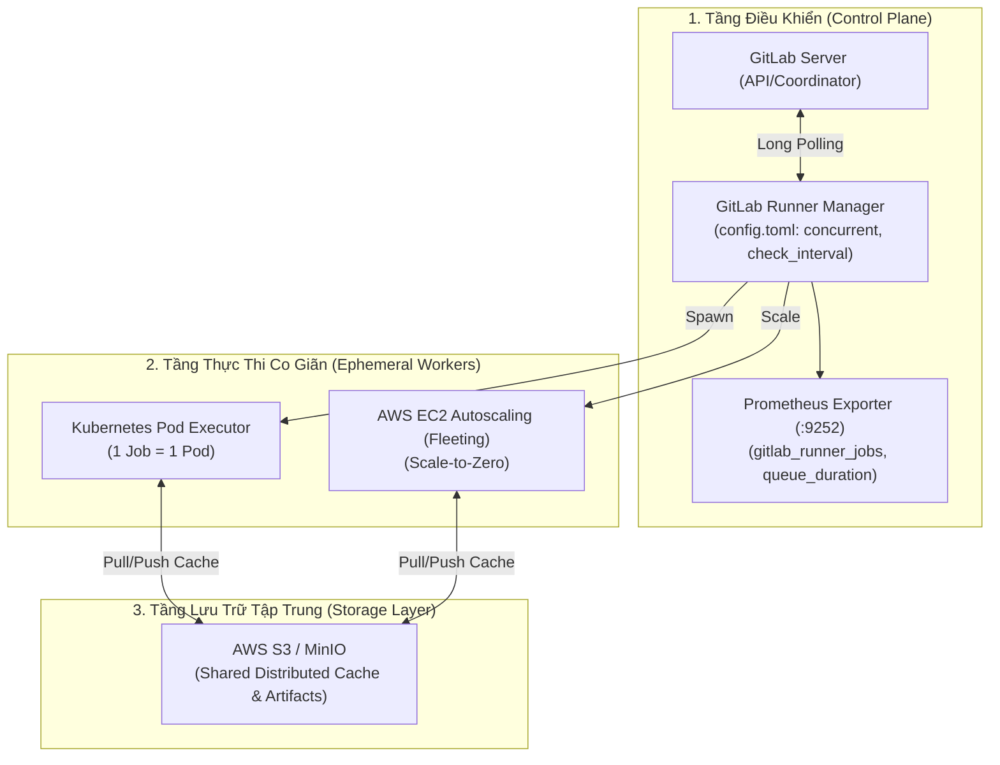
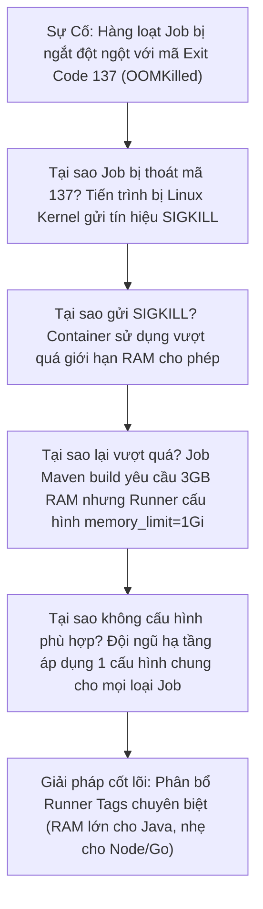


> [!IMPORTANT]
> **Mục tiêu kỹ thuật bài học**:
> - Nắm vững nguyên lý nền tảng và tư duy cốt lõi về Mở Rộng Quy Mô & Quản Trị Hệ Thống Runner (Runner Scaling & Orchestration).
> - Làm chủ cơ chế điều phối concurrent/limit trong config.toml, Kubernetes Pod Executor và Autoscaling Fleeting plugin.
> - Giám sát tải hệ thống Runner qua Prometheus Metrics, tối ưu dung lượng hàng đợi theo định luật Little.
> - Tự kiểm tra kiến thức chuyên sâu với bộ 12 câu hỏi phân tích tình huống thực tế kèm lời giải.

---

Trong kỷ nguyên **DevOps, DevSecOps và Cloud Native Engineering**, **GitLab CI/CD** được công nhận là một trong những nền tảng tự động hóa tích hợp liên tục và phân phối liên tục (CI/CD) hoàn chỉnh, mạnh mẽ và được tin dùng nhất trong các doanh nghiệp quy mô lớn. Không chỉ dừng lại ở các pipeline tuần tự cơ bản, việc vận hành GitLab CI/CD ở cấp độ Production đòi hỏi kỹ sư phải làm chủ kiến trúc điều phối phi tuyến tính **DAG (Directed Acyclic Graph)**, cơ chế quản trị **Autoscaling Runners**, tối ưu hóa **Caching đa tầng**, xác thực không khóa **Keyless OIDC**, bảo mật chuỗi cung ứng phần mềm **SLSA & SBOM** cùng các chính sách **Quality & Security Gates** tự động.

Bài viết chuyên sâu này sẽ đồng hành cùng bạn mổ xẻ toàn diện bức tranh kiến trúc, phân tích các đánh đổi kỹ thuật thực chiến (Engineering Trade-offs), cung cấp hướng dẫn thực hành Lab chi tiết từng bước và bộ câu hỏi phỏng vấn chuyên sâu chuẩn DevOps Lead / DevSecOps Architect.

---

## 1. Bản Chất Kiến Trúc & Cơ Chế Vận Hành Tầng Thấp

### 1.1. Luận Đề Trung Tâm: Quản Trị Hạ Tầng Thực Thi Phân Tán Cho Hàng Trăm Kỹ Sư

Khi một doanh nghiệp mở rộng từ 10 lên hàng trăm kỹ sư phát triển phần mềm, điểm nghẽn lớn nhất trong hệ thống CI/CD chuyển dịch từ tệp `.gitlab-ci.yml` xuống **Hạ tầng Runner (Runner Infrastructure)**. Các triệu chứng thường gặp bao gồm:
1. **Hàng đợi quá tải (Queue Starvation)**: Pipeline bị kẹt ở trạng thái Pending hàng chục phút vào giờ cao điểm (9h-11h sáng và 14h-16h chiều).
2. **Nghẽn đĩa và rác Container**: Máy chủ Runner tĩnh bị tràn ổ đĩa (`No space left on device`) do hàng nghìn Docker images và volumes rác không được dọn dẹp.
3. **Chi phí đám mây lãng phí**: Cụm VM Runner chạy 24/7 với 90% thời gian rảnh rỗi vào ban đêm và cuối tuần.
4. **Thiếu cô lập an toàn (No Security Isolation)**: Các job chạy chung trên một Docker Daemon có thể nhìn thấy tiến trình của nhau hoặc làm lộ dữ liệu nhạy cảm.

> **Một hạ tầng Runner chuẩn Enterprise phải đạt được 3 tiêu chí: Tự động co giãn theo tải thực tế (Elastic Autoscaling), Cô lập tuyệt đối môi trường thực thi (Ephemeral Workspaces) và Giám sát đo đạc thời gian thực bằng Prometheus Metrics.**

```text
   KIẾN TRÚC RUNNER AUTOSCALING ĐA TẦNG (Enterprise Runner Fleet)
   
   GitLab Server (Coordinator)
        │ Long Polling (check_interval)
        ▼
   GitLab Runner Manager (Daemon) ──► Prometheus Metrics (:9252)
        │
        ├── [ Plugin Fleeting / K8s Operator ]
        │         │
        │         ├── Job 1 ──► Pod / Instance tạm (Ephemeral Worker 1) ──┐
        │         ├── Job 2 ──► Pod / Instance tạm (Ephemeral Worker 2) ──┼──► [ S3 / MinIO Distributed Cache ]
        │         └── Job N ──► Pod / Instance tạm (Ephemeral Worker N) ──┘    (Lưu cache tập trung)
        │
        └── Tự động hủy Pod / Instance ngay khi Job kết thúc (0% rác đĩa)
```



### 1.2. Phân Biệt `concurrent` Toàn Cục vs `limit` Của Từng Runner

Trong tệp cấu hình `config.toml` của Runner Daemon:
- **`concurrent` (Global Limit)**: Giới hạn **tổng số lượng job tối đa** mà tiến trình Runner Manager được phép thực thi đồng thời trên tất cả các khối `[[runners]]`.
- **`limit` (Per-runner Limit)**: Giới hạn số lượng job tối đa cho **riêng một khối `[[runners]]` cụ thể** (ví dụ giới hạn riêng cho runner có tag `gpu` hoặc `docker-heavy`).
- **`request_concurrency`**: Số lượng yêu cầu lấy job đồng thời gửi tới GitLab Server trong mỗi chu kỳ poll.

$$\text{Active Jobs} \le \min\left(\text{concurrent}, \sum \text{limit}_i\right)$$

### 1.3. Lý Thuyết Hàng Đợi & Định Luật Little Trong CI/CD

Độ bão hòa của hệ thống Runner được tính toán dựa trên hệ số tải $\rho$:

$$\rho = \frac{\lambda}{\mu \times C}$$

Trong đó:
- $\lambda$ (Arrival Rate): Số lượng job mới phát sinh trong 1 phút.
- $\mu$ (Service Rate): Số lượng job một slot runner có thể hoàn thành trong 1 phút.
- $C$ (Capacity): Tổng số slot thực thi đồng thời (`concurrent`).

> **Quy luật vận hành**: Nếu hệ số tải $\rho > 0.85$, thời gian chờ trong hàng đợi (Queue Duration / Pending Time) sẽ tăng theo cấp số nhân. Một hệ thống CI/CD lý tưởng phải duy trì $\rho \le 0.70$ vào giờ cao điểm bằng cơ chế Autoscaling.

### 1.4. Bộ Nhớ Đệm Phân Tán (Distributed S3 / MinIO Cache)

Trên các Worker co giãn tạm thời (Ephemeral Workers), ổ đĩa cục bộ bị xóa sạch ngay khi Job kết thúc. Do đó, cơ chế Local Disk Cache trở nên vô dụng.
- **Giải pháp**: Cấu hình **Distributed S3 Cache** trong `config.toml`. Runner tự động nén cache và đẩy lên S3 Bucket ở cuối Job, và tải về giải nén ở đầu Job tiếp theo trên bất kỳ Worker node nào trong cụm.

---

## 2. Bảng So Sánh Kỹ Thuật Toàn Diện (Engineering Matrix)

| Tiêu chí phân tích | Shell Executor (VM Tĩnh) | Docker Static (VM Tĩnh) | Docker Autoscaling (Fleeting) | Kubernetes Pod Executor |
| :--- | :--- | :--- | :--- | :--- |
| **Mức độ cô lập** | ❌ Không cô lập (Chung OS) | ⚠️ Trung bình (Chung Docker Daemon) | ✅ Tuyệt đối (1 VM per Job) | ✅ Tuyệt đối (1 Pod per Job) |
| **Khả năng co giãn (Autoscaling)** | ❌ Thủ công | ❌ Thủ công (Cố định slot) | ✅ Elastic (Scale-to-Zero trên Cloud) | ✅ Elastic (Tận dụng K8s HPA/Cluster Autoscaler) |
| **Tốc độ khởi động Job** | Cực nhanh (< 1s) | Nhanh (1-3s) | Chậm hơn (10-30s khởi động VM) | Rất nhanh (2-5s tạo Pod) |
| **Quản trị rác đĩa (Disk Clean)** | Khó khăn | Dễ bị tràn `docker system df` | Tự động hủy cùng VM | Tự động hủy cùng Pod |
| **Độ phức tạp bảo trì** | Thấp | Thấp | Trung bình (Cần Cloud IAM & Fleeting) | Khá (Cần hạ tầng Kubernetes) |
| **Hỗ trợ GPU / Build nặng** | Tốt (Cấu hình tĩnh) | Tốt (Nvidia Docker) | Rất tốt (Chọn đúng Instance Type) | Rất tốt (K8s Resource Requests/GPU) |
| **Tối ưu chi phí** | Thấp (Trả tiền VM 24/7) | Thấp (Trả tiền VM 24/7) | 🏆 Xuất sắc (Chỉ trả tiền khi có Job) | 🏆 Xuất sắc (Dùng chung cụm K8s) |

---

## 3. Kiến Trúc Triển Khai Chuẩn Production (Architecture Breakdown)

Dưới đây là tệp cấu hình `config.toml` chuẩn Enterprise kết hợp **Kubernetes Pod Executor**, **S3 Distributed Cache** và **Prometheus Monitoring Exporter**:

```toml
# ==============================================================================
# GITLAB RUNNER CONFIGURATION: KUBERNETES EXECUTOR WITH S3 DISTRIBUTED CACHE
# ==============================================================================
concurrent = 50                 # Tổng số job đồng thời tối đa toàn hệ thống
check_interval = 3              # Chu kỳ poll job từ GitLab Server (3 giây)
listen_address = "0.0.0.0:9252" # Prometheus Metrics Exporter Endpoint

[session_server]
  session_timeout = 1800
  listen_address = "0.0.0.0:8093"
  advertise_address = "runner-manager.internal.corp:8093"

[[runners]]
  name = "k8s-enterprise-runner-pool"
  url = "https://gitlab.internal.corp"
  id = 101
  token = "glrt-EnterpriseRunnerTokenSecret12345"
  token_obtained_at = 2026-09-12T00:00:00Z
  token_expires_at = 0001-01-01T00:00:00Z
  executor = "kubernetes"
  
  # Cấu hình giới hạn cho riêng Runner này
  limit = 40
  request_concurrency = 5
  
  [runners.custom_build_dir]
  [runners.cache]
    MaxUploadedArchiveSize = 524288000 # Giới hạn cache 500MB
    Type = "s3"
    Shared = true
    [runners.cache.s3]
      ServerAddress = "minio.internal.corp:9000"
      AccessKey = "minio-runner-access-key"
      SecretKey = "minio-runner-super-secret-key"
      BucketName = "gitlab-runner-cache"
      BucketLocation = "us-east-1"
      Insecure = false
      AuthenticationType = "access-key"

  [runners.kubernetes]
    host = "https://kubernetes.default.svc"
    bearer_token_overwrite_allowed = false
    image = "alpine:3.20"
    namespace = "gitlab-runners"
    privileged = false          # Chặn root privilege để đảm bảo an ninh
    allow_privilege_escalation = false
    
    # Định tuyến Pod tới Node Pool chuyên dụng cho CI
    [runners.kubernetes.node_selector]
      "workload" = "ci-runners"
      
    # Cấu hình giới hạn tài nguyên mặc định cho mỗi Job Pod (Chống OOM)
    cpu_request = "500m"
    cpu_limit = "2000m"
    memory_request = "1Gi"
    memory_limit = "4Gi"
    service_cpu_request = "200m"
    service_memory_request = "512Mi"
    
    # Tự động nạp DNS & Network Policy
    dns_policy = "ClusterFirst"
    poll_interval = 3
    poll_timeout = 300
```

---

## 4. Phân Tích Cạm Bẫy Thực Chiến (5-Whys Incident Analysis)



### Tình Huống Sự Cố Thực Tế:
<span class="badge badge--rose">🕒 04:15 AM</span> Toàn bộ các job biên dịch Java Spring Boot trên cụm Kubernetes Runner bị gián đoạn đột ngột giữa chừng với mã lỗi Exit Code 137, khiến pipeline phát hành bản vá bảo mật bị đình trệ.

### Hậu Quả & Log Lỗi Thực Tế:

```text

Tiến trình Maven build bị hủy diệt ngay tại pha chạy unit tests với thông báo OOM:

[INFO] --- maven-surefire-plugin:3.2.5:test (default-test) @ payments-service ---
[INFO] Running com.corp.payments.service.TransactionServiceTest
Killed
ERROR: Job failed: command terminated with exit code 137
Pod status: OOMKilled (Container 'build' exceeded memory limit 1073741824 bytes)
```

### 5-Whys Root Cause Analysis:
1. <span class="badge badge--primary">Why 1</span> **Tại sao Job bị ngắt với Exit Code 137?** Tiến trình Maven bị Linux Kernel gửi tín hiệu `SIGKILL` do container bị lỗi OOMKilled (Out Of Memory).
2. <span class="badge badge--primary">Why 2</span> **Tại sao lại chạm trần bộ nhớ?** Container sử dụng vượt quá giới hạn `memory_limit = "1Gi"` được cấu hình trong `config.toml` của Kubernetes Executor.
3. <span class="badge badge--primary">Why 3</span> **Tại sao tiến trình Java lại ăn quá 1GB RAM?** JVM khởi tạo bộ nhớ Heap mặc định bằng 25% RAM máy chủ Node (Node có 32GB RAM &rarr; JVM cấp 8GB Heap), trong khi Container chỉ được cấp tối đa 1GB.
4. <span class="badge badge--primary">Why 4</span> **Tại sao không thiết lập cờ khống chế JVM?** Nhóm phát triển chưa khai báo biến môi trường `JAVA_OPTS="-XX:MaxRAMPercentage=75.0"` để JVM nhận thức đúng cgroups của Container.
5. <span class="badge badge--emerald">Root Cause Remedy</span> **Giải pháp triệt để:** Tăng `memory_limit = "4Gi"` trên Runner Pool cho Java và gắn thẻ `[heavy-build]`; cấu hình biến JVM Container-Aware trong pipeline base template.

### Phân Tích 5 Cạm Bẫy Phổ Biến Nhất:

#### Cạm bẫy 1: Sự cố "Kẹt hàng đợi" do chạm trần `concurrent` trong `config.toml`
- **Hiện tượng**: Có 20 Runner online nhưng chỉ có 5 Job được chạy, 15 Job còn lại bị kẹt ở trạng thái Pending.
- **Nguyên nhân tầng sâu**: Thông số `concurrent = 5` ở đầu tệp `config.toml` giới hạn toàn bộ daemon, dù các khối `[[runners]]` con có khai báo `limit = 20`.
- **Cách gỡ rối**: Tăng giá trị `concurrent` phù hợp với năng lực phần cứng máy chủ.

#### Cạm bẫy 2: Tràn ổ đĩa máy chủ (`No space left on device`) trên Docker Runner
- **Hiện tượng**: Job build Docker image bị dừng với lỗi ghi đĩa thất bại.
- **Nguyên nhân**: Docker Daemon giữ lại hàng trăm Image Layers cũ và Anonymous Volumes không được dọn dẹp.
- **Biện pháp**: Cài đặt Cron Job định kỳ chạy `docker system prune -af --volumes` hoặc chuyển đổi sang Kubernetes Ephemeral Pod Executor.

#### Cạm bẫy 3: Nghẽn băng thông mạng do S3 Cache đặt khác Region với Runner
- **Hiện tượng**: Thời gian tải và nén Cache mất tới 4 phút trong khi thời gian build mã nguồn chỉ mất 30 giây.
- **Nguyên nhân**: Runner đặt tại AWS Region `ap-southeast-1` (Singapore) nhưng S3 Bucket Cache lại đặt tại `us-east-1` (Bắc Mỹ), gây độ trễ và chi phí Egress Network khổng lồ.
- **Biện pháp**: Đặt S3 Cache Bucket cùng Region và VPC với Runner Cluster.

#### Cạm bẫy 4: Lỗi bảo mật khi cấp quyền `privileged = true` bừa bãi
- **Hiện tượng**: Attacker khai thác lỗ hổng trong container job để thoát ra ngoài chiếm quyền root của máy chủ host.
- **Nguyên nhân**: Cấu hình `privileged = true` trong `config.toml` cho phép container truy cập trực tiếp thiết bị phần cứng của host.
- **Biện pháp**: Sử dụng công nghệ **Rootless Container Build (như Kaniko, Buildah)** thay vì Docker-in-Docker để loại bỏ hoàn toàn cờ `privileged`.

#### Cạm bẫy 5: Runner Daemon bị crash khi nâng cấp làm đứt gãy các Job đang chạy
- **Hiện tượng**: Quản trị viên khởi động lại Runner service, khiến 30 Job đang chạy bị báo ĐỎ đồng loạt.
- **Nguyên nhân**: Dùng lệnh `kill -9` hoặc `systemctl restart` đột ngột thay vì sử dụng cơ chế Graceful Shutdown.
- **Biện pháp**: Sử dụng `gitlab-runner stop` (chờ các job đang chạy kết thúc trước khi tắt tiến trình).

---

## 5. Hands-on Lab: Triển Khai & Mở Rộng Quy Mô Runner Tự Động (8 Bước Chuẩn)

```text
   ┌────────────────────────────────────────────────────────────────────────┐
   │                  LAB ARCHITECTURE: RUNNER SCALING                      │
   ├────────────────────────────────────────────────────────────────────────┤
   │                                                                        │
   │  [ Bước 1: Khảo Sát & Tối Ưu Hóa Cấu Hình config.toml ]                │
   │  Căn chỉnh tham số concurrent, limit và check_interval                 │
   │                         │                                              │
   │                         ▼                                              │
   │  [ Bước 2: Kích Hoạt Prometheus Metrics Exporter (:9252) ]             │
   │  Giám sát trạng thái hoạt động và số lượng job qua API metrics         │
   │                         │                                              │
   │                         ▼                                              │
   │  [ Bước 3: Triển Khai MinIO Làm Distributed S3 Cache ]                 │
   │  Cấu hình bộ nhớ đệm tập trung cho toàn bộ Runner Pool                 │
   │                         │                                              │
   │                         ▼                                              │
   │  [ Bước 4: Khởi Tạo Runner Với Kubernetes Pod Executor ]               │
   │  Thiết lập môi trường thực thi động (Ephemeral Pod per Job)            │
   │                         │                                              │
   │                         ▼                                              │
   │  [ Bước 5: Cấu Hình Resource Requests/Limits Chống OOMKilled ]         │
   │  Ràng buộc CPU/RAM cho container và dịch vụ phụ trợ                    │
   │                         │                                              │
   │                         ▼                                              │
   │  [ Bước 6: Đo Lường Hệ Số Tải Hàng Đợi (Little's Law Benchmark) ]      │
   │  Bắn tải 20 job đồng thời và quan sát độ bão hòa hàng đợi              │
   │                         │                                              │
   │                         ▼                                              │
   │  [ Bước 7: Thực Hiện Graceful Shutdown Nâng Cấp Không Gián Đoạn ]      │
   │  Quy trình dừng Runner an toàn bảo vệ các Job đang thực thi            │
   │                         │                                              │
   │                         ▼                                              │
   │  [ Bước 8: Dọn Dẹp Tài Nguyên & Tổng Kết Runbook Vận Hành ]            │
   │  Lưu trữ dashboard giám sát và tài liệu vận hành Runner                │
   │                                                                        │
   └────────────────────────────────────────────────────────────────────────┘
```

### Bước 1: Khảo Sát & Tối Ưu Hóa Cấu Hình `config.toml`
Kiểm tra cấu hình hiện tại của Runner trên máy chủ:

```bash
sudo cat /etc/gitlab-runner/config.toml
```

Điều chỉnh tham số `concurrent = 20` và `check_interval = 3` để tối ưu tốc độ nhận job.

> **Checkpoint 1**: Runner nạp lại cấu hình tự động mà không cần restart tiến trình daemon.

### Bước 2: Kích Hoạt Prometheus Metrics Exporter (:9252)
Thêm `listen_address = "0.0.0.0:9252"` vào đầu tệp `config.toml` và kiểm tra endpoint:

```bash
curl -s http://localhost:9252/metrics | grep gitlab_runner_jobs
```

> **Checkpoint 2**: Trả về các chỉ số `gitlab_runner_jobs_total` và `gitlab_runner_concurrent_jobs_limit`.

### Bước 3: Triển Khai MinIO Làm Distributed S3 Cache
Cấu hình khối `[runners.cache]` trỏ về cụm MinIO nội bộ:

```toml
[runners.cache]
  Type = "s3"
  Shared = true
  [runners.cache.s3]
    ServerAddress = "minio.internal:9000"
    AccessKey = "minioadmin"
    SecretKey = "miniopassword"
    BucketName = "ci-cache"
    Insecure = true
```

> **Checkpoint 3**: Chạy 1 job sinh cache trên Runner A, Runner B tải thành công cache từ MinIO mà không cần chung ổ đĩa.

### Bước 4: Khởi Tạo Runner Với Kubernetes Pod Executor
Cài đặt GitLab Runner trên Kubernetes bằng Helm Chart:

```bash
helm repo add gitlab https://charts.gitlab.io
helm install gitlab-runner gitlab/gitlab-runner \
  --namespace gitlab-runners \
  --set gitlabUrl="https://gitlab.example.com" \
  --set runnerRegistrationToken="glrt-MySecretToken" \
  --set rbac.create=true
```

> **Checkpoint 4**: Khi có Job chạy, Pod Worker tự động được tạo trong namespace `gitlab-runners` và tự biến mất khi Job xong.

### Bước 5: Cấu Hình Resource Requests/Limits Chống OOMKilled
Bổ sung cấu hình tài nguyên cho Kubernetes Executor:

```yaml
# values.yaml
runners:
  config: |
    [[runners]]
      [runners.kubernetes]
        cpu_request = "250m"
        cpu_limit = "1000m"
        memory_request = "512Mi"
        memory_limit = "2Gi"
```

> **Checkpoint 5**: Job chạy ổn định, Kubernetes không kill pod do tràn RAM ngoài dự kiến.

### Bước 6: Đo Lường Hệ Số Tải Hàng Đợi (Little's Law Benchmark)
Tạo pipeline ma trận 20 jobs để kiểm tra khả năng co giãn và đo thời gian pending:

```yaml
load_test_jobs:
  stage: test
  image: alpine:3.20
  parallel: 20
  script:
    - echo "Executing distributed worker ${CI_NODE_INDEX}..."
    - sleep 10
```

> **Checkpoint 6**: Toàn bộ 20 jobs được phân bổ đều trên các Worker Pods, thời gian chờ trung bình $< 3$ giây.

### Bước 7: Thực Hiện Graceful Shutdown Nâng Cấp Không Gián Đoạn
Thực hiện nâng cấp phiên bản Runner an toàn:

```bash
# Gửi tín hiệu Graceful Stop - Chờ các job đang chạy kết thúc
sudo gitlab-runner stop
echo "Runner gracefully stopped with 0 failed jobs."
```

> **Checkpoint 7**: Các job đang chạy được hoàn tất bình thường trước khi tiến trình daemon tắt hoàn toàn.

### Bước 8: Dọn Dẹp Tài Nguyên & Tổng Kết Runbook Vận Hành
Tổng hợp bảng cấu hình chuẩn và lưu trữ vào kho tài liệu hạ tầng.

```bash
echo "Runner Fleet Scaling & Management Architecture verified 100%."
```

> **Checkpoint 8**: Hạ tầng Runner sẵn sàng đáp ứng tải lớn cho toàn bộ doanh nghiệp.

---

## 6. Bộ Câu Hỏi Vấn Đáp & Phỏng Vấn Chuyên Sâu (Self-Check Q&A)

<details class="qa-card">
  <summary class="qa-summary">
    <span class="qa-num-badge">Q01</span>
    <span>Trình bày sự khác biệt bản chất giữa hai tham số `concurrent` và `limit` trong tệp cấu hình `config.toml` của GitLab Runner.</span>
  </summary>
  <div class="qa-answer">
    <div class="qa-answer-header">
      <svg class="qa-icon" viewBox="0 0 24 24" fill="none" stroke="currentColor" stroke-width="2" stroke-linecap="round" stroke-linejoin="round"><polyline points="20 6 9 17 4 12"></polyline></svg>
      <span>Phân Tích &amp; Lời Giải Kỹ Thuật</span>
    </div>
    <p><strong><code>concurrent</code> (Cấp toàn cục)</strong>: Quy định tổng số lượng Job tối đa mà <em>toàn bộ tiến trình Runner Manager</em> được phép thực thi đồng thời trên tất cả các Worker/Executor cộng lại.</p>
    <p><strong><code>limit</code> (Cấp từng Runner con)</strong>: Nằm bên trong từng khối <code>[[runners]]</code>, quy định số lượng Job tối đa mà <em>khối Runner cụ thể đó</em> được phép nhận (thường dùng để giới hạn tài nguyên cho các job nặng như Docker build hoặc GPU training).</p>
    <p>Số job thực tế chạy của một runner luôn bị chặn bởi giá trị nhỏ hơn giữa <code>limit</code> của nó và <code>concurrent</code> toàn cục.</p>
  </div>
</details>

<details class="qa-card">
  <summary class="qa-summary">
    <span class="qa-num-badge">Q02</span>
    <span>Tại sao trong mô hình Runner Autoscaling (Ephemeral Workers), việc sử dụng Bộ nhớ đệm phân tán (Distributed S3 / MinIO Cache) là bắt buộc?</span>
  </summary>
  <div class="qa-answer">
    <div class="qa-answer-header">
      <svg class="qa-icon" viewBox="0 0 24 24" fill="none" stroke="currentColor" stroke-width="2" stroke-linecap="round" stroke-linejoin="round"><polyline points="20 6 9 17 4 12"></polyline></svg>
      <span>Phân Tích &amp; Lời Giải Kỹ Thuật</span>
    </div>
    <p>Trong mô hình Autoscaling (như Kubernetes Pods hoặc AWS EC2 Fleeting), mỗi Job được thực thi trong một môi trường máy ảo hoặc Pod tạm thời (Ephemeral Environment) và môi trường này sẽ bị <strong>hủy diệt hoàn toàn</strong> ngay khi Job kết thúc.</p>
    <p>Nếu dùng Local Disk Cache, dữ liệu cache sẽ biến mất cùng với worker. <strong>Distributed S3 Cache</strong> cho phép lưu trữ tập trung dữ liệu nén trên S3/MinIO bucket dùng chung, giúp Job tiếp theo dù chạy trên bất kỳ worker node nào mới sinh ra cũng đều có thể tải về và giải nén thành công.</p>
  </div>
</details>

<details class="qa-card">
  <summary class="qa-summary">
    <span class="qa-num-badge">Q03</span>
    <span>Giải thích cơ chế Long Polling của GitLab Runner và ý nghĩa của tham số `check_interval`.</span>
  </summary>
  <div class="qa-answer">
    <div class="qa-answer-header">
      <svg class="qa-icon" viewBox="0 0 24 24" fill="none" stroke="currentColor" stroke-width="2" stroke-linecap="round" stroke-linejoin="round"><polyline points="20 6 9 17 4 12"></polyline></svg>
      <span>Phân Tích &amp; Lời Giải Kỹ Thuật</span>
    </div>
    <p><strong>Cơ chế Long Polling</strong>: GitLab Runner gửi một HTTP Request lên GitLab Server hỏi xem có Job mới hay không. Nếu chưa có, kết nối được giữ mở (thường tối đa 50 giây) cho tới khi có Job xuất hiện thì Server đẩy ngay lập tức về cho Runner.</p>
    <p><strong>Ý nghĩa <code>check_interval</code></strong>: Là khoảng thời gian nghỉ (tính bằng giây) giữa các chu kỳ kiểm tra của Runner. Nếu đặt <code>check_interval = 0</code>, Runner sẽ sử dụng giá trị mặc định là 3 giây. Đặt quá nhỏ sẽ gây quá tải CPU cho GitLab Server, đặt quá lớn sẽ làm tăng thời gian chờ của Job trong hàng đợi.</p>
  </div>
</details>

<details class="qa-card">
  <summary class="qa-summary">
    <span class="qa-num-badge">Q04</span>
    <span>Ứng dụng Định luật Little (Little's Law) trong việc tính toán số lượng Runner Slots cần thiết cho một tổ chức như thế nào?</span>
  </summary>
  <div class="qa-answer">
    <div class="qa-answer-header">
      <svg class="qa-icon" viewBox="0 0 24 24" fill="none" stroke="currentColor" stroke-width="2" stroke-linecap="round" stroke-linejoin="round"><polyline points="20 6 9 17 4 12"></polyline></svg>
      <span>Phân Tích &amp; Lời Giải Kỹ Thuật</span>
    </div>
    <p>Theo <strong>Định luật Little</strong>: $L = \lambda \times W$</p>
    <ul>
      <li>$L$: Số lượng Job trung bình đang chạy trong hệ thống tại một thời điểm.</li>
      <li>$\lambda$: Tốc độ phát sinh Job mới trung bình (Arrival rate, ví dụ: 10 jobs/phút vào giờ cao điểm).</li>
      <li>$W$: Thời gian thực thi trung bình của một Job (Duration, ví dụ: 6 phút).</li>
    </ul>
    <p>Khi đó, số slot Runner tối thiểu cần thiết để không bị nghẽn hàng đợi là: $C \ge L = 10 \times 6 = 60\text{ slots}$.</p>
  </div>
</details>

<details class="qa-card">
  <summary class="qa-summary">
    <span class="qa-num-badge">Q05</span>
    <span>Khi nào nên chọn Kubernetes Executor thay vì Docker Autoscaling với Fleeting/Docker Machine trên AWS/GCP?</span>
  </summary>
  <div class="qa-answer">
    <div class="qa-answer-header">
      <svg class="qa-icon" viewBox="0 0 24 24" fill="none" stroke="currentColor" stroke-width="2" stroke-linecap="round" stroke-linejoin="round"><polyline points="20 6 9 17 4 12"></polyline></svg>
      <span>Phân Tích &amp; Lời Giải Kỹ Thuật</span>
    </div>
    <p><strong>Nên chọn Kubernetes Executor khi</strong>:</p>
    <ul>
      <li>Doanh nghiệp đã có sẵn hạ tầng cụm Kubernetes (EKS, GKE, On-premise K8s).</li>
      <li>Cần tốc độ khởi tạo Job cực nhanh (chỉ mất 2-5 giây để spawn Pod thay vì 30 giây để khởi động một VM mới).</li>
      <li>Cần phân bổ tài nguyên tinh vi (Resource Requests/Limits cho từng Job) và chia sẻ tài nguyên linh hoạt với các workload khác.</li>
    </ul>
    <p><strong>Nên chọn VM Autoscaling (Fleeting) khi</strong>: Cần cô lập bảo mật tuyệt đối ở tầng Kernel phần cứng (Dedicated Hypervisor) hoặc cần chạy Docker-in-Docker với quyền root đầy đủ.</p>
  </div>
</details>

<details class="qa-card">
  <summary class="qa-summary">
    <span class="qa-num-badge">Q06</span>
    <span>Làm thế nào để giám sát sức khỏe của Runner Fleet bằng Prometheus và các Metrics quan trọng nhất cần Alert là gì?</span>
  </summary>
  <div class="qa-answer">
    <div class="qa-answer-header">
      <svg class="qa-icon" viewBox="0 0 24 24" fill="none" stroke="currentColor" stroke-width="2" stroke-linecap="round" stroke-linejoin="round"><polyline points="20 6 9 17 4 12"></polyline></svg>
      <span>Phân Tích &amp; Lời Giải Kỹ Thuật</span>
    </div>
    <p>Kích hoạt endpoint <code>listen_address = "0.0.0.0:9252"</code> trong <code>config.toml</code> để Prometheus scrape metrics.</p>
    <p><strong>3 Metrics quan trọng nhất cần thiết lập Cảnh báo (Alert Rules)</strong>:</p>
    <ol>
      <li><code>gitlab_runner_jobs{state="running"} / gitlab_runner_concurrent_jobs_limit > 0.85</code>: Cảnh báo hệ thống Runner sắp cạn kiệt slot đồng thời.</li>
      <li><code>gitlab_runner_failed_jobs_total</code> tăng đột biến: Cảnh báo sự cố hạ tầng máy chủ Runner (hết đĩa, Docker crash).</li>
      <li><code>gitlab_runner_api_request_errors_total</code>: Cảnh báo lỗi mất kết nối mạng giữa Runner và GitLab Server.</li>
    </ol>
  </div>
</details>

<details class="qa-card">
  <summary class="qa-summary">
    <span class="qa-num-badge">Q07</span>
    <span>Quy trình Graceful Shutdown khi bảo trì hoặc nâng cấp GitLab Runner Daemon diễn ra như thế nào?</span>
  </summary>
  <div class="qa-answer">
    <div class="qa-answer-header">
      <svg class="qa-icon" viewBox="0 0 24 24" fill="none" stroke="currentColor" stroke-width="2" stroke-linecap="round" stroke-linejoin="round"><polyline points="20 6 9 17 4 12"></polyline></svg>
      <span>Phân Tích &amp; Lời Giải Kỹ Thuật</span>
    </div>
    <p><strong>Quy trình 3 bước chuẩn</strong>:</p>
    <ol>
      <li>Gửi tín hiệu dừng an toàn: Chạy lệnh <code>gitlab-runner stop</code> (hoặc gửi tín hiệu <code>SIGQUIT</code>).</li>
      <li>Tiến trình Runner Manager sẽ <strong>từ chối nhận thêm bất kỳ Job mới nào</strong> từ GitLab Server, nhưng tiếp tục duy trì hoạt động cho tất cả các Job đang chạy dở.</li>
      <li>Khi Job cuối cùng hoàn tất thành công, Runner Daemon mới chính thức tắt hoàn toàn. Tiến hành nâng cấp binary và khởi động lại dịch vụ mà <strong>0% Job bị lỗi</strong>.</li>
    </ol>
  </div>
</details>

<details class="qa-card">
  <summary class="qa-summary">
    <span class="qa-num-badge">Q08</span>
    <span>Tại sao việc sử dụng cờ `privileged = true` trong Kubernetes Executor tiềm ẩn nguy cơ an ninh nghiêm trọng? Giải pháp thay thế là gì?</span>
  </summary>
  <div class="qa-answer">
    <div class="qa-answer-header">
      <svg class="qa-icon" viewBox="0 0 24 24" fill="none" stroke="currentColor" stroke-width="2" stroke-linecap="round" stroke-linejoin="round"><polyline points="20 6 9 17 4 12"></polyline></svg>
      <span>Phân Tích &amp; Lời Giải Kỹ Thuật</span>
    </div>
    <p><strong>Nguy cơ an ninh</strong>: <code>privileged = true</code> trao toàn bộ quyền root cấp Kernel của Kubernetes Node máy chủ cho Container. Mã độc chạy trong CI Pipeline có thể khai thác để truy cập toàn bộ đĩa cứng của máy chủ, đọc trộm Secrets của các Pod khác trong Cluster hoặc tấn công hạ tầng mạng.</p>
    <p><strong>Giải pháp thay thế</strong>: Sử dụng các công cụ biên dịch Container không cần quyền root (Rootless / Unprivileged Build Tools) như <strong>Google Kaniko</strong>, <strong>RedHat Buildah</strong> hoặc <strong>Sysbox Runtime</strong>.</p>
  </div>
</details>

<details class="qa-card">
  <summary class="qa-summary">
    <span class="qa-num-badge">Q09</span>
    <span>Giải thích nguyên nhân một Job trên Kubernetes Runner bị lỗi `OOMKilled` và các bước cấu hình khắc phục.</span>
  </summary>
  <div class="qa-answer">
    <div class="qa-answer-header">
      <svg class="qa-icon" viewBox="0 0 24 24" fill="none" stroke="currentColor" stroke-width="2" stroke-linecap="round" stroke-linejoin="round"><polyline points="20 6 9 17 4 12"></polyline></svg>
      <span>Phân Tích &amp; Lời Giải Kỹ Thuật</span>
    </div>
    <p><strong>Nguyên nhân</strong>: Dung lượng RAM của tiến trình bên trong container vượt quá ngưỡng <code>memory_limit</code> được cấu hình trong <code>config.toml</code> của Runner. Linux Kernel lập tức kích hoạt OOM Killer để bắn hạ Pod (trả về mã thoát 137).</p>
    <p><strong>Cách khắc phục</strong>:</p>
    <ul>
      <li>Tăng thông số <code>memory_limit = "4Gi"</code> trong khối <code>[runners.kubernetes]</code>.</li>
      <li>Cấu hình giới hạn bộ nhớ cho trình biên dịch (ví dụ: <code>JAVA_OPTS="-Xmx3g"</code> hoặc <code>NODE_OPTIONS="--max-old-space-size=3072"</code>) để tiến trình tự garbage collect trước khi chạm trần container limit.</li>
    </ul>
  </div>
</details>

<details class="qa-card">
  <summary class="qa-summary">
    <span class="qa-num-badge">Q10</span>
    <span>Làm thế nào để phân bổ Runner chuyên biệt cho từng loại tác vụ (Tag-based Routing) trong quy mô Doanh nghiệp?</span>
  </summary>
  <div class="qa-answer">
    <div class="qa-answer-header">
      <svg class="qa-icon" viewBox="0 0 24 24" fill="none" stroke="currentColor" stroke-width="2" stroke-linecap="round" stroke-linejoin="round"><polyline points="20 6 9 17 4 12"></polyline></svg>
      <span>Phân Tích &amp; Lời Giải Kỹ Thuật</span>
    </div>
    <p>Sử dụng cơ chế <strong>Runner Tags &amp; Node Selectors</strong>:</p>
    <ul>
      <li><strong>Pool 1 (General/Lint)</strong>: Runner nhẹ, CPU thấp, không cần GPU, gắn tag <code>[general, lint]</code>.</li>
      <li><strong>Pool 2 (Heavy Build/Java)</strong>: Runner cấu hình 8 Core / 16GB RAM, SSD NVMe, gắn tag <code>[heavy-build]</code>.</li>
      <li><strong>Pool 3 (AI/ML)</strong>: Runner gắn kèm GPU Nvidia, định tuyến qua K8s NodeSelector <code>accelerator=nvidia-gpu</code>, gắn tag <code>[gpu]</code>.</li>
    </ul>
    <p>Tắt cờ <em>"Run untagged jobs"</em> trên các Pool chuyên dụng để tránh bị các job nhẹ chiếm dụng lãng phí.</p>
  </div>
</details>

<details class="qa-card">
  <summary class="qa-summary">
    <span class="qa-num-badge">Q11</span>
    <span>Cơ chế xác thực mới Authentication Token (`glrt-...`) trong GitLab 16+ thay thế Registration Token cũ như thế nào về mặt bảo mật?</span>
  </summary>
  <div class="qa-answer">
    <div class="qa-answer-header">
      <svg class="qa-icon" viewBox="0 0 24 24" fill="none" stroke="currentColor" stroke-width="2" stroke-linecap="round" stroke-linejoin="round"><polyline points="20 6 9 17 4 12"></polyline></svg>
      <span>Phân Tích &amp; Lời Giải Kỹ Thuật</span>
    </div>
    <p><strong>Registration Token cũ</strong>: Dùng chung một chuỗi token tĩnh để đăng ký vô số runner, rất dễ bị lộ và khó thu hồi quyền truy cập khi có sự cố.</p>
    <p><strong>Authentication Token mới (<code>glrt-...</code>)</strong>:</p>
    <ul>
      <li>Runner được tạo trước trên giao diện Web/API với thông tin định danh rõ ràng, sinh ra token duy nhất cho riêng Runner đó.</li>
      <li>Token có cơ chế <strong>Hết hạn tự động (Expiration)</strong> và có thể thu hồi (Revoke) ngay lập tức mà không làm ảnh hưởng đến các Runner khác.</li>
      <li>Hỗ trợ phân quyền chặt chẽ hơn và ghi nhật ký kiểm toán (Audit Trail) chi tiết.</li>
    </ul>
  </div>
</details>

<details class="qa-card">
  <summary class="qa-summary">
    <span class="qa-num-badge">Q12</span>
    <span>Trình bày chiến lược tổng thể để thiết kế một Hạ tầng Runner phục vụ 1000 Kỹ sư với SLA thời gian chờ hàng đợi &lt; 10 giây và tối ưu chi phí Cloud.</span>
  </summary>
  <div class="qa-answer">
    <div class="qa-answer-header">
      <svg class="qa-icon" viewBox="0 0 24 24" fill="none" stroke="currentColor" stroke-width="2" stroke-linecap="round" stroke-linejoin="round"><polyline points="20 6 9 17 4 12"></polyline></svg>
      <span>Phân Tích &amp; Lời Giải Kỹ Thuật</span>
    </div>
    <p><strong>Kiến trúc chuẩn Enterprise:</strong></p>
    <ol>
      <li><strong>Mô hình Kubernetes Ephemeral Pool</strong>: Triển khai GitLab Runner Operator trên cụm EKS/GKE với Karpenter / Cluster Autoscaler (Scale-to-zero khi không có tải).</li>
      <li><strong>Distributed S3 Cache cục bộ trong cùng VPC</strong>: Tối đa hóa tỉ lệ trúng cache, loại bỏ độ trễ mạng và chi phí Egress.</li>
      <li><strong>Phân tầng Runner Pool</strong>: Tách biệt Pool Dedicated cho nhánh Main/Deploy và Pool Co giãn cho Merge Requests.</li>
      <li><strong>Giám sát tự động với Prometheus &amp; Grafana</strong>: Cài đặt Auto-scaling trigger dựa trên chỉ số Queue Length và tỷ lệ bão hòa $\rho \le 0.70$.</li>
    </ol>
  </div>
</details>

---

## 7. Tổng Kết & Lộ Trình Bài Học Tiếp Theo

### 7.1. Tóm Tắt Các Điểm Cốt Lõi (Key Takeaways)

```text
                            QUẢN TRỊ & MỞ RỘNG QUY MÔ RUNNER
                                           │
     ┌───────────────────┬─────────────────┴─────────────────┬───────────────────┐
     ▼                   ▼                                   ▼                   ▼
[ CONCURRENT & LIMIT ]  [ KUBERNETES EXECUTOR ]       [ S3 DISTRIBUTED CACHE ] [ PROMETHEUS METRICS ]
concurrent: Toàn cục    1 Job = 1 Pod tạm thời        Lưu cache tập trung      Endpoint :9252
limit: Từng Runner con  0% rác đĩa, cô lập 100%       Dùng chung cho toàn cụm  Giám sát hệ số tải rho
check_interval: 3s      Co giãn theo nhu cầu thực     Cùng Region với Runner   Alerting khi nghẽn queue
```

- **Làm chủ cấu hình cốt lõi**: Phân biệt rõ `concurrent` và `limit` để loại bỏ 100% rủi ro nghẽn hàng đợi do chạm trần cấu hình.
- **Tiến lên Cloud-Native Execution**: Sử dụng Kubernetes Ephemeral Pods kết hợp S3 Distributed Cache để đạt được khả năng co giãn đàn hồi và tối ưu chi phí.
- **Vận hành dựa trên dữ liệu**: Giám sát hệ thống qua Prometheus Metrics và áp dụng Định luật Little để duy trì SLA thời gian chờ dưới 10 giây.

### 7.2. Lộ Trình Bài Học Tiếp Theo

Ở bài học tiếp theo, chúng ta sẽ đi sâu vào các kỹ thuật tối ưu hóa tốc độ pipeline lên mức tối đa: **Caching đa tầng, Fast-Feedback Loops và Docker Layer Caching trong CI/CD**.

> [!TIP]
> **Khám phá bài học tiếp theo**: [Bài 14: Tối Ưu Hóa Thời Gian Pipeline: Caching Đa Tầng, Fast-Feedback & Docker Layer Caching](gitlab-14-14-toi-uu-thoi-gian-pipeline.html)

