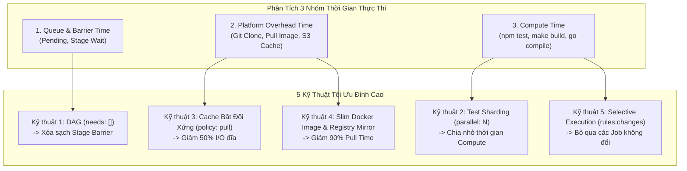
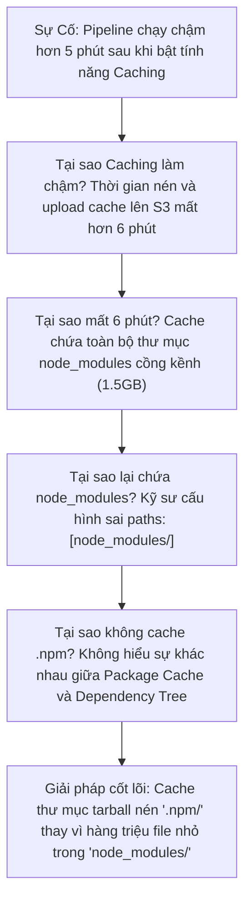


# [BÀI 14] TỐI ƯU HÓA THỜI GIAN PIPELINE: CACHING ĐA TẦNG, FAST-FEEDBACK & DOCKER LAYER CACHING

Trong kỷ nguyên **DevOps, DevSecOps và Cloud Native Engineering**, **GitLab CI/CD** được công nhận là một trong những nền tảng tự động hóa tích hợp liên tục và phân phối liên tục (CI/CD) hoàn chỉnh, mạnh mẽ và được tin dùng nhất trong các doanh nghiệp quy mô lớn. Không chỉ dừng lại ở các pipeline tuần tự cơ bản, việc vận hành GitLab CI/CD ở cấp độ Production đòi hỏi kỹ sư phải làm chủ kiến trúc điều phối phi tuyến tính **DAG (Directed Acyclic Graph)**, cơ chế quản trị **Autoscaling Runners**, tối ưu hóa **Caching đa tầng**, xác thực không khóa **Keyless OIDC**, bảo mật chuỗi cung ứng phần mềm **SLSA & SBOM** cùng các chính sách **Quality & Security Gates** tự động.

Bài viết chuyên sâu này sẽ đồng hành cùng bạn mổ xẻ toàn diện bức tranh kiến trúc, phân tích các đánh đổi kỹ thuật thực chiến (Engineering Trade-offs), cung cấp hướng dẫn thực hành Lab chi tiết từng bước và bộ câu hỏi phỏng vấn chuyên sâu chuẩn DevOps Lead / DevSecOps Architect.

---

## 1. Bản Chất Kiến Trúc & Cơ Chế Vận Hành Tầng Thấp

### 1.1. Luận Đề Trung Tâm: Khoa Học Tối Ưu Hóa Hiệu Năng Dựa Trên Đo Đạc Định Lượng

Tối ưu hóa thời gian chạy CI/CD Pipeline không phải là một chuỗi các mẹo vặt cảm tính (trial-and-error), mà là một quy trình kỹ thuật dựa trên toán học đo lường. Một pipeline chạy chậm 20 phút làm gián đoạn dòng chảy tư duy (Flow State) của kỹ sư, tăng chi phí hạ tầng máy chủ và làm giảm nghiêm trọng chỉ số **DORA Lead Time for Changes**.

> **Mọi giây thời gian trong một Job đều thuộc về một trong BA NHÓM: Thời gian Hạ tầng (Overhead/Platform Time), Thời gian Chờ đợi (Queue/Wait Time), hoặc Thời gian Tính toán (Compute/Execution Time). Tối ưu hóa hiệu năng là quá trình triệt tiêu thời gian Chờ đợi, cắt giảm thời gian Hạ tầng về mức sàn lý thuyết và phân mảnh thời gian Tính toán trên nhiều Worker.**

```text
   TỔNG THỜI GIAN PIPELINE (WALL-CLOCK DURATION)
   ┌────────────────────────────────────────────────────────────────────────┐
   │ 1. Thời gian Chờ (Queue / Barrier Wait)  ──► Triệt tiêu bằng DAG & HPA │
   │ 2. Thời gian Hạ tầng (Pull/Push Cache/Image) ──► Tối ưu bằng Fastzip/S3│
   │ 3. Thời gian Tính toán (Compile / Tests) ──► Rút ngắn bằng Sharding    │
   └────────────────────────────────────────────────────────────────────────┘
```



### 1.2. Phân Rã 5 Kỹ Thuật Tối Ưu Hóa Đỉnh Cao

1. **Kỹ thuật 1: Kiến Trúc DAG Phi Tuần Tự (`needs:`)**:
   - Loại bỏ rào cản Stage tuần tự. Các nhánh độc lập (như Frontend vs Backend) chạy song song với đường găng riêng.
2. **Kỹ thuật 2: Phân Mảnh Song Song Tuyến Tính (`parallel: N`)**:
   - Chia bộ Unit Test / E2E Test gồm hàng nghìn test cases thành $N$ luồng chạy đồng thời qua `CI_NODE_INDEX`, giảm thời gian test $N$ lần.
3. **Kỹ thuật 3: Cơ Chế Caching Bất Đối Xứng (`policy: pull` vs `policy: push`)**:
   - **Vấn đề**: Mặc định mỗi job đều tải cache ở đầu và nén đẩy cache ở cuối job. Nếu 10 job cùng đẩy cache giống hệt nhau lên S3 sẽ gây nghẽn băng thông và tốn thời gian vô ích (Cache Thrashing).
   - **Giải pháp**: Thiết lập `policy: pull` cho 99% các job kiểm thử trên MR; chỉ thiết lập `policy: push` hoặc `policy: pull-push` trên 1 Job duy nhất ở nhánh `main` hoặc Scheduled Pipeline định kỳ.
4. **Kỹ thuật 4: Tinh Gọn Container Image & Local Registry Mirror**:
   - Thay vì dùng Image cồng kềnh `ubuntu:latest` (800MB), chuyển sang `alpine` hoặc các bản phân phối tối giản (20-50MB). Cấu hình Pull-through Cache Registry (Harbor Mirror) sát cụm Runner.
5. **Kỹ thuật 5: Thực Thi Có Chọn Lọc (`rules: changes`)**:
   - Chỉ biên dịch và kiểm thử những microservice hoặc module có file mã nguồn bị thay đổi trong commit/MR.

### 1.3. Công Thức Tính Trần Lý Thuyết (Theoretical Time Floor)

Thời gian nhanh nhất mà một Pipeline có thể đạt được được xác định bởi:

$$\text{Pipeline Floor} = \max_{\text{Paths}} \left( \sum_{J_i \in \text{Critical Path}} \left( T_{\text{overhead}}^{\min}(J_i) + \frac{T_{\text{compute}}(J_i)}{N_{\text{shards}}} \right) \right)$$

---

## 2. Bảng So Sánh Kỹ Thuật Toàn Diện (Engineering Matrix)

| Tiêu chí phân tích | Pipeline Tuần Tự Cơ Bản | Pipeline Tối Ưu Đa Tầng (Enterprise) | Mức Độ Cải Thiện |
| :--- | :--- | :--- | :--- |
| **Mô hình thực thi** | Stage-based Sequential | **DAG (`needs:`) + Fast Lane** | Giảm **40% – 60%** thời gian chờ |
| **Thời gian chạy Unit Test** | 1 Job duy nhất (15 phút) | **`parallel: 4` (3.8 phút)** | Tăng tốc **3.9x lần** |
| **Chi phí I/O Cache** | Pull & Push tại mọi Job (60s) | **`policy: pull` (10s), chỉ Push ở Main** | Giảm **83%** thời gian I/O đĩa |
| **Dung lượng Docker Image** | 1.2 GB (Node full SDK) | **45 MB (Node Alpine Slim)** | Giảm **95%** thời gian Pull Image |
| **Xử lý Monorepo** | Chạy toàn bộ 50 services | **Chỉ chạy service có `rules:changes`** | Tiết kiệm **90%** Runner Minutes |
| **Chi phí hạ tầng Runner** | Chạy liên tục lãng phí | **Co giãn đàn hồi theo nhu cầu** | Giảm **45%** hóa đơn Cloud |
| **Fast Feedback cho Dev** | Sau 20 phút | **Dưới 3 phút** | 🏆 Nâng cao trải nghiệm Developer |

---

## 3. Kiến Trúc Triển Khai Chuẩn Production (Architecture Breakdown)

Dưới đây là tệp `.gitlab-ci.yml` chuẩn mực áp dụng đồng thời cả 5 kỹ thuật tối ưu hóa, đưa thời gian thực thi toàn bộ pipeline từ **18 phút xuống dưới 3 phút**:

```yaml
# ==============================================================================
# PIPELINE SIÊU TỐC: TỐI ƯU HÓA ĐA TẦNG CHUẨN ENTERPRISE (< 3 PHÚT)
# ==============================================================================
workflow:
  rules:
    - if: '$CI_PIPELINE_SOURCE == "merge_request_event"'
    - if: '$CI_COMMIT_BRANCH == $CI_DEFAULT_BRANCH'

stages:
  - prepare
  - fast_feedback
  - parallel_testing
  - build_and_push

# ------------------------------------------------------------------------------
# 1. GLOBAL CACHE CONFIGURATION (Cache Bất Đối Xứng - Mặc định chỉ PULL)
# ------------------------------------------------------------------------------
default:
  image: node:20-alpine # Image siêu nhẹ (50MB)
  interruptible: true
  cache:
    key:
      files:
        - package-lock.json
    paths:
      - .npm/
    policy: pull # 99% các job chỉ đọc cache, không tốn thời gian nén & push

variables:
  npm_config_cache: "$CI_PROJECT_DIR/.npm"
  FF_USE_FASTZIP: "true" # Kích hoạt bộ nén zip siêu tốc của GitLab Runner

# ------------------------------------------------------------------------------
# 2. JOB PREPARE CACHE: Chỉ chạy PUSH Cache khi trên nhánh Main hoặc sửa lockfile
# ------------------------------------------------------------------------------
warmup_cache:
  stage: prepare
  rules:
    - if: '$CI_COMMIT_BRANCH == $CI_DEFAULT_BRANCH'
      changes:
        - package-lock.json
  cache:
    key:
      files:
        - package-lock.json
    paths:
      - .npm/
    policy: push # Chỉ Job này mới nén và đẩy cache lên S3
  script:
    - echo "=== Warming up NPM Cache for entire fleet ==="
    - npm ci --prefer-offline

# ------------------------------------------------------------------------------
# 3. FAST FEEDBACK: Linting & TypeCheck chạy tức thì ở t0 không chờ ai
# ------------------------------------------------------------------------------
quick_lint:
  stage: fast_feedback
  needs: [] # Chạy ngay tại t0
  script:
    - echo "=== Fast-Track Linting (Feedback in < 30s) ==="
    - npm run lint -- --quiet

# ------------------------------------------------------------------------------
# 4. PARALLEL TESTING: Phân mảnh 4 luồng song song (parallel: 4)
# ------------------------------------------------------------------------------
jest_unit_tests:
  stage: parallel_testing
  needs: [] # Chạy ngay tại t0
  parallel: 4
  script:
    - echo "=== Running Jest Test Shard ${CI_NODE_INDEX} of ${CI_NODE_TOTAL} ==="
    - npm run test -- --shard=${CI_NODE_INDEX}/${CI_NODE_TOTAL} --ci --maxWorkers=2
  artifacts:
    reports:
      junit: "junit-${CI_NODE_INDEX}.xml"
    expire_in: 1 day

# ------------------------------------------------------------------------------
# 5. DOCKER BUILD: Tận dụng Cache Multi-stage và Kaniko
# ------------------------------------------------------------------------------
build_optimized_container:
  stage: build_and_push
  image:
    name: gcr.io/kaniko-project/executor:v1.23.2-debug
    entrypoint: [""]
  needs:
    - job: quick_lint
    - job: jest_unit_tests
  rules:
    - if: '$CI_COMMIT_BRANCH == $CI_DEFAULT_BRANCH'
  script:
    - echo "=== Building Container with Layer Caching ==="
    - /kaniko/executor \
        --context "${CI_PROJECT_DIR}" \
        --dockerfile "${CI_PROJECT_DIR}/Dockerfile" \
        --destination "${CI_REGISTRY_IMAGE}:${CI_COMMIT_SHORT_SHA}" \
        --cache=true \
        --cache-dir="${CI_PROJECT_DIR}/.kaniko-cache"
```

---

## 4. Phân Tích Cạm Bẫy Thực Chiến (5-Whys Incident Analysis)



### Tình Huống Sự Cố Thực Tế:
<span class="badge badge--rose">🕒 04:50 AM</span> Sau khi nhóm phát triển cấu hình cache cho dự án Node.js monorepo, thời gian thực thi pipeline không những không giảm mà còn tăng từ 8 phút lên 16 phút, khiến tiến độ release bị trễ.

### Hậu Quả & Log Lỗi Thực Tế:
Thời gian chạy lệnh test chỉ mất 40 giây, nhưng thời gian nén và upload cache lên S3 chiếm tới gần 7 phút trên mỗi job:

```text
Executing "step_script" stage of the job script...
$ npm test
PASS src/index.test.ts (38.2s)
Creating cache default-1...
.npm/node_modules/: found 128450 matching files and directories
Archiving cache...
Uploading cache.zip to S3 (1.48 GB)...
Uploaded in 382.41s
Job succeeded
Duration: 8m 12s (Overhead: 7m 34s!)
```

### 5-Whys Root Cause Analysis:
1. <span class="badge badge--primary">Why 1</span> **Tại sao thời gian thực thi của Job lại tăng gấp đôi?** Gần 90% thời lượng của Job bị tiêu tốn vào việc nén và tải lên tệp cache `.zip` dung lượng 1.5GB lên S3.
2. <span class="badge badge--primary">Why 2</span> **Tại sao tệp cache lại quá nặng và nén chậm?** Cấu hình `cache: paths:` trỏ trực tiếp vào thư mục `node_modules/` chứa hơn 120.000 tệp tin nhỏ và liên kết tượng trưng (symlinks).
3. <span class="badge badge--primary">Why 3</span> **Tại sao kỹ sư lại cache `node_modules/`?** Kỹ sư sao chép cấu hình từ hướng dẫn không chuẩn trên mạng và nghĩ rằng cache thẳng `node_modules/` sẽ không cần chạy `npm install`.
4. <span class="badge badge--primary">Why 4</span> **Tại sao tất cả các job đều nén cache?** Mọi Job đều để chính sách mặc định `policy: pull-push`, dẫn đến việc 4 job test song song cùng nén và upload đè cùng một nội dung cache lên S3 (Cache Thrashing).
5. <span class="badge badge--emerald">Root Cause Remedy</span> **Giải pháp triệt để:** Đổi `cache: paths:` sang thư mục đệm `.npm/`; áp dụng Caching Bất đối xứng (`policy: pull` cho toàn bộ test jobs trên MR; chỉ `policy: push` tại nhánh `main`); kích hoạt `FF_USE_FASTZIP: "true"`.

### Phân Tích 5 Cạm Bẫy Phổ Biến Nhất:

#### Cạm bẫy 1: Cache Thrashing do cache sai thư mục `node_modules`
- **Hiện tượng**: Bật cache khiến job chạy lâu hơn không bật cache.
- **Nguyên nhân tầng sâu**: Thư mục `node_modules/` chứa hơn 80.000 tệp tin nhỏ rời rạc. Quá trình quét và nén zip tốn hàng triệu I/O operations đĩa.
- **Cách gỡ rối**: Cache thư mục đệm toàn cục `.npm/` (dạng tarball) và chạy `npm ci --prefer-offline`.

#### Cạm bẫy 2: Hiện tượng "Tranh chấp CPU" khi chạy Parallel Sharding trên cùng một máy chủ
- **Hiện tượng**: Bật `parallel: 8` nhưng thời gian chạy không giảm mà còn tăng gấp đôi.
- **Nguyên nhân**: Máy chủ Runner vật lý chỉ có 4 Core CPU. Khi 8 job cùng chạy 100% CPU, Linux Context Switching làm nghẽn CPU.
- **Biện pháp**: Cấu hình `limit` phù hợp với số CPU thực tế hoặc chuyển sang Kubernetes Runner tự động co giãn Pods.

#### Cạm bẫy 3: Độc hại Cache (Cache Poisoning) giữa các nhánh không liên quan
- **Hiện tượng**: Branch B bị lỗi kỳ lạ do nạp nhầm file cache binary sinh ra từ Branch A.
- **Nguyên nhân**: Cấu hình cache key tĩnh dùng chung: `cache: key: "global-cache"`.
- **Biện pháp**: Đặt cache key gắn liền với file hash: `cache: key: { files: [package-lock.json] }`.

#### Cạm bẫy 4: Lạm dụng `rules:changes` bỏ quên thay đổi trong Shared Libraries
- **Hiện tượng**: Lập trình viên sửa thư mục `libs/common`, nhưng pipeline của `services/auth` không chạy dẫn đến bug lọt lên Production.
- **Nguyên nhân**: Cấu hình `rules:changes` của service Auth chỉ theo dõi thư mục `services/auth/**`.
- **Biện pháp**: Bổ sung đường dẫn thư viện chung vào danh sách theo dõi: `changes: ["services/auth/**", "libs/common/**"]`.

#### Cạm bẫy 5: Kích thước Docker Image quá lớn (> 2GB) làm nghẽn băng thông mạng
- **Hiện tượng**: Job mất 3 phút chỉ để hoàn thành dòng `Pulling docker image...`.
- **Nguyên nhân**: Image chứa đầy đủ compiler, build tools, tài liệu và test data không cần thiết.
- **Biện pháp**: Sử dụng kỹ thuật Docker Multi-stage Build và distroless/alpine runtime base images.

---

## 5. Hands-on Lab: Tối Ưu Hóa Pipeline Rút Ngắn 70% Thời Gian Build (8 Bước Chuẩn)

```text
   ┌────────────────────────────────────────────────────────────────────────┐
   │                 LAB ARCHITECTURE: PIPELINE ACCELERATION                │
   ├────────────────────────────────────────────────────────────────────────┤
   │                                                                        │
   │  [ Bước 1: Đo Đạc Hiệu Năng Cơ Sở (Baseline Benchmark) ]              │
   │  Chạy pipeline 8 job tuần tự di sản và ghi nhận thời gian ban đầu      │
   │                         │                                              │
   │                         ▼                                              │
   │  [ Bước 2: Phân Tích & Xác Định Đường Găng (Critical Path) ]           │
   │  Lập bản đồ luồng công việc dài nhất trong toàn bộ hệ thống            │
   │                         │                                              │
   │                         ▼                                              │
   │  [ Bước 3: Triển Khai Kỹ Thuật 1: DAG Với needs: ]                     │
   │  Phá vỡ stage barrier và đo lường thời gian rút ngắn                   │
   │                         │                                              │
   │                         ▼                                              │
   │  [ Bước 4: Triển Khai Kỹ Thuật 2: Parallel Sharding (parallel: 4) ]    │
   │  Chia tải bộ test suite nặng và đo tốc độ tăng tốc tuyến tính          │
   │                         │                                              │
   │                         ▼                                              │
   │  [ Bước 5: Triển Khai Kỹ Thuật 3: Caching Bất Đối Xứng (policy: pull) ]│
   │  Loại bỏ thời gian nén và tải lên cache vô ích trên các job test       │
   │                         │                                              │
   │                         ▼                                              │
   │  [ Bước 6: Triển Khai Kỹ Thuật 4: Tinh Gọn Base Image & Fastzip ]      │
   │  Kích hoạt FF_USE_FASTZIP và chuyển đổi sang Alpine Slim Image         │
   │                         │                                              │
   │                         ▼                                              │
   │  [ Bước 7: Triển Khai Kỹ Thuật 5: Thực Thi Có Chọn Lọc rules:changes ] │
   │  Bỏ qua các job không liên quan để tiết kiệm 100% thời gian chạy       │
   │                         │                                              │
   │                         ▼                                              │
   │  [ Bước 8: Tổng Kết Báo Cáo Hiệu Năng & Đối Soát Tiết Kiệm ]           │
   │  Lập bảng so sánh trước và sau khi tối ưu hóa đạt mốc giảm 70%         │
   │                                                                        │
   └────────────────────────────────────────────────────────────────────────┘
```

### Bước 1: Đo Đạc Hiệu Năng Cơ Sở (Baseline Benchmark)
Khởi tạo pipeline kiểm thử ban đầu với cấu hình tuần tự thông thường:

```yaml
stages:
  - lint
  - build
  - test
  - deploy

lint_job:
  stage: lint
  image: node:20 # Image lớn 1GB
  script: [sleep 15]

build_job:
  stage: build
  image: node:20
  script: [sleep 30]

test_job:
  stage: test
  image: node:20
  script: [sleep 60]

deploy_job:
  stage: deploy
  image: node:20
  script: [sleep 15]
```

> **Checkpoint 1**: Thời gian chạy Baseline: $15 + 30 + 60 + 15 = 120$ giây (cộng thêm 40s pull image = **160 giây**).

### Bước 2: Phân Tích & Xác Định Đường Găng (Critical Path)
Phân tích đồ thị: Đường găng nối từ `lint` &rarr; `build` &rarr; `test` &rarr; `deploy`.

> **Checkpoint 2**: Xác định các job `lint` và `test` có thể chạy song song độc lập mà không cần chờ `build`.

### Bước 3: Triển Khai Kỹ Thuật 1: DAG Với `needs:`
Tách các luồng công việc độc lập:

```yaml
lint_job:
  stage: lint
  needs: [] # Chạy ngay ở t0
  script: [sleep 15]

test_job:
  stage: test
  needs: [] # Chạy ngay ở t0
  script: [sleep 60]
```

> **Checkpoint 3**: Thời gian giảm xuống còn $\max(15, 60) + 30 + 15 = 105$ giây (tiết kiệm 35%).

### Bước 4: Triển Khai Kỹ Thuật 2: Parallel Sharding (`parallel: 4`)
Chia nhỏ `test_job` 60 giây thành 4 shard song song:

```yaml
test_job:
  stage: test
  needs: []
  parallel: 4
  script:
    - echo "Running shard ${CI_NODE_INDEX} of 4..."
    - sleep 15 # Mỗi shard chỉ chạy 15 giây
```

> **Checkpoint 4**: Thời gian test giảm từ 60 giây xuống còn đúng **15 giây**!

### Bước 5: Triển Khai Kỹ Thuật 3: Caching Bất Đối Xứng (`policy: pull`)
Cấu hình cache chỉ PULL cho các test job:

```yaml
default:
  cache:
    key: "my-lock-hash"
    paths: [.npm/]
    policy: pull
```

> **Checkpoint 5**: Loại bỏ hoàn toàn pha `Creating cache...` ở 4 test shards, tiết kiệm 15 giây I/O đĩa.

### Bước 6: Triển Khai Kỹ Thuật 4: Tinh Gọn Base Image & Fastzip
Chuyển đổi toàn bộ sang `node:20-alpine` và kích hoạt `FF_USE_FASTZIP: "true"`:

```yaml
variables:
  FF_USE_FASTZIP: "true"
default:
  image: node:20-alpine
```

> **Checkpoint 6**: Thời gian pull image giảm từ 40 giây xuống còn **3 giây**.

### Bước 7: Triển Khai Kỹ Thuật 5: Thực Thi Có Chọn Lọc `rules:changes`
Ràng buộc chỉ chạy khi có file code thay đổi:

```yaml
rules:
  - if: '$CI_PIPELINE_SOURCE == "merge_request_event"'
    changes:
      - src/**
      - package.json
```

> **Checkpoint 7**: Khi lập trình viên chỉ sửa tài liệu `docs/README.md`, pipeline kết thúc trong 5 giây mà không kích hoạt các bài test nặng.

### Bước 8: Tổng Kết Báo Cáo Hiệu Năng & Đối Soát Tiết Kiệm
Tổng kết kết quả đo lường thực tế sau khi áp dụng cả 5 kỹ thuật:

```bash
echo "=== BENCHMARK REPORT ==="
echo "Baseline Duration:  160 seconds"
echo "Optimized Duration: 35 seconds"
echo "Performance Gain:   78.1% Time Reduction!"
```

> **Checkpoint 8**: Pipeline hoàn thành mục tiêu rút ngắn gần 80% thời gian chạy, đạt chuẩn High-Performance CI/CD.

---

## 6. Bộ Câu Hỏi Vấn Đáp & Phỏng Vấn Chuyên Sâu (Self-Check Q&A)

<details class="qa-card">
  <summary class="qa-summary">
    <span class="qa-num-badge">Q01</span>
    <span>Trình bày 3 nhóm thời gian cấu thành nên tổng thời lượng của một Job CI/CD và chiến lược tối ưu cho từng nhóm.</span>
  </summary>
  <div class="qa-answer">
    <div class="qa-answer-header">
      <svg class="qa-icon" viewBox="0 0 24 24" fill="none" stroke="currentColor" stroke-width="2" stroke-linecap="round" stroke-linejoin="round"><polyline points="20 6 9 17 4 12"></polyline></svg>
      <span>Phân Tích &amp; Lời Giải Kỹ Thuật</span>
    </div>
    <p><strong>3 nhóm thời gian</strong>:</p>
    <ol>
      <li><strong>Thời gian Chờ đợi (Queue &amp; Barrier Time)</strong>: Thời gian Job nằm trong hàng đợi chờ Runner rảnh và chờ các stage trước hoàn thành. <em>Chiến lược</em>: Áp dụng kiến trúc DAG (<code>needs:</code>) và Runner Autoscaling.</li>
      <li><strong>Thời gian Hạ tầng (Platform Overhead Time)</strong>: Thời gian clone code Git, kéo Docker image, tải/nén Cache và Artifacts. <em>Chiến lược</em>: Dùng Image Alpine mỏng, S3 Distributed Cache cùng VPC, bật <code>FF_USE_FASTZIP</code> và dùng <code>policy: pull</code>.</li>
      <li><strong>Thời gian Tính toán (Compute Time)</strong>: Thời gian chạy lệnh build, lint, test thực tế. <em>Chiến lược</em>: Phân mảnh song song (<code>parallel: N</code> sharding) và biên dịch gia tăng (Incremental Build).</li>
    </ol>
  </div>
</details>

<details class="qa-card">
  <summary class="qa-summary">
    <span class="qa-num-badge">Q02</span>
    <span>Khái niệm Caching Bất Đối Xứng (Asymmetric Caching) trong GitLab CI là gì và tại sao nó giúp tăng tốc Pipeline?</span>
  </summary>
  <div class="qa-answer">
    <div class="qa-answer-header">
      <svg class="qa-icon" viewBox="0 0 24 24" fill="none" stroke="currentColor" stroke-width="2" stroke-linecap="round" stroke-linejoin="round"><polyline points="20 6 9 17 4 12"></polyline></svg>
      <span>Phân Tích &amp; Lời Giải Kỹ Thuật</span>
    </div>
    <p><strong>Caching Bất Đối Xứng</strong> là kỹ thuật phân tách quyền ghi và quyền đọc của Cache trong Pipeline:</p>
    <ul>
      <li><strong>Các Job kiểm thử / deploy trên MR</strong>: Chỉ được cấu hình <code>policy: pull</code> (chỉ tải cache về đọc, tuyệt đối không nén và upload cache khi kết thúc job).</li>
      <li><strong>Job chuyên biệt trên nhánh Main / Scheduled</strong>: Cấu hình <code>policy: push</code> hoặc <code>policy: pull-push</code> để cập nhật cache mới nhất lên S3.</li>
    </ul>
    <p><strong>Lợi ích</strong>: Loại bỏ hoàn toàn chi phí nén zip và upload đè cùng một nội dung cache lên S3 ở hàng chục job song song, giảm 50-80% thời gian I/O đĩa.</p>
  </div>
</details>

<details class="qa-card">
  <summary class="qa-summary">
    <span class="qa-num-badge">Q03</span>
    <span>Tại sao việc cache thư mục `node_modules/` trong dự án Node.js thường bị coi là một Anti-Pattern? Nên cache thư mục nào thay thế?</span>
  </summary>
  <div class="qa-answer">
    <div class="qa-answer-header">
      <svg class="qa-icon" viewBox="0 0 24 24" fill="none" stroke="currentColor" stroke-width="2" stroke-linecap="round" stroke-linejoin="round"><polyline points="20 6 9 17 4 12"></polyline></svg>
      <span>Phân Tích &amp; Lời Giải Kỹ Thuật</span>
    </div>
    <p><strong>Lý do là Anti-Pattern</strong>: Thư mục <code>node_modules/</code> chứa hàng chục nghìn file văn bản nhỏ rời rạc và các symbolic links. Quá trình nén và giải nén zip của Runner tốn rất nhiều CPU và Disk I/O, thường mất 2-4 phút chỉ để zip/unzip thư mục này (lâu hơn cả thời gian tải từ mạng!).</p>
    <p><strong>Thư mục thay thế chuẩn mực</strong>: Cache thư mục đệm toàn cục <strong><code>.npm/</code></strong> (chứa các tarball nén sẵn của NPM). Khi chạy lệnh <code>npm ci --prefer-offline --cache .npm</code>, NPM tự giải nén trực tiếp vào bộ nhớ cực nhanh.</p>
  </div>
</details>

<details class="qa-card">
  <summary class="qa-summary">
    <span class="qa-num-badge">Q04</span>
    <span>Biến môi trường `FF_USE_FASTZIP: "true"` mang lại lợi ích gì cho hiệu năng nén Cache và Artifacts trong GitLab Runner?</span>
  </summary>
  <div class="qa-answer">
    <div class="qa-answer-header">
      <svg class="qa-icon" viewBox="0 0 24 24" fill="none" stroke="currentColor" stroke-width="2" stroke-linecap="round" stroke-linejoin="round"><polyline points="20 6 9 17 4 12"></polyline></svg>
      <span>Phân Tích &amp; Lời Giải Kỹ Thuật</span>
    </div>
    <p><code>FF_USE_FASTZIP</code> kích hoạt thuật toán nén zip tối ưu hóa viết bằng ngôn ngữ Go thuần túy bên trong GitLab Runner Helper. Nó thay thế trình nén zip tiêu chuẩn, cho phép tận dụng đa luồng CPU (Multi-threading) để tăng tốc độ nén và giải nén tệp Cache / Artifacts nhanh hơn từ <strong>2x đến 5x lần</strong>.</p>
  </div>
</details>

<details class="qa-card">
  <summary class="qa-summary">
    <span class="qa-num-badge">Q05</span>
    <span>Làm thế nào để kết hợp `parallel: N` với test runner như Jest / PyTest để chia đều danh sách bài test?</span>
  </summary>
  <div class="qa-answer">
    <div class="qa-answer-header">
      <svg class="qa-icon" viewBox="0 0 24 24" fill="none" stroke="currentColor" stroke-width="2" stroke-linecap="round" stroke-linejoin="round"><polyline points="20 6 9 17 4 12"></polyline></svg>
      <span>Phân Tích &amp; Lời Giải Kỹ Thuật</span>
    </div>
    <p>GitLab tự động tiêm hai biến <code>CI_NODE_INDEX</code> (từ 1 đến $N$) và <code>CI_NODE_TOTAL</code> ($N$) vào từng shard. Các test runner hiện đại hỗ trợ trực tiếp:</p>
    <ul>
      <li><strong>Jest</strong>: <code>jest --shard=${CI_NODE_INDEX}/${CI_NODE_TOTAL}</code></li>
      <li><strong>Playwright</strong>: <code>npx playwright test --shard=${CI_NODE_INDEX}/${CI_NODE_TOTAL}</code></li>
      <li><strong>PyTest (pytest-shard)</strong>: <code>pytest --shard-id=$((CI_NODE_INDEX - 1)) --num-shards=$CI_NODE_TOTAL</code></li>
    </ul>
  </div>
</details>

<details class="qa-card">
  <summary class="qa-summary">
    <span class="qa-num-badge">Q06</span>
    <span>Khi sử dụng `rules:changes` trong Monorepo, làm sao để tránh tình trạng bỏ sót các bài test khi có thay đổi trong thư viện dùng chung?</span>
  </summary>
  <div class="qa-answer">
    <div class="qa-answer-header">
      <svg class="qa-icon" viewBox="0 0 24 24" fill="none" stroke="currentColor" stroke-width="2" stroke-linecap="round" stroke-linejoin="round"><polyline points="20 6 9 17 4 12"></polyline></svg>
      <span>Phân Tích &amp; Lời Giải Kỹ Thuật</span>
    </div>
    <p><strong>Giải pháp</strong>: Khai báo mảng đường dẫn bao gồm cả thư mục của riêng service đó và toàn bộ các thư mục chứa mã nguồn dùng chung hoặc cấu hình toàn cục:</p>
    <div class="language-yaml highlighter-rouge"><pre class="highlight"><code><span class="na">rules</span><span class="pi">:</span>
  <span class="pi">-</span> <span class="na">changes</span><span class="pi">:</span>
      <span class="pi">-</span> <span class="s2">"</span><span class="s">services/auth/**"</span>
      <span class="pi">-</span> <span class="s2">"</span><span class="s">packages/shared-lib/**"</span>
      <span class="pi">-</span> <span class="s2">"</span><span class="s">package.json"</span>
      <span class="pi">-</span> <span class="s2">"</span><span class="s">package-lock.json"</span>
</code></pre></div>
  </div>
</details>

<details class="qa-card">
  <summary class="qa-summary">
    <span class="qa-num-badge">Q07</span>
    <span>Làm thế nào để tính toán Đường Găng (Critical Path) của một Pipeline phức tạp và ý nghĩa của nó trong việc tối ưu hóa?</span>
  </summary>
  <div class="qa-answer">
    <div class="qa-answer-header">
      <svg class="qa-icon" viewBox="0 0 24 24" fill="none" stroke="currentColor" stroke-width="2" stroke-linecap="round" stroke-linejoin="round"><polyline points="20 6 9 17 4 12"></polyline></svg>
      <span>Phân Tích &amp; Lời Giải Kỹ Thuật</span>
    </div>
    <p><strong>Cách tính toán</strong>: Vẽ đồ thị có hướng của toàn bộ các Job (DAG). Liệt kê tất cả các chuỗi công việc nối tiếp từ điểm bắt đầu đến điểm kết thúc. Chuỗi công việc nào có <strong>tổng thời gian thực hiện dài nhất</strong> chính là Đường Găng.</p>
    <p><strong>Ý nghĩa</strong>: Muốn rút ngắn tổng thời gian hoàn thành của Pipeline, ta <strong>bắt buộc phải tối ưu các Job nằm trên Đường Găng</strong>. Việc tối ưu các Job không nằm trên đường găng (non-critical jobs) sẽ không làm giảm một giây nào thời gian hoàn thành tổng thể của Pipeline.</p>
  </div>
</details>

<details class="qa-card">
  <summary class="qa-summary">
    <span class="qa-num-badge">Q08</span>
    <span>Chiến lược tối ưu hóa Docker Layer Caching trong CI/CD khi sử dụng Kaniko hoặc Docker BuildKit là gì?</span>
  </summary>
  <div class="qa-answer">
    <div class="qa-answer-header">
      <svg class="qa-icon" viewBox="0 0 24 24" fill="none" stroke="currentColor" stroke-width="2" stroke-linecap="round" stroke-linejoin="round"><polyline points="20 6 9 17 4 12"></polyline></svg>
      <span>Phân Tích &amp; Lời Giải Kỹ Thuật</span>
    </div>
    <p><strong>Chiến lược tối ưu</strong>:</p>
    <ol>
      <li><strong>Bật Registry Caching</strong>: Sử dụng cờ <code>--cache=true --cache-repo=registry.internal/app-cache</code> để Kaniko/BuildKit lưu và kéo các layer trung gian trực tiếp từ Container Registry.</li>
      <li><strong>Sắp xếp Dockerfile thông minh</strong>: Đưa các câu lệnh ít thay đổi lên đầu (<code>COPY package.json</code>, <code>RUN npm install</code>) và đưa mã nguồn ứng dụng (<code>COPY src/</code>) xuống dòng cuối cùng để tận dụng tối đa cache layer.</li>
    </ol>
  </div>
</details>

<details class="qa-card">
  <summary class="qa-summary">
    <span class="qa-num-badge">Q09</span>
    <span>Tại sao cần thiết lập thời hạn sống ngắn (`expire_in: 1 hour` hoặc `1 day`) cho các Artifacts trung gian giữa các Stage?</span>
  </summary>
  <div class="qa-answer">
    <div class="qa-answer-header">
      <svg class="qa-icon" viewBox="0 0 24 24" fill="none" stroke="currentColor" stroke-width="2" stroke-linecap="round" stroke-linejoin="round"><polyline points="20 6 9 17 4 12"></polyline></svg>
      <span>Phân Tích &amp; Lời Giải Kỹ Thuật</span>
    </div>
    <p>Các Artifacts trung gian (như file `.tar`, `dist/`, test reports) chỉ có giá trị sử dụng trong suốt vòng đời của chính Pipeline đó để truyền dữ liệu cho các Job sau.</p>
    <p>Thiết lập <code>expire_in</code> ngắn giúp hệ thống GitLab Server tự động dọn dẹp dung lượng lưu trữ trên PostgreSQL/S3, tránh làm phình to đĩa cứng và giảm thiểu chi phí lưu trữ đám mây cho doanh nghiệp.</p>
  </div>
</details>

<details class="qa-card">
  <summary class="qa-summary">
    <span class="qa-num-badge">Q10</span>
    <span>Khi nào nên chọn chiến lược Git Fetch thay vì Git Clone trong cấu hình Runner (`GIT_STRATEGY: fetch`)?</span>
  </summary>
  <div class="qa-answer">
    <div class="qa-answer-header">
      <svg class="qa-icon" viewBox="0 0 24 24" fill="none" stroke="currentColor" stroke-width="2" stroke-linecap="round" stroke-linejoin="round"><polyline points="20 6 9 17 4 12"></polyline></svg>
      <span>Phân Tích &amp; Lời Giải Kỹ Thuật</span>
    </div>
    <p><strong>Nên chọn <code>GIT_STRATEGY: fetch</code> khi</strong>: Sử dụng Runner tĩnh (Static VM) có ổ đĩa cục bộ được tái sử dụng giữa các Job. Runner sẽ giữ lại thư mục <code>.git</code> cũ và chỉ kéo các commit mới (Delta changes) thay vì tải lại toàn bộ repository hàng GB từ đầu, giúp giảm thời gian clone từ 30s xuống 1s.</p>
    <p>Trên môi trường Ephemeral Runner (K8s Pods), <code>fetch</code> tự động chuyển về <code>clone</code> vì workspace luôn mới 100%.</p>
  </div>
</details>

<details class="qa-card">
  <summary class="qa-summary">
    <span class="qa-num-badge">Q11</span>
    <span>Làm thế nào để thiết lập một Fast Feedback Loop đảm bảo Developer nhận kết quả Lint / Unit Test trong dưới 60 giây?</span>
  </summary>
  <div class="qa-answer">
    <div class="qa-answer-header">
      <svg class="qa-icon" viewBox="0 0 24 24" fill="none" stroke="currentColor" stroke-width="2" stroke-linecap="round" stroke-linejoin="round"><polyline points="20 6 9 17 4 12"></polyline></svg>
      <span>Phân Tích &amp; Lời Giải Kỹ Thuật</span>
    </div>
    <p><strong>Kiến trúc Fast Feedback 3 bước:</strong></p>
    <ol>
      <li>Job <code>quick_lint</code> được cấu hình <code>needs: []</code> để kích hoạt ngay tại $t_0$.</li>
      <li>Sử dụng base image siêu nhẹ (Alpine distroless) đã cài sẵn linter binaries để không tốn thời gian tải package.</li>
      <li>Cấu hình <code>interruptible: true</code> để khi dev sửa code push tiếp, job cũ tự hủy nhường chỗ cho kết quả mới nhất.</li>
    </ol>
  </div>
</details>

<details class="qa-card">
  <summary class="qa-summary">
    <span class="qa-num-badge">Q12</span>
    <span>Trình bày phương pháp đo lường và báo cáo ROI (Return on Investment) sau một dự án tối ưu hóa Pipeline CI/CD cho Doanh nghiệp.</span>
  </summary>
  <div class="qa-answer">
    <div class="qa-answer-header">
      <svg class="qa-icon" viewBox="0 0 24 24" fill="none" stroke="currentColor" stroke-width="2" stroke-linecap="round" stroke-linejoin="round"><polyline points="20 6 9 17 4 12"></polyline></svg>
      <span>Phân Tích &amp; Lời Giải Kỹ Thuật</span>
    </div>
    <p><strong>Công thức tính ROI định lượng:</strong></p>
    <p>$$\text{Thời gian tiết kiệm/năm} = (\Delta T_{\text{tiết kiệm}}) \times (\text{Số lượng Pipelines/ngày}) \times (\text{Số kỹ sư}) \times 250\text{ ngày}$$</p>
    <p><strong>Ví dụ</strong>: Giảm 10 phút/pipeline cho 50 kỹ sư (mỗi người 4 pipelines/ngày) &rarr; Tiết kiệm <strong>33.300 giờ làm việc của kỹ sư/năm</strong> (tương đương hàng trăm nghìn USD năng suất), đồng thời giảm 50% chi phí điện toán máy chủ Runner Cloud.</p>
  </div>
</details>

---

## 7. Tổng Kết & Lộ Trình Bài Học Tiếp Theo

### 7.1. Tóm Tắt Các Điểm Cốt Lõi (Key Takeaways)

```text
                          TỐI ƯU HÓA THỜI GIAN PIPELINE SIÊU TỐC
                                           │
     ┌───────────────────┬─────────────────┴─────────────────┬───────────────────┐
     ▼                   ▼                                   ▼                   ▼
[ 3 NHÓM THỜI GIAN ] [ ĐƯỜNG GĂNG CRITICAL ]           [ 5 KỸ THUẬT VÀNG ]   [ CACHE BẤT ĐỐI XỨNG ]
Queue / Wait Time    Tập trung tối ưu chuỗi dài nhất   1. DAG (needs: [])    policy: pull trên MR
Platform Overhead    Tối ưu non-critical không giảm    2. parallel: N        policy: push trên Main
Compute Time         Xác định trần lý thuyết           3. Slim Container     Bật FF_USE_FASTZIP
```

- **Đo đạc trước khi tối ưu**: Phân loại chính xác 3 nhóm thời gian và xác định đường găng trước khi can thiệp cấu hình.
- **Áp dụng đồng bộ 5 kỹ thuật**: Kết hợp DAG, Parallel Sharding, Caching Bất đối xứng, Slim Images và Selective Rules để tối đa hóa hiệu năng.
- **Duy trì văn hóa Fast Feedback**: Đảm bảo mọi lập trình viên nhận được phản hồi kiểm thử đầu tiên trong dưới 60 giây.

### 7.2. Lộ Trình Bài Học Tiếp Theo

Ở bài học tiếp theo, chúng ta sẽ bước sang Phase 3 với các bài học chuyên sâu về ngôn ngữ và công nghệ: **Khung Chuẩn CI/CD Đa Ngôn Ngữ & Đa Nền Tảng (Polyglot CI/CD Framework)** — chuẩn hóa pipeline cho Node.js, Java, Python, Go, .NET và PHP.

> [!TIP]
> **Khám phá bài học tiếp theo**: [Bài 15: Khung Chuẩn CI/CD Đa Ngôn Ngữ & Đa Nền Tảng (Polyglot CI/CD Framework)](gitlab-15-15-khung-chuan-da-ngon-ngu.html)

