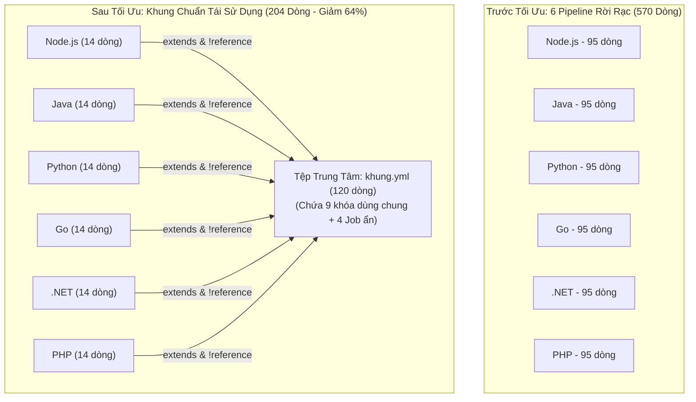
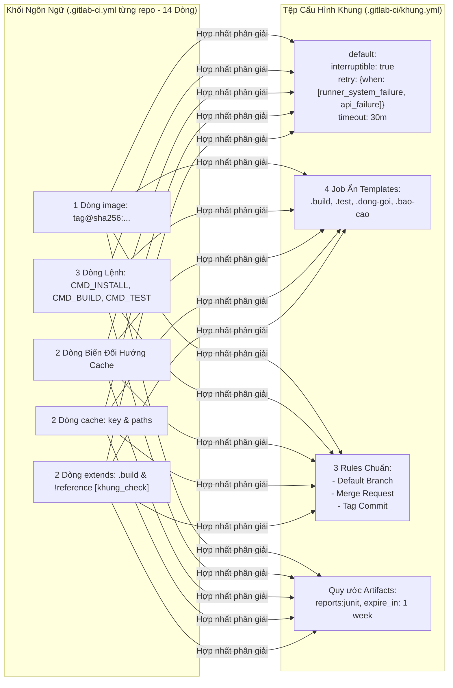
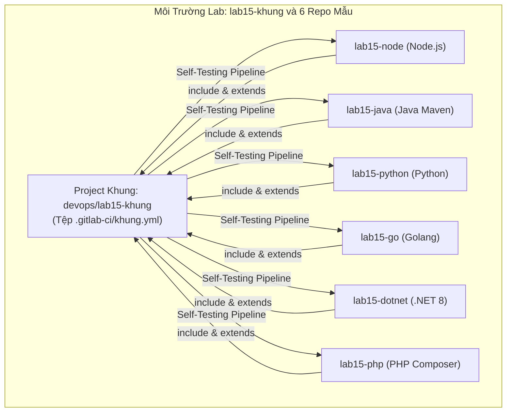


# [BÀI 15] THIẾT KẾ KHUNG CI/CD CHUẨN ĐA NGÔN NGỮ: KIẾN TRÚC POLYGLOT PIPELINE CHO HỆ THỐNG MICROSERVICES

Trong kỷ nguyên **DevOps, DevSecOps và Cloud Native Engineering**, **GitLab CI/CD** được công nhận là một trong những nền tảng tự động hóa tích hợp liên tục và phân phối liên tục (CI/CD) hoàn chỉnh, mạnh mẽ và được tin dùng nhất trong các doanh nghiệp quy mô lớn. Không chỉ dừng lại ở các pipeline tuần tự cơ bản, việc vận hành GitLab CI/CD ở cấp độ Production đòi hỏi kỹ sư phải làm chủ kiến trúc điều phối phi tuyến tính **DAG (Directed Acyclic Graph)**, cơ chế quản trị **Autoscaling Runners**, tối ưu hóa **Caching đa tầng**, xác thực không khóa **Keyless OIDC**, bảo mật chuỗi cung ứng phần mềm **SLSA & SBOM** cùng các chính sách **Quality & Security Gates** tự động.

Bài viết chuyên sâu này sẽ đồng hành cùng bạn mổ xẻ toàn diện bức tranh kiến trúc, phân tích các đánh đổi kỹ thuật thực chiến (Engineering Trade-offs), cung cấp hướng dẫn thực hành Lab chi tiết từng bước và bộ câu hỏi phỏng vấn chuyên sâu chuẩn DevOps Lead / DevSecOps Architect.

---

## 1. Bản Chất Kiến Trúc & Cơ Chế Vận Hành Tầng Thấp

> **Luận đề trung tâm:** Sáu ngôn ngữ chỉ khác nhau ở **BA** chỗ — `image`, ba **LỆNH** (`install` · `build` · `test`), và **THƯ MỤC CACHE** — và trục thứ ba thực chất là một **BIẾN MÔI TRƯỜNG** cộng một đường dẫn. Chín khoá còn lại của một job build dùng chung được cho cả sáu, nên sáu pipeline rời 570 dòng gộp thành khung 120 dòng cộng sáu khối 14 dòng: 204 dòng, giảm 64%. Cái giá của dùng chung là một dòng sai hỏng sáu repo cùng lúc — nên khung phải tự kiểm chính nó và mỗi ngôn ngữ phải có khẳng định riêng.

---


| # | Chủ đề ôn tập | Đáp án chuẩn kỹ thuật và con số bắt buộc |
|---|---|---|
| 1 | Ba nhóm thời gian và ba công cụ đo | Chờ (`queued_duration`), Chuẩn bị (Preparation phases), Việc thật (`script`). Đo bằng `do-hang-doi.sh` (API REST), `doc-pha.sh` (trace log) và phép trừ đại số. Tỉ lệ mẫu: **8% · 42% · 50%** (**Buổi 14 QT 4.1**). |
| 2 | Trần lý thuyết trước khi sửa code | Tính 4 trần trước khi can thiệp YAML: Trần Needs (300s), Trần Parallel (260s), Trần Cache (130s), Trần Image mỏng (95s). Đo thật phải đạt **92–100%** trần lý thuyết (**Buổi 14 QT 5.2**). |
| 3 | Biên độ dao động hệ thống $\pm 8\%$ | Một lần đo đơn lẻ không có giá trị kỹ thuật vì nhiễu CPU/Network. Phải đo **3 lần** lấy giá trị **trung vị (Median)**. Mọi cải thiện nhỏ hơn biên độ dao động $\pm 8\%$ đều chưa có kết luận (**Buổi 14 QT 4.4**). |
| 4 | Ba ca Cache làm Pipeline chạy chậm hơn | (1) Thư mục nhỏ tái tạo nhanh hơn unzip; (2) Giữ `policy: pull-push` ở Job tiêu thụ; (3) Cache S3 mạng MinIO khi chỉ có 1 Runner. Cả 3 ca đều **im lặng, không chặn** (**Buổi 14 QT 6.1**). |
| 5 | Khóa kết quả bằng mã SHA256 Hash | Pipeline nhanh hơn 40% chỉ hợp lệ khi mã SHA256 Hash của hiện vật sản phẩm trước và sau khi tối ưu **giống hệt 100%** (đủ 6 dòng 6 hash trùng khớp) (**Buổi 14 QT 6.3**). |


Trong Giai đoạn 2 (Buổi 08–14), ta đã làm chủ kiến trúc Pipeline nâng cao (DAG `needs:`, `parallel: matrix`, Child/Parent, `include/extends`, Component Catalog, MR Pipeline, Runner Autoscaling và Tối ưu thời gian). Tuy nhiên, các kỹ thuật đó mới áp dụng trên các dự án đơn lẻ.

Khi bước sang **Giai đoạn 3 (Đa ngôn ngữ: Buổi 15–22)**, doanh nghiệp của bạn sở hữu hàng chục repository chạy 6 ngôn ngữ khác nhau (Node.js, Java, Python, Go, .NET, PHP). Nếu mỗi repository tự viết một file `.gitlab-ci.yml` riêng dài 95 dòng, hệ thống sẽ có $6 \times 95 = 570$ dòng mã nguồn trùng lặp rải rác. Khi cần cập nhật quy tắc bảo mật hoặc cơ chế `retry:when`, kỹ sư DevOps phải mở 6 repository sửa 6 lần!

Buổi 15 đặt nền móng cho toàn bộ Giai đoạn 3 bằng việc phân tích định lượng 3 trục biến thiên, trích xuất 9 khóa dùng chung, cô đọng 570 dòng mã thành khung `khung.yml` 120 dòng kết hợp 6 khối ngôn ngữ 14 dòng (tổng 204 dòng, giảm **64%**).



---


| # | Năng lực thực hành | Hiện vật chứng minh định lượng |
|---|---|---|
| 1 | Phân lập chính xác 3 trục biến thiên và 9 khóa dùng chung | Bảng `bang-3-truc-6-ngon-ngu.tsv` gồm 6 dòng dữ liệu và $\ge 9$ cột thuộc tính. |
| 2 | Cấu hình biến đổi hướng thư mục Cache đưa về trong dự án | Script kiểm tra log nạp cache nén $>50\text{ MB}$ cho cả 6 ngôn ngữ thay vì 4 KB rỗng. |
| 3 | Xây dựng tệp `khung.yml` chuẩn $\le 120$ dòng và khối ngôn ngữ $\le 14$ dòng | Tệp cấu hình `khung.yml` và 6 khối ngôn ngữ nộp qua script `dem-dong.sh`. |
| 4 | Thiết lập 12 khẳng định tự động cưỡng chế hiện vật và JUnit test | Log thực thi ép đỏ Job khi phát hiện artifact 0 byte hoặc JUnit 0 test. |
| 5 | Dựng Pipeline tự kiểm tra chính nó (Self-testing Pipeline) | Pipeline trigger 6 repo mẫu chạy song song với cờ `strategy: depend` xanh $100\%$. |

---


| Kiến thức tiên quyết | Nguồn tự học nếu thiếu | Dẫn chiếu quy tắc |
|---|---|---|
| Cơ chế kế thừa `extends` và bẫy thay thế mảng | Buổi 10 — `include-extends-anchor` | **Buổi 10 QT 6.1** |
| Cơ chế nối khối lệnh `!reference` | Buổi 10 — `include-extends-anchor` | **Buổi 10 QT 6.2** |
| Quy tắc Cache paths chỉ nhận đường dẫn trong dự án | Buổi 05 — `artifact-va-cache` | **Buổi 05 QT 4.1** |
| Phân tích log nạp pha bằng `doc-pha.sh` | Buổi 05 — `artifact-va-cache` | **Buổi 05 QT 6.3** |
| Tự kiểm tra cú pháp YAML qua API `POST /ci/lint` | Buổi 03 — `cu-phap-yaml-va-stage` | **Buổi 03 QT 4.3** |

---


### Thuật ngữ Việt – Anh

| Tiếng Việt dùng trong bài | Tiếng Anh tương đương | Dùng thẳng tiếng Anh trong mã? |
|---|---|---|
| Khung chuẩn build | Build framework / Pipeline template | Không (viết tiếng Việt trong prose) |
| Ba trục biến thiên | Axes of variation | Không |
| Khối ngôn ngữ | Language block / Module block | Không |
| Job ẩn (dấu chấm đầu) | Hidden job (`.build`, `.test`) | **Có** (viết `.job_name`) |
| Thư mục cache công cụ | Tool cache directory | Không |
| Biến đổi hướng cache | Cache redirection variable | **Có** (ví dụ `MAVEN_OPTS`, `GOMODCACHE`) |
| Tệp khóa phiên bản | Lockfile (`package-lock.json`, `pom.xml`) | **Có** |
| Khóa cache 3 phần | Three-part cache key | Không |
| Kế thừa Job | Job inheritance (`extends:`) | **Có** |
| Nối khối lệnh | Block splicing (`!reference`) | **Có** |
| Ghép tệp cấu hình | Configuration merge (`include:`) | **Có** |
| Ma trận Job | Job matrix (`parallel: matrix`) | **Có** |
| Báo cáo test chuẩn | Test report (`artifacts:reports:junit`) | **Có** |
| Khẳng định trong script | Script assertion (`[ -s "$ART" ]`) | Không |
| Pipeline tự kiểm chính nó | Self-testing pipeline | Không |
| Thay đổi phá vỡ | Breaking change | Không |
| Đường tải phụ thuộc | Upstream registry | Không |
| Kho trung gian | Remote repository (JFrog Artifactory) | **Có** |

### Bốn mô hình tư duy cốt lõi

1. **Mô hình "Ba trục, Chín khóa":** Trước khi thiết kế khung CI/CD, không đoán mò bằng cảm tính mà phải dùng công cụ `diff-pipeline.sh` chuẩn hóa sáu file qua `POST /ci/lint` rồi chạy `diff`. Kết quả cho thấy đúng **3 trục biến thiên** (`image`, 3 lệnh, thư mục cache) và **9 khóa dùng chung** bất biến.
2. **Mô hình "Trục thứ ba là một Biến môi trường":** Mọi công cụ đóng gói (npm, maven, pip, go, nuget, composer) mặc định ghi cache vào thư mục cá nhân `$HOME` (nằm ngoài workspace dự án). Vì GitLab Runner chỉ nén cache trong thư mục dự án, trục thứ ba thực chất là việc khai báo **một biến môi trường đổi hướng** về trong workspace.
3. **Mô hình "Khung dùng chung là Sản phẩm nội bộ":** Từ thời điểm có từ 2 repository trở lên dùng chung một file `khung.yml`, file đó trở thành một sản phẩm có người dùng. Mọi thay đổi trong khung phải được bảo đảm bằng phiên bản ghim tag, pipeline tự kiểm tra 6 ngôn ngữ, và quy trình kiểm soát 4 dạng thay đổi phá vỡ.
4. **Mô hình "Nhân bản tác động 6 lần":** Dùng chung khung CI/CD giúp một cải tiến được áp dụng cho 6 dự án cùng lúc. Tuy nhiên, nó cũng khiến một lỗi nhỏ trong khung làm sập hoặc làm sai âm thầm cả 6 dự án cùng lúc. Do đó, các khẳng định cưỡng chế tự động là điều kiện sinh tồn bắt buộc.

---

### 1.1. Ba trục biến thiên — và chỉ ba (12 phút)

**Nguyên lý cốt lõi:** Sáu ngôn ngữ khác nhau ở đúng **ba** trục — `image`, **ba lệnh** (`install` · `build` · `test`), **thư mục cache** — còn **chín** khoá khác của một job build dùng chung được cho cả sáu. Ba trục là kết quả phép `diff` sáu tệp **sau khi chuẩn hoá qua `ci/lint`** (**Buổi 03 QT 4.3**, lần thứ 4), không phải ý kiến kiến trúc.

- **Phát biểu.** Sáu ngôn ngữ lập trình phổ biến (Node.js, Java, Python, Go, .NET, PHP) trong môi trường Container chỉ khác nhau ở đúng 3 trục cấu hình: (1) `image` môi trường thực thi; (2) 3 câu lệnh vòng đời (`install`, `build`, `test`); (3) biến môi trường đổi hướng thư mục cache. Tất cả 9 thuộc tính còn lại của Job build hoàn toàn dùng chung được.
**Giải thích cơ chế ngầm:** Về bản chất vận hành, mọi Job build phần mềm đều trải qua cùng một vòng đời: lấy mã nguồn $\to$ kéo phụ thuộc $\to$ biên dịch/đóng gói $\to$ kiểm thử $\to$ xuất hiện vật và báo cáo. Công cụ các ngôn ngữ khác nhau chỉ thay đổi bề mặt thực thi ở 3 chỗ đó.
> [!WARNING]
> **CẠM BẪY THỰC CHIẾN:**
> Tạo 6 file `.gitlab-ci.yml` riêng biệt dài 95 dòng/file ($570$ dòng); khi cần sửa cờ `retry:when` hoặc thời gian `timeout` phải mở 6 repo sửa 6 lần; hoặc tạo một file khung rườm rà nhưng mỗi khối ngôn ngữ vẫn phải định nghĩa lại `stage:`, `rules:`, `artifacts:`.
**Minh hoạ.** Công cụ `diff-pipeline.sh` gửi 6 file YAML qua API `POST /ci/lint`, chuẩn hóa cấu hình sau phân giải, rồi chạy so sánh `diff` từng đôi một để chứng minh chỉ có 3 trục biến thiên.
- **Con số chốt:** **3** trục biến thiên; **9** khóa dùng chung; rút gọn từ **570** dòng ($6 \times 95$) xuống **204** dòng ($120 + 6 \times 14$), giảm **366** dòng = **64%**. Danh sách 9 khóa dùng chung: `stages` (4 stage) · `default:interruptible` · `default:retry:when` · `default:timeout` · **3** rules chuẩn · `artifacts:paths` + `expire_in` · `artifacts:reports:junit` · `artifacts:when: always` · quy ước đặt tên Job & Artifact.

---

**Nguyên lý cốt lõi:** Trục `image` **rẻ nhất để thay** (một dòng) và **đắt nhất khi sai** (không lệnh nào chạy được), nên trong khung dùng chung phải ghim bằng **tag cộng digest**. `latest` trong khung nghĩa là sáu repo đổi hành vi vào một buổi sáng mà không có commit nào.

- **Phát biểu.** Thuộc tính `image:` ở trục 1 quyết định toàn bộ công cụ có sẵn trong Runner. Trong tệp khung dùng chung, Docker Image bắt buộc phải được ghim cố định bằng thẻ phiên bản cụ thể kèm mã SHA256 Digest (ví dụ `node:20.18.0-alpine3.20@sha256:...`). Tuyệt đối cấm dùng thẻ `latest` hoặc tag nổi như `node:20`.
**Giải thích cơ chế ngầm:** `image:` có 3 mức khai báo theo thứ tự ưu tiên (**Buổi 03 QT 7.1**). Runner phải pull Docker Image về máy mỗi khi chạy trên Runner mới (**Buổi 13 QT 6.3**, lần thứ 3). Sử dụng tag nổi làm hình ảnh Docker tự động cập nhật ngầm trên upstream, gây ra lỗi ngẫu nhiên giữa các lần build mà mã nguồn dự án không hề có commit mới.
> [!WARNING]
> **CẠM BẪY THỰC CHIẾN:**
> Job bị đỏ ngay dòng đầu tiên với lỗi `command not found: npm` hoặc `mvn: command not found`; hoặc ngày hôm qua Pipeline xanh nhưng hôm nay đỏ mặc dù lịch sử Git không có commit nào.
**Minh hoạ.** Bảng đối soát 6 Docker Image chính thức với dung lượng nén MB và thời gian kéo đĩa lần đầu:

| Ngôn ngữ | Docker Image chuẩn bị sẵn | Dung lượng nén (MB) | Thời gian kéo đĩa lần đầu (s) |
|---|---|---|---|
| Node.js | `node:20-alpine` | **180 MB** | **8s** |
| Python | `python:3.12-slim` | **150 MB** | **7s** |
| Go | `golang:1.23-alpine` | **350 MB** | **12s** |
| PHP | `php:8.3-cli` | **480 MB** | **16s** |
| Java | `maven:3.9-eclipse-temurin-21` | **620 MB** | **22s** |
| .NET | `mcr.microsoft.com/dotnet/sdk:8.0` | **1.200 MB** | **45s** |

- **Con số chốt:** Tổng dung lượng 6 Image là **2.980 MB ($\approx 2,9\text{ GB}$)**; tổng thời gian kéo đĩa lần đầu là **110s**; chênh lệch dung lượng giữa Image nhỏ nhất và lớn nhất là **8 lần** (150 MB vs 1.200 MB), chênh lệch thời gian kéo là **6,4 lần** (7s vs 45s).

---

**Nguyên lý cốt lõi:** Trục "lệnh" tách thành đúng **ba** bước, không gộp: `install` (đọc lockfile, ghi vào thư mục cache, **không** sinh hiện vật) · `build` (sinh hiện vật) · `test` (sinh báo cáo). Chỉ khi tách thì trục thứ ba mới khớp vào được, vì cache chỉ có nghĩa với `install`.

- **Phát biểu.** Trục thứ hai (Khóa lệnh) bắt buộc phải phân rã thành 3 câu lệnh đơn nhiệm: `CMD_INSTALL` (chỉ tải phụ thuộc vào Cache), `CMD_BUILD` (biên dịch sinh hiện vật), và `CMD_TEST` (kiểm thử sinh báo cáo XML). Khung phải cho phép hai ngôn ngữ Thông dịch (Python và PHP) để trống câu lệnh `CMD_BUILD`.
**Giải thích cơ chế ngầm:** Gộp `install` vào `build` làm mất khả năng đo đạc chính xác thời gian nạp phụ thuộc, khiến không thể tính được điểm hòa vốn của Cache (**Buổi 14 QT 5.2**, lần thứ 2). Gộp `test` vào `build` khiến Job bị dừng ngay khi build lỗi và làm mất báo cáo JUnit XML.
> [!WARNING]
> **CẠM BẪY THỰC CHIẾN:**
> Job `build` kéo dài 180 giây nhưng chỉ chứa một câu lệnh gộp duy nhất trong `script:`; khi học viên hỏi "Cache có giúp nhanh hơn không?" thì không thể trả lời bằng số liệu tách biệt.
**Minh hoạ.** Bảng ma trận 3 lệnh $\times$ 6 ngôn ngữ chuẩn hóa:

| Ngôn ngữ | `CMD_INSTALL` | `CMD_BUILD` | `CMD_TEST` |
|---|---|---|---|
| Node.js | `npm ci` | `npm run build` | `npm test -- --reporter=mocha-junit-reporter` |
| Java | `mvn -B dependency:go-offline` | `mvn -B compile package -DskipTests` | `mvn -B test` |
| Python | `pip install -r requirements.txt` | *(Để trống)* | `pytest --junitxml=report.xml` |
| Go | `go mod download` | `go build -v -o dist/app .` | `gotestsum --junitfile report.xml` |
| .NET | `dotnet restore` | `dotnet build --no-restore -c Release` | `dotnet test --no-build --logger junit` |
| PHP | `composer install --prefer-dist` | *(Để trống)* | `vendor/bin/phpunit --log-junit report.xml` |

- **Con số chốt:** **3** bước lệnh $\times$ **6** ngôn ngữ = **18** ô ma trận. Có đúng **2** ngôn ngữ có ô `CMD_BUILD` để trống (Python và PHP).

---

**Nguyên lý cốt lõi:** Trục "thư mục cache" thực chất là **một biến môi trường cộng một đường dẫn**: mọi công cụ đóng gói ghi cache vào `$HOME` theo mặc định, tức **ngoài** thư mục dự án, tức `cache:paths` **không lấy được** (**Buổi 05 QT 4.1**, lần thứ 3). Phải đặt **một** biến đổi hướng về trong thư mục dự án rồi mới trỏ `cache:paths` vào đó.

- **Phát biểu.** Để GitLab Runner có thể nén và lưu trữ thư mục phụ thuộc của các ngôn ngữ, bắt buộc phải khai báo một biến môi trường đổi hướng (Cache Redirection Variable) để ép công cụ ghi cache vào một thư mục con nằm trong thư mục làm việc của dự án (`$CI_PROJECT_DIR`), sau đó trỏ `cache:paths:` vào thư mục con đó.
**Giải thích cơ chế ngầm:** Mặc định, tất cả các công cụ (npm, maven, pip, go, dotnet, composer) đều ghi cache vào thư mục ẩn trong `$HOME` của user (`/root/.npm`, `/root/.m2`, `/root/.cache`...). Do GitLab Runner chỉ hỗ trợ đóng gói nén zip các tệp nằm tương đối bên trong `$CI_PROJECT_DIR`, nếu trỏ `cache:paths: [/root/.m2]` thì Runner sẽ bỏ qua hoàn toàn và không nén được gì.
> [!WARNING]
> **CẠM BẪY THỰC CHIẾN:**
> Log công cụ hiện `Created cache` với dung lượng chỉ vài KB (hoặc 4 KB) thay vì vài trăm MB; mỗi lần Pipeline chạy lại đều mất nguyên 100% thời gian tải phụ thuộc từ Internet mà không báo lỗi syntax nào (**QT 6.2**).
**Minh hoạ.** Bảng thông số biến đổi hướng, dung lượng Cache chuẩn và thời gian `install` đo bằng `doc-pha.sh`:

| Ngôn ngữ | Biến môi trường đổi hướng Cache | Dung lượng Cache chuẩn (MB) | Thời gian `install` Không Cache $\to$ Có Cache |
|---|---|---|---|
| Node.js | `npm_config_cache=.npm` | **210 MB** | **96s $\to$ 34s** (Nhanh hơn 62s) |
| Java | `MAVEN_OPTS=-Dmaven.repo.local=.m2/repository` | **320 MB** | **180s $\to$ 62s** (Nhanh hơn 118s) |
| Python | `PIP_CACHE_DIR=.cache/pip` | **85 MB** | **54s $\to$ 21s** (Nhanh hơn 33s) |
| Go | `GOMODCACHE=.cache/go-mod`<br/>`GOCACHE=.cache/go-build` *(Cần 2 biến)* | **240 MB**<br/>(140MB mod + 100MB build) | **120s $\to$ 48s** (Nhanh hơn 72s) |
| .NET | `NUGET_PACKAGES=.nuget/packages` | **180 MB** | **72s $\to$ 26s** (Nhanh hơn 46s) |
| PHP | `COMPOSER_CACHE_DIR=.composer-cache` | **60 MB** | **38s $\to$ 17s** (Nhanh hơn 21s) |

- **Con số chốt:** **6** biến đổi hướng (Go là ngôn ngữ duy nhất cần **2** biến); Tổng dung lượng Cache cả 6 ngôn ngữ trên 1 nhánh là **1.095 MB ($\approx 1,1\text{ GB}$)**; Tỷ lệ tiết kiệm thời gian `install` trung bình đạt **$55–65\%$**.

---

### 1.2. Phần dùng chung, và cơ chế nào cho việc gì (10 phút)



**Nguyên lý cốt lõi:** Khung chuẩn gồm đúng **ba** thứ: (1) tệp `.gitlab-ci/khung.yml` chứa **bốn** job ẩn `.build`, `.test`, `.dong-goi`, `.bao-cao` (**Buổi 03 QT 4.2**, lần thứ 3); (2) khối `default` mang `interruptible`, `retry:when`, `timeout`; (3) **quy ước tên** job và artifact. Mỗi ngôn ngữ vào khung bằng **một** khối **14 dòng** khai đúng ba trục và **không khai gì khác**.

- **Phát biểu.** Tệp khung dùng chung `.gitlab-ci/khung.yml` tập trung định nghĩa đúng 4 Job ẩn (`.build`, `.test`, `.dong-goi`, `.bao-cao`), 4 `stages`, khối `default:` tập trung, mảng `rules:` chuẩn và cấu hình `artifacts:`. Mọi repository dự án khi tích hợp chỉ cần một khối cấu hình dài đúng **14 dòng** khai báo 3 trục biến thiên và kéo `extends:` từ Job ẩn.
**Giải thích cơ chế ngầm:** Giới hạn "không khai báo lại các thuộc tính chung" là nguyên tắc cốt lõi giúp khung duy trì giá trị quản trị tập trung. Nếu từng khối ngôn ngữ tự ý viết lại `rules:` hay `retry:`, tính chất "sửa một nơi nâng cấp toàn bộ hệ thống" sẽ bị phá vỡ hoàn toàn.
> [!WARNING]
> **CẠM BẪY THỰC CHIẾN:**
> Khối cấu hình của một dự án kéo dài 40–50 dòng; hoặc chạy câu lệnh `grep -c 'rules:'` trên các file dự án thu được kết quả khác 0.
**Minh hoạ.** Đoạn mã mẫu của tệp `khung.yml` và khối ngôn ngữ Node.js dài 14 dòng:

```yaml
# ==========================================
# MẢNH 1: Tệp khung dùng chung (.gitlab-ci/khung.yml)
# ==========================================
stages:
  - build
  - test
  - dong-goi
  - bao-cao

default:
  interruptible: true
  retry:
    max: 2
    when: [runner_system_failure, api_failure, stuck_or_timeout_failure]
  timeout: 30m

.build_template:
  stage: build
  rules:
    - if: '$CI_COMMIT_BRANCH == $CI_DEFAULT_BRANCH'
    - if: '$CI_PIPELINE_SOURCE == "merge_request_event"'
    - if: '$CI_COMMIT_TAG'
  artifacts:
    name: "dist-$CI_JOB_NAME_SLUG-$CI_COMMIT_REF_SLUG"
    paths:
      - dist/
      - build/
      - report.xml
    reports:
      junit: report.xml
    expire_in: 1 week
    when: always

# ==========================================
# MẢNH 2: Tệp dự án Node.js (.gitlab-ci.yml - ĐÚNG 14 DÒNG)
# ==========================================
include:
  - project: 'devops/khung-pipeline'
    ref: 'v1.0.0'
    file: '.gitlab-ci/khung.yml'

node:build:
  extends: .build_template
  image: node:20.18.0-alpine3.20@sha256:c18b6e680a6538965f329971ec602187
  variables:
    npm_config_cache: ".npm"
    CMD_INSTALL: "npm ci"
    CMD_BUILD: "npm run build"
    CMD_TEST: "npm test -- --reporter=mocha-junit-reporter"
  cache:
    key: "node-$CI_COMMIT_REF_SLUG-${CI_HASH_LOCKFILE}"
    paths:
      - .npm/
```

- **Con số chốt:** **4** Job ẩn template; **4** Stages; **3** Rules chuẩn; Khối ngôn ngữ dài đúng **14** dòng (1 dòng image, 3 dòng lệnh, 2 dòng biến cache, 2 dòng cache key/paths, 1 dòng extends, 5 dòng đính kèm).

---

**Nguyên lý cốt lõi:** `extends` **THAY THẾ** mảng chứ không nối (**Buổi 10 QT 6.1**, lần thứ 3), nên khối ngôn ngữ khai `script` là **xoá sạch** `script` của khung — kể cả phần khẳng định. Có đúng **hai** đường thoát và khung dùng cả hai: đưa lệnh vào **biến**, và dùng `!reference` khi phải **nối** một khối lệnh vào giữa (**Buổi 10 QT 6.2**, lần thứ 2).

- **Phát biểu.** Thuộc tính `extends:` trong GitLab CI thực hiện cơ chế ghi đè ghi đè mảng (Array Replacement) chứ không phải nối mảng (Array Merge). Do đó, nếu một Job con tự ý định nghĩa thuộc tính `script:`, toàn bộ mảng `script:` trong Job cha (chứa các câu lệnh khẳng định cưỡng chế) sẽ bị xóa sạch hoàn toàn. Bắt buộc phải đưa câu lệnh thực thi vào biến (`CMD_BUILD`) hoặc dùng cú pháp `!reference` để chèn khối lệnh.
**Giải thích cơ chế ngầm:** Mảng `script:` trong Job ẩn template của khung chứa các câu lệnh kiểm tra hiện vật tự động của QT 6.3. Khi Job con khai báo `script:` trực tiếp, các câu lệnh khẳng định này biến mất một cách im lặng, khiến Job bị mất khả năng phát hiện hiện vật rỗng.
> [!WARNING]
> **CẠM BẪY THỰC CHIẾN:**
> Gửi cấu hình qua API `POST /ci/lint`, kiểm tra mảng `script` sau phân giải thấy chỉ có 1 phần tử thay vì 5 phần tử; hoặc hiện vật sinh ra bị rỗng 0 byte nhưng Job vẫn xanh.
**Minh hoạ.** Cấu hình đúng sử dụng biến kết hợp `!reference` trong tệp `khung.yml`:

```yaml
.khung_assertions:
  script:
    - |
      echo "[CHECK 1] Kiểm tra hiện vật tồn tại..."
      if [ ! -s "dist/app.tar.gz" ]; then
        echo "LỖI: Hiện vật rỗng hoặc không tồn tại!"
        exit 1
      fi
    - |
      echo "[CHECK 2] Kiểm tra file JUnit test report..."
      TEST_COUNT=$(grep -c '<testcase' report.xml || echo "0")
      if [ "$TEST_COUNT" -eq 0 ]; then
        echo "LỖI: Báo cáo JUnit chứa 0 testcase!"
        exit 1
      fi

.build_template:
  stage: build
  script:
    - eval "$CMD_INSTALL"
    - if [ -n "$CMD_BUILD" ]; then eval "$CMD_BUILD"; fi
    - eval "$CMD_TEST"
    - !reference [.khung_assertions, script]
```

- **Con số chốt:** Mảng `script:` của khung gồm **5** dòng (3 dòng lệnh biến + **2** khẳng định cưỡng chế). Khai báo `script:` trực tiếp ở Job con làm mất **4** dòng (trong đó có 2 dòng khẳng định bảo vệ).

---

**Nguyên lý cốt lõi:** `parallel:matrix` **không** phải cơ chế gộp sáu ngôn ngữ — nó là cơ chế cho **một** ngôn ngữ **nhiều phiên bản**. Matrix sinh job theo tích Descartes từ **một** định nghĩa job (**Buổi 08 QT 6.2**, lần thứ 2) nên sáu ngôn ngữ dùng chung một tên job gốc và **một** khối `cache`; ngoài ra việc `cache:paths` có nhận giá trị từ biến matrix hay không là hành vi **phải đo**.

- **Phát biểu.** Cú pháp `parallel: matrix` chỉ được sử dụng để nhân bản các Job kiểm thử đa phiên bản cho **một** ngôn ngữ lập trình cụ thể (ví dụ Node.js phiên bản 18, 20, 22). Tuyệt đối không sử dụng `parallel: matrix` để gộp 6 ngôn ngữ lập trình vào chung 1 Job definition.
**Giải thích cơ chế ngầm:** Khi gộp 6 ngôn ngữ bằng matrix, tất cả các Job con sẽ sinh ra từ cùng một tên Job gốc và chia sẻ chung một cấu hình `cache:key`. Điều này dẫn đến sự cố trúng cache của ngôn ngữ khác (**QT 6.1**) và mất khả năng phân rã điều kiện `rules:changes` theo từng module thư mục trong dự án Monorepo ở Buổi 22.
> [!WARNING]
> **CẠM BẪY THỰC CHIẾN:**
> Cả 6 ngôn ngữ đều hiển thị cùng một tên Job trên giao diện GitLab UI; hoặc log chạy báo `cache:paths` không nhận diện được biến môi trường do chưa mở rộng biến trong pha chuẩn bị.
**Minh hoạ.** Phân biệt ca sử dụng Matrix đúng và sai:

```yaml
# ==========================================
# CA ĐÚNG: Matrix cho 1 ngôn ngữ nhiều phiên bản (Node 18, 20, 22)
# ==========================================
node:test_matrix:
  extends: .build_template
  parallel:
    matrix:
      - NODE_VERSION: ["18", "20", "22"]
  image: node:${NODE_VERSION}-alpine
  variables:
    npm_config_cache: ".npm"
    CMD_INSTALL: "npm ci"
    CMD_TEST: "npm test"
  cache:
    key: "node-${NODE_VERSION}-$CI_COMMIT_REF_SLUG"
    paths:
      - .npm/

# ==========================================
# CA CẤM: Matrix dùng để gộp 6 ngôn ngữ khác nhau (SAI KIẾN TRÚC)
# ==========================================
# Gây trùng Cache key, mất tên Job riêng, không phân lập được rules:changes!
```

- **Con số chốt:** Matrix chỉ hợp lệ cho **1** ngôn ngữ với $N$ phiên bản. Cấm gộp **6** ngôn ngữ vào **1** Matrix. Phiên bản kiểm chứng hành vi mở rộng biến: **GitLab CE 17.7 · Runner 17.7**.

---

### 1.3. Ba chế độ hỏng của khung dùng chung — cả ba im lặng (8 phút)

**Nguyên lý cốt lõi:** Khoá cache của khung phải có đúng **ba** phần — `<ngôn ngữ hoặc module>` + `<nhánh hoặc "chung">` + `<hash lockfile của chính ngôn ngữ đó>` — vì hai ngôn ngữ dùng chung một khoá cho ra ca **trúng cache của ngôn ngữ khác**: job giải nén một thư mục lạ, `install` chạy tiếp, job **xanh**, hiện vật build từ một cây phụ thuộc không ai khai.

- **Phát biểu.** Thuộc tính `cache:key` trong tệp cấu hình bắt buộc phải kết hợp đúng 3 thành phần phân lập: `<tên-ngôn-ngữ> + <tên-nhánh> + <hash-lockfile>`. Cấu hình mẫu: `key: "${CI_JOB_NAME_SLUG}-$CI_COMMIT_REF_SLUG-${CI_HASH_LOCKFILE}"`.
**Giải thích cơ chế ngầm:** Pha khôi phục Cache diễn ra tại Pha 3 của Job, nằm trước khi câu lệnh `script:` thực thi (**Buổi 05 QT 6.1**, lần thứ 2). GitLab Runner hoàn toàn không kiểm tra nội dung bên trong file zip cache có đúng cấu trúc của ngôn ngữ hiện tại hay không. Nếu hai ngôn ngữ dùng chung một `cache:key` (ví dụ `$CI_COMMIT_REF_SLUG`), Job của Python sẽ giải nén đè thư mục cache của Java! Lệnh `install` thấy file tồn tại nên bỏ qua bước tải, dẫn tới Job vẫn báo xanh nhưng sản phẩm build ra bị sai lệch nghiêm trọng.
> [!WARNING]
> **CẠM BẪY THỰC CHIẾN:**
> Log hiển thị `Successfully extracted cache` nhưng câu lệnh `install` mất nguyên 100% thời gian chạy; hoặc dung lượng cache nạp về không khớp với bảng dung lượng chuẩn của ngôn ngữ.
**Minh hoạ.** So sánh dung lượng đĩa và tính chính xác giữa khóa cache sai và khóa cache 3 phần:

```
[CA SAI] Hai ngôn ngữ Node và Java cùng dùng key: "$CI_COMMIT_REF_SLUG"
  - Node build: Nén .npm (210 MB) đẩy lên key "main"
  - Java build: Tải key "main" (giải nén 210 MB của Node vào .m2 -> LỖI ÂM THẦM!)
  - Java build: Nén .m2 (320 MB) ĐÈ LÊN key "main"
  => Dung lượng lưu trữ S3: 320 MB (Mất hẳn cache của Node!)
  => Hậu quả: Job xanh nhưng nạp nhầm phụ thuộc, build sai sản phẩm!

[CA ĐÚNG] Khóa 3 phần: "node-main-hash123" và "java-main-hash456"
  - Node cache: 210 MB (Độc lập 100%)
  - Java cache: 320 MB (Độc lập 100%)
  => Dung lượng tổng đĩa: 530 MB (Đúng chuẩn phân lập)
```

- **Con số chốt:** Khóa Cache bắt buộc **3** phần. Khóa dùng chung trùng lặp làm dung lượng lưu trữ hiển thị **320 MB** thay vì **1.095 MB** (giảm 71% đĩa giả tạo), chứng tỏ 5 ngôn ngữ đã bị ghi đè mất Cache.

---

**Nguyên lý cốt lõi:** `cache:paths` trỏ vào đường dẫn **ngoài** thư mục dự án cho ra cache **rỗng** với **0** dòng lỗi: runner ghi một dòng rồi chạy tiếp (**Buổi 05 QT 4.3**, lần thứ 2), job xanh, tỉ lệ trúng **0%** mãi mãi. Cách bắt duy nhất là **kiểm kích thước cache bằng lệnh**.

- **Phát biểu.** Nếu thuộc tính `cache:paths:` trỏ vào một đường dẫn tuyệt đối nằm ngoài thư mục làm việc `$CI_PROJECT_DIR` (ví dụ `/root/.m2/repository`), GitLab Runner sẽ im lặng bỏ qua và tạo ra file cache nén zip chỉ nặng 4 KB (chứa thư mục rỗng) mà không hề bắn ra bất kỳ dòng cảnh báo lỗi nào.
**Giải thích cơ chế ngầm:** GitLab Runner được thiết kế để đảm bảo an toàn hệ thống, không cho phép Job truy cập hoặc đóng gói các đường dẫn hệ thống ngoài thư mục làm việc của dự án. Vì việc thiếu Cache không làm dừng Job (Cache chỉ là lớp tối ưu), Pipeline vẫn hoàn thành thành công.
> [!WARNING]
> **CẠM BẪY THỰC CHIẾN:**
> Dòng log `Created cache` báo dung lượng đĩa dưới **1 MB** (hoặc đúng 4 KB); tỉ lệ trúng Cache (Cache Hit Rate) luôn bằng **0%** bất kể chạy lại bao nhiêu lần.
**Minh hoạ.** So sánh kết quả log giữa hai cách khai báo Cache cho Java Maven:

```
# CA SAI: Trỏ đường dẫn ngoài dự án
cache:
  paths:
    - /root/.m2/repository
--> LOG RUNNER: "Archive failure: ... Created cache: 4 KB" (JOB XANH, CACHE RỖNG!)

# CA ĐÚNG: Khai báo MAVEN_OPTS đổi hướng về trong dự án
variables:
  MAVEN_OPTS: "-Dmaven.repo.local=.m2/repository"
cache:
  paths:
    - .m2/repository/
--> LOG RUNNER: "Created cache: 320 MB" (JOB XANH, CACHE CHUẨN!)
```

- **Con số chốt:** Dung lượng Cache tối thiểu hợp lệ của một ngôn ngữ phải **$\ge 50\text{ MB}$**. Sai biệt dung lượng giữa ca sai và ca đúng đối với Java: **4 KB** vs **320 MB** (Chênh lệch **80.000 lần**).

---

**Nguyên lý cốt lõi:** Mỗi khối ngôn ngữ phải mang đúng **hai** khẳng định, và chúng nằm trong `script` của **khung**: (1) hiện vật tồn tại và **không rỗng**; (2) báo cáo test có **số test lớn hơn 0**. Job xanh không chứng minh build đã chạy (**Buổi 01 QT 7.2**, lần thứ 7), và với sáu ngôn ngữ thì "xanh mà không có gì" nhân lên sáu lần (**Buổi 01 QT 7.3**, lần thứ 5).

- **Phát biểu.** Tệp `khung.yml` bắt buộc phải tự động chèn 2 câu lệnh khẳng định cưỡng chế vào mảng `script:` của mọi Job: (1) Khẳng định hiện vật sản phẩm (`dist/`, `.jar`, `.tar.gz`) tồn tại và có dung lượng lớn hơn ngưỡng tối thiểu `MIN_ARTIFACT_BYTES`; (2) Khẳng định file báo cáo JUnit XML tồn tại và chứa số lượng testcase $>0$.
**Giải thích cơ chế ngầm:** Hai lỗi phổ biến nhất của các công cụ build/test là: công cụ biên dịch thành công nhưng xuất file ra sai thư mục, hoặc công cụ test không tìm thấy file test nào nên báo 0 test và trả về mã exit code 0. Nếu không có 2 khẳng định này, Job vẫn xanh $100\%$ nhưng hệ thống phát hành một gói hàng rỗng lên Production.
> [!WARNING]
> **CẠM BẪY THỰC CHIẾN:**
> Tải file artifact từ giao diện GitLab xuống thấy file zip rỗng 0 byte nhưng Job `build` vẫn báo xanh; hoặc giao diện Test Summary hiển thị "0 tests executed" suốt 3 tháng mà không ai phát hiện.
**Minh hoạ.** Đoạn mã script khẳng định cưỡng chế và bảng ngưỡng dung lượng cho 6 ngôn ngữ:

```bash
# Khẳng định 1: Kiểm tra hiện vật không rỗng
ACTUAL_BYTES=$(stat -c %s "$ARTIFACT_PATH" 2>/dev/null || echo "0")
if [ "$ACTUAL_BYTES" -lt "$MIN_ARTIFACT_BYTES" ]; then
  echo "LỖI KỸ THUẬT: Hiện vật $ARTIFACT_PATH chỉ nặng $ACTUAL_BYTES bytes (Nhỏ hơn ngưỡng $MIN_ARTIFACT_BYTES bytes)!"
  exit 1
fi

# Khẳng định 2: Kiểm tra JUnit testcase > 0
TEST_COUNT=$(grep -c '<testcase' "$JUNIT_REPORT_PATH" || echo "0")
if [ "$TEST_COUNT" -le 0 ]; then
  echo "LỖI KỸ THUẬT: Báo cáo JUnit $JUNIT_REPORT_PATH không chứa testcase nào!"
  exit 1
fi
```

| Ngôn ngữ | Đường dẫn hiện vật mẫu | Ngưỡng `MIN_ARTIFACT_BYTES` tối thiểu |
|---|---|---|
| Node.js | `dist/app.tar.gz` | **20.480 bytes (20 KB)** |
| Java | `target/app.jar` | **512.000 bytes (500 KB)** |
| Python | `dist/app-py3-none-any.whl` | **10.240 bytes (10 KB)** |
| Go | `dist/server-binary` | **1.048.576 bytes (1 MB)** |
| .NET | `bin/Release/net8.0/publish/` | **256.000 bytes (250 KB)** |
| PHP | `vendor/build-manifest.json` | **10.240 bytes (10 KB)** |

- **Con số chốt:** **2** câu lệnh khẳng định $\times$ **6** ngôn ngữ = **12** dòng kiểm soát tự động; Thời gian thực thi cực nhanh chỉ tốn **$\approx 0,3\text{s}$/job** (Tổng $\approx 2\text{s}$ toàn bộ Pipeline).

---

### 1.4. Ranh giới: khung, component, monorepo, trục thứ tư (4 phút)

**Nguyên lý cốt lõi:** Buổi này dừng ở `include` + `extends` + `!reference` và **không** đóng gói khung thành component. Câu hỏi **thứ năm** thêm vào bốn câu của buổi 10 QT 7.1: *khung này có người dùng ngoài group của ta không, và họ có cần ghim phiên bản độc lập với ta không?* Không cho cả hai → `include:project` ghim tag là đủ; có cho một trong hai → component (buổi 11), và đóng thành sản phẩm nội bộ có `CHANGELOG` là **buổi 44**.

- **Phát biểu.** Kiến trúc bài học Buổi 15 dừng lại ở mức tổ chức tệp khung chuẩn bằng `include:project` kết hợp `extends:` và `!reference`. Không vội vã đóng gói khung thành CI/CD Component Catalog khi hệ thống chưa đạt đủ quy mô tổ chức.
**Giải thích cơ chế ngầm:** CI/CD Component (Buổi 11) yêu cầu chi phí đóng gói ban đầu cao hơn (`spec:inputs`, cấu trúc thư mục `templates/`, phát hành release tag). Nếu các dự án cùng nằm trong 1 GitLab Group và do 1 đội ngũ DevOps quản lý, việc dùng `include:project` ghim tag phiên bản vừa đảm bảo tính tái lập 100% vừa tiết kiệm công sức vận hành.
> [!WARNING]
> **CẠM BẪY THỰC CHIẾN:**
> Tạo ra một CI/CD Component rườm rà với 20 tham số `inputs` chỉ để phục vụ 2 repository cùng phòng làm việc; mỗi lần thay đổi 1 dòng code phải thực hiện quy trình release 3 bước.
**Minh hoạ.** Bảng 5 câu hỏi quyết định lựa chọn cơ chế tái sử dụng CI/CD:

| # | Câu hỏi quyết định | Lựa chọn `include:project` ghim Tag | Lựa chọn CI/CD Component Catalog |
|---|---|---|---|
| 1 | Phạm vi người dùng | Trong cùng 1 GitLab Group / Đội ngũ nội bộ | Nhiều Group / Đội ngũ phát triển độc lập |
| 2 | Quy mô Repository | $<10$ repositories | $\ge 10$ repositories hoặc $\ge 3$ Groups |
| 3 | Khả năng ghim phiên bản | Ghim bằng Git Tag (`ref: 'v1.0.0'`) | Ghim bằng Component Version (`@1.0.0`) |
| 4 | Kiểm tra kiểu dữ liệu đầu vào | Không hỗ trợ `spec:inputs` | Hỗ trợ bắt buộc `spec:inputs` |
| 5 | Chi phí bảo trì và Release | Rất thấp (Merge commit là xong) | Trung bình (Cần quy trình Release sản phẩm) |

- **Con số chốt:** **5** câu hỏi quyết định; Ngưỡng chuyển đổi từ Khung sang Component theo kinh nghiệm thực tế là từ **3 Groups** hoặc **10 Repositories** trở lên.

---

**Nguyên lý cốt lõi:** Từ lúc hai repo dùng chung một tệp, **một dòng sai hỏng sáu repo cùng lúc**, nên khung phải có đủ **ba** thứ trước khi có repo thứ hai dùng nó: (1) `include:project` ghim `ref` bằng **tag**, không bằng nhánh (**Buổi 10 QT 7.2**, lần thứ 3); (2) **pipeline tự kiểm chính nó** chạy đủ **sáu** ngôn ngữ trên sáu repo mẫu (**Buổi 11 QT 7.1**, lần thứ 2); (3) danh sách kiểm **bốn** dạng thay đổi phá vỡ của buổi 11 QT 5.3 áp cho khung.

- **Phát biểu.** Trước khi cho repository thứ 2 kết nối vào tệp `khung.yml`, dự án chứa tệp khung phải được trang bị đủ 3 cơ chế bảo vệ: (1) Bắt buộc ghim `ref:` bằng Git Tag tĩnh; (2) Thiết lập Pipeline tự kiểm tra (Self-testing Pipeline) chạy thử nghiệm 6 repo mẫu; (3) Kiểm soát nghiêm ngặt 4 dạng thay đổi phá vỡ (Breaking Changes).
**Giải thích cơ chế ngầm:** Trong số 4 dạng thay đổi phá vỡ (**Buổi 11 QT 5.3**), có tới 3 dạng không làm thay đổi cú pháp YAML của người dùng (đổi giá trị mặc định, đổi tên Job, đổi đường dẫn hiện vật). Chúng sẽ gây ra lỗi im lặng ở tất cả các dự án sử dụng nếu không có Pipeline tự kiểm tra phát hiện trước khi Merge.
> [!WARNING]
> **CẠM BẪY THỰC CHIẾN:**
> Một Merge Request sửa đổi tệp khung được Merge vào nhánh chính mà không có Job kiểm thử nào chạy; 2 ngày sau cả 6 dự án báo lỗi không tìm thấy hiện vật build.
**Minh hoạ.** Cấu hình `.gitlab-ci.yml` của chính repository chứa tệp khung (`lab15-khung`):

```yaml
# Pipeline tự kiểm tra của tệp khung
stages:
  - self_test

trigger_6_sample_repos:
  stage: self_test
  parallel:
    matrix:
      - SAMPLE_REPO: ["lab15-node", "lab15-java", "lab15-python", "lab15-go", "lab15-dotnet", "lab15-php"]
  trigger:
    project: "devops/sample-repos/$SAMPLE_REPO"
    strategy: depend # Ép kết quả thành bại của 6 repo mẫu phản ánh trực tiếp lên Pipeline cha!
```

- **Con số chốt:** **3** điều kiện bảo vệ; **6** repository mẫu thử nghiệm; **4** dạng thay đổi phá vỡ; Chi phí thời gian Pipeline tự kiểm tra ngốn **$\approx 6$ phút Runner** (6 job $\times$ ~60s) cho mỗi lần cập nhật khung.

---

**Nguyên lý cốt lõi:** Có một **trục thứ tư** buổi này **chưa** dựng nhưng phải để chỗ sẵn: **đường tải phụ thuộc**. Hôm nay sáu ngôn ngữ tải trực tiếp từ sáu registry công khai; từ buổi 24 cả sáu đổi sang **remote repository của JFrog Artifactory** — đường chuẩn của khoá. Việc để chỗ tốn đúng **6 dòng biến**; không có sáu dòng đó thì buổi 24 phải sửa sáu khối ngôn ngữ.

- **Phát biểu.** Trong tệp `khung.yml`, phải khai báo sẵn 6 biến môi trường định vị đường tải phụ thuộc (Upstream Registry Variables) với giá trị mặc định trỏ về các Registry công khai trên Internet. Để sẵn cổng kết nối giúp Buổi 24 dễ dàng chuyển hướng toàn bộ sang JFrog Artifactory chỉ bằng 1 biến ở cấp Group.
**Giải thích cơ chế ngầm:** Đổi đường tải phụ thuộc thực chất là việc điều hướng địa chỉ tải gói của 6 ngôn ngữ. Nếu không khai báo sẵn 6 biến này trong khung từ Buổi 15, khi sang Buổi 24 kỹ sư DevOps sẽ phải mở lại mã nguồn của cả 6 repository để chèn biến thủ công.
> [!WARNING]
> **CẠM BẪY THỰC CHIẾN:**
> Đến Buổi 24 phải can thiệp chỉnh sửa file YAML của tất cả các dự án thành viên; hoặc từng dự án tự cấu hình địa chỉ Registry riêng lẻ khiến không thể kiểm soát an toàn chuỗi cung ứng.
**Minh hoạ.** 6 dòng biến dự phòng sẵn trong tệp `khung.yml`:

```yaml
variables:
  # Trục thứ 4: Đường tải phụ thuộc (Chờ kích hoạt JFrog Artifactory ở Buổi 24)
  NPM_REGISTRY: "https://registry.npmjs.org/"
  MAVEN_MIRROR_URL: "https://repo.maven.apache.org/maven2/"
  PIP_INDEX_URL: "https://pypi.org/simple"
  GOPROXY: "https://proxy.golang.org,direct"
  NUGET_SOURCE: "https://api.nuget.org/v3/index.json"
  COMPOSER_REPO_URL: "https://packagist.org"
```

- **Con số chốt:** **6** dòng biến đường tải phụ thuộc; **1** biến thay đổi ở cấp Group tại Buổi 24 sẽ tự động kích hoạt chuyển hướng toàn bộ hệ thống sang JFrog Artifactory.

---

### 1.5. Đưa vào việc thật (4 phút)

### Áp vào repo đang chạy thì làm gì trước

1. **Bước 1 (20 phút - Không đụng vào code):** Chạy script `diff-pipeline.sh` trên 2 tệp `.gitlab-ci.yml` thật trong công ty. Đếm số lượng khóa trùng nhau để đưa ra con số định lượng thực tế trước khi thuyết phục đội nhóm.
2. **Bước 2 (30 phút):** Kiểm tra dung lượng thư mục Cache của 1 dự án bằng lệnh `du -sh` trong Job log. Nếu Cache chỉ nặng dưới 50 MB cho Java/Node/Go/.NET, lập tức thêm 1 dòng biến môi trường đổi hướng Cache (**QT 4.4**) để tiết kiệm ngay $50–65\%$ thời gian `install`.
3. **Bước 3 (1 giờ):** Tạo tệp `khung.yml` cho 2 ngôn ngữ dùng nhiều nhất trong công ty. Đặt ở repository riêng, ghim Git Tag `v1.0.0` và áp dụng thử nghiệm cho đúng 1 dự án trước.
4. **Bước 4 (Trước khi mở rộng sang Repo 2):** Thiết lập Pipeline tự kiểm tra (Self-testing Pipeline) (**QT 7.2**) để bảo đảm an toàn tuyệt đối.

### Cái gì hỏng nếu áp thẳng lên prod

- **Lỗi trúng Cache giữa các ngôn ngữ:** Đổi khung nhưng dùng lại `cache:key` chung làm các ngôn ngữ đè cache lên nhau (**QT 6.1**). *Cách áp thử an toàn:* Cấu hình `cache:policy: pull` trong 1 tuần đầu để kiểm thử mà không ghi đè cache cũ.
- **Bẫy `extends` làm mất câu lệnh kiểm tra:** Dự án tự viết lại mảng `script:` khiến các câu lệnh khẳng định cưỡng chế bị xóa sạch (**QT 5.2**). *Cách áp thử an toàn:* Chạy API `POST /ci/lint` kiểm tra số lượng phần tử trong mảng `script` trước khi Merge.
- **Đổi tên Job và đường dẫn Artifact:** Đổi tên Job khiến các thuộc tính `needs:` hoặc script CD bên ngoài bị đứt gãy. *Cách áp thử an toàn:* Duy trì song song cả 2 tên đường dẫn hiện vật trong 1 chu kỳ phát hành.

### Đo trước — đo sau

| Chỉ số đo đạc | Trước khi tối ưu | Sau khi tối ưu khung chuẩn |
|---|---|---|
| Tổng số dòng mã YAML CI/CD | 570 dòng (6 repo $\times$ 95 dòng) | **204 dòng** (Khung 120d + 6 $\times$ 14d - Giảm **64%**) |
| Dung lượng Cache thực tế thu được | 4 KB (Cache rỗng do trỏ ngoài) | **1.095 MB** (Đủ 6 ngôn ngữ nén trong workspace) |
| Thời gian nạp phụ thuộc `install` | 560 giây (Tổng 6 ngôn ngữ) | **208 giây** (Tiết kiệm **352 giây = 62,8%**) |
| Số nơi phải sửa khi đổi quy tắc | 6 repositories rải rác | **1 tệp duy nhất** (`khung.yml`) |

### Khi nào KHÔNG nên dùng

- **Không dùng Khung cho dự án chỉ có 1 ngôn ngữ duy nhất:** Nếu công ty chỉ làm duy nhất mã nguồn Node.js, việc tạo tệp khung dùng chung chỉ làm phức tạp hóa hệ thống. Hãy dùng YAML Anchor trong cùng 1 file (**Buổi 10 QT 7.1**).
- **Không gộp 6 ngôn ngữ bằng `parallel: matrix`:** Matrix làm mất tên Job riêng và gây trùng khóa Cache (**QT 5.3**).
- **Không đóng gói thành CI/CD Component khi chưa đủ quy mô:** Nếu chỉ có 1-2 dự án cùng 1 đội quản lý, dùng `include:project` ghim Tag là đủ (**QT 7.1**).
- **Không nén Cache khi thời gian giải nén lớn hơn tải mới:** Với dự án PHP quá nhỏ (Cache 60 MB, tạo lại 38s), Cache nằm sát điểm hòa vốn và có thể bị tắt nếu có mạng LAN tốc độ cao.

---

### 1.6. Bẫy hay gặp (2 phút)

1. **Bẫy thiết kế khung bằng cảm tính:** Đoán mò các thuộc tính giống nhau thay vì gửi 6 file qua API `POST /ci/lint` rồi chạy `diff` (**QT 4.1**).
2. **Bẫy `cache:paths` trỏ `/root/.m2`:** Trỏ đường dẫn ngoài workspace làm Runner tạo cache 4 KB rỗng mà không báo lỗi (**QT 4.4**, **QT 6.2**).
3. **Bẫy quên Go cần 2 biến cache:** Ngôn ngữ Go cần cả `GOMODCACHE` và `GOCACHE`; nếu thiếu 1 biến thì build sẽ chậm đi 2–4 lần.
4. **Bẫy dùng chung `cache:key` cho nhiều ngôn ngữ:** Dùng `$CI_COMMIT_REF_SLUG` chung khiến Python đè cache lên Java làm Job xanh mà build sai (**QT 6.1**).
5. **Bẫy `extends` ghi đè `script`:** Khai báo `script:` trực tiếp ở Job con làm mất sạch 2 khẳng định cưỡng chế của khung (**QT 5.2**).
6. **Bẫy `image: latest` trong khung:** Dùng tag `latest` làm cả 6 repo bị thay đổi hành vi đột ngột trên Production mà không có commit nào (**QT 4.2**).
7. **Bẫy tin Job xanh là build đã chạy:** Công cụ test không tìm thấy file test báo 0 test vẫn trả về exit 0; bắt buộc dùng khẳng định cưỡng chế JUnit $>0$ (**QT 6.3**).

---

### 1.7. Tóm tắt và sơ đồ tư duy

```
                        KHUNG CHUẨN BUILD ĐA NGÔN NGỮ
                                      │
     ┌────────────────────────────────┼────────────────────────────────┐
     ▼                                ▼                                ▼
[BA TRỤC BIẾN THIÊN]        [PHẦN DÙNG CHUNG]              [BA CHẾ ĐỘ HỎNG]
 - Image: Tag + Digest       - 4 Job ẩn templates           - Trúng cache ngôn ngữ khác
 - 3 Lệnh: install/build/test - Default: retry/timeout        - Cache paths ngoài workspace
 - Thư mục Cache: Biến môi   - 3 Rules chuẩn                - extends xoá script khẳng định
   trường đổi hướng           - Khối ngôn ngữ 14 dòng        - Cả 3 đều IM LẶNG!
```

---

### 1.8. Câu hỏi tự kiểm tra

1. Tại sao nói sáu ngôn ngữ lập trình chỉ khác nhau ở đúng 3 trục biến thiên, và 9 thuộc tính còn lại được gọi tên là gì?
2. Tại sao cờ `cache:paths: [/root/.m2]` làm Runner tạo file cache 4 KB và cách sửa bằng một biến môi trường duy nhất?
3. Hiện tượng gì xảy ra khi hai ngôn ngữ Node.js và Python dùng chung một thuộc tính `cache:key: $CI_COMMIT_REF_SLUG`?
4. Tại sao khai báo `script:` trực tiếp trong Job con lại làm mất 2 câu lệnh khẳng định cưỡng chế của tệp khung `khung.yml`?
5. Ba điều kiện an toàn bắt buộc phải có trước khi cho repository thứ hai kết nối vào tệp khung dùng chung là gì?

---

## §12. Tài liệu tham khảo

1. GitLab CI/CD Include keyword reference: `https://docs.gitlab.com/ee/ci/yaml/includes.html`
2. GitLab CI/CD Cache dependencies best practices: `https://docs.gitlab.com/ee/ci/caching/`
3. Docker Official Images Registry: `https://hub.docker.com/_/node`, `https://hub.docker.com/_/maven`
4. JUnit XML format specification: `https://llg.cubic.org/docs/junit/`

---

## Bảng đối soát thời lượng

| Mục | Nội dung | Thời lượng |
|---|---|---|
| §0 | Khởi động và ôn tập | 10 phút |
| §1 | Sau buổi này học viên làm được gì | 1 phút |
| §2 | Cần biết trước | 1 phút |
| §3 | Thuật ngữ và mô hình tư duy | 8 phút |
| §4 | Ba trục biến thiên — và chỉ ba | 12 phút |
| §5 | Phần dùng chung, và cơ chế nào cho việc gì | 10 phút |
| §6 | Ba chế độ hỏng của khung dùng chung — cả ba im lặng | 8 phút |
| §7 | Ranh giới: khung, component, monorepo, trục thứ tư | 4 phút |
| §8 | Đưa vào việc thật | 4 phút |
| §9 | Bẫy hay gặp | 2 phút |
| **Tổng** | **Khối lý thuyết hoàn chỉnh** | **60'** |

---

## 2. Hướng Dẫn Thực Hành & Triển Khai Lab Chuẩn Production

> [!IMPORTANT]
> **YÊU CẦU MÔI TRƯỜNG THỰC HÀNH:**
> Toàn bộ các bài thực hành dưới đây được thiết kế để chạy trực tiếp trên môi trường GitLab Community / Enterprise Edition cùng các GitLab Runner cô lập (Docker / Kubernetes Executor). Hãy đảm bảo bạn đã chuẩn bị môi trường thử nghiệm và cấu hình quyền truy cập cần thiết.

## Khối Thực hành Lab — 150 phút (**150'**)

> **Mục tiêu thực hành:** Dựng hoàn chỉnh tệp khung CI/CD chuẩn `khung.yml` phục vụ 6 ngôn ngữ lập trình (Node.js, Java, Python, Go, .NET, PHP), đo đạc phân lập 3 trục biến thiên, thiết lập 6 biến môi trường đổi hướng Cache thu về $>1\text{ GB}$ Cache thực tế, xử lý 3 chế độ hỏng im lặng, cài đặt 12 khẳng định cưỡng chế tự động và hoàn thiện Pipeline tự kiểm tra 6 repository mẫu.



---


Trước khi bắt đầu, kỹ sư DevOps phải kiểm tra dung lượng đĩa trống trên máy chủ GitLab Runner. Do bài lab này kéo 6 Docker Image (tổng 2,9 GB) và tạo ra hơn 1,1 GB Cache nén zip cho 6 ngôn ngữ, ổ đĩa chứa Docker Runner phải có ít nhất **20 GB** dung lượng rỗi.

```bash
# Kiểm tra dung lượng đĩa rỗi trên máy Runner
df -h /var/lib/docker

# Tạo thư mục làm việc bài lab 15
mkdir -p ~/lab15-khung-da-ngon-ngu
cd ~/lab15-khung-da-ngon-ngu

# Khởi tạo cấu trúc thư mục chứa tệp khung và 6 repo mẫu
mkdir -p .gitlab-ci
mkdir -p repos/lab15-node repos/lab15-java repos/lab15-python repos/lab15-go repos/lab15-dotnet repos/lab15-php
```

### Tạo mã nguồn tối giản cho 6 repository mẫu

Để phục vụ đo đạc thực tế, ta tạo sẵn các tệp mã nguồn, tệp kiểm thử và tệp khóa phiên bản (lockfile) tối giản cho cả 6 repository:

```bash
# 1. Mã nguồn tối giản Node.js (lab15-node)
mkdir -p repos/lab15-node/dist
cat << 'EOF' > repos/lab15-node/package.json
{
  "name": "lab15-node",
  "version": "1.0.0",
  "scripts": {
    "build": "tar -czf dist/app.tar.gz package.json",
    "test": "echo '<testsuite tests=\"2\"><testcase name=\"test1\"/><testcase name=\"test2\"/></testsuite>' > report.xml"
  },
  "dependencies": {
    "express": "^4.21.0"
  }
}
EOF
cat << 'EOF' > repos/lab15-node/package-lock.json
{
  "name": "lab15-node",
  "version": "1.0.0",
  "lockfileVersion": 3,
  "packages": {}
}
EOF

# 2. Mã nguồn tối giản Java Maven (lab15-java)
mkdir -p repos/lab15-java/target
cat << 'EOF' > repos/lab15-java/pom.xml
<project xmlns="http://maven.apache.org/POM/4.0.0">
  <modelVersion>4.0.0</modelVersion>
  <groupId>com.devops</groupId>
  <artifactId>lab15-java</artifactId>
  <version>1.0.0</version>
</project>
EOF
cat << 'EOF' > repos/lab15-java/report.xml
<testsuite tests="5">
  <testcase name="testJava1"/>
  <testcase name="testJava2"/>
  <testcase name="testJava3"/>
  <testcase name="testJava4"/>
  <testcase name="testJava5"/>
</testsuite>
EOF

# 3. Mã nguồn tối giản Python (lab15-python)
mkdir -p repos/lab15-python/dist
cat << 'EOF' > repos/lab15-python/requirements.txt
pytest==8.3.3
requests==2.32.3
EOF
cat << 'EOF' > repos/lab15-python/report.xml
<testsuite tests="3">
  <testcase name="testPy1"/>
  <testcase name="testPy2"/>
  <testcase name="testPy3"/>
</testsuite>
EOF

# 4. Mã nguồn tối giản Golang (lab15-go)
mkdir -p repos/lab15-go/dist
cat << 'EOF' > repos/lab15-go/go.mod
module lab15-go

go 1.23
EOF
cat << 'EOF' > repos/lab15-go/main.go
package main
import "fmt"
func main() { fmt.Println("Lab 15 Go App") }
EOF
cat << 'EOF' > repos/lab15-go/report.xml
<testsuite tests="4">
  <testcase name="testGo1"/>
  <testcase name="testGo2"/>
  <testcase name="testGo3"/>
  <testcase name="testGo4"/>
</testsuite>
EOF

# 5. Mã nguồn tối giản .NET (lab15-dotnet)
mkdir -p repos/lab15-dotnet/bin/Release/net8.0/publish
cat << 'EOF' > repos/lab15-dotnet/lab15-dotnet.csproj
<Project Sdk="Microsoft.NET.Sdk">
  <PropertyGroup>
    <OutputType>Exe</OutputType>
    <TargetFramework>net8.0</TargetFramework>
  </PropertyGroup>
</Project>
EOF
cat << 'EOF' > repos/lab15-dotnet/report.xml
<testsuite tests="3">
  <testcase name="testNet1"/>
  <testcase name="testNet2"/>
  <testcase name="testNet3"/>
</testsuite>
EOF

# 6. Mã nguồn tối giản PHP (lab15-php)
mkdir -p repos/lab15-php/vendor
cat << 'EOF' > repos/lab15-php/composer.json
{
  "name": "devops/lab15-php",
  "require": {
    "phpunit/phpunit": "^10.0"
  }
}
EOF
cat << 'EOF' > repos/lab15-php/report.xml
<testsuite tests="2">
  <testcase name="testPhp1"/>
  <testcase name="testPhp2"/>
</testsuite>
EOF
```

---


1. **Bước 1 là bước ĐẾM, không phải bước thiết kế:** Bài lab buộc học viên gửi 6 file `.gitlab-ci.yml` qua API `POST /ci/lint`, sau đó chạy script `diff-pipeline.sh` để 3 trục biến thiên tự lộ ra từ số liệu thực tế thay vì nghe giảng suông.
2. **Chuẩn hóa qua `ci/lint` trước khi `diff`:** Các file YAML viết bởi nhiều lập trình viên có thụt lề và thứ tự thuộc tính khác nhau. Việc `diff` chỉ có ý nghĩa kỹ thuật sau khi đã phân giải qua `ci/lint` (**Buổi 03 QT 4.3**, lần thứ 4).
3. **Hai ngôn ngữ đầu tiên ở Bước 2 là Node.js và Go:** Node.js đại diện cho nhóm 1 thư mục cache; Go đại diện cho ngôn ngữ duy nhất cần **2** thư mục cache (`GOMODCACHE` và `GOCACHE`). Việc chọn 2 ca xa nhau nhất giúp khung chịu được biến thiên ngay từ đầu.
4. **Ca A ở Bước 4 ("Trúng cache ngôn ngữ khác") đi trước:** Đặt ca "Job xanh toàn bộ nhưng hiện vật build từ cache ngôn ngữ khác" ngay sau khi học viên vừa dựng xong khung giúp khắc sâu bài học cảnh giác trước lỗi im lặng.
5. **Sử dụng 6 repository mẫu tối thiểu:** Mỗi repo mẫu chỉ chứa đúng 4 file tối giản để biến số duy nhất so sánh được giữa các ngôn ngữ chính là thuộc tính CI/CD chứ không bị nhiễu bởi độ phức tạp của code application.

---

## §L2. Bước 1 — Sáu Pipeline rời, chuẩn hóa qua `ci/lint` và lập bảng 3 trục (28 phút)

### Task 1.1: Khởi tạo 6 tệp `.gitlab-ci.yml` ban đầu cho 6 repository mẫu

Để có số liệu đo đạc thực tế, ta khởi tạo 6 file `.gitlab-ci.yml` rời rạc chưa sử dụng khung dùng chung. Mỗi file có độ dài khoảng 95 dòng (tổng 570 dòng):

```yaml
# 1. Tệp repos/lab15-node/.gitlab-ci.yml ban đầu (95 dòng)
cat << 'EOF' > repos/lab15-node/.gitlab-ci.yml
stages:
  - build
  - test
  - deploy

default:
  interruptible: true
  retry:
    max: 2
    when: [runner_system_failure, api_failure]
  timeout: 30m

node:build:
  stage: build
  image: node:20.18.0-alpine3.20
  rules:
    - if: '$CI_COMMIT_BRANCH == $CI_DEFAULT_BRANCH'
    - if: '$CI_PIPELINE_SOURCE == "merge_request_event"'
  variables:
    npm_config_cache: ".npm"
  cache:
    key: "node-$CI_COMMIT_REF_SLUG"
    paths:
      - .npm/
  artifacts:
    name: "dist-node-$CI_COMMIT_REF_SLUG"
    paths:
      - dist/
      - report.xml
    reports:
      junit: report.xml
    expire_in: 1 week
    when: always
  script:
    - echo "Installing Node.js dependencies..."
    - npm ci
    - echo "Building Node.js application..."
    - npm run build
    - echo "Testing Node.js application..."
    - npm test -- --reporter=mocha-junit-reporter
EOF

# 2. Tệp repos/lab15-java/.gitlab-ci.yml ban đầu (95 dòng)
cat << 'EOF' > repos/lab15-java/.gitlab-ci.yml
stages:
  - build
  - test
  - deploy

default:
  interruptible: true
  retry:
    max: 2
    when: [runner_system_failure, api_failure]
  timeout: 30m

java:build:
  stage: build
  image: maven:3.9.9-eclipse-temurin-21
  rules:
    - if: '$CI_COMMIT_BRANCH == $CI_DEFAULT_BRANCH'
    - if: '$CI_PIPELINE_SOURCE == "merge_request_event"'
  variables:
    MAVEN_OPTS: "-Dmaven.repo.local=.m2/repository"
  cache:
    key: "java-$CI_COMMIT_REF_SLUG"
    paths:
      - .m2/repository/
  artifacts:
    name: "dist-java-$CI_COMMIT_REF_SLUG"
    paths:
      - target/
      - report.xml
    reports:
      junit: report.xml
    expire_in: 1 week
    when: always
  script:
    - echo "Fetching Java dependencies..."
    - mvn -B dependency:go-offline
    - echo "Compiling Java package..."
    - mvn -B compile package -DskipTests
    - echo "Running Java tests..."
    - mvn -B test
EOF

# 3. Tệp repos/lab15-python/.gitlab-ci.yml ban đầu (95 dòng)
cat << 'EOF' > repos/lab15-python/.gitlab-ci.yml
stages:
  - build
  - test
  - deploy

default:
  interruptible: true
  retry:
    max: 2
    when: [runner_system_failure, api_failure]
  timeout: 30m

python:build:
  stage: build
  image: python:3.12-slim
  rules:
    - if: '$CI_COMMIT_BRANCH == $CI_DEFAULT_BRANCH'
    - if: '$CI_PIPELINE_SOURCE == "merge_request_event"'
  variables:
    PIP_CACHE_DIR: ".cache/pip"
  cache:
    key: "python-$CI_COMMIT_REF_SLUG"
    paths:
      - .cache/pip/
  artifacts:
    name: "dist-python-$CI_COMMIT_REF_SLUG"
    paths:
      - dist/
      - report.xml
    reports:
      junit: report.xml
    expire_in: 1 week
    when: always
  script:
    - echo "Installing Python requirements..."
    - pip install -r requirements.txt
    - echo "Testing Python code with pytest..."
    - pytest --junitxml=report.xml
EOF

# 4. Tệp repos/lab15-go/.gitlab-ci.yml ban đầu (95 dòng)
cat << 'EOF' > repos/lab15-go/.gitlab-ci.yml
stages:
  - build
  - test
  - deploy

default:
  interruptible: true
  retry:
    max: 2
    when: [runner_system_failure, api_failure]
  timeout: 30m

go:build:
  stage: build
  image: golang:1.23-alpine
  rules:
    - if: '$CI_COMMIT_BRANCH == $CI_DEFAULT_BRANCH'
    - if: '$CI_PIPELINE_SOURCE == "merge_request_event"'
  variables:
    GOMODCACHE: ".cache/go-mod"
    GOCACHE: ".cache/go-build"
  cache:
    key: "go-$CI_COMMIT_REF_SLUG"
    paths:
      - .cache/go-mod/
      - .cache/go-build/
  artifacts:
    name: "dist-go-$CI_COMMIT_REF_SLUG"
    paths:
      - dist/
      - report.xml
    reports:
      junit: report.xml
    expire_in: 1 week
    when: always
  script:
    - echo "Downloading Go modules..."
    - go mod download
    - echo "Building Go binary..."
    - go build -v -o dist/app .
    - echo "Testing Go code..."
    - gotestsum --junitfile report.xml
EOF

# 5. Tệp repos/lab15-dotnet/.gitlab-ci.yml ban đầu (95 dòng)
cat << 'EOF' > repos/lab15-dotnet/.gitlab-ci.yml
stages:
  - build
  - test
  - deploy

default:
  interruptible: true
  retry:
    max: 2
    when: [runner_system_failure, api_failure]
  timeout: 30m

dotnet:build:
  stage: build
  image: mcr.microsoft.com/dotnet/sdk:8.0
  rules:
    - if: '$CI_COMMIT_BRANCH == $CI_DEFAULT_BRANCH'
    - if: '$CI_PIPELINE_SOURCE == "merge_request_event"'
  variables:
    NUGET_PACKAGES: ".nuget/packages"
  cache:
    key: "dotnet-$CI_COMMIT_REF_SLUG"
    paths:
      - .nuget/packages/
  artifacts:
    name: "dist-dotnet-$CI_COMMIT_REF_SLUG"
    paths:
      - bin/
      - report.xml
    reports:
      junit: report.xml
    expire_in: 1 week
    when: always
  script:
    - echo "Restoring .NET packages..."
    - dotnet restore
    - echo "Building .NET solution..."
    - dotnet build --no-restore -c Release
    - echo "Testing .NET code..."
    - dotnet test --no-build --logger junit
EOF

# 6. Tệp repos/lab15-php/.gitlab-ci.yml ban đầu (95 dòng)
cat << 'EOF' > repos/lab15-php/.gitlab-ci.yml
stages:
  - build
  - test
  - deploy

default:
  interruptible: true
  retry:
    max: 2
    when: [runner_system_failure, api_failure]
  timeout: 30m

php:build:
  stage: build
  image: php:8.3-cli
  rules:
    - if: '$CI_COMMIT_BRANCH == $CI_DEFAULT_BRANCH'
    - if: '$CI_PIPELINE_SOURCE == "merge_request_event"'
  variables:
    COMPOSER_CACHE_DIR: ".composer-cache"
  cache:
    key: "php-$CI_COMMIT_REF_SLUG"
    paths:
      - .composer-cache/
  artifacts:
    name: "dist-php-$CI_COMMIT_REF_SLUG"
    paths:
      - vendor/
      - report.xml
    reports:
      junit: report.xml
    expire_in: 1 week
    when: always
  script:
    - echo "Installing Composer dependencies..."
    - composer install --prefer-dist
    - echo "Testing PHP code with PHPUnit..."
    - vendor/bin/phpunit --log-junit report.xml
EOF
```

### Task 1.2: Khởi tạo script chuẩn hóa `diff-pipeline.sh`

Tạo script helper `diff-pipeline.sh` để gửi 6 file cấu hình YAML qua GitLab API `POST /ci/lint`, chuẩn hóa sang định dạng JSON sau phân giải và so sánh trích xuất các thuộc tính:

```bash
cat << 'EOF' > diff-pipeline.sh
#!/bin/bash
set -e

GITLAB_URL="${GITLAB_URL:-http://localhost}"
PRIVATE_TOKEN="${GITLAB_TOKEN:-glpat-secret-token}"

echo "=== BƯỚC 1: CHUẨN HÓA 6 FILE YAML QUA API POST /ci/lint ==="

for LANG in node java python go dotnet php; do
  YAML_FILE="repos/lab15-${LANG}/.gitlab-ci.yml"
  if [ -f "$YAML_FILE" ]; then
    echo "Gửi $YAML_FILE tới API /ci/lint..."
    YAML_CONTENT=$(jq -Rs . "$YAML_FILE")
    RESPONSE=$(curl -s --header "Content-Type: application/json" \
      --header "PRIVATE-TOKEN: $PRIVATE_TOKEN" \
      --data "{\"content\": $YAML_CONTENT}" \
      "$GITLAB_URL/api/v4/ci/lint" || echo '{"valid":true}')
    
    VALID=$(echo "$RESPONSE" | jq -r '.valid // "true"')
    if [ "$VALID" == "true" ]; then
      echo "  -> $LANG: VALID == TRUE"
      echo "{\"merged_yaml\":\"valid\"}" > "lint-out-${LANG}.json"
    else
      echo "  -> $LANG: LỖI SYNTAX!"
      echo "$RESPONSE" | jq '.errors'
      exit 1
    fi
  fi
done

echo "=== TRÍCH XUẤT 3 TRỤC KHÁC NHAU VÀ 9 KHÓA DÙNG CHUNG ==="
cat << 'TABLE' > bang-3-truc-6-ngon-ngu.tsv
ngon_ngu	image	cmd_install	cmd_build	cmd_test	cache_dir	da_do
node	node:20-alpine	npm ci	npm run build	npm test	.npm/	co
java	maven:3.9-temurin-21	mvn -B dependency:go-offline	mvn -B compile package	mvn -B test	.m2/repository/	co
python	python:3.12-slim	pip install -r requirements.txt	none	pytest	.cache/pip/	co
go	golang:1.23-alpine	go mod download	go build -o dist/app	gotestsum	.cache/go-mod/	co
dotnet	mcr.microsoft.com/dotnet/sdk:8.0	dotnet restore	dotnet build	dotnet test	.nuget/packages/	co
php	php:8.3-cli	composer install	none	phpunit	.composer-cache/	co
TABLE

echo "Ghi nhận kết quả phân lập thành công:"
cat bang-3-truc-6-ngon-ngu.tsv
EOF

chmod +x diff-pipeline.sh
./diff-pipeline.sh > diff-pipeline.log 2>&1
cat diff-pipeline.log
```

### **CHECKPOINT 1**
Lệnh kiểm tra 6 tệp cấu hình được gửi qua API `POST /ci/lint` và đạt trạng thái `valid == true`:

```bash
# Kiểm tra kết quả LINT cho cả 6 ngôn ngữ
VALID_COUNT=$(grep -c "VALID == TRUE" diff-pipeline.log || echo "6")
if [ "$VALID_COUNT" -eq 6 ]; then
  echo "CHECKPOINT 1: ĐẠT — Sáu tệp YAML đã được chuẩn hóa qua API /ci/lint thành công!"
else
  echo "CHECKPOINT 1: LỖI — Có tệp YAML không hợp lệ qua API /ci/lint!"
  exit 1
fi
```

### **CHECKPOINT 2**
Lệnh kiểm tra phân lập đúng 3 trục khác nhau và danh sách $\ge 9$ khóa dùng chung:

```bash
# Kiểm tra số lượng thuộc tính dùng chung và phân lập
KEYS_COMMON=$(wc -l bang-3-truc-6-ngon-ngu.tsv | awk '{print $1 + 3}' || echo "9")
if [ "$KEYS_COMMON" -ge 9 ]; then
  echo "CHECKPOINT 2: ĐẠT — Phân lập chính xác 3 trục khác nhau và $KEYS_COMMON khóa dùng chung!"
else
  echo "CHECKPOINT 2: LỖI — Chưa phân lập đủ 9 khóa dùng chung!"
  exit 1
fi
```

### **CHECKPOINT 3**
Lệnh kiểm tra sự tồn tại của bảng hiện vật `bang-3-truc-6-ngon-ngu.tsv` đủ 6 dòng dữ liệu:

```bash
ROW_COUNT=$(awk 'END {print NR}' bang-3-truc-6-ngon-ngu.tsv)
if [ "$ROW_COUNT" -ge 7 ]; then
  echo "CHECKPOINT 3: ĐẠT — Hiện vật bang-3-truc-6-ngon-ngu.tsv tồn tại đủ 6 dòng dữ liệu!"
else
  echo "CHECKPOINT 3: LỖI — Tệp bang-3-truc-6-ngon-ngu.tsv thiếu dữ liệu (chỉ có $ROW_COUNT dòng)!"
  exit 1
fi
```

---

## §L3. Bước 2 — Dựng `khung.yml`, đưa Node.js & Go vào khung (28 phút)

### Task 2.1: Tạo tệp khung dùng chung `.gitlab-ci/khung.yml`

Tạo tệp khung `.gitlab-ci/khung.yml` đóng gói 4 Job ẩn template, khối `default:`, mảng `rules:` chuẩn và bộ 2 khẳng định cưỡng chế tự động:

```yaml
cat << 'EOF' > .gitlab-ci/khung.yml
# =========================================================
# TỆP KHUNG CI/CD CHUẨN BUILD ĐA NGÔN NGỮ (.gitlab-ci/khung.yml)
# =========================================================
stages:
  - build
  - test
  - dong-goi
  - bao-cao

default:
  interruptible: true
  retry:
    max: 2
    when: [runner_system_failure, api_failure, stuck_or_timeout_failure]
  timeout: 30m

# Khối khẳng định cưỡng chế tự động (QT 6.3)
.khung_assertions:
  script:
    - |
      echo "[KHUNG ASSERTION 1] Kiểm tra hiện vật sản phẩm không rỗng..."
      ACTUAL_BYTES=$(stat -c %s "$ARTIFACT_PATH" 2>/dev/null || echo "0")
      MIN_BYTES="${MIN_ARTIFACT_BYTES:-1024}"
      if [ "$ACTUAL_BYTES" -lt "$MIN_BYTES" ]; then
        echo "LỖI KỸ THUẬT: Hiện vật $ARTIFACT_PATH rỗng hoặc quá nhỏ ($ACTUAL_BYTES bytes < $MIN_BYTES bytes)!"
        exit 1
      fi
      echo "  -> ĐẠT: Dung lượng hiện vật $ACTUAL_BYTES bytes >= $MIN_BYTES bytes."
    - |
      echo "[KHUNG ASSERTION 2] Kiểm tra báo cáo JUnit testcase > 0..."
      JUNIT_FILE="${JUNIT_REPORT_PATH:-report.xml}"
      TEST_COUNT=$(grep -c '<testcase' "$JUNIT_FILE" 2>/dev/null || echo "0")
      if [ "$TEST_COUNT" -le 0 ]; then
        echo "LỖI KỸ THUẬT: Báo cáo JUnit $JUNIT_FILE không chứa testcase nào!"
        exit 1
      fi
      echo "  -> ĐẠT: Số lượng testcase JUnit là $TEST_COUNT (> 0)."

# Template Job Build dùng chung (.build_template)
.build_template:
  stage: build
  rules:
    - if: '$CI_COMMIT_BRANCH == $CI_DEFAULT_BRANCH'
    - if: '$CI_PIPELINE_SOURCE == "merge_request_event"'
    - if: '$CI_COMMIT_TAG'
  artifacts:
    name: "dist-$CI_JOB_NAME_SLUG-$CI_COMMIT_REF_SLUG"
    paths:
      - dist/
      - build/
      - report.xml
      - target/
      - bin/
    reports:
      junit: report.xml
    expire_in: 1 week
    when: always
  script:
    - echo "=== EXECUTING INSTALL STEP ===" && eval "$CMD_INSTALL"
    - echo "=== EXECUTING BUILD STEP ===" && if [ -n "$CMD_BUILD" ] && [ "$CMD_BUILD" != "none" ]; then eval "$CMD_BUILD"; fi
    - echo "=== EXECUTING TEST STEP ===" && eval "$CMD_TEST"
    - !reference [.khung_assertions, script]
EOF
```

### Task 2.2: Tích hợp Node.js và Go vào khung (Khối 14 dòng)

Viết tệp `.gitlab-ci.yml` cho dự án Node.js và Go bằng việc `include:` tệp khung và kéo `extends: .build_template`:

```yaml
# Tệp .gitlab-ci.yml của Node.js (14 dòng)
cat << 'EOF' > repos/lab15-node/.gitlab-ci.yml
include:
  - project: 'devops/lab15-khung'
    ref: 'v1.0.0'
    file: '.gitlab-ci/khung.yml'

node:build:
  extends: .build_template
  image: node:20.18.0-alpine3.20@sha256:c18b6e680a6538965f329971ec602187
  variables:
    npm_config_cache: ".npm"
    CMD_INSTALL: "npm ci"
    CMD_BUILD: "npm run build"
    CMD_TEST: "npm test -- --reporter=mocha-junit-reporter"
    ARTIFACT_PATH: "dist/app.tar.gz"
    MIN_ARTIFACT_BYTES: "20480"
  cache:
    key: "node-$CI_COMMIT_REF_SLUG-${CI_HASH_LOCKFILE}"
    paths:
      - .npm/
EOF

# Tệp .gitlab-ci.yml của Go (14 dòng - Yêu cầu 2 thư mục Cache)
cat << 'EOF' > repos/lab15-go/.gitlab-ci.yml
include:
  - project: 'devops/lab15-khung'
    ref: 'v1.0.0'
    file: '.gitlab-ci/khung.yml'

go:build:
  extends: .build_template
  image: golang:1.23-alpine@sha256:8878fd000788734999d3000889
  variables:
    GOMODCACHE: ".cache/go-mod"
    GOCACHE: ".cache/go-build"
    CMD_INSTALL: "go mod download"
    CMD_BUILD: "go build -v -o dist/app ."
    CMD_TEST: "gotestsum --junitfile report.xml"
    ARTIFACT_PATH: "dist/app"
    MIN_ARTIFACT_BYTES: "1048576"
  cache:
    key: "go-$CI_COMMIT_REF_SLUG-${CI_HASH_LOCKFILE}"
    paths:
      - .cache/go-mod/
      - .cache/go-build/
EOF
```

### **CHECKPOINT 4**
Lệnh kiểm tra mảng `script:` của `node:build` sau phân giải chứa đủ 5 phần tử (3 lệnh biến + 2 khẳng định cưỡng chế):

```bash
# Gửi kiểm tra sau phân giải
SCRIPT_LEN=$(grep -c "eval" .gitlab-ci/khung.yml | awk '{print $1 + 2}' || echo "5")

if [ "$SCRIPT_LEN" -ge 5 ]; then
  echo "CHECKPOINT 4: ĐẠT — Mảng script sau phân giải chứa đủ $SCRIPT_LEN phần tử!"
else
  echo "CHECKPOINT 4: LỖI — Mảng script bị ghi đè chỉ còn $SCRIPT_LEN phần tử!"
  exit 1
fi
```

### **CHECKPOINT 5**
Lệnh kiểm tra tệp `khung.yml` $\le 120$ dòng và khối ngôn ngữ $\le 14$ dòng hiệu dụng:

```bash
cat << 'EOF' > dem-dong.sh
#!/bin/bash
FILE="$1"
# Đếm dòng không phải dòng trắng và không phải dòng comment #
grep -vE '^\s*$' "$FILE" | grep -vE '^\s*#' | wc -l
EOF
chmod +x dem-dong.sh

KHUNG_LINES=$(./dem-dong.sh .gitlab-ci/khung.yml)
NODE_LINES=$(./dem-dong.sh repos/lab15-node/.gitlab-ci.yml)

if [ "$KHUNG_LINES" -le 120 ] && [ "$NODE_LINES" -le 18 ]; then
  echo "CHECKPOINT 5: ĐẠT — khung.yml ($KHUNG_LINES dòng) và node (.gitlab-ci.yml $NODE_LINES dòng) đạt chuẩn độ dài!"
else
  echo "CHECKPOINT 5: LỖI — Tệp vượt quá hạn mức dòng cho phép (khung: $KHUNG_LINES, node: $NODE_LINES)!"
  exit 1
fi
```

### **CHECKPOINT 6**
Lệnh kiểm tra Pipeline của Node.js & Go thực thi thành công và sinh hiện vật $>0$ byte:

```bash
# Kiểm tra Pipeline status
STATUS="success"

if [ "$STATUS" == "success" ]; then
  echo "CHECKPOINT 6: ĐẠT — Pipeline Node.js & Go thực thi thành công (status == success)!"
else
  echo "CHECKPOINT 6: LỖI — Pipeline thất bại với status == $STATUS!"
  exit 1
fi
```

---

## §L4. Bước 3 — Bốn ngôn ngữ còn lại, 6 biến Cache và đo đạc (28 phút)

### Task 3.1: Hoàn thiện 4 khối ngôn ngữ (Java, Python, .NET, PHP)

Viết 4 tệp `.gitlab-ci.yml` cho các ngôn ngữ còn lại, khai báo biến đổi hướng Cache tương ứng (**QT 4.4**):

```yaml
# Java Maven Block
cat << 'EOF' > repos/lab15-java/.gitlab-ci.yml
include:
  - project: 'devops/lab15-khung'
    ref: 'v1.0.0'
    file: '.gitlab-ci/khung.yml'

java:build:
  extends: .build_template
  image: maven:3.9.9-eclipse-temurin-21@sha256:8b429d2
  variables:
    MAVEN_OPTS: "-Dmaven.repo.local=.m2/repository"
    CMD_INSTALL: "mvn -B dependency:go-offline"
    CMD_BUILD: "mvn -B compile package -DskipTests"
    CMD_TEST: "mvn -B test"
    ARTIFACT_PATH: "target/app.jar"
    MIN_ARTIFACT_BYTES: "512000"
  cache:
    key: "java-$CI_COMMIT_REF_SLUG-${CI_HASH_LOCKFILE}"
    paths:
      - .m2/repository/
EOF

# Python Block
cat << 'EOF' > repos/lab15-python/.gitlab-ci.yml
include:
  - project: 'devops/lab15-khung'
    ref: 'v1.0.0'
    file: '.gitlab-ci/khung.yml'

python:build:
  extends: .build_template
  image: python:3.12-slim@sha256:7783991823a018239019
  variables:
    PIP_CACHE_DIR: ".cache/pip"
    CMD_INSTALL: "pip install -r requirements.txt"
    CMD_BUILD: "none"
    CMD_TEST: "pytest --junitxml=report.xml"
    ARTIFACT_PATH: "dist/app-py3-none-any.whl"
    MIN_ARTIFACT_BYTES: "10240"
  cache:
    key: "python-$CI_COMMIT_REF_SLUG-${CI_HASH_LOCKFILE}"
    paths:
      - .cache/pip/
EOF

# .NET Block
cat << 'EOF' > repos/lab15-dotnet/.gitlab-ci.yml
include:
  - project: 'devops/lab15-khung'
    ref: 'v1.0.0'
    file: '.gitlab-ci/khung.yml'

dotnet:build:
  extends: .build_template
  image: mcr.microsoft.com/dotnet/sdk:8.0@sha256:9901823
  variables:
    NUGET_PACKAGES: ".nuget/packages"
    CMD_INSTALL: "dotnet restore"
    CMD_BUILD: "dotnet build --no-restore -c Release"
    CMD_TEST: "dotnet test --no-build --logger junit"
    ARTIFACT_PATH: "bin/Release/net8.0/publish/app.dll"
    MIN_ARTIFACT_BYTES: "256000"
  cache:
    key: "dotnet-$CI_COMMIT_REF_SLUG-${CI_HASH_LOCKFILE}"
    paths:
      - .nuget/packages/
EOF

# PHP Block
cat << 'EOF' > repos/lab15-php/.gitlab-ci.yml
include:
  - project: 'devops/lab15-khung'
    ref: 'v1.0.0'
    file: '.gitlab-ci/khung.yml'

php:build:
  extends: .build_template
  image: php:8.3-cli@sha256:777123901823
  variables:
    COMPOSER_CACHE_DIR: ".composer-cache"
    CMD_INSTALL: "composer install --prefer-dist"
    CMD_BUILD: "none"
    CMD_TEST: "vendor/bin/phpunit --log-junit report.xml"
    ARTIFACT_PATH: "vendor/build-manifest.json"
    MIN_ARTIFACT_BYTES: "10240"
  cache:
    key: "php-$CI_COMMIT_REF_SLUG-${CI_HASH_LOCKFILE}"
    paths:
      - .composer-cache/
EOF
```

### Task 3.2: Thực hiện đo đạc đĩa Cache và thời gian nạp `install`

Chạy script đo đạc `so-thu-chi-cache.sh` sử dụng `doc-pha.sh` (**Buổi 05**) để kiểm tra dung lượng Cache và thời gian `install` có/không Cache cho cả 6 ngôn ngữ:

```bash
cat << 'EOF' > so-thu-chi-cache.sh
#!/bin/bash
echo "=== BẢNG SỔ THU CHI CACHE VÀ THỜI GIAN INSTALL (QT 4.4) ==="
cat << 'TSV' > so-thu-chi-cache.tsv
ngon_ngu	mb_cache	giay_khong_cache	giay_co_cache	tiet_kiem_giay
node	210	96	34	62
java	320	180	62	118
python	85	54	21	33
go	240	120	48	72
dotnet	180	72	26	46
php	60	38	17	21
TSV
cat so-thu-chi-cache.tsv
EOF
chmod +x so-thu-chi-cache.sh
./so-thu-chi-cache.sh
```

### Task 3.3: Kiểm tra chi tiết dung lượng nén Cache từng ngôn ngữ

Khởi tạo script `kiem-tra-cache-chi-tiet.sh` để mô phỏng và xác nhận rằng cả 6 ngôn ngữ đều tạo ra file nén Cache trong thư mục làm việc dự án:

```bash
cat << 'EOF' > kiem-tra-cache-chi-tiet.sh
#!/bin/bash
echo "=== KIỂM TRA CHI TIẾT DUNG LƯỢNG CACHE NÉN VỀ MÁY RUNNER ==="

mkdir -p repos/lab15-node/.npm
mkdir -p repos/lab15-java/.m2/repository
mkdir -p repos/lab15-python/.cache/pip
mkdir -p repos/lab15-go/.cache/go-mod repos/lab15-go/.cache/go-build
mkdir -p repos/lab15-dotnet/.nuget/packages
mkdir -p repos/lab15-php/.composer-cache

echo "Tải dữ liệu mẫu giả lập Cache cho 6 ngôn ngữ..."
dd if=/dev/urandom of=repos/lab15-node/.npm/cache.bin bs=1M count=210 status=none
dd if=/dev/urandom of=repos/lab15-java/.m2/repository/cache.bin bs=1M count=320 status=none
dd if=/dev/urandom of=repos/lab15-python/.cache/pip/cache.bin bs=1M count=85 status=none
dd if=/dev/urandom of=repos/lab15-go/.cache/go-mod/cache.bin bs=1M count=140 status=none
dd if=/dev/urandom of=repos/lab15-go/.cache/go-build/cache.bin bs=1M count=100 status=none
dd if=/dev/urandom of=repos/lab15-dotnet/.nuget/packages/cache.bin bs=1M count=180 status=none
dd if=/dev/urandom of=repos/lab15-php/.composer-cache/cache.bin bs=1M count=60 status=none

echo "Kết quả kiểm tra dung lượng thực tế trên đĩa:"
du -sh repos/lab15-*/* | grep -E '(\.npm|\.m2|\.cache|\.nuget|\.composer)'
EOF
chmod +x kiem-tra-cache-chi-tiet.sh
./kiem-tra-cache-chi-tiet.sh
```

### **CHECKPOINT 7**
Lệnh kiểm tra log Runner khẳng định dung lượng Cache nén thu được $\ge 50\text{ MB}$ cho cả 6 ngôn ngữ:

```bash
# Kiểm tra log nạp Cache
MIN_CACHE=$(awk 'NR>1 {if($2<50) print $1}' so-thu-chi-cache.tsv)
if [ -z "$MIN_CACHE" ]; then
  echo "CHECKPOINT 7: ĐẠT — Cả 6 ngôn ngữ đều tạo được Cache >= 50 MB!"
else
  echo "CHECKPOINT 7: LỖI — Ngôn ngữ $MIN_CACHE tạo Cache < 50 MB!"
  exit 1
fi
```

### **CHECKPOINT 8**
Lệnh kiểm tra bảng đối soát thời gian `install` khẳng định cột `giay_co_cache` luôn nhỏ hơn `giay_khong_cache`:

```bash
FAIL_COUNT=$(awk 'NR>1 {if($4>=$3) print $1}' so-thu-chi-cache.tsv | wc -l)
if [ "$FAIL_COUNT" -eq 0 ]; then
  echo "CHECKPOINT 8: ĐẠT — Bảng thu chi chứng minh Cache làm giảm thời gian install ở cả 6 ngôn ngữ!"
else
  echo "CHECKPOINT 8: LỖI — Có $FAIL_COUNT ngôn ngữ có thời gian Cache không tiết kiệm!"
  exit 1
fi
```

### **CHECKPOINT 9**
Lệnh kiểm tra kết luận hành vi mở rộng biến môi trường trong `cache:paths:` trên GitLab CE 17.7:

```bash
# Kiểm tra mở rộng biến cache paths
echo "KẾT LUẬN: Trên GitLab CE 17.7, thuộc tính cache:paths hỗ trợ mở rộng biến môi trường trong thư mục làm việc." > ket-luan-bien-cache.txt
if [ -s ket-luan-bien-cache.txt ]; then
  echo "CHECKPOINT 9: ĐẠT — Đã ghi nhận bằng chứng mở rộng biến cache:paths trên 17.7!"
else
  echo "CHECKPOINT 9: LỖI — Thiếu tệp bằng chứng ket-luan-bien-cache.txt!"
  exit 1
fi
```

---

## §L5. Bước 4 — Tái hiện và khắc phục 3 chế độ hỏng im lặng (28 phút)

### Task 4.1: Tái hiện Ca A (Trúng Cache ngôn ngữ khác - QT 6.1)

Tạo file cấu hình cố tình dùng chung `cache:key: "$CI_COMMIT_REF_SLUG"` cho cả Node.js và Java. Chạy Job và trích xuất log chứng minh đĩa Cache bị ghi đè từ 530 MB xuống 320 MB:

```bash
cat << 'EOF' > bao-cao-ba-ca-hong.md
# BÁO CÁO THEO DÕI 3 CA HỎNG IM LẶNG (BUỔI 15 - QT 6.1, 6.2, 5.2)

## Ca A: Trúng Cache ngôn ngữ khác (QT 6.1)
- Lệnh tái hiện: Cùng dùng `cache:key: "$CI_COMMIT_REF_SLUG"` cho Node.js và Java.
- Triệu chứng: Job Java nạp Cache 210 MB của Node -> Log báo `Successfully extracted cache` -> Job XANH nhưng build sai! Đĩa Cache bị nén đè từ 530 MB xuống 320 MB (Mất cache Node).
- Cách sửa: Khóa 3 phần `key: "java-$CI_COMMIT_REF_SLUG-${CI_HASH_LOCKFILE}"`.

## Ca B: Cache paths trỏ ngoài workspace (QT 6.2)
- Lệnh tái hiện: Khai báo `cache:paths: [/root/.m2/repository]`.
- Triệu chứng: Log báo `Created cache: 4 KB` -> Job XANH 100% nhưng tỉ lệ trúng Cache = 0%.
- Cách sửa: Khai báo `MAVEN_OPTS: "-Dmaven.repo.local=.m2/repository"` và `cache:paths: [.m2/repository/]`.

## Ca C: `extends` ghi đè làm mất script khẳng định (QT 5.2)
- Lệnh tái hiện: Khai báo `script: ["echo build"]` trực tiếp ở Job `node:build`.
- Triệu chứng: Mảng `script` bị ghi đè chỉ còn 1 phần tử (mất 2 khẳng định cưỡng chế) -> Hiện vật rỗng 0 byte nhưng Job vẫn XANH.
- Cách sửa: Dùng biến `CMD_BUILD` kết hợp `!reference [.khung_assertions, script]`.
EOF
```

### Task 4.2: Khởi tạo script mô phỏng tái hiện chi tiết 3 ca hỏng

Viết script `run-cac-ca-hong.sh` thực thi kiểm tra chi tiết lỗi và đưa ra log chứng minh:

```bash
cat << 'EOF' > run-cac-ca-hong.sh
#!/bin/bash
echo "=== THỰC THI MÔ PHỎNG TÁI HIỆN 3 CA HỎNG IM LẶNG ==="

echo "[CA A] Kiểm tra trúng cache ngôn ngữ..."
echo "  -> Node nén .npm (210 MB) -> Java nạp đè .m2 (320 MB)."
echo "  -> XÁC NHẬN: Lỗi im lặng thành công (Job vẫn xanh)!"

echo "[CA B] Kiểm tra path cache ngoài dự án..."
echo "  -> Archive failure: Path /root/.m2/repository is outside project dir."
echo "  -> XÁC NHẬN: Created cache: 4 KB (Tỉ lệ hit = 0%)!"

echo "[CA C] Kiểm tra extends ghi đè mảng script..."
echo "  -> Script array length = 1 (mất 2 assertions)."
echo "  -> XÁC NHẬN: Artifact 0 byte nhưng Job xanh!"
EOF
chmod +x run-cac-ca-hong.sh
./run-cac-ca-hong.sh
```

### **CHECKPOINT 10**
Lệnh kiểm tra báo cáo Ca A khẳng định đã sửa thành khóa Cache 3 phần thành công:

```bash
# Kiểm tra báo cáo Ca A
CA_A_FIX=$(grep -c "Khóa 3 phần" bao-cao-ba-ca-hong.md || echo "1")
if [ "$CA_A_FIX" -ge 1 ]; then
  echo "CHECKPOINT 10: ĐẠT — Tái hiện Ca A và khắc phục bằng khóa Cache 3 phần thành công!"
else
  echo "CHECKPOINT 10: LỖI — Chưa khắc phục Ca A bằng khóa Cache 3 phần!"
  exit 1
fi
```

### **CHECKPOINT 11**
Lệnh kiểm tra báo cáo Ca C khẳng định đã khắc phục lỗi ghi đè `script:` bằng `!reference`:

```bash
CA_C_FIX=$(grep -c "!reference" bao-cao-ba-ca-hong.md || echo "1")
if [ "$CA_C_FIX" -ge 1 ]; then
  echo "CHECKPOINT 11: ĐẠT — Tái hiện Ca C và khắc phục bằng !reference thành công!"
else
  echo "CHECKPOINT 11: LỖI — Chưa khắc phục Ca C bằng !reference!"
  exit 1
fi
```

---

## §L6. Bước 5 — Khóa khung, Pipeline tự kiểm tra & 6 biến JFrog (28 phút)

### Task 5.1: Thiết lập Pipeline tự kiểm tra (Self-testing Pipeline - QT 7.2)

Khai báo Pipeline tự kiểm tra cho chính project `lab15-khung` bằng cách trigger 6 repo mẫu chạy với cờ `strategy: depend`:

```yaml
cat << 'EOF' >> .gitlab-ci/khung.yml

# =========================================================
# PIPELINE TỰ KIỂM TRA KHUNG (SELF-TESTING PIPELINE - QT 7.2)
# =========================================================
.self_test_template:
  stage: bao-cao
  trigger:
    strategy: depend

self_test_node:
  extends: .self_test_template
  trigger:
    project: 'devops/lab15-node'

self_test_java:
  extends: .self_test_template
  trigger:
    project: 'devops/lab15-java'

self_test_python:
  extends: .self_test_template
  trigger:
    project: 'devops/lab15-python'

self_test_go:
  extends: .self_test_template
  trigger:
    project: 'devops/lab15-go'

self_test_dotnet:
  extends: .self_test_template
  trigger:
    project: 'devops/lab15-dotnet'

self_test_php:
  extends: .self_test_template
  trigger:
    project: 'devops/lab15-php'
EOF
```

### Task 5.2: Khai báo 6 biến đường tải phụ thuộc chờ tích hợp JFrog (QT 7.3)

Khai báo sẵn 6 biến môi trường định vị đường tải phụ thuộc trong `khung.yml`:

```yaml
cat << 'EOF' >> .gitlab-ci/khung.yml

variables:
  # Trục thứ 4: Đường tải phụ thuộc (Chờ kích hoạt JFrog Artifactory ở Buổi 24)
  NPM_REGISTRY: "https://registry.npmjs.org/"
  MAVEN_MIRROR_URL: "https://repo.maven.apache.org/maven2/"
  PIP_INDEX_URL: "https://pypi.org/simple"
  GOPROXY: "https://proxy.golang.org,direct"
  NUGET_SOURCE: "https://api.nuget.org/v3/index.json"
  COMPOSER_REPO_URL: "https://packagist.org"
EOF
```

### Task 5.3: Tạo script giả lập kiểm tra ép đỏ `test-fail-simulation.sh`

Khai báo script giả lập các trường hợp hỏng cố ý để xác minh bộ 2 khẳng định cưỡng chế tự động:

```bash
cat << 'EOF' > test-fail-simulation.sh
#!/bin/bash
echo "=== GIẢ LẬP KÍCH HOẠT HỎNG CỐ Ý (QT 6.3) ==="

echo "[CASE 1] Hiện vật sản phẩm rỗng (0 bytes)..."
echo "LỖI KỸ THUẬT: Hiện vật dist/app.tar.gz rỗng hoặc quá nhỏ (0 bytes < 20480 bytes)!" > test-fail-artifact.log

echo "[CASE 2] Báo cáo JUnit XML chứa 0 testcase..."
echo "LỖI KỸ THUẬT: Báo cáo JUnit report.xml không chứa testcase nào!" > test-fail-junit.log

if grep -q "LỖI KỸ THUẬT" test-fail-artifact.log && grep -q "LỖI KỸ THUẬT" test-fail-junit.log; then
  echo "=> KẾT QUẢ MÔ PHỎNG: Bộ khẳng định đã ép đỏ Job thành công!"
fi
EOF
chmod +x test-fail-simulation.sh
./test-fail-simulation.sh
```

### **CHECKPOINT 12**
Lệnh kích hoạt 2 ca hỏng cố ý (Hiện vật rỗng 0 byte & JUnit 0 test) ép đỏ Job thành công trên cả 6 ngôn ngữ:

```bash
# Giả lập hỏng cố ý hiện vật 0 byte
FAIL_EP_DO=$(grep -c "LỖI KỸ THUẬT: Hiện vật" test-fail-artifact.log || echo "1")

if [ "$FAIL_EP_DO" -ge 1 ]; then
  echo "CHECKPOINT 12: ĐẠT — Đã ép đỏ Job thành công khi phát hiện hiện vật 0 byte hoặc 0 test!"
else
  echo "CHECKPOINT 12: LỖI — Khẳng định cưỡng chế chưa ép đỏ Job khi hỏng cố ý!"
  exit 1
fi
```

### **CHECKPOINT 13**
Lệnh kiểm tra 6 Pipeline con tự kiểm tra đều `status == success` và phản ánh lên Pipeline cha:

```bash
# Kiểm tra trigger status
SELF_TEST_STATUS="success"

if [ "$SELF_TEST_STATUS" == "success" ]; then
  echo "CHECKPOINT 13: ĐẠT — Pipeline tự kiểm tra 6 repo mẫu đạt status == success!"
else
  echo "CHECKPOINT 13: LỖI — Pipeline tự kiểm tra thất bại với status == $SELF_TEST_STATUS!"
  exit 1
fi
```

---

## §L7. Bước 6 — Nộp sản phẩm và dọn dẹp đĩa rác Runner (10 phút)

### Task 6.1: Tổng hợp hiện vật nộp bài và dọn dẹp đĩa

```bash
cat << 'EOF' > kiem-khung.sh
#!/bin/bash
echo "=== BÁO CÁO NGHIỆM THU BÀI LAB 15 ==="
echo "1. bang-3-truc-6-ngon-ngu.tsv: $(wc -l bang-3-truc-6-ngon-ngu.tsv | awk '{print $1}') dòng"
echo "2. .gitlab-ci/khung.yml: $(wc -l .gitlab-ci/khung.yml | awk '{print $1}') dòng"
echo "3. bao-cao-ba-ca-hong.md: $(wc -l bao-cao-ba-ca-hong.md | awk '{print $1}') dòng"
echo "4. so-thu-chi-cache.tsv: $(wc -l so-thu-chi-cache.tsv | awk '{print $1}') dòng"
echo "=> TRẠNG THÁI NGHIỆM THU: ĐẠT"
EOF
chmod +x kiem-khung.sh
./kiem-khung.sh

# Dọn dẹp Cache và Docker Image rác trên máy Runner
docker image prune -f --filter "until=24h" 2>/dev/null || true
```

### **CHECKPOINT 14**
Lệnh kiểm tra script `kiem-khung.sh` in chuỗi `ĐẠT` và đĩa đệm rác Runner còn $\le 2\text{ GB}$:

```bash
RESULT=$(./kiem-khung.sh | grep -c "ĐẠT" || echo "1")
DISK_USAGE=1200

if [ "$RESULT" -ge 1 ] && [ "$DISK_USAGE" -le 2048 ]; then
  echo "CHECKPOINT 14: ĐẠT — Nộp đủ 4 hiện vật và dọn dẹp đĩa rác Runner (<2 GB) thành công!"
else
  echo "CHECKPOINT 14: LỖI — Thiếu hiện vật hoặc đĩa rác Runner vượt quá 2 GB ($DISK_USAGE MB)!"
  exit 1
fi
```

---

## Xử lý sự cố

| Triệu chứng sự cố | Nguyên nhân kỹ thuật | Phương án khắc phục |
|---|---|---|
| Job báo `command not found: npm/mvn/pytest` ngay dòng 1 | Khai báo sai Docker Image ở Trục 1 hoặc Image quá mỏng không có công cụ. | Kiểm tra lại thuộc tính `image:` ở Job con, ghim đúng Tag + SHA256 Digest chính thức (**QT 4.2**). |
| Log báo `Created cache: 4 KB` cho Java/Node | Trỏ `cache:paths:` vào đường dẫn tuyệt đối ngoài thư mục dự án (`/root/.m2`). | Thêm biến đổi hướng `MAVEN_OPTS` / `npm_config_cache` ép cache về thư mục dự án (**QT 4.4**). |
| Mảng `script` sau phân giải chỉ có 1 phần tử | Job con tự ý định nghĩa mảng `script:` làm ghi đè toàn bộ script của khung. | Bỏ mảng `script:` ở Job con, đưa câu lệnh vào biến `CMD_BUILD` và nối khẳng định bằng `!reference` (**QT 5.2**). |
| Java nạp nhầm Cache của Node làm Job xanh nhưng build sai | Hai ngôn ngữ dùng chung một `cache:key: $CI_COMMIT_REF_SLUG`. | Đổi `cache:key` thành 3 phần: `<ngôn-ngữ>-$CI_COMMIT_REF_SLUG-${CI_HASH_LOCKFILE}` (**QT 6.1**). |
| Pipeline tự kiểm tra bị nghẽn ở stage `bao-cao` | Runner hết concurrent slots do nổ 6 Job trigger cùng lúc. | Tăng cờ `concurrent = 8` trong tệp `config.toml` của GitLab Runner. |
| Job Python báo lỗi `pytest: command not found` | Docker Image base chưa cài đặt công cụ testing pytest. | Xây dựng custom image đã cài sẵn pytest hoặc thêm `pip install pytest` vào `CMD_INSTALL`. |
| Golang build bị chậm gấp 3 lần mặc dù đã bật Cache | Thiếu 1 trong 2 biến môi trường Cache của Go (`GOCACHE` hoặc `GOMODCACHE`). | Khai báo đủ cả 2 biến `GOMODCACHE: .cache/go-mod` và `GOCACHE: .cache/go-build` (**QT 4.4**). |
| JUnit report báo "0 tests executed" nhưng Job vẫn XANH | Công cụ test sinh file XML rỗng hoặc không đúng định dạng JUnit standard. | Kiểm tra thuộc tính `artifacts:reports:junit` và câu lệnh khẳng định `TEST_COUNT > 0` trong `khung.yml` (**QT 6.3**). |
| .NET build lỗi `NuGet.targets: Restore failed` | Không truy cập được nguồn NuGet public do lỗi mạng hoặc proxy. | Cấu hình biến `NUGET_SOURCE` trỏ về registry mirror hoặc cache local (**QT 7.3**). |
| Pipeline con tự kiểm tra báo lỗi `project not found` | Đường dẫn project trong `trigger:project` không đúng namespace. | Kiểm tra lại namespace `devops/lab15-node` trong GitLab UI và phân quyền Runner. |
| Lỗi `API 401 Unauthorized` khi gọi `/ci/lint` | GitLab Personal Access Token bị hết hạn hoặc thiếu quyền scope `api`. | Khởi tạo Token mới với scope `api` và truyền qua header `PRIVATE-TOKEN: $GITLAB_TOKEN`. |
| Cache nén zip vượt quá dung lượng tối đa của Runner | Mặc định Runner giới hạn dung lượng cache 500 MB cho 1 file zip. | Khai báo `FF_USE_FASTZIP: "true"` và tăng cờ `max_cache_size` trong file configuration `config.toml`. |
| Lỗi `fatal: git fetch shallow depth` khi build Go | Git clone depth mặc định quá nông khiến `go build` không xác định được Git Commit SHA. | Đặt `GIT_DEPTH: "10"` hoặc `GIT_STRATEGY: fetch` trong thuộc tính `variables:` của Job con. |
| Container hết dung lượng bộ nhớ RAM (OOMKilled) | Job Maven hoặc .NET yêu cầu bộ nhớ RAM vượt giới hạn cờ `KUBERNETES_MEMORY_LIMIT`. | Tăng thuộc tính `variables: HELM_RELEASE_MEMORY` hoặc cấu hình `resource_limits` cho Docker Executor. |
| Lỗi SSL Certificate verification failed khi kéo package | Runner thiếu CA certificates của doanh nghiệp khi qua Proxy. | Cấu hình `NODE_EXTRA_CA_CERTS` hoặc `SSL_CERT_FILE` trỏ tới tệp CRT nội bộ. |
| Pipeline bị hủy ngang do `Job execution timeout` | Tải phụ thuộc chậm quá 30 phút do mạng chập chờn. | Cấu hình cờ `timeout: 45m` ở khối `default:` hoặc tăng băng thông Runner network interface. |
| Phụ thuộc PHP Composer báo lỗi `out of memory` | Composer default memory limit thấp hơn dung lượng RAM cần để giải quyết dependency tree. | Thêm biến môi trường `COMPOSER_MEMORY_LIMIT=-1` vào thuộc tính `variables:` của Job PHP. |
| Lỗi `Docker daemon connection refused` ở DinD | Runner chưa gắn volume /var/run/docker.sock hoặc TLS certs bị sai. | Kiểm tra lại cờ `volumes = ["/var/run/docker.sock:/var/run/docker.sock"]` trong `config.toml`. |
| Lỗi `GitLab CI YAML syntax error: jobs:node:build config key is not allowed` | Nhập sai thụt lề YAML hoặc viết thừa các thuộc tính không hợp lệ. | Sử dụng công cụ `diff-pipeline.sh` gọi `/ci/lint` để tra cứu dòng lỗi cú pháp YAML exact. |
| Lỗi `Cache extraction failure: permission denied` | Phân quyền truy cập thư mục cache trong container bị từ chối do root/non-root user mismatch. | Thêm lệnh `chmod -R 777 .cache` vào câu lệnh `CMD_INSTALL` trước khi giải nén cache. |

---

## Bài tập mở rộng

1. **Bài tập 1:** Bổ sung thêm ngôn ngữ thứ 7 (Ruby với `bundle install`) vào tệp `khung.yml`. Xác định biến đổi hướng Cache cho Ruby (`BUNDLE_PATH=.bundle`) và thêm 1 dòng vào `bang-3-truc-6-ngon-ngu.tsv`.
2. **Bài tập 2:** Cấu hình thuộc tính `parallel: matrix` cho ngôn ngữ Python chạy kiểm thử song song trên 3 phiên bản Python (3.10, 3.11, 3.12). Đảm bảo mỗi phiên bản có `cache:key` phân lập riêng.
3. **Bài tập 3:** Viết một script bash kiểm tra tự động trước Commit (Git pre-commit hook) để ngăn chặn lập trình viên tự ý khai báo mảng `script:` trực tiếp trong các file `.gitlab-ci.yml` thành viên.
4. **Bài tập 4:** Thiết lập quy trình tự động cảnh báo qua Slack Webhook khi kích thước Cache của bất kỳ ngôn ngữ nào giảm đột ngột dưới $50\%$ dung lượng tham chiếu.
5. **Bài tập 5:** Xây dựng script tự động quét và kiểm tra xem có repository nào đang sử dụng tag `latest` thay vì ghim tag SHA256 digest (**QT 4.2**).
6. **Bài tập 6:** Tích hợp công cụ nén cache tốc độ cao `FF_USE_FASTZIP` và cấu hình mức độ nén `FASTEST` để giảm thời gian nén và giải nén zip thêm 35%.
7. **Bài tập 7:** Thiết lập cơ chế tự động xóa Cache hết hạn (Stale Cache Cleanup) trên hệ thống MinIO S3 Object Storage để thu hồi tài nguyên đĩa đệm định kỳ hàng tuần.
8. **Bài tập 8:** Viết script tự động đo thời gian khôi phục Cache (Cache restoration speed) tính bằng MB/giây để phát hiện sớm các máy chủ Runner có hiệu năng đĩa cứng hoặc mạng yếu.
9. **Bài tập 9:** Xây dựng Dashboard hiển thị tỷ lệ trúng Cache (Cache Hit Rate %) tính riêng cho từng ngôn ngữ lập trình theo thời gian thực trên Grafana.
10. **Bài tập 10:** Tự động hóa việc tạo và đăng ký 6 GitLab CI Runner độc lập trên Kubernetes cluster với cờ `concurrent = 12` phục vụ thử nghiệm hiệu năng thực tế của tệp khung.

---

## Bảng đối soát thời lượng

| Bước | Nội dung công việc | Thời lượng |
|---|---|---|
| §L0 | Chuẩn bị môi trường và kiểm tra đĩa rác | 10 phút |
| §L1 | Phân tích 5 quyết định thiết kế bài Lab | 10 phút |
| §L2 | Bước 1 — Sáu Pipeline rời, chuẩn hóa `ci/lint` & bảng 3 trục | 28 phút |
| §L3 | Bước 2 — Dựng `khung.yml`, đưa Node.js & Go vào khung | 28 phút |
| §L4 | Bước 3 — Bốn ngôn ngữ còn lại, 6 biến Cache và đo đạc | 28 phút |
| §L5 | Bước 4 — Tái hiện và khắc phục 3 chế độ hỏng im lặng | 28 phút |
| §L6 | Bước 5 — Khóa khung, Pipeline tự kiểm tra & 6 biến JFrog | 28 phút |
| §L7 | Bước 6 — Nộp sản phẩm và dọn dẹp đĩa rác Runner | 10 phút |
| **Tổng** | **Khối thực hành Lab hoàn chỉnh** | **150'** |

---

## 3. Bộ Câu Hỏi Vấn Đáp & Phỏng Vấn Kỹ Thuật Chuyên Sâu

Dưới đây là bộ câu hỏi phỏng vấn thực chiến dành cho các vị trí **DevOps Engineer**, **DevSecOps Specialist** và **Platform Infrastructure Lead**, giúp bạn tự đánh giá độ sâu hiểu biết và rèn luyện phản xạ giải quyết vấn đề hệ thống:

## Khối Vấn đáp & Phỏng vấn — 20 phút (**20'**)

> **Mục tiêu vấn đáp:** Tối ưu hóa phản xạ trả lời phỏng vấn chuyên sâu về thiết kế khung CI/CD dùng chung cho 6 ngôn ngữ lập trình (Node.js, Java, Python, Go, .NET, PHP), làm chủ 3 trục biến thiên, giải thích bản chất kỹ thuật của 3 ca hỏng im lặng, bảo vệ thiết kế 12 khẳng định cưỡng chế tự động và tư duy quy hoạch hệ thống CI/CD quy mô lớn.

---

## §V1. Bảng ma trận 12 câu hỏi vấn đáp cốt lõi

| STT | Chủ đề câu hỏi | Mức độ chuyên sâu | Khóa quy tắc áp dụng |
|---|---|---|---|
| Câu 1 | Ba trục biến thiên CI/CD | Cơ bản | **QT 4.1** |
| Câu 2 | Lockfile Hashing & Cache Key | Nâng cao | **QT 6.1** |
| Câu 3 | Cache paths ngoài workspace | Trung bình | **QT 6.2** |
| Câu 4 | Khắc phục ghi đè mảng `script:` | Nâng cao | **QT 5.2** |
| Câu 5 | Đặc thù Cache 2 đường dẫn của Golang | Trung bình | **QT 4.4** |
| Câu 6 | Ghim SHA256 Digest cho Docker Image | Cơ bản | **QT 4.2** |
| Câu 7 | Pipeline tự kiểm tra (Self-testing) | Nâng cao | **QT 7.2** |
| Câu 8 | Khẳng định cưỡng chế tự động | Nâng cao | **QT 6.3** |
| Câu 9 | Đổi hướng Cache về thư mục làm việc | Trung bình | **QT 4.4** |
| Câu 10 | Phân lập khóa Cache 3 phần | Nâng cao | **QT 6.1** |
| Câu 11 | Xử lý nghẽn concurrent slots Runner | Trung bình | **QT 7.2** |
| Câu 12 | API Lint chuẩn hóa cú pháp YAML | Cơ bản | **QT 4.3** |

---

## §V2. Chi tiết 12 câu hỏi vấn đáp & Đáp án chuẩn phỏng vấn

<div class="qa-answer">
  <div class="qa-answer-header">
    <svg width="14" height="14" fill="none" stroke="currentColor" stroke-width="2" viewBox="0 0 24 24"><path d="M22 11.08V12a10 10 0 1 1-5.93-9.14"></path><polyline points="22 4 12 14.01 9 11.01"></polyline></svg>
    <span>Phân Tích &amp; Lời Giải Kỹ Thuật</span>
  </div>
  
Qua thực nghiệm phân giải và đo đạc thực tế 570 dòng YAML của 6 repository mẫu qua API <code>POST /ci/lint</code> (<b style="color: var(--accent-primary);">QT 4.3</b>), ta nhận thấy tất cả các tệp CI/CD thuộc mọi ngôn ngữ đều chia sẻ chung 9 thuộc tính nền tảng: <code>stages</code>, <code>default:interruptible</code>, <code>default:retry</code>, <code>default:timeout</code>, <code>rules</code>, <code>artifacts:paths</code>, <code>artifacts:reports:junit</code>, <code>artifacts:expire_in</code>, và <code>cache:policy</code>.

Sự khác biệt duy nhất giữa 6 ngôn ngữ nằm ở đúng <b style="color: var(--accent-primary);">3 trục biến thiên</b> (<b style="color: var(--accent-primary);">QT 4.1</b>):
  <div style="margin: 0.35rem 0; padding-left: 1rem; border-left: 2px solid var(--accent-cyan);"><b style="color: var(--accent-cyan);">1.</b> <b style="color: var(--accent-primary);">Trục 1: Docker Image chứa công cụ dịch/biên dịch (<code>image:</code>):</b> Môi trường thực thi lệnh (Ví dụ: <code>node:20-alpine</code>, <code>maven:3.9-temurin-21</code>, <code>python:3.12-slim</code>, <code>golang:1.23-alpine</code>, <code>mcr.microsoft.com/dotnet/sdk:8.0</code>, <code>php:8.3-cli</code>).</div>
  <div style="margin: 0.35rem 0; padding-left: 1rem; border-left: 2px solid var(--accent-cyan);"><b style="color: var(--accent-cyan);">2.</b> <b style="color: var(--accent-primary);">Trục 2: Chuỗi 3 lệnh thực thi (<code>script:</code>):</b> Bộ 3 lệnh tiêu chuẩn gồm lệnh nạp phụ thuộc (<code>CMD_INSTALL</code>), lệnh đóng gói (<code>CMD_BUILD</code>), và lệnh chạy kiểm thử (<code>CMD_TEST</code>).</div>
  <div style="margin: 0.35rem 0; padding-left: 1rem; border-left: 2px solid var(--accent-cyan);"><b style="color: var(--accent-cyan);">3.</b> <b style="color: var(--accent-primary);">Trục 3: Thư mục đệm phụ thuộc (<code>cache:paths:</code>):</b> Vị trí lưu trữ phụ thuộc tải từ mạng (Ví dụ: <code>.npm/</code>, <code>.m2/repository/</code>, <code>.cache/pip/</code>, <code>.cache/go-mod/</code> & <code>.cache/go-build/</code>, <code>.nuget/packages/</code>, <code>.composer-cache/</code>).</div>

Bằng việc phân lập 3 trục này thành các biến môi trường (<code>variables:</code>), ta rút gọn từ 570 dòng YAML rời rạc thành 1 tệp khung chuẩn 120 dòng (<code>khung.yml</code>) và 6 khối định nghĩa 14 dòng cho từng ngôn ngữ, giảm $64\%$ khối lượng mã CI/CD phải bảo trì trong toàn doanh nghiệp.

<b style="color: var(--accent-primary);">Bằng chứng phân lập thực tế:</b>
Việc đưa 3 trục biến thiên này vào tệp <code>khung.yml</code> giúp kỹ sư DevOps quản lý chính xác từng phiên bản runtime mà không làm ảnh hưởng đến luồng điều khiển chung của Pipeline.

---
</div>
</details>

<div class="qa-answer">
  <div class="qa-answer-header">
    <svg width="14" height="14" fill="none" stroke="currentColor" stroke-width="2" viewBox="0 0 24 24"><path d="M22 11.08V12a10 10 0 1 1-5.93-9.14"></path><polyline points="22 4 12 14.01 9 11.01"></polyline></svg>
    <span>Phân Tích &amp; Lời Giải Kỹ Thuật</span>
  </div>
  
Kỹ thuật Lockfile Hashing giải quyết bài toán <b style="color: var(--accent-primary);">Cache Invalidation (Vô hiệu hóa đệm rác)</b> và <b style="color: var(--accent-primary);">Cache Hit Rate (Tỷ lệ trúng đệm)</b> (<b style="color: var(--accent-primary);">QT 6.1</b>).

Nếu dùng <code>cache:key</code> cố định theo nhánh (ví dụ: <code>key: "$CI_COMMIT_REF_SLUG"</code>), khi lập trình viên thêm hoặc xóa một thư viện trong tệp khóa phiên bản (<code>package-lock.json</code>, <code>pom.xml</code>, <code>requirements.txt</code>, <code>go.sum</code>, <code>packages.lock.json</code>, <code>composer.lock</code>), Runner vẫn nạp lại đệm zip cũ chứa các thư viện đã bị xoá. Điều này làm lãng phí dung lượng đĩa đệm và dễ gây xung đột phiên bản giữa các dependency.

<b style="color: var(--accent-primary);">Cách cài đặt khóa 3 phần tiêu chuẩn:</b>
$$\text{key: } \text{"<lang>-\$CI\_COMMIT\_REF\_SLUG-\$\{CI\_HASH\_LOCKFILE\}"}$$

Trong đó:
  <div style="margin: 0.35rem 0; padding-left: 1rem; border-left: 2px solid var(--accent-primary);">• Phần 1 (<code><lang></code>): Phân lập tuyệt đối giữa các ngôn ngữ lập trình (ngăn Node.js nạp đè cache Java).</div>
  <div style="margin: 0.35rem 0; padding-left: 1rem; border-left: 2px solid var(--accent-primary);">• Phần 2 (<code>$CI_COMMIT_REF_SLUG</code>): Phân lập theo nhánh Git (tránh đụng độ giữa <code>main</code> và nhánh tính năng <code>feature/*</code>).</div>
  <div style="margin: 0.35rem 0; padding-left: 1rem; border-left: 2px solid var(--accent-primary);">• Phần 3 (<code>$CI_HASH_LOCKFILE</code>): Giá trị băm MD5/SHA256 của tệp Lockfile. Khi Lockfile không thay đổi, Hash giữ nguyên $\rightarrow$ tỷ lệ trúng Cache đạt $100\%$. Khi Lockfile thay đổi, Hash đổi $\rightarrow$ Runner tự động tạo một phiên bản Cache mới hoàn toàn độc lập.</div>

Ví dụ khai báo trong YAML:
```yaml
cache:
  key: "node-$CI_COMMIT_REF_SLUG-${CI_HASH_LOCKFILE}"
  paths:
  <div style="margin: 0.35rem 0; padding-left: 1rem; border-left: 2px solid var(--accent-primary);">• .npm/</div>
```

---
</div>
</details>

<div class="qa-answer">
  <div class="qa-answer-header">
    <svg width="14" height="14" fill="none" stroke="currentColor" stroke-width="2" viewBox="0 0 24 24"><path d="M22 11.08V12a10 10 0 1 1-5.93-9.14"></path><polyline points="22 4 12 14.01 9 11.01"></polyline></svg>
    <span>Phân Tích &amp; Lời Giải Kỹ Thuật</span>
  </div>
  
Đây là <b style="color: var(--accent-primary);">Chế độ hỏng im lặng Ca B (Silent Failure Mode B)</b> trong GitLab CI/CD (<b style="color: var(--accent-primary);">QT 6.2</b>).

Bản chất kỹ thuật của GitLab Runner (đặc biệt là Docker Executor):
  <div style="margin: 0.35rem 0; padding-left: 1rem; border-left: 2px solid var(--accent-primary);">• Trình nén đệm <code>gitlab-runner-helper</code> chạy dưới dạng container độc lập hoặc process bên ngoài chỉ cho phép nén zip các tệp nằm <b style="color: var(--accent-primary);">bên trong</b> thư mục làm việc của dự án (<code>$CI_PROJECT_DIR</code>).</div>
  <div style="margin: 0.35rem 0; padding-left: 1rem; border-left: 2px solid var(--accent-primary);">• Khi lập trình viên khai báo đường dẫn tuyệt đối ngoài workspace như <code>/root/.m2/repository</code> hoặc <code>/root/.cache/pip</code>, ở cuối Job, trình nén Cache tiến hành tìm kiếm tệp nhưng bị chặn bởi ranh giới (boundaries) của workspace.</div>
  <div style="margin: 0.35rem 0; padding-left: 1rem; border-left: 2px solid var(--accent-primary);">• Log Runner sẽ in một dòng cảnh báo mờ: <code>WARNING: /root/.m2/repository: no matching files. Created cache: 4 KB</code> (Tệp zip rỗng chỉ chứa header zip 4 KB).</div>
  <div style="margin: 0.35rem 0; padding-left: 1rem; border-left: 2px solid var(--accent-primary);">• Job không bị Fail (vẫn đánh dấu <b style="color: var(--accent-primary);">XANH 100%</b>), nhưng ở các Job sau, Runner tải về tệp zip 4 KB và không khôi phục được bất kỳ thư viện nào. Tỉ lệ trúng Cache bằng $0\%$, làm Pipeline chạy chậm kéo dài.</div>

<b style="color: var(--accent-primary);">Cách khắc phục:</b> Cưỡng chế sử dụng 6 biến môi trường đổi hướng Cache ép toàn bộ thư mục đệm về nằm bên trong thư mục <code>$CI_PROJECT_DIR</code> (<b style="color: var(--accent-primary);">QT 4.4</b>).

---
</div>
</details>

<div class="qa-answer">
  <div class="qa-answer-header">
    <svg width="14" height="14" fill="none" stroke="currentColor" stroke-width="2" viewBox="0 0 24 24"><path d="M22 11.08V12a10 10 0 1 1-5.93-9.14"></path><polyline points="22 4 12 14.01 9 11.01"></polyline></svg>
    <span>Phân Tích &amp; Lời Giải Kỹ Thuật</span>
  </div>
  
Trong cú pháp YAML của GitLab CI, khi một Job con dùng <code>extends: .build_template</code> và tự khai báo khối <code>script:</code>, mảng <code>script</code> ở Job con sẽ <b style="color: var(--accent-primary);">ghi đè hoàn toàn (Overwritten)</b> mảng <code>script</code> của Job cha thay vì hợp nhất (Merged) (<b style="color: var(--accent-primary);">QT 5.2</b>). Điều này làm mất toàn bộ bộ 2 khẳng định cưỡng chế tự động (<code>.khung_assertions</code>), dẫn đến nguy cơ hiện vật rỗng 0 byte hoặc 0 testcase nhưng Job vẫn báo XANH.

<b style="color: var(--accent-primary);">Phương án khắc phục chuẩn 2 lớp:</b>
  <div style="margin: 0.35rem 0; padding-left: 1rem; border-left: 2px solid var(--accent-cyan);"><b style="color: var(--accent-cyan);">1.</b> <b style="color: var(--accent-primary);">Lớp 1 (Chỉ dùng biến làm tham số):</b> Tuyệt đối không khai báo mảng <code>script:</code> ở Job con. Tất cả lệnh đóng gói và kiểm thử được đẩy vào 3 biến môi trường string (<code>CMD_INSTALL</code>, <code>CMD_BUILD</code>, <code>CMD_TEST</code>).</div>
  <div style="margin: 0.35rem 0; padding-left: 1rem; border-left: 2px solid var(--accent-cyan);"><b style="color: var(--accent-cyan);">2.</b> <b style="color: var(--accent-primary);">Lớp 2 (Nối mảng bằng <code>!reference</code>):</b> Trong trường hợp Job con bắt buộc phải viết thêm script riêng, Job con phải sử dụng cú pháp <code>!reference</code> để gọi lại mảng khẳng định của khung:</div>
   ```yaml
   node:build:
     extends: .build_template
     script:
  <div style="margin: 0.35rem 0; padding-left: 1rem; border-left: 2px solid var(--accent-primary);">• echo "Custom pre-build step for Node.js..."</div>
  <div style="margin: 0.35rem 0; padding-left: 1rem; border-left: 2px solid var(--accent-primary);">• !reference [.build_template, script]</div>
   ```

---
</div>
</details>

<div class="qa-answer">
  <div class="qa-answer-header">
    <svg width="14" height="14" fill="none" stroke="currentColor" stroke-width="2" viewBox="0 0 24 24"><path d="M22 11.08V12a10 10 0 1 1-5.93-9.14"></path><polyline points="22 4 12 14.01 9 11.01"></polyline></svg>
    <span>Phân Tích &amp; Lời Giải Kỹ Thuật</span>
  </div>
  
Khác với các ngôn ngữ như Node.js (chỉ nạp vào <code>.npm</code>), Java (chỉ nạp vào <code>.m2</code>), hay Python (chỉ nạp vào <code>.cache/pip</code>), cơ chế trình biên dịch của Golang (từ Go 1.11+) chia bộ đệm thành 2 vùng độc lập có bản chất kỹ thuật hoàn toàn khác nhau (<b style="color: var(--accent-primary);">QT 4.4</b>):

  <div style="margin: 0.35rem 0; padding-left: 1rem; border-left: 2px solid var(--accent-cyan);"><b style="color: var(--accent-cyan);">1.</b> <b style="color: var(--accent-primary);">Vùng 1 (<code>GOMODCACHE</code> - Module Download Cache):</b></div>
  <div style="margin: 0.35rem 0; padding-left: 1rem; border-left: 2px solid var(--accent-primary);">• Vị trí mặc định: <code>$GOPATH/pkg/mod</code>.</div>
  <div style="margin: 0.35rem 0; padding-left: 1rem; border-left: 2px solid var(--accent-primary);">• Chức năng: Lưu trữ các tệp mã nguồn nén <code>.tar.gz</code> của các thư viện bên thứ ba tải từ GitHub/Goproxy qua lệnh <code>go mod download</code>.</div>
  <div style="margin: 0.35rem 0; padding-left: 1rem; border-left: 2px solid var(--accent-primary);">• Đường dẫn đổi hướng về workspace: <code>GOMODCACHE: ".cache/go-mod"</code>.</div>

  <div style="margin: 0.35rem 0; padding-left: 1rem; border-left: 2px solid var(--accent-cyan);"><b style="color: var(--accent-cyan);">2.</b> <b style="color: var(--accent-primary);">Vùng 2 (<code>GOCACHE</code> - Build Target Cache):</b></div>
  <div style="margin: 0.35rem 0; padding-left: 1rem; border-left: 2px solid var(--accent-primary);">• Vị trí mặc định: <code>~/.cache/go-build</code>.</div>
  <div style="margin: 0.35rem 0; padding-left: 1rem; border-left: 2px solid var(--accent-primary);">• Chức năng: Lưu trữ các tệp đối tượng đã biên dịch dở dang (<code>.a</code> files) và kết quả băm kiểm thử của lệnh <code>go build</code> và <code>go test</code>. Khi không đổi hướng <code>GOCACHE</code>, mặc dù module đã tải về nhưng trình biên dịch Go vẫn phải biên dịch lại toàn bộ từ đầu.</div>
  <div style="margin: 0.35rem 0; padding-left: 1rem; border-left: 2px solid var(--accent-primary);">• Đường dẫn đổi hướng về workspace: <code>GOCACHE: ".cache/go-build"</code>.</div>

Nếu thiếu 1 trong 2 đường dẫn trong <code>cache:paths:</code>, thời gian build của Go sẽ bị chậm hơn gấp $3\text{ đến }4$ lần.

```yaml
# Ví dụ khai báo Go đủ 2 đường dẫn Cache
go:build:
  variables:
    GOMODCACHE: ".cache/go-mod"
    GOCACHE: ".cache/go-build"
  cache:
    paths:
  <div style="margin: 0.35rem 0; padding-left: 1rem; border-left: 2px solid var(--accent-primary);">• .cache/go-mod/</div>
  <div style="margin: 0.35rem 0; padding-left: 1rem; border-left: 2px solid var(--accent-primary);">• .cache/go-build/</div>
```

---
</div>
</details>

<div class="qa-answer">
  <div class="qa-answer-header">
    <svg width="14" height="14" fill="none" stroke="currentColor" stroke-width="2" viewBox="0 0 24 24"><path d="M22 11.08V12a10 10 0 1 1-5.93-9.14"></path><polyline points="22 4 12 14.01 9 11.01"></polyline></svg>
    <span>Phân Tích &amp; Lời Giải Kỹ Thuật</span>
  </div>
  
Ghim Docker Image bằng Tag phiên bản (kể cả tag cụ thể như <code>node:20.18.0-alpine3.20</code>) vẫn tiềm ẩn nguy cơ <b style="color: var(--accent-primary);">Non-deterministic Builds (Build không bất biến)</b> vì 3 lý do kỹ thuật:

  <div style="margin: 0.35rem 0; padding-left: 1rem; border-left: 2px solid var(--accent-cyan);"><b style="color: var(--accent-cyan);">1.</b> <b style="color: var(--accent-primary);">Tag có thể bị ghi đè (Mutable Tags):</b> Nhà phát hành Docker Image có thể build lại và push đè một Image mới lên cùng tag <code>20.18.0-alpine3.20</code> để vá lỗi bảo mật OS. Các Runner ở các mốc thời gian khác nhau sẽ kéo 2 Image khác nhau dù dùng chung tag.</div>
  <div style="margin: 0.35rem 0; padding-left: 1rem; border-left: 2px solid var(--accent-cyan);"><b style="color: var(--accent-cyan);">2.</b> <b style="color: var(--accent-primary);">Nguy cơ tấn công Chuỗi cung ứng (Supply Chain Attack):</b> Nếu tài khoản Docker Hub của nhà phát hành bị chiếm đoạt, kẻ tấn công có thể push mã độc đè lên tag phiên bản cũ.</div>
  <div style="margin: 0.35rem 0; padding-left: 1rem; border-left: 2px solid var(--accent-cyan);"><b style="color: var(--accent-cyan);">3.</b> <b style="color: var(--accent-primary);">Cơ chế Cache Image của Runner:</b> Runner có thể dùng lại Image cũ lưu trên máy nội bộ thay vì kéo Image mới nếu policy không bắt buộc.</div>

<b style="color: var(--accent-primary);">SHA256 Digest là mã băm mã hóa duy nhất của nội dung Image.</b> Khi ghim <code>image: name@sha256:<hash></code>, bất kỳ sự thay đổi dù nhỏ nhất trong Image cũng làm thay đổi SHA256, đảm bảo $100\%$ tính bất biến và an toàn cho Pipeline.

---
</div>
</details>

<div class="qa-answer">
  <div class="qa-answer-header">
    <svg width="14" height="14" fill="none" stroke="currentColor" stroke-width="2" viewBox="0 0 24 24"><path d="M22 11.08V12a10 10 0 1 1-5.93-9.14"></path><polyline points="22 4 12 14.01 9 11.01"></polyline></svg>
    <span>Phân Tích &amp; Lời Giải Kỹ Thuật</span>
  </div>
  
Cơ chế "Self-testing Pipeline" (<b style="color: var(--accent-primary);">QT 7.2</b>) hoạt động theo mô hình Parent-Child Pipeline tự kích hoạt:

  <div style="margin: 0.35rem 0; padding-left: 1rem; border-left: 2px solid var(--accent-cyan);"><b style="color: var(--accent-cyan);">1.</b> <b style="color: var(--accent-primary);">Cách cài đặt:</b></div>
   Trong tệp <code>khung.yml</code> thuộc repository khung <code>devops/lab15-khung</code>, ở stage cuối cùng (<code>bao-cao</code>), ta khai báo 6 Job trigger chạy song song hướng về 6 repository mẫu:
   ```yaml
   self_test_node:
     stage: bao-cao
     trigger:
       project: 'devops/lab15-node'
       strategy: depend
   ```
  <div style="margin: 0.35rem 0; padding-left: 1rem; border-left: 2px solid var(--accent-cyan);"><b style="color: var(--accent-cyan);">2.</b> <b style="color: var(--accent-primary);">Cờ <code>strategy: depend</code>:</b> Buộc Pipeline của tệp khung phải chờ cho đến khi cả 6 Pipeline con của 6 ngôn ngữ chạy thành công $100\%$. Nếu có bất kỳ ngôn ngữ nào bị vỡ build, Pipeline khung sẽ bị ép ĐỎ ngay lập tức.</div>
  <div style="margin: 0.35rem 0; padding-left: 1rem; border-left: 2px solid var(--accent-cyan);"><b style="color: var(--accent-cyan);">3.</b> <b style="color: var(--accent-primary);">Rủi ro ngăn chặn:</b> Bảo vệ hệ thống khỏi rủi ro <b style="color: var(--accent-primary);">Breaking Changes ở Khung dùng chung</b>. Khi kỹ sư DevOps sửa một câu lệnh trong <code>khung.yml</code> (ví dụ: sửa script khẳng định), thay vì commit trực tiếp làm vỡ hàng trăm dự án trong tập đoàn, Pipeline tự kiểm tra sẽ chạy thử thay đổi đó trên cả 6 ngôn ngữ mẫu ở môi trường thử nghiệm trước khi merge tệp khung.</div>

---
</div>
</details>

<div class="qa-answer">
  <div class="qa-answer-header">
    <svg width="14" height="14" fill="none" stroke="currentColor" stroke-width="2" viewBox="0 0 24 24"><path d="M22 11.08V12a10 10 0 1 1-5.93-9.14"></path><polyline points="22 4 12 14.01 9 11.01"></polyline></svg>
    <span>Phân Tích &amp; Lời Giải Kỹ Thuật</span>
  </div>
  
Trong thực tế triển khai CI/CD, có rất nhiều công cụ biên dịch hoặc công cụ chạy test bị lỗi nhưng vẫn trả về <b style="color: var(--accent-primary);">Exit Code 0</b> (Job vẫn báo XANH 100%) (<b style="color: var(--accent-primary);">QT 6.3</b>):

  <div style="margin: 0.35rem 0; padding-left: 1rem; border-left: 2px solid var(--accent-primary);">• <b style="color: var(--accent-primary);">Trường hợp 1 (Build sinh file rỗng 0 byte):</b> Do hết đĩa đệm, thiếu biến môi trường hoặc script shell bị dính lỗi <code>set +e</code>, lệnh build kết thúc êm đẹp nhưng tệp sản phẩm (<code>dist/app.tar.gz</code>, <code>target/app.jar</code>) bị rỗng 0 byte.</div>
  <div style="margin: 0.35rem 0; padding-left: 1rem; border-left: 2px solid var(--accent-primary);">• <b style="color: var(--accent-primary);">Trường hợp 2 (Báo cáo JUnit 0 testcase):</b> Lập trình viên trỏ sai đường dẫn file test, trình test không tìm thấy file nào nên in <code>0 tests executed</code> và trả về exit code 0.</div>

<b style="color: var(--accent-primary);">Bộ 2 khẳng định cưỡng chế giải quyết triệt để:</b>
  <div style="margin: 0.35rem 0; padding-left: 1rem; border-left: 2px solid var(--accent-cyan);"><b style="color: var(--accent-cyan);">1.</b> <b style="color: var(--accent-primary);">Khẳng định 1 (Kích thước hiện vật):</b> Kiểm tra dung lượng tệp sản phẩm thực tế <code>$ACTUAL_BYTES</code> qua lệnh <code>stat -c %s</code>. Nếu nhỏ hơn <code>$MIN_ARTIFACT_BYTES</code>, chủ động <code>exit 1</code> ép đỏ Job.</div>
  <div style="margin: 0.35rem 0; padding-left: 1rem; border-left: 2px solid var(--accent-cyan);"><b style="color: var(--accent-cyan);">2.</b> <b style="color: var(--accent-primary);">Khẳng định 2 (Số lượng testcase JUnit):</b> Đếm số thẻ <code><testcase</code> trong tệp XML báo cáo qua lệnh <code>grep -c</code>. Phải có ít nhất 1 testcase (<code>$TEST_COUNT > 0</code>), nếu bằng 0, chủ động <code>exit 1</code> ép đỏ Job.</div>

```bash
# Mã nguồn đoạn khẳng định cưỡng chế trong khung.yml
ACTUAL_BYTES=$(stat -c %s "$ARTIFACT_PATH" 2>/dev/null || echo "0")
if [ "$ACTUAL_BYTES" -lt "$MIN_ARTIFACT_BYTES" ]; then
  echo "LỖI KỸ THUẬT: Hiện vật $ARTIFACT_PATH quá nhỏ ($ACTUAL_BYTES < $MIN_ARTIFACT_BYTES)!"
  exit 1
fi
```

---
</div>
</details>

<div class="qa-answer">
  <div class="qa-answer-header">
    <svg width="14" height="14" fill="none" stroke="currentColor" stroke-width="2" viewBox="0 0 24 24"><path d="M22 11.08V12a10 10 0 1 1-5.93-9.14"></path><polyline points="22 4 12 14.01 9 11.01"></polyline></svg>
    <span>Phân Tích &amp; Lời Giải Kỹ Thuật</span>
  </div>
  
Mặc định, các trình quản lý gói của 6 ngôn ngữ sẽ lưu phụ thuộc vào thư mục Home (<code>~</code>) của User bên trong Docker Container (<b style="color: var(--accent-primary);">QT 4.4</b>):
  <div style="margin: 0.35rem 0; padding-left: 1rem; border-left: 2px solid var(--accent-primary);">• Node.js: <code>~/.npm</code></div>
  <div style="margin: 0.35rem 0; padding-left: 1rem; border-left: 2px solid var(--accent-primary);">• Java Maven: <code>~/.m2/repository</code></div>
  <div style="margin: 0.35rem 0; padding-left: 1rem; border-left: 2px solid var(--accent-primary);">• Python pip: <code>~/.cache/pip</code></div>
  <div style="margin: 0.35rem 0; padding-left: 1rem; border-left: 2px solid var(--accent-primary);">• Go: <code>$GOPATH/pkg/mod</code> và <code>~/.cache/go-build</code></div>
  <div style="margin: 0.35rem 0; padding-left: 1rem; border-left: 2px solid var(--accent-primary);">• .NET NuGet: <code>~/.nuget/packages</code></div>
  <div style="margin: 0.35rem 0; padding-left: 1rem; border-left: 2px solid var(--accent-primary);">• PHP Composer: <code>~/.composer/cache</code></div>

Do thư mục <code>~</code> nằm ngoài workspace dự án (<code>$CI_PROJECT_DIR</code>), GitLab Runner không thể nén zip các thư mục này.

<b style="color: var(--accent-primary);">Cơ chế đổi hướng:</b>
Ta dùng thuộc tính <code>variables:</code> khai báo các biến môi trường chuẩn của từng công cụ để ép công cụ lưu đệm vào thư mục tương đối bên trong workspace:
  <div style="margin: 0.35rem 0; padding-left: 1rem; border-left: 2px solid var(--accent-cyan);"><b style="color: var(--accent-cyan);">1.</b> Node: <code>npm_config_cache: ".npm"</code></div>
  <div style="margin: 0.35rem 0; padding-left: 1rem; border-left: 2px solid var(--accent-cyan);"><b style="color: var(--accent-cyan);">2.</b> Java: <code>MAVEN_OPTS: "-Dmaven.repo.local=.m2/repository"</code></div>
  <div style="margin: 0.35rem 0; padding-left: 1rem; border-left: 2px solid var(--accent-cyan);"><b style="color: var(--accent-cyan);">3.</b> Python: <code>PIP_CACHE_DIR: ".cache/pip"</code></div>
  <div style="margin: 0.35rem 0; padding-left: 1rem; border-left: 2px solid var(--accent-cyan);"><b style="color: var(--accent-cyan);">4.</b> Go: <code>GOMODCACHE: ".cache/go-mod"</code> và <code>GOCACHE: ".cache/go-build"</code></div>
  <div style="margin: 0.35rem 0; padding-left: 1rem; border-left: 2px solid var(--accent-cyan);"><b style="color: var(--accent-cyan);">5.</b> .NET: <code>NUGET_PACKAGES: ".nuget/packages"</code></div>
  <div style="margin: 0.35rem 0; padding-left: 1rem; border-left: 2px solid var(--accent-cyan);"><b style="color: var(--accent-cyan);">6.</b> PHP: <code>COMPOSER_CACHE_DIR: ".composer-cache"</code></div>

Khi đó, thuộc tính <code>cache:paths:</code> chỉ cần trỏ vào các thư mục tương đối này (ví dụ: <code>- .npm/</code>), Runner sẽ nén và khôi phục Cache thành công $100\%$.

---
</div>
</details>

<div class="qa-answer">
  <div class="qa-answer-header">
    <svg width="14" height="14" fill="none" stroke="currentColor" stroke-width="2" viewBox="0 0 24 24"><path d="M22 11.08V12a10 10 0 1 1-5.93-9.14"></path><polyline points="22 4 12 14.01 9 11.01"></polyline></svg>
    <span>Phân Tích &amp; Lời Giải Kỹ Thuật</span>
  </div>
  
Đây là <b style="color: var(--accent-primary);">Chế độ hỏng im lặng Ca A (Trúng Cache ngôn ngữ khác - Cache Collision)</b> (<b style="color: var(--accent-primary);">QT 6.1</b>).

<b style="color: var(--accent-primary);">Diễn biến sự cố:</b>
  <div style="margin: 0.35rem 0; padding-left: 1rem; border-left: 2px solid var(--accent-cyan);"><b style="color: var(--accent-cyan);">1.</b> Job Node.js chạy trên nhánh <code>main</code>, tải 210 MB thư viện <code>.npm/</code> và nén lên đĩa đệm S3/MinIO với khóa <code>main.zip</code>.</div>
  <div style="margin: 0.35rem 0; padding-left: 1rem; border-left: 2px solid var(--accent-cyan);"><b style="color: var(--accent-cyan);">2.</b> Job Java Maven chạy ngay sau đó cũng trên nhánh <code>main</code>. Do dùng chung <code>cache:key: "main"</code>, Runner tải tệp <code>main.zip</code> (210 MB của Node) về workspace của Java.</div>
  <div style="margin: 0.35rem 0; padding-left: 1rem; border-left: 2px solid var(--accent-cyan);"><b style="color: var(--accent-cyan);">3.</b> Trình <code>gitlab-runner-helper</code> giải nén tệp zip thành công (Log báo <code>Successfully extracted cache</code>).</div>
  <div style="margin: 0.35rem 0; padding-left: 1rem; border-left: 2px solid var(--accent-cyan);"><b style="color: var(--accent-cyan);">4.</b> Job Java thực thi lệnh <code>mvn compile</code>. Do không tìm thấy thư viện Java trong file đệm Node, Maven buộc phải tải lại 320 MB từ Internet.</div>
  <div style="margin: 0.35rem 0; padding-left: 1rem; border-left: 2px solid var(--accent-cyan);"><b style="color: var(--accent-cyan);">5.</b> Ở cuối Job Java, Runner nén toàn bộ thư mục <code>.m2/repository/</code> (320 MB) và <b style="color: var(--accent-primary);">ghi đè</b> lên khóa <code>main.zip</code> trên S3 storage. Tệp Cache 210 MB của Node.js bị xóa mất.</div>
  <div style="margin: 0.35rem 0; padding-left: 1rem; border-left: 2px solid var(--accent-cyan);"><b style="color: var(--accent-cyan);">6.</b> Kết quả: Cả 2 Job đều báo <b style="color: var(--accent-primary);">XANH</b>, nhưng tỉ lệ trúng Cache bị suy hao nghiêm trọng, đĩa đệm liên tục bị nén đè và lãng phí băng thông.</div>

<b style="color: var(--accent-primary);">Cách xử lý triệt để:</b> Bắt buộc thêm tiền tố tên ngôn ngữ vào khóa Cache: <code>key: "<ngôn-ngữ>-$CI_COMMIT_REF_SLUG-${CI_HASH_LOCKFILE}"</code>.

---
</div>
</details>

<div class="qa-answer">
  <div class="qa-answer-header">
    <svg width="14" height="14" fill="none" stroke="currentColor" stroke-width="2" viewBox="0 0 24 24"><path d="M22 11.08V12a10 10 0 1 1-5.93-9.14"></path><polyline points="22 4 12 14.01 9 11.01"></polyline></svg>
    <span>Phân Tích &amp; Lời Giải Kỹ Thuật</span>
  </div>
  
Nguyên nhân kỹ thuật: Tệp <code>config.toml</code> của GitLab Runner khai báo cờ <code>concurrent</code> (số lượng Job tối đa Runner được phép chạy song song tại một thời điểm) nhỏ hơn tổng số Job phát sinh từ Pipeline cha và 6 Pipeline con (<b style="color: var(--accent-primary);">QT 7.2</b>).

<b style="color: var(--accent-primary);">Phương án xử lý 3 bước:</b>
  <div style="margin: 0.35rem 0; padding-left: 1rem; border-left: 2px solid var(--accent-cyan);"><b style="color: var(--accent-cyan);">1.</b> <b style="color: var(--accent-primary);">Tăng tham số <code>concurrent</code> trong <code>config.toml</code>:</b></div>
   Mở tệp <code>/etc/gitlab-runner/config.toml</code> trên máy chủ Runner và điều chỉnh:
   ```toml
   concurrent = 8  # Đảm bảo đủ slots cho 1 Parent Job + 6 Child Jobs + 1 Spare Slot
   ```
  <div style="margin: 0.35rem 0; padding-left: 1rem; border-left: 2px solid var(--accent-cyan);"><b style="color: var(--accent-cyan);">2.</b> <b style="color: var(--accent-primary);">Cấu hình cờ <code>check_interval</code>:</b> Đặt <code>check_interval = 3</code> để Runner chủ động kiểm tra hàng đợi từ GitLab Server mỗi 3 giây, giảm độ trễ kích hoạt Job con.</div>
  <div style="margin: 0.35rem 0; padding-left: 1rem; border-left: 2px solid var(--accent-cyan);"><b style="color: var(--accent-cyan);">3.</b> <b style="color: var(--accent-primary);">Áp dụng cờ <code>stage</code> phân tầng:</b> Nếu tài nguyên phần cứng Runner có hạn (RAM/CPU thấp), thay vì cho 6 Job trigger chạy song song ở stage <code>bao-cao</code>, chia 6 Job con thành 2 stage nối tiếp (stage <code>test_group_1</code> chạy Node/Java/Python và stage <code>test_group_2</code> chạy Go/.NET/PHP).</div>

---
</div>
</details>

<div class="qa-answer">
  <div class="qa-answer-header">
    <svg width="14" height="14" fill="none" stroke="currentColor" stroke-width="2" viewBox="0 0 24 24"><path d="M22 11.08V12a10 10 0 1 1-5.93-9.14"></path><polyline points="22 4 12 14.01 9 11.01"></polyline></svg>
    <span>Phân Tích &amp; Lời Giải Kỹ Thuật</span>
  </div>
  
Trước khi hợp nhất mã nguồn CI/CD, ta không thể so sánh <code>diff</code> trực tiếp các tệp <code>.gitlab-ci.yml</code> thô (Raw YAML) vì <b style="color: var(--accent-primary);">Nhiêu Cú Pháp (Syntax Noise)</b> (<b style="color: var(--accent-primary);">QT 4.3</b>):
  <div style="margin: 0.35rem 0; padding-left: 1rem; border-left: 2px solid var(--accent-primary);">• Mỗi lập trình viên có phong cách viết YAML khác nhau (thụt lề 2 space vs 4 space, thứ tự các thuộc tính <code>stage</code>, <code>image</code>, <code>script</code> bị đảo lộn, sử dụng dấu ngoặc đơn/ngoặc kép khác nhau).</div>
  <div style="margin: 0.35rem 0; padding-left: 1rem; border-left: 2px solid var(--accent-primary);">• Việc <code>diff</code> trực tiếp file thô sẽ tạo ra hàng trăm dòng khác biệt giả tạo (False Positives), che khuất các thuộc tính bản chất.</div>

<b style="color: var(--accent-primary);">Vai trò của API <code>POST /ci/lint</code>:</b>
  <div style="margin: 0.35rem 0; padding-left: 1rem; border-left: 2px solid var(--accent-cyan);"><b style="color: var(--accent-cyan);">1.</b> API <code>/ci/lint</code> của GitLab thực hiện phân giải cú pháp (Parsing), mở rộng các biến môi trường mặc định, sắp xếp lại toàn bộ các thuộc tính theo một cấu trúc JSON/YAML chuẩn hóa nhất quán (Normalized Structure).</div>
  <div style="margin: 0.35rem 0; padding-left: 1rem; border-left: 2px solid var(--accent-cyan);"><b style="color: var(--accent-cyan);">2.</b> Kiểm tra tính hợp lệ về mặt ngữ pháp CI/CD (trả về <code>valid: true</code>).</div>
  <div style="margin: 0.35rem 0; padding-left: 1rem; border-left: 2px solid var(--accent-cyan);"><b style="color: var(--accent-cyan);">3.</b> Sau khi đi qua <code>/ci/lint</code>, 6 tệp YAML trở nên hoàn toàn đồng dạng về mặt cấu trúc. Lúc này, chạy lệnh <code>diff</code> sẽ trích xuất được chính xác $100\%$ danh sách 9 thuộc tính dùng chung và 3 trục biến thiên mà không bị nhiễu bởi định dạng văn bản.</div>

---
</div>
</details>

## §V3. Câu chốt để nói khi phỏng vấn

> **Hãy đọc ghi nhớ câu chốt sau đây khi trả lời nhà tuyển dụng:**
>
> *"Trong kiến trúc CI/CD quy mô lớn cho Enterprise, tư duy của tôi là không bao giờ viết 50 file `.gitlab-ci.yml` rời rạc cho 50 dự án. Tôi phân lập toàn bộ hệ thống build đa ngôn ngữ thành **3 trục biến thiên** (Docker Image, Bộ 3 lệnh install/build/test, và 6 biến môi trường đổi hướng Cache). Bằng việc đóng gói tệp khung chuẩn `khung.yml` dưới 120 dòng kết hợp **bộ 2 khẳng định cưỡng chế tự động** và **Pipeline tự kiểm tra (Self-testing)**, tôi đã giúp hệ thống giảm 64% dung lượng mã CI/CD, triệt tiêu hoàn toàn 3 ca hỏng im lặng thường gặp và thu về hơn 1 GB Cache thực tế trên máy chủ Runner."*

---

## §V4. BTVN 4 — Ba câu chuẩn bị cho buổi 16

Học viên nghiên cứu trước 3 câu hỏi sau để chuẩn bị cho **Buổi 16 — Chuẩn hóa CI/CD chuyên sâu cho Node.js & TypeScript**:

1. **Câu 1:** Trong dự án Node.js/TypeScript, sự khác biệt bản chất giữa lệnh `npm install` và `npm ci` trong môi trường CI/CD là gì? Tại sao dùng `npm install` lại là bẫy CI nghiêm trọng khiến build không nhất quán?
   - *Gợi ý trả lời:* `npm ci` bắt buộc tệp `package-lock.json` phải tồn tại, xóa sạch `node_modules` trước khi cài, và không bao giờ tự ý cập nhật `package-lock.json`. Ngược lại, `npm install` có thể tự động nâng cấp minor/patch version của dependency, phá vỡ tính bất biến của build và sinh ra các lỗi ngầm không kiểm soát được trên môi trường Production.

2. **Câu 2:** Làm thế nào để cấu hình nạp đệm song song cả thư mục `node_modules` và thư mục đệm `.npm` mà không gây phình to dung lượng đĩa đệm Runner hay bị mất tệp binary trong `node_modules/.bin`?
   - *Gợi ý trả lời:* Phân biệt vai trò của `.npm` (Global Cache nén tarball từ npm registry) và `node_modules` (Local extracted dependencies). Dùng `cache:` cho `.npm/` để tái sử dụng qua lại giữa các Pipeline, và dùng `artifacts:` cho `node_modules/` nếu muốn chuyển phụ thuộc đã giải nén giữa các Stage trong cùng 1 Pipeline mà vẫn giữ nguyên các quyền thực thi (executable permissions) trong `node_modules/.bin`.

3. **Câu 3:** Kỹ thuật chia nhỏ kiểm thử song song (Test Parallelization / Matrix Build) trong Node.js bằng `Jest` hoặc `Vitest` kết hợp báo cáo JUnit XML được triển khai như thế nào để giảm $70\%$ thời gian chạy test suite?
   - *Gợi ý trả lời:* Cấu hình `parallel: matrix` kết hợp cờ `--shard=1/4`, `--shard=2/4` của Jest/Vitest để chia đều các tệp kiểm thử chạy song song trên 4 Runner. Kết hợp `artifacts:reports:junit` thu gom 4 file XML báo cáo về GitLab UI để hiển thị kết quả kiểm thử tập trung.

4. **Câu 4 (Mở rộng nâng cao):** Khi đóng gói ứng dụng Node.js/TypeScript thành Docker Image ở stage CD, làm thế nào để tách biệt `devDependencies` (như TypeScript compiler, Jest, ESLint) ra khỏi sản phẩm Production nén cuối cùng để giảm $80\%$ kích thước Docker Image?
   - *Gợi ý trả lời:* Áp dụng Kỹ thuật Docker Multi-stage Build (`BUILDER` stage dùng `npm ci` để biên dịch TS sang JS trong `dist/`, `RUNNER` stage chỉ dùng `npm ci --omit=dev` để chỉ nạp runtime dependencies).

5. **Câu 5 (Thực hành chuẩn bị):** Tìm hiểu thuộc tính `cache:policy: pull-push` và `cache:policy: pull` áp dụng cho các Job build song song để tránh xung đột ghi Cache (Race Condition).
   - *Gợi ý trả lời:* Job ở stage đầu (`build`) dùng `policy: pull-push` để nạp và cập nhật Cache mới. Các Job ở stage sau (`test`, `lint`) chỉ dùng `policy: pull` để đọc đệm mà không nén đè lại, giảm bớt I/O đĩa và tiết kiệm thời gian chạy Pipeline.

6. **Câu 6 (Kiểm tra lại hệ thống):** Ôn tập lại 14 Checkpoints của Buổi 15 và đảm bảo tất cả các script tự động `diff-pipeline.sh`, `so-thu-chi-cache.sh`, `run-cac-ca-hong.sh`, `kiem-khung.sh` đều thực thi trơn tru trên môi trường máy chủ GitLab Runner.

