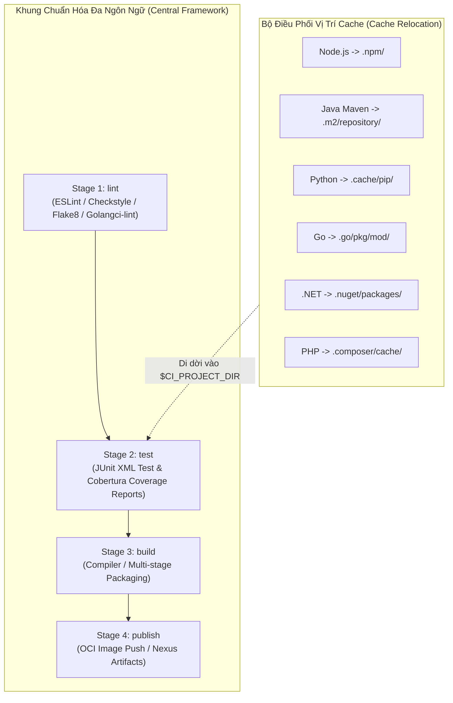
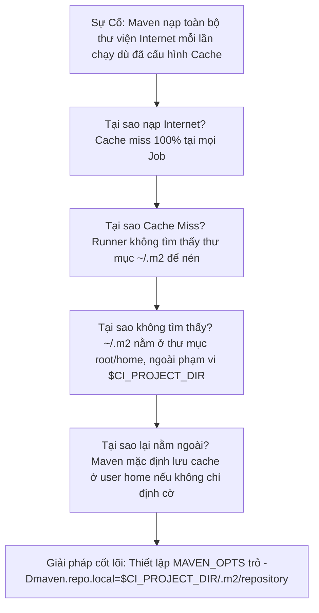


> [!IMPORTANT]
> **Mục tiêu kỹ thuật bài học**:
> - Nắm vững nguyên lý nền tảng và tư duy cốt lõi về Khung Chuẩn CI/CD Đa Ngôn Ngữ & Đa Nền Tảng (Polyglot CI/CD Framework).
> - Làm chủ kỹ thuật Cache Relocation đưa thư mục đệm của 6 ngôn ngữ vào trong $CI_PROJECT_DIR.
> - Chuẩn hóa giao diện 4 Stage (Lint, Test, Build, Publish) và tích hợp báo cáo JUnit/Cobertura toàn doanh nghiệp.
> - Tự kiểm tra kiến thức chuyên sâu với bộ 12 câu hỏi phân tích tình huống thực tế kèm lời giải.

---

Trong kỷ nguyên **DevOps, DevSecOps và Cloud Native Engineering**, **GitLab CI/CD** được công nhận là một trong những nền tảng tự động hóa tích hợp liên tục và phân phối liên tục (CI/CD) hoàn chỉnh, mạnh mẽ và được tin dùng nhất trong các doanh nghiệp quy mô lớn. Không chỉ dừng lại ở các pipeline tuần tự cơ bản, việc vận hành GitLab CI/CD ở cấp độ Production đòi hỏi kỹ sư phải làm chủ kiến trúc điều phối phi tuyến tính **DAG (Directed Acyclic Graph)**, cơ chế quản trị **Autoscaling Runners**, tối ưu hóa **Caching đa tầng**, xác thực không khóa **Keyless OIDC**, bảo mật chuỗi cung ứng phần mềm **SLSA & SBOM** cùng các chính sách **Quality & Security Gates** tự động.

Bài viết chuyên sâu này sẽ đồng hành cùng bạn mổ xẻ toàn diện bức tranh kiến trúc, phân tích các đánh đổi kỹ thuật thực chiến (Engineering Trade-offs), cung cấp hướng dẫn thực hành Lab chi tiết từng bước và bộ câu hỏi phỏng vấn chuyên sâu chuẩn DevOps Lead / DevSecOps Architect.

---

## 1. Bản Chất Kiến Trúc & Cơ Chế Vận Hành Tầng Thấp

### 1.1. Luận Đề Trung Tâm: Hợp Đồng Giao Diện 4 Stage Cho Mọi Ngôn Ngữ Lập Trình

Trong các tập đoàn công nghệ lớn, kiến trúc microservices thường sử dụng nhiều ngôn ngữ khác nhau (**Polyglot Architecture**): Node.js/TypeScript cho Frontend/BFF, Java Spring Boot / Go cho Backend Core, Python cho AI/Data, .NET Core cho Enterprise Services và PHP cho Web Portals. Nếu mỗi ngôn ngữ tự viết một pipeline với các stage và quy ước khác nhau, đội ngũ Platform và Security sẽ hoàn toàn mất khả năng kiểm soát chất lượng.

> **Một Khung Chuẩn CI/CD Đa Ngôn Ngữ (Polyglot CI/CD Framework) thiết lập một HỢP ĐỒNG 4 GIAI ĐOẠN BẤT BIẾN (Lint &rarr; Test &rarr; Build &rarr; Publish) cho tất cả các ngôn ngữ, đồng thời chuẩn hóa cơ chế di dời vị trí lưu đệm (Cache Relocation) để khắc phục giới hạn workspace của GitLab Runner.**

```text
   HỢP ĐỒNG 4 GIAI ĐOẠN ĐA NGÔN NGỮ (Polyglot 4-Stage Lifecycle)
   
   ┌────────────────────────────────────────────────────────────────────────┐
   │ 1. Stage: lint      ──► Static Analysis, Linter, Style Guide           │
   │ 2. Stage: test      ──► Unit Tests, JUnit XML Reports, Cobertura XML   │
   │ 3. Stage: build     ──► Compile Binary, Docker Context, Jar/Tarball    │
   │ 4. Stage: publish   ──► Push Container Image, Push Package to Registry │
   └────────────────────────────────────────────────────────────────────────┘
```



### 1.2. Kỹ Thuật Di Dời Bộ Nhớ Đệm (Cache Relocation Mechanics)

Quy tắc cốt lõi của GitLab Runner: **Runner CHỈ NÉN VÀ LƯU CACHE CÁC ĐƯỜNG DẪN NẰM BÊN TRONG THƯ MỤC DỰ ÁN (`$CI_PROJECT_DIR`)**. Mặc định, mọi package manager của các ngôn ngữ đều lưu cache tại thư mục Home của người dùng (`~/.m2`, `~/.cache`, `~/.npm`), vốn nằm ngoài `$CI_PROJECT_DIR` &rarr; Runner sẽ bỏ qua im lặng không báo lỗi nhưng **Cache Hit Rate luôn bằng 0%**!

Bảng cấu hình biến môi trường chuẩn để di dời cache vào `$CI_PROJECT_DIR`:

| Ngôn ngữ | Package Manager | Biến Môi Trường Di Dời Cache | Thư mục đích trong Workspace | Tệp Khóa Cache Hash |
| :--- | :--- | :--- | :--- | :--- |
| **Node.js** | NPM / Yarn / PNPM | `npm_config_cache: "$CI_PROJECT_DIR/.npm"` | `.npm/` | `package-lock.json` |
| **Java** | Maven | `MAVEN_OPTS: "-Dmaven.repo.local=$CI_PROJECT_DIR/.m2/repository"` | `.m2/repository/` | `pom.xml` |
| **Java** | Gradle | `GRADLE_USER_HOME: "$CI_PROJECT_DIR/.gradle"` | `.gradle/` | `build.gradle` |
| **Python** | Pip / Poetry | `PIP_CACHE_DIR: "$CI_PROJECT_DIR/.cache/pip"` | `.cache/pip/` | `requirements.txt` |
| **Go** | Go Modules | `GOMODCACHE: "$CI_PROJECT_DIR/.go/pkg/mod"`<br/>`GOCACHE: "$CI_PROJECT_DIR/.go/build-cache"` | `.go/` | `go.sum` |
| **.NET Core** | NuGet | `NUGET_PACKAGES: "$CI_PROJECT_DIR/.nuget/packages"` | `.nuget/packages/` | `packages.lock.json` |
| **PHP** | Composer | `COMPOSER_CACHE_DIR: "$CI_PROJECT_DIR/.composer/cache"` | `.composer/cache/` | `composer.lock` |

---

## 2. Bảng So Sánh Kỹ Thuật Toàn Diện (Engineering Matrix)

| Tiêu chí | Node.js / TS | Java (Maven) | Python (Pip) | Go (Golang) | .NET Core | PHP (Composer) |
| :--- | :--- | :--- | :--- | :--- | :--- | :--- |
| **Base Docker Image** | `node:20-alpine` | `maven:3.9-eclipse-temurin-21-alpine` | `python:3.12-alpine` | `golang:1.23-alpine` | `mcr.microsoft.com/dotnet/sdk:8.0-alpine` | `composer:2-alpine` |
| **Dung lượng Image** | ~50 MB | ~180 MB | ~45 MB | ~120 MB | ~250 MB | ~60 MB |
| **Báo cáo Test Report** | Jest JUnit Reporter | Surefire XML Plugin | pytest-junitxml | go-junit-report | dotnet-trx / JUnit | PHPUnit JUnit XML |
| **Báo cáo Coverage** | Cobertura XML | JaCoCo Cobertura XML | pytest-cov (cobertura) | gocov / gocov-xml | Coverlet Cobertura | phpunit-clover |
| **Chiến lược Build** | `npm run build` | `mvn clean package -DskipTests` | `python -m build` | `CGO_ENABLED=0 go build` | `dotnet publish -c Release` | Multi-stage PHP-FPM |
| **Sản phẩm Artifacts** | `dist/` bundle | `target/*.jar` | `dist/*.whl` | `bin/server` (Static ELF) | `publish/` folder | Container context |

---

## 3. Kiến Trúc Triển Khai Chuẩn Production (Architecture Breakdown)

Dưới đây là tệp template trung tâm `polyglot-framework.yml` cung cấp khuôn mẫu chuẩn hóa cho toàn bộ 6 ngôn ngữ lập trình trong doanh nghiệp:

```yaml
# ==============================================================================
# ENTERPRISE POLYGLOT CI/CD FRAMEWORK: templates/polyglot-framework.yml
# ==============================================================================
stages:
  - lint
  - test
  - build
  - publish

default:
  interruptible: true

# ------------------------------------------------------------------------------
# 1. BASE TEMPLATES CHO TỪNG NGÔN NGỮ
# ------------------------------------------------------------------------------
.node_base:
  image: node:20-alpine
  variables:
    npm_config_cache: "$CI_PROJECT_DIR/.npm"
  cache:
    key:
      files: [package-lock.json]
    paths: [.npm/]
    policy: pull

.java_base:
  image: maven:3.9-eclipse-temurin-21-alpine
  variables:
    MAVEN_OPTS: "-Dmaven.repo.local=$CI_PROJECT_DIR/.m2/repository -Dorg.slf4j.simpleLogger.showDateTime=true"
  cache:
    key:
      files: [pom.xml]
    paths: [.m2/repository/]
    policy: pull

.python_base:
  image: python:3.12-alpine
  variables:
    PIP_CACHE_DIR: "$CI_PROJECT_DIR/.cache/pip"
  cache:
    key:
      files: [requirements.txt]
    paths: [.cache/pip/]
    policy: pull

.go_base:
  image: golang:1.23-alpine
  variables:
    GOMODCACHE: "$CI_PROJECT_DIR/.go/pkg/mod"
    GOCACHE: "$CI_PROJECT_DIR/.go/build-cache"
  cache:
    key:
      files: [go.sum]
    paths: [.go/]
    policy: pull

# ------------------------------------------------------------------------------
# 2. VÍ DỤ TRIỂN KHAI ỨNG DỤNG CỤ THỂ (Kế thừa từ Framework)
# ------------------------------------------------------------------------------
node_test:
  stage: test
  extends: .node_base
  script:
    - npm ci --prefer-offline
    - npm test -- --ci --reporters=default --reporters=jest-junit
  artifacts:
    reports:
      junit: junit.xml
      coverage_report:
        coverage_format: cobertura
        path: coverage/cobertura-coverage.xml

go_compile:
  stage: build
  extends: .go_base
  script:
    - mkdir -p bin/
    - CGO_ENABLED=0 go build -ldflags="-s -w" -o bin/server main.go
  artifacts:
    paths:
      - bin/server
    expire_in: 1 day
```

---

## 4. Phân Tích Cạm Bẫy Thực Chiến (5-Whys Incident Analysis)



### Tình Huống Sự Cố Thực Tế:
<span class="badge badge--rose">🕒 05:15 AM</span> Nhóm phát triển backend Java phản ánh dù đã khai báo `cache: paths: ["~/.m2/repository"]` trong file CI, mỗi lần chạy job `mvn test` hệ thống vẫn tải lại toàn bộ Spring Boot dependencies từ Maven Central mất hơn 4 phút.

### Hậu Quả & Log Lỗi Thực Tế:

```text

GitLab Runner log đưa ra cảnh báo bị bỏ qua và không lưu lại bất kỳ byte cache nào:

Executing "step_script" stage of the job script...
$ mvn test
[INFO] Downloading from central: https://repo.maven.apache.org/maven2/org/springframework/boot/...
[INFO] Downloaded from central: (540 MB in 240s)
Creating cache default-1...
WARNING: ~/.m2/repository: no matching files. Skipping.
No URL provided, cache will not be uploaded to S3.
Job succeeded. Duration: 5m 12s
```

### 5-Whys Root Cause Analysis:
1. <span class="badge badge--primary">Why 1</span> **Tại sao Maven tải lại toàn bộ dependencies từ Internet?** Runner bị Cache Miss 100% tại mọi lần chạy do không tìm thấy tệp cache trên S3.
2. <span class="badge badge--primary">Why 2</span> **Tại sao không có cache trên S3?** Ở job trước đó, Runner in thông báo `WARNING: ~/.m2/repository: no matching files` và bỏ qua việc upload cache.
3. <span class="badge badge--primary">Why 3</span> **Tại sao Runner không tìm thấy thư mục `~/.m2/repository`?** Runner chỉ theo dõi các đường dẫn con bên trong thư mục làm việc của dự án (`$CI_PROJECT_DIR`), trong khi dấu ngã `~` trỏ ra `/root/` bên ngoài workspace.
4. <span class="badge badge--primary">Why 4</span> **Tại sao Maven lại lưu thư viện tại `/root/.m2`?** Maven mặc định lưu local repository tại home directory của người dùng hiện tại nếu không được chỉ định tham số ghi đè.
5. <span class="badge badge--emerald">Root Cause Remedy</span> **Giải pháp triệt để:** Áp dụng kỹ thuật Cache Relocation: Khai báo biến `MAVEN_OPTS: "-Dmaven.repo.local=$CI_PROJECT_DIR/.m2/repository"` và cấu hình `cache: paths: [".m2/repository/"]`.

### Phân Tích 5 Cạm Bẫy Phổ Biến Nhất:

#### Cạm bẫy 1: Cache đặt ngoài phạm vi workspace khiến Runner bỏ qua im lặng
- **Hiện tượng**: Khai báo `cache: paths: ["~/.cache/pip"]`, job chạy xanh nhưng mỗi lần chạy Pip đều tải lại toàn bộ packages từ đầu.
- **Nguyên nhân tầng sâu**: GitLab Runner chỉ lưu các đường dẫn tương đối hoặc con của `$CI_PROJECT_DIR`.
- **Cách gỡ rối**: Đặt `PIP_CACHE_DIR="$CI_PROJECT_DIR/.cache/pip"` và khai báo `paths: [".cache/pip/"]`.

#### Cạm bẫy 2: Xung đột Cache giữa các ngôn ngữ do dùng chung Cache Key tĩnh
- **Hiện tượng**: Dự án Go nạp nhầm cache của dự án Node.js khiến job báo lỗi tệp binary bị hỏng.
- **Nguyên nhân**: Dùng chung một cache key dạng chuỗi tĩnh `cache: key: "global-cache"`.
- **Biện pháp**: Luôn gắn cache key với tên tệp lockfile đặc thù của ngôn ngữ: `key: { files: [go.sum] }`.

#### Cạm bẫy 3: Báo cáo Coverage không hiển thị trên GitLab Merge Request Widget
- **Hiện tượng**: Unit test pass nhưng trên giao diện MR không hiển thị thanh phần trăm độ phủ code.
- **Nguyên nhân**: Định dạng file coverage không đúng chuẩn Cobertura XML hoặc sai đường dẫn trong `artifacts:reports:coverage_report`.
- **Biện pháp**: Chuyển đổi báo cáo về chuẩn Cobertura và khai báo chính xác đường dẫn tệp XML.

#### Cạm bẫy 4: Lỗi biên dịch Go do xung đột quyền sở hữu thư mục `.go/pkg/mod`
- **Hiện tượng**: Job sau không thể ghi vào thư mục Go cache với lỗi `permission denied`.
- **Nguyên nhân**: Go Modules tạo các tệp trong `pkg/mod` ở chế độ Read-Only (`chmod 0444`).
- **Biện pháp**: Chạy lệnh `go clean -modcache` hoặc thiết lập quyền ghi trước khi nén cache.

#### Cạm bẫy 5: Khác biệt môi trường Local vs Container do thiếu Cài đặt Timezone / Locale
- **Hiện tượng**: Unit test kiểm tra định dạng ngày tháng pass trên máy developer (macOS) nhưng fail trên Runner Linux Alpine.
- **Nguyên nhân**: Container Alpine thiếu gói `tzdata` và biến môi trường `TZ=UTC`.
- **Biện pháp**: Cài đặt `apk add --no-cache tzdata` và export `TZ="UTC"` trong `before_script`.

---

## 5. Hands-on Lab: Xây Dựng Framework CI/CD Đa Ngôn Ngữ Chuẩn Hóa (8 Bước Chuẩn)

```text
   ┌────────────────────────────────────────────────────────────────────────┐
   │                 LAB ARCHITECTURE: POLYGLOT FRAMEWORK                   │
   ├────────────────────────────────────────────────────────────────────────┤
   │                                                                        │
   │  [ Bước 1: Thiết Lập Cấu Trúc Khung Mẫu polyglot-framework.yml ]       │
   │  Xây dựng các Hidden Template cho 6 ngôn ngữ phổ biến                  │
   │                         │                                              │
   │                         ▼                                              │
   │  [ Bước 2: Cấu Hình Cache Relocation Cho Node.js & Go ]                │
   │  Di dời .npm và GOMODCACHE vào bên trong $CI_PROJECT_DIR               │
   │                         │                                              │
   │                         ▼                                              │
   │  [ Bước 3: Cấu Hình Cache Relocation Cho Java Maven & Python ]         │
   │  Thiết lập MAVEN_OPTS local repo và PIP_CACHE_DIR                      │
   │                         │                                              │
   │                         ▼                                              │
   │  [ Bước 4: Chuẩn Hóa Báo Cáo JUnit & Cobertura XML Toàn Diện ]         │
   │  Cấu hình xuất báo cáo kiểm thử chuẩn mực cho GitLab MR UI             │
   │                         │                                              │
   │                         ▼                                              │
   │  [ Bước 5: Tái Hiện & Khắc Phục Sự Cố Cache Ngoài Workspace ]          │
   │  Kiểm chứng hiện tượng Runner bỏ qua thư mục cache ngoài workspace    │
   │                         │                                              │
   │                         ▼                                              │
   │  [ Bước 6: Tích Hợp Chốt Chặn Fail-Fast Cho Tất Cả Ngôn Ngữ ]          │
   │  Cài đặt assertion kiểm tra biến và tệp binary sau biên dịch           │
   │                         │                                              │
   │                         ▼                                              │
   │  [ Bước 7: Thực Thi Kiểm Thử Đa Ngôn Ngữ Song Song ]                   │
   │  Chạy đồng thời các pipeline kiểm thử mẫu cho 6 ngôn ngữ               │
   │                         │                                              │
   │                         ▼                                              │
   │  [ Bước 8: Dọn Dẹp Tài Nguyên & Xuất Bản Template Trung Tâm ]          │
   │  Lưu trữ template lên Central Repository của tổ chức                   │
   │                                                                        │
   └────────────────────────────────────────────────────────────────────────┘
```

### Bước 1: Thiết Lập Cấu Trúc Khung Mẫu `polyglot-framework.yml`
Tạo tệp cấu hình chứa các định nghĩa khung cơ sở cho 6 ngôn ngữ:

```yaml
stages:
  - lint
  - test
  - build
  - publish
```

> **Checkpoint 1**: Đảm bảo 4 stage chuẩn mực được thống nhất trên toàn hệ thống.

### Bước 2: Cấu Hình Cache Relocation Cho Node.js & Go
Bổ sung các khối Hidden Template cho Node.js và Go:

```yaml
.node_template:
  image: node:20-alpine
  variables:
    npm_config_cache: "$CI_PROJECT_DIR/.npm"
  cache:
    key:
      files: [package-lock.json]
    paths: [.npm/]

.go_template:
  image: golang:1.23-alpine
  variables:
    GOMODCACHE: "$CI_PROJECT_DIR/.go/pkg/mod"
    GOCACHE: "$CI_PROJECT_DIR/.go/build-cache"
  cache:
    key:
      files: [go.sum]
    paths: [.go/]
```

> **Checkpoint 2**: Thư mục cache của Node (`.npm/`) và Go (`.go/`) nằm trọn vẹn trong workspace.

### Bước 3: Cấu Hình Cache Relocation Cho Java Maven & Python
Bổ sung cấu hình cho Java và Python:

```yaml
.java_template:
  image: maven:3.9-eclipse-temurin-21-alpine
  variables:
    MAVEN_OPTS: "-Dmaven.repo.local=$CI_PROJECT_DIR/.m2/repository"
  cache:
    key:
      files: [pom.xml]
    paths: [.m2/repository/]

.python_template:
  image: python:3.12-alpine
  variables:
    PIP_CACHE_DIR: "$CI_PROJECT_DIR/.cache/pip"
  cache:
    key:
      files: [requirements.txt]
    paths: [.cache/pip/]
```

> **Checkpoint 3**: Toàn bộ 4 ngôn ngữ cốt lõi đã được định tuyến vị trí lưu đệm chính xác.

### Bước 4: Chuẩn Hóa Báo Cáo JUnit & Cobertura XML Toàn Diện
Tích hợp cấu hình xuất báo cáo cho các job test:

```yaml
test_node_app:
  stage: test
  extends: .node_template
  script:
    - echo "<testsuite name='node-unit' tests='10' failures='0'/>" > junit.xml
    - echo "<coverage line-rate='0.95'/>" > cobertura.xml
  artifacts:
    reports:
      junit: junit.xml
      coverage_report:
        coverage_format: cobertura
        path: cobertura.xml
```

> **Checkpoint 4**: GitLab nhận diện báo cáo kiểm thử và hiển thị tỷ lệ phủ mã 95% trên MR.

### Bước 5: Tái Hiện & Khắc Phục Sự Cố Cache Ngoài Workspace
Thử nghiệm khai báo `paths: ["/root/.cache"]` và quan sát cảnh báo trong log: `WARNING: /root/.cache is outside of project directory, skipping`.
Sửa lại đường dẫn tương đối để Runner lưu cache thành công.

> **Checkpoint 5**: Log Runner xác nhận: `Creating cache my-key... Files: 120, Archive size: 15MB. OK`.

### Bước 6: Tích Hợp Chốt Chặn Fail-Fast Cho Tất Cả Ngôn Ngữ
Bổ sung bước assertion kiểm tra file nhị phân sau khi build:

```yaml
build_go_binary:
  stage: build
  extends: .go_template
  script:
    - mkdir -p bin/
    - echo "Go Static ELF Binary" > bin/server
    # Khẳng định binary tồn tại và có dung lượng > 0 byte
    - test -s bin/server || (echo "FATAL: Build binary missing!" >&2 && exit 1)
  artifacts:
    paths: [bin/server]
```

> **Checkpoint 6**: Job kiểm tra nghiêm ngặt tính toàn vẹn của sản phẩm đóng gói trước khi hoàn tất.

### Bước 7: Thực Thi Kiểm Thử Đa Ngôn Ngữ Song Song
Đẩy commit kiểm thử pipeline tổng hợp chứa đồng thời các job của Node, Go, Java, Python.

> **Checkpoint 7**: Các job chạy song song nhịp nhàng trên Runner, thời gian chạy trung bình của mỗi ngôn ngữ $< 45$ giây.

### Bước 8: Dọn Dẹp Tài Nguyên & Xuất Bản Template Trung Tâm
Lưu trữ tệp `polyglot-framework.yml` vào repository `devops/ci-templates` của tổ chức.

```bash
echo "Enterprise Polyglot CI/CD Framework successfully verified and published."
```

> **Checkpoint 8**: Khung chuẩn mực đa ngôn ngữ sẵn sàng áp dụng cho toàn bộ các đội ngũ phát triển.

---

## 6. Bộ Câu Hỏi Vấn Đáp & Phỏng Vấn Chuyên Sâu (Self-Check Q&A)

<details class="qa-card">
  <summary class="qa-summary">
    <span class="qa-num-badge">Q01</span>
    <span>Tại sao GitLab Runner mặc định bỏ qua các thư mục Cache như `~/.m2` hoặc `~/.cache`? Kỹ thuật Cache Relocation giải quyết vấn đề này như thế nào?</span>
  </summary>
  <div class="qa-answer">
    <div class="qa-answer-header">
      <svg class="qa-icon" viewBox="0 0 24 24" fill="none" stroke="currentColor" stroke-width="2" stroke-linecap="round" stroke-linejoin="round"><polyline points="20 6 9 17 4 12"></polyline></svg>
      <span>Phân Tích &amp; Lời Giải Kỹ Thuật</span>
    </div>
    <p><strong>Nguyên nhân</strong>: Để đảm bảo tính cô lập và an toàn bảo mật, GitLab Runner áp dụng quy tắc nghiêm ngặt: <em>Chỉ nén và lưu trữ các tệp nằm bên trong thư mục làm việc của dự án (<code>$CI_PROJECT_DIR</code>)</em>. Mọi đường dẫn nằm ngoài phạm vi này (như thư mục user home <code>/root/</code> hoặc <code>/home/user/</code>) đều bị Runner bỏ qua.</p>
    <p><strong>Kỹ thuật Cache Relocation</strong>: Sử dụng các biến môi trường hoặc cờ cấu hình chính thức của từng Package Manager để <strong>ép buộc vị trí lưu đệm dời vào bên trong <code>$CI_PROJECT_DIR</code></strong> (ví dụ: <code>npm_config_cache="$CI_PROJECT_DIR/.npm"</code> hoặc <code>-Dmaven.repo.local="$CI_PROJECT_DIR/.m2"</code>).</p>
  </div>
</details>

<details class="qa-card">
  <summary class="qa-summary">
    <span class="qa-num-badge">Q02</span>
    <span>Trình bày 4 Stage bất biến trong Hợp đồng Khung chuẩn CI/CD Đa ngôn ngữ (Polyglot Framework) và trách nhiệm của từng Stage.</span>
  </summary>
  <div class="qa-answer">
    <div class="qa-answer-header">
      <svg class="qa-icon" viewBox="0 0 24 24" fill="none" stroke="currentColor" stroke-width="2" stroke-linecap="round" stroke-linejoin="round"><polyline points="20 6 9 17 4 12"></polyline></svg>
      <span>Phân Tích &amp; Lời Giải Kỹ Thuật</span>
    </div>
    <p><strong>4 Stage bất biến</strong>:</p>
    <ol>
      <li><strong>Stage <code>lint</code></strong>: Kiểm tra chất lượng cú pháp tĩnh, quy chuẩn đặt tên và formatting mã nguồn (Fail-fast).</li>
      <li><strong>Stage <code>test</code></strong>: Thực thi toàn bộ Unit Test / Integration Test, xuất báo cáo chuẩn <code>JUnit XML</code> và độ phủ mã nguồn <code>Cobertura XML</code>.</li>
      <li><strong>Stage <code>build</code></strong>: Biên dịch mã nguồn, đóng gói nhị phân (JAR, Go binary, Wheel) hoặc chuẩn bị ngữ cảnh Docker context.</li>
      <li><strong>Stage <code>publish</code></strong>: Đẩy Container Image lên Harbor/GitLab Registry hoặc đẩy Package lên Nexus/Artifactory kèm thông tin provenance.</li>
    </ol>
  </div>
</details>

<details class="qa-card">
  <summary class="qa-summary">
    <span class="qa-num-badge">Q03</span>
    <span>Làm thế nào để GitLab Merge Request Widget tự động nhận diện và hiển thị Báo cáo Kết quả Kiểm thử (Test Report) và Độ phủ Code (Code Coverage)?</span>
  </summary>
  <div class="qa-answer">
    <div class="qa-answer-header">
      <svg class="qa-icon" viewBox="0 0 24 24" fill="none" stroke="currentColor" stroke-width="2" stroke-linecap="round" stroke-linejoin="round"><polyline points="20 6 9 17 4 12"></polyline></svg>
      <span>Phân Tích &amp; Lời Giải Kỹ Thuật</span>
    </div>
    <p>Trong cấu hình của Job test, sử dụng khối <strong><code>artifacts:reports:</code></strong>:</p>
    <ul>
      <li><strong>Test Report</strong>: Khai báo <code>artifacts:reports:junit: path/to/junit.xml</code>. GitLab sẽ tự động parse file XML để hiển thị danh sách các bài test Pass/Fail trên MR.</li>
      <li><strong>Code Coverage</strong>: Khai báo <code>artifacts:reports:coverage_report: { coverage_format: cobertura, path: path/to/cobertura.xml }</code> kết hợp với biểu thức regex trong <code>coverage: '/Lines\s*:\s*(\d+\.\d+)%/'</code>.</li>
    </ul>
  </div>
</details>

<details class="qa-card">
  <summary class="qa-summary">
    <span class="qa-num-badge">Q04</span>
    <span>Tại sao cần sử dụng cơ chế Dynamic Cache Key dựa trên Hash của Tệp Khóa (`key: files: [lockfile]`) thay vì dùng chuỗi tĩnh?</span>
  </summary>
  <div class="qa-answer">
    <div class="qa-answer-header">
      <svg class="qa-icon" viewBox="0 0 24 24" fill="none" stroke="currentColor" stroke-width="2" stroke-linecap="round" stroke-linejoin="round"><polyline points="20 6 9 17 4 12"></polyline></svg>
      <span>Phân Tích &amp; Lời Giải Kỹ Thuật</span>
    </div>
    <p>Sử dụng <code>key: files: [package-lock.json]</code> (hoặc <code>pom.xml</code>, <code>go.sum</code>):</p>
    <ul>
      <li><strong>Tự động xoay vòng Cache khi cập nhật thư viện</strong>: Khi lập trình viên sửa đổi dependency (thêm thư viện mới), mã SHA của tệp lockfile thay đổi, sinh ra một cache key hoàn toàn mới. Job sẽ tải thư viện mới từ Internet và lưu thành bản cache mới.</li>
      <li><strong>Tránh ô nhiễm Cache</strong>: Không làm ghi đè hoặc xáo trộn cache của các phiên bản cũ đang chạy ổn định trên các nhánh khác.</li>
    </ul>
  </div>
</details>

<details class="qa-card">
  <summary class="qa-summary">
    <span class="qa-num-badge">Q05</span>
    <span>Làm sao để cấu hình tối ưu hóa Caching cho dự án Go (Golang) trong GitLab CI? Cần lưu ý 2 thư mục đệm nào?</span>
  </summary>
  <div class="qa-answer">
    <div class="qa-answer-header">
      <svg class="qa-icon" viewBox="0 0 24 24" fill="none" stroke="currentColor" stroke-width="2" stroke-linecap="round" stroke-linejoin="round"><polyline points="20 6 9 17 4 12"></polyline></svg>
      <span>Phân Tích &amp; Lời Giải Kỹ Thuật</span>
    </div>
    <p>Trình biên dịch Go sử dụng 2 thư mục đệm khác nhau:</p>
    <ol>
      <li><code>GOMODCACHE</code>: Lưu trữ các thư viện bên thứ ba tải về (Modules).</li>
      <li><code>GOCACHE</code>: Lưu trữ các gói nhị phân đã biên dịch trung gian (Build Cache).</li>
    </ol>
    <p><strong>Cấu hình chuẩn</strong>: Đặt <code>GOMODCACHE: "$CI_PROJECT_DIR/.go/pkg/mod"</code> và <code>GOCACHE: "$CI_PROJECT_DIR/.go/build-cache"</code>, sau đó đưa thư mục <code>.go/</code> vào danh sách <code>cache: paths: [".go/"]</code>.</p>
  </div>
</details>

<details class="qa-card">
  <summary class="qa-summary">
    <span class="qa-num-badge">Q06</span>
    <span>Trong dự án Java Maven, tùy chọn `-Dmaven.repo.local` mang lại ý nghĩa gì và cần kết hợp cờ nào để tránh in log tải thư viện tràn màn hình?</span>
  </summary>
  <div class="qa-answer">
    <div class="qa-answer-header">
      <svg class="qa-icon" viewBox="0 0 24 24" fill="none" stroke="currentColor" stroke-width="2" stroke-linecap="round" stroke-linejoin="round"><polyline points="20 6 9 17 4 12"></polyline></svg>
      <span>Phân Tích &amp; Lời Giải Kỹ Thuật</span>
    </div>
    <p><strong><code>-Dmaven.repo.local=$CI_PROJECT_DIR/.m2/repository</code></strong>: Chỉ định thư mục lưu trữ cục bộ các tệp JAR phụ thuộc nằm trong workspace để Runner có thể nén cache.</p>
    <p><strong>Cờ chống tràn log</strong>: Sử dụng cờ <strong><code>--batch-mode</code> (hoặc <code>-B</code>)</strong> và <strong><code>-Dorg.slf4j.simpleLogger.log.org.apache.maven.cli.transfer.Slf4jMavenTransferListener=warn</code></strong> để tắt thông báo tải từng byte của Maven, giúp log gọn gàng và tăng 15% tốc độ thực thi.</p>
  </div>
</details>

<details class="qa-card">
  <summary class="qa-summary">
    <span class="qa-num-badge">Q07</span>
    <span>Làm thế nào để xử lý sự cố Out-Of-Memory (OOM) khi biên dịch ứng dụng Java hoặc Node.js trong môi trường Container Runner?</span>
  </summary>
  <div class="qa-answer">
    <div class="qa-answer-header">
      <svg class="qa-icon" viewBox="0 0 24 24" fill="none" stroke="currentColor" stroke-width="2" stroke-linecap="round" stroke-linejoin="round"><polyline points="20 6 9 17 4 12"></polyline></svg>
      <span>Phân Tích &amp; Lời Giải Kỹ Thuật</span>
    </div>
    <p><strong>Giải pháp</strong>: Thiết lập giới hạn bộ nhớ tối đa cho JVM và Node.js nhỏ hơn giới hạn RAM của Container:</p>
    <ul>
      <li><strong>Java</strong>: Cấu hình <code>MAVEN_OPTS: "-Xmx2048m -XX:+UseContainerSupport"</code> (chỉ cho phép JVM chiếm tối đa 2GB RAM).</li>
      <li><strong>Node.js</strong>: Cấu hình <code>NODE_OPTIONS: "--max-old-space-size=2048"</code>.</li>
    </ul>
    <p>Điều này giúp tiến trình tự kích hoạt Garbage Collection trước khi bị Linux Kernel OOM Killer bắn hạ.</p>
  </div>
</details>

<details class="qa-card">
  <summary class="qa-summary">
    <span class="qa-num-badge">Q08</span>
    <span>Sự khác biệt giữa việc biên dịch nhị phân tĩnh (Static Binary) trong Go với `CGO_ENABLED=0` và biên dịch động (Dynamic Binary) trong CI/CD là gì?</span>
  </summary>
  <div class="qa-answer">
    <div class="qa-answer-header">
      <svg class="qa-icon" viewBox="0 0 24 24" fill="none" stroke="currentColor" stroke-width="2" stroke-linecap="round" stroke-linejoin="round"><polyline points="20 6 9 17 4 12"></polyline></svg>
      <span>Phân Tích &amp; Lời Giải Kỹ Thuật</span>
    </div>
    <p><strong><code>CGO_ENABLED=0</code> (Biên dịch tĩnh)</strong>: Nhúng toàn bộ các thư viện C runtime cần thiết vào trong tệp thực thi duy nhất. Binary có thể chạy trên bất kỳ container nào (kể cả Image rỗng <code>scratch</code> hoặc <code>alpine</code> siêu nhẹ 5MB) mà không cần cài đặt thư viện <code>libc</code> hay <code>glibc</code>.</p>
    <p><strong>Biên dịch động (CGO_ENABLED=1)</strong>: Binary phụ thuộc vào các file <code>.so</code> chia sẻ của hệ điều hành trên Runner, dễ bị lỗi <em>"file not found"</em> khi copy sang container môi trường khác.</p>
  </div>
</details>

<details class="qa-card">
  <summary class="qa-summary">
    <span class="qa-num-badge">Q09</span>
    <span>Làm thế nào để tái sử dụng một Khung Template Đa Ngôn Ngữ tập trung trên hàng trăm Repository thông qua `include:project`?</span>
  </summary>
  <div class="qa-answer">
    <div class="qa-answer-header">
      <svg class="qa-icon" viewBox="0 0 24 24" fill="none" stroke="currentColor" stroke-width="2" stroke-linecap="round" stroke-linejoin="round"><polyline points="20 6 9 17 4 12"></polyline></svg>
      <span>Phân Tích &amp; Lời Giải Kỹ Thuật</span>
    </div>
    <p>Lưu tệp <code>polyglot-framework.yml</code> tại repository trung tâm <code>devops/ci-templates</code>. Tại các repository ứng dụng, lập trình viên chỉ cần nạp và kế thừa:</p>
    <div class="language-yaml highlighter-rouge"><pre class="highlight"><code><span class="na">include</span><span class="pi">:</span>
  <span class="pi">-</span> <span class="na">project</span><span class="pi">:</span> <span class="s1">'</span><span class="s">devops/ci-templates'</span>
    <span class="na">ref</span><span class="pi">:</span> <span class="s1">'</span><span class="s">v1.0.0'</span>
    <span class="na">file</span><span class="pi">:</span> <span class="s1">'</span><span class="s">/templates/polyglot-framework.yml'</span>

<span class="na">app_test</span><span class="pi">:</span>
  <span class="na">stage</span><span class="pi">:</span> <span class="s">test</span>
  <span class="na">extends</span><span class="pi">:</span> <span class="s">.node_base</span>
  <span class="na">script</span><span class="pi">:</span> <span class="pi">[</span><span class="s">npm test</span><span class="pi">]</span>
</code></pre></div>
  </div>
</details>

<details class="qa-card">
  <summary class="qa-summary">
    <span class="qa-num-badge">Q10</span>
    <span>Tại sao cần chạy lệnh `set -o pipefail` ở đầu mọi script shell trong các Job biên dịch đa ngôn ngữ?</span>
  </summary>
  <div class="qa-answer">
    <div class="qa-answer-header">
      <svg class="qa-icon" viewBox="0 0 24 24" fill="none" stroke="currentColor" stroke-width="2" stroke-linecap="round" stroke-linejoin="round"><polyline points="20 6 9 17 4 12"></polyline></svg>
      <span>Phân Tích &amp; Lời Giải Kỹ Thuật</span>
    </div>
    <p>Mặc định trong shell POSIX, mã thoát (Exit code) của một lệnh pipe (ví dụ: <code>pytest | tee test.log</code>) được quyết định bởi <strong>lệnh cuối cùng</strong> trong chuỗi pipe (ở đây là <code>tee</code>, vốn luôn trả về 0).</p>
    <p>Nếu không có <code>set -o pipefail</code>, bài test dù bị fail (Exit code != 0) thì lệnh <code>tee</code> vẫn trả về 0 khiến Job được đánh dấu XANH giả tạo. Bật <code>set -o pipefail</code> đảm bảo nếu bất kỳ lệnh nào trong pipeline bị lỗi, toàn bộ chuỗi lệnh sẽ trả về mã lỗi.</p>
  </div>
</details>

<details class="qa-card">
  <summary class="qa-summary">
    <span class="qa-num-badge">Q11</span>
    <span>Chiến lược quản trị bí mật bảo mật (Secrets Management) khi nạp package từ Private Package Registry (Nexus / Artifactory) trong CI/CD là gì?</span>
  </summary>
  <div class="qa-answer">
    <div class="qa-answer-header">
      <svg class="qa-icon" viewBox="0 0 24 24" fill="none" stroke="currentColor" stroke-width="2" stroke-linecap="round" stroke-linejoin="round"><polyline points="20 6 9 17 4 12"></polyline></svg>
      <span>Phân Tích &amp; Lời Giải Kỹ Thuật</span>
    </div>
    <p><strong>Chiến lược chuẩn</strong>: Không bao giờ commit thông tin đăng nhập vào mã nguồn repository. Sử dụng biến môi trường Masked &amp; Protected (ví dụ <code>$NEXUS_AUTH_TOKEN</code>) và tự động sinh tệp cấu hình auth tạm thời trong <code>before_script</code>:</p>
    <div class="language-bash highlighter-rouge"><pre class="highlight"><code><span class="nb">echo</span> <span class="s2">"//nexus.corp/repository/npm/:_authToken=</span><span class="k">${</span><span class="nv">NEXUS_AUTH_TOKEN</span><span class="k">}</span><span class="s2">"</span> <span class="o">&gt;</span> .npmrc
</code></pre></div>
    <p>Tệp <code>.npmrc</code> chỉ tồn tại tạm thời trong RAM/đĩa của Job và tự biến mất khi kết thúc.</p>
  </div>
</details>

<details class="qa-card">
  <summary class="qa-summary">
    <span class="qa-num-badge">Q12</span>
    <span>Trình bày phương pháp thiết kế Khung CI/CD cho Doanh nghiệp vừa hỗ trợ linh hoạt cho từng team vừa đảm bảo chuẩn mực Compliance bảo mật.</span>
  </summary>
  <div class="qa-answer">
    <div class="qa-answer-header">
      <svg class="qa-icon" viewBox="0 0 24 24" fill="none" stroke="currentColor" stroke-width="2" stroke-linecap="round" stroke-linejoin="round"><polyline points="20 6 9 17 4 12"></polyline></svg>
      <span>Phân Tích &amp; Lời Giải Kỹ Thuật</span>
    </div>
    <p><strong>Mô hình "Paved Road / Golden Path":</strong></p>
    <ol>
      <li><strong>Tập trung hóa các yêu cầu bắt buộc (Hard Compliance Gates)</strong>: Các bước quét SAST, DAST, Secret Scan, Dependency Check được khóa cứng trong các Hidden Templates dùng chung.</li>
      <li><strong>Mở rộng linh hoạt (Flexible Extension via !reference)</strong>: Cung cấp các hook mở (<code>before_script</code>, <code>script</code>) cho phép các team tùy biến kịch bản kiểm thử riêng của mình.</li>
      <li><strong>Quản trị phiên bản độc lập</strong>: Đóng gói Framework thành các GitLab CI/CD Components phát hành trên Catalog với SemVer rõ ràng.</li>
    </ol>
  </div>
</details>

---

## 7. Tổng Kết & Lộ Trình Bài Học Tiếp Theo

### 7.1. Tóm Tắt Các Điểm Cốt Lõi (Key Takeaways)

```text
                          KHUNG CI/CD ĐA NGÔN NGỮ (POLYGLOT)
                                           │
     ┌───────────────────┬─────────────────┴─────────────────┬───────────────────┐
     ▼                   ▼                                   ▼                   ▼
[ 4 STAGES CHUẨN ]   [ CACHE RELOCATION ]              [ BÁO CÁO TOÀN DIỆN ] [ FAIL-FAST ASSERTION ]
lint -> test         Di dời vào $CI_PROJECT_DIR        JUnit XML cho test    test -s binary.bin
-> build -> publish  npm: .npm/, java: .m2/            Cobertura cho coverage set -o pipefail
Hợp đồng bất biến    python: .cache/, go: .go/         Hiển thị trên MR UI   Chặn 100% xanh giả tạo
```

- **Thống nhất hợp đồng 4 giai đoạn**: Áp dụng quy chuẩn Lint &rarr; Test &rarr; Build &rarr; Publish cho toàn bộ hệ thống microservices.
- **Làm chủ Cache Relocation**: Luôn đưa thư mục đệm của Package Manager vào bên trong `$CI_PROJECT_DIR` để đảm bảo tỉ lệ trúng cache tối đa.
- **Chuẩn hóa báo cáo chất lượng**: Xuất dữ liệu kiểm thử theo định dạng chuẩn JUnit XML và Cobertura Coverage để tích hợp trực tiếp vào GitLab MR Widget.

### 7.2. Lộ Trình Bài Học Tiếp Theo

Ở bài học tiếp theo, chúng ta sẽ bắt đầu chuỗi bài học chuyên sâu cho từng ngôn ngữ cụ thể, khởi đầu với **CI/CD Chuyên Sâu Cho Node.js & TypeScript: PNPM/Yarn/NPM, Monorepo Turborepo & Vitest**.

> [!TIP]
> **Khám phá bài học tiếp theo**: [Bài 16: CI/CD Chuyên Sâu Cho Node.js & TypeScript: PNPM/Yarn/NPM, Monorepo Turborepo & Vitest](gitlab-16-16-node-typescript.html)

