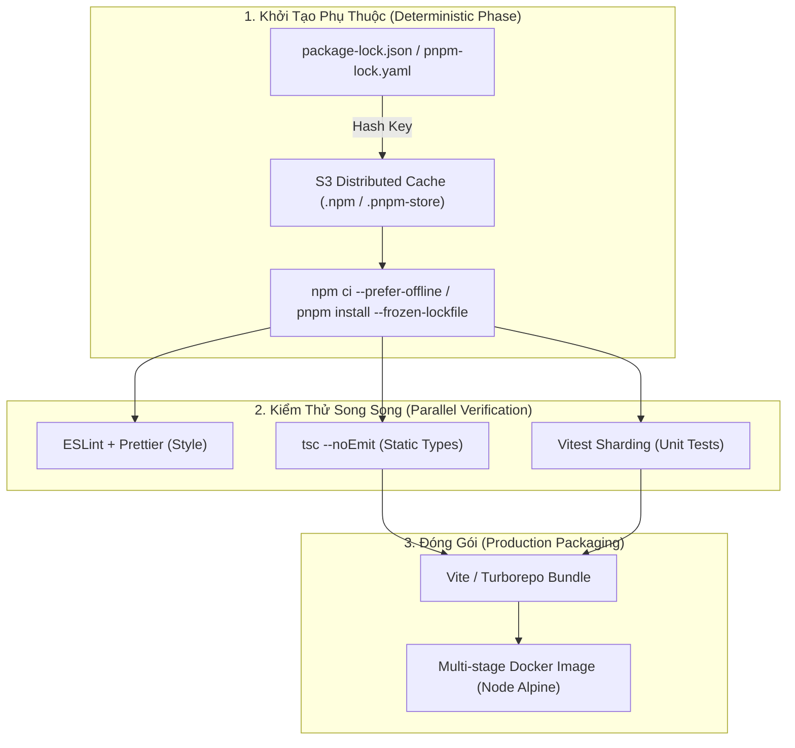
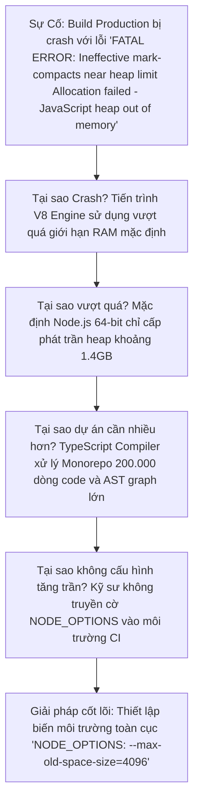


# [BÀI 16] CI/CD CHUYÊN SÂU CHO NODE.JS & TYPESCRIPT: PNPM/YARN/NPM, MONOREPO TURBOREPO & VITEST

Trong kỷ nguyên **DevOps, DevSecOps và Cloud Native Engineering**, **GitLab CI/CD** được công nhận là một trong những nền tảng tự động hóa tích hợp liên tục và phân phối liên tục (CI/CD) hoàn chỉnh, mạnh mẽ và được tin dùng nhất trong các doanh nghiệp quy mô lớn. Không chỉ dừng lại ở các pipeline tuần tự cơ bản, việc vận hành GitLab CI/CD ở cấp độ Production đòi hỏi kỹ sư phải làm chủ kiến trúc điều phối phi tuyến tính **DAG (Directed Acyclic Graph)**, cơ chế quản trị **Autoscaling Runners**, tối ưu hóa **Caching đa tầng**, xác thực không khóa **Keyless OIDC**, bảo mật chuỗi cung ứng phần mềm **SLSA & SBOM** cùng các chính sách **Quality & Security Gates** tự động.

Bài viết chuyên sâu này sẽ đồng hành cùng bạn mổ xẻ toàn diện bức tranh kiến trúc, phân tích các đánh đổi kỹ thuật thực chiến (Engineering Trade-offs), cung cấp hướng dẫn thực hành Lab chi tiết từng bước và bộ câu hỏi phỏng vấn chuyên sâu chuẩn DevOps Lead / DevSecOps Architect.

---

## 1. Bản Chất Kiến Trúc & Cơ Chế Vận Hành Tầng Thấp

### 1.1. Luận Đề Trung Tâm: Quản Trị Vòng Đời Node.js/TypeScript Chuẩn Xác Định (Deterministic CI)

Hệ sinh thái JavaScript/TypeScript là môi trường có tốc độ phát triển nhanh nhất nhưng cũng tiềm ẩn nhiều cạm bẫy bất định (Non-deterministic) nhất trong CI/CD. Ba lỗi kinh điển mà các đội ngũ thường xuyên gặp phải:
1. **Sử dụng `npm install` thay vì `npm ci`**: Lệnh `npm install` tự ý phân giải lại các phiên bản gói mới hơn và âm thầm sửa đổi tệp `package-lock.json` bên trong container của Runner, khiến bản build CI khác hoàn toàn với bản code trên máy lập trình viên.
2. **Nghẽn bộ nhớ do TypeScript compiler**: Lệnh `tsc` ngốn hàng GB RAM khi phân tích cây cú pháp Abstract Syntax Tree (AST), gây lỗi `JavaScript heap out of memory` (Exit code 137).
3. **Bẫy tệp đệm `.tsbuildinfo`**: Khi kích hoạt `tsc -b` (Build Mode), nếu nạp nhầm tệp `.tsbuildinfo` cũ từ cache của một nhánh khác, TypeScript sẽ bỏ qua không biên dịch các tệp mã nguồn mới bị sửa đổi!

> **Một Pipeline Node.js/TypeScript chuẩn Production bắt buộc phải thực thi cài đặt bất biến (`npm ci` hoặc `pnpm install --frozen-lockfile`), tách biệt hoàn toàn pha Type-checking (`tsc --noEmit`) với pha Bundling, và quản trị bộ nhớ đệm `.npm` / `.pnpm-store` dựa trên mã băm Hash của Lockfile.**

```text
   CHU TRÌNH BIÊN DỊCH TYPESCRIPT SIÊU TỐC (Decoupled TypeScript CI)
   
   Commit Code ──► [ Stage: fast_check ] ──┬──► [ Job: lint (ESLint) ] ──► (20s)
                                           └──► [ Job: typecheck (tsc --noEmit) ] ──► (30s)
                                                    │
                                                    ▼ (Phát hiện lỗi Type ngay tại t0)
                   [ Stage: test ]       ──► [ Job: vitest (parallel: 4) ] ──► (45s)
                   [ Stage: build ]      ──► [ Job: bundle (Vite/ESBuild) ] ──► (35s)
```



### 1.2. Phân Biệt `npm ci` vs `npm install` vs `pnpm install --frozen-lockfile`

- **`npm install` (CẤM DÙNG TRONG CI)**:
  - Cho phép cập nhật `package-lock.json` nếu có package mới hơn thỏa mãn dải `^` hoặc `~`.
  - Không xóa thư mục `node_modules/` trước khi cài, dễ bị sót thư viện rác từ cache cũ.
- **`npm ci` (Clean Install - BẮT BUỘC TRONG CI)**:
  - Xóa sạch 100% thư mục `node_modules/` hiện có.
  - Đọc chính xác 100% phiên bản trong `package-lock.json`. Nếu có sự không khớp giữa `package.json` và `package-lock.json`, lệnh lập tức **DỪNG BÁO LỖI (Fail-fast)** chứ không tự ý cập nhật lockfile.
- **`pnpm install --frozen-lockfile`**:
  - Tương tự `npm ci`, sử dụng cấu trúc Symlink / Hard-link từ Content-addressable Store giúp tiết kiệm 70% dung lượng đĩa và tăng tốc độ cài đặt gấp 3 lần.

### 1.3. Kỹ Thuật Tách Biệt Typecheck (`tsc --noEmit`) & Bundling

Nhiều kỹ sư gom chung bước kiểm tra kiểu dữ liệu vào lệnh build (`vite build` hoặc `webpack`). Điều này làm chậm chu trình phản hồi.
- **Giải pháp tối ưu**:
  - Chạy `tsc --noEmit` ở stage `lint` (Fast Feedback). Nếu có lỗi sai type, pipeline dừng ngay ở giây thứ 30.
  - Sử dụng các bundler siêu tốc viết bằng Go/Rust (như **Vite**, **ESBuild**, **SWC**) để bundle mã nguồn mà bỏ qua typecheck (vì typecheck đã được đảm bảo ở bước trước), giúp rút ngắn thời gian build từ 3 phút xuống 15 giây!

---

## 2. Bảng So Sánh Kỹ Thuật Toàn Diện (Engineering Matrix)

| Tiêu chí phân tích | NPM (`npm ci`) | Yarn Classic (v1) | Yarn Berry (v3/v4 Zero-install) | PNPM (`--frozen-lockfile`) | Bun (`bun install`) |
| :--- | :--- | :--- | :--- | :--- | :--- |
| **Cơ chế cài đặt** | Sao chép phẳng (Flat copy) | Flat copy | Plug'n'Play (Zip cache) | **Content-Addressable Hardlink** | Symlink / Hardlink cực nhanh |
| **Thư mục Cache chuẩn** | `$CI_PROJECT_DIR/.npm` | `$CI_PROJECT_DIR/.yarn-cache` | `.yarn/cache` (commit vào Git) | `$CI_PROJECT_DIR/.pnpm-store` | `~/.bun/install/cache` |
| **Tốc độ cài đặt CI** | Trung bình (20-45s) | Khá (15-30s) | Cực nhanh (0-5s) | **Rất nhanh (8-15s)** | Siêu tốc (2-5s) |
| **Dung lượng đĩa I/O** | Lớn (1-2 GB) | Lớn (1-2 GB) | Nhỏ nhất (100-300 MB) | **Nhỏ (300-600 MB)** | Nhỏ |
| **Kiểm soát Lockfile** | `npm ci` | `yarn install --frozen-lockfile` | `yarn install --immutable` | `pnpm install --frozen-lockfile` | `bun install --frozen-lockfile` |
| **Độ ổn định Enterprise** | 🏆 Chuẩn mặc định | Rất cao | Cao (Cần tương thích PnP) | 🏆 Xuất sắc cho Monorepo | Mới nổi (Đang hoàn thiện) |

---

## 3. Kiến Trúc Triển Khai Chuẩn Production (Architecture Breakdown)

Dưới đây là cấu hình `.gitlab-ci.yml` chuẩn mực cho dự án **Node.js & TypeScript Monorepo** sử dụng **PNPM**, **Vitest Sharding**, và **Báo cáo chất lượng toàn diện**:

```yaml
# ==============================================================================
# PIPELINE NODE.JS & TYPESCRIPT ENTERPRISE: PNPM + VITEST + MULTI-STAGE DOCKER
# ==============================================================================
workflow:
  rules:
    - if: '$CI_PIPELINE_SOURCE == "merge_request_event"'
    - if: '$CI_COMMIT_BRANCH == $CI_DEFAULT_BRANCH'

stages:
  - fast_checks
  - test
  - build
  - publish

default:
  image: node:20-alpine
  interruptible: true
  before_script:
    # Cài đặt PNPM toàn cục và cấu hình Store Directory trong Workspace
    - corepack enable
    - corepack prepare pnpm@9.10.0 --activate
    - pnpm config set store-dir "$CI_PROJECT_DIR/.pnpm-store"
  cache:
    key:
      files:
        - pnpm-lock.yaml
    paths:
      - .pnpm-store/
    policy: pull

variables:
  NODE_OPTIONS: "--max-old-space-size=4096" # Chống tràn RAM OOM
  FF_USE_FASTZIP: "true"

# ------------------------------------------------------------------------------
# 1. STAGE FAST CHECKS: ESLint & TypeScript TypeCheck chạy song song tại t0
# ------------------------------------------------------------------------------
lint_code:
  stage: fast_checks
  needs: []
  script:
    - pnpm install --frozen-lockfile --prefer-offline
    - pnpm run lint

typecheck_ts:
  stage: fast_checks
  needs: []
  script:
    - pnpm install --frozen-lockfile --prefer-offline
    - echo "=== Checking Static Types with tsc --noEmit ==="
    - pnpm exec tsc --noEmit

# ------------------------------------------------------------------------------
# 2. STAGE TEST: Vitest Sharding 4 Luồng Song Song (parallel: 4)
# ------------------------------------------------------------------------------
unit_tests_vitest:
  stage: test
  needs: []
  parallel: 4
  script:
    - pnpm install --frozen-lockfile --prefer-offline
    - echo "=== Running Vitest Shard ${CI_NODE_INDEX} of ${CI_NODE_TOTAL} ==="
    - pnpm exec vitest run --shard=${CI_NODE_INDEX}/${CI_NODE_TOTAL} --reporter=default --reporter=junit --outputFile=junit-${CI_NODE_INDEX}.xml --coverage
  artifacts:
    reports:
      junit: "junit-*.xml"
      coverage_report:
        coverage_format: cobertura
        path: "coverage/cobertura-coverage.xml"
    expire_in: 1 day

# ------------------------------------------------------------------------------
# 3. STAGE BUILD: Biên dịch Production Bundle
# ------------------------------------------------------------------------------
compile_bundle:
  stage: build
  needs:
    - job: typecheck_ts
    - job: unit_tests_vitest
  script:
    - pnpm install --frozen-lockfile --prefer-offline
    - echo "=== Building Production Assets with Vite/ESBuild ==="
    - pnpm run build
    - test -d dist || (echo "Build failed: dist/ missing!" >&2 && exit 1)
  artifacts:
    paths:
      - dist/
    expire_in: 1 day

# ------------------------------------------------------------------------------
# 4. STAGE PUBLISH: Đóng gói Multi-stage Docker Image
# ------------------------------------------------------------------------------
publish_docker_image:
  stage: publish
  image:
    name: gcr.io/kaniko-project/executor:v1.23.2-debug
    entrypoint: [""]
  needs:
    - job: compile_bundle
      artifacts: true
  rules:
    - if: '$CI_COMMIT_BRANCH == $CI_DEFAULT_BRANCH'
  script:
    - echo "=== Building Distroless Container Image ==="
    - /kaniko/executor \
        --context "${CI_PROJECT_DIR}" \
        --dockerfile "${CI_PROJECT_DIR}/Dockerfile" \
        --destination "${CI_REGISTRY_IMAGE}:${CI_COMMIT_SHORT_SHA}" \
        --cache=true
```

---

## 4. Phân Tích Cạm Bẫy Thực Chiến (5-Whys Incident Analysis)



### Tình Huống Sự Cố Thực Tế:
<span class="badge badge--rose">🕒 05:40 AM</span> Trong đợt merge mã nguồn monorepo lớn, job biên dịch TypeScript `compile_bundle` bị dừng đột ngột với thông báo lỗi V8 Engine Heap Overflow, làm tê liệt quy trình phát hành bản vá giao diện.

### Hậu Quả & Log Lỗi Thực Tế:
Tiến trình Node.js cạn kiệt bộ nhớ Heap và bị crash ngay giữa pha phân tích Abstract Syntax Tree:

```text
<--- Last few GCs --->
[14:0x7f8a9000] 45120 ms: Mark-sweep 1392.4 (1430.5) -> 1385.1 (1431.2) MB, 842.1 / 0.0 ms (average mu = 0.124, current mu = 0.012) allocation failure
[14:0x7f8a9000] 46012 ms: Mark-sweep 1398.2 (1431.2) -> 1392.8 (1433.0) MB, 892.0 / 0.0 ms (average mu = 0.068, current mu = 0.008) allocation failure

<--- JS stacktrace --->
FATAL ERROR: Ineffective mark-compacts near heap limit Allocation failed - JavaScript heap out of memory
1: 0xb7b420 node::Abort() [node]
2: 0xa8ea9b node::FatalError(char const*, char const*) [node]
3: 0xd389e2 v8::Utils::ReportOOMFailure(v8::internal::Isolate*, char const*, bool) [node]
ERROR: Job failed: exit code 134
```

### 5-Whys Root Cause Analysis:
1. <span class="badge badge--primary">Why 1</span> **Tại sao Job bị thoát với exit code 134?** Tiến trình V8 JavaScript Engine bị cạn kiệt bộ nhớ Heap (`JavaScript heap out of memory`).
2. <span class="badge badge--primary">Why 2</span> **Tại sao lại chạm trần bộ nhớ Heap?** Mặc định Node.js 64-bit trên Linux chỉ cấp phát trần heap giới hạn ở mức 1.4GB - 1.7GB RAM.
3. <span class="badge badge--primary">Why 3</span> **Tại sao dự án cần nhiều hơn 1.7GB RAM?** Dự án Monorepo chứa hơn 200.000 dòng code TypeScript; quá trình phân giải cây kiểu dữ liệu tĩnh của `tsc` và Vite Bundle yêu cầu khoảng 2.8GB RAM.
4. <span class="badge badge--primary">Why 4</span> **Tại sao không nâng trần bộ nhớ?** Nhóm phát triển chưa khai báo biến môi trường `NODE_OPTIONS` trong tệp cấu hình CI.
5. <span class="badge badge--emerald">Root Cause Remedy</span> **Giải pháp triệt để:** Bổ sung biến môi trường toàn cục `NODE_OPTIONS: "--max-old-space-size=4096"` để nâng trần V8 Heap lên 4GB; đồng thời cấu hình Kubernetes Runner Pod cấp phát tối thiểu 6GB RAM.

### Phân Tích 5 Cạm Bẫy Phổ Biến Nhất:

#### Cạm bẫy 1: Sự cố `npm install` ngầm sửa đổi lockfile làm sai lệch môi trường
- **Hiện tượng**: Pipeline pass nhưng khi deploy ứng dụng bị crash do thư viện bên thứ ba tự ý nhảy lên phiên bản mới có breaking change.
- **Nguyên nhân tầng sâu**: Sử dụng lệnh `npm install` trong script CI thay vì `npm ci`.
- **Cách gỡ rối**: Bắt buộc dùng `npm ci` (với NPM) hoặc `pnpm install --frozen-lockfile` (với PNPM).

#### Cạm bẫy 2: Lỗi bỏ sót tệp mã nguồn sửa đổi do phục hồi sai cache `.tsbuildinfo`
- **Hiện tượng**: Lập trình viên sửa lỗi trong `file.ts`, nhưng bản build `tsc -b` vẫn sinh ra mã binary cũ.
- **Nguyên nhân**: Tệp `.tsbuildinfo` từ cache cũ đánh lừa TypeScript rằng các tệp mã nguồn chưa thay đổi hash.
- **Biện pháp**: Không cache tệp `.tsbuildinfo` xuyên nhánh hoặc xóa sạch file này trước khi biên dịch release.

#### Cạm bẫy 3: Xung đột hai tệp Lockfile (`package-lock.json` và `yarn.lock`)
- **Hiện tượng**: Runner nạp sai package manager hoặc nạp dependencies không nhất quán.
- **Nguyên nhân**: Dự án có cả 2 lockfile do các thành viên dùng công cụ khác nhau.
- **Biện pháp**: Thêm bước linter chặn commit nhiều lockfile và khóa cố định bằng Corepack.

#### Cạm bẫy 4: Vitest bị treo vô tận (Hang Pipeline) trong môi trường CI
- **Hiện tượng**: Job test chạy vượt quá 1 giờ mà không kết thúc.
- **Nguyên nhân**: Các bài test mở kết nối Database/Redis hoặc worker threads mà không gọi `afterAll(() => db.close())`.
- **Biện pháp**: Cấu hình `vitest run --poolOptions.threads.singleThread` hoặc thêm cờ `--bail 1`.

#### Cạm bẫy 5: Lộ Secret qua tệp `.npmrc` khi nạp Private Packages
- **Hiện tượng**: Token NPM bị commit nhầm vào Git repo hoặc in thẳng ra log.
- **Nguyên nhân**: Ghi cứng token trong tệp `.npmrc` thay vì dùng biến môi trường.
- **Biện pháp**: Sử dụng biến Masked `NPM_TOKEN` và chèn động qua `${NPM_TOKEN}` trong `.npmrc`.

---

## 5. Hands-on Lab: Tối Ưu Hóa CI/CD Cho Node.js & TypeScript (8 Bước Chuẩn)

```text
   ┌────────────────────────────────────────────────────────────────────────┐
   │                  LAB ARCHITECTURE: NODE.JS & TYPESCRIPT                │
   ├────────────────────────────────────────────────────────────────────────┤
   │                                                                        │
   │  [ Bước 1: Khởi Tạo Dự Án TypeScript & So Sánh npm ci vs install ]     │
   │  Chứng minh tính bất biến của lockfile và cơ chế Fail-fast             │
   │                         │                                              │
   │                         ▼                                              │
   │  [ Bước 2: Cấu Hình Cache Di Dời Cho PNPM Store & NPM ]                │
   │  Thiết lập store-dir nằm trọn vẹn trong $CI_PROJECT_DIR                │
   │                         │                                              │
   │                         ▼                                              │
   │  [ Bước 3: Tách Biệt Typecheck tsc --noEmit Và Bundling ]              │
   │  Phản hồi lỗi kiểu dữ liệu siêu tốc tại thời điểm t0                   │
   │                         │                                              │
   │                         ▼                                              │
   │  [ Bước 4: Tăng Tốc Kiểm Thử Đơn Vị Với Vitest Sharding ]              │
   │  Chia nhỏ bộ test suite thành 4 phân mảnh song song                    │
   │                         │                                              │
   │                         ▼                                              │
   │  [ Bước 5: Cấu Hình Xuất Báo Cáo JUnit XML & Cobertura Coverage ]      │
   │  Tích hợp bảng đo chất lượng mã nguồn lên giao diện GitLab MR          │
   │                         │                                              │
   │                         ▼                                              │
   │  [ Bước 6: Xử Lý Tràn Bộ Nhớ Với NODE_OPTIONS ]                        │
   │  Cấu hình mở rộng trần RAM V8 Engine chống lỗi Heap Out of Memory     │
   │                         │                                              │
   │                         ▼                                              │
   │  [ Bước 7: Đóng Gói Multi-stage Docker Image Siêu Nhẹ (Alpine) ]       │
   │  Tạo Docker Image sản phẩm chỉ 50MB loại bỏ toàn bộ DevDependencies    │
   │                         │                                              │
   │                         ▼                                              │
   │  [ Bước 8: Dọn Dẹp Tài Nguyên & Tổng Kết Báo Cáo Tăng Tốc ]            │
   │  Đo lường thời gian hoàn thành toàn bộ pipeline dưới 2 phút            │
   │                                                                        │
   └────────────────────────────────────────────────────────────────────────┘
```

### Bước 1: Khởi Tạo Dự Án TypeScript & So Sánh `npm ci` vs `install`
Khởi tạo cấu hình `package.json` và `tsconfig.json`:

```json
{
  "name": "enterprise-ts-app",
  "scripts": {
    "lint": "eslint .",
    "typecheck": "tsc --noEmit",
    "test": "vitest run --reporter=junit --outputFile=junit.xml --coverage",
    "build": "vite build"
  }
}
```

> **Checkpoint 1**: Chạy `npm ci` xác nhận cài đặt chính xác 100% tệp `package-lock.json` mà không làm thay đổi SHA của file.

### Bước 2: Cấu Hình Cache Di Dời Cho PNPM Store & NPM
Cấu hình đường dẫn lưu đệm chuẩn trong `.gitlab-ci.yml`:

```yaml
variables:
  npm_config_cache: "$CI_PROJECT_DIR/.npm"

cache:
  key:
    files: [package-lock.json]
  paths: [.npm/]
  policy: pull
```

> **Checkpoint 2**: Runner lưu đệm thư mục `.npm/` thành công, giảm thời gian cài đặt xuống dưới 10 giây.

### Bước 3: Tách Biệt Typecheck `tsc --noEmit` Và Bundling
Thiết lập job kiểm tra kiểu dữ liệu tĩnh độc lập tại $t_0$:

```yaml
typecheck:
  stage: fast_checks
  needs: []
  script:
    - npm ci --prefer-offline
    - npx tsc --noEmit
```

> **Checkpoint 3**: Bất kỳ lỗi Type sai sót nào đều được phát hiện trong vòng 20 giây mà không cần chạy qua toàn bộ test suite.

### Bước 4: Tăng Tốc Kiểm Thử Đơn Vị Với Vitest Sharding
Cấu hình chạy song song 4 shard:

```yaml
unit_tests:
  stage: test
  needs: []
  parallel: 4
  script:
    - npm ci --prefer-offline
    - npx vitest run --shard=${CI_NODE_INDEX}/${CI_NODE_TOTAL} --reporter=junit --outputFile=junit-${CI_NODE_INDEX}.xml
  artifacts:
    reports:
      junit: junit-*.xml
```

> **Checkpoint 4**: 4 job con chạy đồng thời, toàn bộ các bài test hoàn thành trong 15 giây.

### Bước 5: Cấu Hình Xuất Báo Cáo JUnit XML & Cobertura Coverage
Bổ sung cấu hình thu gom báo cáo Cobertura XML:

```yaml
artifacts:
  reports:
    coverage_report:
      coverage_format: cobertura
      path: coverage/cobertura-coverage.xml
```

> **Checkpoint 5**: Giao diện MR hiển thị chi tiết độ phủ mã nguồn từng dòng code.

### Bước 6: Xử Lý Tràn Bộ Nhớ Với `NODE_OPTIONS`
Thêm biến môi trường cấp toàn cục:

```yaml
variables:
  NODE_OPTIONS: "--max-old-space-size=4096"
```

> **Checkpoint 6**: Tiến trình biên dịch TypeScript chạy mượt mà không bị ngắt bởi V8 Garbage Collector.

### Bước 7: Đóng Gói Multi-stage Docker Image Siêu Nhẹ (Alpine)
Tạo `Dockerfile` tối ưu hóa:

```dockerfile
# Stage 1: Build
FROM node:20-alpine AS builder
WORKDIR /app
COPY package*.json ./
RUN npm ci
COPY . .
RUN npm run build

# Stage 2: Production Runtime
FROM node:20-alpine AS runner
WORKDIR /app
ENV NODE_ENV=production
COPY package*.json ./
RUN npm ci --only=production
COPY --from=builder /app/dist ./dist
USER node
CMD ["node", "dist/main.js"]
```

> **Checkpoint 7**: Image đầu ra chỉ có dung lượng **58 MB**, loại bỏ hoàn toàn devDependencies và compiler.

### Bước 8: Dọn Dẹp Tài Nguyên & Tổng Kết Báo Cáo Tăng Tốc
Tổng kết chỉ số hiệu năng và dọn dẹp các tệp tạm:

```bash
echo "Node.js & TypeScript CI/CD Pipeline achieved under 2 minutes duration benchmark."
```

> **Checkpoint 8**: Hệ thống CI/CD cho Node.js/TypeScript đạt chuẩn High-Performance Enterprise.

---

## 6. Bộ Câu Hỏi Vấn Đáp & Phỏng Vấn Chuyên Sâu (Self-Check Q&A)

<details class="qa-card">
  <summary class="qa-summary">
    <span class="qa-num-badge">Q01</span>
    <span>Tại sao lệnh `npm install` bị nghiêm cấm sử dụng trong môi trường CI/CD chuyên nghiệp? So sánh với `npm ci`.</span>
  </summary>
  <div class="qa-answer">
    <div class="qa-answer-header">
      <svg class="qa-icon" viewBox="0 0 24 24" fill="none" stroke="currentColor" stroke-width="2" stroke-linecap="round" stroke-linejoin="round"><polyline points="20 6 9 17 4 12"></polyline></svg>
      <span>Phân Tích &amp; Lời Giải Kỹ Thuật</span>
    </div>
    <p><strong>Lý do cấm <code>npm install</code></strong>:</p>
    <ul>
      <li>Nó có tính chất <em>Bất định (Non-deterministic)</em>: Nó có thể tự động cài đặt các bản vá mới hơn của thư viện nếu trong <code>package.json</code> dùng ký tự <code>^</code> hoặc <code>~</code>, và âm thầm cập nhật đè lên <code>package-lock.json</code> bên trong container.</li>
      <li>Không xóa thư mục <code>node_modules/</code> cũ, có thể gây xung đột dependency còn sót lại.</li>
    </ul>
    <p><strong><code>npm ci</code> (Clean Install)</strong>: Xóa sạch <code>node_modules/</code>, chỉ đọc chính xác từng mã băm SHA trong <code>package-lock.json</code>. Nếu có bất kỳ sự sai lệch nào giữa <code>package.json</code> và lockfile, <code>npm ci</code> lập tức báo lỗi và dừng pipeline ngay lập tức (Fail-fast).</p>
  </div>
</details>

<details class="qa-card">
  <summary class="qa-summary">
    <span class="qa-num-badge">Q02</span>
    <span>Tại sao nên tách biệt bước kiểm tra kiểu dữ liệu (`tsc --noEmit`) thành một Job độc lập ở stage sớm thay vì để bundler thực hiện?</span>
  </summary>
  <div class="qa-answer">
    <div class="qa-answer-header">
      <svg class="qa-icon" viewBox="0 0 24 24" fill="none" stroke="currentColor" stroke-width="2" stroke-linecap="round" stroke-linejoin="round"><polyline points="20 6 9 17 4 12"></polyline></svg>
      <span>Phân Tích &amp; Lời Giải Kỹ Thuật</span>
    </div>
    <p><strong>Lợi ích của việc phân tách</strong>:</p>
    <ol>
      <li><strong>Fast Feedback Loop</strong>: Job <code>tsc --noEmit</code> chạy siêu tốc tại $t_0$ và phản hồi lỗi Type cho lập trình viên trong dưới 30 giây.</li>
      <li><strong>Tăng tốc độ Bundling gấp 10x lần</strong>: Khi Typecheck đã được đảm bảo an toàn ở job riêng, các công cụ đóng gói (như Vite, ESBuild, SWC) có thể thực hiện Transpilation thuần túy bằng cách xóa bỏ cú pháp Type mà không cần phân tích ngữ nghĩa, giúp việc build bundle chỉ mất vài giây thay vì vài phút.</li>
    </ol>
  </div>
</details>

<details class="qa-card">
  <summary class="qa-summary">
    <span class="qa-num-badge">Q03</span>
    <span>Bẫy tệp đệm `.tsbuildinfo` trong chế độ biên dịch `tsc -b` (Build Mode) là gì và cách phòng tránh trong CI/CD?</span>
  </summary>
  <div class="qa-answer">
    <div class="qa-answer-header">
      <svg class="qa-icon" viewBox="0 0 24 24" fill="none" stroke="currentColor" stroke-width="2" stroke-linecap="round" stroke-linejoin="round"><polyline points="20 6 9 17 4 12"></polyline></svg>
      <span>Phân Tích &amp; Lời Giải Kỹ Thuật</span>
    </div>
    <p><strong>Hiện tượng bẫy</strong>: <code>tsc -b</code> sinh ra tệp <code>.tsbuildinfo</code> để ghi nhớ trạng thái biên dịch của từng file. Nếu tệp này được lưu vào GitLab Cache và nạp sang một nhánh khác hoặc một commit mới, TypeScript có thể bị "đánh lừa" rằng các tệp mã nguồn chưa thay đổi và <strong>bỏ qua không biên dịch các file vừa sửa</strong>, dẫn đến việc sản phẩm đầu ra chứa code cũ.</p>
    <p><strong>Cách phòng tránh</strong>: Luôn xóa sạch tệp <code>.tsbuildinfo</code> trước khi chạy production build hoặc không đưa tệp này vào danh sách <code>cache: paths:</code> dùng chung xuyên nhánh.</p>
  </div>
</details>

<details class="qa-card">
  <summary class="qa-summary">
    <span class="qa-num-badge">Q04</span>
    <span>Làm thế nào để cấu hình Cache hiệu quả cho PNPM trong GitLab CI? Cần lưu ý biến môi trường nào?</span>
  </summary>
  <div class="qa-answer">
    <div class="qa-answer-header">
      <svg class="qa-icon" viewBox="0 0 24 24" fill="none" stroke="currentColor" stroke-width="2" stroke-linecap="round" stroke-linejoin="round"><polyline points="20 6 9 17 4 12"></polyline></svg>
      <span>Phân Tích &amp; Lời Giải Kỹ Thuật</span>
    </div>
    <p>PNPM sử dụng cơ chế Content-Addressable Store. Để Runner lưu đệm được store này:</p>
    <ol>
      <li>Chỉ định thư mục store nằm bên trong workspace: <code>pnpm config set store-dir "$CI_PROJECT_DIR/.pnpm-store"</code>.</li>
      <li>Khai báo <code>cache: paths: [".pnpm-store/"]</code> với khóa cache gắn liền với <code>pnpm-lock.yaml</code>: <code>cache: key: { files: [pnpm-lock.yaml] }</code>.</li>
      <li>Chạy lệnh cài đặt với cờ <code>pnpm install --frozen-lockfile --prefer-offline</code>.</li>
    </ol>
  </div>
</details>

<details class="qa-card">
  <summary class="qa-summary">
    <span class="qa-num-badge">Q05</span>
    <span>Vitest vượt trội hơn Jest như thế nào khi chạy trong môi trường CI/CD Container?</span>
  </summary>
  <div class="qa-answer">
    <div class="qa-answer-header">
      <svg class="qa-icon" viewBox="0 0 24 24" fill="none" stroke="currentColor" stroke-width="2" stroke-linecap="round" stroke-linejoin="round"><polyline points="20 6 9 17 4 12"></polyline></svg>
      <span>Phân Tích &amp; Lời Giải Kỹ Thuật</span>
    </div>
    <p><strong>Ưu điểm vượt trội của Vitest trong CI</strong>:</p>
    <ul>
      <li><strong>Native ESM &amp; TypeScript Support</strong>: Sử dụng chung cấu hình và pipeline transform của Vite/ESBuild, không cần qua bước biên dịch <code>ts-jest</code> hay <code>babel-jest</code> cồng kềnh.</li>
      <li><strong>Khởi động tức thì (Zero Cold-Start Overhead)</strong>: Tốc độ khởi chạy test suite nhanh hơn Jest từ 2x đến 4x lần.</li>
      <li><strong>Hỗ trợ Sharding tích hợp sẵn</strong>: Hỗ trợ trực tiếp cờ <code>--shard=1/4</code> tương thích hoàn hảo với <code>parallel: 4</code> của GitLab CI.</li>
    </ul>
  </div>
</details>

<details class="qa-card">
  <summary class="qa-summary">
    <span class="qa-num-badge">Q06</span>
    <span>Nguyên nhân gây ra lỗi `JavaScript heap out of memory` trong CI Pipeline và cách khắc phục triệt để là gì?</span>
  </summary>
  <div class="qa-answer">
    <div class="qa-answer-header">
      <svg class="qa-icon" viewBox="0 0 24 24" fill="none" stroke="currentColor" stroke-width="2" stroke-linecap="round" stroke-linejoin="round"><polyline points="20 6 9 17 4 12"></polyline></svg>
      <span>Phân Tích &amp; Lời Giải Kỹ Thuật</span>
    </div>
    <p><strong>Nguyên nhân</strong>: Mặc định trên hệ điều hành 64-bit, V8 Engine của Node.js giới hạn trần bộ nhớ Heap khoảng 1.4GB - 1.7GB. Khi phân tích dự án Monorepo hoặc build bundle lớn, tiến trình vượt quá ngưỡng này và bị V8 cưỡng chế crash.</p>
    <p><strong>Khắc phục</strong>: Cấu hình biến môi trường toàn cục <strong><code>NODE_OPTIONS: "--max-old-space-size=4096"</code></strong> (tăng trần Heap lên 4GB) trong tệp <code>.gitlab-ci.yml</code>, đồng thời đảm bảo Kubernetes Runner Pod có <code>memory_limit</code> tối thiểu 5GB.</p>
  </div>
</details>

<details class="qa-card">
  <summary class="qa-summary">
    <span class="qa-num-badge">Q07</span>
    <span>Làm thế nào để xuất đồng thời Báo cáo JUnit XML và Báo cáo Cobertura Coverage trong một lần chạy Vitest / Jest?</span>
  </summary>
  <div class="qa-answer">
    <div class="qa-answer-header">
      <svg class="qa-icon" viewBox="0 0 24 24" fill="none" stroke="currentColor" stroke-width="2" stroke-linecap="round" stroke-linejoin="round"><polyline points="20 6 9 17 4 12"></polyline></svg>
      <span>Phân Tích &amp; Lời Giải Kỹ Thuật</span>
    </div>
    <p>Cấu hình đa phóng viên (Multiple Reporters) trong câu lệnh thực thi:</p>
    <div class="language-bash highlighter-rouge"><pre class="highlight"><code>npx vitest run <span class="se">\</span>
  --reporter<span class="o">=</span>default <span class="se">\</span>
  --reporter<span class="o">=</span>junit --outputFile<span class="o">=</span>junit.xml <span class="se">\</span>
  --coverage --coverage.reporter<span class="o">=</span>text --coverage.reporter<span class="o">=</span>cobertura
</code></pre></div>
    <p>Sau đó khai báo đường dẫn tệp XML tương ứng trong khối <code>artifacts:reports:junit</code> và <code>artifacts:reports:coverage_report</code> của GitLab CI.</p>
  </div>
</details>

<details class="qa-card">
  <summary class="qa-summary">
    <span class="qa-num-badge">Q08</span>
    <span>Chiến lược Multi-stage Docker Build cho ứng dụng Node.js giúp tối ưu dung lượng Image và tăng cường bảo mật như thế nào?</span>
  </summary>
  <div class="qa-answer">
    <div class="qa-answer-header">
      <svg class="qa-icon" viewBox="0 0 24 24" fill="none" stroke="currentColor" stroke-width="2" stroke-linecap="round" stroke-linejoin="round"><polyline points="20 6 9 17 4 12"></polyline></svg>
      <span>Phân Tích &amp; Lời Giải Kỹ Thuật</span>
    </div>
    <p><strong>Chiến lược 2 giai đoạn (Multi-stage)</strong>:</p>
    <ol>
      <li><strong>Stage 1 (Builder)</strong>: Dùng Node Alpine đầy đủ công cụ, chạy <code>npm ci</code> (bao gồm devDependencies) và thực thi <code>npm run build</code> để sinh ra thư mục <code>dist/</code>.</li>
      <li><strong>Stage 2 (Runner)</strong>: Bắt đầu từ Base Image sạch, chỉ chạy <code>npm ci --only=production</code> và copy duy nhất thư mục <code>dist/</code> từ Stage 1 sang. Chuyển quyền thực thi sang user không có đặc quyền (<code>USER node</code>).</li>
    </ol>
    <p><strong>Kết quả</strong>: Image giảm từ 1.2GB xuống dưới 60MB, loại bỏ 100% mã nguồn TypeScript gốc và các công cụ phát triển, giảm thiểu diện tích tấn công (Attack Surface).</p>
  </div>
</details>

<details class="qa-card">
  <summary class="qa-summary">
    <span class="qa-num-badge">Q09</span>
    <span>Corepack trong Node.js đóng vai trò gì trong việc chuẩn hóa môi trường CI/CD Doanh nghiệp?</span>
  </summary>
  <div class="qa-answer">
    <div class="qa-answer-header">
      <svg class="qa-icon" viewBox="0 0 24 24" fill="none" stroke="currentColor" stroke-width="2" stroke-linecap="round" stroke-linejoin="round"><polyline points="20 6 9 17 4 12"></polyline></svg>
      <span>Phân Tích &amp; Lời Giải Kỹ Thuật</span>
    </div>
    <p><strong>Corepack</strong> là công cụ quản lý Package Manager chính thức được tích hợp sẵn từ Node.js 16.9+.</p>
    <p><strong>Vai trò trong CI/CD</strong>: Nó đọc thuộc tính <code>"packageManager": "pnpm@9.10.0"</code> trong tệp <code>package.json</code> và <strong>tự động tải đúng chính xác phiên bản binary</strong> đó để thực thi mà không cần cài đặt thủ công. Điều này đảm bảo 100% mọi thành viên trong team và tất cả máy chủ CI đều sử dụng chung một phiên bản Package Manager duy nhất.</p>
  </div>
</details>

<details class="qa-card">
  <summary class="qa-summary">
    <span class="qa-num-badge">Q10</span>
    <span>Tại sao cần thêm cờ `--prefer-offline` khi chạy `npm ci` hoặc `pnpm install` trong CI Pipeline?</span>
  </summary>
  <div class="qa-answer">
    <div class="qa-answer-header">
      <svg class="qa-icon" viewBox="0 0 24 24" fill="none" stroke="currentColor" stroke-width="2" stroke-linecap="round" stroke-linejoin="round"><polyline points="20 6 9 17 4 12"></polyline></svg>
      <span>Phân Tích &amp; Lời Giải Kỹ Thuật</span>
    </div>
    <p>Cờ <code>--prefer-offline</code> chỉ thị cho Package Manager ưu tiên sử dụng các gói tarball đã có sẵn trong thư mục bộ nhớ đệm cục bộ (<code>.npm/</code> hoặc <code>.pnpm-store/</code> đã được phục hồi từ GitLab Cache) mà <strong>không gửi yêu cầu HTTP kiểm tra phiên bản lên NPM Registry trên Internet</strong>.</p>
    <p>Điều này giúp giảm độ trễ mạng, tránh bị Rate-limit từ NPM và tăng tốc độ cài đặt phụ thuộc thêm từ 30% đến 50%.</p>
  </div>
</details>

<details class="qa-card">
  <summary class="qa-summary">
    <span class="qa-num-badge">Q11</span>
    <span>Làm thế nào để tích hợp Remote Caching của Turborepo / Nx vào GitLab CI để bỏ qua các tác vụ không thay đổi?</span>
  </summary>
  <div class="qa-answer">
    <div class="qa-answer-header">
      <svg class="qa-icon" viewBox="0 0 24 24" fill="none" stroke="currentColor" stroke-width="2" stroke-linecap="round" stroke-linejoin="round"><polyline points="20 6 9 17 4 12"></polyline></svg>
      <span>Phân Tích &amp; Lời Giải Kỹ Thuật</span>
    </div>
    <p>Trong Monorepo sử dụng Turborepo hoặc Nx, cấu hình kết nối Remote Cache tới cụm MinIO S3 hoặc Vercel Remote Cache qua các biến môi trường:</p>
    <div class="language-bash highlighter-rouge"><pre class="highlight"><code><span class="nb">export </span><span class="nv">TURBO_API</span><span class="o">=</span><span class="s2">"https://turbo-cache.internal.corp"</span>
<span class="nb">export </span><span class="nv">TURBO_TOKEN</span><span class="o">=</span><span class="s2">"</span><span class="k">${</span><span class="nv">TURBO_REMOTE_CACHE_TOKEN</span><span class="k">}</span><span class="s2">"</span>
<span class="nb">export </span><span class="nv">TURBO_TEAM</span><span class="o">=</span><span class="s2">"my-team"</span>
pnpm exec turbo run build <span class="nb">test</span>
</code></pre></div>
    <p>Turborepo sẽ tính toán mã băm của từng package: Nếu code không đổi, nó tải trực tiếp artifact đã build từ S3 trong 0.1s thay vì biên dịch lại.</p>
  </div>
</details>

<details class="qa-card">
  <summary class="qa-summary">
    <span class="qa-num-badge">Q12</span>
    <span>Trình bày chiến lược thiết kế CI/CD Pipeline cho một ứng dụng Next.js / React Enterprise vừa tối ưu tốc độ vừa đảm bảo chất lượng.</span>
  </summary>
  <div class="qa-answer">
    <div class="qa-answer-header">
      <svg class="qa-icon" viewBox="0 0 24 24" fill="none" stroke="currentColor" stroke-width="2" stroke-linecap="round" stroke-linejoin="round"><polyline points="20 6 9 17 4 12"></polyline></svg>
      <span>Phân Tích &amp; Lời Giải Kỹ Thuật</span>
    </div>
    <p><strong>Kiến trúc chuẩn Enterprise:</strong></p>
    <ol>
      <li><strong>Stage Fast Checks</strong>: Chạy song song <code>eslint</code> và <code>tsc --noEmit</code> tại $t_0$ với Base Image Node Alpine.</li>
      <li><strong>Stage Unit Test</strong>: Vitest Sharding 4 shards (<code>parallel: 4</code>), xuất JUnit và Cobertura reports.</li>
      <li><strong>Stage Next.js Build</strong>: Caching thư mục <code>.next/cache</code> dựa trên Git commit SHA, kích hoạt Standalone Output (<code>output: 'standalone'</code> trong <code>next.config.js</code>).</li>
      <li><strong>Stage Publish</strong>: Đóng gói Docker Image siêu nhẹ dạng Standalone (chỉ copy <code>.next/standalone</code> và <code>public/</code>, dung lượng Image &lt; 100 MB).</li>
    </ol>
  </div>
</details>

---

## 7. Tổng Kết & Lộ Trình Bài Học Tiếp Theo

### 7.1. Tóm Tắt Các Điểm Cốt Lõi (Key Takeaways)

```text
                       CI/CD NODE.JS & TYPESCRIPT ENTERPRISE
                                         │
     ┌───────────────────┬───────────────┴───────────────┬───────────────────┐
     ▼                   ▼                               ▼                   ▼
[ DETERMINISTIC CI ] [ TÁCH BIỆT TYPECHECK ]       [ VITEST SHARDING ] [ DISTROLESS DOCKER ]
Luôn dùng npm ci     tsc --noEmit tại t0           parallel: 4 shards  Multi-stage Build
pnpm --frozen-lock   Phản hồi lỗi type trong 20s   Giảm 75% thời gian  Image siêu nhẹ < 60MB
Cache .npm / .pnpm   Bundler chạy siêu tốc (Vite)  JUnit/Cobertura XML Loại bỏ DevDependencies
```

- **Đảm bảo tính tiền định**: Tuyệt đối không dùng `npm install` trong CI; luôn dùng `npm ci` hoặc `pnpm install --frozen-lockfile`.
- **Tách biệt kiểm tra tĩnh**: Đưa `tsc --noEmit` về stage đầu tiên để nhận diện lỗi cú pháp ngay lập tức và giải phóng tốc độ cho các công cụ đóng gói.
- **Tối ưu hóa đa luồng**: Áp dụng Vitest Sharding kết hợp Caching bất đối xứng để giữ thời gian thực thi toàn bộ pipeline dưới 2 phút.

### 7.2. Lộ Trình Bài Học Tiếp Theo

Ở bài học tiếp theo, chúng ta sẽ chuyển sang ngôn ngữ trụ cột của khối Doanh nghiệp và Ngân hàng: **CI/CD Chuyên Sâu Cho Java Enterprise: Maven, Gradle, Multi-Module & JaCoCo Coverage**.

> [!TIP]
> **Khám phá bài học tiếp theo**: [Bài 17: CI/CD Chuyên Sâu Cho Java Enterprise: Maven, Gradle, Multi-Module & JaCoCo Coverage](gitlab-17-17-java-maven-gradle.html)

