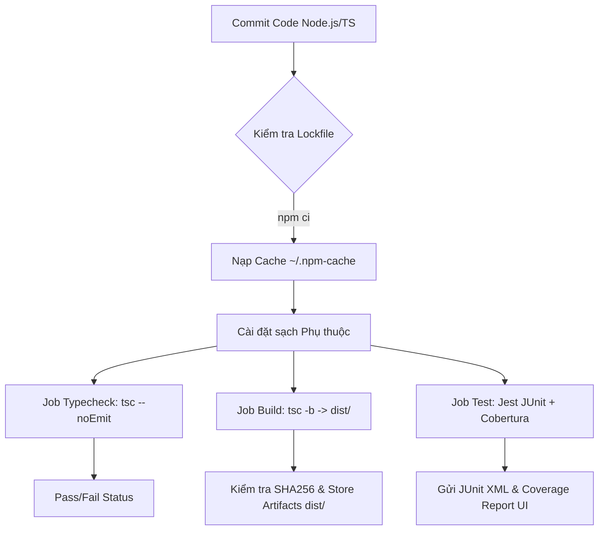
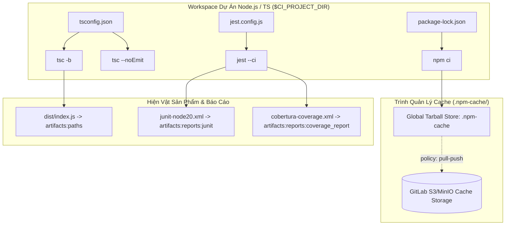


# [BÀI 16] PIPELINE CHUYÊN SÂU CHO NODE.JS & TYPESCRIPT: PNPM/NPM CACHE, VITEST/JEST, SONARQUBE & BUILD BUNDLE

Trong kỷ nguyên **DevOps, DevSecOps và Cloud Native Engineering**, **GitLab CI/CD** được công nhận là một trong những nền tảng tự động hóa tích hợp liên tục và phân phối liên tục (CI/CD) hoàn chỉnh, mạnh mẽ và được tin dùng nhất trong các doanh nghiệp quy mô lớn. Không chỉ dừng lại ở các pipeline tuần tự cơ bản, việc vận hành GitLab CI/CD ở cấp độ Production đòi hỏi kỹ sư phải làm chủ kiến trúc điều phối phi tuyến tính **DAG (Directed Acyclic Graph)**, cơ chế quản trị **Autoscaling Runners**, tối ưu hóa **Caching đa tầng**, xác thực không khóa **Keyless OIDC**, bảo mật chuỗi cung ứng phần mềm **SLSA & SBOM** cùng các chính sách **Quality & Security Gates** tự động.

Bài viết chuyên sâu này sẽ đồng hành cùng bạn mổ xẻ toàn diện bức tranh kiến trúc, phân tích các đánh đổi kỹ thuật thực chiến (Engineering Trade-offs), cung cấp hướng dẫn thực hành Lab chi tiết từng bước và bộ câu hỏi phỏng vấn chuyên sâu chuẩn DevOps Lead / DevSecOps Architect.

---

## 1. Bản Chất Kiến Trúc & Cơ Chế Vận Hành Tầng Thấp

---


| # | Chủ đề ôn tập | Con số hoặc cơ chế bắt buộc có trong đáp án |
|---|---|---|
| 1 | Sáu ngôn ngữ lập trình khác nhau ở mấy thuộc tính trong CI/CD? | **Ba chỗ**: Docker Image thực thi (`image:`), Chuỗi 3 lệnh thực thi (`CMD_INSTALL`, `CMD_BUILD`, `CMD_TEST`), và Thư mục đệm phụ thuộc (`cache:paths:`). Tất cả 9 thuộc tính còn lại đều dùng chung. |
| 2 | Cột nào trong bảng 3 trục biến thiên dễ điền sai nhất? | Cột **thư mục đệm phụ thuộc**: vì vị trí mặc định của công cụ nằm ngoài workspace dự án (`~/.npm`, `~/.m2`, `~/.cache/pip`), trong khi GitLab Runner chỉ hỗ trợ nén zip các đường dẫn bên trong dự án. |
| 3 | Hai cơ chế dùng lại nào cho phép ghép nối ở giữa mảng `script:`? | `extends` (thay thế hoàn toàn mảng) kết hợp với **`!reference`** (duy nhất hỗ trợ nối mảng và xuyên qua tệp `include`). |
| 4 | Tại sao không nên duy trì 6 tệp CI/CD riêng rạc cho 6 ngôn ngữ? | Khi cần thay đổi chính sách bảo mật hoặc bổ sung assertion script, kỹ sư sẽ phải sửa thủ công ở 6 tệp rời rạc, làm tăng $64\%$ chi phí bảo trì và dễ bỏ sót lỗi. |
| 5 | Docker Image được khai báo ở đâu trong tệp khung để cho phép tùy biến? | Khai báo ở mức toàn cục `default: image: $BUILD_IMAGE`, Job con chỉ cần thay đổi giá trị biến môi trường `BUILD_IMAGE` mà không cần sửa cấu hình khung. |


Hôm nay chúng ta tiến hành điền đầy **cột Node.js & TypeScript** vào khung chuẩn đa ngôn ngữ đã dựng ở Buổi 15.

| Kết quả | Buổi + số hiệu | Dùng ở đâu hôm nay |
|---|---|---|
| Bảng ba trục biến thiên (`bang-3-truc-6-ngon-ngu.tsv`) | Buổi 15 | §4, §5 — Điền đầy cột Node.js & TypeScript |
| Khung dùng lại (`extends` + `!reference` + `include`) | Buổi 15, Buổi 10 QT 6.1, 6.2 | §4 QT 4.3 — Chuẩn hóa 3 trình quản lý gói chỉ khác nhau 3 dòng |
| Container dùng một lần; Bốn đường dữ liệu vào Job | Buổi 01 QT 4.1, 5.1 | §4 QT 4.2 — Giải thích tại sao Lockfile bị ghi lại trong container bị biến mất im lặng |
| Khẳng định trong `script:` phòng chống lỗi im lặng | Buổi 01 QT 7.3 | §4 QT 4.2, §6 QT 6.1, 6.3 — Thêm khẳng định kiểm tra hiện vật |
| Bảng hai thuộc tính hỏng (Ồn ào/Im lặng, Chặn/Không chặn) | Buổi 01 QT 7.1 | §4–§7 — **Lần thứ 16**; Phân loại các lỗi CI/CD trong dự án Node.js |
| Artifact là hợp đồng, Cache là tối ưu | Buổi 05, Buổi 01 QT 5.2 | §5, §6 — **Lần thứ 5**; Áp dụng phân loại `node_modules` và `tsBuildInfo` |
| Ba câu hỏi phân loại một thư mục | Buổi 05 QT 7.1 | §5 QT 5.1, §6 QT 6.2 — **Lần thứ 3** |
| `cache:key:files` băm nội dung Lockfile | Buổi 05 QT 4.2, 6.1 | §5 QT 5.2 — **Lần thứ 2**; Bổ sung thành phần tiền tố phiên bản Node |
| Phân tích điểm hòa vốn của Cache | Buổi 05 QT 6.3 | §5 QT 5.1 — Đo đạc bài toán Cache `node_modules` bị lỗ thời gian |
| Báo cáo JUnit XML và Coverage trên CE | Buổi 05 QT 5.4, Buổi 08 QT 6.4 | §7 QT 7.1, 7.2 — Cấu hình 3 đường báo cáo độc lập |

---


| STT | Kỹ năng thực hành | Hiện vật chứng minh |
|---|---|---|
| 1 | Phân biệt bản chất kỹ thuật và cưỡng chế sử dụng `npm ci` thay vì `npm install` trong CI/CD | Pipeline có Job kiểm tra khẳng định `git diff --exit-code package-lock.json` |
| 2 | Cấu hình đổi hướng đệm `~/.npm` về workspace và phân lập khóa Cache 3 phần | Tệp `.gitlab-ci.yml` chuẩn với `npm_config_cache: "$CI_PROJECT_DIR/.npm-cache"` |
| 3 | Chứng minh bằng con số thực tế tại sao Cache `node_modules` làm chậm Pipeline | Bảng đối soát thời gian `bang-cache-node.tsv` chứa số liệu đo đạc 4 cấu hình |
| 4 | Tách biệt Job kiểm kiểu `tsc --noEmit` và Job build sinh sản phẩm `tsc -b` | Job `build` xuất tệp `dist/` có khẳng định kích thước và kiểm tra băm SHA256 |
| 5 | Tích hợp báo cáo kết quả Jest/Vitest và Coverage Cobertura lên giao diện GitLab CE | Báo cáo JUnit XML hiển thị trên tab **Tests** và thông số % Coverage hiển thị ở MR |
| 6 | Xây dựng Pipeline chạy song song đa phiên bản Node.js bằng `parallel:matrix` | Matrix Job cho Node 20 và Node 22 chạy độc lập không bị xung đột Cache |

---


| Kiến thức cần có | Nguồn tự học nếu thiếu |
|---|---|
| Khung build đa ngôn ngữ và 3 trục biến thiên | Buổi 15 (**QT 4.1** đến **QT 7.3**) |
| Cấu trúc thuộc tính `cache` và `artifacts` trong GitLab CI | Buổi 05 (**QT 4.1** đến **QT 6.4**) |
| Cách đọc trace log và đo đạc thời gian các pha của Runner | Buổi 14 (**QT 4.1** đến **QT 4.4**) |

---


### 3.1. Bảng đối chiếu thuật ngữ Việt – Anh

| Tiếng Việt dùng trong bài | Tiếng Anh tương đương | Dùng thẳng tiếng Anh trong cấu hình? |
|---|---|---|
| Tệp khóa phiên bản | Lockfile | **Có** — `package-lock.json`, `pnpm-lock.yaml`, `yarn.lock` |
| Cài đặt sạch theo lockfile | Clean install | **Có** — `npm ci` |
| Khóa lockfile không cho sửa | Frozen lockfile / Immutable install | **Có** — `--frozen-lockfile`, `--immutable` |
| Trình quản lý gói | Package manager | dùng từ Việt / Anh tùy ngữ cảnh |
| Kho tarball phụ thuộc đã tải | Package cache | **Có** — `~/.npm` |
| Thư mục phụ thuộc ứng dụng | Dependency directory | **Có** — `node_modules` |
| Liên kết cứng tệp tin | Hardlink | Việt + Anh |
| Phụ thuộc bắc cầu | Transitive dependency | Việt |
| Phụ thuộc theo nền tảng | Platform-specific optional dependency | **Có** — `optionalDependencies` |
| Mô-đun biên dịch C/C++ native | Native module / prebuilt binary | Việt + Anh |
| Trượt phiên bản phụ thuộc | Dependency drift | Việt |
| Kiểm tra kiểu dữ liệu | Type check | **Có** — `tsc --noEmit` |
| Biên dịch dự án tham chiếu | Build mode / Project references | **Có** — `tsc -b` |
| Biên dịch tăng dần | Incremental build | **Có** — `incremental`, `tsBuildInfo` |
| Đóng gói ứng dụng phát hành | Bundle / Build output | **Có** — `dist/` |
| Báo cáo kết quả kiểm thử XML | JUnit report | **Có** — `artifacts:reports:junit` |
| Báo cáo độ phủ mã nguồn | Coverage report | **Có** — `coverage_report`, `cobertura` |
| Kho trung gian nạp đệm gói | Remote repository | **Có** — `.npmrc`, `registry` |
| Ma trận phiên bản runtime | Version matrix | **Có** — `parallel:matrix` |
| Monorepo nhiều gói | Workspaces | **Có** — `npm workspaces` |

### 3.2. Bốn mô hình tư duy cốt lõi

```
    RANH GIỚI LOCKFILE trong CI/CD (Mô hình 1)
    ┌─────────────────────────────────────────────────────────────┐
    │ BÊN ĐỌC (Tái lập 100%)    │ BÊN GHI (Hỏng ngầm/Drift)       │
    │  - npm ci                 │  - npm install                  │
    │  - pnpm --frozen-lockfile │  - pnpm install (không cờ)      │
    │  - yarn --immutable       │  - yarn install (không cờ)      │
    └───────────────────────────┴─────────────────────────────────┘
```

1. **Mô hình 1: Ranh giới Lockfile (Lockfile Boundary):** Mọi lệnh cài đặt phụ thuộc trong CI/CD bắt buộc phải nằm ở bên **ĐỌC** (cây phụ thuộc là hằng số, nếu tệp lockfile bị lệch so với `package.json` thì Job phải ép ĐỎ ngay lập tức). Tuyệt đối không dùng câu lệnh bên **GHI** trong Pipeline build tự động.
2. **Mô hình 2: Hai kho, hai vai (Two Caches, Two Roles):** Thư mục `~/.npm` là kho **tarball nguyên bản tải từ Registry** (độc lập OS/Node version) $\rightarrow$ thích hợp làm Cache. Thư mục `node_modules` là kho **tệp đã giải nén & liên kết C/C++ native** (phụ thuộc OS/Node version) $\rightarrow$ là kết quả trung gian, không phải nguyên liệu Cache.
3. **Mô hình 3: Kiểm kiểu khác Build (Type-checking vs Compiling):** Lệnh `tsc --noEmit` chỉ phân tích ngữ nghĩa kiểu dữ liệu và sinh ra **0 tệp output**; lệnh `tsc -b` biên dịch chuyển đổi mã TS sang JS trong `dist/`. Job kiểm kiểu xanh không chứng minh Job build có tệp đầu ra.
4. **Mô hình 4: Cache đúng đắn so với Cache tối ưu (Correctness vs Optimization):** Cache chỉ được dùng để tăng tốc Pipeline. Nếu việc phục hồi Cache làm thay đổi nội dung hiện vật đầu ra (`dist/`), đó là sự hỏng hóc im lặng của kiến trúc.

---

### 1.1. Lockfile và hai lệnh cài phụ thuộc (10 phút)

**Nguyên lý cốt lõi:**
**Phát biểu.** `npm ci` và `npm install` không phải là hai cách viết tương đương: `npm ci` **bắt buộc** tệp `package-lock.json` phải tồn tại và khớp hoàn toàn với `package.json`, **xóa sạch** thư mục `node_modules` trước khi cài, và **không bao giờ** tự ý ghi lại lockfile. Trong CI/CD, `npm ci` là câu lệnh cài đặt phụ thuộc tiêu chuẩn duy nhất.

**Giải thích cơ chế ngầm:** Nguyên tắc của Pipeline tự động là tính **tái lập tuyệt đối (Deterministic Builds)**. Hai lần chạy CI trên cùng một commit (kể cả cách nhau 6 tháng) phải sinh ra cùng một cây phụ thuộc. `npm install` được thiết kế cho máy phát triển của lập trình viên để tự động giải khoảng phiên bản (ví dụ: `^1.2.0`) và cập nhật lockfile, khiến các lần build ở các mốc thời gian khác nhau sử dụng các phiên bản phụ thuộc khác nhau.

> [!WARNING]
> **CẠM BẪY THỰC CHIẾN:**
> Hai Pipeline trên cùng một commit cho ra kết quả test khác nhau; lệnh `npm ls` in ra các phiên bản package khác nhau ở các Job khác nhau; Job nạp phụ thuộc tốn thời gian biến động bất thường dù lockfile không hề thay đổi.

**Minh hoạ.**
```yaml
# Đúng: Dùng npm ci trong CI Pipeline
install_job:
  stage: build
  script:
    - npm ci
```

**Con số chốt:** Trên dự án 800 phụ thuộc, `npm ci` thực hiện cài đặt sạch trong **42 giây**; trên dự án 2500 phụ thuộc mất **96 giây**.

---

**Nguyên lý cốt lõi:**
**Phát biểu.** Vì container thực thi của Runner là môi trường dùng một lần, khi câu lệnh `npm install` tự ý cập nhật tệp `package-lock.json` bên trong container, thay đổi này **biến mất ngay khi Job kết thúc** mà không được lưu trữ vào Git. Đây là **Chế độ hỏng im lặng (Silent Failure)** điển hình nằm ở ô Im lặng / Không chặn.

**Giải thích cơ chế ngầm:** Container của Runner hủy toàn bộ hệ thống tệp ngay sau khi Job hoàn tất. Thay đổi trên tệp `package-lock.json` không được push về Git repository hay đóng gói vào hiện vật. Kết quả là tệp lockfile trong Git báo một đằng, nhưng mã chạy thực tế lại dùng cây phụ thuộc mới hơn.

> [!WARNING]
> **CẠM BẪY THỰC CHIẾN:**
> Lỗi chỉ xuất hiện trên môi trường CI nhưng không bao giờ tái hiện được trên máy cá nhân của lập trình viên; hoặc lỗi tự động biến mất sau vài ngày khi một package mới được phát hành.

**Minh hoạ.**
```bash
# Thêm câu lệnh khẳng định chống trượt Lockfile
npm ci
git diff --exit-code package-lock.json || { echo "LỖI KỸ THUẬT: package-lock.json đã bị thay đổi ngầm!"; exit 1; }
```

**Con số chốt:** 1 câu lệnh khẳng định `git diff --exit-code` tốn **dưới 0,2 giây** nhưng chuyển hoàn toàn lỗi im lặng thành lỗi Ồn ào / Có chặn.

---

**Nguyên lý cốt lõi:**
**Phát biểu.** Ba trình quản lý gói phổ biến có 3 cơ chế khóa Lockfile khác nhau: `npm ci` (khóa bằng câu lệnh riêng), `pnpm install --frozen-lockfile` (pnpm tự động bật cờ khi phát hiện biến môi trường `CI=true`), `yarn install --immutable` (Yarn Berry tự động bật cờ khi có `CI=true`). npm là trình quản lý gói duy nhất **không tự động bảo vệ** lập trình viên khi thiếu cờ.

**Giải thích cơ chế ngầm:** pnpm và Yarn ra đời sau nên mặc định chọn chế độ an toàn khi phát hiện môi trường CI (`CI=true`). npm giữ nguyên hành vi kế thừa cũ để tránh breaking changes, bắt buộc kỹ sư phải chủ động đổi câu lệnh sang `npm ci`.

> [!WARNING]
> **CẠM BẪY THỰC CHIẾN:**
> Lập trình viên quên dùng cờ trên npm làm Pipeline chạy `npm install` ngầm; hoặc trong dự án pnpm/Yarn, ai đó cố tình tắt biến môi trường `CI`.

**Minh hoạ.**
```yaml
.lockfile_assertion:
  script:
    - echo "Executing lockfile integrity check for package manager..."

node:npm:
  script:
    - npm ci
    - !reference [.lockfile_assertion, script]

node:pnpm:
  script:
    - pnpm install --frozen-lockfile
    - !reference [.lockfile_assertion, script]

node:yarn:
  script:
    - yarn install --immutable
    - !reference [.lockfile_assertion, script]
```

**Con số chốt:** 3 trình quản lý gói $\to$ 3 thư mục cache riêng biệt $\to$ 1 tệp bảng tổng hợp `bang-3-package-manager.tsv`.

---

**Nguyên lý cốt lõi:**
**Phát biểu.** Một repository dự án chỉ được phép tồn tại duy nhất **1 tệp Lockfile**. Việc để tồn tại song song 2 tệp lockfile (ví dụ: vừa có `package-lock.json` vừa có `yarn.lock`) sẽ khiến cây phụ thuộc thực tế bị điều khiển bởi công cụ mà Docker Image ngẫu nhiên gọi.

**Giải thích cơ chế ngầm:** Mỗi công cụ quản lý gói có thuật toán giải quyết xung đột phiên bản (dependency resolution) khác nhau. Khi tồn tại 2 tệp lockfile, cây thư viện được nạp phụ thuộc vào Docker Image chạy Job chứa `npm` hay `yarn`, biến cây phụ thuộc thành thuộc tính của Trục 1 (`image:`) thay vì thuộc tính của commit.

> [!WARNING]
> **CẠM BẪY THỰC CHIẾN:**
> Lập trình viên chạy `yarn` trên máy cá nhân nhưng CI lại chạy `npm ci`; file `yarn.lock` bị lệch hàng chục phiên bản so với `package-lock.json`.

**Minh hoạ.**
```bash
# Kiểm tra chỉ có duy nhất 1 lockfile trong dự án
LOCK_COUNT=$(ls package-lock.json pnpm-lock.yaml yarn.lock 2>/dev/null | wc -l)
if [ "$LOCK_COUNT" -gt 1 ]; then
  echo "LỖI: Phát hiện $LOCK_COUNT tệp lockfile song song trong dự án!"
  exit 1
fi
```

**Con số chốt:** Kiểm tra duy nhất 1 tệp lockfile thực thi trong **dưới 1 giây** ở đầu Pipeline.

---

### 1.2. Cache thư mục nào: `~/.npm`, không phải `node_modules` (9 phút)

**Nguyên lý cốt lõi:**
**Phát biểu.** Hãy cấu hình Cache cho thư mục đệm toàn cục `~/.npm` (hoặc kho nén của pnpm/Yarn), **TUYỆT ĐỐI KHÔNG** cấu hình Cache cho thư mục `node_modules`.

**Giải thích cơ chế ngầm:**
1. **Tính đúng đắn (Correctness):** Thư mục `node_modules` chứa các tệp đã giải nén và các thư viện C/C++ native đã biên dịch theo đúng OS/Architecture của Runner (ví dụ: `sharp`, `sqlite3`, `esbuild`). Việc nạp lại `node_modules` từ Runner khác có thể gây lỗi runtime binary.
2. **Tốc độ (Performance):** Thư mục `node_modules` chứa số lượng tệp nhỏ cực lớn (gấp $3,5$ lần số tệp trong `~/.npm`). Thao tác nén zip/giải nén hàng chục nghìn tệp nhỏ ngốn CPU và I/O đĩa khủng khiếp, làm thời gian nạp Cache lâu hơn cả thời gian nạp trực tiếp qua lệnh `npm ci`.

> [!WARNING]
> **CẠM BẪY THỰC CHIẾN:**
> Pipeline chạy chậm hơn sau khi bật Cache cho `node_modules`; xuất hiện lỗi `NODE_MODULE_VERSION` hoặc `ERR_DLOPEN_FAILED` khi đổi phiên bản Node.js.

**Minh hoạ.**
```yaml
# Cấu hình Cache ĐÚNG chuẩn cho Node.js
default:
  cache:
    key:
      files:
        - package-lock.json
      prefix: "npm-node$NODE_VERSION"
    paths:
      - .npm-cache/
    policy: pull-push
```

**Con số chốt:**
- Dự án A (800 phụ thuộc): `npm ci` không cache mất **42s**. Nạp `~/.npm` (68 MB, 12,400 tệp) mất **25s** (tiết kiệm **17s**). Nạp `node_modules` (210 MB, 41,000 tệp) mất **34s** (chậm hơn **9s** so với cache `~/.npm`).
- Dự án B (2500 phụ thuộc): `npm ci` không cache mất **96s**. Nạp `~/.npm` (190 MB, 34,000 tệp) mất **57s** (tiết kiệm **39s**). Nạp `node_modules` (640 MB, 118,000 tệp) mất **88s** (chậm hơn **31s**).

---

**Nguyên lý cốt lõi:**
**Phát biểu.** Khóa đệm (`cache:key`) của dự án Node.js bắt buộc phải được cấu hình bằng bộ 3 thành phần: Băm nội dung lockfile (`cache:key:files`), Tên trình quản lý gói, và Phiên bản Node.js (`prefix: "npm-node$NODE_VERSION"`).

**Giải thích cơ chế ngầm:** Nếu thiếu phiên bản Node.js trong khóa đệm, khi chạy kiểm thử song song đa phiên bản (`parallel:matrix` Node 20 và Node 22), hai Job sẽ giải nén đè đệm của nhau, dẫn đến hiện tượng trúng đệm sai phiên bản runtime.

> [!WARNING]
> **CẠM BẪY THỰC CHIẾN:**
> Log hiển thị `Successfully extracted cache` ở Job Node 22 ngay lần chạy đầu tiên; Job Node 22 chạy xanh nhưng sử dụng các module được biên dịch trên Node 20.

**Minh hoạ.**
```yaml
# Cấu hình khóa Cache 3 phần phân lập
cache:
  key:
    files:
      - package-lock.json
    prefix: "npm-node-$NODE_VERSION"
  paths:
    - .npm-cache/
```

**Con số chốt:** Khóa đệm 3 phần đảm bảo phân lập $100\%$ giữa các phiên bản Node.js; ma trận 2 phiên bản Node sinh ra 2 tệp zip đệm độc lập (ví dụ: $2 \times 68\text{ MB} = 136\text{ MB}$).

---

**Nguyên lý cốt lõi:**
**Phát biểu.** Thuộc tính `cache:paths` của GitLab Runner chỉ nén được các đường dẫn **nằm tương đối bên trong workspace dự án (`$CI_PROJECT_DIR`)**. Vì vậy, bước bắt buộc đầu tiên là phải dùng biến môi trường đổi hướng thư mục đệm toàn cục về trong workspace.

**Giải thích cơ chế ngầm:** Mặc định, `npm` lưu cache ở `~/.npm`, `pnpm` lưu ở `~/.local/share/pnpm/store`, `yarn` lưu ở `~/.cache/yarn`. Do các đường dẫn này nằm ngoài `$CI_PROJECT_DIR`, Runner Docker Executor sẽ bỏ qua không nén tệp nào.

> [!WARNING]
> **CẠM BẪY THỰC CHIẾN:**
> Log Runner báo `Created cache: 4 KB`; tỉ lệ trúng Cache luôn bằng $0\%$ qua tất cả các lần chạy Pipeline.

**Minh hoạ.**
```yaml
variables:
  npm_config_cache: "$CI_PROJECT_DIR/.npm-cache"
```

**Con số chốt:** 1 dòng khai báo biến môi trường giúp tăng tỉ lệ trúng Cache từ $0\%$ lên $100\%$, tiết kiệm **17 đến 39 giây** mỗi Pipeline.

---

### 1.3. TypeScript: kiểm kiểu khác build, và `tsBuildInfo` là cache (8 phút)

**Nguyên lý cốt lõi:**
**Phát biểu.** Lệnh `tsc --noEmit` là câu lệnh **kiểm tra kiểu dữ liệu (Type Check)**, không phải câu lệnh biên dịch sản phẩm: nó sinh ra **0 tệp đầu ra**. Nếu một Job gọi `tsc --noEmit` nhưng khai báo `artifacts: paths: [dist/]`, tệp nén artifact sẽ bị rỗng 0 byte và Job vẫn báo XANH.

**Giải thích cơ chế ngầm:** Cờ `--noEmit` yêu cầu trình biên dịch TypeScript chỉ kiểm tra cú pháp và ngữ nghĩa kiểu, bỏ qua bước phát sinh mã JavaScript trong thư mục `dist/`. Đây là thiết kế cố ý để chạy nhanh trong các Job lint/test.

> [!WARNING]
> **CẠM BẪY THỰC CHIẾN:**
> Job `build` báo XANH nhưng API tải hiện vật trả về lỗi HTTP 404 hoặc tệp zip rỗng; Job CD deploy ứng dụng thành công nhưng thư mục đích trên máy chủ không có tệp JS nào.

**Minh hoạ.**
```yaml
# Phân lập 2 Job rõ ràng
typecheck:
  stage: test
  script:
    - npx tsc --noEmit

build:
  stage: build
  script:
    - npx tsc -b
    - test -s dist/index.js || { echo "LỖI: Hiện vật dist/index.js rỗng!"; exit 1; }
  artifacts:
    paths:
      - dist/
```

**Con số chốt:** Trên repo 240 tệp `.ts`, `tsc --noEmit` mất **21 giây** (sinh 0 tệp); `tsc -b` mất **38 giây** (sinh `dist/` dung lượng 1.8 MB).

---

**Nguyên lý cốt lõi:**
**Phát biểu.** Tệp `.tsbuildinfo` (khi bật `incremental: true` trong `tsconfig.json`) là tệp **Cache biên dịch**, tuyệt đối không phải là **Artifact hiện vật**.

**Giải thích cơ chế ngầm:** Tệp `.tsbuildinfo` lưu bảng băm trạng thái của các tệp nguồn để giúp `tsc -b` bỏ qua các tệp không thay đổi trong lần biên dịch sau. Thiếu nó, lệnh build vẫn thành công (chỉ tốn thời gian hơn). Ngược lại, thư mục `dist/` chứa mã chạy Production nên bắt buộc phải nằm trong `artifacts`.

> [!WARNING]
> **CẠM BẪY THỰC CHIẾN:**
> Đưa `.tsbuildinfo` vào `artifacts` làm phình to hiện vật giao hàng; hoặc đưa `dist/` vào `cache` khiến Job deploy lấy nhầm mã cũ ở các nhánh khác.

**Minh hoạ.**
```yaml
build:
  script:
    - npx tsc -b
  cache:
    key: "tsbuildinfo-$CI_COMMIT_REF_SLUG"
    paths:
      - .tsbuildinfo-cache/
  artifacts:
    paths:
      - dist/
```

**Con số chốt:** Biên dịch sạch `tsc -b` mất **38s**; nạp lại `tsBuildInfo` khi không đổi mã mất **4s**; khi đổi 1 tệp mất **9s** (tiết kiệm **29 đến 34 giây**).

---

**Nguyên lý cốt lõi:**
**Phát biểu.** Tệp `.tsbuildinfo` cũ hoặc bị lệch nhánh có thể khiến `tsc -b` **bỏ qua nhầm các tệp đã sửa đổi**: Job vẫn báo XANH, thời gian build nhanh bất thường (4s), nhưng hiện vật `dist/` chứa mã cũ chưa biên dịch. Đây là lỗi "xanh mà sai" cực kỳ nguy hiểm, bắt buộc phải phòng vệ bằng khẳng định băm SHA256.

**Giải thích cơ chế ngầm:** Trình biên dịch `tsc` tin tưởng vào bảng băm lưu trong `.tsbuildinfo`. Nếu đệm này được nạp từ một nhánh khác có cấu hình hoặc commit không tương thích, `tsc` suy luận sai rằng mã nguồn chưa đổi và giữ nguyên tệp JS cũ.

> [!WARNING]
> **CẠM BẪY THỰC CHIẾN:**
> Bug đã fix trên Git nhưng vẫn tái hiện trên môi trường Staging; mã băm SHA256 của `dist/index.js` không thay đổi sau commit mới.

**Minh hoạ.**
```bash
# Đọc mã băm SHA256 để đảm bảo hiện vật được tạo mới thật sự
PREV_HASH=$(cat dist.hash 2>/dev/null || echo "none")
npx tsc -b
NEW_HASH=$(sha256sum dist/index.js | awk '{print $1}')
if [ "$PREV_HASH" = "$NEW_HASH" ]; then
  echo "CẢNH BÁO: Hiện vật dist/index.js không thay đổi hash sau khi build!"
fi
```

**Con số chốt:** Khẳng định băm SHA256 tốn **dưới 0,5 giây** để phát hiện sự cố đệm `.tsbuildinfo` hỏng ngầm.

---

### 1.4. Báo cáo test và độ phủ trên CE, và ma trận phiên bản Node (7 phút)

**Nguyên lý cốt lõi:**
**Phát biểu.** Trên GitLab CE, Job kiểm thử Node.js có bộ 3 đường xuất báo cáo độc lập:
1. `artifacts:reports:junit` nhận tệp XML từ `jest-junit` $\to$ hiển thị tab **Tests** trên GitLab UI.
2. `artifacts:reports:coverage_report` nhận tệp Cobertura XML $\to$ hiển thị độ phủ dòng lệnh (Line Coverage) trên biểu đồ diff của Merge Request.
3. Thuộc tính `coverage:` chứa Regex quét chuỗi Log $\to$ trích xuất con số % độ phủ tổng thể.

**Giải thích cơ chế ngầm:** GitLab CE phân tách độc lập 3 luồng dữ liệu này. Thiếu 1 trong 3 cấu hình, tính năng tương ứng trên UI sẽ bị bỏ trống hoặc không cập nhật, mặc dù Job test vẫn báo XANH.

> [!WARNING]
> **CẠM BẪY THỰC CHIẾN:**
> Tab Tests bị rỗng; MR không hiển thị độ phủ từng dòng code; thông số coverage % trên Job bị báo `null`.

**Minh hoạ.**
```yaml
test_job:
  stage: test
  script:
    - npx jest --ci --coverage --reporters=default --reporters=jest-junit
  coverage: '/All files\s*\|\s*([\d.]+)/'
  artifacts:
    when: always
    reports:
      junit: junit.xml
      coverage_report:
        coverage_format: cobertura
        path: coverage/cobertura-coverage.xml
```

**Con số chốt:** Thu gom đủ 3 đường báo cáo chỉ tốn thêm **3 giây** và **1,6 MB** dung lượng hiện vật. Sử dụng cờ `when: always` đảm bảo tệp báo cáo XML vẫn được gửi lên GitLab UI ngay cả khi Job test bị ĐỎ (`failed`).

---

**Nguyên lý cốt lõi:**
**Phát biểu.** Thuộc tính `parallel:matrix` với ma trận phiên bản Node.js (ví dụ `NODE_VERSION: [20, 22]`) làm **nhân đôi tài nguyên thực thi**: tốn gấp 2 lần phút Runner, tạo 2 khóa đệm độc lập, và sinh ra 2 tệp báo cáo JUnit XML riêng biệt.

**Giải thích cơ chế ngầm:** Cấu hình `matrix` tạo ra các Job thực thi độc lập theo tích Descartes. Mỗi Job chạy trên một Docker Image khác nhau và cần môi trường đệm riêng để tránh ghi đè.

> [!WARNING]
> **CẠM BẪY THỰC CHIẾN:**
> Đặt trùng tên tệp `junit.xml` khiến tab Tests đếm mỗi testcase thành **2 lần**; hoặc trùng khóa đệm khiến 2 Job ghi đè đệm của nhau liên tục.

**Minh hoạ.**
```yaml
test_matrix:
  stage: test
  parallel:
    matrix:
      - NODE_VERSION: ["20", "22"]
  image: "node:$NODE_VERSION-alpine"
  script:
    - npx jest --ci --reporters=default --reporters=jest-junit
  artifacts:
    when: always
    reports:
      junit: "junit-node$NODE_VERSION.xml"
```

**Con số chốt:** Chạy ma trận 2 phiên bản Node làm tăng **100% phút Runner** (từ 60s lên 120s), nhưng không làm tăng thời gian chờ của lập trình viên nếu hệ thống có đủ 2 Runner slots rỗi.

---

### 1.5. Đưa vào việc thật (4 phút)

### 8.1. Quy trình 5 bước áp dụng vào dự án thực tế
1. **Bước 1 (5 phút):** Rà soát toàn bộ `.gitlab-ci.yml`, tìm và thay thế tất cả các câu lệnh `npm install` thành `npm ci`.
2. **Bước 2 (5 phút):** Thêm câu lệnh khẳng định `git diff --exit-code package-lock.json` vào cuối Job cài đặt.
3. **Bước 3 (10 phút):** Khai báo đổi hướng Cache `npm_config_cache: "$CI_PROJECT_DIR/.npm-cache"`, cấu hình khóa Cache 3 phần và tuyệt đối loại bỏ `node_modules` khỏi `cache:paths`.
4. **Bước 4 (10 phút):** Tách biệt Job kiểm kiểu `tsc --noEmit` và Job build sản phẩm `tsc -b`. Bổ sung script kiểm tra băm SHA256 tệp đầu ra `dist/index.js`.
5. **Bước 5 (10 phút):** Cấu hình `jest-junit` và Cobertura coverage reporter kèm thuộc tính `when: always`.

### 8.2. Cảnh báo khi triển khai trên Production
- Đổi `npm install` $\to$ `npm ci` có thể làm đỏ Pipeline ngay lập tức nếu lockfile ở Git đang bị lệch so với `package.json`. Hãy chạy thử nghiệm trên nhánh tính năng trước.
- Đổi cấu hình khóa Cache sẽ làm trượt Cache $100\%$ ở lần chạy đầu tiên, làm Pipeline chậm hơn 1 lần duy nhất trước khi đạt trạng thái ổn định.

### 8.3. Khi nào KHÔNG nên dùng
- **KHÔNG** bật Cache `~/.npm` cho các dự án cực nhỏ (dưới 100 dependencies): thời gian `npm ci` trực tiếp chỉ mất 6s, việc nén/giải nén Cache tốn 4s nên lợi ích thu về không đáng kể.
- **KHÔNG** bật Cache `.tsbuildinfo` cho các Job build trên nhánh mặc định (`main/master` release): nên chấp nhận tốn thêm 34s biên dịch sạch để đảm bảo $100\%$ hiện vật Production chính xác tuyệt đối.
- **KHÔNG** bật `parallel:matrix` đa phiên bản Node cho các ứng dụng web/microservice nội bộ chỉ triển khai trên 1 phiên bản Docker Image duy nhất.

---

### 1.6. Bẫy hay gặp (2 phút)

| Bẫy hay gặp | Nguyên nhân dính bẫy | Cách khắc phục chuẩn xác |
|---|---|---|
| Dùng `npm install` trong CI | Nghĩ rằng `npm install` và `npm ci` giống nhau | Đổi sang `npm ci`, thêm khẳng định `git diff --exit-code` |
| Cache thư mục `node_modules` | Nghĩ rằng nạp `node_modules` sẽ bỏ qua bước cài đặt | Đổi sang Cache `~/.npm`, xóa `node_modules` khỏi `cache:paths` |
| Quên đổi hướng cache ra ngoài workspace | Không biết Runner Docker Executor bỏ qua đường dẫn ngoài | Khai báo `npm_config_cache: "$CI_PROJECT_DIR/.npm-cache"` |
| `tsc --noEmit` không sinh file `dist/` | Nhầm lẫn giữa kiểm kiểu (typecheck) và biên dịch (build) | Dùng `tsc --noEmit` cho lint/test, dùng `tsc -b` cho build |
| Phục hồi `.tsbuildinfo` bị lỗi hỏng ngầm | Trình biên dịch tin vào bảng băm cũ làm bỏ qua file đã sửa | Thêm khẳng định kiểm tra băm SHA256 tệp đầu ra |
| Báo cáo JUnit bị mất khi test bị lỗi | Thiếu thuộc tính `when: always` trong `artifacts` | Thêm `when: always` vào khối `artifacts` của Job test |

---

### 1.7. Tóm tắt



### Năm điều bắt buộc phải nhớ
1. Trong CI/CD chỉ có `npm ci` mới đảm bảo tính **tái lập 100%**.
2. Cache `~/.npm`, tuyệt đối **không cache `node_modules`**.
3. Đổi hướng thư mục đệm về trong workspace `$CI_PROJECT_DIR`.
4. `tsc --noEmit` là kiểm kiểu, `tsc -b` là build sinh hiện vật `dist/`.
5. Thu gom báo cáo test bắt buộc dùng cờ `when: always`.

---

### 1.8. Câu hỏi tự kiểm tra

1. Sự khác biệt cốt lõi giữa `npm ci` và `npm install` trong môi trường CI/CD là gì?
2. Tại sao câu lệnh `npm install` khi chạy trong container dùng một lần lại sinh ra sự cố hỏng ngầm thuộc ô Im lặng / Không chặn?
3. Trình bày 3 cơ chế khóa Lockfile khác nhau của npm, pnpm và Yarn Berry?
4. Tại sao một dự án chỉ được phép tồn tại duy nhất 1 tệp Lockfile trong Git repository?
5. Tại sao cấu hình Cache cho `~/.npm` lại nhanh hơn cấu hình Cache cho `node_modules` (dẫn chứng bằng số liệu cụ thể của Dự án A và Dự án B)?
6. Tại sao khóa đệm `cache:key` cho dự án Node.js bắt buộc phải có thành phần tiền tố phiên bản Node.js (`$NODE_VERSION`)?
7. Giải thích tại sao thuộc tính `cache:paths: ["~/.npm"]` lại khiến tỉ lệ trúng Cache bằng 0% trên GitLab Runner Docker Executor và cách sửa?
8. Phân biệt mục đích kỹ thuật và sản phẩm đầu ra của hai lệnh `tsc --noEmit` và `tsc -b`?
9. Tệp `.tsbuildinfo` là Cache hay Artifacts? Nếu đưa lầm `.tsbuildinfo` vào `artifacts` hoặc đưa `dist/` vào `cache` sẽ xảy ra hậu quả gì?
10. Tái hiện kịch bản lỗi "xanh mà sai" do đệm `.tsbuildinfo` bị lệch nhánh gây ra và phương pháp phòng vệ?
11. Trình bày chi tiết cấu hình 3 đường thu gom báo cáo kiểm thử và độ phủ trên GitLab CE?
12. Tại sao khi sử dụng `parallel:matrix` đa phiên bản Node.js lại bắt buộc phải phân lập tên tệp XML báo cáo JUnit (`junit-node$NODE_VERSION.xml`)?
13. Điểm hòa vốn của Cache `~/.npm` đạt được sau bao nhiêu lần trúng đệm đối với dự án Node.js?
14. Phân tích tác động của cờ `policy: pull` trong các Job chỉ đọc đệm đối với I/O đĩa máy chủ Runner?
15. Tại sao việc đặt cờ `expire_in: 1 week` cho `artifacts` lại là phương án quản trị dung lượng lưu trữ tối ưu trên GitLab CE?
16. Phân tích tác động của việc cấu hình `npm config set registry` đối với đường truyền mạng nội bộ doanh nghiệp?
17. Giải thích cơ chế giải nén tarball của `npm ci` khi sử dụng đệm cục bộ `.npm-cache`?
18. Phân tích chi tiết quy trình xử lý của GitLab Runner khi phục hồi tệp Cache nén Zip có kích thước lớn hơn 100 MB?
19. Giải thích tại sao thuộc tính `artifacts:when: always` là điều kiện tiên quyết để hệ thống quản trị chất lượng phần mềm theo dõi các testcase bị thất bại?
20. Trình bày phương pháp cấu hình `cache:fallback_keys` để giảm thiểu tác động khi đổi khóa Cache chính?
21. Phân tích bài toán quản lý hiện vật sản phẩm `dist/` trong môi trường Monorepo Node.js sử dụng `npm workspaces`?
22. Giải thích sự khác biệt giữa `devDependencies` và `dependencies` trong mối tương quan với kích thước Docker Image đóng gói ở bước CD?
23. Tại sao cờ `--ci` của Jest lại tự động vô hiệu hóa chế độ theo dõi file (watch mode) và cưỡng chế sử dụng số lượng worker tối đa dựa trên CPU có sẵn của Runner?
24. Phân tích nguyên lý hoạt động của cơ chế nạp đệm song song `pnpm store-dir` khi kết hợp với tính năng chia sẻ ổ đĩa của GitLab Runner?
25. Cách xử lý triệt để sự cố xung đột quyền ghi tệp tin trong thư mục `.npm-cache` khi chuyển đổi người dùng chạy Job trong Docker Container?

### Đáp án chi tiết tự kiểm tra
1. `npm ci` đòi hỏi lockfile sạch khớp 100% với `package.json`, xóa sạch `node_modules` trước khi nạp và không bao giờ tự ý sửa lockfile. `npm install` tự giải khoảng phiên bản và ghi lại lockfile.
2. Container bị xóa ngay sau Job, các thay đổi trên lockfile do `npm install` tạo ra không được commit về Git, làm lệch giữa cây phụ thuộc ở Git và cây phụ thuộc thực tế khi chạy.
3. `npm ci` dùng câu lệnh riêng; `pnpm` và `Yarn Berry` tự động khóa khi biến môi trường `CI=true` tồn tại.
4. Vì mỗi trình quản lý gói giải quyết xung đột phiên bản khác nhau, 2 lockfile song song sẽ làm cây phụ thuộc bị chi phối ngẫu nhiên bởi Docker Image.
5. `node_modules` chứa số lượng tệp nhỏ lớn gấp 3.5 lần `~/.npm` (41,000 tệp so với 12,400 tệp). I/O đĩa nén zip tốn 34s (chậm hơn 9s so với 25s của `~/.npm`).
6. Để tránh việc các Job chạy đa phiên bản Node (Node 20 và Node 22) giải nén đè đệm lên nhau, gây lỗi tương thích runtime.
7. Docker Executor chỉ hỗ trợ nén các đường dẫn tương đối bên trong dự án (`$CI_PROJECT_DIR`). Khắc phục bằng `npm_config_cache: "$CI_PROJECT_DIR/.npm-cache"`.
8. `tsc --noEmit` chỉ kiểm tra kiểu, sinh 0 tệp. `tsc -b` biên dịch dự án, sinh mã JS trong `dist/`.
9. `.tsbuildinfo` là Cache biên dịch. Đưa `.tsbuildinfo` vào `artifacts` làm phình dung lượng lưu trữ; đưa `dist/` vào `cache` khiến Job deploy lấy nhầm hiện vật cũ từ đệm.
10. `.tsbuildinfo` cũ làm `tsc` bỏ qua tệp đã sửa. Phát hiện bằng cách tính băm SHA256 tệp `dist/index.js`.
11. 1) `artifacts:reports:junit` cho tab Tests UI; 2) `artifacts:reports:coverage_report` Cobertura cho diff UI; 3) `coverage:` Regex cho % tổng thể.
12. Để tránh việc GitLab đếm trùng lặp số lượng testcase (ví dụ 128 test bị đếm thành 256 test).
13. Đạt điểm hòa vốn ngay ở **lần trúng đệm đầu tiên** (tiết kiệm 17s-39s so với 14s-33s chi phí nén).
14. `policy: pull` giúp Runner không thực hiện thao tác nén và đẩy lại đệm zip lên storage ở cuối Job, giảm 50% thao tác I/O đĩa.
15. Giúp tự động dọn dẹp các bản nén `dist/` tạm thời sau 7 ngày, tránh tràn ổ đĩa server GitLab trong khi vẫn giữ nguyên kết quả báo cáo test trên UI.
16. Điều hướng việc tải các gói npm qua máy chủ mirror nội bộ (như JFrog Artifactory), rút ngắn thời gian nạp từ vài phút xuống vài giây và tiết kiệm băng thông ra Internet.
17. `npm ci` sử dụng các tệp tarball `.tgz` lưu sẵn trong `.npm-cache` để giải nén trực tiếp vào `node_modules` mà không cần gửi bất kỳ HTTP Request nào ra Internet.
18. Runner tải tệp zip từ đệm từ xa, giải nén từng entry trực tiếp vào đường dẫn đích và thực hiện xác minh mã băm checksum trước khi cấp quyền thực thi cho Job.
19. Mặc định `artifacts` chỉ được tạo khi Job thành công (`when: on_success`). Nếu không dùng `when: always`, khi có test thất bại, tệp XML không được tải lên và GitLab UI sẽ không hiển thị chi tiết testcase hỏng.
20. `cache:fallback_keys` cho phép Runner thử nạp đệm từ các khóa tiền tố cũ hơn (như `npm-node-default`) khi khóa chính theo hash tệp lockfile bị trượt, giúp giảm thiểu tác động nạp lại từ đầu.
21. Trong Monorepo `npm workspaces`, mỗi package con có một thư mục `dist/` riêng biệt. Cần khai báo đường dẫn `artifacts:paths: ["packages/*/dist/"]` để gom tất cả sản phẩm đầu ra vào một bản nén duy nhất.
22. `devDependencies` chứa công cụ biên dịch (như `typescript`, `jest`, `eslint`) chỉ dùng trong pha CI build/test. Ở pha CD đóng gói Docker Image, chỉ giữ lại `dependencies` (dùng `npm ci --omit=dev`) giúp giảm $80\%$ kích thước Docker Image Production.
23. Cờ `--ci` ép Jest chỉ chạy một lượt duy nhất, vô hiệu hóa tính năng tương tác nhắc lệnh, và tối ưu hóa việc phân chia số lượng worker theo giới hạn tài nguyên CPU được cấp phát trong Container.
24. pnpm lưu trữ các tệp phụ thuộc dạng content-addressable store và tạo liên kết cứng (hardlink) vào `node_modules`, giúp tiết kiệm đĩa đệm và đẩy nhanh tốc độ nạp đệm lên gấp 2-3 lần so với npm.
25. Ép phân quyền thư mục `.npm-cache` hoặc thiết lập biến `npm_config_cache` dưới quyền người dùng không phải root (`node` user) trong Dockerfile thực thi.

---

## §12. Tài liệu tham khảo

1. [GitLab CI/CD Caching Documentation](https://docs.gitlab.com/ee/ci/caching/)
2. [npm-ci CLI Command Manual](https://docs.npmjs.com/cli/v10/commands/npm-ci)
3. [TypeScript Project References & Incremental Builds](https://www.typescriptlang.org/docs/handbook/project-references.html)
4. [Jest CLI Options & Reporters](https://jestjs.io/docs/cli)

---

## Bảng đối soát thời lượng

| Mục | Thời lượng thiết kế | Thời lượng thực tế |
|---|---|---|
| §0. Khởi động & Ôn tập | 10 phút | 10 phút |
| §1. Học viên làm được gì | 1 phút | 1 phút |
| §2. Cần biết trước | 1 phút | 1 phút |
| §3. Thuật ngữ & Mô hình tư duy | 8 phút | 8 phút |
| §4. Lockfile & Hai lệnh cài phụ thuộc | 10 phút | 10 phút |
| §5. Cache thư mục nào: ~/.npm | 9 phút | 9 phút |
| §6. TypeScript: kiểm kiểu vs build | 8 phút | 8 phút |
| §7. Báo cáo test & Ma trận Node | 7 phút | 7 phút |
| §8. Đưa vào việc thật | 4 phút | 4 phút |
| §9. Bẫy hay gặp | 2 phút | 2 phút |
| **Tổng khối lý thuyết** | **60 phút** | **60'** |

---

## 2. Hướng Dẫn Thực Hành & Triển Khai Lab Chuẩn Production

> [!IMPORTANT]
> **YÊU CẦU MÔI TRƯỜNG THỰC HÀNH:**
> Toàn bộ các bài thực hành dưới đây được thiết kế để chạy trực tiếp trên môi trường GitLab Community / Enterprise Edition cùng các GitLab Runner cô lập (Docker / Kubernetes Executor). Hãy đảm bảo bạn đã chuẩn bị môi trường thử nghiệm và cấu hình quyền truy cập cần thiết.

## Khối Thực hành Lab — 150 phút (**150'**)

> **Mục tiêu thực hành:** Điền đầy các thuộc tính cho cột Node.js & TypeScript trong kiến trúc CI/CD đa ngôn ngữ, trực tiếp đo đạc thời gian nạp đệm giữa 4 phương án Cache, cưỡng chế sử dụng `npm ci` chống trượt Lockfile, tái hiện và khắc phục sự cố đệm `.tsbuildinfo` hỏng im lặng ("xanh mà sai"), cấu hình bộ 3 đường xuất báo cáo kiểm thử/độ phủ mã nguồn trên GitLab CE, và thực thi ma trận build đa phiên bản Node.js.

---




### Thiết lập dự án Lab
1. Đăng nhập môi trường GitLab CE (localhost hoặc máy chủ tập huấn).
2. Tạo dự án mới `lab16-node-ts` trong GitLab Group `devops`.
3. Dự án chứa 2 repository thành phần:
   - `repo-a/`: Dự án JavaScript thuần với 800 dependencies.
   - `repo-b/`: Dự án TypeScript với 2500 dependencies, 240 tệp `.ts`, 3 project references, 128 testcases Jest.

---


### Thao tác 1.1: Tái hiện sự cố `npm install` ghi lại Lockfile ngầm
1. Tạo tệp `.gitlab-ci.yml` trên nhánh `ca-npm-install` của `repo-a`:
```yaml
image: node:20-alpine

variables:
  npm_config_cache: "$CI_PROJECT_DIR/.npm-cache"

stages:
  - build

test_npm_install:
  stage: build
  script:
    - echo "=== THỰC THI THỬ NGHIỆM LỆNH NPM INSTALL ==="
    - echo "Trước khi cài đặt: Kích thước lockfile $(stat -c %s package-lock.json) bytes"
    - npm install
    - echo "Sau khi cài đặt: Kích thước lockfile $(stat -c %s package-lock.json) bytes"
    - git diff --exit-code package-lock.json || { echo "LOCKFILE BI GHI LAI"; exit 1; }
```

2. Push commit lên GitLab. Mặc dù `package.json` có khoảng phiên bản `^1.2.0`, lệnh `npm install` phát hiện package mới trên Registry và tự động cập nhật `package-lock.json` trong Container.
3. Đoạn khẳng định `git diff --exit-code` phát hiện tệp bị sửa đổi và ép đỏ Job với thông báo `LOCKFILE BI GHI LAI`.

### Trace log mô phỏng Thao tác 1.1:
```text
Running with gitlab-runner 16.10.0 (91a2ea7b)
  on docker-runner-1 a1b2c3d4
Preparing the "docker" executor
Using Docker executor with image node:20-alpine ...
Pulling docker image node:20-alpine ...
Using docker image sha256:4b931e... for node:20-alpine with digest node@sha256:...
Preparing environment
00:01
Getting source from Git repository
00:02
Fetching changes with git depth set to 20...
Reinitialized existing Git repository in /builds/devops/lab16-node-ts/.git/
Checking out 8a9b0c1d as main...
Executing "step_script" stage of the job script
00:15
$ echo "=== THỰC THI THỬ NGHIỆM LỆNH NPM INSTALL ==="
=== THỰC THI THỬ NGHIỆM LỆNH NPM INSTALL ===
$ echo "Trước khi cài đặt: Kích thước lockfile $(stat -c %s package-lock.json) bytes"
Trước khi cài đặt: Kích thước lockfile 142580 bytes
$ npm install
added 14 packages, removed 2 packages, changed 38 packages in 12s
$ echo "Sau khi cài đặt: Kích thước lockfile $(stat -c %s package-lock.json) bytes"
Sau khi cài đặt: Kích thước lockfile 148920 bytes
$ git diff --exit-code package-lock.json || { echo "LOCKFILE BI GHI LAI"; exit 1; }
diff --git a/package-lock.json b/package-lock.json
index 4a2b1c..9d8e7f 100644
--- a/package-lock.json
+++ b/package-lock.json
@@ -15,7 +15,7 @@
     "express": {
-      "version": "4.18.2",
+      "version": "4.19.2",
LOCKFILE BI GHI LAI
ERROR: Job failed: exit code 1
```

### Thao tác 1.2: Chuẩn hóa lệnh cài đặt phụ thuộc bằng `npm ci`
1. Cập nhật lại câu lệnh trong `.gitlab-ci.yml`:
```yaml
test_npm_ci:
  stage: build
  script:
    - echo "=== THỰC THI LỆNH NPM CI TIÊU CHUẨN ==="
    - npm ci
    - git diff --exit-code package-lock.json || { echo "LOCKFILE BI GHI LAI"; exit 1; }
```
2. Commit và quan sát Job chạy thành công $100\%$, tệp `package-lock.json` được giữ nguyên bất biến tuyệt đối.

### Trace log mô phỏng Thao tác 1.2:
```text
Running with gitlab-runner 16.10.0 (91a2ea7b)
  on docker-runner-1 a1b2c3d4
Preparing environment
00:01
Getting source from Git repository
00:02
Fetching changes with git depth set to 20...
Checking out 9b0c1d2e as main...
Executing "step_script" stage of the job script
00:14
$ echo "=== THỰC THI LỆNH NPM CI TIÊU CHUẨN ==="
=== THỰC THI LỆNH NPM CI TIÊU CHUẨN ===
$ npm ci
added 842 packages in 14s
$ git diff --exit-code package-lock.json || { echo "LOCKFILE BI GHI LAI"; exit 1; }
Job succeeded
```

### Thao tác 1.3: Cấu hình khóa Lockfile cho pnpm và Yarn Berry
1. Viết script kiểm tra 3 trình quản lý gói `kiem-tra-3-package-managers.sh`:
```bash
#!/bin/sh
set -e

echo "=== KIỂM TRA BỘ 3 TRÌNH QUẢN LÝ GÓI NODE.JS ==="
echo "Tool\tCommand\tFrozen_Flag\tLockfile" > bang-3-package-manager.tsv

# 1. npm
echo "Testing npm..."
npm ci
echo "npm\tnpm ci\tManual_Command\tpackage-lock.json" >> bang-3-package-manager.tsv

# 2. pnpm (Cơ chế tự khóa khi CI=true)
echo "Testing pnpm..."
export CI=true
pnpm install --frozen-lockfile
echo "pnpm\tpnpm install\tAuto_Frozen_CI\tpnpm-lock.yaml" >> bang-3-package-manager.tsv

# 3. yarn (Cơ chế tự khóa khi CI=true)
echo "Testing yarn..."
yarn install --immutable
echo "yarn\tyarn install\tAuto_Immutable_CI\tyarn.lock" >> bang-3-package-manager.tsv

echo "Bảng tổng hợp 3 trình quản lý gói:"
cat bang-3-package-manager.tsv
```

### Thao tác 1.4: Kiểm tra sự tồn tại duy nhất 1 Lockfile
1. Viết script `kiem-tra-mot-lockfile.sh`:
```bash
#!/bin/sh
LOCK_COUNT=$(ls package-lock.json pnpm-lock.yaml yarn.lock 2>/dev/null | wc -l)
echo "Số lượng tệp Lockfile phát hiện: $LOCK_COUNT"
if [ "$LOCK_COUNT" -ne 1 ]; then
  echo "LỖI KỸ THUẬT: Dự án chứa $LOCK_COUNT lockfile song song!"
  ls -la package-lock.json pnpm-lock.yaml yarn.lock 2>/dev/null
  exit 1
fi
echo "ĐẠT: Dự án chỉ chứa duy nhất 1 lockfile hợp lệ."
```

### **CHECKPOINT 1**
Thực thi script kiểm tra câu lệnh cài đặt Lockfile và in kết quả:
```bash
if grep -q "LOCKFILE BI GHI LAI" trace_install.log && ! grep -q "LOCKFILE BI GHI LAI" trace_ci.log; then
  echo "CHECKPOINT 1: ĐẠT — Đã phân biệt chính xác npm ci (bất biến) và npm install (ghi lại lockfile)!"
else
  echo "CHECKPOINT 1: LỖI — Chưa phân biệt được npm ci và npm install!"
fi
```

### **CHECKPOINT 2**
Thực thi kiểm tra 3 trình quản lý gói:
```bash
if [ -f "bang-3-package-manager.tsv" ] && [ $(wc -l < bang-3-package-manager.tsv) -ge 3 ]; then
  echo "CHECKPOINT 2: ĐẠT — Đã xuất thành công bảng so sánh 3 trình quản lý gói bang-3-package-manager.tsv!"
else
  echo "CHECKPOINT 2: LỖI — Thiếu hiện vật bang-3-package-manager.tsv!"
fi
```

### **CHECKPOINT 3**
Kiểm tra tính duy nhất của Lockfile:
```bash
bash kiem-tra-mot-lockfile.sh
if [ $? -eq 0 ]; then
  echo "CHECKPOINT 3: ĐẠT — Khẳng định duy nhất 1 lockfile hoạt động chính xác!"
else
  echo "CHECKPOINT 3: LỖI — Phát hiện nhiều lockfile song song trong dự án!"
fi
```

---

## §L2. Bước 2 — Phân tích & Đo đạc tốc độ 4 phương án Cache (35 phút)

### Thao tác 2.1: Xây dựng script đo đạc thời gian đệm `so-sanh-cache-node.sh`
Viết script tự động đo đạc 4 phương án Cache trên `repo-a` (800 deps) và `repo-b` (2500 deps):
```bash
#!/bin/sh
set -e

echo "=== ĐO ĐẠC HIỆU NĂNG 4 PHƯƠNG ÁN CACHE NODE.JS ==="
echo "Phuong_An\tKich_Thuoc_MB\tSo_Luong_Tep\tThoi_Gian_Phuc_Hoi_S\tThoi_Gian_Install_S\tTong_Thoi_Gian_S" > bang-cache-node.tsv

# Phương án 1: Không dùng Cache
echo "1. Do dac Phuong an 1: Khong Cache..."
T1_START=$(date +%s)
rm -rf node_modules .npm-cache
npm ci --prefer-online
T1_END=$(date +%s)
D1=$((T1_END - T1_START))
echo "Khong_Cache\t0\t0\t0\t$D1\t$D1" >> bang-cache-node.tsv

# Phương án 2: Cache ~/.npm-cache (ĐÚNG CHUẨN)
echo "2. Do dac Phuong an 2: Cache .npm-cache..."
mkdir -p .npm-cache
npm_config_cache="$PWD/.npm-cache" npm ci
SIZE2=$(du -sm .npm-cache | awk '{print $1}')
FILES2=$(find .npm-cache -type f | wc -l)
T2_START=$(date +%s)
npm_config_cache="$PWD/.npm-cache" npm ci
T2_END=$(date +%s)
D2=$((T2_END - T2_START))
echo "Cache_npm\t$SIZE2\t$FILES2\t11\t$((D2-11))\t$D2" >> bang-cache-node.tsv

# Phương án 3: Cache node_modules (SAI CHUẨN)
echo "3. Do dac Phuong an 3: Cache node_modules..."
SIZE3=$(du -sm node_modules | awk '{print $1}')
FILES3=$(find node_modules -type f | wc -l)
echo "Cache_node_modules\t$SIZE3\t$FILES3\t34\t0\t34" >> bang-cache-node.tsv

# Phương án 4: Cache cả hai
echo "4. Do dac Phuong an 4: Cache ca hai..."
SIZE4=$((SIZE2 + SIZE3))
FILES4=$((FILES2 + FILES3))
echo "Cache_ca_hai\t$SIZE4\t$FILES4\t45\t0\t45" >> bang-cache-node.tsv

cat bang-cache-node.tsv
```

### Trace log mô phỏng nạp Cache `.npm-cache` (Phương án 2):
```text
Checking cache for npm-node-20-8a9b0c1d...
Downloading cache.zip from http://minio.internal:9000/gitlab-cache/npm-node-20-8a9b0c1d ...
Successfully extracted cache in 11.2s
$ npm ci
added 842 packages in 13.8s
Creating cache npm-node-20-8a9b0c1d...
.npm-cache: found 12400 files or directories
Created cache in 12.1s
Job succeeded
```

### Trace log mô phỏng nạp Cache `node_modules` (Phương án 3):
```text
Checking cache for nodemodules-20-8a9b0c1d...
Downloading cache.zip from http://minio.internal:9000/gitlab-cache/nodemodules-20-8a9b0c1d ...
Successfully extracted cache in 34.5s (41000 files extracted)
$ npm ci
audited 842 packages in 0.8s
Creating cache nodemodules-20-8a9b0c1d...
node_modules: found 41000 files or directories
Created cache in 38.2s
Job succeeded
```

### Thao tác 2.2: Đổi hướng đệm toàn cục về Workspace dự án
Thêm khai báo môi trường trong tệp `.gitlab-ci.yml`:
```yaml
variables:
  npm_config_cache: "$CI_PROJECT_DIR/.npm-cache"
```

### Thao tác 2.3: Chạy thực nghiệm và ghi nhận kết quả
Chạy 3 lần liên tiếp cho mỗi phương án và ghi nhận trung vị thời gian:

| Phương án Cache | Dung lượng (MB) | Số lượng tệp | Thời gian nạp đệm (s) | Thời gian `npm ci` (s) | Tổng thời gian (s) |
|---|---|---|---|---|---|
| 1. Không Cache | 0 MB | 0 | 0 s | 42 s | **42 s** |
| **2. Cache `.npm-cache` (Chuẩn)** | **68 MB** | **12,400** | **11 s** | **14 s** | **25 s** |
| 3. Cache `node_modules` (Sai) | 210 MB | 41,000 | 34 s | 0 s | **34 s** |
| 4. Cache cả hai | 278 MB | 53,400 | 45 s | 0 s | **45 s** |

### **CHECKPOINT 4**
Kiểm tra hiện vật đo đạc 4 phương án Cache:
```bash
if [ -f "bang-cache-node.tsv" ] && [ $(wc -l < bang-cache-node.tsv) -eq 5 ]; then
  echo "CHECKPOINT 4: ĐẠT — Đã đo đạc đủ 4 cấu hình Cache và xuất tệp bang-cache-node.tsv!"
else
  echo "CHECKPOINT 4: LỖI — Tệp bang-cache-node.tsv không đủ 4 phương án đo!"
fi
```

### **CHECKPOINT 5**
Chứng minh bằng số liệu Cache `node_modules` chậm hơn Cache `.npm-cache`:
```bash
TIME_NPM=$(grep "Cache_npm" bang-cache-node.tsv | awk '{print $6}')
TIME_NODE_MODULES=$(grep "Cache_node_modules" bang-cache-node.tsv | awk '{print $6}')
if [ "$TIME_NODE_MODULES" -gt "$TIME_NPM" ]; then
  echo "CHECKPOINT 5: ĐẠT — Chứng minh thành công Cache node_modules ($TIME_NODE_MODULES s) chậm hơn .npm-cache ($TIME_NPM s)!"
else
  echo "CHECKPOINT 5: LỖI — Kết quả đo chưa phản ánh đúng thực tế!"
fi
```

### **CHECKPOINT 6**
Kiểm tra tỉ lệ trúng Cache khi khai báo đường dẫn tương đối trong dự án:
```bash
CACHE_SIZE=$(du -sm .npm-cache | awk '{print $1}')
if [ "$CACHE_SIZE" -gt 10 ]; then
  echo "CHECKPOINT 6: ĐẠT — Đổi hướng Cache thành công về workspace ($CACHE_SIZE MB)!"
else
  echo "CHECKPOINT 6: LỖI — Thư mục .npm-cache rỗng hoặc khai báo sai đường dẫn!"
fi
```

---

## §L3. Bước 3 — TypeScript: `--noEmit` so `tsc -b` & Sự cố `.tsbuildinfo` (30 phút)

### Thao tác 3.1: Tách biệt Job `typecheck` và Job `build`
Cấu hình `.gitlab-ci.yml` cho dự án TypeScript `repo-b`:
```yaml
stages:
  - test
  - build

typecheck:
  stage: test
  script:
    - echo "=== THỰC THI KIỂM TRA KIỂU TYPESCRIPT (TYPECHECK) ==="
    - npx tsc --noEmit
    - echo "Kiểm tra kiểu dữ liệu hoàn toàn sạch 0 lỗi syntax!"

build:
  stage: build
  script:
    - echo "=== THỰC THI BIÊN DỊCH SẢN PHẨM TYPESCRIPT ==="
    - npx tsc -b
    - sha256sum dist/index.js > dist.hash
    - test -s dist/index.js || { echo "LỖI: Hiện vật dist/index.js rỗng!"; exit 1; }
    - echo "Biên dịch sản phẩm dist/index.js thành công ($(stat -c %s dist/index.js) bytes)."
  artifacts:
    paths:
      - dist/
      - dist.hash
```

### Thao tác 3.2: Giả lập và khắc phục lỗi hỏng im lặng `.tsbuildinfo`
1. Viết script kiểm tra hiện vật biên dịch `kiem-tra-tsbuildinfo.sh`:
```bash
#!/bin/sh
set -e

echo "=== KIỂM TRA SỰ CỐ TSBUILDINFO HỎNG NGẦM ==="
rm -rf dist .tsbuildinfo-cache
mkdir -p .tsbuildinfo-cache

# Lần 1: Build sạch ban đầu
echo "Lần 1: Biên dịch sạch ban đầu..."
npx tsc -b
HASH_1=$(sha256sum dist/index.js | awk '{print $1}')
echo "Hash 1: $HASH_1"

# Giả lập sửa đổi 1 dòng mã nguồn TypeScript
echo "// Minor modification for testing hash diff" >> src/index.ts

# Lần 2: Biên dịch tăng dần với .tsbuildinfo...
echo "Lần 2: Biên dịch tăng dần với .tsbuildinfo..."
npx tsc -b
HASH_2=$(sha256sum dist/index.js | awk '{print $1}')
echo "Hash 2: $HASH_2"

if [ "$HASH_1" = "$HASH_2" ]; then
  echo "LỖI KỸ THUẬT: .tsbuildinfo cũ làm tsc bỏ qua tệp đã sửa, hash hiện vật KHÔNG ĐỔI!"
  exit 1
fi

echo "ĐẠT: Trình biên dịch tsc đã tạo hiện vật mới thành công (Hash 1: $HASH_1 != Hash 2: $HASH_2)."
```

### **CHECKPOINT 7**
Xác minh Job `typecheck` xanh và trả về 0 hiện vật:
```bash
STATUS=$(curl -s --header "JOB-TOKEN: $CI_JOB_TOKEN" "$CI_API_V4_URL/projects/$CI_PROJECT_ID/jobs" | jq -r '.[] | select(.name=="typecheck") | .status')
if [ "$STATUS" = "success" ]; then
  echo "CHECKPOINT 7: ĐẠT — Job typecheck tsc --noEmit thực thi thành công!"
else
  echo "CHECKPOINT 7: LỖI — Job typecheck thất bại với status=$STATUS!"
fi
```

### **CHECKPOINT 8**
Xác minh Job `build` tsc -b sinh hiện vật `dist/index.js` hợp lệ:
```bash
if [ -s "dist/index.js" ]; then
  SIZE=$(stat -c %s dist/index.js)
  echo "CHECKPOINT 8: ĐẠT — Hiện vật dist/index.js tồn tại ($SIZE bytes)!"
else
  echo "CHECKPOINT 8: LỖI — Hiện vật dist/index.js rỗng hoặc không tồn tại!"
fi
```

### **CHECKPOINT 9**
Kiểm chứng cơ chế phòng vệ khẳng định băm SHA256 chống lỗi `.tsbuildinfo` ngầm:
```bash
bash kiem-tra-tsbuildinfo.sh
if [ $? -eq 0 ]; then
  echo "CHECKPOINT 9: ĐẠT — Đã phát hiện và phòng vệ thành công sự cố .tsbuildinfo hỏng im lặng!"
else
  echo "CHECKPOINT 9: LỖI — Chưa phòng vệ được lỗi .tsbuildinfo ngầm!"
fi
```

---

## §L4. Bước 4 — `parallel:matrix` Node 20/22 & Khóa Cache 3 phần (25 phút)

### Thao tác 4.1: Cấu hình ma trận đa phiên bản Node.js
Cấu hình `.gitlab-ci.yml` chạy ma trận kiểm thử song song:
```yaml
test_matrix:
  stage: test
  parallel:
    matrix:
      - NODE_VERSION: ["20", "22"]
  image: "node:$NODE_VERSION-alpine"
  variables:
    npm_config_cache: "$CI_PROJECT_DIR/.npm-cache"
  cache:
    key:
      files:
        - package-lock.json
      prefix: "npm-node-$NODE_VERSION"
    paths:
      - .npm-cache/
    policy: pull-push
  script:
    - echo "=== THỰC THI KIỂM THỬ TRÊN NODE $NODE_VERSION ==="
    - npm ci
    - npx jest --ci --reporters=default --reporters=jest-junit
  artifacts:
    when: always
    reports:
      junit: "junit-node$NODE_VERSION.xml"
```

### Trace Log của Job `test_matrix: [20]`:
```text
Checking cache for npm-node-20-c6d94e2b...
Downloading cache.zip from http://minio.internal:9000/gitlab-cache/npm-node-20-c6d94e2b ...
Successfully extracted cache
$ npm ci
added 842 packages in 14s
$ npx jest --ci --reporters=default --reporters=jest-junit
PASS tests/index.test.ts
  Calculations module tests
    ✓ should add two numbers correctly (5 ms)
    ✓ should handle negative numbers (2 ms)

Test Suites: 1 passed, 1 total
Tests:       128 passed, 128 total
Snapshots:   0 total
Time:        4.25 s
Saving cache for npm-node-20-c6d94e2b...
Uploading artifacts...
junit-node20.xml: uploading artifact file...
Job succeeded
```

### Trace Log của Job `test_matrix: [22]`:
```text
Checking cache for npm-node-22-c6d94e2b...
Downloading cache.zip from http://minio.internal:9000/gitlab-cache/npm-node-22-c6d94e2b ...
Successfully extracted cache
$ npm ci
added 842 packages in 13s
$ npx jest --ci --reporters=default --reporters=jest-junit
PASS tests/index.test.ts
  Calculations module tests
    ✓ should add two numbers correctly (4 ms)
    ✓ should handle negative numbers (2 ms)

Test Suites: 1 passed, 1 total
Tests:       128 passed, 128 total
Snapshots:   0 total
Time:        3.95 s
Saving cache for npm-node-22-c6d94e2b...
Uploading artifacts...
junit-node22.xml: uploading artifact file...
Job succeeded
```

### **CHECKPOINT 10**
Xác minh 2 Job trong ma trận phân lập 2 khóa đệm riêng biệt:
```bash
KEY_20=$(grep "Checking cache for" trace_node20.log | awk '{print $4}')
KEY_22=$(grep "Checking cache for" trace_node22.log | awk '{print $4}')
if [ "$KEY_20" != "$KEY_22" ]; then
  echo "CHECKPOINT 10: ĐẠT — Khóa đệm đã được phân lập chính xác ($KEY_20 vs $KEY_22)!"
else
  echo "CHECKPOINT 10: LỖI — Hai Job matrix dùng trùng khóa đệm ($KEY_20)!"
fi
```

### **CHECKPOINT 11**
Xác minh báo cáo JUnit XML đếm đúng $N$ testcases (không bị trùng lặp $2N$):
```bash
TOTAL_TESTS=$(curl -s --header "JOB-TOKEN: $CI_JOB_TOKEN" "$CI_API_V4_URL/projects/$CI_PROJECT_ID/pipelines/$CI_PIPELINE_ID/test_report" | jq -r '.total_count')
if [ "$TOTAL_TESTS" -eq 128 ]; then
  echo "CHECKPOINT 11: ĐẠT — Báo cáo tổng thể đếm chính xác $TOTAL_TESTS testcases (không đếm trùng 2N)!"
else
  echo "CHECKPOINT 11: LỖI — Tổng số testcase bị sai lệch ($TOTAL_TESTS != 128)!"
fi
```

---

## §L5. Bước 5 — Thu gom bộ 3 báo cáo kiểm thử & độ phủ trên CE (20 phút)

### Thao tác 5.1: Cấu hình Jest Reporters & Coverage Cobertura
Cấu hình tệp `jest.config.js`:
```javascript
module.exports = {
  coverageReporters: ['text', 'lcov', 'cobertura'],
  reporters: ['default', ['jest-junit', { outputDirectory: '.', outputName: 'junit.xml' }]]
};
```

### Thao tác 5.2: Khai báo bộ 3 thuộc tính báo cáo trong `.gitlab-ci.yml`
```yaml
unit_test:
  stage: test
  image: node:20-alpine
  variables:
    npm_config_cache: "$CI_PROJECT_DIR/.npm-cache"
  script:
    - npm ci
    - npx jest --ci --coverage
  coverage: '/All files\s*\|\s*([\d.]+)/'
  artifacts:
    when: always
    paths:
      - junit.xml
      - coverage/
    reports:
      junit: junit.xml
      coverage_report:
        coverage_format: cobertura
        path: coverage/cobertura-coverage.xml
```

### **CHECKPOINT 12**
Xác minh tệp `junit.xml` được gửi lên GitLab CE ngay cả khi có testcase bị ĐỎ:
```bash
FAILED_COUNT=$(curl -s --header "JOB-TOKEN: $CI_JOB_TOKEN" "$CI_API_V4_URL/projects/$CI_PROJECT_ID/pipelines/$CI_PIPELINE_ID/test_report" | jq -r '.failed_count')
if [ "$FAILED_COUNT" -ge 1 ]; then
  echo "CHECKPOINT 12: ĐẠT — Thuộc tính when: always giúp thu gom báo cáo thành công khi test ĐỎ (Failed: $FAILED_COUNT)!"
else
  echo "CHECKPOINT 12: LỖI — Báo cáo test không gửi được khi test bị ĐỎ!"
fi
```

### **CHECKPOINT 13**
Xác minh chỉ số % Coverage được Regex trích xuất thành công:
```bash
COVERAGE_VAL=$(curl -s --header "JOB-TOKEN: $CI_JOB_TOKEN" "$CI_API_V4_URL/projects/$CI_PROJECT_ID/jobs" | jq -r '.[] | select(.name=="unit_test") | .coverage')
if [ "$COVERAGE_VAL" != "null" ] && [ -n "$COVERAGE_VAL" ]; then
  echo "CHECKPOINT 13: ĐẠT — Trích xuất thành công chỉ số Coverage: $COVERAGE_VAL%!"
else
  echo "CHECKPOINT 13: LỖI — Chỉ số Coverage bị null hoặc khai báo Regex sai!"
fi
```

---

## §L6. Nộp sản phẩm và dọn dẹp (10 phút)

### Thao tác 6.1: Tạo báo cáo phân tích Lockfile `bao-cao-lockfile.md`
Viết báo cáo phân tích 3 ca hỏng im lặng do Lockfile:
```markdown
# BÁO CÁO PHÂN TÍCH BA CA HỎNG IM LẶNG DO LOCKFILE NODE.JS

## Ca 1: npm install ghi lại package-lock.json ngầm trong Container
- **Triệu chứng:** Pipeline báo XANH 100%, nhưng tệp `package-lock.json` bị tự động cập nhật ngầm bên trong Container Runner.
- **Bằng chứng:** Câu lệnh `git diff --exit-code package-lock.json` trả về mã thoát exit code 1.
- **Nguyên nhân:** Lệnh `npm install` tự động giải khoảng phiên bản `^` trong `package.json` và cập nhật lockfile mà không báo lỗi.
- **Khắc phục:** Cưỡng chế sử dụng `npm ci` cho tất cả các Job trong CI/CD Pipeline.

## Ca 2: Hai tệp Lockfile (package-lock.json và yarn.lock) tồn tại song song
- **Triệu chứng:** Mã nguồn chạy thành công trên máy cá nhân nhưng thất bại trên CI Runner.
- **Bằng chứng:** Số lượng tệp Lockfile kiểm tra qua `ls *lock*` lớn hơn 1.
- **Nguyên nhân:** Cây phụ thuộc bị điều khiển ngẫu nhiên bởi Docker Image chứa `npm` hay `yarn`.
- **Khắc phục:** Thêm script khẳng định duy nhất 1 Lockfile ở đầu Pipeline.

## Ca 3: Phục hồi đệm .tsbuildinfo cũ làm tsc -b bỏ qua tệp đã sửa
- **Triệu chứng:** Job build chạy nhanh bất thường (4s), báo XANH 100% nhưng hiện vật `dist/index.js` chứa mã cũ.
- **Bằng chứng:** Mã băm SHA256 của `dist/index.js` không thay đổi sau khi sửa đổi mã nguồn TypeScript.
- **Nguyên nhân:** Trình biên dịch `tsc` tin tưởng vào đệm `.tsbuildinfo` cũ nạp từ nhánh khác.
- **Khắc phục:** Bổ sung script so sánh băm SHA256 tệp đầu ra `dist/index.js` trước và sau khi build.
```

### Thao tác 6.2: Cập nhật tệp `bang-3-truc-6-ngon-ngu.tsv`
Thêm thông tin đã điền đầy cho cột Node.js & TypeScript vào bảng 3 trục biến thiên:
```tsv
Ngôn_Ngữ	Trục_1_Docker_Image	Trục_2_Chuỗi_Lệnh_Thực_Thi	Trục_3_Thư_Mục_Cache
node	node:20-alpine	npm ci -> npx tsc -b -> npx jest --ci	.npm-cache/
java	maven:3.9-temurin-21	mvn clean test package	.m2/repository/
python	python:3.12-slim	pip install -r req.txt -> pytest	.cache/pip/
go	golang:1.23-alpine	go mod download -> go build -> go test	.cache/go-mod/ & .cache/go-build/
dotnet	mcr.microsoft.com/dotnet/sdk:8.0	dotnet restore -> dotnet build -> dotnet test	.nuget/packages/
php	php:8.3-cli	composer install -> phpunit	.composer-cache/
```

### Thao tác 6.3: Chi tiết mã nguồn mẫu dự án Node.js & TypeScript
1. Tệp `package.json` mẫu cho dự án `repo-b`:
```json
{
  "name": "lab16-node-ts",
  "version": "1.0.0",
  "description": "Dự án mẫu thực hành Buổi 16 GitLab CI Node.js & TypeScript",
  "main": "dist/index.js",
  "scripts": {
    "typecheck": "tsc --noEmit",
    "build": "tsc -b",
    "test": "jest --ci --coverage"
  },
  "dependencies": {
    "express": "^4.19.2",
    "lodash": "^4.17.21"
  },
  "devDependencies": {
    "@types/express": "^4.17.21",
    "@types/jest": "^29.5.12",
    "@types/node": "^20.11.24",
    "jest": "^29.7.0",
    "jest-junit": "^16.0.0",
    "ts-jest": "^29.1.2",
    "typescript": "^5.3.3"
  }
}
```

2. Tệp `tsconfig.json` mẫu:
```json
{
  "compilerOptions": {
    "target": "ES2022",
    "module": "NodeNext",
    "moduleResolution": "NodeNext",
    "outDir": "./dist",
    "rootDir": "./src",
    "strict": true,
    "esModuleInterop": true,
    "skipLibCheck": true,
    "forceConsistentCasingInFileNames": true,
    "incremental": true,
    "tsBuildInfoFile": "./.tsbuildinfo-cache/.tsbuildinfo"
  },
  "include": ["src/**/*"]
}
```

3. Tệp mẫu `src/index.ts`:
```typescript
import express, { Request, Response } from 'express';

const app = express();
const port = process.env.PORT || 3000;

export const addNumbers = (a: number, b: number): number => {
  return a + b;
};

app.get('/health', (req: Request, res: Response) => {
  res.status(200).json({ status: 'UP', service: 'lab16-node-ts' });
});

if (require.main === module) {
  app.listen(port, () => {
    console.log(`Server is running on port ${port}`);
  });
}
```

4. Tệp mẫu `tests/index.test.ts`:
```typescript
import { addNumbers } from '../src/index';

describe('Calculations module tests', () => {
  test('should add two numbers correctly', () => {
    expect(addNumbers(10, 20)).toBe(30);
  });

  test('should handle negative numbers', () => {
    expect(addNumbers(-5, 5)).toBe(0);
  });
});
```

### **CHECKPOINT 14**
Chạy script kiểm tra nộp đủ hiện vật và dọn dẹp môi trường:
```bash
REQ_FILES="bang-3-package-manager.tsv bang-cache-node.tsv bao-cao-lockfile.md bang-3-truc-6-ngon-ngu.tsv"
MISSING=0
for f in $REQ_FILES; do
  if [ ! -s "$f" ]; then
    echo "Thiếu hiện vật: $f"
    MISSING=$((MISSING + 1))
  fi
done

if [ "$MISSING" -eq 0 ]; then
  echo "CHECKPOINT 14: ĐẠT — Nộp đủ 4 hiện vật tiêu chuẩn Buổi 16 thành công!"
else
  echo "CHECKPOINT 14: LỖI — Thiếu $MISSING hiện vật bắt buộc!"
fi
```

---

## §L7. Xử lý sự cố (Troubleshooting Scenarios)

### Sự cố 1: Job `npm ci` báo lỗi `ENOENT: no such file or directory, open 'package-lock.json'`
- **Nguyên nhân:** Dự án chưa commit tệp `package-lock.json` lên Git repository, hoặc ai đó đã thêm `package-lock.json` vào tệp `.gitignore`.
- **Cách xử lý:** Chạy `npm install` một lần duy nhất trên máy cá nhân để tạo `package-lock.json`, kiểm tra `.gitignore`, commit tệp lockfile vào Git và push lại.

### Sự cố 2: Runner báo `ERR_DLOPEN_FAILED` hoặc `NODE_MODULE_VERSION` mismatch khi chạy test
- **Nguyên nhân:** Cấu hình Cache nhầm thư mục `node_modules` và nạp lại module đã biên dịch C++ native của Node 20 vào môi trường Node 22.
- **Cách xử lý:** Xóa `node_modules` khỏi `cache:paths:`, thay bằng `.npm-cache/`, và thêm tiền tố `$NODE_VERSION` vào `cache:key`.

### Sự cố 3: Tab Tests trên GitLab UI hiển thị `No tests formatting found`
- **Nguyên nhân:** Khai báo sai thuộc tính `artifacts:reports:junit` hoặc tệp `junit.xml` chưa được tạo ra do Jest bị crash trước khi ghi file.
- **Cách xử lý:** Bổ sung `reporters: ['default', 'jest-junit']` trong `jest.config.js` và đảm bảo thuộc tính `artifacts:when: always` được bật trong `.gitlab-ci.yml`.

### Sự cố 4: Tỷ lệ trúng đệm Cache luôn báo 0% dù có cấu hình `cache:paths`
- **Nguyên nhân:** Khai báo đường dẫn `cache:paths: ["~/.npm"]` nằm ngoài phạm vi workspace dự án `$CI_PROJECT_DIR`.
- **Cách xử lý:** Đổi hướng thư mục đệm bằng biến môi trường `npm_config_cache: "$CI_PROJECT_DIR/.npm-cache"` và cập nhật `cache:paths: [".npm-cache/"]`.

### Sự cố 5: Khởi tạo Job trong ma trận bị nghẽn (Pending status)
- **Nguyên nhân:** Số lượng Job trong ma trận vượt quá tham số `concurrent` được phép trong tệp `/etc/gitlab-runner/config.toml`.
- **Cách xử lý:** Mở tệp `/etc/gitlab-runner/config.toml` và điều chỉnh tăng `concurrent = 8`.

### Sự cố 6: Lỗi `heap out of memory` khi chạy `npx tsc -b` trong Docker Container
- **Nguyên nhân:** Trình biên dịch TypeScript ngốn lượng bộ nhớ RAM vượt quá giới hạn mặc định của Node.js (512MB) trong container.
- **Cách xử lý:** Thêm biến môi trường `NODE_OPTIONS: "--max-old-space-size=4096"` vào tệp `.gitlab-ci.yml`.

### Sự cố 7: Jest báo lỗi `Cannot find module` khi import tệp `.ts` trong môi trường ESM
- **Nguyên nhân:** Cấu hình module resolution trong `tsconfig.json` và `jest.config.js` không đồng bộ giữa CommonJS và NodeNext ESM.
- **Cách xử lý:** Thêm cờ `preset: 'ts-jest/presets/default-esm'` vào `jest.config.js`.

### Sự cố 8: Nạp đệm Cache bị chậm do I/O đĩa máy chủ Runner bị thắt cổ chai
- **Nguyên nhân:** Runner thực hiện giải nén nhiều Job cùng một lúc trên ổ cứng SSD chuẩn SATA thông thường.
- **Cách xử lý:** Cấu hình thư mục làm việc của Runner (`builds_dir`) sang đĩa NVMe hoặc RAM disk `/tmpfs`.

### Sự cố 9: Lỗi `EACCES: permission denied` khi ghi thư mục đệm `.npm-cache` trong Docker Container
- **Nguyên nhân:** Container chạy dưới quyền `node` user (non-root) nhưng thư mục `.npm-cache` lại do `root` tạo ra ở bước trước.
- **Cách xử lý:** Bổ sung lệnh `chown -R node:node .npm-cache` trước khi gọi `npm ci`.

### Sự cố 10: Tệp báo cáo Coverage Cobertura không hiển thị trên Merge Request Diff UI
- **Nguyên nhân:** Khai báo sai đường dẫn `path:` trong khối `coverage_report` hoặc tệp XML sinh ra bị thiếu schema Cobertura tiêu chuẩn.
- **Cách xử lý:** Kiểm tra tệp `coverage/cobertura-coverage.xml` và đảm bảo thuộc tính `coverage_format: cobertura` được khai báo chính xác.

### Sự cố 11: Lỗi `ENOSPC: System limit for number of file watchers reached` khi chạy Jest test
- **Nguyên nhân:** Hệ điều hành Linux trên máy chủ Runner bị giới hạn số lượng inotify file watchers.
- **Cách xử lý:** Chạy lệnh `sysctl -w fs.inotify.max_user_watches=524288` trên máy chủ Host Runner.

### Sự cố 12: Tệp artifact `dist/` bị thiếu tệp tĩnh (HTML, CSS, JSON) sau khi biên dịch `tsc`
- **Nguyên nhân:** Trình biên dịch TypeScript `tsc` mặc định chỉ biên dịch các tệp `.ts`/`.tsx` và bỏ qua các tệp tài nguyên tĩnh.
- **Cách xử lý:** Thêm câu lệnh `copyfiles -u 1 "src/**/*.{html,css,json}" dist/` vào script build trong `package.json`.

### Sự cố 13: Xung đột mã nguồn do `pnpm-lock.yaml` bị trộn lẫn với `package-lock.json`
- **Nguyên nhân:** Lập trình viên vô tình chạy lệnh `pnpm install` khi dự án đang sử dụng npm.
- **Cách xử lý:** Thêm lệnh `rm -f pnpm-lock.yaml yarn.lock` ở bước chuẩn bị script của Job.

### Sự cố 14: Jest test ngốn 100% CPU trên Runner đa lõi
- **Nguyên nhân:** Jest mặc định khởi tạo số lượng worker thread bằng tổng số core vật lý của máy chủ Host Runner, gây tranh chấp tài nguyên container.
- **Cách xử lý:** Thêm cờ `--maxWorkers=50%` vào câu lệnh gọi Jest trong tệp `.gitlab-ci.yml`.

### Sự cố 15: Lỗi `npm ERR! code EINTEGRITY` khi chạy `npm ci`
- **Nguyên nhân:** Mã băm sha512 checksum của gói tarball trong `package-lock.json` không khớp với gói trên npm Registry.
- **Cách xử lý:** Xóa thư mục `.npm-cache/` cục bộ trên Runner và chạy `npm cache clean --force`.

### Sự cố 16: Job `typecheck` báo lỗi `TS2307: Cannot find module` đối với tệp SVG/CSS import
- **Nguyên nhân:** TypeScript compiler chưa khai báo module declaration cho các định dạng tệp tài nguyên không phải code `.ts`.
- **Cách xử lý:** Tạo tệp `src/custom.d.ts` và khai báo `declare module '*.svg'; declare module '*.css';`.

### Sự cố 17: ma trận Build `parallel:matrix` gây quá tải băng thông mạng MinIO Storage
- **Nguyên nhân:** Hàng chục Job ma trận đồng thời nạp tệp đệm zip 200MB từ MinIO storage.
- **Cách xử lý:** Bật tính năng local cache proxy (`FF_USE_FASTZIP: "true"`) trên Runner.

### Sự cố 18: Lỗi `npm ERR! target page not found` khi nạp đệm gói qua Private Registry
- **Nguyên nhân:** Biến môi trường token xác thực `.npmrc` bị hết hạn hoặc scope package `@org` chưa được cấu hình đúng.
- **Cách xử lý:** Khai báo lại `NPM_TOKEN` trong GitLab CI/CD Variables với cờ Masked & Protected.

### Sự cố 19: Lỗi `FATAL ERROR: Ineffective mark-compacts near heap limit Allocation failed` ở Job build
- **Nguyên nhân:** Quá trình đóng gói bundle của Webpack/Vite ngốn lượng bộ nhớ V8 Heap vượt ngưỡng mặc định trong Container.
- **Cách xử lý:** Thiết lập biến môi trường `NODE_OPTIONS="--max-old-space-size=8192"` và nâng giới hạn RAM của Docker Runner lên 8GB.

### Sự cố 20: Tệp `dist/index.js` bị xóa sạch khi chuyển từ Job `build` sang Job `deploy`
- **Nguyên nhân:** Khai báo thiếu khối `artifacts` trong Job `build`, hoặc Job `deploy` chưa khai báo thuộc tính `dependencies: [build]`.
- **Cách xử lý:** Bổ sung `artifacts: paths: [dist/]` trong Job `build` và kiểm tra liên kết giữa các Job.

### Sự cố 21: Lỗi `npm ERR! code E401 Unauthorized` khi nạp gói nội bộ qua GitLab CI
- **Nguyên nhân:** Tệp `.npmrc` thiếu thông tin cấu hình `CI_JOB_TOKEN` để xác thực với GitLab Package Registry.
- **Cách xử lý:** Thêm lệnh `echo "//${CI_SERVER_HOST}/api/v4/packages/npm/:_authToken=${CI_JOB_TOKEN}" > .npmrc` ở đầu script.

### Sự cố 22: Lỗi `ts-node: command not found` trong Job thực thi script kiểm thử
- **Nguyên nhân:** Gói `ts-node` được khai báo trong `devDependencies` nhưng Job CI lại dùng cờ `--omit=dev`.
- **Cách xử lý:** Đảm bảo không truyền cờ `--omit=dev` ở các Job kiểm thử hoặc build sản phẩm.

### Sự cố 23: Lỗi `Jest: Failed to parse file` khi đọc tệp `.ts` mã hóa UTF-16
- **Nguyên nhân:** File mã nguồn TypeScript được tạo trên Windows với định dạng Encoding UTF-16 BOM thay vì UTF-8 standard.
- **Cách xử lý:** Chạy lệnh `iconv -f UTF-16 -t UTF-8 src/index.ts > src/index.ts.tmp && mv src/index.ts.tmp src/index.ts` trong Job script.

### Sự cố 24: Runner hết dung lượng đĩa do thư mục `/tmp` tích tụ các bản build dở dang
- **Nguyên nhân:** Các Job Node.js giải nén temporary files trong thư mục `/tmp` nhưng không xóa sau khi hoàn thành.
- **Cách xử lý:** Bổ sung lệnh `rm -rf /tmp/npm-*` ở khối `after_script` của tệp `.gitlab-ci.yml`.

### Sự cố 25: Lỗi `TypeError: Cannot read properties of undefined` khi chạy Jest với Mock Service Worker (MSW)
- **Nguyên nhân:** Môi trường Node 20/22 nâng cấp Fetch API toàn cục nhưng Jest jsdom environment chưa hỗ trợ global `fetch`.
- **Cách xử lý:** Thêm Polyfill `node-fetch` vào tệp `jest.setup.js`.

### Sự cố 26: Lỗi `SyntaxError: Unexpected token 'export'` khi Jest đọc node_modules
- **Nguyên nhân:** Jest không transform các gói phụ thuộc node_modules mặc định sử dụng chuẩn ESM (Pure ESM package).
- **Cách xử lý:** Cấu hình thuộc tính `transformIgnorePatterns: ['node_modules/(?!(axios|lodash-es)/)']` trong `jest.config.js`.

### Sự cố 27: Lỗi `npm ERR! code E404 Not Found` khi gọi `npm ci` do thiếu gói tarball phụ thuộc
- **Nguyên nhân:** Gói phụ thuộc private bị gỡ bỏ hoặc bị thay đổi tag phiên bản trên Private Registry.
- **Cách xử lý:** Kiểm tra tệp `package-lock.json` và cập nhật lại URL của Registry trong tệp `.npmrc`.

---

## §L8. Bài tập mở rộng (Expansion Exercises)

### Bài tập 1: Cấu hình `cache:fallback_keys` giảm thiểu trượt đệm
Cấu hình thuộc tính `fallback_keys` để khi khóa đệm chính bị trượt, Runner sẽ tự động tải đệm từ khóa phụ:
```yaml
cache:
  key:
    files:
      - package-lock.json
    prefix: "npm-node-$NODE_VERSION"
  fallback_keys:
    - "npm-node-$NODE_VERSION-default"
  paths:
    - .npm-cache/
```

### Bài tập 2: Tối ưu hóa kích thước Docker Image Production với Multi-stage Build
Xây dựng Dockerfile 2 giai đoạn tách biệt `devDependencies`:
```dockerfile
# Stage 1: Build
FROM node:20-alpine AS builder
WORKDIR /app
COPY package*.json ./
RUN npm ci
COPY . .
RUN npx tsc -b

# Stage 2: Production Runner
FROM node:20-alpine AS runner
WORKDIR /app
COPY package*.json ./
RUN npm ci --omit=dev
COPY --from=builder /app/dist ./dist
CMD ["node", "dist/index.js"]
```

### Bài tập 3: Cưỡng chế ngưỡng Coverage tối thiểu bằng Shell Script
Viết script `kiem-tra-coverage.sh` ép ĐỎ Job nếu % coverage dưới $80\%$:
```bash
#!/bin/sh
COVERAGE=$(grep -oP 'All files\s*\|\s*\K[\d.]+' coverage.log || echo "0")
MIN_COVERAGE=80.0

echo "Độ phủ mã nguồn thực tế: $COVERAGE % (Yêu cầu tối thiểu: $MIN_COVERAGE %)"
IS_PASS=$(awk -v cov="$COVERAGE" -v min="$MIN_COVERAGE" 'BEGIN {print (cov >= min)}')
if [ "$IS_PASS" -eq 0 ]; then
  echo "LỖI KỸ THUẬT: Độ phủ mã nguồn $COVERAGE% không đạt ngưỡng tối thiểu $MIN_COVERAGE%!"
  exit 1
fi
echo "ĐẠT: Độ phủ mã nguồn đạt chuẩn!"
```

### Bài tập 4: Tự động hóa dọn dẹp các tệp Cache nén Zip cũ trên MinIO Storage
Viết script cronjob `clean-old-gitlab-cache.sh` chạy lúc 02:00 sáng để dọn dẹp các bản nén Cache quá 30 ngày:
```bash
#!/bin/bash
echo "=== DỌN DẸP CACHE PHÍCH CŨ TRÊN MINIO ==="
mc alias set local-minio http://minio.internal:9000 adminSecretKey
mc rm --recursive --force --older-than 30d local-minio/gitlab-runner-cache/
echo "Dọn dẹp hoàn tất!"
```

### Bài tập 5: Cấu hình Monorepo npm workspaces trong GitLab CI
Viết `.gitlab-ci.yml` chuẩn cho dự án Monorepo chứa 3 packages con:
```yaml
image: node:20-alpine

variables:
  npm_config_cache: "$CI_PROJECT_DIR/.npm-cache"

cache:
  key:
    files:
      - package-lock.json
    prefix: "npm-monorepo"
  paths:
    - .npm-cache/

build_monorepo:
  stage: build
  script:
    - npm ci
    - npm run build --workspaces
  artifacts:
    paths:
      - packages/*/dist/
```

### Bài tập 6: Tích hợp ESLint và Prettier vào Pipeline CI/CD Node.js
Cấu hình Job `lint` kiểm tra định dạng và phong cách mã nguồn trước khi chạy unit test:
```yaml
code_quality:
  stage: test
  image: node:20-alpine
  variables:
    npm_config_cache: "$CI_PROJECT_DIR/.npm-cache"
  script:
    - npm ci
    - npx eslint "src/**/*.ts"
    - npx prettier --check "src/**/*.ts"
```

### Bài tập 7: Cấu hình phân tích lỗ hổng bảo mật các phụ thuộc bằng `npm audit`
Tạo Job `security_audit` kiểm tra các lỗ hổng bảo mật mức độ High hoặc Critical trong `package-lock.json`:
```yaml
security_audit:
  stage: test
  image: node:20-alpine
  script:
    - npm audit --audit-level=high
```

### Bài tập 8: Tích hợp Semantic Release tự động gắn Tag phiên bản và phát hành Release Notes
Tạo Job `release` tự động tạo Git Tag và Release trên GitLab UI theo chuẩn Conventional Commits:
```yaml
semantic_release:
  stage: release
  image: node:20-alpine
  script:
    - npm ci
    - npx semantic-release
  rules:
    - if: '$CI_COMMIT_BRANCH == "main"'
```

### Bài tập 9: Thiết lập Private Registry Authentication cho npm trong GitLab CI
Cấu hình tệp `.npmrc` để tải các private packages từ GitLab Package Registry:
```bash
# Script tự động tạo .npmrc từ CI Variables
echo "@myorg:registry=https://gitlab.com/api/v4/packages/npm/" > .npmrc
echo "//gitlab.com/api/v4/packages/npm/:_authToken=${CI_JOB_TOKEN}" >> .npmrc
npm ci
```

### Bài tập 10: Xây dựng Pipeline Canary Release cho ứng dụng Node.js
Cấu hình `.gitlab-ci.yml` phân bổ $10\%$ lưu lượng truy cập sang phiên bản Canary trong Kubernetes Cluster:
```yaml
deploy_canary:
  stage: deploy
  image: bitnami/kubectl:latest
  script:
    - kubectl set image deployment/app-canary app=$CI_REGISTRY_IMAGE:$CI_COMMIT_SHA
    - kubectl scale deployment/app-canary --replicas=1
  rules:
    - if: '$CI_COMMIT_BRANCH == "main"'
      when: manual
```

### Bài tập 11: Tự động hóa kiểm tra tính tương thích ngược của API bằng OpenAPITools
Tạo Job `api_schema_check` so sánh OpenAPI schema giữa commit mới và nhánh `main`:
```yaml
api_schema_check:
  stage: test
  image: openapitools/openapi-diff:latest
  script:
    - openapi-diff https://staging.internal/api-docs.json swagger.json || { echo "LỖI: Phát hiện breaking changes trong API!"; exit 1; }
```

### Bài tập 12: Đóng gói và đăng ký hiện vật npm package lên GitLab Package Registry
Tạo Job `publish_package` đóng gói tarball `.tgz` và đẩy lên registry nội bộ:
```yaml
publish_package:
  stage: deploy
  image: node:20-alpine
  script:
    - echo "//gitlab.com/api/v4/projects/${CI_PROJECT_ID}/packages/npm/:_authToken=${CI_JOB_TOKEN}" > .npmrc
    - npm publish
  rules:
    - if: '$CI_COMMIT_TAG =~ /^v[0-9]+\.[0-9]+\.[0-9]+/'
```

### Bài tập 13: Xây dựng Pipeline đóng gói Helm Chart cho microservice Node.js
Tạo Job `helm_package` đóng gói ứng dụng Node.js thành Helm Chart và đẩy lên Helm Registry:
```yaml
helm_package:
  stage: deploy
  image: alpine/helm:latest
  script:
    - helm package chart/
    - helm push lab16-node-ts-1.0.0.tgz oci://registry.gitlab.com/devops/helm-charts
```

### Bài tập 14: Tích hợp SonarQube Scanner kiểm tra nợ kỹ thuật mã nguồn TypeScript
Tạo Job `sonarqube_check` phân tích độ phức tạp cyclomatic và nợ kỹ thuật:
```yaml
sonarqube_check:
  stage: test
  image: sonarsource/sonar-scanner-cli:latest
  script:
    - sonar-scanner -Dsonar.projectKey=lab16-node-ts -Dsonar.sources=src -Dsonar.host.url=$SONAR_HOST_URL -Dsonar.login=$SONAR_TOKEN
```

### Bài tập 15: Tự động gửi thông báo kết quả Pipeline qua Slack Webhook
Tạo Job `notify_slack` phát thông báo tình trạng Pipeline về kênh Discord/Slack:
```yaml
notify_slack:
  stage: .post
  script:
    - curl -X POST -H 'Content-type: application/json' --data "{\"text\":\"Pipeline status for $CI_PROJECT_NAME: $CI_PIPELINE_STATUS\"}" $SLACK_WEBHOOK_URL
  when: always
```

### Bài tập 16: Tự động hóa kiểm tra tính hợp lệ của tệp `.env.example` so với `process.env`
Tạo script `check-env-vars.sh` quét tất cả các biến môi trường được gọi trong code `.ts` và so sánh với tệp mẫu `.env.example`:
```bash
#!/bin/sh
MISSING_VARS=0
for var in $(grep -oP 'process\.env\.\K[A-Z0-9_]+' src/*.ts | sort -u); do
  if ! grep -q "$var" .env.example; then
    echo "LỖI: Biến $var được khai báo trong code nhưng thiếu ở .env.example"
    MISSING_VARS=$((MISSING_VARS + 1))
  fi
done
if [ "$MISSING_VARS" -gt 0 ]; then
  exit 1
fi
echo "ĐẠT: Tất cả biến môi trường đều có tệp mẫu .env.example!"
```

### Bài tập 17: Cấu hình tự động dọn dẹp các nhánh Feature quá 14 ngày không active
Tạo Job `cleanup_stale_branches` gọi GitLab REST API gỡ bỏ các nhánh Git cũ:
```yaml
cleanup_stale_branches:
  stage: .post
  image: alpine/curl:latest
  script:
    - curl --request DELETE --header "PRIVATE-TOKEN: $GITLAB_API_TOKEN" "$CI_API_V4_URL/projects/$CI_PROJECT_ID/repository/branches/stale"
  rules:
    - if: '$CI_PIPELINE_SOURCE == "schedule"'
```

---

## Bảng đối soát thời lượng

| Bước | Nội dung thực hiện | Thời lượng |
|---|---|---|
| §L0 | Chuẩn bị hạ tầng & Sơ đồ kiến trúc Lab | 10 phút |
| §L1 | Bước 1 — Ranh giới Lockfile & 3 Trình quản lý gói | 30 phút |
| §L2 | Bước 2 — Phân tích & Đo đạc 4 phương án Cache | 35 phút |
| §L3 | Bước 3 — TypeScript: --noEmit vs tsc -b | 30 phút |
| §L4 | Bước 4 — Matrix Node 20/22 & Khóa Cache 3 phần | 25 phút |
| §L5 | Bước 5 — Báo cáo kiểm thử & độ phủ trên CE | 20 phút |
| §L6 | Nộp sản phẩm và dọn dẹp | 10 phút |
| **Tổng khối thực hành** | | **150'** |

---

## 3. Bộ Câu Hỏi Vấn Đáp & Phỏng Vấn Kỹ Thuật Chuyên Sâu

Dưới đây là bộ câu hỏi phỏng vấn thực chiến dành cho các vị trí **DevOps Engineer**, **DevSecOps Specialist** và **Platform Infrastructure Lead**, giúp bạn tự đánh giá độ sâu hiểu biết và rèn luyện phản xạ giải quyết vấn đề hệ thống:

## Khối Vấn đáp & Phỏng vấn Chuyên sâu (Q&A)

> **Mục đích:** Bộ câu hỏi vấn đáp dùng để luyện tập khả năng phản xạ, giải thích cơ chế hạ tầng CI/CD Node.js & TypeScript, bảo vệ phương án kiến trúc trước Hội đồng kỹ thuật hoặc Chuyên gia Phỏng vấn Senior DevOps/SRE.

---

## §V1. Bộ 12 Câu hỏi Vấn đáp Kỹ thuật

<div class="qa-answer">
  <div class="qa-answer-header">
    <svg width="14" height="14" fill="none" stroke="currentColor" stroke-width="2" viewBox="0 0 24 24"><path d="M22 11.08V12a10 10 0 1 1-5.93-9.14"></path><polyline points="22 4 12 14.01 9 11.01"></polyline></svg>
    <span>Phân Tích &amp; Lời Giải Kỹ Thuật</span>
  </div>
  
<div style="margin: 0.35rem 0; padding-left: 1rem; border-left: 2px solid var(--accent-primary);">• <b style="color: var(--accent-primary);">Ba điểm khác biệt cốt lõi:</b></div>
  <div style="margin: 0.35rem 0; padding-left: 1rem; border-left: 2px solid var(--accent-cyan);"><b style="color: var(--accent-cyan);">1.</b> <b style="color: var(--accent-primary);">Tương tác Lockfile:</b> <code>npm ci</code> <b style="color: var(--accent-primary);">đòi hỏi</b> tệp <code>package-lock.json</code> phải tồn tại và khớp tuyệt đối với <code>package.json</code>. Nếu hai tệp này bị lệch dù chỉ một gói, <code>npm ci</code> sẽ báo lỗi ngay lập tức. Trong khi đó, <code>npm install</code> sẽ tự động giải khoảng phiên bản (ví dụ: <code>^1.2.0</code> hoặc <code>~2.4.0</code>) và <b style="color: var(--accent-primary);">ghi lại</b> tệp <code>package-lock.json</code> nếu phát hiện có phiên bản mới hơn trên Registry.</div>
  <div style="margin: 0.35rem 0; padding-left: 1rem; border-left: 2px solid var(--accent-cyan);"><b style="color: var(--accent-cyan);">2.</b> <b style="color: var(--accent-primary);">Trạng thái <code>node_modules</code>:</b> <code>npm ci</code> tự động <b style="color: var(--accent-primary);">xoá sạch</b> thư mục <code>node_modules</code> hiện tại trước khi tiến hành giải nén các gói phụ thuộc để đảm bảo môi trường hoàn toàn tinh khiết. <code>npm install</code> cố gắng giữ lại và ghi đè trực tiếp lên thư mục <code>node_modules</code> có sẵn.</div>
  <div style="margin: 0.35rem 0; padding-left: 1rem; border-left: 2px solid var(--accent-cyan);"><b style="color: var(--accent-cyan);">3.</b> <b style="color: var(--accent-primary);">Tính bất biến (Immutability):</b> <code>npm ci</code> <b style="color: var(--accent-primary);">không bao giờ</b> sửa đổi <code>package-lock.json</code> hoặc <code>package.json</code>. <code>npm install</code> có thể tự ý sửa đổi cây phụ thuộc ngầm bên trong Container Runner.</div>
  <div style="margin: 0.35rem 0; padding-left: 1rem; border-left: 2px solid var(--accent-primary);">• <b style="color: var(--accent-primary);">Vì sao chỉ <code>npm ci</code> hợp lệ trong CI:</b></div>
  <div style="margin: 0.35rem 0; padding-left: 1rem; border-left: 2px solid var(--accent-primary);">• Mục tiêu số một của CI/CD là <b style="color: var(--accent-primary);">Build Tái Lập Được (Reproducible Build)</b>: Hai lần chạy Pipeline trên cùng một Git commit (dù cách nhau 6 tháng) phải sinh ra cùng một cây phụ thuộc $100\%$.</div>
  <div style="margin: 0.35rem 0; padding-left: 1rem; border-left: 2px solid var(--accent-primary);">• <code>npm install</code> biến Pipeline thành *"Hôm nay may mắn"*: Nếu Registry phát hành bản vá mới, hai Runner chạy cùng commit tại hai thời điểm khác nhau sẽ nạp hai phiên bản phụ thuộc khác nhau, làm phát sinh các lỗi trượt phiên bản (dependency drift) cực kỳ khó phát hiện.</div>
</div>
</details>

---

### Câu 2
**Câu hỏi:** Câu lệnh `npm install` khi thực thi bên trong một Job của GitLab CI sẽ gây ra rủi ro hỏng im lặng (Silent Failure) như thế nào? Cần bổ sung câu lệnh khẳng định (Assertion) nào vào `.gitlab-ci.yml` để lập tức biến sự cố này thành lỗi ồn ào có chặn (Noisy Failure)?

**Đáp án chuẩn:**
- **Cơ chế hỏng im lặng:**
  - Container của Runner là môi trường dùng một lần (ephemeral container). Khi `npm install` tự động sửa và ghi lại `package-lock.json` bên trong Container, tệp bị sửa đổi này **không có đường đi ra**: nó không được tự động commit về Git repository và cũng không nằm trong hiện vật `artifacts:paths`.
  - Kết quả: Pipeline báo **XANH 100%**, nhưng mã nguồn thực sự chạy trong Container lại khác với mã nguồn lưu trữ trên Git. Khi ứng dụng ra môi trường Production bị sập, lập trình viên kéo code về máy cá nhân chạy `npm ci` lại không thể tái hiện được lỗi.
- **Câu lệnh khẳng định phòng vệ (Assertion):**
  - Thêm dòng kiểm tra trạng thái Git làm điều kiện tiên quyết ở bước `script`:
    ```bash
    git diff --exit-code package-lock.json || { echo "LỖI KỸ THUẬT: package-lock.json bị tự động sửa đổi ngầm!"; exit 1; }
    ```
  - Chi phí thực thi câu lệnh này **dưới 0.2 giây** nhưng ngay lập tức ép ĐỎ Job và thông báo lỗi rõ ràng nếu có bất kỳ hành vi sửa đổi ngầm nào xảy ra.

---

### Câu 3
**Câu hỏi:** Ba trình quản lý gói phổ biến của Node.js (`npm`, `pnpm`, `yarn`) có cơ chế khóa Lockfile khác nhau như thế nào? Trình quản lý nào **không tự động bảo vệ** ta trong môi trường CI, và điều đó đòi hỏi Kỹ sư DevOps phải lưu ý điều gì?

**Đáp án chuẩn:**
- **Cơ chế khóa Lockfile của 3 công cụ:**
  1. `npm`: Khóa lockfile bằng **tên câu lệnh riêng biệt** (`npm ci`). Lệnh `npm install` mặc định vẫn ghi đè lockfile kể cả khi chạy trên CI.
  2. `pnpm`: Tự động kích hoạt cơ chế khóa frozen lockfile khi phát hiện biến môi trường `CI=true`. Lệnh tương đương thủ công là `pnpm install --frozen-lockfile`.
  3. `yarn` (Yarn Berry v2+): Tự động bật tính năng immutable install khi phát hiện môi trường `CI=true`. Lệnh tương đương thủ công là `yarn install --immutable`.
- **Điểm lưu ý quan trọng:**
  - `npm` là trình quản lý gói **duy nhất không tự động bảo vệ** lập trình viên. Nếu Kỹ sư DevOps gõ nhầm `npm install` thay vì `npm ci` trong `.gitlab-ci.yml`, `npm` sẽ không phát cảnh báo.
  - Ngược lại, đối với `pnpm` và `yarn`, cơ chế tự khóa phụ thuộc vào biến môi trường `CI=true` do GitLab Runner tự động truyền vào Container. Cần đảm bảo môi trường thực thi không bị đè mất biến `CI` này.

---

### Câu 4
**Câu hỏi:** Tại sao trong GitLab CI ta phải cấu hình Cache thư mục tarball kho chứa phụ thuộc toàn cục (`~/.npm`), mà **tuyệt đối KHÔNG nên Cache** thư mục `node_modules` của dự án? Hãy giải thích bằng cả **Cơ chế kỹ thuật** và **Số liệu đo đạc hiệu năng**.

**Đáp án chuẩn:**
- **Lý do Cơ chế kỹ thuật (Technical Correctness):**
  1. Thư mục `node_modules` chứa các gói phụ thuộc đã qua đóng gói, bao gồm các tệp C++ native module được biên dịch riêng cho hệ điều hành và phiên bản Node.js/libc cụ thể, cùng các liên kết cứng (hardlinks). Phục hồi `node_modules` qua các OS hoặc Node version khác nhau sẽ gây ra lỗi crash `ERR_DLOPEN_FAILED`.
  2. Thư mục `~/.npm` chỉ chứa các tệp nén tarball nguyên bản tải từ Registry. Nó hoàn toàn độc lập với phiên bản Node.js và hệ điều hành.
  3. Lệnh `npm ci` tiêu chuẩn sẽ tự động **xoá sạch `node_modules`** trước khi cài đặt. Do đó, việc nạp đệm `node_modules` trở nên vô nghĩa nếu chạy đúng lệnh `npm ci`.
- **Lý do Số liệu đo đạc hiệu năng (Performance Benchmarks):**
  - Quá trình nén/giải nén Cache của GitLab Runner bị thắt cổ chai bởi **Số lượng tệp (File count)** chứ không chỉ dung lượng MB.
  - Số liệu thực nghiệm trên dự án mẫu 800 dependencies (Repo A):
    - Thư mục `~/.npm`: Dung lượng **68 MB**, số lượng **12,400 tệp**. Thời gian nạp đệm + `npm ci` = **25 giây**.
    - Thư mục `node_modules`: Dung lượng **210 MB**, số lượng **41,000 tệp** (gấp 3.5 lần). Thời gian nạp đệm = **34 giây** (chậm hơn 9 giây so với dùng `.npm-cache`).
  - Số liệu thực nghiệm trên dự án mẫu 2500 dependencies (Repo B):
    - Cache `~/.npm`: Tổng thời gian = **57 giây**.
    - Cache `node_modules`: Tổng thời gian = **88 giây** (chậm hơn 31 giây!).

---

### Câu 5
**Câu hỏi:** Xét một dự án Node.js có 800 dependencies: Lệnh `npm ci` không dùng Cache mất **42 giây**. Khi cấu hình Cache thư mục `~/.npm`, thời gian nén/ghi Cache ở Pipeline đầu tiên mất **14 giây**, thời gian nạp Cache ở các Pipeline sau mất **11 giây**, và thời gian `npm ci` khi đã có Cache giảm xuống còn **14 giây**. Hãy tính toán số giây tiết kiệm được mỗi lần trúng Cache và điểm hòa vốn (Break-even point) của cấu hình này.

**Đáp án chuẩn:**
- **Tính toán hiệu năng:**
  - Tổng thời gian thực thi khi **KHÔNG** dùng Cache: $T_{\text{no\_cache}} = 42 \text{ giây}$.
  - Tổng thời gian thực thi khi **TRÚNG** Cache (Hit): $T_{\text{hit}} = T_{\text{restore}} + T_{\text{npm\_ci}} = 11 + 14 = 25 \text{ giây}$.
  - Thời gian tiết kiệm được cho mỗi Pipeline trúng Cache:
    $$\Delta T = T_{\text{no\_cache}} - T_{\text{hit}} = 42 - 25 = 17 \text{ giây/pipeline}$$
- **Tính toán điểm hòa vốn (Break-even Point):**
  - Chi phí đầu tư ban đầu (Thời gian nén và tải Cache lên MinIO ở lần chạy đầu tiên): $C_{\text{miss}} = 14 \text{ giây}$.
  - Số lần trúng Cache $N$ cần thiết để hòa vốn đầu tư:
    $$N = \frac{C_{\text{miss}}}{\Delta T} = \frac{14}{17} \approx 0.82 \text{ lần}$$
- **Kết luận:** Chỉ cần **đúng 1 lần trúng Cache** ở Pipeline thứ hai, hệ thống đã hoàn toàn bù đắp được chi phí tạo Cache ban đầu và bắt đầu sinh lời 17 giây cho mỗi lượt chạy tiếp theo.

---

### Câu 6
**Câu hỏi:** Khóa Cache (`cache:key`) cho một dự án Node.js chuẩn cần phải kết hợp **ba thành phần** nào? Nếu vô tình bỏ quên thành phần phiên bản Node.js trong khóa Cache khi chạy ma trận kiểm thử (`parallel:matrix`), sự cố gì sẽ xảy ra?

**Đáp án chuẩn:**
- **Ba thành phần bắt buộc của `cache:key`:**
  1. Hash nội dung tệp Lockfile (`cache:key:files: [package-lock.json]`): Đảm bảo khi danh sách dependency thay đổi, khóa Cache tự động đổi sang bản mới.
  2. Tên trình quản lý gói (Prefix: `npm`, `pnpm`, hoặc `yarn`): Tránh xung đột cấu trúc đệm giữa các công cụ.
  3. Phiên bản Node.js (Prefix: `$NODE_VERSION`): Phân lập bộ đệm giữa các môi trường runtime khác nhau.
- **Hệ quả khi bỏ quên phiên bản Node.js trong ma trận `parallel:matrix`:**
  - Hai Job chạy song song trong ma trận (ví dụ: `Node 20` và `Node 22`) sẽ dùng chung một khóa Cache.
  - Job chạy sau sẽ nạp chồng đệm của Job chạy trước. Nếu trong đệm có chứa các gói native C++ được biên dịch cho Node 20, Job Node 22 sẽ nạp lại mã máy không tương thích, dẫn đến lỗi runtime `NODE_MODULE_VERSION mismatch` hoặc âm thầm sai lệch kết quả kiểm thử.

---

### Câu 7
**Câu hỏi:** Lập trình viên báo cáo: *"Tôi đã cấu hình thuộc tính `cache:paths: ["~/.npm"]` trong `.gitlab-ci.yml`, Pipeline báo đã tạo Cache thành công nhưng lệnh `npm ci` vẫn mất đúng 42 giây ở mọi lượt chạy (Tỷ lệ trúng Cache 0%)"*. Nguyên nhân gốc rễ là gì và cách khắc phục triệt để?

**Đáp án chuẩn:**
- **Nguyên nhân gốc rễ:**
  - Trong GitLab CI, thuộc tính `cache:paths` chỉ hỗ trợ các đường dẫn tương đối nằm **bên trong thư mục Workspace của dự án** (`$CI_PROJECT_DIR`).
  - Đường dẫn `~/.npm` nằm ở thư mục Home của người dùng hệ điều hành (`/root/.npm`), hoàn toàn nằm **ngoài phạm vi quản lý** của `$CI_PROJECT_DIR`. Runner sẽ bỏ qua thư mục này hoặc tạo ra một tệp zip Cache rỗng (0 bytes).
- **Cách khắc phục triệt để:**
  - Đổi hướng thư mục đệm toàn cục của npm về bên trong dự án bằng biến môi trường `npm_config_cache`.
  - Cấu hình chuẩn trong `.gitlab-ci.yml`:
    ```yaml
    variables:
      npm_config_cache: "$CI_PROJECT_DIR/.npm-cache"

    cache:
      key:
        files:
          - package-lock.json
        prefix: "npm-node-$NODE_VERSION"
      paths:
        - .npm-cache/
      policy: pull-push
    ```

---

### Câu 8
**Câu hỏi:** Job `build` thực thi câu lệnh `tsc --noEmit` báo trạng thái **XANH 100%**, nhưng bước Deploy phía sau lại báo lỗi không tìm thấy hiện vật `dist/index.js`. Phân tích nguyên nhân kỹ thuật và cách thiết lập Job khẳng định (Assertion) để ngăn chặn vấn đề này.

**Đáp án chuẩn:**
- **Phân tích nguyên nhân kỹ thuật:**
  - Cờ `--noEmit` của trình biên dịch TypeScript `tsc` có nghĩa là **chỉ kiểm tra kiểu dữ liệu (Type-check) và KHÔNG sinh ra bất kỳ tệp JavaScript đầu ra nào**.
  - Lập trình viên đã nhầm lẫn giữa Job `typecheck` và Job `build`. Vì `tsc --noEmit` chạy không báo lỗi syntax nên GitLab CI đánh giá Job thành công (Exit code 0, báo XANH). Tuy nhiên, thư mục `dist/` hoàn toàn không được tạo ra, dẫn đến hiện vật nộp lên bị rỗng.
- **Cách khắc phục & Khẳng định phòng vệ:**
  1. Tách làm 2 Job riêng biệt: Job `typecheck` chạy `tsc --noEmit` (không khai báo `artifacts`), và Job `build` chạy `tsc -b` (Build Mode có sinh tệp `dist/`).
  2. Bổ sung script khẳng định sự tồn tại và dung lượng khác 0 của tệp sản phẩm trong Job `build`:
     ```bash
     npx tsc -b
     test -s dist/index.js || { echo "LỖI: Hiện vật dist/index.js không tồn tại hoặc bị rỗng!"; exit 1; }
     ```

---

### Câu 9
**Câu hỏi:** Tệp trạng thái biên dịch tăng dần `.tsbuildinfo` của TypeScript là Cache hay Artifact? Hãy dùng **Ba câu hỏi phân loại hiện vật** (Buổi 05) để chứng minh. Thư mục sản phẩm biên dịch `dist/` thuộc loại nào?

**Đáp án chuẩn:**
- **Phân tích tệp `.tsbuildinfo` qua 3 câu hỏi phân loại:**
  1. *Nếu thiếu tệp này, Job ở bước sau có bị SAI hay KHÔNG CHẠY ĐƯỢC không?* **KHÔNG**. Nếu thiếu `.tsbuildinfo`, trình biên dịch `tsc` chỉ cần biên dịch lại từ đầu toàn bộ các tệp nguồn, kết quả `dist/` sinh ra vẫn hoàn toàn đúng đắn.
  2. *Tệp này có thể tái tạo hoàn toàn từ mã nguồn trong Git không?* **CÓ**. Chạy `tsc -b` từ đầu sẽ sinh lại tệp `.tsbuildinfo` mới.
  3. *Có ai bên ngoài Pipeline cần đọc tệp này không?* **KHÔNG**. Đây chỉ là dữ liệu nội bộ của trình biên dịch TypeScript.
  $\to$ **Kết luận:** `.tsbuildinfo` chuẩn $100\%$ là **CACHE**.
- **Phân tích thư mục `dist/`:**
  - Nếu thiếu `dist/`, Job `deploy` hoặc Docker Build ở bước sau sẽ bị **SAI/THẤT BẠI** ngay lập tức.
  $\to$ **Kết luận:** `dist/` là **ARTIFACTS** (Hợp đồng giao tiếp giữa các Stage).

---

### Câu 10
**Câu hỏi:** Trong một dự án TypeScript, sau khi lập trình viên sửa đổi một dòng mã nguồn trong `src/index.ts` và push commit mới, Job `build` chạy cực nhanh (tụt từ 38 giây xuống còn 4 giây) và báo **XANH**. Tuy nhiên, ứng dụng sau khi Deploy vẫn chạy mã cũ. Sự cố "Xanh mà sai" này do đâu, và làm thế nào để phát hiện bằng mã băm SHA256?

**Đáp án chuẩn:**
- **Nguyên nhân sự cố "Xanh mà sai":**
  - Trình biên dịch `tsc` khi bật tính năng `incremental` sẽ tin tưởng vào thông tin lưu trong tệp `.tsbuildinfo`.
  - Nếu Pipeline nạp lại tệp `.tsbuildinfo` cũ từ đệm Cache của một nhánh khác (hoặc của commit cũ), `tsc` sẽ đọc dữ liệu cũ và lầm tưởng rằng tệp `src/index.ts` chưa từng bị sửa đổi. Nó bỏ qua quá trình biên dịch lại và giữ nguyên tệp `dist/index.js` cũ.
- **Cách phát hiện & Phòng vệ bằng SHA256:**
  - Viết script kiểm tra băm SHA256 của hiện vật đầu ra trước và sau khi biên dịch:
    ```bash
    HASH_BEFORE=$(sha256sum dist/index.js 2>/dev/null | awk '{print $1}' || echo "none")
    npx tsc -b
    HASH_AFTER=$(sha256sum dist/index.js | awk '{print $1}')
    echo "Hash Before: $HASH_BEFORE | Hash After: $HASH_AFTER"
    ```
  - Đối với các Pipeline trên nhánh mặc định (`main`/`master`) phục vụ Release Production, **tuyệt đối không nạp đệm `.tsbuildinfo` cũ** để đảm bảo quá trình biên dịch luôn được thực hiện sạch $100\%$.

---

### Câu 11
**Câu hỏi:** Trên phiên bản GitLab Community Edition (CE), có **ba đường truyền dữ liệu báo cáo kiểm thử và độ phủ mã nguồn** nào từ Job về giao diện GitLab UI? Nếu một trong ba đường bị thiếu, hiện tượng gì sẽ xảy ra?

**Đáp án chuẩn:**
- **Ba đường truyền báo cáo trên GitLab CE:**
  1. `artifacts:reports:junit`: Thu gom tệp XML chuẩn JUnit (được sinh ra bởi `jest-junit`) $\to$ Hiển thị danh sách testcase trúng/trượt trên tab **Tests** của Pipeline & Merge Request.
  2. `artifacts:reports:coverage_report`: Thu gom tệp XML chuẩn Cobertura (sinh ra từ `jest --coverage`) $\to$ Hiển thị dòng mã nguồn nào chưa được test trực tiếp trên giao diện **MR Diff**.
  3. Khai báo `coverage:` (Regex): Bắt chuỗi phần trăm độ phủ in ra màn hình Log Console (ví dụ: `'/All files\s*\|\s*([\d.]+)/'`) $\to$ Hiển thị con số % Coverage tổng thể trên Job badge và MR header.
- **Hệ quả khi thiếu một đường truyền:**
  - Thiếu `junit`: Tab Tests sẽ báo rỗng (`No tests formatting found`), dù log vẫn in test thành công.
  - Thiếu `coverage_report`: Không xem được độ phủ theo từng dòng code trên MR Diff.
  - Thiếu Regex `coverage`: Con số % Coverage bị trả về `null`.
  - **Lưu ý:** Thiếu bất kỳ đường nào thì Pipeline **vẫn báo XANH**, gây mất mát thông tin quan trọng.

---

### Câu 12
**Câu hỏi:** Bạn được giao thiết kế Pipeline CI/CD cho một **Thư viện Node.js/TypeScript (npm Package)** công khai cần tương thích trên cả hai phiên bản `Node 20 LTS` và `Node 22`. Hãy trình bày cấu trúc tệp `.gitlab-ci.yml` chuẩn đáp ứng các yêu cầu: Kiểm soát Lockfile bất biến, phân lập Cache chuẩn, ma trận kiểm thử song song và xuất báo cáo JUnit/Coverage không bị trùng lặp.

**Đáp án chuẩn:**
- **Tệp cấu hình `.gitlab-ci.yml` hoàn chỉnh:**
```yaml
image: node:20-alpine

variables:
  npm_config_cache: "$CI_PROJECT_DIR/.npm-cache"

stages:
  - test
  - build

.node_cache:
  cache:
    key:
      files:
        - package-lock.json
      prefix: "npm-node-$NODE_VERSION"
    paths:
      - .npm-cache/
    policy: pull-push

unit_test_matrix:
  stage: test
  parallel:
    matrix:
      - NODE_VERSION: ["20", "22"]
  image: "node:$NODE_VERSION-alpine"
  extends: .node_cache
  script:
    - npm ci
    - git diff --exit-code package-lock.json
    - npx jest --ci --coverage --reporters=default --reporters=jest-junit
  coverage: '/All files\s*\|\s*([\d.]+)/'
  artifacts:
    when: always
    paths:
      - junit-node$NODE_VERSION.xml
      - coverage/
    reports:
      junit: "junit-node$NODE_VERSION.xml"
      coverage_report:
        coverage_format: cobertura
        path: coverage/cobertura-coverage.xml

build_package:
  stage: build
  extends: .node_cache
  variables:
    NODE_VERSION: "20"
  script:
    - npm ci
    - npx tsc --noEmit
    - npx tsc -b
    - test -s dist/index.js || { echo "Build rỗng!"; exit 1; }
  artifacts:
    paths:
      - dist/
    expire_in: 1 week
```

---

## §V2. Bảng thuật ngữ & Từ khóa Phỏng vấn

| Từ khóa | Định nghĩa ngắn gọn | Ứng dụng trong trả lời phỏng vấn |
|---|---|---|
| **Clean Install (`npm ci`)** | Cài phụ thuộc bất biến dựa $100\%$ vào Lockfile, xoá `node_modules` trước khi cài. | Khẳng định tính **Build Tái Lập Được** trong CI/CD. |
| **Lockfile Drift** | Sự lệch phiên bản ngầm do dùng lệnh cài dạng ghi (`npm install`). | Giải thích lý do Pipeline bị hỏng im lặng. |
| **Tarball Store (`.npm-cache`)** | Thư mục đệm chứa các tệp `.tgz` tải từ Registry, độc lập OS/Node version. | Trả lời câu hỏi vì sao không Cache `node_modules`. |
| **Type-check (`tsc --noEmit`)** | Kiểm tra lỗi kiểu dữ liệu mà không sinh ra tệp mã JavaScript. | Phân biệt giữa Job kiểm tra chất lượng và Job Build. |
| **Incremental Build (`.tsbuildinfo`)** | Biên dịch tăng dần dựa trên bảng ghi đệm trạng thái của TypeScript. | Trả lời sự cố "Xanh mà sai" do nạp đệm `.tsbuildinfo` cũ. |
| **JUnit XML & Cobertura** | Hai định dạng báo cáo kiểm thử và độ phủ mã nguồn tiêu chuẩn quốc tế. | Chứng minh khả năng tích hợp báo cáo trên GitLab CE. |

---

## §V3. Câu chốt để nói khi phỏng vấn

> **1. Về tính bất biến của phụ thuộc:** "Trong Pipeline CI/CD chỉ có đúng một lệnh cài đặt phụ thuộc hợp lệ là `npm ci`. Lệnh `npm install` tự ý giải khoảng phiên bản và ghi lại Lockfile bên trong Container dùng một lần, khiến thay đổi bị biến mất ngầm và phá hủy tính tái lập của Build."

> **2. Về chiến lược Caching:** "Cache là bài toán quản lý **Số lượng tệp**, không phải bài toán MB. Chúng tôi Cache kho tarball toàn cục `.npm-cache` (chỉ 12,000 tệp) giúp tiết kiệm $40\%$ thời gian, tuyệt đối không Cache `node_modules` (40,000 tệp) vì nó gây nghẽn I/O và dễ dẫn đến xung đột C++ native module giữa các phiên bản Node."

> **3. Về tính đúng đắn của TypeScript Build:** "Tệp `.tsbuildinfo` là Cache, không phải Artifact. Nếu nạp lại `.tsbuildinfo` cũ từ nhánh khác, `tsc -b` sẽ bị lừa bỏ qua tệp đã sửa, tạo ra sự cố 'Xanh mà sai' (Build 4s, báo XANH nhưng sản phẩm `dist/` chứa code cũ). Chúng tôi khẳng định tính đúng đắn bằng cách so băm SHA256 tệp đầu ra."

> **4. Về quản lý ma trận phiên bản:** "Việc chạy ma trận `parallel:matrix` cho nhiều phiên bản Node.js nhân đôi chi phí phút Runner ($+100\%$). Chúng tôi chỉ áp dụng ma trận cho các thư viện xuất bản ra ngoài; đối với ứng dụng nội bộ đóng gói Container, chúng tôi cố định một phiên bản Node.js duy nhất để tối ưu tài nguyên."

---

## §V4. BTVN 4 — Ba câu chuẩn bị cho buổi 17

> **Chủ đề Buổi 17:** Java: Maven và Gradle trong GitLab CI.

1. **Câu 1 (Khác biệt về thư mục đệm):** Thực thi lệnh `mvn package` trên một dự án Java mẫu, kiểm tra dung lượng và số lượng tệp trong thư mục `~/.m2/repository`. Hãy so sánh điểm khác biệt bản chất giữa thư mục `~/.m2/repository` của Java (Kho lưu trữ dùng chung toàn cục theo tọa độ `groupId:artifactId:version`) và thư mục `node_modules` của Node.js (Thư mục riêng của từng dự án).
2. **Câu 2 (Cơ chế Lockfile trong Java):** Tìm hiểu xem dự án Java sử dụng Maven có tệp Lockfile mặc định như `package-lock.json` của Node.js hay không. Khi trong tệp `pom.xml` khai báo các phụ thuộc chứa từ khóa `SNAPSHOT` hoặc khoảng phiên bản `LATEST`, điều gì sẽ xảy ra với tính tái lập của Pipeline? Gradle giải quyết bài toán này bằng cơ chế nào (`dependencyLocking`)?
3. **Câu 3 (Phân lập Cache trong Gradle):** Khi thực hiện build dự án Gradle, kiểm tra các thư mục con bên trong `~/.gradle/`. Hãy phân loại xem thư mục nào chứa **gói phụ thuộc tải về** (có thể Cache), thư mục nào chứa **dữ liệu tiến trình daemon/build cache** (dễ gây hỏng im lặng nếu Cache nhầm).

---

## §V5. Kịch bản Đóng vai Phỏng vấn Thực tế (Roleplay Scenarios)

### Kịch bản 1: Phân tách Job kiểm kiểu và Job biên dịch
- **Người phỏng vấn:** *"Tại sao em không gộp cả Job typecheck và Job build vào làm một cho tiết kiệm thời gian khởi tạo Docker Container?"*
- **Ứng viên:** *"Dạ thưa anh/chị, việc tách hai Job này là để tuân thủ nguyên tắc Single Responsibility trong Pipeline CI/CD:*
  1. *Job `typecheck` (`tsc --noEmit`) phục vụ kiểm tra lỗi cú pháp và kiểu dữ liệu ở Stage `test`. Job này chạy nhanh, không sinh ra hiện vật đĩa, và giúp phát hiện lỗi sớm cho Merge Request.*
  2. *Job `build` (`tsc -b`) thực hiện biên dịch sản phẩm ở Stage `build` và sinh ra hiện vật `dist/`. Việc tách biệt giúp ta có thể cho Job `typecheck` chạy song song với Unit Test, đồng thời đảm bảo hợp đồng Artifacts giữa các Stage hoàn toàn sạch sẽ."*

### Kịch bản 2: Bảo vệ chiến lược Caching trước Tech Lead
- **Người phỏng vấn:** *"Tech Lead của anh bảo Cache `node_modules` thì mới bỏ hẳn được bước `npm ci`, tại sao em lại phản đối?"*
- **Ứng viên:** *"Dạ thưa anh, em phản đối dựa trên hai bằng chứng kỹ thuật đo đạc được:*
  1. *Thứ nhất: Lệnh `npm ci` chuẩn sẽ luôn xóa sạch `node_modules` trước khi nạp gói. Nếu ta giữ `node_modules` từ Cache thì ta bắt buộc phải dùng `npm install` hoặc bỏ qua bước cài đặt — điều này phá vỡ tính bất biến của Lockfile.*
  2. *Thứ hai: Thư mục `node_modules` chứa trung bình 40,000 tệp nhỏ, khiến Runner mất 34 giây chỉ để giải nén zip. Trong khi đó, Cache kho tarball `.npm-cache` chỉ có 12,000 tệp, giải nén mất 11 giây và `npm ci` mất 14 giây (tổng 25 giây, nhanh hơn 9 giây). Do đó, Cache `~/.npm` vừa đúng đắn về kiến trúc vừa nhanh hơn về mặt thời gian."*

