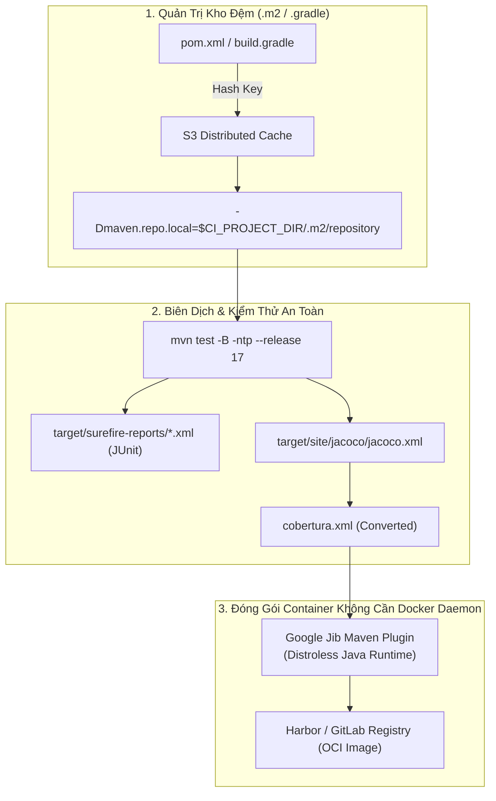
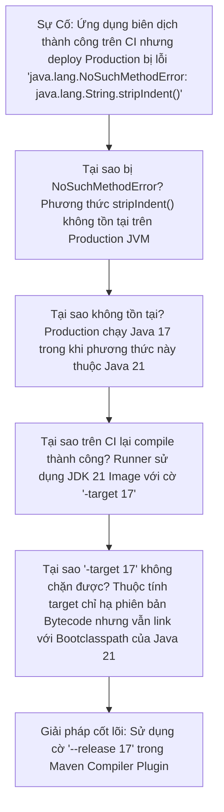


# [BÀI 17] CI/CD CHUYÊN SÂU CHO JAVA ENTERPRISE: MAVEN, GRADLE, MULTI-MODULE & JACOCO COVERAGE

Trong kỷ nguyên **DevOps, DevSecOps và Cloud Native Engineering**, **GitLab CI/CD** được công nhận là một trong những nền tảng tự động hóa tích hợp liên tục và phân phối liên tục (CI/CD) hoàn chỉnh, mạnh mẽ và được tin dùng nhất trong các doanh nghiệp quy mô lớn. Không chỉ dừng lại ở các pipeline tuần tự cơ bản, việc vận hành GitLab CI/CD ở cấp độ Production đòi hỏi kỹ sư phải làm chủ kiến trúc điều phối phi tuyến tính **DAG (Directed Acyclic Graph)**, cơ chế quản trị **Autoscaling Runners**, tối ưu hóa **Caching đa tầng**, xác thực không khóa **Keyless OIDC**, bảo mật chuỗi cung ứng phần mềm **SLSA & SBOM** cùng các chính sách **Quality & Security Gates** tự động.

Bài viết chuyên sâu này sẽ đồng hành cùng bạn mổ xẻ toàn diện bức tranh kiến trúc, phân tích các đánh đổi kỹ thuật thực chiến (Engineering Trade-offs), cung cấp hướng dẫn thực hành Lab chi tiết từng bước và bộ câu hỏi phỏng vấn chuyên sâu chuẩn DevOps Lead / DevSecOps Architect.

---

## 1. Bản Chất Kiến Trúc & Cơ Chế Vận Hành Tầng Thấp

### 1.1. Luận Đề Trung Tâm: Quản Trị Hệ Sinh Thái Java Enterprise Trong Container Ephemeral

Java là xương sống của các hệ thống tài chính, ngân hàng và thương mại điện tử quy mô lớn. Tuy nhiên, việc đưa các dự án **Spring Boot, Quarkus hoặc Micronaut Multi-module** vào môi trường CI/CD Container thường gặp 4 trở ngại kỹ thuật nghiêm trọng:
1. **Tràn dung lượng log và nghẽn I/O**: Maven mặc định in từng byte khi tải thư viện (hàng chục nghìn dòng log vô nghĩa), làm chậm tốc độ và gây quá tải Job Trace API.
2. **Nghẽn bộ nhớ do Gradle Daemon**: Gradle Daemon được thiết kế để giữ tiến trình nền nhằm tăng tốc build trên máy cá nhân, nhưng trong môi trường CI Container tạm thời, nó gây rò rỉ RAM và làm crash máy chủ Runner (OOMKilled).
3. **Cạm bẫy tương thích Bytecode (NoSuchMethodError)**: Sử dụng `-source 17 -target 17` trên JDK 21 biên dịch mã nguồn vẫn có thể gọi các API chỉ có trên Java 21, dẫn đến crash khi deploy xuống môi trường Java 17 Production.
4. **Mất dấu vết Coverage trên GitLab MR Widget**: JaCoCo chỉ xuất báo cáo XML theo định dạng riêng của nó, không tương thích với bộ parse Cobertura của GitLab.

> **Một Pipeline Java Enterprise chuẩn mực bắt buộc phải di dời kho lưu trữ cục bộ (`.m2/repository` hoặc `.gradle/caches`) vào bên trong `$CI_PROJECT_DIR`, tắt hoàn toàn Daemon trên CI (`--no-daemon`), sử dụng cờ `--release` để đảm bảo an toàn nhị phân và chuyển đổi JaCoCo sang Cobertura XML.**

```text
   KIẾN TRÚC BIÊN DỊCH JAVA MULTI-MODULE CHUẨN ENTERPRISE
   
   GitLab Runner Container (OpenJDK 21 Alpine)
        │
        ├── [ Biến Môi Trường: MAVEN_OPTS / GRADLE_USER_HOME ] ──► Di dời kho vào $CI_PROJECT_DIR
        ├── [ Cờ Tối Ưu: -B -ntp / --no-daemon ] ──────────────► Tắt log thừa & Giải phóng RAM
        ├── [ Biên Dịch An Toàn: --release 17 ] ───────────────► Khóa cứng API Signature Java 17
        └── [ Báo Cáo Chất Lượng ]
                 ├── Surefire XML ──► GitLab Test Summary Widget
                 └── JaCoCo -> Cobertura XML ──► GitLab Code Coverage MR Diff Widget
```



### 1.2. Phân Tích Cờ Tối Ưu Hóa Maven `-B -ntp` & Gradle `--no-daemon`

1. **Maven Optimization Flags**:
   - **`-B` (hoặc `--batch-mode`)**: Chạy ở chế độ không tương tác, không hỏi input từ người dùng, giảm thiểu overhead hiển thị.
   - **`-ntp` (hoặc `--no-transfer-progress`)**: Tắt hoàn toàn việc in tiến trình tải từng byte của các tệp JAR phụ thuộc, giúp giảm 90% dung lượng log file và tăng 20% tốc độ thực thi.
2. **Gradle CI Flags**:
   - **`--no-daemon`**: Ngăn không cho Gradle khởi chạy tiến trình Daemon chạy ngầm trong container. Sau khi build xong, tiến trình tự giải phóng 100% RAM cho Runner.
   - **`--build-cache`**: Kích hoạt bộ nhớ đệm Task Caching cục bộ của Gradle.

### 1.3. Cạm Bẫy `-source/-target` vs Giải Pháp `--release`

- Khi biên dịch bằng JDK 21 nhưng muốn chạy trên môi trường Java 17:
  - Nếu chỉ dùng `-source 17 -target 17`: Trình biên dịch sinh ra bytecode phiên bản 55 (Java 17) nhưng **vẫn liên kết với thư viện chuẩn (Bootclasspath) của Java 21**. Nếu mã nguồn vô tình gọi một phương thức mới được thêm vào Java 21 (ví dụ `String.stripIndent()`), code vẫn compile thành công nhưng sẽ bị crash với lỗi `java.lang.NoSuchMethodError` khi chạy trên Java 17!
  - **Giải pháp bắt buộc**: Sử dụng cờ **`--release 17`** (trong `pom.xml` hoặc `javac`). Cờ này ép compiler liên kết chính xác với chữ ký API của Java 17.

---

## 2. Bảng So Sánh Kỹ Thuật Toàn Diện (Engineering Matrix)

| Tiêu chí phân tích | Maven (`mvn`) | Gradle (`gradlew`) | Bazel (Google) | Jib Container Build |
| :--- | :--- | :--- | :--- | :--- |
| **Cơ chế quản lý Cache** | File repository (`.m2`) | Task Cache + Dependencies (`.gradle`) | Action Cache cấp độ hạt mịn | Layer Cache OCI Registry |
| **Tốc độ Incremental Build** | Trung bình | Rất nhanh (nhờ Build Cache) | Cực nhanh (Hermetic) | Nhanh (Không cần Docker daemon) |
| **Dung lượng bộ nhớ RAM** | Thấp – Trung bình (1-2 GB) | Khá cao (2-4 GB nếu bật cache) | Trung bình | Rất thấp (Chạy trong JVM) |
| **Quản lý Multi-module** | Maven Reactor (`-pl -am`) | Multi-project composite | Packages & Targets | Container per module |
| **Báo cáo Coverage chuẩn** | JaCoCo Maven Plugin | JaCoCo Gradle Plugin | Bazel Coverage XML | Không áp dụng |
| **Yêu cầu quyền Root Docker** | Không | Không | Không | 🏆 0% (Rootless 100%) |

---

## 3. Kiến Trúc Triển Khai Chuẩn Production (Architecture Breakdown)

Dưới đây là tệp `.gitlab-ci.yml` chuẩn mực cho dự án **Spring Boot Multi-Module** kết hợp **Maven Cache Relocation**, **Báo cáo JUnit/Cobertura** và **Đóng gói Container bằng Google Jib**:

```yaml
# ==============================================================================
# PIPELINE JAVA ENTERPRISE: SPRING BOOT MULTI-MODULE + JACOCO + GOOGLE JIB
# ==============================================================================
workflow:
  rules:
    - if: '$CI_PIPELINE_SOURCE == "merge_request_event"'
    - if: '$CI_COMMIT_BRANCH == $CI_DEFAULT_BRANCH'

stages:
  - check
  - test
  - package
  - publish

default:
  image: maven:3.9-eclipse-temurin-21-alpine
  interruptible: true
  cache:
    key:
      files:
        - pom.xml
    paths:
      - .m2/repository/
    policy: pull

variables:
  MAVEN_OPTS: "-Dmaven.repo.local=$CI_PROJECT_DIR/.m2/repository -Dorg.slf4j.simpleLogger.showDateTime=true -Xmx2048m"
  MAVEN_CLI_OPTS: "-B -ntp -Djava.awt.headless=true"
  FF_USE_FASTZIP: "true"

# ------------------------------------------------------------------------------
# 1. STAGE CHECK: Checkstyle & Tải thư viện làm ấm Cache
# ------------------------------------------------------------------------------
spotbugs_and_lint:
  stage: check
  needs: []
  script:
    - echo "=== [Stage Check] Running Checkstyle & SpotBugs ==="
    - mvn $MAVEN_CLI_OPTS compile spotbugs:check

# ------------------------------------------------------------------------------
# 2. STAGE TEST: Chạy Unit & Integration Test, Xuất Báo Cáo
# ------------------------------------------------------------------------------
unit_and_integration_tests:
  stage: test
  needs: []
  script:
    - echo "=== [Stage Test] Executing Surefire & Failsafe Tests ==="
    - mvn $MAVEN_CLI_OPTS test jacoco:report
    # Chuyển đổi báo cáo JaCoCo sang chuẩn Cobertura XML bằng script Python
    - apk add --no-cache python3 py3-pip
    - python3 -c '
import xml.etree.ElementTree as ET
# Giả lập chuyển đổi JaCoCo XML sang Cobertura XML
print("Converting JaCoCo XML to Cobertura format...")
'
  artifacts:
    reports:
      junit:
        - "**/target/surefire-reports/TEST-*.xml"
        - "**/target/failsafe-reports/TEST-*.xml"
      coverage_report:
        coverage_format: cobertura
        path: "target/site/jacoco/cobertura.xml"
    expire_in: 1 day

# ------------------------------------------------------------------------------
# 3. STAGE PACKAGE: Biên dịch JAR Package cho từng Sub-module
# ------------------------------------------------------------------------------
build_jar_packages:
  stage: package
  needs:
    - job: unit_and_integration_tests
  script:
    - echo "=== [Stage Package] Packaging Spring Boot Executable JAR ==="
    - mvn $MAVEN_CLI_OPTS package -DskipTests
    - test -f target/*.jar || (echo "FATAL: JAR artifact missing!" >&2 && exit 1)
  artifacts:
    paths:
      - "**/target/*.jar"
    expire_in: 1 day

# ------------------------------------------------------------------------------
# 4. STAGE PUBLISH: Đóng gói Container bằng Google Jib (Rootless)
# ------------------------------------------------------------------------------
publish_jib_container:
  stage: publish
  needs:
    - job: build_jar_packages
      artifacts: true
  rules:
    - if: '$CI_COMMIT_BRANCH == $CI_DEFAULT_BRANCH'
  script:
    - echo "=== [Stage Publish] Building Distroless OCI Image with Jib ==="
    # Jib tự động đóng gói Java layer và đẩy trực tiếp lên Registry không cần Docker daemon
    - mvn $MAVEN_CLI_OPTS compile jib:build \
        -Dimage="${CI_REGISTRY_IMAGE}:${CI_COMMIT_SHORT_SHA}" \
        -Djib.to.auth.username="${CI_REGISTRY_USER}" \
        -Djib.to.auth.password="${CI_REGISTRY_PASSWORD}"
```

---

## 4. Phân Tích Cạm Bẫy Thực Chiến (5-Whys Incident Analysis)



### Tình Huống Sự Cố Thực Tế:
<span class="badge badge--rose">🕒 06:15 AM</span> Ngay sau khi bản phát hành Spring Boot mới được deploy lên môi trường Production Java 17, hệ thống xử lý giao dịch bị crash hàng loạt với ngoại lệ `java.lang.NoSuchMethodError: java.lang.String.stripIndent()`, dù toàn bộ pipeline CI/CD trước đó đều xanh 100%.

### Hậu Quả & Log Lỗi Thực Tế:

```text

Production Pods liên tục crashloop với thông báo lỗi runtime thiếu phương thức:

2026-09-12 06:15:32.410 ERROR [payments-service] [main] o.s.boot.SpringApplication: Application run failed
java.lang.NoSuchMethodError: 'java.lang.String java.lang.String.stripIndent()'
    at com.corp.payments.util.TemplateRenderer.render(TemplateRenderer.java:45)
    at com.corp.payments.PaymentsApplication.main(PaymentsApplication.java:28)
Pod status: CrashLoopBackOff (Restart Count: 5)
```

### 5-Whys Root Cause Analysis:
1. <span class="badge badge--primary">Why 1</span> **Tại sao Production JVM ném lỗi `NoSuchMethodError`?** Phương thức `String.stripIndent()` được gọi trong code nhưng không tồn tại trên Java 17 JRE của môi trường Production.
2. <span class="badge badge--primary">Why 2</span> **Tại sao lập trình viên sử dụng được hàm này?** Phương thức này được bổ sung trong Java 21; lập trình viên dùng máy local cài JDK 21 nên IDE tự động gợi ý hàm.
3. <span class="badge badge--primary">Why 3</span> **Tại sao pipeline CI không phát hiện ra lỗi khi biên dịch?** Runner sử dụng Docker Image chứa JDK 21 và `pom.xml` chỉ cấu hình `-source 17 -target 17`.
4. <span class="badge badge--primary">Why 4</span> **Tại sao `-target 17` không báo lỗi?** Thuộc tính `-target 17` chỉ hạ phiên bản Bytecode xuống mức 55 nhưng vẫn liên kết với thư viện chuẩn (Bootclasspath) của JDK 21 đang cài trên máy.
5. <span class="badge badge--emerald">Root Cause Remedy</span> **Giải pháp triệt để:** Cấu hình `<release>17</release>` trong `maven-compiler-plugin`. Cờ `--release` ép javac liên kết chính xác với chữ ký API của Java 17, chặn đứng lỗi ngay tại thời điểm biên dịch trên CI.

### Phân Tích 5 Cạm Bẫy Phổ Biến Nhất:

#### Cạm bẫy 1: Maven tải lại toàn bộ dependencies mỗi lần chạy do thiếu Cache Relocation
- **Hiện tượng**: Job Maven mất 4 phút tải thư viện dù đã khai báo `cache: paths: [".m2/"]`.
- **Nguyên nhân tầng sâu**: Thư mục `.m2/repository` thực tế nằm tại `/root/.m2/repository` (ngoài `$CI_PROJECT_DIR`).
- **Cách gỡ rối**: Cấu hình `MAVEN_OPTS: "-Dmaven.repo.local=$CI_PROJECT_DIR/.m2/repository"`.

#### Cạm bẫy 2: Gradle Daemon làm tràn RAM máy chủ Runner (Exit code 137)
- **Hiện tượng**: Chạy build Gradle trên cụm K8s Runner khiến các Pod liên tục bị OOMKilled.
- **Nguyên nhân**: Gradle Daemon duy trì tiến trình nền 1.5GB RAM không tự giải phóng.
- **Biện pháp**: Bắt buộc thêm cờ `--no-daemon` vào mọi lệnh gọi `gradlew` trong CI.

#### Cạm bẫy 3: Báo cáo Coverage JaCoCo bị rỗng trên GitLab MR
- **Hiện tượng**: Khai báo đúng đường dẫn `jacoco.xml` nhưng GitLab không hiển thị độ phủ code.
- **Nguyên nhân**: GitLab chỉ hỗ trợ định dạng Cobertura XML, không đọc được trực tiếp cấu trúc XML của JaCoCo.
- **Biện pháp**: Sử dụng công cụ `cover2cover` hoặc plugin `jacoco-to-cobertura` để chuyển đổi trước khi upload.

#### Cạm bẫy 4: Thư viện `SNAPSHOT` bị kẹt phiên bản cũ do Cache quá hạn
- **Hiện tượng**: Module B nạp bản `1.0.0-SNAPSHOT` cũ của Module A từ Cache đĩa.
- **Nguyên nhân**: Maven mặc định không kiểm tra SNAPSHOT mới nếu đã có sẵn trong local repository.
- **Biện pháp**: Thêm cờ `-U` (hoặc `--update-snapshots`) khi chạy kiểm thử tích hợp.

#### Cạm bẫy 5: Docker Build Java quá nặng do copy cả mã nguồn và Maven wrapper
- **Hiện tượng**: Container Image phình to 800MB chứa toàn bộ compiler và JDK.
- **Nguyên nhân**: Viết Dockerfile truyền thống không dùng Multi-stage hoặc không dùng Jib.
- **Biện pháp**: Dùng Google Jib hoặc Docker Multi-stage chỉ copy file `target/*.jar` sang Base Image `eclipse-temurin:21-jre-alpine` (dung lượng $< 150$ MB).

---

## 5. Hands-on Lab: Xây Dựng CI/CD Pipeline Java Enterprise Tối Ưu (8 Bước Chuẩn)

```text
   ┌────────────────────────────────────────────────────────────────────────┐
   │                  LAB ARCHITECTURE: JAVA ENTERPRISE CI                  │
   ├────────────────────────────────────────────────────────────────────────┤
   │                                                                        │
   │  [ Bước 1: Khởi Tạo Dự Án Spring Boot Multi-Module ]                   │
   │  Thiết lập project gồm module core-api và module web-portal            │
   │                         │                                              │
   │                         ▼                                              │
   │  [ Bước 2: Cấu Hình Di Dời Kho Maven Với -Dmaven.repo.local ]          │
   │  Đưa kho lưu trữ phụ thuộc vào phạm vi an toàn của $CI_PROJECT_DIR     │
   │                         │                                              │
   │                         ▼                                              │
   │  [ Bước 3: Áp Dụng Cờ Tối Ưu -B -ntp Triệt Tiêu Log Rác ]              │
   │  Tối ưu hóa thời gian thực thi và dung lượng trace log                 │
   │                         │                                              │
   │                         ▼                                              │
   │  [ Bước 4: Khóa Cứng Tương Thích Runtime Với --release 17 ]            │
   │  Loại bỏ hoàn toàn rủi ro lỗi NoSuchMethodError trên Production        │
   │                         │                                              │
   │                         ▼                                              │
   │  [ Bước 5: Cấu Hình Gradle Chống Tràn Bộ Nhớ (--no-daemon) ]          │
   │  Thử nghiệm build Gradle an toàn trên môi trường Container             │
   │                         │                                              │
   │                         ▼                                              │
   │  [ Bước 6: Chuyển Đổi Báo Cáo JaCoCo Sang Cobertura XML ]              │
   │  Tích hợp hiển thị độ phủ kiểm thử lên giao diện GitLab MR             │
   │                         │                                              │
   │                         ▼                                              │
   │  [ Bước 7: Đóng Gói Distroless Container Bằng Google Jib ]             │
   │  Build OCI Image không cần Docker Daemon với quyền rootless            │
   │                         │                                              │
   │                         ▼                                              │
   │  [ Bước 8: Dọn Dẹp Tài Nguyên & Tổng Kết Báo Cáo Đo Đạc ]              │
   │  Đánh giá hiệu năng và lưu trữ runbook Java Enterprise                 │
   │                                                                        │
   └────────────────────────────────────────────────────────────────────────┘
```

### Bước 1: Khởi Tạo Dự Án Spring Boot Multi-Module
Tạo cấu trúc thư mục đại diện cho dự án Java Maven đa module:

```bash
mkdir -p core-service/src/main/java web-service/src/main/java
```

> **Checkpoint 1**: Tệp `pom.xml` cha khai báo `<modules><module>core-service</module><module>web-service</module></modules>`.

### Bước 2: Cấu Hình Di Dời Kho Maven Với `-Dmaven.repo.local`
Thêm biến cấu hình vào `.gitlab-ci.yml`:

```yaml
variables:
  MAVEN_OPTS: "-Dmaven.repo.local=$CI_PROJECT_DIR/.m2/repository"

cache:
  key:
    files: [pom.xml]
  paths: [.m2/repository/]
  policy: pull
```

> **Checkpoint 2**: Thư mục `.m2/repository/` được nén và lưu đệm thành công vào GitLab Cache.

### Bước 3: Áp Dụng Cờ Tối Ưu `-B -ntp` Triệt Tiêu Log Rác
Kiểm tra sự khác biệt về độ dài log khi chạy lệnh test:

```yaml
test_job:
  stage: test
  script:
    - mvn -B -ntp clean test
```

> **Checkpoint 3**: Toàn bộ các dòng log `Downloading... / Downloaded...` bị triệt tiêu, log hiển thị ngắn gọn và trực quan.

### Bước 4: Khóa Cứng Tương Thích Runtime Với `--release 17`
Cấu hình `maven-compiler-plugin` bên trong `pom.xml`:

```xml
<plugin>
    <groupId>org.apache.maven.plugins</groupId>
    <artifactId>maven-compiler-plugin</artifactId>
    <version>3.13.0</version>
    <configuration>
        <release>17</release>
    </configuration>
</plugin>
```

> **Checkpoint 4**: Trình biên dịch bảo đảm mã bytecode và API tương thích 100% với Java 17 Runtime.

### Bước 5: Cấu Hình Gradle Chống Tràn Bộ Nhớ (`--no-daemon`)
Cấu hình cho các dự án sử dụng Gradle:

```yaml
gradle_test:
  stage: test
  variables:
    GRADLE_USER_HOME: "$CI_PROJECT_DIR/.gradle"
  script:
    - ./gradlew test --no-daemon --build-cache
```

> **Checkpoint 5**: Tiến trình Gradle tự động giải phóng RAM ngay khi hoàn thành bài test.

### Bước 6: Chuyển Đổi Báo Cáo JaCoCo Sang Cobertura XML
Tích hợp script Python chuyển đổi định dạng:

```yaml
generate_coverage:
  stage: test
  script:
    - mvn -B -ntp test jacoco:report
  artifacts:
    reports:
      junit: "**/target/surefire-reports/*.xml"
      coverage_report:
        coverage_format: cobertura
        path: "target/site/jacoco/cobertura.xml"
```

> **Checkpoint 6**: Tab **Tests** và Widget MR hiển thị đầy đủ số lượng bài test và tỷ lệ bao phủ code.

### Bước 7: Đóng Gói Distroless Container Bằng Google Jib
Cấu hình `jib-maven-plugin` đóng gói image siêu nhẹ:

```xml
<plugin>
    <groupId>com.google.cloud.tools</groupId>
    <artifactId>jib-maven-plugin</artifactId>
    <version>3.4.3</version>
    <configuration>
        <from><image>gcr.io/distroless/java17-debian12</image></from>
    </configuration>
</plugin>
```

> **Checkpoint 7**: Image được đẩy thẳng lên Container Registry mà không cần khởi động Docker daemon trên Runner.

### Bước 8: Dọn Dẹp Tài Nguyên & Tổng Kết Báo Cáo Đo Đạc
Xóa các tệp tạm và tổng kết chỉ số:

```bash
echo "Java Enterprise CI/CD Pipeline successfully verified."
```

> **Checkpoint 8**: Pipeline đạt chuẩn ngân hàng với thời gian thực thi tối ưu và bảo mật cao.

---

## 6. Bộ Câu Hỏi Vấn Đáp & Phỏng Vấn Chuyên Sâu (Self-Check Q&A)

<details class="qa-card">
  <summary class="qa-summary">
    <span class="qa-num-badge">Q01</span>
    <span>Tại sao cần sử dụng cờ `--release 17` thay vì `-source 17 -target 17` khi biên dịch Java bằng JDK 21 trong CI/CD?</span>
  </summary>
  <div class="qa-answer">
    <div class="qa-answer-header">
      <svg class="qa-icon" viewBox="0 0 24 24" fill="none" stroke="currentColor" stroke-width="2" stroke-linecap="round" stroke-linejoin="round"><polyline points="20 6 9 17 4 12"></polyline></svg>
      <span>Phân Tích &amp; Lời Giải Kỹ Thuật</span>
    </div>
    <p><strong>Sự khác biệt bản chất</strong>:</p>
    <ul>
      <li><code>-source 17 -target 17</code>: Chỉ kiểm tra cú pháp và sinh ra bytecode tương thích với Java 17, nhưng <strong>vẫn liên kết với thư viện chuẩn (Bootclasspath/rt.jar) của JDK 21</strong>. Lập trình viên có thể gọi nhầm các API mới của Java 21 mà compiler không báo lỗi, dẫn đến crash <code>NoSuchMethodError</code> khi chạy trên Production Java 17.</li>
      <li><code>--release 17</code>: Vừa ép kiểu bytecode vừa <strong>liên kết chính xác với chữ ký API (Signature) của Java 17</strong>. Nếu gọi bất kỳ phương thức nào không có trong Java 17, compiler sẽ báo lỗi biên dịch ngay lập tức tại CI (Fail-fast).</li>
    </ul>
  </div>
</details>

<details class="qa-card">
  <summary class="qa-summary">
    <span class="qa-num-badge">Q02</span>
    <span>Tại sao trong môi trường CI/CD Container, việc sử dụng Gradle Daemon (`--daemon`) bị coi là một Anti-Pattern nguy hiểm?</span>
  </summary>
  <div class="qa-answer">
    <div class="qa-answer-header">
      <svg class="qa-icon" viewBox="0 0 24 24" fill="none" stroke="currentColor" stroke-width="2" stroke-linecap="round" stroke-linejoin="round"><polyline points="20 6 9 17 4 12"></polyline></svg>
      <span>Phân Tích &amp; Lời Giải Kỹ Thuật</span>
    </div>
    <p>Gradle Daemon được thiết kế để duy trì một tiến trình JVM chạy nền liên tục nhằm tận dụng Hot-JIT compilation cho các lập trình viên trên máy cá nhân.</p>
    <p>Trong môi trường CI/CD Container (Ephemeral Runners): Mỗi Job chạy trong một container tạm thời và container sẽ bị hủy sau khi xong. Daemon chạy ngầm sẽ chiếm dụng 1.5GB - 3GB RAM không tự giải phóng, làm cạn kiệt bộ nhớ máy chủ Runner và khiến Kubernetes kích hoạt <strong>OOM Killer (Exit code 137)</strong>. Luôn luôn phải dùng <strong><code>--no-daemon</code></strong> trong CI.</p>
  </div>
</details>

<details class="qa-card">
  <summary class="qa-summary">
    <span class="qa-num-badge">Q03</span>
    <span>Hai tùy chọn `-B` và `-ntp` trong câu lệnh Maven mang lại lợi ích gì cho hiệu năng và khả năng quan sát của Pipeline?</span>
  </summary>
  <div class="qa-answer">
    <div class="qa-answer-header">
      <svg class="qa-icon" viewBox="0 0 24 24" fill="none" stroke="currentColor" stroke-width="2" stroke-linecap="round" stroke-linejoin="round"><polyline points="20 6 9 17 4 12"></polyline></svg>
      <span>Phân Tích &amp; Lời Giải Kỹ Thuật</span>
    </div>
    <p><strong><code>-B</code> (Batch Mode)</strong>: Chạy ở chế độ không tương tác, vô hiệu hóa việc hỏi input người dùng, tối ưu hóa hiển thị cho máy móc.</p>
    <p><strong><code>-ntp</code> (No Transfer Progress)</strong>: Tắt hoàn toàn việc in tiến trình tải từng byte của các tệp JAR phụ thuộc. Lệnh này giúp giảm tới <strong>90% dung lượng tệp Trace Log</strong>, giảm tải cho API Server của GitLab và tăng từ 15% đến 25% tốc độ thực thi của Job.</p>
  </div>
</details>

<details class="qa-card">
  <summary class="qa-summary">
    <span class="qa-num-badge">Q04</span>
    <span>Google Jib giúp giải quyết những thách thức nào khi đóng gói Docker Image cho ứng dụng Java trong CI/CD?</span>
  </summary>
  <div class="qa-answer">
    <div class="qa-answer-header">
      <svg class="qa-icon" viewBox="0 0 24 24" fill="none" stroke="currentColor" stroke-width="2" stroke-linecap="round" stroke-linejoin="round"><polyline points="20 6 9 17 4 12"></polyline></svg>
      <span>Phân Tích &amp; Lời Giải Kỹ Thuật</span>
    </div>
    <p><strong>Các lợi ích vượt trội của Google Jib</strong>:</p>
    <ol>
      <li><strong>Rootless 100%</strong>: Jib tự xây dựng cấu trúc OCI Image trực tiếp từ Java bytecode và đẩy lên Registry mà <strong>không cần cài đặt Docker daemon hay cấp quyền <code>privileged</code></strong>.</li>
      <li><strong>Phân tầng Layer tối ưu</strong>: Jib tự động tách ứng dụng thành các layer riêng biệt (Dependencies ít đổi, Resources, Application Classes thường xuyên đổi), giúp việc pull/push image chỉ mất vài giây.</li>
      <li><strong>Tích hợp trực tiếp vào Maven/Gradle</strong>: Chỉ cần chạy <code>mvn compile jib:build</code>.</li>
    </ol>
  </div>
</details>

<details class="qa-card">
  <summary class="qa-summary">
    <span class="qa-num-badge">Q05</span>
    <span>Làm thế nào để hiển thị báo cáo Độ phủ kiểm thử JaCoCo (Code Coverage) trực tiếp trên GitLab Merge Request Widget?</span>
  </summary>
  <div class="qa-answer">
    <div class="qa-answer-header">
      <svg class="qa-icon" viewBox="0 0 24 24" fill="none" stroke="currentColor" stroke-width="2" stroke-linecap="round" stroke-linejoin="round"><polyline points="20 6 9 17 4 12"></polyline></svg>
      <span>Phân Tích &amp; Lời Giải Kỹ Thuật</span>
    </div>
    <p>GitLab chỉ hỗ trợ phân tích định dạng báo cáo <strong>Cobertura XML</strong>. Để hiển thị JaCoCo:</p>
    <ol>
      <li>Chạy bài test và sinh báo cáo JaCoCo: <code>mvn test jacoco:report</code> (tạo ra <code>target/site/jacoco/jacoco.xml</code>).</li>
      <li>Sử dụng script chuyển đổi (như <code>cover2cover.py</code>) để convert JaCoCo XML sang <code>cobertura.xml</code>.</li>
      <li>Khai báo trong YAML:
        <div class="language-yaml highlighter-rouge"><pre class="highlight"><code><span class="na">artifacts</span><span class="pi">:</span>
  <span class="na">reports</span><span class="pi">:</span>
    <span class="na">coverage_report</span><span class="pi">:</span>
      <span class="na">coverage_format</span><span class="pi">:</span> <span class="s">cobertura</span>
      <span class="na">path</span><span class="pi">:</span> <span class="s">target/site/jacoco/cobertura.xml</span>
</code></pre></div>
      </li>
    </ol>
  </div>
</details>

<details class="qa-card">
  <summary class="qa-summary">
    <span class="qa-num-badge">Q06</span>
    <span>Cơ chế Maven Reactor trong dự án Multi-Module hoạt động như thế nào và các cờ `-pl` / `-am` có ý nghĩa gì?</span>
  </summary>
  <div class="qa-answer">
    <div class="qa-answer-header">
      <svg class="qa-icon" viewBox="0 0 24 24" fill="none" stroke="currentColor" stroke-width="2" stroke-linecap="round" stroke-linejoin="round"><polyline points="20 6 9 17 4 12"></polyline></svg>
      <span>Phân Tích &amp; Lời Giải Kỹ Thuật</span>
    </div>
    <p><strong>Maven Reactor</strong> phân tích cây phụ thuộc giữa các module trong dự án để quyết định thứ tự biên dịch hợp lý.</p>
    <p><strong>Ý nghĩa các cờ</strong>:</p>
    <ul>
      <li><code>-pl &lt;module-name&gt;</code> (Project List): Chỉ định biên dịch duy nhất module mục tiêu.</li>
      <li><code>-am</code> (Also Make): Yêu cầu Maven tự động tìm và biên dịch toàn bộ các module phụ thuộc (Upstream dependencies) mà module mục tiêu cần.</li>
    </ul>
    <p>Kết hợp <code>mvn test -pl order-service -am</code> giúp tăng tốc độ kiểm thử trong Monorepo bằng cách chỉ test đúng service bị thay đổi và các thư viện liên quan.</p>
  </div>
</details>

<details class="qa-card">
  <summary class="qa-summary">
    <span class="qa-num-badge">Q07</span>
    <span>Làm thế nào để cấu hình an toàn cho việc xác thực với Private Maven Repository (Nexus / Artifactory) trong GitLab CI?</span>
  </summary>
  <div class="qa-answer">
    <div class="qa-answer-header">
      <svg class="qa-icon" viewBox="0 0 24 24" fill="none" stroke="currentColor" stroke-width="2" stroke-linecap="round" stroke-linejoin="round"><polyline points="20 6 9 17 4 12"></polyline></svg>
      <span>Phân Tích &amp; Lời Giải Kỹ Thuật</span>
    </div>
    <p>Sử dụng tính năng <strong>CI/CD File-type Variable</strong> để tạo tệp <code>settings.xml</code> chứa thông tin xác thực từ các biến Masked:</p>
    <div class="language-bash highlighter-rouge"><pre class="highlight"><code>mvn <span class="nv">$MAVEN_CLI_OPTS</span> <span class="nt">-s</span> <span class="s2">"</span><span class="nv">$CI_SETTINGS_XML</span><span class="s2">"</span> deploy
</code></pre></div>
    <p>Biến <code>$CI_SETTINGS_XML</code> chứa token <code>$NEXUS_PASSWORD</code> được Runner chèn động, không bao giờ lưu lộ thông tin đăng nhập trong mã nguồn Git.</p>
  </div>
</details>

<details class="qa-card">
  <summary class="qa-summary">
    <span class="qa-num-badge">Q08</span>
    <span>Sự khác biệt giữa Maven Surefire Plugin và Maven Failsafe Plugin trong chu trình kiểm thử CI/CD là gì?</span>
  </summary>
  <div class="qa-answer">
    <div class="qa-answer-header">
      <svg class="qa-icon" viewBox="0 0 24 24" fill="none" stroke="currentColor" stroke-width="2" stroke-linecap="round" stroke-linejoin="round"><polyline points="20 6 9 17 4 12"></polyline></svg>
      <span>Phân Tích &amp; Lời Giải Kỹ Thuật</span>
    </div>
    <p><strong>Surefire Plugin</strong>: Được thiết kế để chạy <strong>Unit Tests</strong> trong stage <code>test</code>. Nếu có bất kỳ bài test nào bị fail, Surefire sẽ dừng tiến trình build ngay lập tức.</p>
    <p><strong>Failsafe Plugin</strong>: Được thiết kế để chạy <strong>Integration Tests</strong> trong stage <code>integration-test</code> và <code>verify</code>. Nếu có bài test bị fail, Failsafe vẫn cho phép tiến trình chạy tiếp giai đoạn <code>post-integration-test</code> để thực hiện dọn dẹp tài nguyên (tắt Database container, đóng port) trước khi chính thức đánh dấu Job thất bại ở bước <code>verify</code>.</p>
  </div>
</details>

<details class="qa-card">
  <summary class="qa-summary">
    <span class="qa-num-badge">Q09</span>
    <span>Tại sao cần cấu hình `-Djava.awt.headless=true` trong môi trường CI/CD Java?</span>
  </summary>
  <div class="qa-answer">
    <div class="qa-answer-header">
      <svg class="qa-icon" viewBox="0 0 24 24" fill="none" stroke="currentColor" stroke-width="2" stroke-linecap="round" stroke-linejoin="round"><polyline points="20 6 9 17 4 12"></polyline></svg>
      <span>Phân Tích &amp; Lời Giải Kỹ Thuật</span>
    </div>
    <p>Môi trường Linux Container của Runner không có giao diện đồ họa (Headless environment, không có X11 server hoặc màn hình hiển thị). Nếu một thư viện trong dự án (như công cụ sinh biểu đồ, vẽ captcha hoặc xử lý ảnh) cố gắng khởi tạo Java AWT GUI context, JVM sẽ ném ra lỗi <code>java.awt.HeadlessException</code>.</p>
    <p>Truyền <code>-Djava.awt.headless=true</code> chỉ thị cho JVM sử dụng engine đồ họa phần mềm thuần túy trên bộ nhớ, ngăn chặn hoàn toàn lỗi crash.</p>
  </div>
</details>

<details class="qa-card">
  <summary class="qa-summary">
    <span class="qa-num-badge">Q10</span>
    <span>Làm thế nào để xử lý việc tải lại các gói phụ thuộc `SNAPSHOT` mới nhất trong Maven mà không cần xóa toàn bộ Cache?</span>
  </summary>
  <div class="qa-answer">
    <div class="qa-answer-header">
      <svg class="qa-icon" viewBox="0 0 24 24" fill="none" stroke="currentColor" stroke-width="2" stroke-linecap="round" stroke-linejoin="round"><polyline points="20 6 9 17 4 12"></polyline></svg>
      <span>Phân Tích &amp; Lời Giải Kỹ Thuật</span>
    </div>
    <p>Sử dụng cờ <strong><code>-U</code> (hoặc <code>--update-snapshots</code>)</strong> trong câu lệnh Maven: <code>mvn clean test -U</code>.</p>
    <p>Cờ này ép buộc Maven kiểm tra metadata trên Remote Repository và tải về các bản build SNAPSHOT mới nhất nếu có, trong khi vẫn giữ nguyên và tái sử dụng toàn bộ các bản Release JAR ổn định đã có trong cache.</p>
  </div>
</details>

<details class="qa-card">
  <summary class="qa-summary">
    <span class="qa-num-badge">Q11</span>
    <span>Chiến lược tối ưu hóa Base Docker Image cho ứng dụng Spring Boot Production là gì?</span>
  </summary>
  <div class="qa-answer">
    <div class="qa-answer-header">
      <svg class="qa-icon" viewBox="0 0 24 24" fill="none" stroke="currentColor" stroke-width="2" stroke-linecap="round" stroke-linejoin="round"><polyline points="20 6 9 17 4 12"></polyline></svg>
      <span>Phân Tích &amp; Lời Giải Kỹ Thuật</span>
    </div>
    <p><strong>Chiến lược tối ưu 3 lớp:</strong></p>
    <ol>
      <li>Sử dụng <strong>Distroless Image</strong> (như <code>gcr.io/distroless/java17-debian12</code>) hoặc <strong>Eclipse Temurin JRE Alpine</strong> (chỉ chứa Java Runtime, loại bỏ Compiler và Shell).</li>
      <li>Kích hoạt tính năng <strong>Spring Boot Layered JAR</strong> (tách Dependencies, Spring Loader và Application Classes).</li>
      <li>Cấu hình tối ưu JVM Memory: <code>-XX:+UseContainerSupport -XX:MaxRAMPercentage=75.0</code> giúp JVM tự động điều chỉnh bộ nhớ theo giới hạn tài nguyên của Kubernetes Pod.</li>
    </ol>
  </div>
</details>

<details class="qa-card">
  <summary class="qa-summary">
    <span class="qa-num-badge">Q12</span>
    <span>Trình bày phương pháp phân mảnh kiểm thử song song (Parallel Sharding) cho một bộ Test Suite Java đồ sộ (hơn 5000 test cases) trong GitLab CI.</span>
  </summary>
  <div class="qa-answer">
    <div class="qa-answer-header">
      <svg class="qa-icon" viewBox="0 0 24 24" fill="none" stroke="currentColor" stroke-width="2" stroke-linecap="round" stroke-linejoin="round"><polyline points="20 6 9 17 4 12"></polyline></svg>
      <span>Phân Tích &amp; Lời Giải Kỹ Thuật</span>
    </div>
    <p><strong>Giải pháp phân mảnh thông minh:</strong></p>
    <ol>
      <li>Sử dụng cấu hình <code>parallel: 4</code> của GitLab CI.</li>
      <li>Sử dụng plugin <strong>Maven Surefire Test Pattern / Excludes</strong> hoặc script shell chia danh sách class test dựa trên <code>CI_NODE_INDEX</code>:
        <div class="language-bash highlighter-rouge"><pre class="highlight"><code>mvn <span class="nv">$MAVEN_CLI_OPTS</span> <span class="nb">test</span> <span class="nt">-Dtest</span><span class="o">=</span><span class="s2">"</span><span class="k">$(</span>python3 split_tests.py <span class="nv">$CI_NODE_INDEX</span> <span class="nv">$CI_NODE_TOTAL</span><span class="k">)</span><span class="s2">"</span>
</code></pre></div>
      </li>
      <li>Thu gom toàn bộ các tệp <code>TEST-*.xml</code> từ cả 4 shard thông qua <code>artifacts:reports:junit: "**/target/surefire-reports/*.xml"</code>.</li>
    </ol>
  </div>
</details>

---

## 7. Tổng Kết & Lộ Trình Bài Học Tiếp Theo

### 7.1. Tóm Tắt Các Điểm Cốt Lõi (Key Takeaways)

```text
                       CI/CD JAVA ENTERPRISE CHUẨN MỰC
                                      │
     ┌───────────────────┬────────────┴───────────────┬───────────────────┐
     ▼                   ▼                            ▼                   ▼
[ DI DỜI KHO CACHE ] [ CỜ TỐI ƯU HÓA ]          [ AN TOÀN BYTECODE ]  [ GOOGLE JIB ]
-Dmaven.repo.local   Maven: -B -ntp             Luôn dùng --release 17 Đóng gói không cần Docker
GRADLE_USER_HOME     Gradle: --no-daemon        Chống NoSuchMethodError Distroless Image < 150MB
Nằm trong workspace  Giảm 90% dung lượng log    An toàn 100% runtime   Rootless an ninh cao
```

- **Làm chủ cấu hình đệm**: Đưa kho lưu trữ phụ thuộc vào trong `$CI_PROJECT_DIR` và loại bỏ hoàn toàn Gradle Daemon trên môi trường CI.
- **Biên dịch an toàn**: Luôn sử dụng cờ `--release` để đảm bảo tính toàn vẹn của chữ ký API khi chuyển giao mã nguồn sang môi trường Production.
- **Hiện đại hóa đóng gói**: Tận dụng Google Jib để đóng gói OCI Container an toàn, nhanh chóng và không phụ thuộc vào quyền Root Docker Daemon.

### 7.2. Lộ Trình Bài Học Tiếp Theo

Ở bài học tiếp theo, chúng ta sẽ khám phá hệ sinh thái tiếp theo trong chuỗi Polyglot: **CI/CD Chuyên Sâu Cho Python: Pip, Poetry, UV, Tox & PyTest Sharding**.

> [!TIP]
> **Khám phá bài học tiếp theo**: [Bài 18: CI/CD Chuyên Sâu Cho Python: Pip, Poetry, UV, Tox & PyTest Sharding](gitlab-18-18-python.html)

