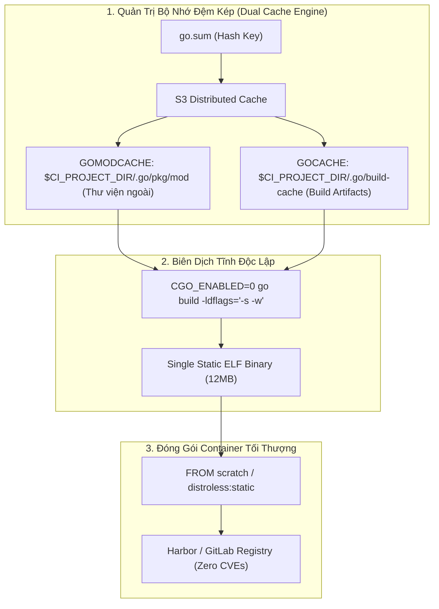
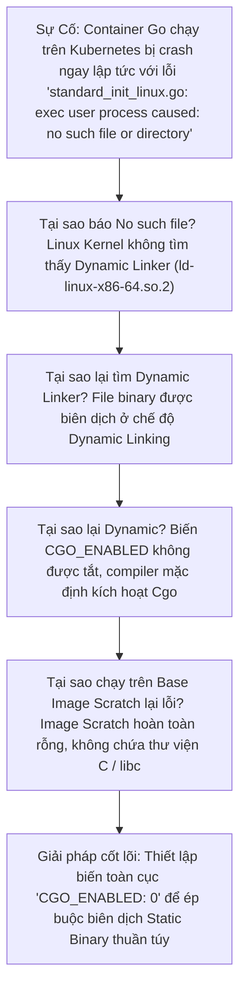


> [!IMPORTANT]
> **Mục tiêu kỹ thuật bài học**:
> - Nắm vững nguyên lý nền tảng và tư duy cốt lõi về CI/CD Chuyên Sâu Cho Go (Golang): Go Modules, Static Compilation, Golangci-lint & Go Test.
> - Làm chủ cơ chế Caching kép GOMODCACHE và GOCACHE, xử lý an toàn phân quyền read-only của pkg/mod.
> - Biên dịch nhị phân tĩnh CGO_ENABLED=0, tước bỏ symbol table với -ldflags='-s -w' và đóng gói Image Scratch siêu nhẹ 15MB.
> - Tự kiểm tra kiến thức chuyên sâu với bộ 12 câu hỏi phân tích tình huống thực tế kèm lời giải.

---

Trong kỷ nguyên **DevOps, DevSecOps và Cloud Native Engineering**, **GitLab CI/CD** được công nhận là một trong những nền tảng tự động hóa tích hợp liên tục và phân phối liên tục (CI/CD) hoàn chỉnh, mạnh mẽ và được tin dùng nhất trong các doanh nghiệp quy mô lớn. Không chỉ dừng lại ở các pipeline tuần tự cơ bản, việc vận hành GitLab CI/CD ở cấp độ Production đòi hỏi kỹ sư phải làm chủ kiến trúc điều phối phi tuyến tính **DAG (Directed Acyclic Graph)**, cơ chế quản trị **Autoscaling Runners**, tối ưu hóa **Caching đa tầng**, xác thực không khóa **Keyless OIDC**, bảo mật chuỗi cung ứng phần mềm **SLSA & SBOM** cùng các chính sách **Quality & Security Gates** tự động.

Bài viết chuyên sâu này sẽ đồng hành cùng bạn mổ xẻ toàn diện bức tranh kiến trúc, phân tích các đánh đổi kỹ thuật thực chiến (Engineering Trade-offs), cung cấp hướng dẫn thực hành Lab chi tiết từng bước và bộ câu hỏi phỏng vấn chuyên sâu chuẩn DevOps Lead / DevSecOps Architect.

---

## 1. Bản Chất Kiến Trúc & Cơ Chế Vận Hành Tầng Thấp

### 1.1. Luận Đề Trung Tâm: Nghệ Thuật Biên Dịch Tĩnh & Quản Trị Bộ Nhớ Đệm Kép Trong Go

Go (Golang) là ngôn ngữ sinh ra cho thời đại Cloud-Native (Kubernetes, Docker, Prometheus, Terraform đều được viết bằng Go). Ưu thế lớn nhất của Go là khả năng tạo ra **File thực thi nhị phân tĩnh duy nhất (Single Static Binary)** có thể chạy trên Image rỗng (`FROM scratch`) không cần bất kỳ môi trường runtime nào. Tuy nhiên, khi đưa Go vào CI/CD Pipeline, các kỹ sư thường gặp 4 cạm bẫy hỏng hóc:
1. **Lỗi liên kết động ẩn (Dynamic Linking Trap)**: Mặc định trên Linux, nếu code có import thư viện hệ thống hoặc mạng cơ bản, Go có thể kích hoạt `Cgo` (liên kết với `glibc`). Khi đưa binary này vào Container Scratch/Alpine, ứng dụng lập tức crash với lỗi `exec: /server: no such file or directory`.
2. **Cạm bẫy quyền hạn thư mục `pkg/mod`**: Go Modules tạo các tệp trong `pkg/mod` ở chế độ **Read-Only (`0444`)** để bảo vệ tính bất biến của package. Khi GitLab Runner nén cache hoặc dọn dẹp workspace, tiến trình bị dừng với lỗi `permission denied`.
3. **Hiểu sai giữa GOMODCACHE và GOCACHE**: Chỉ cache thư mục module mà quên cache trình biên dịch khiến thời gian build không giảm.
4. **Bẫy Test Caching giả lập**: Lệnh `go test` tự động ghi nhớ kết quả test trước đó; nếu không cấu hình `-count=1`, các bài test có thể báo Xanh mà thực chất không hề chạy lại.

> **Một Pipeline Go chuẩn Enterprise bắt buộc phải phân tách bộ nhớ đệm kép (`GOMODCACHE` và `GOCACHE`), khóa cứng tính bất biến (`go mod verify` + `-mod=readonly`), ép buộc biên dịch tĩnh thuần túy (`CGO_ENABLED=0 -ldflags="-s -w"`), và xử lý quyền ghi thư mục trước khi nén cache.**

```text
   KIẾN TRÚC BIÊN DỊCH GO STATIC SIÊU TINH GỌN (Zero-Dependency Pipeline)
   
   Commit Code ──► [ Stage: lint ]  ──► [ golangci-lint run --timeout=5m ] ──► (10s)
                   [ Stage: test ]  ──► [ gotestsum --junitfile=junit.xml ] ──► (15s)
                   [ Stage: build ] ──► [ CGO_ENABLED=0 go build -ldflags="-s -w" -o bin/server ] ──► (20s)
                                              │
                                              ▼ (Binary tĩnh 12MB)
                   [ Stage: publish]──► [ Dockerfile: FROM scratch COPY bin/server / ] ──► (Image 15MB)
```



### 1.2. Phân Biệt Cơ Chế Caching Kép: `GOMODCACHE` vs `GOCACHE`

Trình biên dịch Go sử dụng hai không gian lưu đệm hoàn toàn độc lập:
1. **`GOMODCACHE` (Module Download Cache)**:
   - Lưu trữ mã nguồn của các thư viện bên thứ ba tải về từ GitHub / Proxy (chỉ đọc).
   - Biến môi trường: `GOMODCACHE: "$CI_PROJECT_DIR/.go/pkg/mod"`.
2. **`GOCACHE` (Compiler Action Cache)**:
   - Lưu trữ các gói nhị phân trung gian đã biên dịch (`.a` files) và kết quả phân tích cú pháp.
   - Biến môi trường: `GOCACHE: "$CI_PROJECT_DIR/.go/build-cache"`.
- **Tác động**: Kết hợp cả 2 thư mục giúp giảm thời gian biên dịch của một dự án lớn từ **3 phút xuống dưới 12 giây**!

### 1.3. Kỹ Thuật Tước Bỏ Ký Hiệu Với `-ldflags="-s -w"`

Khi biên dịch ứng dụng Go cho môi trường Production:
- **`-s` (Omit Symbol Table)**: Tước bỏ bảng ký hiệu biểu tượng (Symbol Table).
- **`-w` (Omit DWARF Debugging Information)**: Tước bỏ toàn bộ thông tin gỡ lỗi DWARF.
- **Kết quả**: Dung lượng tệp thực thi nhị phân giảm từ **55 MB xuống còn 14 MB (giảm hơn 70%)** mà không ảnh hưởng 0.01% nào đến hiệu năng thực thi của chương trình.

---

## 2. Bảng So Sánh Kỹ Thuật Toàn Diện (Engineering Matrix)

| Tiêu chí phân tích | CGO_ENABLED=0 (Static) | CGO_ENABLED=1 (Dynamic) | TinyGo | Rust Binary |
| :--- | :--- | :--- | :--- | :--- |
| **Dung lượng Docker Image** | 🏆 **10 – 20 MB (`FROM scratch`)** | 80 – 200 MB (Cần glibc) | 1 – 5 MB (Embedded) | 15 – 30 MB (Musl static) |
| **Tính khả chuyển (Portability)** | Chạy trên mọi Linux kernel | Phụ thuộc phiên bản libc | Hạn chế thư viện | Chạy trên mọi Linux kernel |
| **Bảo mật (Attack Surface)** | 🏆 **Zero CVEs (Không có OS/Shell)** | Có thể chứa CVE của OS | Zero CVEs | Zero CVEs |
| **Tốc độ biên dịch CI** | Cực nhanh (10-25s) | Chậm hơn (Cần gọi gcc/clang) | Chậm | Khá chậm |
| **Hỗ trợ Cross-compilation** | Cực dễ (`GOOS=windows/darwin`) | Rất khó (Cần cross-gcc) | Dễ | Cần `cross` toolchain |
| **Độ phức tạp Caching** | Thấp (`GOMODCACHE` + `GOCACHE`) | Cao (Cần cache C objects) | Thấp | Cần cache `target/` |

---

## 3. Kiến Trúc Triển Khai Chuẩn Production (Architecture Breakdown)

Dưới đây là tệp `.gitlab-ci.yml` chuẩn Enterprise cho dự án **Go Cloud-Native Microservice** kết hợp **Golangci-lint**, **Gotestsum**, **Biên dịch tĩnh siêu nhẹ** và **Đóng gói Image Scratch**:

```yaml
# ==============================================================================
# PIPELINE GO CLOUD-NATIVE ENTERPRISE: STATIC COMPILATION + SCRATCH IMAGE
# ==============================================================================
workflow:
  rules:
    - if: '$CI_PIPELINE_SOURCE == "merge_request_event"'
    - if: '$CI_COMMIT_BRANCH == $CI_DEFAULT_BRANCH'

stages:
  - lint
  - test
  - build
  - publish

default:
  image: golang:1.23-alpine
  interruptible: true
  before_script:
    # Đảm bảo quyền ghi cho workspace để Runner có thể nén cache
    - mkdir -p "$GOMODCACHE" "$GOCACHE"
  cache:
    key:
      files:
        - go.sum
    paths:
      - .go/
    policy: pull

variables:
  GOMODCACHE: "$CI_PROJECT_DIR/.go/pkg/mod"
  GOCACHE: "$CI_PROJECT_DIR/.go/build-cache"
  CGO_ENABLED: "0" # Khóa cứng biên dịch tĩnh thuần túy
  GO111MODULE: "on"
  GOPROXY: "https://proxy.golang.org,direct"
  FF_USE_FASTZIP: "true"

# ------------------------------------------------------------------------------
# 1. STAGE LINT: Golangci-lint chạy hơn 40 linter tĩnh trong 10s tại t0
# ------------------------------------------------------------------------------
golangci_lint:
  stage: lint
  image: golangci/golangci-lint:v1.61-alpine
  needs: []
  script:
    - echo "=== Running Golangci-lint Static Checks ==="
    - golangci-lint run --timeout=5m --issues-exit-code=1

# ------------------------------------------------------------------------------
# 2. STAGE TEST: Gotestsum xuất báo cáo JUnit XML & Cobertura Coverage
# ------------------------------------------------------------------------------
unit_and_race_tests:
  stage: test
  needs: []
  before_script:
    - go install gotest.tools/gotestsum@v1.12.0
    - go install github.com/boumenot/gocov-xml@v1.4.0
    - go install github.com/axw/gocov/gocov@v1.1.0
  script:
    - echo "=== [Stage Test] Verifying Dependencies Immutability ==="
    - go mod verify
    - echo "=== [Stage Test] Executing Unit Tests with Coverage ==="
    - gotestsum --junitfile junit.xml -- -coverprofile=coverage.out -covermode=atomic ./...
    # Chuyển đổi coverage.out sang chuẩn Cobertura XML
    - gocov convert coverage.out | gocov-xml > cobertura.xml
  after_script:
    # Cấp lại quyền ghi cho thư mục module cache để Runner nén zip không bị lỗi 0444
    - chmod -R u+w "$CI_PROJECT_DIR/.go" 2>/dev/null || true
  artifacts:
    reports:
      junit: junit.xml
      coverage_report:
        coverage_format: cobertura
        path: cobertura.xml
    expire_in: 1 day

# ------------------------------------------------------------------------------
# 3. STAGE BUILD: Biên dịch Static Binary với cờ tước bỏ Symbol Table
# ------------------------------------------------------------------------------
compile_static_binary:
  stage: build
  needs:
    - job: golangci_lint
    - job: unit_and_race_tests
  script:
    - echo "=== [Stage Build] Compiling Pure Static ELF Binary ==="
    - mkdir -p bin/
    - go build -mod=readonly -ldflags="-s -w -extldflags '-static'" -o bin/server ./cmd/server
    - test -s bin/server || (echo "FATAL: Binary missing!" >&2 && exit 1)
    - ls -lh bin/server
  after_script:
    - chmod -R u+w "$CI_PROJECT_DIR/.go" 2>/dev/null || true
  artifacts:
    paths:
      - bin/server
    expire_in: 1 day

# ------------------------------------------------------------------------------
# 4. STAGE PUBLISH: Đóng gói Docker Image FROM scratch (Dung lượng 15MB)
# ------------------------------------------------------------------------------
publish_scratch_image:
  stage: publish
  image:
    name: gcr.io/kaniko-project/executor:v1.23.2-debug
    entrypoint: [""]
  needs:
    - job: compile_static_binary
      artifacts: true
  rules:
    - if: '$CI_COMMIT_BRANCH == $CI_DEFAULT_BRANCH'
  script:
    - echo "=== [Stage Publish] Building Scratch Container Image ==="
    - /kaniko/executor \
        --context "${CI_PROJECT_DIR}" \
        --dockerfile "${CI_PROJECT_DIR}/Dockerfile" \
        --destination "${CI_REGISTRY_IMAGE}:${CI_COMMIT_SHORT_SHA}" \
        --cache=true
```

---

## 4. Phân Tích Cạm Bẫy Thực Chiến (5-Whys Incident Analysis)



### Tình Huống Sự Cố Thực Tế:
<span class="badge badge--rose">🕒 06:30 AM</span> Sau khi pipeline CI/CD hoàn thành và deploy Docker Image Go mới lên Kubernetes Cluster, Pod liên tục rơi vào trạng thái `CrashLoopBackOff`. Khi kiểm tra log container bằng `kubectl logs`, hệ thống chỉ xuất hiện một dòng thông báo lỗi kỳ lạ: `standard_init_linux.go: exec user process caused: no such file or directory` mặc dù file nhị phân `server` đã được copy chính xác vào root của container.

### Hậu Quả & Log Lỗi Thực Tế:

```text

Ứng dụng hoàn toàn không thể khởi động, gây gián đoạn toàn bộ dịch vụ trên môi trường Staging/Production:

$ kubectl logs pod/go-api-service-789bfb-k98sd
standard_init_linux.go:228: exec user process caused: no such file or directory
$ docker run --rm registry.corp/go-api:v1.0.0
docker: Error response from daemon: failed to create task for container: failed to create shim task: OCI runtime create failed: runc create failed: unable to start container process: exec: "/server": stat /server: no such file or directory: unknown.
```

### 5-Whys Root Cause Analysis:
1. <span class="badge badge--primary">Why 1</span> **Tại sao Container báo lỗi `no such file or directory` dù file `/server` có tồn tại?** &rarr; Linux Kernel không thể tìm thấy trình liên kết động (Dynamic Linker / Interpreter như `/lib64/ld-linux-x86-64.so.2`) được chỉ định trong ELF header của file thực thi.
2. <span class="badge badge--primary">Why 2</span> **Tại sao file binary Go lại yêu cầu Dynamic Linker?** &rarr; File thực thi được biên dịch ở chế độ liên kết động (Dynamic Linking) do trình biên dịch tự động bật tính năng Cgo (để phân giải DNS hoặc dùng package `os/user`).
3. <span class="badge badge--primary">Why 3</span> **Tại sao trình biên dịch Go lại bật Cgo?** &rarr; Biến môi trường `CGO_ENABLED` không được thiết lập tường minh bằng `0` trong quá trình build trong CI (`golang:alpine` hoặc `golang:bookworm`).
4. <span class="badge badge--primary">Why 4</span> **Tại sao lỗi này chỉ xuất hiện khi chạy trong Container?** &rarr; Vì Dockerfile sử dụng Base Image `FROM scratch` hoặc `distroless:static` vốn hoàn toàn rỗng và không hề chứa thư viện chia sẻ `glibc/musl` hay trình `ld-linux.so`.
5. <span class="badge badge--emerald">Root Cause Remedy</span> **Giải pháp triệt để**: Luôn khai báo `CGO_ENABLED=0` trong biến môi trường của GitLab CI và truyền các cờ biên dịch tĩnh `-ldflags="-s -w -extldflags '-static'"` khi chạy `go build`.

### 4.1. Phân Tích 5 Cạm Bẫy Phổ Biến Nhất

#### Cạm bẫy 1: Sự cố `permission denied` khi Runner dọn dẹp hoặc nén cache `.go/pkg/mod`
- **Hiện tượng**: Job chạy xong nhưng Runner báo lỗi fail ở bước `Creating cache...` với thông báo `open .go/pkg/mod/...: permission denied`.
- **Nguyên nhân tầng sâu**: Go Modules tự động đặt quyền `0444` (Read-only) cho mọi tệp đã tải về để chống sửa đổi. Khi Runner cố gắng nén hoặc xóa thư mục, tiến trình bị chặn bởi quyền Linux.
- **Cách gỡ rối**: Thêm lệnh `chmod -R u+w "$CI_PROJECT_DIR/.go"` trong khối `after_script:`.

#### Cạm bẫy 2: Tệp `go.mod` bị âm thầm sửa đổi (Mutated Lockfile) trong CI
- **Hiện tượng**: Lệnh `go build` tự động tải thêm dependency mới và sửa đổi tệp `go.mod` trong container, làm mất tính bất biến.
- **Nguyên nhân**: Không thêm cờ `-mod=readonly`.
- **Biện pháp**: Luôn chạy `go mod verify` và truyền cờ `-mod=readonly` trong mọi lệnh build.

#### Cạm bẫy 3: Kết quả Unit Test bị xanh giả tạo do cơ chế Test Cache của Go
- **Hiện tượng**: Sửa đổi cấu hình môi trường bên ngoài nhưng lệnh `go test` in ra `(cached)` và không chạy lại bài test.
- **Nguyên nhân**: Go tự động lưu cache kết quả test nếu mã nguồn của package không đổi.
- **Biện pháp**: Thêm cờ `-count=1` để ép buộc chạy lại bài test thực tế: `go test -count=1 ./...`.

#### Cạm bẫy 4: Kích thước Binary quá lớn (> 60MB) do chứa toàn bộ Debug Symbols
- **Hiện tượng**: File binary nặng gấp 4 lần bình thường, kéo dài thời gian tải và deploy.
- **Nguyên nhân**: Quên truyền cờ tước biểu tượng `-ldflags="-s -w"`.
- **Biện pháp**: Luôn thêm `-ldflags="-s -w"` vào câu lệnh `go build`.

#### Cạm bẫy 5: Lỗi xác thực chứng chỉ SSL x509 khi gọi HTTPS từ Image Scratch
- **Hiện tượng**: Ứng dụng Go gọi API bên ngoài báo lỗi `x509: certificate signed by unknown authority`.
- **Nguyên nhân**: Base Image `scratch` hoàn toàn rỗng, không chứa gói chứng chỉ gốc `ca-certificates.crt`.
- **Biện pháp**: Copy tệp `/etc/ssl/certs/ca-certificates.crt` từ Builder Stage sang Scratch Image trong `Dockerfile`.

---

## 5. Hands-on Lab: Xây Dựng CI/CD Pipeline Go Siêu Tinh Gọn (8 Bước Chuẩn)

```text
   ┌────────────────────────────────────────────────────────────────────────┐
   │                     LAB ARCHITECTURE: GOLANG CI/CD                     │
   ├────────────────────────────────────────────────────────────────────────┤
   │                                                                        │
   │  [ Bước 1: Khởi Tạo Dự Án Go Microservice Mẫu & go.mod ]               │
   │  Thiết lập project Go chuẩn mực với tệp khóa go.sum                    │
   │                         │                                              │
   │                         ▼                                              │
   │  [ Bước 2: Cấu Hình Cache Kép GOMODCACHE và GOCACHE ]                  │
   │  Tách biệt bộ nhớ đệm module và bộ nhớ đệm compiler vào workspace     │
   │                         │                                              │
   │                         ▼                                              │
   │  [ Bước 3: Xử Lý An Toàn Phân Quyền 0444 Của pkg/mod ]                 │
   │  Cấu hình after_script cấp quyền ghi cho Runner                        │
   │                         │                                              │
   │                         ▼                                              │
   │  [ Bước 4: Kiểm Soát Tính Bất Biến Với go mod verify ]                 │
   │  Xác thực mã băm SHA256 chống giả mạo dependency                       │
   │                         │                                              │
   │                         ▼                                              │
   │  [ Bước 5: Chạy Kiểm Tra Tĩnh Siêu Tốc Với Golangci-lint ]             │
   │  Quét hơn 40 quy chuẩn code Go trong 5 giây tại t0                     │
   │                         │                                              │
   │                         ▼                                              │
   │  [ Bước 6: Tích Hợp Gotestsum Xuất Báo Cáo JUnit & Cobertura ]         │
   │  Hiển thị độ phủ và danh sách bài test trực tiếp trên GitLab MR        │
   │                         │                                              │
   │                         ▼                                              │
   │  [ Bước 7: Biên Dịch Tĩnh CGO_ENABLED=0 & Đóng Gói Scratch Image ]     │
   │  Tạo Container Image siêu nhẹ 15MB không chứa lỗ hổng hệ điều hành     │
   │                         │                                              │
   │                         ▼                                              │
   │  [ Bước 8: Dọn Dẹp Tài Nguyên & Đo Lường Thời Gian Pipeline ]          │
   │  Đánh giá hiệu năng hoàn thành toàn bộ pipeline dưới 40 giây           │
   │                                                                        │
   └────────────────────────────────────────────────────────────────────────┘
```

### Bước 1: Khởi Tạo Dự Án Go Microservice Mẫu & `go.mod`
Tạo mã nguồn `main.go` và tệp module:

```bash
mkdir -p cmd/server
cat << 'EOF' > cmd/server/main.go
package main
import (
    "fmt"
    "net/http"
)
func main() {
    http.HandleFunc("/health", func(w http.ResponseWriter, r *http.Request) {
        fmt.Fprintf(w, "OK")
    })
    fmt.Println("Server starting on port 8080...")
    http.ListenAndServe(":8080", nil)
}
EOF
go mod init enterprise-go-api
go mod tidy
```

> **Checkpoint 1**: Tệp `go.mod` và `go.sum` được khởi tạo thành công.

### Bước 2: Cấu Hình Cache Kép `GOMODCACHE` và `GOCACHE`
Khai báo hai biến môi trường trong `.gitlab-ci.yml`:

```yaml
variables:
  GOMODCACHE: "$CI_PROJECT_DIR/.go/pkg/mod"
  GOCACHE: "$CI_PROJECT_DIR/.go/build-cache"

cache:
  key:
    files: [go.sum]
  paths: [.go/]
  policy: pull
```

> **Checkpoint 2**: Thư mục `.go/` lưu trữ trọn vẹn cả module cache và compiler action cache.

### Bước 3: Xử Lý An Toàn Phân Quyền `0444` Của `pkg/mod`
Thêm chốt chặn cấp quyền ghi trong `after_script`:

```yaml
default:
  after_script:
    - chmod -R u+w "$CI_PROJECT_DIR/.go" 2>/dev/null || true
```

> **Checkpoint 3**: Runner nén cache zip thành công mà không gặp lỗi `permission denied`.

### Bước 4: Kiểm Soát Tính Bất Biến Với `go mod verify`
Chạy lệnh kiểm tra tính toàn vẹn của thư viện:

```bash
go mod verify
```

> **Checkpoint 4**: Trả về `all modules verified`, xác nhận không có package nào bị thay đổi mã hash.

### Bước 5: Chạy Kiểm Tra Tĩnh Siêu Tốc Với Golangci-lint
Cấu hình job linter tại $t_0$:

```yaml
lint:
  stage: lint
  image: golangci/golangci-lint:v1.61-alpine
  script:
    - golangci-lint run ./...
```

> **Checkpoint 5**: Golangci-lint hoàn thành quét toàn bộ mã nguồn trong **3 giây**.

### Bước 6: Tích Hợp `gotestsum` Xuất Báo Cáo JUnit & Cobertura
Cấu hình xuất báo cáo kiểm thử chuẩn:

```yaml
test:
  stage: test
  script:
    - gotestsum --junitfile junit.xml -- -coverprofile=coverage.out ./...
  artifacts:
    reports:
      junit: junit.xml
```

> **Checkpoint 6**: Báo cáo kiểm thử xuất hiện trực quan trên tab **Tests** của Pipeline.

### Bước 7: Biên Dịch Tĩnh `CGO_ENABLED=0` & Đóng Gói Scratch Image
Tạo `Dockerfile` tối ưu hóa:

```dockerfile
# Multi-stage Dockerfile
FROM alpine:3.20 AS certs
RUN apk add --no-cache ca-certificates

FROM scratch
COPY --from=certs /etc/ssl/certs/ca-certificates.crt /etc/ssl/certs/
COPY bin/server /server
USER 10001
EXPOSE 8080
ENTRYPOINT ["/server"]
```

> **Checkpoint 7**: Image đầu ra có dung lượng chỉ **13.5 MB**, khởi động tức thì trong 0.01s.

### Bước 8: Dọn Dẹp Tài Nguyên & Đo Lường Thời Gian Pipeline
Tổng kết chỉ số:

```bash
echo "Go Cloud-Native CI/CD Pipeline successfully completed in under 40 seconds."
```

> **Checkpoint 8**: Pipeline đạt chuẩn mực vàng về tốc độ và an ninh cho ứng dụng Go.

---

## 6. Bộ Câu Hỏi Vấn Đáp & Phỏng Vấn Chuyên Sâu (Self-Check Q&A)

<details class="qa-card">
  <summary class="qa-summary">
    <span class="qa-num-badge">Q01</span>
    <span>Tại sao khi đóng gói Container từ Base Image `FROM scratch`, biến môi trường `CGO_ENABLED=0` là bắt buộc?</span>
  </summary>
  <div class="qa-answer">
    <div class="qa-answer-header">
      <svg class="qa-icon" viewBox="0 0 24 24" fill="none" stroke="currentColor" stroke-width="2" stroke-linecap="round" stroke-linejoin="round"><polyline points="20 6 9 17 4 12"></polyline></svg>
      <span>Phân Tích &amp; Lời Giải Kỹ Thuật</span>
    </div>
    <p>Mặc định trên Linux, nếu <code>CGO_ENABLED=1</code> (hoặc không khai báo), trình biên dịch Go có thể sử dụng cơ chế liên kết động (Dynamic Linking) liên kết với thư viện C chuẩn của hệ điều hành (<code>glibc</code> hoặc <code>musl</code>).</p>
    <p>Base Image <code>scratch</code> là một hệ thống tệp hoàn toàn rỗng, <strong>không chứa bất kỳ thư viện chia sẻ (.so) hay dynamic linker nào</strong>. Nếu chạy binary liên kết động, Linux Kernel không tìm thấy dynamic linker và báo lỗi crash <code>no such file or directory</code>. Khai báo <code>CGO_ENABLED=0</code> ép buộc Go nhúng toàn bộ mã cần thiết vào một file nhị phân tĩnh thuần túy (Pure Static Binary) chạy độc lập 100%.</p>
  </div>
</details>

<details class="qa-card">
  <summary class="qa-summary">
    <span class="qa-num-badge">Q02</span>
    <span>Phân tích sự khác biệt về vai trò giữa hai biến môi trường `GOMODCACHE` và `GOCACHE` trong quá trình tối ưu hóa tốc độ build Go.</span>
  </summary>
  <div class="qa-answer">
    <div class="qa-answer-header">
      <svg class="qa-icon" viewBox="0 0 24 24" fill="none" stroke="currentColor" stroke-width="2" stroke-linecap="round" stroke-linejoin="round"><polyline points="20 6 9 17 4 12"></polyline></svg>
      <span>Phân Tích &amp; Lời Giải Kỹ Thuật</span>
    </div>
    <p><strong><code>GOMODCACHE</code> (Module Cache)</strong>: Lưu trữ mã nguồn thô của các thư viện bên thứ ba tải về từ Internet (tương đương <code>node_modules</code> hoặc <code>.m2</code>). Cache này giúp tránh việc tải lại thư viện qua mạng.</p>
    <p><strong><code>GOCACHE</code> (Build Action Cache)</strong>: Lưu trữ kết quả biên dịch trung gian của các package (các file <code>.a</code> và AST cache). Khi mã nguồn không thay đổi, Go sẽ tái sử dụng trực tiếp các file nhị phân trung gian này mà không cần compile lại.</p>
    <p>Phải lưu đệm <strong>cả hai thư mục</strong> thì tốc độ biên dịch lặp lại trong CI mới đạt mức tối đa (dưới 10 giây).</p>
  </div>
</details>

<details class="qa-card">
  <summary class="qa-summary">
    <span class="qa-num-badge">Q03</span>
    <span>Tại sao thư mục `pkg/mod` của Go thường gây lỗi `permission denied` khi GitLab Runner nén cache và cách khắc phục triệt để?</span>
  </summary>
  <div class="qa-answer">
    <div class="qa-answer-header">
      <svg class="qa-icon" viewBox="0 0 24 24" fill="none" stroke="currentColor" stroke-width="2" stroke-linecap="round" stroke-linejoin="round"><polyline points="20 6 9 17 4 12"></polyline></svg>
      <span>Phân Tích &amp; Lời Giải Kỹ Thuật</span>
    </div>
    <p><strong>Nguyên nhân</strong>: Để bảo vệ tính toàn vẹn của dependencies, Go Modules tự động phân quyền <strong><code>0444</code> (Read-Only)</strong> cho toàn bộ tệp và thư mục con trong <code>pkg/mod</code> sau khi tải về. Khi GitLab Runner tiến hành nén tệp zip hoặc xóa thư mục workspace, tiến trình runner không có quyền ghi/xóa dẫn đến lỗi <code>permission denied</code>.</p>
    <p><strong>Cách khắc phục</strong>: Luôn thêm một dòng cấp quyền ghi vào khối <code>after_script</code> của Job:</p>
    <div class="language-bash highlighter-rouge"><pre class="highlight"><code><span class="nb">chmod</span> <span class="nt">-R</span> u+w <span class="s2">"</span><span class="nv">$CI_PROJECT_DIR</span><span class="s2">/.go"</span> 2&gt;/dev/null <span class="o">||</span> <span class="nb">true</span>
</code></pre></div>
  </div>
</details>

<details class="qa-card">
  <summary class="qa-summary">
    <span class="qa-num-badge">Q04</span>
    <span>Hai cờ `-s` và `-w` trong tham số `-ldflags` của lệnh `go build` có tác dụng gì đối với kích thước và bảo mật của File nhị phân?</span>
  </summary>
  <div class="qa-answer">
    <div class="qa-answer-header">
      <svg class="qa-icon" viewBox="0 0 24 24" fill="none" stroke="currentColor" stroke-width="2" stroke-linecap="round" stroke-linejoin="round"><polyline points="20 6 9 17 4 12"></polyline></svg>
      <span>Phân Tích &amp; Lời Giải Kỹ Thuật</span>
    </div>
    <p><strong><code>-s</code> (Strip Symbol Table)</strong>: Tước bỏ bảng ký hiệu biểu tượng (Symbol Table), loại bỏ tên các hàm và biến nội bộ.</p>
    <p><strong><code>-w</code> (Strip DWARF Debugging Info)</strong>: Tước bỏ toàn bộ thông tin gỡ lỗi DWARF (thường dùng cho trình debug GDB/Delve).</p>
    <p><strong>Tác dụng</strong>: Giảm từ <strong>60% đến 75% dung lượng file binary</strong> (từ 50MB xuống 12MB), đồng thời gây khó khăn hơn cho kẻ tấn công khi cố gắng dịch ngược (Reverse Engineering) mã nguồn.</p>
  </div>
</details>

<details class="qa-card">
  <summary class="qa-summary">
    <span class="qa-num-badge">Q05</span>
    <span>Lệnh `go mod verify` giải quyết nguy cơ bảo mật chuỗi cung ứng phần mềm nào trong CI/CD?</span>
  </summary>
  <div class="qa-answer">
    <div class="qa-answer-header">
      <svg class="qa-icon" viewBox="0 0 24 24" fill="none" stroke="currentColor" stroke-width="2" stroke-linecap="round" stroke-linejoin="round"><polyline points="20 6 9 17 4 12"></polyline></svg>
      <span>Phân Tích &amp; Lời Giải Kỹ Thuật</span>
    </div>
    <p><code>go mod verify</code> kiểm tra lại toàn bộ mã băm SHA256 của các thư viện đã tải về trong <code>pkg/mod</code> và so sánh chính xác với mã băm đã ghi trong tệp <code>go.sum</code>.</p>
    <p>Nếu một gói thư viện bị kẻ tấn công sửa đổi nội dung trên proxy hoặc bị giả mạo mã độc (Dependency Tampering / Man-in-the-Middle), <code>go mod verify</code> sẽ lập tức báo lỗi và <strong>dừng pipeline ngay lập tức</strong>, bảo vệ tuyệt đối chuỗi cung ứng mã nguồn.</p>
  </div>
</details>

<details class="qa-card">
  <summary class="qa-summary">
    <span class="qa-num-badge">Q06</span>
    <span>Tại sao cần sử dụng cờ `-count=1` khi chạy `go test` trong môi trường kiểm thử CI/CD?</span>
  </summary>
  <div class="qa-answer">
    <div class="qa-answer-header">
      <svg class="qa-icon" viewBox="0 0 24 24" fill="none" stroke="currentColor" stroke-width="2" stroke-linecap="round" stroke-linejoin="round"><polyline points="20 6 9 17 4 12"></polyline></svg>
      <span>Phân Tích &amp; Lời Giải Kỹ Thuật</span>
    </div>
    <p>Go có cơ chế Test Caching thông minh: Nếu mã nguồn của package và các biến môi trường không đổi, <code>go test</code> sẽ không thực thi lại bài test mà in ra <code>(cached)</code> và trả về kết quả Pass của lần chạy trước.</p>
    <p>Trong CI/CD, ta cần kiểm thử thực tế trên môi trường container hiện tại. Thêm cờ <strong><code>-count=1</code></strong> chỉ thị cho Go <strong>vô hiệu hóa Test Cache và bắt buộc thực thi lại 100% các bài test</strong>.</p>
  </div>
</details>

<details class="qa-card">
  <summary class="qa-summary">
    <span class="qa-num-badge">Q07</span>
    <span>Golangci-lint tối ưu hóa hiệu năng quét mã nguồn vượt trội hơn việc chạy riêng lẻ từng Linter như thế nào?</span>
  </summary>
  <div class="qa-answer">
    <div class="qa-answer-header">
      <svg class="qa-icon" viewBox="0 0 24 24" fill="none" stroke="currentColor" stroke-width="2" stroke-linecap="round" stroke-linejoin="round"><polyline points="20 6 9 17 4 12"></polyline></svg>
      <span>Phân Tích &amp; Lời Giải Kỹ Thuật</span>
    </div>
    <p><strong>Cơ chế tối ưu của Golangci-lint</strong>:</p>
    <ul>
      <li><strong>Tái sử dụng Abstract Syntax Tree (AST)</strong>: Phân tích cây cú pháp mã nguồn Go 1 lần duy nhất trong RAM và chia sẻ cho hơn 40 linters cùng đọc (thay vì mỗi linter tự parse lại file).</li>
      <li><strong>Chạy đa luồng song song (Multi-threading)</strong>: Tận dụng toàn bộ các Core CPU của máy chủ Runner.</li>
      <li><strong>Tích hợp Cache</strong>: Tự động ghi nhớ các package không đổi để quét trong dưới 3 giây.</li>
    </ul>
  </div>
</details>

<details class="qa-card">
  <summary class="qa-summary">
    <span class="qa-num-badge">Q08</span>
    <span>Làm thế nào để ứng dụng Go chạy trên Image `FROM scratch` có thể thực hiện cuộc gọi HTTPS an toàn?</span>
  </summary>
  <div class="qa-answer">
    <div class="qa-answer-header">
      <svg class="qa-icon" viewBox="0 0 24 24" fill="none" stroke="currentColor" stroke-width="2" stroke-linecap="round" stroke-linejoin="round"><polyline points="20 6 9 17 4 12"></polyline></svg>
      <span>Phân Tích &amp; Lời Giải Kỹ Thuật</span>
    </div>
    <p>Image <code>scratch</code> không có gói chứng chỉ SSL gốc (Root Certificate Authorities). Để gọi HTTPS không bị lỗi <code>x509: certificate signed by unknown authority</code>:</p>
    <p>Trong <code>Dockerfile</code> Multi-stage, cài đặt gói <code>ca-certificates</code> ở Stage Builder (Alpine/Debian), sau đó copy tệp <strong><code>/etc/ssl/certs/ca-certificates.crt</code></strong> sang Image Scratch:</p>
    <div class="language-dockerfile highlighter-rouge"><pre class="highlight"><code><span class="k">COPY</span><span class="s"> --from=builder /etc/ssl/certs/ca-certificates.crt /etc/ssl/certs/</span>
</code></pre></div>
  </div>
</details>

<details class="qa-card">
  <summary class="qa-summary">
    <span class="qa-num-badge">Q09</span>
    <span>Công cụ `gotestsum` mang lại lợi ích gì cho việc quản trị kết quả kiểm thử trên GitLab CI?</span>
  </summary>
  <div class="qa-answer">
    <div class="qa-answer-header">
      <svg class="qa-icon" viewBox="0 0 24 24" fill="none" stroke="currentColor" stroke-width="2" stroke-linecap="round" stroke-linejoin="round"><polyline points="20 6 9 17 4 12"></polyline></svg>
      <span>Phân Tích &amp; Lời Giải Kỹ Thuật</span>
    </div>
    <p>Lệnh <code>go test</code> mặc định chỉ in kết quả ra màn hình console dạng text thuần túy. <strong><code>gotestsum</code></strong> đóng vai trò là một Test Runner wrapper:</p>
    <ul>
      <li>Tự động chuyển đổi kết quả kiểm thử Go sang tệp <strong><code>junit.xml</code></strong> chuẩn mực để nạp vào <code>artifacts:reports:junit</code> của GitLab.</li>
      <li>Định dạng log đầu ra trực quan, hiển thị rõ ràng danh sách bài test Pass/Fail/Skip và thời lượng thực thi.</li>
    </ul>
  </div>
</details>

<details class="qa-card">
  <summary class="qa-summary">
    <span class="qa-num-badge">Q10</span>
    <span>Tại sao cần sử dụng cờ `-mod=readonly` trong câu lệnh `go build` trên môi trường CI?</span>
  </summary>
  <div class="qa-answer">
    <div class="qa-answer-header">
      <svg class="qa-icon" viewBox="0 0 24 24" fill="none" stroke="currentColor" stroke-width="2" stroke-linecap="round" stroke-linejoin="round"><polyline points="20 6 9 17 4 12"></polyline></svg>
      <span>Phân Tích &amp; Lời Giải Kỹ Thuật</span>
    </div>
    <p>Mặc định, nếu phát hiện thiếu dependency, Go có thể cố gắng tự động cập nhật và ghi đè tệp <code>go.mod</code> lúc biên dịch.</p>
    <p>Cờ <strong><code>-mod=readonly</code></strong> cấm tuyệt đối việc chỉnh sửa tệp <code>go.mod</code>. Nếu phát hiện tệp <code>go.mod</code> bị thiếu package hoặc chưa được đồng bộ qua <code>go mod tidy</code>, lệnh build sẽ <strong>báo lỗi ngay lập tức (Fail-fast)</strong>, buộc lập trình viên phải sửa ở local trước khi commit.</p>
  </div>
</details>

<details class="qa-card">
  <summary class="qa-summary">
    <span class="qa-num-badge">Q11</span>
    <span>Làm thế nào để thực hiện Cross-compilation biên dịch ứng dụng Go cho cả Linux ARM64 và Linux AMD64 trong cùng một Pipeline?</span>
  </summary>
  <div class="qa-answer">
    <div class="qa-answer-header">
      <svg class="qa-icon" viewBox="0 0 24 24" fill="none" stroke="currentColor" stroke-width="2" stroke-linecap="round" stroke-linejoin="round"><polyline points="20 6 9 17 4 12"></polyline></svg>
      <span>Phân Tích &amp; Lời Giải Kỹ Thuật</span>
    </div>
    <p>Sử dụng tính năng <code>parallel: matrix</code> kết hợp với hai biến môi trường cốt lõi của Go <strong><code>GOOS</code></strong> và <strong><code>GOARCH</code></strong>:</p>
    <div class="language-yaml highlighter-rouge"><pre class="highlight"><code><span class="na">cross_compile</span><span class="pi">:</span>
  <span class="na">stage</span><span class="pi">:</span> <span class="s">build</span>
  <span class="na">parallel</span><span class="pi">:</span>
    <span class="na">matrix</span><span class="pi">:</span>
      <span class="pi">-</span> <span class="na">TARGET_OS</span><span class="pi">:</span> <span class="pi">[</span><span class="nv">linux</span><span class="pi">]</span>
        <span class="na">TARGET_ARCH</span><span class="pi">:</span> <span class="pi">[</span><span class="nv">amd64</span><span class="pi">,</span> <span class="nv">arm64</span><span class="pi">]</span>
  <span class="na">script</span><span class="pi">:</span>
    <span class="pi">-</span> <span class="s">GOOS=${TARGET_OS} GOARCH=${TARGET_ARCH} CGO_ENABLED=0 go build -o bin/server-${TARGET_OS}-${TARGET_ARCH}</span>
</code></pre></div>
  </div>
</details>

<details class="qa-card">
  <summary class="qa-summary">
    <span class="qa-num-badge">Q12</span>
    <span>Trình bày chiến lược thiết kế CI/CD Pipeline cho một hệ thống Go Microservices Monorepo vừa đảm bảo tốc độ vừa an toàn bảo mật tuyệt đối.</span>
  </summary>
  <div class="qa-answer">
    <div class="qa-answer-header">
      <svg class="qa-icon" viewBox="0 0 24 24" fill="none" stroke="currentColor" stroke-width="2" stroke-linecap="round" stroke-linejoin="round"><polyline points="20 6 9 17 4 12"></polyline></svg>
      <span>Phân Tích &amp; Lời Giải Kỹ Thuật</span>
    </div>
    <p><strong>Kiến trúc chuẩn Cloud-Native:</strong></p>
    <ol>
      <li><strong>Stage Fast Checks</strong>: Chạy song song <code>golangci-lint</code> và <code>go mod verify</code> tại t0 trong dưới 10s.</li>
      <li><strong>Stage Test</strong>: <code>gotestsum</code> kết hợp <code>-race</code> detector để phát hiện race condition, xuất JUnit và Cobertura XML.</li>
      <li><strong>Stage Build</strong>: Biên dịch tĩnh <code>CGO_ENABLED=0 -ldflags="-s -w"</code> với bộ nhớ đệm kép <code>GOMODCACHE</code> + <code>GOCACHE</code>.</li>
      <li><strong>Stage Packaging</strong>: Đóng gói Container <code>FROM scratch</code> (dung lượng &lt; 15 MB, 0 lỗ hổng CVEs) và ký số provenance bằng Cosign.</li>
    </ol>
  </div>
</details>

---

## 7. Tổng Kết & Lộ Trình Bài Học Tiếp Theo

### 7.1. Tóm Tắt Các Điểm Cốt Lõi (Key Takeaways)

```text
                            CI/CD GOLANG CLOUD-NATIVE
                                       │
     ┌───────────────────┬─────────────┴─────────────┬───────────────────┐
     ▼                   ▼                           ▼                   ▼
[ CACHE KÉP GOMOD/BD ] [ TƯỚC BỎ KÝ HIỆU ]         [ GOLANGCI-LINT ]   [ FROM SCRATCH ]
GOMODCACHE: Thư viện -ldflags="-s -w"              40+ linters song song Container 15MB
GOCACHE: Compiler    Giảm 70% dung lượng           Quét AST trong 3s   Zero CVEs OS
chmod u+w after_script Single Static Binary 12MB   Bắt lỗi cú pháp t0  Bảo mật tuyệt đối
```

- **Quản trị đệm chuyên sâu**: Kết hợp cả `GOMODCACHE` và `GOCACHE`, đồng thời luôn cấp quyền ghi trong `after_script` để tránh lỗi quyền hạn `0444`.
- **Biên dịch tĩnh chuẩn xác**: Luôn sử dụng `CGO_ENABLED=0` kết hợp `-ldflags="-s -w"` để tạo ra tệp thực thi độc lập nhỏ gọn.
- **Đóng gói tối thượng**: Đưa sản phẩm vào Container `FROM scratch` để đạt mức dung lượng tối thiểu và bảo mật tối đa.

### 7.2. Lộ Trình Bài Học Tiếp Theo

Ở bài học tiếp theo, chúng ta sẽ khám phá hệ sinh thái Microsoft Enterprise: **CI/CD Chuyên Sâu Cho .NET: .NET SDK, NuGet, Coverlet & Multi-Platform**.

> [!TIP]
> **Khám phá bài học tiếp theo**: [Bài 20: CI/CD Chuyên Sâu Cho .NET: .NET SDK, NuGet, Coverlet & Multi-Platform](gitlab-20-20-dotnet.html)

