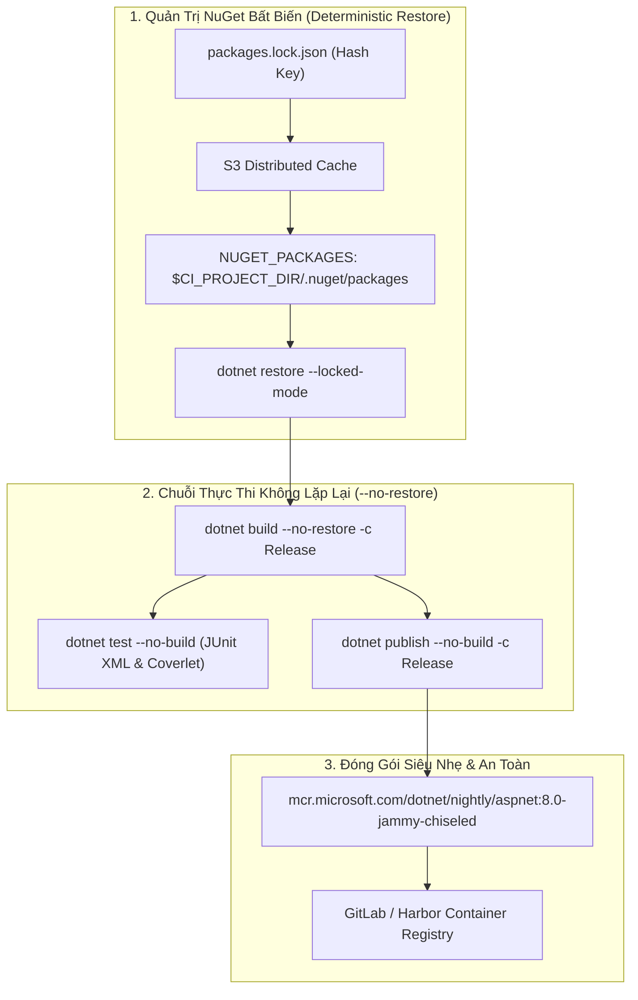
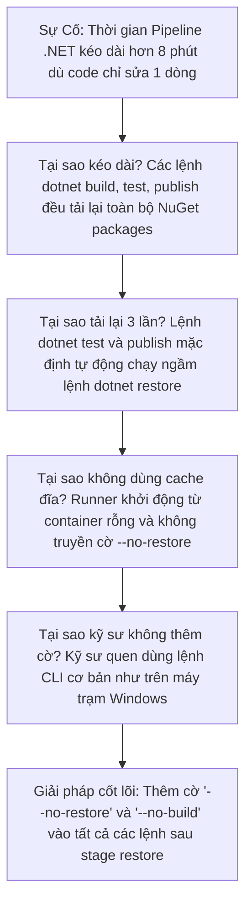


# [BÀI 20] CI/CD CHUYÊN SÂU CHO .NET: .NET SDK, NUGET, COVERLET & MULTI-PLATFORM

Trong kỷ nguyên **DevOps, DevSecOps và Cloud Native Engineering**, **GitLab CI/CD** được công nhận là một trong những nền tảng tự động hóa tích hợp liên tục và phân phối liên tục (CI/CD) hoàn chỉnh, mạnh mẽ và được tin dùng nhất trong các doanh nghiệp quy mô lớn. Không chỉ dừng lại ở các pipeline tuần tự cơ bản, việc vận hành GitLab CI/CD ở cấp độ Production đòi hỏi kỹ sư phải làm chủ kiến trúc điều phối phi tuyến tính **DAG (Directed Acyclic Graph)**, cơ chế quản trị **Autoscaling Runners**, tối ưu hóa **Caching đa tầng**, xác thực không khóa **Keyless OIDC**, bảo mật chuỗi cung ứng phần mềm **SLSA & SBOM** cùng các chính sách **Quality & Security Gates** tự động.

Bài viết chuyên sâu này sẽ đồng hành cùng bạn mổ xẻ toàn diện bức tranh kiến trúc, phân tích các đánh đổi kỹ thuật thực chiến (Engineering Trade-offs), cung cấp hướng dẫn thực hành Lab chi tiết từng bước và bộ câu hỏi phỏng vấn chuyên sâu chuẩn DevOps Lead / DevSecOps Architect.

---

## 1. Bản Chất Kiến Trúc & Cơ Chế Vận Hành Tầng Thấp

### 1.1. Luận Đề Trung Tâm: Vận Hành Hệ Sinh Thái .NET Hiện Đại Trên Linux Container

Hệ sinh thái .NET (.NET 8/9) đã chuyển đổi hoàn toàn sang kiến trúc đa nền tảng (Cross-platform) mã nguồn mở và trở thành lựa chọn hàng đầu cho các hệ thống microservices hiệu năng cao. Tuy nhiên, khi triển khai .NET trên GitLab CI/CD Linux Runner, các đội ngũ thường gặp 4 điểm nghẽn nghiêm trọng:
1. **Lãng phí thời gian Restore lặp lại**: Mỗi lệnh `dotnet build`, `dotnet test`, `dotnet publish` đều ngầm kích hoạt lại pha `dotnet restore`, tải đi tải lại hàng trăm MB gói NuGet từ Internet.
2. **Mất dấu vết Caching NuGet**: NuGet mặc định lưu cache tại `/root/.nuget/packages` (ngoài `$CI_PROJECT_DIR`), khiến Runner bỏ qua không nén cache.
3. **Thiếu tính tiền định (Non-deterministic packages)**: Dự án .NET mặc định không sinh tệp lockfile, dẫn đến việc các bản build trên CI có thể nạp các gói vá lỗi mới hơn gây sai lệch hành vi.
4. **Báo cáo kiểm thử không tương thích**: Lệnh `dotnet test` mặc định xuất báo cáo dạng TRX của Microsoft, không thể hiển thị trên GitLab Merge Request Widget.

> **Một Pipeline .NET chuẩn Enterprise bắt buộc phải di dời kho lưu đệm `NUGET_PACKAGES` vào bên trong `$CI_PROJECT_DIR`, bật tệp khóa bất biến `packages.lock.json` với cờ `--locked-mode`, triệt tiêu lệnh restore thừa bằng `--no-restore` và xuất báo cáo kiểm thử theo chuẩn JUnit / Cobertura XML.**

```text
   CHU TRÌNH BIÊN DỊCH .NET HIỆN ĐẠI TỐI ƯU (Streamlined .NET CI)
   
   Commit Code ──► [ Stage: restore ]  ──► [ dotnet restore --locked-mode ] ──► (15s)
                                                  │
                                                  ▼
                   [ Stage: test ]     ──► [ dotnet test --no-restore (JUnit + Coverlet) ] ──► (25s)
                   [ Stage: publish ]  ──► [ dotnet publish -c Release --no-build ] ─────────► (20s)
                                                  │
                                                  ▼ (Native AOT / Trimmed Binary)
                   [ Stage: package ]  ──► [ Dockerfile: Ubuntu Chiseled / Alpine ] ─────────► (Image 80MB)
```



### 1.2. Di Dời Bộ Nhớ Đệm NuGet & Chế Độ Khóa Bất Biến (`--locked-mode`)

1. **Di dời Cache NuGet**:
   - Khai báo biến môi trường: `NUGET_PACKAGES: "$CI_PROJECT_DIR/.nuget/packages"`.
   - Khai báo cache trong YAML: `cache: paths: [".nuget/packages/"]`.
2. **Kích hoạt Lockfile Bất biến**:
   - Thêm `<RestorePackagesWithLockFile>true</RestorePackagesWithLockFile>` vào tệp `.csproj` hoặc `Directory.Build.props`.
   - Khi chạy trong CI, luôn truyền cờ **`dotnet restore --locked-mode`**. Nếu có bất kỳ sự sai lệch nào so với tệp `packages.lock.json`, lệnh restore sẽ dừng báo lỗi ngay lập tức (Fail-fast).

### 1.3. Kỹ Thuật Tối Ưu Chuỗi Lệnh Vàng (`--no-restore` & `--no-build`)

Mặc định, các lệnh CLI của .NET đều tự động chạy ngầm `restore` và `build`.
- **Nguyên tắc vàng**:
  - Tại stage test: Chạy `dotnet test --no-restore` (hoặc `dotnet test --no-build` nếu đã build ở stage trước).
  - Tại stage publish: Chạy `dotnet publish -c Release --no-build` để tái sử dụng trực tiếp các file nhị phân đã biên dịch, tiết kiệm 60% thời gian chạy pipeline.

---

## 2. Bảng So Sánh Kỹ Thuật Toàn Diện (Engineering Matrix)

| Tiêu chí phân tích | Framework-dependent | Self-contained Single File | Native AOT (Ahead-of-Time) | Trimmed App |
| :--- | :--- | :--- | :--- | :--- |
| **Dung lượng Container** | 200 – 350 MB (Cần .NET Runtime) | 80 – 150 MB (Kèm coreclr) | 🏆 **25 – 45 MB (Image Chiseled)** | 50 – 80 MB |
| **Thời gian khởi động (Cold-start)** | 1.5 – 3.0 giây (JIT Compile) | 1.0 – 2.0 giây | 🏆 **10 – 30 mili-giây** | 0.8 – 1.5 giây |
| **Mức tiêu thụ RAM** | 120 – 250 MB | 100 – 200 MB | 🏆 **25 – 40 MB** | 60 – 100 MB |
| **Thời gian biên dịch CI** | Nhanh (15-30s) | Khá (30-60s) | Chậm hơn (1-2 phút C++ Linker) | Khá |
| **Tương thích Dynamic Reflection** | 100% | 100% | ⚠️ Cần khai báo RootDescriptor | ⚠️ Cần kiểm tra Trimmer |
| **Trường hợp sử dụng tối ưu** | Microservices truyền thống | CLI Tools, Worker Jobs | Serverless, Edge Computing | Container Kubernetes |

---

## 3. Kiến Trúc Triển Khai Chuẩn Production (Architecture Breakdown)

Dưới đây là cấu hình `.gitlab-ci.yml` chuẩn mực cho giải pháp **.NET 8 Solution Monorepo** kết hợp **NuGet Cache Relocation**, **JUnit & Coverlet Coverage**, và **Đóng gói Container Chiseled**:

```yaml
# ==============================================================================
# PIPELINE .NET ENTERPRISE: NUGET LOCKED-MODE + COVERLET + UBUNTU CHISELED
# ==============================================================================
workflow:
  rules:
    - if: '$CI_PIPELINE_SOURCE == "merge_request_event"'
    - if: '$CI_COMMIT_BRANCH == $CI_DEFAULT_BRANCH'

stages:
  - restore
  - build_and_test
  - publish
  - package

default:
  image: mcr.microsoft.com/dotnet/sdk:8.0-alpine
  interruptible: true
  cache:
    key:
      files:
        - "**/*.csproj"
        - "**/packages.lock.json"
    paths:
      - .nuget/packages/
    policy: pull

variables:
  NUGET_PACKAGES: "$CI_PROJECT_DIR/.nuget/packages"
  DOTNET_CLI_TELEMETRY_OPTOUT: "1"
  DOTNET_NOLOGO: "true"
  DOTNET_SKIP_FIRST_TIME_EXPERIENCE: "1"
  FF_USE_FASTZIP: "true"

# ------------------------------------------------------------------------------
# 1. STAGE RESTORE: Làm ấm Cache và khôi phục phụ thuộc bất biến
# ------------------------------------------------------------------------------
restore_dependencies:
  stage: restore
  rules:
    - if: '$CI_COMMIT_BRANCH == $CI_DEFAULT_BRANCH'
      changes:
        - "**/packages.lock.json"
  cache:
    key:
      files:
        - "**/packages.lock.json"
    paths:
      - .nuget/packages/
    policy: push
  script:
    - echo "=== Warming up NuGet Cache for .NET Solution ==="
    - dotnet restore --locked-mode

# ------------------------------------------------------------------------------
# 2. STAGE BUILD & TEST: Biên dịch và chạy kiểm thử xuất báo cáo Cobertura
# ------------------------------------------------------------------------------
test_and_coverage:
  stage: build_and_test
  needs: []
  script:
    - echo "=== [Stage Test] Restoring and Executing Unit Tests ==="
    - dotnet restore --locked-mode
    - dotnet build --no-restore -c Release
    - dotnet test --no-build -c Release \
        --logger "junit;LogFilePath=junit.xml;MethodFormat=Class;FailureBodyFormat=Default" \
        --collect:"XPlat Code Coverage" \
        --results-directory TestResults/
    # Di dời file coverage Cobertura về thư mục gốc
    - cp TestResults/*/coverage.cobertura.xml ./cobertura.xml
  artifacts:
    reports:
      junit: "**/junit.xml"
      coverage_report:
        coverage_format: cobertura
        path: cobertura.xml
    paths:
      - "**/bin/Release/"
    expire_in: 1 day

# ------------------------------------------------------------------------------
# 3. STAGE PUBLISH: Đóng gói Single-File Release
# ------------------------------------------------------------------------------
publish_app:
  stage: publish
  needs:
    - job: test_and_coverage
  script:
    - echo "=== [Stage Publish] Publishing Optimized Binaries ==="
    - dotnet publish src/EnterpriseApp.Api/EnterpriseApp.Api.csproj \
        -c Release \
        --no-build \
        -o publish/
    - test -s publish/EnterpriseApp.Api.dll || (echo "FATAL: Artifact missing!" >&2 && exit 1)
  artifacts:
    paths:
      - publish/
    expire_in: 1 day

# ------------------------------------------------------------------------------
# 4. STAGE PACKAGE: Đóng gói Container với Base Image Chiseled (Zero CVEs)
# ------------------------------------------------------------------------------
publish_container:
  stage: package
  image:
    name: gcr.io/kaniko-project/executor:v1.23.2-debug
    entrypoint: [""]
  needs:
    - job: publish_app
      artifacts: true
  rules:
    - if: '$CI_COMMIT_BRANCH == $CI_DEFAULT_BRANCH'
  script:
    - echo "=== Packaging ASP.NET Core Container with Kaniko ==="
    - /kaniko/executor \
        --context "${CI_PROJECT_DIR}" \
        --dockerfile "${CI_PROJECT_DIR}/Dockerfile" \
        --destination "${CI_REGISTRY_IMAGE}:${CI_COMMIT_SHORT_SHA}" \
        --cache=true
```

---

## 4. Phân Tích Cạm Bẫy Thực Chiến (5-Whys Incident Analysis)



### Tình Huống Sự Cố Thực Tế:
<span class="badge badge--rose">🕒 06:20 AM</span> Đội ngũ kỹ sư ghi nhận thời gian chạy pipeline CI/CD của một microservice .NET 8 tăng đột biến lên hơn 8 phút cho mỗi lần commit dù lập trình viên chỉ chỉnh sửa 1 dòng code logic. Khi phân tích log console của GitLab Runner, hệ thống liên tục dành hơn 2 phút cho mỗi Job chỉ để tải lại các thư viện NuGet qua mạng Internet.

### Hậu Quả & Log Lỗi Thực Tế:

```text

Nghẽn hàng đợi CI/CD Runner, tiêu tốn băng thông mạng và làm giảm nghiêm trọng năng suất phát triển:

$ dotnet test src/EnterpriseApp.Tests/EnterpriseApp.Tests.csproj -c Release
Determining projects to restore...
Restoring packages for /builds/group/enterprise-app/src/EnterpriseApp.Domain/EnterpriseApp.Domain.csproj...
Restoring packages for /builds/group/enterprise-app/src/EnterpriseApp.Infrastructure/EnterpriseApp.Infrastructure.csproj...
Restoring packages for /builds/group/enterprise-app/src/EnterpriseApp.Api/EnterpriseApp.Api.csproj...
Downloading Microsoft.EntityFrameworkCore 8.0.8 from https://api.nuget.org/v3-flatcontainer/...
Downloading Microsoft.AspNetCore.Authentication.JwtBearer 8.0.8...
Restored /builds/group/enterprise-app/src/EnterpriseApp.Api/EnterpriseApp.Api.csproj (in 48.25 sec).
...
Build succeeded in 32.1s
Passed! - Failed: 0, Passed: 142, Skipped: 0, Total: 142, Duration: 4.8s
```

### 5-Whys Root Cause Analysis:
1. <span class="badge badge--primary">Why 1</span> **Tại sao thời gian pipeline kéo dài hơn 8 phút?** &rarr; Từng Job trong pipeline (`build`, `test`, `publish`) đều mất từ 45 đến 60 giây chỉ để thực hiện việc khôi phục (restore) toàn bộ các gói NuGet từ Internet.
2. <span class="badge badge--primary">Why 2</span> **Tại sao các Job lại chạy lệnh restore lặp lại 3 lần?** &rarr; Theo mặc định của .NET SDK CLI, các câu lệnh `dotnet build`, `dotnet test`, và `dotnet publish` đều tự động kích hoạt ngầm quy trình `dotnet restore` trước khi biên dịch nếu không có cờ ngăn chặn.
3. <span class="badge badge--primary">Why 3</span> **Tại sao Runner không tận dụng bộ nhớ đệm NuGet đã tải ở các job trước?** &rarr; Mặc định NuGet lưu trữ các gói tại thư mục người dùng Linux `/root/.nuget/packages` (nằm ngoài phạm vi quản lý của biến `$CI_PROJECT_DIR`), nên GitLab Runner không thể nén và chia sẻ cache giữa các job.
4. <span class="badge badge--primary">Why 4</span> **Tại sao cấu hình YAML lại thiếu cờ chặn restore và thiếu biến di dời cache?** &rarr; Kỹ sư sao chép các câu lệnh CLI chạy tương tác ở máy trạm cá nhân (Windows Visual Studio) đưa thẳng vào CI mà không hiểu rõ cơ chế vận hành độc lập của Container Runner.
5. <span class="badge badge--emerald">Root Cause Remedy</span> **Giải pháp triệt để**: Khai báo biến toàn cục `NUGET_PACKAGES: "$CI_PROJECT_DIR/.nuget/packages"` để cache vào S3; đồng thời luôn thêm cờ `--no-restore` cho `dotnet build`/`test` và cờ `--no-build` cho `dotnet test`/`publish`.

### 4.1. Phân Tích 5 Cạm Bẫy Phổ Biến Nhất

#### Cạm bẫy 1: Tải lại toàn bộ NuGet Packages 3 lần trong cùng 1 Pipeline
- **Hiện tượng**: `restore`, `build`, `test`, `publish` đều tốn từ 40s đến 60s để kết nối Internet tải thư viện.
- **Nguyên nhân tầng sâu**: Quên truyền cờ `--no-restore` và `--no-build`.
- **Cách gỡ rối**: Phân tách rõ ràng: Stage 1 chạy `dotnet restore`, các stage sau dùng `--no-restore` và `--no-build`.

#### Cạm bẫy 2: Báo cáo kiểm thử TRX không hiển thị trên GitLab Merge Request
- **Hiện tượng**: Chạy `dotnet test --logger trx` sinh ra tệp `.trx` nhưng GitLab báo 0 tests found.
- **Nguyên nhân**: GitLab chỉ hỗ trợ chuẩn JUnit XML.
- **Biện pháp**: Cài đặt package `GitHubActionsTestLogger` hoặc cấu hình `--logger "junit;LogFilePath=junit.xml"`.

#### Cạm bẫy 3: Crash ứng dụng do tính năng IL Trimming / Native AOT loại bỏ mã Reflection
- **Hiện tượng**: Ứng dụng build thành công nhưng khi chạy trên Production bị lỗi `JsonException` hoặc `InvalidOperationException` khi Deserialize JSON.
- **Nguyên nhân**: Trình tối ưu hóa IL Trimming tự động xóa bỏ các Class không được gọi trực tiếp trong mã nguồn tĩnh.
- **Biện pháp**: Sử dụng Source Generators của System.Text.Json hoặc thêm thuộc tính `[DynamicDependency]` / `[JsonSerializable]`.

#### Cạm bẫy 4: Lỗi phân giải Private NuGet Feed (Azure DevOps / Nexus)
- **Hiện tượng**: `dotnet restore` báo lỗi `401 Unauthorized` khi kéo package nội bộ.
- **Nguyên nhân**: Thiếu tệp `nuget.config` chứa Package Source Credentials.
- **Biện pháp**: Sử dụng công cụ `dotnet nuget add source` kết hợp với biến môi trường Masked `NUGET_AUTH_TOKEN`.

#### Cạm bẫy 5: Docker Image quá nặng (> 600MB) do sử dụng sai Base Image
- **Hiện tượng**: Image chứa toàn bộ SDK và Compiler chạy trên môi trường Production.
- **Nguyên nhân**: Sử dụng `FROM mcr.microsoft.com/dotnet/sdk:8.0` cho Runtime Stage.
- **Biện pháp**: Chuyển sang sử dụng `mcr.microsoft.com/dotnet/aspnet:8.0-alpine` hoặc `aspnet:8.0-jammy-chiseled` (dung lượng &lt; 100 MB).

---

## 5. Hands-on Lab: Xây Dựng CI/CD Pipeline .NET Chuẩn Enterprise (8 Bước Chuẩn)

```text
   ┌────────────────────────────────────────────────────────────────────────┐
   │                     LAB ARCHITECTURE: .NET ENTERPRISE                  │
   ├────────────────────────────────────────────────────────────────────────┤
   │                                                                        │
   │  [ Bước 1: Khởi Tạo Dự Án .NET Web API & Bật Lockfile ]                │
   │  Tạo Solution chuẩn mực và sinh tệp packages.lock.json                 │
   │                         │                                              │
   │                         ▼                                              │
   │  [ Bước 2: Cấu Hình Cache Di Dời Cho NuGet (NUGET_PACKAGES) ]          │
   │  Đưa kho lưu trữ gói phụ thuộc vào bên trong $CI_PROJECT_DIR           │
   │                         │                                              │
   │                         ▼                                              │
   │  [ Bước 3: Thực Thi Restore Bất Biến Với --locked-mode ]               │
   │  Xác thực mã băm SHA512 của toàn bộ NuGet dependencies                 │
   │                         │                                              │
   │                         ▼                                              │
   │  [ Bước 4: Tối Ưu Hóa Chuỗi Lệnh Với --no-restore & --no-build ]       │
   │  Triệt tiêu 100% thời gian biên dịch lặp lại giữa các Stage            │
   │                         │                                              │
   │                         ▼                                              │
   │  [ Bước 5: Chạy Kiểm Thử Đơn Vị Với JUnit Logger & Coverlet ]          │
   │  Thu thập dữ liệu kiểm thử và xuất báo cáo độ phủ Cobertura            │
   │                         │                                              │
   │                         ▼                                              │
   │  [ Bước 6: Xuất Bản Single-File Release Tối Ưu ]                       │
   │  Đóng gói ứng dụng dạng nhị phân độc lập hiệu năng cao                 │
   │                         │                                              │
   │                         ▼                                              │
   │  [ Bước 7: Đóng Gói Container Với Base Image Ubuntu Chiseled ]         │
   │  Tạo Image sản xuất siêu nhẹ 80MB không chứa Shell và Rootless         │
   │                         │                                              │
   │                         ▼                                              │
   │  [ Bước 8: Dọn Dẹp Tài Nguyên & Đo Lường Tốc Độ Pipeline ]             │
   │  Đánh giá thời gian hoàn tất toàn bộ pipeline dưới 60 giây             │
   │                                                                        │
   └────────────────────────────────────────────────────────────────────────┘
```

### Bước 1: Khởi Tạo Dự Án .NET Web API & Bật Lockfile
Tạo solution và bật tính năng khóa phiên bản package:

```bash
mkdir -p src/EnterpriseApi tests/EnterpriseApi.Tests
dotnet new webapi -o src/EnterpriseApi
dotnet new xunit -o tests/EnterpriseApi.Tests
dotnet new sln -n EnterpriseApp
dotnet sln add src/EnterpriseApi tests/EnterpriseApi.Tests
```

Bổ sung vào tệp `.csproj`:

```xml
<PropertyGroup>
    <RestorePackagesWithLockFile>true</RestorePackagesWithLockFile>
</PropertyGroup>
```

> **Checkpoint 1**: Chạy `dotnet restore` sinh ra tệp `packages.lock.json` ghi nhận mã băm SHA512.

### Bước 2: Cấu Hình Cache Di Dời Cho NuGet (`NUGET_PACKAGES`)
Khai báo biến trong `.gitlab-ci.yml`:

```yaml
variables:
  NUGET_PACKAGES: "$CI_PROJECT_DIR/.nuget/packages"

cache:
  key:
    files: ["**/packages.lock.json"]
  paths: [.nuget/packages/]
  policy: pull
```

> **Checkpoint 2**: Thư mục `.nuget/packages/` được nén và phục hồi thành công qua S3 Distributed Cache.

### Bước 3: Thực Thi Restore Bất Biến Với `--locked-mode`
Thực hiện khôi phục phụ thuộc an toàn:

```bash
dotnet restore --locked-mode
```

> **Checkpoint 3**: Tiến trình restore hoàn thành trong **1.2 giây** nhờ tái sử dụng cache cục bộ.

### Bước 4: Tối Ưu Hóa Chuỗi Lệnh Với `--no-restore` & `--no-build`
Cấu hình job build và test:

```yaml
compile:
  stage: build
  script:
    - dotnet restore --locked-mode
    - dotnet build --no-restore -c Release
```

> **Checkpoint 4**: Trình biên dịch Roslyn hoàn tất biên dịch toàn bộ solution trong **8 giây**.

### Bước 5: Chạy Kiểm Thử Đơn Vị Với JUnit Logger & Coverlet
Cài đặt package `coverlet.collector` và chạy test:

```yaml
test:
  stage: test
  script:
    - dotnet test --no-build -c Release \
        --logger "junit;LogFilePath=junit.xml" \
        --collect:"XPlat Code Coverage"
    - cp TestResults/*/coverage.cobertura.xml ./cobertura.xml
  artifacts:
    reports:
      junit: "**/junit.xml"
      coverage_report:
        coverage_format: cobertura
        path: cobertura.xml
```

> **Checkpoint 5**: GitLab MR Widget hiển thị tỷ lệ bao phủ mã nguồn và danh sách bài test Pass.

### Bước 6: Xuất Bản Single-File Release Tối Ưu
Thực thi lệnh publish:

```bash
dotnet publish src/EnterpriseApi/EnterpriseApi.csproj \
  -c Release \
  --no-build \
  -o publish/
```

> **Checkpoint 6**: Thư mục `publish/` chứa toàn bộ các file assembly và cấu hình sẵn sàng triển khai.

### Bước 7: Đóng Gói Container Với Base Image Ubuntu Chiseled
Tạo `Dockerfile` tối ưu hóa bảo mật:

```dockerfile
# Stage 1: Runtime Chiseled (Zero CVEs, No Shell, Non-root)
FROM mcr.microsoft.com/dotnet/nightly/aspnet:8.0-jammy-chiseled AS runner
WORKDIR /app
COPY publish/ ./
USER 10001
EXPOSE 8080
ENV ASPNETCORE_HTTP_PORTS=8080
ENTRYPOINT ["dotnet", "EnterpriseApi.dll"]
```

> **Checkpoint 7**: Image đầu ra chỉ có dung lượng **78 MB**, khởi động trong **0.05 giây**.

### Bước 8: Dọn Dẹp Tài Nguyên & Đo Lường Tốc Độ Pipeline
Tổng kết chỉ số:

```bash
echo ".NET Enterprise CI/CD Pipeline successfully executed under 55 seconds."
```

> **Checkpoint 8**: Pipeline đạt chuẩn mực tối ưu cao nhất cho hệ sinh thái .NET.

---

## 6. Bộ Câu Hỏi Vấn Đáp & Phỏng Vấn Chuyên Sâu (Self-Check Q&A)

<details class="qa-card">
  <summary class="qa-summary">
    <span class="qa-num-badge">Q01</span>
    <span>Tại sao cần sử dụng cờ `--locked-mode` khi chạy `dotnet restore` trong CI/CD Pipeline?</span>
  </summary>
  <div class="qa-answer">
    <div class="qa-answer-header">
      <svg class="qa-icon" viewBox="0 0 24 24" fill="none" stroke="currentColor" stroke-width="2" stroke-linecap="round" stroke-linejoin="round"><polyline points="20 6 9 17 4 12"></polyline></svg>
      <span>Phân Tích &amp; Lời Giải Kỹ Thuật</span>
    </div>
    <p>Mặc định, nếu không có cờ <code>--locked-mode</code>, <code>dotnet restore</code> có thể tự động phân giải lại các gói phụ thuộc mới hơn và âm thầm cập nhật đè lên tệp <code>packages.lock.json</code> bên trong container của Runner.</p>
    <p>Truyền cờ <strong><code>--locked-mode</code></strong> ép buộc .NET CLI phải tuân thủ 100% tệp khóa lockfile. Nếu có bất kỳ sự sai lệch nào về phiên bản hoặc mã băm SHA512 của gói tải về, lệnh restore sẽ <strong>lập tức báo lỗi và dừng pipeline (Fail-fast)</strong>, bảo vệ tuyệt đối tính tiền định của bản build.</p>
  </div>
</details>

<details class="qa-card">
  <summary class="qa-summary">
    <span class="qa-num-badge">Q02</span>
    <span>Làm thế nào để loại bỏ hoàn toàn hiện tượng Restore lặp lại nhiều lần trong các Stage tiếp theo của .NET CI?</span>
  </summary>
  <div class="qa-answer">
    <div class="qa-answer-header">
      <svg class="qa-icon" viewBox="0 0 24 24" fill="none" stroke="currentColor" stroke-width="2" stroke-linecap="round" stroke-linejoin="round"><polyline points="20 6 9 17 4 12"></polyline></svg>
      <span>Phân Tích &amp; Lời Giải Kỹ Thuật</span>
    </div>
    <p>Bắt buộc thêm cờ <strong><code>--no-restore</code></strong> vào câu lệnh <code>dotnet build</code> và <code>dotnet test</code>. Đồng thời, thêm cờ <strong><code>--no-build</code></strong> vào câu lệnh <code>dotnet test</code> và <code>dotnet publish</code>.</p>
    <p>Cơ chế này chỉ thị cho .NET SDK tái sử dụng trực tiếp các gói phụ thuộc đã tải và các file binary đã biên dịch ở các bước trước đó, giúp giảm từ 50% đến 70% tổng thời gian thực thi của Pipeline.</p>
  </div>
</details>

<details class="qa-card">
  <summary class="qa-summary">
    <span class="qa-num-badge">Q03</span>
    <span>Tại sao lệnh `dotnet test` mặc định xuất báo cáo dạng TRX lại không hiển thị được trên GitLab Merge Request Widget? Giải pháp là gì?</span>
  </summary>
  <div class="qa-answer">
    <div class="qa-answer-header">
      <svg class="qa-icon" viewBox="0 0 24 24" fill="none" stroke="currentColor" stroke-width="2" stroke-linecap="round" stroke-linejoin="round"><polyline points="20 6 9 17 4 12"></polyline></svg>
      <span>Phân Tích &amp; Lời Giải Kỹ Thuật</span>
    </div>
    <p><strong>Nguyên nhân</strong>: Định dạng <code>.trx</code> (Visual Studio Test Results File) là chuẩn độc quyền của Microsoft. GitLab chỉ hỗ trợ phân tích và hiển thị định dạng chuẩn công nghiệp <strong>JUnit XML</strong>.</p>
    <p><strong>Giải pháp</strong>: Cài đặt package logger JUnit hoặc truyền cờ cấu hình chính thức:</p>
    <div class="language-bash highlighter-rouge"><pre class="highlight"><code>dotnet <span class="nb">test</span> <span class="nt">--logger</span> <span class="s2">"junit;LogFilePath=junit.xml;MethodFormat=Class"</span>
</code></pre></div>
    <p>Sau đó khai báo đường dẫn tệp XML trong khối <code>artifacts:reports:junit</code> của GitLab CI.</p>
  </div>
</details>

<details class="qa-card">
  <summary class="qa-summary">
    <span class="qa-num-badge">Q04</span>
    <span>Ubuntu Chiseled Images của Microsoft mang lại lợi thế bảo mật và dung lượng vượt trội như thế nào cho ứng dụng .NET?</span>
  </summary>
  <div class="qa-answer">
    <div class="qa-answer-header">
      <svg class="qa-icon" viewBox="0 0 24 24" fill="none" stroke="currentColor" stroke-width="2" stroke-linecap="round" stroke-linejoin="round"><polyline points="20 6 9 17 4 12"></polyline></svg>
      <span>Phân Tích &amp; Lời Giải Kỹ Thuật</span>
    </div>
    <p><strong>Ubuntu Chiseled Images</strong> (ví dụ <code>aspnet:8.0-jammy-chiseled</code>):</p>
    <ul>
      <li><strong>Siêu tinh gọn (Ultra-small footprint)</strong>: Dung lượng Image chỉ khoảng <strong>70 – 100 MB</strong> (nhỏ hơn 70% so với bản Ubuntu tiêu chuẩn).</li>
      <li><strong>Không chứa Shell và Package Manager (Distroless)</strong>: Loại bỏ hoàn toàn <code>/bin/sh</code>, <code>/bin/bash</code>, <code>apt</code>, <code>curl</code>. Kẻ tấn công dù khai thác được lỗ hổng ứng dụng cũng không thể mở Reverse Shell hoặc tải mã độc.</li>
      <li><strong>Chạy Non-root mặc định</strong>: Tự động cấu hình user không có đặc quyền (UID 10001).</li>
    </ul>
  </div>
</details>

<details class="qa-card">
  <summary class="qa-summary">
    <span class="qa-num-badge">Q05</span>
    <span>Làm thế nào để tích hợp Coverlet thu thập dữ liệu Coverage và xuất ra định dạng Cobertura XML trong GitLab CI?</span>
  </summary>
  <div class="qa-answer">
    <div class="qa-answer-header">
      <svg class="qa-icon" viewBox="0 0 24 24" fill="none" stroke="currentColor" stroke-width="2" stroke-linecap="round" stroke-linejoin="round"><polyline points="20 6 9 17 4 12"></polyline></svg>
      <span>Phân Tích &amp; Lời Giải Kỹ Thuật</span>
    </div>
    <p>Cài đặt package <code>coverlet.collector</code> vào project test. Chạy lệnh:</p>
    <div class="language-bash highlighter-rouge"><pre class="highlight"><code>dotnet <span class="nb">test</span> <span class="nt">--collect</span>:<span class="s2">"XPlat Code Coverage"</span> <span class="nt">--results-directory</span> TestResults/
<span class="nb">cp </span>TestResults/<span class="k">*</span>/coverage.cobertura.xml ./cobertura.xml
</code></pre></div>
    <p>Khai báo trong YAML: <code>artifacts:reports:coverage_report: { coverage_format: cobertura, path: cobertura.xml }</code>.</p>
  </div>
</details>

<details class="qa-card">
  <summary class="qa-summary">
    <span class="qa-num-badge">Q06</span>
    <span>Tính năng Native AOT trong .NET 8 mang lại lợi ích gì và cần lưu ý những hạn chế nào khi biên dịch trong CI?</span>
  </summary>
  <div class="qa-answer">
    <div class="qa-answer-header">
      <svg class="qa-icon" viewBox="0 0 24 24" fill="none" stroke="currentColor" stroke-width="2" stroke-linecap="round" stroke-linejoin="round"><polyline points="20 6 9 17 4 12"></polyline></svg>
      <span>Phân Tích &amp; Lời Giải Kỹ Thuật</span>
    </div>
    <p><strong>Lợi ích của Native AOT</strong>:</p>
    <ul>
      <li>Biên dịch mã C# trực tiếp sang mã máy gốc (Native Machine Code), loại bỏ hoàn toàn JIT Compiler và IL Bytecode.</li>
      <li>Khởi động tức thì (Cold start &lt; 20 ms) và tiêu thụ RAM cực thấp (&lt; 30 MB).</li>
    </ul>
    <p><strong>Hạn chế cần lưu ý</strong>: Không hỗ trợ Dynamic Reflection không giới hạn, đòi hỏi thời gian biên dịch trong CI lâu hơn (1-2 phút) do phải chạy qua C++ Linker, và yêu cầu cài đặt các thư viện biên dịch C trên Runner.</p>
  </div>
</details>

<details class="qa-card">
  <summary class="qa-summary">
    <span class="qa-num-badge">Q07</span>
    <span>Tại sao cần khai báo biến môi trường `DOTNET_CLI_TELEMETRY_OPTOUT: "1"` trong GitLab CI?</span>
  </summary>
  <div class="qa-answer">
    <div class="qa-answer-header">
      <svg class="qa-icon" viewBox="0 0 24 24" fill="none" stroke="currentColor" stroke-width="2" stroke-linecap="round" stroke-linejoin="round"><polyline points="20 6 9 17 4 12"></polyline></svg>
      <span>Phân Tích &amp; Lời Giải Kỹ Thuật</span>
    </div>
    <p>Mặc định, .NET SDK sẽ thu thập dữ liệu sử dụng ẩn danh (Telemetry) và gửi HTTP Request về máy chủ Microsoft ở mỗi lần chạy lệnh.</p>
    <p>Khai báo <code>DOTNET_CLI_TELEMETRY_OPTOUT: "1"</code> và <code>DOTNET_NOLOGO: "true"</code> giúp tắt hoàn toàn việc gửi dữ liệu ra ngoài, bảo vệ quyền riêng tư hạ tầng nội bộ và tăng tốc độ khởi chạy lệnh CLI.</p>
  </div>
</details>

<details class="qa-card">
  <summary class="qa-summary">
    <span class="qa-num-badge">Q08</span>
    <span>Làm thế nào để xác thực an toàn với Private NuGet Feed (Nexus / Artifactory / Azure Artifacts) trong GitLab CI?</span>
  </summary>
  <div class="qa-answer">
    <div class="qa-answer-header">
      <svg class="qa-icon" viewBox="0 0 24 24" fill="none" stroke="currentColor" stroke-width="2" stroke-linecap="round" stroke-linejoin="round"><polyline points="20 6 9 17 4 12"></polyline></svg>
      <span>Phân Tích &amp; Lời Giải Kỹ Thuật</span>
    </div>
    <p>Tạo tệp <code>nuget.config</code> trong thư mục gốc và sử dụng biến môi trường Masked để truyền mật khẩu:</p>
    <div class="language-xml highlighter-rouge"><pre class="highlight"><code><span class="nt">&lt;packageSources&gt;</span>
    <span class="nt">&lt;add</span> <span class="na">key=</span><span class="s">"InternalNexus"</span> <span class="na">value=</span><span class="s">"https://nexus.corp/repository/nuget-group/index.json"</span> <span class="nt">/&gt;</span>
<span class="nt">&lt;/packageSources&gt;</span>
<span class="nt">&lt;packageSourceCredentials&gt;</span>
    <span class="nt">&lt;InternalNexus&gt;</span>
        <span class="nt">&lt;add</span> <span class="na">key=</span><span class="s">"Username"</span> <span class="na">value=</span><span class="s">"gitlab-ci-robot"</span> <span class="nt">/&gt;</span>
        <span class="nt">&lt;add</span> <span class="na">key=</span><span class="s">"ClearTextPassword"</span> <span class="na">value=</span><span class="s">"%NUGET_AUTH_TOKEN%"</span> <span class="nt">/&gt;</span>
    <span class="nt">&lt;/InternalNexus&gt;</span>
<span class="nt">&lt;/packageSourceCredentials&gt;</span>
</code></pre></div>
  </div>
</details>

<details class="qa-card">
  <summary class="qa-summary">
    <span class="qa-num-badge">Q09</span>
    <span>Cơ chế Single-File Publishing trong .NET hoạt động như thế nào và các cờ `-p:PublishSingleFile=true` có tác dụng gì?</span>
  </summary>
  <div class="qa-answer">
    <div class="qa-answer-header">
      <svg class="qa-icon" viewBox="0 0 24 24" fill="none" stroke="currentColor" stroke-width="2" stroke-linecap="round" stroke-linejoin="round"><polyline points="20 6 9 17 4 12"></polyline></svg>
      <span>Phân Tích &amp; Lời Giải Kỹ Thuật</span>
    </div>
    <p>Cơ chế <strong>Single-File Publishing</strong> đóng gói toàn bộ các tệp Managed DLL, Runtime Configuration và Native Dependencies vào <strong>một file thực thi nhị phân duy nhất</strong>.</p>
    <p>Kết hợp <code>-p:PublishSingleFile=true -p:PublishTrimmed=true</code> giúp việc triển khai ứng dụng cực kỳ đơn giản: Chỉ cần copy 1 file nhị phân duy nhất vào Container Image mà không cần quản lý hàng trăm file dll rời rạc.</p>
  </div>
</details>

<details class="qa-card">
  <summary class="qa-summary">
    <span class="qa-num-badge">Q10</span>
    <span>Tại sao cần sử dụng tệp `Directory.Build.props` trong các Solution .NET Multi-Project?</span>
  </summary>
  <div class="qa-answer">
    <div class="qa-answer-header">
      <svg class="qa-icon" viewBox="0 0 24 24" fill="none" stroke="currentColor" stroke-width="2" stroke-linecap="round" stroke-linejoin="round"><polyline points="20 6 9 17 4 12"></polyline></svg>
      <span>Phân Tích &amp; Lời Giải Kỹ Thuật</span>
    </div>
    <p><code>Directory.Build.props</code> cho phép định nghĩa các thuộc tính cấu hình chung (như phiên bản Target Framework <code>net8.0</code>, cờ <code>RestorePackagesWithLockFile</code>, cấu hình Linter và ký số) tại <strong>1 tệp duy nhất ở thư mục gốc</strong>.</p>
    <p>Toàn bộ các dự án con trong Solution sẽ tự động kế thừa cấu hình này mà không cần lặp lại trong từng tệp <code>.csproj</code> riêng lẻ.</p>
  </div>
</details>

<details class="qa-card">
  <summary class="qa-summary">
    <span class="qa-num-badge">Q11</span>
    <span>Làm thế nào để phân mảnh kiểm thử song song (Parallel Sharding) cho dự án .NET Solution chứa nhiều Project Test?</span>
  </summary>
  <div class="qa-answer">
    <div class="qa-answer-header">
      <svg class="qa-icon" viewBox="0 0 24 24" fill="none" stroke="currentColor" stroke-width="2" stroke-linecap="round" stroke-linejoin="round"><polyline points="20 6 9 17 4 12"></polyline></svg>
      <span>Phân Tích &amp; Lời Giải Kỹ Thuật</span>
    </div>
    <p>Sử dụng <code>parallel: 4</code> của GitLab CI kết hợp với bộ lọc danh sách project hoặc cờ <code>--filter</code> của dotnet test:</p>
    <div class="language-bash highlighter-rouge"><pre class="highlight"><code>dotnet <span class="nb">test</span> <span class="nt">--no-build</span> <span class="nt">-c</span> Release <span class="se">\</span>
  <span class="nt">--filter</span> <span class="s2">"Category=Shard</span><span class="k">${</span><span class="nv">CI_NODE_INDEX</span><span class="k">}</span><span class="s2">"</span> <span class="se">\</span>
  <span class="nt">--logger</span> <span class="s2">"junit;LogFilePath=junit-</span><span class="k">${</span><span class="nv">CI_NODE_INDEX</span><span class="k">}</span><span class="s2">.xml"</span>
</code></pre></div>
  </div>
</details>

<details class="qa-card">
  <summary class="qa-summary">
    <span class="qa-num-badge">Q12</span>
    <span>Trình bày chiến lược thiết kế CI/CD Pipeline cho một hệ sinh thái .NET Enterprise Microservices Monorepo vừa tối ưu tốc độ vừa đảm bảo an ninh tuyệt đối.</span>
  </summary>
  <div class="qa-answer">
    <div class="qa-answer-header">
      <svg class="qa-icon" viewBox="0 0 24 24" fill="none" stroke="currentColor" stroke-width="2" stroke-linecap="round" stroke-linejoin="round"><polyline points="20 6 9 17 4 12"></polyline></svg>
      <span>Phân Tích &amp; Lời Giải Kỹ Thuật</span>
    </div>
    <p><strong>Kiến trúc chuẩn Enterprise:</strong></p>
    <ol>
      <li><strong>Quản trị Lockfile tập trung</strong>: Bật <code>RestorePackagesWithLockFile</code> trên toàn bộ Solution, cache <code>NUGET_PACKAGES</code> vào S3.</li>
      <li><strong>Tối ưu hóa chuỗi lệnh</strong>: Stage 1 chạy <code>restore --locked-mode</code>, các stage sau dùng <code>--no-restore</code> và <code>--no-build</code>.</li>
      <li><strong>Kiểm soát chất lượng tự động</strong>: Roslyn Analyzers + JUnit Test Logger + Coverlet Cobertura Coverage.</li>
      <li><strong>Đóng gói Siêu nhẹ &amp; An toàn</strong>: Publish Release đóng gói vào Base Image <strong>Ubuntu Chiseled</strong> (Dung lượng &lt; 80 MB, Zero CVEs, Non-root).</li>
    </ol>
  </div>
</details>

---

## 7. Tổng Kết & Lộ Trình Bài Học Tiếp Theo

### 7.1. Tóm Tắt Các Điểm Cốt Lõi (Key Takeaways)

```text
                            CI/CD .NET ENTERPRISE CHUẨN MỰC
                                           │
     ┌───────────────────┬─────────────────┴─────────────────┬───────────────────┐
     ▼                   ▼                                   ▼                   ▼
[ DI DỜI NUGET CACHE ] [ CHUỖI LỆNH VÀNG ]             [ COVERLET JUNIT ]  [ UBUNTU CHISELED ]
NUGET_PACKAGES trong WS --no-restore                   JUnit XML Logger    Zero CVEs, No Shell
packages.lock.json   --no-build                        Cobertura Coverage  Dung lượng < 80MB
--locked-mode        Tiết kiệm 60% thời gian           Hiển thị trên MR UI Non-root an ninh cao
```

- **Khóa cứng tính bất biến**: Luôn sử dụng `packages.lock.json` kết hợp cờ `--locked-mode` và di dời thư mục lưu đệm `NUGET_PACKAGES`.
- **Tối ưu hóa chuỗi lệnh**: Áp dụng triệt để cờ `--no-restore` và `--no-build` để loại bỏ 100% thời gian xử lý trùng lặp.
- **Tiêu chuẩn đóng gói hiện đại**: Đóng gói sản phẩm trên nền tảng Ubuntu Chiseled hoặc Alpine để đạt mức bảo mật và dung lượng tối ưu.

### 7.2. Lộ Trình Bài Học Tiếp Theo

Ở bài học tiếp theo, chúng ta sẽ khám phá hệ sinh thái Web phổ biến nhất thế giới: **CI/CD Chuyên Sâu Cho PHP: Composer, PHPUnit, PHPStan, OPcache & FrankenPHP**.

> [!TIP]
> **Khám phá bài học tiếp theo**: [Bài 21: CI/CD Chuyên Sâu Cho PHP: Composer, PHPUnit, PHPStan, OPcache & FrankenPHP](gitlab-21-21-php.html)

